# 3. FLUX WMS 概述

> 来源：`富勒WMS系统用户手册_V6_高清版（维他命）.pdf`，原 PDF 第 15 页起。
> 本文件按原 PDF 正文标题拆分；原文截图已提取至同目录 `assets/`。

<!-- 原 PDF 第 15 页 -->

## 3.1. 什么是仓库管理系统

- **仓库管理系统**

按著名的咨询公司 Gartner 对仓库管理系统的定义：

仓库管理系统是一个实时的计算机软件系统，能够优化业务运作的各种业务规则和运算法则 (Algorithms)，对信息、资源、行为、库存和分销运作进行管理，使其最大化满足有效产出和精确性的要求。

- **仓库管理系统的效益**

一个仓库管理系统的实施能够改进运作的效率、降低整体的成本、提高库存的准确度。潜在的节省领域包括：

  - 提高库存管理效率

库存准确度从 95%提高到 99.5%

消除冗余，库存降低 10%到 20%

降低同物理盘点相关联的成本 75%

  - 人员精简

能够提升 20%到 40%的员工作业效率（人员精简或提高每个员工的产出率）

能够提升 15%到 25%的间接员工效率（如：仓库行政人员）

  - 提高空间利用率

空间利用率提高 10%到 20%，避免或减少额外储存的费用

当然，实现最佳的效益还取决于流程、组织和技术的改进。

- **概述介绍**

本章对 FLUX WMS 的结构、界面元素等信息，进行集中介绍，帮助用户在后续阅读、系统使用过程中，能够更好的了解 WMS。

<!-- 原 PDF 第 16 页 -->

## 3.2. FLUX WMS 的系统结构

FLUX WMS V6 版本前端是 B/S 架构，后端是基于云架构的新版 WMS 操作系统。

与之前版本的 FLUX WMS 相比较，新版本在易维护、国际化、高可配置性等方面都有较大提升。

部署环境可以根据用户需要，采用公有云或私有云进行部署。

使用分布式服务框架开发，根据 WMS 的业务特征，部署的服务大致分为三大类：

  - 前端应用服务：

主要用于前端的界面显示和简单的数据读取，主要由 JSP、JAVASCRIPT、CSS 等技术进行开发。根据业务情况，拆分为基础管理、入库应用、库存应用、出库应用等。

  - 后端应用服务：

主要用于处理 WMS 实际的业务逻辑、数据库的读写操作等，通过 RPC 框架和前端应用服务进行通讯。根据业务情况，同样对服务进行了拆分，和前端应用服务对应。

  - 运维管理服务：

主要用于系统运维管理的服务。例如，监控报警、系统升级、安全防控、数据分析、定时任务、消息推送等。使得 FLUX WMS 系统的运维更方便，功能更强大。

支持多种数据库：

  - MYSQL

  - SQLSERVER

  - ORACLE

  - POSTGRESQL

FLUX WMS 能与企业各个层次的系统进行通信，从企业资源计划(ERP)系统到供应链计划、销售预测、存货订购系统以及第三方仓库管理系统中的存货控制跟踪系统。

## 3.3. 登录 FLUX WMS

  - 通过浏览器访问服务地址，例如 HTTPS://TEST3.WMSDEV.NET:18080/ （具体地址请向系统管理员获取）

  - 在登录如下界面，输入相关信息（具体输入内容，请向系统管理员获取）：

<!-- 原 PDF 第 17 页 -->

组织－登录所属组织。如果是私有云服务器，组织信息默认显示。如果是公有云服务器，有多组织结构，需要输入用户所属组织信息。

用户编号－登录用户名

用户密码－登录密码

验证码－登录动态验证码

  - 点击【进入系统】按钮，系统提示进行仓库选择

<!-- 原 PDF 第 18 页 -->

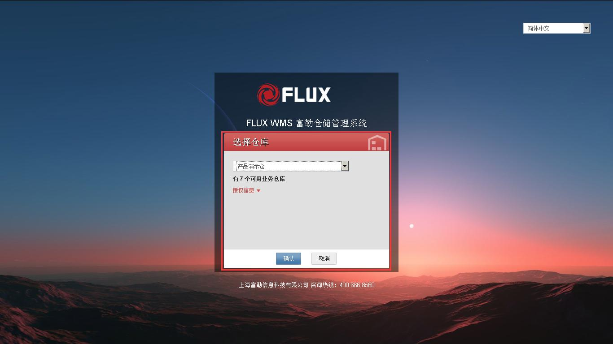

由于 FLUX WMS 支持多仓管理，因此登录时可以显示用户具有权限的仓库供选择；当用户只有单一仓库权限或无仓库权限时，登陆时无仓库选择界面，系统允许用户直接登陆到主界面。

点开提示信息展示框，可查看当前组织的授权相关信息，包括授权结束时间、授权类型、仓库数量（当前仓库使用数量/仓库设置上限）、客户数量（当前客户使用数量/客户设置上限）、注册用户数量（已注册用户数量/用户注册上限）。

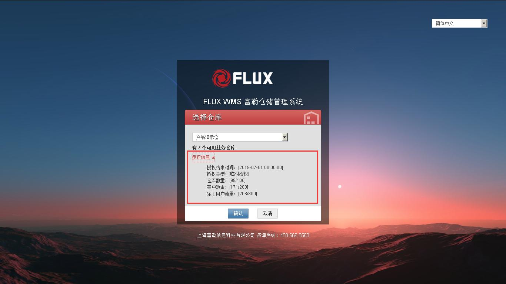

<!-- 原 PDF 第 19 页 -->

  - 点击【确认】按钮后，登录 FLUX WMS 系统，显示主界面如下

  - 缓存加载完成，鼠标点击左上角的三道杠标志位，系统显示功能主菜单：

*[图 3-3-5]（原 PDF 第 19 页，图像未能从 PDF 对象中直接提取）*

<!-- 原 PDF 第 20 页 -->

  - 点击模块菜单，进一步展开显示模块下属的功能菜单。也可通过查询方式定位所需功能。

## 3.4. FLUX WMS 的模块

为了减少功能的复杂性，FLUX WMS 系统被分成若干个较小的子模块，在系统菜单栏可以看到各个子模块。每一个子模块包含与仓库中特定操作相关的功能，在主菜单中点击菜单子模块，可展开显示对应的功能列表。以下是 FLUX WMS 的主要功能子模块。

- **业务系统管理**

系统相关初始化设置。如仓库设置、授权设置等。

- **业务系统配置**

系统相关作业配置，如系统参数、模板文件管理、导出配置等。

- **基础设置**

用于维护 FLUX WMS 的业务基本数据，包括客户、产品、批次属性、包装、装箱、系统代码等信息。这些基础设置将在后续操作中使用到。

- **仓库设置**

用于维护仓库物理信息数据，包括库区、库位、播种墙等信息。这些基础设置将在后续操作中使用到。

- **业务规则**

用于维护 FLUX WMS 处理业务时遵循的管理要求，如：上架规则、分配规则等，分别在相应业务环节生效。

- **入库操作**

入库操作包括了从收货到上架的整个过程，从业务的形态上来看，支持多种不同的收货形式和上架方式。

- **库存管理**

包括了对于在库产品进行管理的各方面功能：交易情况查询、移动库存、调整库存和库存余额查询等。

- **出库操作**

<!-- 原 PDF 第 21 页 -->

出库操作包括从订单预分配、分配到拣货、装载、发运的整个过程。支持使用多种的方式对订单进行拣选。

- **任务管理**

针对系统内全部作业任务进行管理。

- **费收**

维护所有的账目、额外的费用和费率管理。

- **系统业务日志**

系统操作日志信息，常用与异常检查。

- **二次开发管理**

提供灵活而又强大的个性化处理配置。例如自定义报表、自定义功能、自定义看板配置。

- **报表**

管理、运行、查看和打印各种管理所需报表。

- **自定义功能**

已配置的自定义功能操作。

- **自动打印**

自动打印服务管理。

FLUX 还包括其他的应用附加模块，如：

- **无线射频 RF 模块**

运行无线射频程序和对无线电频的界面进行修改。

- **标签管理**

生成、打印条形码标签以及产生新的标签。

- **交叉转运模块 Cross Dock**

其作用在于通过交叉转运中心和提供全方位服务的配送中心最大化存货的周转速度的功能。

- **归档模块 Archive**

<!-- 原 PDF 第 22 页 -->

用于对仓库中过去的操作记录另行保存，形成一个虚拟仓库，便于用户对过去的数据进行查询和总结。

其他的各个模块，有各自独立的培训教材和课程，请向 FLUX 联系，以获得最新的资料。

## 3.5. FLUX WMS 的用户界面

FLUX WMS 界面显示如下：

一部分界面元素，在不同功能中显示不同，例如字段等，但还有一部分元素，基本上每个功能都具有，在此做统一介绍。

### 3.5.1. 菜单栏

- **主菜单栏**

登录后，鼠标点击在界面左上角的“三道杠”主菜单按钮，系统显示主菜单栏。

<!-- 原 PDF 第 23 页 -->

默认显示一级功能模块，点击后展开显示功能菜单，如下图所示。

- **功能检索**

如果不能确定所需功能的上级模块，可以通过主菜单的“功能检索”来查询、定位所需功能。

<!-- 原 PDF 第 24 页 -->

输入查询内容，系统显示相关功能，点击功能名可以直接打开指定功能。

- **菜单锚定**

通常情况下，光标移动出主菜单区域后，主菜单会自动隐藏，以便用户进行业务操作。

<!-- 原 PDF 第 25 页 -->

但有时操作员可能需要频繁打开主菜单进行功能选择，此时可以通过检索框旁边的 “图钉” 按钮，将主菜单固定在界面上。如下图所示。再次点击“图钉”可取消菜单锚定。

随着菜单锚定、取消锚定，操作显示区域会随之缩放。

### 3.5.2. 系统信息

- **登录信息**

界面右上角，显示当前登录的仓库（如下图右上角的[产品演示]），和登录账号名。

<!-- 原 PDF 第 26 页 -->

- **版本信息**

在界面右上角点击信息图标，系统显示当前生效的界面方案名称（界面方案具体配置，请参考 4.13 界面方案管理部分的介绍），以及当前版本号信息。

<!-- 原 PDF 第 27 页 -->

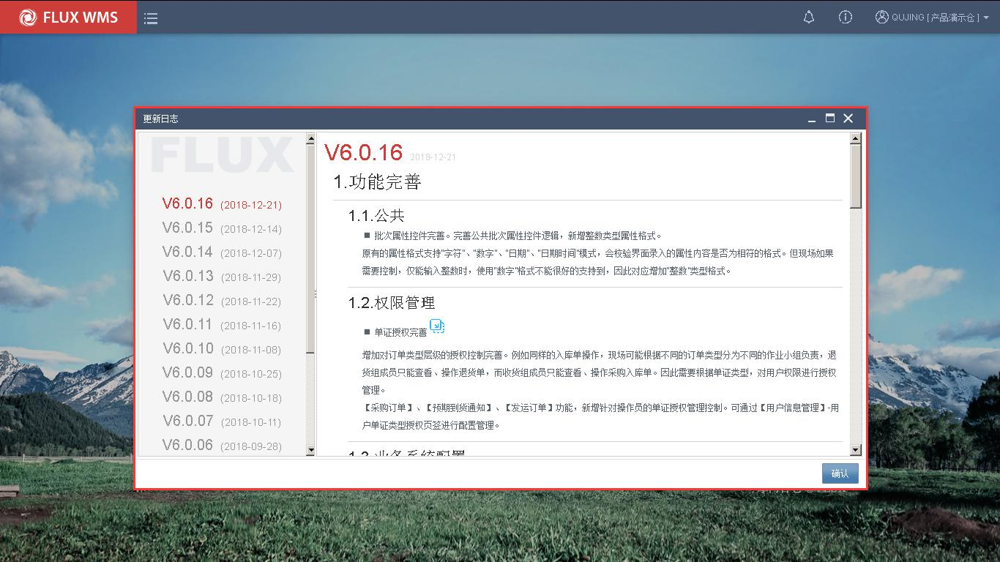

点击【版本更新内容】链接，可查看系统更新日志说明

*[图 3-5-9]（原 PDF 第 27 页，图像未能从 PDF 对象中直接提取）*

- **系统菜单**

点击登录/仓库信息，可见系统菜单。

<!-- 原 PDF 第 28 页 -->

  - 重置缓存

为提升系统作业速度，部分常用配置信息，如语言配置，声音文件等，会在登录时被缓存到当前界面。但如果此时其他用户中对相关配置信息进行修改，有可能无法及时查看。因此系统提供手动刷新缓存信息的功能，无需用户重新登录。需要提醒的是，此功能仅在特殊情况下使用，日常作业无需频繁执行。

点击【重置缓存】后，系统显示如下图的缓存加载对话框，默认全选，全部刷新。确认【重新加载】后，系统刷新缓存。如点击【取消】则返回主界面。

<!-- 原 PDF 第 29 页 -->

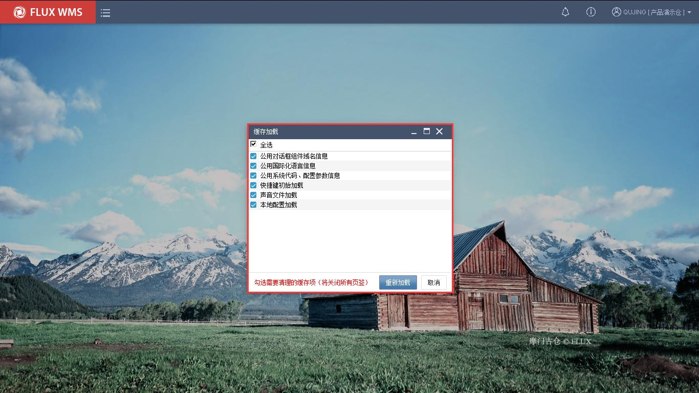

  - 本地配置

仓库作业中，有些环节需要用到每个工作台不同的设置，例如电脑配置不同的电子秤，需要提示不同的警示音避免混淆等。这类情况需要对不同电脑进行不同的设置，我们称之为“本地配置”。

图 3-5-10 的系统菜单中，点击【本地配置】功能，系统会显示本地配置界面（首次使用会有本地配置客户端插件安装提示）

<!-- 原 PDF 第 30 页 -->

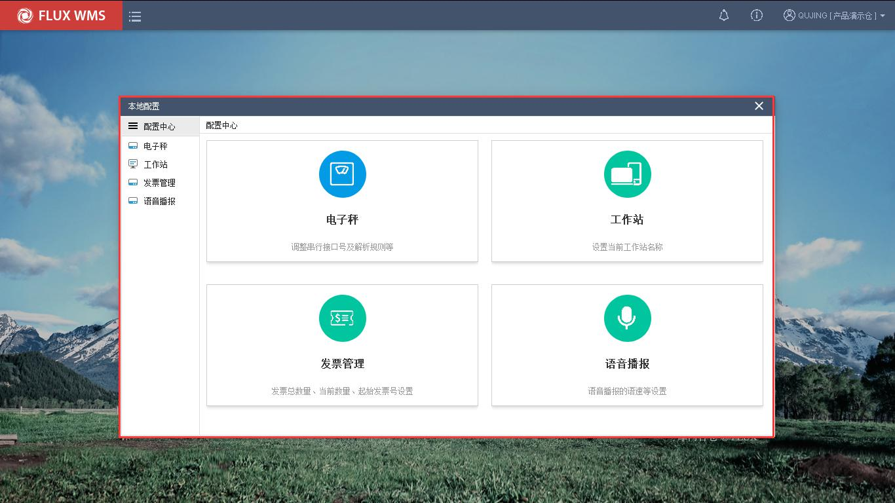

    - 电子秤

用于配置本机连接的电子秤相关配置信息。

所需信息值（如波特率等），与电子秤硬件相关，通常从硬件说明书上可以获取。

    - 工作站

不同作业台，相邻库区不同。可以配置为不同的工作站，方便精细化管理应用。

    - 发票管理

    - 语音播报

用于配置语音播报语速，方便不用作业习惯的员工使用。

  - 切换仓库

用户如有多个仓库的权限，已登录情况下，可以通过系统菜单中的【切换仓库】功能，选择其他具有权限的仓库，相应跳转，无需重新登录。

<!-- 原 PDF 第 31 页 -->

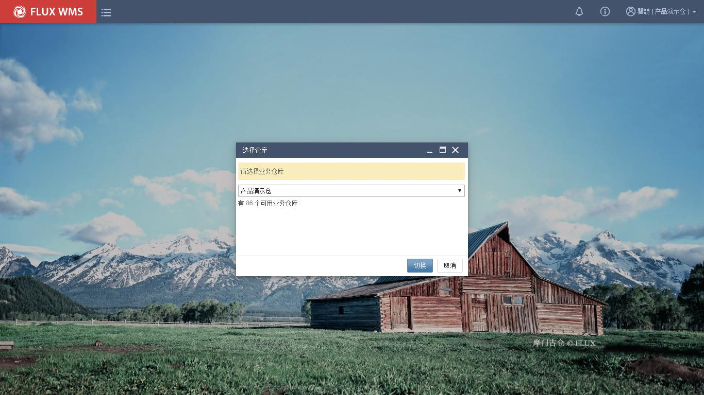

  - 进入 RF 系统

使用电脑浏览器登录 RF 系统情况下，可以从已登录的 WMS 界面，通过系统菜单的“进入 RF 系统”功能，由程序自动打开并登录 RF 系统，方便用户进行操作。

<!-- 原 PDF 第 32 页 -->

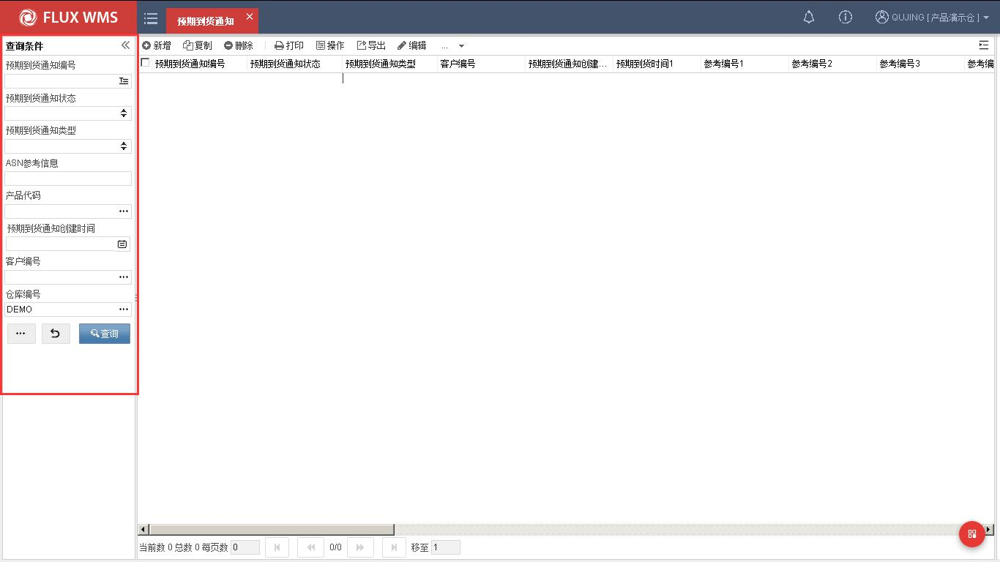

  - 退出登录

退出当前 WMS 系统，程序会记录用户的操作时间信息。

### 3.5.3. 查询界面

- **查询界面**

不同功能显示的查询条件也有所不同，输入查询条件内容，点击【查询】按钮，系统显示查询结果。

*[图 3-5-15]（原 PDF 第 32 页，图像未能从 PDF 对象中直接提取）*

点击 【重置】按钮，则清空输入的查询条件，重新录入。

【更多】按钮则进一步显示其他隐藏、自定义查询条件字段。

<!-- 原 PDF 第 33 页 -->

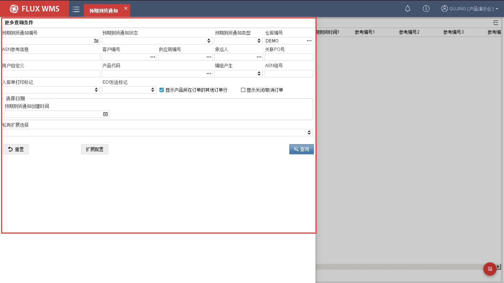

通常情况下，单据类的功能，默认为扩展查询界面，如图 3-5-7，而其他查询条件较少的功能则默认如图 3-5-6 的查询界面。具体功能默认的大、小查询界面，可以在界面方案中配置选择。

- **查询条件选项**

  - 显示关闭/取消单据

除了不同的查询条件，各个单据查询界面都有“显示关闭/取消 XX”的 checkbox：

*[图 3-5-17]（原 PDF 第 33 页，图像未能从 PDF 对象中直接提取）*

未勾选情况下，查询时默认屏蔽已关闭和已取消的 PO 单，只有勾选后才能查询到。默认情况下此字段不勾选，以免导致不必要的大数据查询。

  - 显示产品所在订单的其他订单行

*[图 3-5-18]（原 PDF 第 33 页，图像未能从 PDF 对象中直接提取）*

默认勾选，根据 SKU 查询记录后显示完整订单明细。如取消勾选，则根据产品查询条件，定位显示此产品记录，隐藏其他明细行。

<!-- 原 PDF 第 34 页 -->

### 3.5.4. 通用功能按钮

- **按钮栏**

*[图 3-5-19]（原 PDF 第 34 页，图像未能从 PDF 对象中直接提取）*

  - 新增－增加新记录

  - 复制－已有记录，复制为新记录，仅 ID 信息需要人工录入即可保存。

  - 删除－记录删除。但如果记录已被其他功能引用（例如新增的包装已经在产品档案中被使用），则无法直接删除。

  - 打印－子菜单模式，标准打印项目选择。在“数据导出规则配置”，设置为常用打印的规则，可在导出菜单中显示。

  - 操作－子菜单模式，标准操作项目选择。在操作规则中，配置为标准操作的规则，可在导出菜单中显示

  - 导出－子菜单模式，标准导出项目选择。在“数据导出规则配置”，设置为常用导出的规则，可在导出菜单中显示。

  - 编辑－点击后进入明细编辑界面

  - 子菜单选择

打印、导出、操作按钮的下拉菜单，显示已配置的操作项，每个项目还具有各自的模式选择子菜单，如下图所示，打印可选择不同的打印模式（可配置默认模式）

<!-- 原 PDF 第 35 页 -->

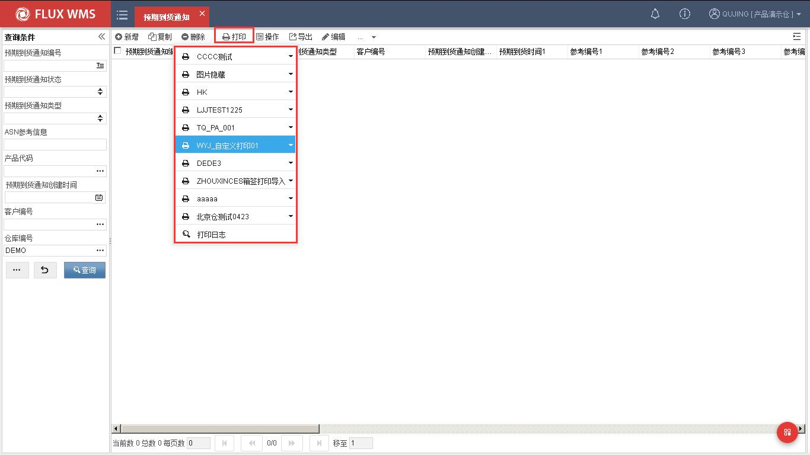

- **扩展功能**

按钮栏的扩展功能为：

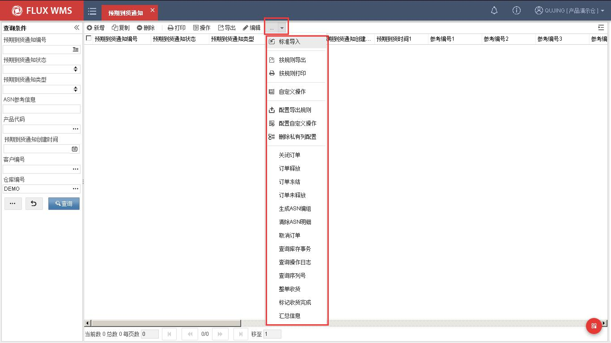

  - 标准导入－通过选择文档，批量导入、创建记录。

<!-- 原 PDF 第 36 页 -->

选择标准导入功能，系统显示如下导入对话框。

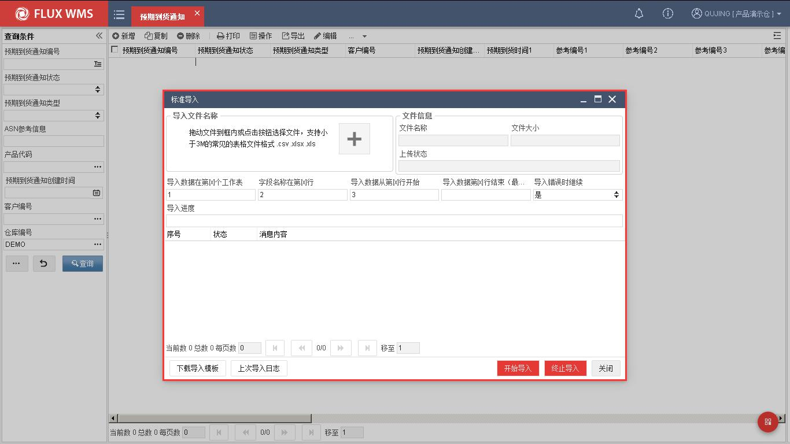

选择文件（目前支持 Excel、CSV 文件），指定导入的页签（即 Sheet，数据表）、名称行，系统导入数据。

  - 按规则导出－点击后，二级窗口显示所配置的导出规则。选择规则导出。

  - 按规则打印－点击后，二级窗口显示所配置的打印规则。选择规则执行打印。

  - 自定义操作－现场自行配置的自定义操作选择。

  - 配置导出规则－点击后进入导出规则配置界面。具体配置请参考对应专项说明。

  - 配置自定义操作－点击后进入自定义操作配置界面。具体配置请参考对应专项说明

  - 删除私有列配置－调整列表的字段显示次序、列宽等，系统会自动保存并应用。通过此功能项，可以清除个性化设置，恢复到系统默认列表显示。

  - 刷新－按查询条件重新触发查询刷新。

  - 全选－界面记录全部选择

  - 反选－已选择记录取消选择，未选择记录选中。

  - 现有数据导出－在子菜单中选择导出方式，点击后系统显示二级窗口，用户可选择字段导出为文件。

<!-- 原 PDF 第 37 页 -->

- **鼠标右键菜单**

在列表页面的窗口部分，点击鼠标右键可见右键菜单。如下为基本每个功能都具有的基础菜单，在不同功能中，还有各自不同的右键功能项，将在对应功能说明中详细介绍。

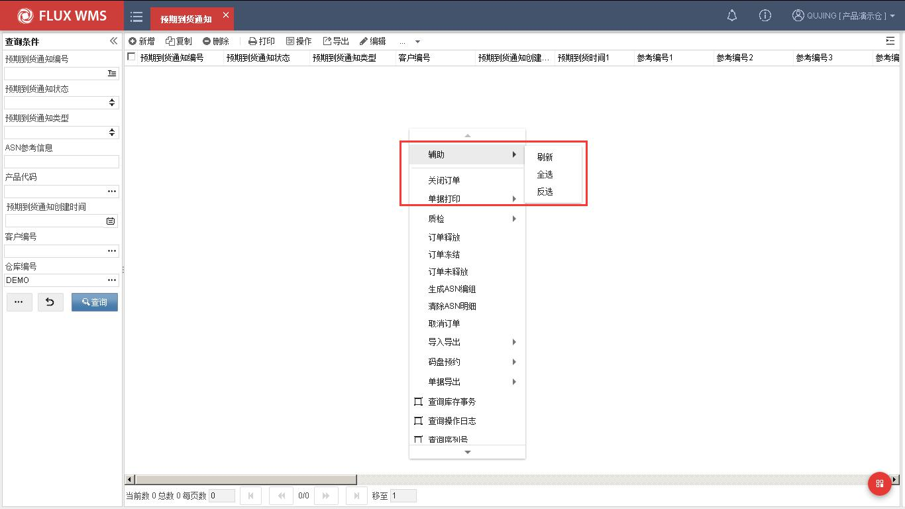

  - 辅助子菜单－较为常用的刷新、全选、反选功能，归类为辅助功能项，位于右键菜单顶部，方便用户使用。

    - 刷新－按查询条件重新触发查询刷新。

    - 全选－界面记录全部选择。

    - 反选－已选择记录取消选择，未选择记录选中。

<!-- 原 PDF 第 38 页 -->

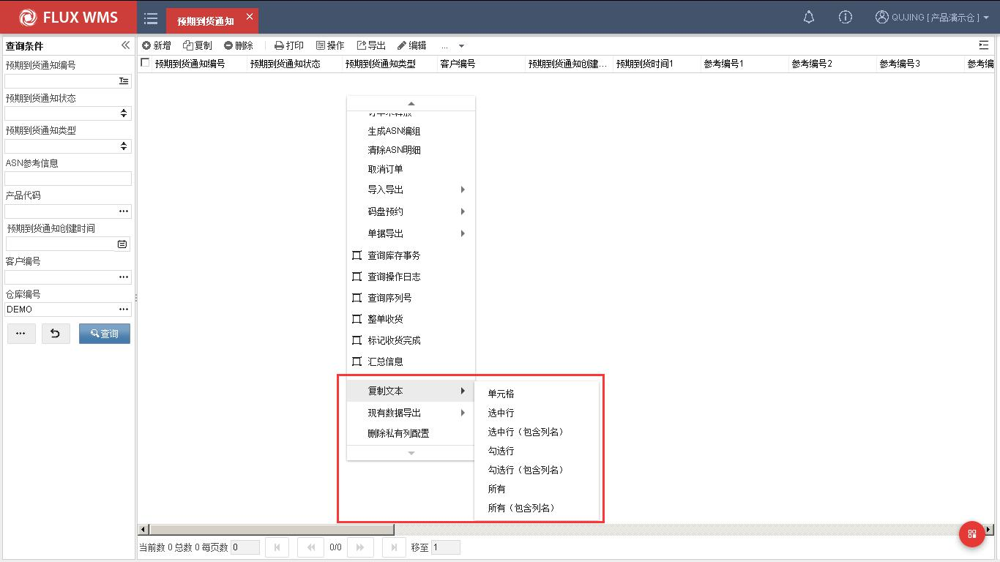

  - 复制文本子菜单

作业中有复制记录信息的需要，可以通过复制文本子菜单中的功能项进行信息复制。

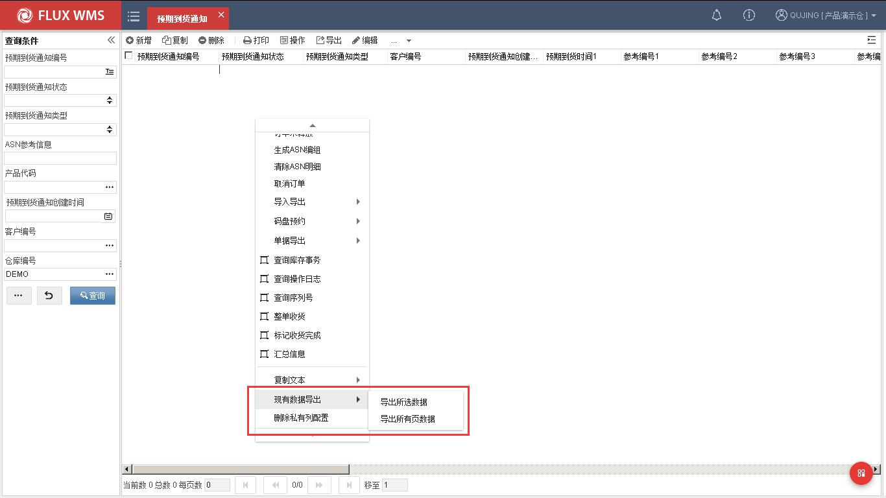

  - 现有数据导出

<!-- 原 PDF 第 39 页 -->

在子菜单中选择导出方式，点击后系统显示二级窗口，用户可选择字段导出为文件。

  - 删除私有列配置

系统支持用户根据操作习惯，调整列字段排列，并保存设置。如果需要恢复初始字段排列（如应用界面表单方案，则是恢复到方案内容），可以通过右键菜单删除个性化配置，还原显示。

需要注意的是，只有当前存在个性化配置，即私有列情况下，此右键功能才会激活、可用。

- **更多页签**

在界面右上角，有...模式的更多页签按钮，可以进一步打开其他页签，或者相关明细信息。具体内容在不同功能中显示不同。

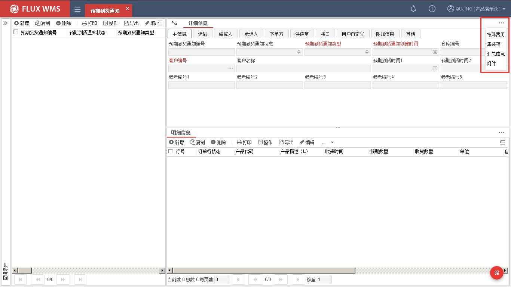

- **隐藏按钮**

查询结果界面，双击记录可以进入到明细显示界面，通过点击导航窗口的箭头按钮，可以隐藏明细界面，即返回到列表显示。

### 3.5.5. 自定义信息

在自定义页签，系统显示用户自定义、备注字段信息。

<!-- 原 PDF 第 40 页 -->

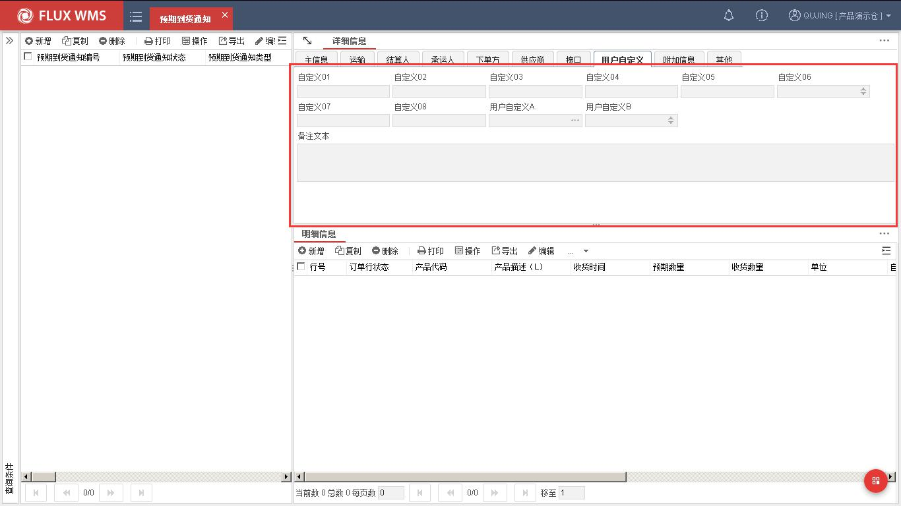

### 3.5.6. 版本信息

版本相关信息，是每个功能都具有的，其他页签中显示，每次修改保存后，版本号信息会更新。

此外，在其他页签，还显示记录新增、编辑的人员和时间信息，均为只读显示信息。

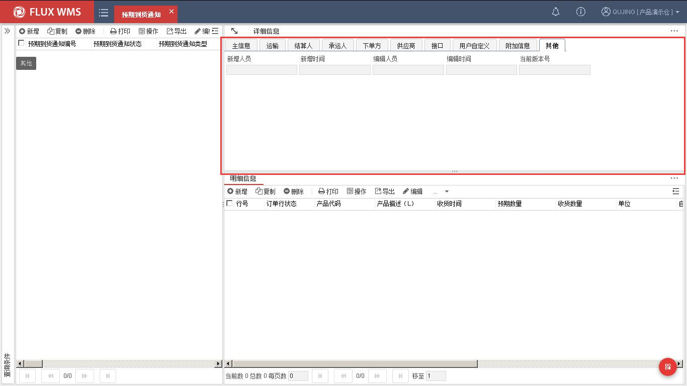
