# 4. 业务系统管理

> 来源：`富勒WMS系统用户手册_V6_高清版（维他命）.pdf`，原 PDF 第 41 页起。
> 本文件按原 PDF 正文标题拆分；原文截图已提取至同目录 `assets/`。

<!-- 原 PDF 第 41 页 -->

## 4.1. 业务系统管理概述

WMS 支持多仓综合管理，因此一些多仓通用基础设置设置内容，以及仓库管理相关的内容，集合在业务系统管理菜单中进行维护。

## 4.2. 角色信息管理

角色可以理解为某一类型的用户，或者理解为用户组，可以用来对不同用户的权限进行分类、分组管理。通过设置不同的用户角色，并给各个角色赋予不同的权限，能够快速的为新增用户配置相应权限，便于管理。

- **创建角色**

  - 选择主菜单“业务系统管理”下的“角色信息管理”。

  - 在左侧的查询条件栏位，输入查询条件，可查询已有记录。

  - 点击【新增】按钮，维护如下角色相关信息：

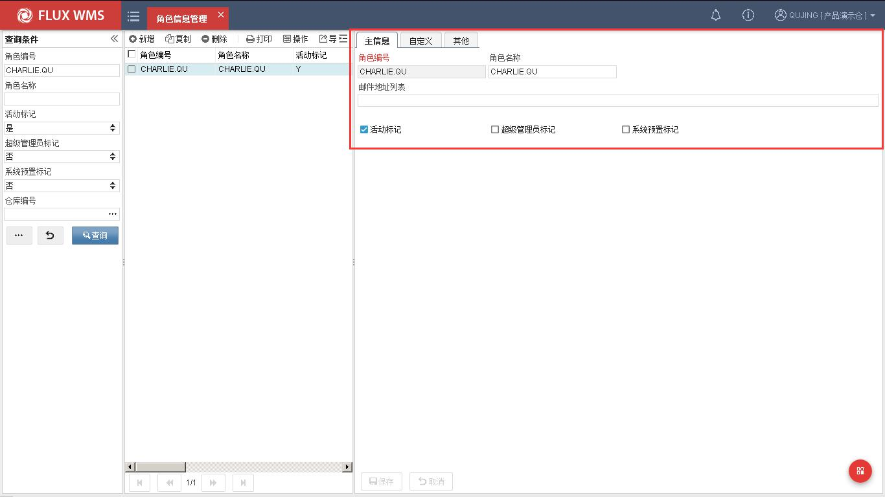

<!-- 原 PDF 第 42 页 -->

角色编号－角色 ID 代码

角色名称－角色描述

邮件地址列表－可配置多个邮件地址，通过；进行分隔

活动标记－是否使用中的记录

超级管理员标记－此角色是否为超级管理员

系统预置标记－记录是否为系统默认提供的初始化预设记录

  - 点击【保存】按钮，完成角色创建

## 4.3. 用户管理

用户，即系统操作员，凡是需要登录系统的员工，均应维护对应用户信息。同一操作账号，不可多人共用、重复登录。

### 4.3.1. 用户创建

- **选择主菜单“业务系统管理”下的“用户管理”。**

- **在左侧的查询条件栏位，输入查询条件，可查询已有记录。**

- **点击【新增】按钮，维护如下用户相关信息：**

<!-- 原 PDF 第 43 页 -->

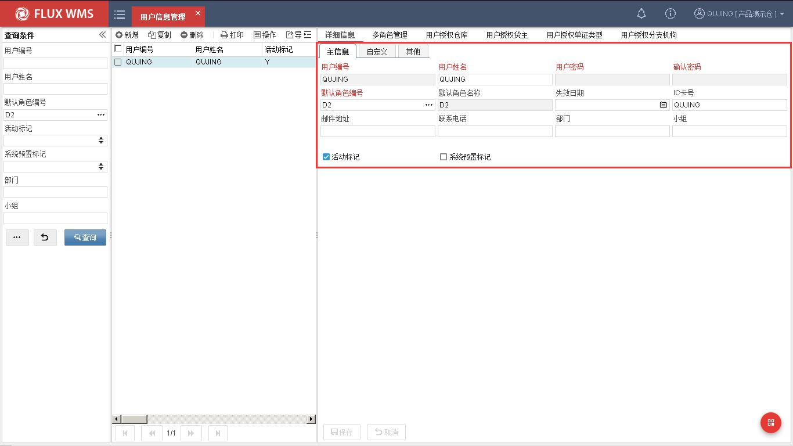

用户编号－操作员 ID

用户姓名－操作员名称。登陆后前台显示名称信息，并且保存后不可修改

用户密码－该用户的密码。保存后不可见，如需重新初始化密码，通过右键菜单功能修改。

确认密码－用户密码二次确认。

默认角色编号－用户所属角色。可点击浏览按钮在二级窗口选择已维护过的角色。

失效日期－用户有效截止日期

IC 卡号－用户工卡号码记录

邮件地址－该用户的 Email 地址

联系电话－该用户的电话记录

部门－该用户的所属部门

小组－该用户的所属小组

活动标记－是否使用中的记录

系统预置标记－记录是否为系统默认提供的初始化预设记录

<!-- 原 PDF 第 44 页 -->

- **点击【保存】按钮，完成用户创建**

### 4.3.2. 多角色维护

部分情况下，有时个别用户会需要具有多个角色的权限。例如现场分为收货组、发货组，分别创建角色，维护用户，具有不同权限。但临时有一个小组，会根据现场工作量，在收货、发货工作间进行支援，需要具有收发 2 类权限。我们可以单独为这个小组创建一个独立角色，授予更多权限，也可以为这个小组的用户设置多角色，同时具有收货角色、发货角色。

- **在多角色管理页签，点击新增按钮，新增记录，默认为主信息的用户，在多角色维护页签中，输入用户所属的角色，多个角色各自一行记录。**

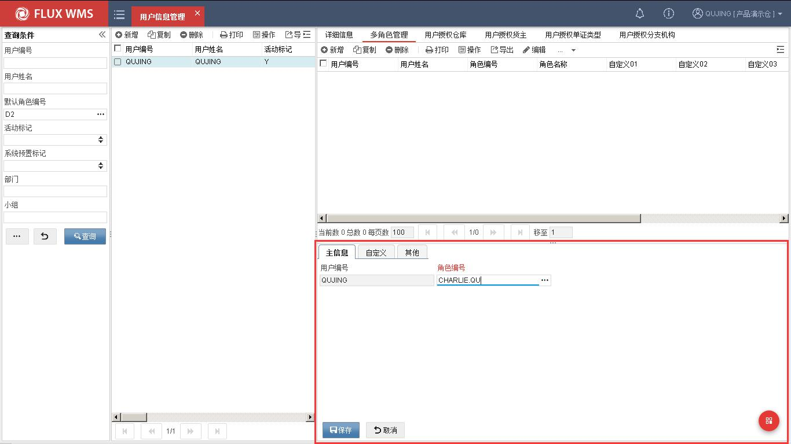

### 4.3.3. 用户授权仓库

不同用户，可以登录作业的仓库设置不同。例如北京仓的员工，只能登录北京仓库，但无权登录上海仓库进行操作。然而库存调拨管理员（非 ERP 管理情况下）则需要查看到北京、上海仓库的库存情况。

通常情况下，跨仓角色，不会负责具体的收发货等实际操作，此类控制会在功能权限环节控制。但对于用户可以访问的仓库，需要单独进行授权。由于用户作业的物理地点属于必备信息，因此一般不会存在用户或者角色自动具有全部仓库权限的情况，需要通过授予获得仓库操作权限。

<!-- 原 PDF 第 45 页 -->

- **用户授权仓库**

  - 针对已创建的用户，选择“用户授权仓库”页签

  - 点击页签内的【新增】按钮，为当前用户指定可登录的仓库

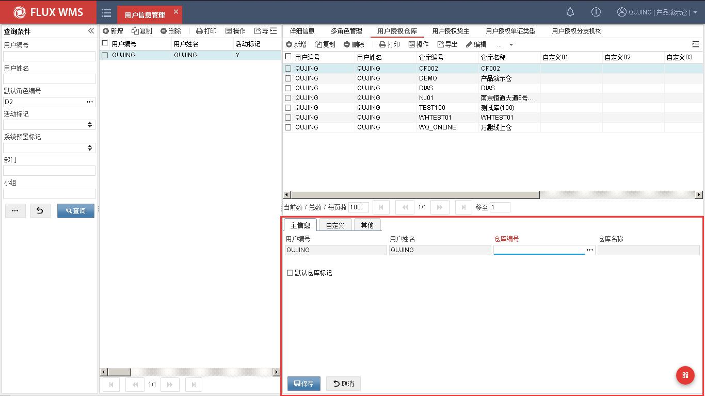

  - 点击【保存】按钮，完成此仓库的授权。

### 4.3.4. 用户授权货主

不同用户，可以进行操作的货主授权不同。例如有的作业现场，作业岗位按操作维度划分，如收货岗位，发货岗位，对应用户会具有库内全部货主的操作权限。而另一部分作业现场，采用责任制管理，一个小组的多位成员或者一位成员对口负责一位或者多位货主的全程作业，即作业用户只操作自己具有权限的货主。

对于不限制货主操作的用户或角色，无需设置货主授权。即不指定授权，等于对所有货主具有操作权限。当然具体可以进行哪些操作，要进一步根据仓库授权、功能授权进行限定。

在需要进行货主授权的作业环境中，用户在已有权限的功能中，可以查看到具有货主权限的货主对应数据记录。

- **用户授权货主**

  - 针对已创建的用户，选择“用户授权货主”页签

<!-- 原 PDF 第 46 页 -->

  - 点击页签内的【新增】按钮，为当前用户指定一个可操作的的货主，使得用户对此货主具有操作权限

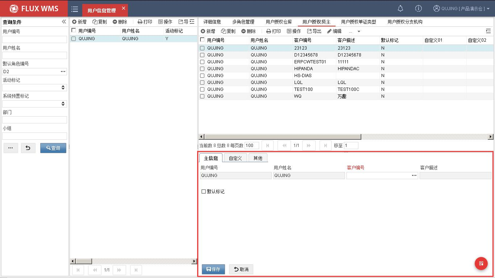

  - 如勾选“默认标记”，所选择货主将作为操作时的默认货主。

  - 点击【保存】按钮，完成货主授权设置。

### 4.3.5. 用户授权单证类型

有些仓库作业中，操作团队会根据不同的作业流程进行分组，以便更好的提升作业效率。例如一个团队负责正常收货，另一个团队负责退货。此类情况，可以为不同用户/角色配置单证类型授权，用户只能查看、操作具有授权的单证类型。如果不需要限定可作业的订单类型，则无需专门授权，默认为可操作全部单证类型。能够进行何种操作，根据功能授权细节限定。

- **用户授权单证类型**

  - 针对已创建的用户，选择“用户授权单证类型”页签

  - 点击页签内的【新增】按钮，为当前用户指定可操作的单证类型

<!-- 原 PDF 第 47 页 -->

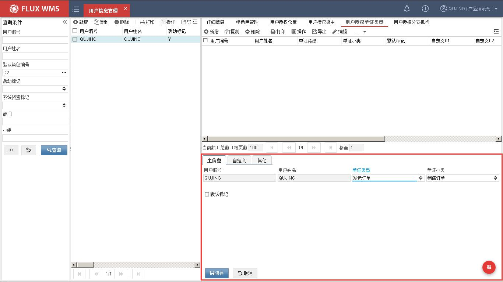

  - 如勾选“默认标记”，所选择单证类型将作为用户新增单据时的默认类型。

  - 点击【保存】按钮，完成此单证类型的授权操作。

## 4.4. 业务功能

系统的主菜单内容，可以根据业务需要进行调整，甚至新增一些自定义功能。这些设置，可以在【业务功能】中进行配置。

需要注意的是，这种配置是公共配置，而不是表单方案这样的私人配置，所做修改将影响此组织下的全部用户。

- **业务功能**

  - 选择主菜单“业务系统管理”下的“业务功能”。

  - 在左侧的查询条件栏位，输入查询条件，可查询已有记录。

  - 在如下界面，左侧的导航窗口部分，点击某一功能，再点击【新增同级】按钮，可以在主信息页签，维护新增功能的相关信息。或者选择已有功能，进行自定义配置：

<!-- 原 PDF 第 48 页 -->

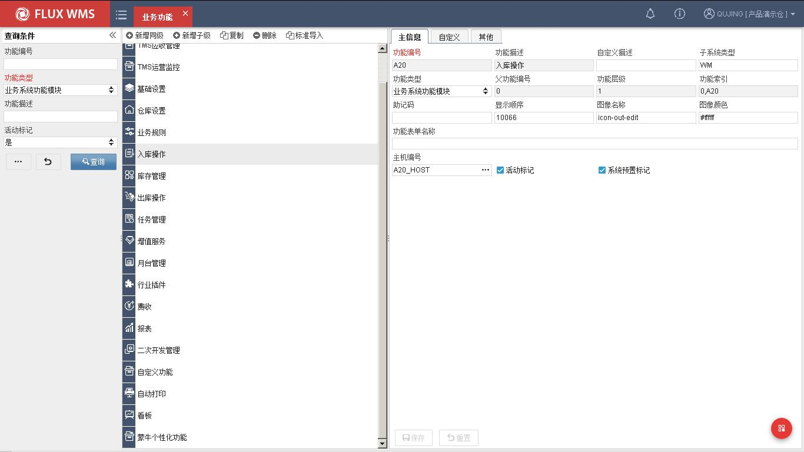

功能编号－功能 ID 代码。保存后不可编辑。

功能描述－默认显示的功能名称，不可修改。

自定义描述－如有输入信息，则界面显示自定义描述。

子系统类型－功能类型。默认 WM 即 WMS 系统对应功能

功能类型－功能所属分类，下拉列表选项提供系统管理功能模块、业务系统功能模块、系统管理对话框、业务系统对话框，供选择。

父功能编号－所从属的上级功能的功能 ID。内容由系统默认，不可编辑。新增同级情况下，与原记录从属同一个父功能，新增子级情况下，父功能即原记录。

功能层级－功能所属级别。主菜单项为 0 级，主菜单功能为 1 级，后续依次类推，由系统根据所属父功能默认生成，不可编辑。

功能索引－索引信息，由系统生成，不可编辑

版本号－功能模块版本号，用户局部更新时，区别在用模块程序版本使用，与“其他” 页签中的记录修改版本含义不同。

助记码－主菜单功能检索时可直接输入助记码进行查询。助记码内容用户可以自行配置。

显示顺序－菜单中功能显示顺序的排序字段。

<!-- 原 PDF 第 49 页 -->

图像名称－可配置功能图标的图片名称。

图像颜色－可配置功能图标的图片显示颜色。

主机编号－多主机分布式部署情况下，此功能的对应主机信息。通常由安装系统的技术人员根据需要指定。

功能表单名称－功能模块对应的程序代码。

活动标记－是否使用中的记录。

  - 点击【保存】按钮，完成业务功能信息维护

  - 通过【新增子级】按钮，可以设置下一级功能信息。

## 4.5. 角色授权

系统在角色管理的基础上，能够给不同角色赋予不同的作业权限。

- **权限管理**

  - 选择主菜单“业务系统管理”下的“角色授权”。

  - 输入或者二级窗口选择角色，点击【查询】按钮，界面显示如下角色可配置权限项

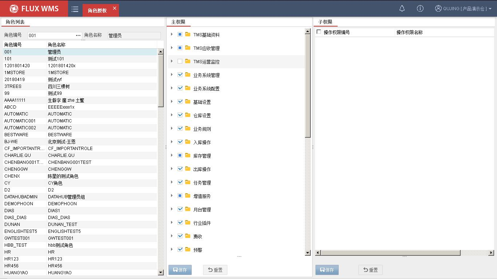

<!-- 原 PDF 第 50 页 -->

  - 在左侧的导航窗口，可以看到与主菜单相同的功能模块内容，角色具有权限的功能，已勾选。

  - 点击导航窗口中的任意功能，右侧窗口显示此功能的对应全部功能明细项，可以进一步勾选、授权。

  - 选择完成后点击【保存】按钮，保存授权设置。

  - 角色授权配置成功后，用户可在【用户管理】模块中配置角色相关用户，详见 4.3 用户管理。

## 4.6. 数据导出授权

自定义配置的数据导出，授权配置与功能授权不同，在独立的“数据导出授权管理”功能中，根据“数据导出规则配置”定义的自定义导出所属的授权类型给角色进行授权控制。授权类型取自系统代码“EXP_AUTH_TYPE”，支持自定义扩展。

按照分类进行授权之后，新增、调整导出规则的时候，无需重新新增规则的权限。

- **数据导出授权**

  - 选择主菜单“业务系统管理”下的“数据导出授权管理”。

  - 在左侧的查询条件栏位，输入查询条件，可查询已有记录。

  - 点击【新增】按钮，在主信息界面进行相关配置：

<!-- 原 PDF 第 51 页 -->

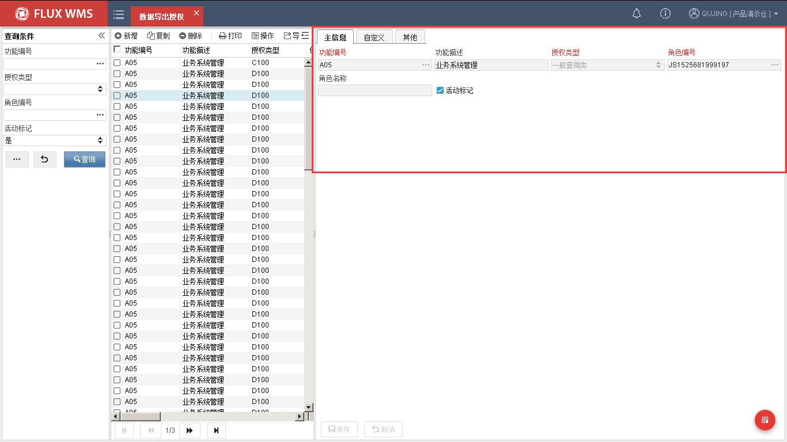

功能编号－导出对应的功能 ID，可通过浏览按钮进行选择。

功能描述－功能名称，根据所选功能编号对应显示

授权类型－系统提供一般查询类、业务操作类、业务管理类、系统管理类几个默认类型，方便将导出分类管理，批量进行授权设置。用户可以根据管理需要，自行在系统代码中设置更多的授权类型

角色编号－导出授予的角色对应，可通过浏览按钮进行选择。

角色描述－角色名称显示。

活动标记－是否使用中的记录。

  - 点击【保存】按钮，完成数据导出授权设置。

## 4.7. 自定义操作授权

本操作针对“5.2 数据导出规则配置” 和“5.3 自定义操作配置”的功能进行授权。授权类型取自系统代码“EXP_AUTH_TYPE”，支持自定义扩展。

配置相关实例参阅 21.自定义导出/打印配置实例。

<!-- 原 PDF 第 52 页 -->

- **自定义操作配置**

  - 选择主菜单“业务系统管理”下的“自定义操作配置”。

  - 在左侧的查询条件栏位，输入查询条件，可查询已有记录。

  - 点击【新增】按钮，在主信息界面进行相关配置：

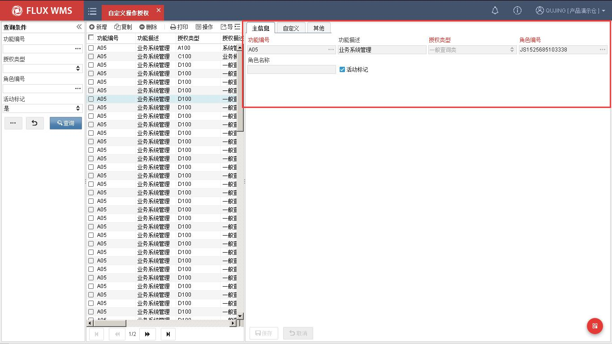

功能编号－导出对应的功能 ID，可通过浏览按钮进行选择。

功能描述－功能名称，根据所选功能编号对应显示

授权类型－系统提供一般查询类、业务操作类、业务管理类、系统管理类几个默认类型，方便将导出分类管理，批量进行授权设置。用户可以根据管理需要，自行在系统代码中设置更多的授权类型

角色编号－导出授予的角色对应，可通过浏览按钮进行选择。

角色描述－角色名称显示。

活动标记－是否使用中的记录。

  - 点击【保存】按钮，完成自定义操作的授权设置。

<!-- 原 PDF 第 53 页 -->

## 4.8. 主机信息管理

主机信息是安装部署环境的相关信息，在多应用服务器部署环境中，不同的模块可以部署在不同的服务器上。具体配置由系统维护专员进行管理。

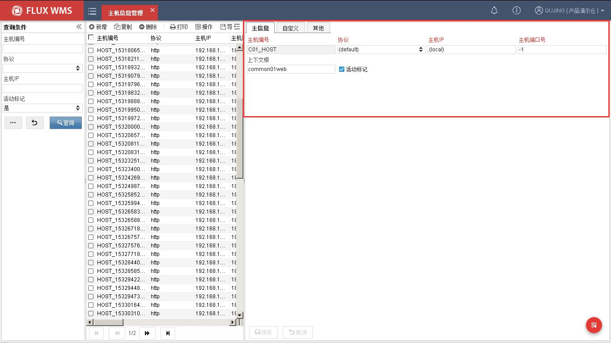

## 4.9. 仓库信息管理

仓库是 WMS 系统管理的关键元素之一，系统需要区分同一组织下的不同仓库，并在每个仓库内分别进行独立管理，可以实现各自不同的库位布局、不同的操作要求以及流程管理。因此仓库信息维护，也是后续其他库位信息、管理要求信息维护的基础。

- **仓库设置**

  - 在主菜单“业务系统管理”下选择“仓库”。

  - 点击按钮栏的【新增】按钮，在“主信息”页签依次输入以下信息：

<!-- 原 PDF 第 54 页 -->

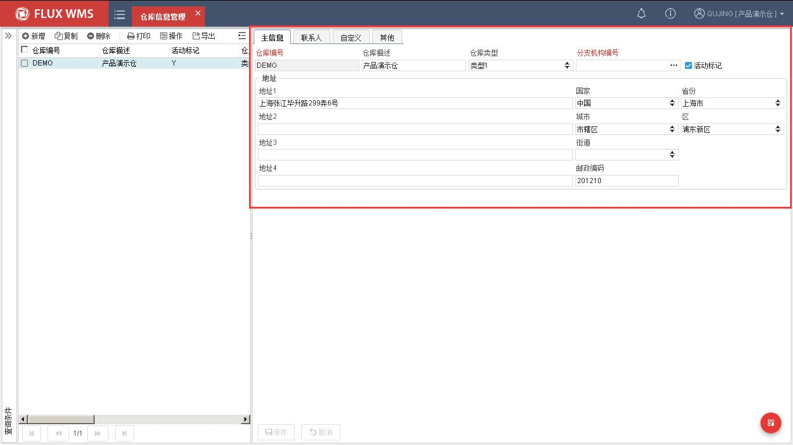

仓库编号－仓库 ID

仓库描述－仓库名称描述

仓库类型－类型配置

活动标记－是否有效仓库

地址信息－用来维护仓库所属国家、省份、城市、区、街道等详细地址信息。国家、省份、城市、区、街道下拉框字段值联动关系。例如选择国家后，省份下拉框才会初始化所选国家对应省份信息。国家、省份、城市、区、街道信息如需修改、维护信息，请联系 FLUX 顾问。

  - 点击【保存】按钮，完成仓库主信息维护。

  - 选择“联系人”页签，可以进一步完善仓库相关联系人的信息。

<!-- 原 PDF 第 55 页 -->

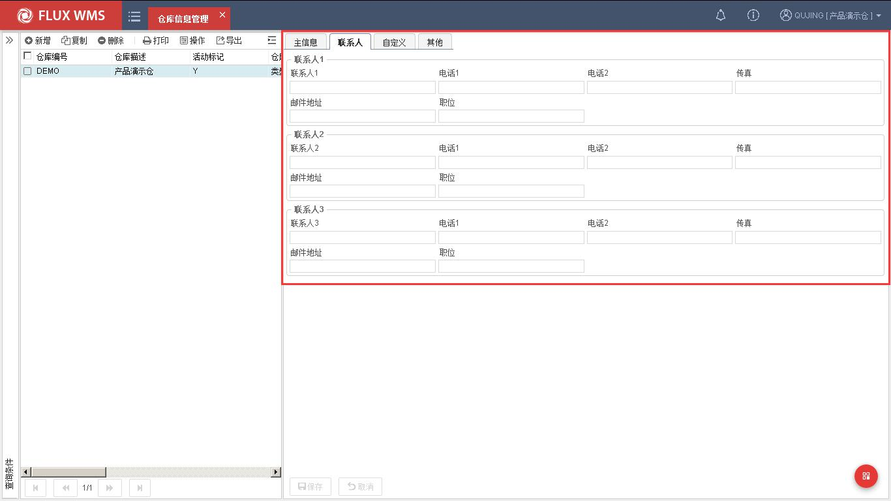

## 4.10. 系统代码

系统代码是 FLUX WMS 基本控制要素之一。FLUX WMS 的界面上包含了很多下拉式菜单或默认的数据。在这些下拉式菜单含有的选项来自 FLUX WMS 的系统代码。

有时用户可能需要增加一些在目前的代码列表中没有的代码项目。在这种情况下，需要在增加代码前，先创建一个新的列表。但是在没有 FLUX 顾问的帮助下，用户最好不要创建新的列表。

一些下拉式列表的默认值是用户可以选择和定义的，如国家、货币的类型等。但值得注意的是，利用系统代码为 FLUX WMS 的业务逻辑在下拉式列表中增加的选项，并不一定在用户的业务中有效。例如，在下拉式列表中增加的一种上架策略并不能使系统执行对应任务。因此用户如果有这方面的需要，请联系 FLUX 顾问。

- **系统代码设置**

  - 在主菜单“业务系统管理”下选择“系统代码”。

  - 点击按钮栏的【新增】按钮，在“主信息”页签依次输入以下信息：

<!-- 原 PDF 第 56 页 -->

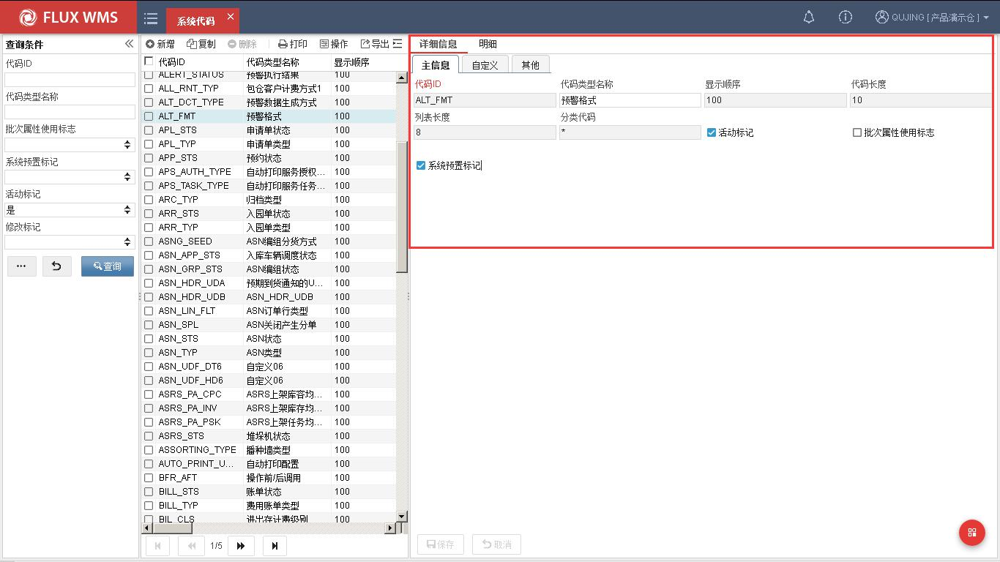

代码 ID－系统代码所属类型 ID。

代码类型名称－代码类型描述

显示顺序－排序用字段

代码长度－此类型下，新增代码的最大长度限制设置。

列表长度－此类型在相关功能中，下拉列表默认显示的记录数。

分类代码－代码明细根据不同情况分类显示，在此字段指定分类所用的系统代码。

活动标记－此类型代码是否使用。

批次属性使用标记－此类型代码是否作为批次属性值供下拉框选择使用。

系统预置标记－是否系统提供的初始化记录。系统预置标记系统代码不允许删除。

  - 点击【保存】按钮，完成代码类型维护。

  - 在明细页签，进一步维护此类型下的具体代码。

<!-- 原 PDF 第 57 页 -->

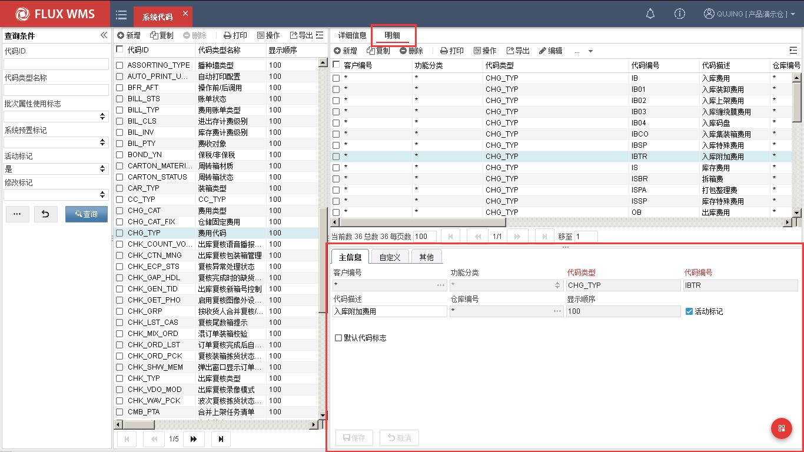

客户编号－限定客户使用代码，需要配置对应客户编号。为*则不限定客户。

功能分类－使用此代码的分类信息。下拉列内容，根据表头“分类代码”对应明细显示。

代码类型－代码所属类型

代码编号－代码值

代码描述－代码描述信息

仓库编号－代码生效的指定仓库。为*则是各个仓库可使用的公共代码。

显示顺序－此代码在下拉列表中的排序

活动标记－记录是否激活

默认代码标记－此记录是否为此代码的默认代码值。例如发运订单，默认订单类型是 “CM”普通订单，即将发运订单的订单类型代码中，CM 代码配置为默认代码，手动新增发运订单时，默认为 CM 订单类型。

  - 点击【保存】按钮，完成代码设置。

- **其他**

  - 原因代码控制

系统提供一些默认的原因代码选择，但在不同的作业环节，所选的原因代码会有所不同。因此

<!-- 原 PDF 第 58 页 -->

系统的原因代码可以根据需要针对不同功能进行配置。代码 ID 为 RSN_COD，在对应的明细部分，通过分类设置，配置代码在哪个功能中生效。设置内容为：ASN 入库（收货）：功能分类=ASN ASN 上架：功能分类=PUTAWAY 库存移动：功能分类=MOVE 库存冻结：功能分类=HOLD 库存转移：功能分类=TRANSFER 库存调整：功能分类=ADJUSTMENT 拣货确认：功能分类=PICK 通用（全部界面有效）：功能分类=CM

## 4.11. 数据字典

数据字典是系统后台数据表的结构信息，相关 IT 管理人员可以参考数据字典信息，自定义配置各种系统查询、报表、自定义功能等。数据字典也是 FLUX WMS 系统强大的可配置性的基础支持之一。

需要注意的是，目前系统并不支持在数据字典中直接添加表、字段（不会自动创建数据库内容）。而是需要在数据库中先行添加表、字段，然后再到数据字典中对所添加的内容进一步配置对应信息。

- **数据字典查看**

  - 在主菜单“业务系统管理”下选择“数据字典”功能。

  - 查询条件部分，根据需要输入条件，系统显示数据表信息

<!-- 原 PDF 第 59 页 -->

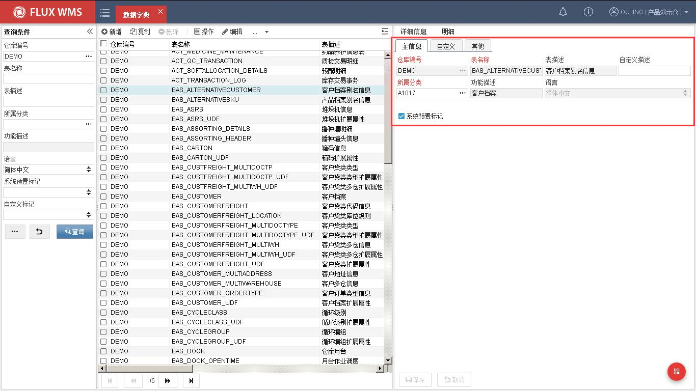

仓库编号－仓库信息。数据字典支持每个仓库分别配置显示名称，初始化仓库时系统会提供整套预设信息。

表名称－数据库中的表名

表描述－系统提供的默认表名描述，会根据当前登录语言对应显示，不可修改。

自定义描述－当前登录语言下，显示的表描述。如果未配置则显示默认表描述内容。

所属分类－与此表相关的功能的代码。由于很多功能会涉及到相同的表，此处仅显示一个相关功能，作为参考。

功能描述－与此表相关的功能名称。

语言－当前登录语言信息。只读显示

系统预置标记－此记录是否系统提供的初始化记录。

  - 如果修改表名描述，点击【保存】按钮完成设置。

  - 在“明细”页签，可以进一步查看表内的字段信息：

<!-- 原 PDF 第 60 页 -->

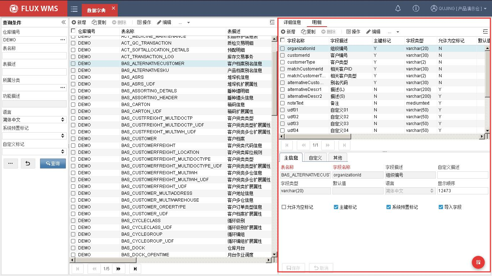

仓库编号－仓库信息。数据字典支持每个仓库分别配置显示名称，初始化仓库时系统会提供整套预设信息。

表名称－数据库中的表名

字段名称－数据库中的字段名

字段描述－系统提供的默认字段描述，会根据当前登录语言对应显示，不可修改。

自定义描述－当前登录语言下，显示的字段描述。如果未配置则显示默认表描述内容。

语言－当前登录语言信息。只读显示

显示顺序－字段的显示次序

允许为空标记－该字段是否允许为空。

字段类型－数据库中的字段类型信息

主键标记－此字段是否是表主键字段

系统预置标记－此字段是否系统提供的初始化记录。

导入字段－导入时是否设置为关键字段。

  - 点击【保存】按钮完成自定义设置。

<!-- 原 PDF 第 61 页 -->

## 4.12. 多语言文本管理

FLUX WMS 系统，支持不同语言环境下的使用，因此对多语言有全方面的支持。但同一语言下，不同地区的显示需求也很可能不同，因此系统提供的多语言信息，支持用户配置修改，并可以支持到同一语言下，不同仓库分别配置显示。

多语言文本信息，是基于数据字典基础上的配置信息，如果未配置，系统将显示此语言的系统默认描述。

用户如需新增语言，请与 FLUX 顾问联系，以便获取语言包更新。

- **多语言管理**

  - 在主菜单“业务系统管理”下选择“多语言文本管理”功能。

  - 根据需要查询所需的多语言记录并完善：

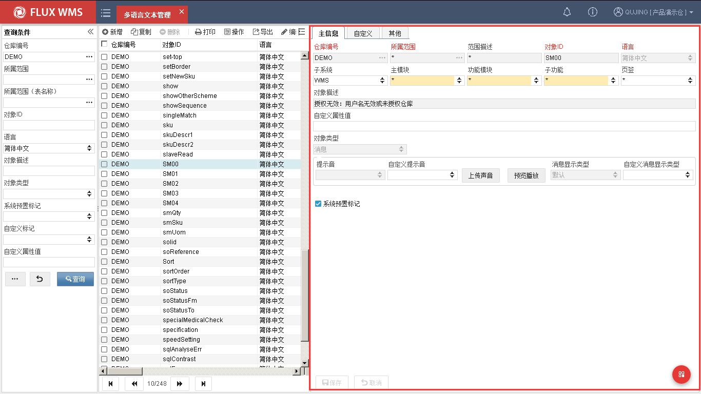

仓库编号－多语言记录所属仓库

所属范围－多语言记录对应的功能 ID

范围描述－多语言记录所属范围的描述。

属性编号－多语言记录 ID

<!-- 原 PDF 第 62 页 -->

语言－记录所属语言

子系统－多语言记录所属子系统，如 RF、WMS，检索信息字段。

主模块－多语言记录所属主模块信息，如入库操作，出库操作。检索信息字段。

功能模块－多语言记录所属功能模块信息，如 ASN，PO。检索信息字段。

子功能－多语言记录所属子功能信息，如扫描收货，快捷收货。检索信息字段。

页签－多语言记录所属页签信息，如主信息，汇总信息。检索信息字段。

属性值－默认显示信息。

自定义属性值－用户自定义显示信息。未配置情况下显示默认属性值。

属性类型－记录类型，如消息，按钮，还是标签。只有消息类的记录需要配置后续的提示音等信息。

提示音－消息弹出时的默认提示音。

自定义提示音－可配置的提示音。

上传声音－点击按钮后，可自行上传声音文件，所传文件在“自定义提示音”的下拉框内可供选择。需要注意的是，不同语言的提示音需要分别上传。

预览播放－所选提示音播放。

消息显示类型－系统默认的消息显示类型。如提示框锁定等。

自定义消息显示类型－可配置的消息显示类型。

系统预置标记－此记录是否系统提供的初始化记录

  - 点击【保存】按钮，完成多语言记录配置。

## 4.13. 界面方案管理

FLUX WMS 提供高度可配置的操作系统，用户可以根据需要定义所用的系统界面、字段显示等。

可配置信息，基础层为数据字典的表、字段名称可配置（具体请参考数据字典功能说明）。

其次是所有界面元素在多语言文本管理中可配置（具体请参考多语言文本管理功能的对应说明）。

第三层，则是配置界面方案，可以根据用户的需要、习惯，配置不同的查询界面、列表、操作

<!-- 原 PDF 第 63 页 -->

界面布局，描述定义，或者是快捷键等，形成自定义的作业界面。通常是基于角色、仓库进行配置。不同语言，需要分别配置方案。第四层，可以在已生效的界面方案基础上，通过拖动等，形成用户的私有配置。未做配置情况下，则显示上一级的配置。如果全部未配置，则显示系统默认布局和信息。在进行第三层次界面方案配置时，需要先定义此方案的名称和适用范围，然后再到具体功能中逐一进行配置。

### 4.13.1. 界面方案创建

- **界面方案管理**

  - 在主菜单“业务系统管理”下选择“界面方案管理”功能。

  - 点击【新增】按钮，新增方案记录：

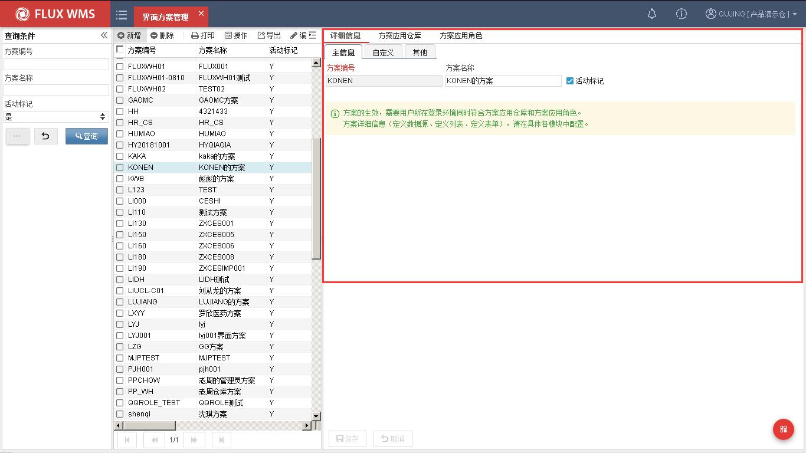

方案编号－方案 ID

方案名称－方案的名称描述

活动标记－是否使用中的方案

适用仓库－方案生效的仓库对象，可多选

<!-- 原 PDF 第 64 页 -->

适用角色－方案适用的角色，可多选。用户登录系统时，会自动根据用户所属角色、所登录的仓库来判断默认的界面方案。如果对应的方案多于 1 个则默认选择首个方案生效。

  - 点击【保存】按钮完成方案名称设置。然后进入到具体功能中进行配置。

### 4.13.2. 数据源配置

以预期到货通知为例，在作业界面，点击右下角的【方案配置】红色按钮，进入如下的界面方案配置功能。

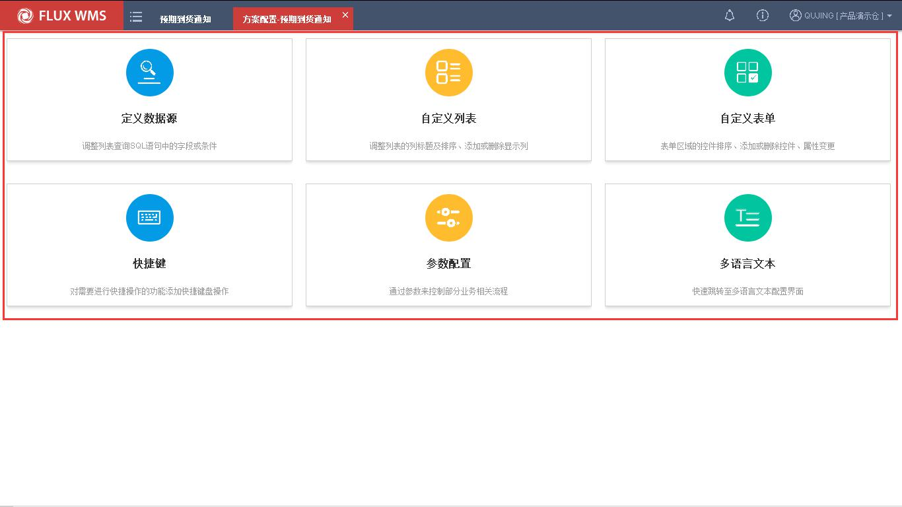

第一步，根据需要进行数据源配置。如果无需修改数据源字段，可以跳过此配置步骤，使用系统标准数据源。

- **定义数据源**

  - 在功能的“方案配置”页签，选择“定义数据源”配置。

<!-- 原 PDF 第 65 页 -->

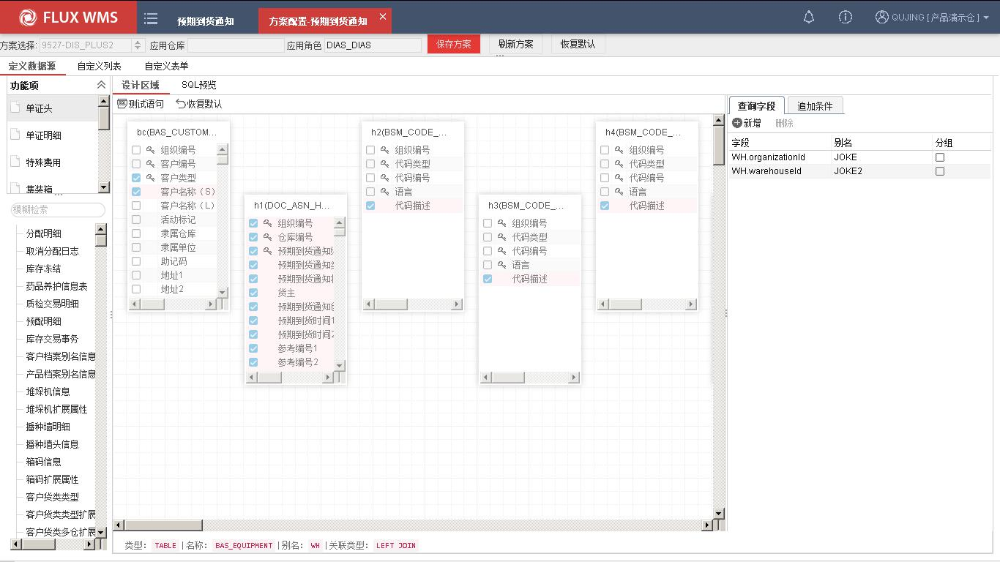

  - 在左上角项目部分，选择功能项目。例如单证头列表，或者具体哪个功能页签。相关功能具有的项目都会在这部分列出。

  - 选择项目后，中间的设计区域显示所选项目涉及的表。

  - 如果需要添加关联表，可以从左下角的“数据库表”部分选择并拖拽到设计区域，系统会弹出如下的对话框，要求添加表关联。

<!-- 原 PDF 第 66 页 -->

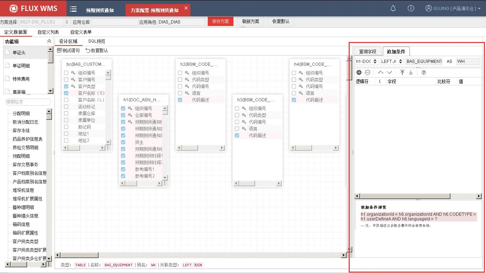

  - 确认生成后，在设计区域可见新的相关表。根据需要勾选字段，在右侧“查询字段” 部分，可见生效的字段。

  - 通过“追加条件”页签，可以进一步增加语句条件。

  - 配置完成，在中间的“SQL 预览”页签，可以看到完整的语句，系统会校验是否有语法错误。

  - 配置无误，可以对方案进行保存，或者通过【恢复默认】按钮，还原为系统初始设置。

### 4.13.3. 列表配置

数据源配置完成，可以通过点击“自定义列表”页签，切换到第二步，列表配置，如下图。

无需配置数据源的情况下，也可以在[图 4-11-2]的方案配置主界面，直接进入“自定义列表” 配置。

<!-- 原 PDF 第 67 页 -->

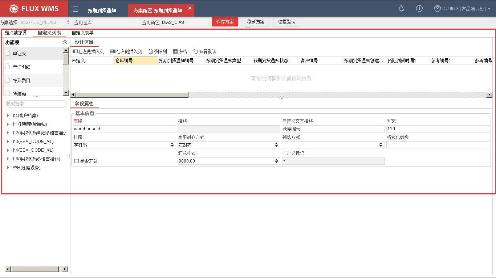

- **自定义列表**

  - 在功能的“方案配置”页签，选择“自定义列表”配置。

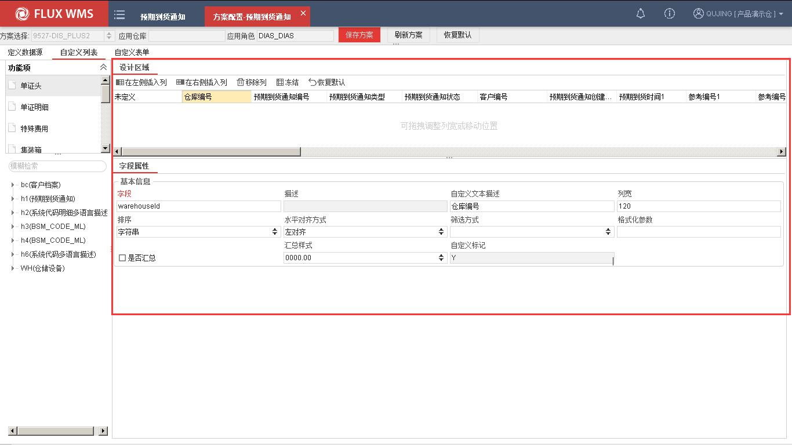

  - 界面左上方，显示此功能对应的列表项目。根据需要选择某一列表，左下方可选择

<!-- 原 PDF 第 68 页 -->

字段部分，根据已配置的数据源，显示可选字段；界面右上方显示列表预览。

  - 如果进入配置界面前，有查询记录，系统将带入首行数据在预览部分显示，方便定义字段宽度。

  - 预览部分，可以直接删除不需要显示的字段。需要增加显示的字段可以从左下方的可选字段窗体中拖拽到预览窗格。

  - 选定某一列字段，点击【冻结字段】按钮，所选字段列之前的字段将在列表中冻结显示。

  - 在界面右下方的“字段属性”部分，可以维护字段的显示信息：字段－所选列的数据字段名描述－字段默认名称。根据多语言配置显示。如果没有配置多语言，则显示数据字典配

置作为默认描述。

自定义描述－界面方案中显示的字段描述。未配置则显示默认描述。

列宽－字段的显示列宽。

排序－字段内容的排序模式。系统提供字符串、整型、日期型供选择。

对齐－字段内容的对齐方式。

筛选方式－字段内容的筛选方式。系统提供文本方式、数量方式供选择。如配置，在列表头，鼠标定位到字段，将显示筛选框。

汇总模板－如果此字段勾选汇总，可选择汇总信息显示方式。

是否汇总－当前所选字段，是否需要进行汇总统计。汇总针对符合查询条件的全部结果记录。

  - 点击【保存方案】按钮，保存所做的方案修改。

  - 当前应用方案修改保存后，在对应功能页签，刷新即可见修改效果。

### 4.13.4. 表单配置

除菜单、列表之外的界面配置，归属于表单范围。

- **自定义表单**

  - 在功能的“方案配置”主页面（如[图 4-11-2]），直接进入“自定义表单”配置。或者通过配置界面点击“自定义表单”页签，切换到表单配置，如下图所示。

<!-- 原 PDF 第 69 页 -->

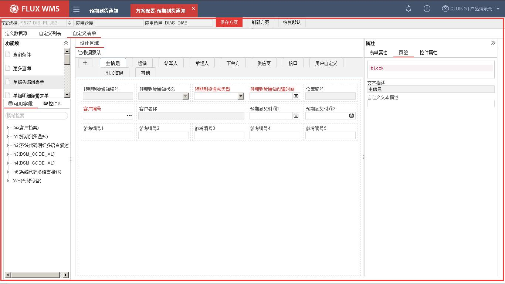

  - 在配置界面（如下图）左上部分，“功能项”窗格中，选择需要配置的界面，如查询界面，或者单证头主信息页签等。

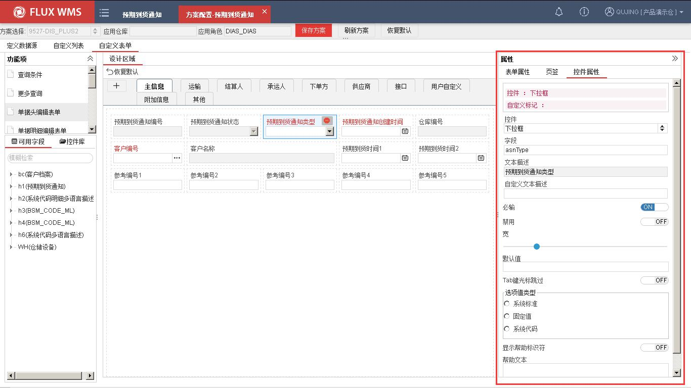

  - 中间的设计区域，显示当前配置。可以根据需要添加字段，或删除字段显示，拖拽

<!-- 原 PDF 第 70 页 -->

变动布局。

  - 所添加的字段、部件，可以从界面左下方的数据库、部件库中拖拽到设计区域。

  - 界面右侧进一步根据需要配置字段属性：字段 ID－字段名文本描述－当前语言下，界面显示的字段名称是否必输－字段是否为必输字段是否禁用－字段是否被禁用宽度－字段显示宽度调节默认值－字段默认值。新增记录时自动默认。Tab 键光标跳过－Tab 键移动光标时，不停留。显示帮助表示符－鼠标悬停字段时显示帮助信息。帮助文本－鼠标悬停时所显示的帮助信息内容。

  - 点击【保存方案】按钮，保存所做修改。

注：由于系统各个功能都支持界面自行配置，因此用户实际使用时，所见的功能界面字段、布局很可能与本文档截图显示有所不同。请根据实际系统应用。

### 4.13.5. 快捷键配置

系统提供快捷键支持，并且各个功能的对应快捷键可以由现场进行配置。

- **快捷键**

  - 从[图 4-13-2]的方案配置界面，选择【快捷键】功能

<!-- 原 PDF 第 71 页 -->

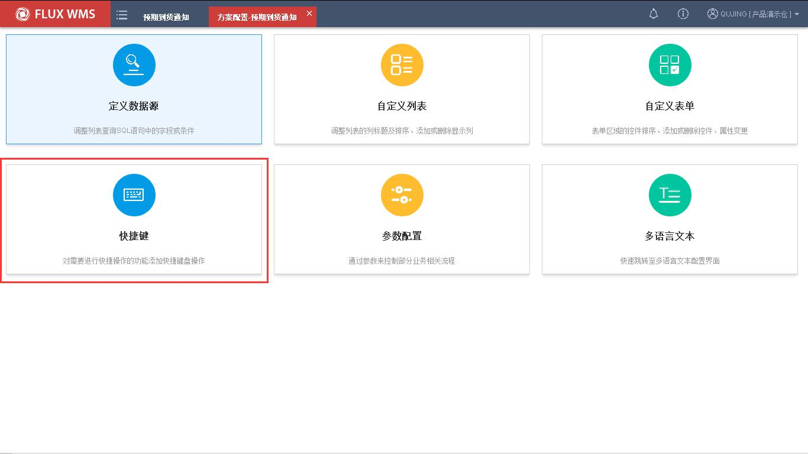

  - 进入如下图的配置界面

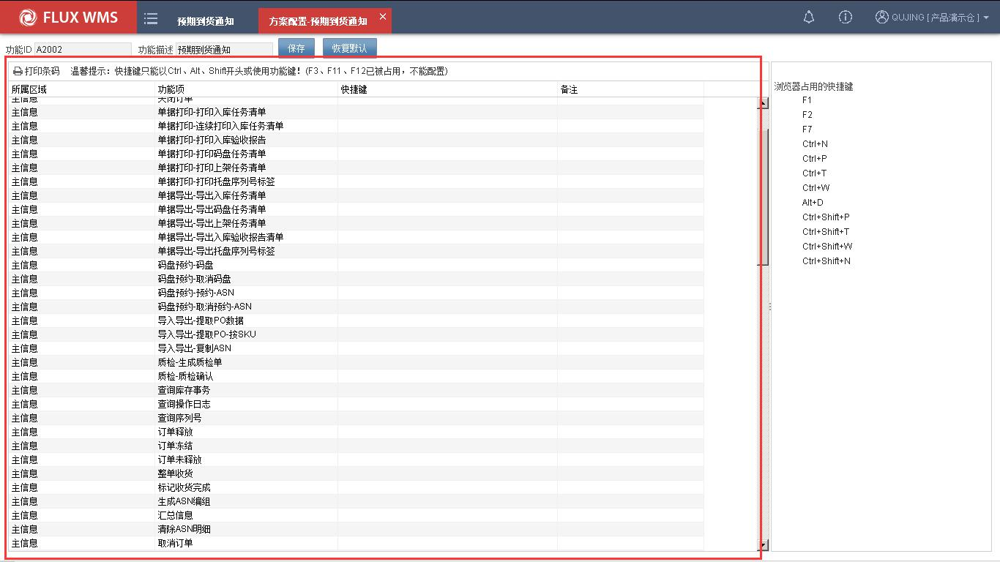

系统列出可以进行快捷键配置的项目，并提示哪些快捷已经被使用，不可配置。

在需要配置的功能记录处，点击“快捷键”字段，直接在键盘上按对应快捷键（例如按 F6 键，

<!-- 原 PDF 第 72 页 -->

或者直接按 4，系统会记录为 Ctrl+4）

  - 点击【保存】按钮，完成快捷键配置

  - 如果所配置的快捷键重复，系统会提示报错，如下图所示：

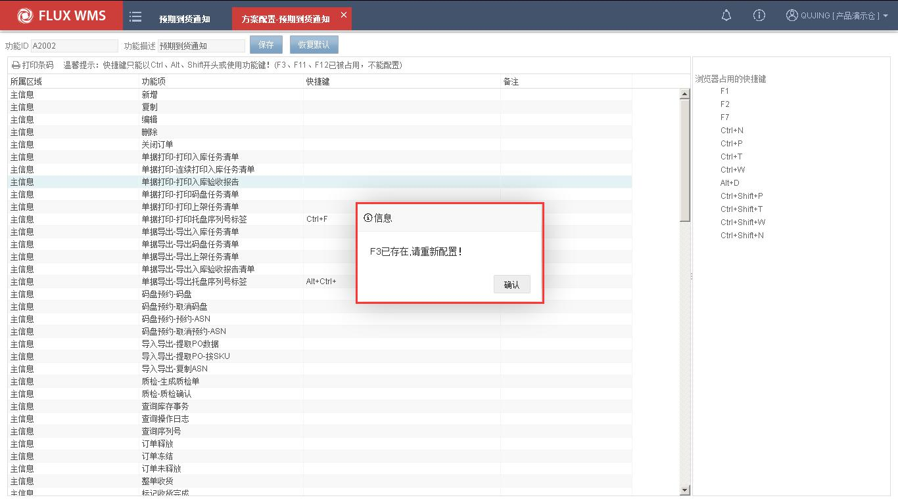

### 4.13.6. 界面方案应用

当界面方案设置成功后，用户可根据业务管理需要，将角色或仓库与方案建立明确的映射关系。从而在登录成功后，使用该用户对应角色的界面方案进行显示。

- **仓库应用方案**

  - 点击【新增】按钮，完成应用仓库的配置。若修改当前用户显示方案，还需重新登录系统才会生效。

备注：当用户配置多条界面显示方案时，系统默认根据首个界面方案进行显示。

<!-- 原 PDF 第 73 页 -->

- **角色应用方案**

  - 点击【新增】按钮，完成应用角色的配置。若修改当前用户显示方案，还需重新登录系统才会生效。

备注：当用户配置多条界面显示方案时，系统默认根据首个界面方案进行显示。

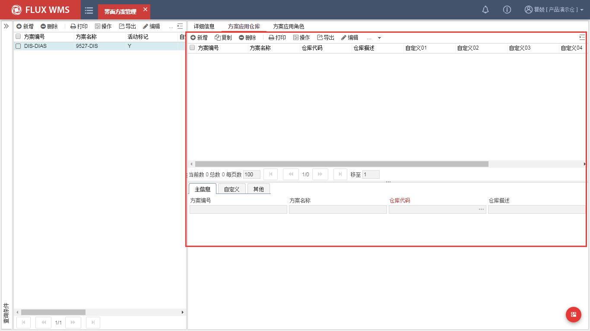

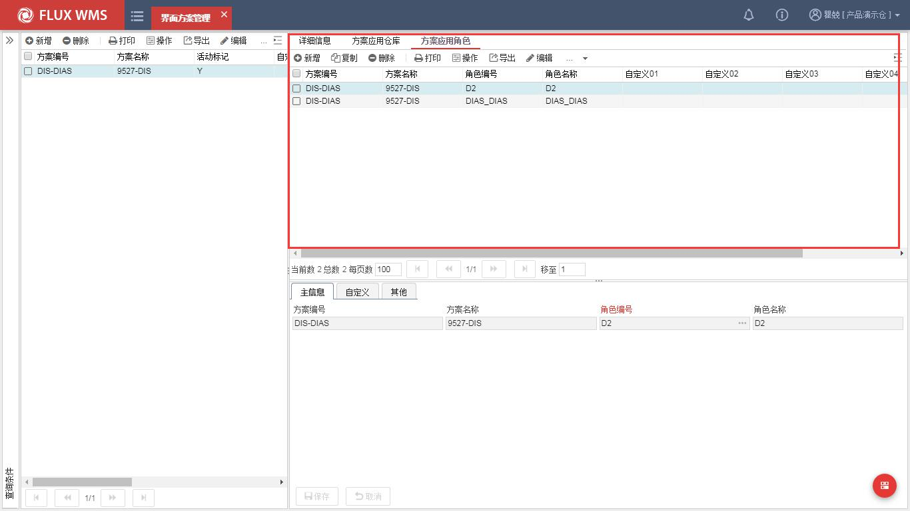

<!-- 原 PDF 第 74 页 -->

## 4.14. 附件文档管理

系统多个功能都支持附件上传。所有已经上传的附件，可以在“附件文档管理”功能中，统一管理，方便查看、下载。并且系统音频文件，也在此处管理。

- **附件文档管理**

  - 在主菜单“业务系统管理”下选择“附件文档管理”。

  - 查询所需的附件记录：

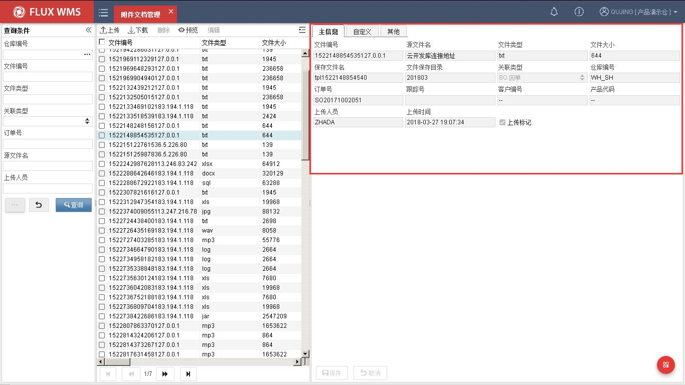

文件编号－文件 ID

文件描述－文件描述

文件内容－文件内容描述

源文件名－原始文件名

文件类型－附件文件类型

文件大小－文件大小

保存文件名－服务器上的文件名

文件保存目录－文件在服务器上的保存目录

<!-- 原 PDF 第 75 页 -->

关联类型－附件类型

仓库编号－附件所属仓库信息

订单号－附件所属订单号信息

跟踪号－用于记录附件提交交易明细对应跟踪号。字段允许为空

客户编号－附件所属客户信息。字段允许为空

产品代码－附件所属产品信息。字段允许为空

上传人员－附件上传人员

上传时间－附件上传时间

上传标记－记录附件是否已上传

  - 通过【保存】按钮保存修改。

  - 也可以通过【下载】按钮下载文件。

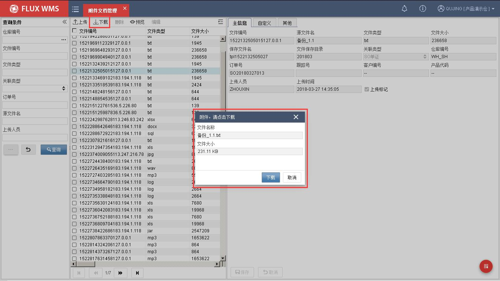

  - 点击【下载】按钮后，选择保存绝对路径点击【保存】后完成下载操作。

  - 通过【上传】按钮上传文件。

<!-- 原 PDF 第 76 页 -->

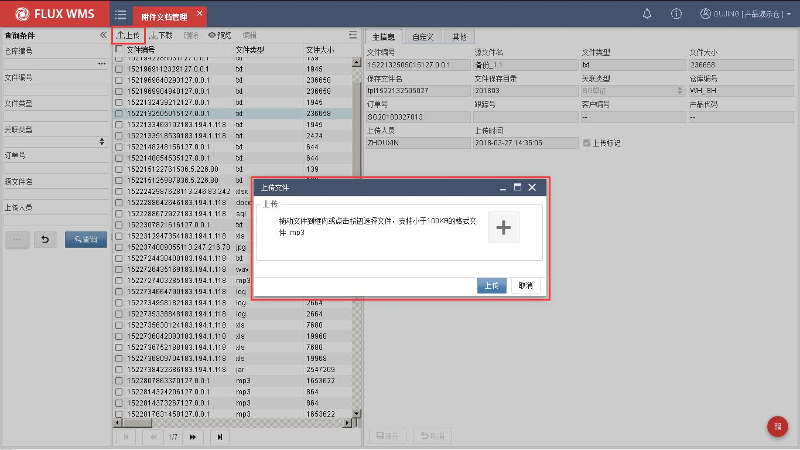

  - 当前版本“附件文档管理”附件上传功能仅支持.MP3 格式且小于 100KB 的音频文件，后续版本将陆续支持其他常用图片、音频、文本格式。

## 4.15. 用户密码修改

提供给用户自行修改密码使用。

- **用户密码修改**

  - 在主菜单“业务系统管理”下选择“用户密码修改”。

<!-- 原 PDF 第 77 页 -->

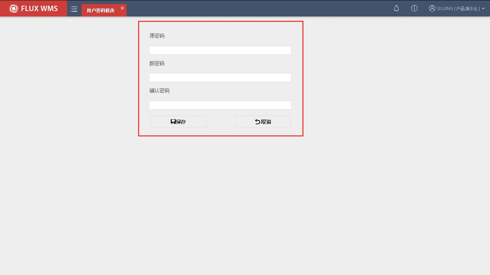

  - 在如图的修改界面，输入原密码、新密码，并确认保存。

## 4.16. 组织结构管理

  - 现场实际作业中，往往在报表查看或者运输场景下，需要使用到集团的组织

架构模型。本模作用为维护 V6 集团组织架构基础信息，便于前端模块引用。

- **主信息页签**

  - 选择主菜单“业务系统管理”下的“组织结构管理”功能。

  - 在工具栏位配置组织架构信息。

<!-- 原 PDF 第 78 页 -->

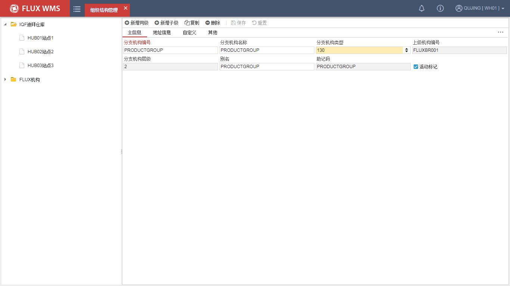

分支机构编号分支机构编码，支持用户开放式输入。

分支机构名称 - 分支机构名称，用来定义分支显示名称。

分支机构类型 - 用来定义分支结构类型。

上级机构编号 - 用来显示分支上级组织编号

分支机构层级 - 用来定义机构目前所属层级。

别名用于定义- 分支别名。

助记码- 用于定义分支助记码，便于系统快速识别。

- **地址信-息页签**

  - 现场作业中由于部分实体/虚拟分支机构信息，并非都维护在客户档案中，，为便于系

统获取此部分信息，系统支持在组织架构维度维护分支机构具体地址信息

<!-- 原 PDF 第 79 页 -->

  - 

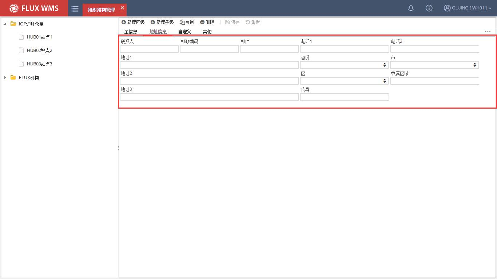

地址－客户的地址。如一个客户有多个地址，可在“多地址信息”页签继续维护。

国家－客户所在的国家。下拉列表内容通过后台表 TMS_SITE_INFO 进行维护。

省份－客户所在的省份。下拉列表内容通过后台表 TMS_SITE_INFO 进行维护。

城市－客户所在的城市。下拉列表内容通过后台表 TMS_SITE_INFO 进行维护。

区－客户所在区。内容通过后台表 TMS_SITE_INFO 进行维护。

街道－客户所在街道。配合快递信息维护所需。内容通过后台表 TMS_SITE_INFO 进行维护。

隶属区域－客户所在集团划分区域。

  - 邮政编码－客户所在地的邮政编码。

- **自定义页签**

  - 为便于后期实施扩展，系统保留 11 个预留扩展字段，便于现场个性化扩展。

<!-- 原 PDF 第 80 页 -->

  - 

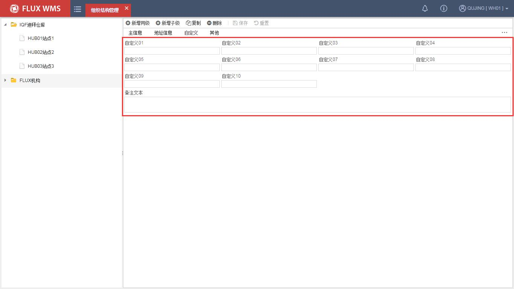
