# 5. 业务系统配置

> 来源：`富勒WMS系统用户手册_V6_高清版（维他命）.pdf`，原 PDF 第 81 页起。
> 本文件按原 PDF 正文标题拆分；原文截图已提取至同目录 `assets/`。

<!-- 原 PDF 第 81 页 -->

## 5.1. 系统配置参数

在 FLUX WMS 中，有许多功能的实现，业务流程规划，可以通过不同的参数配置或者组合得到不同的结果，例如入库任务清单上是否显示待收货数量、是否必须执行码盘操作或拣货操作等。

系统配置参数功能位于“业务系统配置”模块下的“系统配置参数”中，FLUX 的顾问将协助用户根据流程需要配置相应的系统参数。

用户可通过“参数分类”或“参数 ID”等查询条件查找所需的系统配置参数。

由于多仓多货主作业模式下，同一仓库内的多个货主之间管理要求会不同，同一货主在不同仓库的管理要求也可能有差别，因此系统支持按不同仓库、不同货主、不同订单类型分别配置参数（简称为 WCO 支持，即 Warehouse、Customer、Ordertyp 的缩写）。

- **系统配置参数设置**

对于无需细化区分的情况下，即不区分仓库、货主、订单类型情况下，可以在详细信息页签，对参数默认参数值进行配置：

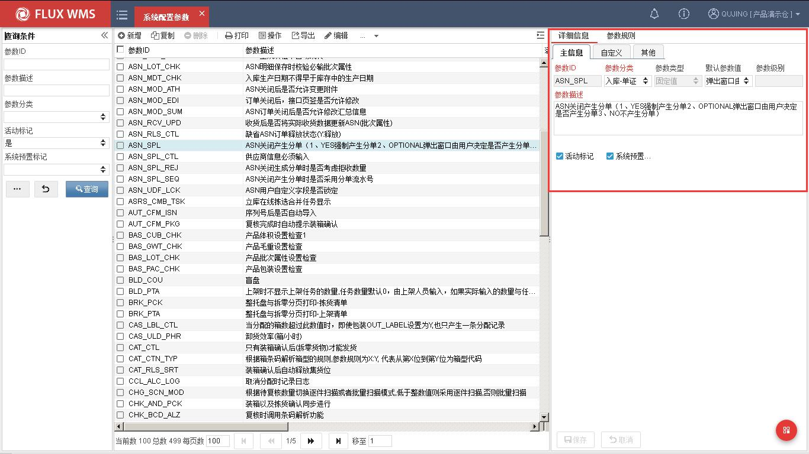

参数 ID－参数代码 ID，也是参数的身份标识。

<!-- 原 PDF 第 82 页 -->

参数分类－参数分类信息，便于参数查询、配置和维护。

参数类型－参数值限定。下拉选项，系统提供 Y/N 类型、固定值、自由内容、数值型 4 种选择项。

    - Y/N 类型

参数值为下拉列表，可选项为是、否，用于开关型参数。

    - 固定值

参数值为下拉列表模式，不同参数的对应选择项不同。

    - 自由内容

参数值由现场自行录入，例如目录地址等。

    - 数值型

参数值为数字，限制其他非数值的录入保存。

默认参数值－即不区分仓库、货主、订单类型情况下，默认生效的参数配置。

参数描述－参数说明信息。

参数级别－个别参数只能支持到仓库，或者货主级别，无法支持到订单类型层级（例如是否启用第三方费收），因此系统提供参数级别字段，供用户了解参数的生效层级。

活动标记－控制参数是否启用。

系统预置标记－此记录是否系统提供的初始化记录

- **参数规则设置**

如果不同仓库、货主、订单类型下，所需参数配置不同（例如第三方仓库，A 货主要启用序列号管理，B 货主无需序列号管理），此时可以在参数规则页签中，进一步细化配置。

点击【新增】按钮之后，根据所需指定的仓库、货主、订单类型，配置对应的参数值规则。例如仅在一个仓库下指定货主生效的参数，需要配置指定的仓库、货主，而订单类型可以不选择。

多种参数规则情况下，系统依据行号次序匹配规则，新增记录时行号由用户自行指定，但保存后不可修改行号（如下图所示）。未配置规则情况下取参数默认设置生效。

<!-- 原 PDF 第 83 页 -->

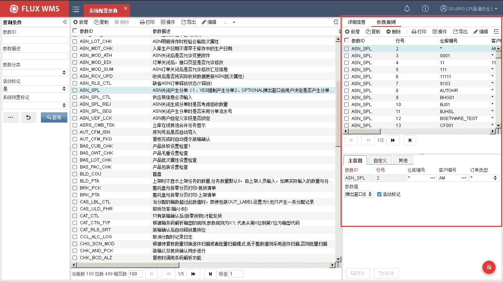

- **参数刷新**

用户登录时会获取当前参数配置信息并缓存使用，如果参数值被修改，需要刷新缓存，以便参数立即生效。当用户修改系统参数并且点击【保存】时，系统自动提示是否重载：

“”

  - 选择“是”当前用户环境，系统自动缓存重载，设置生效，从而提升参数修改后的用户体验；

  - 点击“否”，暂不重载，通常是后续还要修改其他参数，后续合并重载，或者手动重载缓存；

- **特殊参数介绍**

  - 系统暂停

配合 ERP 系统关账等管理需求，仓库中有时会要求指定时间段不可进行操作，但同时系统依旧运行以支持对账运算等要求。

此时可通过手工修改系统参数（SYS_OPN_CLS，系统开放/暂停状态），或通过定时器定时关闭、开启参数，达到系统暂停操作的控制要求。

具体定时器设置，请参考定时器章节的介绍。

- **WCO 相关配置**

<!-- 原 PDF 第 84 页 -->

由于不同参数生效的业务环节不同，可以选择的单证类型也有所不同。例如 ASN_RLS_CTL 参数，缺省 ASN 订单释放状态，对应订单类型选择，显示的是 ASN 类型，而 PO_RLS_CTL 参数，则针对 PO 类型进行选择。

另外有些参数，不同订单类型下的应用没有区别，例如 BAS_GWT_CHK，产品毛重设置检查，就不提供订单类型选择。

系统通过系统代码 DOC_CTL_LST，来配置参数是否支持 WCO 的单证类型选择。并通过代码的自定义 1 字段维护参数对应的单证大类，如 ASN，SO。经过维护的代码，系统才能提取相应单证类型供下拉框选择。如果一个参数在多个业务流程中应用，则通过%分隔单证大类，例如 ASN%SO，那么对应参数在参数配置中的单证类型下拉列表可以显示 ASN 单证类型+SO 单证类型供选择。

## 5.2. 数据导出规则配置

系统中各个功能的信息，很多都会有数据导出的需求。例如导出当前库存数据发送给货主，导出单证信息用于手工统计，导出库位信息打印条码等等。系统提供了强大的自定义导出处理支持，用户可以根据各自的需要，自行定义所需的导出信息、格式等。

“数据导出规则配置”功能，就是提供给用户进行导出定义的功能，配置后的导出功能，可在对应功能模块显示。但由于导出的定义，需要对系统功能、数据结构有一定了解，参考数据字典信息，因此导出规则的配置通常由系统管理员或 IT 部门进行配置管理。

- **数据导出规则配置**

  - 选择主菜单“业务系统配置”下的“数据导出规则配置”。

  - 在左侧的查询条件栏位，输入查询条件，可查询已有记录。

  - 点击【新增】按钮，在如下界面进行相关配置：

<!-- 原 PDF 第 85 页 -->

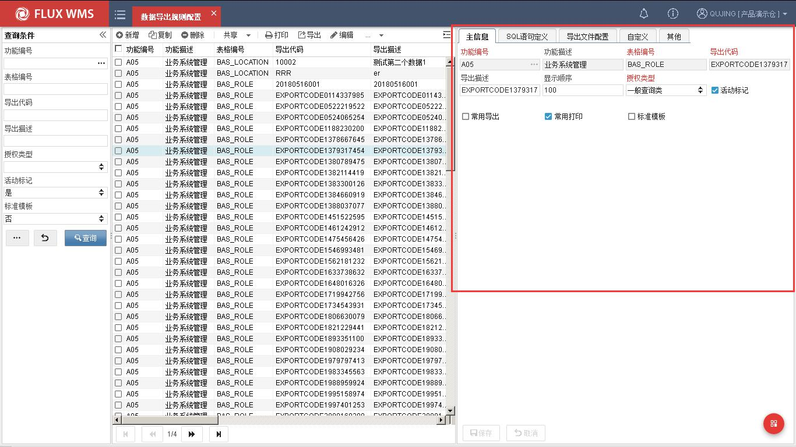

功能编号－功能 ID，系统根据此 ID，获取功能对应导出配置，显示为界面的导出选择项。

功能描述－功能对应名称描述。

表格编号－后台表名，即导出信息的来源。

导出代码－代码 ID，用于区分不同的导出处理。

导出描述－界面显示的导出选择项名称。

显示顺序－同一功能的多个不同导出的显示排序。

授权类型－系统提供一般查询类、业务操作类、业务管理类、系统管理类几个默认类型，方便将导出分类管理，批量进行授权设置。用户可以根据管理需要，自行在系统代码中设置更多的授权类型。授权类型取自系统代码“EXP_AUTH_TYPE”，支持自定义扩展。

活动标记－是否使用中的规则

常用导出－如勾选，则在对应功能的【导出】按钮的下拉菜单中显示，方便快捷操作。未勾选的导出，则在其他按钮下，“按规则导出”功能中，通过二级窗口选择执行操作。

常用打印－如勾选，则在对应功能的【打印】按钮的下拉菜单中显示，方便快捷操作。未勾选的导出，则在其他按钮下，“按规则打印”功能中，通过二级窗口选择执行操作。

标准模板－是否标准打印模板

<!-- 原 PDF 第 86 页 -->

  - 点击【保存】按钮，完成主信息设置

  - 在 SQL 语句定义页签，根据导出需要，维护各级查询语句，可以通过【测试】按钮检测语法问题，【格式化】按钮对 SQL 语句进行格式化整理。在语句执行时系统会自动校验 SQL 是否符合授权限制（即是否有组织、仓库、货主等条件），若无系统会根据业务表和实际用户授权自动增加查询条件。

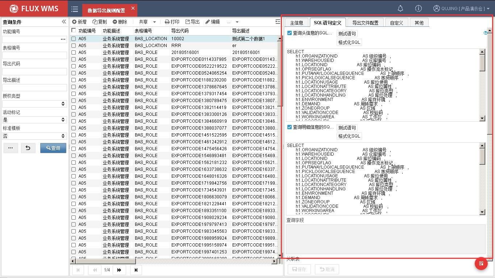

  - 在“导出文件配置”页签，维护数据导出的要求：

<!-- 原 PDF 第 87 页 -->

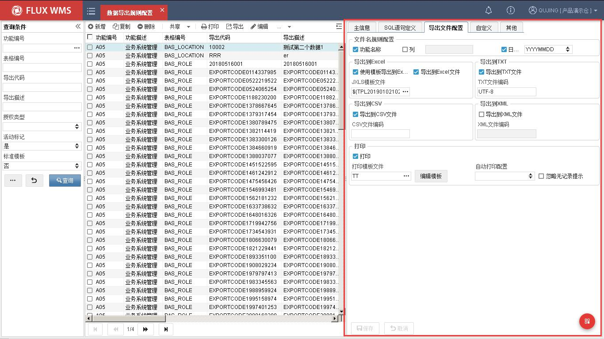

功能名称－导出文件使用功能名作为文件名前缀

字段 ID－导出文件名使用固定内容作为前缀

日期格式－导出文件名包含日期、时间戳信息。格式可选择。

导出到 XX－导出的文件格式配置。如勾选某种模式，在对应功能的打印/导出子菜单，此项导出会显示模式选择子菜单。不同导出模式，需要配置不同的设置。

使用模板导出到 Excel 文件－与普通的的“导出到 Excel 文件”功能相比，使用模板，可以指定不同的导出内容格式，一般用在生成客户指定格式的反馈报表中，如库存日报、发货报告等，通常会指定货主使用。所指定的模板格式，需要在“模板文件管理”功能中进行维护。

打印－如勾选“打印”，并配置打印模板，系统将会把此项导出，显示在打印子菜单中。如果未勾选，则仅作为导出项，而不是打印项显示。

普通打印－普通模板打印

打印模板文件－打印调用的模板，支持在线编辑模板。

PDF 打印－基于 URL 的 PDF 文件进行打印。

打印 PDF 相关规则－基于 URL PDF 文件打印时，修改内容的坐标。

  - 点击【保存】按钮，完成数据导出规则设置。

<!-- 原 PDF 第 88 页 -->

## 5.3. 自定义操作配置

类似导出、打印配置，自定义操作也需要在独立的功能中进行设置。

- **自定义操作配置**

  - 选择主菜单“业务系统管理”下的“自定义操作配置”。

  - 在左侧的查询条件栏位，输入查询条件，可查询已有记录。

  - 点击【新增】按钮，在主信息界面进行相关配置：

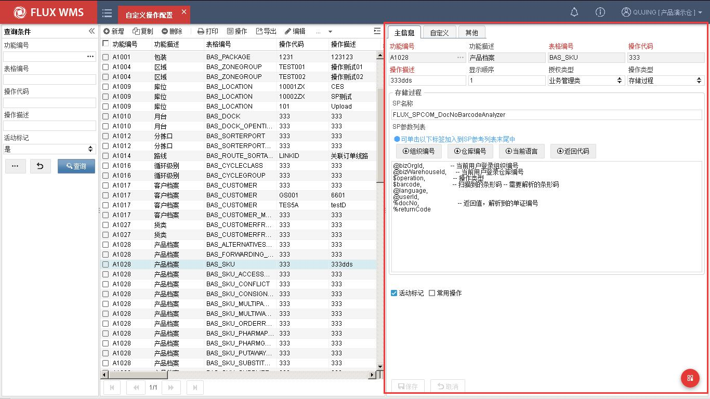

功能编号－操作对应的功能代码 ID

数据表名－操作对应的后台数据库表名。

操作代码－自定义操作的代码 ID。

操作描述－界面显示的自定义操作名称。

显示顺序－同一功能多个自定义操作的显示顺序。

授权类型－系统提供一般查询类、业务操作类、业务管理类、系统管理类几个默认类型，方便将导出分类管理，批量进行授权设置。用户可以根据管理需要，自行在系统代码中设置

<!-- 原 PDF 第 89 页 -->

更多的授权类型。

操作类型－使用 Java 类，还是存储过程模式来执行操作。

活动标记－是否使用中的记录。

常用操作－如勾选，则在对应功能的【操作】按钮的下拉菜单中显示，方便快捷操作。未勾选的操作项目，则在其他按钮下，“自定义操作”功能中，通过二级窗口选择执行操作。

Java 类名－Java 相关配置。具体内容由 IT 部门或者 FLUX 顾问提供，本项输入忽略大小写。

Java 方法－Java 相关配置。具体内容由 IT 部门或者 FLUX 顾问提供，本项输入忽略大小写。

SP 名称－存储过程相关配置。具体内容由 IT 部门或者 FLUX 顾问提供，本项输入忽略大小写。

SP 参数列表－存储过程相关配置。具体内容由 IT 部门或者 FLUX 顾问提供，本项输入忽略大小写。

  - 点击【保存】按钮，完成自定义操作设置。

- **SP 配置约定**

  - 符号@，代表系统动态参数。如当前用户、所属组织、当前仓库等。

  - 符合$，代表前台入参。如所属模块 ID、解析跟踪号、一二维码等。

  - 符号%，代表前台出参。

  - 前台配置出入参个数必须与后台 SP 一致，当不一致时前台提示报错。

## 5.4. 模板文件管理

与“数据导出规则配置”功能配合使用，可以预先定义好所需的模板，然后再指定哪种导出规则使用什么模板。

- **模板文件管理**

  - 选择主菜单“业务系统配置”下的“模板文件管理”。

  - 在左侧的查询条件栏位，输入查询条件，可查询已有记录。

  - 点击【新增】按钮，在主信息界面进行相关配置：

<!-- 原 PDF 第 90 页 -->

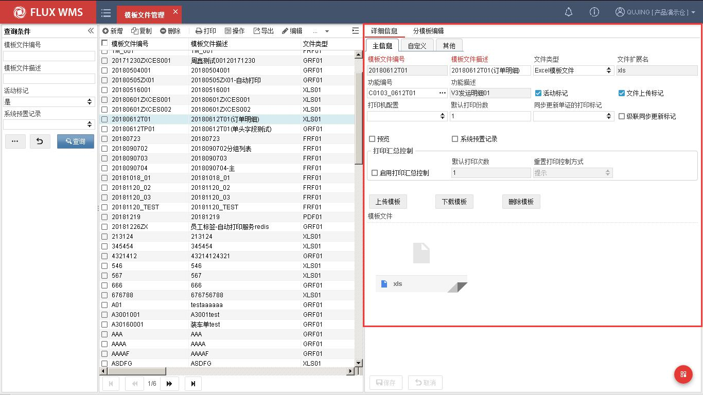

模板文件编号－模板文件的 ID，不可重复。

模板文件描述－模板名称。

文件类型－模板类型。系统目前提供 Excel、Grid++（打印格式）、PDF 模板类型供选择。

文件扩展名－根据所选类型，显示对应的固定文件扩展名。

功能编号－模板应用的功能对应功能 ID。

功能描述－功能名称。

活动标记－是否使用中的记录

文件上传标记－是否已经上传模板，由系统根据上传情况显示。

打印机配置－指定打印到特定打印机。可以实现标签从标签打印机打印，单据从激光打印机打印的效果。所指定的打印机，可以为不同电脑分别配置。

默认打印份数－一次打印时的输出份数。默认为 1.

同步更新单证的打印标记－打印后更新单据对应的打印标记。

级联同步更新标记－单据组打印时使用，例如从波次计划打印拣货单，除了更新波次计划的拣货单打印标记，可以同步更新发运订单中的拣货单打印标记。

<!-- 原 PDF 第 91 页 -->

预览－打印时是否需要显示预览界面。如果不预览，同时配置打印机，则可以实现后台打印输出效果。

启用打印汇总控制－是否启用打印次数控制。

默认打印次数－启用打印次数控制情况下，允许的打印次数。·

重置打印控制方式－超过默认打印次数时，系统处理方式。分为仅提示；人工清除打印标记重新打印；以及通过录入密码再次打印几种控制方式。

  - 点击【保存】按钮，完成主信息的设置。

  - 再点击【上传文件】按钮，通过如下对话框，选择模板文件上传。上传成功系统会更新“文件上传标记”。

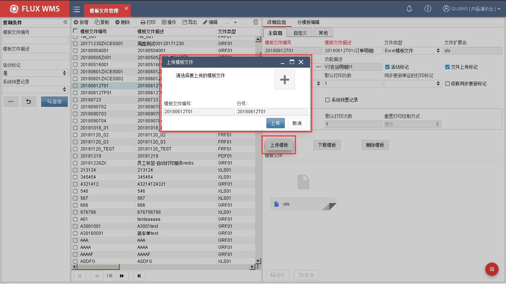

  - 已上传模板，可以通过点击【下载文件】按钮，下载查看。或者通过【删除文件】 按钮，删除已上传的模板文件。

- **分模板编辑**

有时候，同一个单据，由于内容不同，需要打印不同格式的内容。例如快递面单，需要根据不同承运人，选择不同面单格式进行打印。或者发货报告，需要根据不同收货人要求，配置不同的打印格式。

此类单据，系统采用分模板管理，同一个单据，根据所配置的条件，选择不同的单据模板、打

<!-- 原 PDF 第 92 页 -->

印机进行输出。使用时，需要先配置主模板信息，再进一步配置分模板信息。

  - 在“模板文件管理”中，选择模板主信息对应的“分模板编辑”页签。

  - 点击【新增】按钮，添加如下分模板信息：

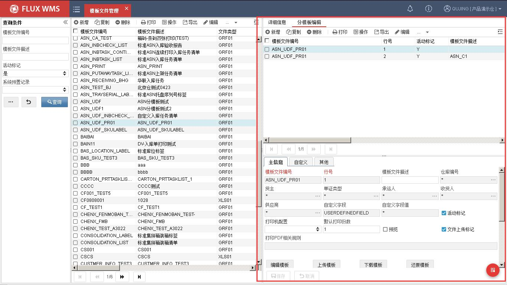

模板文件编号－模板文件 ID

行号－分模板行号

模板文件描述－模板文件名称描述

仓库编号－适用仓库。*为全部仓库适用。

货主－分模板货主条件。例如此模板适用与货主为 ABC 的入库单据。

单证类型－分模板单证类型条件

承运人－分模板承运人条件

收货人－分模板收货人条件

供应商－分模板供应商条件

自定义头信息字段－自定义分模板条件。指定发运订单头的某个字段作为分模板条件

自定义头信息字段值－自定义分模板条件的适用值。

<!-- 原 PDF 第 93 页 -->

活动标记－是否使用中的记录

打印机配置－指定打印到特定打印机。可以实现标签从标签打印机打印，单据从激光打印机打印的效果。所指定的打印机，可以为不同电脑分别配置。

默认打印份数－一次打印时的输出份数。默认为 1.

预览－打印时是否需要显示预览界面。如果不预览，同时配置打印机，则可以实现后台打印输出效果。

文件上传标记－是否已经上传模板，由系统根据上传情况显示。

  - 点击【保存】按钮，完成主信息的设置。

  - 再点击【上传文件】按钮，选择模板文件上传。上传成功系统会更新“文件上传标记”。

## 5.5. 自动打印配置

仓库内的固定作业，可以配置对应的自动打印服务，实现无需人为干预的自动打印输出。

例如订单通过接口下达，由定时器负责按波次规则运算生成波次订单、分配库存，完成分配的订单就可以通过自动打印配置，在指定的打印机输出本区域的拣货任务清单。具体拣货操作员工，根据打印的单据进行拣货操作，无需人工操作打印、通知、单据传递。

- **自动打印配置**

  - 选择主菜单“业务系统配置”下的“自动打印配置”。

  - 点击【新增】按钮，在“详细信息”页签维护主信息：

<!-- 原 PDF 第 94 页 -->

仓库编号－打印配置生效的仓库

主任务编号－打印配置编号，系统自动生成的流水号

主任务描述－打印配置描述

运行间隔（秒）－多长时间运行一次

任务类型－选择打印配置是一级结构，还是二级结构。一级结构只需要配置“SQL 语句定义”中的查询明细的语句内容。二级结构需要同时配置头信息、明细信息查询语句。

- **工作站－此任务需要在哪台电脑运行（工作站信息，在界面右上角的系统菜单，本地配置- 工作站中查看。相关配置请参考 3.5.2 系统信息部分的介绍） 打印模块文件－二级窗口选择打印所用的模板文件，支持单据、标签等不同打印配置。**

相应模板在业务系统配置-模板文件管理中配置。目前支持 grf 报表（Grid++）以及 PDF 模

板。

- **复查状态－不可编辑字段，预设给 IT 部门/DAB 审核报表查询语句时使用。**

- **分组－作为在使用自动打印界面的分组查询条件，用于数据临时过滤。打印机－打印输出的指定打印机，可配置主打印机（主打印机必输）、备用打印机。打印机类型－打印机是标签打印机，还是激光打印机。分区情况下必选**

<!-- 原 PDF 第 95 页 -->

是否分区－

活动标记－

授权类型－从界面新增记录时，默认为客户端类型，不可编辑

  - 点击【保存】按钮，完成新增记录主信息操作。

  - 由于一个订单作业时可能有多个打印需求（例如订单的拣货任务清单和出库标签） 有可能需要使用到不同的打印机输出，因此系统支持一个方案下多个打印任务。在 “主任务信息”页签，点击【新增】按钮，维护如下内容：

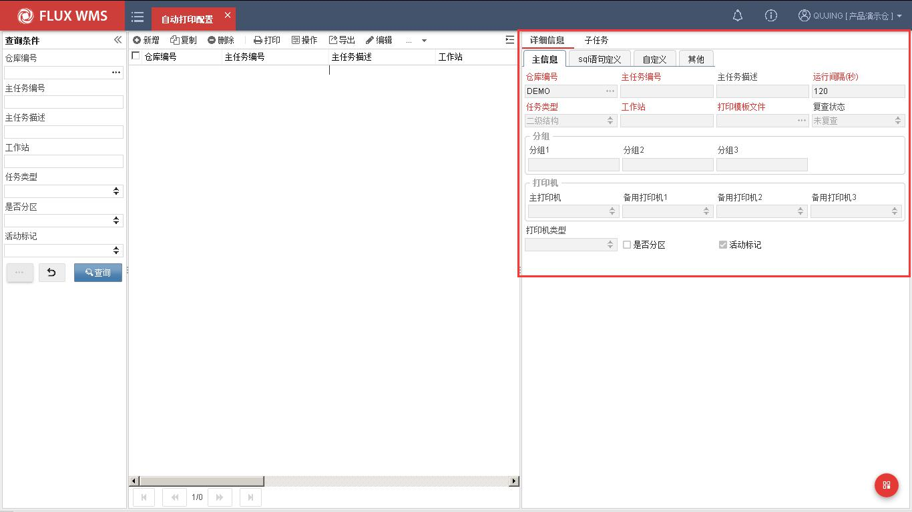

  - 点击【保存】按钮，完成主信息维护

  - 在“SQL 语句定义”页签，根据业务要求维护查询需要打印的记录的 SQL 语句，以及打印成功后更新打印标记的更新语句：

<!-- 原 PDF 第 96 页 -->

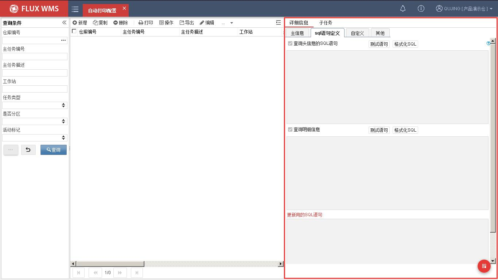

  - 点击【保存】按钮，完成主信息维护

自动打印配置完成，可以在系统的“自动打印”模块查看打印执行情况。

## 5.6. 标准业务扩展配置

标准业务扩展功能，是提供给现场自行添加操作前、操作后个性化处理的灵活配置。例如有些现场要在扫描 sku 时，对特殊产品给予特殊提示或者控制。这些能够通过个性化校验逻辑来支持。

- **标准业务扩展配置**

  - 选择主菜单“业务系统配置”下的“标准业务扩展配置”。

  - 点击【新增】按钮，在“详细信息”页签维护主信息：

<!-- 原 PDF 第 97 页 -->

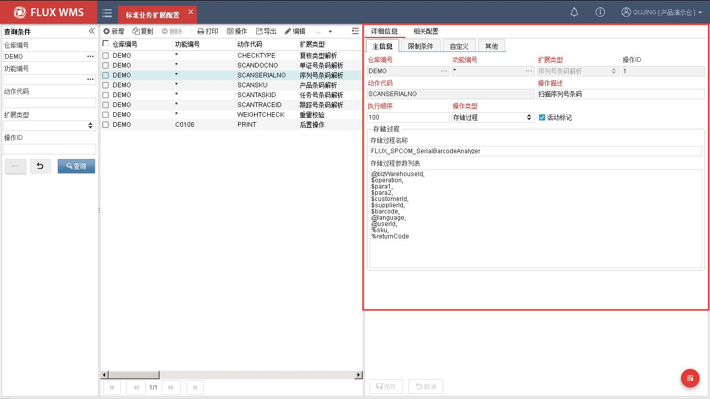

仓库编号－个性化处理生效的仓库

功能编号－处理对应的功能代码

扩展类型－个性化处理分类。例如是扫描解析，还是操作前或操作后执行的额外处理。

操作 ID－扩展操作的代码

动作代码－在指定的标准动作基础上，进行前、后扩展操作，或者解析等处理。

操作描述－扩展操作的描述

执行顺序－同一标准操作的多个扩展操作的执行顺序。

应用服务器 ID－扩展操作可以在指定运行的服务器，不同操作分别部署。

操作类型－扩展操作的执行类型。例如通过存储过程执行，或者通过 JAVA 类执行。

活动标记－记录是否生效

JAVA 类－调用 JAVA 类方法时的相关信息配置。

存储过程－调用存储过程时的相关信息配置。

  - 点击【保存】按钮，完成新增记录主信息操作。

  - 在“限制条件”页签，根据业务需要，输入执行扩展操作的限定条件

<!-- 原 PDF 第 98 页 -->

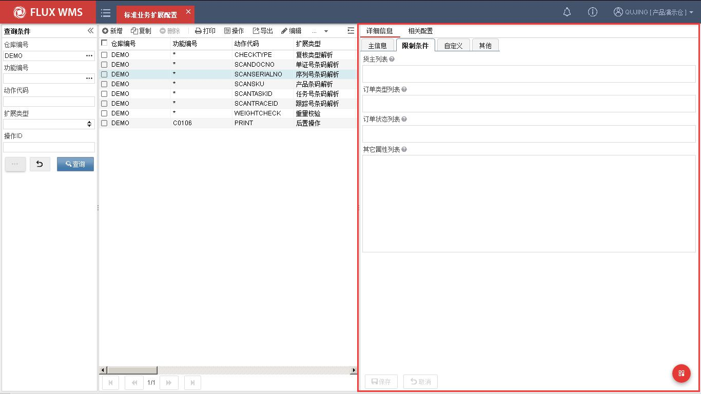

  - 点击【保存】按钮，完成扩展配置设置。

  - 多个值配置，可使用逗号或者空格分隔。

  - 部署后，系统将自动加载扩展配置，间隔时间 1 分钟。
