# 6. 基础设置

> 来源：`富勒WMS系统用户手册_V6_高清版（维他命）.pdf`，原 PDF 第 99 页起。
> 本文件按原 PDF 正文标题拆分；原文截图已提取至同目录 `assets/`。

<!-- 原 PDF 第 99 页 -->

## 6.1. 基础设置概述

基础设置是整个 FLUX WMS 的运作基础。基础设置包括了众多客户、产品设置等操作管理相关内容。这些内容是在 FLUX WMS 的模块中用来建立客户仓库的管理需求和轮廓的。基础设置的部分并不包括对业务规则的定义（请参考相应的章节）。

基础设置是每次成功实施项目的关键，请记住“垃圾进，垃圾出”的原则。

基础设置是有前后次序的。比如只有设置了系统代码、包装、批次属性等，才能够设定库位、客户、产品等。在产品档案设置中需要使用的装箱、循环级别等信息，也最好在货主、产品信息维护前，设置完成。

这个过程需要预先考虑和计划，因为正确地设置是 FLUX WMS 在您的业务环境下的每次成功实施的关键。

而 FLUX WMS 界面的功能排序，是考虑到功能应用的频繁程度来安排的，与初始设置的次序并不完全一致。

## 6.2. 包装

包装功能用于维护产品的包装设置，是产品不同包装层级（如箱、托盘）对应关系的设置表。

每种包装代码内可使用一种或多种度量单位。度量单位是数量的一种类型，也是包装的一个组成部分，例如盒、箱、托盘或者桶、套等。一般产品情况和操作要求以及仓库存储管理方式决定了需要使用的度量单位。在建立一个新的包装代码时，用户必须指定与这个包装有关的、所有的度量单位以及使用这个包装的产品所使用的度量单位。

用来刻划产品的度量单位称为主单位，用来计算库存余额的也是主单位，通常情况下选择最小可销售单位作为主单位，例如棉签，不会按根销售，如果是电商仓库允许按盒发运，主单位会选择为盒。但批量管理的仓库，不做零售发运，只进行整箱（一箱若干盒）管理，此时可选择主单位为箱，进出作业都不拆箱。

在建立一个新的包装代码时，用户需要决定合适的包装级别作为主单位，例如件还是盒。其它包装级别基于主单位进行换算后来显示数量。例如同样的货品，批发业务仓库，主单位是盒，那么一箱=10 盒，但如果在零售仓库，可能拆零销售，主单位选择为件，一箱=100 件。

<!-- 原 PDF 第 100 页 -->

仓库中，可以为不同产品分别设置包装，也可以多个产品使用相同包装设置。

- **包装**

  - 选择主菜单“基础设置”下的“包装”功能。

  - 在左侧的查询条件栏位，输入查询条件，查询已有记录。

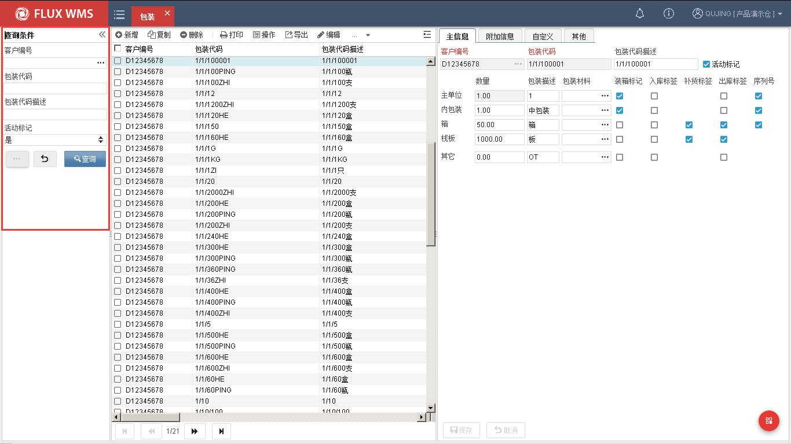

  - 或者在右侧界面上方的按钮栏，直接点击【新增】按钮，添加记录。

  - 在“主信息”页签，依次输入以下信息：

<!-- 原 PDF 第 101 页 -->

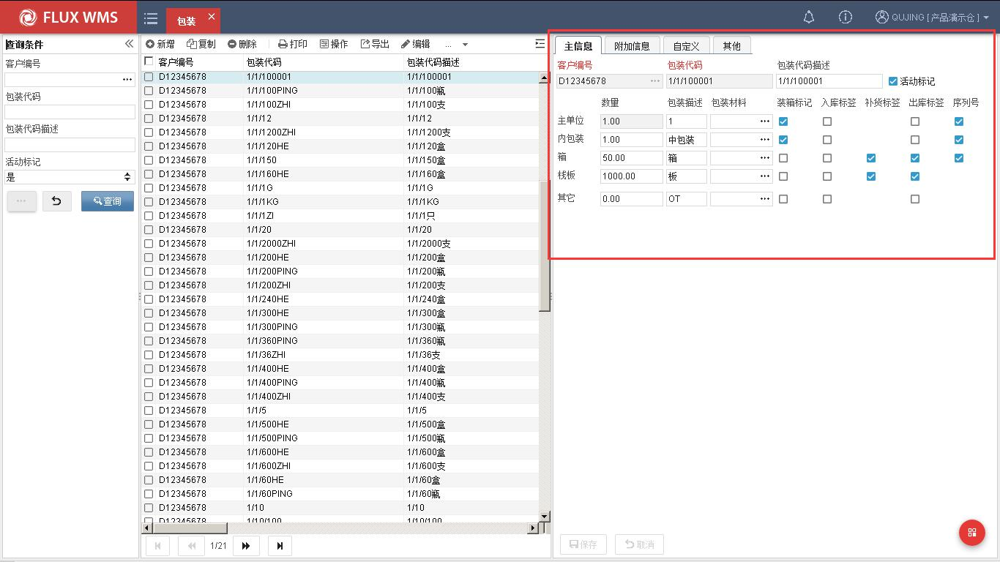

包装代码－包装设置的名称代码。

包装代码描述－包装的名称。

代码和描述最好能够比较直接的反应包装级别组成，便于后续操作使用，能够比较直观的了解包装层级信息。

活动标记－此包装记录是否使用。

主单位数量－产品包装的最小单位。系统默认设置为‘1’，不可修改。但系统在作业中支持类似 0.5 件这样的非整数作业数量，具体显示小数位，根据参数配置确定。

主单位描述－针对主单位级别的包装描述。例如：瓶、听、件等。系统提供默认值：EA （Each），客户可根据自身的需求进行更改。

包装材料－下拉列表选择，主单位的包装使用材料。例如纸盒、塑料袋等。列表内容在系统代码或产品组件中维护 （PAC_MAT_BOM=Y 时界面显示二级框，取组件记录;PAC_MAT_BOM=N 时界面显示下拉框，显示系统代码 PAC_MAT 配置项），可选信息内容，但使用耗材库存扣减管理情况下，需要维护包装所用的耗材，以便相应处理耗材库存。

内包装数量－内包装中含有主单位的数量。例如内包装数量为 6（例如听装可乐，6 瓶一个软塑封装，这一包就是一个内包装），则表明 1 个内包装中有 6 个主单位。

内包装包装描述 － 内包装级别的包装描述。系统提供默认值：IP（Inner Pack），客

<!-- 原 PDF 第 102 页 -->

户可根据自身的需求进行更改。

内包装材料－内包装级别所用材料。

箱数量－每箱中包含主单位的数量。

箱包装描述－箱单位级别的包装描述。系统提供默认值：CS（Case），客户可根据自身的需求进行更改。

箱包装材料－箱包装级别所用材料。

栈板数量－栈板（也被称为托盘）中包含主单位的数量。由于数量都是以主单位为基数维护，如一箱 10 件，一托盘 10 箱的级别关系，需要维护为 1 托盘=100 主单位。

栈板包装描述－栈板（托盘）单位的描述。系统提供默认值：PL（Pallet），客户可根据自身的需求进行更改。

栈板包装材料－栈板包装级别所用材料。

其他数量－客户根据需要自行配置的包装层级中中包含主单位的数量。

其他描述－其他层级的包装描述。系统提供默认值：OT（Other），客户可根据自身的需求进行更改。

其他包装材料－其他包装级别所用材料。

装箱－在相应的包装级别中打勾，表示在该包装单位级别需要进行复核装箱操作。如果不选择，分配时默认此包装级别不需要进行复核装箱，分配明细中的装箱标记默认为“Y”。（复核装箱操作详情请见出库操作的出库复核功能部分）

入库标签－在相应的包装单位级别中打勾，表示在该包装单位级别打印收货标签。系统的自动码盘也将根据所选择的包装单位级别进行记录拆分。

补货标签－补货操作中，如果一次性补货数量较多，可以通过这个设置控制任务的标签打印。例如 2 箱补货，勾选箱级别，系统会输出 2 个任务标签，而未勾选箱级别，则输出一个任务标签，要求补货 2 箱。

出货标签－在相应的包装单位级别中打勾，表示在该包装单位级别打印出货标签，同时拣货任务也将根据出货标签单元的选择来分割或合并分配到的拣货记录。

序列号－序列号管理模式中，扫描的序列号对应到哪个包装级别，可在此处设置。由于系统会校验序列号数量与货物数量是否相符，需要告知系统采集哪些包装层级对应的序列号，即箱序列号还是单品序列号，以便系统进行数量换算比对。注意并不是 5 级包装每级都支持序列号管理。

<!-- 原 PDF 第 103 页 -->

  - 点击页面下方的【保存】按钮，完成记录保存

  - 点击附加信息页签，可维护单位对应的长宽高信息：

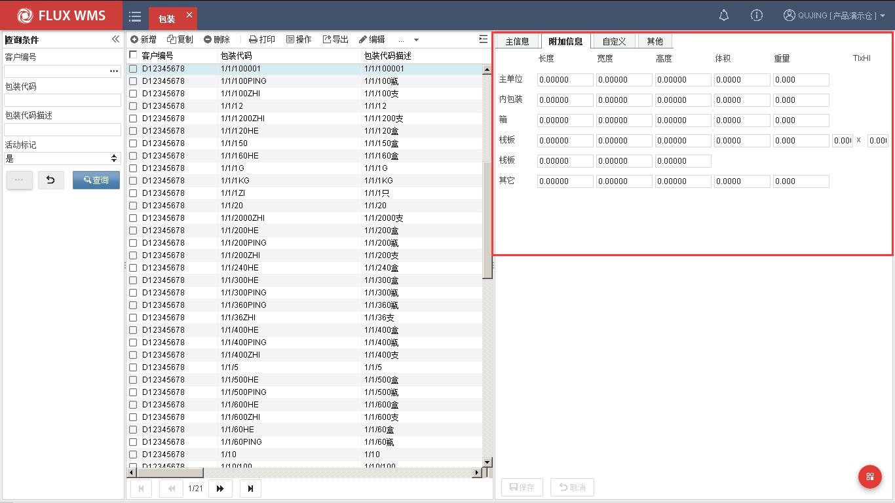

输入各包装的长度、宽度、高度、体积、重量，以及托盘的 TI，HI。

注：栈板中分两行。第一行的长度、宽度、高度、体积是指栈板上的可堆放产品总的长度、宽度、高度、体积，TI 指栈板上一层能放几箱，HI 指栈板上能放几层，用于指导现场进行标准化托盘堆码。

第二行的长度、宽度、高度、体积指栈板本身的长度、宽度、高度和体积。

  - 点击【保存】按钮，完成新增包装操作。

<!-- 原 PDF 第 104 页 -->

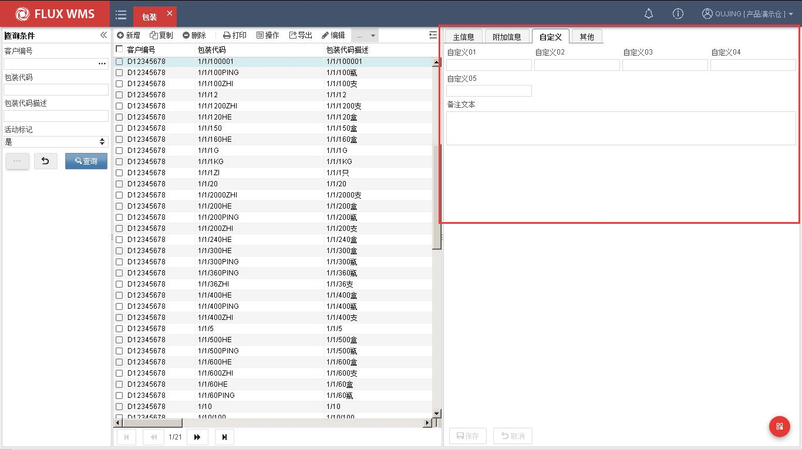

  - 如有需要，可以在自定义页签维护自定义、备注信息。

  - 在其他页签，能够查看到记录的新增、编辑以及版本信息

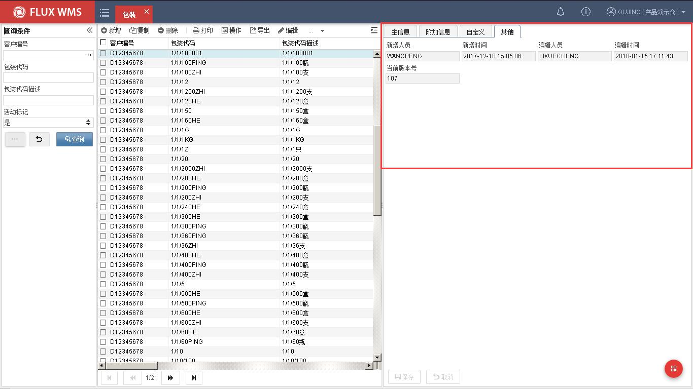

注：版本号信息是记录的修改次数记录，每次更新保存，版本号+1。通常在接口下达时用作更

<!-- 原 PDF 第 105 页 -->

新比较。

  - 对于液体包装，可通过系统配置（代码 PKG_CVT）的切换，采用非级别递进方式的维护包装信息。例如 1EA=1 桶，1CS=75 升，1PL=120 公斤，代表 1 桶=75 升，1 桶=120 公斤。

## 6.3. 批次属性

批次属性功能用于定义批次属性配置及其详细资料。

仓库中的产品是和批次属性联系在一起的，批次属性是指能够区分相同商品的不同的属性。例如：一个食品生产商可能根据食品的保质截止日期来划分（从生产日期计算）；一个服装生产商可能根据服装面料的供应商来分批次属性。

批次属性规则是一个表示不同商品的类似属性的集合。批次属性规则的确认是根据货主的管理要求设置的，通常是出库时可能用来区分货物的附加信息。如果出库时不需要区分货物，一般不建议增加过多的批次属性跟踪信息，越多的信息会对进出库操作带来更加精细的指令要求。

货主可以用收到货的日期、批号（生产商指定的）、颜色、截止日期、生产日期等等信息来定义批次属性。

而批次号是 FLUX WMS 系统在收到货物时根据不同的批属性而自动产生的流水号。

自动的批次号＝客户＋产品＋12 个标准批次属性+12 个扩展批次属性。

只要客户、产品和 24 个批次属性内容这些信息中有一个与库存已有记录不同，系统就会生成一个新的流水批次号表示这一系列的内容，以便同其他货物加以区分。

由于不同客户甚至不同产品所需记录的批次属性信息各不相同，这些信息还需要记录到库存中，并在出库操作中应用，因此系统采用批次属性代码来规划不同的属性信息记录要求，并提示用户，不再需要人为记忆不同货主的不同要求。

- **批次属性代码设置**

  - 在主菜单“基础设置”下选择“批次属性代码”。

  - 点击按钮栏的【新增】按钮，在“主信息”页签依次输入以下信息：

<!-- 原 PDF 第 106 页 -->

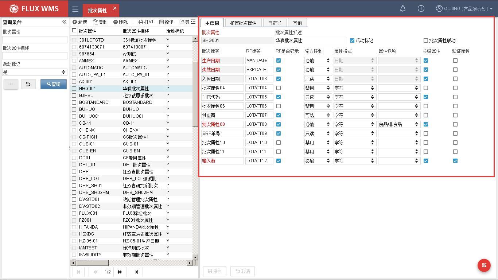

批次属性代码－产品批次属性规则的代码。

批次属性代码描述－产品批次属性规则的名称描述。

活动标记－此属性规则是否生效

批次标签－批次属性在 WMS 界面显示的名称。生产日期、失效日期和入库日期是系统预留的，并且不能更改，只能根据需要选择使用与否。而批次属性 08（lot08）字段可以通过参数配置（LCK_L08），锁定为良品不良品区分字段。锁定字段的目的，是使用不同批次属性规则的不同产品，可以沿用相同的保质期管理逻辑，避免不同产品将日期或良品属性放在不同字段，难以统一管理。

RF 标签－在 RF 终端设备上显示的批次属性名称。可以与 WMS 界面显示不同。主要原因是 RF 界面位置有限，经常需要以缩写形式显示。

RF 是否显示－有些批次属性信息，在原始单证上已经存在，不需要作业人员现场核对或者录入，可以在 RF 界面上隐藏，从而避免错误修改。通过 RF 显示字段控制哪些批次属性 RF 上可见。

输入控制－控制相对应的批次属性的输入情况，系统提供禁用、必输、可选、只读几种选择。必输字段，在收货时如果批次属性内容为空，会提示并不可收货。只读主要用在接口传递的信息，现场不允许修改的业务情况。

属性格式－相对应的批次属性的格式，系统提供字符、数字、日期、日期时间 4 种选择。

<!-- 原 PDF 第 107 页 -->

属性选项－相对应的批次属性的可输入值，如启用该字段能够限定输入的内容，以下拉列表的模式提供选择，避免相同信息不同操作员输入内容不同（如红色，输入为红、大红、RED 等），导致批次拆分。系统提供良品/非良品、组装状态、库存选择、YesNo 等多种预设选择，并可根据业务需要在系统代码中自行配置（详见后续批次属性下拉列表设置相关说明）。

关键属性－针对上架规则中，“不允许混放批次”和“库位内必须有相同批号的库存” 等控制项。在判断批次是否混放或者是否相同时，有时仅需要根据批次属性中的某一个或某几个进行判断，而批次号可能不同，例如相同供应商的货物可以放置在同一库位，不需考虑入库日期是否相同。此时可将这个批次属性项设置为关键属性，系统在上架规则判断中，根据勾选的批次属性关键项进行混放或相同判断，而不是根据批次号进行判断。

验证属性－某些货物对批次敏感，在出库、移动等作业时需要对货物的批次属性信息进行验证、比对。但通常情况下并不需要比对全部批次属性，仅对关键信息进行比对即可。例如电子元件，出库时需要比对生产批号信息，避免拣错批次，但无需比对入库日期、供应商批次属性内容。这些属性可以标记为验证，作业时会要求录入，由系统比对、校验。

  - 点击“保存”按钮，完成新增批次属性规则的操作。

  - 选择“扩展批次属性”页签，继续维护扩展属性设置。一般将较少使用的，无需现场修改的信息（例如入库报关单号等可以提前从单据中获取

的信息），通常用作扩展批次属性。维护界面与主批次属性相同，如下图所示。

<!-- 原 PDF 第 108 页 -->

  - 根据需要，在自定义页签维护备注等信息。可在其他页签查看记录创建、编辑信息以及版本信息。

- **批次属性下拉列表设置**

部分情况下，批次属性需要输入的内容有限，例如颜色，为了避免不同操作员输入不同的内容表示相同的信息，如红色、红、正红、RED 等，导致批次琐碎，可以通过配置，将批次内容设置为下拉列表选择，限制用户的录入内容，达成统一输入的目的。

首先在业务系统管理-系统代码功能中，增加代码，例如 COLOR（颜色），并勾选“批次属性使用标志”选择框（如下图 6-3-3），系统会把这个代码作为批次属性的可指定属性内容。在批次属性规则的属性选项中可见配置的颜色代码选项（如下图 6-3-4）。

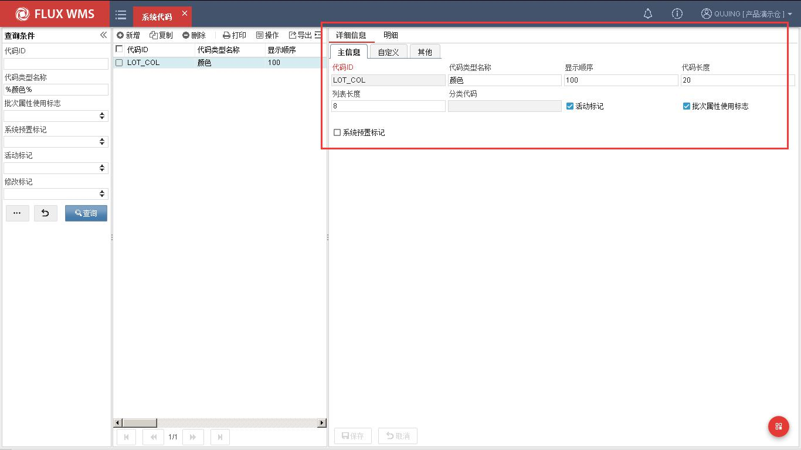

<!-- 原 PDF 第 109 页 -->

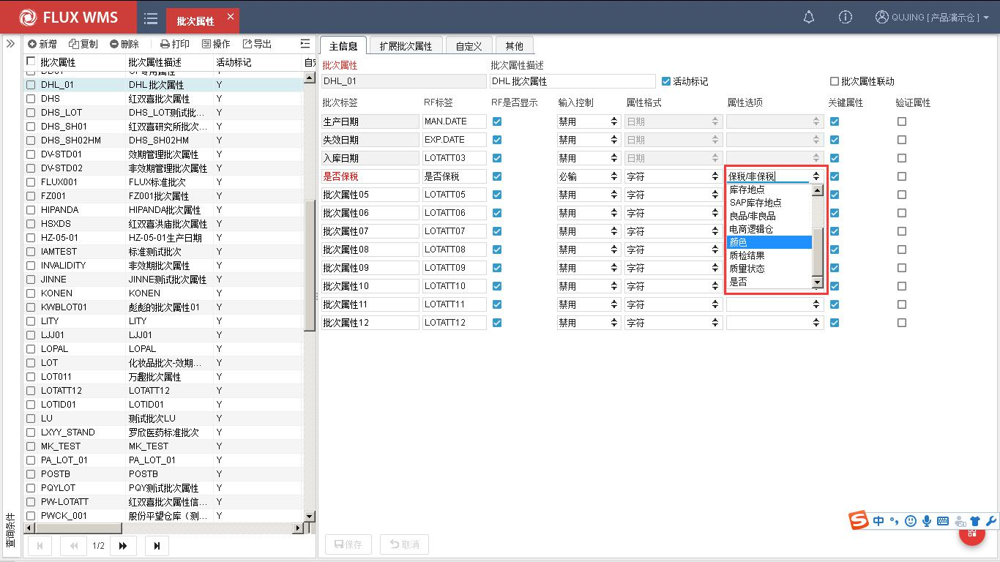

然后，在系统代码功能中，这个 COLOR 代码的明细部分，维护各种颜色内容，如红色、黄色、蓝色。这些是 ASN 中可见的下拉列表的显示内容。同样的，勾选“默认代码标志”的代码记录将作为新增 ASN 明细记录时的批次属性默认值。

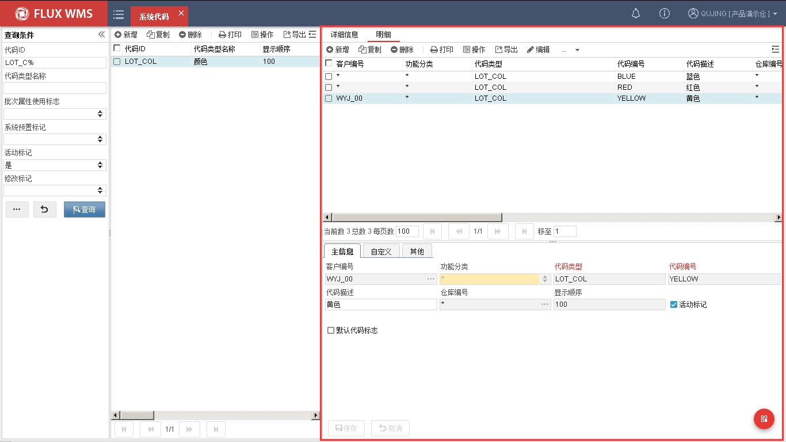

<!-- 原 PDF 第 110 页 -->

配置完成后，使用这个批次属性规则的产品，在收货单据中，对应批次属性项只能通过下拉列表选择 COLOR 下的具体代码，例如红色、绿色，而不能任意录入内容。

对于下拉列表内容较多的属性，在单证中，也支持输入部分内容快速定位到相关属性，但同样不允许输入列表之外的内容。

- **批次属性联动**

若勾选“批次属性联动”字段，则“批次属性 05”属性下拉框显示系统代码 LOT_ATT_UAB05 下的所配置的明细记录；“批次属性 06”属性则显示系统代码 LOT_ATT_UAB06 对应明细，并仅显示“LOT_ATT_UAB05”相同分类(Category)的数据。

配置后可以实现“批次属性 05”选择大类，“批次属性 06”显示此大类下的具体记录的作业模式，类似地址选择时，选择了“省”之后，再选择此省内具体“市”的效果。

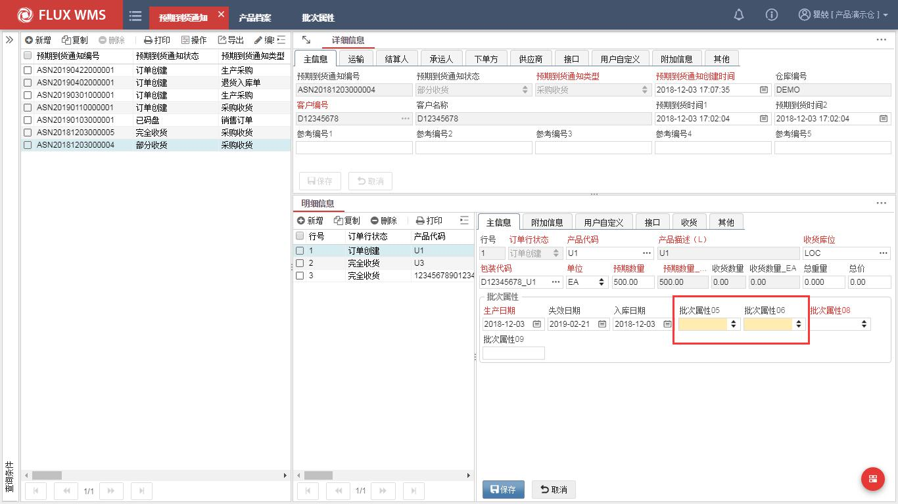

## 6.4. 循环级别

循环级别主要用于巴雷托分析法（ABC 分类法）优化仓库布局，即约 20%的货物，进出量可能占仓库总量的 80%，因此这些货物存放在最方便操作的库位（例如靠近巷道口、输送线投放口，或者层高最方便拣选的作业层），能够大幅度提升仓库作业效率。

<!-- 原 PDF 第 111 页 -->

但不同作业模式下，货物统计、排序方式不同，级别划分也会根据需要波动，并不限定只能是 60%、85%的 ABC 等级分隔线（即排位比率前 60%设置为 A，60%~85%设置为 B 级，85%~100% 设置为 C 级的最常见分级标准）。因此需要对每个级别先行定义，可以配置多种不同的级别规则。不同的仓库，甚至不同产品，进行分级时的依据也有可能不同。

- **循环级别设置**

  - 在主菜单“基础设置”下选择“循环级别”功能。

  - 点击【新增】按钮，在“主信息”页签，维护循环级别的规则编组名称信息，如下图。

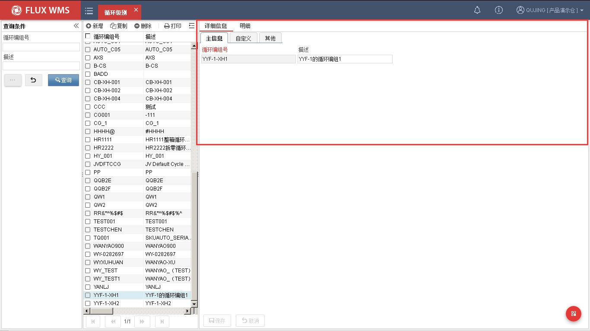

  - 保存后，在对应的明细部分，进一步维护分级标准信息，如下图所示：

<!-- 原 PDF 第 112 页 -->

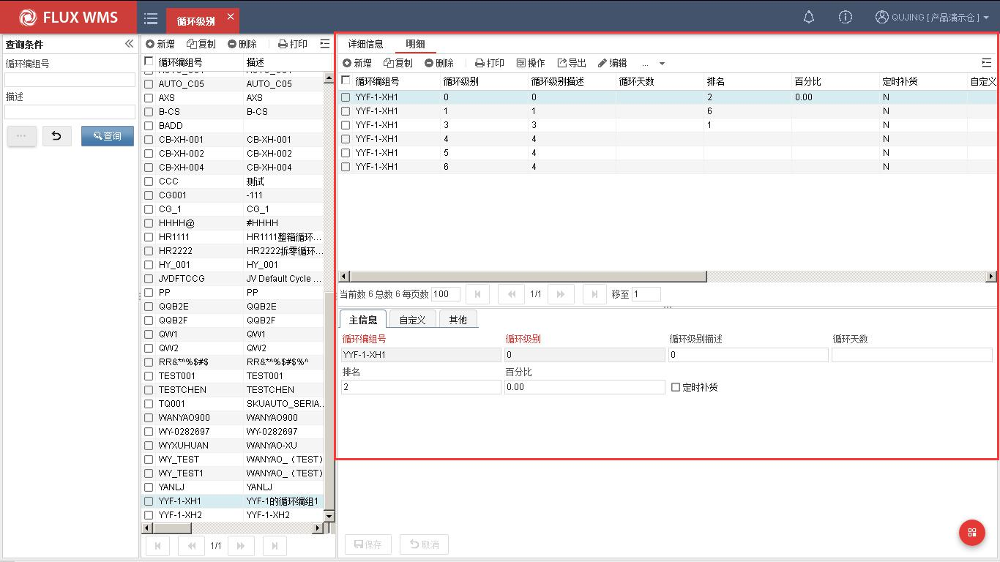

循环编组号－循环级别组代码。

循环级别－循环级别代码。

循环级别描述－对该级别的描述。

外文名称－对该级别的外文描述。

循环天数－循环级别设定周期天数。

排名－级别排序。例如前 10 位是 A 级（排名字段输入 10），10~50 是 B 级（排名字段输入 50）。后续级别的排名必须大于前一级别。

百分比－该级别货物的周转率在全部货物周转率排序中所在百分位。通常排名与百分比方式二选一，不会同时使用。

定时补货－此类产品是否参与定时补货。通常慢速周转的产品，不参与大批量的定时补货，但执行订单驱动补货。

  - 点击【保存】按钮，完成此级别设置操作，所添加的记录在上方列表部分显示。

## 6.5. 货物类型

在管理产品时，有时需要根据货主的要求对产品进行分类管理，如电器类、食品类或是选装件、

<!-- 原 PDF 第 113 页 -->

唯一件等，不同类的产品管理方式也会有所不同。货物类型就是提供给客户自行定义产品类别的功能。

- **货物类型**

  - 在主菜单“基础设置”下选择“货物类型”功能。

  - 点击【新增】按钮，在详细信息部分的“主信息”页签，维护此货类的描述以及默认管理规则等信息，如下图。

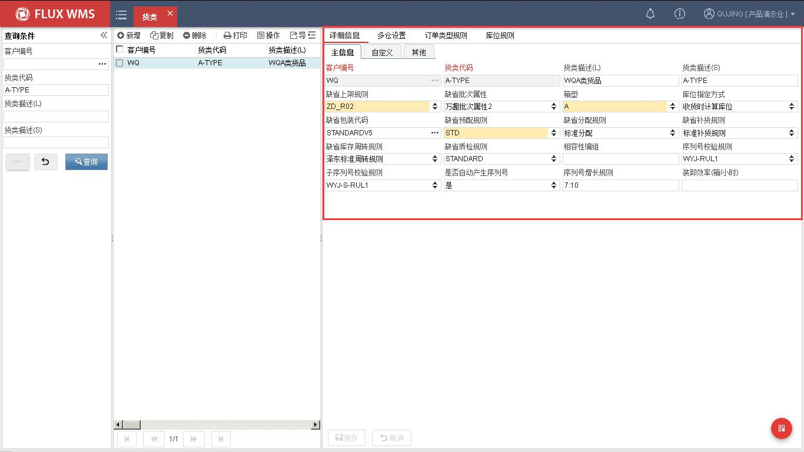

客户编号－货类所属的货主代码。货类是从属于货主的产品分类方式，不同货主间的货类不会共用，因此维护货类代码信息时，需要指明所属的货主。

货类代码－货类代码 ID

货类描述－货类代码的描述信息，系统提供母语（L）、外语（S）两个字段。

缺省规则－不同类型产品的管理要求不同，可以在货主默认的管理信息基础上，为不同货类分别维护不同的上架、分配、补货等管理规则、以及默认包装代码、批次属性规则等内容。

相容性编组－有些货主管理多种不同类型的产品，出库时某些类型不能装在同一物流容器内，例如食品与蚊香片不能装在同一出库包装箱，洗衣粉与口服液不能混装箱等。通过相容性编组字段，将不可混箱的产品类别，设置为不同编组，系统在计算装箱/拣货

<!-- 原 PDF 第 114 页 -->

箱分派时会将不相容的产品强制拆箱。

序列号校验规则－1 级序列号管理时，遵循的序列号校验规则。需要先在业务规则-序列号规则功能中配置对应内容。

子序列号校验规则－2 级序列号管理时，子序列号遵循的序列号校验规则。需要先在业务规则-序列号规则功能中配置对应内容。

是否自动产生序列号－如勾选，根据序列号区间自动产生序列号列表。

序列号增长规则－自动产生序列号情况下，序列号增长的逻辑。输入内容要求结构为 X:Y，代表序列号的第 X 位到第 Y 位为自然增长的整数序列。

装卸效率（箱/小时）－主要用于月台预约时，根据货量计算所需卸车时间，从而得到月台占用时长管理过程中。不同产品装箱效率不同，可以按照货类进行设置。

  - 点击【保存】按钮，完成货物类型的新增操作。

  - 根据需要维护多仓设置

如果同一个货类在不同仓库的管理要求不同，可以在“多仓设置“页签，进行对所选货类代码进行相关维护，如下图。

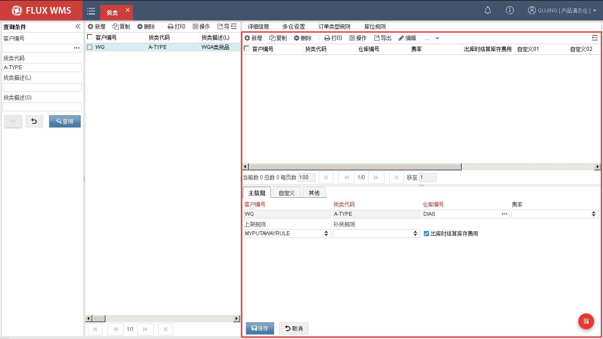

客户编号、货类代码－继承主信息内容，不可修改

<!-- 原 PDF 第 115 页 -->

仓库编号－当前多仓记录对应的仓库。可以通过二级窗口选择。

费率－此类货品，在指定仓库中的计费时所采用的费率。

上架规则、补货规则－此类货品在指定仓库中的默认规则

出库时计算库存费用－选择后，系统仅在产品发运出库时计算其全部库存费用，在库内的存货不计算库存费用。

  - 单据类型设置

如果不同仓库中，不同订单类型的管理要求有不同，也可在货类中进行相应配置，如下图

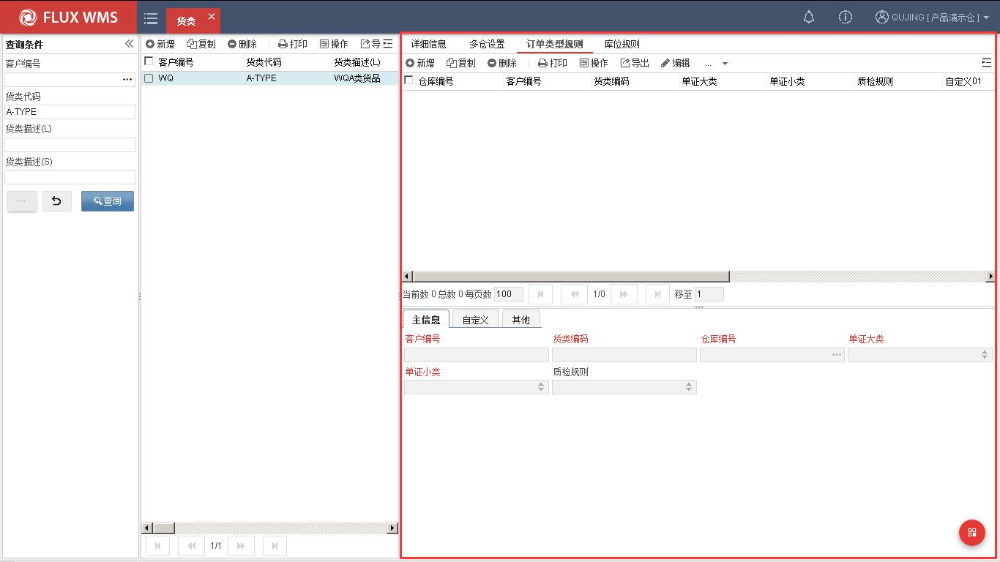

可以为不同仓库，不同订单类型分别定义指定的质检规则。

## 6.6. 装箱

装箱功能，主要用于预先定义操作中所用的周转箱的尺寸等信息，便于系统装箱计算或对体积等信息的统计。

由于仓库中经常不同产品使用的周转箱体积大小不同，甚至不同货类用的周转箱不是同一套系列的情况，因此在系统中可以维护多套装箱体系，并可区分多个仓库共用的公共装箱信息，或者单独某个仓库使用的局部装箱信息，通过“公共”、“局部”页签能够切换查看

<!-- 原 PDF 第 116 页 -->

- **装箱设置**

  - 在主菜单“基础设置”下选择“装箱”功能。

  - 选择对应维护公共箱型记录还是局部箱型记录。

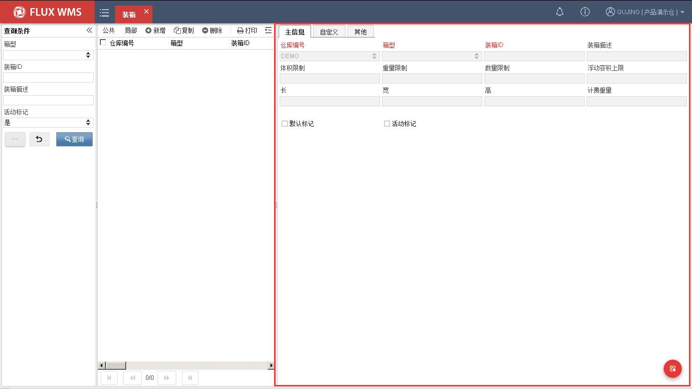

  - 点击【新增】按钮，在“主信息”页签，依次输入以下信息：

<!-- 原 PDF 第 117 页 -->

*[图 6-6-2]（原 PDF 第 117 页，图像未能从 PDF 对象中直接提取）*

仓库编码－当前仓库代码 ID。

箱型－装箱组合代码。例如 A 组合是大箱组合，B 组合是小箱组合。

装箱 ID－周转箱类型代码。

装箱描述－周转箱名称描述。

体积限制－周转箱容量上限信息。

重量限制－周转箱容量上限信息。

数量限制－周转箱容量上限信息。

浮动容积上限－如果尾箱容纳的产品体积可在浮动容积上限范围内容，可直接与前一箱并箱，以减少派箱的数量。

长－周转箱尺寸信息。

宽－周转箱尺寸信息。

高－周转箱尺寸信息。

计费重量－理论重量用于费用计算，常用于无实际称重条件的作业模式中。

默认标记－是否此装箱组的默认箱型 ID。

活动标记－是否使用此装箱 ID。

  - 点击【保存】按钮，完成设置操作。

## 6.7. 海关 HScode

HS Code 是 Harmonized System Code 的缩写，是国际海关公认的进出口产品分类标准。使用正确的名称和编码是出口营销中的重要方法。

在 FLUX WMS 系统中提供海关 Hscode 功能维护 HSCode 代码，供产品档案选择使用。

- **海关 Hscode 设置**

  - 在主菜单“基础设置”下选择“海关 HSCode”功能。

  - 点击【新增】按钮，在“主信息”页签。依次输入 HS 编码、描述（提供母语、外语描述字段）信息，在“自定义”页签，系统提供 20 个自定义字段以及备注字段。

<!-- 原 PDF 第 118 页 -->

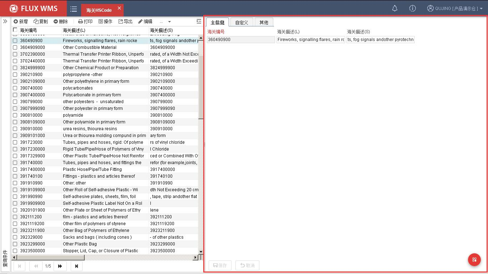

  - 点击【保存】按钮，保存设置。

## 6.8. 客户档案

客户档案是用于定义客户、客户类型和客户管理要求的详细资料。

在 FLUX WMS 中，货主是用于区分产品货权从属的依据，同时，客户档案还用于记录供应商、承运人、结算人等的信息。

客户类型是用于对客户进行分类，每一个客户必须对应一个客户类型。客户类型的定义是系统代码中进行的，用户也可以自行添加其他的客户类型，但新增的类型，系统中不会有相应特殊处理，仅用于区分客户。

系统提供的默认客户类型包括：

  - 货主－产品的所有者。通常是仓库进出产品、提供服务的主要对象。

  - 收货人－产品交付的客户对象，即发货对象。

  - 供应商－产品采购的客户对象、货物来源。

  - 承运人－提供产品运输的客户对象。

<!-- 原 PDF 第 119 页 -->

  - 结算人－除货主之外的，支付仓库服务费用的客户对象。例如仓库中有货主 A 公司、B 公司，但 2 家公司的相应费用都由其代理商 C 公司支付，而 C 公司本身没有货物在仓库中，C 公司就是结算人。

  - 下单方－有权代替货主下达进出库订单的代理商或经销商等。

  - 其他－其他类型的客户。

- **客户档案设置**

  - 在主菜单“基础设置”下选择“客户档案”功能。

  - 点击【新增】按钮，在“主信息”页签，依次输入以下信息：

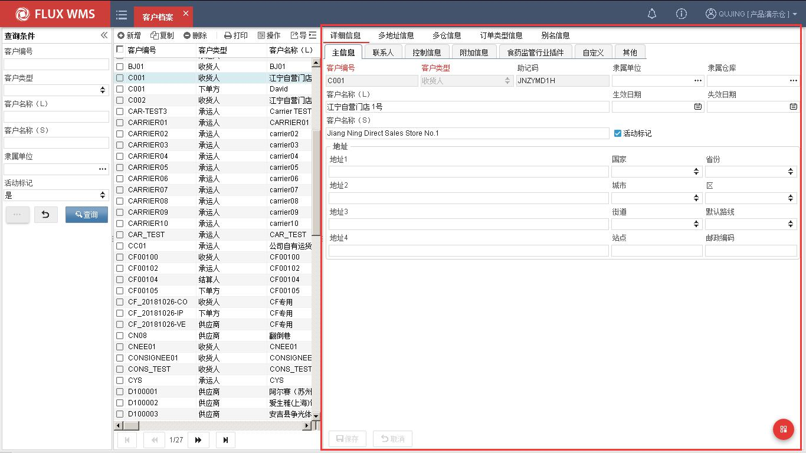

客户编码－客户代码 ID，必输字段，同一类型下不可重复。

客户类型－系统提供货主、供应商、承运人、收货人、结算人、下单方和其他等不同的客户类型，通过下拉列表选择。如需增加更多客户类型，可在系统代码中进行维护。

隶属单位－如多客户间存在隶属关系，例如多个货主属于同一公司集团；或供应商、承运人等有服务对应限定，可通过该字段维护。但客户所隶属的高级客户本身也需要在客户档案中维护。同时，操作员如果只具有部分货主权限，即只能看到对应货主、此货主名下隶属的其他客户信息以及无隶属单位的公共承运人/供应商。可以通过点击浏览按钮，在二级窗口中选择已经存在的客户代码。

<!-- 原 PDF 第 120 页 -->

隶属仓库－供应商、承运人、收货人类型的客户，有时会存在仅在某个仓库可启用的情况。例如只有深圳仓库，可以发货给香港的收货人。或者只有上海的仓库可以指定上海 EMS 承运。此类客户信息，可以配置对应的隶属仓库。在订单中选择对应信息时，只能选择没有隶属仓库的公共可用记录，以及隶属与本仓库的记录。

客户描述－客户名称描述。系统提供母语（L）、外语（S）两个描述字段。

助记码－系统自动提取中文名称的每个字的首字母，根据“客户”条件查询记录时，对客户代码、中文名称、英文名称、助记码一起进行查询符合条件的记录。

活动标记－使用中记录。未激活的货主不可进行收发货等操作。

地址－客户的地址。如一个客户有多个地址，可在“多地址信息”页签继续维护。

国家－客户所在的国家。下拉列表内容通过后台表 TMS_SITE_INFO 进行维护。

省份－客户所在的省份。下拉列表内容通过后台表 TMS_SITE_INFO 进行维护。

城市－客户所在的城市。下拉列表内容通过后台表 TMS_SITE_INFO 进行维护。

区－客户所在区。内容通过后台表 TMS_SITE_INFO 进行维护。

街道－客户所在街道。配合快递信息维护所需。内容通过后台表 TMS_SITE_INFO 进行维护。

默认路线－客户默认所属运输路线。主要对于收货人，在自动分派出库集货位功能中使用；也常用于区分、集合同一运输路线上的客户。路线通过下拉列表选择，具体路线内容在 “系统代码”中维护。

站点－收货人所属站点信息。常作为集货时的顺序依据，可以根据站点排序安排集货位使用。

邮政编码－客户所在地的邮政编码。

  - 在联系人页签，输入主要的联系人信息，包括名称、职务、电话、电子邮件和传真等。

<!-- 原 PDF 第 121 页 -->

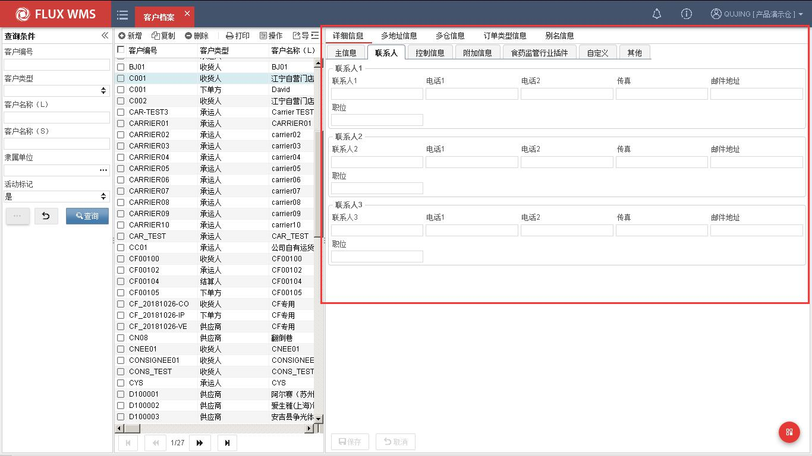

  - 客户的管理控制要求，维护在控制信息页签，主要针对类型为货主的客户应用：

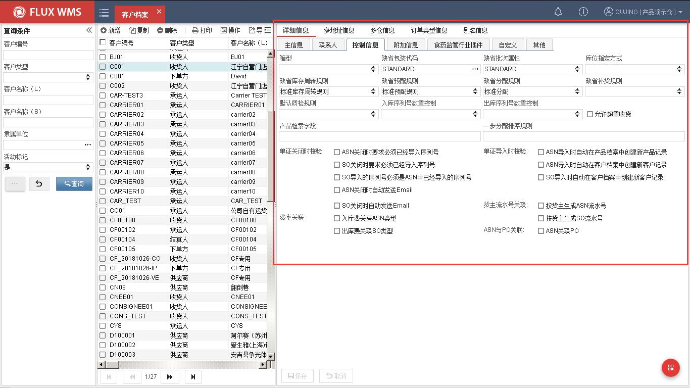

缺省装箱类型－默认的装箱组类型代码。下拉列表中的装箱类型代码，在基础设置的“装箱”功能中进行设置。

<!-- 原 PDF 第 122 页 -->

缺省包装代码－该客户产品常用的包装代码，将自动作为此货主名下产品的缺省包装选择。默认取此货主名下代码为‘STANDARD’的记录，具体包装代码设置请参考包装部分。

缺省上架规则－下拉列表选择上架规则，将作为产品的缺省默认上架规则。具体上架规则设置参考业务规则设置。当客户的产品在上架操作要求比较统一的情况下，可以采用客户级的上架规则，而不必每一个产品都分别设定。默认取代码为‘STANDARD’的记录。

库位指定方式－默认的系统计算上架库位的时间节点。系统提供人工指定库位、收货时计算库位、上架时计算库位 3 个选项。具体以产品档案中的设置为准。

    - 人工指定即不进行系统指导的上架操作，即使收货到过渡库位同样不会触发上架任务；

    - 希望系统提供上架指导时，一般要选择收货时计算库位；

    - 上架时计算库位，仅应用于 RF 操作中，在上架操作时，临时计算建议目标库位。

缺省批次属性－默认的批次属性规则，具体参考设置批次属性。将作为产品的缺省默认批次属性。默认取代码为‘STANDARD’的记录。

缺省库存周转规则－默认的库存周转规则，具体参考业务规则设置。将作为产品的缺省库存周转规则。默认取代码为‘STANDARD’的记录。

缺省预配规则－默认的预分配规则，具体参考业务规则设置。将作为产品的缺省预配规则。默认取代码为‘STANDARD’的记录。

缺省分配规则－默认的分配规则，具体参考业务规则设置。将作为产品的缺省分配规则。

缺省补货规则－补货操作中，如需要系统执行动态补货，自行查找新的拣货库位时系统执行的补货库位计算逻辑规则。

缺省质检规则－默认的质检规则，具体参考业务规则设置。将作为产品的缺省质检规则。

体积重量计算方式－该货主的费率计算时提取计算依据的方法，系统提供录入整票单证总量、按产品手工录入、按产品自动计算，3 种计算代码。具体应用将在费收部分详细介绍。

结算方－客户默认的结算企业。如未设置，则视同结算方为本客户。

承运人－客户默认的承运企业。

单证前缀－进行文件处理时，编号的前缀。

一步分配排序规则－在不考虑预配，直接执行一步式分配的情况下使用，可设置按库位或其他条件排序进行库存分配。

币种－客户默认使用币种。下拉列表内容可在“系统代码”中设置。

<!-- 原 PDF 第 123 页 -->

重量单位－采用计费吨方式结算时，需要比较体积、重量的大小。由于不同仓库或客户采用的重量单位可能不同，会影响计费吨的换算，因此需要明确客户所用的重量单位。

体积单位－计费吨结算时，明确客户所用的体积单位。

默认收货单位－产品收货时常用的包装级别单位。例如按件收货，还是按箱收货。

默认发货单位－产品发货时常用的包装级别单位。

默认报表单位－报表打印的缺省单位以及库存查询默认显示单位。

EDI 代码－接口处理时使用的接口代码字段

收货复制项－选择对应的复制字段后，系统在收货时将把对应的 ASN（预期到货通知） 表头部分输入的参考信息内容复制到对应的批次属性位置，能够把单证总体信息批量录入为批次属性，便于库存跟踪。

发货复制项－选择对应的复制字段后，系统将把对应的 SO（发货订单）表头部分输入的参考信息内容复制到对应的批次属性位置。能够把单证总体信息批量录入为订单分配条件，便于分配、出库操作。

注：收/发货复制项的选择，要求所选的复制目的批次属性，不能为禁用状态。作业时，如果复制的目标属性字段，已经非空，例如收货员已录入属性内容，则不会再被复制。录入值优先与系统复制值。

  - 在附加信息页签，依次输入以下信息：

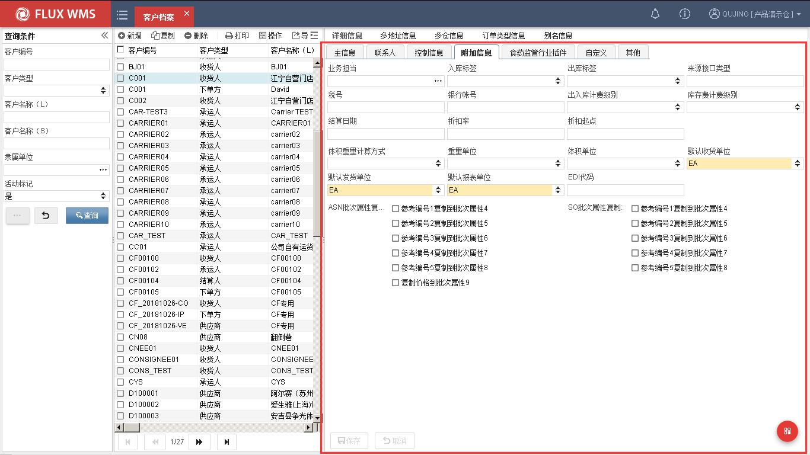

<!-- 原 PDF 第 124 页 -->

*[图 6-8-5]（原 PDF 第 124 页，图像未能从 PDF 对象中直接提取）*

业务担当－该货主在仓库内对应的负责人员。可通过浏览按钮，在二级窗口中选择，所选记录则在“仓库员工”功能中维护。

入库标签－打印收货标签时，引用的标签格式文件名称。

出库标签－打印出货标签时，引用的标签格式文件名称。

来源接口类型－接口下达基础信息时，记录信息来源。

税号－客户的发票税号

银行账号－客户银行账号

出入库计费级别－进出库费用结算时计费的等级选择，系统提供按交易、按订单行、按订单、按天 4 种选择，主要区别是计费级别以及最低、最高费用的计算方式不同。例如按单计费，最低费用 5 元。当每单都不满 5 元情况下，一天有 3 单，计费为 5*3=15 元；而按天计费，合计低于 5 元，只生成一个最低费用 5 元。

库存计费级别－库存计费的级别选择，可按客户、产品或批次级别计算。

入库序列号验证－收货环节的序列号验证方式。系统提供如下几种模式选择：

    - 序列号数量与入出库数量必须一致：系统对通过扫描序列号累加获得的数量，与待入/出库数量进行比对，2 个数量需要一致才能继续操作。

    - 序列号数量覆盖入出库数量：以序列号扫描累加的数量为准。

    - 不验证序列号数量：仅采集序列号，但不予实际操作数量比对，也不使用序列号个数的累加数量替换输入的入/出库数量。

出库序列号验证－发货环节的序列号验证方式。可选模式同入库序列号验证模式。

生效期/失效期－客户许可证、批文等的有效期范围。

允许超量收货－收货时，所收货物数量是否允许超过订单数量。

超额收货百分比－部分情况下，货物可超额收取的量需要控制。客户级的超额收货百分比内容将作为产品级的超额收货百分比的默认值。使用百分比控制超额模式，货主应设置为允许超量收货。

SKU 检索字段－对产品进行模糊查询匹配时，有的客户输入内容需要与 SKU 代码、中文名称、英文名称、别名等多个字段进行比对，而有些客户则只需要比对 SKU 代码、别名 1 字段即可。通过配置货主对应的 SKU 模糊查询范围，可以减少 SKU 模糊查询时的系统资源消耗，在 SKU 量较大时，提升作业速度。

<!-- 原 PDF 第 125 页 -->

ASN/SO 关闭时要求必须已经导入序列号－ASN、SO 关闭时校验订单中是否已经完成序列号导入操作。具体导入步骤参考 ASN 和 SO 的操作部分。

SO 中导入的序列号必须是 ASN 中已经导入的序列号－对 SO 中导入的序列号正确性进行校验，必须是之前收货过程中已经导入到 ASN 中的序列号。

ASN/SO 关闭时自动发送 Email－需要与邮件服务器配合使用生效。

ASN 导入时自动在产品档案中创建新产品记录－导入 ASN 信息时，对于不存在的产品信息，自动创建新产品档案，配置项取客户档案中的默认值。

ASN/SO 导入时自动在客户档案中创建新客户记录－导入 ASN、SO 时，如果收货人或者供应商信息未维护过，自动将不存在的客户信息写入客户档案，配置项默认为标准。

入库费关联 ASN 类型/出库费关联 SO 类型－如果客户不同类型的作业单据费率不同（例如退货入库与正常入库费率不同。），需要勾选对应项，这样才能在费率中针对不同单据类型分别设置费率。

按货主生成 ASN/SO 流水号－如勾选，将以货主代码作为为系统自动生成的订单号的前缀，每个货主单独生成订单流水号。例如 A 货主的订单号为 A001，A002，A003……；B 货主的订单号则为 B001，B002，B003……。需要提醒的是，为了方便作业，订单默认排序按订单号倒序排列，分货主流水，会使得查询时最新订单没有默认位于首页面。

ASN 是否与 PO 关联－如勾选，ASN 收货后将更新对应 PO 的信息。

  - 点击【保存】按钮，完成客户主要信息的设置。

- **扩展页签设置**

根据客户的管理需要，还可以进一步设置更多的相关信息，通过点击右上角的按钮可以显示扩展页签：

*[图 6-8-6]（原 PDF 第 125 页，图像未能从 PDF 对象中直接提取）*

  - 多地址信息页签：

如果客户有多个地址，可通过点击新增按钮，录入并保存多个地址。

<!-- 原 PDF 第 126 页 -->

在如下图的多地址页签界面，点击页签的【新增】按钮，逐条添加地址。需要注意的是，所添加的记录从属与当前维护的客户主记录信息。

如果点击列表界面的【新增】按钮，则是新增客户主记录信息。

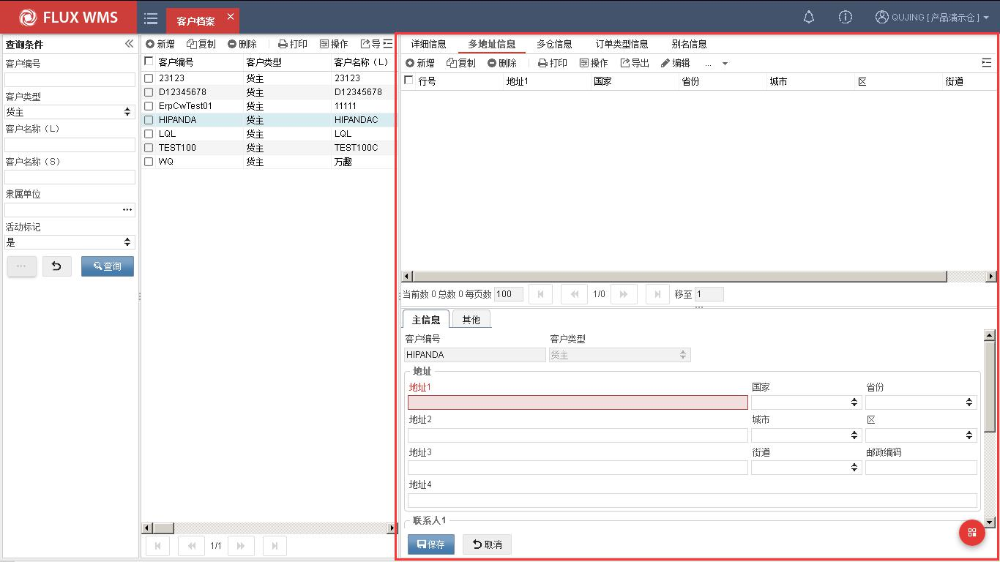

发运订单中根据参数 MLT_ADD（是否维护收货人的多个地址信息）信息判断默认提取客户档案主信息地址，还是默认提取多地址页签维护的首个地址。

不论何种模式，可人工在预期到货通知、发运订单中通过浏览按钮选择多地址信息。

  - 多仓设置页签

多仓管理模式下，同一个货主的货物，在不同仓库，由于各地人工费用的差异，仓储相关费率也可能不同，因此系统提供多仓相关设置。

<!-- 原 PDF 第 127 页 -->

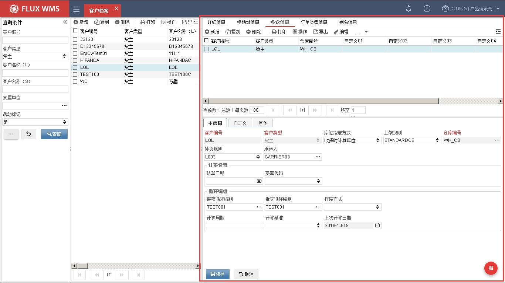

在多仓设置页签，依次输入如下信息：

客户编号－当前所维护记录的货主代码 ID，新增时自动获取，不可编辑修改。

客户类型－当前所维护记录的客户类型，新增时自动获取，不可编辑修改。

仓库编号－指定仓库的 ID 信息。

承运人－客户在指定仓库的默认承运人。

费率代码－客户在对应仓库的默认费率。

结算日期－结费时默认的账期日

税率－结费时需要计算的税费费率。

上架规则－指定仓库默认上架规则代码，适用于同一货主，多仓管理，不同仓库上架规则要求不同的业务情况。

补货规则－指定仓库默认补货规则代码，适用于同一货主，多仓管理，不同仓库补货规则要求不同的业务情况。

出库时结算库存费－勾选后，系统仅在产品发运出库时计算其全部库存费用，在库内的存货不计算库存费用。

出库当天是否是否算库存费－勾选后，出库当天也计算库存费。

<!-- 原 PDF 第 128 页 -->

包仓客户－货主是否通过包仓方式结算费用。

包仓费用－客户采用包仓方式结算时的包仓费用。

包仓面积－包仓结算情况下，客户租用的仓库面积。

包仓计费方式－包仓模式下，按月包仓还是按天包仓模式选择。

整箱循环编组－产品箱包装级别进行循环级别计算时对应的编组设置。

拆零循环编组－产品 EA 级别进行循环级别计算时对应的编组设置。

计算周期－循环级别计算周期。

计算基准－循环级别计算方式。按拣货批次，或者拣货数量计算，也可选择订单命中次数。

上次计算日期－上次循环级别计算日期

排序方式－按百分比排序，或者按名次排序。

  - 订单类型信息

多货主管理情况下，有时某个货主要求只能使用某种或某几种订单类型。由于单据类型可以在系统代码中根据业务要求自行添加，为了避免人员误操作，可以限定此货主可用的单据类型。

开启系统参数 CUS_ORD_LNK（订单类型是否与货主进行绑定），并在订单类型页签维护对应订单类型。

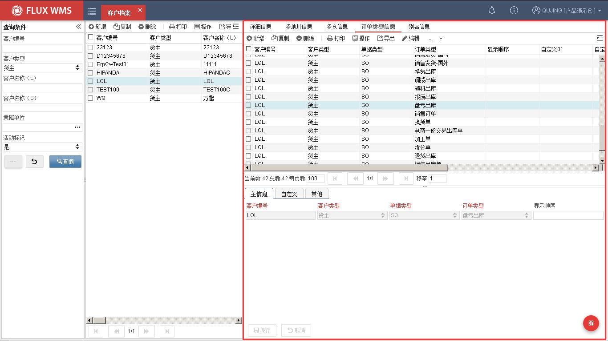

<!-- 原 PDF 第 129 页 -->

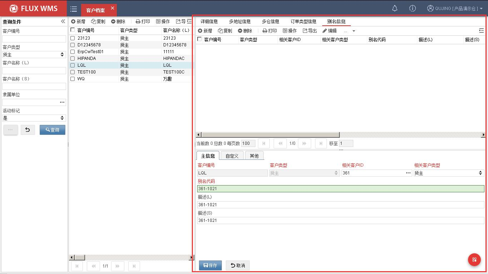

点击新增按钮，输入相关内容并保存：

客户编号－当前所维护记录的货主代码 ID，新增时自动获取，不可编辑修改。

客户类型－当前所维护记录的客户类型，新增时自动获取，不可编辑修改。

单据类型－选择 ASN 或 SO，对应入库单、出库单。

订单类型－下拉列表，根据单据类型选择，调用对应订单类型显示。

显示顺序－多订单类型情况下，排序显示次序。

  - 别名信息

同一供应商或承运人，在不同货主的自有系统中可能所用代码不同，但在同一个仓库内为方便统一管理，可以维护代码转换关系，便于接口、报表统计或者单据模板调用。

在别名信息页签，依次输入如下信息：

*[图 6-8-9]（原 PDF 第 129 页，图像未能从 PDF 对象中直接提取）*

客户编号－当前所维护记录的货主代码 ID，新增时自动获取，不可编辑修改。

客户类型－当前所维护记录的客户类型，新增时自动获取，不可编辑修改。

相关客户 ID－需要维护别名的客户 ID。例如供应商的 ID，或者收货人 ID，即需要维护

<!-- 原 PDF 第 130 页 -->

别名的客户 ID

相关客户类型－所选、需要做代码对应的客户的类型。

别名代码－此客户在指定货主名下所用的自有代码。

别名描述－客户描述，分为母语（L）、外文（S）描述两个字段。

- **鼠标右键菜单**

在客户档案列表或导航窗口中，点击鼠标右键可见右键菜单。除了标准的刷新、选择、导出功能之外，还有一些每个功能自有的右键菜单项功能：

  - 打印地址标签

基于货主或者收货人、承运人打印统一内容的地址标签，粘贴在发货包装上。常用于正常发货标签丢失后的快捷打印。

  - 复制订单类型代码到所有货主

多个货主需要维护订单类型信息的情况下，可通过查询条件限定范围，选择某货主作为模板，复制信息到其他货主。

## 6.9. 产品档案

产品档案是用于定义产品以及产品的各种信息、管理要求的功能模块。

产品是整个仓库管理运作的最重要的对象之一。一个产品的定义是由两个部分构成：客户和产品，缺少任何一个都无法确切定义产品。例如一个第三方仓库，可能有不同货主名下的相同产品在库内进行管理。因此，定义产品必须先确定客户的存在。

### 6.9.1. 详细信息

- **主信息**

  - 在主菜单“基础设置”下选择“产品档案”功能。

  - 点击【新增】按钮，在详细信息部分的“主信息”页签，输入如下信息：

<!-- 原 PDF 第 131 页 -->

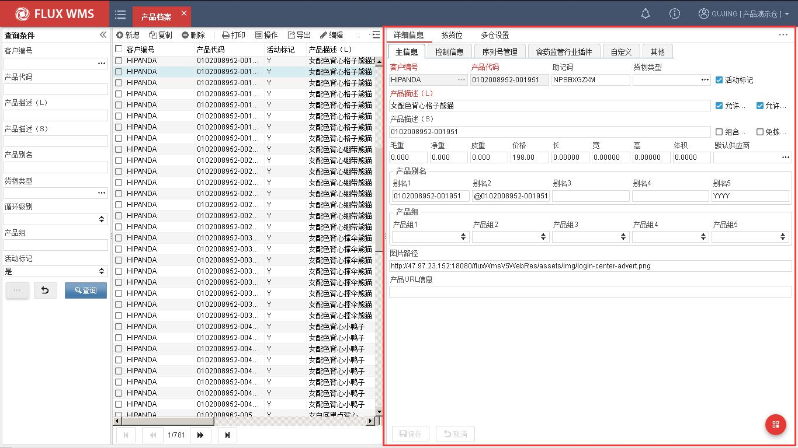

客户编号－即货主，产品所属的客户代码。可以通过快速查询按钮选择。

产品代码－产品代码 ID，同一货主下不可重复，建议使用数字和字母。客户编号+产品，唯一定位一个货品。即同一仓库内，可以管理不同货主名下相同产品代码的货品，例如华联的可乐与沃尔玛的可乐都在一个仓库存放，货品、条码相同，但货权所属货主不同。

产品描述－产品品名描述。系统提供双字段，L 为母语，S 为外文描述。

毛重－产品主单位的标准毛重。

净重－产品主单位的标准净重。

皮重－产品主单位的标准皮重。

价格－产品的参考价格。可通过权限控制价格信息用户是否可见。

长－单位产品的标准长度。

宽－单位产品的标准宽度。

高－单位产品的标准高度。

体积－产品主单位的标准体积，可根据长宽高数据自动计算。

默认供应商－该产品默认采购来源供应商。

助记码－系统自动提取中文名称的每个字的首字母，组合成助记码，方便用户查询录入。

<!-- 原 PDF 第 132 页 -->

活动标记－启用中的记录。勾选，则表示控制产品继续存在；否则，将无法对产品继续进行收货、发货等业务操作。（注：只有该客户类型为货主时，才能新增一个产品。）

产品别名－用于记录产品对应的其他名称代码，主要用来做产品的快捷定位。例如产品的商品条码，就经常作为别名记录。

产品组部分－用于记录产品的分组信息。产品组字段名称可根据用户需要自行定义、配置。

- **控制信息**

  - 继续在控制信息页签，维护产品相关管理信息。初始默认值同客户档案中的设置，用户可根据产品实际情况另行配置符合此产品管理要求的设置。

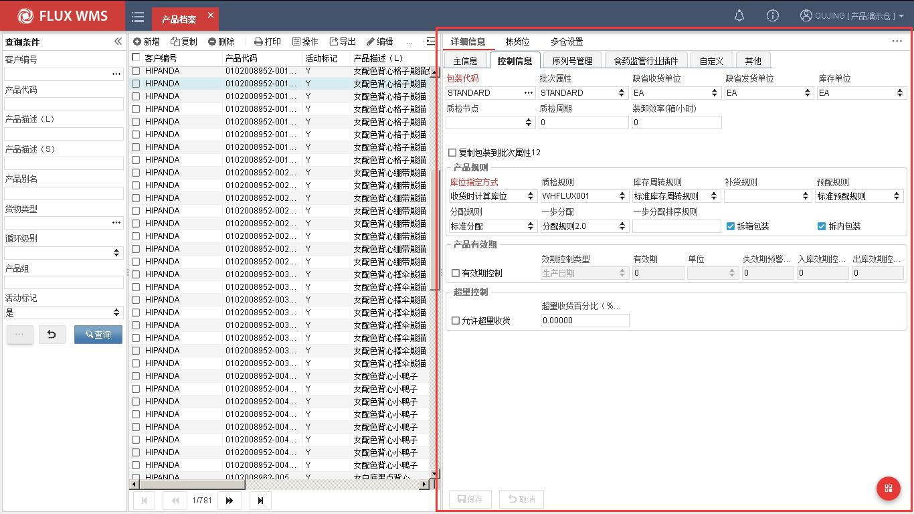

包装代码－产品使用的包装。默认为货主的缺省包装。

批次属性代码－产品的批次属性规则，提取客户档案中的设置作为默认值。

缺省收货单位－在收货订单中，系统默认使用的包装级别单位。

缺省发货单位－在出货订单中，系统默认使用的包装级别单位。

库存单位－按何种单位显示库存余量查询数量，以及作为库存标签打印单位。默认为 EA。

装卸效率－月台管理中使用，产品的每小时装卸量，用于估算月台占用时段的参数。

<!-- 原 PDF 第 133 页 -->

复制包装到批次属性 12－用于同一产品，入库包装规则不同的情况。收货时自动复制包装代码到批次属性 12，便于在库存中进行区分，可按包装出货。要求所选的批次属性规则中，批次属性 12 不能为禁用。

  - 产品规则部分：

规则部分的选项均默认为同货主中的设置，用户可根据需要自行调整，为每个产品设置各自所需的规则属性。

库位指定方式－系统计算上架库位的处理节点。提供人工指定库位、收货时计算库位和上架时计算库位 3 种选择。

上架规则－产品的上架规则，具体参考业务规则设置。

库存周转规则－产品出库时的库存周转规则，提取客户档案中的设置作为默认值。具体参考业务规则设置。

预配规则－产品出库时的预分配规则，提取客户档案中的设置作为默认值。具体参考业务规则设置。

分配规则－产品出库时的分配规则，提取客户档案中的设置作为默认值。具体参考业务规则设置。

补货规则－产品补货时寻找新库位的规则。

质检规则－产品生成质检单时，遵循的质检数量提取规则。

一步分配－一步分配时所执行的分配规则。具体分配规则内容及设置，在业务规则章节中介绍

一步分配排序规则－启用一步分配情况下可编辑。由于一步分配跳过了预配环节，可以另行指定分配时的排序字段。如不维护，默认按库位逻辑顺序拣货。

允许入库－此产品在收货流程中可以使用。默认可用，通常在拒绝产品入库情况下取消勾选。

允许出库－此产品在发货流程中可以使用。默认可用，通常在不允许产品发运情况下取消勾选。

是否拆箱/内包装－默认勾选，分配时是否允许拆分包装分配。常用于不允许拆箱、拆内包装出库的业务形态，实现整包装分配。

  - 产品有效期管理用于对产品进行有效期/保质期管理：

<!-- 原 PDF 第 134 页 -->

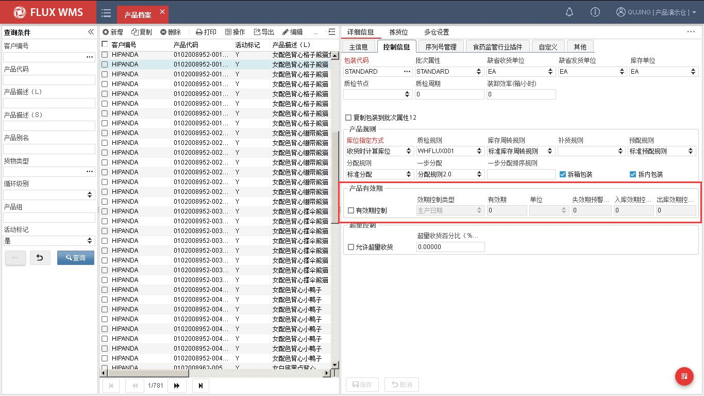

有效期控制－是否启用有效期管理，选中表示需要按照产品的库存生命周期管理产品。

周期类型－系统计算产品的库存周期的方式类型。如按照入库日期开始计算产品的有效期，还是产品本身有保质期。系统提供生产日期、失效日期、入库日期选项。

有效期－产品通常有效期长度，说明字段，不做强制控制，仅在根据生产日期计算失效日期情况下使用，如果选择的周期类型为“失效日期”，那么系统直接根据批次属性 02 的具体失效日期进行管控，此处的有效期字段将被忽略。

失效期预警－冻结控制前，提前多少天发送预警信息。例如距离失效节点，提前 30 天库存冻结，在冻结前提前 10 天进行预警。即距离失效日期 40 天开始预警。

入库生命天数－产品从入库日期开始算起，在仓库中能够安全存放的最大天数值。超过天数的产品，将不能作为正常品出库。

出库生命天数－产品从出库日到失效日期有效天数值。如果产品的有效时间小于设置的出库效期天数，将不能作为正常品出库，即临近过期的产品，为避免出库时未过期，运输到客户手中已过期，需要提前进行出库管控或处理。

单位－为了方便保质期较大的产品的信息维护，系统提供单位选择，下拉列表为年、月、日。预期到货通知收货计算效期时，会根据效期配置“单位”自动换算出所对应日期有效期数值，用于更新批次属性 02 的保质期天数。例如产品保质期为一年，则输入有效期 365，单位日，系统根据生产日期，加上 365 天计算得到失效日期。或者输入有效期 1，单位年，系

<!-- 原 PDF 第 135 页 -->

统自动换算为 365 日。

  - 超量收货管理

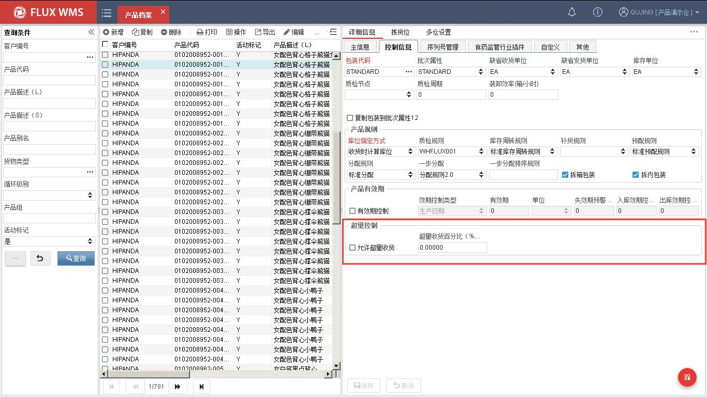

允许超量收货－收货时，所收货物数量是否允许超过订单数量。

超额收货百分比－部分情况下，货物可超额收取的量需要控制。客户级的超额收货百分比内容将作为产品级的超额收货百分比的默认值。使用百分比控制超额模式，货主应设置为允许超量收货。

  - 序列号管理

在序列号管理页签，依次输入如下信息：

<!-- 原 PDF 第 136 页 -->

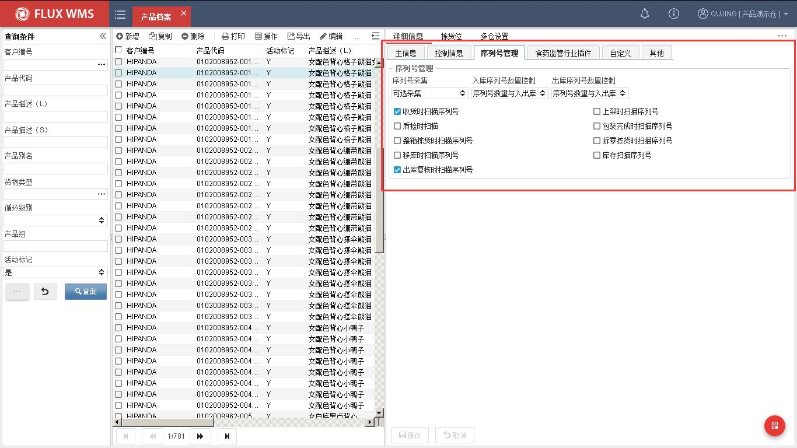

入/出库序列号数量控制－序列号管理模式中，扫描后是否需要统计序列号扫描个数，并与作业数量比对。系统提供“序列号数量与入出库数量必须一致”，“序列号数量覆盖入库出库数量”，“不验证序列号”几个选择项。

序列号采集－产品是否启用序列号管理。

XX 时扫描序列号－进行相关操作时是否自动进入扫描界面。即指定序列号扫描作业的节点。使用序列号扫描，需要开启序列号采集参数（SN#_CTL），并且产品、订单指定为采集序列号。

### 6.9.2. 扩展页签

除了详细信息页签的下的内容，在不同操作流程中，还会用到一些其他管理配置信息，可以通过右上角的按钮，选择对应的扩展页签，进一步维护对应信息。

- **拣货位**

拣货位信息，在使用独立拣货区作业情况下使用，一般与出库时从拣货区分配拆零库存，以及补货操作配合应用。

  - 在拣货位页签，点击【新增】按钮，依次输入如下信息：

<!-- 原 PDF 第 137 页 -->

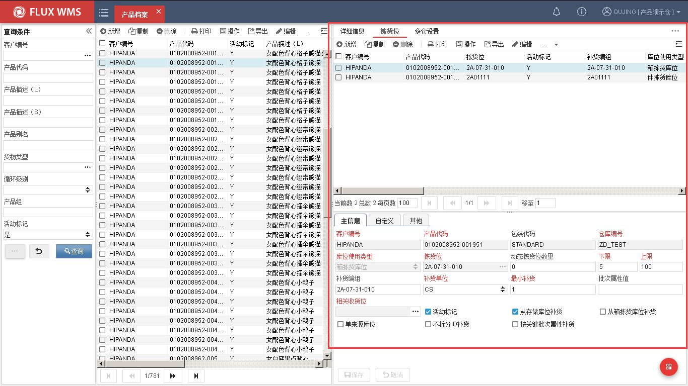

客户编号、产品代码、包装代码－系统自动显示产品对应信息。

仓库编号－默认为当前登录仓库。同一货主、同一产品在不同仓库内的拣货区规划不同，因此需要分别设置。

库位使用类型－指定的拣货库位使用类型。系统提供箱拣货库位、件拣货库位、箱/件拣货库位、补充拣货位，4 种库位使用类型。库位使用类型的选择，将限制拣货位的选择。

拣货位－该产品指定的拣货位。如果采用动态补货方式，则选择 DYNAMIC 类型的对应库位，如 DYNAMIC_EA 的件拣货库位。

动态拣货位数量－采用动态拣货位管理时，一个产品可以拥有的拣货位个数。一般进出量比较大的产品会指定多个库位。而固定拣货位模式，配置多行记录即可，无需配置此数量。

下限－产品的补货数量下限。当库存低于该数量，系统将允许补货操作。

上限－产品的补货数量上限。如果库存高于该数量，系统将暂停补货操作。（注：该上限不得超过所选择指定库位的最大容量。）

补货编组－产品补货时的编组方式。如设定补货编组，系统将把同一编组的拣货位视为一个组合，当组合中的总数量低于库存下限时，才触发补货任务。例如 2 个拣货位作为一个编组，当 2 个拣货位中的库存之和低于最小补货数量时才触发补货，并且 2 个库位一起补满。

补货单位－产品的补货单位。如设置为箱，系统将按箱计算补货数量，除非存储位库存

<!-- 原 PDF 第 138 页 -->

不足 1 箱，否则生成的补货任务都是箱的倍数。

最小补货－对该产品进行补货时的最低补货数量。

批次属性值－按不同批次属性，分别设置固定拣货位的业务模式中，用于指定 Lot04 批次属性值内容。例如 lot04 用于记录产地，产地为 A 的库存，补货到拣货位 01 库位，产品为 B 的库存，补货到拣货位 02 库位。

相关收货位－上架规则，查找拣货位最近的存储位情况下使用，固定拣货位对应的相关收货位配置后，收货后，优先按照相关收货位坐标为基点查找最近存储位。

活动标记－使用中的记录。

从存储库位补货－选中则限定补货来源库位必需是存储库位。

从箱拣货库位补货－选中则限定补货来源库位必需是箱拣货库位。

单来源库位－一次只从一个原始库位补货。

不拆分 ID 补货－非标准码盘情况下的补货场景使用，由于每个托盘上的库存数量不一致，为提高作业效率，避免拆托，补货操作时，整个跟踪号进行补货，不生成部分数量的补货任务。此模式下，允许超过补货上限

按关键批次属性补货－特殊产品，对于敏感批次属性不能混放，例如药品不同批次要存放不同库位，但不同入库日期的同批次货物可混放。补货时，关键属性不同的批次，也需要找寻不同的拣货。

  - 点击【保存】按钮完成拣货位设置。

- **别名管理：**

产品入库时，同一种产品，不同供应商提供的文件上可能使用其各自的产品代码，不同收货人的出库指令或出库标签上也可能使用各自的代码，WMS 通过别名管理功能，将不同供应商、收货人使用的产品代码（别名）与主档产品代码相关联，并可根据不同的收货人/供应商进行转换或打印不同格式的标签。需要通过参数 ALT_SKU 开启别名管理。

需要注意的是，别名管理中的相关客户，指的是入库操作中的供应商，出库操作中的收货人。即在对应收货人的情况下，SO 中的产品对应的别名是什么。可以达成同一产品不同收货人使用不同别名的效果。

<!-- 原 PDF 第 139 页 -->

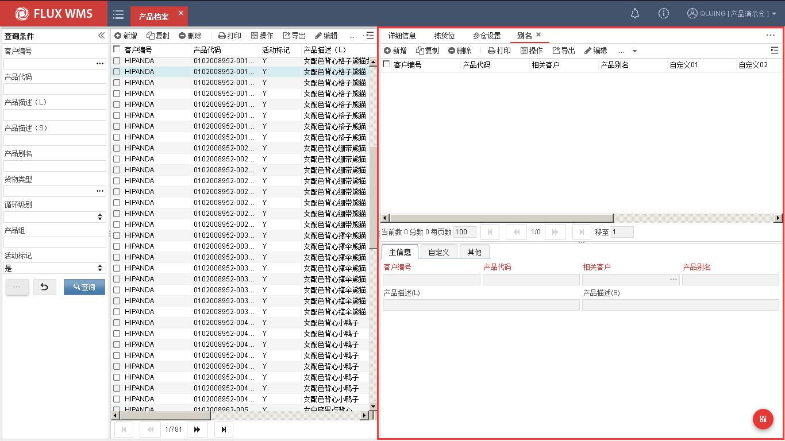

- **供应商：**

部分产品只能由指定供应商提供，因此需要建立供应商与产品的对应关系。

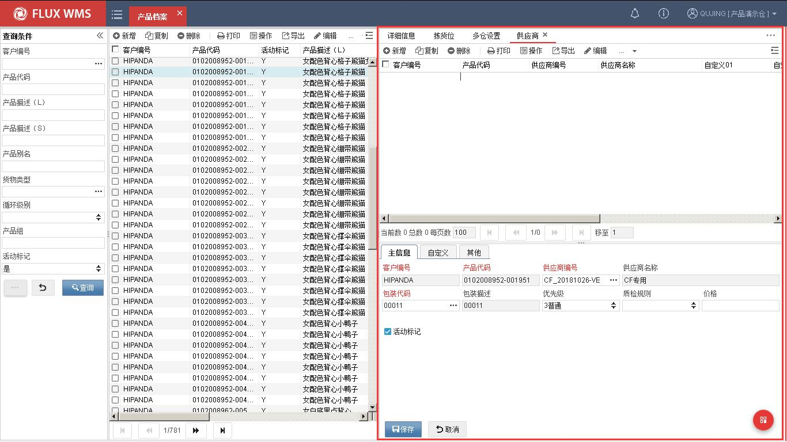

通过在产品档案的供应商页签，选择并设置对应供应商 ID，在 ASN 中系统会进行校验，该产

<!-- 原 PDF 第 140 页 -->

品只能由指定的供应商提供。同时可指定此供应商的该产品供应价格，优先级设置，便于供应商管理。一个产品可配置多个指定供应商。

- **收货人效期管理：**

不同收货人对产品有效期要求不同，例如食品送超市，A 超市要求保质期剩余 6 个月，B 超市要求保质期剩余 1 年。可在收货人效期页签进行对应维护

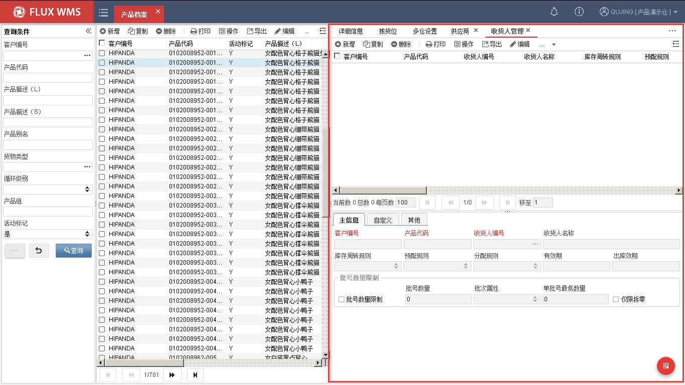

如有较多产品需要设置，可通过该页签鼠标右键功能，将所选的收货人效期信息，复制到符合当前查询条件的全部产品档案中。

*[图 6-9-10]（原 PDF 第 140 页，图像未能从 PDF 对象中直接提取）*

- **相斥产品**

用于维护产品的相斥信息。例如食品与洗衣粉不能相邻存储，出库包装时也不能指定包装到一个包装箱中，这 2 种产品即为相斥产品。

维护时，一个产品可以有多个相斥产品，所选相斥产品需要在产品档案中已有记录。

<!-- 原 PDF 第 141 页 -->

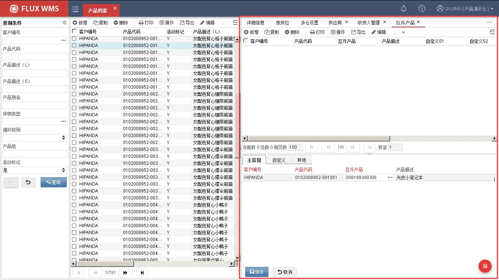

- **多包装：**

部分产品有固定的几种常用包装规格，可在产品档案进行设置，限定单据中的包装选择范围。

- **多仓设置：**

<!-- 原 PDF 第 142 页 -->

同一产品在不同仓库内，由于各地人工不同，有可能仓储计费也不同，可以分仓库进行设置，不同仓库选用不同的计费费率，同时规则、循环级别等的设置可能也会每仓不同。可以在多仓设置页签中，分别配置，如下图所示。

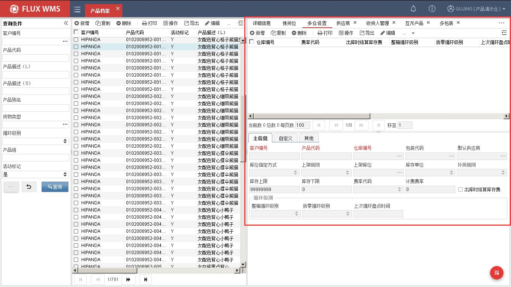

客户编号、产品代码－对应主信息内容。点击新增按钮时自动获取，不可修改。

仓库编号－指定仓库代码。

包装代码－产品在指定仓库内的常用包装

默认供应商－对应仓库此产品的默认供应商，适用于分地域多个默认供应商的情况。

库位指定方式－系统计算上架库位的处理节点。提供人工指定库位、收货时计算库位和上架时计算库位 3 种选择。如果多仓页签未配置，则默认取产品档案中的指定方式。

上架规则－产品在指定仓库中执行的上架规则。

上架库位－产品入库时的指定上架库位，根据上架规则的设置生效。通过快速浏览按钮可选择已在库位档案中设置的库位，可为每个产品分别指定固定的存储位置。设置上架库位后，如果需要清除设置、不再指定，通过点击库位选择二级窗口中的【返回空记录】按钮清空设置。

库存单位－默认库存单位。适用与不同仓库作业、存储模式不同情况。例如 A 仓为大批量存储，整进整出，库存单位为托盘。B 仓为电商仓库，拆零发货，库存单位是件。

<!-- 原 PDF 第 143 页 -->

补货规则－产品在指定仓库中执行的补货规则

库存下限－指定仓库中产品的库存下限。当库存数量低于库存下限时，系统生成预警提示。

库存上限－指定仓库中产品的库存上限。若库存数量高于库存上限，系统会通过预警功能提示或自动暂停向供应商订购商品。

费率代码－显示当前仓库和多仓共用的费率代码。具体费率设置，可参考费收模块的具体介绍。

计费费率－按产品价格计算费用时，不同产品费率不同，因此使用产品档案的多仓计费费率设置。具体计费基准、计费单位，仍旧在费率代码中设置。如未设置产品计费费率，则取费率代码对应费率。

出库时结算库存费－库存产品不生成库存费用，仅在产品发运时计算其全部库存费用。

整箱循环级别－产品箱级别所用的循环级别计算方式。下拉列表内容在循环级别功能中定义。

拆零循环级别－产品 EA 级别所用的循环级别计算方式。

上次循环盘点－系统自动记录的、产品上次循环盘点日期时间。

- **订单类型规则：**

同一产品在不同作业流程内，可能作业要求不同。例如正常出库，要求先进先出；退货出库，则是先到保质期先出库；批量销售单，通常后进先出。

可以根据不同订单类型，维护对应的周转、分配规则，实现相应业务管理的要求。

<!-- 原 PDF 第 144 页 -->

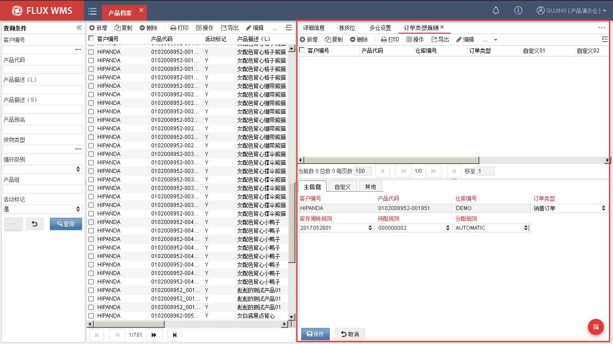

- **产品配件管理：**

部分产品，实物可以拆分为多个部分，但每个部分都不是独立产品（SKU）。例如咖啡杯，由杯托、杯子、调羹组成，入库时包装在一个包装盒内，通常无需拆封检查。但产品退货入库时，经常需要检查这几个组成部分是否被一起退回。因此系统提供配件管理功能，记录非 BOM 组合的多部件产品的情况，以便作业人员根据信息核对产品情况。

配件信息，首先需要在产品档案中进行维护，如下图，配件页签内容。

<!-- 原 PDF 第 145 页 -->

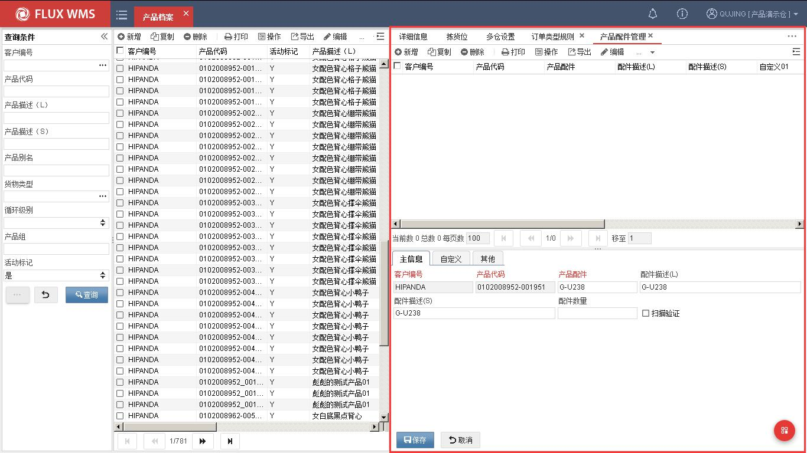

可维护配件名称、说明，数量等信息。由于配件本身不是独立 SKU，因此“配件”名称开放录入。

如果勾选了“扫描验证”，并开启 SKU_ACC_SCN 参数，收货时，可以执行配件扫描，由系统校验配件是否齐全。

维护后的配件内容，在入库单中可查看，具体可参考入库操作-预期到货通知的相关介绍。

- **产品多库区管理：**

多仓管理情况下，同一产品在不同仓库对应的上架区不同，可通过多库区页签，每个仓库分别设置。

*[图 6-9-16]（原 PDF 第 145 页，图像未能从 PDF 对象中直接提取）*

同时，产品在一个仓库内，需要指定多个库区的情况，可通过序号字段，设置对应库区的排序。

- **替代品管理：**

同类的不同产品，代码不同，但产品类似，或可以相互替换。可以在系统中维护替代关系，当 SST_SKU=Y 启用替代品功能时，产品 1 库存不足时，系统可分配产品 2，再不足提取产品 3，按替代次序依次找寻替代品。

<!-- 原 PDF 第 146 页 -->

如果没有配置替代品，产品 1 库存不足时，分配即停止。

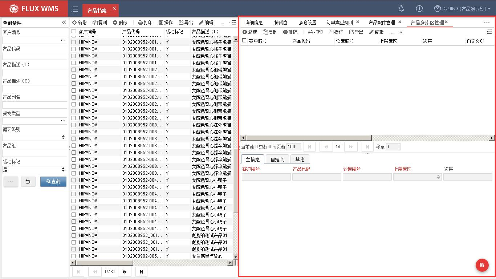

### 6.9.3. 行业信息

不同行业所需的特殊字段记录在各自的行业页签中，只有在对应行业的系统配置参数打开的情况下才可见行业页签。例如参数 IND_MED=Y 的情况下，在产品档案中才能够看到医药行业的页签。

- **食药监管行业：**

<!-- 原 PDF 第 147 页 -->

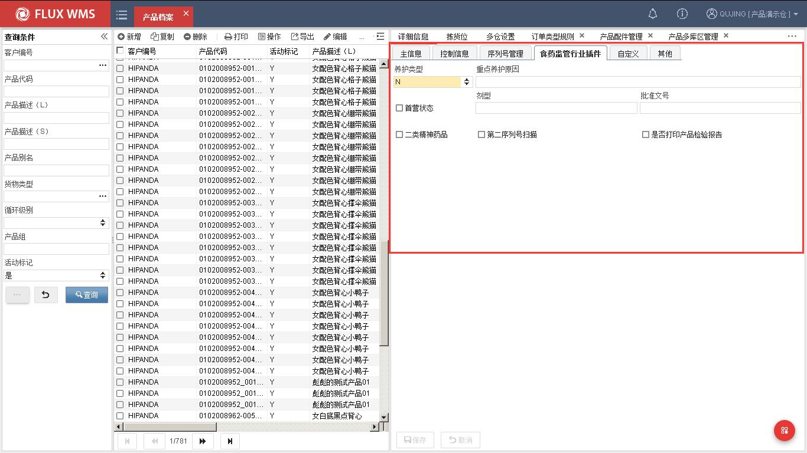

仅当参数 IND_MED= Y 启用医药行业参数时显示如下内容：

’’

  - 基本信息页签：重点养护－该产品是否需要进行重点养护。首营状态－是否为首营产品，需要维护首营状态。二类精神药品－GMP 规定，二类精神药品需要双人复核。此字段标记的 SKU，入库、

质检、复核等作业时，会弹出双人操作界面，要求第二复核人确认。

第二序列号扫描－标记后支持输入产品第二序列号

是否打印药品检验报告－标记是否需要打印药品检验报告

重点养护原因－原因备注字段。

剂型－产品首营剂型。

批准文号－药品批准文号。

  - GMP 证书页签：

用于维护药品 GMP 证书信息

<!-- 原 PDF 第 148 页 -->

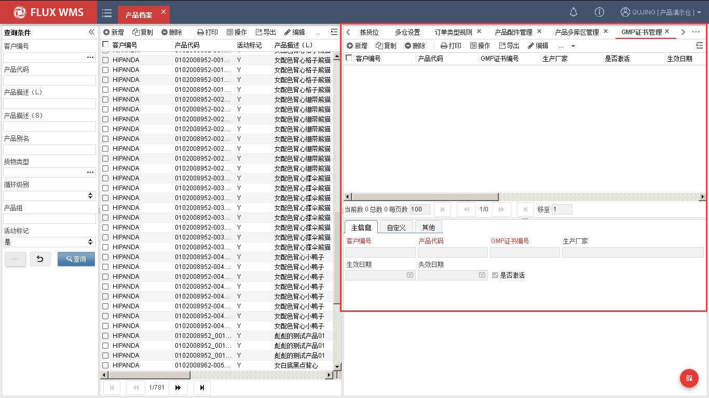

  - 批准文号页签：

用于维护药品批准文号信息

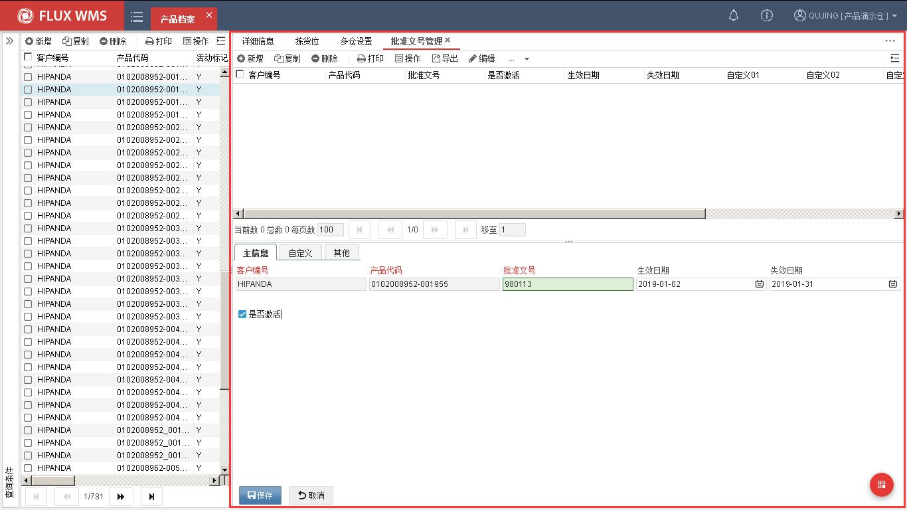

<!-- 原 PDF 第 149 页 -->

### 6.9.4. 鼠标右键菜单

在明细页面的导航窗口部分，点击鼠标右键可见右键菜单。

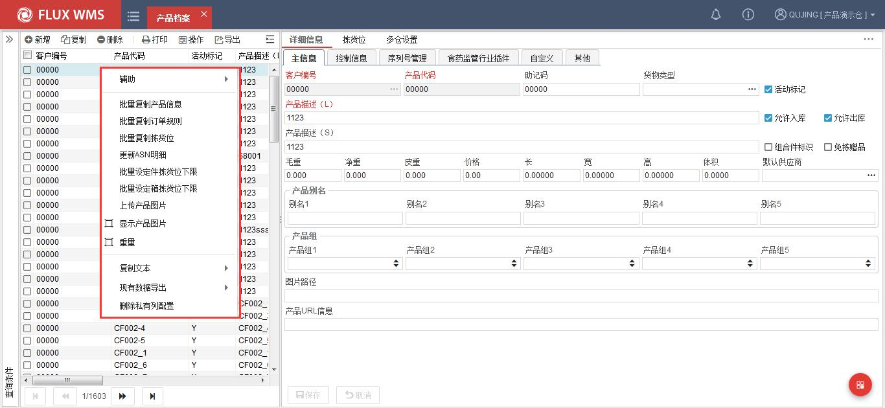

- **显示产品图片**

配置图片后，可以通过此功能查看产品图片显示（具体配置请参考产品档案详细信息设置部分的介绍），多张图片情况下，可通过【上一张】、【下一张】按钮切换查看。

- **批量复制产品信息**

用于批量修改产品档案的字段内容。

按一定查询条件查询记录（其中客户代码条件必输，无任何查询条件情况下，系统会提示需要先输入查询条件再进行复制），选择某一记录作为基础记录，修改所需内容并保存（基础记录即复制来源信息）。然后点击鼠标右键选择“批量复制产品信息”功能，系统显示如下复制字段选择二级窗口。勾选需要复制的字段，确定后，系统将复制字段内容到当前查询到的全部产品记录。可通过全选、反选来快捷选择字段。

<!-- 原 PDF 第 150 页 -->

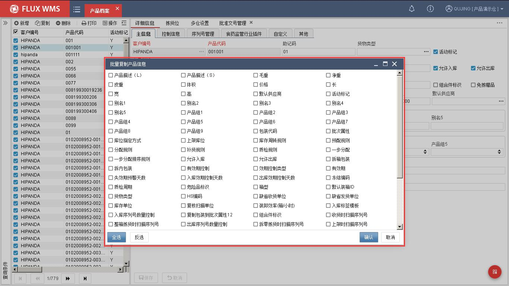

- **批量复制订单规则**

用于批量设置产品订单类型规则。点击右键功能项后，将当前记录的订单类型规则设置，复制到符合查询条件的全部产品记录中。

- **批量复制拣货位**

用于批量设置或修改产品拣货位设置。

输入查询条件，查询记录后，选择当前记录，执行右键功能项“批量复制拣货位”可以将当前产品记录的拣货位信息，复制给根据查询条件查询到的其他全部产品。

- **更新 ASN 明细**

入库用的单据预期到货通知（ASN）中，输入产品时会提取产品的对应信息如包装等。如果单据创建后，再修改产品档案内容，可以通过“更新 ASN 明细”功能，将修改的内容同步到 ASN 订单中，避免逐单手工修改。

- **批量设定件拣货位下限**

用于批量设定当前列表产品记录的拣货位下限。仅针对拣货位是件拣货类型的记录生效。

查询产品记录后，选择此项功能，系统显示如下二级窗口，可选择相应选项，确认后系统更新复核查询条件的产品的拣货位信息。

<!-- 原 PDF 第 151 页 -->

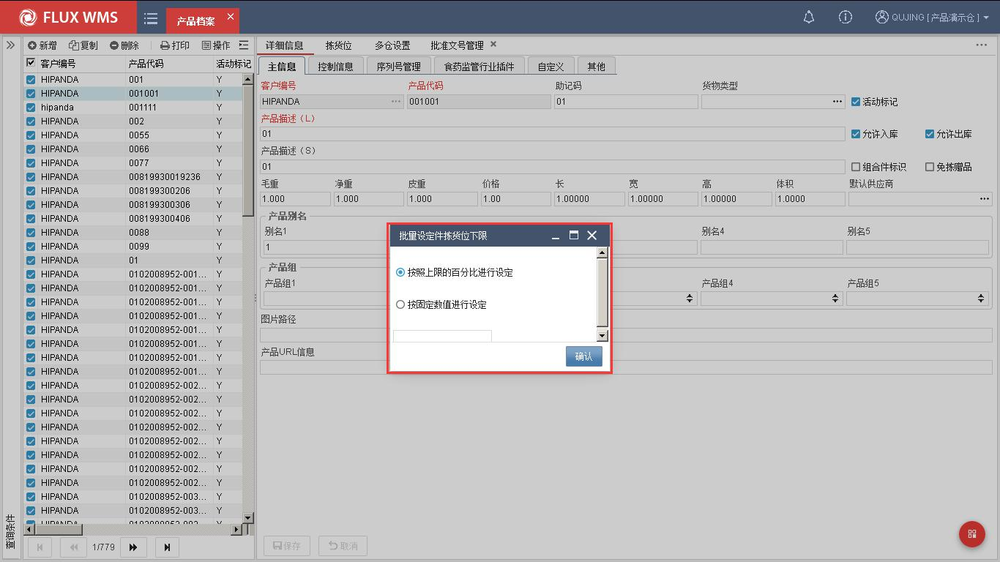

按照上限的百分比进行设定－选择此项后，在下方的数字框中输入百分比数字，系统自动将产品拣货位的下限数量，更新为上限数量乘以百分比的结果。

按固定数值进行设定－选择此项后，在下方的数字框中输入数值，系统自动将产品拣货位的下限数量，更新所录入的结果。

- **批量设定箱拣货位下限**

用于批量设定当前列表产品记录的拣货位下限。类似“批量设定件拣货位下限”功能，但仅针对拣货位是箱拣货类型的记录生效。

- **上传产品图片**

用于逐个/批量上传所选 SKU 对应图片，并且图片会以附件形式上传服务器。产品图片在入库扫描、库存余量查看、出库复核等作业环节展示，用户可在【附件文件管理】模块中对上传的图片文件进行管理。

<!-- 原 PDF 第 152 页 -->

## 6.10. 组件

在仓库中的某些产品可能是由几个部分组成，并且必须一起发货的。例如客户可能要发计算机，而计算机是由笔记本电脑、外置光盘驱动器、鼠标、说明书、电脑包等组成，每个部分还作为独立 SKU 可以单独出库。FLUX WMS 支持客户通过分辨组成产品属性和各组成部分的产品属性将多个产品组合在一起一同处理。

如果在仓库和配送中心进行大量的装配、拆卸等工作，并且需要管理每个加工中心的活动时，产品组合的方式是不能够完全满足的。这时可以采用 WMS 的增值服务模块。

- **组件**

在产品档案中先设置一个产品作为组装后的成品，并且在基础信息中，必须选中组合件标识，然后再设置该产品的组件形式（BOM）

这种用来加工、组合的“零件”产品，就是子件，例如电脑包、说明书，或者 XX 洋酒、杯具组，组合后的产品被称为父件，例如计算机套装，或者洋酒礼盒。

  - 在主菜单“基础设置”下选择“组件”功能。

  - 点击【新增】按钮，在“详细信息”的“主信息”页签，依次输入以下信息：

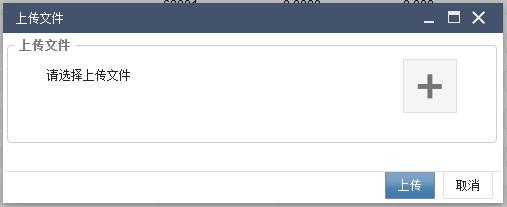

<!-- 原 PDF 第 153 页 -->

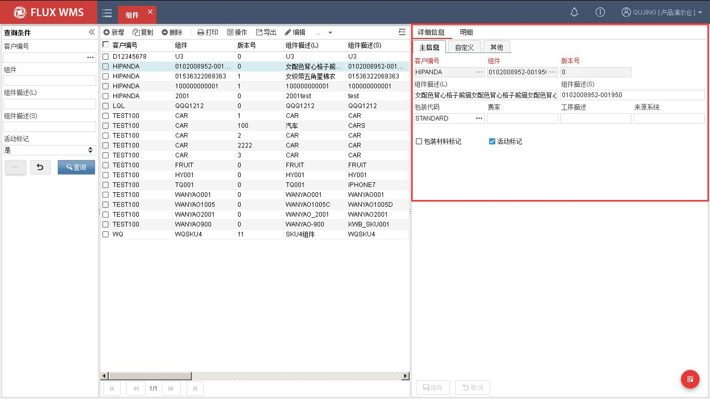

客户编号－客户代码，必需是已经在客户档案中维护过的货主。

组件－组装后成品的产品代码。同样需要是在产品档案中维护过，并且是组合件的产品。

版本号－通常一个组件代码应表示唯一一套组合标准。但有些 ERP 管理要求，组件代码不变，内涵的子件组合有变动。通过版本号来区分相同组件 ID（父件 SKU），不同的实际子件组合（例如同一个洋酒礼盒，夏天的礼盒中的赠品是折扇，冬天赠品是毛巾，但礼盒的 SKU 代码不变）。版本号会记录到对应父件库存的批次属性 11 字段作为区分。版本信息只能通过接口获得，客户端不提供编辑修改。

组件描述－父件的产品名称。系统提供母语（L）、外文（S）两个描述字段。

包装代码－父件产品此加工组合后使用的包装模式。

费率－完成一个加工工作应收的费用。

工序描述－对该加工工序的简单说明。

来源系统－通过接口下拉组件信息时的上游系统

包装材料标志－标识该组合为耗材包装组合，组件作为包装使用。

活动标记－选中 Y，则表示该组合方式继续存在、可以使用；否则，将无法对产品继续按照组合方式进行收货、发货等业务操作。

  - 点击【保存】按钮，完成头信息新增操作。

<!-- 原 PDF 第 154 页 -->

  - 点击明细页面的【新增】按钮

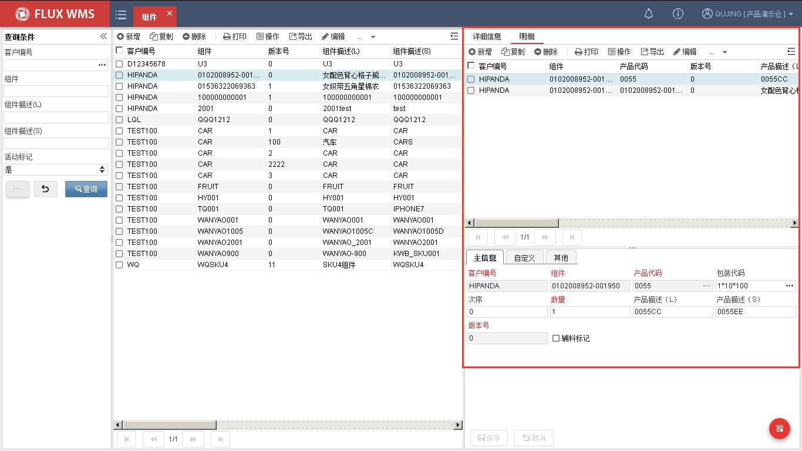

选择产品，系统显示对应描述；录入次序、数量，表示在组合中所用该产品零件的个数和顺序。其中在次序中输入数字，1 为最小。

辅料标记在生鲜加工管理中使用，非严格比例组合的情况，例如一条鱼可以根据重量拆分成几分鱼肉产品，但鱼头鱼尾只有一份，不是根据原料重量按比例获得的。

  - 点击【保存】按钮，完成以上操作。
