# 7. 仓库设置

> 来源：`富勒WMS系统用户手册_V6_高清版（维他命）.pdf`，原 PDF 第 155 页起。
> 本文件按原 PDF 正文标题拆分；原文截图已提取至同目录 `assets/`。

<!-- 原 PDF 第 155 页 -->

## 7.1. 仓库设置概述

仓库设置，是用来定义仓库相关情况的功能，包括库位、库位组、库区等等与物理设施情况相关的信息，以便在操作、管理过程中，针对仓库情况进行对应的优化管理。

## 7.2. 区域和库区

区域和库区是用于定义仓库内区域、库区和库区中设备的功能。通过区域、库区的设置能够便于仓库分区管理、更方便的查找库位。

区域是库区的集合，它是仓库内物理位置、等级的划分，也是仓库下的一级物理划分层次，便于 RF 无线设备的现场管理。

库区则是多个地点或库位的集合，是区域下的仓库二级物理划分层次，每个库位只在一个库区中。当您定义一个库区时，您可以把仓库定义为能够做任何活动。库区也是按照仓库中实际的划分而定义的，例如：理货区、拣选区、存储区等。

- **区域设置**

  - 在主菜单“仓库设置”下选择“区域”。

  - 点击【新增】按钮，在“主信息”页签依次输入以下信息：

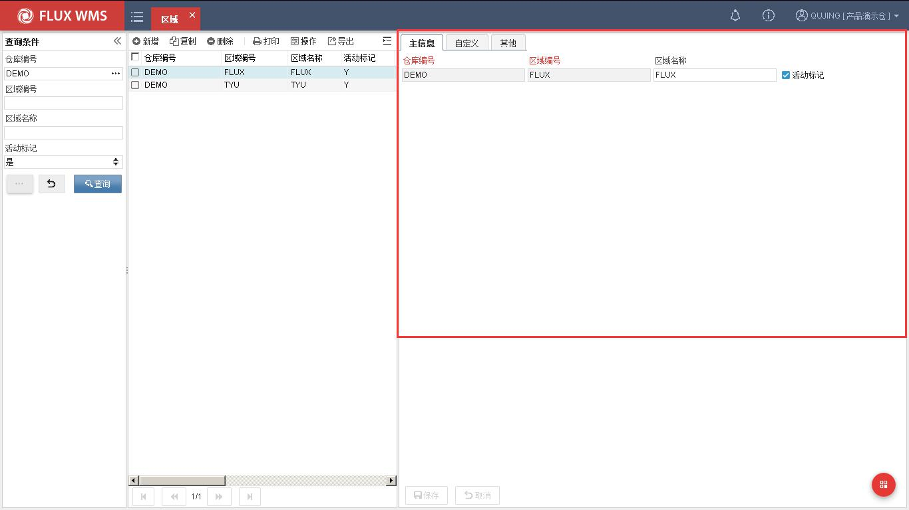

<!-- 原 PDF 第 156 页 -->

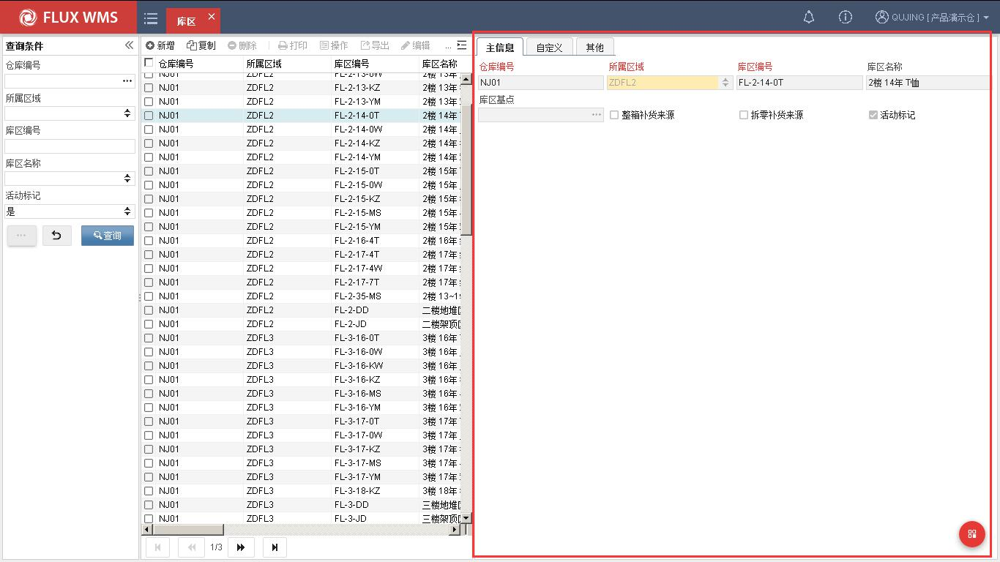

仓库编号－区域所属仓库，新增记录时默认为当前登录的作业仓库，用户不可修改。即用户只能编辑本仓区域、库区信息。

区域编号－区域代码。

区域名称－区域的显示名称。

活动标记－记录激活标记。

  - 点击【保存】按钮，完成仓库区域创建操作。

- **库区设置**

  - 在主菜单“仓库设置”下选择“库区”功能

  - 在主信息页签，点击【新增】按钮，依次输入以下信息：

*[图 7-2-2]（原 PDF 第 156 页，图像未能从 PDF 对象中直接提取）*

仓库编号－区域所属仓库，新增记录时默认为当前登录的作业仓库，用户不可修改。即用户只能编辑本仓区域、库区信息。

区域编号－该库区所在的区域，通过下拉菜单选择已设置好的区域，从而建立库区和区域的所属关系。

库区编号－库区代码。

<!-- 原 PDF 第 157 页 -->

库区名称－库区的显示名称。

库区基点－特殊库位计算逻辑（就近库位）使用，通常情况下可跳过，不设置。如需配置，要在库位功能内，设置完成此库区下的库位信息，然后才能在这个字段的二级窗口中选择已存在的库位作为基点。

整箱/拆零补货来源－主要用于非拣货库区，设置此库区的货物能否补货到拣货库区。例如同样是批量存储区，A 区是正常入库货物，可以被用来补货，但 B 区是退货入库货物，不能被用来补货到拣货区。同时，如果仓库内作业区细分，可以分别配置此库区货物，是否能够被用于整箱补货，是否能够被用于拆零补货。以便支持箱、件拣货位分别设置的不同业务需求。

活动标记－激活标记

  - 点击【保存】按钮，完成库区创建操作。

- **其他**

  - 就近库位逻辑：

上架过程中，常有希望同类货物能够就近存放的要求（不是合并在同一个库位），但由于仓库库位是分布在立体空间的，特别是立库、多层托盘、隔板货架等仓库，哪些库位是“近”的，哪些是“远”的，需要对空间距离进行设置与计算。

一方面，每个库位的 XYZ 坐标都需要进行设置。

另一方面，在库区中需要指定一个库位作为基点（库区基点字段所设置的库位），以此库位作为三维坐标的零点，根据其他库位到此库位的空间距离，自动更新库位上架顺序。

即根据到基点的空间距离远近，更新库位的上架排序，用以支持就近计算上架的业务逻辑。

空间距离的计算，以每个库位的 XYZ 坐标，到基点库位的 XYZ 坐标的距离分别进行计算。

## 7.3. 库位组

库位组是库位的组合或分类方式，与库区相比，库位组更加灵活，通常用于任务获取或者查询、报表使用，例如可以将巷道设置为库位组，可以配置每个库位属于哪一个巷道；或者同属一个传输线弹出口的多个巷道库位编入同一个库位组；一个独立活动货架设置为一个库位组等。现场可以根据业务情况需要设置不同的库位组划分逻辑。

系统提供库位组 1，库位组 2 两个分组设置功能。在“库位组”功能中，可以定义库位组的名

<!-- 原 PDF 第 158 页 -->

称，但具体如何应用这些库位组，则取决于后续的操作功能设置，详见各功能说明。

- **库位组**

  - 在主菜单“仓库设置”下选择“库位组一”。

  - 点击【新增】按钮，在主信息页签依次输入以下信息：

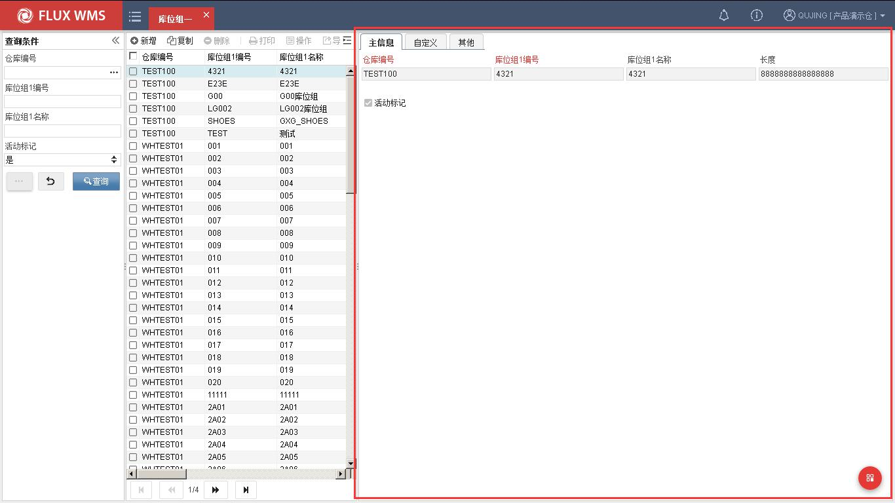

仓库编号－库位组所属仓库，新增记录时默认为当前登录的作业仓库，用户不可修改。即用户只能编辑本仓范围内的信息。

库位组 1 编号－库位组 1 的代码。

库位组 1 名称－库位组 1 的名称描述。

长度－用于挂装活动库位的上架计算过程中的长度信息维护，以库位组作为固定长度，组内的每个库位的容量是活动的。

活动标记－是否使用中的库位组。

  - 点击【保存】按钮，完成记录新增操作。

  - 库位组二设置同库位组一，只是无长度维护。

<!-- 原 PDF 第 159 页 -->

## 7.4. 工作区

为了方便任务分派，有些业务情况中会使用工作区划分来定义作业人员的分管片区。在库位设置中，可以设置库位从属的工作区。工作区与区域库区可以有交叉重叠，通常根据巷道划分、流水线弹出端口等进行定义。

与库位组功能相比，工作区域更侧重于人员工作管理。

- **工作区**

  - 在主菜单“仓库设置”下选择“工作区”。

  - 点击【新增】按钮，在“主信息”页签依次输入信息：

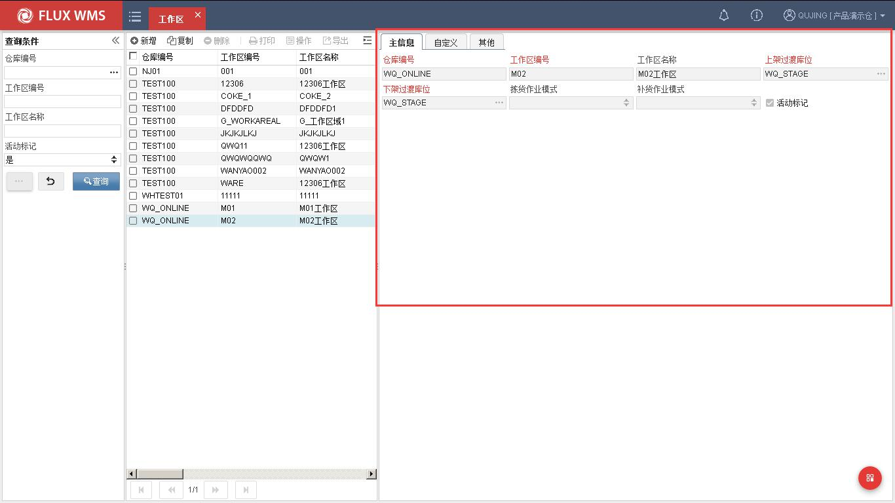

仓库编码－所属仓库代码。新增时默认取当前仓库。

工作区编码－工作区代码

工作区名称－工作区描述

上架过渡库位/下架过渡库位－上架、拣货过程中的中转库位

拣货作业模式－此工作区内适用的拣货操作模式。使用 RF 拣货导航功能时，根据任务的工作区，可以跳转到与拣货模式对应的拣货功能界面。系统提供订单拣货，波次合并拣货、电子标签拣货、电子标签播种、标签拣货、边拣边分的不同作业选项。

<!-- 原 PDF 第 160 页 -->

补货作业模式－此工作区内适用的补货操作模式。系统提供一步补货、补货下架供选择。

活动标记－使用中的工作区域

  - 点击【保存】按钮，完成工作区创建操作。

## 7.5. 库位

在收到货物，确认货物情况、数量（即收货确认）后，货物就被储存在仓库的某个库位，直到货主下达出库指令。

库位是仓库最小存储对象单位。每个库位在物理上都应该有唯一的标识号，但系统设置的库位空间大小可以是弹性的，可根据使用情况修改设置。仓库中的库位设置还应按照仓库人员的实际操作而进行配置。

- **库位**

  - 在主菜单“仓库设置”下选择“库位”。

  - 点击【新增】按钮，在“主信息”页签依次输入信息：

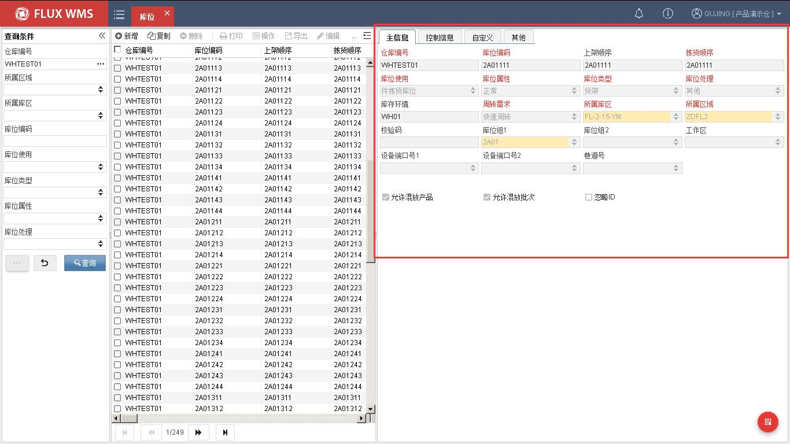

仓库编码－所属仓库代码。新增时默认取当前仓库。

<!-- 原 PDF 第 161 页 -->

库位编码－库位的代码 ID。在同一仓库中不可重复，一般由字母或数字组成。通常建议库位编码组合中可以体现库位所属区域、库区信息，例如“区域-库区-巷道-列-位置-层”，连续数字或字母间通过连接符分隔便于人工辨识，例如“Z1A01-001A1”，整体 ID 不宜过长，超过 20 位情况下不利于人工辨识，条码过长也容易导致扫描读取困难。

上架顺序－上架流程中，系统遵循的库位逻辑排序。在此字段中输入库位的排序等级或用于排序的内容，缺省值同库位 ID。在许多情况下，不是按照库位 ID 字段来依次上架到库位，而采用独立的排序进行作业排序，这样有利于仓库内在已有库存的情况下对库内作业动线布局等进行调整，同时又无需变更实际物流位置的编号 ID，无需进行库存移动。

拣货作业顺序－出库流程中，系统遵循的库位逻辑顺序，在此字段中输入库位的排序等级或用于排序的内容，缺省值同库位 ID。为了支持入库、出库操作，作业动线不同的业务场景，系统提供上架顺序、拣货顺序 2 个字段分别配置排序。如果没有特殊作业需求，可使用相同的字段内容统一排序。

库位使用－库位的使用方式，系统提供多种库位使用方式供用户选择，例如箱拣货库位、件拣货库位、箱/件拣货库位、存储库位、过渡库位、理货站、组装工作区等。

库位属性－分别为正常、封存、管控和禁入，根据库位属性，系统进行相关控制（具体控制详见后续介绍）。

库位类型－描述物理库位类型。如分为地面平仓、重力式货架、货架和窄巷道货架等。客户可以根据自身的情况在系统代码中添加所需要的库位类型。

库位处理－识别在库位中将存放的产品包装的类型。系统提供以下 3 种类型：仅限于箱、仅限于托盘和其他。

库存环境－开放编辑字段，用于记录对库位的环境描述，如冷冻等。

周转需求－库位的周转类型，如快速周转、中速周转和慢速周转。通常与产品 ABC 分级配合使用，快速周转的货品放在最方便拣取的快速周转的库位。

库区－库位所属库区。

区域－库位所属区域。非编辑字段，根据库位所属库区，相应显示。资料配置时，通常是先配置区域、库区，再配置库位信息。

校验码－操作库位确认时，可通过扫描校验码确认库位，而不是仅仅根据库位 ID，避免人工输入库位 ID 而与实际操作库位不一致。

库位组（1、2）－下拉列表选择库位所属的库位组名称。

工作区－库位所属工作，任务调度时使用，可将仓库划分为多个工作区，分块指派任务，

<!-- 原 PDF 第 162 页 -->

使用不同的操作功能。

设备端口（1、2）－库位对应的输送线端口，方便规划哪些库位的任务箱，从某个端口弹出。下拉列表内容在“分拣口”功能中维护。由于入库操作与出库操作动线不同，同一个库位在不同业务流中对应的端口号不同，因此系统提供 2 个端口号字段，以便分别应用与入库作业流程、出库作业流程。

巷道号－库位所属巷道，通常用于 ASRS 自动化仓库巷道任务平衡计算。

允许混放产品－是否允许同一库位混合放置多个产品。

允许混放批次－是否允许同一库位混合放置同一产品的不同批次。

忽略 ID－当选中时，从被移进库位的所有货物信息中除去跟踪号信息。

    - 注：

跟踪号是可移动的单件/托盘的标识，一般为托盘号、箱号或产品序列号等。一个跟踪号需要在收货、分拣、和发货的过程中应用。它提供了整个设施中产品运作的参考数目，同时也简化了查找和其它 RF（无线电射频）的处理。

但有些操作情况中，入库时需要根据跟踪号进行操作，而出库时不要求按跟踪号出库，此时可以启用忽略 ID，能够简化出库操作，不需要拣取指定跟踪号货物。

  - 在“控制信息”页签，根据管理需要，依次输入信息：

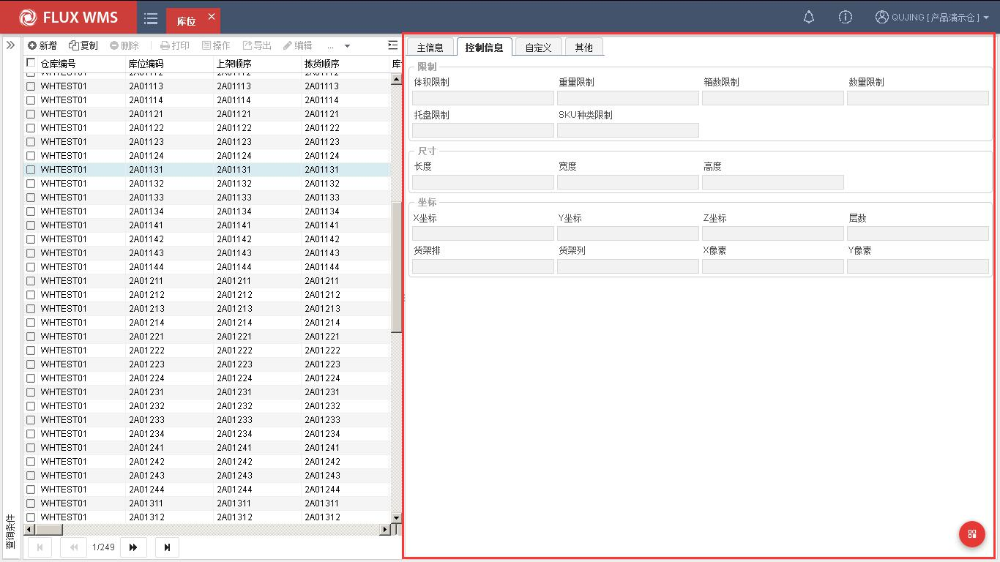

<!-- 原 PDF 第 163 页 -->

    - 限制部分：

库位的总体积限制、总重量限制、可存储箱数、数量限制、托盘数量和 SKU 种类限制。输入对应的限制数值，系统在根据上架规则计算、查找合适的上架库位时，会根据限制数值判断货物是否能够存放入该库位，从而指导仓库上架操作。

但在实物操作时，系统不会根据这些限制数量，不允许作业人员进行上架确认。

    - 尺寸部分：

尺寸－库位的长、宽、高尺寸，同样可作为上架计算时的判断依据。

    - 坐标部分：

库位的 X、Y、Z 坐标和层数，空间定位信息，多用于自动化仓库，在库位就近逻辑计算中也有使用。

在图形化配置时，通过 XYZ 坐标影响到色块所在的界面显示位置，Z 坐标对应图形化界面的“排号”（非 3D 立体界面，分层显示）

X、Y 象素，图形化界面配置使用，控制代表库位的色块长、宽。

配置效果如下：

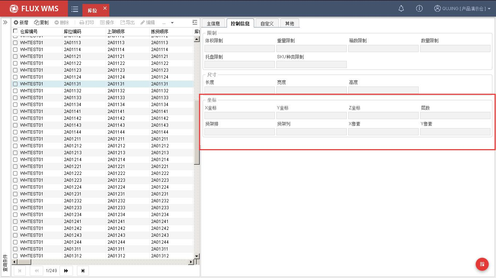

  - 点击【保存】按钮，完成新增记录操作。

<!-- 原 PDF 第 164 页 -->

- **其他**

  - 库位使用说明：

存储库位：批量存储库位，或普通存储位。通常不分区拣货时，可直接用于拣货。具体取决与预配、分配规则设置。

件拣货库位：只允许用来对产品以件为单位直接拣货的库位；即分配订单时，可以做到整箱从箱拣货库位拣取，不满箱的单件从件拣货库位拣取的分区拣货操作。

箱拣货库位：只允许用来分拣整箱货品的库位；即分配订单时，可以做到整箱从箱拣货库位拣取，不满箱的单件从件拣货库位拣取的分区拣货操作。

箱/件合并拣货库位：即可以做箱拣货位，也可以做件拣货位

过渡库位：操作过程中临时使用的库位。收货到过渡库位才会产生上架任务。

理货站：出库流程中，用来分流订单或者集合订单货物的待出库库位。

组装工作区：用于加工操作指定库位，不参与订单分配

快拣补货位：用于基于订单产生的、后续会被整箱分配的补货任务，补货计算到快拣补货位，后续优先从快拣补货位整箱分配，提高作业速度。

补充拣货位：拣货位管理情况下，大批量货物出库时由于拣货位容量有限，有可能一次补货不能满足订单需求。此时可另设补充拣货位。补货时按订单需求，进位取整箱补货（多订单合计需求 2.5 箱，补货 3 箱），优先将标准补货位补满，剩余货物计算补货到补充拣货位。订单优先分配使用补充拣货位库存。

  - 快拣补货位与补充拣货位的异同：

    - 区别

快拣补货位是以提高拣货效率为目标，订单需求的满整箱数量优先补货到快拣补货位

补充拣货位是以临时扩展拣货位为目标，补货优先补货到固定拣货位，订单需求仍然不能满足时才临时征用补充拣货位

    - 共同点

库存优先分配。库位要达到波次拣货完毕后清空的效果。

都是订单驱动时才可能补货，定时补不会考虑。

  - 库位属性说明：

<!-- 原 PDF 第 165 页 -->

正常：正常库位，可被用于入库、出库、补货等各种操作。

封存：不可使用库位，不参与移动、上架、补货等操作。常用于库位临时损坏时进行屏蔽。

管控：部分权限库位。可用于入库、上架计算、移动，但不能正常分配其中的库存。如果订单明细指定从此类库位分配，仍旧允许分配。

禁入：不可将库存加入，如收货、移库入、补货入等。但可以从此库位提取库存，如分配出库、补货出、移库出等。

- **鼠标右键菜单**

在导航列表窗口部分，点击鼠标右键可见右键菜单。

  - 批量复制信息－用于批量更新已有库位的设置信息内容。按一定查询条件查询记录，选择一行记录作为基础记录，修改所需字段内容并保存后，点击鼠标右键选择 “批量复制信息”功能，系统显示如下复制字段选择二级窗口。勾选需要批量复制信息的字段，确认，系统把对应字段内容复制到当前查询到的全部库位记录。

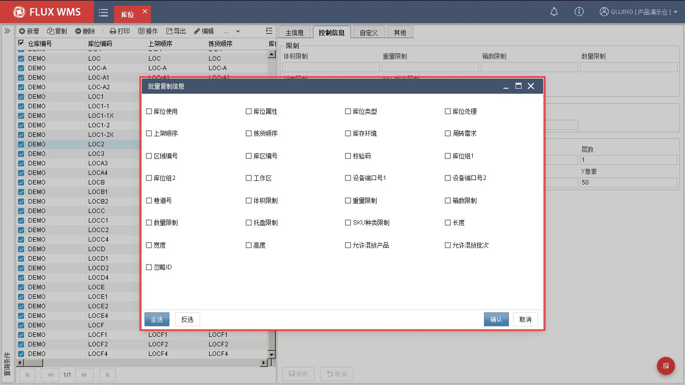

## 7.6. 路线

路线本意是指从一地到另一地所经过的道路。但在物流行业中，常常将多个目的地规划为不同

<!-- 原 PDF 第 166 页 -->

运输路线，以便同一运输车辆可以一次经过多点，达到效益最大化的目的。合理的运输路线规划需要考虑到路程、车辆、成本、装卸等众多因素，也往往是运输服务的核心考量之一。仓储服务中，经常需要配合运输路线，规划货物的装载，例如不同路线地点的货物不能装载到同一辆车上；在车辆最后抵达的终点站卸车的货物，在仓库发货装载时应最先装车。因此仓库在拣货过程中，也常将同一线路的订单、货物集货在一起，以便安排装车发运。在按路线集货的作业模式中，有些仓库规模较大，常有多路线、多集货区的情况。有些路线货物量波动较大，旺季、淡季所需集货区面积差别较大，此时最好集货区可以灵活调配给不同的路线。也有的仓库，为多路线服务，按时段分批操作。因此系统需要支持到路线、集货区的多对多匹配。维护后的路线、集货区对应，将在分配环节，计算对应集货位时使用，以便为订单货物找到合适的集货位，与其运输路线要求相匹配。

- **路线设置**

  - 在主菜单“仓库设置”下选择“路线”。

  - 点击【新增】按钮，下拉选择已维护的路线代码，并选择对应的集货区。

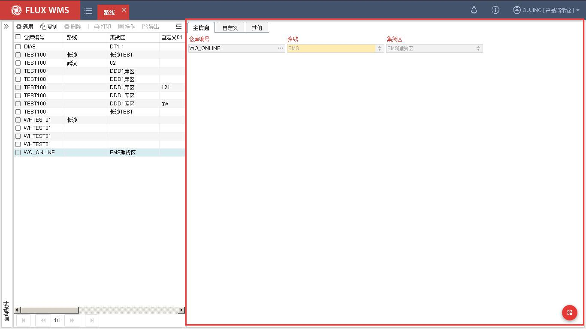

  - 所供选择的路线，需要提前在系统代码-路线代码（ROU_COD）中维护；集货区，则取自库位使用是“理货站”类型的库位所属的库区。

<!-- 原 PDF 第 167 页 -->

## 7.7. 月台

月台，即装卸货所用的操作平台，由于不同月台对应的仓库门不同，货物的搬运路线也会有所不同。因此在系统中进行装卸车管理时，需要对月台或者说仓库门进行规划，以便在提高月台利用率的同时，减少仓库内交叉搬运的工作量。

在基础设置中，需要预先定义仓库内月台的相关信息，以便月台调度使用。

- **月台设置**

  - 在主菜单“仓库设置”下选择“月台”。

  - 点击【新增】按钮，在“主信息”页签依次输入信息：

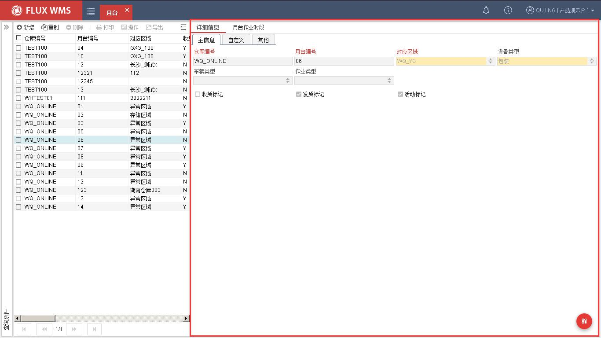

仓库编号－月台所属仓库。默认为当前登录仓库。

月台编号－月台代码。

对应区域－月台对应或邻近的操作区域（基础设置区域）。

设备类型－月台对应设备类型，在系统代码 DCK_EQP_TYP 中维护下拉列表内容

车辆类型－月台对应设备类型，在系统代码 VEH_TYP 中维护下拉列表内容

作业类型－月台对应作业类型，在系统代码 DCK_OPR_TYP 中维护下拉列表内容

<!-- 原 PDF 第 168 页 -->

收货标记－月台是否允许收货。

发货标记－月台是否允许发货。

活动标记－月台是否可使用。

  - 点击【保存】按钮，完成设置操作。

## 7.8. 设备

设备指的是仓库内部操作用的机械设施，例如叉车、堆高机等。FLUX WMS 提供的设备功能，主要用于记录仓库内设备信息。同时可对设备管理、作业管理进行支持。

- **设备设置**

  - 在主菜单“仓库设置”下选择“设备”。

  - 点击【新增】按钮，在“主信息”页签依次输入信息：

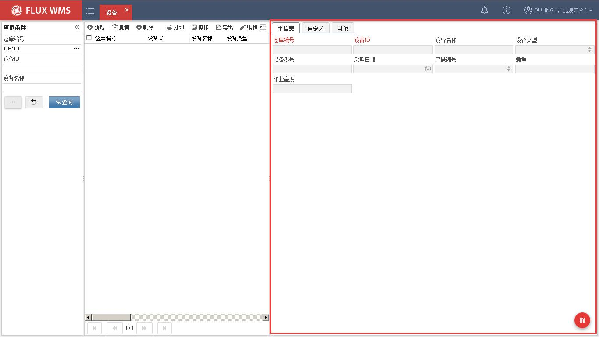

仓库编号－设备所属仓库。默认为当前登录仓库。

设备 ID－设备的代码。

设备名称－设备名称描述。

<!-- 原 PDF 第 169 页 -->

设备类型－设备类型信息（系统代码 EQP_TYP）。

设备型号－设备型号信息。

采购日期－设备采购时间信息。

作业区域－设备的作业区域信息（基础设置区域）。

载重－设备的载重信息。

作业高度－设备的作业高度信息。

  - 点击【保存】按钮，完成设置操作。

## 7.9. 分拣口

分拣口，指的是使用自动化传送设备的仓库中，设备弹出的端口。现场作业中，分拣口可能与路线绑定，也可能根据作业量情况调整路线设置，因此系统提供独立功能进行配置。

- **分拣口设置**

  - 在主菜单“基础设置”下选择“分拣口”。

  - 点击【新增】按钮，在“主信息”页签依次输入信息：

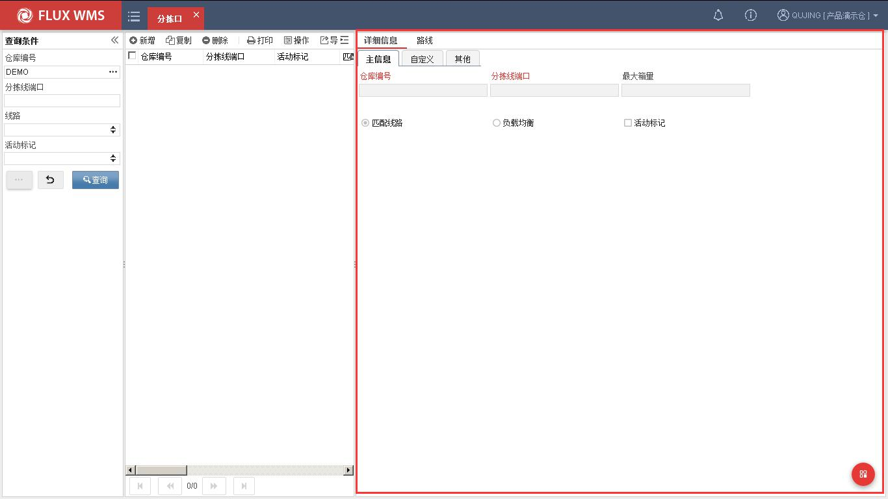

<!-- 原 PDF 第 170 页 -->

仓库编号－分拣口所属仓库。默认为当前登录仓库。

分拣线端口－输送线弹出端口的端口号

最大箱量－当分拣口待执行弹出箱量已达到此上限值情况下，该分拣口的订单/箱允许分配到其他分拣口。

匹配路线－作业模式二选一选择项。分拣口与路线绑定，对应路线的货物/包裹从此分拣口弹出。

负载均衡－作业模式二选一选择项。根据传输量，多个分拣口平均作业量，执行负载均衡计算。

活动标记－分拣口是否启用

  - 点击【保存】按钮，完成头信息新增操作

- **分拣口路线配置**

  - 选择“路线”页签，系统显示如下，为当前分拣口指定路线配置

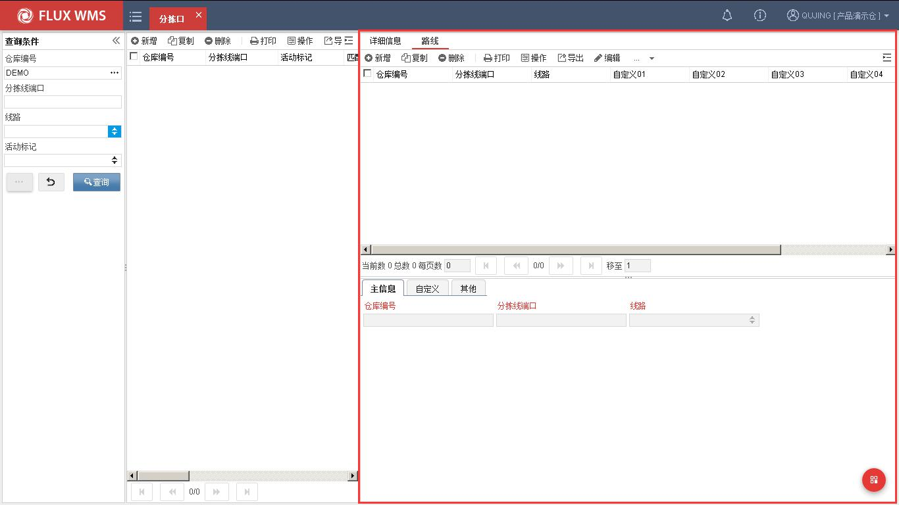

  - 点击【新增】按钮，系统在主信息页签显示仓库编号、分拣口编号，根据需要选择线路，然后点击【保存】按钮，记录保存成功，显示到上方列表窗口

注：一个分拣口，可对应多条路线，通常是这些路线货物可以一同运输，或者后续作业有按路

<!-- 原 PDF 第 171 页 -->

线进一步分拣等操作。

## 7.10. 堆垛机

自动化仓库中，堆垛机是关键设备之一，通常有自有 WCS 进行管控，WMS 通过接口与 WCS 进行交互，下达任务从而驱动堆垛机进行作业。但在日常作业过程中，有时由于堆垛机设备原因，某个巷道的任务暂时无法执行，例如设备检修养护等，此时需要通过设置告知系统，任务下达时避让此巷道，因此在 WMS 中也具有堆垛机设置功能。

- **堆垛机设置**

  - 在主菜单“仓库设置”下选择“堆垛机”功能。

  - 点击【新增】按钮，在详细信息部分的“主信息”页签，可以人工维护或者通过接口获取每个堆垛机的当前作业状态，并保存。

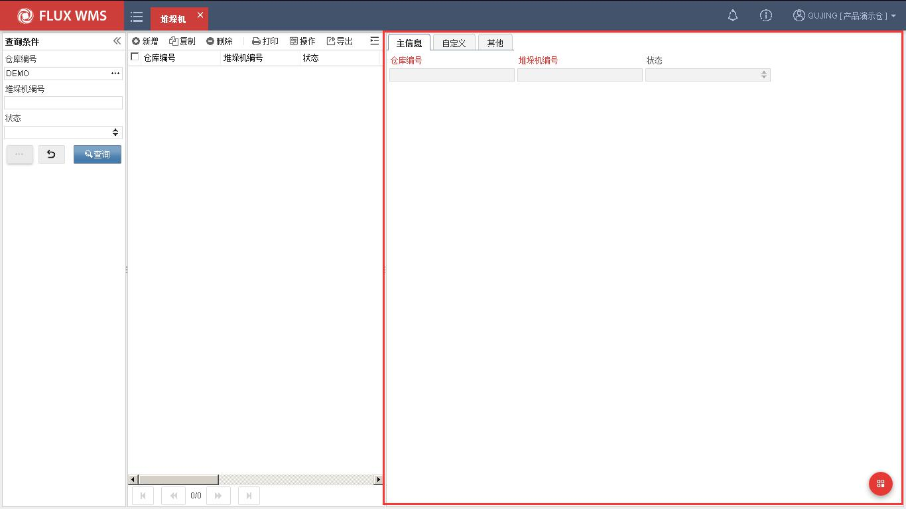

  - 系统提供正常、禁入、禁出、堆垛机故障 4 种状态情况供选择。

<!-- 原 PDF 第 172 页 -->

## 7.11. 播种墙

日常使用的电子标签播种，波次复核播种，入库播种，动态播种等各种播种作业操作，所使用的播种墙、播种库位信息，在“播种墙”功能中进行维护，除了播种位 ID 等日常信息，还需要对播种位的 X/Y 坐标、显示顺序等信息进行维护，以便图形化显示使用。

- **播种墙设置**

  - 在主菜单“仓库设置”下选择“播种墙”功能。

  - 点击【新增】按钮，在详细信息部分的“主信息”页签，维护播种墙相关信息，如代码、名称、层数、列数，新增信息默认非激活。

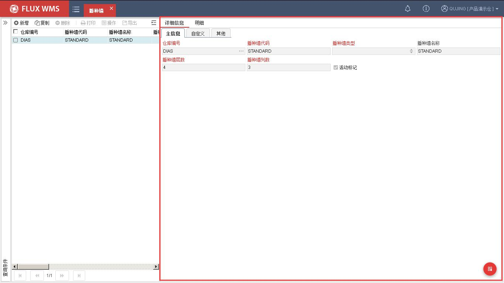

仓库编号－播种墙所属仓库。默认为当前登录仓库。

播种墙代码－播种墙 ID。

播种类型－下拉列表选择，即播种墙货格数限定，后续所配置的播种墙明细播种位格，不能超过类型对应的格数上限。

播种墙名称－名称描述。

播种墙层数－播种墙层数信息。

播种墙列数－播种墙列数信息。

<!-- 原 PDF 第 173 页 -->

活动标记－是否使用中的记录。新增保存时，默认不勾选。完成明细播种位配置后，再勾选为活动状态。系统同时校验明细播种位个数是否超过类型要求的播种位个数上限。

  - 主信息保存后，在“明细”页签，进一步维护如下播种库位的相关信息

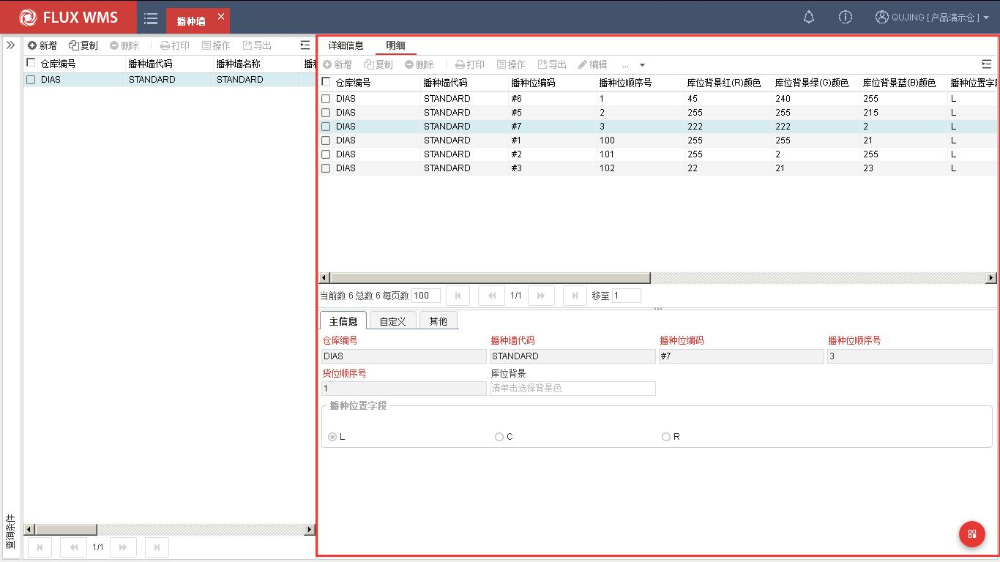

仓库编号－默认当前仓库编号代码。不可修改。

播种墙代码－播种库位所属的播种墙 ID，不可修改。

播种位编码－播种位代码 ID，即播种货格代码。

播种位顺序号－播种位绑定次序。例如订单优先绑定播种墙中部、最方便作业的播种位，后续订单再绑定上层、下层播种位，绑定四角距离较远的播种位。绑定顺序，可以与纵向、横向的位置显示顺序不同。

货位顺序号－播种位在图形化界面的显示顺序配置。

库位背景－点击后显示颜色控件，可以选择播种位背景色。

播种位置字段－播种库位所属左、中、右片区选择，播种时界面会显示相应的方向指示箭头。

  - 点击【保存】按钮，完成播种位维护

<!-- 原 PDF 第 174 页 -->

## 7.12. 员工

登录系统的操作用户，需要在权限管理模块中维护。但另一部分，不直接操作系统的员工，而与业务相关的，可以在员工功能中进行维护。例如货主对应的业务担当，入库单、出库单对应的业务担当，可以在员工中进行维护，方便仓库作业人员在需要的时间能够找到对应的内部业务联系人。

- **员工设置**

  - 在主菜单“基础设置”下选择“仓库员工”。

  - 点击【新增】按钮，在如下图的“主信息”页签依次输入工号、名称、电话等信息。

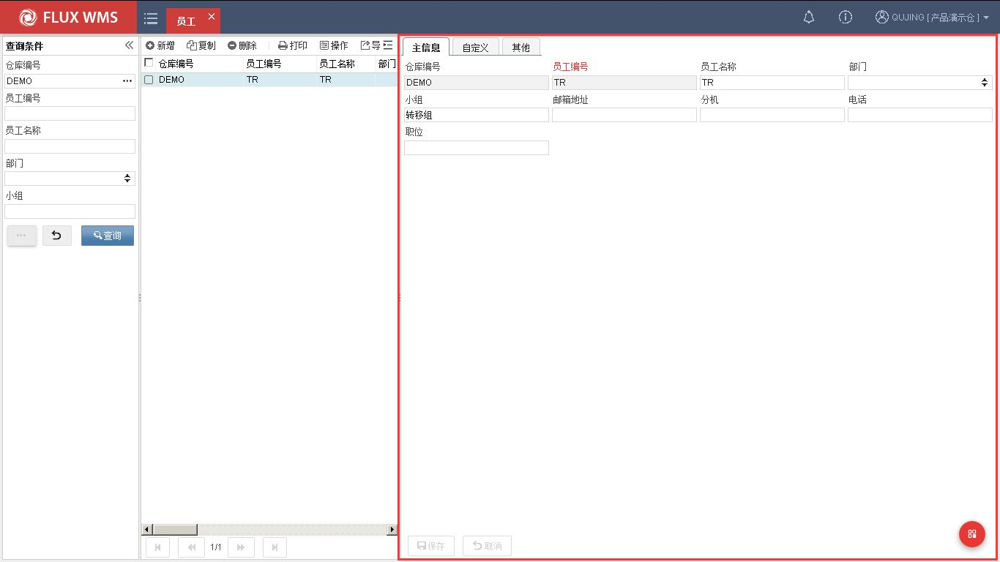

  - 点击【保存】按钮，完成仓库员工记录新增。
