# 8. 业务规则

> 来源：`富勒WMS系统用户手册_V6_高清版（维他命）.pdf`，原 PDF 第 175 页起。
> 本文件按原 PDF 正文标题拆分；原文截图已提取至同目录 `assets/`。

<!-- 原 PDF 第 175 页 -->

## 8.1. 业务规则概述

业务规则是 FLUX WMS 中非常复杂和优异的部分，是系统在处理仓库业务时所遵循的、关于商品或使用者的运算规律，也是系统后台逻辑最为复杂的部分。在我们理解和运用系统前，必须了解业务规则如何引导整个仓库管理系统的运作。

业务规则主要有：

  - 上架规则

用户能够通过设置不同的上架规则，使系统为不同产品推荐所需要的存储库位。

  - 库存周转规则

负责控制库存周转的计算规则。

  - 预分配规则

负责库存预留的规则。

  - 分配规则

负责库存拣选的规则。

  - 补货规则

动态补货情况下系统进行拣货库位选择的规则。

  - 质检规则

根据入库单证生成质检单据时，产品应检数量计算规则。

  - 流水号规则

系统内部各种订单号、序列号等的生成规则。

  - 定时任务规则

系统定时执行处理的控制规则

  - 波次计划规则

系统定时生成波次计划所遵循的规则。

<!-- 原 PDF 第 176 页 -->

  - 自动发运规则

订单自动发运规则配置

  - 路线规则

不同路线，承运、业务量分配规则

  - 配送规则

不同承运人的配送单运单号计算规则

  - 单证控制规则

不同类型单证的操作管理规则。

  - 任务派发规则

工作任务下达指派和控制的规则。

  - 序列号规则

序列号校验逻辑规则

业务规则是实现仓库个性化服务和工作自动化的基础。业务规则管理不同的工作流，保证任务的及时指派和作业优化。

业务规则是客户、产品和订单层次的，其优先级也逐步上升，也就是说订单层次指派的规则优先于产品层次指派的规则，而产品层次指派的业务规则优先于客户层次指派的规则。

FLUX WMS 充分考虑客户的各种需求，制定的业务规则的层次，最大程度保证了业务系统的灵活性。

除了各类业务规则，在这个大模块中，还包含一些对业务流程有影响的配置功能，例如系统参数配置，界面字段显示、默认值配置，打印数据源配置等。通常情况下，此类配置作为系统应用的整体设置，先期进行配置。

## 8.2. 上架规则

我们已经定义了仓库中必需的信息(区域、库位、体积、空间、产品等)，所以能够根据客户产品需要或者现场管理要求，创建一个决定产品在仓库中如何摆放的业务管理规则，称之为上架规则。每一个客户或产品可以分别定义对应的上架规则。

<!-- 原 PDF 第 177 页 -->

由于同一产品在不同仓库内的存储布局要求有可能不同，因此在进行上架规则配置时，可以为每个仓库分别配置上架规则。所需上架规则，在业务规则中预先维护好具体要求内容。

遵循上架规则执行上架计算，需要的前提是产品配置为系统计算库位（不能是人工指定库位），并且收货库位是过渡库位。否则系统视为人工收货到存放库位，无需系统进行上架计算、推荐库位。

### 8.2.1. 上架规则设置

在上架规则中有两个基本部分:

- **详细信息**

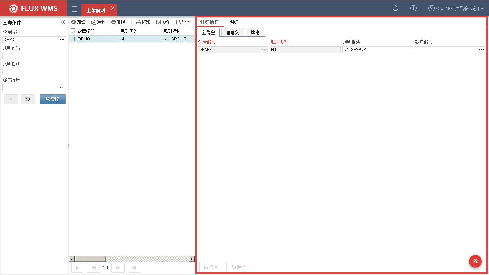

上架规则除了代码、描述之外，还需要指定此规则适用的仓库。新增时，系统自动默认当前登录仓库。客户代码字段内容仅用于备注，如果规则适用于多个货主，客户代码字段可以不指定。

- **明细**

它说明了 FLUX WMS 系统如何评估这一产品和一系列用来挑选合适的库位时的约束条件。系统按一定的步骤来评估每一产品。

<!-- 原 PDF 第 178 页 -->

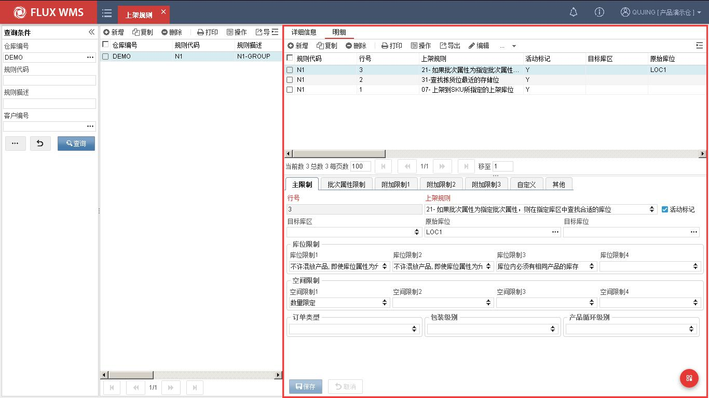

FLUX WMS 在评估和执行上架规则时，考虑的先后次序是：

  - 按行号的次序依次选择（新增记录时，行号可编辑，方便用户调整次序）生效的规则明细行。

  - 根据订单类型、包装级别、产品循环级别、批次属性等条件，决定是否遵循此行规则。如果条件不符，则跳过此行，查看下一行规则明细。

  - 根据规则代码，来决定如何获得候选库位的清单。

  - 为候选名单中的每个库位检查限制条件（包括库位限制、空间限制等条件）。

  - 分派库位。如果某一个库位通过了以上所有的限制条件，就完成了库位的选择。

  - 如果找不到一个合适的库位，选择下一行规则，并且重复以上步骤。

  - 如果全部规则运算后，没有找到合适的库位，系统返回空值。

FLUX WMS 让使用者能定义出一种自定义的上架规则，从而能在不修改代码的情况下修改这种业务规则。

### 8.2.2. 规则元素说明

- **上架规则代码**

<!-- 原 PDF 第 179 页 -->

  - 代码 01-如果从“收货库位”收货，则上架到“目标库位”

如果产品的收货库位，是规则中维护的“原始库位”字段指定的库位，则符合此项规则，强制上架到“目标库位”字段维护的库位中。此规则下，目标库区字段维护的内容将被系统忽略。

此规则能够实现不同库位收货的货物，分流到不同库位的目的，例如收货到 A 库位的货物，全部上架到 A0001 库位。

  - 代码 02-如果从“收货库位”收货，则在指定的库区中查找合适的库位

与规则代码 01 逻辑类似，但目标不是具体某个库位，而是一个库区的多个库位。即如果产品的收货库位，是规则中维护的“原始库位”字段指定的库位，则在“目标库区”字段指定的库区中寻找合适的库位。具体哪个库位合适，将根据后续限制条件（库位限制、体积限制等）进行判断。此规则下，目标库位字段维护的内容将被系统忽略。

此规则能够实现不同库位收货的货物，分流到不同库区的目的。例如收货到 A 库位的货物，在 A1 区寻找合适的存储位，而收货到 B 库位的货物，到 A2 区寻找合适的存储位。

  - 代码 03-在指定库区中寻找合适的库位

最为常用的规则之一，不考虑产品的具体收货库位（当然，产品只有收货到过渡类型的库位才会进行上架库位计算），而是直接在“目标库区”字段指定的库区中寻找合适的库位。

  - 代码 04-上架到“目标库位”

使用此规则的产品都指定上架到唯一的库位，库位号维护在“目标库位”中。

常用做其他规则找不到合适库位情况下的强制指定。例如所有系统计算不到合适库位的货物，都指定到 TEMP 库位，再由人工进行安排。

  - 代码 06-在 SKU 所指定的库区列表查找合适的库位

有些仓库库区划分较为细致，不同产品上架到不同库区。如果只在上架规则中设置，规则太多，不利于维护。因此规则指定到产品档案中维护的库区找合适库位，可以在产品档案中逐一维护。并且能够设置多库区的列表，按配置的次序在各个库区依次寻找可存放库位。

例如同一个产品 A，在广州仓，依次到 G1、G2、G3 库区查找合适的库位。在北京仓，则是 BZF、BZH、BZA 的次序。结合产品档案设置与上架规则设置共同生效。

  - 代码 07-上架到产品所指定的上架库位

在产品档案中，每个产品可以维护各自的上架库位。采用此规则，将产品计算上架到产品档案的上架库位维护的库位中。能够实现每个产品上架到指定的固定库位的要求。

<!-- 原 PDF 第 180 页 -->

与 06 规则类似，也是结合产品档案设置与上架规则设置共同生效。

  - 代码 11-使用产品的件拣货库位

指定上架到产品档案中维护的件拣货库位中。

  - 代码 12-使用产品的箱拣货库位

指定上架到产品档案中维护的箱拣货库位中。

  - 代码 13-使用产品的箱/件拣货库位

指定上架到产品档案中维护的箱/件拣货库位中。

  - 代码 21-如果批次属性为指定批次属性，则在指定库区中查找合适的库位。

执行上架计算时，先判断记录是否符合上架规则指定的批次属性条件，如果符合，在“目标库区”维护的库区中找合适的库位。

记录如果不符合指定的批次属性条件，则跳过此行上架规则明细，与下一规则记录进行匹配。

例如良品到 A 区寻找合适的库位，不良品到 B 区寻找相同产品的库位，就是通过此规则配置实现。

  - 代码 22-如果批次属性为指定批次属性，则上架到目标库位。

执行上架计算时，先判断记录是否符合上架规则指定的批次属性条件，如果符合，上架到“目标库位”维护的库位中。与规则 21 类似。

  - 代码 30-查找同类产品相邻的库位。

计算上架库位时，根据产品档案的产品组，优先寻找同组产品所在库位附近的库位上架。

  - 代码 31-查找拣货位最近的存储位。

货物入库时，先入拣货位，拣货位放不下再找入拣货位附近的存储库位，此时可以用到规则 31，通过计算存储位、拣货位到库区基点库位的距离（根据库位 X、Y、Z 信息计算），选择距离拣货位最近的存储位。

- **库位限制**

说明每个候选库位类型必须满足的限制条件。如果一个库位不能满足所有的限制条件，它就不能被用于候选存储，包括是否能够能够混放批次、产品，是否根据产品组信息判断等。即主要用来校验候选库位能不能用。

在判断“相同批号”时，是根据批次属性规则中的“关键批次”进行判断的，能够实现部分批

<!-- 原 PDF 第 181 页 -->

次属性相同即认为批号相同的要求。库位限制的内容主要有：

  - 必须是空的库位

产品在放入之前必须是空的库位。即使库存中有相同产品或者已占用的库位有足够的空间，也必须找新的空库位。

  - 不许混放产品

和库位“允许混放产品”控制效果一致，但是它能用于所有的候选库位，而忽略库位中的混放标识设置。即不论目标库位在库位档案中如何设置，上架时都不能把不同产品放置到同一库位中。

  - 不许混放批号

根据批次属性的关键属性来判断，批号是否一致。不一致的情况下，即使库位档案中设置可以混放批次，在上架计算时和仍旧不允许关键属性不同的产品混放。

  - 库位内必需有相同产品

同样的产品合并库位。

  - 库位内必需有相同批号的产品

同样批号（批次属性关键属性）的相同产品合并库位。

  - 库位内必须有相同产品组 X 的库存

只有产品档案的产品组对应字段相同的产品才能混放。

  - 多伸位-生产日期排序原则

多伸位的仓库中，库位一个方向入库，从另一个方向出库。为了遵循严格的先进先出管理，货物入库时批号（生产日期）必须有序的进行。此时增加限制条件，计算上架的货物的生产日期必须大于或者等于该库位最大的生产日期，否则此库位即不符合条件。

- **空间限制**

为每一个候选库位说明空间尺寸要求，如体积、重量等，过滤可用的库位。即主要考虑库位能否放得下的问题。空间限制的主要条件有：

  - 体积限定

不适用于评估箱或件拣货库位，因为这些库位已经预先规定出能存放的固定数目。

<!-- 原 PDF 第 182 页 -->

产品体积的计算逻辑是，用产品的标准体积乘以待上架的数量。同时用这个库位的体积减去已存产品的体积。将两个所得的数字进行比较，看待上架的产品能否放入库位进行存储。

  - 长宽高限定

产品（或者相应的包装）的长宽高必须全部小于库位的长宽高，常用于特殊产品，如超长、超高货物的限定。

不适用于评估箱或件拣货库位，因为这些库位已经预先规定出能存放的固定数目。FLUX WMS 假定每个库位都有一个托盘库位，但是托盘能堆起来。

  - 重量限定

不适用于评估箱或件拣货库位，因为这些库位已经预先规定出能存放的固定数目。

产品的重量是这样计算的：用产品的标准重量乘以上架的数量。再用这个库位的重量减去已存产品的重量。将两个所得的数字进行比较。

  - 数量限定

使用产品的主单位数量同候选库位的限定数量相比较。

  - 托盘数量限定

不能用于评估箱拣货库位或件拣货库位。按托盘数量限定的计算方式是：使用产品的托盘数量同库位的托盘数量限制数相比较。

  - 箱数限定

根据箱包装级别的数量，判断库位是否能容纳。

  - 服装行业挂装规则

根据库位组 1 的长度、挂装衣物的厚度，计算一个库位组内，多个动态长度库位可容纳的服装。

  - 动态件/箱拣货位数量限制

用于上架到拣货位的业务情况，根据拣货位的上限数量判断是否能够容纳。

- **订单类型**

限定此上架规则执行的订单类型。可以达成不同类型订单分流处理的效果。例如正常订单上架到存储库区，退货订单上架到 QC 库区等。

- **包装级别**

<!-- 原 PDF 第 183 页 -->

限定此上架规则执行的包装级别。能够实现不同包装级别的产品，分流上架的目的。例如零散产品上架到拣货位，整托盘上架到存储区。

- **产品循环级别**

限定此上架规则执行的产品所属的循环级别，便于根据产品周转情况安排仓库存储及操作路线。

- **批次属性**

限定此上架规则执行对应的批次属性内容。

- **其他扩展约束条件**

附加限制页签还有一些进一步限制的字段内容，可以根据管理需要填写：

  - 库位使用

指定库位使用类型。可从所选中的任意一个库位使用类型中选出候选库位。选项包括箱拣货库位、件拣货库位等。

  - 库位类型

约束候选库位的类型，如货架、VNA 等。

  - 库位属性

约束候选库位的属性，如正常、损坏等。

  - 库位处理

约束候选库位的处理方式，如箱拣货、件拣货等。

  - 库位周转

约束候选库位的周转要求。

  - 库位组

约束候选库位所属的库位组。

  - 最大允许混产品

约束候选库位可混放产品项个数的最大值。例如库位中可以混放两种 SKU，但不能再上架第三种 SKU。

  - 最大允许混批号

约束候选库位可混放批次个数的最大值。

<!-- 原 PDF 第 184 页 -->

  - 成功_下一步骤

跳步骤分流时使用。本行上架规则执行成功后，跳转到指定的上架规则行。例如先判断拣货位是否有库存，如有，跳转到下一步骤，到 A 区找合适的库位；如果没有，即失败，跳转到 B 区找合适的库位的规则行。

  - 失败_下一步骤

跳步骤分流时使用。本行上架规则执行失败后，跳转到指定的上架规则行。

  - 指定库区产品库位个数限制

产品优先存放到方便捡取的存储区（非拣货位），但由于产品批量较大，为了避免整区都被某几种产品占用，可以规定该区内，执行此行规则的产品只能占用多少个库位。再多，就会跳出此行规则，执行下一行上架规则的逻辑，可实现快速周转区放一部分货，更多的货物上架到中速周转库区的业务要求。

  - 订单行类型

特殊情况下，一个订单可能不同行对应到不同的类型（常见于接口下达单据），可根据订单行类型执行对应的上架规则。

## 8.3. 库存周转规则

库存周转规则是出货时所考虑的产品周转排序。通常来讲，仓库在出库时货主经常会有指定的出库要求，例如某个产品要求发货指定的生产批号，或者指定的供应商的货物。但符合要求的货物很可能不止一个批次，或者货主没有指定具体的要求，此时就需要利用到库存周转规则，对符合要求的货物进行排序，然后按一定顺序出库。

通常所说的产品先进先出（FIFO），就是一种常见的库存周转规则。

库存周转规则是用于库存分配环节的。在产品出库操作中，每一次分配都会利用到库存周转规则中的设置。

由于不同客户用来排序的信息内容不同，而这些内容必须跟踪到库存才能在出库时用来排序，因此这些信息项必须在批次属性规则中维护，而库存周转规则设置时只需指定对应的批次属性规则以及相应排序要求即可。

在库存周转规则中有两个基本的部分:

- **详细信息**

<!-- 原 PDF 第 185 页 -->

包括库存周转规则和描述说明。见下图：

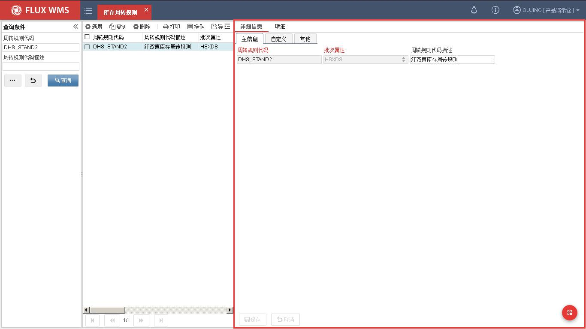

周转规则代码－规则代码 ID

批次属性代码－选择预先设置的批次属性规则。

周转规则代码描述－周转规则描述。

- **明细**

<!-- 原 PDF 第 186 页 -->

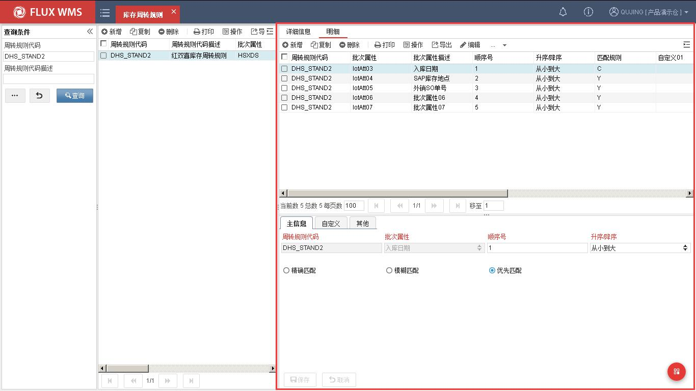

周转规则代码－对应所属的库存周转规则代码。

批次属性－用来排序的批次属性项。下拉列表显示表头所选批次属性规则对应的全部批次属性项，保存后不可修改。

顺序号－执行排序的优先次序。

升序/降序－排序方式选择。

精确匹配－是否批次属性项精确匹配。

是否精确匹配，意味着当符合订单中指定的批次属性的库存不足时，是否可以分配到后续类似的库存。例如指定分配入库日期为 2017-01-01 的库存，如果该日期库存不足，精确匹配情况下，只能部分分配；非精确匹配情况下（例如模糊匹配），可以分配入库日期为 2017-01-02 的库存。具体匹配日期视库存情况和升降序选择配置而执行。

模糊匹配－对于指定的批次属性内容，只能选择在其排序之后的。例如发运订单中指定批次属性 3 入库日期为 2017-01-01，库存不足，同时设置为模糊匹配，从小到大排序。此时系统可选择大于此日期的库存，如 2017-01-02、2017-01-03……入库的批次，但不能选择小于指定值的批次，如 2016-12-31 入库的库存。如果是从大到小匹配则可以选择 2016-12-31 的库存。

优先匹配－优先按指定批次属性值匹配库存，如不足则按库存周转规则排序查找库存。例如发运订单中指定批次属性 3 入库日期为 2017-01-01，有库存但不足订单数量，同时设置

<!-- 原 PDF 第 187 页 -->

为优先匹配，系统将分配入库日期为 2017-01-01，剩余缺额，按库存周转规则，分配当前在

库的入库日期为 2016-02-11 的库存。

在指定批次库存足够的情况下，3 种匹配模式都会足额分配指定批次库存。

- **库存周转规则执行**

每一个产品设置一种对应的库存周转规则，它说明了 FLUX WMS 系统如何评估这一产品和一系列用来挑选合适的产品时的约束条件。系统按一定的步骤来评估每一产品。

发运订单中会根据产品设置的规则，或者产品设置的订单类型规则获取默认的库存周转规则，但允许人工在发运订单中修改。

FLUX WMS 在评估库存周转规则，考虑的先后次序是：

  - 按顺序号的次序依次选择。

  - 批次属性的次序和排序方式。

  - 为候选名单中的每个产品检查限制条件。

  - 分配产品。如果某一个产品通过了以上所有的限制条件，就完成了产品的选择。

  - 如果找不到一个合适的产品，选择下一行，并且重复以上步骤。

  - 如果全部规则运算后，没有找到合适的产品，系统将按照批号的先后次序进行。批号的先后次序请参考库存管理。

注意：当批次属性在发运订单的明细中指定时，系统将只分配给被请求的属性。

## 8.4. 预配规则

- **预配规则说明**

在创建订单后，仓库就得为订单寻找到合适的产品。找到时，这些产品就预留给那份订单，这个过程就叫配货。配货包括两个组成部分，配货准备（预分配）和配货（分配）。

配货准备，主要目的是检查库存中是否有符合订单要求的货品，如有，则为订单保留产品，避免被其他订单占用。在比较货品的过程中，需要基于计量单位进行库存检查，例如客户要求的是整托货品，还是散箱拼托也可以解释。有时客户未明确要求，仓库也可能根据存货情况，设备情况，出于作业效率角度考虑进行匹配。

但配货准备匹配到的库存，可能不会马上进行出库操作，为了避免影响其他订单拣货操作，配

<!-- 原 PDF 第 188 页 -->

货准备时不会锁定具体库位上的库存，而是根据批次信息对产品进行“保留”。如果一个用户只是进行配货准备，他/她仍然能移动已配货准备好的产品。而配货，则为订单锁定具体某个（或者某几个）库位上的库存。FLUX WMS 可以一次对一个订单进行配货，也可以合并多个订单进行配货。配货准备和配货可以根据一定的业务规则来一起产生候选产品和保留产品，配货准备规则我们称之为预分配规则，需要在系统的业务规则中进行设置。

- **预配规则配置**

  - 详细信息

包括预分配规则和描述说明。见下图：

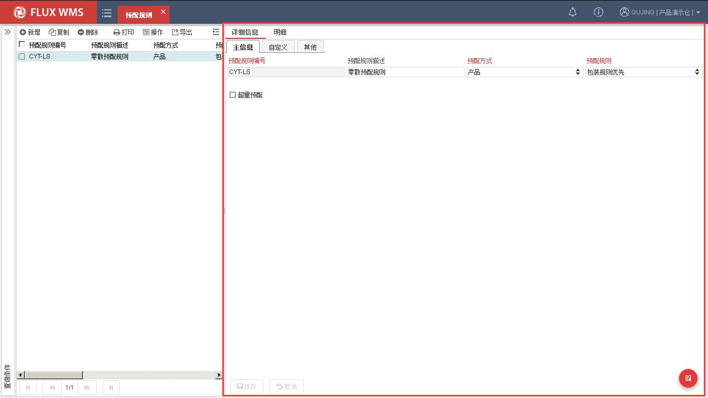

其中预配方式的可选项有“批次”和“产品”。如果选择“批次”则预配时，系统是按照批次号保留商品，即系统保证在某个符合要求的批号下有足够指定订单使用的商品。如果选择的是“产品”，系统是按照产品总数保留商品，即系统保证该产品的库存总量能够满足某一指定订单的出库要求，该选项适用于出库周期很长而产品保质期较短的商品。

预配规则的选项有“库存周转规则优先”和“包装规则优先”。选择“库存周转规则优先”时，意味着系统严格的按照设定的库存周转规则进行配货，如先进先出。选择“包装规则优先”则意味着系统在考虑库存周转规则的同时还会考虑不同包装在出库操作时的便利性问题。

<!-- 原 PDF 第 189 页 -->

超量预配选项，适用于整包装出库情况。如果操作要求箱、托盘等不拆包装出库，而订单数量不是包装的整数倍情况下，不勾选“超量预配”，系统将预配/分配低于订货数量的整包装数量产品；如果勾选“超量预配”，系统将按整包装超额配货，保证订单出库数量。

例如订货铜带 100 米，库存有 2 卷分别为 55 米、60 米。选择超量预配，系统会配货 55+60=115 米，而不超量预配，只能配到 55 米或 60 米，不允许超过 100 米。

  - 明细

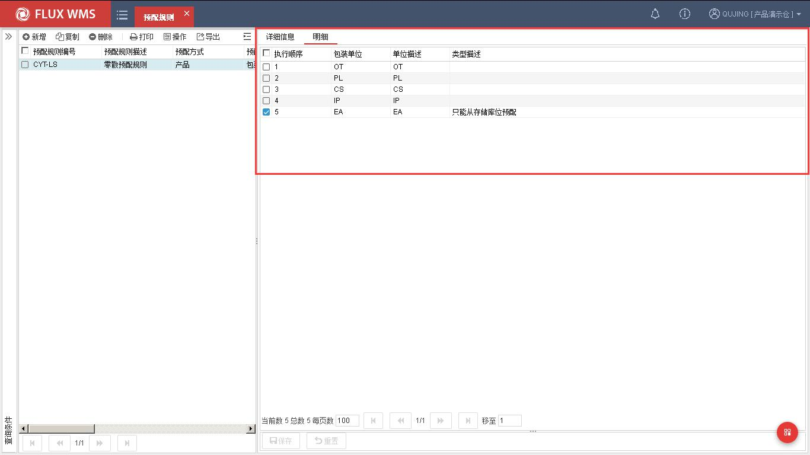

预配规则明细部分即设置了系统预配库存时参照的产品包装级别。

在规则引擎部分，可以通过下拉列表，进一步指定所要配货的范围。例如在启用“包装规则优先”的情况下，可以指定件包装级别的货物，只从拣货位预配；箱包装级别的货物只从存储位预配，达到分区拣选的目的。

但如果是“库存周转规则优先”，则明细部分不支持配置。

预分配规则，说明了 FLUX WMS 系统如何评估这一产品和一系列用来挑选合适的产品时的约束条件。系统按一定的步骤来评估每一产品。

- **预配规则效果**

FLUX WMS 在评估预分配规则，考虑的先后次序是：

<!-- 原 PDF 第 190 页 -->

  - 按行号的次序依次选择。

  - 单位的次序和规则。

  - 为候选名单中的每个产品检查限制条件。

  - 预分配产品。如果某一个产品通过了以上所有的限制条件，就完成了产品的选择。

  - 如果找不到一个合适的产品，选择下一个行，并且重复以上步骤。

  - 如果全部规则运算后，没有找到合适的产品，系统保留未完成预分配的产品清单。

注意：有可能出现库存中有产品，但预分配没有找到，其中的原因可能是多方面的，如订单指定批次数量不足，库存被冻结、预分配规则设置不合理等。

此外，由于开启一步分配模式下，将跳过预配规则，因此在一步分配 ONE_STP_ALC 参数为 Y 的情况下，预配规则界面的上面的预配方式、预配规则、超量预配字段从列表和表单中隐藏，以免用户误解配置未生效。

## 8.5. 分配规则

在产品被预分配后，候选产品批号是按订单拣选来拣出，并按库位、批次和跟踪号来锁定。在这个过程中同样有着不同的业务规则，我们称之为分配规则。

已分配库存，即已被订单锁定的库存，不能再被移动。

- **分配规则**

分配规则设置见下图：

<!-- 原 PDF 第 191 页 -->

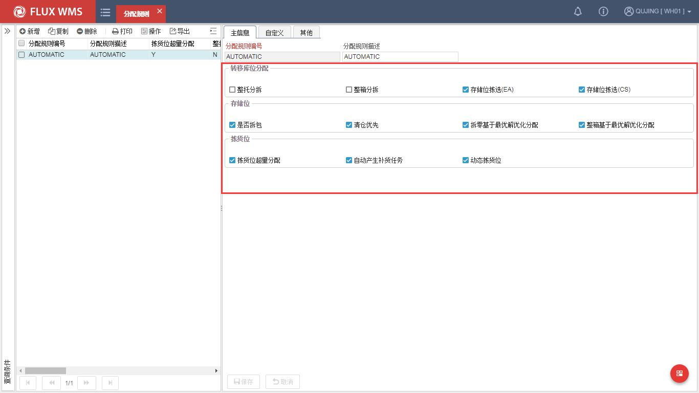

每一个产品包括一种分配规则，它说明了 FLUX WMS 系统如何评估这一产品和一系列用来挑选合适的产品、库位时的约束条件。

  - 转移库位分配

    - 整托分拆/整箱分拆

用于按不同包装（如箱、托盘，需要与预配规则配合使用）分配的情况，当指定的包装级别库存不足时，是否能够使用其它级别的包装。例如把上一级包装按比例拆分为下级包装使用，或者把下级包装的库存，集合成相应数量操作。

    - 存储位拣选（CS）/存储位拣选（EA）

用于控制箱/件订单作业情况下，是否需要“箱件存储位”、“箱存储位”、“件存储位”直接参与分配。

  - 存储位选项：

    - 

    - 是否拆包

针对非整包装、不可拆分的货物，例如铜带（卷）、线缆等整托盘货物，无法设置件/箱/托盘的包装等级，但一托盘货物出库时又不能剪切的情况。如不选择拆包，系统将把一个托盘号下的货物

<!-- 原 PDF 第 192 页 -->

视为整体分配，根据预分配规则中是否超量预配的选择确定超额分配还是低于订单数量分配。

    - 清仓优先

同批次库存，尽可能从库存最少的库位出库，以达到清仓优先，提高仓库利用率的目的。但相应的，拣货时的工作量/操作路线就有可能加长。

    - 整箱基于最优解的分配优化算法

一步分配逻辑中使用，只针对箱数量单位。如果订货的箱数量，有数量正好相符的库位，不论是否选择“清仓优先”，均直接从此数量相符的库位分配。如果没有数量相符的库位，则按照是否选择“清仓优先”，从数量最小的库位内依次出库、清仓；或者效率优先，从能够满足数量的、最小的库位个数组合中配货，达到尽量集中拣取的目的。

    - 拆零基于最优解的分配优化算法

与整箱类似，但基于包装为 EA 级别的记录。

  - 拣货位配置：

拣货位超量分配，用于拣货位库存不足，但已经生成该拣货位对应的补货任务情况下，是否可以分配待补货上架库存。如果可以超量分配，拣货位中可以用来分配的库存上限为库存总数-冻结数量+待补货上架库存。全部分配后，可用库存余量会是负数，补货确认后正常。

自动产生补货任务，即分配时拣货位库存不足，是否根据订单信息，生成订单触发的补货任务。

动态拣货位，是否启用动态拣货位管理。动态拣货位管理即不为产品指定固定的拣货位置，而是当库存存在时，根据产品档案中拣货位设置，由系统临时在指定的范围中为产品配置合适的拣货位。有利于减少人为的配置工作，提高仓库拣货位利用率。

分配规则的拣货位相关配置，需要与产品档案的拣货位设置配合使用。

存储位拣选（EA/CS），当拣货位库存不足，而存储位有库存时，是否可以分配存储库位上的库存。

注意：有可能出现库存中有产品，但分配没有找到，其中的原因可能是多方面的，如订单指定批次，库存被锁定、分配规则设置不合理等。有时预分配顺利完成，但分配没有找到，除了分配规则设置的原因外，主要是由于该批货物处于非可拣货库位（如过渡库位或已被冻结的库位）。

<!-- 原 PDF 第 193 页 -->

## 8.6. 补货规则

部分情况下，由于产品的季节性较强等原因，在仓库中的拣货作业并不是持续的，并且此类产品的种类大于拣货位的设置个数。此时，不需要为每个产品固定拣货位，而是采用动态补货方式，当产品进入操作周期时，为其寻找一个库位作为拣货位，而当产品操作周期结束，此拣货位将让给其他当季产品使用。

在拣货位有库存的情况下，再次入库或补货相同产品，系统会自动寻找已用的对应拣货位。但在拣货区没有库存的情况下，要为产品寻找到一个新的动态拣货位时，就需要遵循补货规则。因此，补货规则也只针对找新的空拣货位的情况，相当于特殊场景下的上架规则。

- **补货规则**

补货规则设置见下图：

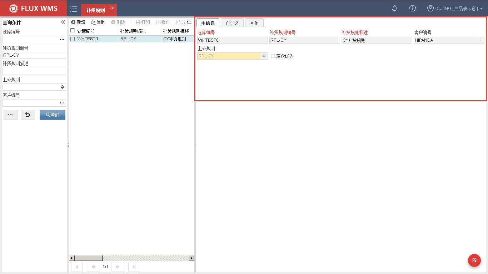

动态补货规则的实际运行同上架规则，因此设置时需要先设置上架规则，然后在补货规则中选用。

补货用的上架规则，通常是在指定库区寻找一个空库位用来做产品的拣货位。

<!-- 原 PDF 第 194 页 -->

## 8.7. 质检规则

质检指的是货物入库前或者在仓库中，按照货主要求对货物进行质量检验的操作。FLUX WMS 提供的质检功能，可以用来对质检操作进行管理和记录。

系统根据质检操作的要求，依据入库单据生成质检单据，用于管理质检操作的过程中，需要依据预期到货的产品数量，计算质检的数量。

由于不同产品检验要求不同，有的是全检，有的是抽检，不同类型的产品，抽检比率或数量也不同，因此 FLUX WMS 系统提供质检规则功能，用来维护不同产品的检验数量比率要求。

产品档案中，根据产品情况，选择对应的质检规则，在生成质检单时将根据质检规则计算质检数量（质检操作请参考入库操作的质量检验部分）。

- **质检规则**

  - 详细信息

质检规则详细信息页签的主信息部分，包含了规则代码和描述信息，显示如下图：

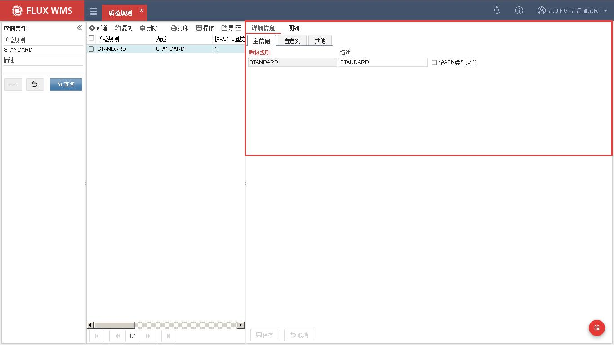

按 ASN 类型定义，如果勾选，明细部分会显示订单类型选择，可以对不同订单类型设置不同的检验比例。

  - 明细

<!-- 原 PDF 第 195 页 -->

质检规则明细部分，设置了期望数区段与应检数量的对应逻辑：

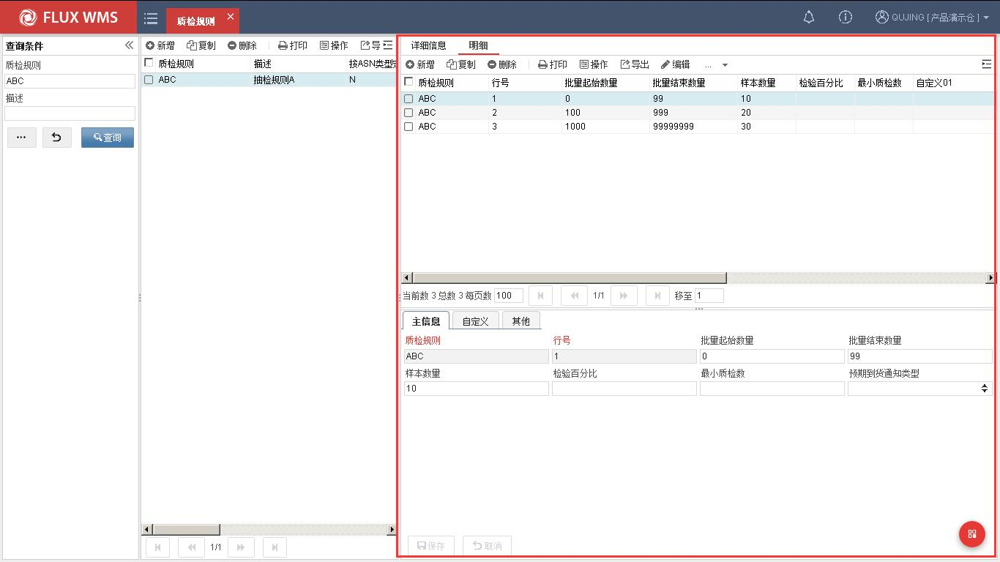

质检规则－质检规则代码，根据主信息自动获取。

行号－质检规则明细行号，也是规则生效的次序。人工录入，保存后不可修改。

批量起始数量、批量结束数量－如果 ASN 中产品的期望数量在此区间内，将执行此行规则明细，否则按下一行的数量要求进行检查。

样本数量－阶段化固定样本数量情况下使用。例如期望数 0-99，固定抽检 10 件；期望数 100-999，固定抽检 20 件。每个数据段抽检数量不同，相互没有比例关系。

检验百分比－按比例抽检的情况下使用。例如期望数 0-100，按数量的 5%抽检；期望数 101-1000，按数量的 3%抽检。不同数量区间，抽检比例不同。

样本数量和检验百分比同时录入的情况下，检验百分比优先生效。

最小质检数－按百分比检验的情况下，为防止期望数少导致的百分比计算所得的抽检数量过少（例如到货 10 件，抽检 1%），设置最低检验数量，如 5，则计算所得的检验数量不足 5 则默认为 5 件。当然，如果订单数量不足最小检验数，以订单数量为准。

ASN 类型－主信息勾选“按 ASN 类型定义”情况下生效，指定质检规则行适用的 ASN 类型。

<!-- 原 PDF 第 196 页 -->

## 8.8. 流水号规则

流水号规则主要用来定义系统中各种单证号、ID 号的生成方式。

- **流水号规则**

流水号规则设置见下图：

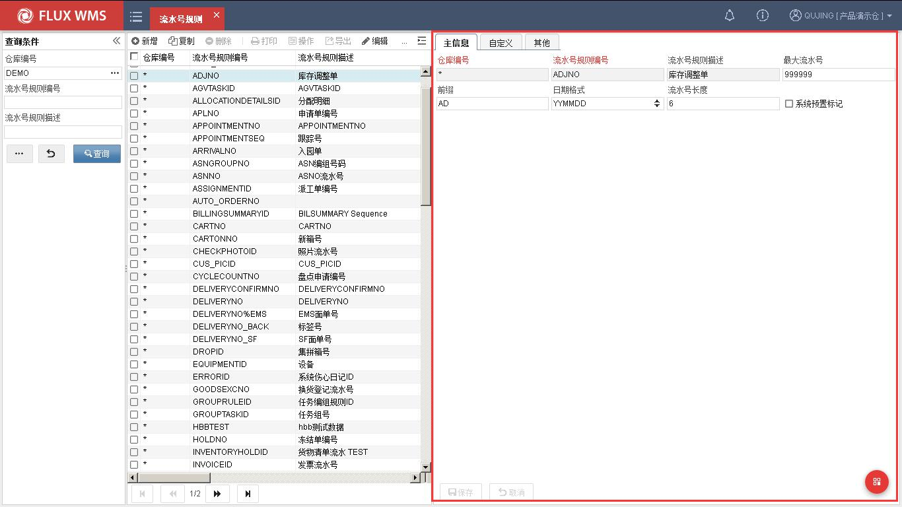

仓库编号－执行此规则的对应业务仓库 ID。如为*，则说明是公共规则。

流水号规则编号－规则代码 ID。

流水号规则描述－规则代码说明。

前缀－单据号码的固定开头内容，根据需要设置。

日期格式－如希望流水号与日期或年月相关可设置日期标识。例如到日的级别，第二天流水号会从 1 开始重新累计。

流水号长度－流水号位数设置。如设置为 5 位，流水号从 00001 开始累计。每个规则可分别定义 ID 的长度、前缀等。例如，希望单证号码显示为前缀+日期+流水号样式，可将日期格式通过下拉列表配置为 “YYYYMMDD”或“YYMMDD”等，长度为 5。系统显示单证号形式为“LN17110200001”。

<!-- 原 PDF 第 197 页 -->

注意：长度指得是前缀、日期之后的流水号位数。订单号码总位数（前缀+日期+流水号）不得超过 20 位长度。如果对应单号需要生成分单，还需要考虑到分单的 3 位长度，否则会导致分单号码超长，无法正常生成分单。

另外，仓库为*的默认规则逻辑，不可删除，可修改配置。避免公共规则逻辑删除导致流水号无法生成。

## 8.9. 定时器

定时器功能主要用于为系统配置定时自动执行的任务，如定时生成补货任务，定时生成波次计划等。用户如需增加其他定时器，请联系 FLUX 专业顾问。

- **定时器配置**

  - 主信息

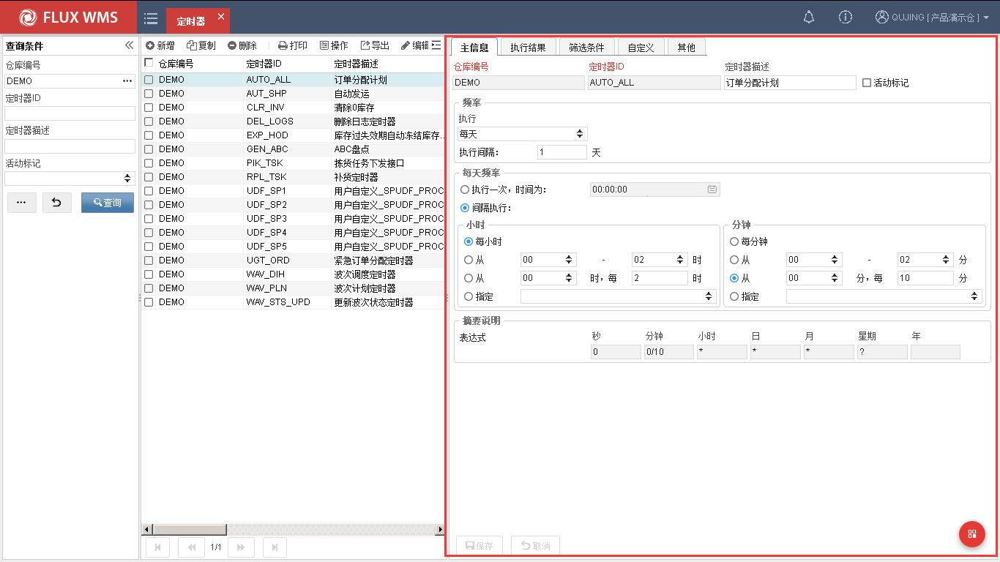

仓库－定时器生效的仓库。如果仓库为*，代表如果没有特别指定，全部业务仓库都执行此定时器。

例如补货定时器，配置了 2 条记录，定时器 ID 相同，一条仓库为*，一条仓库为 BJ。那么北京仓执行其仓库指定的补货定时器设置频率、时间。而其他仓库全部按仓库为*的记录执行补货计算。

<!-- 原 PDF 第 198 页 -->

定时器 ID－定时器代码。系统提供了预设的多个定时器。

定时器描述－定时器名称、说明

  - 定时频率

频率，即定时器执行的时间安排。配置时，先在如上图界面，选择定时器的执行频率，如每天、每周、还是每月、每季度等。随着执行频率选择不同，界面显示的对应配置也有所不同。

  - 每天执行

<!-- 原 PDF 第 199 页 -->

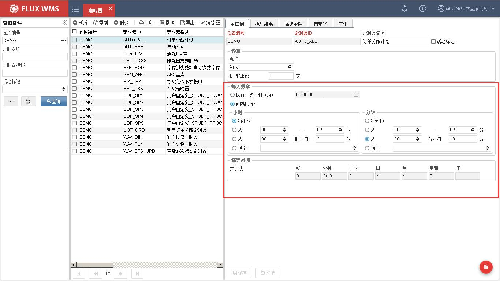

每天执行模式下，可以选择执行间隔，例如每隔 2 天执行一次。默认为 1 天，即每日执行。

每天频率，即执行日的定时器运行设置。可以配置为一次执行模式，指定执行时间；或者是间隔执行模式，间隔一定时间循环执行。

间隔时间配置，可以指定循环执行的起止时间，以及间隔时间。

例如下图配置，意味着，从早上 8 点到下午 5 点，每个小时的 15 分执行。

<!-- 原 PDF 第 200 页 -->

如果小时、分钟同时指定具体值，实际效果就是执行一次、指定时间的效果。

  - 每周执行

每周执行模式下，需要选择执行日，默认为全周，根据业务需求具体选择执行时间。如下图配置，意味着每周的周一、周三的 8:30 执行定时器运行。

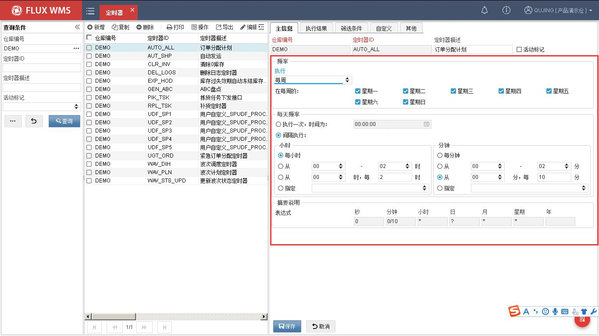

<!-- 原 PDF 第 201 页 -->

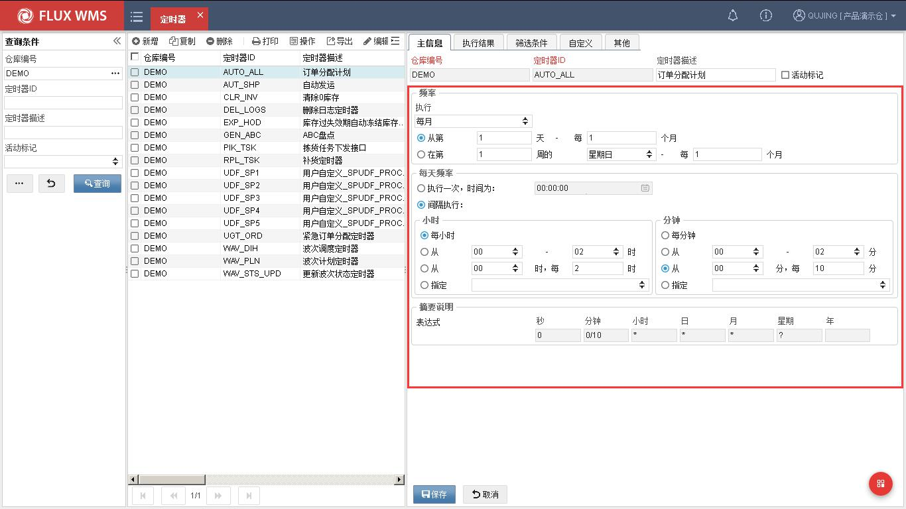

  - 每月执行

每月执行模式下，执行日的选择，可以是每个月的第几天（或者每 X 个月的第 Y 天），或者每个月第几周的某一天。

在指定的执行日，根据每天频率部分的设置启动执行。

例如下图意味着每个月的 1 号，8:10 执行定时处理。

*[图 8-9-6]（原 PDF 第 201 页，图像未能从 PDF 对象中直接提取）*

  - 每季度执行

每季度执行，即每 3 个月执行一次，执行日、时间选择，与每月执行配置类似。

<!-- 原 PDF 第 202 页 -->

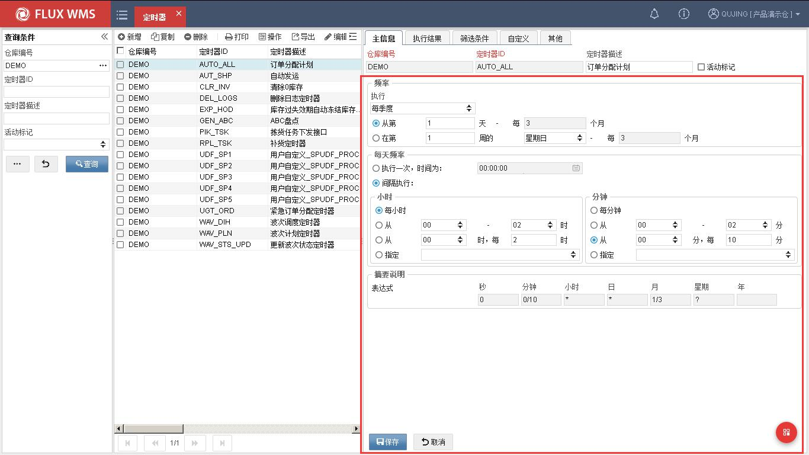

  - 高级配置

如果是规律的每日、周、月、季度模式不足以支持的、较为复杂的执行要求，可以通过高级配置实现。

如下图所示，高级配置情况下，年、月、日、星期等均可进行范围（从、到）、起始、间隔（每 X 年/月日）、指定时点等配置。

<!-- 原 PDF 第 203 页 -->

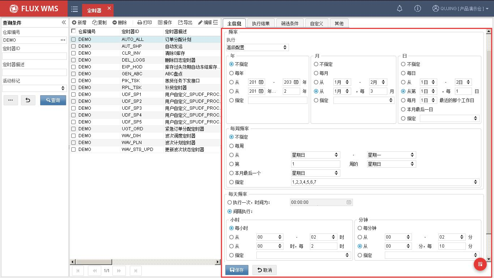

  - 摘要说明

执行频路维护后，系统会根据维护内容，自动生成摘要表达式显示在界面下方，如下图所示：

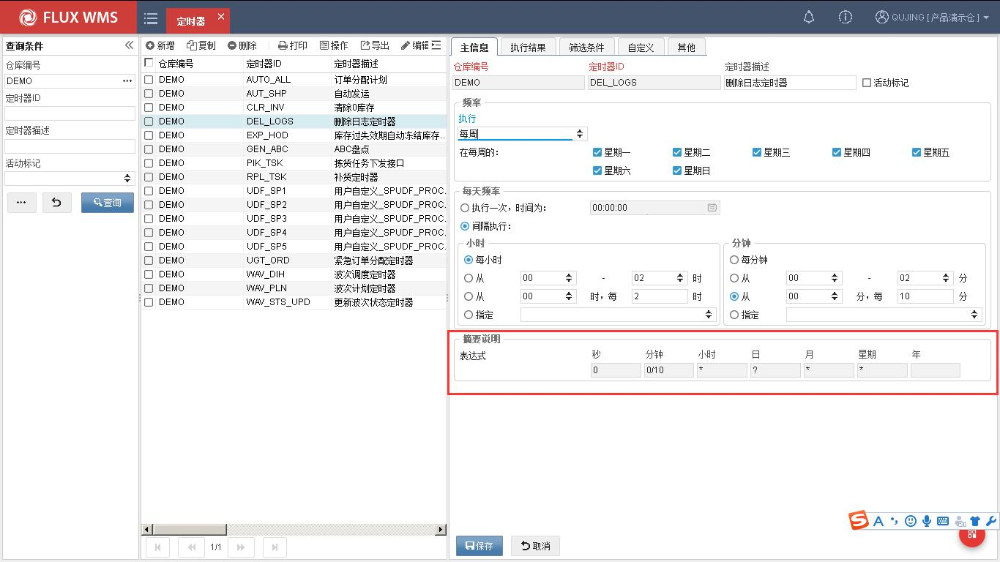

- **执行结果查看**

<!-- 原 PDF 第 204 页 -->

定时器的执行情况可以在“执行结果”页签中查看到此定时器的最后一次执行情况。

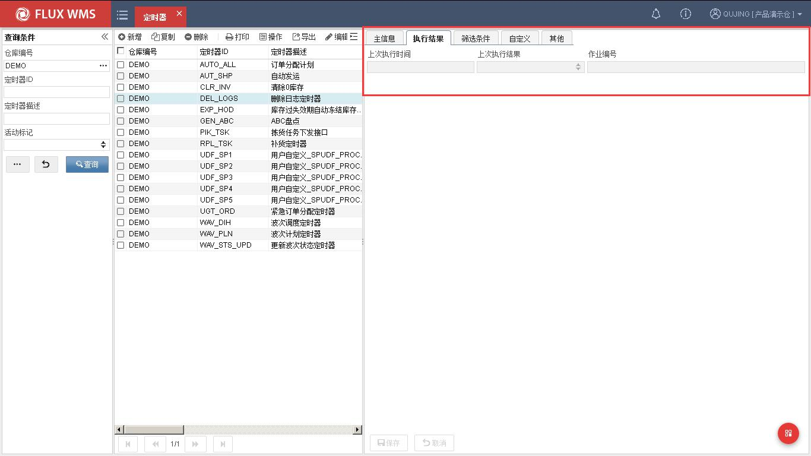

更多执行细节，可以在“业务系统日志”的“定时任务运行日志”功能中查看

## 8.10. 波次计划规则

系统定时自动生成波次计划时，将遵循波次计划规则，按要求筛选合适的订单来组合为波次。

由于系统支持多仓、多客户管理，不同仓库、不同客户的拣货归集要求不同，运输安排不同，可针对仓库、客户分别设置波次计划生成规则。

- **波次计划规则**

波次计划规则配置，分为几部分内容：

  - 主信息

<!-- 原 PDF 第 205 页 -->

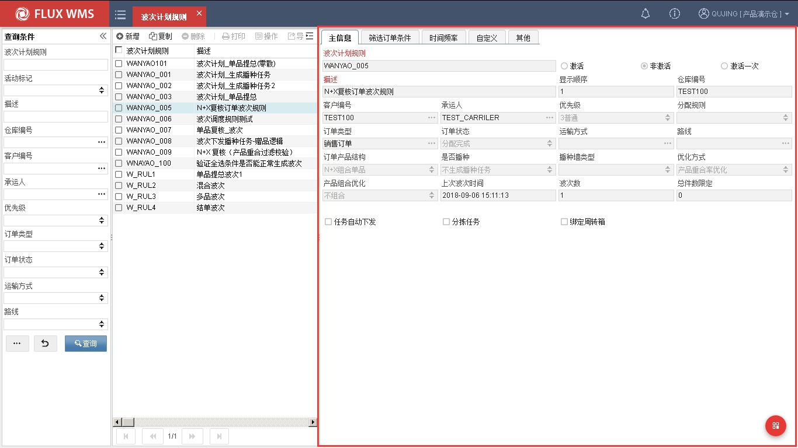

波次计划规则－规则代码 ID

激活/非激活/激活一次－单选，代表此波次计划规则是否生效。如果只需要特定时间执行一次，则选择“激活一次”，执行后系统会将此规则更新为“非激活”

描述－规则描述信息

显示顺序－显示排序字段

仓库编号－此波次规则针对生效的仓库 ID。如果仓库为*，则针对全部仓库生效。仓库信息不可为空

客户编号－此波次规则针对的货主 ID。如果值为*，意味着对全部货主生效。不可为空。

承运人－订单指定的承运人 ID。无需承运人条件则配置为*。可通过浏览按钮，在 2 级窗口选择承运人。一次可选择多个承运人记录，并根据生成【独立波次】，还是【合并波次】 的按钮，返回不同的分隔符。系统生成波次时，根据对应配置，将按承运人条件，拆分不同波次，或者多个指定承运人合并在一个波次中。

优先级－订单优先级条件

分配规则－针对该波次下的订单，生成波次后，更新订单的分配规则为指定的分配规则。

订单类型－指定类型的发运订单才参与波次组合。浏览按钮二级窗口支持类似承运人的多条件选择。

<!-- 原 PDF 第 206 页 -->

订单状态－指定状态的发运订单才参与波次组合。

运输方式－发运订单运输方式。同样支持浏览按钮二级窗口多条件选择

路线－根据订单路线创建波次计划。同样支持浏览按钮二级窗口多条件选择。

是否播种－波次生成时，播种任务的处理模式。系统提供 3 种选择项，产生波次时生成播种任务，不生成播种任务，或者波次拣货确认时按箱生成播种任务（先合拣再播种分货的作业模式）。

播种墙类型－使用图形化播种模式下，波次对应的播种墙类型选择。下拉列表内容在基础设置-播种墙功能中维护。如果“是否播种”或者“是否开启分拣任务”开关开启，则必须维护播种墙类型。

优化方法－系统支持区域优化、SKU 重合率优化、产品供应商优化，也可选择不优化。

产品组合优化－根据产品组合（多见与非单品订单，赠品组合，将完全相同商品的订单按照 sku 拼接排序）、产品数量组合（同一个 SKU，相同件数的订单）进行波次计算。同样提供不组合的选项。

上次波次时间－系统自动记录的上一次执行波次计划的时间。

波次数－执行此波次规则，一次最多生成多少个波次。

总件数设置－波次中包含的产品件数上限。设置后，系统先按其他字段条件生成波次，然后统计总件数做比较，如果件数超标，则按照数量从小到大的方式删除订单，直到不超标。

任务自动下发－不同的作业管理模式中，有的希望自动下达相关拣货任务，有的希望人工下达任务以便控制作业节奏。因此系统提供了配置，生成波次时，是否要将波次任务自动下发。如勾选，所生成的波次表头，TaskDispatch 字段默认为 Y，需要自动下发任务。后续波次分配成功后，会相应

分拣任务－是否需要由系统指导进行分拣，下达分拣任务。如是，则产生波次时自动将拣货任务写入 IDX_PickToLight，以便后续电子标签分货，或者通过波次播种功能进行分货。

绑定周转箱－作业是否要求提前绑定周转箱号。影响到任务写入 IDX_PickToLight 的状态标记不同。

  - 筛选订单条件

<!-- 原 PDF 第 207 页 -->

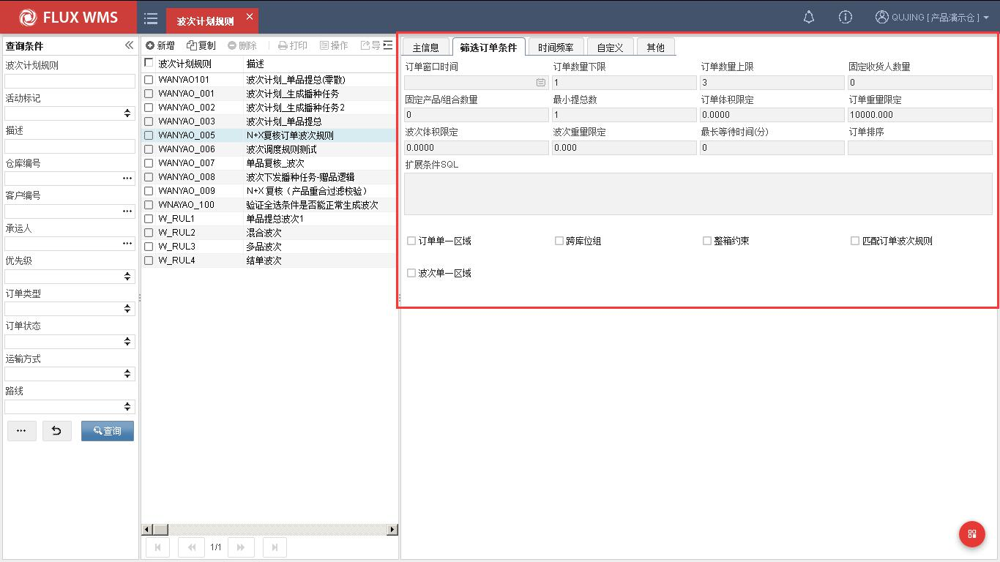

订单窗口时间－订单时间的限制，即波次挑选的订单池的范围。比如设置 03：00，那么订单的考虑范围就是在当天 3 点以前的订单。

订单数量下限/上限－波次中包含的 SO 个数上下限。高于上限数量的符合条件订单，作为下一个波次的组合元素，可以一次性创建多个波次。不到下限数量的订单，等待下一个波次创建时间再判断是否可以组建波次。

固定收货人数量－波次中包含的收货人个数。常用在电子标签分货模式中，一个收货人对应一个电子标签位，因此波次中设置收货人个数。

固定单品数量－波次中包含的产品个数。常用在周转箱拣货模式中，一个产品对应一个周转箱。

最小提总数－为避免获取到订单数量中某 SKU 数量过少，使得作业细碎效率不高，在按 SKU 重合度优化时，单个 SKU（或者组合 SKU)的需求总数必须大于等于最小提总数。

订单体积限定－候选订单的体积上限

订单重量限定－候选订单的重量上限

波次体积限定－对波次中产品总体积进行限定

波次重量限定－对波次中产品总重量进行限定

最长等待时间－单位为分钟。订单设置上下限时，如果数量超过上限，但不满足下限，

<!-- 原 PDF 第 208 页 -->

多余数量的订单会等待到下一波次生成时点，与其他订单组合波次（例如每小时计算一次波

次，下限 10，上限 50，当前符合条件的订单有 107 张，会生成 2 个波次，多余的 7 张订单

会到下一个时点，与后续下达的新订单一起组合波次）。但如果到下一时点，没有符合条件

的新订单下达，原有订单会再次等待。等待时间过长将影响出库效率。因此系统设置最长等

待时间，超过此时间的订单，不再等待，即使不符合上下限要求，也组合为订单。

订单排序－自定义订单排序要求维护字段。内容为 Order By a,b,c

扩展 SQL－支持自定义的扩展波次组合条件。

单品匹配－发运订单是否单品订单。即是否只筛选单品订单、创建单品波次，以用于单品复核操作。

订单单一区域－候选订单本身，不能涉及多个区域。

波次单一区域－即不跨区域组合波次，仅将同区域内完全分配的订单组合在一个波次内，常用于楼层仓库，避免波次跨楼层操作。但同区域内的多个库区可以跨库区组合。

跨库位组－是否允许创建跨库位组拣货的波次

整箱约束－针对单品订单波次，只归集整箱数量，方便拣货操作。

匹配订单波次规则－如勾选，只有指定使用此波次规则的发运订单，才会遵循此规则组合波次。通常是接口下达发运指令时即已指定对应的波次规则。

  - 时间频率

由于不同波次规则进行订单筛选、创建订单的时间要求不同，例如上午 9 点创建 EMS 承运的波次，以便 12 点钟进行运输交接。而圆通的订单下午 4 点才交接，因此波次在下午 1 点创建。

系统支持为每个波次规则，单独指定运行时间，频率均为每天模式：

<!-- 原 PDF 第 209 页 -->

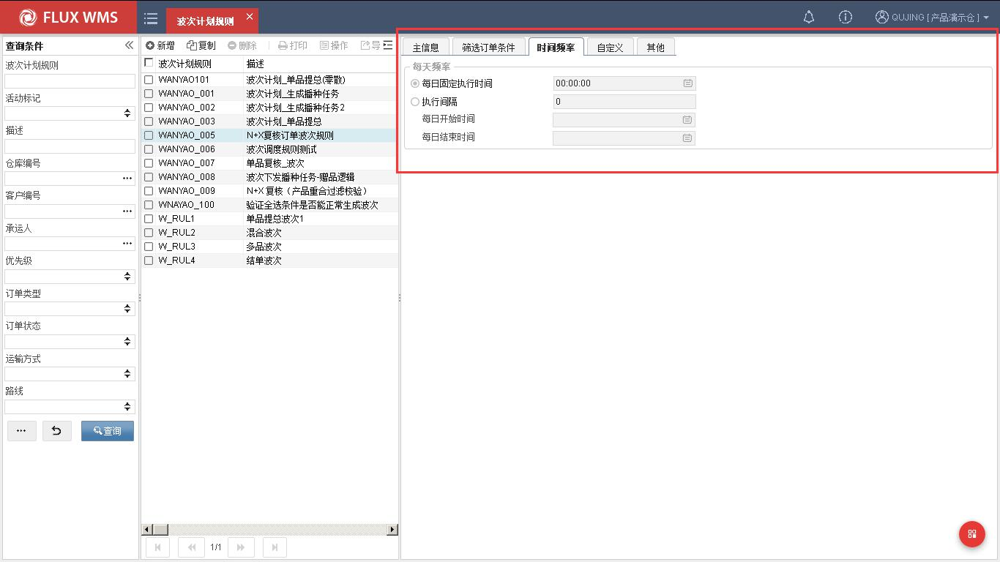

- **鼠标右键功能**

除通用右键功能之外，波次计划规则功能，所具有的右键菜单功能为：

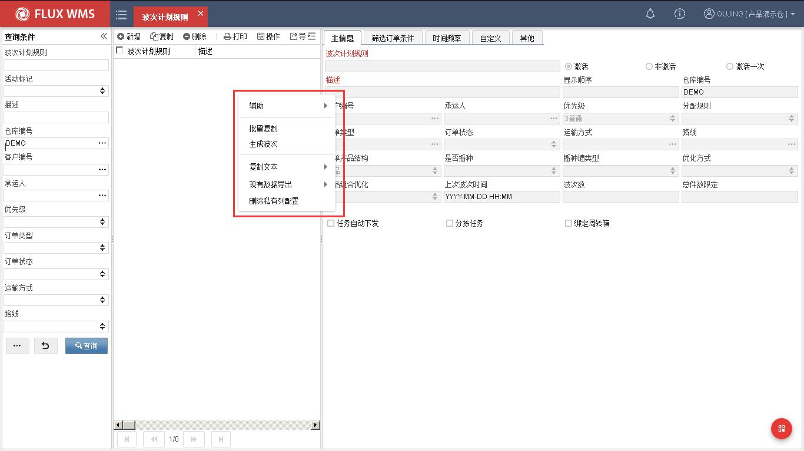

  - 批量复制信息：

<!-- 原 PDF 第 210 页 -->

选择样本记录后，通过“批量复制信息”功能，系统显示如下字段选择框，勾选字段，确认后，系统将样本记录中的对应字段内容，复制到符合当前查询条件的全部记录中。

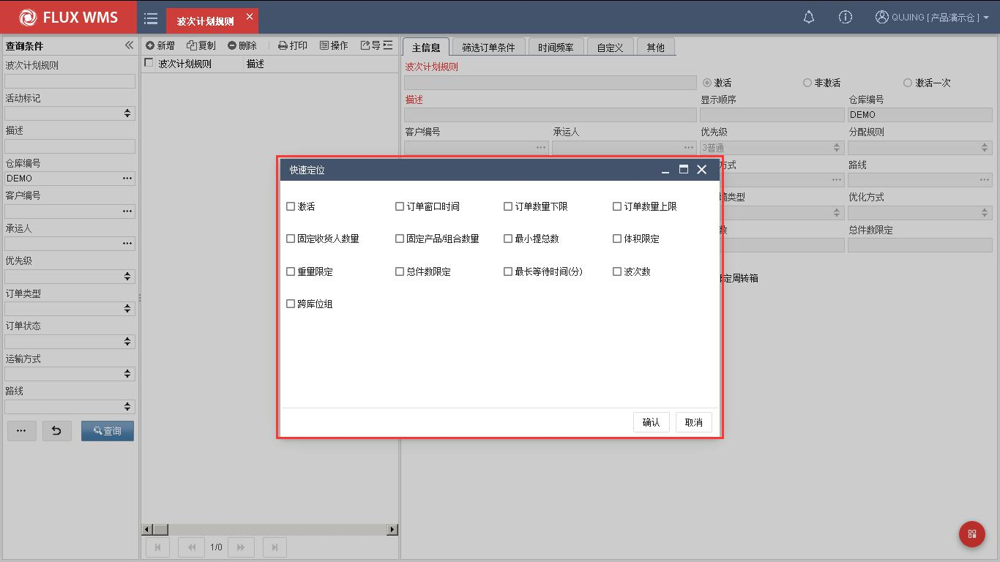

  - 生成波次：

选择规则后，通过“生成波次”功能，立即根据波次规则要求筛选订单、创建符合规则的波次计划，无需等待定时驱动执行。方便规则调试以及人工临时创建波次。

## 8.11. 自动发运规则

同一货主，在不同仓库中均有存货，由于各地快递公司管理要求不同，可能导致作业流程有所不同，发运节点、方式有差异，例如有的仓库称重后发运，有的仓库出库复核后发运。同时，有些订单操作流程可能会要求需要完成多项作业节点的订单才能发运，例如拣货、装箱完成后的订单才能发运。

系统通过自动发运规则，维护完成哪些出库节点后，订单可以被自动发运。系统通过定时任务，对订单进行检查，符合条件的订单，将更新自动发运标记，等待自动发运任务执行发运。

- **自动发运规则设置**

自动发运规则设置见下图

<!-- 原 PDF 第 211 页 -->

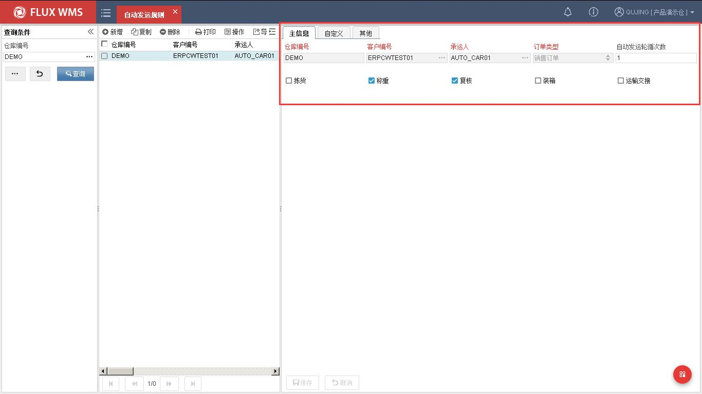

仓库编号－规则生效仓库的 ID。

客户编号－规则对应货主。

承运人－规则对应承运人。

订单类型－规则对应订单类型。下拉框选择系统代码中维护发运订单类型。

拣货/称重/复核/装箱/运输交接－自动发运节点选择。所选节点操作全部完成，订单具有发运资格，可通过定时器自动发运。

## 8.12. 路线规则

特殊业务情况下，发货订单并不指定承运人，而是需要 FLUX WMS 系统根据订单情况自行指定承运人。

这些指定承运人的逻辑，可配置为路线规则。

- **路线规则设置**

<!-- 原 PDF 第 212 页 -->

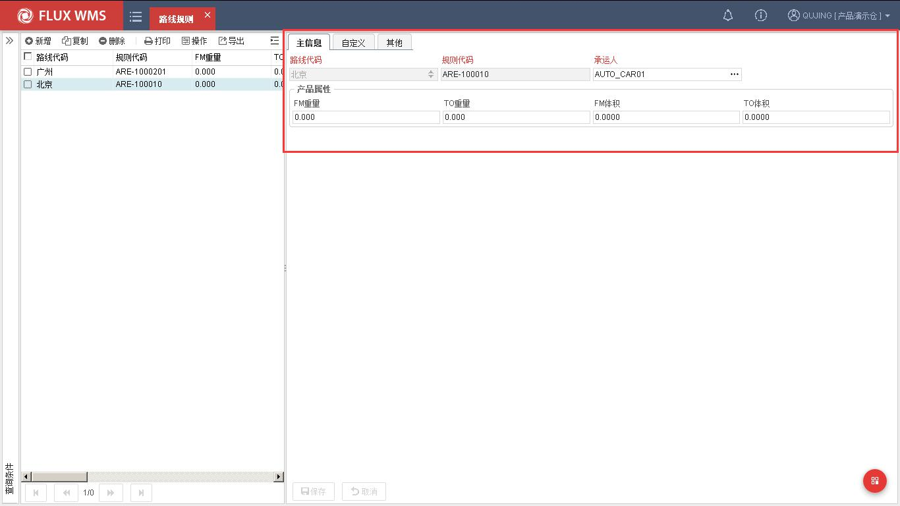

设置订单重量、体积范围，在某个路线下，指定的承运人。

## 8.13. 配送规则

用户的面单号码（运单号），由 FLUX WMS 系统生成的情况下，常常不同承运人的运单号码规则不同。可通过配送规则进行维护。

- **配送规则设置**

<!-- 原 PDF 第 213 页 -->

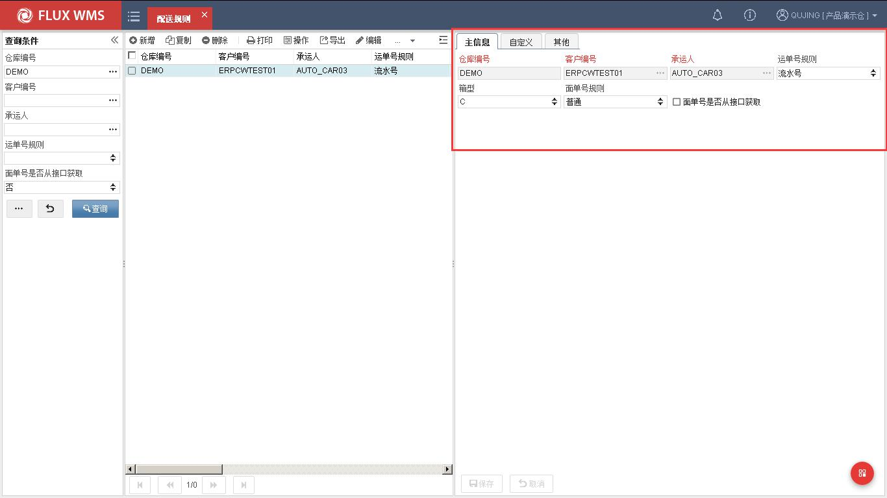

  - 设置规则应用的对应业务仓库、货主、承运人信息。

  - 选择运单号规则。目前系统提供“流水号”、“分区分包装号段”、“整单取号段” 3 种预设规则，系统生成运单号时，可根据仓库、货主、承运人条件，执行对应配送规则，生成不同逻辑的运单号码。

    - 流水号，根据分配数量，每箱对应一个运单号码。一个订单有多个系统生成的目标跟踪号，即获取多少运单号。

    - 分区分包装号段，从号码池提取预设号码作为运单号，而不根据流水号规则生成号码。

    - 整单取号段，整个订单，不论多少分配明细，从哪些区域、库位拣货，每单只分配 1 个运单号码。

  - 箱型的选择，主要提供给复核功能使用。当订单没有指定的装箱 ID 时，在复核根据根据仓库、货主、承运人条件匹配到对应的配送规则，使用指定的箱型，提供复核时的装箱 ID 下拉显示。

  - 面单号规则，主要用于与京东、宅急送的特殊多箱单号规则配置：

    - 选择值为 COMMON，即通用逻辑，循环调用获取多个面单号的逻辑。

    - 选择值为 JD，执行京东面单号逻辑。一个订单只调用一次，在返回面单号以后按

<!-- 原 PDF 第 214 页 -->

照总箱数，客户端分解为"面单号-第几箱-总箱数-"多个面单号。

    - 选择值为 ZJS，则是宅急送面单号逻辑。同样一个订单只调用一次，在返回面单号以后按照总箱数，客户端分解为"面单号-总箱数-第几箱"多个面单号。

  - 面单号是否从接口获取，如勾选，则在出库复核时，通过接口从上游系统获取新的面单号。通常用在第一箱的面单接口已下达，现场根据实物需要增加第二箱的情况下，由 WMS 系统主动向上游系统请求新增面单号。

## 8.14. 序列号规则

在序列号采集过程中，为了保证序列号的合法性，扫描过程中往往会对序列号的长度、前缀等进行校验。但不同客户、不同产品的序列号组合要求通常各不相同。

系统通过序列号规则表对序列号的合法性规则进行约定，以支持不同业务的需要。维护后的序列号规则，在产品档案中选择从而与产品相关联、生效。

- **序列号规则**

点击新增按钮，维护序列号规则相关信息：

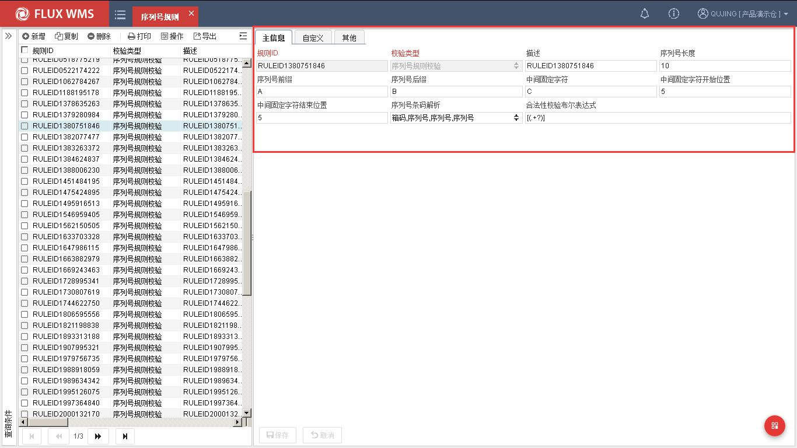

规则 ID－规则代码

<!-- 原 PDF 第 215 页 -->

校验类型－即此规则是序列号校验（对 1 级序列号生效），还是子序列号校验（针对 2 级子序列号）。

描述－规则名称描述。

序列号长度－序列号长度限制。

序列号前缀－序列号前缀限制。例如序列号必须是 A 开头的

序列号后缀－序列号后缀限制。

中间固定字符－序列号中，必须包含什么字符。结合开始位置/结束位置生效。

中间固定字符开始位置－指定字符的开始位置

中间固定字符结束位置－指定字符的结束位置。例如序列号的第 3 位到第 5 位必须是 ABC。

序列号条码解析－适用于自定义扩展规则。下拉框内容在系统代码 SN#_ENC_RUL 中定义，并在 JS 代码中编辑个性化的解析逻辑。

合法性校验布尔表达式－用于校验的布尔表达式。例如 isnumeric(@SerialNo)，表示输入的序列号必须是全数字的。实际执行时，系统自动用实际扫描的序列号替换布尔表达式中的@SerialNo 进行校验。

## 8.15. 波次调度规则

波次调度规则，主要用来对波次计划规则的运行时间进行调度和排程。同时将原本波次计划规则的一部分条件前置到调度规则环节配置生效。可以实现相同条件（如仓库、路线、承运人等）但不同时段的订单，执行不同的波次计划规则，支持更加复杂的波次管理需求。

- **波次调度规则设置**

  - 表头部分

用于维护波次调度规则的执行条件，如订单筛选要求、执行时间等配置。

<!-- 原 PDF 第 216 页 -->

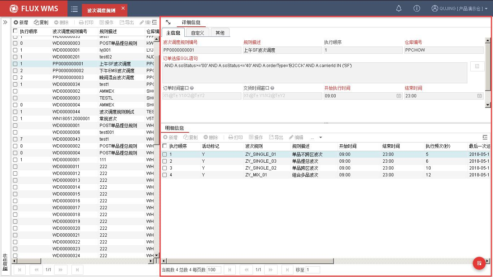

波次调度规则－规则号，由系统生成。生成波次后，将记录在波次表头。

规则描述－规则名称描述

执行顺序－多规则情况下，规则执行时的排序字段。可编辑字段。

仓库－规则生效仓库。新增时，默认为当前仓库。

订单选择 SQL 语句－规则执行时筛选订单的条件。无需录入，点击浏览按钮，在如下“订单选择 SQL 语句”二级窗口，选择条件后点击【替代】按钮，系统自动生成对应 SQL 语句。

<!-- 原 PDF 第 217 页 -->

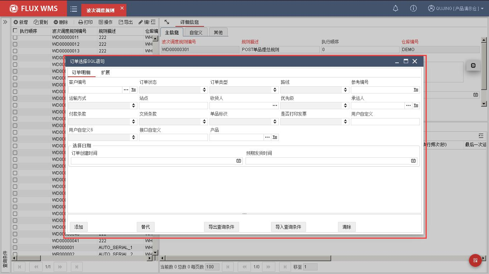

订单时间－订单时间范围，@T-DD 表示日期信息，@T0 为当天，@T-1 为前一天，@T+1 为明天。输入后系统会进行有效性校验

交货时间－交货时间范围条件

运行开始时间－规则执行的时间范围开始

运行结束时间－规则执行的时间范围结束

活动标记－规则是否启用

  - 明细部分

用于配置符合表头条件的记录，所执行的波次规则。

<!-- 原 PDF 第 218 页 -->

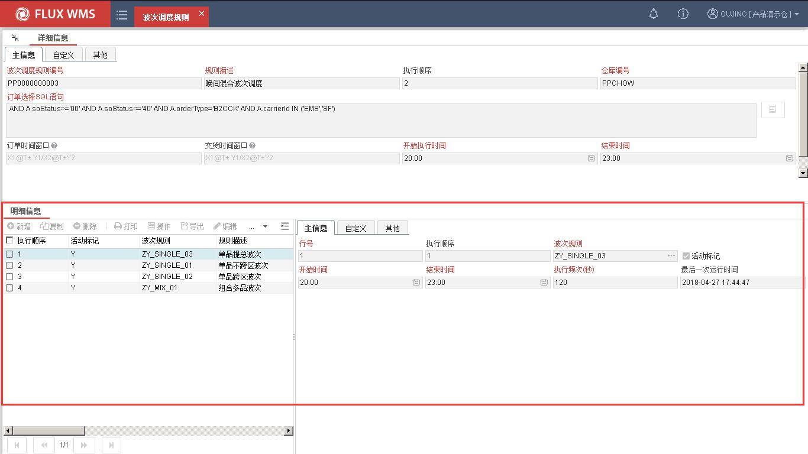

行号－明细行号

执行顺序－此行记录的执行次序，可以根据需要调整

激活－此行是否启用

波次规则－已配置的波次计划规则，可通过浏览按钮二级窗口选择

活动标记－是否启用的记录

开始时间－规则执行的时间范围开始

结束时间－规则执行的时间范围结束

执行频次（分钟）－规则运行时间间隔，单位为分钟，整数值录入。

最后一次运行时间－上次执行此规则的时间信息

- **鼠标右键菜单**

  - 表头部分复制－复制记录。常用于将其他仓库规则复制到当前作业仓库。

  - 明细部分生成波次－根据明细行对应的波次计划规则，生成波次。
