# 9. 入库操作

> 来源：`富勒WMS系统用户手册_V6_高清版（维他命）.pdf`，原 PDF 第 219 页起。
> 本文件按原 PDF 正文标题拆分；原文截图已提取至同目录 `assets/`。

<!-- 原 PDF 第 219 页 -->

## 9.1. 入库流程概述

入库是指在产品到达仓库后，将货物清点检查，妥善存储，并将信息输入系统的一系列相关操作。FLUX WMS 的入库流程包括了仓库接收产品的所有活动，涉及实际使用的卸货卡车、有轨车、运输集装箱，或记录产品从生产流水线到仓库的运动过程。

入库操作从不同的维度，可以进行不同模式的划分。

从信息流转角度来看，FLUX WMS 能够支持多种不同的入库方式，在最初设计时就针对与多种不同的执行系统实现系统整合而进行了规划、设计，包括同众所周知的企业资源计划(ERP)、高级计划系统(APS)、订单管理系统(OMS)、运输管理系统(TMS)集成方式、或其他计划或执行系统交互。除此之外，FLUX WMS 支持 EDI、XML 等多种方式导入收货数据，或者通过人工输入等不同操作方式进行入库记录。

从作业衔接方面来看，FLUX WMS 能支持传统的配送方式和交叉转运的配送方式来完成入库流程。目前大多数仓库采用传统配送的方式：产品到达后，上架存放，并只有在该项产品订单下达后才被拣选出来。而交叉转运的方式指按照卖方提供产品序列标识进行包装与运输，并主要应用 RF 手持设备和电子交互系统。FLUX WMS 可以在产品到达仓库之前安排运送（例如，产品的最终目的地是事先确定的）。我们可以运用 FLUX WMS 的 Cross Dock 模块实现这一功能。请参考相应的培训材料，而本资料的内容仅包括传统的配送方式。

FLUX WMS 的灵活性使设备能在不丢失数据和浪费时间的情况下，处理在收货时不可避免发生的意外和例外情况。FLUX WMS 能够在已确认(确认 PO、ASN/码盘)或未确认(无 PO 或 ASN/ 码盘)的方式下完成进货，单证可部分地接收。

不论何种维度的入库作业模式划分，入库的目的在于快速而准确地运送产品，并使控制部门与收货库位能够相互核对。

较为常见的传统入库作业流程通常有以下 3 种方式：

  - 建立一个采购订单 PO，再根据 PO 建立预期到货通知 ASN，然后进行收货。通常制造、零售、批发行业比较多采用这种方式。

  - 直接建立一个预期到货通知 ASN，然后进行收货。通常是第三方物流的常用方式。

  - 没有采购订单 PO 和预期到货通知 ASN 的情况下，直接进行收货（此收货方式称为：盲收）。通常在制造业，特别是 VMI 的情况下比较常见。

<!-- 原 PDF 第 220 页 -->

其中，收货是入库流程中必须的作业节点，而其他节点如单据、上架、质检等操作，根据业务流程需要选择使用。具体操作细节详见后续介绍。

## 9.2. 采购订单（PO）

采购订单（PO）是货物的买卖双方之间的协议记录。FLUX WMS 为客户提供了制作提交客户产品的采购订单的功能。

但从仓库角度来看，由于供应商很少按采购订单一次性送货到仓库，多数是分批送货，因此采购订单很少作为仓库直接收货的依据，通常由货主在自己的 ERP 系统中对采购订单进行管理，而将分批送货的预到货信息给仓库参考，以便仓库根据拟运抵的货物信息对场地等进行调整和准备。这类预到货信息，在系统中被称为预期到货通知（ASN）。

采购订单并不是入库流程中的必须操作步骤，用户可根据实际需要选择是否使用采购订单。通过接口下载方式，从 ERP 或其他订单系统获取到采购订单信息是比较常见的操作方式。

- **采购订单**

通常在建立一个采购订单前，需要对一些基本的信息进行设置，这些基本信息包括：客户、产品、批次属性、包装等。请参考基础设置章节的介绍。

手工创建一个采购订单（简称 PO）的步骤是：

  - 选择主菜单“入库操作”模块下的“采购订单”功能。

  - 查询已有采购订单，或者点击【新增】按钮，在“主信息”页签，依次输入以下信息：

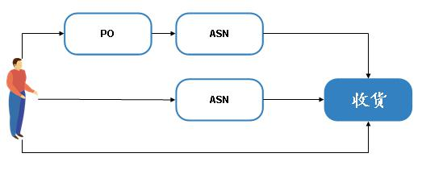

<!-- 原 PDF 第 221 页 -->

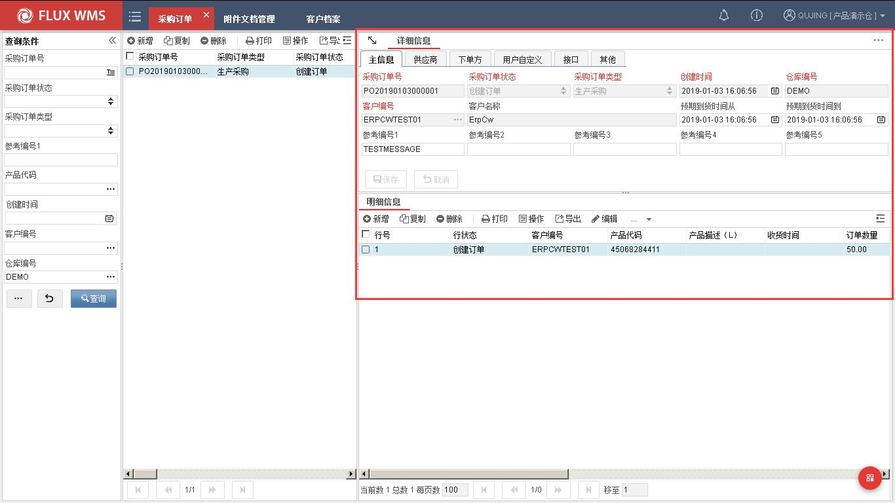

采购订单号－系统生成的采购订单编号。在创建一个新的采购订单时，采购订单编号由系统根据流水号规则自动给出（流水号规则设置，参考业务规则的流水号规则部分）。用户如果有自己的订单编号（例如 ERP 单号等），可输入主信息页面的参考信息字段中。

采购订单状态－采购订单的当前状态。系统提供创建订单、完全释放、部分收货、完全收货、取消订单、等待释放和订单完成等选项。在创建一个新的采购订单时，采购订单状态默认为创建订单，并且不能人工修改，随着操作进行由系统更新单证状态。

采购订单类型－用于区分不同情况、来源、甚至不同部门的采购订单。可在系统代码中维护类型内容。

创建时间－采购订单创建时间。

仓库编号－单据所属的业务仓库。新增单据取当前登录业务仓作为单据对应的仓库。

客户编号－采购订单所列产品所属货主。该客户必须是在客户档案中已经存在的货主；若客户档案中不存在该货主，必须先在客户档案中新增该客户。

客户名称－货主对应描述，根据客户档案中的设置显示。

预期到货时间 FM/TO－预计到货时间段。默认同创建时间。

参考信息－客户自行定义的参考信息字段。

  - 点击【保存】按钮，完成表头新增操作。

<!-- 原 PDF 第 222 页 -->

如果需要对送货供应商信息进行记录，可继续录入相关信息：

  - 供应商信息维护

选择供应商页签，依次输入或修改供货商的名称、地址、城市、省/州、国家、邮编。

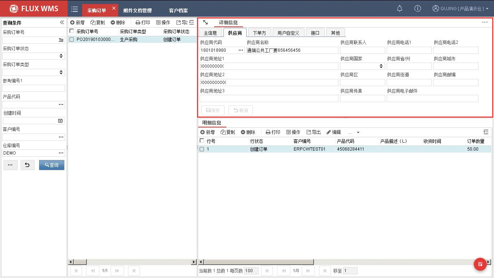

系统支持直接录入或通过快速检索按钮选择供应商，界面显示客户档案中维护的供应商相应信息，在此基础上可对供应商信息进一步修改、保存。例如用本次订单到货的联系人信息替换客户档案维护的标准联系人信息。

采购订单中的供应商信息仅做参考，并作为预期到货通知的信息来源。供应商信息是否需要用于后续收货的管控，或者作为库存区分维度，可以依据管理需要，在收货相关控制中配置。

  - 下单方信息维护

下单方通常在有货主代理的情况下使用。类似供应商，可选择或者录入相应信息。

下单方信息通常不用于收货管控或库存跟踪，而用于统计的情况较为常见。

  - 在用户自定义页页签，维护扩展信息

其中的用户自定义 A/B，是二级关联代码，需要在系统代码中先期维护才能使用。

选择自定义 A 的代码后，自定义 B 只能选择 A 所对应的二级代码值。例如自定义 A、B 维护省份、城市，选择自定义 A 黑龙江省，在自定义 B 中只能选择黑龙江省的城市，而无法选择其他省份

<!-- 原 PDF 第 223 页 -->

城市。

  - 如果有照片、EXCEL 等文档，可通过附件页签进行管理：

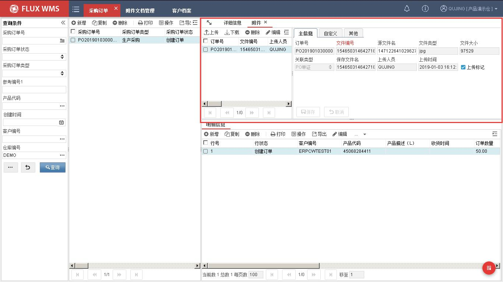

点击【新增】按钮，输入描述信息，通过【定位】按钮，选择文件，再【上传到服务器】。

对于已有附件，可以通过【打开】按钮下载查看。

- **采购订单明细**

  - 在明细信息部分，点击【新增】按钮，在主信息页签依次输入以下信息：

<!-- 原 PDF 第 224 页 -->

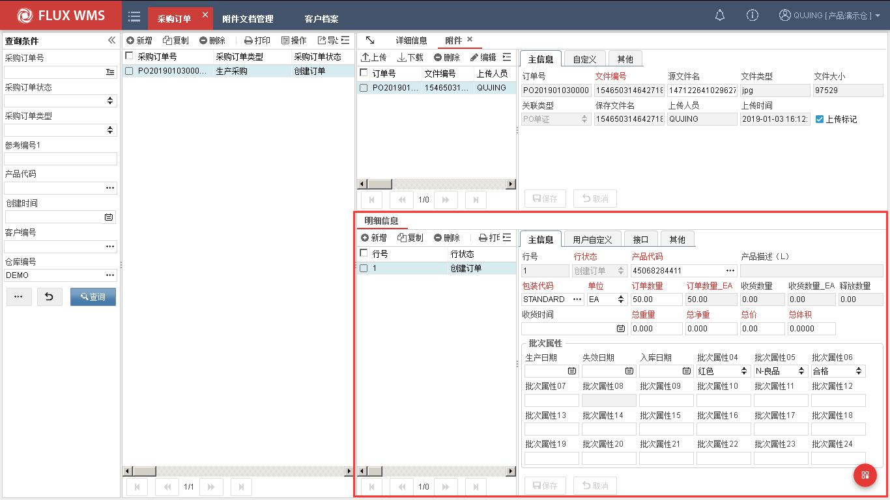

行号－系统自动提供的采购订单行号。

行状态－订单行状态，系统根据操作情况自动更新。

产品代码－待接收的产品代码 ID。

产品描述－待接收的产品名称。当输入产品 ID 时，系统自动给出产品档案中该产品的描述。

包装代码－该产品对应的包装代码。系统自动给出该产品在产品档案中所输入的包装代码，客户也可根据实物情况选择其他的包装代码。通常在产品多包装的情况下较为常见。

单位－收货时的包装单位。系统自动给出该产品在产品档案中所选择的缺省收货单位，用户也可根据情况选择其他的收货单位。

订单数量－采购订单订购产品的数量。在订单数量中有 2 个字段，前一个字段是可输入的，以所选择的单位为数量单位的；后一个字段（订单数量_EA）是以所选择的包装代码的最小单位（主单位）为数量单位的，并且是系统自动换算给出的，不能修改。例如包装单位为箱，1 箱 10 件，预期 2 箱，2 个数量字段的数值会分别是 2（箱）与 20（件）。

收货数量－系统已经确认收货的产品数量。同样是 2 个字段，分别对应所选单位和系统主单位（收货数量_EA）。由于采购订单并不直接用于收货，收货数量是在预期到货通知（ASN） 关联采购订单（PO）情况下，ASN 收货时，系统自动更新对应 PO 的收货数量。

<!-- 原 PDF 第 225 页 -->

释放数量－即已经生成预期到货通知（ASN）的对应数量。

收货时间－系统记录的收货确认时间。

总重量－订单行记录总重量。

总净重－订单行记录总净重。

总体积－订单行记录总体积。如产品档案中有维护单位产品体积，可通过订单数量乘以标准体积计算得出。

总价－订单行记录总价格金额。

批次属性－产品批次属性信息。根据产品所用批次属性规则，动态显示属性字段。

  - 点击【保存】按钮，完成明细行录入操作。

  - 表头、明细的接口页签，通常存储接口传递信息，用于打印等操作，一般无需人工维护内容。

- **鼠标右键菜单**

FLUX WMS 在不同功能中提供各自的鼠标右键功能菜单选项，点击订单表头和明细或不同页签，会显示不同的右键功能菜单。

右键功能支持自定义快捷键，相关配置说明请参考 4.13.5 快捷键配置章节的说明。

  - 表头右键菜单：

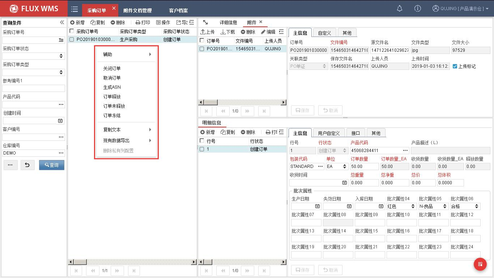

<!-- 原 PDF 第 226 页 -->

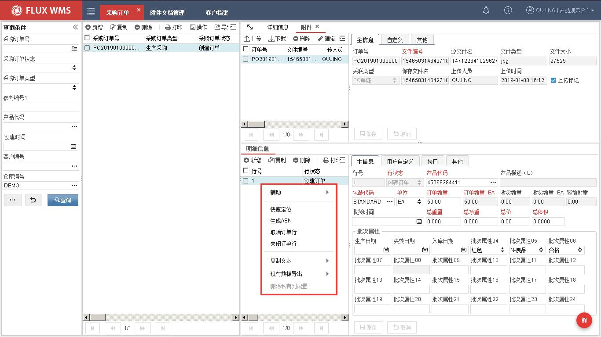

关闭订单－关闭后不再允许对订单进行操作修改

取消订单－使订单失效，尽可供查询。只有创建状态订单能够被取消。

订单释放－将所选订单的表头释放状态，更新为“订单释放”。释放后的订单可收货确认。订单释放状态控制，通常用来做入库审核，例如未通过审核的订单，不可入库。

订单未释放－将所选订单的表头释放状态，更新为“订单未释放”。未释放订单不可收货，非创建状态订单，如已经部分收货的 PO，不可更新为“未释放”。

订单冻结－将所选订单的表头释放状态，更新为“订单冻结”。冻结后不可收货。

  - 明细右键菜单：

*[图 9-2-6]（原 PDF 第 226 页，图像未能从 PDF 对象中直接提取）*

快速定位－选择后，系统弹出对话框，供输入 SKU 代码进行查询，快速定位到对应明细行。如果符合条件的记录有多个，则列表显示，由用户双击定位到对应明细行。

生成 ASN－从 PO 提取明细信息生成 ASN 明细。在 ASN 界面，使用“提取 PO 数据” 功能后，跳转到 PO 界面，选择记录后，生成 ASN 明细。如果直接从 PO 中选择明细，生成 ASN，则创建一个新的 ASN，表头信息根据 PO 信息获取。

取消订单行－对所选明细行进行取消作业。

<!-- 原 PDF 第 227 页 -->

关闭订单行－关闭所选明细行。

## 9.3. 预期到货通知(ASN)

ASN 是 FLUX WMS 的一种接收文档，即 Advanced shipping notice 的简称。它记录了将要到达的货物的详细相关信息，通常是供应商提供的拟送货信息。仓库可根据即将到达的货物信息安排收货准备工作，同时 ASN 也是实物收货操作的依据，收货时操作人员可以据此核对货物情况。

ASN 可以通过以下 2 种途径来创建。

  - 没有 PO 的情况下，直接新增一个 ASN。

  - 有 PO 的情况下，直接从 PO 中导入信息生成新的 ASN。

### 9.3.1. 单证创建

- **ASN 主信息创建**

  - 选择主菜单“入库操作”下的“预期到货通知”。

  - 根据需要，查询已有 ASN，或者点击【新增】按钮，在“主信息”页签依次输入信息：

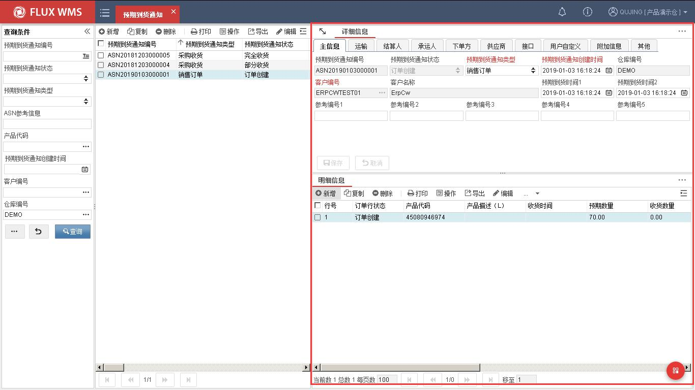

<!-- 原 PDF 第 228 页 -->

预期到货通知编号－系统给出的预期到货通知单编号，根据流水号规则生成。当新增一条 ASN 时，系统会自动给出 ASN 编号，并且不能修改。

预期到货通知状态－该单证当前状态。系统提供 ASN 创建、已码盘、部分收货、完全收货、订单取消、ASN 完成等状态。在创建一个新的 ASN 时，ASN 状态默认为 ASN 创建，系统会根据 ASN 操作情况自动更新。

客户编号－拥有产品的货主代码。该客户必须是在客户档案中已经存在的；若客户档案中不存在该客户，必须先在客户档案中新增该客户。

预期到货通知类型－ASN 的单据类型，通常区分不同操作类型、不同来源等的入库单据。系统提供普通入库、生产收货、退货入库等多种类型，用户可根据需要在系统代码中增加现场所需类型。新增 ASN 时若客户编号已维护默认货主（通过参数 DFT_CUS 设置），则光标定位‘预期到货通知类型’字段；若未维护，则光标定位客户编号；

ASN 创建时间－订单创建或者下达的时间。当新增一个新的 ASN 时，系统自动给出当前的时间为 ASN 创建时间。

仓库编号－单据所属的业务仓库 ID。新增单据取当前登录业务仓作为单据对应的仓库。

客户名称－客户描述信息。系统自动显示客户编号对应的客户名称。

预期到货时间－产品的可接收时间段。新增一个 ASN 时，系统默认为当前时间，客户可按照实际情况进行修改。如果系统参数 RCV_TIM_CTL（只有在预期到货时间范围内才能收货）开启，那么只有预期到货时间范围内，单据才能做收货确认。未到达日期或者已经超过时间，将都不允许收货。通常在大型作业中心用于月台管理、供应商送货 KPI 考核控制。

参考信息－仓库用于跟踪订单的参考信息。用户根据需要配置字段显示名称，例如将参考信息 1 改为“客户订单号”，参考信息 2 改为“海关备案号”。

  - 点击【保存】按钮，完成表头创建操作。

如果需要，可以在 ASN 中进一步补充单证相关信息，如供应商、承运人等。

  - 点击运输页面，可以维护运输相关信息：

<!-- 原 PDF 第 229 页 -->

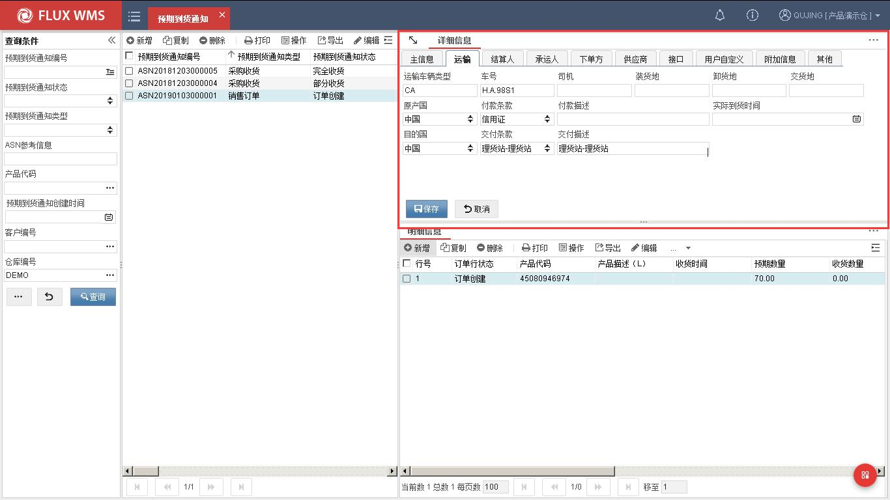

运输车辆类型－运输该订单产品的车辆型号。

车号－运输该订单产品的车牌号。

司机－承运司机。

装货地－产品的装载地点。

卸货地－产品的卸货地点。

交货地－产品的最终目的地。

原产国－所运送产品的原产地所在国家。拉下列表内容在系统代码中配置。

目的国－所运送产品的目的地所在国家。

付款条款－付款方式的选择。系统提供现金和信用证两种支付方式。拉下列表内容可在系统代码中配置。

付款描述－对支付方式进行描述。

实际到货时间－车辆抵达仓库时间。非必输信息，通常用于运输的 KPI 考核。

交付条款－交货方式的选择。系统提供理货站-理货站、场站-场站、门到门交付的三种交付方式。拉下列表内容可在系统代码中配置。

交付条款描述－对交付方式进行描述。

<!-- 原 PDF 第 230 页 -->

  - 点击【保存】按钮，完成运输信息维护。

  - 结算人、承运人、下单方、供应商身份不同，可在各自的页签进行维护：

依次输入代码、名称、地址、城市、省/州、国家、邮编等信息。可通过查询按钮选择，并可根据实际情况修改显示内容。

  - 接口页签，用于记录接口传递信息：H_EDI_01~10－EDI 接口相关字段。发送时间－接口信息发送时间。发送标记－接口信息是否发送的标记。

  - 附加信息页签，可输入/查看如下信息：

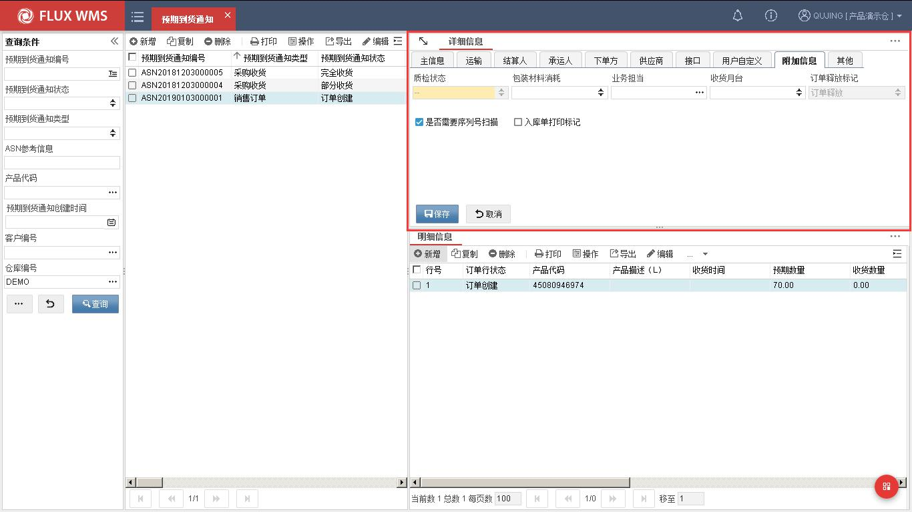

质检状态－ASN 进行质检操作的相关状态。系统提供“未创建质检单、质检单创建、部分质检、全部质检、质检取消、质检关闭“状态项，根据对应质检单操作情况自动更新。新增 ASN 默认为“未创建质检单”状态。

包装材料消耗－如为“是”则收货时根据包装材料配置，自动扣减对应包材的库存。

业务担当－单据对应的上级业务员。以便异常情况下联系处理。

收货月台－指定的收货作业月台。但此处的设置，并未对月台进行预约占用。

<!-- 原 PDF 第 231 页 -->

订单释放标记－订单是否被释放。未释放 ASN 不具有收货资格。但可进行查看、编辑、打印等操作。新增单据根据系统参数 ASN_RLS_CTL 获取默认释放设置。

是否需要序列号扫描－此订单是否需要进行序列号采集操作。有时某个客户正常情况下需要进行序列号采集，但临时有特殊单据的货物没有序列号可供扫描。可以通过此字段进行区别维护。

入库单打印标记－是否已打印入库任务清单

  - 各个页签信息维护完成后，点击【保存】按钮，保存记录信息。

如果有配置 ASN 表头自定义页签，将显示在其他页签后面。各个页签可通过权限控制显示与否。

- **扩展页签**

除了 ASN 的单证信息，FLUX WMS 还提供了部分特殊操作信息。例如记录单证费用的特殊费用页签，集装箱信息、汇总信息等不同页签，用户可根据需要选择录入。扩展页签通过界面右上角的按钮打开

  - 特殊费用

特殊费用页签，用于记录订单相关的费用、成本，通常是临时性的不固定费用。例如订单的滞纳金、集装箱清洁费等不是每单都会必然产生的费用，需要人工进行维护

点击特殊费用页签，点击【新增】按钮，依次输入收费日期、收费类型、描述、金额等信息后保存。可连续新增，输入多行费用信息。

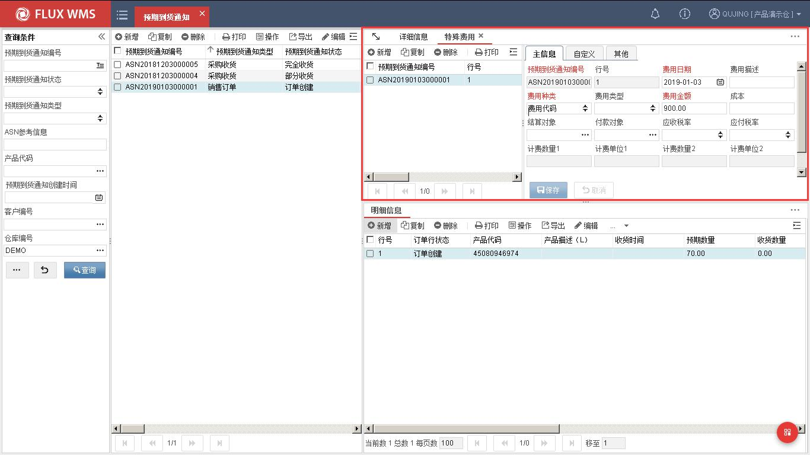

<!-- 原 PDF 第 232 页 -->

*[图 9-3-4]（原 PDF 第 232 页，图像未能从 PDF 对象中直接提取）*

ASN 编号－系统自动显示

行号－特殊费用行的行号，系统自动生成

费用日期－费用项的对应日期。

费用描述－费用项说明信息。

费用种类－特殊费用对应种类。下拉列表显示系统代码自定义 1 为'SPECIALCHARGE' 的 CodeID，相当与大类。

费用类型－根据费用种类所选内容，显示对应代码内容，相当与小类。类似自定义 A 自定义 B 的限制关系。

费用金额－非计算模式，录入的此 ASN 相关特殊费用金额。

成本－支付金额。有成本支出的情况下记录。

结算对象－付款人、结算人。仓库收取操作、仓储费用的目标对象。

付款对象－仓库支付劳动力费用、租借费用的收款人。

应收/应付税率－计税情况下的税率依据。

计费数量－费用计算数量依据。基于费率计算情况下，计费数量取【计费数量 1*计费数量 2】，按照级差进行计算。

计费单位－数量单位

基于费率计算－如不勾选，只将特殊费用页签信息记入到费用清单；如勾选，需要根据特殊费用页签记录的费用种类、类型匹配费率中的设置，进行费用计算。

  - 集装箱

在集装箱页签，依次输入集装箱箱号、类型、尺寸、铅封号、重量、备注等信息。

<!-- 原 PDF 第 233 页 -->

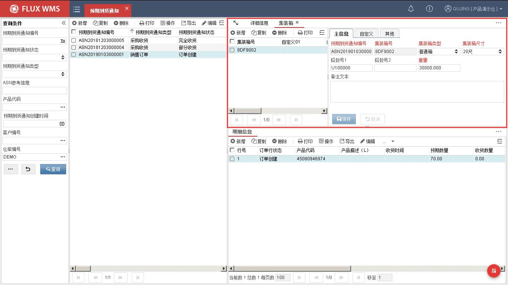

可连续新增，输入多个集装箱信息。系统在计算集装箱费用的时候，将依据集装箱页签录入的集装箱类型、尺寸进行费用计算。

特殊情况下，有些仓库在计费时，如果没有集装箱，按货物体积、计费吨等计算入库费或者卸车费等，但在有集装箱的情况下，只收取集装箱费用，不再收取按体积等计算的入库费。此类替代费用模式，此时就依据集装箱页签是否有信息进行判断。

  - 汇总信息

汇总信息页签，主要用来记录总数、总毛重、总净重、总体积、总价等信息，其中的总数记录，仅作参考，对库存无影响，因此也常用来作为到货、未卸货清点时的初步登记。

<!-- 原 PDF 第 234 页 -->

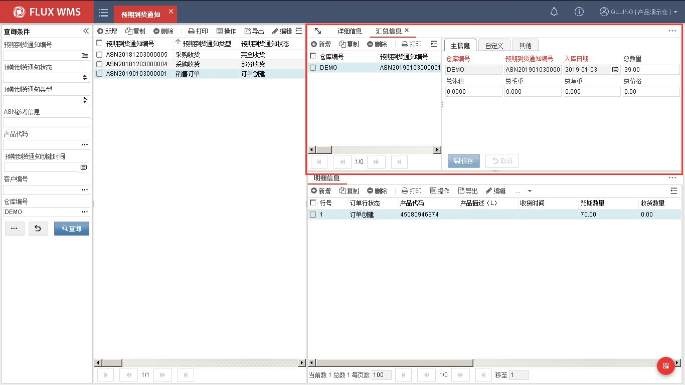

  - 附件

附件页签，常用来记录收货时的随附单据、现场照片等文件。根据需要上传文档，或下载已有文档查看。

在附件页签，点击【上次】按钮，系统显示如下文件选择对话框，通过【+】按钮，选择文件，再点击【上传】按钮，完成附件上传。

<!-- 原 PDF 第 235 页 -->

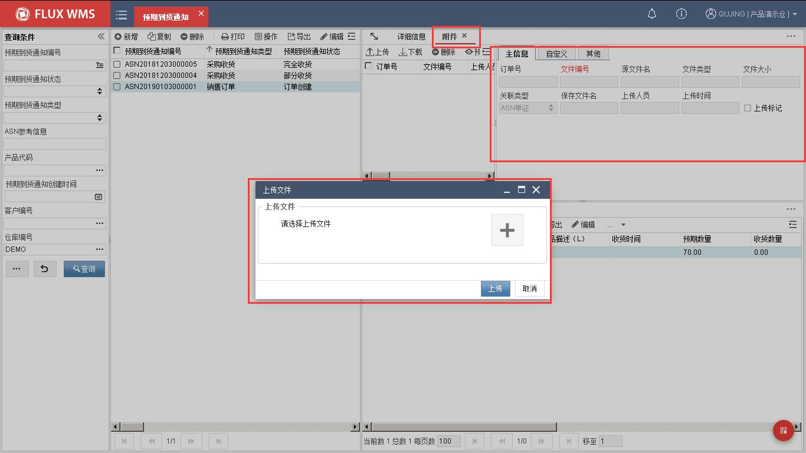

上传成功，系统自动添加附件信息记录：

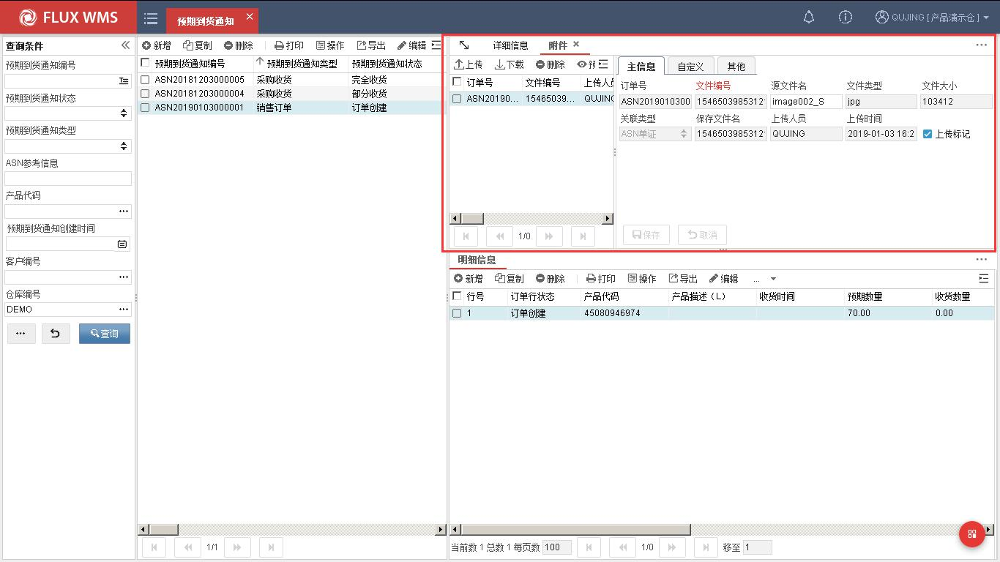

对于已有附件，可以通过【下载】按钮下载查看。

- **订单行明细**

<!-- 原 PDF 第 236 页 -->

  - ASN 明细部分，点击【新增】按钮，在主信息页签依次输入信息：

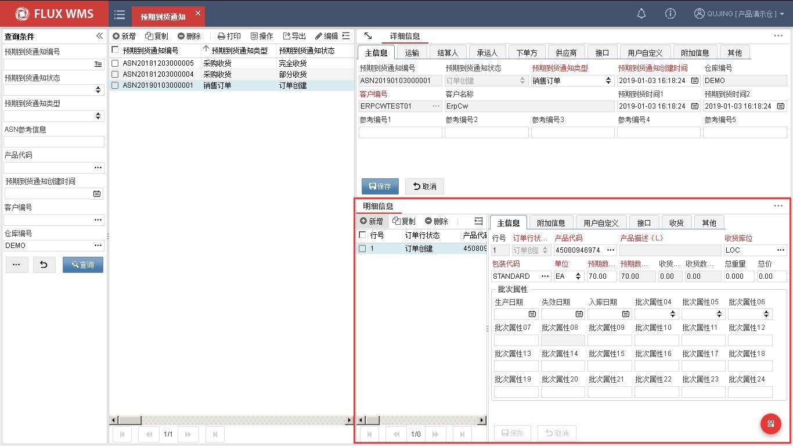

行号－系统自动生成的 ASN 行号。

订单行状态－该行的当前状态，由系统自动更新。新建时，默认为订单创建。

产品代码－待收货的 SKU ID。可人工录入或者通过浏览按钮选择。产品必须是已经在产品档案功能中维护过的、表头所选货主名下的产品。

产品描述－接收产品的名称。当输入产品代码时，系统自动给出产品档案中该产品的描述，并且不能修改。

收货库位－预计接收产品的库位。系统自动给出默认的收货过渡库位（STAGE，多仓情况下默认为对应仓库的首个过渡库位，也可在系统参数中配置不同仓库、单据类型的默认收货库位），客户可根据实际情况进行修改。收货库位的选择会对后续操作有所影响。在启用系统指导上架的情况下，收货到过渡类型的库位，系统会计算上架库位。如果直接收货到存储类型的库位，系统认可为最终存储位置，不再生成上架任务。

包装代码－该产品对应的包装代码。系统自动给出该产品在产品档案中所维护的包装代码，客户也可根据情况在订单明细中选择其他的包装代码，但所选的包装仅在此单入库操作中有效。即系统支持入库采用不同标准包装的情况，并可将入库包装信息跟踪到库存中，便于后续的出库操作（需要启用产品档案中的“复制包装到批次属性 12”选项）。

单位－收货时所用的数量单位。系统自动给出该产品在产品档案中所选择的缺省收货单

<!-- 原 PDF 第 237 页 -->

位，客户也可根据情况选择其他的收货单位。

预期数量－预计接收产品的数量。在订单数量中有 2 个字段，前一个字段是可输入的，以所选择的单位为数量单位；后一个字段是以所选择的包装代码的最小单位（主单位）为数量单位的，并且是系统自动换算给出，不能人工修改。录入数量后，再修改单位级别，预期数量会随之变更，主单位数量不变（例如件改为箱，原本的 100，100 数量显示根据 10 件/ 箱变更为 10,100 显示）

收货数量－系统已经完成收货的产品数量。同样有选择单位数量和主单位数量两个字段。

总重量－待收货产品的行总毛重。

总价－待收货产品的行总价格。

批次属性信息－入库时需要记录的产品所具有的批次属性。每种产品可设置不同的批次属性项目，由基础信息中的批次属性设置控制，其中必输字段红色显示。

需要注意的是，入库日期批次属性，不是人工输入的，而是收货时自动记录。如需修改 （补录之前的收货确认），需要修改收货页签的收货时间，而不是直接修改批次属性 3 的入库日期内容。

  - 点击【保存】按钮，创建 ASN 明细信息。

  - 可以根据作业需要，在“附加信息”页签进一步录入作业相关信息：

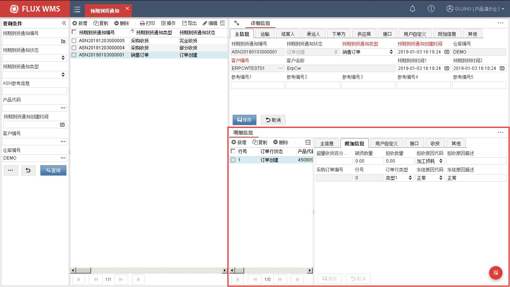

<!-- 原 PDF 第 238 页 -->

超量收货百分比－精细化超额收货管控使用，每行 ASN 可以有不同超额收货比例。常见与 ERP 根据采购订单下达，不同采购订单超额比例不同。

破损数量－针对可以收货的产品，部分外包装破损需要记录，能够用于收货情况统计或者供应商送货情况统计。但此类破损不影响产品出库，不影响货物的状态（例如良品/非良品） 也不需要在库存中跟踪，仅在入库报表中体现的情况，因此另行记录本订单行产品的破损数量。

拒收数量－产品到达仓库，但由于破损等原因，不可收货（或者部分拒收），拒收数量不计入库存。为了方便进行供应商管理，或提供报表统计，需要记录曾经到货但未收货的拒收数量。

拒收原因代码－货物拒收原因代码选择。下拉列表显示系统代码 RSN_COD 中 UDF1=CM 或者 ASN 的记录。类似冻结原因、描述，选择原因分类，输入具体说明。

拒收原因描述－货物拒收原因描述。可录入描述信息。

采购订单编号－预计接收到的产品对应的采购订单编号。当通过采购订单编号生成 ASN 时，系统自动提供该采购订单编号。

采购订单行号－预计接收到的产品对应的采购订单行号。当通过采购订单编号生成 ASN 时，系统自动提供该行号。

订单行类型－特殊情况下，同一 ASN 下的订单行还要进行细化分类，以便用于一些作业细节处理，如判断发票金额、打印控制、独立装箱控制、二包控制等。因此系统提供行级别的类型区分字段

冻结原因代码－产品的冻结原因选择。当进行仓库活动时，对产品有指定的要求时，可选择相应的冻结原因。系统提供正常、产品损坏、过期产品、质检上架、上架质检、质检/按库位上架 6 种选择。正常为默认值，表示产品不被冻结，按正常流程运作。如果产品档案中设置为非正常值，系统可以执行入库即冻结的收货处理。

冻结原因描述－冻结原因对应描述，可由用户修改。

  - 根据需要，可以在用户自定义页签补充附加信息。接口页签则存放接口下达的附加信息。

  - 另有部分字段，较为常用，但系统初始化界面默认隐藏。现场通常根据业务需要，进行方案配置显示（具体配置请参考 4.13 界面方案管理章节的说明）：产品别名代码－启用别名功能时，直接在此字段录入产品别名，系统将根据产品档案中

维护的别名信息，显示别名对应的 SKU 的相应信息。

<!-- 原 PDF 第 239 页 -->

质检状态－同表头质检状态字段，显示此行对应的质检行的作业状态。

  - 其余同收货相关的页签，如收货、服务页签等，将在收货操作中详细介绍。

- **其他创建方式**

除了手动逐单输入创建 ASN 之外，比较常见的 ASN 创建方式通常有：

  - 接口获取

通过 EDI 接口，由上游系统下达 ASN（或者 PO）信息，用户可以直接在 FLUX WMS 中查看到已经创建成功的待操作单据。

EDI 接口的配置，不在本文档介绍范围内，如有需要，请向系统管理员或者 FLUX 顾问咨询获取进一步的文档支持。

  - 文档导入

很多情况下，如果没有接口，客户或供应商会通过 Email 提供给仓库到货明细信息。

文档导入生成单据是 FLUX WMS 的标准功能，具体操作可参考第三章 FLUX WMS 概述中，3.5.3 通用功能按钮的扩展功能-导入对应说明。

  - PO 导入

除了手动录入创建、接口获取、人工导入之外，ASN 同样可以通过一个已经存在的采购订单（PO） 来创建。

由于货主向供应商下达采购订单后，供应商有时会根据生产情况分批送货到仓库。因此收货所用的 ASN 单据需要从采购订单（PO）提取信息。收货后信息也需要更新、汇总到采购订单，同时也避免了多次重复录入。

操作步骤为：

    - 选择“入库操作”模块下的“预期到货通知”功能。

    - 在订单头的明细页面，点击【新增】按钮。依次输入信息创建并保存 ASN。

    - 在如图鼠标右键的“导入导出“二级子菜单中，选择“提取 PO 数据”功能。

<!-- 原 PDF 第 240 页 -->

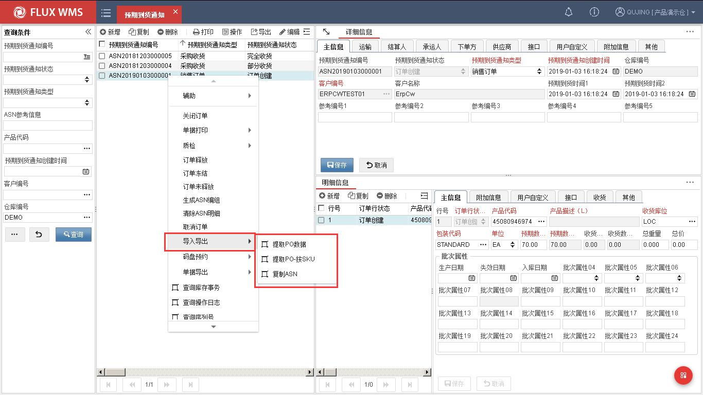

    - 系统跳转到采购订单查询页面，可通过输入查询条件来查找所需 PO。

采购订单号－所要提取的采购订单编号。

PO 状态从、到－所要提取的采购订单的状态，系统提供创建订单、完全释放、部分收货、完全收货、取消订单、订单完成等选择。

采购订单类型－所要提取的采购订单的类型，系统默认提供普通、退货 2 种选择。

参考信息－所要提取的采购订单的附加信息。

产品－所要提取的产品代码。

产品描述－所要提取的产品的中文描述。

创建时间从、到－所要提取的采购订单的时间段。

    - 在查询所得的订单列表中，选择所需采购订单。

    - 在该 PO 订单明细部分，选择需要创建为 ASN 的订单行。通过 PO 明细部分，鼠标右键菜单的功能项可全选订单行记录，或反选。

<!-- 原 PDF 第 241 页 -->

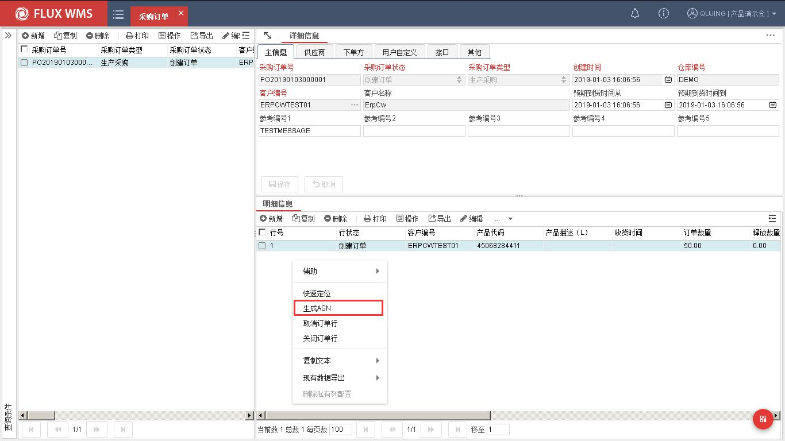

    - 在如上图的鼠标右键功能菜单中，选择“生成 ASN”功能，系统根据所选 PO 明细，二级窗口显示所选记录对应信息，默认本次释放数量=订单数量-已释放数量，确认后生成 ASN 明细信息。用户可根据需要在 ASN 中进一步修改。

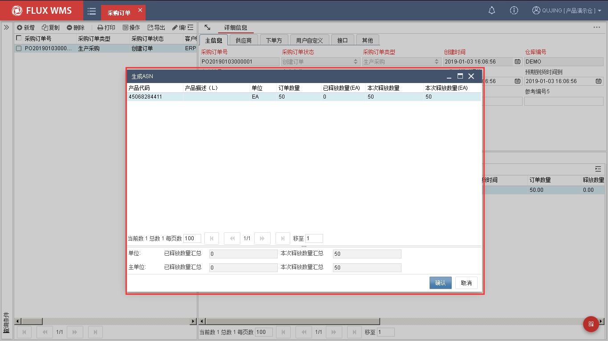

<!-- 原 PDF 第 242 页 -->

    - 一个 ASN 可从多个 PO 提取信息，一个 PO 也可关联多个 ASN。

  - 按 SKU 导入

    - 在不严格匹配单据的业务情况下，也可以按 SKU 选择 PO，从而提取 PO 信息。在 ASN 表头鼠标右键菜单导入导出子菜单中，选择功能【提取 PO 信息-按 SKU】 后，在如下二级窗口中，输入代码，系统显示此 SKU 相关的 PO 数据。

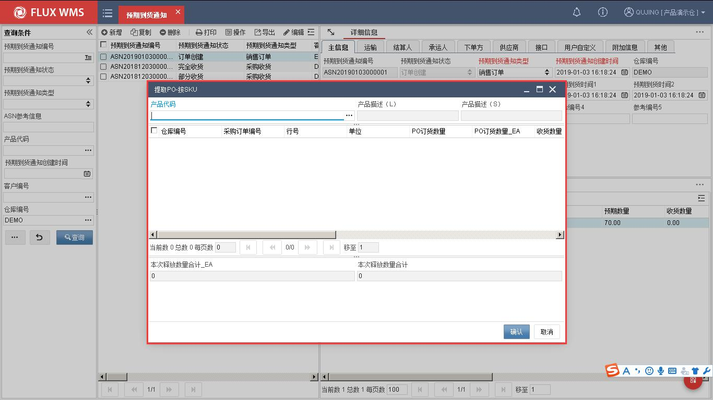

    - 选择对应的 PO 明细行，确认本次释放数量（即生成 ASN 明细行的期望数量。根据是否允许超量收货的配置，系统将在超量情况下进行提示），【确认】后，生成对应的 ASN 明细行。

注：货主档案，附加信息页签，如果勾选【ASN 是否与 PO 关联】，当对 ASN 进行更新时，如收货确认，PO 会也会同时进行更新。

### 9.3.2. 表头右键功能

- **订单取消、关闭**

订单创建后，如果在没有进行收货的情况下不再使用该订单，可以使用表头的【删除】按钮直接删除订单，或者使用鼠标右键菜单中的订单取消功能，取消订单。

订单取消后，将不能针对订单进行任何操作，但仍然可以查询到该订单（查询条件需要选择“显

<!-- 原 PDF 第 243 页 -->

示关闭/取消 ASN”），有利于用户统计、查询。特别是对于接口下达的订单，用户通常无删除权限，而是通过取消操作来标记订单。取消过程中，如果 ASN 有关联 PO，则会对应更新 PO 信息，增加 PO 中的未释放数量。订单关闭，同样结束订单操作，不能再对订单进行任何修改，与取消不同的是，关闭针对使用中的订单，并不限定只能是创建状态订单，并且如果使用系统计费功能，将在订单关闭同时计算收货费用。

- **复制 ASN**

位于鼠标右键功能菜单的“导入导出”子菜单中。

根据所选 ASN，复制生成新的 ASN，与原样本 ASN 相比，仅单号、创建时间不同，且复制生成的新 ASN 为创建状态。

- **质检子菜单**

质量检验是入库流程中的一个可选功能，可以在收货前执行，也支持收货后进行操作。通过参数配置是否必须操作质检，并在收货、上架功能中校验是否质检已操作。

在 ASN 鼠标右键的质检子菜单中，包括如下 2 个功能：

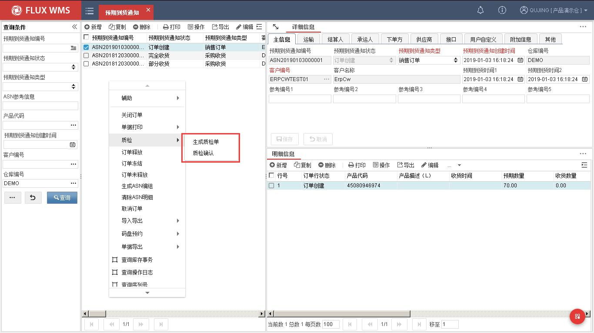

  - 生成质检单：

<!-- 原 PDF 第 244 页 -->

根据 ASN，产品对应质检规则，计算应检数量，创建质检单据。后续需要在质量检验功能中进行质检记录操作。

  - 质检确认：

快捷确认质检操作完成。仅标记此单质检已进行，但不生成质检单据，不记录质检作业的详细信息。

- **查询相关**

  - 查询库存事务：

系统根据当前订单主要信息，如订单号、类型、客户，显示库存事务查询页面，便于用户查找订单相关操作历史信息，包括取消的操作记录。（库存事务功能介绍，参见库存管理部分）。

在 ASN 明细部分，点击收货交易页签，能够查看到订单的收货记录，但不显示取消的操作记录。

  - 查询操作日志

用于查询订单相关的打印、关闭等操作的日志记录。点击后弹出二级窗口显示。默认情况下不开启系统操作记录，查询为空。

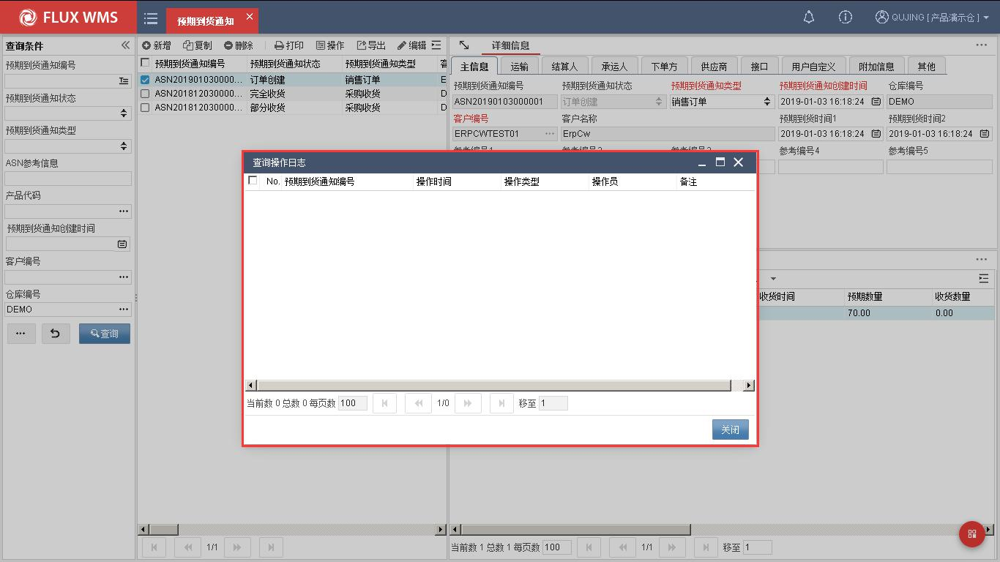

  - 查询序列号

点击后跳转到“入库序列号查询”功能，并带入当前 ASN 编号，触发对应查询。

<!-- 原 PDF 第 245 页 -->

- **订单控制**

  - 订单释放：

将所选订单的表头释放状态，更新为“订单释放”。释放后的订单可收货确认。订单释放状态，通常用来做入库审核，未通过审核的订单，不可入库。

  - 订单冻结：

将所选订单的表头释放状态，更新为“订单冻结”。冻结后不可收货。

  - 订单未释放：

将所选订单的表头释放状态，更新为“订单未释放”。未释放订单不可收货，非创建状态订单，如已经部分收货的 ASN，不可更新为“未释放”。

冻结与未释放都是不可收货，通常未释放是尚未审核，冻结是审核有问题的 ASN。

- **标记收货完成：**

通常 ASN 收货、上架完成后，可以设置为系统自动关闭订单。但对于部分收货的 ASN，系统无法区分此单不再收货，还是收货未完成正在进行，无法自动关闭。通过标记收货完成功能，对于部分收货的订单，系统可判断为不再收货，已有上架任务完成后可自动关闭 ASN。

- **生成 ASN 编组：**

选择多张 ASN，生成 ASN 编组单据。类似出库时多张单据生成波次计划。

- **汇总信息：**

当前列表中的订单总数和当前订单的总收货数量等汇总信息查看。

- **清除 ASN 明细：**

删除当前 ASN 的全部明细信息，仅对创建状态 ASN 生效。

### 9.3.3. 明细右键功能

明细行部分，右键菜单功能主要有：

- **取消订单行**

系统支持逐行或批量对订单行进行“订单行取消"操作，点击后系统自动进行二次确认是否取消。点击“是”执行取消操作；“否”放弃本次操作；

- **收货方式选择**

<!-- 原 PDF 第 246 页 -->

系统提供的多种不同的 PC 端收货方式，如扫描收货、快捷收货等。具体每种收货操作，请参考后续的对应收货操作说明章节的详细介绍。

- **码盘相关功能**

码盘、取消码盘功能的具体操作，将在 9.4 码盘预约章节详细介绍。

- **快速定位**

ASN 明细较多情况下，人工查找记录效率不高。通过快速定位功能，方便查找对应记录。点击后，系统弹出如下对话框，根据需要可以选择“定位”（跳转到符合条件的首行记录），或者 “过滤筛选”（显示符合条件的明细行，其余明细行隐藏）模式。输入产品代码，或者 PO 单号、PO 行号作为定位/过滤条件。系统支持模糊查询，如果符合输入条件的 SKU 有多个，则在对话窗口下半部分列表显示，供用户选择，按所选 SKU 执行定位/过滤。

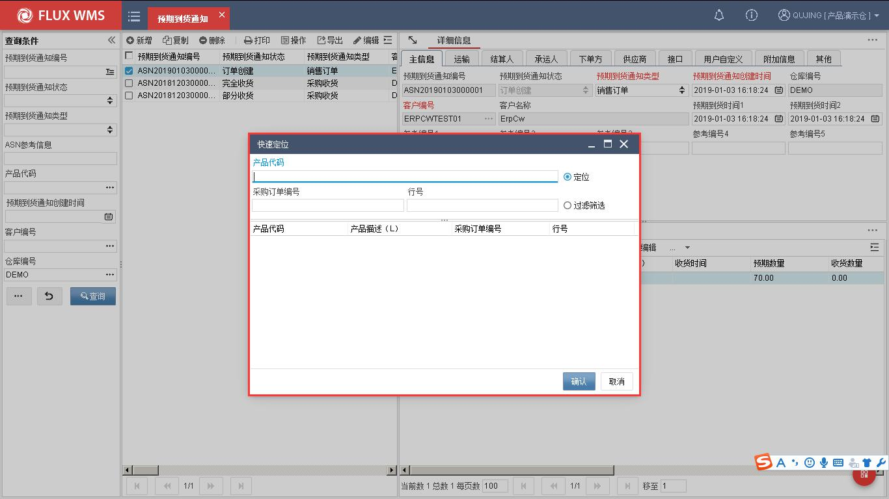

- **指定产品供应商：**

要求产品绑定供应商的情况下（SKU_SUP_LNK=Y）显示此功能，选择后弹出产品供应商选择

<!-- 原 PDF 第 247 页 -->

窗口，内容为产品档案已维护的对应供应商。

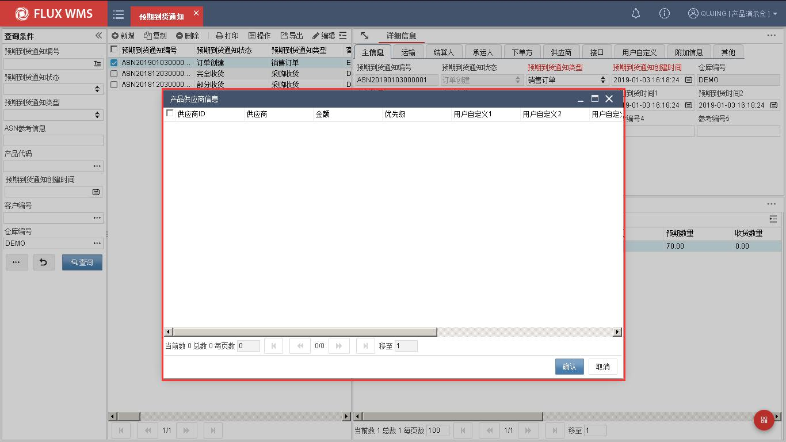

选择供应商，系统将信息带入到 ASN 明细的批次属性 5 中。

- **生成质检单：**

类似表头的生成质检单功能，但只将所选 ASN 明细生成质检明细行，未选择记录不生成质检单。

- **包装材料：**

从 ASN 明细右键菜单功能，可触发二级窗口弹出，查看或维护产品包装材料信息。支持新增多行记录，维护包材、填充物等内容。配合包装材料库存管理应用。

<!-- 原 PDF 第 248 页 -->

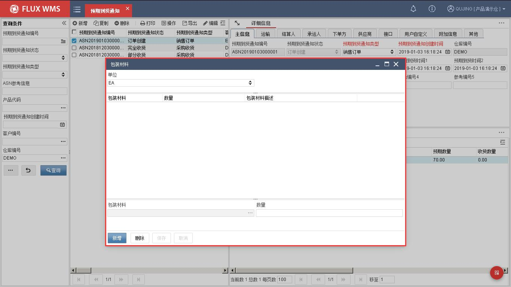

- **产品配件管理：**

多部件产品，退货流程常用功能。入库时根据产品档案维护的配件信息，检查配件是否齐全，以便对产品等级、是否可再销售进行判断。

点击右键菜单项，二级窗口显示产品对应配件信息，用户可通过选择配件状态、输入说明信息等，对产品配件信息到货情况进行说明。

<!-- 原 PDF 第 249 页 -->

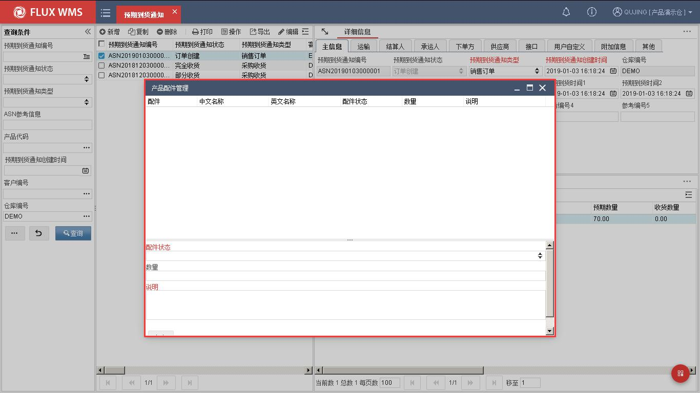

配件情况对产品到货数量、库存等级无直接影响，仍旧需要人工确认数量、等级。

- **其他右键功能**

明细行部分还有复制等功能，与收货操作相关，在 9.5.8 的其他收货处理章节进行介绍

### 9.3.4. 单据输出

- **单据打印**

在纸面单证操作情况下，预期到货单证创建完成后，用户可打印入库任务清单作为收货时所使用的依据单证（如使用 RF 执行收货操作，是否打印清单，或者打印入库任务标签，由操作流程确定，可参考 RF 操作手册说明）。

用户选择所需操作的 ASN，在表头的 ASN 编号列表窗口，点击鼠标右键菜单选择“单据打印” 二级子菜单中的“打印入库任务清单”功能，系统将显示单证打印预览窗口，由用户确认单据打印。

如果订单经过码盘，可选择“打印码盘任务清单”，打印码盘后的收货任务清单列表。

<!-- 原 PDF 第 250 页 -->

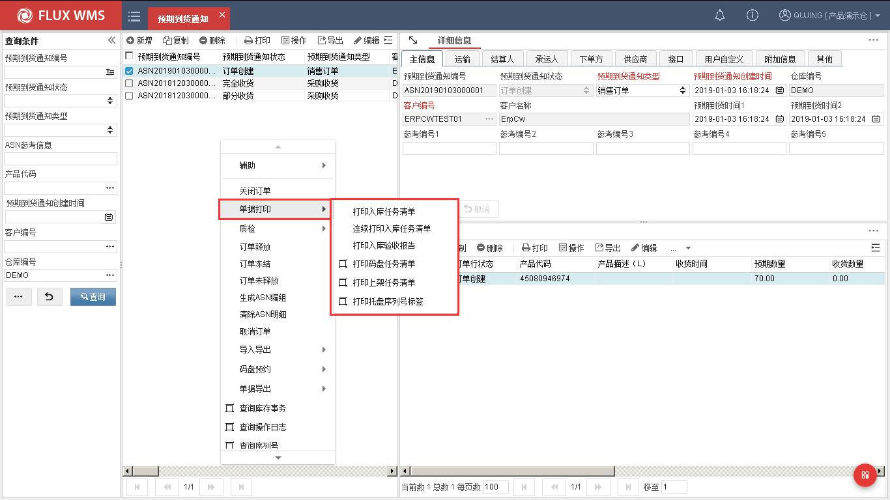

- **单据导出**

系统还支持把单据信息导出保存为文件，常用于提供验收报告给货主。

在 ASN 表头右键菜单中，可见“单据导出”子菜单，选择某个单据（例如入库任务清单），系统显示如下图的导出配置对话框。根据需要勾选后，确认导出

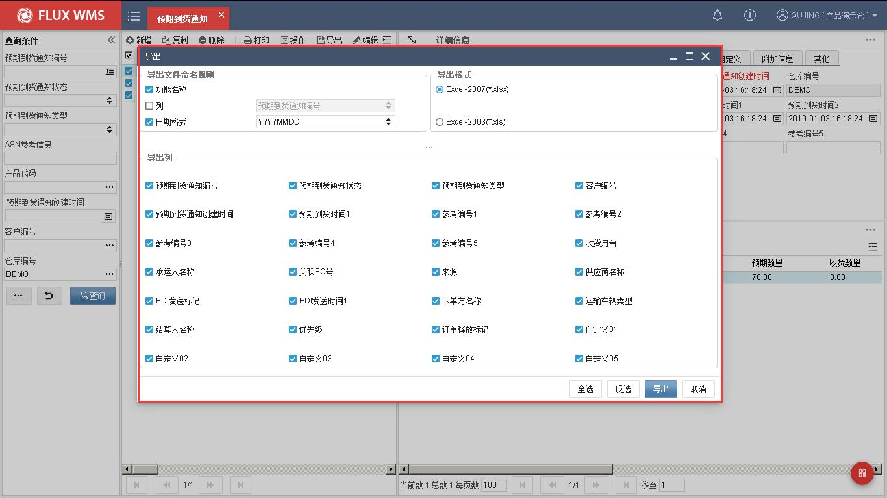

<!-- 原 PDF 第 251 页 -->

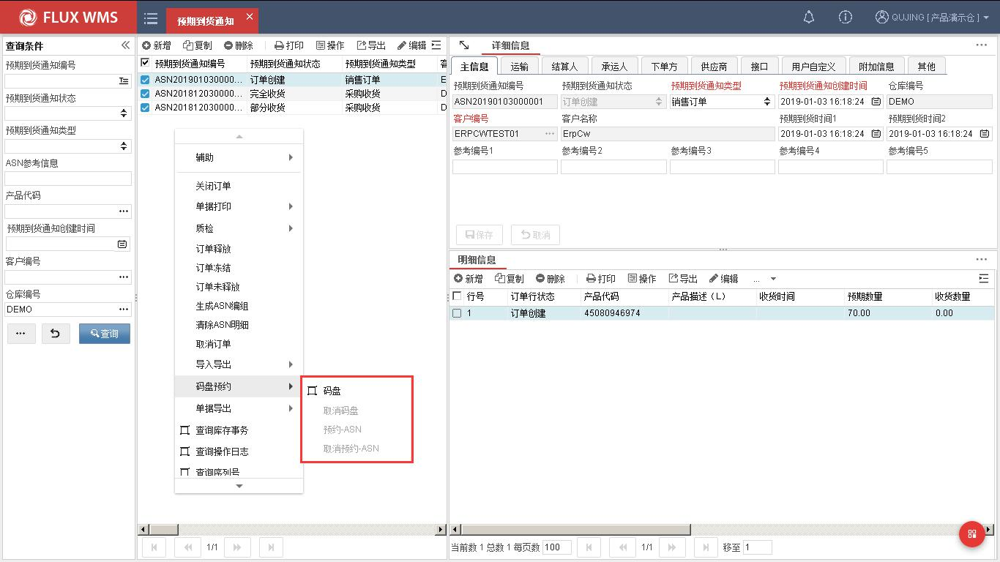

## 9.4. 码盘预约

### 9.4.1. 码盘操作

在操作少品种、大批量货物的收货时，为了便于产品的收货作业，以及后续的上架、库存管理和出库操作，通常会对货物作标准化托盘堆码处理，这一处理通常被称为码盘。为了指导实物的码盘，并做到标准化管理，在系统中，同样需要对已经创建的 ASN 进行码盘，即根据包装代码中收货标签的单位，把产品按数量级别进行拆分并做标准托盘化处理，方便粘贴标签和上架等其他操作。同时，码盘后，可以用托盘为单位进行后续操作，方便对货物进行跟踪。

码盘环节是入库流程中的可选操作，用户可根据实际操作需要选择是否执行码盘操作。如果系统参数 PLT_RCV 开启，则对应类型单据必须进行码盘收货。

- **对 ASN 进行码盘**

  - 查找并选择所要操作的 ASN。

  - 在表头明细部分的列表导航窗口，针对所选 ASN，点击鼠标右键菜单，选择“码盘预约”子菜单中的“码盘”功能（取消码盘、预约等功能只有在订单码盘后才可使用，因此在没有码盘的情况下显示为灰色）。

<!-- 原 PDF 第 252 页 -->

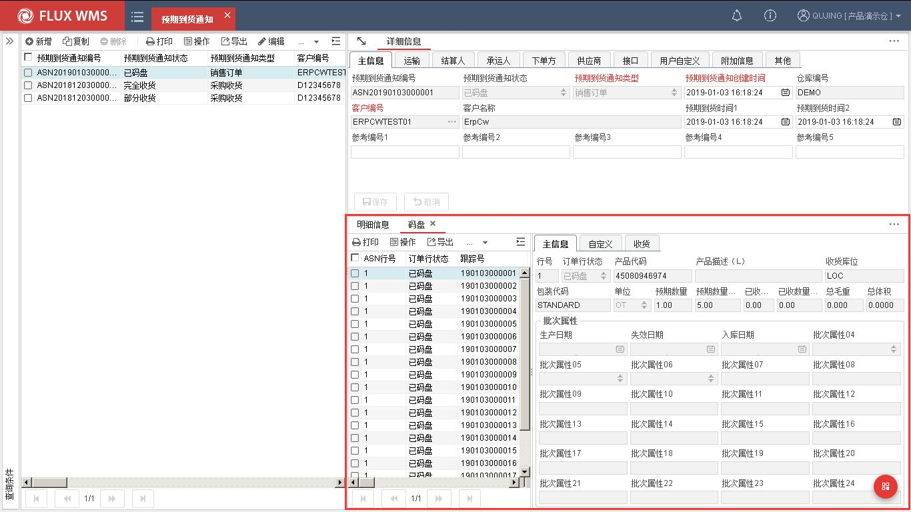

  - 系统按照产品所选包装中的相关选项，自动完成码盘操作。可在明细部分的“码盘 “页签中查看码盘记录。未码盘情况下，“码盘”页签不显示。

*[图 9-4-2]（原 PDF 第 252 页，图像未能从 PDF 对象中直接提取）*

  - 码盘操作，还可以通过 ASN 明细行的右键菜单码盘功能进行操作。通常用于对单行 SKU 重新码盘的情况。

  - 码盘操作时，若订单明细必输批次属性未录入，则提示“必输批次属性 XX、XX 为空，是否继续码盘？”。

    - 是：继续收码盘；

    - 否：放弃本次码盘操作，人工自行补充批次属性信息；

- **取消码盘**

码盘后如遇各种情况需要取消码盘或重新码盘（例如产品包装层级维护错误，需要重新选择），系统也提供了便捷的操作方式：选中所要取消码盘的 ASN 编号，在表头的鼠标右键菜单码盘预约二级子菜单中选择“取消码盘”，系统将取消原有的码盘操作，恢复到创建状态。

取消码盘同样可以通过订单行的右键单行取消，重新码盘。

<!-- 原 PDF 第 253 页 -->

### 9.4.2. 预约操作

- **预约库位**

除了码盘操作，FLUX WMS 还提供了预约库位的功能。此功能主要用于收货、上架同时完成的操作情况，货物尚未入库，系统预先根据上架规则计算并预留货物的存储库位，收货清点后即可按照预约的库位进行上架操作，可以一边收货一边上架，适用于理货区容积不足的仓库操作。

预约需要在码盘作业后进行，这样系统可以根据每个托盘分别计算库位。否则一整批未分割的货物很难找到一个合适的库位进行存放。

一旦进行过库位预约，在上架功能中将不再对上架库位进行重新计算，而是直接提取预约的库位，但可根据实际上架情况进行修改（关于上架的详细内容请参看入库操作的上架部分）。

预约库位也可用于检验上架规则及相关设置是否正确。

预约库位具体操作如下：

  - 在 ASN 表头明细部分的列表窗口，选中已经完成码盘、需要进行库位预约的 ASN。

  - 鼠标右击，选择鼠标右键菜单码盘预约子菜单的“预约-ASN”功能。

  - 系统将按照上架规则的设置，自动查找并计算上架目标库位，记录到码盘明细的计划库位字段。

  - FLUX WMS 同样提供了便捷的取消预约的功能，操作同预约库位，在鼠标右键码盘预约二级子菜单中选择“取消预约-ASN”，可取消预约记录，重新预约。

注：预约库位可以针对订单明细执行。在 ASN 明细行部分，选择码盘明细页面，可选择鼠标右键菜单中的按 ASN 订单行，或者按跟踪号进行库位预约操作。取消预约同样可根据 ASN 订单行或者跟踪号单独取消预约操作，如下图所示。但明细行的明细页签鼠标右键菜单无预约功能显示，而是提供的按行码盘功能。不同页签，右键内容有所不同。

<!-- 原 PDF 第 254 页 -->

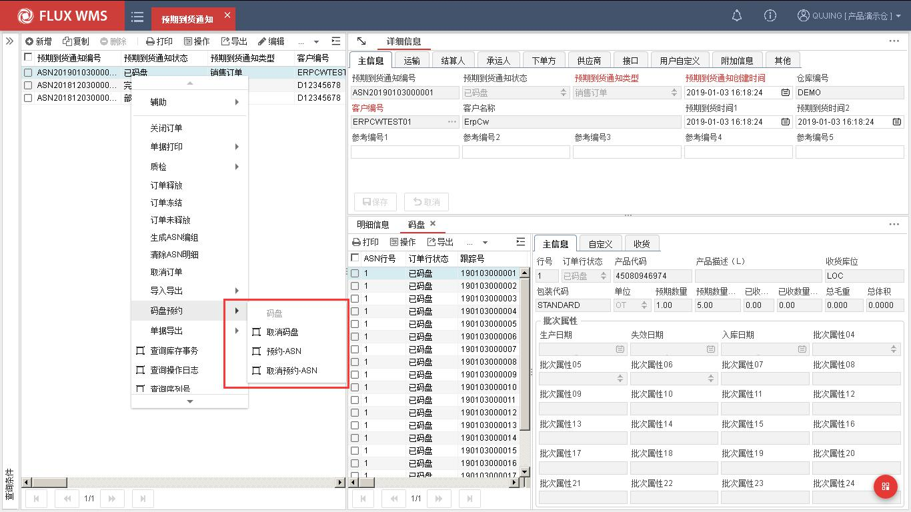

如果取消预约后，修改上架相关设置，再次预约时将按照新的设置执行库位预约。

## 9.5. 收货操作

工作人员完成货物清点后，需要在系统中执行收货操作，确认货物入库。收货同样可通过 WMS 界面、RF 扫描确认、电子标签等不同方式执行，此章节主要介绍 FLUX WMS 系统界面操作，RF 收货操作在 RF 操作手册中集中介绍。

收货后，系统内库存将增加，ASN、PO 对应信息相应更新，并生成对应的收货事务记录。如果有配置要求收货时进行上架计算，则系统生成相应的上架任务。

FLUX WMS 的收货操作，可支持多种不同的收货作业情况，例如：

  - 全部收货

  - 部分收货/多次收货

  - 码盘收货

  - 扫描收货

  - 快捷收货

  - 可视化收货

<!-- 原 PDF 第 255 页 -->

  - ……

### 9.5.1. 按 ASN 收货

通常用于一次性确认货物到货、数量无误的情况。

  - 选择“入库操作”下的“预期到货通知”。

  - 在订单头的列表页面中查找所要收货的 ASN 记录（或者通过指定条件查询到 ASN），点击订单明细行部分的明细页面。

  - 在 ASN 明细列表窗口，点击选择需要执行收货确认的订单行。可连续选中多个产品行，或者使用鼠标右键菜单的“全选”功能项，一次性确认选择全部订单行。

  - 如果实收数量与订单期望数量相符，可以明细行部分，直接点击鼠标右键菜单，确认收货（如下图菜单显示）。

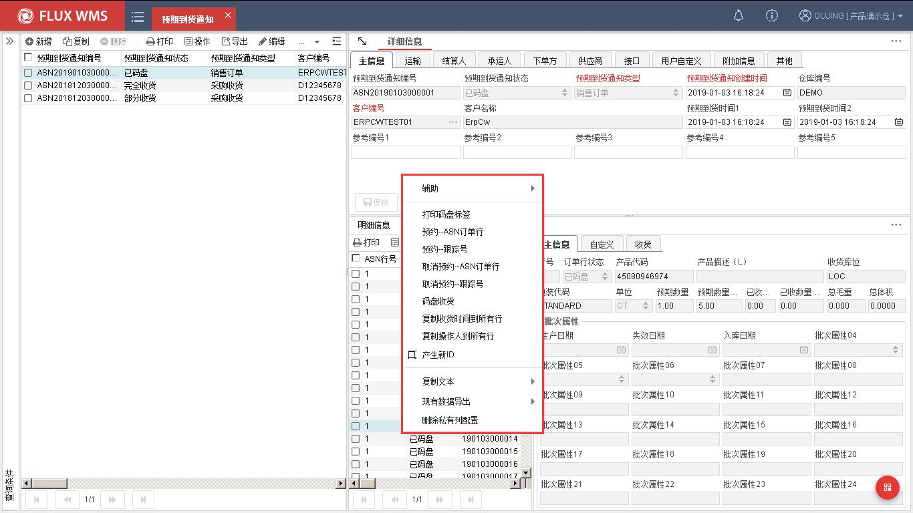

  - 系统执行收货操作，库存数量增加。

  - 产品首次入库时，系统会弹出提示

  - 序列号模式开启情况下，不允许直接确认收货，以免遗漏序列号采集

  - 订单未释放情况下，不允许进行收货操作。

<!-- 原 PDF 第 256 页 -->

### 9.5.2. 部分收货

如果一份预期到货单据中的库存要分多次或多车送抵，收货也经常需要分多次收货，每次只确认一部分货物入库。此外，如果实到货物数量少于订单数量，同样需要做部分到货确认。

  - 如果实际收货情况与系统预期记录不符，可在 ASN 明细行的收货页签按实际情况修改，依次输入如下信息：

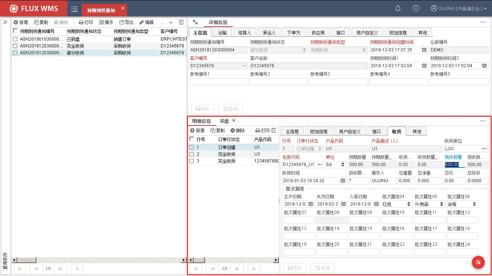

行号－所选记录的 ASN 行号。

订单行状态－该行的状态。系统自动提供，根据操作情况显示。

产品代码－产品 ID。

产品描述－产品名称

收货库位－实际接收产品的库位。系统自动给出默认的收货过渡库位，客户可根据自身情况进行修改，并可通过快捷查找按钮选择库位。例如将收货库位修改为最终存储库位，可实现直接收货到库位的操作，就不需要另外执行上架确认。

包装代码－该产品收货时所用的包装 ID。系统自动给出该产品在产品档案中所输入的包装代码，收货时可以根据产品实际到货所用的包装，通过快速查找按钮临时变更收货包装代码。但此处的包装修改，仅对这一行产品收货生效，且所选代码需要在产品档案中配置为产品有效包装（即多包装配置）。产品档案、其他订单中仍旧使用原有包装。

<!-- 原 PDF 第 257 页 -->

单位－收货时的单位。系统自动给出该产品在产品档案中所选择的缺省收货单位，客户也可根据情况选择其它的收货单位，一旦更改单位，现收货数需要重新录入。

预期数量－即订单行中的预期数量，由系统显示，不可在收货界面修改。预期数量的 2 个字段，同样是第一个字段根据所选单位换算显示，第二个数量为主单位的数量。

收货数量－已经收货的产品数量。按所选单位，系统自动显示，不可修改。同样 2 个字段显示。

现收数量－本次收货数量，根据所选单位显示，系统默认换算显示主单位数量。选择订单行记录时，现收货数默认等同于期望数，由用户根据实际情况修改。如果为部分或多次收货情况，系统默认为尚未收货数量。

收货时间－实际收货确认时间，系统自动显示为当前时间，用户可修改为实际货物到达时间。收货时间中的日期将自动作为批次属性 3 入库日期的内容，并且可以通过鼠标右键菜单的“复制收货时间到所有行”的功能批量复制该字段内容。

通常情况下，收货时间字段内容不需要修改，只有在补操作时（例如前一晚收货后没有来得及在 WMS 界面确认，第二日才操作 WMS 收货）需要修改为实际收货日期。收货时间不能改为未来时间。

目标跟踪号－产品的跟踪号码，可以是系统码盘生成的目标跟踪号，也可以由用户自行输入，例如托盘号、箱号、序列号的用于区分相同库存的信息。

操作人员－纸面单证操作模式下，实际收货人员与在系统中操作确认收货的人员可能不是同一位员工，因此可根据需要在此字段中记录实际收货清点的操作人员。系统确认人员将作为默认信息记录到库存历史记录中。同样可以通过鼠标右键菜单的“复制操作人员到以下各行”功能，批量更新操作人员信息。

总体积－收货产品的体积。

总重量－收货产品的毛重。

总净重－收货产品的净重。

总价－收货产品的总金额。

批次属性－入库时需要记录的产品所具有的批次属性内容。系统显示明细行主信息页面的批次属性内容，由用户根据实际情况修改。其中必输批次属性的字段名为红色字体显示，未输入情况下收货会提示报错。

  - 修改完成，无需点击【保存】按钮，在明细行的导航窗口，勾选所改记录，点击鼠标右键菜单，确认收货。

<!-- 原 PDF 第 258 页 -->

### 9.5.3. 码盘收货

- **码盘收货**

  - 如果订单经过码盘，则在码盘明细页面选择明细行执行收货操作（已码盘 ASN，明细行的收货页签无法编辑，明细页签右键“确认收货”功能也不可使用，只能在码盘页签进行操作）。

  - 同样可以在码盘明细页面的收货页签中修改实际收货情况，类似非码盘情况下的部分收货操作。

  - 如果一个托盘上存在两种产品情况，或者只收到部分货物，可在码盘明细页面的收货页签中，按实际情况修改单位（例如将 1 托盘，单位改为件，再修改数量），确认收货。然后使用鼠标右键菜单中的“产生新 ID”功能，生成新的跟踪号，按另一类产品情况修改收货信息，再次确认收货，可对不同产品（或者不同情况的相同产品）拆分托盘收货，后续便于分别上架到不同库位。

- **右键功能**

码盘页签，具有独立的右键菜单功能，与 ASN 明细的右键菜单项，不完全相同。

  - 打印码盘标签。

基于码盘结果，每行码盘记录输出一张标签。根据码盘的单位，可能是托盘标签、箱标签或者件标签。

  - 预约--ASN 订单行

根据所选记录，对相关 ASN 明细订单行进行库位预约计算。

  - 预约--跟踪号

仅针对所选码盘记录行进行库位预约计算。

  - 取消预约--ASN 订单行

根据所选记录，对相关 ASN 明细订单行进行取消预约的计算处理。

  - 取消预约--跟踪号

仅针对所选码盘记录行进行取消预约处理。

  - 产生新 ID

一行码盘记录，拆分托盘进行收货时使用（例如一托盘 100 件中 2 件发现是不良品，需要修改

<!-- 原 PDF 第 259 页 -->

批次属性拆分托盘，后续上架到不同库位。但如果不需要拆分托盘，可以混批次收货到同一托盘，无需产生新 ID）。针对已经部分收货的码盘记录行，点击后，目标跟踪号由系统根据流水号规则，生成新的跟踪号。

  - 码盘收货

当前所选码盘记录的收货确认。

### 9.5.4. 扫描收货

FLUX WMS 提供扫描收货方式供用户选择使用，常用于扫描产品条码收货。需要在入库环节采集序列号的作业流程，也常使用扫描收货功能进行操作。

- **扫描收货操作**

  - 在 ASN 明细行部分，点击鼠标右键，选择右键菜单中的“扫描收货”（如下图）。

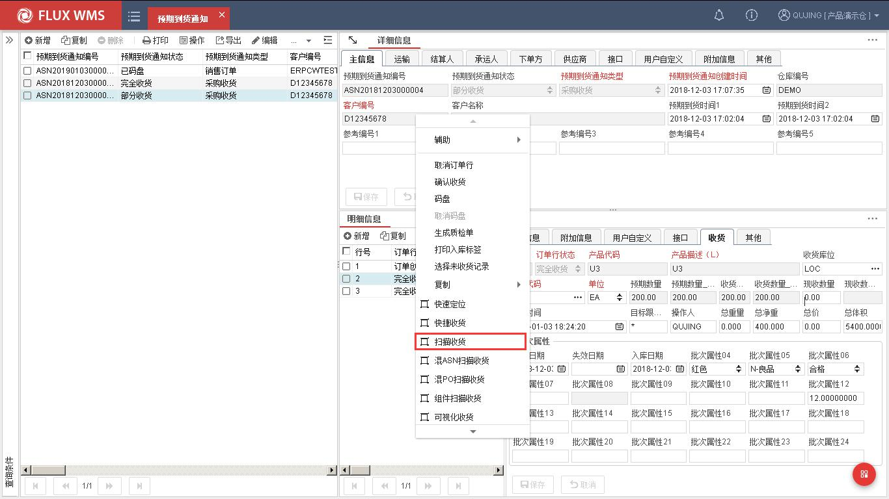

  - 系统显示如下扫描收货二级窗口。

<!-- 原 PDF 第 260 页 -->

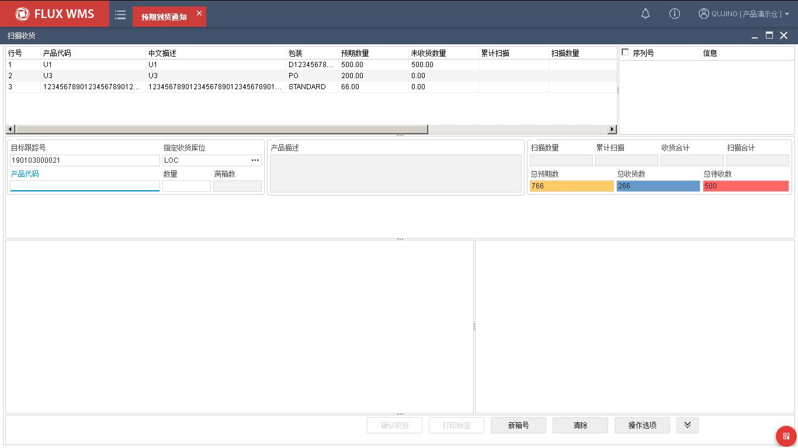

  - 使用扫描设备，扫描跟踪号（即收货到的托盘号或箱号）

  - 指定收货库位根据系统参数 DFT_RCV_LOC 配置，获取默认库位。但如果现场需要指定不同的收货库位，可在此字段录入。一次收货确认的记录都将收货到同一指定库位中，因此开始扫描后收货库位不可修改，已扫描内容收货确认后，下次扫描开始前可以变更收货库位。

  - 扫描产品条形码，系统根据扫描到的产品分别进行数量累加。

  - 扫描完成，点击【确认收货】按钮，系统将已扫描记录逐一收货确认。

  - 收货时，可通过【打印标签】按钮，打印箱/托收货标签，粘贴在货物上。

  - 如需要修改扫描内容，可点击【清除】按钮，清空当前已扫描、未收货信息，重新开始扫描，或使用鼠标右键菜单的“取消上次扫描”功能，扣减上一次的扫描信息，保留再之前的扫描信息。

  - 扫描时，系统会显示产品包装中维护的满箱数量，以及已收货总数、已扫描但未收货数量等信息供用户参考。

  - 如果所扫描产品为首次入库的新品，同样弹出提示信息，“XXX 产品是第一次入库”，并播放提示音 SKU_FIRST_RECEIVE.WAV 文件

  - 为了避免扫描过程中，无意碰触影响扫描，系统提供了光标焦点锁定、解除锁定功

<!-- 原 PDF 第 261 页 -->

能。锁定期间，光标固定在产品代码扫描字段，操作完成、解锁后才能点击其他字

段或按钮。

- **按钮功能**

  - 附加信息

二级窗口弹出，供维护入库箱型、箱重量、体积信息。

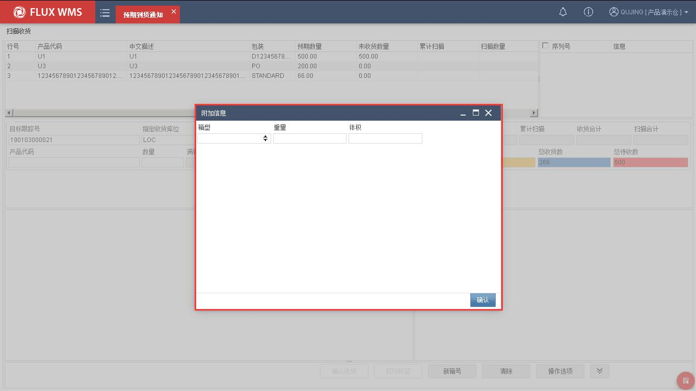

  - 操作选项

二级窗口弹出，系统提供如下选择：

<!-- 原 PDF 第 262 页 -->

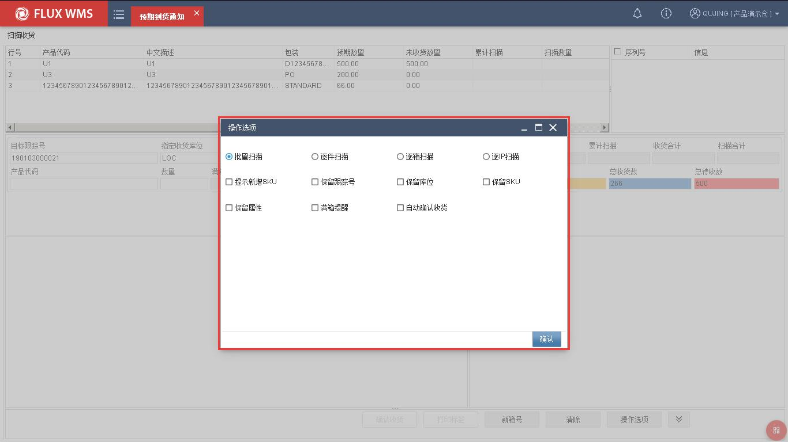

    - 扫描模式：批量、逐件、逐箱、逐 IP 扫描，4 选 1。批量模式，扫描产品定位后，允许人工输入数量；逐件模式下，默认数量为 1，每次扫描，数量自动加 1；逐箱扫描，数量不可修改，按包装对应每箱的主单位数量，自动增加；逐 IP 模式则按包装对应的每个内包装的主单位数量，自动增加。需要注意的是，如果开启了序列号采集，则默认为逐件扫描模式。

    - 提示新增 SKU：ASN 中，扫描到订单中不存在的 SKU，是否可以自动加入成为新的 ASN 明细行，通过系统参数进行控制。是否提示用户有新增 SKU，通过此处的操作选项控制。

    - 保留跟踪号：界面显示的跟踪号保持不变，可连续使用，直到人工修改、清除。

    - 保留库位/保留属性：由于操作时允许修改扫描收货界面的库位、批次属性内容，与 ASN 明细不同。收货后下一记录，是继续沿用之前修改的内容，还是提供 ASN 明细信息，通过是否保留的 checkbox 进行配置。

    - 保留 SKU：扫描成功后，SKU 框的上次扫描内容是否清空。如果保留，则全选，方便连续扫描下一产品代码。保留的目的是方便作业人员查看上次扫描的 ID。

    - 满箱提醒：扫描数量达到整包装数量情况下，是否需要系统提示已满箱，以便用户封箱、更换新箱。

<!-- 原 PDF 第 263 页 -->

    - 自动确认收货：如勾选，逐件/逐 IP/逐箱模式下，扫描产品后，即执行收货；批量模式下，确认数量后，系统即执行收货确认，无需另外点击收货按钮。

  - 确认扫描

非逐件扫描作业模式下，输入数量后确认。

  - 打印标签

扫描后、收货前打印的产品标签。（收货后可自动打印上架标签，与产品标签内容不同）

  - 确认收货

界面已扫描内容确认收货。

  - 清除

清除所有已扫描、未收货信息，重新扫描。

  - 锁定/解除焦点

锁定期间，光标固定在产品代码扫描字段，操作完成、解锁后才能点击其他字段或按钮。避免误触鼠标导致光标跳转到其他字段，而操作员由于扫描有距离没有及时发现，从而大量扫描未记录的情况。

  - 新箱号

获取一个新的、系统生成的流水号作为跟踪号。

  - 产品设置

已扫描产品情况下，点击后显示产品设置弹出框，维护包装信息等，无需切换到产品档案界面进行维护。

<!-- 原 PDF 第 264 页 -->

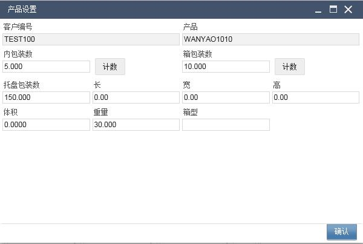

  - 允许/禁止混箱

对于是否允许混箱收货，通常在系统配置中维护参数 RCV_MIX_SKU 配置。但如果作业到最后的尾箱，可以临时通过按钮设置允许混箱。或者可混箱作业情况下，临时禁止混箱。点击后按钮名称也相应变化。

  - 打印箱标签

自定义箱标签打印触发。

  - 扫描记录

类似 ASN 功能的查询操作日志，点击后，弹出窗口列出所有已经扫描但尚未收货的记录。

  - 收货进度显示

对应每个所扫描产品的明细行信息，显示预期数、已收货数和待收货数

<!-- 原 PDF 第 265 页 -->

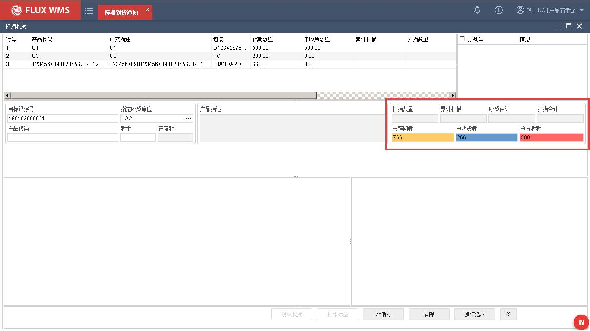

- **右键功能**

在列表部分，任意行点击鼠标右键，可见鼠标右键菜单：

*[图 9-5-9]（原 PDF 第 265 页，图像未能从 PDF 对象中直接提取）*

  - 取消上次扫描

用于扫描错误情况下，点击后，系统在当前累加计数基础上，扣减前一次扫描确认的数量。

  - 删除扫描记录

<!-- 原 PDF 第 266 页 -->

将所选 SKU 记录行的对应缓存扫描信息、序列号记录信息清除。已确认收货记录不受影响。

  - 确认产品

无条码产品使用，人工选择产品记录后，通过右键功能项“确认产品”，代替扫描效果，确认产品记录。

  - 查询锁定

一个产品有多行记录的情况下，扫描产品条码收货，但需要指定收货到某几行记录的情况下使用（如果产品带有批次属性条码可供扫描，可以通过属性扫描作业模式操作）。点击后系统显示如下二级窗口，通过输入产品、批次属性条件，筛选订单行，确定后返回扫描界面，收货范围限定在所选记录行范围内。所选记录行，列表的“锁定”列会显示为 Y，背景色突出显示为绿色。快捷键为 CTRL+K。

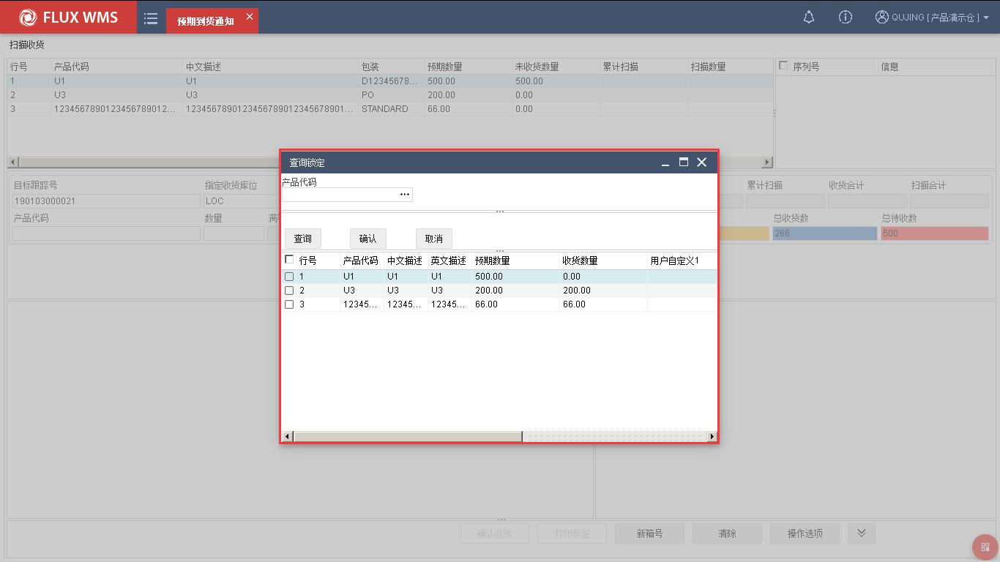

  - 锁定

直接选择某行记录，锁定为扫描收货对象，跳过查询锁定步骤。

  - 解除当前锁定

所选记录行，解除锁定，不再参与限定收货范围。

  - 解除全部锁定

<!-- 原 PDF 第 267 页 -->

全部锁定记录行解除，不再另行限定收货范围。

- **其他处理**

  - 图片显示

为方便用户核对产品，所扫描到的 SKU，如果配置了对应图片，可在扫描收货时显示产品图片。系统支持多图片展示

  - 序列号跟踪

开启序列号管理模式下（参数 SN#_CTL=2），即每件一个独立序列号，系统会在扫描界面右方显示序列号列表，供用户查看已扫描的序列号记录。序列号模式下（参数 SN#_CTL 为 1 或者 2），执行逐件扫描模式。

此模式下，鼠标右键不提供“取消上次扫描”功能。需要到界面右侧的“序列号信息列表”部分，通过“取消序列号扫描”，采集序列号，扣减对应扫描。

### 9.5.5. 快捷收货

为方便快速收货操作，同时维护拒收、质检等数据，系统提供快捷收货功能，类似在 PC 端执行 RF 扫描收货操作。

通过 ASN 明细鼠标右键，【快捷收货】功能，显示快捷收货二级窗口，如下图所示

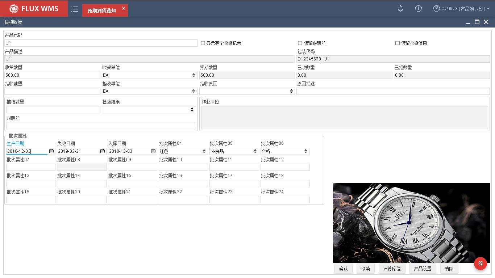

<!-- 原 PDF 第 268 页 -->

如果 RCV_SHW_PIC 参数开启，快捷收货可以类似扫描收货，显示产品图片。

如果上游 ERP 系统下达产品检查项，扫描到此产品时，可以弹出二级窗口，显示需检查项内容供用户查看。

快捷收货作业中，采集序列号同样支持序列号解析。

### 9.5.6. 其他收货作业模式

- **混 ASN 扫描收货**

支持多 ASN 跨单扫描。常用于供应商混 ASN 送货，仓库自行匹配单据。

通过 ASN 明细鼠标右键，【混 ASN 扫描收货】功能，显示作业界面。作业界面类似标准扫描收货，但进入时无产品列表显示。扫描 SKU 时，匹配未收货的 ASN、明细行，显示在扫描列表中。

扫描、提示、打印同标准扫描收货，确认收货时可对扫描到的多 ASN 明细确认收货。

- **混 PO 扫描收货**

类似混 ASN 扫描收货，只是扫描 SKU 时，匹配相关 PO，如果 PO 对应记录没有 ASN 存在，先自动创建对应 ASN 记录，再列入扫描列表中。通过 ASN 明细鼠标右键，【混 PO 扫描收货】功能，显示作业界面。

- **组件扫描收货**

单一 SKU 整箱入库时，根据组件维护的 BOM 信息，扫描同时整理为配比箱的操作，可以用组件扫描收货功能执行。

<!-- 原 PDF 第 269 页 -->

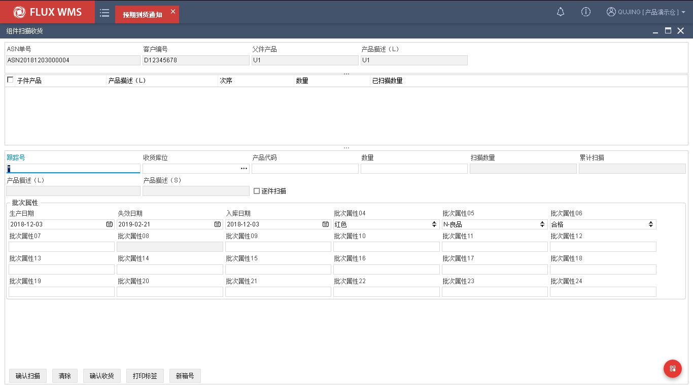

如上图，根据 ASN 中的父件行，鼠标右键选择【组件扫描入库功能】，列表部分显示父件对应的 BOM 组合。

扫描子件 SKU，当产品、数量满足 BOM 组合时，弹出提示提醒确认收货。确认收货后，父件库存增加，并触发标签打印。

如其中某个子件数量超过 BOM 数量则报错。

- **可视化收货**

适用于缺少条码，依据描述难以明确区分产品的收货情况。根据图片辅助识别产品，保证货物准确性。

在明细行鼠标右键菜单中，选择“可视化收货”功能项，系统显示产品图片列表，根据图片、描述信息选择记录，双击确认后，信息带入快捷收货界面，可执行收货操作。

图片显示的尺寸大小支持可配置，通过系统配置参数 IMG_SIZ_LEN（长）和 IMG_SIZ_WID（宽） 进行定义。

### 9.5.7. 收货控制项

收货过程中，系统同步考虑管理控制项

- **序列号校验**

<!-- 原 PDF 第 270 页 -->

序列号管理模式下，系统会根据 SN#_RCV_VAL 参数配置序列号重复性校验范围。如序列号不能与当前仓库的在库序列号（不限产品）重复还是仅仅不能与当前 ASN 的在库序列号重复。

校验范围过大，会影响扫描相应时间，因此需要根据管理需要选择合适的校验范围。但不管选择哪个参数，界面扫描的序列号都不能与当前扫描队列中的序列号重复。

- **保质期要求**

如启用入库保质期校验，系统会拦截入库时即已经超期的货物。

- **质检控制**

通过参数 QC_RCV_CTL 可以配置是否必须质检后收货。如果参数值为 Y 或者 C，未质检的货物不可收货。

### 9.5.8. 其他处理

- **其他右键菜单功能**

明细部分鼠标右键菜单中，还有些功能与入库操作相关：

  - 选择未收货记录

无误差的批量操作时，对于创建状态订单，可以全选明细行，确认收货。但如果个别行已经收货，再全选，已收货行默认当前收货数为 0，系统会进行提示，影响操作。

此时可通过“选择未收货记录”功能，跳过完全收货的订单行进行全选，供快速确认收货。

  - 复制子菜单

选择某一行 ASN 明细，修改、保存信息后，可以通过鼠标右键功能中的复制功能，将所改的信息复制到其他明细行，提高作业效率。

如下图，在“复制”子菜单中，可见复制信息到以下各行的功能，在行记录较多情况下，方便分别修改复制信息内容。

<!-- 原 PDF 第 271 页 -->

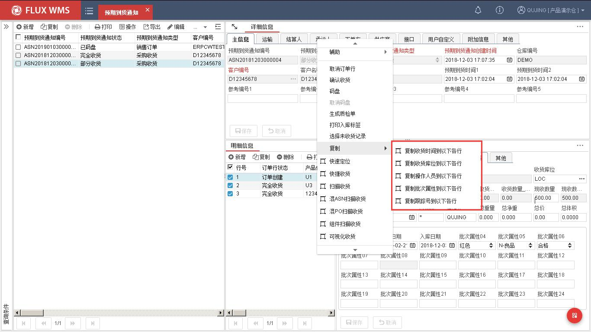

    - 复制收货时间到以下各行

正常收货操作或 RF 收货时，系统会自动记录当前时间作为收货时间，并将收货日期作为批次属性 3 的入库日期。

但纸单作业模式下，如果单证人员第二天才根据反馈单证，补操作前一天的入库确认，此时需要在“收货”页签修改收货时间。或者订单分多次入库情况下，可以修改每次的到货时间。

由于系统支持每行明细多次入库，但每行逐一修改操作不便，因此可以选择一行记录，修改到货时间后，以此作为母本，通过鼠标右键的“复制收货时间到以下各行”的功能，批量更新多行的收货时间。

由于每行的收货时间可能不同，因此系统并非更新所有行，而是从母本行向下的各行进行批量更新。

    - 复制收货库位到以下各行

类似复制收货时间，修改订单行的收货库位后，批量复制到母本行向下的其他各行。

类似的批量复制功能，还包括复制操作人员、批次属性、服务信息、跟踪号

## 9.6. 上架

在产品清点收货后，进入仓库存储时，仓库的工作人员核对无误后，将产品摆放到指定的库位，

<!-- 原 PDF 第 272 页 -->

这一动作，我们称之为上架。最常见的上架动作就是把货物从收货/卸货平台，搬运到最终存储库位上。上架操作，不影响库存数量，仅涉及到产品的储位变化（由收货暂存区变更为具体存储库位）。但系统为了避免仓库内作业混乱，在没有启用交叉理货（CrossDock）管理的情况下，未上架库存不可出库，因此上架完成后，库存变为可用库存才能用于订单拣货。

- **上架单据**

使用纸面单证操作流程中，用户可打印上架任务清单，指导操作人员执行上架操作。如果使用 RF 操作，则根据流程设计需要，打印对应的收货标签或者上架上架标签。

  - 选择“入库操作”下的“预期到货通知”。

  - 通过查找，选择需要打印单据的 ASN。

  - 在 ASN 表头部分通过鼠标右键菜单，在单据打印子菜单中，选择上架任务清单进行打印。

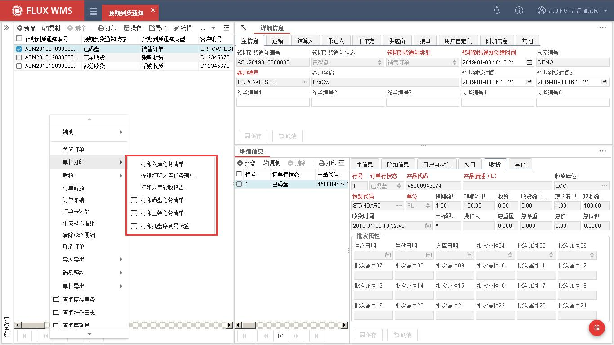

  - 如果需要打印上架标签，可在明细部分的上架列表或上架明细页签，选择待上架记录（或鼠标右键菜单全选，选择全部记录），然后通过明细部分的鼠标右键打印上架标签。

- **上架确认**

<!-- 原 PDF 第 273 页 -->

仓库完成上架操作，需要在系统中确认上架完成（同样可通过 RF 执行上架操作，详见 RF 操作手册）。

  - 选择“入库操作”下的“预期到货通知”。

  - 通过查找，选择所需的 ASN。

  - 在 ASN 明细部分，上架页签中，选择所要上架的产品行（也可通过全选一次性选择全部记录），依次输入如下信息：

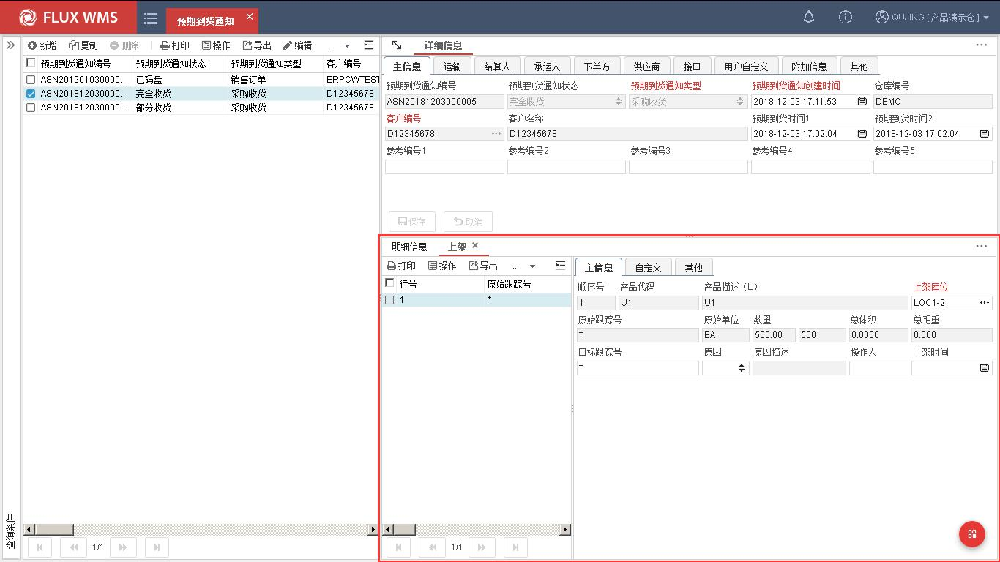

上架时间－产品上架操作的执行时间。默认为当前时间，可修改。

目标库位－产品的最终储存库位，可以是系统按照上架规则计算得出，也可以由用户自行修改录入。

原因代码－异常操作时输入/选择原因代码。例如不使用系统计算的目标库位，而人为指定存储库位。一般根据具体管理要求选择是否需要输入原因。

目标跟踪号－默认同原始跟踪号。如果有拆分托盘上架的情况，用于记录所使用的新托盘/跟踪号。

操作人员－执行上架操作的具体人员。

  - 可通过鼠标右键菜单的“复制上架时间到以下所有行”、“复制操作人员到以下所有行”，“复制目标库位到以下所有行”进行信息复制。

<!-- 原 PDF 第 274 页 -->

  - 点击鼠标右键菜单中的“确认上架”，系统执行上架确认操作。

  - 上架完成，上架列表中记录刷新。即上架列表中仅显示需要执行上架操作的记录，而不显示已经完成的上架操作。如需察看上架历史记录，可到库存事务查询或者任务管理中查看。

## 9.7. 质量检验

在入库操作过程中，部分情况下要求仓库执行质量检验操作，这同样是仓库服务的延伸。FLUX WMS 提供的质量检验模块，就是针对于货物质检操作进行管理。

入库质检，质检对象基于 ASN 单据，可在收货前进行，也可在收货后进行质检。但质检的数量并不一定与 ASN 数量一至（全检），也可能是按比率，或者按一定数量要求进行抽检。

入库前质检操作时，货物还没有接受入库清点，因此系统中也还没有这批库存。通常质检的结果将决定货物是否能够收货入库。

入库后质检，比较常见的是收货后、上架前，未质检产品可进行上架控制，不能用于出库拣货。

### 9.7.1. 质检操作

- **质检单创建**

质检单创建之前，需要先对产品的检验规则进行设置，以便系统了解这种产品是需要全检，还是按批量抽检，或者是按比率抽检。质检规则的设置，可参考基础设置部分的描述。

质检单创建的来源是 ASN，可在 ASN 表头鼠标右键菜单中，选择“质检”-“生成质检单”功能，整单创建对应质检单。也可以在 ASN 明细部分，选择行记录，然后点击鼠标右键“生成质检单”，根据所需明细行创建质检单。

系统根据 ASN 的期望数量，和产品质检规则要求，计算应检数量，创建对应质检单据，并跳转到质检单界面，显示相应单据。

质检单具体字段如下：

  - 质检单表头

<!-- 原 PDF 第 275 页 -->

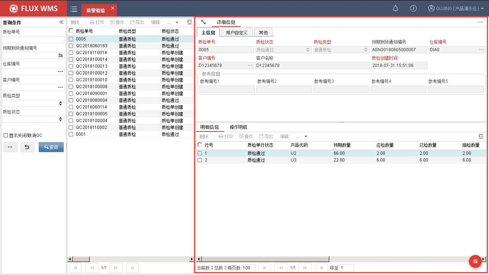

质检单号－单证号，由系统根据流水号规则自动生成。

QC 类型－质检单据类型。

QC 状态－单据执行状态。默认为创建，由系统根据单证执行情况更新状态。

客户编号－客户代码

QC 创建时间－单据生成时间

预期到货通知编号－质检单对应的 ASN 单据号码。

仓库编号－质检单所属仓库

参考信息 1~5－单证参考信息

  - 质检单明细

<!-- 原 PDF 第 276 页 -->

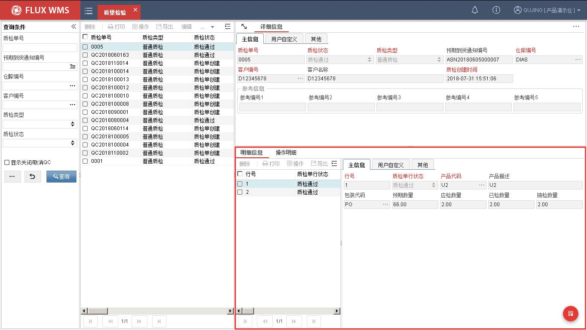

质检单行号－质检单行号。

质检单行状态－单据行执行状态。默认为创建，由系统根据单证执行情况更新状态。

产品编号－待质检的产品代码

产品描述－产品对应描述

包装代码－ASN 中产品所用包装代码

单位－ASN 中产品默认收货单位

预期数量－ASN 中待收货数量

应检数量－由系统根据产品质检规则计算的待质检数量。可由用户根据实际情况修改。

已检数量－已经质检过的产品数量。注：质检过，并不意味着都是合格品。

批次－产品批次属性内容。仅显示供质检人员参考。

质检单据信息来源于 ASN，并且不可随意修改。

- **质量检验操作**

依据质检单进行产品质量检查时，可记录质检的详细结果：

  - 在质检单明细部分，选择产品记录。

<!-- 原 PDF 第 277 页 -->

  - 选择操作明细页签，在主信息页面，点击【新增】按钮

  - 依次输入如下信息，并保存：

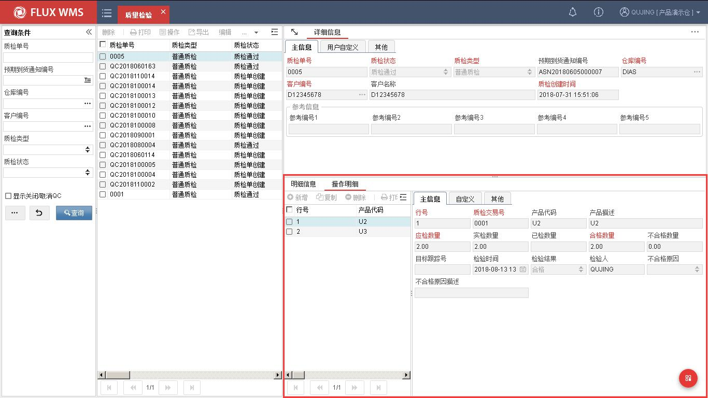

质检行号－对应质检单明细行的行号

质检交易号－系统自动生成的流水号

产品编号－待质检的产品代码

应检数量－需要质检的产品总数量

实检数量－本次检验的产品数量

已检验数量－完成质检的产品数量，不论是否合格。

合格数量－通过质检的产品数量。

不合格数量－问题产品数量。由系统根据实检数量、合格数量计算得出。

目标跟踪号－质检品所用托盘号/箱号信息。

检验结果－本批次产品检验结论。通常在质检中由于不同产品不同情况下允许的次品率不同，因此质检后，整批产品是否确认通过质检、可以收货，需要进行判断。

检验时间－质检时间

<!-- 原 PDF 第 278 页 -->

检验人－质检操作人员

  - 执行质检后（即保存质检操作明细），ASN 对应明细的质检状态同样会进行刷新。

- **质量检验后续处理**

  - 收货数量控制

收货前质检，质检完成后会相应更新质检单、对应 ASN 记录信息。通过 QC_RCV_CTL 参数设置，控制收货时是否需要校验质检情况。

参数为 Y，质检完成才能收货

参数为 C，可以一边质检一边收货。Y 与 C 情况下，需要根据质检结果判断是否需要受控收货。

参数为 N，收货时不检查质检情况。

质检时的“检验结果”下拉框内容，可在系统代码中配置，不同检验结果，收货处理不同，根据系统代码的“用户自定义 1”字段控制不同的收货处理：

UDF1=PASS，正常收货，不受限

UDF1=NOPASS，拒绝收货，即不可收货

UDF1=CONTROL，受控收货，收货上限=订单数量-不合格品数量（即使设置了可以超量收货）

  - 上架控制

如果是收货后质检，系统根据 QC_PTA_CTL 参数控制，是否必须质检后才能上架。如果参数开启，检验结果的影响是：

UDF1=PASS，可以上架

UDF1=NOPASS，不可以上架

UDF1=CONTROL，可以上架

  - 质量检验属性处理

普通情况下，质检到产品级，如果产品不合格，需要以不良品身份入库，通常在质检后，收货时录入不良品批次属性。

但如果是收货后质检，此时已有库存，并且库存通常以默认的良品（或者待检）属性入库，需要在质检后进行属性变更。此类业务情况，需要开启 QC_FRM_TRN，根据 ASN 收货交易、收货数量，生成全检数量的质检单明细（不考虑质检规则中的抽检设置）。

<!-- 原 PDF 第 279 页 -->

此类质检单保存确认时，系统提示“需要同步转移变更批次属性，是否继续？”

如果用户选择确定，系统提取质检结果对应的信息（UDF2）执行库存转移，更新货物属性（批次属性 08），并重新计算上架。

如果用户选择取消，则终止，由用户重新修改质检确认信息、点击确认。

此类操作，不支持拆分记录，一行待检明细，需要一次确认。

### 9.7.2. 右键功能

- **表头右键功能**

表头部分鼠标右键功能项为：

  - 关闭质检单

已操作质检单关闭，不允许再进行修改或者质检确认。

  - 汇总信息

所选单据的信息弹出窗口汇总查看。

  - 清除质检单明细

删除所选质检单的全部明细记录（创建状态才可操作），通常用于需要重新添加质检明细的情况。

  - 取消质检单

通常是创建状态的质检单进行取消，不再操作质检，不能做任何修改、确认。但单证可以查询到。

  - 打印质检单

打印质检清单，用于核对检查。

- **明细右键功能**

明细部分鼠标右键功能项为：

  - 确认质检通过

当质检作业无需精细化控制，只按质检单明细行确认是否质检通过，可以使用此右键功能，无需录入详细质检数量等操作明细信息。

<!-- 原 PDF 第 280 页 -->

  - 重新计算应检数量

根据 ASN 期望数量生成质检单，但实物分批抵达，部分收货后发现剩余数量与期望值差异较大，ASN 中修改期望数量之后，质检单中的应检数量也需要重新计算。通过此功能可以根据 ASN 信息更新质检单相关应检信息。

  - 查询产品档案

点击后，跳转到产品档案界面，并按照质检明细行产品代码、货主代码作为默认查询条件，查询产品档案记录，方便质检人员核对产品相关信息。

  - 检索

点击后系统显示查询二级窗口，通过对 SKU 代码的模糊查询，定位到对应的行记录。

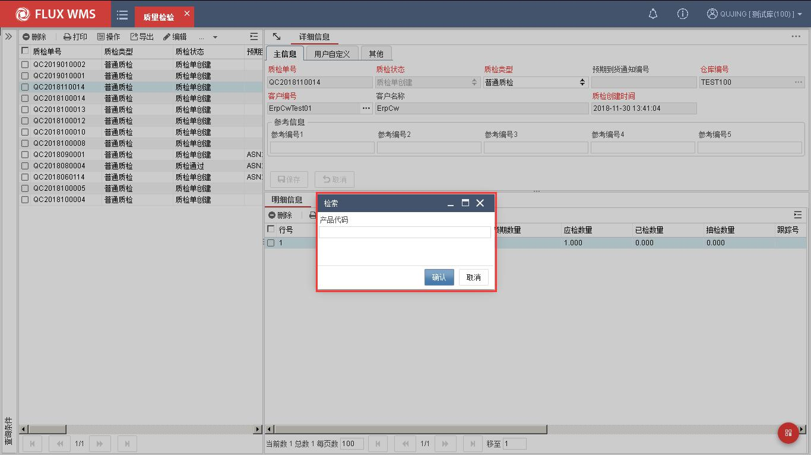

## 9.8. 取消收货

在部分情况下，存在收货后反向操作的需求，或者误操作需要修正。系统提供取消收货功能，可将状态回复到收货前的创建状态，重新进行收货确认。

但不是所有操作都能够反向取消。收货、上架 2 步操作的情况下，一旦确认上架，就不能操作取消收货。

<!-- 原 PDF 第 281 页 -->

- **取消收货操作**

  - 选择“入库操作”下的“取消收货”。

  - 点击查找页面，输入对应查询条件：ASN 编号－单证的编号。ASN 行号－指定的单证行号。客户－货主代码。产品－产品代码。事务编号－收货交易事务的 ID。

  - 点击【查询】按钮。

  - 在明细页面的列表浏览窗口，选择所要取消的收货行（可多选），点击鼠标右键菜单中的“取消收货”功能项。

  - 系统显示确认提示信息，点击【确认】，完成取消收货反向操作。

- **原因记录**

取消收货时，可以通过“原因代码”、“原因”字段记录取消收货的原因，以供未来查看。也可录入一行原因后，通过鼠标右键菜单功能的“复制取消原因到所有行”，将原因信息批量复制。

## 9.9. ASN 编组

退货入库时，经常需要将多张订单的产品整理为单一 SKU，即同品合并，以便产品再销售。每单逐一整理，效率不高。可以考虑将多张订单整合后共同整理，配合电子标签、入库扫描等设备或流程，进行退货播种分货，提升作业效率。

ASN 编组，就是出于此目的考虑，将多张预期到货通知单据（ASN）组合，以便货物整理。

- **创建 ASN 编组**

  - 选择“入库操作”下的“预期到货通知”。

  - 通过查询条件，查询所需订单

  - 点击勾选多张订单，鼠标右键选择“生成 ASN 编组”功能。需要注意的是，所选订单需要是同一仓库、同一货主下的订单。

<!-- 原 PDF 第 282 页 -->

  - 系统将所选多张订单汇总，统计 SKU 重合度信息（重合度越高，播种带来的效率提升越大），并通过二级窗口展示，如下图

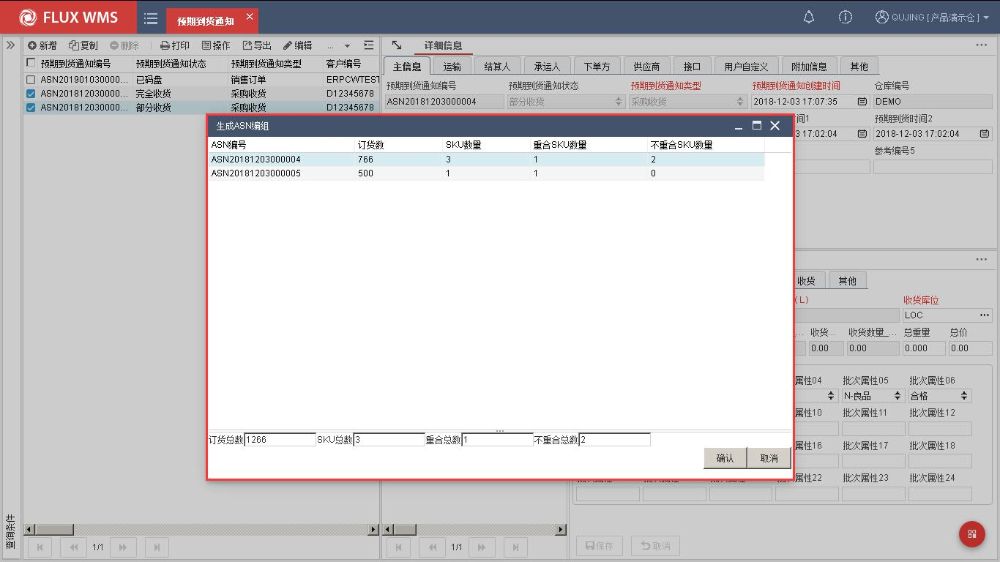

  - 点击【确认】按钮，系统根据所选 ASN，创建 ASN 编组，并提示操作结果

- **播种初分**

已创建成功的 ASN 编组，可在“入库操作”模块“ASN 编组”功能中查看。在不使用电子标签硬件的作业环境中，也可以通过 WMS 进行播种分货。

  - 选择“入库操作”下的“ASN 编组”功能。

  - 通过查询条件，查询所需编组。

  - 表头部分，显示单号、货主、播种墙类型等信息，用户可以根据需要进一步补充自定义信息。

<!-- 原 PDF 第 283 页 -->

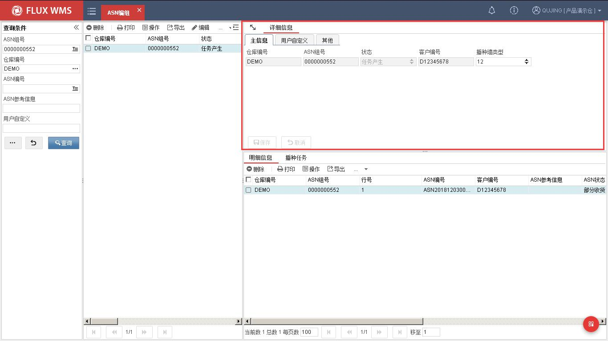

  - 明细部分，通过列表形式显示编组所包含的 ASN，可通过鼠标右键菜单功能删除记录：

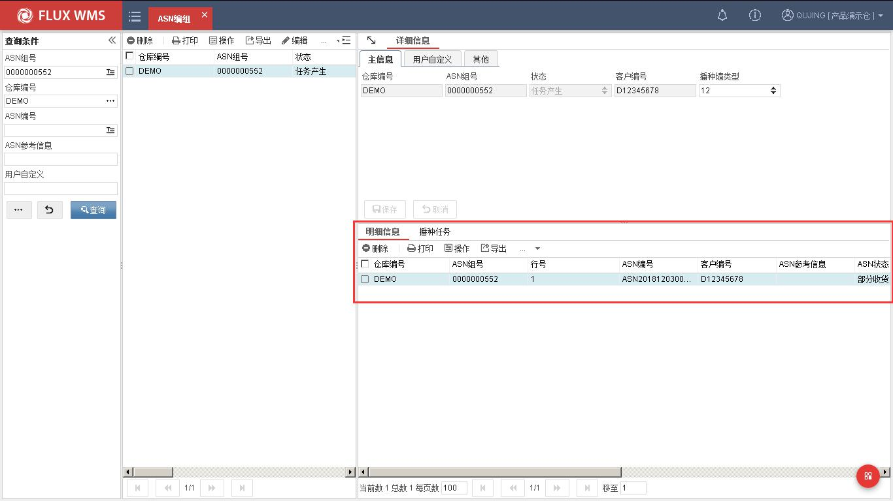

  - 确认无需改动的编组，通过表头鼠标右键菜单功能“生成播种任务”，系统弹窗确

<!-- 原 PDF 第 284 页 -->

认播种任务组合方式（如下图），由系统将编组所属 ASN 信息整合后，按参数

SKU_SRT_QTY 维护的播种墙库位个数，计算分货信息，并下达给分货设备，如

电子标签。操作此项功能后，编组的明细部分会显示“播种任务”页签，供用户查

看整合后的任务信息

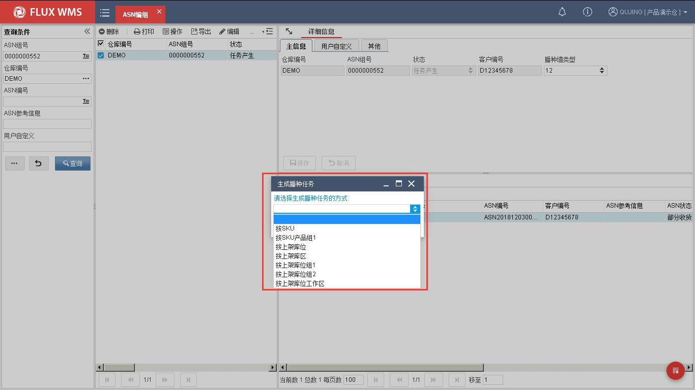

  - 不使用电子标签作业的环境中，可以通过 WMS 的代替功能实现分货操作。通过表头鼠标右键菜单功能“播种初分”，系统弹出播种二级窗口，如下图

<!-- 原 PDF 第 285 页 -->

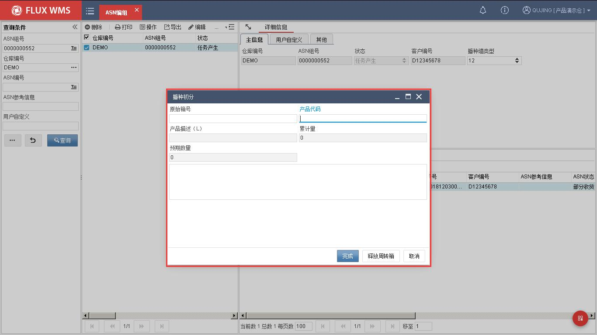

  - 按箱逐一分货情况下（入库有箱号）可扫描原始箱号定位，无原始箱号的作业模式下，可以直接扫描产品条码。

  - 每个分货位的首笔记录，系统弹出窗口要求扫描箱号、分货库位，如下图所示

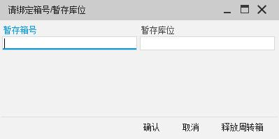

  - 后续作业，根据分货要求、首记录绑定分货位情况，系统提示产品的分货去向，协助用户完成分货。

  - 如分货所用周转箱已满，可点击【释放周转箱】按钮，后续扫描产品时，会提示绑定新箱号。

  - 通过 ASN 编组功能完成初分分货后，如需进行详细二分，可通过波次播种功能执

<!-- 原 PDF 第 286 页 -->

行。注：使用 RF 作业的情况下，可使用对应 RF 功能，产品初分、产品二分，完成类似 WMS 上的 ASN 编组初分、波次播种二分的操作。

- **动态播种模式**

固定播种位模式，是系统提前为任务分派好播种位，作业时操作人员扫描产品后，需要寻找系统提示的库位，而且产品随机扫描情况下，走动路径可能较长。因此系统还提供动态播种作业模式，任务下达时不绑定具体播种位，而是扫描产品时临时按次序绑定一个空播种位提示用户操作，可以减少人员走动距离。

动态播种模式，需要开启 PTL_SEQ_LOC 参数，后台处理不同，但用户具体作业步骤同固定播种位。

## 9.10. 收货异常处理

收货过程中，常有异常情况，货物被拒收。对于拒收的货物，如何进行后续处理，可通过收货异常处理进行跟踪管理，并且由采购/订单管理部门对异常情况给予处理意见，如退回，降等入库等。

- **收货异常处理**

  - 收货时，如果记录拒收数量、拒收原因，系统将拒收信息记录到收货异常信息中。

  - 在“入库操作”-“收货异常处理”功能中，用户可查询到记录下来的收货异常

  - 选择记录，通过鼠标右键菜单功能“审核意见”，可在弹出框中选择异常记录的处理意见，如下图。审核意见下拉列表内容，在系统代码中维护

<!-- 原 PDF 第 287 页 -->

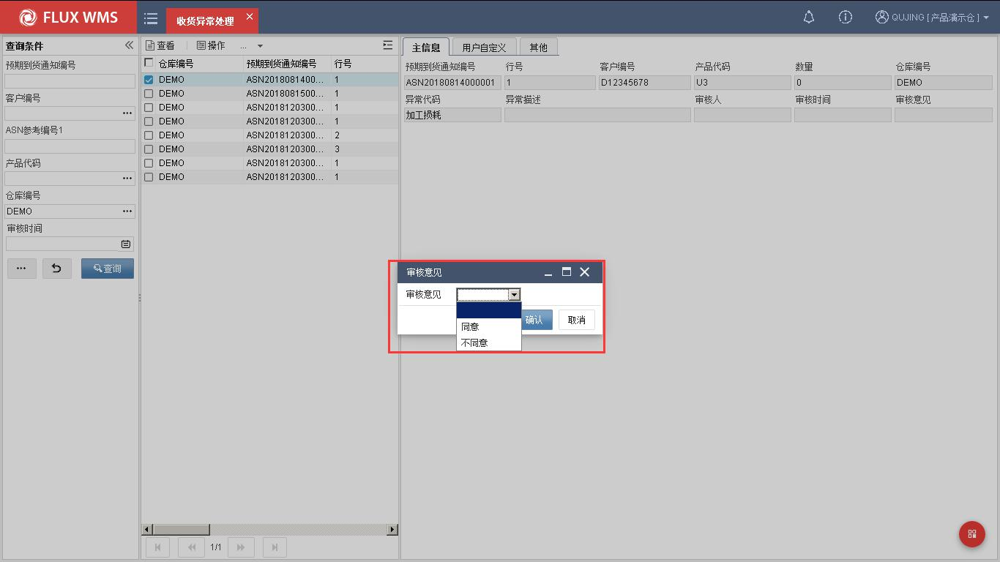

## 9.11. 入库序列号查询

用于集中查看收货序列号情况。

- **入库序列号查询**

  - 选择“入库操作”下的“入库序列号查询”功能

  - 输入查询条件，点击查询按钮获取详细信息

  - 如果是一级序列号，只在表头部分显示；如果具有二级序列号，则在明细部分对应显示。

<!-- 原 PDF 第 288 页 -->

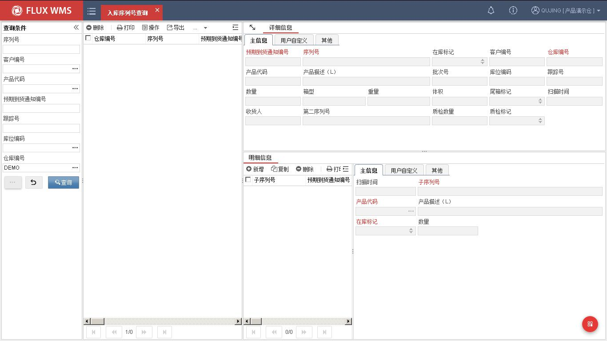

- **鼠标右键功能**

  - 修改序列号

问题序列号修正。选择需要修改的记录，点击右键功能项后，在弹出框中录入正确的序列号。
