# 10. 库存管理

> 来源：`富勒WMS系统用户手册_V6_高清版（维他命）.pdf`，原 PDF 第 289 页起。
> 本文件按原 PDF 正文标题拆分；原文截图已提取至同目录 `assets/`。

<!-- 原 PDF 第 289 页 -->

## 10.1. 概述

库存管理是仓库日常操作的一个重要的组成部分。只有高效、准确的库存管理才能保证货物及时、准确的出库，并同客户保持良好的信息沟通。

库存管理的内容主要包括：

  - 库存余量查询

  - 库存事务查询

  - 库存冻结/释放操作

  - 库存调整操作

  - 库存移动操作

  - 库存转移操作

  - 库存盘点操作

## 10.2. 库存余量

库存管理中经常会出于各种目的需要了解货物在仓库中的储存情况，包括货主、品名、数量、库位、属性、分配情况等信息，这就可以根据不同的要求使用“库存余量”功能来查询。同时，库存余量可以通过不同角度的查看方式，满足不同管理角色的用户对库存信息的了解要求。

准确的库存信息，是出库及时、准确的保障前提。

- **库存余量查询**

  - 选择“库存管理”下的“库存余量”。

  - 如下图，在查询页面中输入以下查询条件：

<!-- 原 PDF 第 290 页 -->

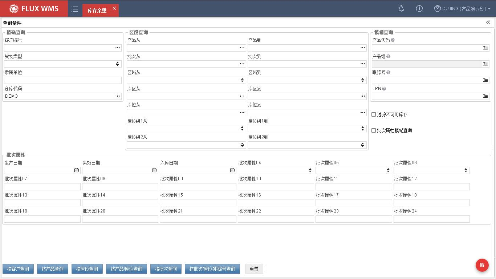

    - 精确查询：

查询结果与查询条件精确匹配，从……到的查询条件则是可以针对信息区间进行查询。具体字段说明如下：

客户－所要查询的货主代码。

货物类型－产品所属货物类型。

产品－所要查询的产品代码。

库位－所要查询的库位。

区域－所要查询的区域。

库位组 1－所要查询的库存所属库位组 1。

库位组 2－所要查询的库存所属库位组 2。

上架区－所要查询的库存所属上架库区。

拣货区－所要查询的库存所属拣货库区。

批次－所要查询的库存批次号码。

隶属单位－所要查询的客户所属隶属单位代码。

<!-- 原 PDF 第 291 页 -->

仓库－所要查询的库存存储仓库。

    - 模糊查询：

可以按照产品、产品组，或者跟踪号、LPN 号码模糊查询，查询包含输入条件的全部库存。例如输入产品 MO 模糊查询条件，能够查询到产品 MOUSE 和 MODEL 以及 AL234MO2 等全部包含 MO 的库存记录。

注：LPN 号码，是二级跟踪号管理模式中的托盘号层级跟踪号码。

    - 批次属性：

批次属性查询部分，与客户对应的，客户所用批次属性规则内容，根据所选客户动态显示。可以通过勾选“批次属性模糊查询”选项，控制是否对批次属性内容进行模糊查询。

    - 过滤不可用库存：

如勾选，查询结果隐藏可用库存为 0 的记录。例如全部被冻结的库存记录。

  - 根据需要选择不同的查询方式：

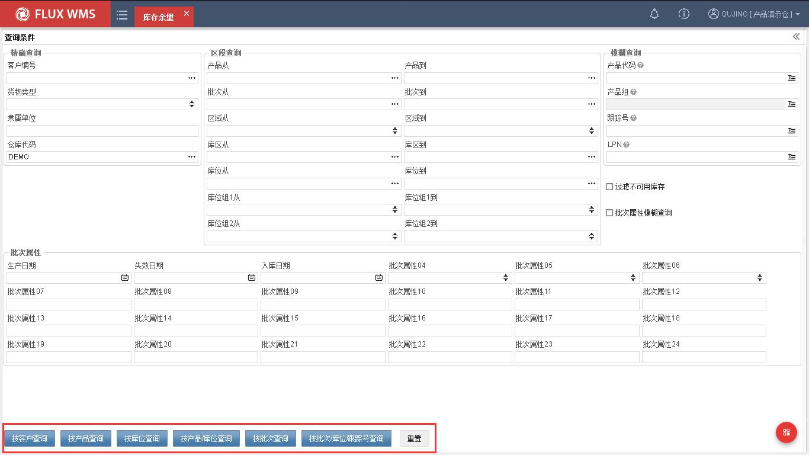

  - 按客户查询根据客户 ID 进行查询，显示客户级的汇总库存信息

  - 按产品查询

<!-- 原 PDF 第 292 页 -->

根据产品进行查询，展示产品库存情况，但忽略存储位信息。相关数量信息为：

库存数量－该产品的总数量。

其他/整托/整箱/内包装/零件－按产品包装设置换算的对应包装数量。

分配数量－该产品已经被订单分配锁定的总数量。

冻结数量－该产品不可操作的库存数量。

可用数量－该产品库存中除去被冻结和被（预）分配之外，可以用于新发运订单的库存数量。入库具有上架任务，但尚未上架确认的库存，同样不可用。

  - 按库位查询查询库位存储情况。忽略产品相关信息，仅显示库位中的数量、体积等信息。

  - 按产品/库位查询查询产品在不同库位的存储情况。补货待上架数量－补货任务待操作数量。同一补货任务，对于来源库位锁定为补货待下

架数量；对于补货目标库位，锁定为补货待上架数量。

待上架数量－上架任务待操作数量

待移入数量－移库任务待操作数量。同一移库任务，对于来源库位锁定为待移出数量；对于目标库位，锁定为待移入数量。

补货待下架数量－补货任务待操作数量。同一补货任务，对于来源库位锁定为补货待下架数量；对于补货目标库位，锁定为补货待上架数量。

待移出数量－移库任务待操作数量。同一移库任务，对于来源库位锁定为待移出数量；对于目标库位，锁定为待移入数量。

  - 按批次查询查询产品的库存批次相关信息内容。批次－库存的批次号（可参考基础设置批次属性部分）。订货数－默认为空，用于根据库存生成单证。批次属性内容－该批次产品具体的批次属性内容。根据产品对应的批次属性规则显示。通过鼠标右键菜单的“查询预配数”功能，可显示批次库存预分配情况。

  - 按批次/库位/跟踪号查询

<!-- 原 PDF 第 293 页 -->

查询最明细的库存信息

跟踪号－库存的跟踪号。

LPN－二级跟踪号管理模式中的托盘级跟踪号。

订货数－默认为空，用于根据库存生成单证。

补货待下/上架数量－补货任务待操作数量。同一补货任务，对于来源库位锁定为补货待下架数量；对于补货目标库位，锁定为补货待上架数量。

待上架数量－上架任务待操作数量

待移出/入数量－移库任务待操作数量。同一移库任务，对于来源库位锁定为待移出数量；对于目标库位，锁定为待移入数量。

待调整数量－调整单待执行数量

- **分页鼠标右键菜单**

其余右键功能，各个页签内容有所不同，项目最多的是按批次/库位/跟踪号查询模式：

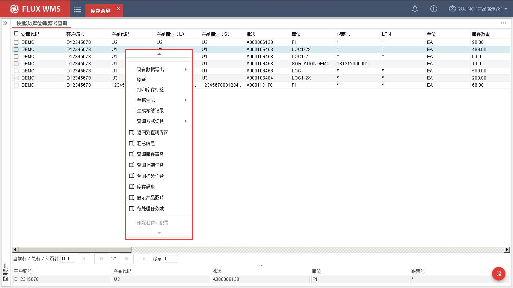

  - 查询库存事务

针对所选记录，跳转到库存事务查询界面，将客户、产品等作为默认查询条件，可查询相应库存事务记录。

<!-- 原 PDF 第 294 页 -->

  - 查询上架任务

针对所选记录，跳转到任务管理的上架任务功能，根据货主、产品代码查询库存记录对应的上架任务。上架任务功能，可参考任务管理部分的介绍。

  - 查询拣货任务

针对所选记录，跳转到任务管理的拣货任务功能，根据货主、产品代码查询库存记录对应的拣货任务。拣货任务功能，可参考任务管理部分的介绍。

  - 打印库存标签

针对查询所得的库存，打印库存标签。

  - 单据生成：

    - 生成发运订单/移库单/转移单/冻结单/拆箱单/增值服务单

根据所选记录生成对应单据。数量为订货数字段输入的数量，如果订货数字段为空，则默认为记录的可用余量。

    - 添加到当前发运订单

选中的记录，添加到操作员所创建的、当前仍旧是创建状态的首个订单中。如果没有相应订单，由系统自动创建。

  - 生成冻结记录

将所选库存记录冻结。系统自动在冻结功能中添加相应冻结记录。

  - 库存码盘

对已在库的大批量库存进行托盘化整理，生成不同的标签。

  - 显示产品图片

对于有维护过产品图片的库存记录，可通过此功能，在库存余量界面选择记录，显示产品图片，方便用户比对。

  - 待处理任务数

库存记录相关的任务，可能是待上架任务、待补货任务等各种类型，默认隐藏，点击此右键功能后，进行显示。

<!-- 原 PDF 第 295 页 -->

## 10.3. 库存事务

库存事务功能用于记录产品在系统中的所有活动，用户可查看、追溯系统历史操作记录。同时，由于库存事务中详细记录了每个操作的人员、始末时间、交易数量和交易单号，因而也常用于辅助仓库统计员工的绩效考核。

- **库存事务查询**

  - 选择“库存管理”下的“库存事务”。

  - 根据需要输入查询条件，发起查询，系统查找对应的记录并显示：

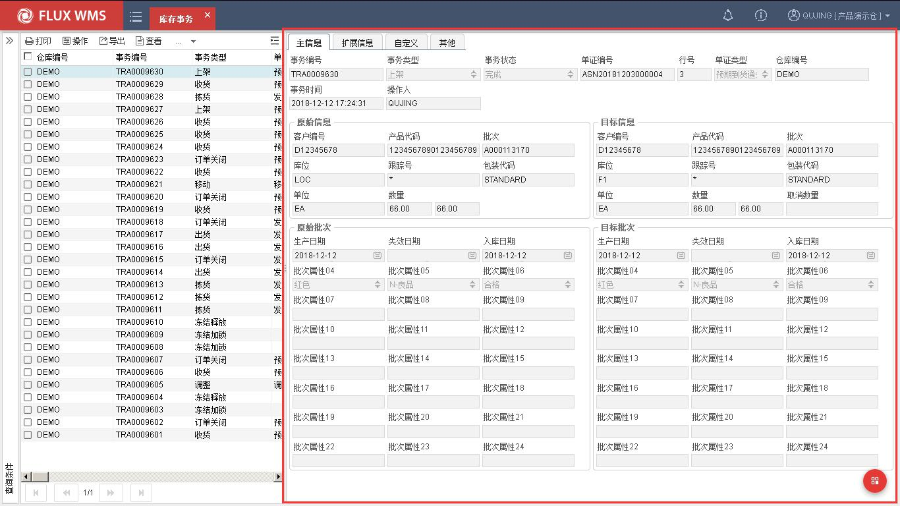

事务编号－系统自动生成的事务流水号。

事务类型－操作事务分类，如上架、发货等。

事务状态－操作情况，如完成、取消。

单证号－操作事务对应的单证号。

单证行号－操作对应的单证行号。

单证类型－操作对应的单证类型，如 ASN（预期到货通知单）、SO（发运单）等。

仓库编号－操作记录发生的仓库代码。

<!-- 原 PDF 第 296 页 -->

事务时间－操作发生的时间。

操作人员－记录的操作人员执行人员。如上架人、拣货人等。通常使用 RF 进行操作时，操作人员即是系统人员。但使用打印单据操作，执行实际操作，与最终在 WMS 系统中确认操作完成的，有可能是不同的作业员（例如收货员收货，单证员在系统中确认收货完成）。此时执行系统确认时，可以录入操作人员信息。

系统人员－系统操作人员 ID。

原始信息－操作进行前的库存信息情况。例如调整前库存数量与调整后数量不同。

目标信息－操作进行后的库存信息情况。例如转移前的 SKU 代码有可能与转移后不同。

客户编号－操作前后客户代码（例如转移操作可以修改客户代码）

产品－操作前后产品代码（转移操作可以修改产品代码）

批次号－操作前后产品所具有的批次号

库位－操作前后产品所在库位。

跟踪号－操作前后产品的跟踪号。

包装代码－操作前后产品所用包装。

单位－操作前后所用的数量单位。

库存数量－操作前后的产品数量，以所选单位值为数量单位。后一字段为对应的主单位数量。

取消数量－部分取消收货情况下的取消数量。因此只在操作后的部分显示

批次属性－涉及的产品记录操作前后的批次属性值内容。

  - 附加信息页签，显示其他附加信息：模块 ID－执行操作的功能模块 ID。工作站－执行操作的工作台 ID。原因－操作时所选原因代码及描述。如调整原因。上架任务编号－任务号上架顺序－任务拆分时的顺序号 QC 任务编号－任务号

<!-- 原 PDF 第 297 页 -->

QC 顺序－任务拆分时的顺序号

接口发送时间－接口发送时间

接口发送标记－接口发送成功标记

## 10.4. 库存冻结单

在某些情况下，会由于各方面原因，不允许仓库中的部分产品出库发运，例如某批次产品过保质期，或者需要等待检验批文才能出库，甚至货主通知某些产品暂时不能出库等等。

FLUX WMS 在提供自动冻结过期库存（启用保质期管理的情况下）功能之外，还提供了库存冻结功能，能够根据不同情况将库存冻结、锁定，能够帮助用户对产品的操作进行控制，不再需要人工记忆不同客户、不同原因的封货指令。

库存批量冻结处理，或者需要分步审核的业务情况，可以通过库存冻结单来实现冻结操作，以单据形式管理库存冻结。对库存的影响则是冻结后不可进行出库操作，即冻结库存不参与分配。

- **库存冻结单**

  - 选择“库存管理”中的“库存冻结单”。

  - 点击【新增】按钮，在表头的主信息页签，输入客户编号并保存。

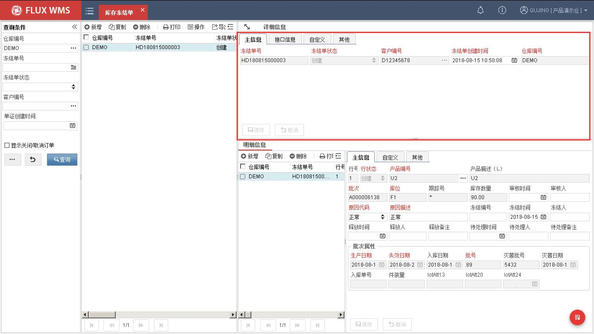

<!-- 原 PDF 第 298 页 -->

  - 明细信息部分，点击【新增】按钮后，通过 SKU 浏览按钮，在二级窗口中选择库存记录（系统会过滤 0 库存记录信息）并确认，返回主信息界面，维护冻结原因、描述，保存记录。

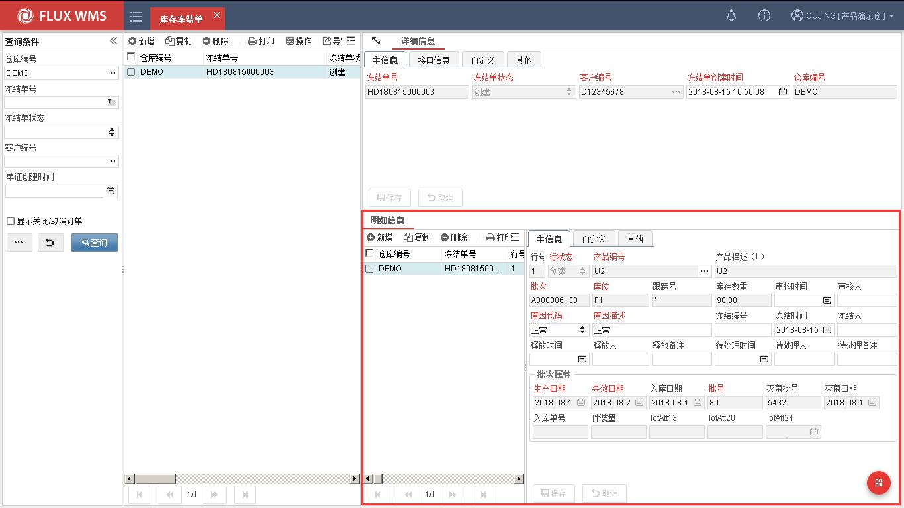

  - 选择明细行记录，通过鼠标右键菜单功能，对待冻结记录进行审核。

  - 已审核记录，可通过鼠标右键功能执行冻结。

- **鼠标右键功能项**

  - 表头右键菜单：

<!-- 原 PDF 第 299 页 -->

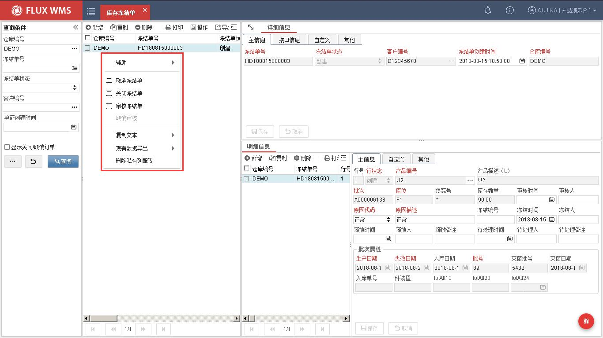

    - 取消冻结单

单据取消，已操作单据不可取消。

    - 关闭冻结单

关闭单据，结束作业

    - 审核冻结单

对冻结单进行审核。已审核单据才能执行冻结

    - 取消审核

已审核单据，还原到创建状态以便进行修改。

  - 明细右键菜单：

<!-- 原 PDF 第 300 页 -->

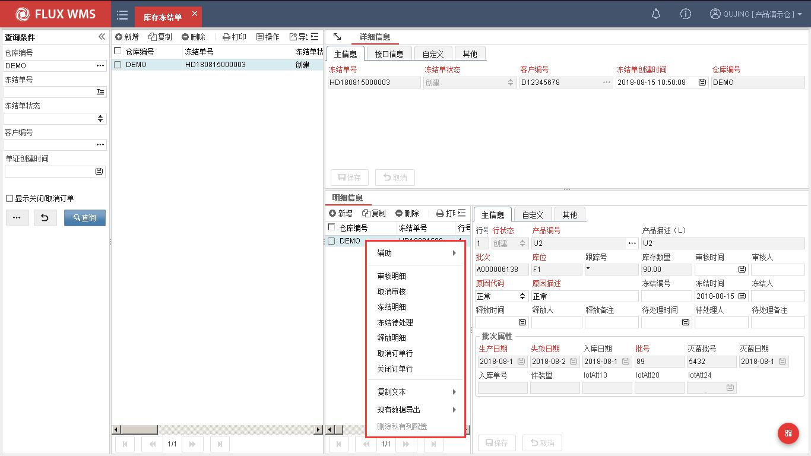

    - 审核明细

对所选明细行记录进行审核确认。

    - 取消审核

对所选明细行记录进行取消审核，以便修改信息。

    - 冻结明细

对所选明细行记录进行取消审核，以便修改信息。

    - 冻结待处理

将明细行状态更新为“冻结待处理”，等待用户检查确认后做相关处理。常用于需要等待 ERP 确认的业务场景。

    - 释放明细

已冻结记录解除冻结，释放库存。

    - 取消订单行

创建状态行，取消，不再进行操作

    - 关闭订单行

<!-- 原 PDF 第 301 页 -->

操作完成的订单行关闭，不允许再做操作。

## 10.5. 库存转移单

有很多情况下，仓库需要对库存产品的信息进行修改。例如根据货主通知，原本 A 产品要全部更名为 A1 产品；或者产品拆小包装后发现实物上的批次属性值（如生产批号）与入库时客户提供的单证上的记录不一致，批次属性内容需要修改。

也有些情况下，库内两个不同货主间进行货物交易，可以直接进行货权变更，实物无需拣货、出库再入库、上架。

FLUX WMS 的提供库存转移单功能，可以批量改变产品的相关信息，包括货主、品名等等。但库存总量保持不变。

- **库存转移单操作**

  - 选择“库存管理”下的“库存转移单”。

  - 点击【新增】按钮，在表头主信息页签依次输入：

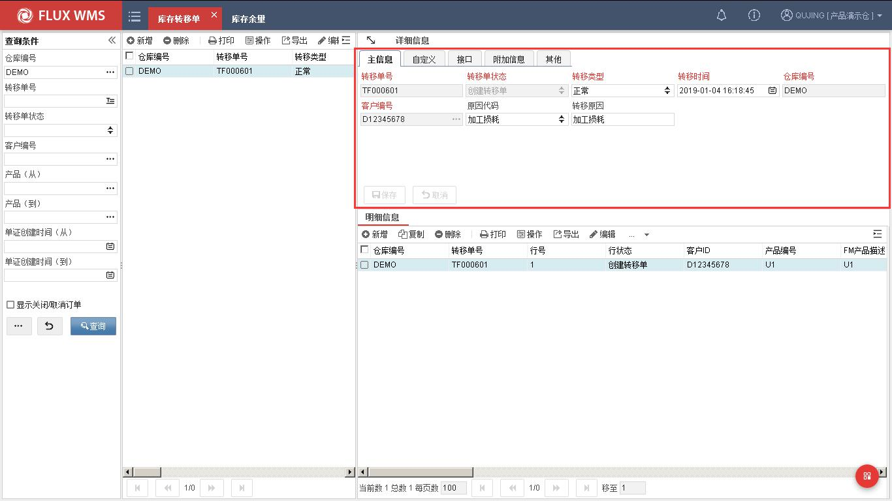

仓库代码－单据所属作业仓库

转移单号－系统自动生成的单证号。

<!-- 原 PDF 第 302 页 -->

转移单状态－单证状态，默认为创建状态。

转移类型－单证类型，用于区分不同的库存转移单。

客户编号－输入或选择待转移操作的货物所属的货主代码。

创建时间－库存转移单创建时间

转移时间－转移操作执行时间，默认为订单创建时间。

转移代码－转移原因代码

转移原因－转移原因说明，默认为同原因代码。

创建人－单据创建的操作人员

来源－根据 SO 创建移库单时，系统记录的单据来源

来源单号－根据 SO 创建移库单时，系统记录的 SO 号码

  - 点击【保存】按钮，保存转移单头信息。

  - 在“附加信息”页签，可见转移单的来源单号、行号。如果是从 SO 创建的转移单，会记录对应信息。

  - 在转移单明细部分，点击【新增】按钮，通过点击产品浏览按钮，系统显示库存选择二级窗口。输入所需的产品代码并查询，选择需要修改信息的库存记录，双击选择。

  - 系统返回转移单页面，并显示所选库存记录的相关内容。用户在“转移信息”部分，输入此次转移操作影响到的库存数量，并根据实际需要修改目标批次等信息内容。

<!-- 原 PDF 第 303 页 -->

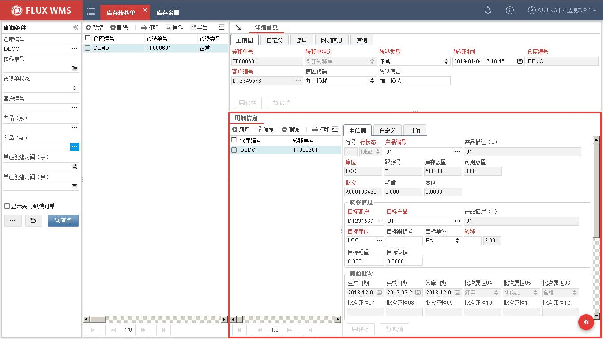

  - 修改完成后，保存明细。

  - 库存转移单创建完毕，由相应人员进行审核，可打印转移申请单据。审核后，通过表头鼠标右键菜单确认审核。

  - 已审核单据，选择需要执行信息变更、转移的记录，或通过右键菜单全选。

  - 明细部分，鼠标右键菜单选择功能“执行转移”，系统执行库存转移。

注：转移单也可以通过库存余量生成。在库存余量按批次/库位/跟踪号查询方式界面，选择记录、修改订货数，通过鼠标右键菜单功能项“生成库存转移单”可生成指定产品的库存转移单，后续操作相同。

- **鼠标右键菜单**

  - 表头右键菜单：

在转移单表头部分的导航窗口中，点击鼠标右键，系统显示相应右键菜单如下

<!-- 原 PDF 第 304 页 -->

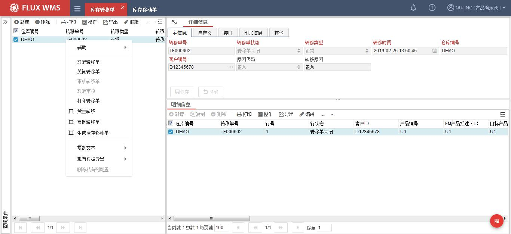

    - 取消转移单－转移单取消，不再操作，也不可修改。

    - 关闭转移单－已执行转移单关闭，不可再修改。

    - 审核转移单－确认转移单通过审核，能够执行后续转移操作。

    - 取消审核－仅对通过审核的单据有效。将单据恢复到未审核状态。

    - 货主转移－在转移单中，需要批量修改货主时使用。选择后，系统显示货主选择二级窗口，并将所选择的货主代码更新到全部明细的转移客户字段中。不再需要人工逐一修改。

    - 打印转移单－打印纸面单证，用于指导仓库内实物操作。

    - 生成库存转移单 -部分业务场景，需要分步操作库存转移、库存移动。点击"生成库存移动单"后，系统会基于已完成转移操作的库存转移单（状态为“转移完成” 和“关闭”的单证）自动生成对应库存的库存移动单。

  - 明细右键菜单：

<!-- 原 PDF 第 305 页 -->

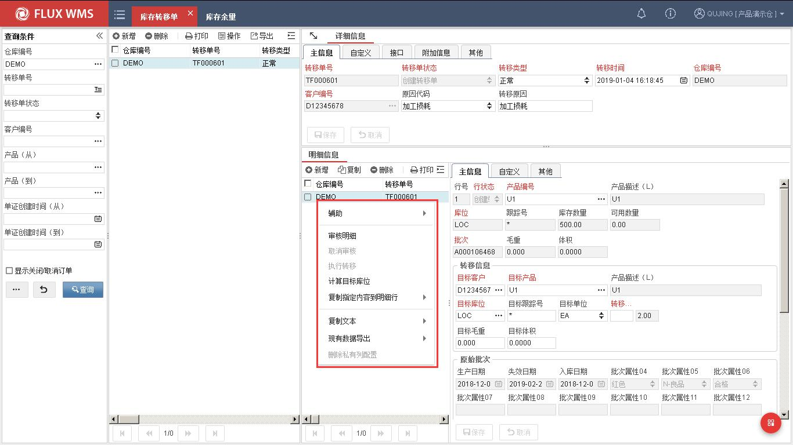

    - 审核明细－所选明细行审核确认

    - 取消审核－所选明细行取消审核

    - 执行转移－所选明细行记录，确认执行转移操作。

    - 计算目标库位－根据上架规则，为产品计算上架库位，作为转移后的目标库位。

    - 复制指定内容到明细行－将当前明细记录作为模版，把所选记录的货主，跟踪号，或者库位，批次属性内容批量更新到其他行的对应信息字段。

## 10.6. 库存调整单

在仓库操作和管理中，难免会发生一些不可避免的人为错误或库存异常，例如收货数量输入错误或者盘点时发现某库存产品短少。为了尽可能的达成系统数据准确，进而保障系统操作的正确性，需要及时将系统数量与实际库存调整一致。此时，就能通过 FLUX WMS 的库存调整单功能来实现库存的准确性维护。

- **库存调整单操作**

  - 选择“库存管理”下的“库存调整单”。

  - 点击【新增】按钮，在表头的主信息页签，依次输入：

<!-- 原 PDF 第 306 页 -->

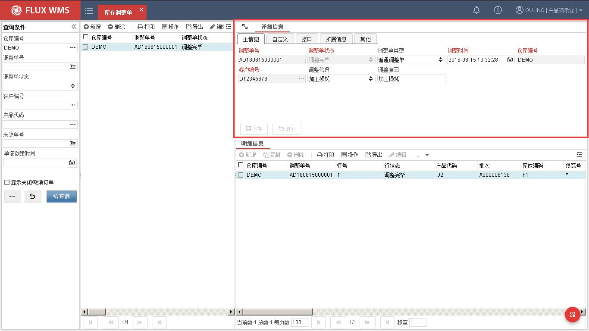

调整单编号－系统自动生成的单证号。

调整单状态－单证状态，默认为创建状态。

调整单类型－单证类型，用于区分不同的库存调整单。

调整时间－调整作执行时间，默认为订单创建时间。

仓库编号－单据所属作业仓库

客户编号－输入或选择待调整操作的货物所属的货主代码。

调整原因－调整原因代码

原因描述－调整原因说明，支持用户自行录入，默认为同原因代码。

创建时间－库存转移单创建时间。

  - 点击【保存】按钮，完成调整单头信息维护。

  - 在附加信息页签可见盘点单号信息从盘点单生成调整单时，系统会记录对应盘点单号（盘点单生成调整单的具体操作请参

考库存盘点部分）。

  - 在调整单明细部分，点击【新增】按钮，在主信息页面，通过点击产品浏览按钮，系统显示库存选择二级窗口。输入所需的产品代码并查询，双击选择需要调整的库

<!-- 原 PDF 第 307 页 -->

存记录。

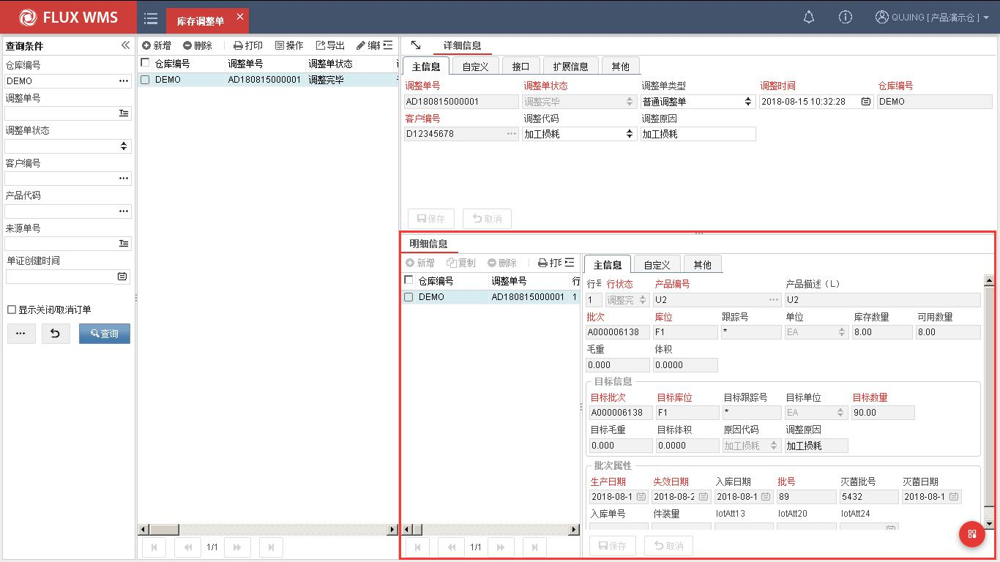

  - 系统返回调整单页面，并显示所选库存记录的相关内容。

  - 用户在根据实际需要，输入调整的目标数量、目标毛重、体积等信息，并保存。

  - 库存调整单创建完毕，由相应人员进行审核，可打印调整单据。审核后，通过表头鼠标右键菜单确认审核。

  - 在明细部分，选择需要执行调整的记录，或通过右键菜单全选。

  - 明细部分，点选明细行，鼠标右键菜单选择功能“执行调整”，系统执行库存调整。

- **鼠标右键菜单**

  - 表头右键菜单：

在调整单表头部分的导航窗口中，点击鼠标右键，系统显示相应右键菜单如下

<!-- 原 PDF 第 308 页 -->

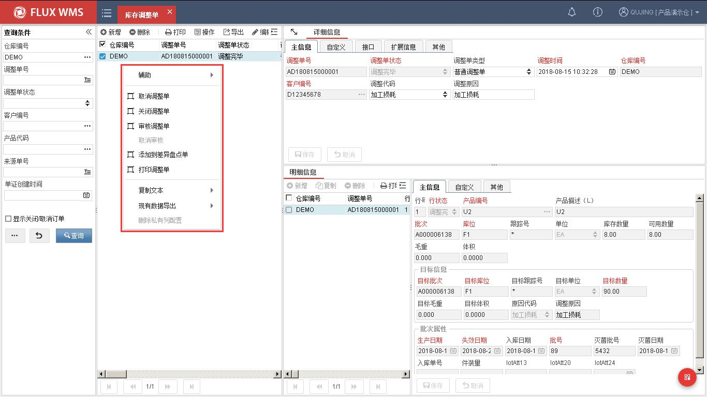

    - 取消调整单－调整单取消，不再操作，也不可修改。

    - 关闭调整单－已执行调整单关闭，不可再修改。

    - 审核调整单－确认调整单通过审核，能够执行后续调整操作。

    - 取消审核－仅对通过审核的单据有效。将调整单恢复到未审核状态。

    - 添加到差异盘点单－0 库存增加的调整记录，可加入到差异盘点单中进行复盘

    - 打印调整单－ 打印纸面单证，用于调整审批或存档。

  - 明细右键菜单：

<!-- 原 PDF 第 309 页 -->

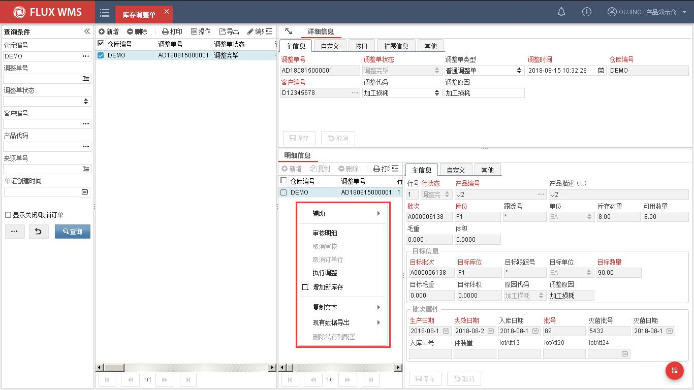

    - 审核明细－基于明细行进行审核确认

    - 取消审核－明细行审核取消

    - 取消订单行－所选明细行取消

    - 执行调整－所选明细行记录，确认执行调整操作。

    - 增加新库存－正常的调整操作，需要在已有库存的记录上进行。但如果由于误操作，已经将库存调整为 0，再需要将库存由 0 调整回来，由于没有库存记录可以选择，无法操作。因此 FLUX WMS 系统提供了“增加新库存”功能，可以从 0 库存开始调整增加。

选择“增加新库存”功能后，系统显示如下新增库存二级窗口，依次录入产品、库位、数量、批次属性等信息。保存后系统生成对应的 0 库存调整增加的明细记录。

<!-- 原 PDF 第 310 页 -->

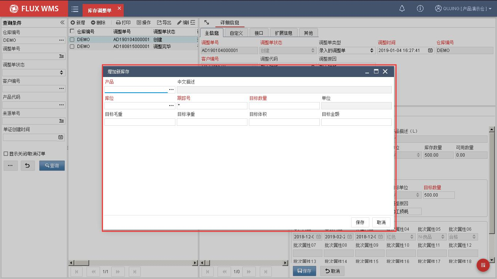

## 10.7. 库存移动单

在仓库中，常常会由于种种原因而移动产品、改变货物的存储位置，例如，在仓库操作过程中，发现有产品破损，通常需要将其由原来存放的库位移至另设的产品破损库位存放，防止破损货物被当作正常品发货给收货客户。或者定期整理库存，将周转比较慢的货物移动到慢速周转库区。库存移动单功能可以帮助仓库对货物存储位置做批量变更，甚至重新规划仓库内货物的存放。

- **库存移动单**

  - 选择“库存管理”下的“库存移动单”。

  - 点击【新增】按钮，在表头的主信息页签，依次输入：

<!-- 原 PDF 第 311 页 -->

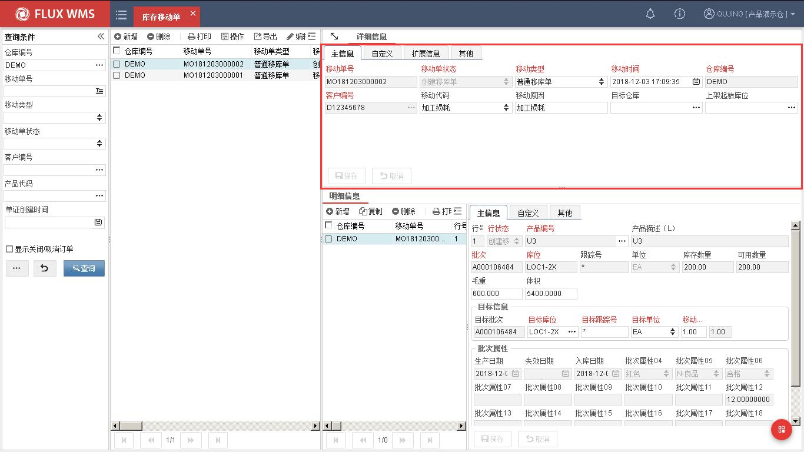

移库单号－系统自动生成的单证号。

移库单状态－单证状态，默认为创建状态，由系统根据移库单执行情况更新状态。

移库单类型－单证类型，用于区分不同的库存移动单。

移动时间－执行库存移动的时间，默认为订单创建时间。

仓库编号－移库单所属作业仓库。

客户编号－输入或选择待移库操作货物所属的货主代码。

移动原因－选择产品移动的理由。所选下拉列表内容在系统代码中维护。

原因描述－对移动原因进一步说明。

目标仓库－允许跨仓移库时显示，移库的目的仓库。MOV_BTW_WH(是否允许在不同仓库之间进行移库操作)参数为 N 时，此字段隐藏。

上架起始库位－移库单中可以根据上架规则重新计算推荐目标库位，以便仓库整理。如果需要执行“收货到 XX 库位，就上架到 XXX 库位/库区”的逻辑，就可以通过“上架起始库位”字段代替收货库位进行逻辑计算。

  - 点击【保存】按钮，保存表头信息。在“附加信息”页签可见来源单号、行号信息。如果是从 SO 创建的移动单，会记

<!-- 原 PDF 第 312 页 -->

录对应信息。

  - 在明细部分，点击【新增】按钮，主信息页面通过点击产品字段的快速检索按钮，在库存选择二级窗口，选择需要执行移动的库存信息记录。

  - 双击记录确认，返回移库单界面。依次输入移动的目标库位和移动数量，并保存。系统默认库位上的全部库存一次移动。同样可以点击按钮通过二级窗口查看批次所具有的扩展批次属性。

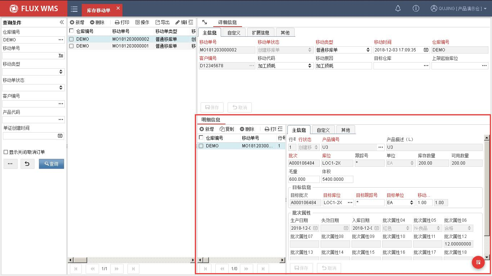

  - 在明细部分，选择需要执行移动的记录（或通过鼠标右键菜单全选），选择鼠标右键菜单中的“执行移库”功能，系统执行移库操作。

注：移库单也可以通过库存余量生成。在库存余量按批次/库位/跟踪号查询方式界面，选择记录、修改订货数，通过鼠标右键菜单功能项“生成库存移动单”可生成指定产品的库存转移单，后续操作相同。

- **鼠标右键菜单**

  - 表头右键菜单：

在移库单表头部分的导航窗口中，点击鼠标右键，系统显示相应右键菜单如下

<!-- 原 PDF 第 313 页 -->

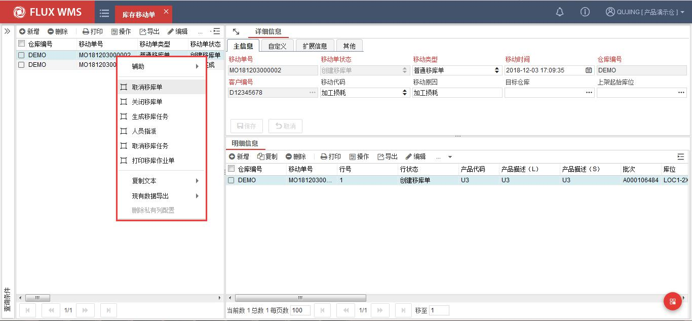

    - 取消移库单－移库单取消，不可操作、修改。仅针对创建状态移库单

    - 关闭移库单－移库单执行后，关闭订单。不可再修改。

    - 生成移库任务－根据移库单明细，生成移库任务，供 RF 移库使用。移库任务会将待移动库存锁定，执行移动后释放。

    - 生成派工单－配合资源管理，根据移库单生成对应派工单，以便进行作业人员调度、用工费用结算。

    - 取消移库任务－已生成的移库任务取消。

    - 打印移库单－打印纸面单据，用于指导仓库内库存移动。

    - 人员指派－用户可以基于库存移动单进行任务人员指派。

  - 明细右键菜单：

<!-- 原 PDF 第 314 页 -->

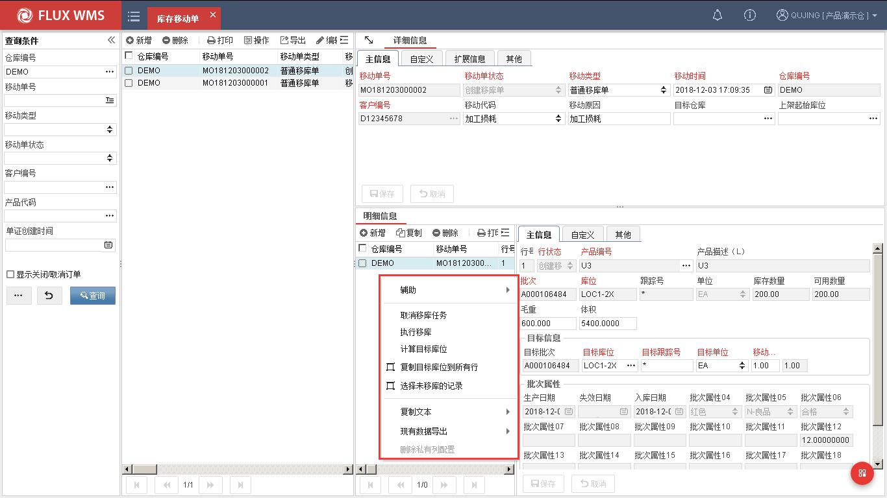

    - 取消移库任务－针对所选移库单明细行，对已生成的移库任务取消。

    - 执行移库－移库确认。可按所选明细行执行。

    - 计算目标库位－根据产品的上架规则，计算出上架库位作为移动的目标库位。计算所得目标库位可以再次通过手工进行修改。

    - 复制目标库位到所有行－适用于移库单中全部目标库位相同的情况。手工修改一行明细的目标库位并保存，通过鼠标右键“复制目标库位到所有行”功能，更新整个移库单中全部明细的目标库位为所选明细记录的目标库位。

    - 选择未移库的记录－批量勾选所有未移库完成的记录。

- **跨仓移库操作**

通常情况下，2 个不同仓库间的货物移动，会通过一边发货，另一边仓库收货来进行交接，过程中涉及到责任转移，实物交接等。

但也有些仓库，物理位置在一处或相邻，例如一个物流园区中的 2 栋楼，出于管理需要，维护为 2 个不同仓库。这些仓库间的库存移动，部分情况下也会通过移库单操作。

跨仓操作，需要开启参数 MOV_BTW_WH（是否允许在不同仓库之间进行跨仓移库操作），此时移库单头，会显示目标仓库字段供选择。

添加明细行记录时，系统会校验目标库位是否属于目标仓库，已有明细情况下修改目标仓库，

<!-- 原 PDF 第 315 页 -->

系统会清空明细行的目标库位，等待重新录入并校验。如果移库单已经下达移库任务，目标仓库不可修改。

## 10.8. 库存盘点单

库存盘点是仓库日常业务操作的一个组成部分，也是保证库存正确的重要方式之一。

盘点可分为标准盘点、循环盘点和动态盘点等多种不同的盘点模式：

  - 标准盘点即盘点指定范围内的全部库存。

  - 循环盘点是根据循环盘点规则中设置的盘点数量等限定条件，由系统在库存中随机选择部分库存进行盘点，在一定周期内完成对所有产品进行盘点的方式。

  - 动态盘点则是只对有过操作的产品进行盘点的一种部分盘点方式，由系统进行记录筛选。

  - 随机盘点是由系统根据制定的盘点范围，随机抽取库存记录生成盘点用于抽查库存情况的盘点方式。

盘点执行，可分为有任务模式，与无任务模式。有任务模式能够通过纸单或 RF 执行操作，无任务模式主要通过 RF 进行操作。RF 盘点执行的相关细节，请参考 RF 操作手册。

- **申请盘点**

在进行盘点之前，需要先对盘点的对象、时间、范围进行设定，以便于系统自动生成符合要求的盘点清单，也即盘点任务。此时应用到了申请盘点的功能，如果是非任务盘点模式，可以不进行盘点申请。

  - 选择“库存管理”下的“库存盘点单”。

  - 点击【新增】后，在表头部分的主信息页签，依次输入如下信息：

<!-- 原 PDF 第 316 页 -->

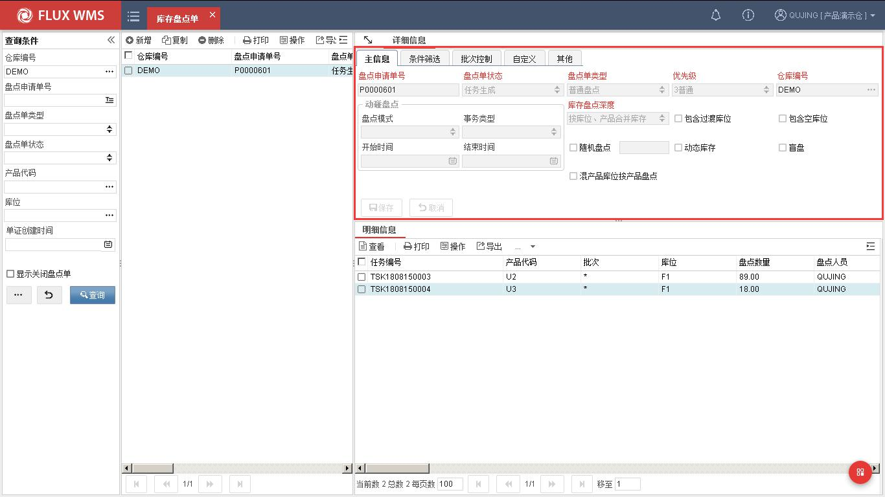

仓库编号－当前作业仓库

盘点申请编号－系统自动生成的盘点单号。

盘点单状态－盘点单操作情况，由系统自动更新。

类型－盘点单操作类型。例如普通盘点，差异盘点等。

优先级－盘点优先级。主要针对 RF 盘点任务生效。

客户编号－指定盘点条件之一，限定盘点对象货主。如不录入，则不限定货主盘点。

产品组－盘点范围的产品组条件。

盘点库存深度－盘点时的库存细化程度。根据参数 COU_SKU_LOC 显示下拉框，如按库位、产品合并记录，后续盘点时将不校验批次属性信息。如果按库位合并，则忽略产品区别，仅核对库位内的总数量。

动态库存－实时盘点操作，盘点单中不锁定库存，可以一边进出操作，一边进行盘点。通过 RF 盘点获取任务时才获取当时的实时动态库存。默认不勾选，纸单盘点模式不建议使用动态库存盘点。

空库位－生成的盘点任务包含空库位记录，即用户需要确认这些库位的确是空的。默认不勾选。

是否带出过渡库位－过渡库位是否纳入盘点任务生成范围。

<!-- 原 PDF 第 317 页 -->

呆滞库存－动碰盘点的反向操作，指定的时间段内，没有进行过操作的库存生成盘点任务。

申请时间－默认为盘点单创建时间

动态盘点，开始/结束时间－此时间段内有过操作的库存，进行动态盘点。

随机盘点－在指定的范围内，随机抽取记录生成盘点任务，录入库位限定数量，随机选择生成相应的盘点任务。

批次属性－指定属性值筛选记录进行盘点。例如只盘点海关单号是 ABC0001 的一批库存。

  - 在“盘点条件”页签，可以维护范围条件：

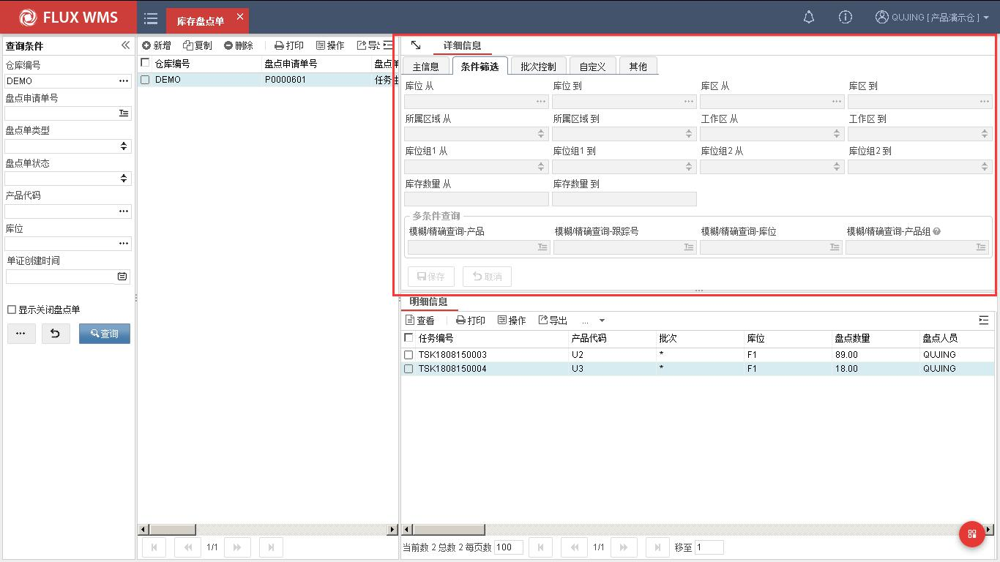

    - 从~到的区段查询条件

产品－需要进行盘点的产品代码。

库位－需要进行盘点的库位范围。

区域－需要进行盘点的区域范围。

上架区－需要进行盘点的库存所属上架区域。

拣货区－需要进行盘点的库存所属拣货区域。

<!-- 原 PDF 第 318 页 -->

库位组－需要进行盘点的库存所属库位组。

    - 多条件查询

有时根据管理需要，会指定某几个条件，例如几个非连续的库位，进行盘点，此时 FM/TO 的条件模式无法满足，可以在多条件查询部分，针对产品、跟踪号、库位字段，录入多个查询条件内容，通过逗号分隔，例如“SKU1，SKU7，SKU9“。

也可以通过字段后的浏览按钮，在如下的“多条件查询”二级窗口，录入所需条件，并选择精确查询模式，还是模糊查询模式，系统将录入的条件内容，带入到查询条件界面。

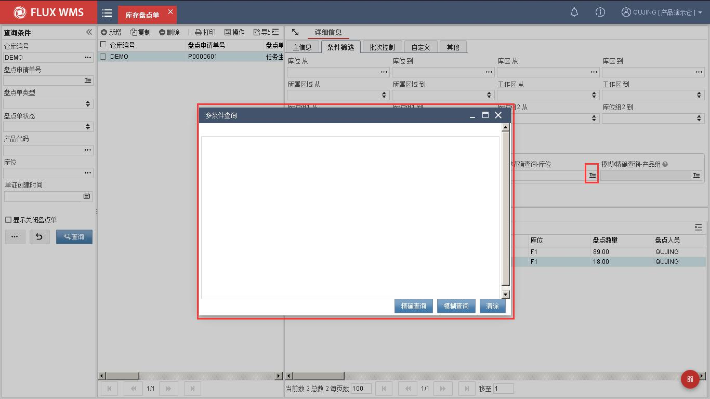

  - 点击【保存】按钮，系统创建盘点单据。

  - 在表头右键菜单中，选择【盘点预检】功能，系统检查盘点范围内未操作完成的任务情况，并提示用户。以免作业中任务较多，又采用的非动态盘点模式，导致盘点结果偏差较大。但盘点预检信息，并不会限制盘点进行。

<!-- 原 PDF 第 319 页 -->

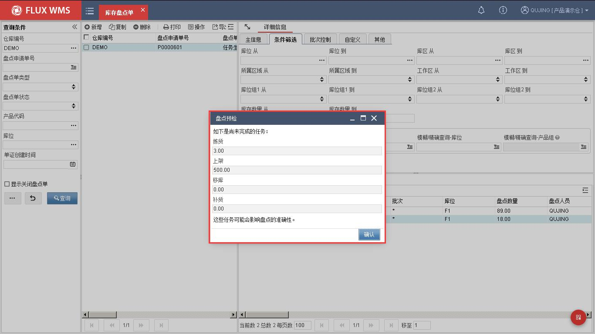

  - 鼠标右键菜单中，选择“生成盘点任务“（其余功能，在盘点任务生成后才能使用），系统根据表头部分的盘点范围条件，在库存中查找符合要求的库存记录，生成盘点任务，显示在盘点单明细部分。如果盘点任务对应的库存记录，有未完成任务（如有待上架库存，已分配库存），此任务记录将显示为红色，提醒用户注意，可能会由于其他任务操作，导致盘点库存差异。

- **库存盘点**

  - 盘点任务生成后，可以通过右键菜单，打印盘点任务清单用于仓库盘点。如果系统参数 BLD_COU（是否盲盘）设置为 Y，打印出的盘点单据中不显示库存数量。

  - 盘点后，根据实际盘点结果，在盘点单中记录盘点数量，系统自动计算损益数量。在系统参数中，可以设置默认盘点数量（COU_DFT），默认为库存数量，用户只需输入有差异的记录。也可以默认盘点数量为-1，用户需要录入全部盘点数量，常用于盲盘。

- **盘点处理**

盘点后发现的库存差异，可以进行复盘、库存调整。

  - 鼠标右键选择“生成差异盘点任务”，系统将当前盘点单中，有损益数量的产品，再次生成新的盘点单及盘点任务，方便用户对差异数量进行复盘。

  - 差异数量确认无误后，可点击鼠标右键菜单功能“生成调整单”，系统根据盘点差

<!-- 原 PDF 第 320 页 -->

异记录，创建对应库存调整单，目标数量为实盘数量。

  - 盘点完成，选择鼠标右键菜单功能“关闭盘点”，关闭盘点单，不允许对盘点单再做修改。

  - 盘点结束，具体数量修改，由用户另行在对应调整单中处理。

  - 注：为了避免盘点过程中生成差异单，导致后续盘点结果差异单中未包含，盘点单中有尚未完成的盘点任务时，不允许生成差异单。

- **动态盘点**

动态盘点是对根据指定时间段内，有过操作产品进行盘点，没有操作过的库存不用盘点，也被称为动碰盘点。

动态盘点操作步骤与标准盘点类似，但需要输入动态盘点的开始时间、结束时间。系统寻找在这个时间段内有过操作，并且符合其他盘点范围条件的产品，生成对应盘点任务。后续操作相同。

默认情况下，动态盘点查找时间段内全部库存事务，但用户可通过【选项】按钮，在弹出框中选择动态盘点的对应事务类型。未勾选的项目，将被忽略。

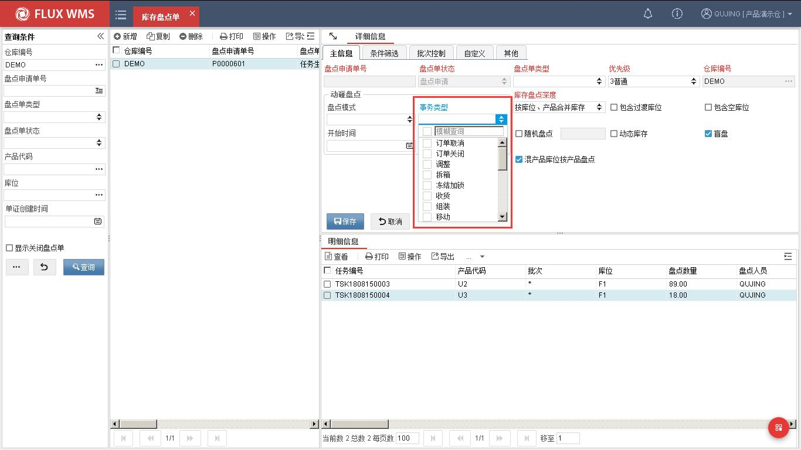

- **随机盘点**

随机盘点主要用于对产品库存进行抽查，通常与动态盘点、普通盘点结合使用。

<!-- 原 PDF 第 321 页 -->

在库存盘点单中，除了普通盘点的范围条件之外，还需要勾选“随机盘点”选项，并输入随机盘点任务数量条件（如下图），系统在生成盘点任务时，随机抽取符合盘点范围条件的库存记录作为盘点任务。

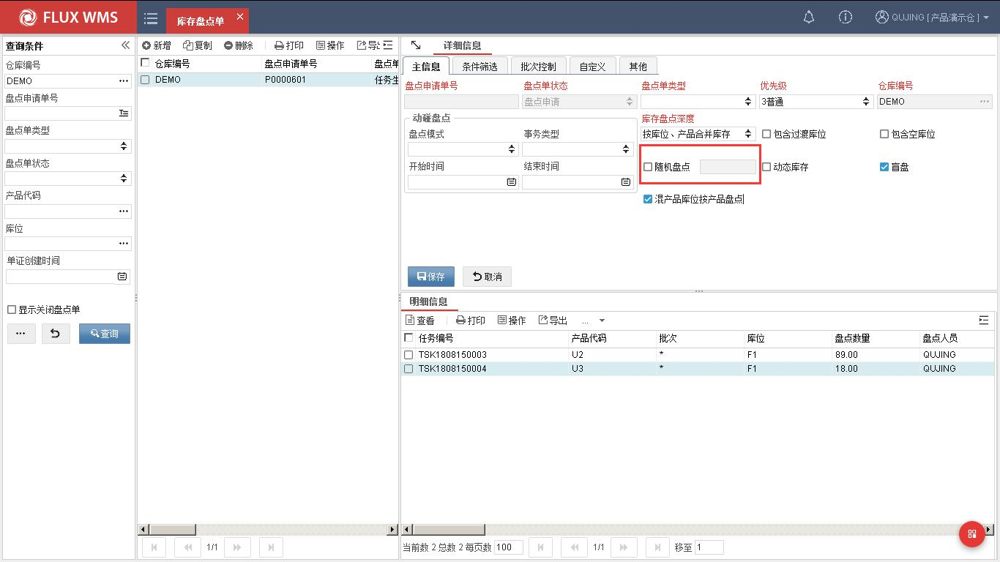

盘点任务生成后，后续操作同普通盘点。

- **鼠标右键功能项**

表头右键菜单：

<!-- 原 PDF 第 322 页 -->

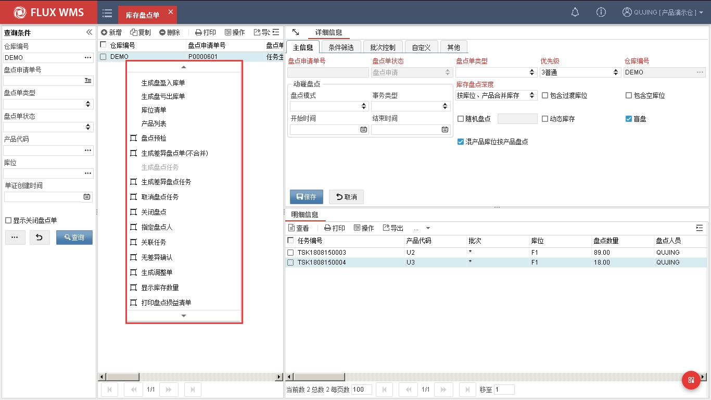

  - 盘点预检－当前仓库未完成任务检查，统计显示检查结果

  - 生成盘点任务－根据盘点范围条件计算生成盘点任务

  - 生成盘点差异任务－盘点结果与任务信息不符的产品记录，生成差异盘点单，以便进行复盘。

  - 取消盘点任务－已生成的盘点任务撤销，盘点单回复到创建状态，以便修改盘点范围条件。

  - 关闭盘点－盘点单关闭，不再允许修改

  - 快速定位－弹出框输入盘点任务号，系统快速定位到对应任务的处理。支持模糊查询。

  - 指定盘点人－适用于 RF 盘点，分派盘点任务给指定操作人员。点击后，弹出二级窗口，录入指定的盘点人 ID，更新盘点单下所有任务的"盘点人"为指定的用户 ID。

  - 关联任务－已生成盘点任务的盘点单，通过二级窗口显示盘点任务相关的其他作业任务信息。所显示的关联任务，支持鼠标右键导出为 EXCEL 文档。

  - 无差异确认－针对未确认的盘点任务，批量确认盘点执行，数量等同任务数量。

  - 生成调整单－盘点结果输入后，根据损益情况创建调整单。需要注意的是，合并库位、跟踪号盘点模式，由于盘点结果为合并后的库存记录，不能直接创建调整单。

<!-- 原 PDF 第 323 页 -->

  - 生成盘盈入库单－由于合并盘点模式不适合直接生成调整单，也有些作业情况由于 ERP 流程要求不能直接通过调整修正库存，因此系统提供根据出、入库单据异动库存的功能。根据盘盈结果，创建入库单据，收货后增加库存。

  - 生成盘亏出库单－根据盘亏结果，创建出库单，并分配库存。单据发货后库存相应减少。

  - 显示库存数量－盘点任务部分，库存数量默认隐藏，可通过此功能显示库存数量列。

  - 库位清单－客户出于审计要求，有时会指定多个库位进行盘点。通过库位列表，可导入库位清单，并以此为条件生成盘点任务。

  - 产品列表－客户出于审计要求，有时会指定多个产品进行盘点。通过产品列表，可导入产品清单，并以此为条件生成盘点任务。

  - 打印盘点任务清单－ 打印纸面单证，用于仓库内盘点操作。

  - 打印盘点损益单－打印盘点结果单据，仅列名有库存差异的记录。

- **明细右键菜单**

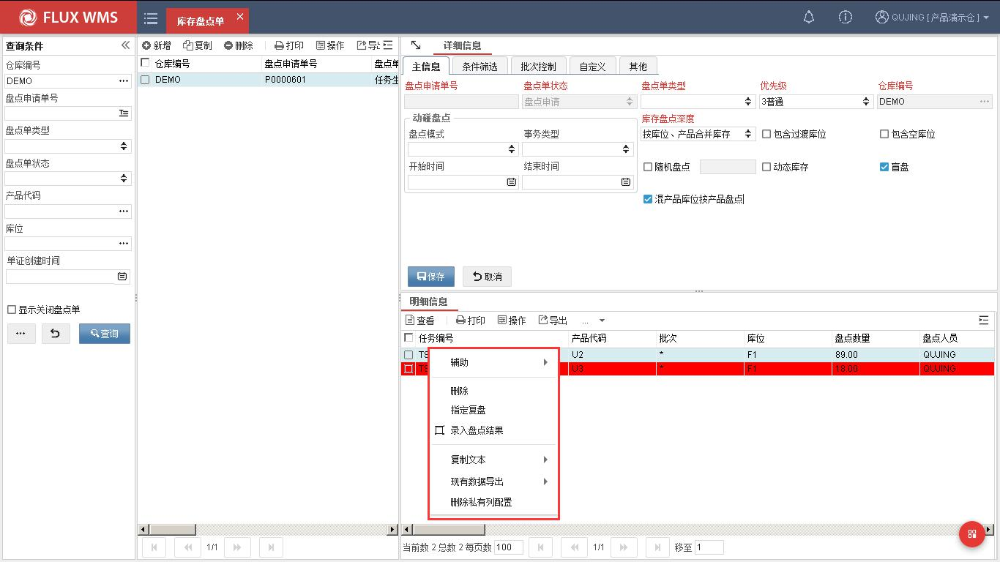

  - 删除－明细部分，所选的指定盘点任务删除。

  - 指定复盘－所选的盘点任务强制生成复盘任务。

  - 录入盘点结果－盘点任务默认处于只读状态，只有执行右键“录入盘点结果”功能，

<!-- 原 PDF 第 324 页 -->

才切换到现在的可编辑的状态。

## 10.9. 库存冻结

库存冻结功能类似库存冻结单，可以对指定库存进行冻结处理，但库存冻结是实时操作、生效；而库存冻结单，则可以分步进行登记、审核、执行等操作。

- **库存冻结操作**

  - 选择“库存管理”下的“库存冻结”功能。

  - 新增冻结记录时，选择“主信息”页面，点击【新增】按钮，依次输入以下信息：

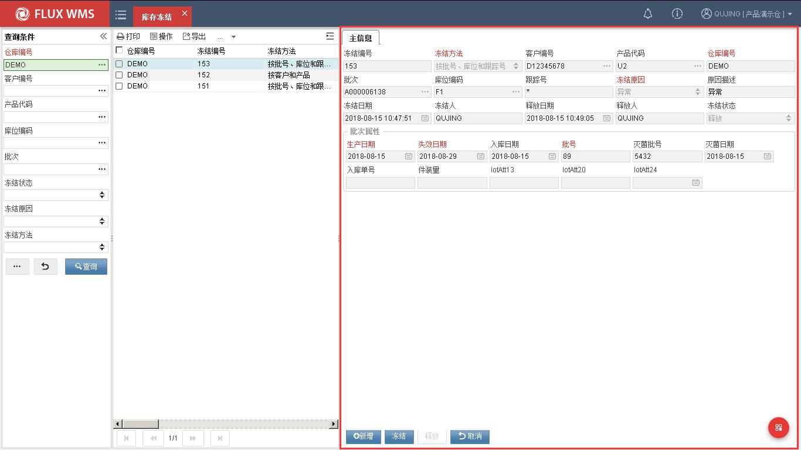

冻结编号－点击【新增】按钮后由系统生成的冻结记录流水编号。

冻结方法－对产品进行冻结的方式，系统提供按批号、按库位、按追踪编号、按批号库位和跟踪号、按客户、按客户和产品等多种方式供选择。冻结方法的多样性，能够灵活的满足客户进行产品冻结的需求。

不同的冻结方法，对应不同的冻结条件。选择冻结方法后，后续客户、产品等条件字段，仅有与冻结方法相应的字段可录入，无关的条件字段不可录入。例如选择客户冻结方法，产品、库位等条件字段不可录入。

<!-- 原 PDF 第 325 页 -->

仓库编号－指定冻结的库存所属仓库。跨仓冻结情况下，仓库无需指定。

客户编号－按客户或者涉及到产品的冻结方式时，所要冻结的客户代码。

产品代码－所要冻结的产品的代码。

批次－所要冻结的库存的系统批次号。

跟踪号－所要冻结的产品跟踪号。

库位编码－所要冻结的库位。

冻结原因－选择进行冻结的原因代码。可在系统代码中维护各种不同的冻结原因。

原因描述－开放字段，用于对冻结原因进一步具体描述。

冻结时间－确认冻结的时间，由系统自动记录

冻结操作人－操作冻结的的操作员信息

释放时间－解冻确认时间

释放操作人－解冻库存的操作员

是否冻结－记录处于冻结状态，还是已经解冻，由系统更新。

  - 点击【冻结】按钮，系统将相应库存冻结，会自动记录并显示冻结时间、操作人员等信息。

  - 库存冻结中，在库存余量中可查看到库存冻结数量。已冻结数量，不属于可用余量范围。

注：系统支持跨仓冻结。非跨仓模式，仅冻结用户作业仓库内的库存。

- **库存释放**

库存冻结后，当冻结原因解决，或者冻结产品有了处理意见后（例如退货出库、销毁、维修等），需要将已冻结的库存释放，使之再度参与到操作环节中。

库存释放操作步骤如下：

  - 选择“库存管理”下的“库存冻结”。

  - 在查询页面输入条件，查询已有冻结记录。

  - 选择所需冻结记录，在明细页面中点击“释放”按钮（或者鼠标右键功能释放），释放库存。

<!-- 原 PDF 第 326 页 -->

注：已释放的记录，选择后再次冻结，系统会复制此信息，生成一行新的冻结记录。原有的已释放记录不会被覆盖。

## 10.10. 库存转移

除了使用库存转移单进行转移操作，FLUX WMS 还提供库存转移功能，进行快捷的转移执行。但相应的，库存转移功能，无法进行单据信息存储，审核，而是直接查询到库存记录，进行对应信息变更。

- **库存转移操作**

库存转移的步骤如下：

  - 选择“库存管理”下的“库存转移”功能。

  - 在查询页签输入客户、产品、库位、跟踪号、批次号、批次属性等查询条件，进行对应库存查询。

  - 在查询结果列表中，选择所要转移的库存记录行，双击跳转到主信息页面。

  - 在转移信息部分，默认为库存原始信息，根据修改的需要依次输入对应转移信息：

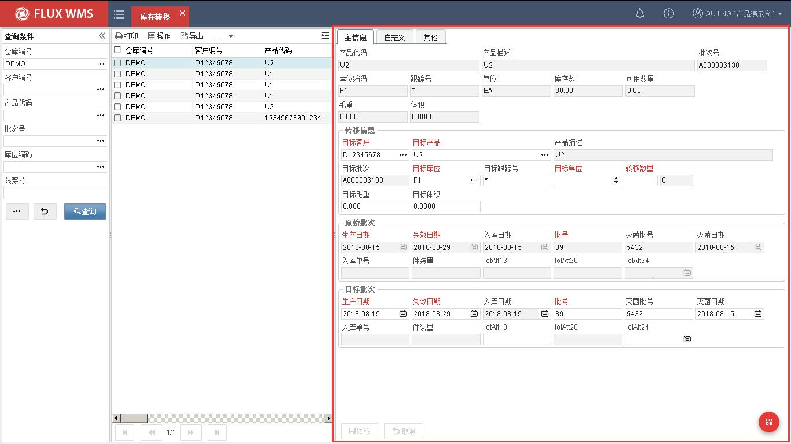

客户编号－转移后，库存所属的客户代码。

<!-- 原 PDF 第 327 页 -->

产品代码－转移后，所要变更为的产品代码。如果是转移同时改变所属客户，转移后的产品代码必须在目标客户下已经存在。即已经在产品档案中维护。

库位编码－所要变更的目的库位，默认为原始库位。即转移同时，可以同步达到移库的效果。

跟踪号－所要变更的目的跟踪号。系统给出的默认值为原产品的跟踪号。

单位－所要移动的产品的数量单位。系统给出的默认值为该产品在产品档案中所选择的包装代码的主单位。客户也可根据情况自行修改。

转移数量－前一字段为所选择的单位为数量单位的移动数量，例如 1 箱。后一字段为主单位数量。如果一条记录库存数量为 100，而转移数量为 20，则意味着仅针对 100 个库存中的 20 个，修改信息。其余 80 个库存信息不变。

损益数量－转移同时库存增减的数量。相当与同时执行了库存转移与库存调整。

转移时间－该产品执行转移确认操作的时间。默认为当前时间。

原因代码－选择产品转移的理由。所选下拉列表内容在系统代码中维护。

原因描述－对转移原因进一步说明。

目标毛重－转移后的库存毛重。系统会根据产品档案中的标准毛重和转移数量计算目标毛重，用户可根据实际情形修改。

目标净重－转移后的库存净重。

目标体积－转移后的库存体积。

目标价格－转移后的库存价格。

批次属性－转移后的批次属性内容。

  - 点击【转移】按钮，执行库存转移操作。

## 10.11. 库存调整

除了批量执行库存调整的库存调整单功能，系统还提供库存调整功能，直接查询库存记录，进行调整的快捷操作。如果需要审核，或者记录更多附加信息，还请使用库存调整单功能。

- **库存调整**

  - 选择“库存管理”下的“库存调整”功能

<!-- 原 PDF 第 328 页 -->

  - 在查询页签，输入客户、产品、库位、跟踪号、批次号、批次属性等查询条件信息，点击【查询】按钮，查询库存

  - 在查询结果列表中，选择所要调整的库存记录行，点击明细页签。系统显示库存相应信息

  - 在调整部分，输入变更内容：

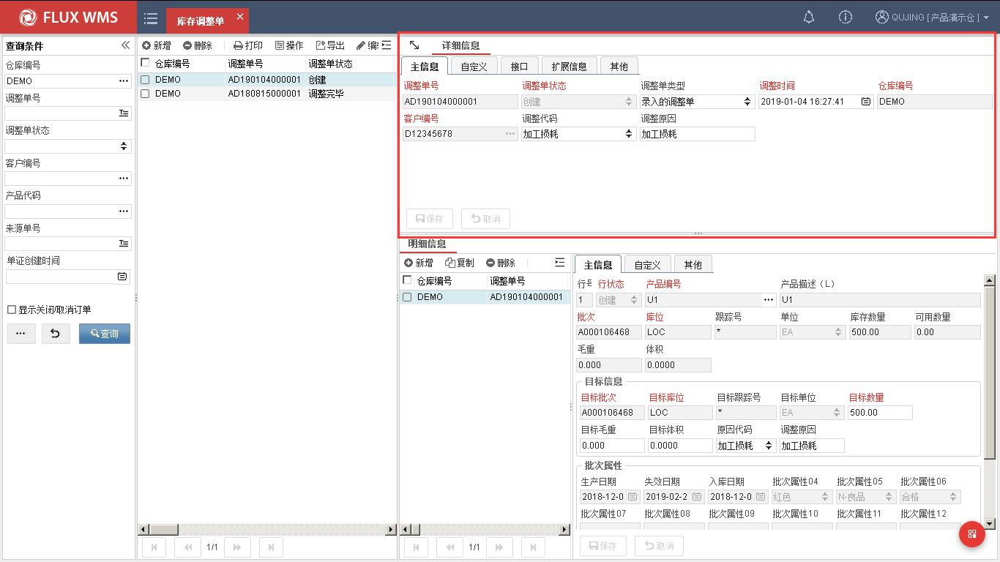

目标数量－调整后的数量，以主单位做为数量单位。

调整时间－调整操作的时间。

原因代码－进行库存调整的原因代码。

原因描述－对调整原因进行描述。

目标毛重－调整后的库存毛重。系统会根据产品档案中的标准毛重和调整目标数量计算目标毛重，用户可根据实际情形修改。

目标净重－调整后的库存净重。

目标体积－调整后的库存体积。

  - 点击【调整】按钮，完成库存调整操作

<!-- 原 PDF 第 329 页 -->

## 10.12. 库存移动

仓库内进行库存整理的快捷功能，与库存移动单相比，无法进行库位规划建议，需要人工指定移动的目标库位。

- **库存移动**

  - 选择“库存管理”下的“库存移动”。

  - 在查询页面的查询条件字段中，根据需要，输入客户、产品、库位、跟踪号、批次号等查询条件，可以是“从……到……”的范围条件。也可以使用批次属性内容作为查询条件。点击【查询】按钮，查询对应库存。

  - 在查询结果列表中，选择所要移动的记录行

  - 双击记录，切换到主信息页签，在“移动信息”部分，依次输入以下库存移动信息：

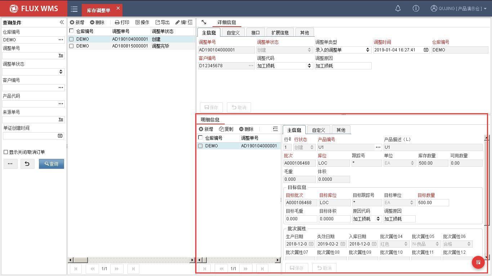

库位编码－库存移动的目的库位。默认为当前存放库位。

跟踪号－移动后的跟踪号。通常可以使用此功能修改产品库存跟踪号，默认同当前库存跟踪号

单位－移动库存的数量单位。

移库数量－产品移动的数量。前一个开放字段以所选单位为数量单位，例如可以是 1 托

<!-- 原 PDF 第 330 页 -->

盘、5 箱等，后一个只读字段为主单位数量，便于用户在多包装级别情况下使用。数量默认

为当前可移动数量（库存-分配数量-冻结数量-其他任务数量）

移库时间－该产品执行移动操作的时间。

原因代码－选择产品移动的理由。所选下拉列表内容在系统代码中维护。

原因描述－对移动原因进一步说明。

  - 点击【移动】按钮，系统执行库存移动操作。

## 10.13. ABC 动态分析

ABC 分析法(Activity Based Classification)，全称应为 ABC 分类库存控制法。又称帕累托分析法或巴雷托分析法。该分析方法的核心思想是在决定一个事物的众多因素中分清主次，识别出少数的但对事物起决定作用的关键因素和多数的但对事物影响较少的次要因素。是帕累托 80/20 法则的衍生。

应用于库存管理方面，通常来讲，可以理解为少量产品的进出作业量/价值金额，占比却比较大，因此应该作为管理的重点，一方面加强监管，提高盘点频次；另一方面可以将这些作业量最多的产品，布局摆放到最方便作业的库位，例如靠近进出口、巷道、集货区以减少搬运路径，或者拣货架排面中作业员最方便拣取的第 3~5 层从而减少拣货的其他动作。

一般根据管理所需，按照一定的因素进行统计，发生累计频率排序前 0~80%的为 A 类，80%~90%为 B 类，90%~100%的是 C。在库存管理中，常按拣货频次从高到底进行排序，排序百分比在 80%之前的，即拣货频率最高的这部分货物，为 A 类货物；80%~90%的，偶尔拣货的货物，为 B 类货物；最末的 90%~100%，很少拣货的，为 C 类货物。

FLUX WMS 提供的 ABC 动态分析，就是根据一段时间内的作业情况，分析哪些货物的应属于 A 类货物；哪些货物原本属于 A 类货物，但由于换季等原因，拣货频次下降，应降级为 B 类或者 C 类货物。同时，又有哪些货物需要对应的从 A 类货架移动到到 B、C 类货架存放，以便让出方便拣取的 A 类货架给其他 A 类货品。

- **ABC 动态分析**

使用 ABC 动态分析，需要先在基础设置的【循环级别】功能中，配置 ABC 等级的对应占比。虽然按标准帕累托分析法，占比应为 80%、90%、100%，但 WMS 系统允许根据实际情况进行配置。并且除了排名百分比，也可采用排名的方式。具体设置，请参考基础设置章节的介绍。

使用 ABC 动态分析时：

<!-- 原 PDF 第 331 页 -->

  - 点击“库存管理”下的“ABC 动态分析”

  - 在查询条件中，输入客户、时间段条件，选择按百分比或者排序。默认情况下过滤已经库存是 0 的产品，如果需要同样进行整理，可在查询条件中勾选“显示 0 库存整理”

  - 点击查找按钮，系统根据 ABC 循环等级条件，查询不符合条件、需要降等的产品记录，并给予级别建议。

  - 用户可勾选确认等级更新的记录，或者全选，通过鼠标右键菜单功能“执行 ABC 调整”，由系统更新产品档案中的循环级别。

  - 选择产品，通过鼠标鼠标右键菜单功能“生成库存整理清单”，即产品所在库位的等级与产品循环等级不符的记录，需要移动库存

  - ABC 分析法本身并不更新库存对应库位，需要实际执行库存移动变更库位。

- **鼠标右键功能**

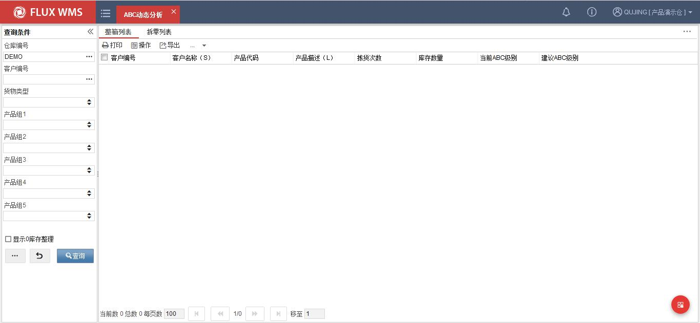

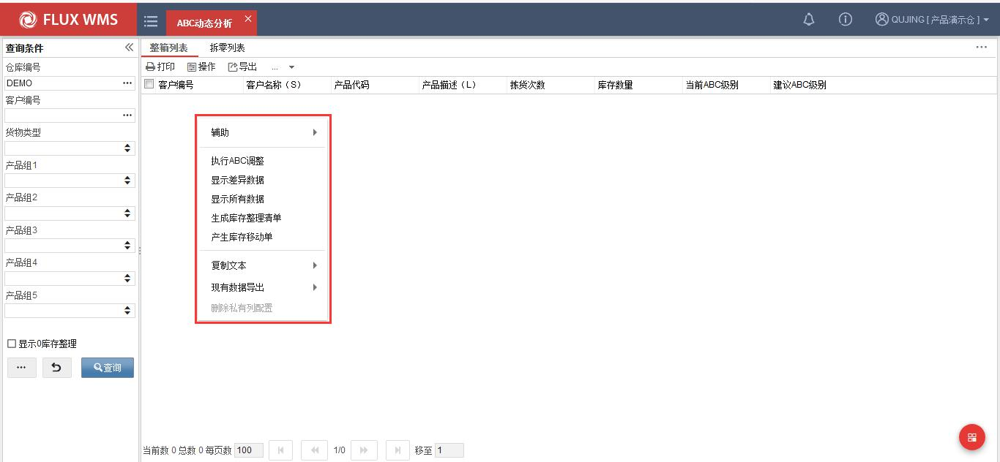

<!-- 原 PDF 第 332 页 -->

  - 显示差异数据

ABC 分析时，只显示等级需要调整的产品记录。

  - 显示所有数据

ABC 分析时，显示全部符合查询条件的产品记录。有时产品的 ABC 等级不需要更新，但产品所存放的库位与等级不符，需要进行库存整理，因此系统支持显示全部产品数据。
