# 11. 出库操作

> 来源：`富勒WMS系统用户手册_V6_高清版（维他命）.pdf`，原 PDF 第 333 页起。
> 本文件按原 PDF 正文标题拆分；原文截图已提取至同目录 `assets/`。

<!-- 原 PDF 第 333 页 -->

## 11.1. 出库流程概述

出库流程是仓储管理的一个重要环节，现代物流对出库作业的时效性、准确性都有较高要求。在出库流程中，对仓库产品的发货要求被记录下来作为订单，仓库按要求拣选出产品发运。出库流程的目标是最优化的履行订单并且增强存货控制。

出库流程的常见操作步骤为：

  - 发运订单创建（/合并订单）

  - 订单（预）分配

  - 订单拣货

  - 确认发货

在多产品、小批量出库情况下，为了对仓库出库货物加强管理，提高出库准确性，还可以根据操作需要选择出库附加操作，例如：

  - 销售订单

  - 出库复核

  - 配送单作业

  - 集拼箱

  - 装车

  - 出库放行

  - ……

## 11.2. 发运订单（SO）

发运订单是货主对仓库里存储的产品，给予的出货要求指令。它记录所要求出库发运的每种商品的数量和每次送货的目的地，以及其他附加出库要求。

发运订单是出库流程中必不可少的操作依据，但可以通过不同方式来创建。

<!-- 原 PDF 第 334 页 -->

### 11.2.1. 单证创建

- **发运订单表头创建**

发运订单有多种创建方式，系统支持通过人工录入创建、文档导入创建，通过库存余量创建，以及通过接口传递订单信息创建订单等。

在没有其他系统对接的情况下，最常用的创建方式是人工录入创建订单。具体操作步骤如下：

  - 选择“出库操作”下的“发运订单”。

  - 点击【新增】按钮，在表头的主信息页签中，输入如下信息：

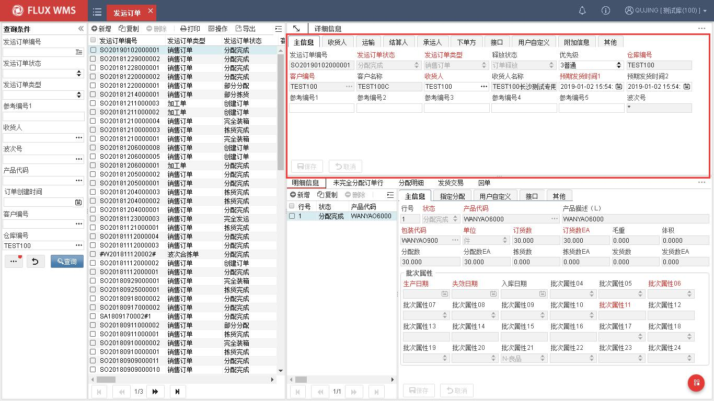

订单号－发运订单号码，也是发运订单的唯一标识。当新增一个发运订单时，系统根据流水号规则，自动给出该编号。

订单状态－该订单的状态。系统提供创建、部分预分配、预分配完成、部分分配、分配完成、部分拣货、拣货完成、部分发运、完全发运、取消、完成等多种选择。当新建一个发运订单时，系统自动给出默认状态，创建订单。

客户编号－要发运的产品所属货主代码，后续为货主的对应名称描述。

订单类型－发运订单的类型。用户可根据其业务模式，在 FLUX 顾问的指导下设置多种订单类型。新增 ASN 时若客户编号已维护默认货主（通过参数 DFT_CUS 设置），则光标

<!-- 原 PDF 第 335 页 -->

定位‘预期到货通知类型’字段；若未维护，则光标定位客户编号；

释放状态－订单是否已通过审核，可以发运。如不使用审核、释放功能，可将系统参数 RLS_CTL（缺省 SO 订单释放状态）设置为 Y，即发运订单默认为“订单释放”。

订单优先级－订单作业的优先顺序。多在 RF 或自动化设备操作过程中使用。

仓库编号－发运单所属作业仓库。手动新增发运订单时，系统自动获取当前用户登录仓库。

收货人－产品要运给的客户代码、名称

预期发货时间 1/2－预期发运该订单的时间段。系统自动给出当前时间为预期发货时间。客户可根据情况进行修改。

参考编号（1-5）－客户需要的，或订单的其他相关信息，例如 ERP 单号等。可在页面文本功能中修改字段名称。

波次号－订单所属波次的波次号。如果订单未加入波次，则显示为“*”

  - 在收货人页签，默认显示收货人基础档案维护的信息，可以根据需要修改为此单的收货地址信息：

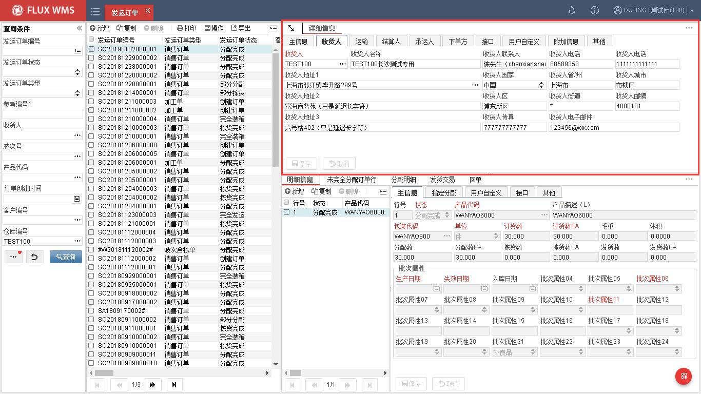

收货人－产品要运给的客户。系统自动显示主信息页面中输入的收货人代码。

收货人名称、地址、城市、省/州、国家、邮编、联系人信息－该收货人的信息。系统自

<!-- 原 PDF 第 336 页 -->

动给出该收货人在客户档案中所输入的信息，用户可手工修改。

如果收货人在客户档案中维护过多地址信息，在多地址模式下，可通过地址栏位的快速检索按钮，查看其它多地址信息，并选择其他地址作为此订单的收货地址。

  - 点击运输页签，在界面中，根据需要输入相应运输信息：

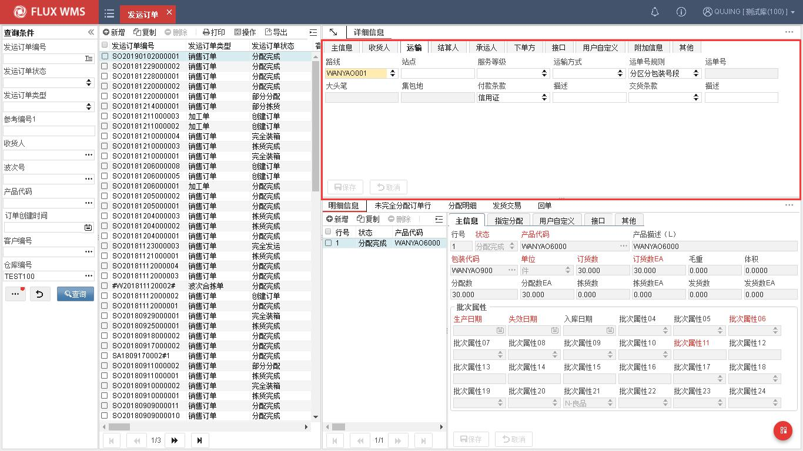

路线－订单运输路线。默认为收货人在客户档案中设置的默认路线，下拉列表内容在系统代码的路线代码中维护。路线在仓库内，常与集货位计算相关，将相同路线、站点的订单集货在一处，方便运输装载。具体集货位逻辑，可参考集货位部分的介绍。

站点－订单运输的目的站点。集货位管理时也常根据站点安排集货，方便装、卸货操作。

服务等级－不同订单的运输要求不同，可划分为不同的服务等级。

运输－运输方式选择，如海运、空运等。运输方式选项可在系统代码中维护。

运单号规则－通过系统计算生成运单号（快递面单号）时的计算方式。如流水号模式，每单唯一运单号模式，分区运单模式等。

运单号－计算所得的运单号，或者接口下达的运单号。

大头笔－快递目的地分拣信息。

集包地－快递分拣集包信息。

<!-- 原 PDF 第 337 页 -->

付款条款－付款方式的选择。用户可在系统代码中配置所需付款条件。

描述－对付款条件进行描述。

交货条款－交货方式的选择。如理货站-理货站、场站-场站、门到门交付等交付方式。

描述－对交付方式进行描述。

  - 结算人、承运人、下单方信息：信息内容与收货人基本相同，点击浏览按钮可选择对应类型的客户档案信息。结算人－通常情况下，一个发运订单的出库相关费用，是由货主支付的。但特殊情况下，

有可能并不相同，例如出库费用由集团或收货方支付，此时就需要指定此订单的结算方。

承运人－订单的运输方，操作过程中打印面单等作业单据，可根据不同承运人（或者货主、收货人）由系统自动调用不同打印模板。

下单方－多数用在有客户代理，由代理方下达订单指令的业务情况，因此需要分别记录货主、结算方、下单方。

  - 点击【保存】按钮，完成订单头信息创建。

  - 在接口页签，可以查看到接口相关信息。

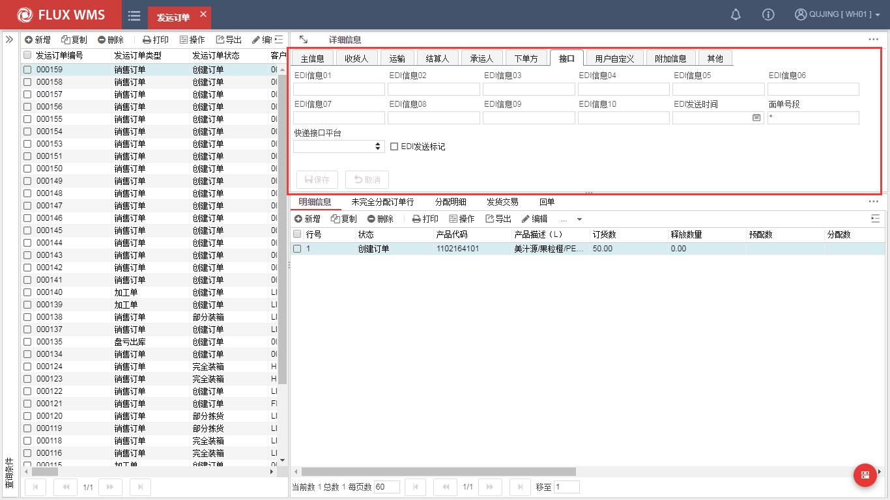

H_EDI_01~10－接口传递字段，字段名可根据现场需要自定义。

<!-- 原 PDF 第 338 页 -->

EDI 发送时间－接口时间信息

EDI 接口标记－接口发送标记

快递接口平台－订单中有仓库、货主、承运人信息，调用快递接口时，接口平台会根据这些信息判断需要调用哪种快递接口。

  - 在附加信息页签，维护信息：

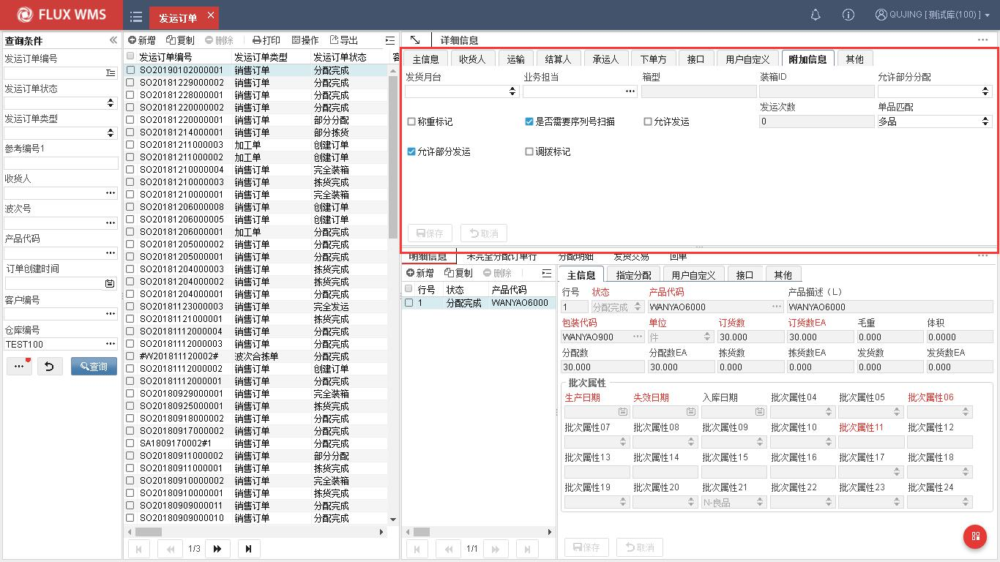

发货月台－出库装车月台

业务担当－订单相关业务人员

箱型－订单指定箱型组（接口写入）

装箱 ID－订单指定装箱 ID（接口写入）。通常用在有多种箱型的作业现场，上游 ERP 系统指定出库所用的装箱箱型。

允许部分分配－接口下达字段，该订单是否允许部分分配。通常情况下，仓库内根据客户、订单类型区分设置是否允许部分分配。但特殊情况下，某单与其他订单设置要求不同，此时可通过接口获取对应指令标记。例如正常出库单不可部分分配，但某单应收货方要求，加急出库，允许部分有库存货物先发货，即标记为允许部分分配。

称重标记－订单是否已经称重

是否需要序列号采集－此订单是否执行序列号管理相关扫描

<!-- 原 PDF 第 339 页 -->

允许发运－订单是否可发运。通常有发运规则控制，指定作业全部完成，系统为订单标记“允许发运”，则通过定时器将订单自动发运。

允许部分发运－订单是否允许部分发运

单品匹配－订单是否单品订单。

  - 特殊费用页签：

特殊费用，用于订单相关的费用、成本，通常是临时性的不固定费用。例如订单的滞纳金、集装箱清洁费等不是每单都会必然产生的费用，需要人工进行维护。

依次输入收费日期、收费类型、描述、金额等信息。可连续新增，输入多行费用信息。

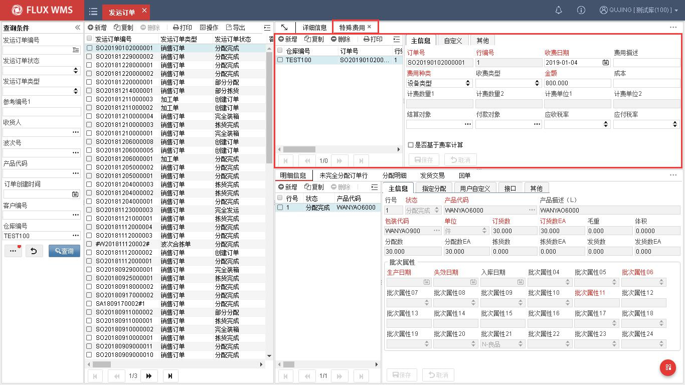

订单号－系统自动显示

行号－特殊费用行的行号，系统自动生成

费用日期－费用项的对应日期。

费用描述－费用项说明信息。

费用种类－特殊费用对应种类。下拉列表显示系统代码自定义 1 为'SPECIALCHARGE' 的 CodeID，相当与大类。

费用类型－根据费用种类所选内容，显示对应代码内容，相当与小类。类似自定义 A 自

<!-- 原 PDF 第 340 页 -->

定义 B 的限制关系。

费用金额－非计算模式，录入的此 ASN 相关特殊费用金额。

成本－支付金额。有成本支出的情况下记录。

结算对象－付款人、结算人。仓库收取操作、仓储费用的目标对象。

付款对象－仓库支付劳动力费用、租借费用的收款人。

应收/应付税率－计税情况下的税率依据。

计费数量－费用计算数量依据。基于费率计算情况下，计费数量取【计费数量 1*计费数量 2】，按照级差进行计算。

计费单位－数量单位

基于费率计算－如不勾选，只将特殊费用页签信息记入到费用清单；如勾选，需要根据特殊费用页签记录的费用种类、类型匹配费率中的设置，进行费用计算。

  - 选择集装箱页签：

依次输入集装箱箱号、类型、尺寸、铅封号、重量、备注等信息。

可连续新增，输入多个集装箱信息。

  - 汇总信息页签：

<!-- 原 PDF 第 341 页 -->

用于记录出库汇总信息。依次输入总数、总毛重、净重等信息。

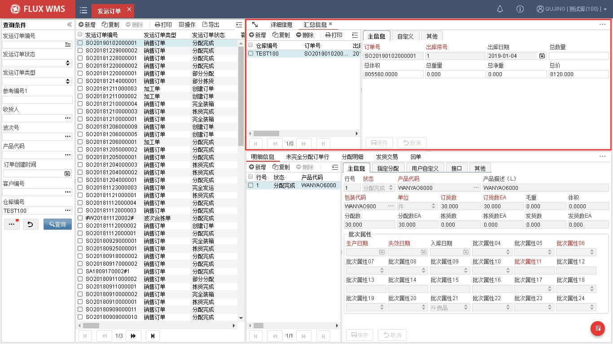

  - 订单如有照片、EXCEL 等文档，可通过附件页签进行管理：

选择附件页签，点击【上传】按钮，系统显示如下的文件选择对话框。

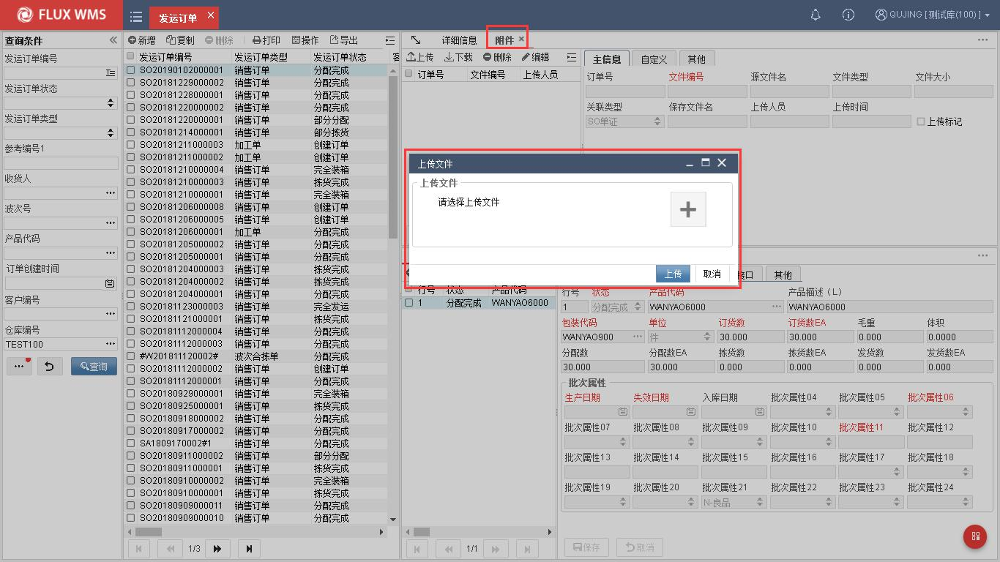

<!-- 原 PDF 第 342 页 -->

选择文件并确认上传后，系统显示如下的附件信息。

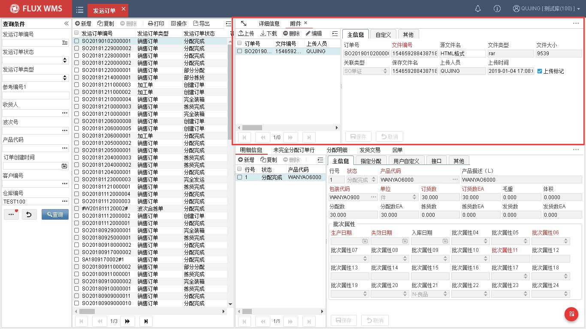

对于已有附件，可以通过【下载】按钮下载查看。

- **明细创建**

  - 选择订单行部分，点击【新增】按钮，在明细信息的主信息界面中，输入信息：

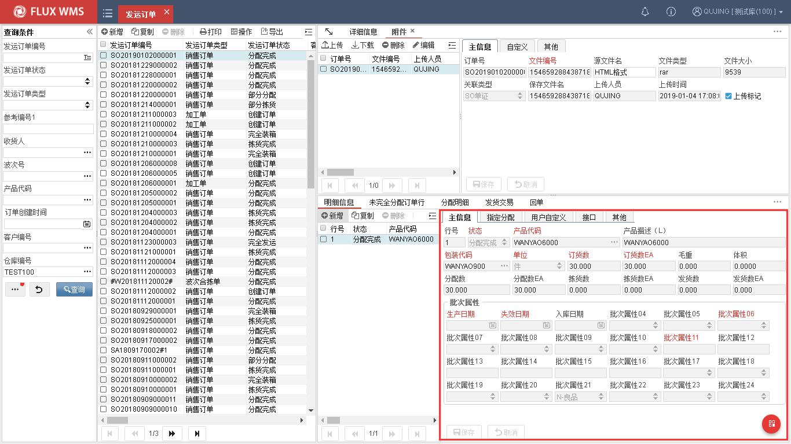

<!-- 原 PDF 第 343 页 -->

*[图 11-2-11]（原 PDF 第 343 页，图像未能从 PDF 对象中直接提取）*

行号－发运订单行号，新增时，系统自动给出。

状态－该订单行的状态。新建时，系统自动提供默认值：创建。

产品代码－所要发运的产品代码。

产品描述－该产品的描述。当输入产品后，系统自动给出该产品在产品档案中维护的产品描述。描述为双字段，分为显示母语（L）、外语（S）描述。

包装代码－该产品对应的包装代码。系统自动给出该产品在产品档案中维护的包装代码，用户也可根据情况选择其他的包装代码。

单位－发运时的数量单位。系统自动给出该产品在产品档案中所选择的缺省出货单位，用户也可根据情况选择其他的出货单位。

订货数－要求出库的产品数量。在订货数部分有 2 个字段，前一个字段是可输入的，以所选择的单位为数量单位；后一个字段是以所选择包装代码的主单位为数量单位，并且是系统自动换算给出。

毛重－待出库货物的重量。

体积－待出库货物的体积。

分配数－系统分配数量。同样有 2 个字段，前一个以所选择的单位为数量单位；后一个字段以主单位为数量单位。

拣货数－系统已拣货数量。

发货数－系统已发货数量。

批次属性－指定出库的批次属性内容，系统将按输入的批次属性出货。如果没有特殊出库要求，批次属性部分可为空，系统将根据库存周转规则的定义分配货物。此处的红色字体仅提示此内容在入库时为必输批次属性，出库时可根据需要指定。

  - 指定分配页签，用于维护订单出库的指定条件信息：

<!-- 原 PDF 第 344 页 -->

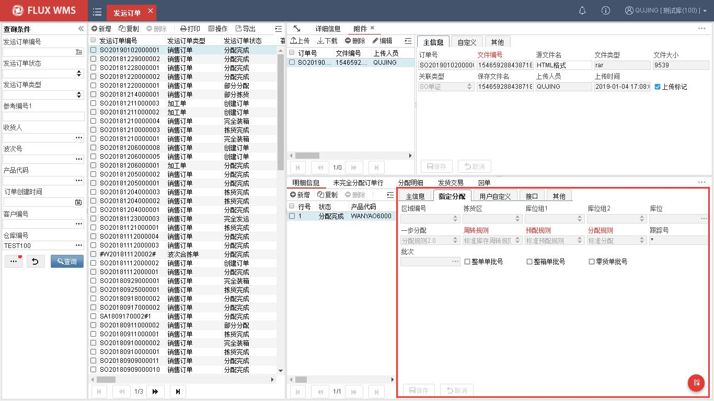

区域－指定拣货的区域。

库区－指定拣货的库区。

库位组－指定出货库位的所属库位组。

库位－指定出货库位。

一步分配－一步分配规则选择。

周转规则－该产品的库存周转。系统自动给出该产品在产品档案中所选择的库存周转规则，用户也可根据情况选择其他的库存周转规则名称。

预配规则－该产品的预分配规则。系统自动给出该产品在产品档案中所选择的预配规则，用户也可根据情况选择其他的预配规则。

分配规则－该产品的分配规则。系统自动给出该产品在产品档案中所选择的分配规则，用户也可根据情况选择其他的分配规则。

跟踪号－按输入的跟踪号出货。若输入了跟踪号，则不考虑预分配规则、分配规则和库存周转规则。

批次－指定出库的库存批次号码。

整单单批号－医药行业常用，出库时是否只分配一个生产批号的库存。

<!-- 原 PDF 第 345 页 -->

整箱单批号－医药行业常用，是否只分配同一个生产批号的整箱库存。

零货单批号－医药行业常用，是否只分配同一个生产批号的拆零库存。

  - 自定义页签，主要信息有：

允许混合包装－即订单行是否单品记录，或单包装记录。

免拣赠品－此订单行是否无需拣货的复核台赠品。

  - 点击【保存】按钮，保存新增明细信息。

### 11.2.2. 表头右键功能

- **订单取消、关闭**

订单创建后，在没有进行操作的情况下不再使用该订单，可以使用表头的删除按钮直接删除订单，或者使用鼠标右键菜单中的订单取消功能，取消订单。

订单取消后，将不能针对订单进行任何操作，但仍然可以查询到该订单（查询条件需要选择“显示关闭/取消 SO”），有利于用户统计、查询。

订单关闭，同样结束订单操作，不能再对订单进行任何修改，与取消不同的是，关闭针对使用中的订单，并不限定只能是创建状态订单。

<!-- 原 PDF 第 346 页 -->

需要注意的是，操作进行中的订单不能被取消或关闭。例如订单已经分配，但未发运。不论是否部分分配，都要将已分配记录取消，订单恢复到创建状态，或者将已分配记录确认发货后，才能对订单取消或关闭。

如果订单有生成对应的数量抽检单，关闭时会校验对应抽检单是否已检验完成。如果检验作业未完成，不允许关闭订单。

- **发货相关操作**

按订单进行预配、分配、拣货、发货等操作。具体细节参考 11.4 发货操作部分的详细介绍。

- **拆分订单**

订单下单后，由于各方面原因，需要分批出库，此时可以根据需要将订单拆分。拆分订单仅限于创建状态订单才能操作，在明细列表中可以录入释放数量，然后选择鼠标右键功能项“拆分订单”，系统复制生成新订单，并将订单的订货数量，按照录入的释放数量，拆分为 2 个 SO。原始 SO 中的数量，更新为释放数量。

- **冻结释放**

  - 订单释放

对订单进行审核确认，使订单处于释放状态，可以进行发货操作。

  - 订单冻结

对订单进行冻结操作，不能拣货、复核等操作。

  - 订单未释放

对订单进行审核确认时，由于各种原因，将订单置于未释放状态，不能进行发货操作。

  - 订单任务下发

更新订单释放状态为“任务下发”，常用于拣货任务下发给相关设备，如电子标签等。

- **单据打印**

系统提供的标准作业单据打印。

<!-- 原 PDF 第 347 页 -->

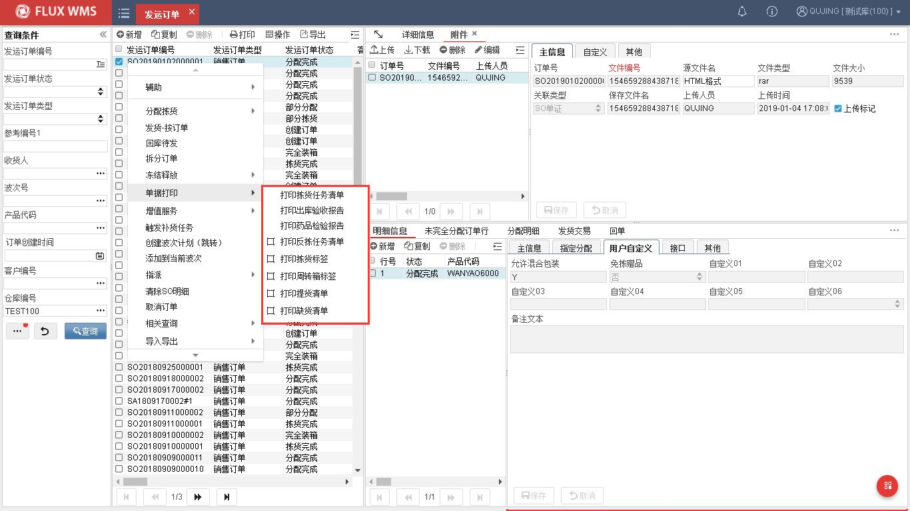

- **增值服务**

系统将增值服务相关的功能集合到“增值服务”子菜单中。

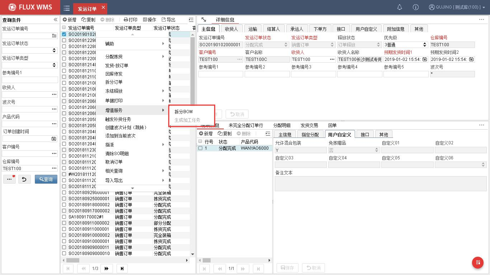

  - 拆分 BOM：

<!-- 原 PDF 第 348 页 -->

系统将订单明细中的组合件，按组件 BOM 结构和数量设置，拆分为多个零件产品的明细订单记录。通常用做加工操作流程中，获得加工所需的零件。

拆分 BOM 功能，也可单独使用，适用于按照 BOM 发子件产品，但不需要仓库中进行组装加工的情况。

在明细部分输入父件产品并保存后，选择表头鼠标右键菜单的“拆分 BOM”功能，系统自动将明细行中的父件记录按组件结构拆分为多条子件明细行。数量根据 BOM 设置进行换算。

明细行部分的鼠标右键菜单中，也有“拆分 BOM”功能，不同的是仅针对单个明细行拆分。

拆分 BOM 时，零件提取量，会根据作业情况考虑是否要提取整箱库存，通过参数 KIT_BOM_RND 进行配置，可以选择原数量，向上取整（多拣货），向下取整（少拣货），四舍五入进位几种不同方式。

  - 生成加工任务

如果需要在仓库中进行简单加工、组装，可以使用加工单对加工操作进行管理。

发运订单拆分 BOM 后，分配子件库存，并确认拣货。然后通过表头右键菜单的“生成加工任务”功能，可根据子件分配明细记录，生成对应加工单，指导加工操作。

后续加工操作，请参看增值服务部分。

发运订单（SO）生成加工任务的操作，可以指定只能由加工类型的 SO 生成加工任务，也可以不作限制。通过系统参数 VAS_BOM_CTL（是否只有加工单类型的 SO 才允许拆分 BOM）的设置进行控制。

- **单据生成**

单据生成子菜单内容，主要是根据 SO 分配明细信息创建其他单据。

日常作业中，有时会根据货主所给的产品清单指令进行一些库存整理工作，或者批量修改库存信息，例如要求产品代码更新。但货主所提供的指令，通常只下达产品名称、数量及需要修改的信息，很少会指明库位、跟踪号、批次等库存详细信息，难以直接用来导入生成移库单、转移单等作业单据。

为了便于操作，FLUX WMS 提供了根据 SO 生成其他作业单的功能。在 SO 中输入产品、数量及条件，通过系统进行分配，寻找合适的库存，再通过鼠标右键菜单功能，根据已分配的库存记录，创建对应库存作业单据，原 SO 自动取消分配，取消订单。

<!-- 原 PDF 第 349 页 -->

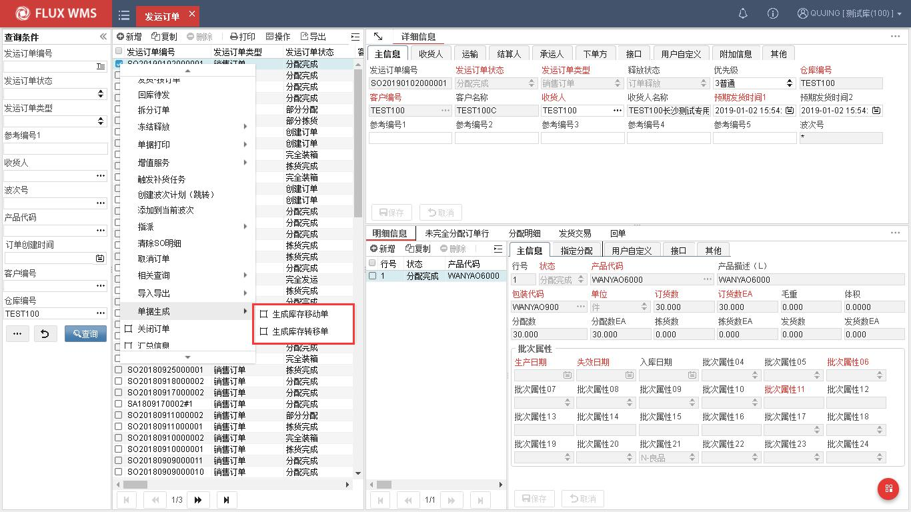

  - 生成库存移动单

根据 SO 分配信息，创建库存移动单据

  - 生成库存转移单

根据 SO 分配信息，创建库存转移单据

- **触发补货任务**

大量订单作业时，完全按拣货位上下限进行库存计算，有可能所补的货物不够订单需求数量，需要多次补货。因此可根据订单，提前补货，利用补充拣货位、快拣位，备足订单所需库存。

操作时，人工选择订单（可多订单）或波次，右键菜单【触发补货任务】，系统将选中的所有订单的需求量汇总，进行补货计算。

- **创建波次计划（跳转）**

表头右键菜单选项，选择多条 SO 记录后，生成波次计划。具体操作参看订单合并（WAVE） 的波次添加订单部分。

- **添加到当前波次**

为已存在的波此计划（WAVE）添加 SO，须要从 WAVE 中开始操作。具体操作参看订单合并 （WAVE）部分。

<!-- 原 PDF 第 350 页 -->

- **导入导出**

  - 复制 SO

根据当前发运订单，复制生成新的、创建状态发运订单，仅订单号码、创建时间不同

- **指派**

订单下达时，有些信息货主未指定，而是由仓库进行安排。或者是对已有信息进行变更，可以通过指派子菜单进行指定。例如原定承运人无法承运，需要变更订单的承运人。

指派子菜单，也可批量更新订单的运输方式、路线、服务等级、运单号规则等字段内容。

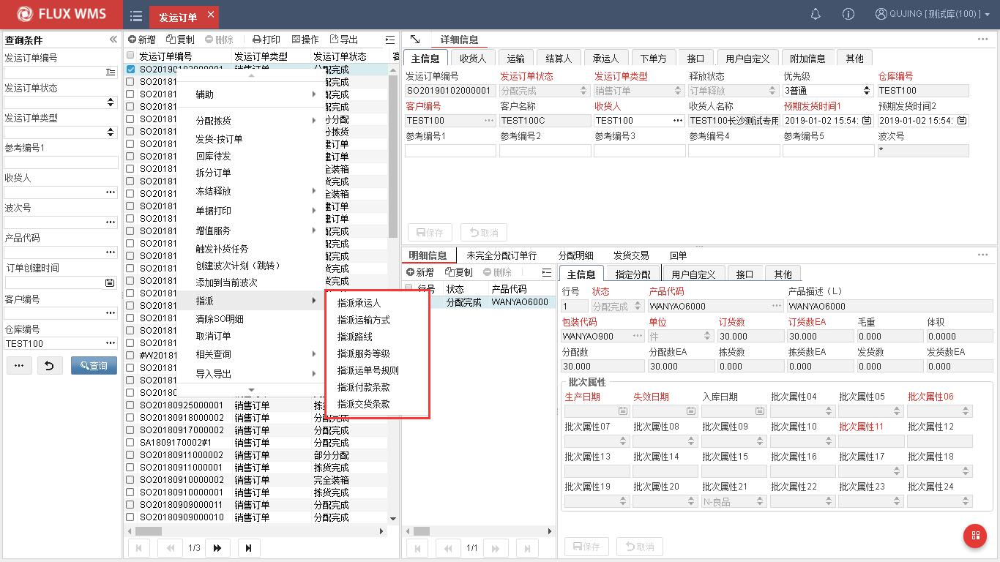

- **汇总信息**

显示当前订单汇总信息，包括产品汇总的数量信息，订单数量及体积重量等信息，如下图所示：

<!-- 原 PDF 第 351 页 -->

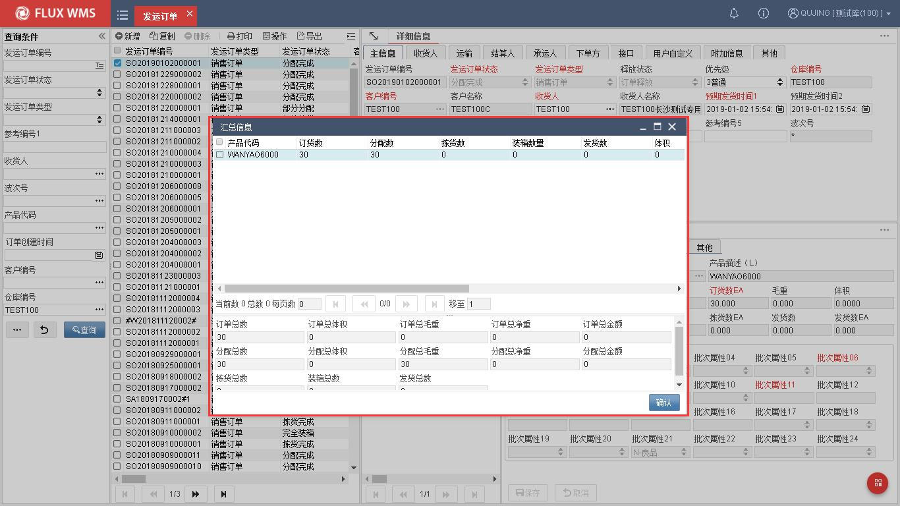

- **相关查询**

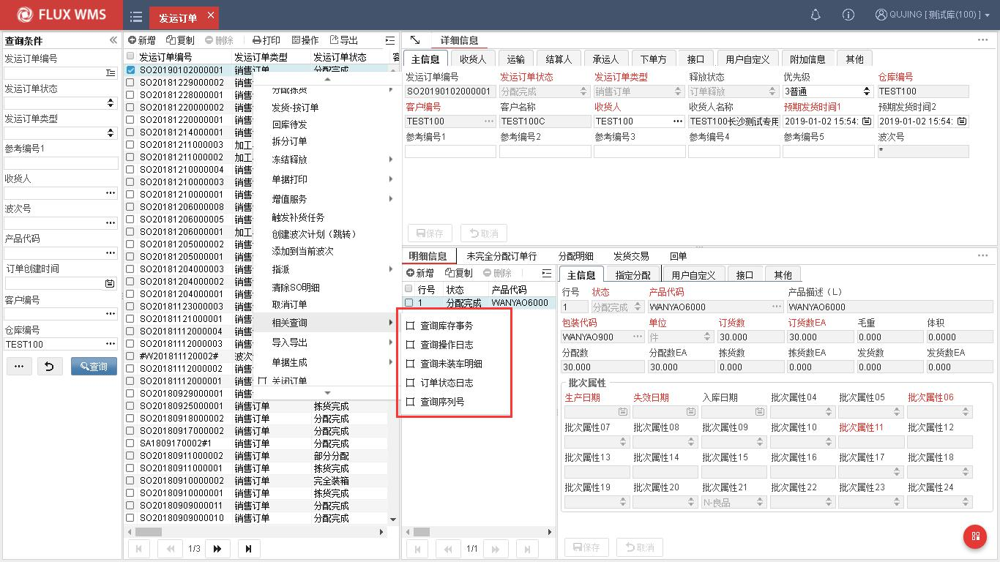

基于订单进行信息查询

  - 查询库存事务

<!-- 原 PDF 第 352 页 -->

跳转到库存事物查询界面，并将订单号带入查询条件，方便用户查询订单 UI 应信息。

  - 查询操作日志

部分操作，如打印单据等，系统不作为历史事务进行记录，仅在后台 log 中记录。如果个别作业对流程影响较大，可通过个性化配置为操作日志进行记录，并通过右键的“查询操作日志”功能，弹出窗口列表显示。

  - 查询未装车明细

弹出窗显示订单中尚未装车确认的记录

  - 订单状态日志

为方便订单状态变动信息通过接口传递给前后端系统（如 ERP），开启个性化配置后，系统在操作过程中记录订单状态变化情况，选择此功能后，通过弹出窗口列表显示订单状态变动情况。

  - 查询序列号

点击后，跳转到“出库序列号查询”功能，并根据订单号查询对应出库序列号。

- **清除 SO 明细**

此功能仅在订单创建状态下有效，可删除全部订单明细。常用于导入订单明细后发现错误时的反向操作。

### 11.2.3. 明细右键功能

明细部分右键功能主要有：

- **拆分 BOM**

加工操作相关功能。明细行为父件 SKU，通过“拆分 BOM”操作，根据 BOM 组件维护信息，按数量要求替换为对应的多行子件 SKU 信息。

具体加工操作步骤，可参考增值服务章节的介绍。

也有些业务情况，无需仓库加工，但需要根据客户指定的父件要求，拆分 BOM 后发货匹配的子件。

- **指定产品供应商**

订单明细行部分，鼠标右键子菜单功能项。需要与产品档案中的供应商设置结合使用，能够限定产品所述的供应商。操作时，系统参数 SKU_SUP_LNK（产品与供应商绑定）设置为 Y。

<!-- 原 PDF 第 353 页 -->

选择此功能，系统将产品档案中指定的供应商 ID 写入到订单明细的批次属性 05，可以达到指定供应商出库的目的。如果一个产品有多个对应供应商，系统显示供应商二级窗口供用户选择。

- **包装材料**

二级窗口显示产品对应维护的包材信息。

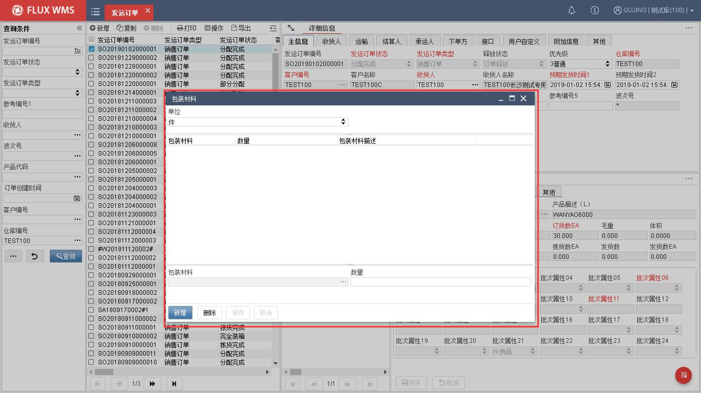

- **复制批次属性到所有行**

订单明细的批次属性内容为出库指定条件，人工修改时，可选择一行作为样本，复制到其他各行，方便操作。

- **复制拣货区/库位到所有行**

订单明细的“指定分配”页签内容同样是出库指定条件，能够复制功能复制到其他各行。

- **查询库存余量**

根据订单明细，跳转到库存余量界面，并以仓库、货主、产品作为条件查询库存。

### 11.2.4. 调拨出库/调拨入库

当调拨出库单关闭时，系统根据订单头标记（warehousetransferFlag=Y）和收货人信息是否为组织架构下仓库为条件，判断是否需要生成/关联调拨入库单。当需要生成/关联调拨入库单时，根据

<!-- 原 PDF 第 354 页 -->

参数配置值（TRN_CTL）判断具体关联调拨入库单方式：

- **参数设置为 Y 时（调拨入库单由 WMS 写入）：**

自动根据调拨出库单货主、参考编号、表头/明细用户自定义、表头/明细接口字段等信息，生成订单类型为 TT 的调拨入库单。并且系统自动将调拨出库单序列号、子序列号相关信息，写入调拨入库单所属仓库中。写入成功后调拨出库单序列号在库标记更新为 N，调拨入库单序列号在库标记更新为 Y。

- **参数设置为 N 时（调拨入库单由 DATAHUB 写入）：**

自动匹配调拨入库目标仓下，asnreference1 等于 soreference1，并且订单状态小于 90 的第一条入库订单。并且系统自动将调拨出库单序列号、子序列号相关信息，写入调拨入库单所属仓库中。写入成功后调拨出库单序列号在库标记更新为 N，调拨入库单序列号在库标记更新为 Y。

在此模式下系统允许调拨出库单和调拨入库单所属不同订单类型、不同货主（不同子公司之间调拨，可能货主不同）。

## 11.3. 波次计划（Wave）

波次计划即指订单合并操作，将多个 SO 合并为一个订单组（波次计划/WAVE），进行统一的作业管理。订单合并后，相应操作也可以合并处理，在操作量上形成业务波动，例如 5 个订单中都需要拣取 A 产品 10 个，订单合并后，可以一次拣取 50 个 A 产品，减少拣货操作次数、往返路程。它使用户将多种不同订单，依据某种共性合并在一个波次当中，整合为一个拣货作业。在这个拣货作业中，所进行的选择按照商品的库存流转规则和最有效的移动单元进行。系统将这些拣货分配到最佳的拣货区域，例如直接采用整栈板拣货，而避免去补货的动作。

波次计划的执行可以减少操作人员对单证分别操作的工作量，提高操作效率和准确度。

执行波次计划时，并不是所有订单都适合的，仅适合于从多具有相同或类似订单明细的单证。例如不同订单中，所需的产品完全不同，发货人也没有相关性，拣货路径没有可重叠、优化部分，此类订单即使合并，也不能减少操作工作量。

### 11.3.1. 单证创建

要将多个订单合并处理，首先要筛选合适的订单用来组合波次计划。

系统创建波次计划，可通过设置波次规则、定时器，由系统后台定时筛选订单、创建波次计划 （相关设置请参考业务规则-波次计划部分的介绍），也可以手动创建波次计划。

- **创建波次计划**

<!-- 原 PDF 第 355 页 -->

手动创建波次操作步骤为：

  - 选择“出库操作”中的“发运订单”

  - 在查询页面根据需要输入查询条件：

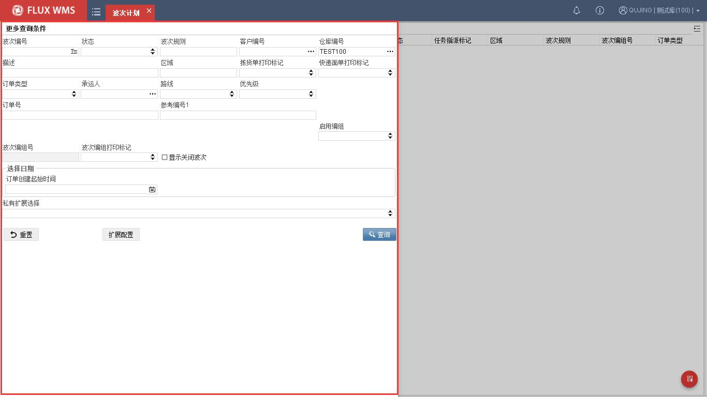

SO 编号－发运订单号

SO 状态－订单目前所处操作状态，如创建、完全分配等。可查询状态区段，例如部分分配到完全分配的订单。

SO 类型－发运订单类型。

仓库－默认为登陆仓库

参考编号－发运订单参考编号 1~5，模糊查询

客户编号－指定的货主代码

收货人－发运订单的收货人

承运人－发运订单表头记录的承运人 ID

优先级－发运订单的优先级

波次号－发运订单所属波次号

<!-- 原 PDF 第 356 页 -->

产品代码－订单中包括的产品代码

路线－收货人所在运输路线

波次产生－是否已包含在波次中（不限具体波次号）

用户自定义－订单附加信息

拣货单打印标记－是否已经打印拣货单

订单取消标记－是否带有 ERP 下达的订单取消标记

单品匹配－是否单品订单

显示产品所在订单的其他订单行－按产品查询时，是否显示结果订单中的其他产品行。默认选择此项，如果不选择，则只显示产品查询条件中录入的产品对应的明细行。

EDI 发送标记－是否接口已发送订单

显示关闭/取消订单－查询范围是否包括已经关闭或取消的订单。

时间范围信息：

订单创建时间－发运订单创建时间范围

预期发货时间－订单预计发货时间范围

实际发货时间－订单发货时间范围

模糊查询－所输入的查询条件是否进行模糊查询

  - SO 查询支持设置自定义的扩展查询条件。扩展内容配置请参考专项说明文档。

  - 点击【查询】按钮，系统根椐输入的查询条件检索符合要求的订单。

  - 在表头列表部分，勾选订单记录，或者通过鼠标右键“全选”功能选择全部查询到的订单

  - 点击鼠标右键，选择右键菜单中的“创建波次计划”（如下图），系统将把当前选择的多个发运订单创建为一个波次计划，并切换到波次计划界面。

<!-- 原 PDF 第 357 页 -->

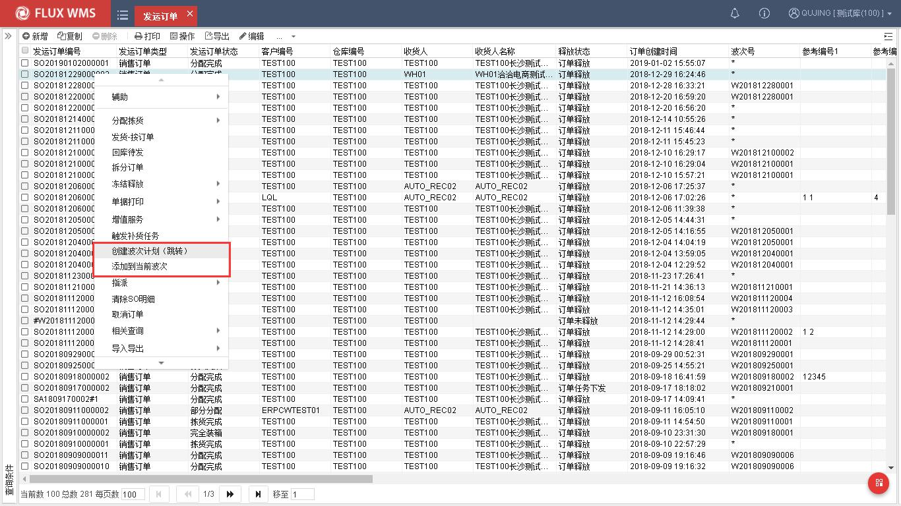

- **波次信息**

  - 在“出库操作的“波次计划”功能中，根据需要查询待操作的波次

  - 在查询结果显示” 的列表中，选择所需波次计划，系统显示波次主信息页面：

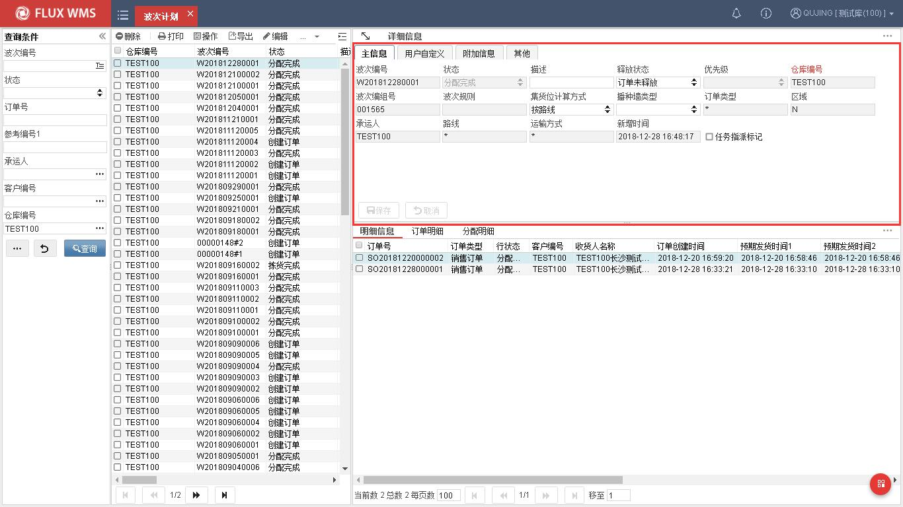

<!-- 原 PDF 第 358 页 -->

仓库代码－波次所属作业仓库。

波次编号－波次计划的单证号，系统自动生成。

状态－整个波次计划的状态，系统自动根据作业情况刷新。

描述－用户自行输入的、关于波次计划的描述信息。

新增时间－波次计划创建时间。

释放状态－波次计划订单是否被审核释放。

区域－是否区域操作波次

承运人名称－波次计划对应承运人。通常在根据承运人创建波次时使用。人工创建时如果整个波次计划中的订单是相同承运人的，系统会自动添加。

波次规则－记录波次计划根据哪个规则生成。人工创建此字段为空。

波次编组号－多个波次可作为一个打印编组，系统生成的编组号。

集货位计算方式－波次的集货位可以按不同方式进行计算，如按承运人计算集货位，或者按订单计算集货位。系统计算时，优先根据波次中此字段的配置计算，如果未配置，则根据参数 SRT_TYP（集货区分配方法）配置进行集货位计算。

播种墙类型－波次播种、图形化播种作业中所用的播种墙类型，根据基础设置播种墙类型下拉显示。

任务下发标记－波次计划对应任务是否已经下发。

波次编组打印标记－波次是否已完成编组打印。

路线－在波次计划规则中，可以根据路线条件，筛选相同路线的订单生成波次，相应将路线信息写入波次头的路线字段。如果不是按路线条件生成的波次，则路线字段为*。

运输方式－按运输方式条件生成的波次，则记录对应运输方式。

订单类型－按订单类型条件生成的波次，则记录对应的发运订单类型。

优先级－波次计划规则根据订单优先级条件筛选订单生成波次时，记录指定的优先级。

任务下发标记－通过波次计划规则生成波次计划时，同时自动将拣货任务下发，对应波次则勾选“任务下发标记”，表示此波次已有对应拣货任务下发，可以操作并发预拣、电子标签拣货分货等操作。

波次编组打印标记－已经分组打印。

<!-- 原 PDF 第 359 页 -->

  - 根据需要修改信息后，点击【保存】按钮确认记录修改。

  - 波次编组

多波次操作情况下，现场有时会将相同情况的若干波次作为一个分组，共同打印作业单据，或者下发任务等处理。此情况下可通过“波次编组”页签，了解编组以及对应打印情况。

- **明细信息**

在波次计划明细行部分，可见如下信息：

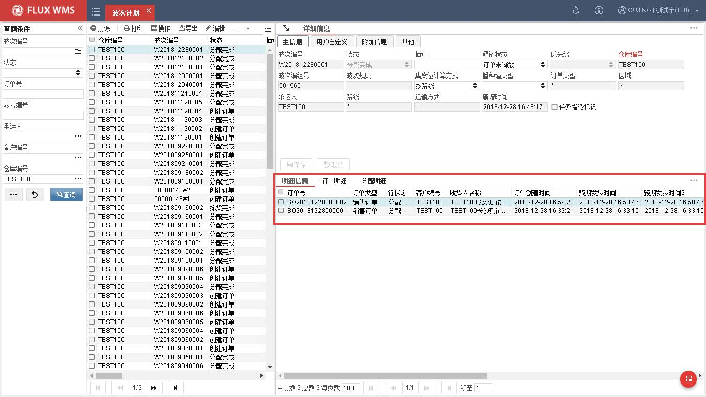

  - 明细信息

波次下每个发运订单的信息。包括订单号、行状态（单张发运订单状态）、货主、收货人、订单时间、预期发货时间、要求交货时间、毛重、体积等。

  - 订单明细

在明细信息列表中，点击某一行订单记录，再切换到“订单明细”页签，可以查看到指定订单的具体订货明细信息，如行号、状态、产品、订货数、分配数、发货数、单位等信息。

  - 分配明细

显示整个 WAVE 中，已分配订单行的分配记录。内容包括分配 ID、行号、状态、产品、数量等，与订单列表所显示信息内容相同。

<!-- 原 PDF 第 360 页 -->

### 11.3.2. 表头右键功能

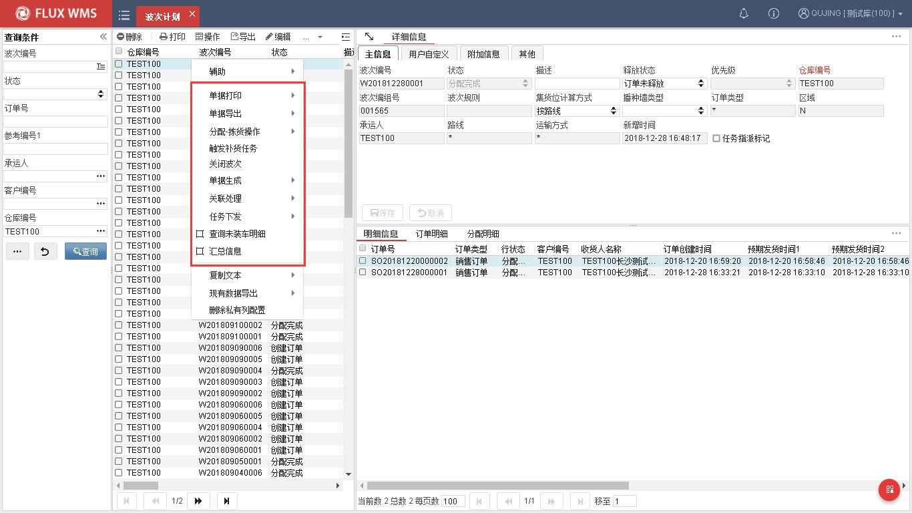

- **单据打印子菜单**

系统标准单据打印。包括拣货任务清单、医药行业药品检验报告。由于波次操作的特殊性，除了打印与 SO 相同的拣货任务清单，还可以打印几种不同的拣货清单

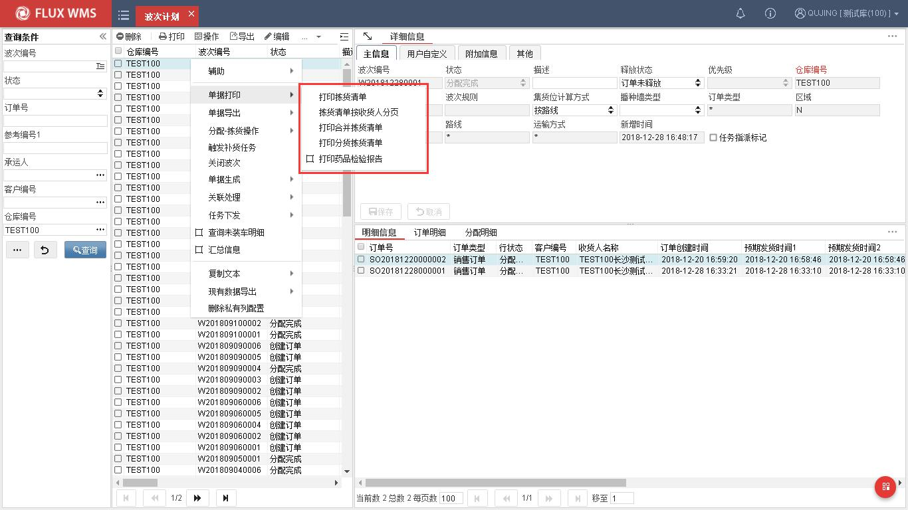

<!-- 原 PDF 第 361 页 -->

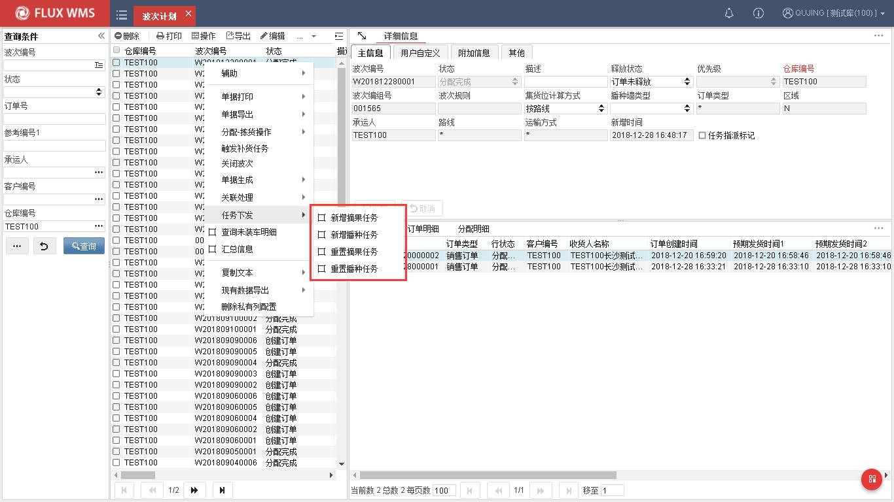

打印拣货清单－分订单打印拣货任务清单。类似 SO 中批量打印拣货清单的结果。

拣货清单按收货人分页－分页打印拣货任务清单。与“打印拣货清单”功能不同的是，同一收货人、不同订单的记录也会打印在同一页清单上。

打印合并拣货清单－多订单汇总后的合并拣货任务清单。

打印分货拣货清单－汇总拣取后按订单分货的拣货任务清单。

单据导出子菜单

- **单据导出子菜单**

打印单据导出为指定格式的 Excel 文件

- **任务下发子菜单**

波次分配记录下发为摘果、播种任务。也可将已操作任务重置，重新摘果或者播种，如下图。

*[图 11-3-6]（原 PDF 第 361 页，图像未能从 PDF 对象中直接提取）*

已下达相关任务的波次，不能删除。

- **分配-拣货操作子菜单**

分配、拣货相关功能，具体操作请参考 11.4 发货操作章节的介绍

<!-- 原 PDF 第 362 页 -->

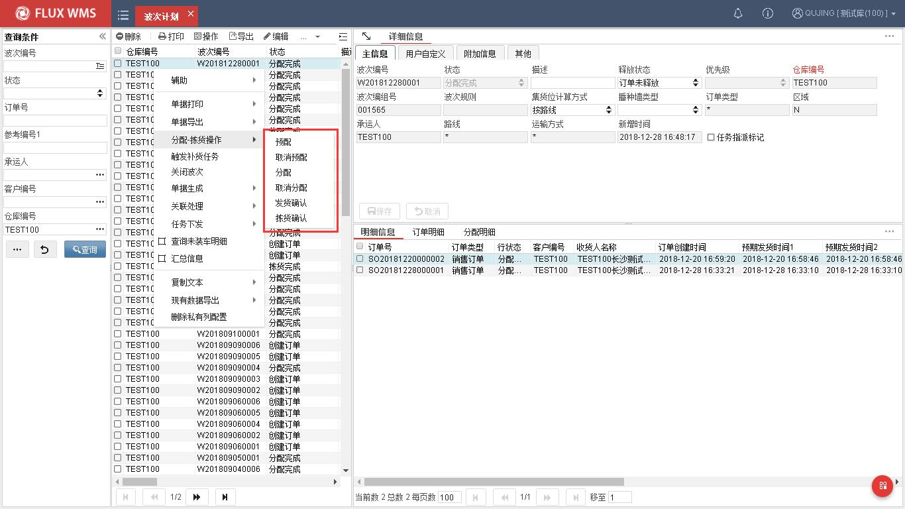

- **单据关联子菜单**

  - 关联面单号

提前批量打印快递面单操作模式下，如果面单号不是系统计算分配的（快递标签模式），而是多联单的快递单，需要采集面单号码与发运订单匹配。可以通过“关联面单号”操作进行批量关联。

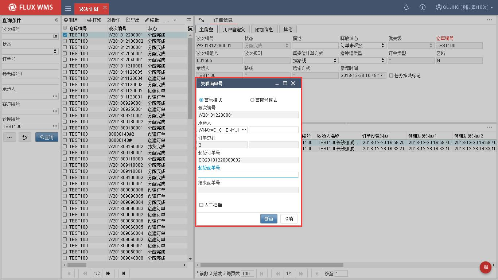

<!-- 原 PDF 第 363 页 -->

*[图 11-3-8]（原 PDF 第 363 页，图像未能从 PDF 对象中直接提取）*

    - 首号模式－适用于全部连续的面单号，输入起始单号，系统根据波次内的订单数量，逐一匹配订单，每单的面单号自动+1。

    - 首尾号模式－适用于面单号有断号的情况，输入连续号段的起止面单号码，系统逐一匹配订单，直到结束号码。后续订单，再输入新的面单号进行匹配。

  - 关联发票号

类似关联面单号功能，按波次提前打印发票时，将发票号与订单批量关联。

- **生成单据子菜单**

  - 生成装车单

根据波次计划生成装车单。

  - 生成波次合拣单

根据波次生成合拣虚拟单，以便将订单数量合并，达到从整存区域分配整箱/整托盘库存的目的。

- **查询未装车明细**

查询波次计划中没有装车的分配明细。

- **关闭波次**

波次计划关闭，不可再添加 SO 或做其他操作。如果波次中有订单未发运，则不允许关闭。

- **汇总信息**

显示波次汇总信息，如订单总数、分配数量等。

- **触发补货任务**

系统将选中的波次对应订单的需求量汇总，进行补货计算。

### 11.3.3. 明细右键功能

明细行鼠标右键菜单主要功能有：

- **增加**

为已有波次添加新订单。点击“增加”，系统跳转到 SO 界面，根据需要输入查询条件，查询订单。人工选择订单记录，可多条，选择鼠标右键菜单“添加到当前波次”，系统将所选 SO 加入到指定的波次中。

<!-- 原 PDF 第 364 页 -->

- **删除**

如有记录不需要在波次中一同操作，可通过“删除”功能，删除波次中的订单，但不影响该订单在发运订单界面的操作。

- **断点关联面单号**

打印中断、重新打印等情况下使用，选择某一明细行记录，点击右键断点关联面单号，显示面单号界面同表头的关联面单号功能，但默认将所选的订单记录作为首号进行后续操作。

- **断点关联发票号**

选择明细记录作为关联时的首号码。

## 11.4. 发货操作

FLUX WMS 的发货操作，常见步骤主要有分配订单、拣货确认、发货确认。其中发货确认是必不可少的操作步骤，其余环节可以根据业务情况采用不同的操作模式，或者跳过此环节。

例如出库流程中，实物的拣取是必须的操作，但是否需要在系统中执行拣货确认操作，可以根据业务需求进行安排。

### 11.4.1. 分配

系统按照订单要求来查找符合需求的产品，并按库位、批次和跟踪号等要求来保留产品的处理，被称为分配。分配后，确定的产品被锁定给指定订单。已被分配的产品将不能再次分配或变更库位。

- **分配操作**

  - 选择“出库操作”下的“发运订单”功能。

  - 在查询页面输入查询条件，点击“查询”按钮，查找订单。

  - 在查找到的订单列表中，选择所要操作的发运订单。

  - 在表头部分的鼠标右键菜单中，选择的“分配-按订单”功能。

  - 系统执行订单分配，可在明细部分的“分配列表”或“分配明细”中查看分配结果，或者“未完全分配订单行”页面查看未能完全预配的订单行记录。

  - 也可以在订单明细行部分，点击鼠标右键，选择订单行分配。或者通过批量操作，批量分配订单。

<!-- 原 PDF 第 365 页 -->

- **取消分配**

  - 在表头部分的列表或表头明细页面的列表窗口，点击鼠标右键，选择右键菜单中的 “取消分配”，可取消整个订单分配。

  - 也可以在订单明细行部分，点击鼠标右键，选择“取消分配--按订单行”，取消单行的分配。

  - 在分配明细页签，选择记录，右键“取消分配-按分配明细”，或者直接点击某行的删除按钮，也能够达到取消分配的目前。这 3 种操作对象范围不同。

- **拣货任务清单打印**

  - 纸面操作情况下，订单分配后，可点击表头鼠标右键的“打印拣货任务清单”，打印拣货单据。

- **人工修改分配记录**

部分情况下，仓库无法按照系统自动分配指定的库位拣取货物，而是人工另外拣取库存；或者只能通过人工指定分配的情况。此时，需要人工修改系统分配记录，或直接人工指定分配。

  - 在出库操作-发运订单中，查找到所要操作的订单记录。

  - 在明细部分的明细列表中，选择所要操作的订单行。

  - 点击分配明细页签，系统显示所选订单行对应的分配明细记录。

  - 选择所要修改的分配明细，点击删除按钮，并确认删除该分配明细记录。

  - 点击新增按钮，系统自动按照对应订单明细内容显示产品代码。

  - 点击产品代码旁的快速检索按钮，系统显示可选库存的二级窗口。

  - 在二级库存窗口，选择库存记录，双击确认。

  - 在分配明细页面，系统显示所选库存的库位、批次等信息，由操作人员输入分配数量，并保存，完成人工分配操作。

注：通常情况下，订单行分配总数量不可超过明细中的产品订货数量。

### 11.4.2. 拣货

拣货是按照发运订单要求，进行的产品收集活动。实物拣取后，在系统中进行拣货确认操作，并不是流程必须的步骤，但拣货确认可以把待出库的产品集中到特定库位，空出原有存储库位供后续操作使用，能够提高库位利用率。如果不做拣货确认，系统中的库存记录将仍旧保留在原存储库

<!-- 原 PDF 第 366 页 -->

位直到发运时扣减库存。拣货确认，也可以通过 RF 设备，或者语音设备等方式执行，具体请参考对应说明文档。此章节仅介绍 WMS 界面执行的拣货确认操作

- **拣货操作**

  - 选择“出库操作”下的“发运订单”。

  - 在查询页面输入查询条件，点击“查询”按钮，查找订单。

  - 在查找到的订单列表中，选择所要操作的发运订单。

  - 在订单明细部分的分配明细页面（如下图），输入拣货时间、拣货人，目标库位、跟踪号信息：

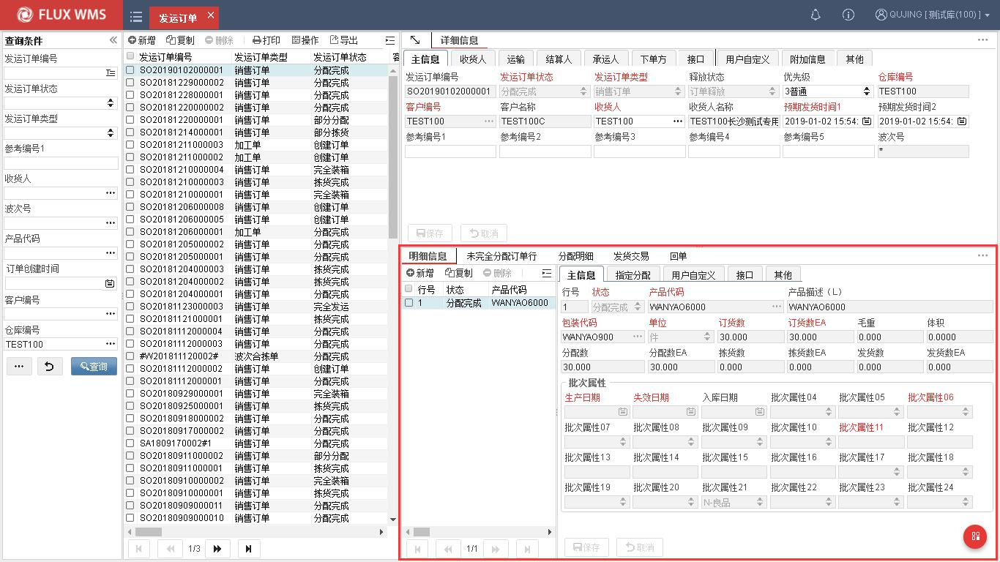

分配 ID－系统自动生成的分配明细流水号。

行号－分配明细对应的订单行行号。

装箱－出库复核装箱标记。

产品－分配的产品代码

批次号－分配的产品库存批次号

库位－分配到的拟拣货库位

<!-- 原 PDF 第 367 页 -->

跟踪号－库存原有跟踪号

包装代码－库存分配包装代码

单位－库存分配明细的数量单位

数量－分配到的库存数量，以所选单位为数量级别单位

数量_EA－分配到的库存数量，以主单位为数量级别单位。

目标库位－拣货移动到的目标库位，默认为同库存库位。启用集货位管理的情况下，由系统计算集货位。

目标跟踪号－拣货后新的跟踪号。可由用户输入，默认为同原跟踪号。（注：同一跟踪号不能出现在不同库位，系统会将后一跟踪号自动置为*）

体积、重量－分配到的产品的体积、重量。

分配时间－明细分配操作的时间。不可修改。

分配人员－执行分配操作的作业人员。

复核时间－执行复核确认的时间。同样由系统生成，不可修改。

复核人员－执行复核确认的作业人员。

拣货时间－执行拣货操作的时间。如未输入，拣货确认时，系统自动记录为拣货确认的当前时间。

拣货人员－执行拣货确认的作业人员。

发货时间、人员－执行发货操作的时间、发货人员。如未输入，系统自动记录为发货确认的当前时间。

备注－备注信息。

DropID－多级出库跟踪管理模式下，跟踪号的上级信息，一般用作箱号、托盘号跟踪情况下的托盘号记录。

批次属性－分配到的产品所具有的批次属性内容。

  - 点击【保存】按钮，保存信息。

  - 在分配明细部分，行列表窗口，点击鼠标右键，选择右键菜单里的“复制拣货信息到以下各行”功能，可将当前分配明细中的目标库位、目标跟踪号、拣货时间、拣货人员等拣货相关信息复制到后续分配明细中。

<!-- 原 PDF 第 368 页 -->

  - 在分配明细部分，行列表窗口，点击选择需要确认的分配明细行，或者使用鼠标右键菜单“全选”功能选择全部拟执行拣货确认的分配明细。

  - 选择鼠标右键菜单的“拣货--按分配明细”功能，确认已选记录拣货完成。

  - 系统将货物确认拣货到目标库位，并更新订单状态等信息。

  - 如果无需记录与系统操作员不同的拣货人员，并且没有拣货信息需要修改，也可以直接从表头右键菜单确认整个订单拣货完成。

- **其他右键功能**

  - 取消分配－按所选分配明细，取消分配。

  - 取消拣货－系统将取消拣货确认，订单回复到分配状态。

  - 反拣－根据已确认的拣货记录，生成反向的反拣任务。用于修正错误的拣货操作。

  - 发货－确认货物发运。

  - 复制发货信息到以下各行－根据当前分配明细，将发货信息复制到其他分配明细行。

  - 打印拣货标签－如使用 RF 操作等，可通过该功能打印操作中所用的拣货标签。

### 11.4.3. 发货

在系统中确认货物已经发运出库，系统将扣减库存、更新单据信息。执行发货，有多种触发方式，可以从 FLUX WMS 系统界面人工触发发货确认，也支持通过 RF 扫描发货（相关功能请参考 RF 操作手册），还可以通过定时器后台将符合条件的订单发运。

FLUX WMS 界面发货中，标准操作是通过发运订单进行发货确认。同时支持装车单确认发货、波次发货等操作（请参考相关功能说明。）

- **发货操作**

  - 选择“出库操作”下的“发运订单”。

  - 输入查询条件，点击查找按钮，选择所需操作的订单。

  - 对于可以整单发运的订单，可在订单表头部分的明细页面列表窗口，选择对应订单，点击鼠标右键菜单中的“发货--按订单”功能。

  - 确认后，系统将整个订单中，可发运（已被分配/拣货的记录）的库存全部发运。订单状态更新。

<!-- 原 PDF 第 369 页 -->

  - 系统同样支持逐条发运。在明细行部分的分配明细页面，输入/修改发货时间和发货人员，保存后，通过明细部分的鼠标右键菜单选择“复制发货信息到以下各行”。再选择拟发运的记录，右键“按拣货明细发运”。

- **发货控制**

系统出库操作流程中，订单、分配、发货是必须的作业步骤。如果需要将其他环节作为必须操作，可通过系统参数进行控制，例如未拣货记录不能发货，未复核记录不能发货，或者未装车记录不能发货。

如果作业过程中，接口下达取消指令，但由于作业流程关系未自动取消作业、取消订单，仅作标记。发运时会进行校验订单是否已被标记取消，如有，则不可发货。但如果已有明细行完成取消处理，剩余明细行可正常发货。

- **特殊发货模式**

  - 回库待发

有些仓库在装箱完成后，需要以整箱重新入库，等待客户将来发新的、只指定箱号的出库指令，重新拣货出库。

此时，正常订单拣货后，可通过发运订单表头右键菜单功能项“回库待发”进行操作。

系统将订单内的所有库存全部发运，并按照目标箱号重新入库。新入库的 SKU 代码统一为 FULLCARTON"，跟踪号为对应的箱号，数量全部为 1，库位在 PICKTOLOCATION，无批次属性信息。”

实物重新上架，一般通过 RF 的“按 ID 移库”功能完成。

  - 配送单作业发货

部分仓库，粘贴面单并采集面单号之后，与快递的交接不在需要仓库参与。采集到面单号，即视同货物出库。此时可采用配送单作业自动发货模式。具体操作请参考配送单作业环节。

  - 装车发货

货主装车后，整车确认发货。具体操作请参考装车单操作介绍。

## 11.5. 取消发货

如果发现发运错误，可是使用取消发货的功能修改，执行后，SO 状态还原到发运之前。即分配后发货的订单，订单状态返回到完全分配（或部分分配），拣货确认后发货的，订单状态返回到

<!-- 原 PDF 第 370 页 -->

完全拣货（或部分拣货）。

- **取消发货操作**

  - 选择“出库操作”菜单下的“取消发货”功能。

  - 输入查询条件，查找需要操作的发运订单记录

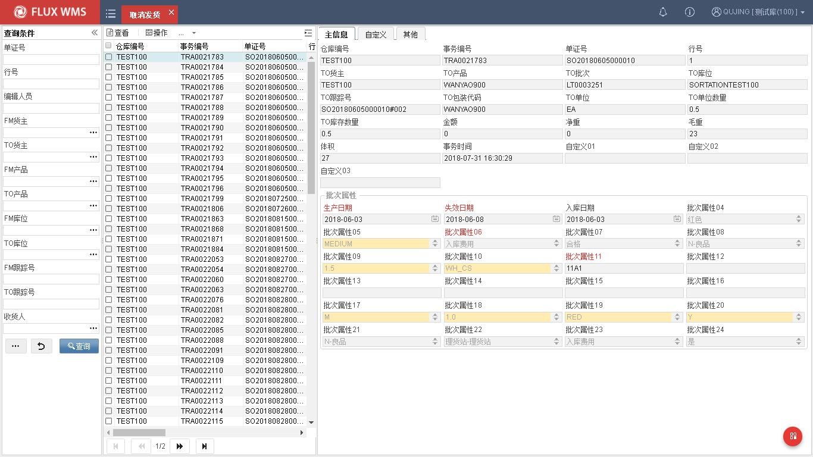

  - 选择所要取消的发货记录，也可通过右键菜单全选。

  - 鼠标右键菜单选择“取消发货”，系统将显示取消发货确认对话框，用户确认后，系统执行发货取消。原订单信息将会更新。

注：

已关闭订单，是否能够取消发货，通过参数开关（SHP_CCL_CHK）控制。如果允许，已关闭订单取消发货后，状态会回到分配或者拣货状态。

## 11.6. 手工波次模板

通过波次计划规则，系统可以自动创建。但有时创建波次时，希望根据信息条件人为进行干预。例如临近下班时段，当天需要发运的货物均已作业完成，希望剩余时间选择部分第二天需要作业的订单开始出库准备。按高重复率产品筛选订单，但采用自动模式生成的订单，很可能订单量较大，

<!-- 原 PDF 第 371 页 -->

无法在工作时间段内完成。期望按产品的订单重复率，查询、排序，人工选择作业量合适的产品，生成波次，进行操作。FLUX WMS 提供手工波次模板功能，在自动波次无法满足灵活的筛选需求的情况下，通过这个灵活的订单筛选操作界面供用户手动生成波次。

- **手工波次模板**

  - 选择“出库操作”下的“手工波次模板”。系统显示如下查询界面：

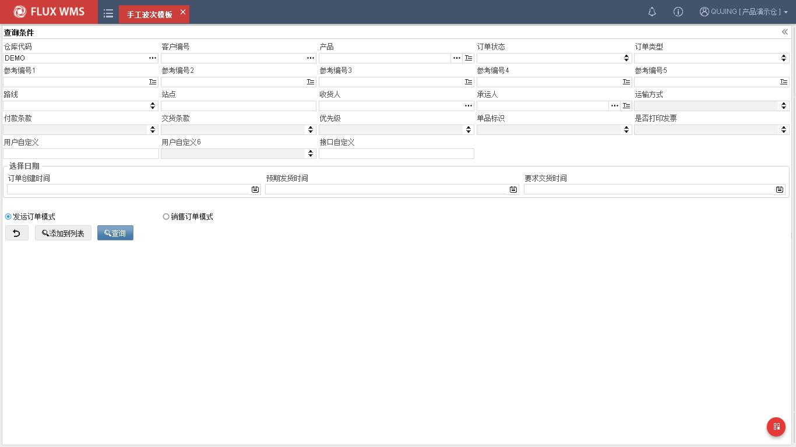

  - 模式选择：

此功能同时支持根据发运订单创建波次，以及根据销售订单创建销售订单组。通过查询界面的模式按钮进行切换。

  - 扩展条件

在“扩展条件”部分，可以进一步输入限定条件。

可选字段为发运订单表头字段。

<!-- 原 PDF 第 372 页 -->

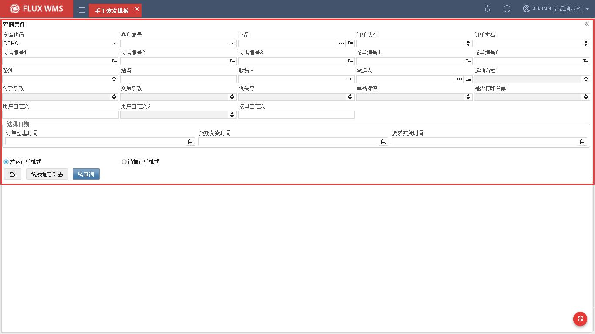

  - 查询符合条件的记录

支持查询条件导出、导入，也可将二次查询的内容添加到前一次的查询结果中（添加到列表）。仅查询符合条件、并且没有在其他波次/销售订单编组中存在的订单。

  - 生成波次

查询结果列表中，选择记录，通过右键菜单功能，生成波次计划或者销售订单编组。

<!-- 原 PDF 第 373 页 -->

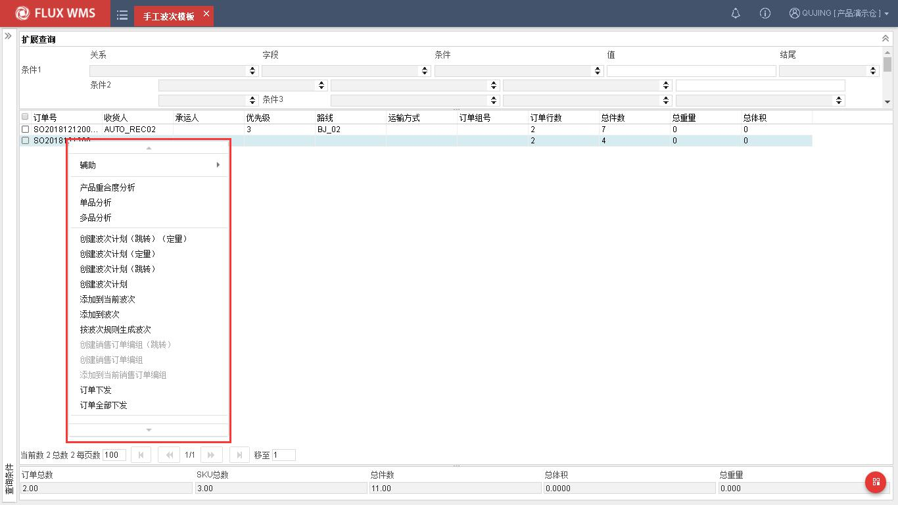

跳转模式－创建成功后切换到波次计划界面并显示相应波次计划。

定量模式－弹出框输入订单数量限制，系统按限制数量创建波次计划。

## 11.7. 出库复核

出库复核功能，主要用于拣货后（此处指实物拣货，系统拣货确认步骤不是必需的）、出库发运前，在仓库内对准备出库的产品进行复查，检验所拣取的待出库货物与订单分配明细是否相符。

在复核同时还可以执行装箱操作，记录产品分箱封装的明细情况。方便后续根据箱号追踪货物出库情况。

出库复核并非出库流程的必需环节，用户可根据操作情况选择使用。复核操作也分为多种不同操作模式，例如装箱操作，会变更库存所在的箱号；而仅复核的作业模式，则对库存信息没有影响。

### 11.7.1. 复核操作

- **复核装箱操作**

  - 选择“出库操作”菜单中的“出库复核”，系统显示如下明细复核界面：

<!-- 原 PDF 第 374 页 -->

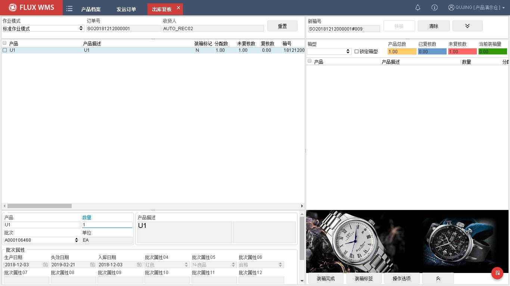

  - 订单信息获取：

出库复核，根据拣货作业模式不同，可选择按订单复核、按拣货容器（周转箱号）复核、按波次混合复核几种不同的复核操作模式。

如果前一环节拣货时，采用周转箱配合 RF，即拣货时记录货物拣取到哪个周转箱里的作业模式，在复核时就可以根据周转箱号提取箱内产品信息，按箱复核。此时需要在复核页面的箱号字段输入周转箱号，系统显示箱内货物对应的分配明细信息。

如果前一环节不做按箱拣货确认，按订单复核操作，则只需输入订单号，系统显示对应分配明细信息。

订单如果有对应备注信息，此时可以弹出显示，进行提醒，同样支持语音信息提醒。

根据参数 CHK_TYP（复核类型）的选择（也可以通过操作选项临时切换复核类型方式），界面显示为订单号/箱号/波次号输入框，通过人工输入信息或扫描号码条码息，回车或点击查询按钮触发信息获取，系统根据复核类型，以及输入的号码，获取对应分配信息，显示在复核界面上半部分。

FLUX WMS 还支持一些特殊的信息获取方式。例如按订单派箱操作方式，可以根据箱号，获取到整个订单的分配信息用于复核操作。需要设置系统配置参数 CHK_SCN_ORD（整订单派箱复核模式-通过箱号获取整个订单的明细）。也可以配合电子标签，根据电子标签库位号获取到整个对应 WAVE 的分配信息等。这些特殊的信息获取方式，具体需要结合用户流程要求确定应用方式，请联系 FLUX 顾问以获取进一步的了解。

<!-- 原 PDF 第 375 页 -->

  - 新箱号获取：

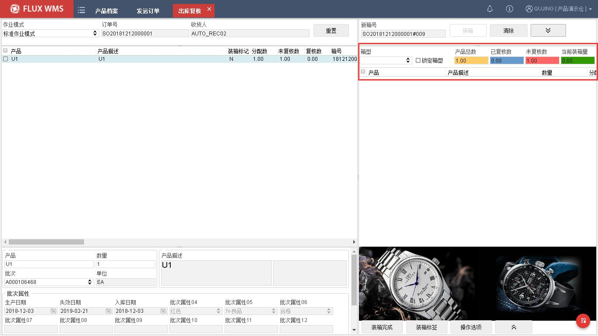

复核装箱后所用的出库包装箱的箱号，被称为“新箱号”，以便与拣货时的周转箱区别。

在部分流程中，出库所用的箱就是拣货周转箱，此时可以直接扫描周转箱号作为“新箱号”。如果出库用的包装箱使用系统生成的箱号，则点击“新箱号”按钮，系统分配装箱箱号。也可将操作参数 CHK_GEN_TID（复核装箱时是否自动产生新箱号）设置为 Y，系统将自动带出新箱号，光标定位到 SKU 字段，可直接扫描，不再需要人工点击【换箱】按钮。

在部分打印快递面单的作业情景中，也经常将快递面单号直接用作新箱号（具体新箱号应用，一般根据业务流程要求定义），可在系统中配置自定义的校验逻辑，对新箱号进行检验。例如新箱号不能等同于 SKU，不能等同订单号等，防止误操作。还有些情况箱号由系统根据预设逻辑从订单号池中获取。

  - 装箱扫描：

在产品代码字段，扫描或者录入产品 ID，系统校验 SKU 是否是分配明细中包括的、应该出库的产品。

逐件扫描模式下，可连续扫描产品 ID，每次扫描数量累加 1；批量扫描模式，则在扫描产品 ID 后，还需要确认此产品的数量。如果扫描的产品条码中包含有数量信息，则优先使用条码数量信息。系统会校验扫描到的产品数量是否已经超出分配信息中的应出数量。

<!-- 原 PDF 第 376 页 -->

扫描确认的信息会与分配明细记录相匹配、定位。相同产品多行记录情况下，优先匹配已拣货状态的分配明细行。

双条码模式下，还会显示指定的批次条码录入框，用户扫描对应条码后核对是否相符。

  - 装箱确认：

货物扫描完毕，复核完成，或者出库箱已满箱，点击“装箱完成”按钮，系统执行装箱操作，在 SO 分配明细中能够查看到装箱标记和箱号。

如果是满箱，尚有剩余货物，可以更换新箱，继续扫描装箱。

多数作业情况是一箱装满再装下一箱，通常选择一步装箱模式（参数 CHK_CFM_PCK 控制），满箱时只需点击【装箱完成】按钮，确认此箱封箱、更换新箱。

但个别业务情况，常有作业中来回切换箱号的情况。例如有些货物不能混装箱，拣货却是混合拣货送至复核台，业务人员操作时会发生货物装 A 箱操作到一半，下一货物需要分箱装 B 箱，后续货物又要装入 A 箱。此时可以点击【装箱缓存】，相当于保存此箱信息，但尚不确认完成装箱。当 A、B 箱装箱结束，再点击【装箱完成】按钮，提交装箱信息。

分配明细中的产品全部扫描后，系统根据参数 AUT_CFM_PKG（复核完成时自动提示装箱确认） 配置，控制提示信息显示。可提示用户应扫描作业完成，确认装箱，或者直接自动确认装箱。

  - 单据打印：

用户可根据需要，点击打印按钮打印装箱单或装箱标签。也可通过参数配置，在装箱后自动打印相应记录。系统参数为：

CHK_PRT_LBL，装箱完成后自动打印装箱标签

CHK_PRT_LST，装箱完成后自动打印装箱清单

- **仅复核操作模式**

除了装箱，还可以进行仅复核模式的操作（CHK_AND_PCK=N），系统会校验产品、数量，但确认时不修改分配明细的装箱标记，也不更新目标箱号。

- **订单排序复核模式**

普通复核为扫描产品，系统根据 SKU 匹配、定位到订单对应的分配明细。如 SKU 不具有条形码可供扫描，可以考虑采用订单排序复核的操作模式，以订单为基准，人工找到对应货物进行复核确认。

相关控制参数为 CHK_SEQ_ORD, 如果参数为 Y，则

<!-- 原 PDF 第 377 页 -->

  - 扫描箱号或者订单号后，自动将第一行明细的 SKU 带入复核界面，定位到数量字段

  - 当第一行复核完成并从界面上消失后，自动将下一行明细的 SKU 带入复核界面。

- **多人复核模式**

正常情况下一个作业单位（订单/拣货箱/波次）由一位操作人员进行复核。但如果订单内订货量较大，为了提高效率需要多人进行复核，校验产品、数量时需要考虑到其他作业台的当前操作情况，以免同时操作，导致数量校验超量。

勾选“订单多人复核”选项，系统将把多作业台的同单操作共同比对。

- **产品匹配订单模式**

波次拣货、复核情况下，选择“按产品匹配订单”勾选项，系统弹出二级窗口，扫描波次号、产品，检索波次里的未完成订单，按订单总数由小到大进行排序，定位到首个订单并自动将 SKU 带入复核界面，等待用户回车确认。

- **包裹转运模式**

包裹转运作业模式下，入库包裹作为产品，用包裹条码作为产品。

参数 PCL_XDK（包裹转运业务）开启情况下，出库复核时扫描包裹条码，自动弹出窗口，显示接口获取的包裹内产品信息，人工核对是否与包裹标签信息相符。勾选相符记录，并确认保存。

包裹转运模式下，忽略序列号相关配置，不启动序列号采集处理。

- **图片复核**

系统支持在扫描 SKU 时显示产品对应图片以辅助用户进行复核确认，进一步避免条码与实物不符的情况。

扫描 SKU 时，系统根据 CHK_PIC_DIR 参数中设置的图片存储路径，查找文件名为 CUSTOMERID+‘_’+SKU.jpg 的图片文件，并显示在出库复核左侧。

路径可为网络路径或本地路径。

### 11.7.2. 相关操作

装箱复核过程中，还有许多管理细节，可以根据业务需要启用：

- **扫描数量控制**

由于不同产品特性及订单情况不同，部分货物需要每件逐一扫描确认，而另一些货物或流程中，

<!-- 原 PDF 第 378 页 -->

一种产品可能一次性拣取多件。系统采用可配置方式，由用户自行选择使用何种扫描方式。系统配置中的参数 CHK_SCN_MTD 控制出库复核中，是否默认启用出库复核逐件扫描模式。用户也可在出库复核界面右下角点击“操作选项”按钮，在二级窗口中设置“逐件扫描”选项（默认同参数 CHK_SCN_MTD 中的设置），临时修改扫描方式。如果选中，每次扫描系统默认数量为 1，并将记录累加到左下方的复核信息部分；如果没有启用逐件扫描，需要人工录入数量，并点击下方的“确定”按钮，才能把记录加入到复核信息部分。

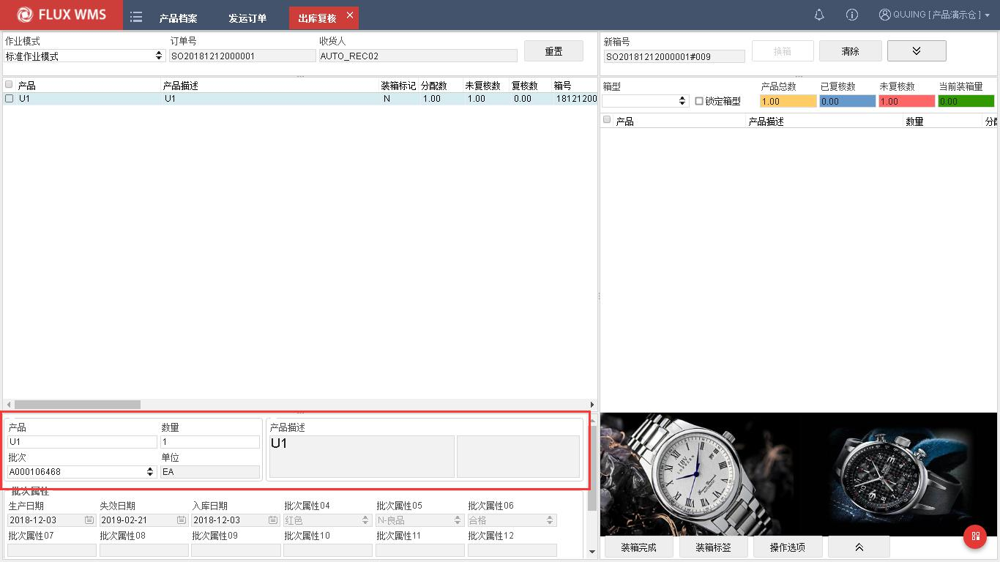

此外，有些业务场景，数量差异比较大，需要在批量复核与逐件复核模式之间来回切换。可以从操作选项中人工选择，但次数多时作业不便。此时可以启用系统提供的 CHG_SCN_MOD 参数控制支持，根据限定数量，自动在 2 种作业模式之间切换。

- **箱型校验**

<!-- 原 PDF 第 379 页 -->

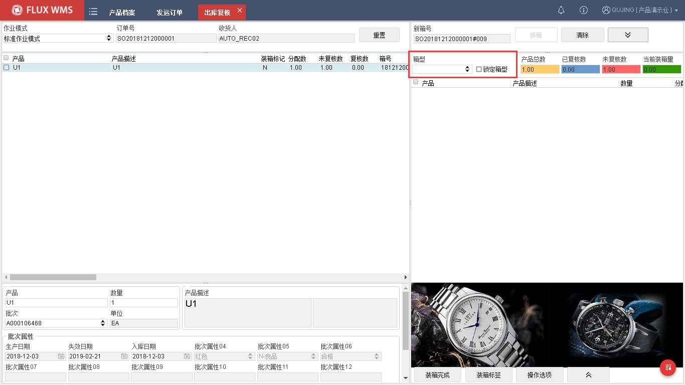

复核过程中，可以选择由系统指派出库箱的箱型（例如大箱、小箱），或者人工选择出库箱，扫描记录箱型。

参数 CHK_CTN_MNG 开启时，获取新箱号后，光标会自动跳转到“装箱 ID”字段，方便用户扫描/录入箱型，再进行 SKU。扫描装箱 ID 时，可播放对应的声音提示；若启用自动模式，系统将根据待复核订单明细的体积自动推荐装箱使用的箱型，并通过语音播报

若勾选“锁定箱型”，则保留装箱 ID 选择，直到取消“锁定箱型”勾选。

- **容积提醒**

系统支持装箱容积提醒功能（通过参数 PKG_CUB_HNT 控制），当装箱产品累计标准体积时，弹出窗口提示“装箱产品累计体积超过容量上限，是否继续？”

  - 如果选择是，则继续正常装箱，本箱后续不再提示；

  - 如果选择否，则对刚刚扫描的产品不做装箱确认"；

- **附加信息**

在操作中可以根据需要，记录出库箱的体积重量等信息。在出库复核界面，点击“附加信息” 按钮，系统显示如下二级窗口，用户可录入当前操作箱的对应信息并保存：

<!-- 原 PDF 第 380 页 -->

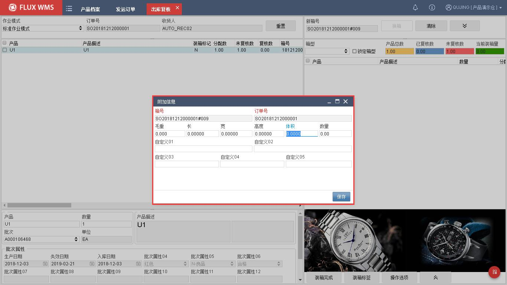

如果参数 PKG_SUM_POP 开启，系统在装箱确认时会自动弹出“附加信息”二级窗口，以便用户输入内容进行维护。

同时，如果参数 PKG_CUB_CHK（包装箱必须维护附加信息-体积）、PKG_WGT_CHK（包装箱必须维护附加信息-重量）开启，打印标签或装箱清单时，系统会校验附加信息是否输入体积或重量。

- **消息锁定**

复核扫描异常时，系统提示报错。在强效现场管理的情况下，要求高级用户/主管才有权确认报错，普通用户无权确认，需要等待主管检查。

通过系统参数 CHK_ERR_LCK，是否启用高级用户解锁，进行管控。如参数开启，复核界面弹出错误提示（正确提示不锁定），同时弹出另外一个窗口，要求用户输入用户名和密码。界面上的确定按钮可以通过授权控制，即只有指定的人在输入用户和密码后系统验证他对此按钮是否有权限。

不开启此项控制，作业人员有权确认错误提示，并可继续操作。

- **操作选项**

除了通过参数进行作业细节控制，作业界面也可以进行部分控制选项的设置，主要集中在【操作选项】按钮的二级窗口中：

<!-- 原 PDF 第 381 页 -->

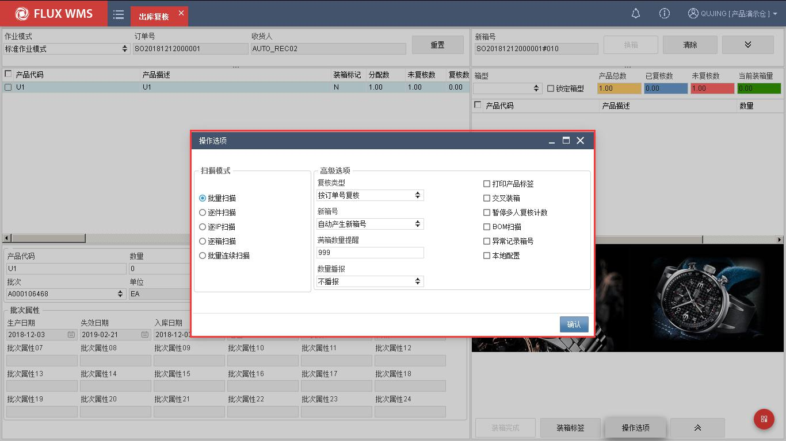

  - 数量扫描模式：

扫描 SKU 时，对应数量可以由人工输入（批量扫描模式），也可以默认为 1，逐一扫描 SKU 累加数量（逐件扫描模式），还可以根据产品对应包装的数量，每扫描一次增加整包装数量（逐箱扫描模式、逐 IP 扫描模式）。整包装扫描模式下，数量字段固定为系统包装中维护的对应数量，不可修改。

支持通过 CTRL+数字键的模式，快速切换扫描方式。

需要注意的是，如果序列号管理开启，出库复核需要采集序列号的情况下，系统强制逐件扫描，选择批量扫描模式将被忽视。

  - 满箱数量提醒：

类似入库扫描收货时的满箱提醒，但由于出库复核箱是混 SKU 装箱，因此满箱提醒数量统一维护。默认为 999

  - 复核类型：

默认为参数 CHK_TYP 配置内容，允许作业用户在操作选项中临时修改，方便业务切换（复核人员通常没有参数修改权限）。并且此处的修改只影响作业客户端，对其他客户端无影响。

  - 新箱号：

<!-- 原 PDF 第 382 页 -->

默认为参数 CHK_GEN_TID（复核装箱时是否自动产生新箱号）效果，可允许作业用户在操作选项中临时修改。

  - 打印产品标签：

复核同时，输出产品对应标签

  - BOM 扫描：

组件复核模式，分配明细是子件信息，复核时扫描父件 SKU，按 BOM 比例确认对应子件复核装箱。

  - 双条码扫描

开启后，系统显示如下批次条码扫描字段，作业时，需要同时扫描产品条码、批次条码 2 个不同条码，隐藏批次选择下拉框，通过批次条码扫描，解析返回对应的批次属性值，系统定位到对应属性的记录进行复核校验。

  - 交叉装箱：

多箱交叉作业时，选择“交叉装箱”则系统执行“装箱确认”后，自动执行“换箱”逻辑，清除界面信息（正常模式下装箱完成才清空，装箱确认仅临时保存），然后根据新箱号参数生成新箱号或清空新箱号字段人工输入。

同时，交叉装箱的情况下，复核时不再弹出称重和附加信息框。

  - 暂停多人复核计数

多人复核过程中，发生异常需要重新扫描货物时，开启此选择，以免重复计数。扫描完成，去除勾选，继续正常操作。

  - 按波次顺序复核

适用于并发预拣无纸化操作，开启后，通过在二级窗口录入波次号，指定播种位次序，定位到对应的订单，获取订单信息，进行复核。

<!-- 原 PDF 第 383 页 -->

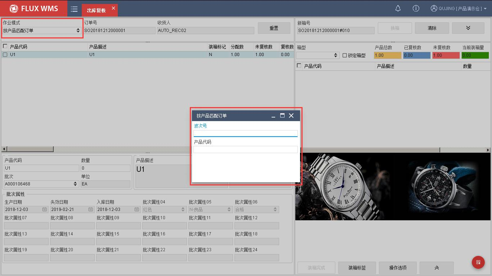

- **异常处理**

针对出库复核操作过程中，实物多货或者少货的情况，进行异常记录，方便进行集中的异常管理。出库复核时的异常，很多都是由于拣货错误，或者拣取的货物放错周转箱。通过异常处理可以提示不同复核台的异常，方便找货，也减少重新拣货的需要。异常处理是可选的操作功能。

  - 分配明细部分，鼠标右键菜单功能项，选择问题库存记录，点击 “异常处理”，系统显示如下二级窗口界面

<!-- 原 PDF 第 384 页 -->

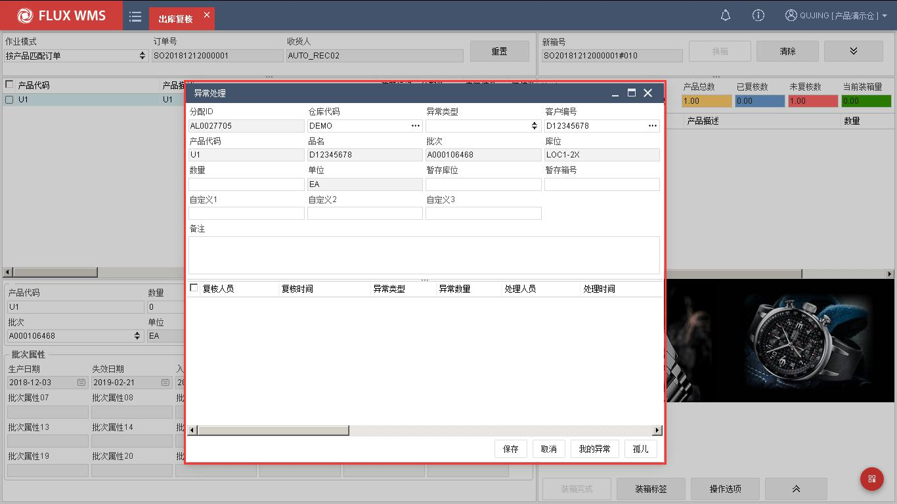

  - 分配 ID、产品、库位信息，为所选分配明细的对应信息。人工选择异常类型、数量，进行保存。如果是多货，则输入问题货品的暂存库位，以便后续处理。

  - 在异常处理界面下方的列表部分，显示当前处理的产品所有未关闭的复核异常记录，可供查看，方便不同复核台间的货品调剂。

  - 列表部分右键功能项“关闭异常”，可关闭当前用户登记的异常记录。

  - 异常窗口点击按钮我的异常，则显示当前用户登记的异常记录。

  - “孤儿”处理：针“对订单中不” 存在的 SKU 进行异常登记。由于多出来的 SKU 经常是其他复核台缺少的货物，通过记录可帮助匹配，减少重新拣货、还架的重复作业。点击“孤儿”按钮，用户输入 SKU、暂存位置、数量等信息，便于其他复核台匹配缺货。

  - 进入异常处理二级窗口时，如果用户没有选择记录，则自动进入孤儿模式。

- **发票管理：**

用户可根据作业需要，在复核后触发发票打印以及发票号录入。通过订单头的发票管理字段（后台字段，通常接口传入信息），控制是否打印发票，是否需要录入发票号。可分为按打印发票并关联发票号，仅打印无需关联，按箱打印关联发票，不打印发票几种模式。

需要打印、关联的情况下，根据 IVC_PRT_TIM 参数（关联发票号前/后打印发票）配置，控制

<!-- 原 PDF 第 385 页 -->

打印、关联的先后次序以适应不同的业务场景。如果参数 CHK_IVC_CAL（打印发票时自动计算发票号）开启，系统根据配置文件中呢内容，自动计算发票号，无需绑定。一卷发票用尽后，在弹出的重新绑定窗口，扫描获取新发票的起始号码。

- **包材管理：**

如果复核过程中需要记录所用的包装材料，可以通过点击【包装材料】按钮，系统弹出如下包装材料二级窗口，用户扫描包材条码，点击确认按钮（或者通过 F3 快捷键确认），完成包材记录。

包材条码每扫描一次，数量累加 1，如果扫描次数与包材默认数量（可配置）相符时，系统自动确认、关闭包材窗口。

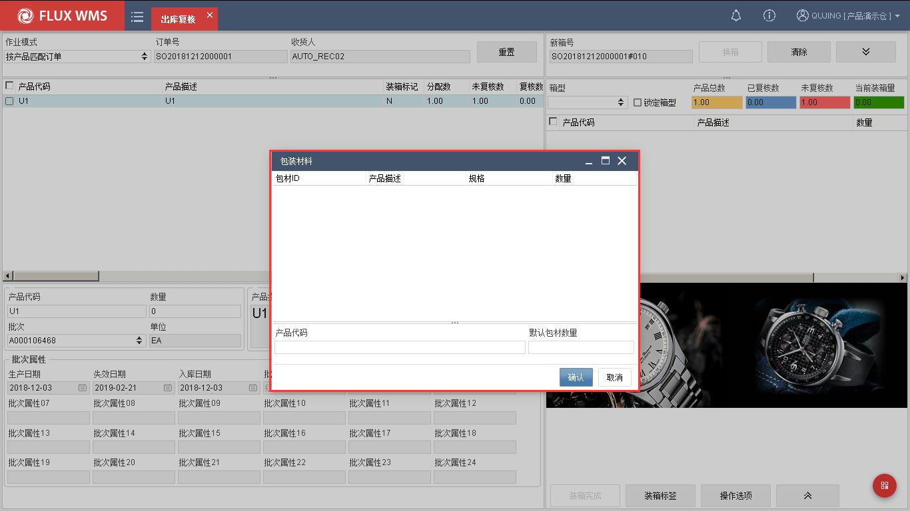

- **装箱进度**

<!-- 原 PDF 第 386 页 -->

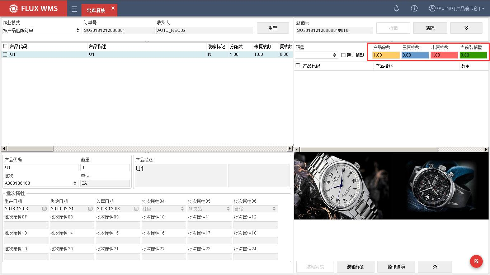

装箱进度用不同色块显示：

黄色：订单总数量

灰色：已经装箱的数量

红色：尚未装箱的订单数量

绿色：当前箱的实时装箱量，扫描时自动累加。在执行【装箱完成】后自动清 0。

- **统计信息**

点击【统计信息】按钮后，显示订单对应的整箱、零箱相关统计信息。

<!-- 原 PDF 第 387 页 -->

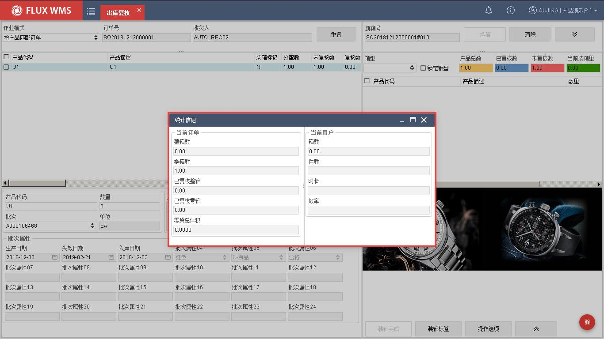

- **拍照**

复核同时控制摄像头进行拍照，并可将照片上传，提高客户体验。

- **录像**

复核同时控制摄像头进行录像。与普通监控录像相比，可以针对每箱分隔为小的录像文件，方便查到对应记录。

- **退换货卡维护**

为方便售后维护，如果参数 REG_SVC_CRD（出库复核/单品复核登记退换货卡号）开启，当前订单(参数 Y)/当前箱(参数 C)最后一件商品复核完成，在系统自动弹出窗口确认装箱完成前，弹出窗口扫描并记录“退换货卡号”。

- **反拣提示**

如果订单已被取消，复核时可以拦截提示，避免已取消订单被发运出库。

但对于所拣取的货物，实物需要反架，只是根据仓库管理不同，有些是集中后定期专人处理反架，有些是及时拦截，及时反架。操作可通过原有拣货清单查看信息进行，或者生成反拣任务，通过任务指导进行。

当参数 GEN_RVS_PCK（订单取消时进行反拣操作）开启时，如果扫描到已取消的订单，系统

<!-- 原 PDF 第 388 页 -->

除了拦截，提示取消之外，还会要求扫描存放反拣商品的周转箱号，并生成对应的反拣任务。

### 11.7.3. 鼠标右键功能

- **分配明细鼠标右键功能项**

分配明细部分，鼠标右键菜单内容有：

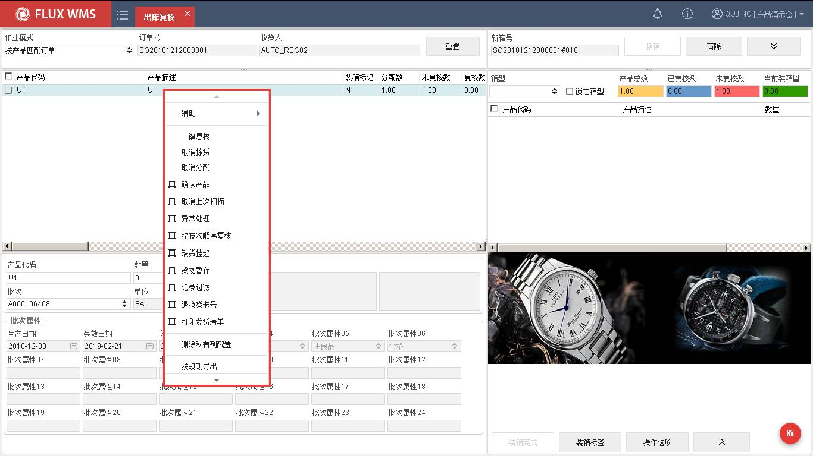

  - 一键复核：

将窗口的所有分配明细全部一次性确认到装箱明细列表，之后人工进行正常的装箱完成等后续操作。省略了一个一个产品进行扫描确认的过程。

序列号作业模式下，为了避免漏扫描序列号，一键复核功能不可使用。

  - 确认产品：

可选择产品记录，加入到复核部分，效果类似扫描/输入产品代码。通常用于货物上没有代码可扫描的情况下，人工选择产品。

异步序列号采集模式下（即 SKU、序列号分别扫描采集），确认产品功能禁用，以免漏扫描序列号。

  - 取消上次扫描：

<!-- 原 PDF 第 389 页 -->

在重复扫描的情况下，选择产品，点击此功能项，能够在现有复核数基础上，扣减 1 个扫描数量。

  - 取消拣货：

针对所勾选的分配明细记录，取消拣货，并重新刷新界面显示。

  - 取消分配：

针对所选的分配明细记录，取消分配，并重新刷新界面显示。

  - 货物暂存：

复核过程中如果出现缺货，会有一段等待时间，此时操作员会把箱子暂存到一个位置，等补拣的货物抵达后，扫描周转箱后提醒需要合并复核的箱子所在的位置。

  - 按波次顺序复核：

操作选项中已勾选“按波次顺序复核”情况下，选择此功能后，显示波次号、次序录入二级窗口，通过扫描并发预拣的小车号，根据分拣位顺序定位到订单。

- **扫描信息鼠标右键功能：**

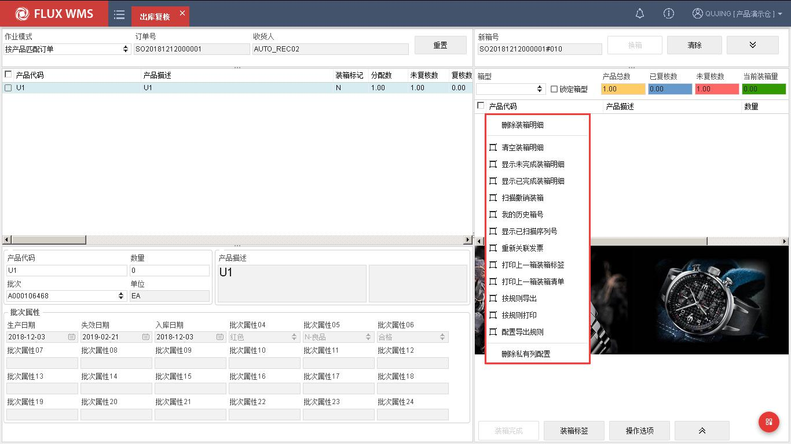

  - 清空装箱明细：

在扫描产品后，确认装箱完成之前使用，能够清空当前箱号下扫描到的内容，重新开始扫描装

<!-- 原 PDF 第 390 页 -->

箱。

  - 显示未完成装箱明细：

在非一步装箱情况下，需要先点击“确认装箱”按钮，再点击“装箱完成”。此时如果用户仅操作了第一步确认装箱而没有操作第二步装箱完成，会在系统中遗留未完全操作记录。

显示未完成装箱明细功能，点击后系统会查询当前用户的未完成操作记录，并在二级窗口中显示。

  - 显示已完成装箱明细：

装箱明细部分，鼠标右键菜单项。选择后，系统显示如下二级窗口，输入订单号或箱号查询条件后，可用来查询相应已装箱完成的记录明细。

同时，对于已装箱记录，可以在勾选后点击【重置装箱标志】按钮，将对应记录还原到未装箱状态重新进行操作。

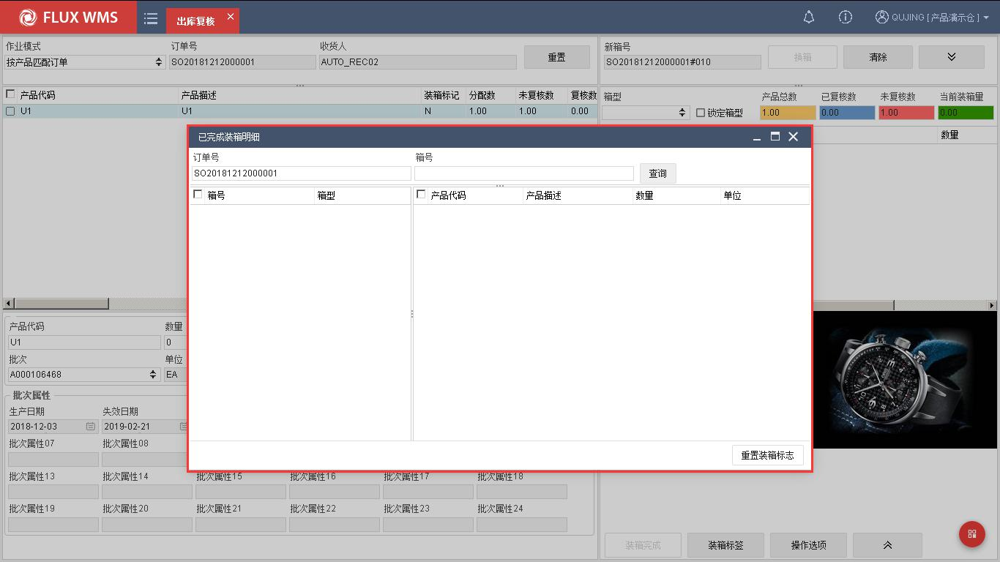

  - 删除装箱明细：

装箱明细部分，鼠标右键菜单项。在装箱明细部分，选择记录，再选择此右键功能，系统将从装箱明细中删除此记录。

与其他操作相比较，“取消上次扫描”是只为所选产品的复核装箱数量减少 1；“重置装箱标

<!-- 原 PDF 第 391 页 -->

志”则针对已经确认装箱完成的信息，并可以同时还原多个产品的装箱操作，但不能只还原一条记录中的一部分数量。“删除装箱明细”则在确认装箱完成前使用，需要按记录逐一操作。

  - 我的历史箱号：

当前作业人员已确认装箱记录列表。关闭出库复核界面后清空。

  - 显示已扫描序列号：

通过二级窗口显示已经扫描序列号信息，可在此界面删除所选记录。

### 11.7.4. 行业复核要求

不同行业操作复核时，由于行业特点，经常会有不同的作业细节要求。

- **服装行业复核要求**

  - 同款装箱

服装行业使用功能。同款不同色、码的产品，是不同 SKU，装箱时要求一个箱内只能装同款的不同 SKU。

通过参数 CHK_SKU_GRP 进行控制，复核时是否只能装同款产品。服装的款号信息一般维护在产品档案的产品组字段 1。

- **医药行业复核要求**

  - 双人复核：

一些特殊药品，如麻醉、精神药品，复核时需要进行双人复核。

启用医药行业插件（IND_MED=Y）情况下，产品档案的医药行业页签，勾选“二类精神药品” 选项，如下图。

<!-- 原 PDF 第 392 页 -->

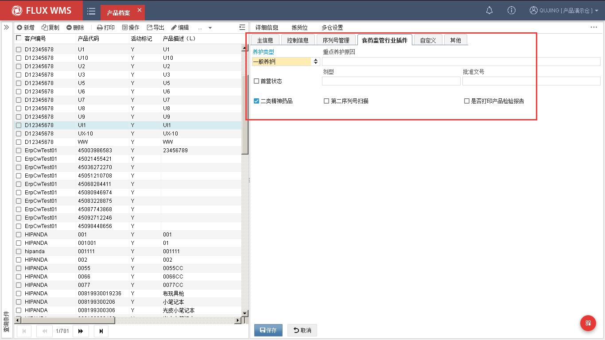

出库复核界面，扫描 SKU 时，如系统检测到此产品为二类精神药品，则弹出如下的双人校验窗口，第二复核人需要输入用户名、密码以确认二次复核通过。

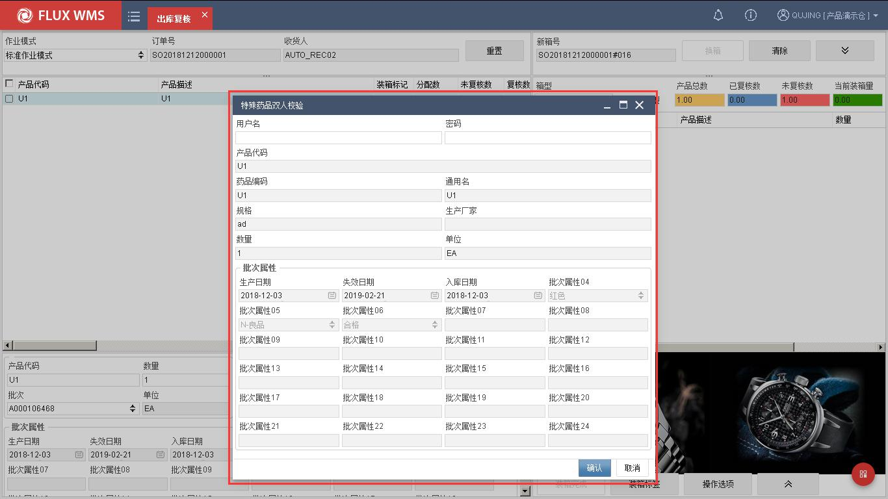

系统将第二复核人记录到分配明细的 DoubleCheckWho 后台字段。

<!-- 原 PDF 第 393 页 -->

  - 序列号扫描：

产品设置中，如果是监管药品，或者选择第二序列号扫描情况下，出库复核扫描产品时，显示序列号/监管码、第二序列号录入窗口，将扫描的序列号记入到发运订单的序列号信息表中，以便跟踪。

如果产品档案的出库序列号数量验证设置为“序列号数量与出入库数量必须一致”（MATCH），系统根据待复核数量，以及产品包装（如果批次属性 12 有包装信息，以批次中的包装数量优先）计算最小序列号扫描个数（例如 1 箱至少要扫描 1 次监管码，而 4 件，至少需要扫描 4 次）。

## 11.8. 单品复核

单品复核是在出库复核基础上扩展出来的一个快捷复核功能，针对于单品订单（即一个订单中只订购 1 件产品，或者只订购一种 SKU、多个数量的单行订单）。

由于都是单品订单，只要是正确的 SKU，给任何一个订购此产品的订单均可，因此单品订单不是传统的根据订单采集产品的单配货模式，而是货配单模式，操作效率有较大提升。但使用此功能的前提是需要先筛选出合适的单品订单，拣货操作时单品、多品需要分开拣货。

- **单品复核操作**

  - 选择“出库操作”菜单的“单品复核”功能，显示界面如下图：

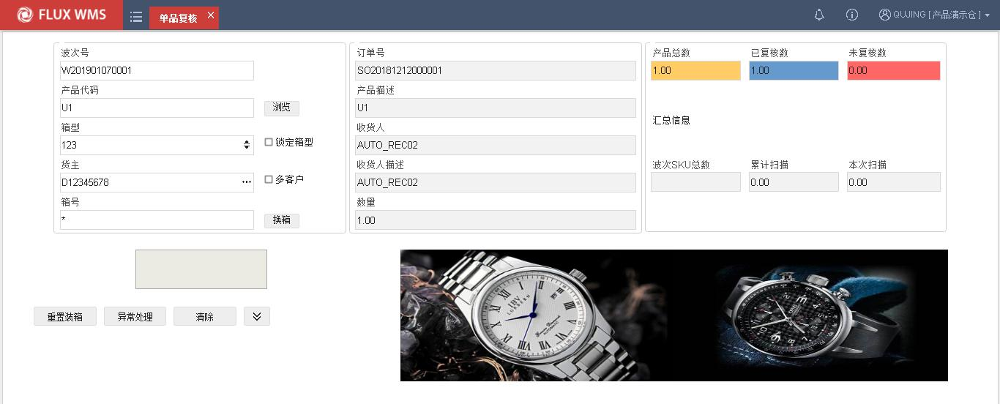

  - 根据需要输入货主代码、波次号条件，限定匹配订单的范围

  - 如果波次包含多货主订单，勾选“多货主”选项，系统根据扫描的 SKU 确认货主。

<!-- 原 PDF 第 394 页 -->

如遇到不同货主具有同一 SKU，则弹出框人工确认。

  - 类似出库复核，如果需要则确认装箱 ID。如果参数 CHK_CTN_MNG（包装箱管理）配置为装箱后选择，则先扫描 SKU，再跳转到装箱 ID 强制录入。

  - 若勾选“锁定箱型”，则保留装箱 ID 选择，直到取消“锁定箱型”勾选。

  - 扫描/输入产品代码，系统在波次/货主范围内查找对应订单

  - 根据是否系统生成单号的参数设置，由系统自动生成新箱号，或者人工扫描/录入箱号

  - 系统显示匹配到的订单号信息、执行装箱确认，并根据是否自动打印的参数设置，驱动对应装箱标签、装箱清单打印。

  - 单品复核后可根据作业需要（SGL_LNK_DEL 参数控制），跳转到配送单作业功能，以便连续操作。

- **换箱**

点击【换箱】按钮，系统重置本次扫描数量，并且光标定位在拣货箱号，可输入新的箱号。

- **重置装箱**

与出库复核重置装箱效果相同，点击【重置装箱】按钮后，显示二级窗口，通过订单号或者箱号查询到已装箱记录，重置为未装箱，重新进行复核装箱操作。

- **重量获取**

复核装箱作业过程中，可以通过电子秤获取实际重量信息，也可以不称重，根据产品档案标准重量计算理论重量值。或者忽略重量信息，不做记录。通过 IDX_SGL_WGT 参数可以切换不同的重量获取模式。

同时，需要通过电子秤读取重量的情况下，还可以根据 SGL_POP_WGT（单品复核弹出窗口进行重量确认）参数设置，系统是否弹出重量窗口。如弹出，显示电子秤获取到的重量信息，用户可手动修改确认。如果不弹出则直接使用电子秤获取的重量信息。

- **赠品管理**

在电商行业，经常会随包裹附赠些小礼品，同一段时间发货的包裹附赠礼品相同。此类情况，为提高作业效率，经常在复核台边提前备货，包裹封装时加入赠品即可。

系统同样提供相应的赠品管理功能。界面如勾选“赠品”选择框，扫描主品产品条码后，系统判断订单中是否有对应的赠品信息，如有，则弹出窗口显示赠品列表

<!-- 原 PDF 第 395 页 -->

扫描赠品与列表信息匹配后，自动确认，完成装箱。

- **异常处理**

类似出库复核异常处理功能，登记异常信息：

  - 点击【异常处理】按钮

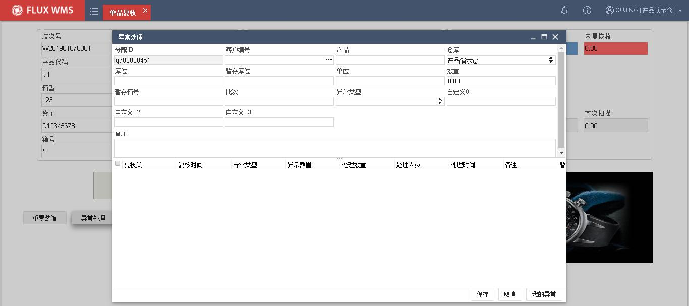

  - 系统显示异常处理登记界面

  - 输入产品代码、暂存库位等信息，并点击保存按钮，保存信息。

  - 在异常处理界面下方的列表部分，显示当前处理的产品所有未关闭的复核异常记录，可供查看。

  - 列表部分右键功能项“关闭异常”，可关闭当前用户登记的异常记录。

  - 异常窗口点击按钮我的异常，则显示当前用户登记的异常记录。

  - “孤儿”处理：针“对订单中不” 存在的 SKU 进行异常登记。由于多出来的 SKU 经常是其他复核台缺少的货物，通过记录可帮助匹配，减少重新拣货、还架的重复作业。点击“孤儿”按钮，用户输入 SKU、暂存位置、数量等信息，便于其他复核台匹配缺货。

- **其他**

  - 复核进度

<!-- 原 PDF 第 396 页 -->

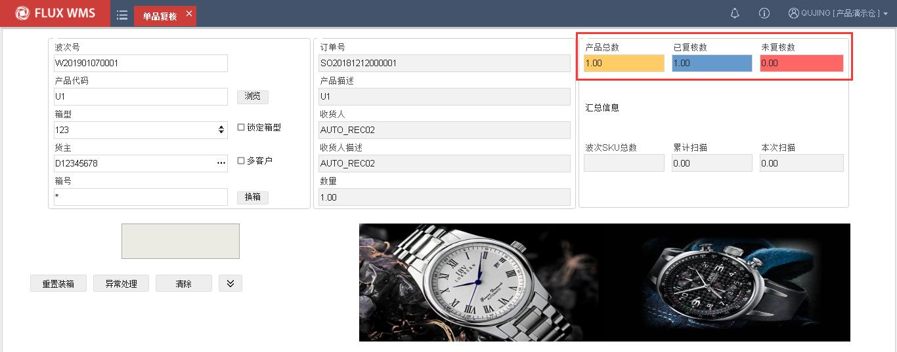

复核作业进度用三色色块显示。

黄色：当前复核量

蓝色：订单复核量

红色：订单未复核量

通过【刷新】按钮可以人为刷新复核进度信息。整个波次作业完成，未复核数量为 0 情况下，系统自动刷新复核进度，以免波次中订单有重置装箱，尚未重新装箱确认导致遗漏。

  - 序列号

单品复核支持序列号采集，由于复核数量为 1，序列号采集后自动导入、退出序列号采集界面。

  - 退换货卡维护

为方便售后维护，如果参数 REG_SVC_CRD（出库复核/单品复核登记退换货卡号）开启，扫描产品后，弹出窗口扫描并记录“退换货卡号”。

  - 特殊订单提示

如果接口下达订单时，标记为特殊订单（例如高值品订单，保价运输订单），系统匹配到对应订单后，可提示相关消息内容。

  - 反拣提示

单品复核功能中同样支持反拣任务生成。如果正常单据已完成装箱，剩余取消单据，弹出窗口进行提示，扫描存放反拣商品的周转箱号，并生成对应的反拣任务。

带有赠品标记的赠品记录，无需生成反拣任务。

<!-- 原 PDF 第 397 页 -->

## 11.9. N+X 复核

N+X 复核是在多品复核基础上扩展出来的另一个快捷复核功能，针对于多品 SKU 重合率较高订单。例如一个订单中明细只有 2 个 SKU，并且数量各自都是 1，其中一种 SKU 是多个订单有都出库要求的，即有重合率的 SKU，用 N 来代表；另一个 SKU 是其他订单中没有的，即没有订单无重合率的，用 X 来代表。N+X 意味着产品组合订单。

处理逻辑类似单品订单，作业时只要正确扫描无重合率的 SKU，检索匹配订单成功后自动复核一个重合率高的 SKU，实现一步操作复核 2 行订单明细效果，从而大大提高多品订单的操作效率。

### 11.9.1. N+X 复核操作

- **复核操作**

操作同单品复核作业流程。作业时扫描波次号后，通过扫描重合率低的 SKU，实现自动生成箱号（面单号）、自动匹配对应重合率高的 SKU 和订单号效果。即一张订单复核动作仅需一次扫描，从而大大提供现场的作业效率和节省复核成本。

特殊场景下 N+X 复核也支持扫描、记录货主和装箱 ID 信息。

  - 双击“出库操作”下的“N+X 复核”功能，显示界面如下图：

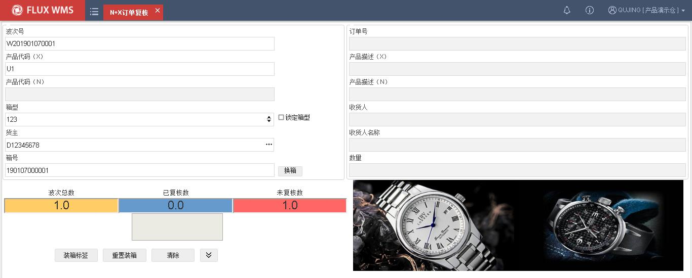

  - 依次输入客户编号、波次号，限定匹配订单的范围

  - 系统根据扫描的 SKU 确认货主。

<!-- 原 PDF 第 398 页 -->

  - 类似出库复核，如果需要则确认装箱 ID。如果参数 CHK_CTN_MNG（包装箱管理）配置为装箱后选择，则先扫描 SKU，再跳转到装箱 ID 强制录入。

  - 若勾选“锁定箱型”，则保留装箱 ID 选择，直到取消“锁定箱型”勾选。

  - 扫描/输入产品代码，系统在波次/货主范围内查找对应订单

  - 根据是否系统生成单号的参数设置，由系统自动生成新箱号，或者人工扫描/录入箱号

  - 系统显示匹配到的订单号信息、执行装箱确认，并根据是否自动打印的参数设置，驱动对应装箱标签、装箱清单打印。

  - N+X 复核后可根据作业需要（SGL_LNK_DEL 参数控制），跳转到配送单作业功能，以便连续操作。

- **换箱**

点击【换箱】按钮，系统重置本次扫描数量，并且光标定位在拣货箱号，可输入新的箱号。

- **重置装箱**

与出库复核重置装箱效果相同，点击【重置装箱】按钮后，显示二级窗口，通过订单号或者箱号查询到已装箱记录，重置为未装箱，重新进行复核装箱操作。

- **重量获取**

复核装箱作业过程中，可以通过电子秤获取实际重量信息，也可以不称重，根据产品档案标准重量计算理论重量值。或者忽略重量信息，不做记录。通过 IDX_SGL_WGT 参数可以切换不同的重量获取模式。

同时，需要通过电子秤读取重量的情况下，还可以根据 SGL_POP_WGT（单品复核弹出窗口进行重量确认）参数设置，系统是否弹出重量窗口。如弹出，显示电子秤获取到的重量信息，用户可手动修改确认。如果不弹出则直接使用电子秤获取的重量信息。

- **异常处理**

类似出库复核异常处理功能，登记异常信息：

  - 点击【异常处理】按钮

<!-- 原 PDF 第 399 页 -->

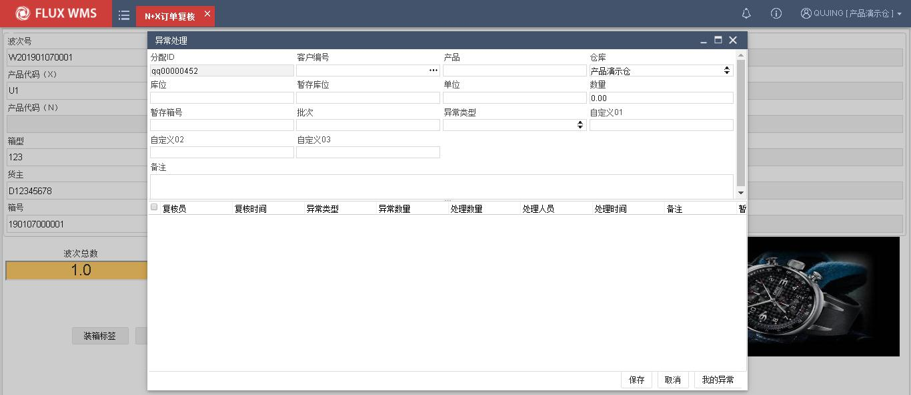

  - 系统显示异常处理登记界面

  - 输入产品代码、暂存库位等信息，并点击保存按钮，保存信息。

  - 在异常处理界面下方的列表部分，显示当前处理的产品所有未关闭的复核异常记录，可供查看。

  - 列表部分右键功能项“关闭异常”，可关闭当前用户登记的异常记录。

  - 异常窗口点击按钮我的异常，则显示当前用户登记的异常记录。

  - “孤儿”处理：针“对订单中不” 存在的 SKU 进行异常登记。由于多出来的 SKU 经常是其他复核台缺少的货物，通过记录可帮助匹配，减少重新拣货、还架的重复作业。点击“孤儿”按钮，用户输入 SKU、暂存位置、数量等信息，便于其他复核台匹配缺货。

### 11.9.2. 其他

- **复核进度**

<!-- 原 PDF 第 400 页 -->

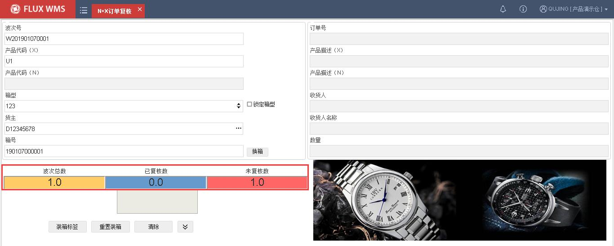

复核作业进度用三色色块显示。

  - 黄色：当前复核量

  - 蓝色：订单复核量

  - 红色：订单未复核量

通过【刷新】按钮可以人为刷新复核进度信息。整个波次作业完成，未复核数量为 0 情况下，系统自动刷新复核进度，以免波次中订单有重置装箱，尚未重新装箱确认导致遗漏。

- **退换货卡维护**

为方便售后维护，如果参数 REG_SVC_CRD 开启，扫描产品后，弹出窗口扫描并记录“退换货卡号”。

- **特殊订单提示**

如果接口下达订单时，标记为特殊订单（例如高值品订单，保价运输订单），系统匹配到对应订单后，可提示相关消息内容。

- **反拣提示**

N+X 复核功能中同样支持反拣任务生成。如果正常单据已完成装箱，剩余取消单据，弹出窗口进行提示，扫描存放反拣商品的周转箱号，并生成对应的反拣任务。

<!-- 原 PDF 第 401 页 -->

## 11.10. 波次播种

合并拣货后再分货的拣货模式中，通常按波次进行合并拣货，分货的模式可以有多种选择，例如通过纸单指导分货，通过 RF 分货，通过电子标签分货等。在 FLUX WMS 中，还提供一种电子标签的代替功能，可用于波次合拣后分货，以便在业务量较大时作为电子标签设备的补充。

使用波次播种功能，需要由 WMS 根据波次结构、分货要求，提前将对应信息传递到波次播种后台任务表中（IDX_PutToLight）才能正常使用该功能。类似将播种任务传递给电子标签的过程。

任务下达过程，可以是后台执行（定时器等），也可以在波次计划功能中通过鼠标右键菜单功能项进行任务下发。此处主要介绍已生成播种任务，实物完成集中拣货下架后的具体播种分货操作。

- **波次播种操作**

  - 选择“出库操作”下的“波次播种”功能，显示界面如下图：

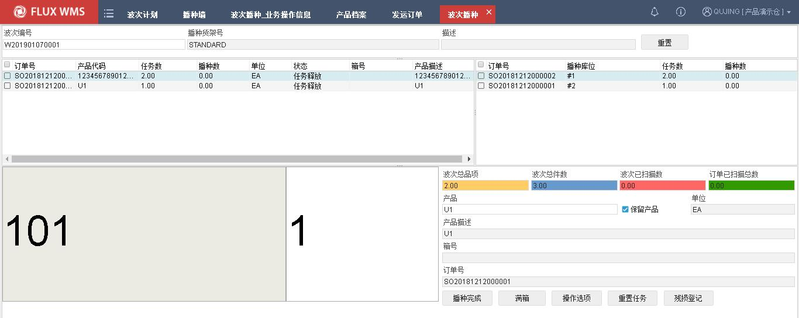

  - 扫描/录入波次号，播种货架号，系统显示波次对应明细信息。以及每个播种位对应订单、播种进度信息。

由于波次播种工作，能够支持多个作业台各自对应不同波次同时操作，因此作业伊始扫描播种货架号作为不同工作台的区分、记录。

  - 如果是按箱合并拣货作业模式，通常支持按箱进行播种，勾选“按箱播种”选项，界面显示箱号录入字段，扫描箱号获取对应信息。

  - 扫描产品条码，系统提示此产品应投放的播种位，并累加数量。

  - 如产品异常（条码不符或数量超出）系统提示报错。

<!-- 原 PDF 第 402 页 -->

  - 当系统判断波次内所有的任务都已经播种完成，则弹提示，确认播种完成。

- **动态播种模式**

普通模式，系统提前为任务分派好播种位，作业时操作人员扫描产品后，需要寻找系统提示的库位，而且产品随机扫描情况下，走动路径可能较长。因此系统还提供动态播种作业模式，任务下达时不绑定具体播种位，而是扫描到一个新订单的产品时临时按次序绑定一个空播种位提示用户操作，可以减少人员走动距离。

动态播种模式，需要开启 PTL_SEQ_LOC 参数，后台处理不同，但用户具体作业步骤同固定播种位操作模式。

当某个播种位的任务数量全部播种完成时，自动消息提示“货格 XXX 播种完成”，方便释放播种位，滚动操作。

- **按钮/右键功能**

  - 播种完成

播种作业结束。

如果有任务未被执行，弹出提示。仍旧确认的情况下，视作缺货确认。

  - 尾箱作业

播种完成时，如果参数 PTL_LNK_CNO=Y（尾箱需要绑定箱号）开启，二级窗口显示所有未满箱确认的任务，依次要求用户扫描播种位与目标箱号，进行关联。

  - 满箱

WAV_SOW_RTM 为 Y 时（实时更新模式），此按钮可用。点击【满箱】按钮，弹出窗口要求扫描箱号，扫描箱号后定位于【确定】按钮，人工点击【确定】进行播种后的目标箱号确认。

  - 重置任务

弹出窗口提示该波次的所有播种任务将被重新生成，请确认，如确认，则对应全部任务被置于未操作状态。

“”

## 11.11. 图形化波次播种

按波次合并拣货后，还需要分货到不同订单（或者收货人）。可以采用电子标签或 RF 分货，甚至纸单人工分货。电子标签分货效率最高，但往往受制于设备，投资较大，业务量激增时，很难

<!-- 原 PDF 第 403 页 -->

快速增加电子标签位。因此系统提供了波次播种功能，可代替电子标签使用，或者作为电子标签不足时的补充措施。同时，入库分货整理时，也可以创建 ASN 编组，然后使用波次播种进行分货操作，同步确认收货。较波次播种，图形化播种功能是在波次播种基础上扩展出来的一个播种功能。除了继承波次播种功能外，播种格采用图形化展现方式配合图片和音频的互动，可以让操作人更直观的了解到目前播种进度。

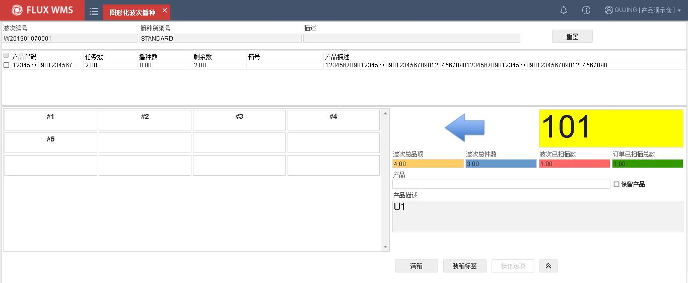

### 11.11.1. 相关设置

- **工作站配置：**

图形化播种模块使用前，需要完成本地工作站配置。若未维护客户端将提示“本地尚未配置工作站编号，请配置后进行播种作业。”详细工作站配置流程，请参阅《本地设置》相关章节。

- **播种墙配置：**

下发播种任务前，需要完成基础设置-播种墙模块播种墙设置。通过播种墙配置功能，可对播种顺序、播种位显示名称、颜色、图标等信息进行设置，详细播种墙配置流程，请参阅《播种墙》相关章节。

- **波次计划规则配置：**

在波次计划规则中，配置【是否播种】（AddToSow）为“产生波次时生成播种任务”。配置后自动生成波次任务会自动写入播种库位信息，详细信息参阅《波次计划规则》相关章节。

<!-- 原 PDF 第 404 页 -->

### 11.11.2. 播种操作

图形化波次播种分为两种模式：普通界面模式、简单界面模式，以应对不同复核方式的客户对界面的要求。

- **标准模式**

  - 选择“出库操作”下的“图形化波次播种”功能，显示界面如下图：

  - 扫描/录入波次号，播种货架号，系统显示波次对应明细信息。以及每个播种位对应订单、播种进度信息。

由于波次播种工作，能够支持多个作业台各自对应不同波次同时操作，因此作业伊始扫描播种货架号作为不同工作台的区分、记录。

  - 如果是按箱合并拣货作业模式，通常支持按箱进行播种，勾选“按箱播种”选项，界面显示箱号录入字段，扫描箱号获取对应信息。

  - 扫描产品条码，系统提示此产品应投放的播种位，并累加数量。箭头图标分别代表播种墙左中右位置，相关配置方法详见《播种墙》设置。

  - 如产品异常（条码不符或数量超出）系统提示报错。

  - 当系统判断波次内所有的任务都已经播种完成，则弹提示，确认播种完成。

- **简单模式**

  - 在图形化波次播种模块中，点击【操作选项】按钮勾选“简单模式”勾选框启用简单模式，显示界面如下图：

<!-- 原 PDF 第 405 页 -->

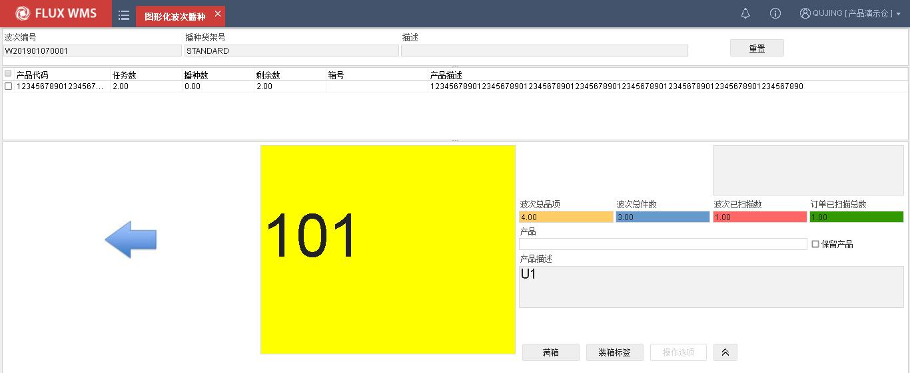

  - 扫描/录入波次号，播种货架号，系统显示波次对应明细信息。以及每个播种位对应订单、播种进度信息。

由于波次播种工作，能够支持多个作业台各自对应不同波次同时操作，因此作业伊始扫描播种货架号作为不同工作台的区分、记录。

  - 如果是按箱合并拣货作业模式，通常支持按箱进行播种，勾选“按箱播种”选项，界面显示箱号录入字段，扫描箱号获取对应信息。

  - 扫描产品条码，系统提示此产品应投放的播种位，并累加数量。

  - 如产品异常（条码不符或数量超出）系统提示报错。

  - 当系统判断波次内所有的任务都已经播种完成，则弹提示，确认播种完成。

- **动态播种模式**

普通模式，系统提前为任务分派好播种位，作业时操作人员扫描产品后，需要寻找系统提示的库位，而且产品随机扫描情况下，走动路径可能较长。因此系统还提供动态播种作业模式，任务下达时不绑定具体播种位，而是扫描到一个新订单的产品时临时按次序绑定一个空播种位提示用户操作，可以减少人员走动距离。

动态播种模式，需要开启 PTL_SEQ_LOC 参数，后台处理不同，但用户具体作业步骤同固定播种位操作模式。

当某个播种位的任务数量全部播种完成时，自动消息提示“货格 XXX 播种完成”，方便释放播种位，滚动操作。

- **按钮/右键功能**

<!-- 原 PDF 第 406 页 -->

  - 播种完成

播种作业结束。

如果有任务未被执行，弹出提示。仍旧确认的情况下，视作缺货确认。

  - 尾箱作业

播种完成时，如果参数 PTL_LNK_CNO=Y（尾箱需要绑定箱号）开启，二级窗口显示所有未满箱确认的任务，依次要求用户扫描播种位与目标箱号，进行关联。

  - 满箱

WAV_SOW_RTM 为 Y 时（实时更新模式），此按钮可用。点击【满箱】按钮，弹出窗口要求扫描箱号，扫描箱号后定位于【确定】按钮，人工点击【确定】进行播种后的目标箱号确认。

  - 重置任务

弹出窗口提示该波次的所有播种任务将被重新生成，请确认，如确认，则对应全部任务被置于未操作状态。

“”

  - 残损登记

在图形化播种播种作业中，会出现缺货或者报残两种异常情况。当出现异常时，现场往往需要能够准确计入异常处理模块，用于后期个性化人工操作。

    - 点击【残损登记】按钮，弹出残损登记窗口

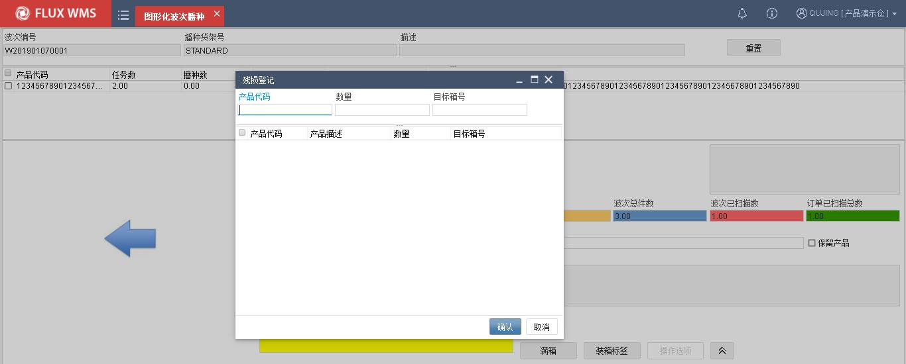

    - 产品代码：光标默认选中，等待扫描残损 SKU

<!-- 原 PDF 第 407 页 -->

    - 数量：输入残损数量

    - 目标箱号: 在一个波次的播种过程中，目标箱号输入后一直保留，用户可以手动修改。

    - 缓存列表：每确认一个残损记录则写入缓存的列表。在缓存列表中可以删除某条记录登记完一个 SKU 可以连续登记下一个 SKU。

    - 确认：点击【确认】将缓存表中信息写入临时表。

    - 取消：点击【取消】放弃本次操作。

  - 装箱清单

满箱或播种完成后，点击该按钮后打印装箱清单。

  - 装箱标签

满箱或播种完成后，点击该按钮后打印装箱标签。

## 11.12. 订单分配计划

分配规则 1.0、2.0，是定义到 SKU 级别的分配逻辑，如果需求要求包含相同 SKU 的不同订单需要有不同的分配规则，则只能在订单明细行中人工指定特殊的规则进行分配。

在实际业务中，例如某服装 SKU，如果是普通的电商订单，则需要从拆零拣货区进行拣货。如果是唯品会的批量订单，则需要从存储区进行拣货，尽管它不是整箱。

另外，分配规则 1.0、2.0（不管是一步分配还是两步分配）也不支持指定多个库区的分配方式，例如业务上可能要求首先在 A 库区分配，如果 A 库区不满足则在 B 库区分配。

为了让分配更灵活方式实现，产生了通过订单分配计划模块配置规则的分配规则 3.0 方案。

### 11.12.1. 新增订单分配计划

- **订单分配计划头信息创建**

订单分配计划创建方式采用人工录入创建。具体操作步骤如下：

  - 选择“出库操作”下的“订单分配计划”。

  - 点击【新增】按钮，在表头的主信息页签中，输入订单分配计划描述、执行顺序字段如下图。

<!-- 原 PDF 第 408 页 -->

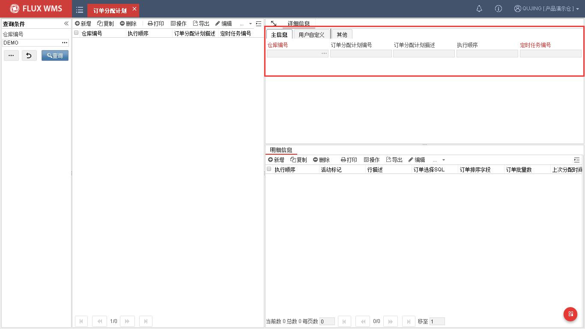

    - 仓库编号：自动带出当前仓库编号，不可编辑。

    - 订单分配计划编号：系统自动生成，不可编辑。

    - 订单分配计划描述：分配计划对应名称，必填。

    - 执行顺序：定时器执行订单分配计划时的执行顺序，必填。

    - 定时器任务编号：系统自动生成，不可编辑。

  - 输入完毕后，点击保存生成单头。

- **订单分配计划明细信息创建**

  - 点击明细【新增】按钮，在明细的主信息页签中，行描述、订单排序字段、执行顺序、订单批量数、执行周期、订单选择 SQL 如下图。

<!-- 原 PDF 第 409 页 -->

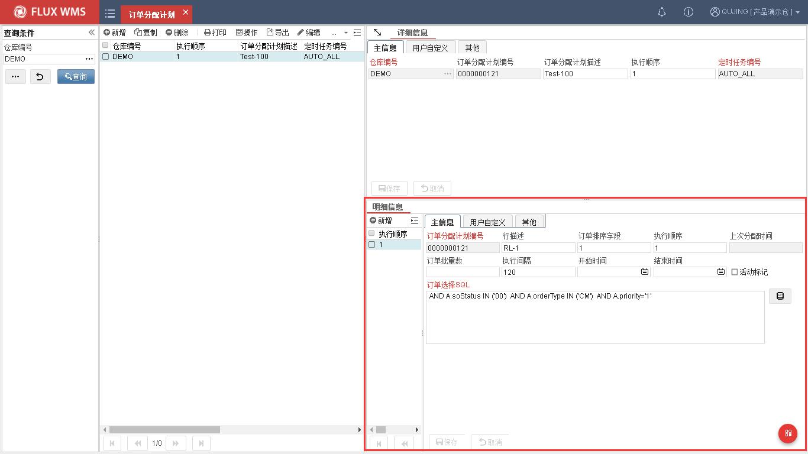

    - 订单分配计划编号：系统自动生成，不可编辑。

    - 行描述：配置行描述信息，可为空。

    - 订单排序字段：配置获取订单池订单顺序排序字段。可为空

    - 执行顺序：配置分配规则执行顺序，可为空。

    - 上次分配时间：记录上次定时器执行改行规则时间，不可编辑。

    - 订单批量数：配置获取订单量上线，可为空。

    - 活动标记:默认激活

    - 执行周期：配置定时器执行周期。支持单次执行或时间段内迭代执行。

    - 订单选择 SQL：配置订单抓取条件，不可为空。

- **订单选择 SQL 配置**

该功能起到 SQL 多维度过滤作用，用于控制按照指定的条件筛选订单行。当标准筛选条件无法满足需求时，还可以通过扩展页签通过个性化方式进行扩展延伸，最大限度的满足现场各种需求。

  - 点击明细订单选择 SQL 二级框按钮，自动弹出如下界面。

<!-- 原 PDF 第 410 页 -->

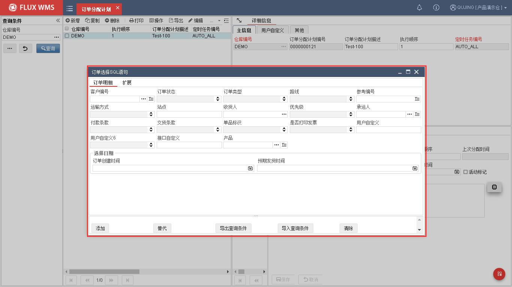

订单分配计划通过订单选择 SQL 界面，配置订单池数据抓取约束条件。通过图形化界面选择、配置、勾选操作最终生成程序可以解析的 SQL 语句。

    - 添加：配置筛选条件后，点击【添加】按钮后，程序将以覆盖形式更新原 SQL。

    - 替代: 配置筛选条件后，点击【替代】按钮后，程序将以追加形式更新原 SQL。

    - 导入查询条件：将已有的筛选文件导入。

    - 导出查询条件：将已配置完成的筛选条件导出成文件。

    - 清除：界面初始化。

  - 其他

    - 扩展信息选择

扩展页签主要用户实现现场个性化数据筛选要求，在标准页签无法满足现场需求情况下，可以通过配置扩展条件丰富筛选逻辑。实现方式为订单选择 SQL 配置界面，点击扩展页签，自动展示如下界面。【添加】、【替代】、【导入查询条件】、【导出查询条件】按钮功能设计与订单明细页签按钮功能相同。

<!-- 原 PDF 第 411 页 -->

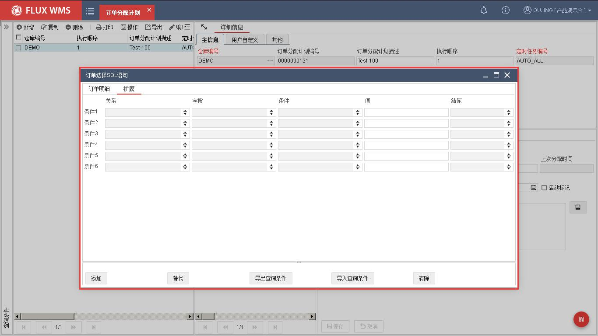

## 11.13. 配送单作业

电商客户，装箱后经常需要打印快递要求的固定格式面单，并对包裹进行称重记录方便核算运费。这些工作可以在出库复核环节进行，但为了细化岗位操作，提升作业效率，部分作业现场将称重打印与复核装箱拆分为 2 个工位分别进行操作，因此 WMS 也提供了对应的单独作业界面，方便根据实际需要进行操作。

由于作业速度不同，岗位配置也所不同，例如 2 个复核装箱工位可合并流转到 1 个配送单作业工位进行操作。

配送单作业操作的前提是，产品有对应箱号。可以是复核装箱的新箱号或者拣货的目的箱号。

- **配送单作业**

  - 选择“出库操作”下的“配送单作业”功能，显示界面如下图：

<!-- 原 PDF 第 412 页 -->

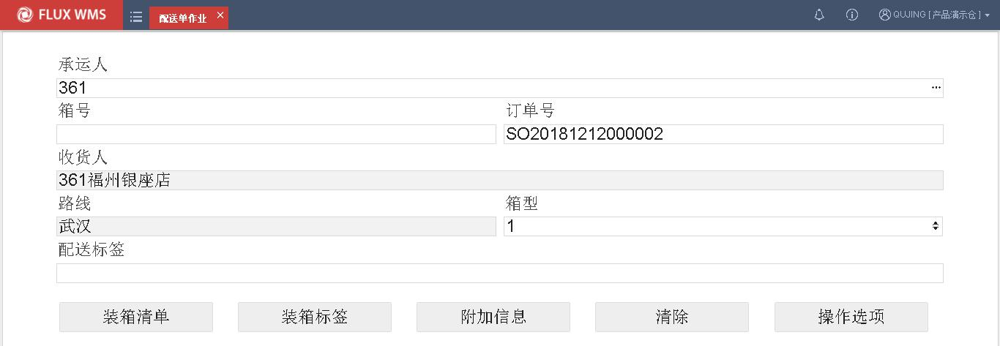

  - 扫描箱号，系统显示对应订单号、收货人等信息。

  - 如有推荐箱型，显示默认箱型装箱 ID，也可扫描记录。

  - 如已与电子秤对接且参数配置为称重，系统弹出二级窗口显示获取到的重量信息

  - 确认后，打印装箱标签（通常为快递面单）

  - 如参数配置为需要记录配送标签，扫描并记录配送标签号（面单预印刷的面单号）。

  - 如有需要可以打印装箱清单，或者进一步维护箱附加信息

  - 系统根据 SHP_WTH_DEL（配送单作业完成后同步确认发货）参数设置，判断是否需要自动发育已完成配送单操作的订单或箱。

- **操作选项**

点击【操作选项】按钮，在弹出窗口显示操作配置项

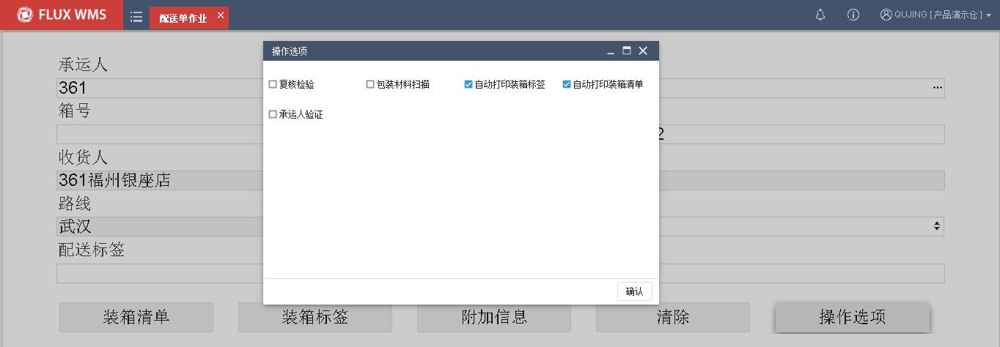

  - 复核校验

<!-- 原 PDF 第 413 页 -->

为了避免 2 个工位操作时，前一工位尚未复核的货物，后一工位称重出库，系统提供了复核后才能进行配送单作业，进行称重的可选控制。

如勾选“复核校验”，系统会拦截未装箱的箱号。

  - 包装材料扫描

用于配送单作业环节才封箱的业务情况。

勾选“包装材料扫描”情况下，扫描箱号后，系统弹出包装材料二级窗口，用户扫描包材条码，点击确认按钮（或者通过 F3 快捷键确认），完成包材记录

  - 自动打印装箱标签

默认设置根据 DEL_PRT_LBL 参数（配送单是否自动打印装箱标签）显示，用户可以修改设置，从而变更装箱标签的自动打印设置。

  - 自动打印装箱标签

默认设置根据 DEL_PRT_LST 参数（配送单是否自动打印装箱清单）显示，用户可以修改设置，从而变更装箱清单的自动打印设置。

  - 承运人校验

如勾选，界面需要录入当前操作的承运人，如果所扫描的箱号/订单对应的承运人，与当前操作的承运人不同，会提示报错进行拦截。

- **其他**

  - 作业模式

根据参数 DEL_OPR_TYP （配送单作业类型）判断按箱号操作，还是按订单号作业。

  - 称重打印模式

根据参数 DEL_OPR_MOD（称重打印模式）配置称重、打印及标签扫描作业模式。可得到称重无弹出窗口、仅称重打印、不扫描输入等不同组合效果。

  - 重量保持

相同货物批量称重时，可通过重量保持功能，一次录入重量。

DEL_OPR_MOD=W 时，重量录入框旁显示“保持”勾选框，系统会将此时录入的重量替代电子秤输入重量，作为每箱的重量，直到人工修改重量或者去除勾选。

  - 记录发运

<!-- 原 PDF 第 414 页 -->

如果参数开启（SHP_WTH_DEL），配送单标签扫描成功后系统自动发运对应记录。

## 11.14. 集拼箱

复核后或者配送单作业完成后的待出库货物，如果是体积较大的包装，一般可以直接发运。但如果是体积较小包装，例如小包裹，为了方便装卸、运输，提高安全性，经常将多个小包裹组合为较大的物流运输单位，例如小包裹/箱放入大物流包裹/容器中，或者组合为运输托盘裹膜后整托交运。

这种多个小的物流容器组合为大物流容器的过程，通常称为集拼箱。

多点运输的情况下，也常将具有一定共同点的出库单组合在一起，例如同一卸车地点，或者同一转运地点的包裹组合为运输托盘。

系统提供集拼箱功能，对集拼过程进行跟踪管理，方便得知小包裹对应的大物流容器，以便逐级跟踪。也能对集拼过程进行管理。

集拼箱操作，通常使用 RF 扫描执行（具体可参考 RF 用户手册），FLUX WMS 中也提供相应操作功能。

- **集拼箱操作**

  - 选择“出库操作”下的“集拼箱”，系统显示如下集拼箱界面

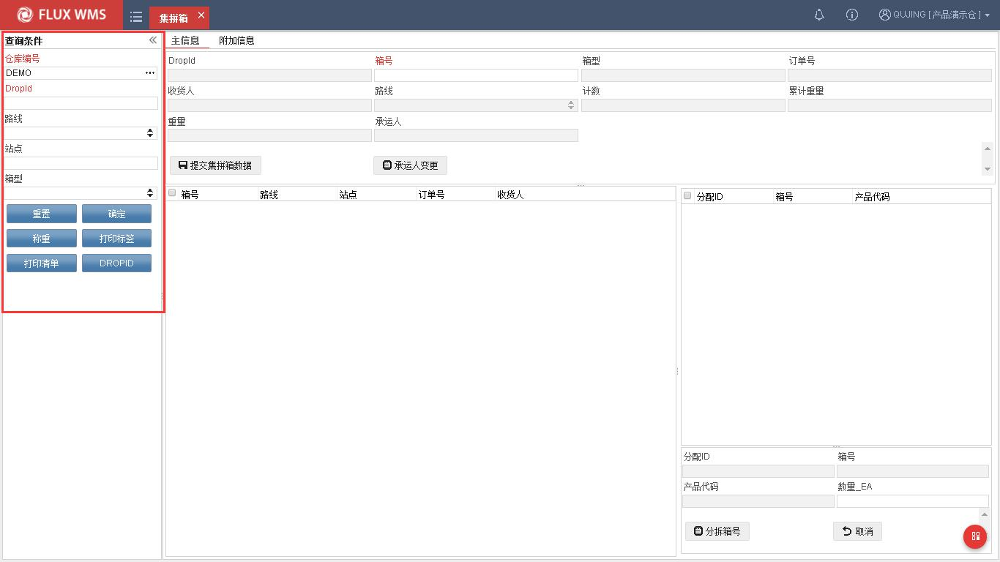

<!-- 原 PDF 第 415 页 -->

  - DROPID，即大物流容器的跟踪号。可以通过扫描/输入容器条码人工录入，也支持点击【DROPID】按钮由系统计算生成。

  - 默认为当前登录仓库，可以根据需要输入路线、站点条件。如输入，则限制此容器只能装入相同路线/站点的订单出库包装；未输入则不进行限制。

  - 点击【确定】按钮，进入集拼箱扫描界面

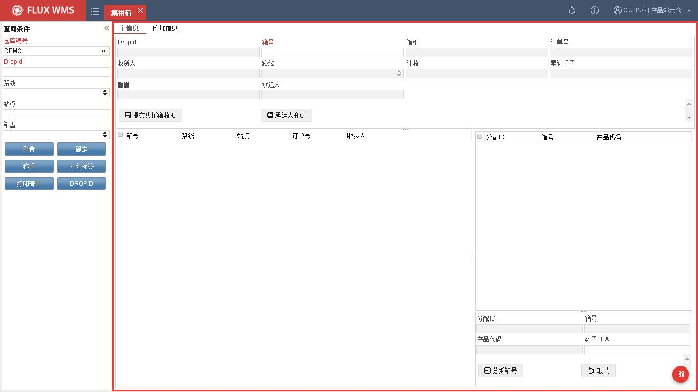

  - 连续扫描待出库箱号/配送标签号，界面显示已扫描记录对应信息。

  - 扫描完成，确认【提交集拼箱数据】，系统将扫描到的出库包裹与集拼箱号码关联，并更新分配明细中的 DROPID 信息，完成集拼。

- **分拆箱号**

特殊情况下，一个出库包裹放入集拼箱时会出现过大无法装入的情况，通常将此包裹加入下一个新的集拼箱。但有时为了提高空间利用率，也会采用拆分出库包裹，分别加入 2 个不同的集拼箱的情况。此时会用到拆分箱号的功能。

  - 扫描箱号后，已扫描列表窗口中，选择对应箱号，鼠标右键分拆箱号

  - 界面左方显示箱内明细信息。

  - 根据实际拆分情况，选择产品，确认拆分数量

<!-- 原 PDF 第 416 页 -->

  - 点击【分拆箱号】按钮，系统完成出库箱拆分。

## 11.15. 集货位

FLUX WMS 提供了出库集货位的管理功能。在大型仓库中，不同产品可能分区存放，但一个订单有可能需要多个不同库区的产品。此时，可以分区拣货，再将不同库区拣区的货物运至系统指定的出库集货位，一同打包出库。也有仓库有多个出库操作月台，需要根据收货人所属路线分派集货位，在订单拣货后将相同收货人在同一路线上的订单的货物移动到一个出库门附近的集货位，便于后续的出库装载。

启用集货位功能，需要做如下相关设置：

  - 设置系统参数 SRT_LOC（开启自动分派集货库位功能），参数字符值设置为 Y

  - 设置系统参数 SRT_TYP（集货区分配方法参数）, 可配置为按订单集货（ORD）、按收货人集货（CON）、按路线集货（ROU）、按站点集货（STP）、按承运人集货（CAR）

  - 系统中库位功能里，设置集货用的库位，并且集货位的库位使用设置为“理货站”

  - 集货位所属的库区，在库位功能中，配置对应路线。即关联为哪个路线对应的集货位。一个路线代码可关联多个库区。

  - 发运订单头的运输信息页签中有路线字段，如指定，则分配时在路线对应的库区中查找合适的集货位。集货位分派根据参数 SRT_TYP（集货区分配方法参数）进行，例如按订单，则每个订单对应一个集货位；按承运人，则相同承运人的多张订单混放同一集货位。

  - 体积超限情况下，系统会寻找下一集货位。

  - 设置完整是系统计算集货位的前提。系统计算集货位后，显示在分配明细的目标库位字段。可以通过出库操作中的“集货位”功能，查看集货位占用情况。

- **集货位查看**

  - 选择“出库操作”下的“集货位”。

  - 在查询界面，输入库位或库区查询条件

  - 点击查询按钮，系统显示集货位使用情况。

  - 集货位被占用后，可以选择记录，通过鼠标右键菜单功能“清空集货位”，释放被

<!-- 原 PDF 第 417 页 -->

占用的集货位。

  - 如果货物不清楚放置的集货位，可以通过鼠标右键菜单功能“按箱查询集货位”，在二级窗口扫描箱号，系统快速查询对应集货位。

## 11.16. 装车单

货物确认出库前，装载到承运车辆上的时候，可以通过 FLUX WMS 的装车单功能进一步跟踪每辆车装载的产品细节，加强出库监管。但装车单功能本身，并不是出库流程中不可缺少的环节，用户可根据自身管理流程要求，选择使用。

装车单通常一辆车一单，可根据分配明细或箱号甚至集拼箱容器号确认装车。装车扫描功能，同样支持 RF 作业与 WMS 界面作业 2 类操作方式。

在 WMS 界面进行装车单创建操作，可以通过界面查询选择记录，也可以通过有线扫描枪扫描箱号获取装车单明细。

- **装车单头创建**

  - 选择“出库操作”下的“装车单”

  - 在表头明细页签的主信息页面，点击【新增】按钮，输入车号、司机等信息，系统自动生成装车单号，如下图所示。

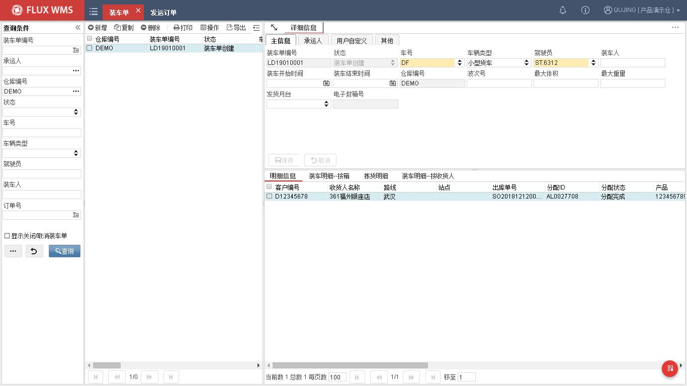

<!-- 原 PDF 第 418 页 -->

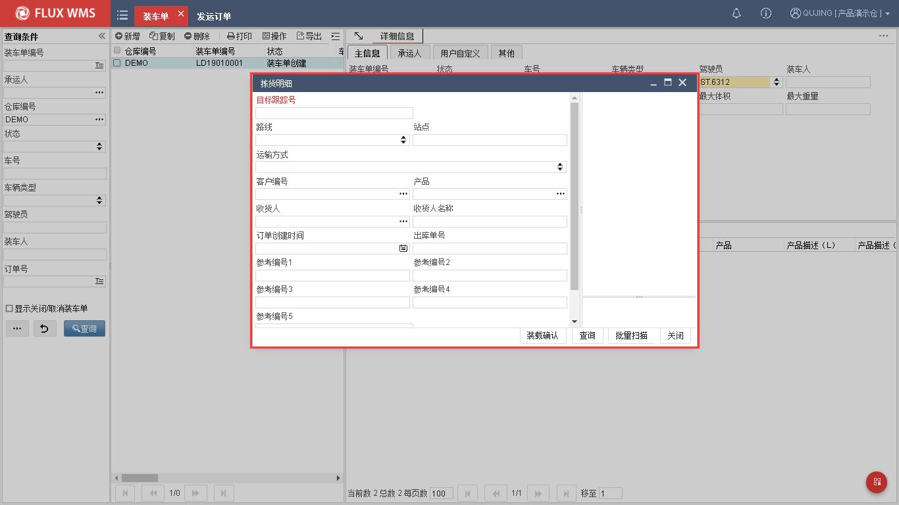

  - 在承运人页签，选择承运人 ID，系统显示客户档案中维护的承运人相应信息，用户可进一步修改。也可根据需要在用户自定义页签录入其他附加信息。

  - 点击【保存】按钮，保存装车单表头信息。

- **查询创建装车单明细**

  - 在界面下半部分的“拣货明细”页签，选择鼠标右键菜单的“查询”功能，系统显示如下图的查询二级窗口：

*[图 11-16-2]（原 PDF 第 418 页，图像未能从 PDF 对象中直接提取）*

  - 输入查询条件后，点击查询按钮，在装车单明细部分的拣货明细页签显示查询到的订单分配明细信息。

  - 关闭查询二级窗口，在拣货明细页签勾选本次装载的记录，也可通过鼠标右键菜单的“全选”/“反选”功能选择记录。

  - 选择鼠标右键的“装载确认”，可将已选择的分配/拣货明细确认装载到装车单中，能够在“装车明细-按产品”页签查看相应明细信息。

- **批量扫描创建装车单明细**

在连接扫描枪的情况下，可以通过扫描出库箱/集拼箱号码进行装车，达到类似 RF 扫描装车的作业效果。

<!-- 原 PDF 第 419 页 -->

  - 在查询二级窗口中，点击【批量扫描】按钮，二级窗口右半部分显示扫描录入。

  - 逐一扫描箱号，系统显示已扫描箱号列表。已发货的箱号/托盘号/DROPID 可以重复使用，但已装车未发货的相关跟踪号码，不可重复使用。

  - 点击【装载确认】按钮，已扫描记录加入装车单。

- **鼠标右键菜单**

表头部分的鼠标右键菜单

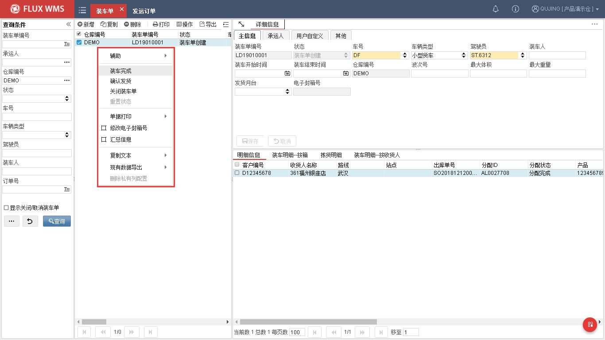

  - 装车完成

实物装车、扫描完成，装车单中不可在增、减明细。但允许编辑表头内容。

  - 确认发货

按装车单做发货确认。

  - 关闭装车单

操作完毕后，关闭单证，不能再做其他修改。

  - 重置状态

已完成或者已发运的装车单，如果货品问题需要卸车处理，可以通过重置状态功能，将装车单

<!-- 原 PDF 第 420 页 -->

恢复到创建状态，删减明细。

  - 修改电子封箱号

根据需要，在弹出框中，录入用于封车的电子铅封的号码。

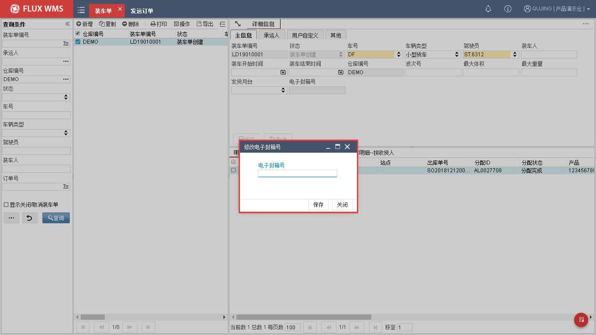

  - 汇总信息

显示装车单汇总信息。

  - 单据打印子菜单

包括：

打印按产品合并显示的装车清单

打印按箱号显示的装车清单，不再显示产品明细。

打印装车标签

打印药品检验报告

- **明细鼠标右键菜单**

装车明细页签，鼠标右键菜单如下：

<!-- 原 PDF 第 421 页 -->

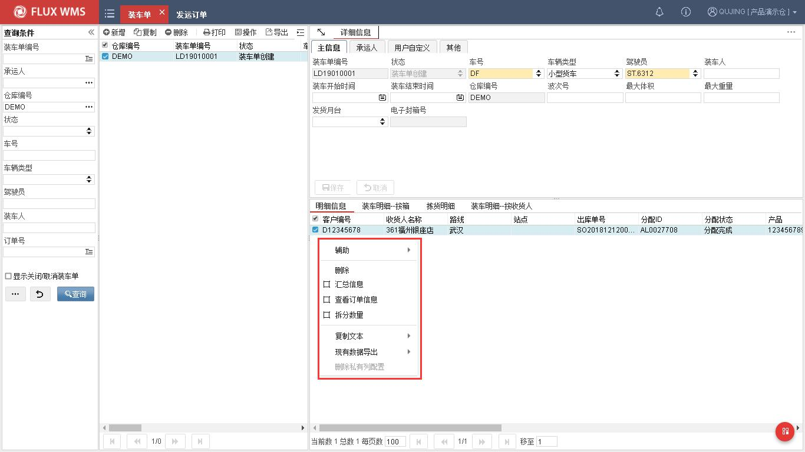

  - 查看订单信息

方便查看装车记录对应订单信息。根据当前装车明细行，跳转到发运订单界面，带入订单号信息进行查询。

  - 拆分数量

已加入装车单的记录，有时需要进行拆分，例如原本一个托盘要装车，由于各种原因从托盘上拆分下 2 箱货物，剩余货物装车。此时可以扫描托盘号装车，再拆分出不装车的 2 箱货物。

选择装车明细行记录，通过“拆分数量”功能，显示如下界面，输入需要拆分的数量，确认后从装车单中移除，原本一行分配明细，相应拆分为 2 行信息。

## 11.17. 出库异常处理

在出库作业中经常碰到货物分配、拣货、复核、发货等环节，出现缺货、损坏等无法正常操作的情况，系统支持将异常记录，并跳过，进行后续操作，避免影响正常作业。由专职人员另行处理异常，以便提高作业效率。

- **出库异常处理**

  - 在出库操作菜单下，选择“复核异常处理”

<!-- 原 PDF 第 422 页 -->

  - 通过波次号、订单编号、参考编号 1、客户编号、产品代码、功能分类、异常类型等条件查询异常记录

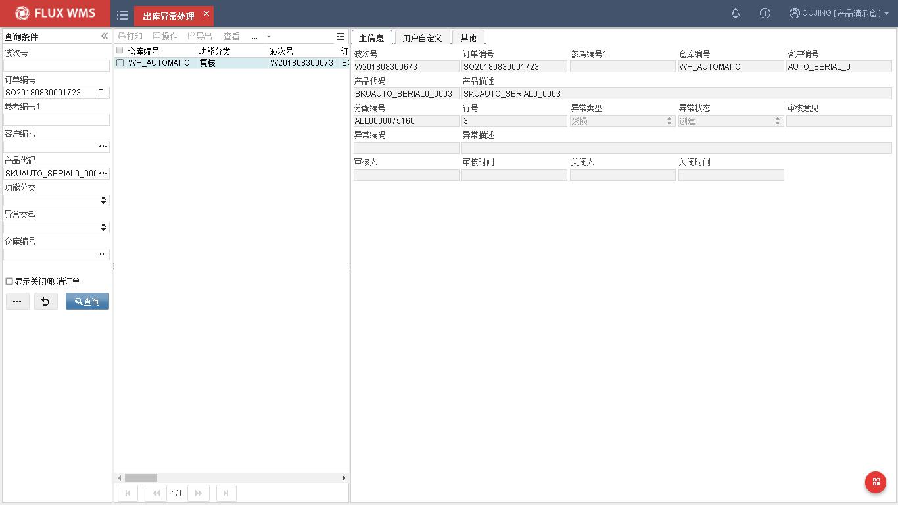

  - 选择记录，鼠标右键确认处理

  - 鼠标右键内容包括

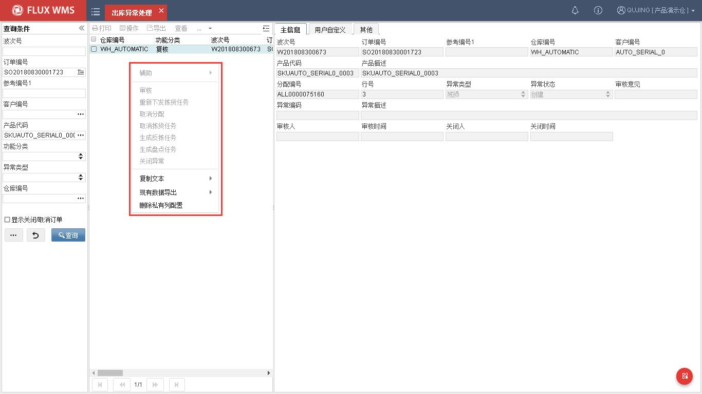

<!-- 原 PDF 第 423 页 -->

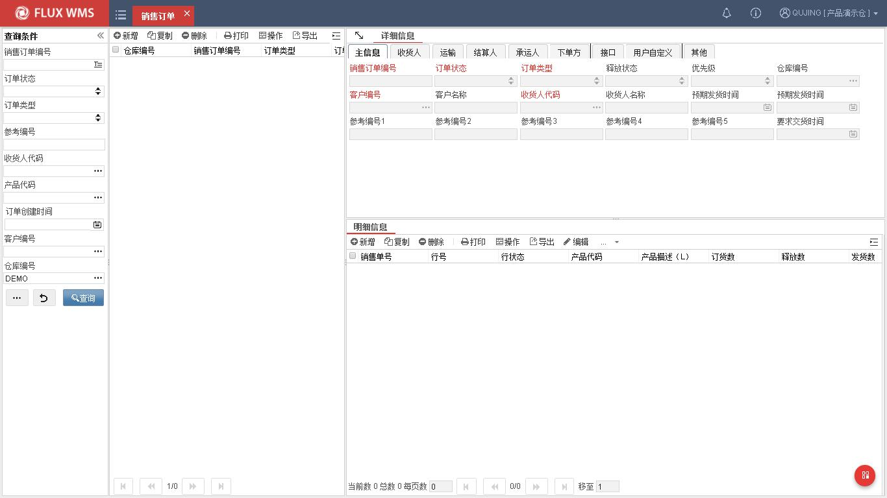

审核意见－输入处理意见

重新下发拣货任务－针对缺货，补发拣货任务，重新拣取复核缺少的产品。

取消分配－针对缺货异常记录，对异常订单行进行取消分配操作。

取消拣货任务－对于已有拣货任务，但未拣取确认的记录，取消任务，释放库存。

生成反拣任务－针对部分拣货/完全拣货状态任务，创建反拣任务。

生成盘点任务－对异常记录库存进行盘点

关闭异常－处理结束，关闭异常

## 11.18. 销售订单

仓库运作中，为了提高作业效率，要将订单拆分成播种部分和摘果部分，然后分作业类型操作。为方便处理，原始订单指令作为销售订单，拆分后的出库指令作为系统的发运订单。

销售订单，通常多用于原始指令内容查询，或着根据销售订单查询、创建发运单波次。系统并不直接根据销售订单执行拣货、发货等作业。

销售订单内容、界面基本同发运订单，支持右键菜单导入功能，但无集装箱、费用等页签信息。

<!-- 原 PDF 第 424 页 -->

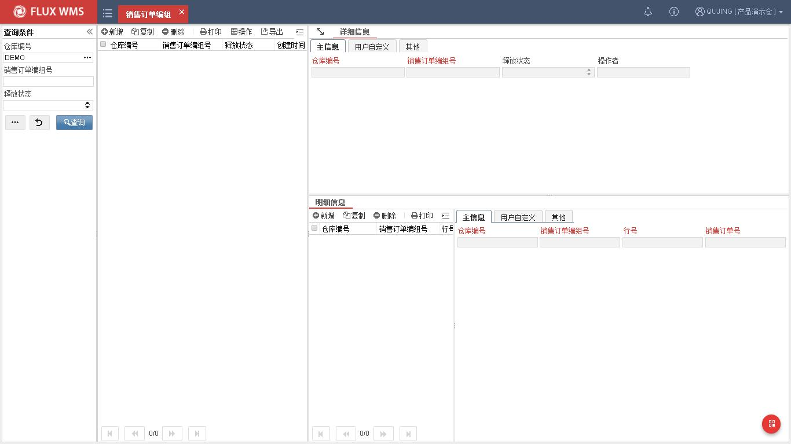

## 11.19. 销售订单编组

为方便提高作业效率，可以将客户指令作为销售订单，多销售订单合并为编组，然后根据产品重合率拆分作业单为多发运订单，分别进行播种、摘果拣货。具体发运订单可以跨销售订单，与销售订单编组相对应。

- **销售订单编组**

  - 选择“出库操作”下的“销售订单编组”。系统显示查询界面。

  - 输入查询条件，可查询到已创建的销售订单编组。表头信息为组号、仓库、释放状态等（如下图）。明细部分为组号、行号、单号。

*[图 11-19-1]（原 PDF 第 424 页，图像未能从 PDF 对象中直接提取）*

  - 通过表头右键菜单，可以生成波次计划，或者取消已经生成的波次计划。

<!-- 原 PDF 第 425 页 -->

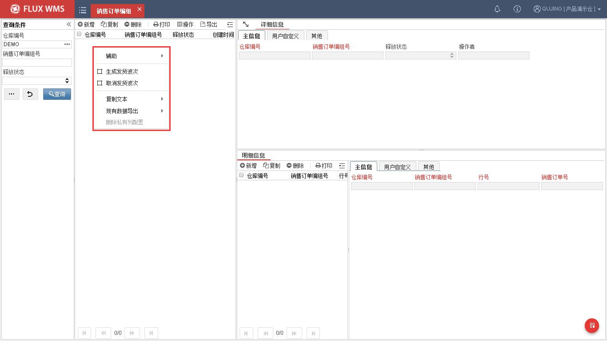

  - 明细部分的鼠标右键菜单，主要是删除功能，可从销售订单编组中删除指定的销售订单。

## 11.20. 发票管理

电商、电视购物行业的仓库，发货时，经常需要为收货人提供对应发票。为了方便管理发票的打印、维护、取消、替换等操作，系统提供了专门的发票管理功能。

正常操作时，发票通常是在波次计划中批量打印，系统将关联的发票信息记录在发票管理功能中，以供后续管理。

波次计划发票关联，请参考波次计划功能的相应介绍。

- **发票管理**

  - 选择“出库操作”下的“发票管理”。

  - 输入查询条件，查询发票记录

<!-- 原 PDF 第 426 页 -->

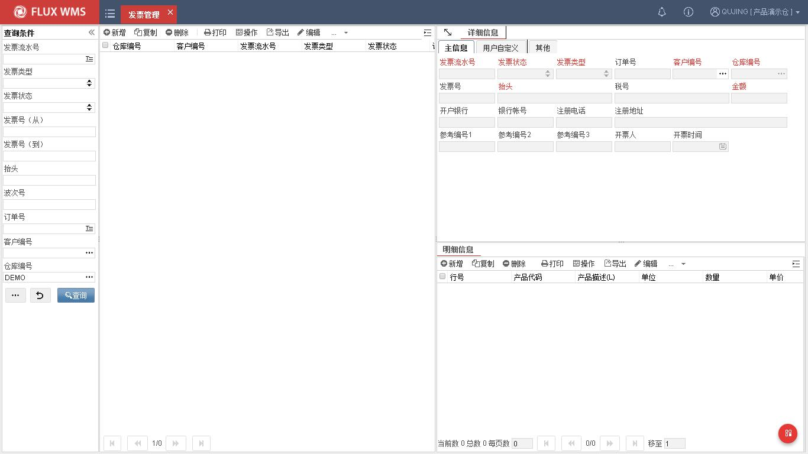

  - 一张发票关联多个订单明细，可在明细行部分查看相应信息：

  - 也可在明细页签，点击新增按钮，人工录入发票信息。金额可录入负数、小数信息。

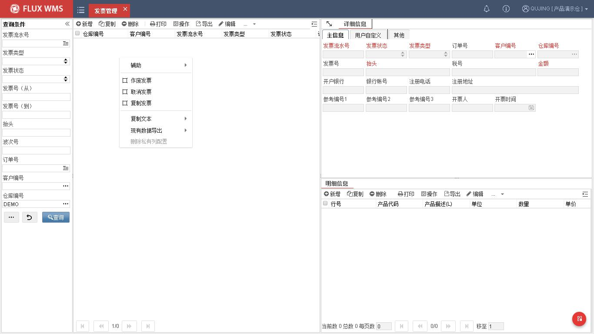

  - 作废发票

<!-- 原 PDF 第 427 页 -->

已关联发票，需要重新打印、使用新的发票号。原有发票记录需要作废处理。

查询到对应发票记录后，通过鼠标右键功能“作废发票”，系统会提示是否需要复制新发票记录，以便进行发票关联。

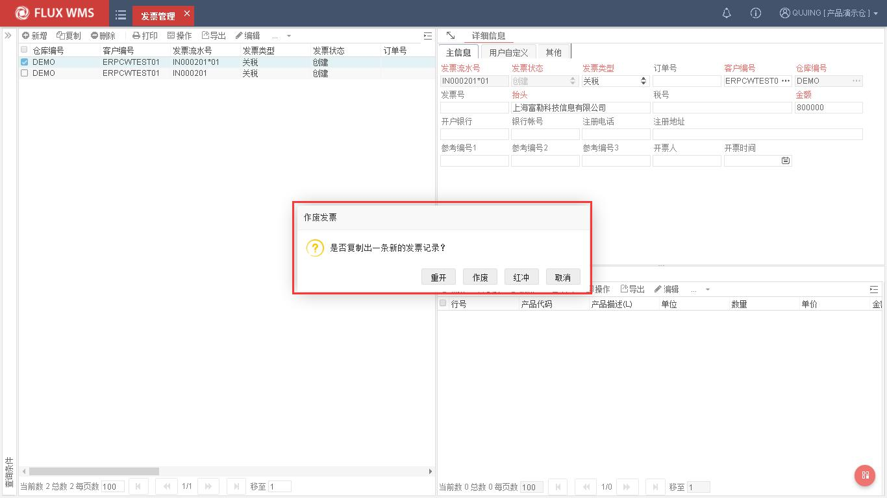

点击【作废】执行后，原发票记录会被置为“作废”状态。

如果选择【重开】，则生成一条发票号为空的记录，其余信息同原记录。方便用户输入新发票号。原发票记录变更为“作废重开”。

【红冲】同样生成一条发票号为空的复制记录，只是原发票记录状态变更为“红冲”。

  - 取消发票

已关联发票号，但实际未打印，此发票号码仍可使用，此时原纪录可以取消。通过鼠标右键功能“取消发票”，变更记录状态。

  - 复制发票

根据所选记录，生成一条发票号为空的新记录，其余信息同原记录。

<!-- 原 PDF 第 428 页 -->

## 11.21. 包裹管理

有些仓库与多个承运商有业务往来，根据重量选择不同的承运商。因此包装复核称重完成以后，才会选择承运商然后分别打印快递面单的需求。

对于此类特殊业务模式，系统通过包裹管理功能，支持相应作业需求。

包裹管理功能，需要配合集拼箱功能使用。集拼箱确认时，将对应集拼箱号、重量等信息传递给包裹管理模块。

- **包裹管理**

  - 选择“出库操作”下的“包裹管理”。

  - 在查询界面，输入查询条件

  - 查询到符合条件的集拼箱记录，选择记录，点击鼠标右键“指派承运人”功能，显示弹出窗口，输入或选择对应承运人，并确定

  - 通过鼠标右键功能，打印相应自定义快递单据

  - 打印成功，选择右键功能，关联面单号

- **鼠标右键功能**

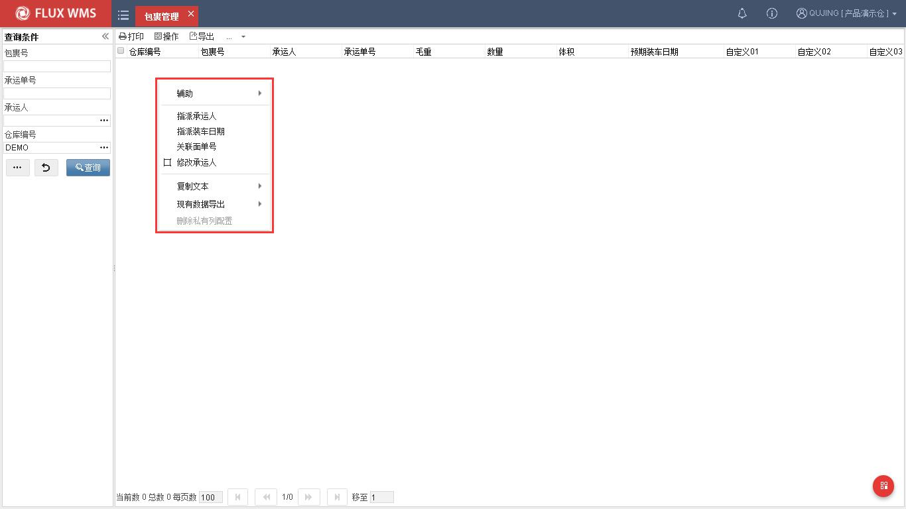

<!-- 原 PDF 第 429 页 -->

  - 修改承运人

已指派的承运人，可以根据需要重新修改。

  - 导出到 EXCEL

将所选记录导出为 Excel 文档。
