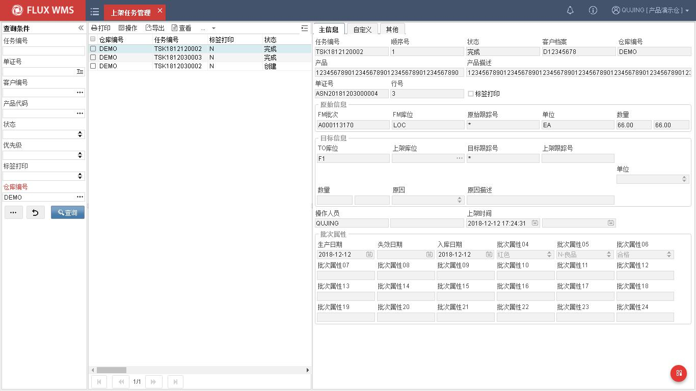
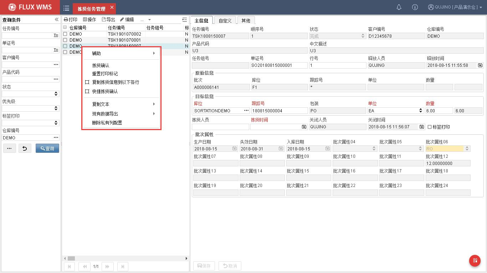
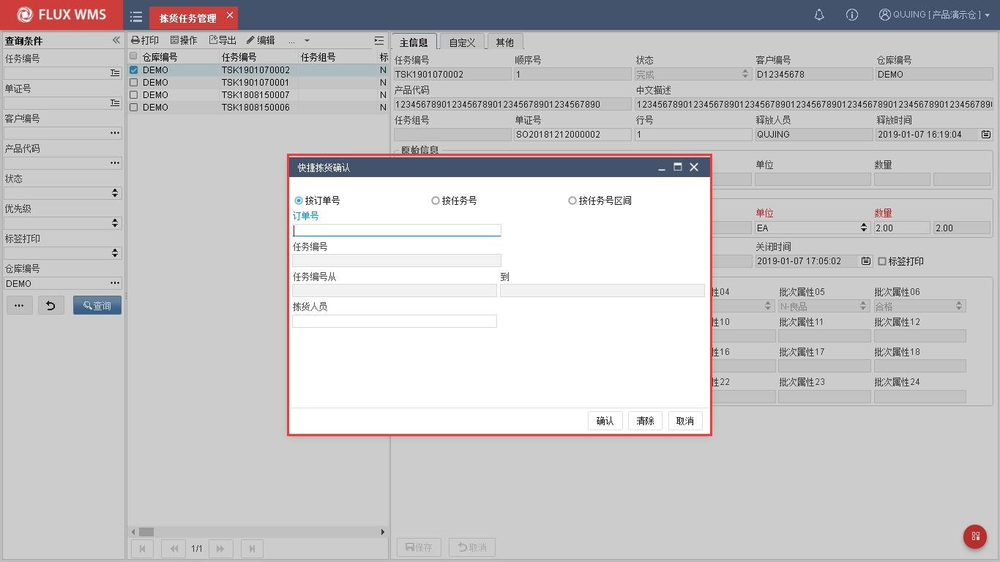
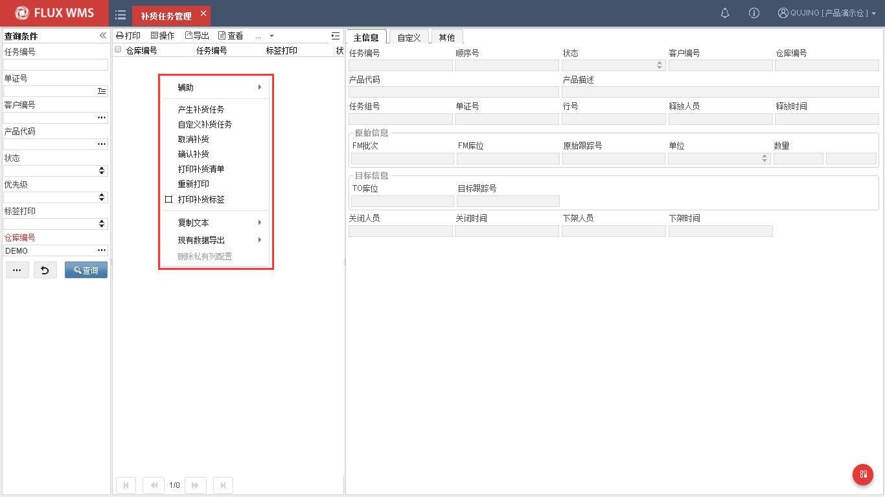
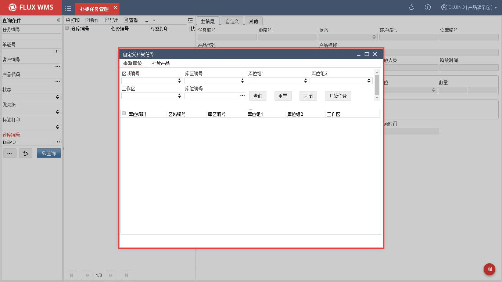
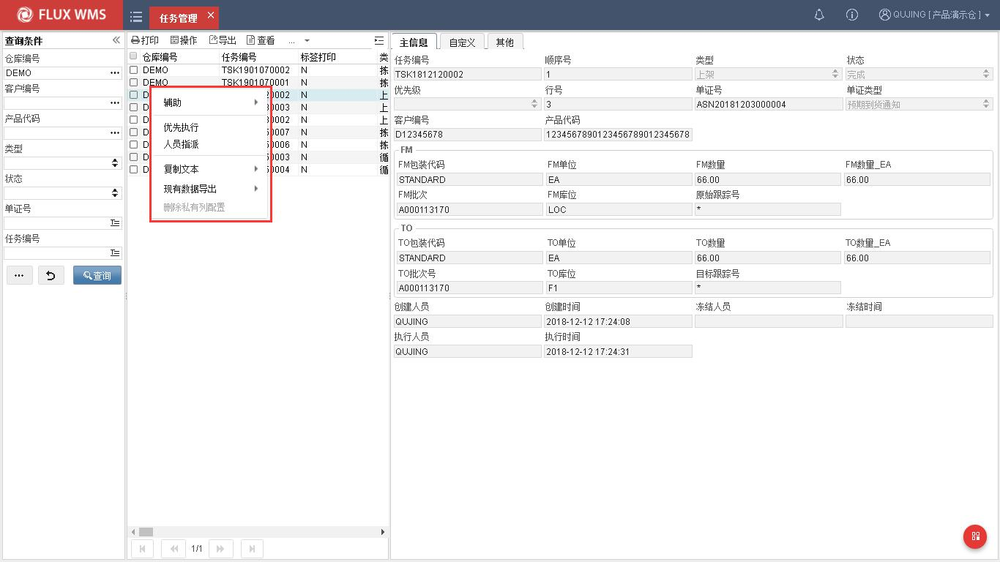
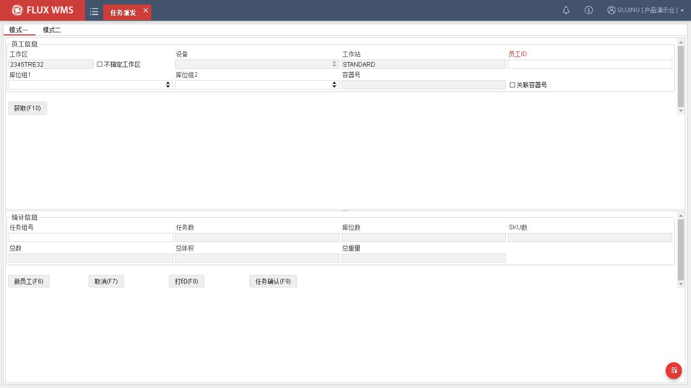
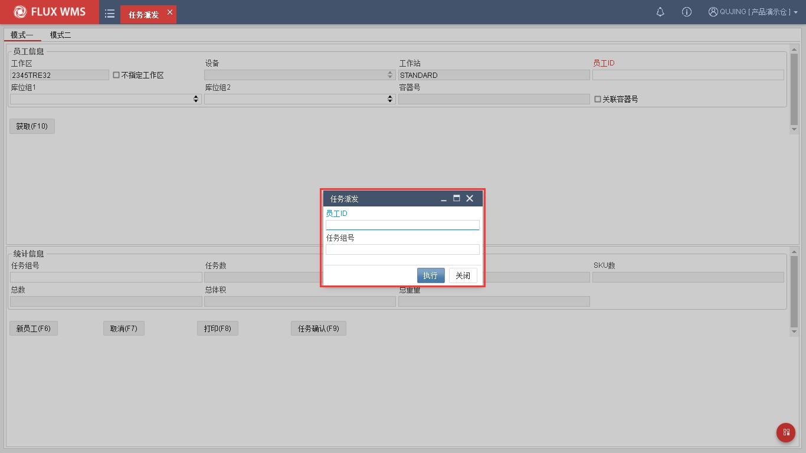
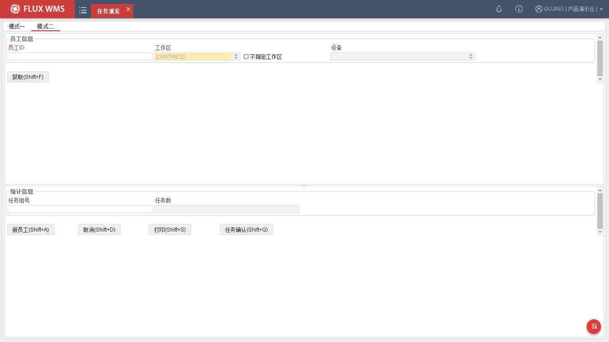
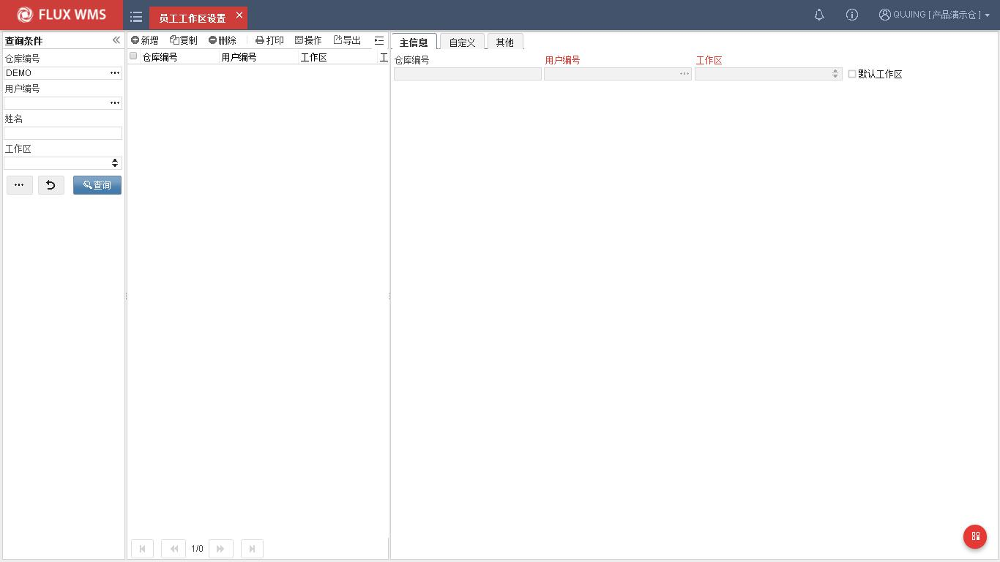

# 12. 任务管理

> 来源：`富勒WMS系统用户手册_V6_高清版（维他命）.pdf`，原 PDF 第 430 页起。
> 本文件按原 PDF 正文标题拆分；原文截图已提取至同目录 `assets/`。

<!-- 原 PDF 第 430 页 -->

## 12.1. 上架任务管理

上架任务专项管理功能。针对上架类型的任务进行查询、处理。

- **上架任务操作**

  - 选择“任务管理”下的“上架任务管理”。

  - 输入查询条件查找相应任务

  - 根据作业需要，对创建状态的上架任务，可以打印标签，或确认任务完成。

- **右键菜单功能**

针对查询到的上架任务，可通过鼠标右键菜单功能项进行相关操作。

  - 复制信息

选择任务作为样本，维护上架时间、操作人员，或者修改目标库位并保存后，通过鼠标右键功能，将信息复制到当前任务列表的以下各行，方便上架确认使用。

  - 确认上架

<!-- 原 PDF 第 431 页 -->

确认任务执行。可以单行确认，也可以选择多行记录，通过批量操作子菜单，进行批量上架确认。

  - 重置打印标志

记录改为未打印。

## 12.2. 拣货任务管理

拣货任务专项管理功能。类似任务管理，但只针对拣货类型的任务，并且可以直接对任务进行确认。

- **拣货任务操作**

  - 选择“任务管理”下的“拣货任务管理”功能。

  - 输入查询条件查找相应任务

  - 根据作业需要，对创建状态的拣货任务，可以打印标签，或确认任务完成。

- **右键菜单功能**

针对查询到的上架任务，可通过鼠标右键菜单功能项进行相关操作。

<!-- 原 PDF 第 432 页 -->

  - 复制信息

选择任务作为样本，维护拣货时间、操作人员，或者修改目标库位等信息并保存后，通过鼠标右键功能，将信息复制到当前任务列表的以下各行，方便拣货确认使用。

  - 拣货确认

确认所选任务记录，拣货执行成功。

  - 快捷拣货确认

二级窗口显示订单号或者任务号输入界面，符合条件的拣货任务批量确认执行成功。确认同时，可以修改拣货人员信息，无需在任务清单中另行修改、复制。

  - 重置打印标志

记录改为未打印。

## 12.3. 补货任务管理

补货任务功能，是用来生成、查询、确认产品补货任务操作所使用的。

要顺利使用系统补货功能，需要对产品拣货位、库位、补货规则等基础设置信息进行设置。

<!-- 原 PDF 第 433 页 -->

### 12.3.1. 补货设置

使用补货功能，需维护的相关基础设置为：

- **产品档案拣货位设置**

需要针对产品设置拣货位，具体可参考产品档案部分的拣货位页签设置说明。

产品拣货位设置，可分为固定拣货位和动态拣货位。固定拣货位即为产品指定拣货位 A 或 B，操作时系统只使用设置的 A、B 库位作为拣货位。

而动态拣货位则通过 DYNAMIC 库位设置对应的使用类型库位，由系统在该类库位中查找当时可用的库位。如拣货位设置为 DYNAMIC_EA 库位，库位使用类型为件拣货库位，则在件拣货库位中找可用库位，作为拣货位。如果当前件拣货位有该产品库存，则合并库位；如果没有库存，则根据补货规则查找新库位。因此使用动态拣货位，每个产品所用的拣货位并不是始终不变的。

需要注意的是，如果拣货位类型设置与当前仓库中的库位类型不符，或者补货下限设置为 0 都将导致无法生成补货任务。

- **库位设置**

产品拣货位中设置的拣货位使用类型，在库位信息中，目标库位的库位使用类型需要与之相符。例如，产品档案中选择了件拣货库位，而在库位设置中，全部库位都是存储库位，会导致无法生成补货任务。

- **库区设置**

库区中，可以同时有多个存储库区，系统支持配置指定的存储区的库存是否能够用于补货（是否补货来源）。例如存放未质检的不良品（尚未执行转移变更批次属性）的库区，一般不会用于补货来源。

- **区域设置**

订单驱动补货时会用到，区域是否遵循拣货位设置。如果不勾选，可以忽略产品档案的拣货位配置内容，仍旧从存储库位分配。

主要应用与良品、不良品分区存放，又都要拣货出库的业务情况。良品区设置拣货位，从拣货位拣货，但不良品区作业频率低，不设置拣货位，直接从存储位拣货。

- **补货规则**

产品所用的补货规则，需要选择对应的上架规则。可参考上架规则设置。如果补货规则、上架规则设置有误，或者产品档案中没有选择正确的规则，会影响到动态补货情况下的新库位查找。拣

<!-- 原 PDF 第 434 页 -->

货位尚有库存存在时，系统计算补货任务直接指向现有拣货位，无需考虑补货规则。

- **参数设置**

参数 RPL_QTY_ALC，控制补货任务计算时，是否考虑分配数量。

如参数设置为 N，则根据拣货位库存是否低于补货下限来判断是否需要生成补货任务，以及计算待补货数量。

如参数设置为 Y，则根据拣货位分配后的可用库存余量是否低于补货下限来判断是否需要生成补货任务，以及计算待补货数量。

因此参数设置不正确，会使得部分产品没有根据预想生成补货任务。例如某产品拣货位库存 100，分配 95 后剩余 5EA，补货下限为 20，当参数为 N 时，系统判断 100>20，不需要生成补货任务；而当参数为 Y 时，系统判断 5<20，需要生成补货任务。

是否根据分配数量计算补货，主要与仓库操作情况相关，例如拣货位可存放产品数量、库存周转率及分配到实际拣货的时间长度、拣货到发货确认的时间长度相关。

否则根据分配数量计算的补货库存可能没有空间容纳。

### 12.3.2. 补货操作

补货作业可以根据现场需要，需要不同的操作模式。比较常见的主要有库存检查模式和订单驱动模式，经常配合使用。

- **库存检查补货**

通常在作业空闲时段进行，触发后系统检查库存，针对需要补货的产品，批量生成补货任务。

操作步骤为：

  - 选择任务管理下的补货任务功能。

  - 点击右键菜单，选择功能“产生任务”，系统检查当前库存和产品等设置，批量生成补货任务。同时能够在库存余量的按批次/库位/跟踪号查询界面中查看补货待下架/上架数量。待补货库存被锁定。

  - 在生成的任务列表中，勾选所需补货任务（或通过全选/反选选择记录），选择右键功能菜单项，打印补货清单，使用清单指导仓库实际补货作业（也可打印补货标签，用于 RF 补货操作，具体参考 RF 操作手册）。

  - 实物补货完毕，在补货任务中，选择对应记录，点击右键菜单功能项“确认补货”，系统执行补货确认，将存储库位的对应库存补货到拣货库位。补货操作完成。

<!-- 原 PDF 第 435 页 -->

  - 如果补货任务生成后，实际不再需要补货（例如已经执行了库存移动）可通过右键功能项“取消任务”来释放补货任务。

- **订单驱动补货**

补货任务中的生成补货功能，用于日常操作开始前或者结束后批量生成补货任务。但有时即使拣货位补充到上限，日常操作分配时遇到出库量大的情况也会将拣货位库存用光，需要临时进行补货。此时可通过订单驱动补货，仅补充订单中需要而拣货位库存不足的产品。

订单驱动补货，除了产品档案中的拣货位等信息设置之外，还需要在分配规则中进行设置，允许系统自动产生补货任务。

订单驱动生成的补货任务同样显示在补货任务列表中，后续补货操作与批量生成补货的操作相同。

- **鼠标右键功能**

  - 自定义产生补货任务

根据需要的范围条件，生成指定的补货任务，方便有针对性的快速补货操作。

在如下的二级窗口中，指定补货任务范围条件，包括货物库位条件，产品、货类、产品组等条件。系统在指定的条件范围内，计算生成补货任务。

<!-- 原 PDF 第 436 页 -->

  - 取消任务

已生成任务，如无需操作，可以取消任务。

## 12.4. 任务管理

任务管理功能是记录产品在系统中所做任务的所有活动。可以查询到已经完成的任务情况和尚未执行的操作任务。任务包括上架任务、补货任务、拣货任务等不同类型的任务。

- **任务管理**

  - 选择“任务管理”下的“任务管理”功能，系统显示查询页面。

  - 输入查询条件，查询所需任务

  - 可通过明细页签查看具体细节。

- **鼠标右键功能**

<!-- 原 PDF 第 437 页 -->

  - 优先执行

将所选任务的优先级提至最高，使之在任务队列中排序在前。

  - 人员指派

二级窗口显示当前工作区中的员工信息，可选择人员，将任务指派给此作业员。也可以选择多人，平均分配任务。

如果查询条件中未选择“工作区”，则显示此仓库全部工作区对应的人员信息。

## 12.5. 任务派发

员工所需执行操作的任务，不经过人工提前安排，而是通过扫描员工 ID，领取任务，由系统根据预设逻辑分发任务，称之为“任务派发”。同时，此功能可以相应输出任务标签，以便后续操作使用。

- **任务派发**

  - 选择“任务管理”下的“任务派发”。

  - 作业模式一：

<!-- 原 PDF 第 438 页 -->

设置任务派发范围条件，如工作区、库位组等，扫描员工 ID，由系统根据范围内的任务量，下发任务给此员工。

工作区－客户端对应工作区。在客户端文件中配置默认值，作为任务领取的工作区范围限定。界面可勾选“不指定工作区”，但不可修改默认工作区。

设备－根据员工默认设备进行显示（在“员工设备设置”功能中维护）。

工作站－显示客户端文件中的工作站配置信息，。

员工 ID－扫描的员工条码或者员工卡号条码

库位组 1－任务派发限定范围要求

库位组 2－任务派发限定范围要求

关联容器号－勾选后，可扫描容器号与任务关联。例如拣货到同一个目标容器中。

  - 任务派发成功，系统生成任务组号，显示在界面上。

  - 支持人工录入任务组号，用于补打印等。也可点击【获取】按钮，根据指定范围，获取待作业的任务组号，显示在界面上。

  - 纸单作业模式下，任务操作完成，可以在系统界面确认完成。点击【任务确认】按钮，系统显示如下录入框，扫描员工 ID，录入任务组号，确认执行。

<!-- 原 PDF 第 439 页 -->

  - 模式二：

扫描员工卡号、ID，系统查找并分派任务，在界面显示任务组号。

- **其他**

<!-- 原 PDF 第 440 页 -->

  - 打印

点击后，打印任务组号对应标签。

## 12.6. 员工工作区设置

配合任务调度管理，根据需要，设置作业员工具有权限的工作区。员工代码，需要先期在 SEC 权限管理系统中创建，工作区则需要在基础设置-工作区功能中维护。

- **员工工作区设置**

  - 选择“任务管理”下的“员工工作区设置”功能。

  - 点击【新增】按钮，输入，或通过浏览按钮选择用户编号（操作员工 ID）。系统根据选择，显示对应姓名。

  - 下拉选择此员工的指定工作区。如果为主作业区，可设置为默认工作区。

  - 保存记录，建立员工-工作区对应关系。

  - 同一员工可设置多个工作区。
