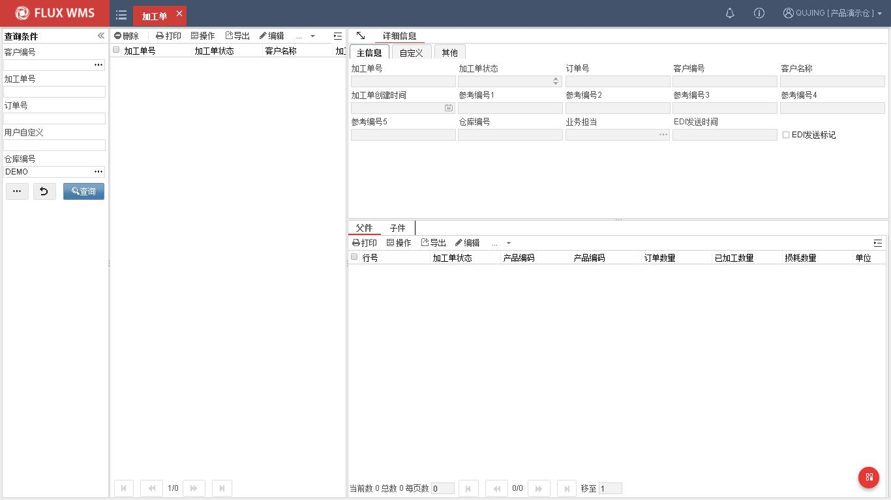

# 13. 增值服务

> 来源：`富勒WMS系统用户手册_V6_高清版（维他命）.pdf`，原 PDF 第 441 页起。
> 本文件按原 PDF 正文标题拆分；原文截图已提取至同目录 `assets/`。

<!-- 原 PDF 第 441 页 -->

## 13.1. 概述

随着物流在企业管理中的作用日渐加强，越来越多的仓库不仅提供常见的进出存及简单的附加服务，还能提供简单加工等增值服务。

为了对这些能够带来更多价值的服务操作进行管理，系统提供了增值服务模块。根据不同的加工管理需求，增值服务分为加工单、拆分单和增值服务单。

## 13.2. 加工单

加工作业，是最常见的增值服务之一。

从仓库操作管理角度，可分为 2 类加工方式，一类是在原产品基础上进行加工，产品总数量不变，例如产品换包装、贴标签、覆膜、塑封等；另一类是组合加工，将几个子件加工组合成一个父件，不仅产品会变化，产品数量也随之变化，例如将分别入库的洋酒产品和杯具产品组合成洋酒礼盒。

注：子件指用来加工组合的零件产品，父件指的是加工组合所得的产品或产品套装。

对于第一种，原产品基础上的加工，管理重点是记录加工件数，以便统计工作量、成本，同时在库存中区分已加工、未加工的产品，以免误出库。此类作业，如果产品代码不变，仅记录工作量，可以使用 ASN、SO 的服务记录功能，或使用增值服务单；如果加工后产品代码改变，可使用转移单，或作为一对一的 BOM，通过加工单进行管理。

对于第二种组合加工，由于产品、数量均有变化，需要对加工全程操作进行管理。此类比较复杂的组合加工需要通过加工单功能进行管理。

- **相关设置**

使用加工单功能，需要先将相关基础设置维护完善，主要涉及设置有：

  - 产品档案

产品档案中，需要维护父件和子件的基础信息，并且父件产品需要设置“组合件标识”，具体可参考基础设置，产品档案部分的介绍。

  - 组件

需要在基础设置-组件功能中，设置子件、父件的关联，类似 BOM 清单。具体设置参考基础设

<!-- 原 PDF 第 442 页 -->

置组件部分的介绍。

  - 库位

系统中需要有库位使用是“组装加工区“的加工专用库位。库位 ID 限定为 WB_RM_仓库 ID、WB_FG_仓库 ID，作为待加工库位，与已加工暂存库位。

- **加工单操作**

  - 创建加工用的 SO

创建加工用的 SO，目的是通过 SO 分配子件库存，便于操作人员从库存中拣取加工所需的货物。同样，也可以接收 ERP 接口下达的加工指令，作为加工 SO。

因此对于 SO，可输入加工所需的父件数量，通过 SO 右键功能“拆分 BOM”，将记录拆分为子件记录，订单分配子件库存。

拆分 BOM 的作业，并不限制 SO 的订单类型。也即全部 SO 都可以根据 BOM 把父件明细拆分为子件明细。有时仓库不做实际加工，仅按照 BOM 比例出库对应子件产品会使用到单纯的“拆分 BOM”功能，仓库不进行组装加工。系统通过参数 VAS_BOM_CTL 控制非加工类型的 SO 能否使用“拆分 BOM”功能。

普通 SO 拆分 BOM，最常见的就是赠品的发货，订单指令中下达出库 A 产品 100 件，根据 BOM 中的设置，SO 拆分为 A 产品 100 件+赠品 B 产品 100 件，分别拣货后发货。由超市销售人员将 A、B 产品捆扎在一起销售。

但只有加工类型的 SO，系统在拆分的同时，会创建对应的加工单，可以进行后续加工操作。

  - 生成加工任务

SO 分配并确认拣货后，通过鼠标右键，生成加工任务，系统找到对应加工单，创建子件加工信息。

创建 SO、拆分 BOM 和生成加工任务等操作，可参考发运订单部分的介绍。

  - 加工确认

在增值服务的加工单功能中，查询所需的加工单

在明细的父件页签，选择执行加工的父件产品，在待加工数量字段，输入此次加工的数量，并保存。

<!-- 原 PDF 第 443 页 -->

同时可根据需要，输入父件产品的批次属性信息。系统支持一个加工单多次加工操作。

实物加工完毕，选择父件记录，通过鼠标右键菜单功能“确认完成加工”，由系统执行加工确认，扣减子件产品数量，增加父件产品数量。

如果加工单明细行较多，又一次性加工完成，可以通过表头的鼠标右键功能“确认完成加工”，批量确认整单加工作业完成。

  - 加工操作全部完成，可关闭加工单

  - 如果有设置加工费率，加工单关闭时系统将计算对应费用。

- **损耗管理**

加工过程中，有时会有库存损耗，导致无法按数量完成加工。此时需要扣减掉损耗的子件库存，但又希望在加工单中加以记录。

因此系统提供的损耗管理，主要是加工单中，记录子件损耗数量，然后通过表头鼠标右键功能 “生成损耗调整单”，通过调整单扣减子件损耗库存。
