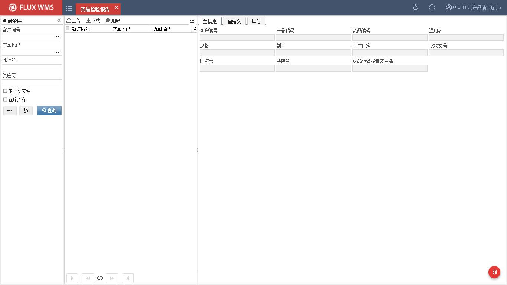
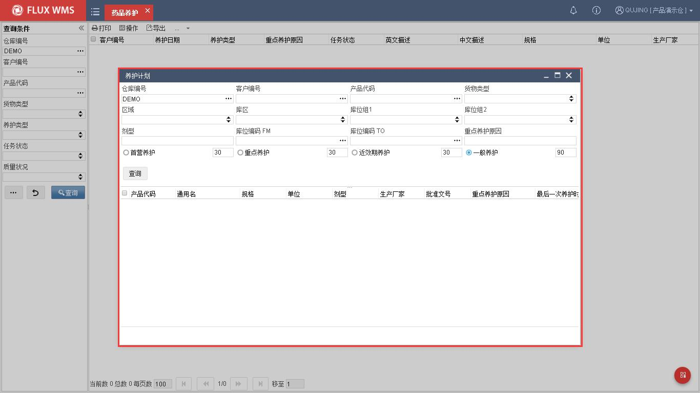
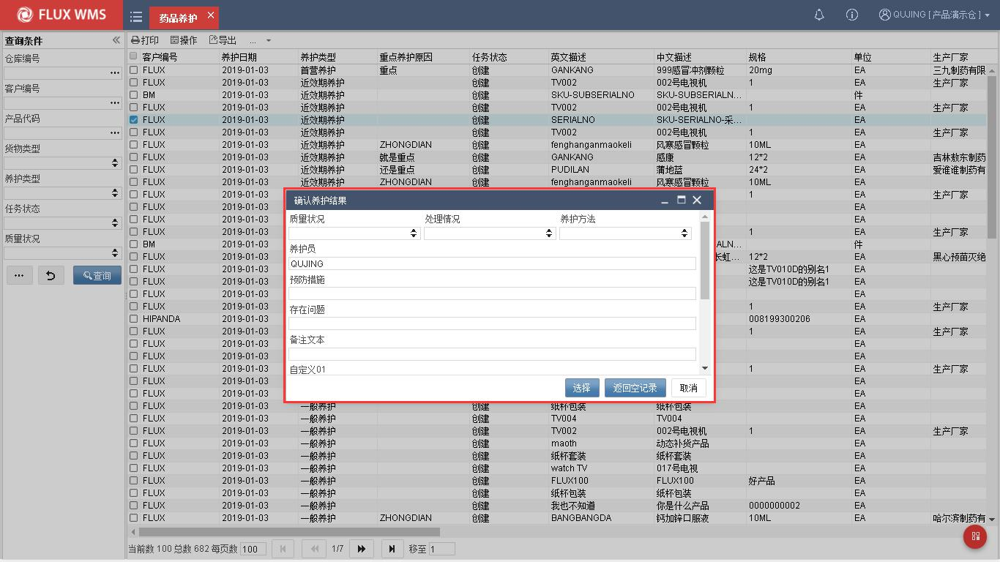
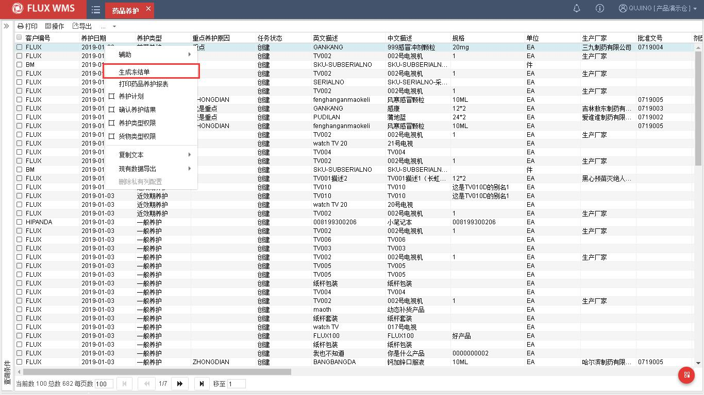
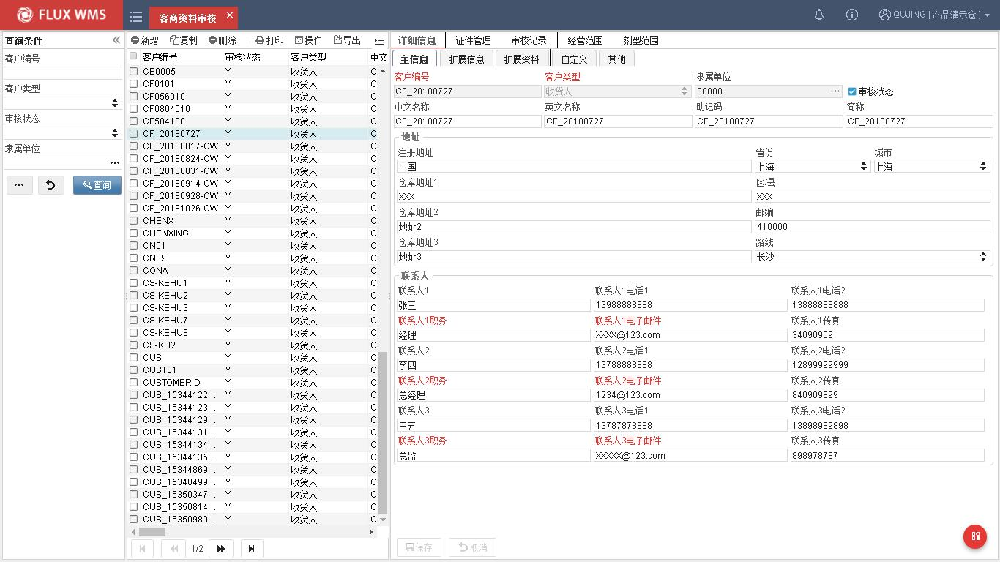
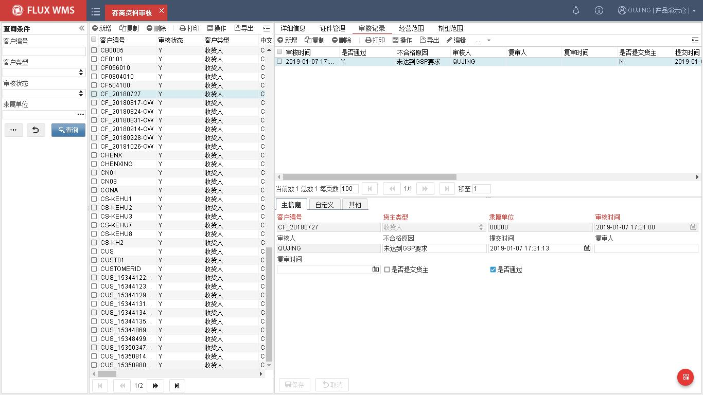
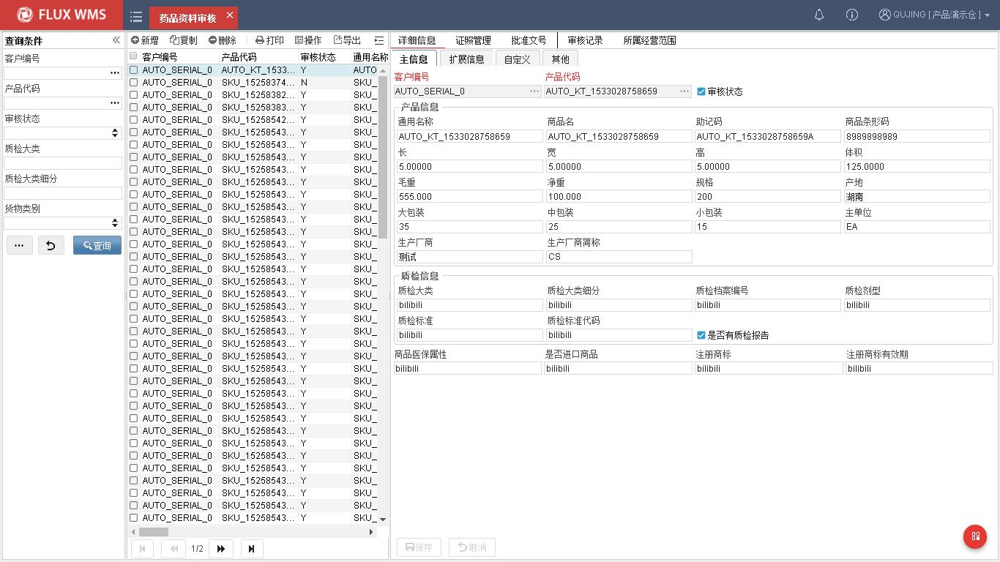
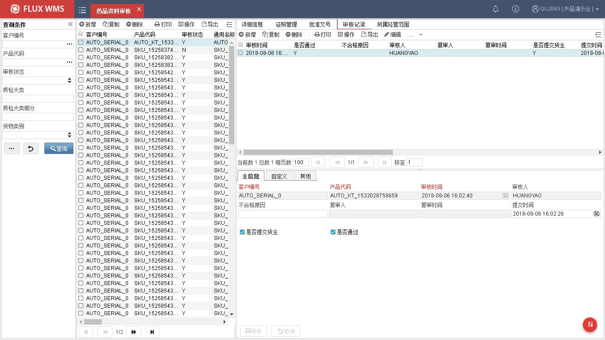

# 14. 行业插件

> 来源：`富勒WMS系统用户手册_V6_高清版（维他命）.pdf`，原 PDF 第 444 页起。
> 本文件按原 PDF 正文标题拆分；原文截图已提取至同目录 `assets/`。

<!-- 原 PDF 第 444 页 -->

## 14.1. 药品检验报告

药品检验报告，是医药行业管理的所需功能。

药品检验报告书是对药品质量作出技术鉴定后出具的具有法律效力的技术文件，一般需要按批号提供。

对于需要进行检验报告管理的产品，可以在入库时扫描供应商提供的药品检验报告，然后出库时相应打印，随货提供给收货人。

- **药品检验报告**

使用药品检验报告功能，需要先配置 MED_QC_DIR 参数，维护药品检验报告上传后的保存路径。

  - 选择“行业插件”下的“药品检验报告”功能

  - 对于新入库的批次，查询时勾选“未关联文件”，系统查询尚无检验报告记录的库存。

  - 选择记录，鼠标右键“定位药品检验报告”，系统定位到参数所指定的路径，选择

<!-- 原 PDF 第 445 页 -->

检验报告扫描文件，确认后将文件名记录批次信息中（后台字段）

  - 需要输出药品检验报告时，同样通过查询定位，此时无需勾选“未关联文件”条件，系统只查询具有检验报告的批次库存。

  - 选择记录，通过鼠标右键功能“打印药品检验报告”，或者打印标签

## 14.2. 药品养护

药品养护是医药行业的管理要求，根据药品的储存特性要求，采取科学、合理、经济的手段和方法，通过控制调节药品的储存条件，对药品储存质量进行定期检查，达到有效防止药品质量变质、确保储存药品质量的目的。

- **药品养护**

进行养护前，需要先产生养护任务。系统支持定时器后台生成养护任务，同时也支持手动生成养护任务。此处介绍手动作业模式。

  - 选择“行业插件”下的“药品养护”

  - 在“列表”页签，选择鼠标右键功能“养护计划”，系统显示如下二级窗口

重点养护原因－根据 GSP 管理要求，药企可自行定义重点养护原因范围。系统提供重

<!-- 原 PDF 第 446 页 -->

点养护原因内容维护，查询时也可基于此内容筛选记录。

养护周期－不同药品要求的养护周期不同，系统提供首营、重点、近效期的不同默认周期供配置使用，勾选后，将筛选上次养护迄今超过指定天数的待养护产品记录。三个都不选，默认为一般养护。

  - 输入查询条件，查询符合条件的产品记录

  - 在查询结果部分，选择记录，鼠标右键功能“生成养护任务”，系统针对所选产品的库存记录，生成养护任务，可在药品养护功能中查询到。

  - 已生成的养护任务，可以通过 RF 的养护功能执行养护（具体介绍请参考 RF 操作手册）。如在 WMS 中确认养护，同样选择记录后，通过鼠标右键功能“确认养护结果”，系统显示二级窗口：

  - 用户输入养护情况细节后确认养护结果。

- **养护处理**

根据 GSP 要求，在药品养护的业务中，质管员需要对养护异常的药品进行冻结，禁止销售出库。此时可以将问题记录，通过鼠标右键菜单，批量操作子菜单中的“生成冻结单”功能，将异常库存冻结，不参与出库作业。

<!-- 原 PDF 第 447 页 -->

## 14.3. 客商资料审核

新版 GSP 管理需求功能，通过接口、导入或者人工创建客商相应资料，经过审核后，才能成为客户档案记录。

- **客商资料审核**

  - 选择“行业插件”下的“客商资料审核”功能

  - 通过查询条件，查看已获取到的客商资料，或点击新增按钮，在如下界面录入新客商信息：

<!-- 原 PDF 第 448 页 -->

  - 根据需要维护扩展信息、证件信息

  - 经营范围信息，通过点击【新增】按钮，系统在二级窗口中显示已在系统代码维护的经营范围供选择。

  - 审核人员，在“审核记录”页签，新增审核记录，维护审核情况。如确认审核通过 （勾选是否通过选择框），后台将客商记录添加为新的客户档案。

<!-- 原 PDF 第 449 页 -->

## 14.4. 药品资料审核

新版 GSP 管理需求功能，通过接口、导入或者人工创建药品相应资料，经过审核后，才能成为产品档案记录。

- **药品资料审核**

  - 选择“行业插件”下的“药品资料审核”功能

  - 通过查询条件，查看已获取到的药品资料，或点击【新增】按钮，在如下界面录入并保存新药品信息：

<!-- 原 PDF 第 450 页 -->

  - 根据需要维护扩展信息，证照信息。

  - 经营范围信息，通过点击【新增】按钮，系统在二级窗口中显示已在系统代码维护的经营范围供选择。

  - 审核人员，在“审核记录”页签，新增审核记录，维护审核情况。如确认审核通过 （勾选是否通过选择框），后台将药品记录添加为新的 SKU 产品档案。

<!-- 原 PDF 第 451 页 -->

