# 15. 费收

> 来源：`富勒WMS系统用户手册_V6_高清版（维他命）.pdf`，原 PDF 第 452 页起。
> 本文件按原 PDF 正文标题拆分；原文截图已提取至同目录 `assets/`。

<!-- 原 PDF 第 452 页 -->

## 15.1. 费收概述

费收是系统用来计算客户费用情况的功能模块。FLUX WMS 能够支持多种费收结算方式，并且可以为不同产品分别设置不同的费率收费。

## 15.2. 仓储费率设置

费率设置时，需要对一些基本的信息进行设置，并在费收模块中设置费率，然后在产品档案选择相应的费率进行使用。

- **基础费率设置**

  - 选择“费收管理”模块下的“仓储费率设置”功能

  - 在详细信息页签，点击“新增”按钮，新增记录：

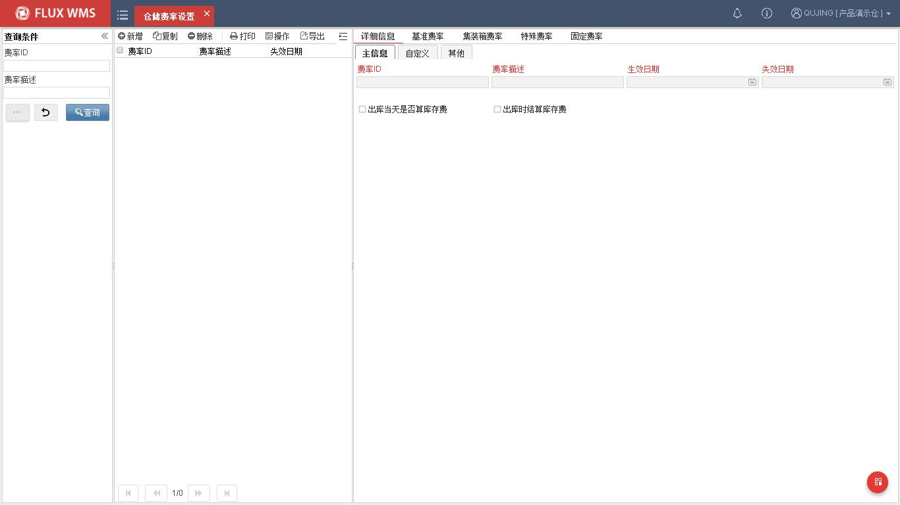

费率 ID－该费收方式的代码，由系统自动生成流水号。

费率描述－该费率的名称说明。

生效日期－费率开始使用的日期。

<!-- 原 PDF 第 453 页 -->

失效日期－费率不再使用的日期。超过失效期，不再依据此费率进行计算。

  - 点击【保存】按钮，保存主信息记录。

  - 在基准费率页签，点击【新增】按钮，依次输入如下信息。

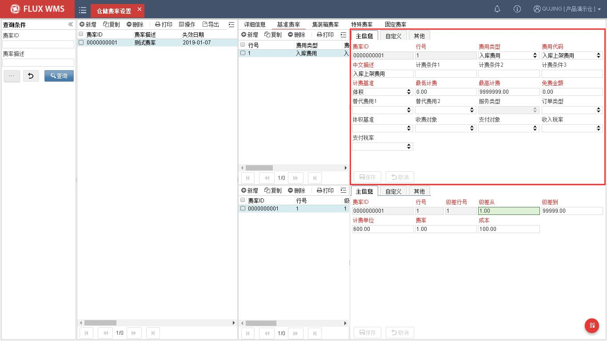

费率 ID－该费收项所属费率代码。

行号－费项行号。

费用类型－费用的一级分类，系统据此确定何时计算该费用。系统提供入库费用、库存费用、出库费用、增值服务费用、特殊费用等不同种类供选择。

费用代码－费用的二级分类，是一级分类下的细化分类。例如入库费用下还可以细分为入库费用、入库集装箱费用、入库特殊费用、入库附加费等。

描述－对该费用项的描述，同时也是费用的三级分类。

计费条件 1-3 －费用项的前提条件。

计费基准－计费的依据，例如体积、重量、计费吨、数量、托盘等。目前计费基准支持 “折算箱数”、“集装箱”、“体积”、“固定计费”、“库位数”、“订单行”、“折算托盘数”、“折算件数”、“计费吨”、“整箱数”、“整托盘数”、“单件数”、“重量”、“净重”。

<!-- 原 PDF 第 454 页 -->

最低计费－该费用项起计费点。

最高计费－该费用项最高限制费用额。

免费金额－该费用项，可减免金额。

替代费用－不可同时产生的费用。例如有些客户，收取了集装箱费用，就不再收取入库费用。此时集装箱费用就是入库费用的替代费用。而另一些客户，这 2 项费用同时收取，此时就不是替代费用。

服务类型－针对增值服务费用类型生效，可选择对于订单的服务中，何种服务需要计费。

订单类型－应用于不同单证类型所用费率不同的情况。例如正常入库与退货入库的费率不同，此时需要设置费率的单证类型。

体积基准－整单位体积计费需求。例如出库数量为半箱，但需要根据整箱的体积计费，此时体积基准设置为箱。系统提取包装代码中箱级别维护的整箱体积进行费用计算。

收费对象－计算所得的应收费用的对象。可指定为订单的货主，或者供应商/收货人等，系统获取订单对应信息作为费收项的收取对象。也可以可维护为客户档案信息进行选择。

支付对象－计算所得的成本费用的付给对象。

收入税率－结算时使用的计费税率，以便计算含税、不含税费用。税率选项在系统代码中进行维护。

支付税率－计算成本支出时使用的税率。部分业务场景，在收入、支出时需要按不同税率结算，因此系统支持分别配置不同的税率。

  - 在费用级差的明细部分，点击【新增】按钮，输入如下信息：

<!-- 原 PDF 第 455 页 -->

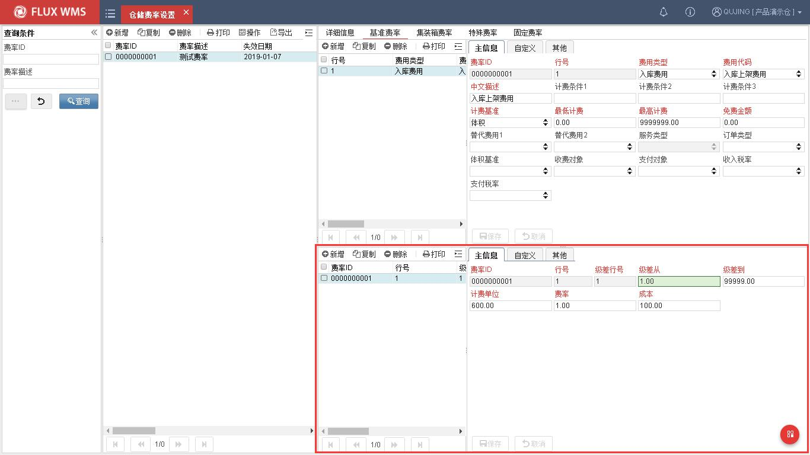

费率 ID－该费收项所属费率代码。

行号－级差对应的费用项行号。

级差行号－多级级差设置时，对应的行号。一个费用行，可配置多级级差，对应多行级差行号。费用级差，是有些客户实行阶段计费，例如 10KG 以下，固定收费 100 元，10~100KG，每 KG 收费 5 元，100KG 以上，每 KG 收费 3 元，这种收费方式就是级差计费，需要设置多级费率。如果没有多级差的收费要求，只需设置一个级差以及费率。

级差从，级差到－费用计费基准的级差范围。同一级差内，使用一个费率。

计费单位－级差计算时的最小计费单位，默认为 1。可以通过计费单位的修改，实现类似进位计费的需求，例如 11~19 立方米都按 20 立方米计费，此时计费单位应设置为 10，只按 10 的倍数计费，不满整十的数量都进位补满。

费率－费用项在级差范围内使用的费率。

成本－需要计算操作成本时使用，计算逻辑同应收费用。

  - 点击【保存】按钮，完成基本费用费率设置。

- **集装箱费率设置**

部分仓库，到货如果是集装箱，则需要收取集装箱费用，一般根据箱型和集装箱个数计算费率，因此需要设置集装箱专用费率，再根据进出库单据中记录的各个箱型的集装箱数量信息，进行对

<!-- 原 PDF 第 456 页 -->

应费用计算。部分情况下，收取集装箱时，对应入库装卸费就免除。

  - 在集装箱费率页签，设置如下信息：

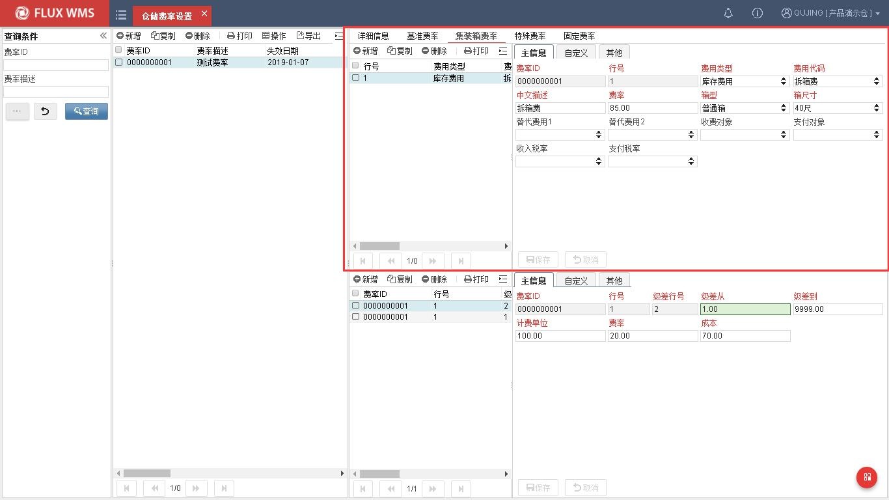

费率 ID－集装箱费用所属的费率代码，新增是带入。

行号－集装箱费用的行号。

费用类型－集装箱费用所属费用大类，如入库费用、出库费用。

费用代码－集装箱费用所属费用小类。

描述－对该费用项的描述。

费率－集装箱费率。

箱型－集装箱箱型。

箱尺寸－集装箱尺寸。同一费率 ID 中，箱型和尺寸将作为选择集装箱费率的依据。下拉列表中的箱型、尺寸内容，可在系统代码中维护。

替代费用－不可同时收取、相互替代的费用。例如有集装箱用，就不收取入库卸车费。

收入税率、支付税率－集装箱费用计算相关税率。

  - 点击保存完成集装箱费率设置。

<!-- 原 PDF 第 457 页 -->

- **特殊费率设置**

与操作相关的装卸加班费、单证滞纳金等费用，大部分情况下无法按普通的进出数量、重量进行费用计算，而是需要人工录入收货依据，形成基于单证的特殊费用。

少部分情况下，这些特殊费用可以设置为费率，人工在进出库单证的特殊费用页签输入计费的工作量相关信息，再根据特殊费率计算费用。例如进出库操作费用按件数计算，同时又按照托盘数量收取设备使用费。

  - 在特殊费率页签设置如下信息

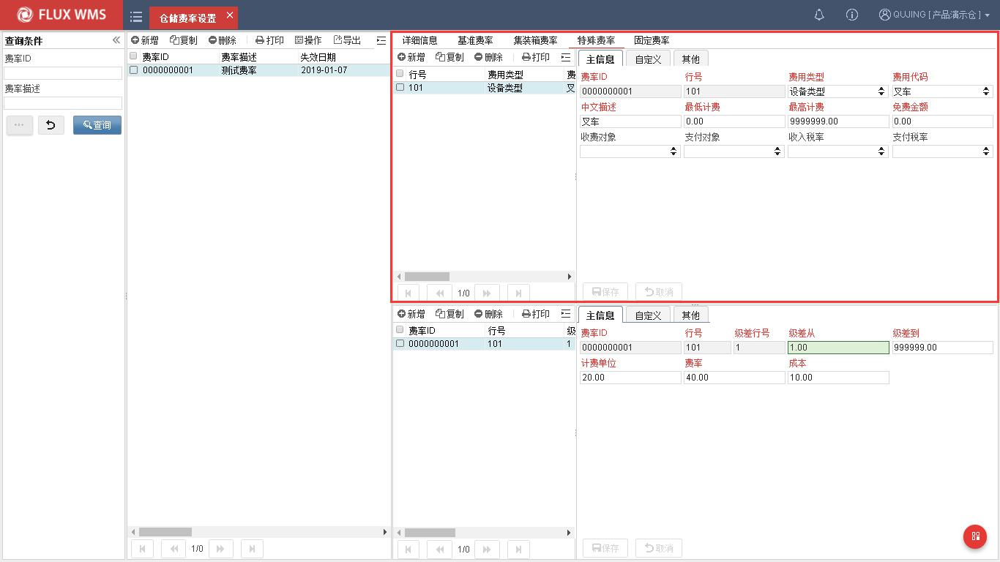

费率 ID－特殊费用所属的的费率代码，新增时根据费率信息带入。

行号－费用项行号，与基础费率区分，从 101 开始生成。

费用类型－特殊费用种类，可选择包材相关特殊费用，或者设备相关特殊等。

费用代码－特殊费用代码，根据费用类型相应显示。

描述－费用说明

最低计费－该费用项起计费点。

最高计费－该费用项最高限制费用额。

免费金额－该费用项，可减免金额。

<!-- 原 PDF 第 458 页 -->

收费对象－计算所得的应收费用的对象。

支付对象－计算所得的成本费用的付给对象。

应收税率－税率维护，用于以便计算含税、不含税费用。

  - 特殊费用的级差费率设置同基准费用级差费率设置。

- **固定费率**

固定费率，主要用于配置包仓费用等固定收费：

  - 在固定费率页签，点击【新增】按钮，输入如下内容：

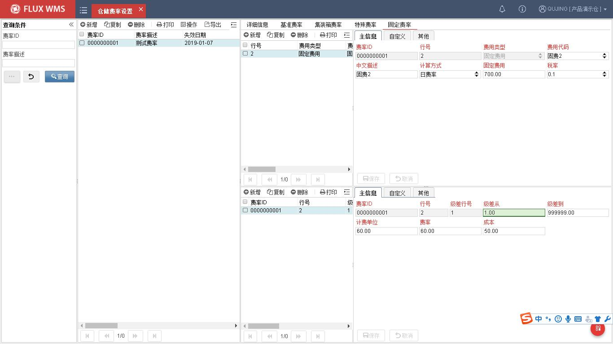

费率 ID－固定费用所属的的费率代码，新增时根据费率信息带入。

行号－费用项行号。

费用类型－显示为“固定费用”，不可修改。

费用代码－固定费用代码，用户可以根据需要在系统代码中配置，例如包仓费用，场地租赁费用等。

描述－费用说明

计算方式－系统提供日费率，月度费率 2 个选择。如果计算方式是日费率，系统将每日生成一笔固定费用，月费率则每月生成一笔固定费用。

<!-- 原 PDF 第 459 页 -->

固定费用－计费的金额。

税率－由于固定费用是应收费用，因此仅提供一个税率选择字段。

  - 点击【保存】按钮完成固定费率设置

- **货主设置**

费率配置好后，需要在客户档案中选择相关配套设置，帮助费用计算。

  - 点击客户档案，在“附加信息”页面，依次输入如下信息：

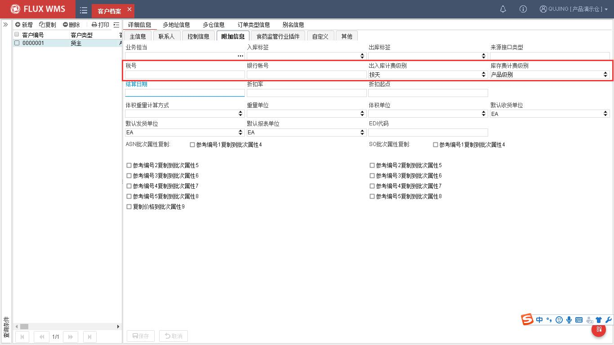

税号－货主所用税号。

银行帐号－货主银行帐号

入/出库计费级别－系统计算费用，统计计费基准级差以及最低、最高费用时的统计范围选择。系统提供按交易、按订单行、按订单、按天几种选择。

库存计费级别－计算库存费用时的级别范围选择方式。系统提供客户、产品、批次 3 个级别供选择。

  - 在“多仓设置”页面，可维护货主级别默认费率设置：仓库－费率对应仓库费率代码－所使用的费率，通过下拉列表选择已经在【仓储费率设置】功能中维护过的

<!-- 原 PDF 第 460 页 -->

费率。

结算日期－货主默认结算日期

包仓计费方式－包仓模式下的计费方式，可选择按月计费或按日计费。

包仓费用－费用采用包仓形式的固定包仓费用。

税率－包仓模式下所用税率

包仓面积－用于备注客户租用场地信息。

用户自定义－自定义字段

包仓客户－选择此项意味着客户以包仓方式结算，不再逐次计算进出费用。

出库时结算库存费－如选择此项，日常不计算库存费用，当产品出库发运后，计算所发运的产品从入库到出库的全部库存费用。

  - 点击保存，完成配套设置。注：如果缺少相关配置，费用计算时系统会提示费率设置不全。

  - 如果同一客户下，不同产品所需费率不同，可在【产品档案】功能，“多仓设置” 页签，维护相应费率。

- **费率应用**

已设置的费率需要在客户和产品中选择应用。客户档案的费率，是新增产品时的默认使用费率。真正生效的，是产品档案中选择使用的费率。

进、出库时，完成收、发操作后，关闭订单时，系统会把订单相关的费用计算完成，并记录到费用结算清单中。包括进、出交易事务产生的费用，单据表头特殊费用页面手工添加的费用，和根据单据集装箱页面记录计算的集装箱费用。

库存费用系统每日定时计算。同时库存报表中提供补算历史库存费用的功能。

## 15.3. 费用清单

系统在操作中根据费率设置计算客户的应收/应付费用，计算结果可在费用结算界面查看。费用结算是系统用于记录、修改、确认费用明细的功能界面，并支持维护客户到款信息。也可以在费用结算界面根据实际情况手工添加费用记录。

- **费用结算**

<!-- 原 PDF 第 461 页 -->

  - 选择“费收管理”下的“费用结算”功能。

  - 输入查询条件，能够查找到指定客户的指定费用。

  - 支持手工添加费用记录，在明细页面，点击“新增”按钮，添加费用记录。主信息页签依次输入如下信息。

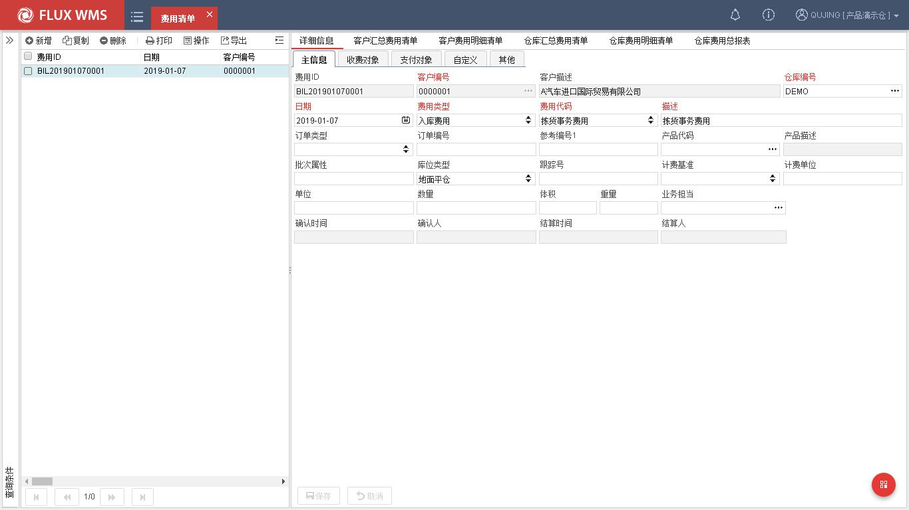

费用 ID－费用记录在系统中的流水序号，由系统自动产生。

客户编号－费用记录所属的客户 ID。

客户描述－费用记录所属的客户对应名称。

仓库编号－费用记录产生的仓库。

日期－费用记录生成日期。

费用类型－费用记录所属类型，一级分类信息。

费用代码－费用记录所属二级分类信息。

描述－费用项目详细描述信息。

订单类型－费用记录依据的订单分类。如预期到货通知单、发运订单。

订单编号－费用记录依据的订单号码。

<!-- 原 PDF 第 462 页 -->

参考编号 1－订单对应的参考编号 1 信息。

产品代码－费用记录对应的产品代码。非必输。如果不是根据产品生成的费用，可跳过此字段。

产品描述－产品描述信息。

批次属性－按交易生成的费用记录，对应的批次属性信息。如果是非交易计费，此类信息为空。

库位类型－费用记录相关库位类型信息。

跟踪号－费用记录对应的产品跟踪号。

计费基准－费用记录的计费依据。如体积、重量等。

计费单位－费用记录的计费单位。

单位－产品数量的单位。

数量－费用记录对应的产品数量。

体积－费用记录对应的产品总体积。

重量－费用记录对应的产品总重量。

业务担当－客户/项目对应负责的业务员。

  - “收费对象”页签，输入仓储计费的应收费用相关信息：

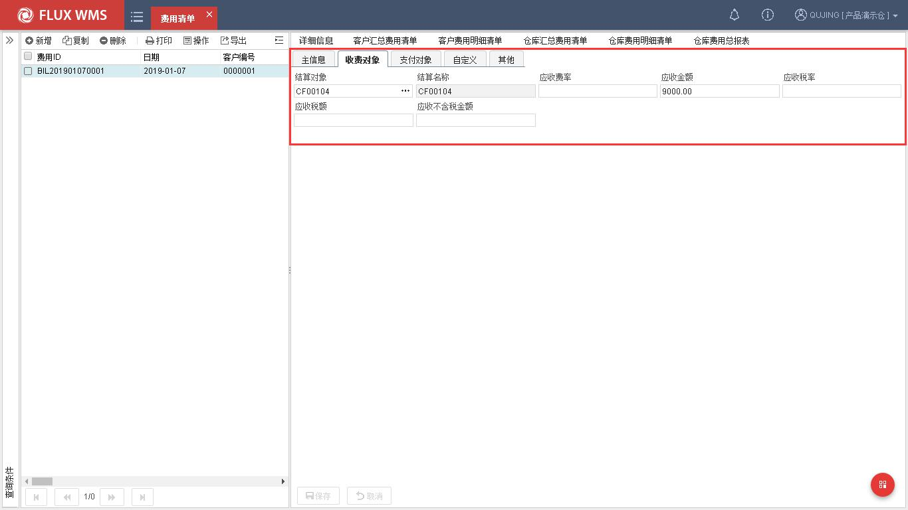

<!-- 原 PDF 第 463 页 -->

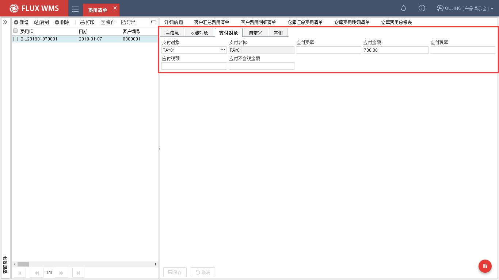

结算对象－应收费用的付款方客户代码。

结算名称－应收费用的付款方客户名称描述。

应收费率－计费所依据的费率信息。

应收金额－系统计算的应收费用金额。

实收金额－实际到款金额。

应收税率－计费依据的税率信息。

应收税额－根据税率计算得到的税额。

应收不含税金额－扣除税额后的不含税金额。

发票类型－发票信息。

  - 在“支付对象”页签，输入仓库操作的成本支出相关信息：

*[图 15-3-3]（原 PDF 第 463 页，图像未能从 PDF 对象中直接提取）*

支付对象－应付费用的收款方客户代码。

支付名称－应付费用的收款方客户名称描述。

应付费率－计费所依据的成本费率信息。

<!-- 原 PDF 第 464 页 -->

应付金额－系统计算的应付费用金额。

实付金额－实际支付成本。默认同应付金额。

应付税率－计费依据的成本税率信息。

应付税额－根据税率计算得到的税额。

应付不含税金额－扣除税额后的不含税金额。

应付发票类型－发票信息。

  - 点击【保存】按钮，保存费用记录。

- **右键菜单功能**

生成汇总账单 - 支持将货主结算日到今天（包含今天的费用明细记录）的费用生成汇总账单，并跳转到收支结算部分，查看生成的汇总账单信息对应单据。

## 15.4. 收入/支出结算

为了方便用户收入、支出分别管理，系统提供收入结算、支出结算功能。查询条件及显示内容，同费用结算。

不同的是：

收入结算，只显示收入字段，不显示成本字段。

<!-- 原 PDF 第 465 页 -->

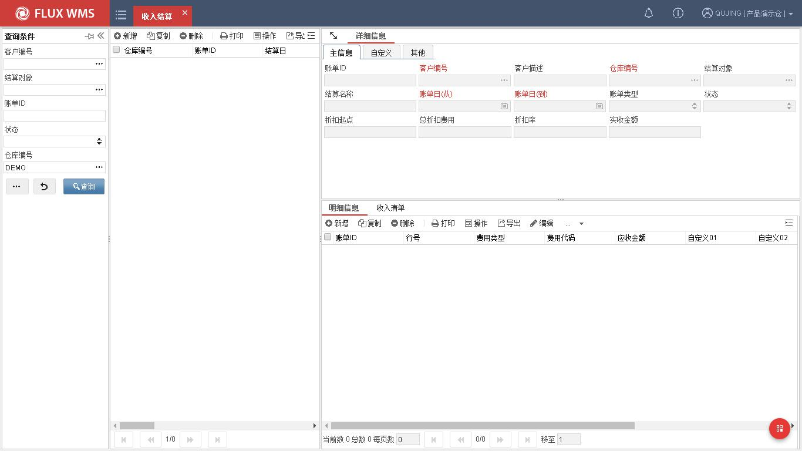

支出结算，则只显示支出字段，不显示收入字段。

- **右键菜单功能**

汇总账单 -根据客户档案维护月度结算日，由定时器生成月度收入账单、月度支出账单，并提

<!-- 原 PDF 第 466 页 -->

供对应的审核、结算、重新计算功能，方便用户对仓库费用进行管理。

## 15.5. 运输费率设置

不做详细运输跟踪管理的情况下，可以通过 WMS 系统，对运输环节进行简单的运费记录，以便支持费用结算。

- **费率设置**

  - 点击“费收”下的“运输费率设置”。

  - 在表头部分，选择明细页面，点击“新增”按钮，依次输入如下信息。

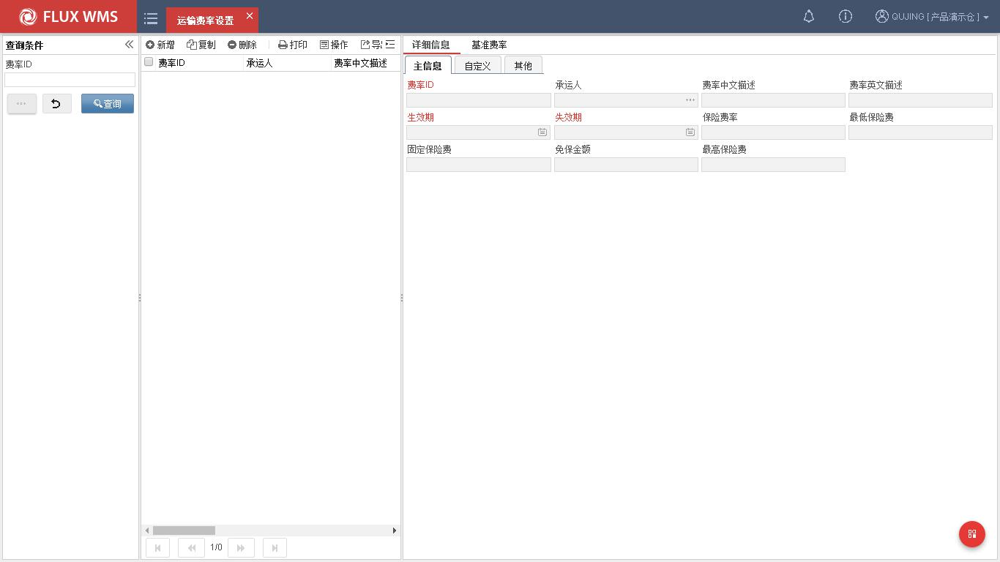

费率 ID－该费收方式的代码，由系统自动生成流水号。

承运人－运费对应的承运人，可通过查询按钮查询已在客户档案维护的承运人。

中文描述－该费率的名称说明。

英文描述－该费率的说明

生效期－费率开始使用的日期。

失效期－费率不再使用的日期。超过失效期，不再依据此费率进行计算。

<!-- 原 PDF 第 467 页 -->

保险费率－运输保险费率。

最低保险费－运输保险最低费用。

固定保险费－固定保险费用。

免保金额－免保金额。

最高保险费－保险费用上限。

  - 点击【保存】按钮。

  - 在费率部分，点击【新增】按钮，依次输入如下信息。

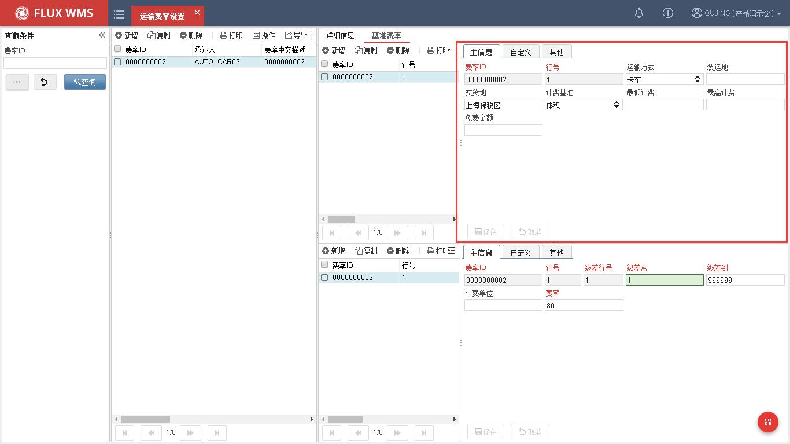

费率 ID－该费收方式的代码，根据主信息带入。

行号－系统自动生成的费率明细行号

运输方式－如陆运、空运、海运等。下拉框内容可以在系统代码中配置，发运订单选择运输方式，则系统采用该运输方式对应的费率行。

装运地－运输起点。分段计费时使用。

交货地－运输终点，分段计费时使用。

计费基准－计费的依据。

<!-- 原 PDF 第 468 页 -->

最低计费－ 该费用项起计费点。

最高计费－ 该费用项最高限制费用额。

免费金额－ 该费用项，可减免金额。

  - 在级差部分，点击【新增】按钮，依次输入如下信息

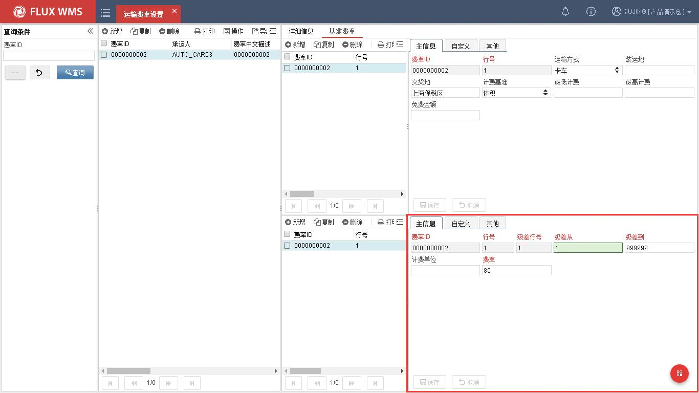

费率 ID－该费收方式的代码，根据主信息带入。

行号－级差对应的费用项行号。

级差行号－多级级差设置时，对应的行号。

级差从，级差到－费用计费基准的级差范围。同一级差内，使用一个费率。

计费单位－级差计算时的最小计费单位，默认为 1。可以通过计费单位的修改，实现类似进位计费的需求，例如 11~19 立方米都按 20 立方米计费，此时计费单位应设置为 10，只按 10 的倍数计费，不满整十的数量都进位补满。

费率－费用项在级差范围内使用的费率。
