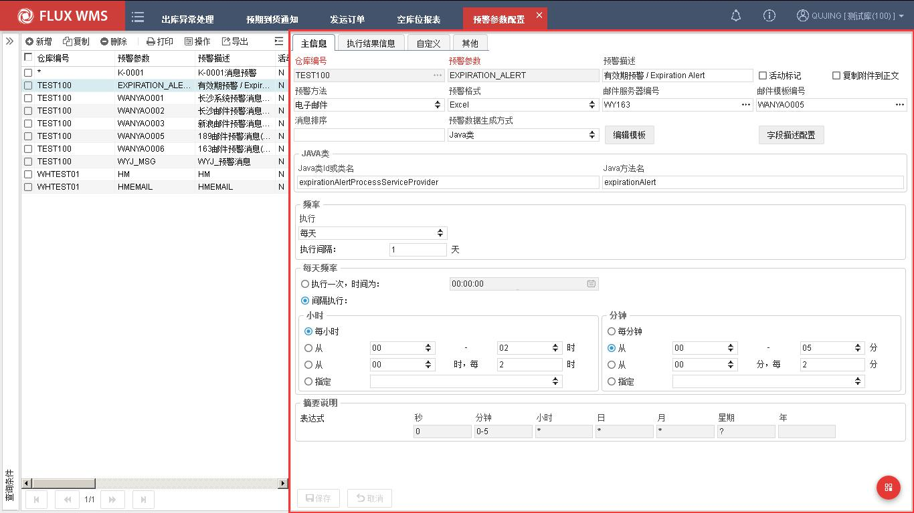
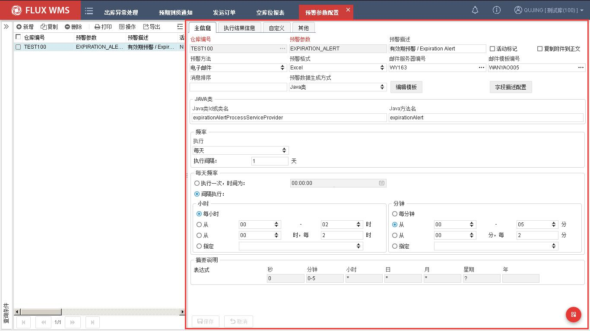
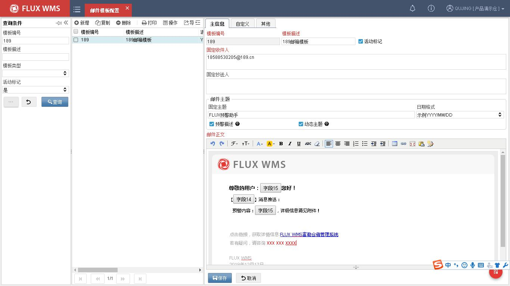
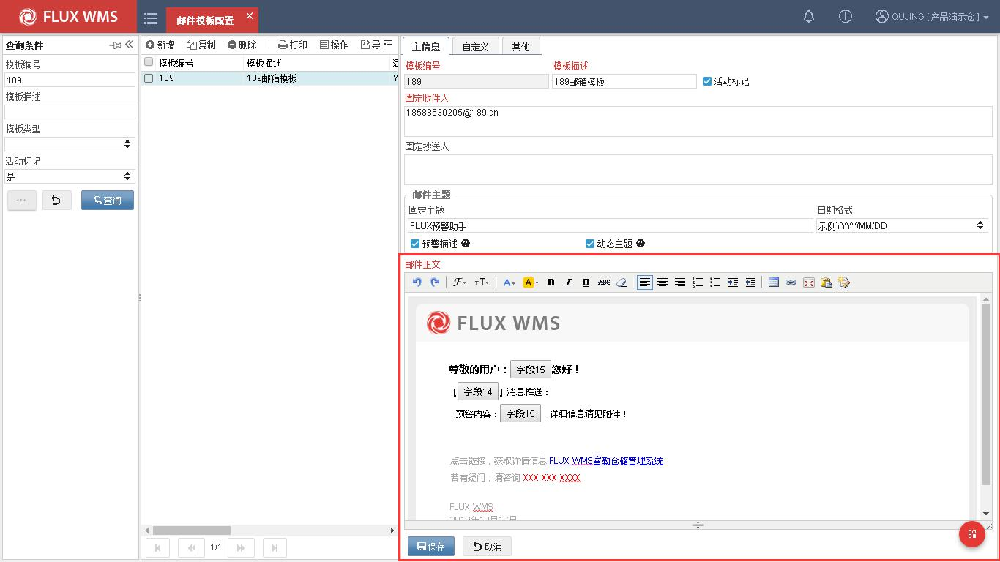
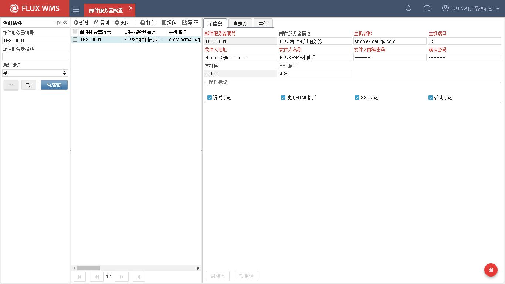
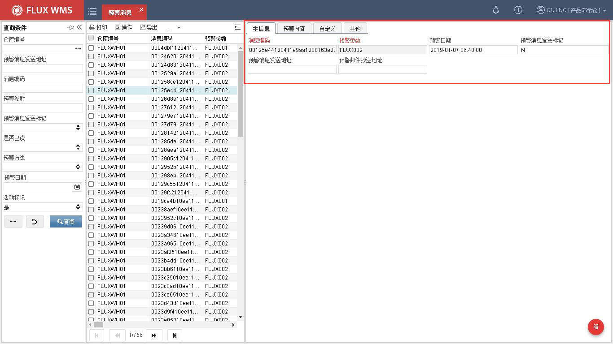
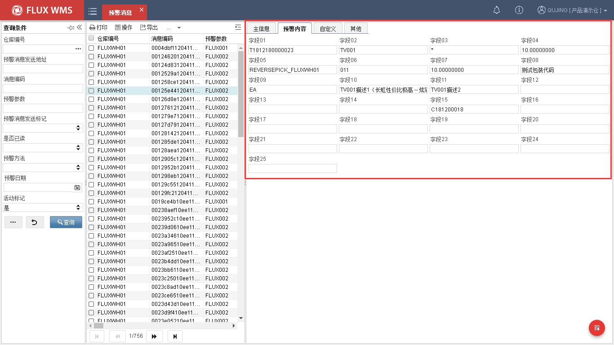

# 16. 预警

> 来源：`富勒WMS系统用户手册_V6_高清版（维他命）.pdf`，原 PDF 第 468 页起。
> 本文件按原 PDF 正文标题拆分；原文截图已提取至同目录 `assets/`。

<!-- 原 PDF 第 468 页 -->

仓库日常操作中，有许多情况需要特殊关注，例如库存低于安全线，保质期临近等。尽管系统

<!-- 原 PDF 第 469 页 -->

对此有详细的记录，但通过库存余量或单据对于特定情况并不直观，同时也可能需要主动将信息通知货主或者相关人员处理。但在不同业务情况下，需要通知的内容各不相同，因此 WMS 提供了自定义预警的功能。预警查询模式，配置生效后可直接使用；邮件、短信模式的预警，需要配合定时器、邮件服务器、短信服务器使用。

## 16.1. 预警参数设置

- **预警参数设置**

由于不同预警方式，可能有不同的要求，因此通过预警参数的设置来控制不同的预警方式。

同时，相同预警需求，但在多仓环境下有可能信息发送对象、执行时间要求不同，因此预警参数可配置为多仓共用的公共参数以及只针对某个仓库生效的参数。

通过“仓库”查询条件，可查询到对此仓库有效的公共参数与针对查询条件仓库的对应专属参数。

新增参数可通过如下步骤进行：

  - 点击“预警”下的“预警参数时设置”。

  - 在表头部分，选择明细页面，点击“新增”按钮，依次输入如下信息。

<!-- 原 PDF 第 470 页 -->

仓库编号－预警对应仓库。

预警参数 － 系统不同预警方式的代码。

预警描述 － 预警参数对应描述信息。

活动标记 － 使用或不使用某个预警参数。

复制附件到正文 － 勾选后系统自动将附件内容，显示在邮件正文中。

预警方法 － 系统支持“电子邮件”、“系统消息”两种预警方式。

预警格式 －预警文件格式。可选择 PDF 文件或者 Excel 文件，这种格式设置主要在 Email 发送时生效，界面查询时忽略此设置。

邮件服务器编号 －必输项，用于配置邮件服务器相关信息。

邮件模板编号 －电子邮件方式时的必输项，用于配置预邮件使用模板信息。

消息排序 －多个预警同时执行时的次序。

预警数据生成方式 －系统支持 JAVA 类、存储过程两种生成方式。

编辑模板 －允许为空，用于配置邮件内容。

字段描述配置 －允许为空，用于对预警预留字段进行个性化配置。

JAVA 类/存储过程 －预警执行时支持调用 JAVA 类或 SP。当“预警数据生成方式”选择 JAVA 类时，JAVA 类组用来配置类路径和方法名称；当“预警数据生成方式”选择存储过程时，存储过程组用来配置存储名称和出入参；

预警频率 －信息推送频率。可选择年、季度、月、天，选择天的情况下，需要配置每天执行频率，固定时间执行，还是间隔时间轮循执行。也即定时器执行预警的时间设置。

每天频率－预警定时器每日执行情况下，具体的定时器执行时间配置。

  - 保存所作修改。

- **预置预警-失效期预警**

医药、食品行业行业中，库存在库期间需要进行严格的效期管理，并要求库存在失效期前进行出库。若产品已失效，则需要进行冻结人工做报废处理。

为满足上述需求，系统支持在库存到达失效警戒点时，向高层发送预警邮件信息。例如距离失效节点，提前 30 天库存冻结，再提前 10 天预警。即距离失效日期 40 天开始预警。

<!-- 原 PDF 第 471 页 -->

## 16.2. 邮件模板配置

当预警方式选择“邮件预警”时，需要对预警消息调用邮件模板进行自定义配置。在【邮件模板配置】模块中，系统支持针对模板的固定收件人、抄送人、邮件固定/动态主题等信息进行修改。

  - 点击“预警”下的“预警模板设置”。

  - 在表头部分，选择明细页面，点击“新增”按钮，依次输入如下信息。

<!-- 原 PDF 第 472 页 -->

邮件主题－默认根据所配置的固定主题显示。若勾选动态值，则获取预警记录表里写入的主题字段内容（Subject 列，默认取首行记录的信息）作为邮件主题。如果都固定主题、动态主题均有配置，使用下划线连接。（例如：固定主题_日期格式_动态主题）

悬浮描述信息：

预警描述－邮件主题拼接预警描述信息。/Mail Subject split joint The Description Information of Early Warning.

动态主题－使用预警记录主题作为邮件主题。若同时配置固定主题,，则固定主题、预警描述、日期格式与动态主题使用下划线连接。/Use the topic of early warning record as the subject of mail. If the fixed Subject is configured at the same time, the fixed Subject , early warning description, date format and dynamic theme are connected by underlining.

邮件正文－新增时提供默认内容。

<!-- 原 PDF 第 473 页 -->

  - 保存所作修改。

## 16.3. 邮件服务器配置

  - 当预警方式选择“邮件预警”时，需要对预警消息调用邮件服务器进行定义。

  - 点击“预警”下的“邮件服务器设置”。

  - 在表头部分，选择明细页面，点击“新增”按钮，依次输入如下信息。

<!-- 原 PDF 第 474 页 -->

  - 主机名称－录入邮箱服务器地址信息。

  - 主机端口－录入邮箱服务器端口信息。

  - 发件人地址－录入发送人地址信息。

  - 发件人名称－录入发送名称信息。

  - 发件人邮箱密码－录入邮箱密码。

  - 确认密码－邮箱密码二次确认。

  - 字符集－处于兼容性考虑，默认编码 UTF-8。

  - SSL 端口－启用 SSL 加密时，录入 SSL 端口号。

  - 操作标记－邮件控制标记。分别控制是否启用 DEBUG 模式、是否启用 HTML 格式发送邮件、是否启用 SSL 加密、是否启用当前设置。

  - 保存所作修改。

## 16.4. 预警消息

预警消息生成后，系统支持通过【预警消息】模块进行查阅历史预警信息和预警重新推送。

<!-- 原 PDF 第 475 页 -->

  - 点击“预警”下的“预警消息”。

  - 在表头部分，选择明细页面，点击“查询”按钮，依次输入如下信息。

预警日期－显示预警信息产生时间。

预警消息发送标记－显示预警消息是否已发送。

预警消息发送地址－显示预警消息/邮件发送地址。

预警邮件抄送地址－仅在邮件类预警下有效，显示预警邮件抄送人地址。

预警内容－显示预警消息 25 个预留字段，用户可通过个性化方式将预警相关信息写入。

<!-- 原 PDF 第 476 页 -->

