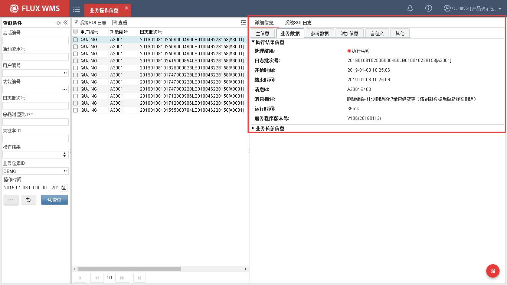
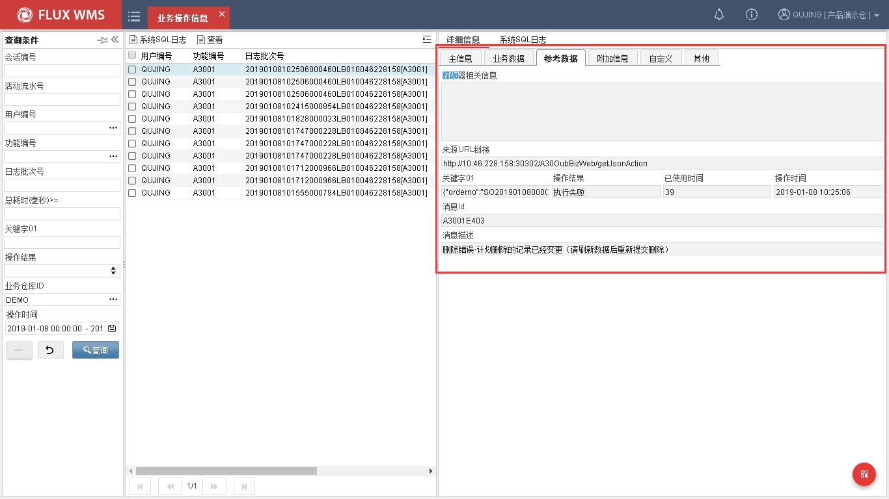
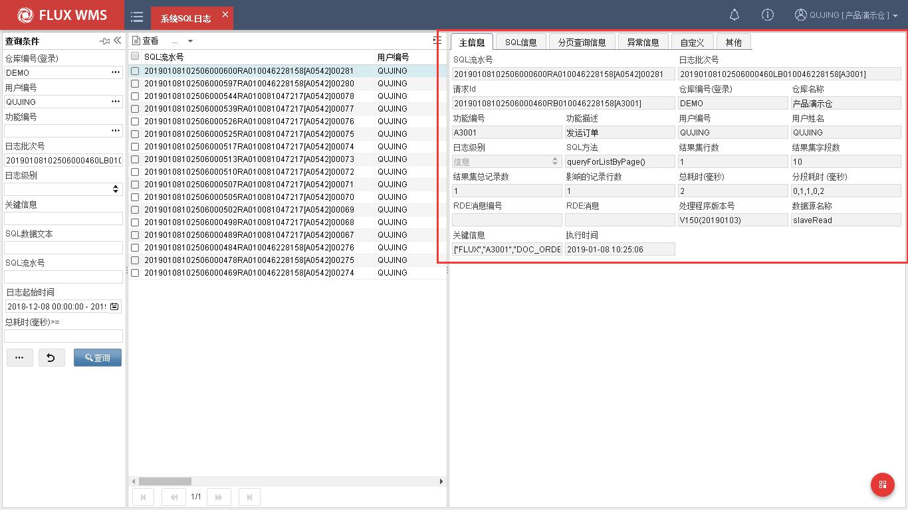
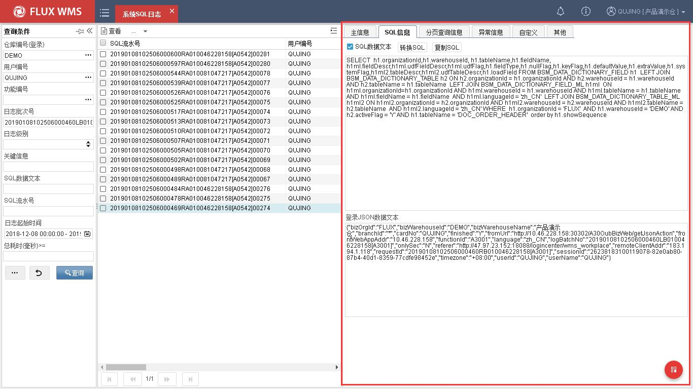
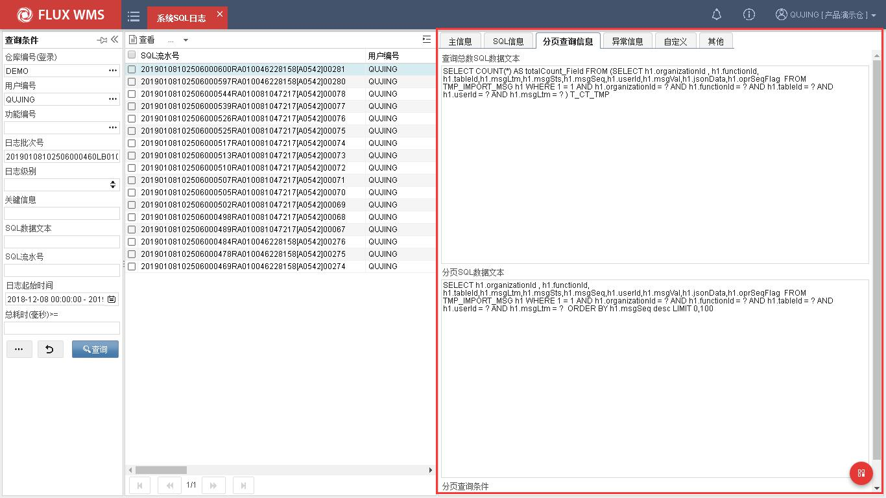
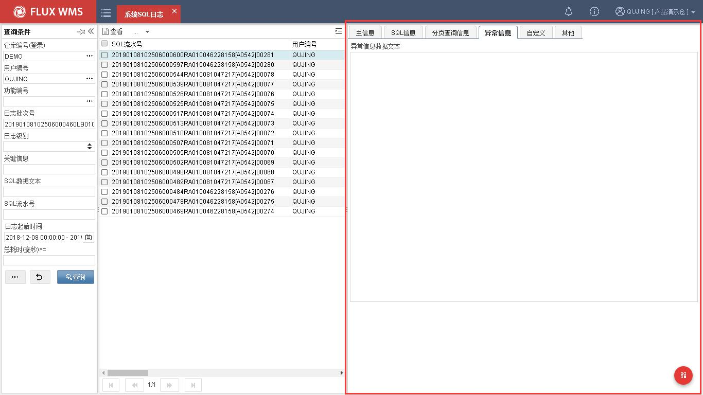
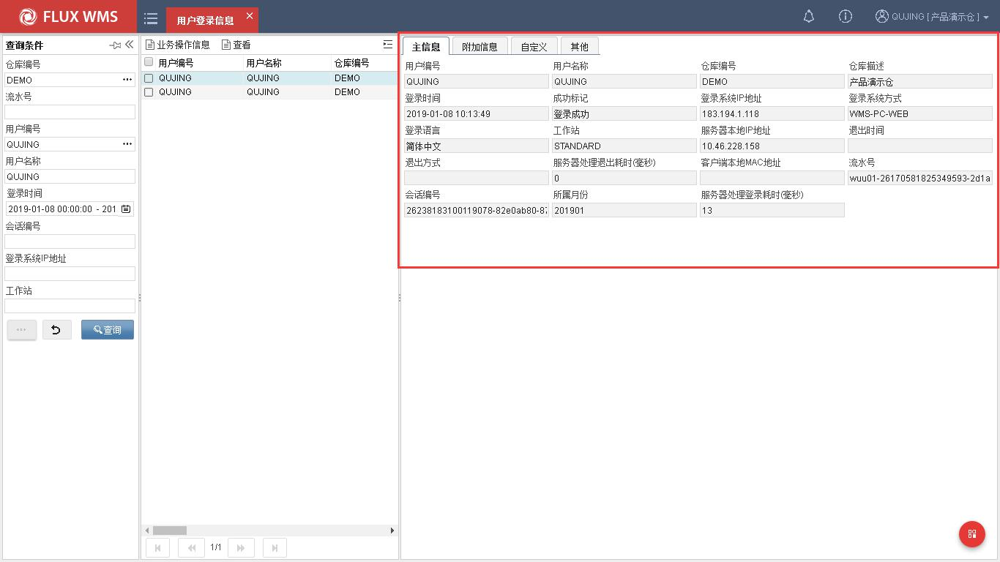
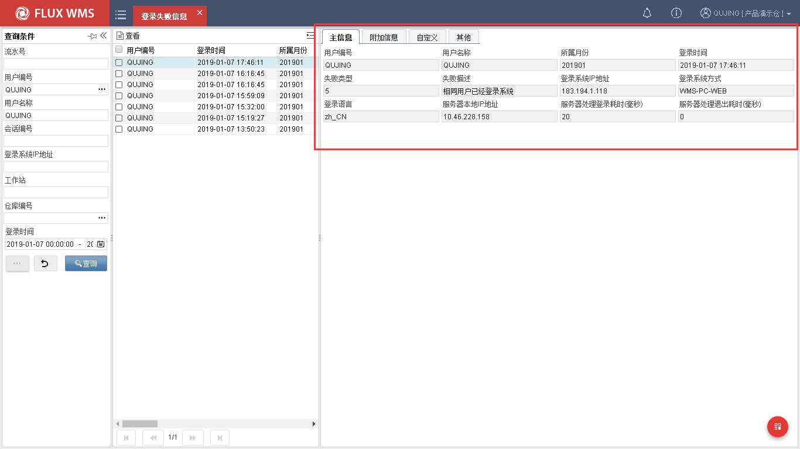
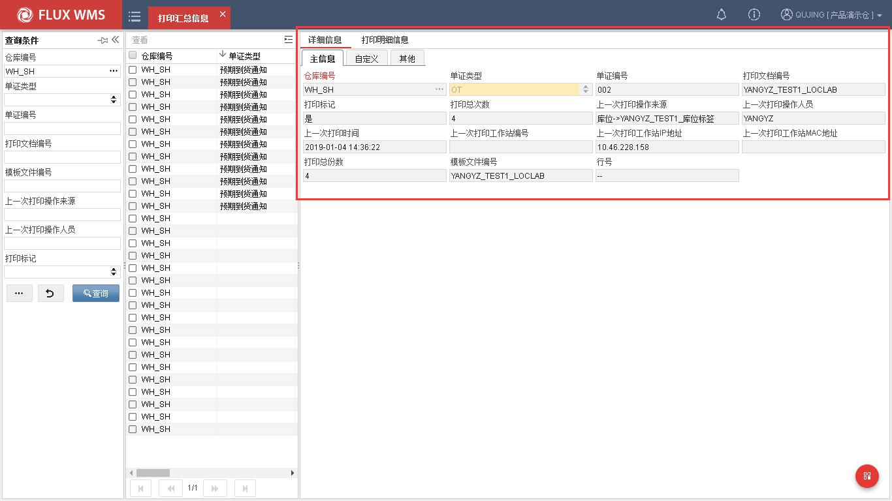
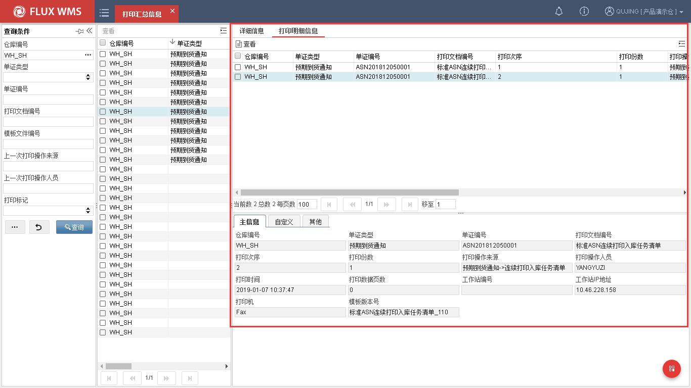

# 17. 业务系统日志

> 来源：`富勒WMS系统用户手册_V6_高清版（维他命）.pdf`，原 PDF 第 477 页起。
> 本文件按原 PDF 正文标题拆分；原文截图已提取至同目录 `assets/`。

<!-- 原 PDF 第 477 页 -->

## 17.1. 业务操作信息

业务操作信息，即操作日志详细信息。每个与服务器交互的步骤都会将相关日志信息写入数据库，在此功能中可以查看到每个作业细节的详情日志信息，作为检查故障、性能优化时的参考。

此模块以 JSON 维度展现每一次交互信息内容，操作人可根据“日志批次号”或者“请求 ID” 值，在系统 SQL 日志模块中找到对应的详细 SQL 语句。

- **主信息**

  - 选择主菜单“业务系统日志”下的“业务操作信息”。

  - 在左侧的查询条件栏位，输入查询条件，进行查询。

  - 在“主信息”页签，系统显示如下日志信息：

活动流水号－系统生成的流水 ID

用户编号－操作员 ID

功能编号－作业所用的功能

<!-- 原 PDF 第 478 页 -->

业务组织 ID－作业环境所属组织架构的上级组织

业务仓库 ID－作业的仓库代码

来源类型－类型信息

局域网 IP 地址－作业时的 IP 记录。局域网私有云环境中使用。

广域网 IP 地址－作业时的 IP 记录。广域网环境中使用。

日志批次号－日志生成时系统自动产生的流水号，这个流水号可能涉及一个或者多个日志。如需查询详细 SQL 语句，可在系统 SQL 日志功能模块中，通过“日志批次号”字段条件进行检索，筛选出所有相关 SQL 语句。

请求 ID－浏览器向服务器发送请求时生成的 ID 信息。查询方式同日志批次号。

- **业务数据**

  - 在“业务数据”页签，可以看到输入 JSON 的信息、业务数据、系统返回的输出信息。这些内容是故障检查时的关键信息。

登录 JSON 数据文本－记录交互中发送登录请求信息。

业务 JSON 数据文本－记录交互中发送业务数据信息内容。

处理结果 JSON 数据文本－记录交互中服务端返回结果内容。

<!-- 原 PDF 第 479 页 -->

- **参考数据**

  - 在“参考数据”页签，能够看到执行时间、提示信息等内容。

关键字 1－记录所属组织

结果代码值－1000 代表执行成功/9999 代表执行失败

已使用时间－记录 SQL 总耗时，单号毫秒。

所属月份－记录日志生成月份，用于后期归档。

## 17.2. 系统 SQL 日志

系统 SQL 日志模块，主要用于查询服务端与数据库所有交互所产生的 SQL 语句执行结果是，包含正确结果和返回异常信息。每个与服务器交互的步骤都会将相关 SQL 日志信息写入数据库，在此功能中可以查看到每个作业细节的详情日志信息，作为检查故障、性能优化时的参考。

此模块以数据库执行 SQL 维度展现每一次交互 SS 内容，操作人可根据“日志批次号”或者“请求 ID”值，在“业务操作信息”模块中找到对应的详细 JSON 请求。

- **主信息**

<!-- 原 PDF 第 480 页 -->

  - 选择主菜单“业务系统日志”下的“系统 SQL 日志”。

  - 在左侧的查询条件栏位，输入查询条件，进行查询。

  - 在“主信息”页签，系统显示如下日志信息：

SQL 流水号－SQL 语句写入数据库时，自动生成的流水号

日志批次号－日志生成时系统自动产生的流水号，这个流水号可能涉及一个或者多个日志。如需查询详细 SQL 语句，可在系统 SQL 日志功能模块中，通过“日志批次号”字段条件进行检索，筛选出所有相关 SQL 语句。

请求 ID－浏览器向服务器发送请求时生成的 ID 信息。查询方式同日志批次号。

仓库编号－作业仓库编号

功能编号－作业所属模块

用户编号－操作人编号

日志级别－日志级别。

SQL 方法－调用应用服务方法名称。

结果集字段数－SQL 返回字段数。例如查询语句查询 8 个字段，结果集字段数就显示为 8。

<!-- 原 PDF 第 481 页 -->

结果集行数－记录主 SQL 语句获取到数据行数。

结果集总记录数－记录主、分页 SQL 语句获取到数据行数。

影响的记录数－记录 SQL 影像数据总行数。例如更新语句，更新 3 行数据影像记录数即显示为 3。

总耗时（毫秒）－SQL 语句总耗时，单位为毫秒。

分段耗时（毫秒）－记录分页 SQL 语句总耗时，单位为毫秒。

  - 普通 SQL 信息

在“普通 SQL 信息”页签，可以看到登录 JSON 信息和 SQL 数据文本。其中“SQL 数据文本” 是故障检查时的关键信息。

登录 JSON 数据文本－记录本次请求指令信息中，登录 JSON 数据信息。

SQL 数据文本－记录应用服务端与数据服务器交互 SQL 所使用的语句，写入 SQL 采用绑定变量形式录入数据库。“S：”部分为 SQL 主体;“P：”部分为绑定变量。

  - 分页查询 SQL 信息

在列表查询事务中，通过查询主 SQL 执行后，还会执行分页统计 SQL。在“分页查询 SQL 信息”页签功既为查看分页 SQL 执行语句。

<!-- 原 PDF 第 482 页 -->

查询总数 SQL 数据文本－统计 SQL 获取总行数，用于列表显示。

分页 SQL 数据文本－用于获取单页数据集。即用于获取每页显示数据信息内容。

  - 异常 SQL 信息

异常 SQL 信息页签主要用于记录与数据库交互期间，数据库、代码执行抛出的异常信息，这也是故障排查检查项之一。

<!-- 原 PDF 第 483 页 -->

## 17.3. 用户登录信息

“用户登录信息”模块主要用于提供查询访问 V6 WMS 系统用户的登录信息，包括用户编号、登录/退出时间、访问 IP 等信息。用户登录信息仅记录登录成功信息。

- **用户登录信息**

  - 选择主菜单“业务系统日志”下的“用户登录信息”。

  - 在左侧的查询条件栏位，输入查询条件，进行查询。

  - 在“主信息”页签，系统显示如下日志信息：

<!-- 原 PDF 第 484 页 -->

用户编号－显示登录 V6 系统用户编号信息。

流水号－显示登录时系统指派流水号信息。

会话编号－显示登录时发送会话请求编号信息。

登录时间－显示登录时间点。

所属月份－显示登录时间点所属月份信息。

成功标记－显示是否成功登录。

登录系统 IP 地址－显示成功后

登录系统方式－显示登录方式信息。目前支持 WMS 和 RF 端登录。

登录语言:显示成功登录系统所展示的语言信息。

服务器本地 IP 地址－显示服务器本地 IP 地址。

服务器处理登录耗时－显示登录服务器服务端总耗时。当出现登录响应时间较长情况，可通过此项排查原因。

退出时间－显示退出 V6 系统时间点。当强制关闭 IE 时，此项不会录入值。

退出方式－显示退出 V6 系统方式。当强制关闭 IE 时，此项不会录入值。

<!-- 原 PDF 第 485 页 -->

服务器退出耗时－显示服务器处理退出操作总耗时。

仓库编号－显示登录仓库编号。

仓库描述－显示登录仓库名称。

消息文本－显示系统返回消息。

浏览器相关信息－显示登录浏览器信息。信息包括浏览器类型、系统类型、语言、版本等信息。

## 17.4. 登录失败信息

“登录失败信息”模块主要用于提供查询访问 V6 WMS 系统用户的登录信息，包括用户编号、登录时间、访问 IP 等信息、失败原因等。

当需要查看某用户登录失败原因时，可根据“用户登录信息”中筛选到的流水号和会话编号，在“登录失败信息”模块中进行检索，通过消息文本字段，查看具体登录失败原因。

- **登录失败信息**

  - 选择主菜单“业务系统日志”下的“登录失败信息”。

  - 在左侧的查询条件栏位，输入查询条件，进行查询。

  - 在“主信息”页签，系统显示如下日志信息：

<!-- 原 PDF 第 486 页 -->

*[图 17-4-1]（原 PDF 第 486 页，图像未能从 PDF 对象中直接提取）*

用户编号－显示登录 V6 系统用户编号信息。

流水号－显示登录时系统指派流水号信息。

会话编号－显示登录时发送会话请求编号信息。

登录时间－显示登录时间点。

所属月份－显示登录时间点所属月份信息。

成功标记－显示是否成功登录。

登录系统 IP 地址－显示成功后

登录系统方式－显示登录方式信息。目前支持 WMS 和 RF 端登录。

登录语言:显示成功登录系统所展示的语言信息。

服务器本地 IP 地址－显示服务器本地 IP 地址。

服务器处理登录耗时－显示登录服务器服务端总耗时。当出现登录响应时间较长情况，可通过此项排查原因。

退出时间－显示退出 V6 系统时间点。当强制关闭 IE 时，此项不会录入值。

消息文本－显示系统返回消息。

浏览器相关信息－显示登录浏览器信息。信息包括浏览器类型、系统类型、语言、版本等信息。

## 17.5. 打印汇总信息

“业务系统日志”下的“打印汇总信息”模块，主要用户查看各作业模板的打印情况。用户可通过此日志查看模板的上一次打印时间、打印份数打印耗时、打印工作站信息以及历史打印记录信息。现场作业遇到多打、漏打等情况时，可通过打印汇总信息”日志信息排查问题原因和定位相关责任人。

用户可根据单证编号或者模板名称等维度，来查询单据打印情况。详细单据打印配置查询打印相关模块。

- **详细信息**

详细信息页签主要用于记录上一次打印信息和累计打印数信息。

<!-- 原 PDF 第 487 页 -->

  - 选择主菜单“业务系统日志”下的“打印汇总信息”。

  - 在左侧的查询条件栏位，输入查询条件，进行查询。

  - 在“详细信息”页签，系统显示如下日志信息：

仓库编号－作业仓库编号

单证类型－显示打印单证类型。例如－预期到货通知、发运订单、波次计划等。

单证编号－显示打印单证编号。

打印文档编号－显示打印模板名称。

打印标记－显示打印成功/失败状态。

打印总次数:显示该模板总共打印次数汇总。

上一次打印操作来源－显示上一次打印操作所属模块。

上一次打印操作人员－显示上一次打印操作人。

上一次打印时间－显示上一次打印时间点。

上一次打印工作站编号－显示上一次打印工作站编号。

上一次打印工作站 IP 地址－显示上一次打印工作站设备对应 IP 地址信息。

<!-- 原 PDF 第 488 页 -->

上一次打印工作 Mac 地址－显示上一次打印工作站设备 Macs 地址信息。

打印总份数－记录当前模板累计打印总份数。

- **打印明细信息**

打印明细信息页签主要用于记录所有打印信息 ss。

  - 在“详细信息”页签，系统显示如下日志信息：

仓库编号－作业仓库编号

单证类型－显示打印单证类型。例如－预期到货通知、发运订单、波次计划等。

单证编号－显示打印单证编号。

打印文档编号－显示打印模板名称。

打印次序:显示该模板本次打印次序号。

打印份数－显示该模板本次打印份数。

打印操作来源－显示打印操作所属模块。

打印操作人员－显示打印操作人。

打印时间－显示打印时间点。

<!-- 原 PDF 第 489 页 -->

打印数据页数:显示该模板打印份数。

工作站编号－显示工作站编号信息。

工作站 IP 地址－显示上一次打印工作站设备对应 IP 地址信息。

打印机－显示打印机外设名称。
