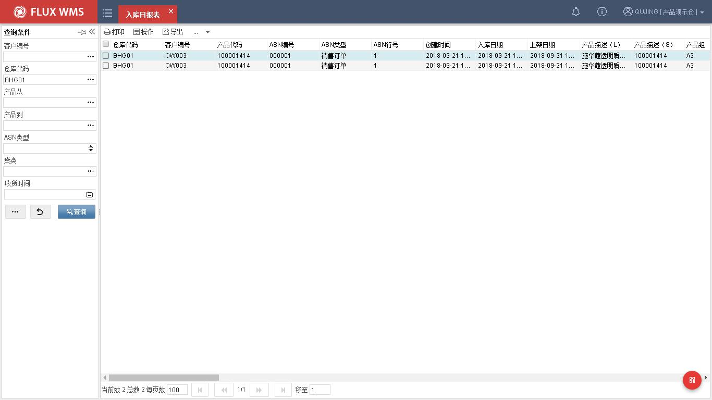
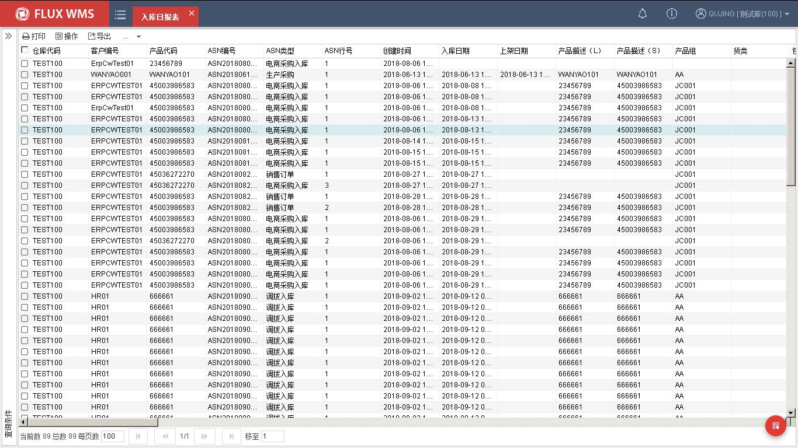
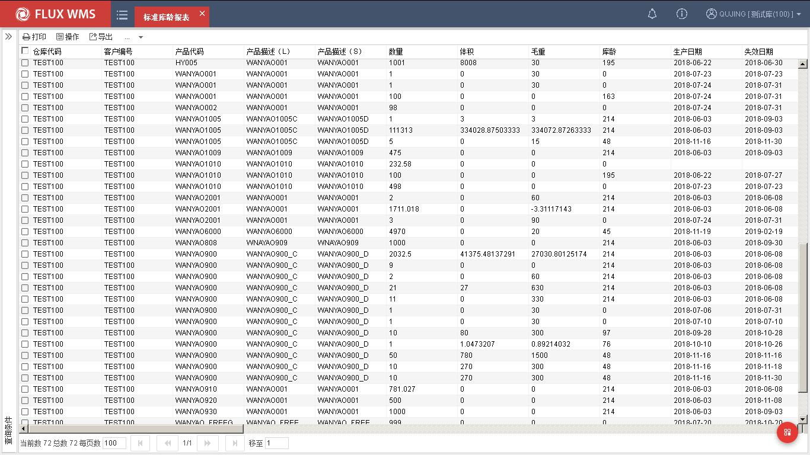
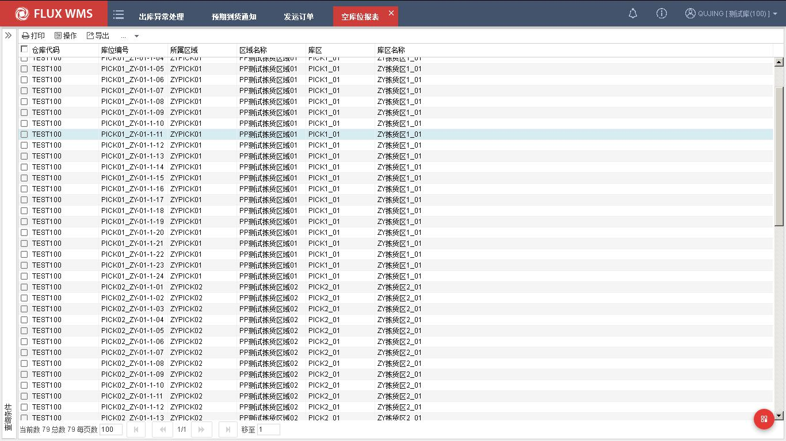

# 18. 报表

> 来源：`富勒WMS系统用户手册_V6_高清版（维他命）.pdf`，原 PDF 第 489 页起。
> 本文件按原 PDF 正文标题拆分；原文截图已提取至同目录 `assets/`。

<!-- 原 PDF 第 489 页 -->

## 18.1. 标准表报

报表的功能是查询产品在系统中所做操作的所有活动，通过表单的形式打印出来供客户查询和审查。

系统报表分为：入库日报表、出库日报表、库存报表、进出存合并报表、仓库入库作业汇总报表、仓库出库作业汇总报表、发货装车清单、零库存产品汇总清单、库龄报表、入库序列号报表等不同报表。

此外，为了方便用户使用，系统还提供了自定义查询功能。

- **入库日报表**

该报表是对系统里某个客户所有产品或某个客户单个产品每日或某一时间段的入库情况查询。

  - 点击“报表”下的“标准报表”-“入库日报表”。

  - 在查询页签中，输入客户、仓库、产品、ASN 类型、货类、收货时间、批次属性等查询条件

  - 点击查询按钮，显示查询结果。

<!-- 原 PDF 第 490 页 -->

  - 点击“清空”将清空所有查询条件。

  - 查询结果列表页面，可通过鼠标右键功能导出 EXCEL 或者直接打印入库日报表。

- **出库日报表该报表是对系统里某个客户所有产品或某个客户单个产品每日或某一时间段的出库情况查询。**

  - 点击“报表”下的“标准报表”-“出库日报表”。

  - 在查询页签中，输入客户、仓库、收货人、产品、订单类型、货类、发货时间、批次属性等查询条件

  - 点击查询按钮，显示查询结果。

<!-- 原 PDF 第 491 页 -->

  - 点击“清空”将清空所有查询条件。

  - 查询结果列表页面，可通过鼠标右键功能导出 EXCEL 或者直接打印出库日报表。

- **标准库龄报表该报表是对系统里产品在库具体天数的查询。**

  - 选择“报表”下的“标准报表”-“标准库龄报表”

  - 在查询条件中，输入仓库、货主、产品、库龄等查询条件

  - 点击查找按钮，显示查询结果，例如

<!-- 原 PDF 第 492 页 -->

  - 点击“清空”将清空所有查询条件。

- **空库位表报**

  - 查询仓库内未被占用的空库位。

  - 选择报表下的标准报表 - 空库位报表

  - 在查询“条件” 中，“输入仓库、” “所属区域、库” 区查询条件

  - 点击查找按钮，显示查询结果，例如

<!-- 原 PDF 第 493 页 -->

  - 点击“清空”将清空所有查询条件。
