# 19. 二次开发管理

> 来源：`富勒WMS系统用户手册_V6_高清版（维他命）.pdf`，原 PDF 第 493 页起。
> 本文件按原 PDF 正文标题拆分；原文截图已提取至同目录 `assets/`。

<!-- 原 PDF 第 493 页 -->

## 19.1. 配置自定义报表

“二次开发管理”下的“配置自定义报表”功能模块，主要基于标准报表需求外的个性化报表二次开发，是标准报表功能的一个自定义扩展模块。用户通过“配置自定义报表”，可在不影响标准功能前台下个性化配置实现例如表单、柱状图、饼图、雷达图、曲线图、面积图、散点图等需求, 从而满足现场报表需求。

### 19.1.1. 自定义报表创建

- **主信息**

  - 选择主菜单“二次开发管理”下的“配置自定义报表”。

  - 在左侧的查询条件栏位，输入查询条件，进行查询。

  - 在“主信息”页签，系统显示如下信息：

<!-- 原 PDF 第 494 页 -->

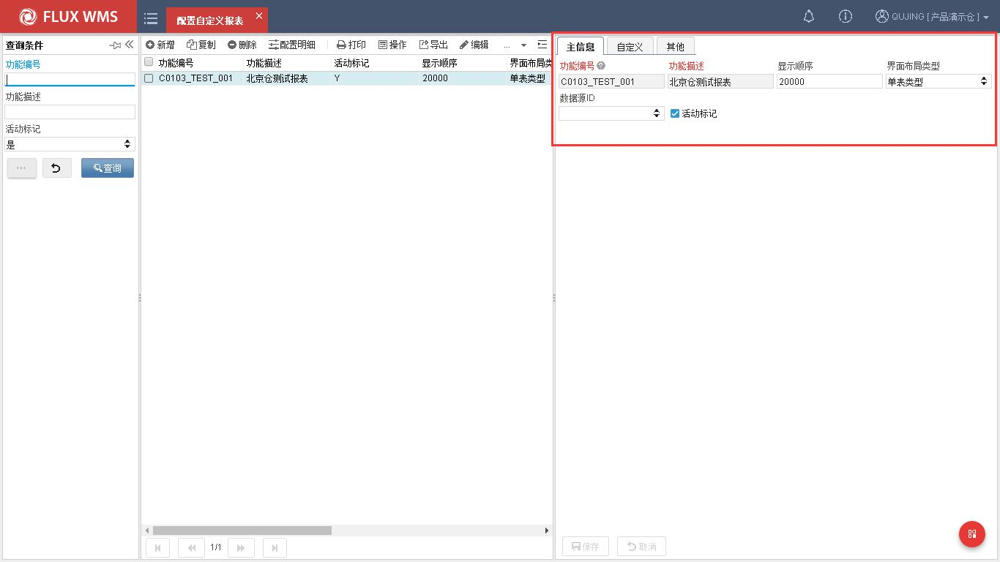

功能编号－个性化报表编号。必输且唯一。

功能描述－个性化报表中文描述。必输。

显示顺序－个性化报表显示顺序，非必输。

界面布局类型－定义个性化报表类型。例如表单、柱状图、饼图等。

数据源 ID－报表访问数据库地址,为空时默认使用当前数据库。

活动标记－是否启用此报表。

### 19.1.2. 自定义报表配置

- **配置明细**

通过工具栏点击【配置明细】或者右键选择“配置明细”选项，可配置自定义报表后台逻辑、筛选逻辑、数据展示等效果。点击后打开如下操作界面。

<!-- 原 PDF 第 495 页 -->

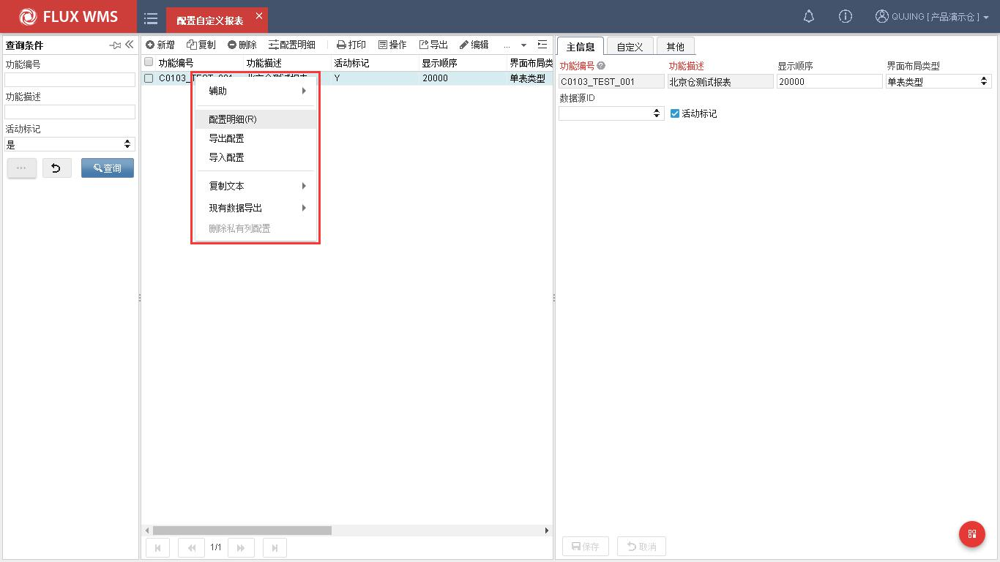

  - 定义数据源配置

自定义数据源配置功能项，主要用于配置后台交互 SQL 语句，其中 SQL 支持函数、排序、分组、多表关联、WITH、子查询等复杂 SQL 语法，能满足绝大多数现场的个性化报表需要。

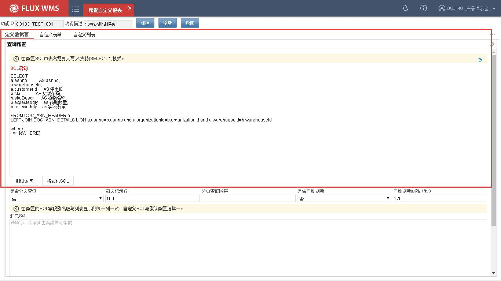

<!-- 原 PDF 第 496 页 -->

该页面用来配置报表与后台数据库交互的 SQL 语句。界面包含如下字段：

SQL 语句－应用与数据库交互 SELECT 语句。当前版本不支持 * 条件。

测试语句－对 SQL 语句配置正确性进行校验。

格式化 SQL－对 SQL 语句展示格式进行优化。

是否分页查询－查询总数大于每页记录数时是否产生分页。

每页记录数－每页显示行数。当未启用分页查询时，该项配置值无效。

汇总 SQL－配置汇总 SQL，配置方法同“SQL 语句”。

  - 自定义表单

自定义表单功能项是对报表筛选条件进行定义和配置。例如下图实例，在实例中配置了控件类型为文本框的库位查询条件。

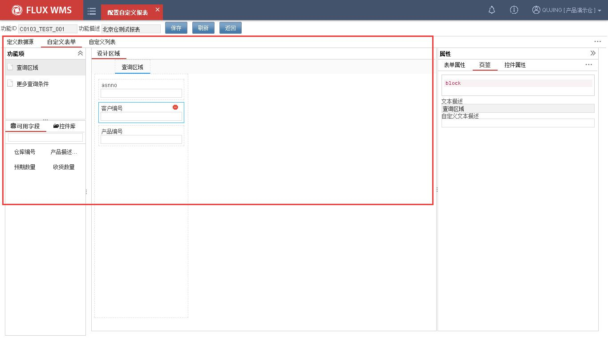

功能项－此项为界面区域。

可用字段－SQL 语句配置无误后，前台会自动根据 SQL 语句所含字段自动进行控件化转换。转换为图形化控件，通过托拉拽方式实现字段创建、移动、界面布局字段调整等操作。

控件库－控件库项为系统标准自带控件。例如时间控件。

<!-- 原 PDF 第 497 页 -->

属性－属性项为拖拉生成控件后，针对控件的每个属性修改。包括控件属性、长宽高、光标是否聚焦、标签描述等信息。

  - 定义图表参数

定义图像参数功能项，主要用户配置展示界面样式。不同类型报表配置界面有所不同。实例中配置的为“表单类型”报表。界面需要配置列表的列数、列名、列描述、列属性等展示信息。

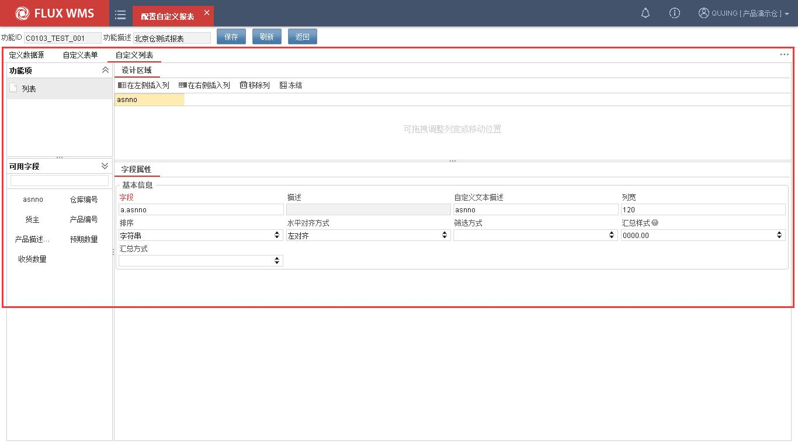

字段:SQL 语句对应字段名称，不可编辑。控件拖拉创建后，自动带出。

描述－字段描述信息，取自数据字典。不可编辑。

自定义文本描述－自定义文本描述，支持个性化修改列描述。

宽度－调整列宽度。

排序－列排序方式。支持按字符或按数字排序。

水平对齐方式－字段对齐方式。例如左对齐。

筛选方式－表单数据筛选方式选择。支持字符方式和数值方式筛选。

汇总方式－现场如需求要对列进行求和。例如计算行数据总和，可启用汇总功能。目前汇总支持例如计数、求和、平均、最大值、最小值等方式。

汇总样式－汇总样式为控制汇总精度。

<!-- 原 PDF 第 498 页 -->

### 19.1.3. 自定义报表发布

自定义报表配置完成后，需要针对角色配置相应的功能权限才能使用该表报，具体操作流程如下：

  - 选择主菜单“业务系统管理”下的“角色授权”。

  - 当前角色下在报表下，配置自定义报表权限。详见角色授权章节内容。

  - 配置成功后，需” 要重” 新登录操作系统。

  - 在主菜单“报表”下，即可查看和使用新增自定义报表。

## 19.2. 配置自定义功能

“二次开发管理”下的“配置自定义功能”功能模块，主要向客户提供表单的界面二次开发配置功能，是一种标准表单的功能扩展模块。用户通过“配置自定义功能”，可在不影响标准功能前台下个性化配置实现一级、二级、三级结构表单，并支持对展示字段的增删改查功能。

### 19.2.1. 自定义功能创建

- **主信息**

  - 选择主菜单“二次开发管理”下的“配置自定义功能”。

  - 在左侧的查询条件栏位，输入查询条件，进行查询。

  - 在“主信息”页签，系统显示如下信息：

<!-- 原 PDF 第 499 页 -->

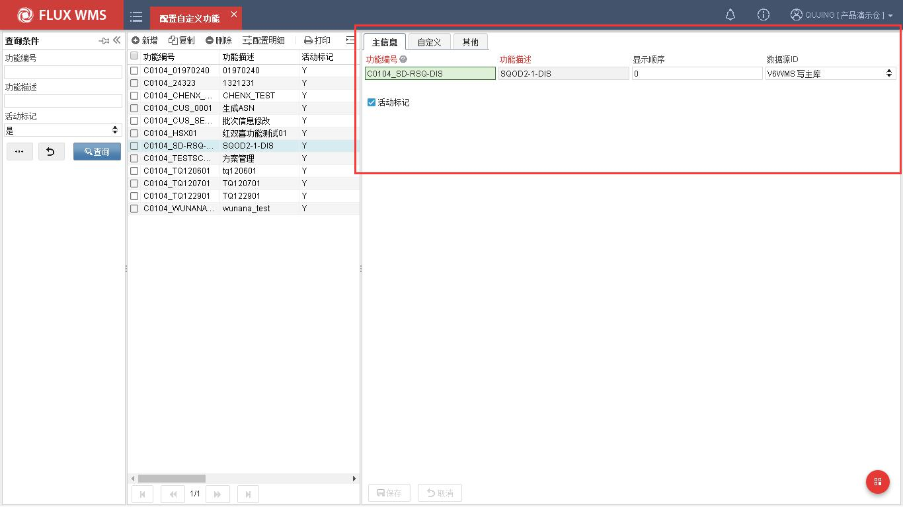

功能编号－个性化功能编号。必输且唯一。

功能描述－个性化功能中文描述。必输。

显示顺序－个性化功能显示顺序，非必输。

数据源 ID－报表访问数据库地址,为空时默认使用当前数据库。

活动标记－是否启用此报表。

### 19.2.2. 自定义功能配置

- **配置模板类型**

通过工具栏点击【配置明细】或者右键选择“配置明细”选项，可配置自定义报表后台逻辑、筛选逻辑、数据展示等效果。点击后打开如下操作界面。

<!-- 原 PDF 第 500 页 -->

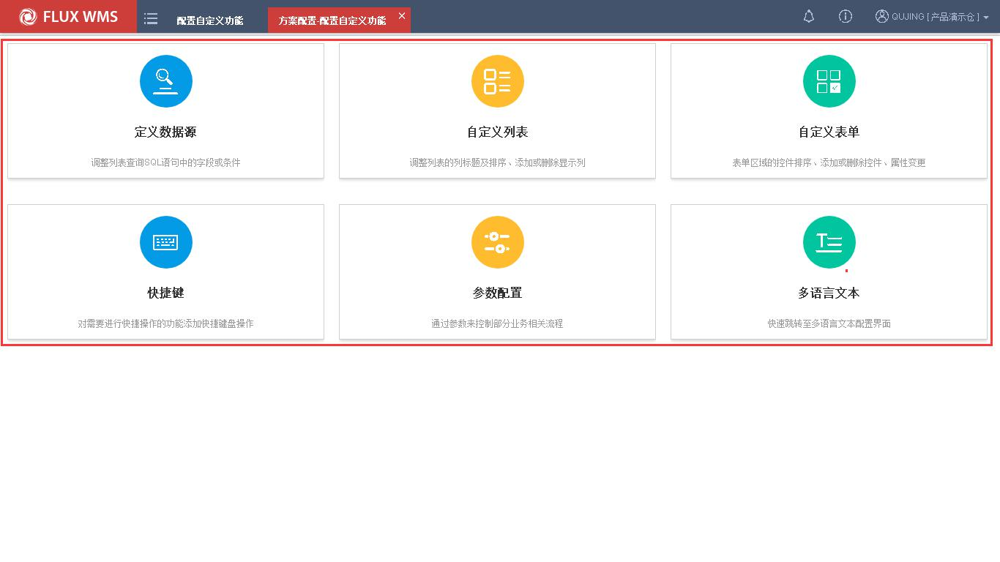

  - 一层结构：点击后自动生成一层表结构模板，结构为查询界面+列表+单表单结构。例如仓库设置-库位模块布局。

  - 二层结构：点击后自动生成二层表结构模板，结构为查询界面+列表+二层单表单结构。例如基础设置-产品档案模块布局。

  - 三层结构：点击后自动生成三层表结构模板，结构为查询界面+列表+三层单表单结构。例如入库-质量检验模块布局。

  - 单证结构：点击后自动生成单证结构模板，结构为查询界面+列表+上下结构表单结构。例如入库-预期到货通知模块布局。

  - 空白界碑：改类型支持创建任意数量的列表、表单，初始化为空白建模(此项类型开发中)。

- **自定义数据源配置**

自定义数据源配置功能项，主要用于配置后台交互 SQL 语句，其中 SQL 支持函数、排序、分组、多表关联、WITH、子查询等语法，能满足绝大多数现场个性化报表需要。界面包含如下字段：

<!-- 原 PDF 第 501 页 -->

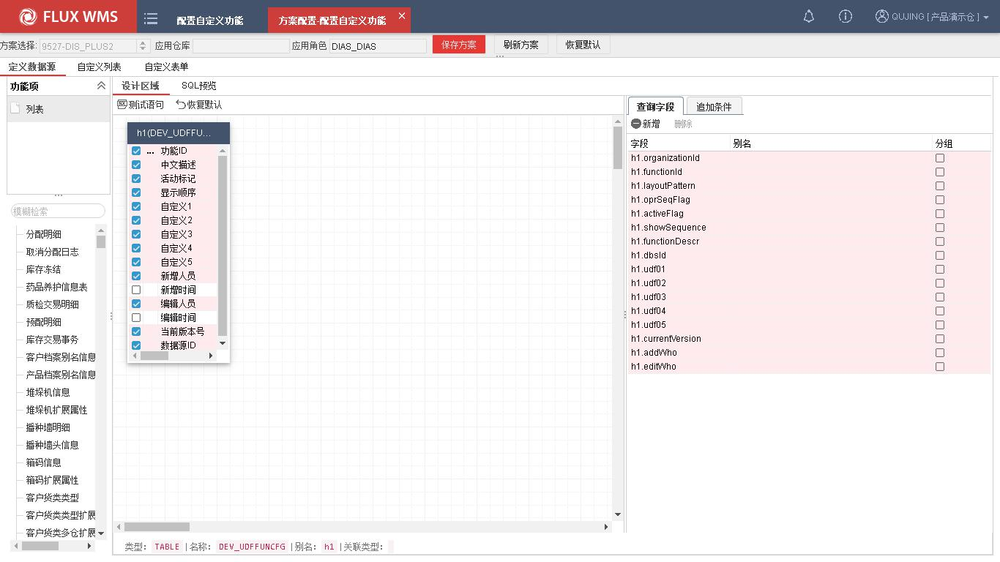

  - 界面字段说明 SQL 语句－应用与数据库交互 SELECT 语句。当前版本不支持 * 条件。测试语句－对 SQL 语句配置正确性进行校验。格式化 SQL－对 SQL 语句展示格式进行优化。是否分页查询－查询总数大于每页记录数时是否产生分页。每页记录数－每页显示行数。当未启用分页查询时，该项配置值无效。汇总 SQL－配置汇总 SQL，配置方法同“SQL 语句”。

- **自定义列表配置**

自定义列表页签主要是针对列表布局进行配置的操作界面，用户可根据现场需要，随意配置、调整字段名称、位置以及列属性、是否需要汇总。界面配置方式采用灵活度较高的托拉拽方式，实现列的新增、移动，向客户提供了所见及所得的体验感受。界面包含如下字段：

<!-- 原 PDF 第 502 页 -->

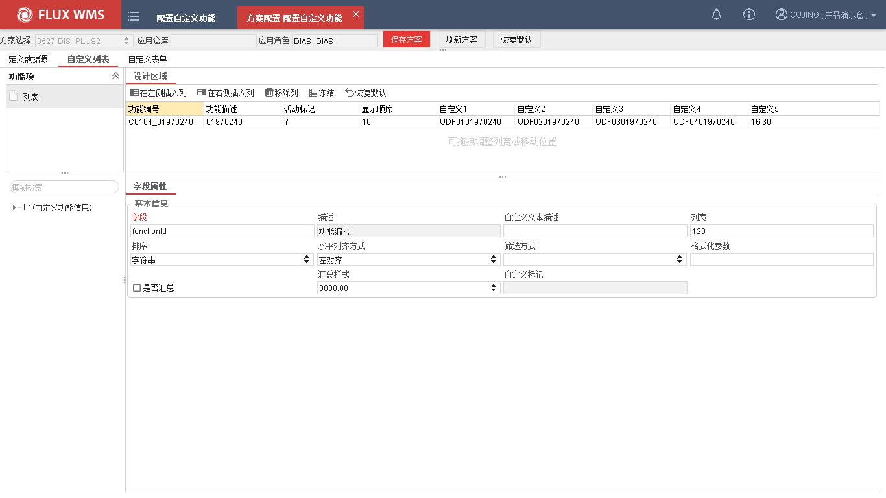

  - 界面字段说明功能项－此项为界面区域。可用字段－SQL 语句配置无误后，前台会自动根据 SQL 语句所含字段自动进行控件化

转换。转换为图形化控件，通过托拉拽方式实现字段创建、移动、界面布局字段调整等操作。

控件库－控件库项为系统标准自带控件。例如时间控件。

属性－属性项为拖拉生成控件后，针对控件的每个属性修改。包括控件属性、长宽高、光标是否聚焦、标签描述等信息。

- **表单布局配置**

自定义表单页签是主要针对表单布局进行配置的操作界面，用户可根据现场需要，随意配置、调整表单布局大小、字段名称、控件坐标位置以及控件属性等信息。界面配置同自定义列表页签配置方法，同样方式采用灵活度较高的托拉拽方式，实现列的新增、移动，功能设计提供给客户一种所见即所得的用户体验感受，让客户更容易理解、接受自定义功能的配置方式，从而达到降低模块的培训时间和成本的效果。界面包含如下字段：

<!-- 原 PDF 第 503 页 -->

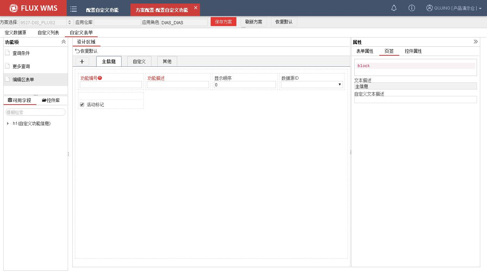

  - 界面字段说明功能项－此项为界面区域。可用字段－SQL 语句配置无误后，前台会自动根据语句所含字段自动进行控件化转换。

可用字段区域的控件，支持字段拖拉、界面布局字段调整等操作。

控件库－控件库项为系统标准自带控件。例如时间控件。

属性－属性项为拖拉生成控件后，针对控件的每个属性修改。包括控件属性、长宽高、光标是否聚焦、标签描述等信息。

### 19.2.3. 自定义功能发布

自定义功能配置完成保存退出后，需要针对角色配置相应的功能权限才能使用此模块，具体操作流程如下：

  - 选择主菜单“业务系统管理”下的“角色授权”。

  - 当前角色下在自定义功能下，配置自定义报表权限。详见角色授权章节内容。

  - 配置成功后，需” 要重新登录” 操作系统。

  - 在主菜单“自定义功能”下，即可查看和使用新增的自定义功能。

<!-- 原 PDF 第 504 页 -->

## 19.3. 配置自定义看板

随着用户对报表需求的不断提高，传统报表静态展示数据的方式已经无法满足现场需要，更多现场希望能在大屏幕前实时“展示”当前场景下的作业数据（例如单量、集货数等信息），在此需求就产生了报表的衍生、扩展功能“自定义看板”。用户可在“二次开发管理”中找到“配置自定义看板”功能模块，其主要向客户提供多元化自定义看板的数据动态展示服务。使用场景例如双十一订单量数据的实时统计分析展示、输送线集货口看板的待作业数信息展示等。点击后打开如下操作界面。

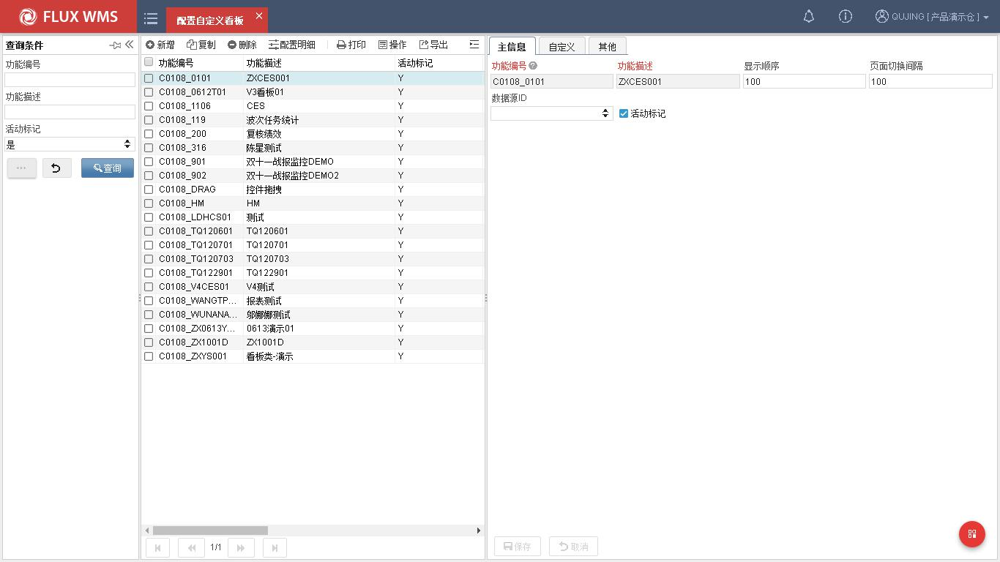

### 19.3.1. 自定义看板创建

- **主信息**

  - 选择主菜单“二次开发管理”下的“配置自定义功能”。

  - 在左侧的查询条件栏位，输入查询条件，进行查询。

  - 在“主信息”页签，系统显示如下信息：

<!-- 原 PDF 第 505 页 -->

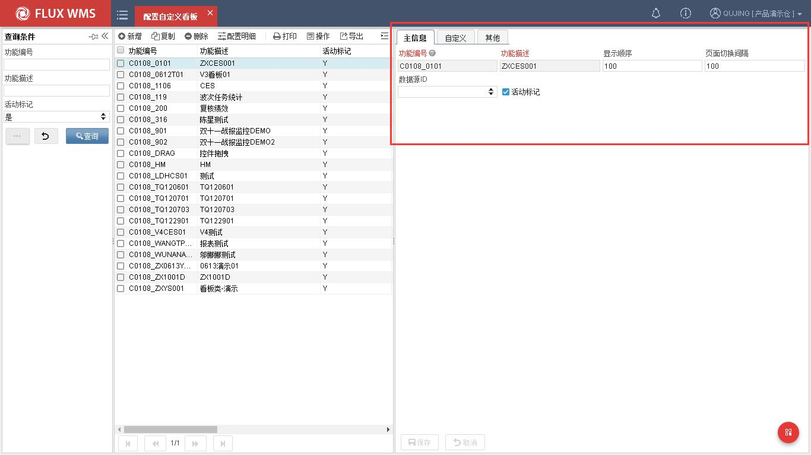

功能编号－个性化报表编号。必输且唯一。

功能描述－个性化报表中文描述。必输。

显示顺序－个性化报表显示顺序，非必输。

界面切换间隔－控制自定义看板数据刷新周期。即配置 20，表示每 20 秒刷新一次。

数据源 ID－报表访问数据库地址,为空时默认使用当前数据库。

活动标记－是否启用此报表。

### 19.3.2.看板配置

通过工具栏点击【配置明细】或者右键选择“配置明细”选项，可打开看板配置界面。通过控件拖拉住以及属性调整、设置即可完成配置工作。详见下图看板配置界面：

<!-- 原 PDF 第 506 页 -->

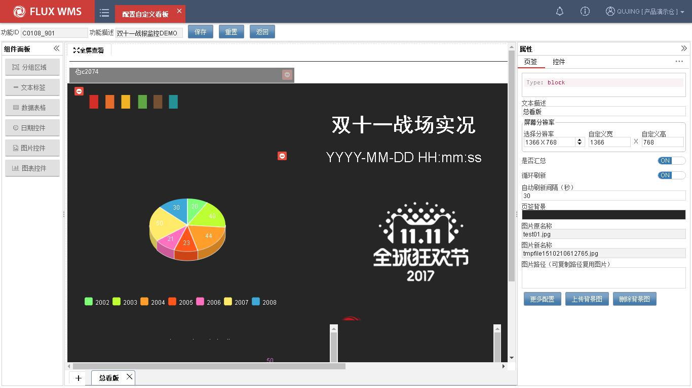

- **组件面板区域**

组件面板区域控件均支持托拉拽至看板预览区方式创建看板，在通过属性的调整大致规划好各组件的尺寸、颜色、关联图片、数据值等信息，配置完成发布后可在看板模块下查看。

  - 分组区域：用于看板显示区域布局划分，便于实际作业人员时查看，此控件仅对显示有影响。

  - 文本标签：用于配置标签项内容.该控件支持静态文本和动态变量配置(例如：已下单 ${ORDQTY})。控件支持设置字体属性、标签长宽高、背景色等信息。

  - 数据表格：主要用于表格区的显示。拖拉方式在看板创建后，可通过与现有报表关联实现数据展示效果。

  - 日期控件：主要用于显示应用服务器当前时间。支持设置时间精度、时间格式。

  - 图片控件：主要用于显示静态图片显示。控件支持 FTP、HTTP、HTTPS 等逻辑图片。

  - 图表控件：主要用于图标的显示。拖拉方式在看板创建后，通过与现有图标关联实现图标数据展示效果。

<!-- 原 PDF 第 507 页 -->

### 19.3.3. 自定义看板发布

自定义看板配置完成保存退出后，需要针对角色配置相应的功能权限才能使用此看板功能，具体操作流程如下：

  - 选择主菜单“业务系统管理”下的“角色授权”。

  - 当前角色下在自定义功能下，配置自定义报表权限。详见角色授权章节内容。

  - 配置成功后，需” 要重新登录” 操作系统。

  - 在主菜单“看板”下，即可查看和使用新增的自定义功能。

  - 样例展示最终效果，见下图：

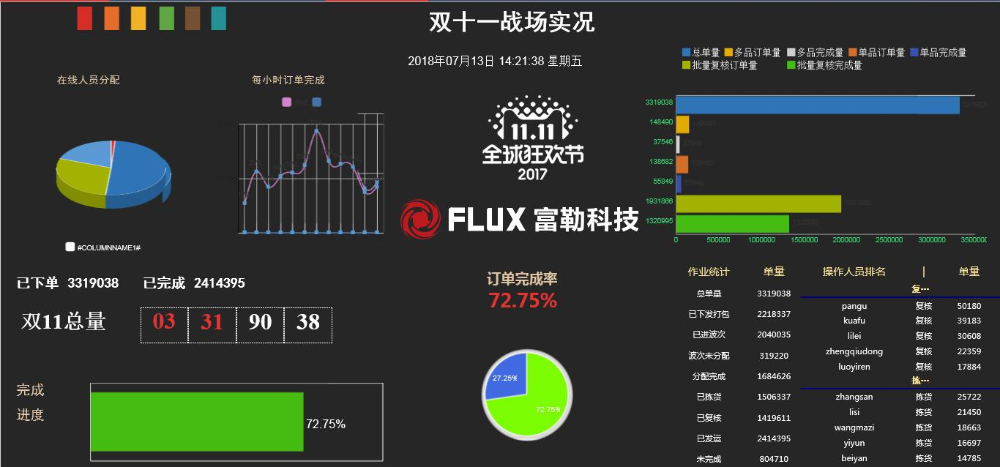
