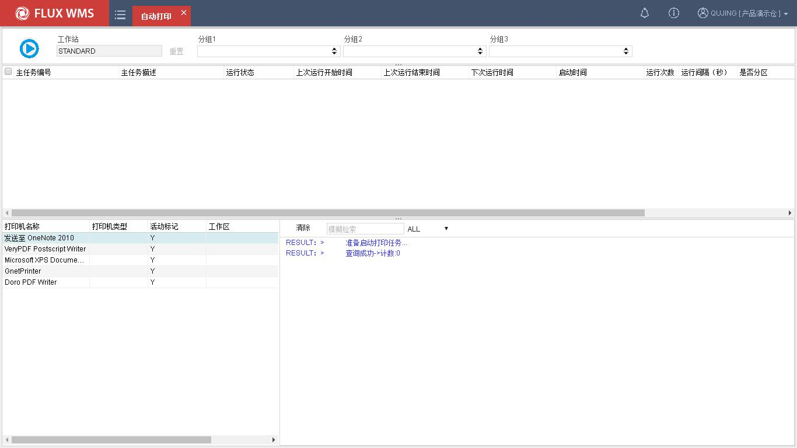
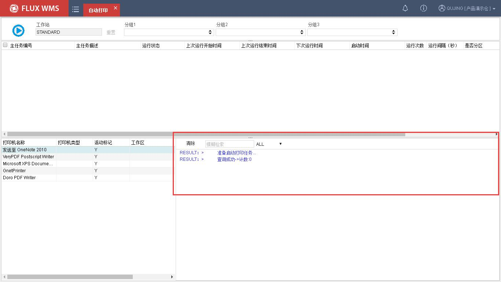
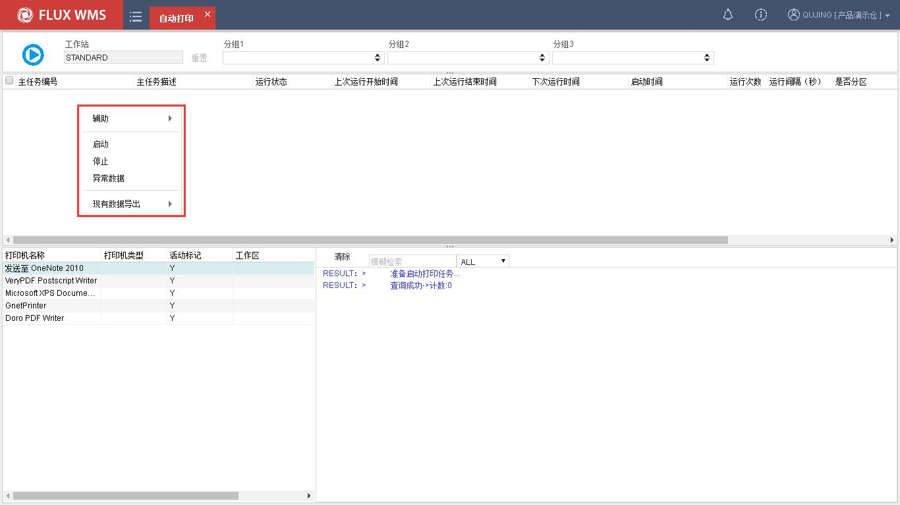

# 20. 自动打印

> 来源：`富勒WMS系统用户手册_V6_高清版（维他命）.pdf`，原 PDF 第 508 页起。
> 本文件按原 PDF 正文标题拆分；原文截图已提取至同目录 `assets/`。

<!-- 原 PDF 第 508 页 -->

仓库内的固定作业，可以配置对应的自动打印服务，实现无需人为干预的自动打印输出。

例如订单通过接口下达，由定时器负责按波次规则运算生成波次订单、分配库存，完成分配的订单就可以通过自动打印配置，在指定的打印机输出拣货任务清单。具体拣货操作员工，根据打印的单据进行拣货操作，无需人工操作打印、通知、单据传递。

启动自动打印服务后，用户可通过交互界面实施查看打印作业执行情况，目前 V6 版本 WMS 系统支持：1. 打印指令执行情况跟踪；2. 操作界面支持实施打印结果查看；3. 打印历史结果进行查看；

## 20.1. 自动打印启用

- **检查主菜单“业务系统配置”下的“自动打印配置”是否正确、授权是否有误。具体配置流程参照“自动打印配置”相关章节。**

- **确认无误后，点击选择主菜单“自动打印”，打开自动打印服务操作界面：**

界面字段说明：

开始/暂停按钮－按钮用于启动/暂停当前客户端标识下所配置的所有打印服务，当服务

<!-- 原 PDF 第 509 页 -->

启动后，程序会实施刷新和输出打印服务状态、日志等信息。

客户端标识－即本地配置->工作站。系统自动带出，前台不可编辑。

重置－重置按钮用来重置分组 1~3，数据筛选条件。当点击后分组 1~3 下拉框信息自动清空，列表自动显示当前“客户端标识”下所有启用/未启用打印服务。

分组 1~3－分组信息在启用打印服务后生效，下拉框自动加载各项打印服务对应的分组 1~3 信息，用以打印作业中的数据过滤筛选操作。

列表展示区－启动打印服务后，展示所有该“客户端标识”下所有启用、未启用的打印服务信息。

打印机类型展示区－打印机类型展示区主要用于显示当前主机，所有打印机终端访问信息。输出字段包括主任务编号、主任务描述、运行状态、分组 1~3、上次运行开始时间、上次允许结束时间、上次运行结果、下次运行时间、启动时间、执行次数、允许间隔、主打印机、打印模块文件等信息。

日志输出区－日志输出区用于启动打印服务后，实施查看打印日志输出使用。打印区日志查看支持通过下拉框选择全部（ALL）、错误（ERROR）、结果（RESULT）、指令 （COMMAND）条件，对日志数据进行过滤。当点击清空按钮时，区域内日志信息自动清除。

## 20.2. 自动打印暂停

当现场需要手动结束自动打印服务时，可通过点击停止自动打印，系统收到停止打印服务后，日志输出区会自动打印出停止打印任务指令信息。

<!-- 原 PDF 第 510 页 -->

## 20.3. 单项打印服务启用/停止

V6 版 WMS 系统支持对单项启用、未启用状态或执行时间段外打印项进行启动/停止打印操作。当用户多选或者单选打印服务项右键时，系统会展示“启用”、“停止”两个选择项，点击后系统会对选择项进行相应的启用/停止动作，列表区的“运行状态”以及输出打印日志区也会同步进行数据刷新和打印日志输出。

<!-- 原 PDF 第 511 页 -->

