# 21. 自定义导出/打印配置实例

> 来源：`富勒WMS系统用户手册_V6_高清版（维他命）.pdf`，原 PDF 第 512 页起。
> 本文件按原 PDF 正文标题拆分；原文截图已提取至同目录 `assets/`。

<!-- 原 PDF 第 512 页 -->

在日常业务中，常用的数据导出主要包括自定义单据打印、数据导出到 Excel 表格(标准导出/ 按模板导出），这两种导出的配置方法类似，都可通过【模板文件管理】、【数据导出规则配置】 和【数据导出授权】三个功能共同配置来实现。后文将详细介绍。

## 21.1. 模板文件管理配置

- **位置：【业务系统配置】-【模板文件管理】**

- **作用：用于维护、管理所有系统预置的标准模板和用户自定义的非标准模板文件，同时可以进行分模板打印配置、打印机参数设置、打印汇总设置等。**

与“数据导出规则配置”功能配合使用，可以预先定义好所需的模板，然后再指定具体导出规则对应调用的模板。

- **界面预览：**

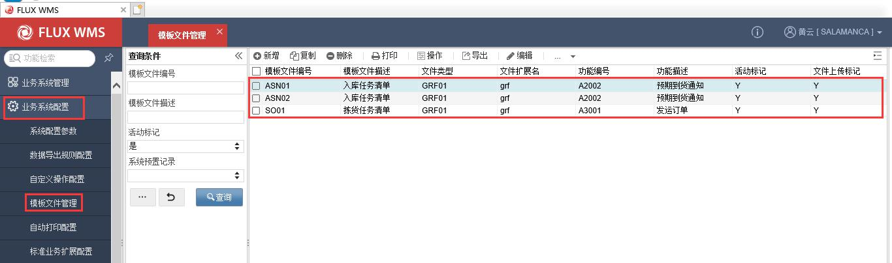

### 21.1.1. 模板文件新增

- **步骤 1：点击【业务系统配置】模块，在子模块列表中双击【模板文件管理】，在左侧的查询条件栏，输入查询条件，可查询已有记录。在明细页签点击【新增】按钮，可新增模板文件。**

- **步骤 2：依次填写详细配置信息。**

  - 【详细信息】配置说明:

模板文件配置分为两个部分--详细信息（模板基础信息，必须配置项）+分模板编辑（如没有分模板需求，则无需配置）。

<!-- 原 PDF 第 513 页 -->

    - 

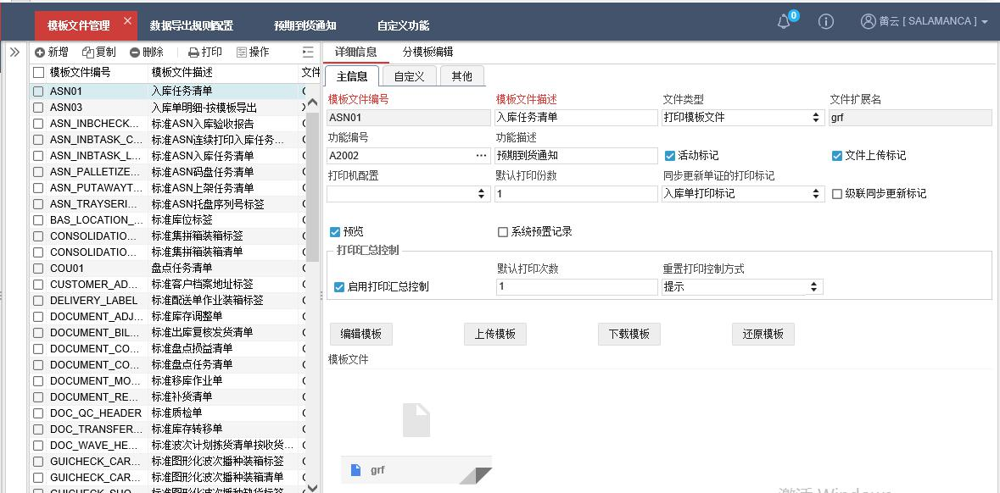

    - 模板文件编号：模板文件的 ID，没有强制命名要求，不可重复。

    - 模板文件描述：模板名称。

    - 文件类型：模板文件类型。系统目前提供 Excel、Grid++（打印格式）、PDF 模板、报表模板类型供选择。

    - 文件扩展名：根据所选类型，显示对应的固定文件扩展名，一般在上传模板文件后系统自动识别。

    - 功能编号：模板应用功能对应的功能 ID。

    - 功能描述：功能名称。

    - 活动标记：模板激活标记。

    - 文件上传标记：是否已经上传模板，由系统根据上传情况显示。

    - 打印机配置：指定打印到特定打印机。

    - 默认打印份数：一次打印时的输出份数。默认为 1.

    - 同步更新单证的打印标记：打印后更新单据对应的打印标记。注意：需要在导出规则的单据数据源中查询打印标记字段，才能生效。

    - 级联同步更新标记：单据组打印时使用，例如从波次计划打印拣货单，除了更新波次计划的拣货单打印标记，可以同步更新发运订单中的拣货单打印标记。

<!-- 原 PDF 第 514 页 -->

    - 预览：打印时是否需要显示预览界面。如果不预览，同时配置打印机，则可以实现后台打印输出效果。

    - 启用打印汇总控制：是否启用打印次数控制。

    - 默认打印次数：启用打印次数控制情况下，允许的打印次数。·

    - 重置打印控制方式：超过默认打印次数时，系统处理方式。1.提示：超出打印次数时弹框提示；2.手动重置：人工清除打印标记后重新打印。

- **步骤 3：点击【保存】按钮，完成主信息的设置**

- **步骤 4：模板文件管理**

  - 【详细信息】配置说明:

    - 编辑模板：第一次编辑：为标准模板时，打开系统的标准模板进行编辑。为按规则打印模板时，打开空白模板进行编辑；非第一次编辑：打开之前编辑保存后的模板；

    - 上传模板：上传一张本地模板。

    - 下载模板：下载服务器上的模板。养成良好的习惯，可以将在线编辑的模板下载到本地做备份。

    - 还原模板：为标准模板时，还原系统的标准模板。为按规则打印模板时，还原成空白模板。谨慎，尤其在没有备份的情况下。备注：目前只支持打印模板的在线编辑，即 grf 文件。

### 21.1.2. 模板文件制作

- **打印模板文件**

制作工具：Grid++,已配置到 V6 系统，支持在线编辑。

参考资料：公司 ftp 上有相关学习视频，请自取。

*[图 21-1-3]（原 PDF 第 514 页，图像未能从 PDF 对象中直接提取）*

- **报表模板文件**

<!-- 原 PDF 第 515 页 -->

制作工具：FineReport，需下载客户端，在客户端定义数据连接、绘制模板。模板完成后上传至系统中。

参考资料：官网学习文档 http://help.finereport.com/

- **Excel 模板文件**

制作工具：Excel 表格

参考资料：学习文档 https://www.cnblogs.com/klguang/p/6425422.html

备注：在 V6 中只有两个对象集：header 和 details。

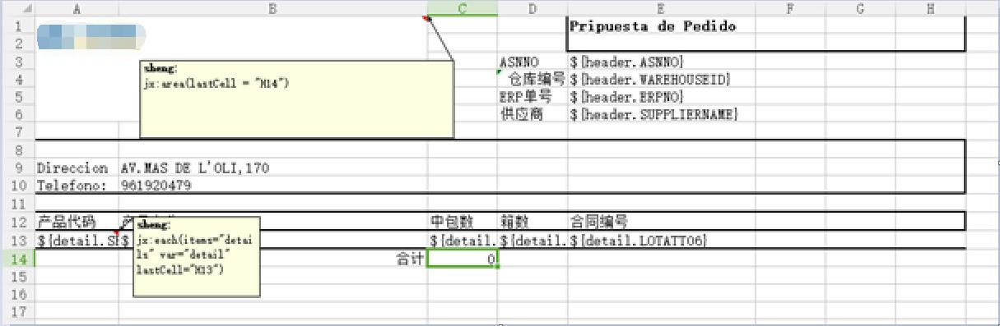

  - 在 A1 表格批注中设置模版区域范围，建议比实际范围大一行。例如：jx:area(lastCell = "H14")

  - 循环读取明细时，在第一个表格的批注中填写 each 函数，默认向下扩展。例如：jx:each(items="details" var="detail" lastCell="H13")

  - 可以使用 SUM 公式汇总，但该字段需提前在 SQL 查询时转换为数字。

## 21.2. 数据导出规则配置

- **位置：【业务系统配置】-【数据导出规则配置】**

- **作用：实际业务中会有很多数据导出的需求，包括单据打印和数据 EXCEL 导出。系统提供了强大的自定义导出处理支持，用户可以根据各自的需要，自行定义所需的导出信息、格式等。**

- **界面预览**

<!-- 原 PDF 第 516 页 -->

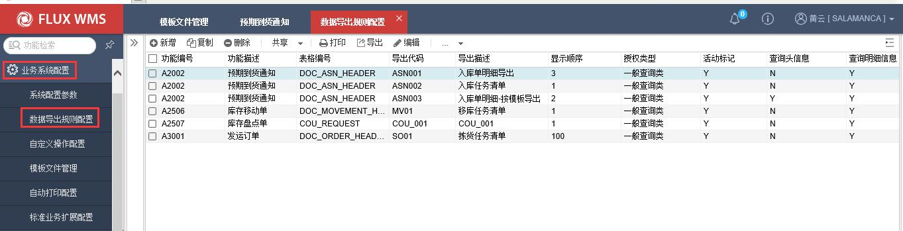

### 21.2.1. 新增导出规则

- **步骤 1：点击【业务系统配置】模块，在子模块列表中双击【数据导出规则配置】，在左侧的查询条件栏位，输入查询条件，可查询已有记录。在明细页签点击【新增】按钮，可新增导出规则。**

- **步骤 2：主信息配置**

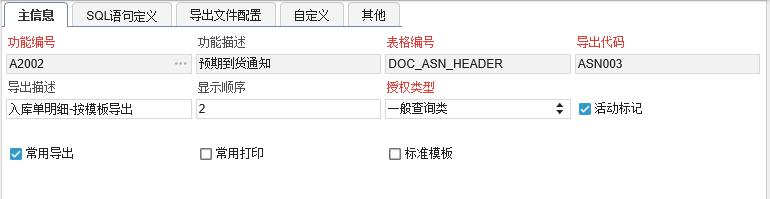

  - 【详细信息】配置说明:

    - 功能编号－功能 ID，系统根据此 ID，获取功能对应导出配置，显示在对应界面的导出选择项。

    - 功能描述－功能对应名称描述。

    - 表格编号－后台表名，即导出信息的来源。

    - 导出代码－代码 ID，用于区分不同的导出处理。

    - 导出描述－界面显示的导出选择项名称。

    - 显示顺序－同一功能的多个不同导出的显示排序。

    - 授权类型－系统提供一般查询类、业务操作类、业务管理类、系统管理类几个默

<!-- 原 PDF 第 517 页 -->

认类型，方便将导出分类管理，批量进行授权设置。用户可以根据管理需要，自

行在系统代码中设置更多的授权类型。授权类型取自系统代码

“EXP_AUTH_TYPE”，支持自定义扩展。

    - 活动标记－是否使用中的规则

    - 常用导出－如勾选，则在对应功能的【导出】按钮的下拉菜单中显示，方便快捷操作。未勾选的导出，则在其他按钮下，“按规则导出”功能中，通过二级窗口选择执行操作。

    - 常用打印－如勾选，则在对应功能的【打印】按钮的下拉菜单中显示，方便快捷操作。未勾选的导出，则在其他按钮下，“按规则打印”功能中，通过二级窗口选择执行操作。

    - 标准模板－是否标准打印模板，不支持修改。

- **步骤 3：sql 语句定义**

根据导出需要，维护各级查询语句，可以通过【测试语句】按钮检测语法问题，【格式化 SQL】 按钮对 sql 语句进行格式化整理。在语句执行时系统会自动校验 SQL 是否符合授权限制（即是否有组织、仓库、货主等条件），若无系统会根据业务表和实际用户授权自动增加查询条件。

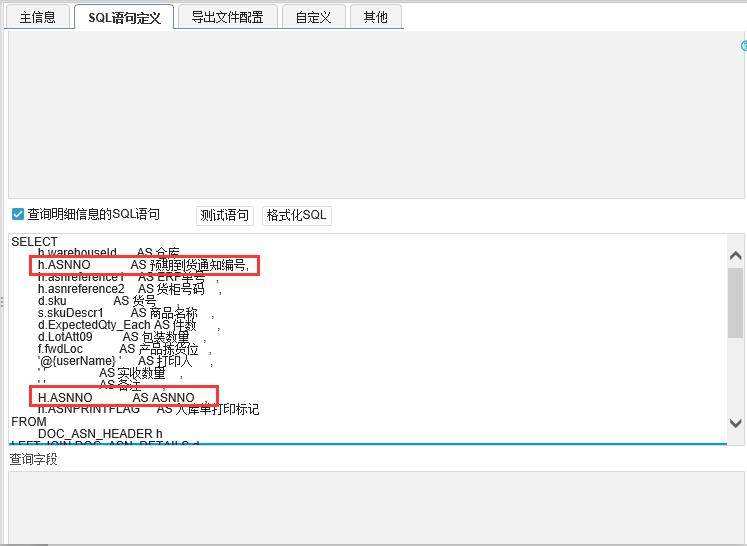

<!-- 原 PDF 第 518 页 -->

注意事项：

  - V6 数据库表结构有很多变化，需花时间熟悉系统数据字典；

  - 由于 V6 几乎所有的表都增加了 organizationId 这个主键，因此表与表的关联字段需增加组织 ID；

  - 如果对应打印模板文件设置了更新打印标记，需要在 SQL 语句中定义打印标记字段；

  - 单号，如 ASNNO、ORDERNO 等不能 AS 别名。保存语句时会自动将单号 AS 成中文名称，解决办法是将单号 AS 成字段本身，可见上图。

- **步骤 4：导出文件配置。**

在【导出文件配置】页签维护数据导出的模板文件：

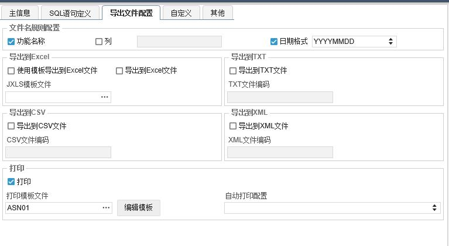

  - 文件命名规则-设置导出文件的命名规则（功能名称/固定某个字段/日期格式-下拉框选择格式）

  - 导出到 XX－导出的文件格式配置。如勾选某种模式，在对应功能的打印/导出子菜单，此项导出会显示模式选择子菜单。不同导出模式，需要配置不同的设置。可见下图示例，同时勾选导出到 excel 文件和打印，则该导出规则出现在【打印】和【导出】的子菜单中。

<!-- 原 PDF 第 519 页 -->

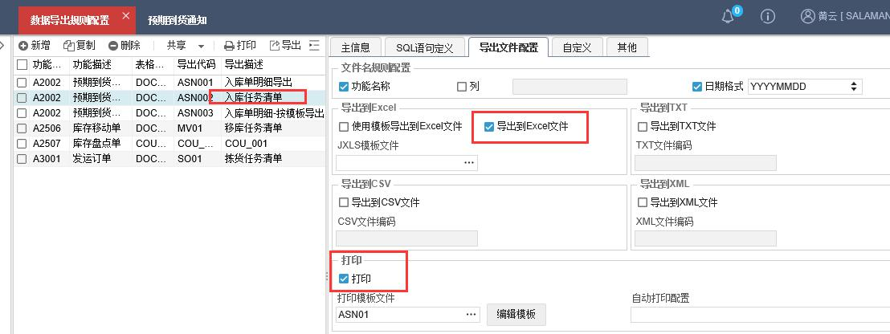

备注：如果选择【按模板导出到 Excel】，则需要维护相应 Excel 模板文件；如果选择【打印】，则需维护打印模板文件。相应文件在【模板文件管理】中配置。

## 21.3. 数据导出授权

- **位置：【业务系统管理】-【数据导出授权】**

- **V6 中将授权细化为三个模块:**

  - 角色授权，即系统标准功能授权；

  - 数据导出授权，即用户自定义的数据导出规则授权；

  - 自定义操作授权，即用户配置的自定义操作授权。

  - 根据“数据导出规则配置”定义的自定义导出所属的授权类型和功能编号给角色进行授权。

按照分类进行授权之后，相同功能模块、授权类型，新增、调整导出规则的时候，无需新增授权。

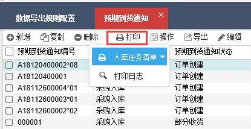

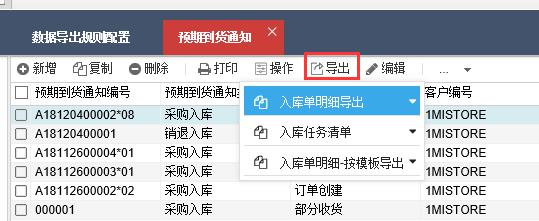

<!-- 原 PDF 第 520 页 -->

### 21.3.1.新增数据导出授权

- **步骤 1：点击【业务系统管理】模块，在子模块列表中双击【数据导出授权管理】，在左侧的查询条件栏位，输入查询条件，可查询已有记录。在明细页签点击【新增】按钮，可新增数据导出授权。**

- **步骤 2：完成【主信息】页签基本配置，点击【保存】按钮，完成数据导出授权。**

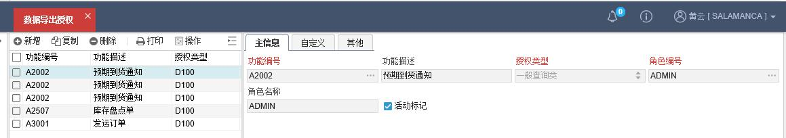

  - 【详细信息】配置说明:

    - 功能编号－导出对应的功能 ID，可通过浏览按钮进行选择。

    - 功能描述－功能名称，根据所选功能编号系统带出显示。

    - 授权类型－系统提供一般查询类、业务操作类、业务管理类、系统管理类几个默认类型，方便将导出分类管理，批量进行授权设置。用户可以根据管理需要，自行在系统代码中设置更多的授权类型

<!-- 原 PDF 第 521 页 -->

    - 角色编号－导出授予的角色对应，可通过浏览按钮进行选择。

    - 角色描述－角色名称显示。

    - 活动标记－是否使用中的记录。

综上，完成模板文件的绘制、导出规则的配置和导出授权，就可以实现数据的自定义导出了。执行效果如下：

- **自定义单据打印样例**

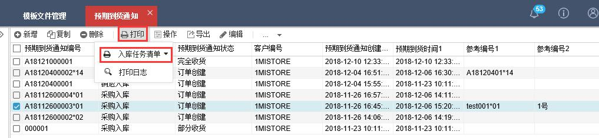

- **导出数据到 EXCEL 样例**

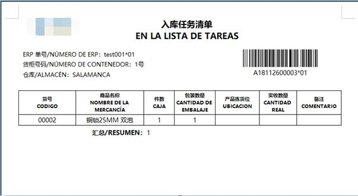

<!-- 原 PDF 第 522 页 -->

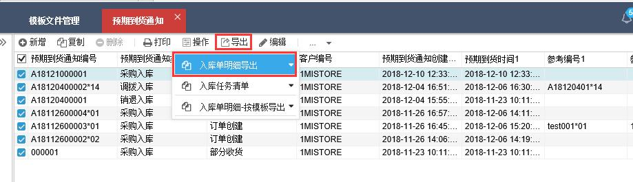

- **按模板导出数据到 EXCEL 样例**

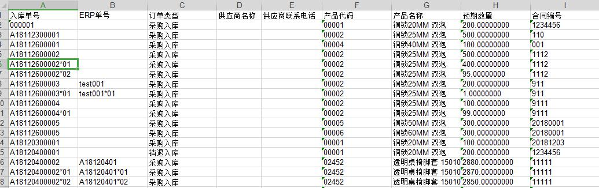

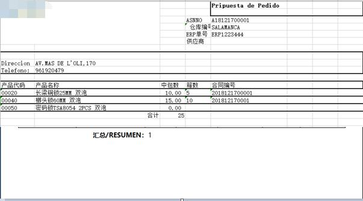

<!-- 原 PDF 第 523 页 -->

## 21.4. 报错记录

### 21.4.1.模板文件再次编辑报错

- **描述：打开已经上传的文件再次编辑时报错‘报表数据读取错误’，复制 URL 提示网页不存在。**

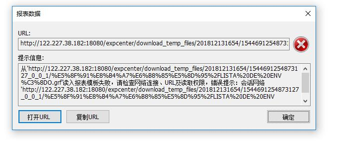

- **原因：模板文件描述中包含‘/’符号，导致 URL 地址有误。**

- **解决方案：模板文件中文描述，尽量避免使用特殊字符。**

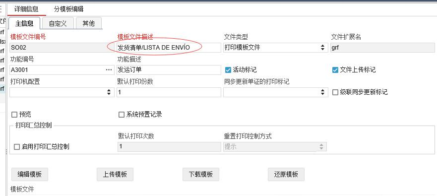
