# 22. 自定义预警配置实例

> 来源：`富勒WMS系统用户手册_V6_高清版（维他命）.pdf`，原 PDF 第 524 页起。
> 本文件按原 PDF 正文标题拆分；原文截图已提取至同目录 `assets/`。

<!-- 原 PDF 第 524 页 -->

仓库日常操作中，有许多情况需要特殊关注，例如库存低于安全线，保质期临近等。尽管系统对此有详细的记录，但通过库存余量或单据对于特定情况并不直观，同时也可能需要主动将信息通知货主或者相关人员处理。但在不同业务情况下，需要通知的内容各不相同，因此 WMS 提供了自定义预警的功能。

配置内容包括【预警参数配置】、【邮件服务器配置】、【邮件模板配置】及【存储过程设置】。

## 22.1. 预警参数配置

- **位置：【预警】-【预警参数配置】。**

- **作用：用于定义、管理 WMS 系统标准/非标准预警参数，以及预警参数相关的其他配置信息。**

- **界面预览**

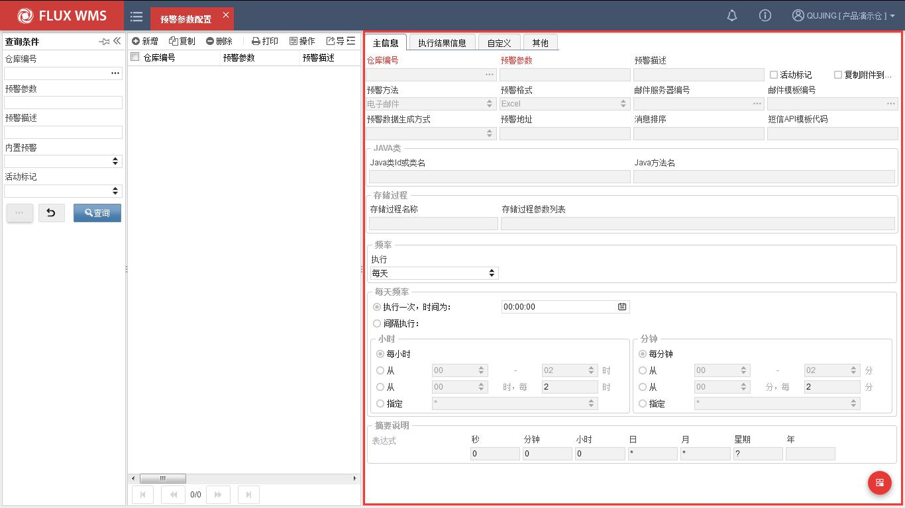

### 22.1.1. 消息型预警配置

- **步骤 1：选择主菜单“预警”模块下的“预警参数配置”**

- **步骤 2：点击【新增】按钮，在“详细信息”页签维护主信息**

<!-- 原 PDF 第 525 页 -->

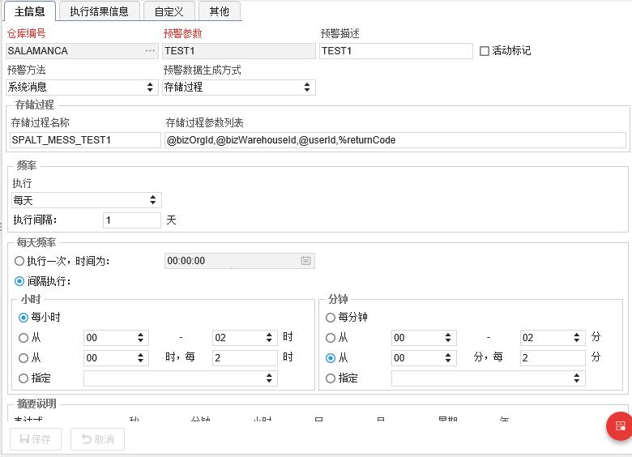

  - 仓库编号－预警生效的仓库，点击新增后系统默认带出当前登录仓库。

  - 预警参数－系统不同预警方式的代码，为自定义代码，本例中配置为 TEST1。

  - 预警描述－预警功能对应的中文描述。

  - 活动标记－该预警消息是否生效。

  - 预警方法－设定该条预警配置通过何种方式来实现，目前包括消息预警和邮件预警。

  - 预警数据生成方式－配置通过存储过程或者 JAVA 类来实现。

  - 存储过程－预警生成方式为存储过程时，调用的存储过程名称。

  - 存储过程参数列表－预警生成方式为存储过程时，调用的存储过程参数列表。

  - 频率－同定时器配置，用于配置该消息记录发送频率。

- **步骤 3：点击【保存】按钮，完成新增记录主信息操作。**

- **步骤 4：在“限制条件”页签，可以显示预警执行情况，包括上次执行时间、上次执行结果、上次执行耗时等**

<!-- 原 PDF 第 526 页 -->

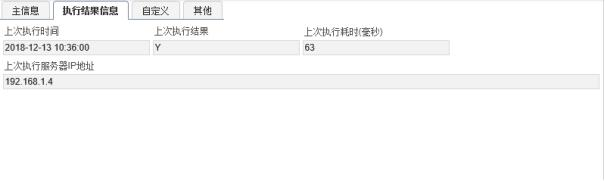

### 22.1.2. 邮件预警参数配置

- **步骤 1：选择主菜单“预警”模块下的“预警参数配置”。**

- **步骤 2：点击【新增】按钮，在“详细信息”页签维护主信息。**

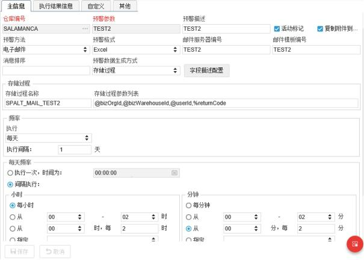

<!-- 原 PDF 第 527 页 -->

  - 预警方法－选择电子邮件。

  - 预警格式－目前下拉框仅支持 EXCEL 预警。

  - 邮件服务器编号－选择配置好的邮件服务器编号（详见下文说明）。

  - 邮件模板编号－选择配置好的邮件模板编号（详见下文说明）。

  - 消息排序－定义邮件信息的排序字段，可根据 SYS_ALERT_LOG 表中的 FILED 字段设置。

  - 字段描述配置－配置邮件不同字段的字段名称。

  - 复制附件到正文－在邮件发送中是否将附件加入到邮件正文中。

## 22.2. 邮件服务器配置

### 22.2.1. 邮件预警参数配置

本章节消息预警不需要配置，具体操作步骤如下：

- **步骤 1：选择主菜单“预警”模块下的“邮件预警参数配置”。**

- **步骤 2：点击【新增】按钮，在“详细信息”页签维护主信息。**

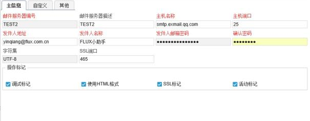

  - 邮件服务器编号－可自定义，用于同预警参数配置进行关联。

  - 邮件服务器描述－邮件服务器对应的中文描述。

<!-- 原 PDF 第 528 页 -->

  - 主机名称－网上查找邮件服务器名称，例如 QQ 邮箱或者 163 邮箱等，同 V4 定时器配置文件。

  - 主机端口－网上查找相应服务器端口，并确保端口可以访问，同 V4 定时器配置文件。

  - 发件人地址－配置电子邮件发件人地址。

  - 发件人名称－配置电子邮件发件人名称。

  - 发件人邮箱密码－配置电子邮件发件人邮箱密码，注意该密码目前在数据库中是明文保存，需要注意密码保护，后期福总会统一进行加密处理。

  - 确认密码－确认电子邮件发件人邮箱密码。

  - 字符集－默认 UTF-8。

  - SSL 端口号－配置邮箱 SSL 端口号。

- **步骤 3：点击【保存】按钮，完成新增记录主信息操作。**

## 22.3. 邮件模板配置

### 22.3.1. 邮件模板配置

本章节消息预警不需要配置，具体操作步骤如下：

- **步骤 1：选择主菜单“预警”模块下的“邮件预警参数配置”。**

- **步骤 2：点击【新增】按钮，在“详细信息”页签维护主信息。**

<!-- 原 PDF 第 529 页 -->

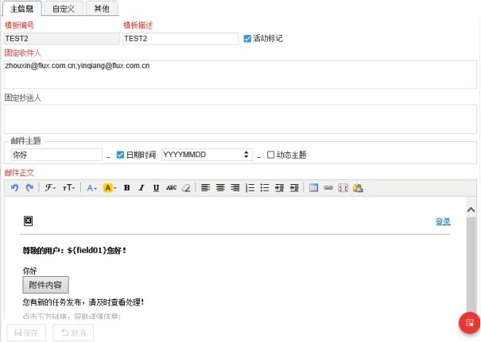

  - 邮件模板编号－可自定义，用于同预警参数配置进行关联，确定邮件预警调用哪一个邮件模板。

  - 模板描述－邮件模板的对应中文描述。

  - 活动标记－该模板是否启用。

  - 固定收件人－配置固定收件人地址，如果有多个地址，需要用分号隔开。

  - 固定抄送人－配置固定抄送邮件地址，如果有多个地址，需要用分号隔开。

  - 邮件主题和邮件正文可进行自定义配置，根据需求配置不同邮件正文格式。

## 22.4. 存储过程配置

### 22.4.1. 界面存储过程名称配置

使用存储过程方式预警前，需先配置存储过程具体名称和出入参数量，详见“22.1. 预警参数配置”相关设置。

<!-- 原 PDF 第 530 页 -->

### 22.4.2. 数据库存储过程配置

- **步骤 1：数据库新建预警存储过程，注意存储过程名称与传参与界面配置完全一致。**

- **步骤 2：系统通过存储过程向 SYS_ALERT_LOG 表插入数据。**

注意事项：

1）SYS_ALERT_LOG 表数据结构，其中 organizationId,warehouseId,alertId,alert Adress 字段为主键，alertDate 字段不允许为空值。

2）消息预警时，自定义字段仅有 FIELD01 字段配置后才生效，即预警信息必须写入 FIELD01 字段，消息推送时只推送 FIELD01 字段信息；同时 alertAdress 字段用于配置哪些用户可以收到预警信息，为“*”时默认所有用户均可收到推送信息。

3）邮件预警时，系统提供 FIELD01-FIELD25 字段进行配置，同时将邮件预警地址写入 alertAdress 字段，当有多个地址时用分号隔开，不可以为“*”号。

### 22.4.3. 消息预警和邮件预警存储过程实例

- **消息预警**

存储过程向 WMS 系统写入采购订单消息预警。

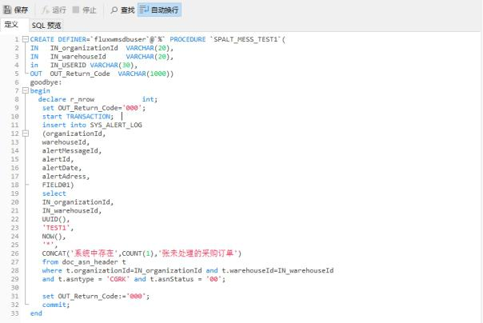

图：消息预警存储过程样例

- **邮件预警**

存储过程向 XX 用户发送一份测试预警邮件。

<!-- 原 PDF 第 531 页 -->

[图 22-4-2]：邮件预警存储过程

## 22.5. 执行效果及日志查询

### 22.5.1. 消息预警执行效果

- **已推送消息**

- **当预警消息推送时，用户可在 WMS 前台右上角处，查询系统推送的所有预警消息信息。点击图标，自动打开下列界面：**

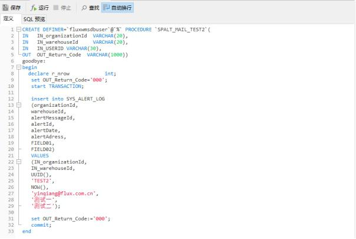

- **当在界面右上角标记已读后，将更新 SYS_ALERT_LOG 表 READFLAG 字段为 Y（默认为 N），前台预警信息将不再显示该条预警消息。**

<!-- 原 PDF 第 532 页 -->

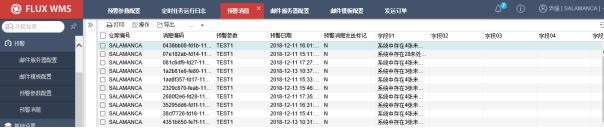

- **未推送消息**

未读取的推送消息可以通过主界面“预警”模块下的“预警消息”模块查询。

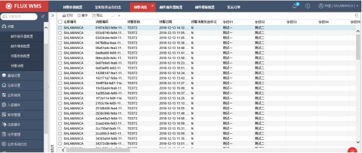

### 22.5.2. 邮件预警执行效果

WMS 系统已发送/未发送邮件预警信息，可通过主界面“预警”模块下的“预警消息”模块进行查询。

*[图 22-5-4]（原 PDF 第 532 页，图像未能从 PDF 对象中直接提取）*

- **预警邮寄样张**

<!-- 原 PDF 第 533 页 -->

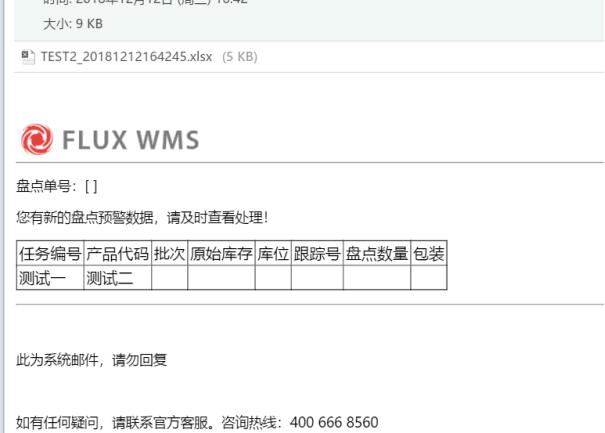

### 22.5.3. 执行日志查询

通过主界面【系统业务日志】-【定时运行任务日志】，用户查询预警消息是否推送成功，见“运行结果”字段。

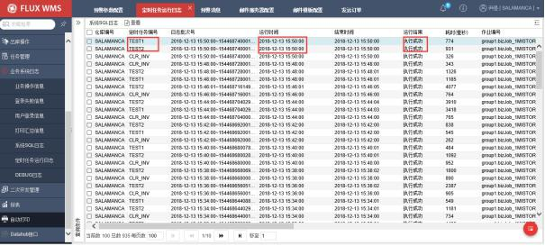

- **步骤 1：根据“定时任务编号”和“运行时间”查看具体定时器日志。**

- **步骤 2：双击点开某一行可以查询“详细消息”日志。**

<!-- 原 PDF 第 534 页 -->

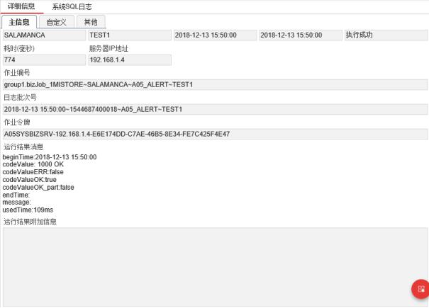

- **步骤 3：双击“系统 SQL 日志”页签，可进一步查看定时器执行详细 SQL 信**

息。

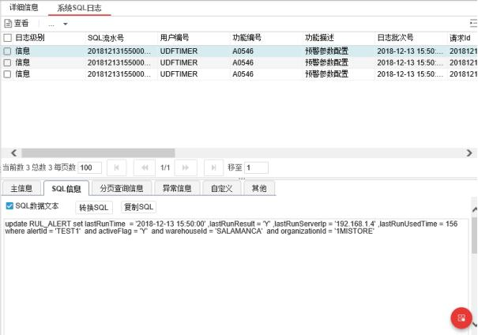
