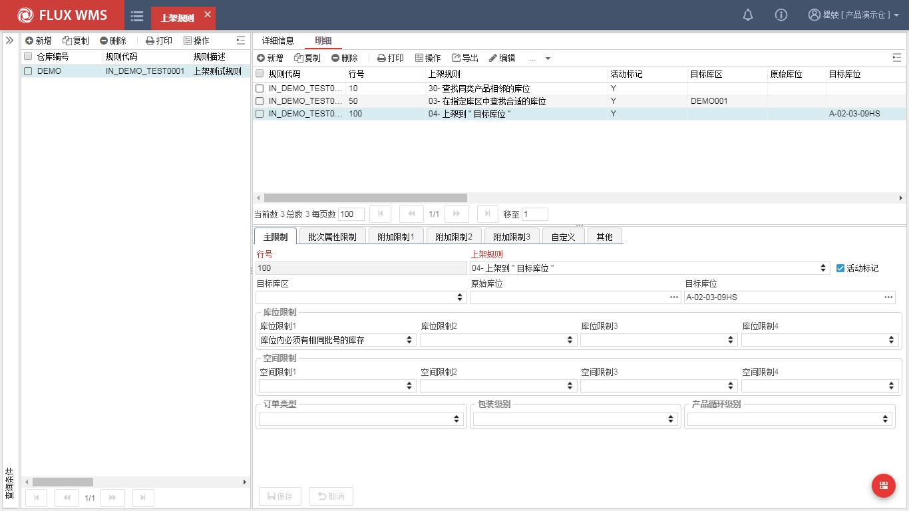
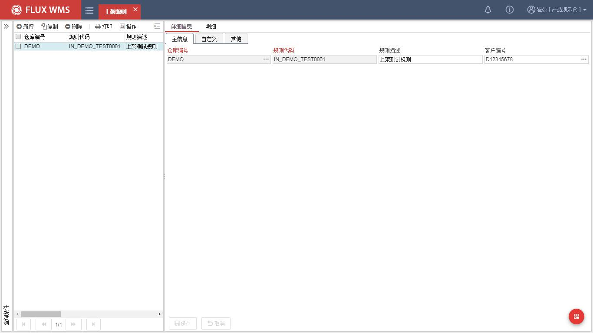
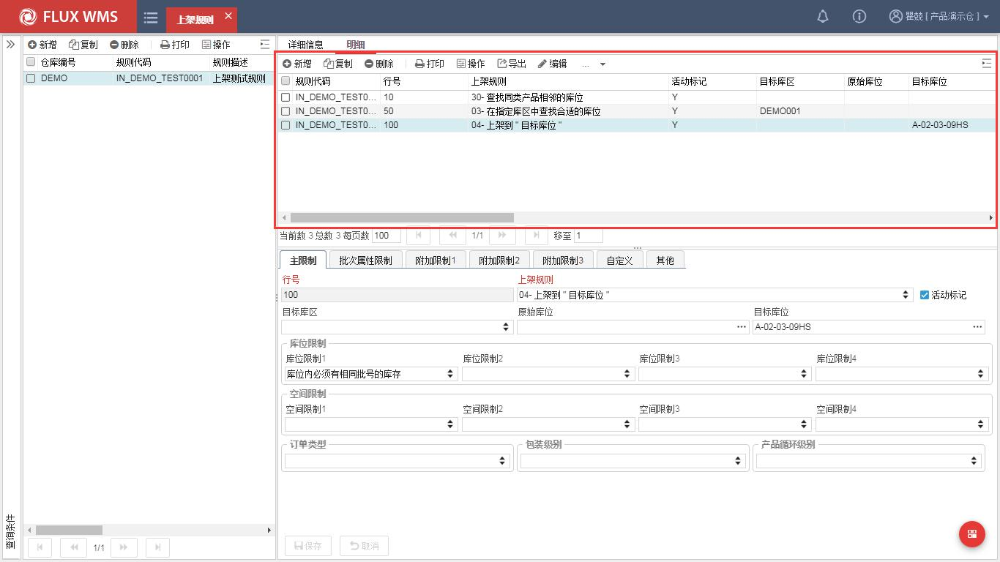
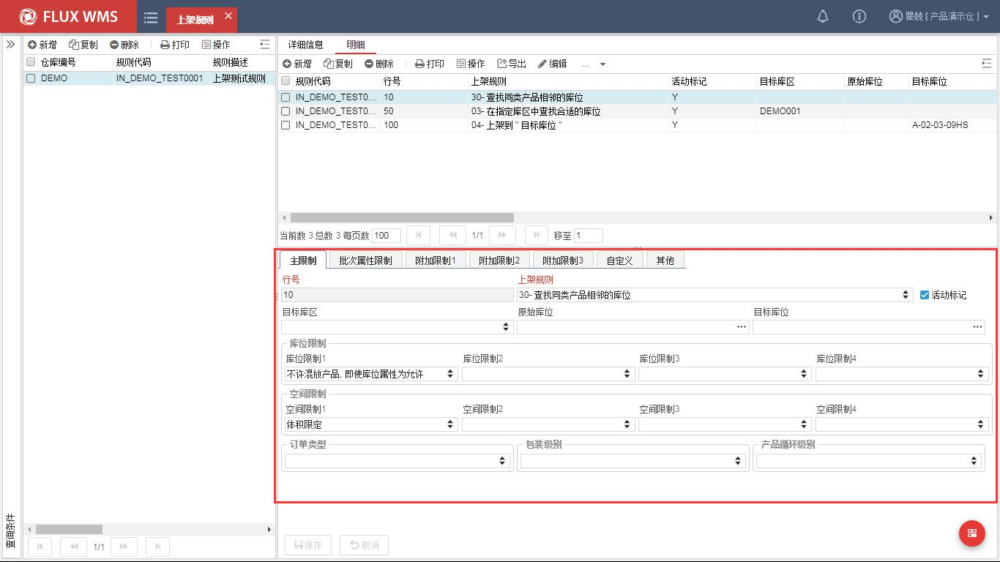
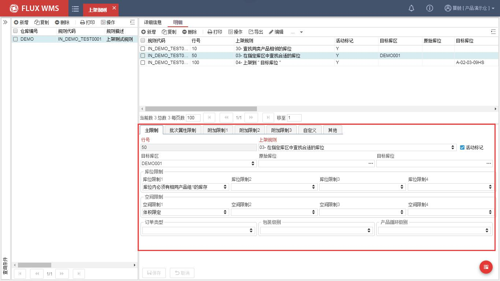
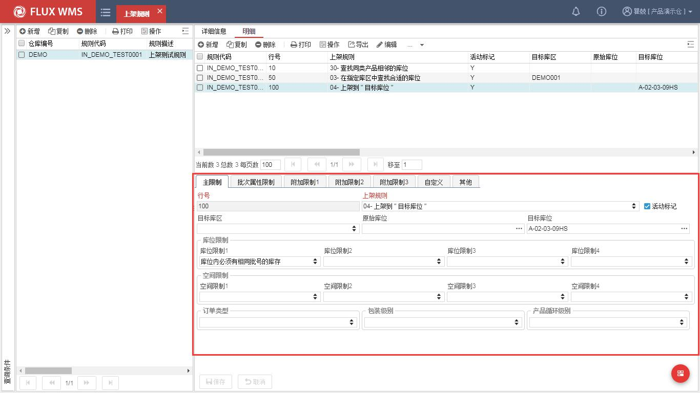
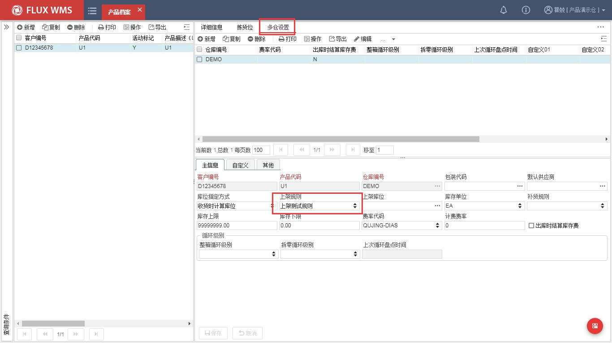
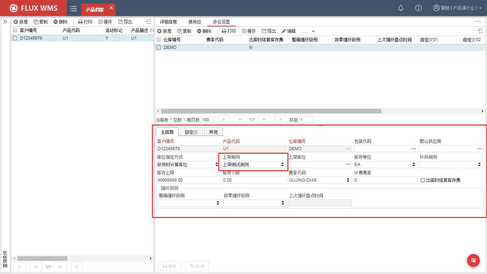
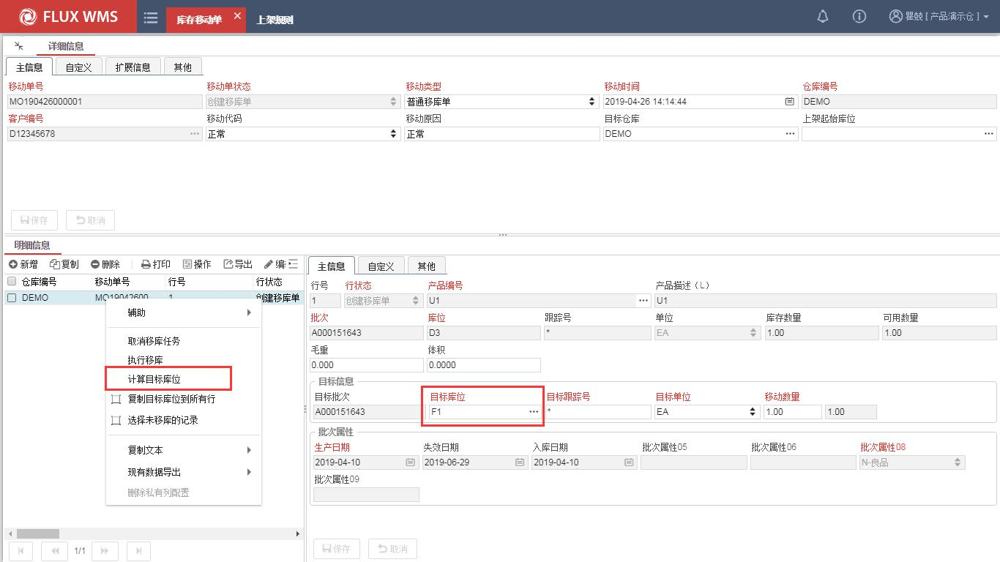
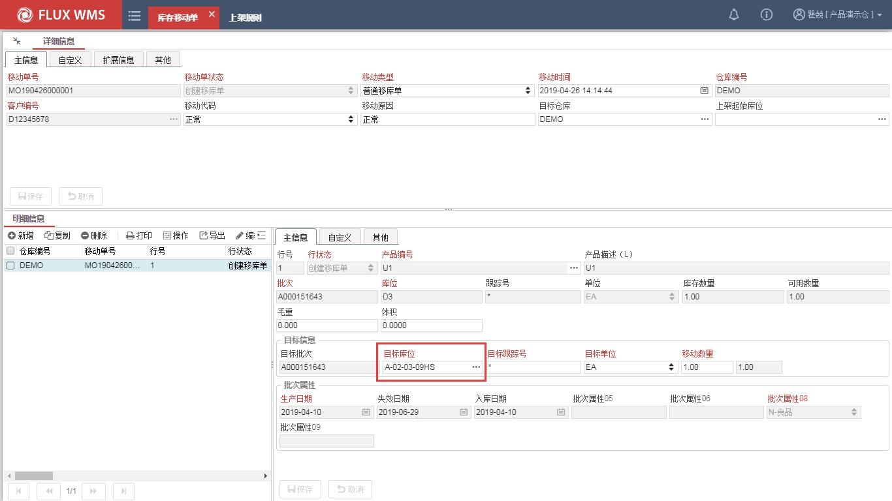

# 23. 上架库位计算实例

> 来源：`富勒WMS系统用户手册_V6_高清版（维他命）.pdf`，原 PDF 第 535 页起。
> 本文件按原 PDF 正文标题拆分；原文截图已提取至同目录 `assets/`。

<!-- 原 PDF 第 535 页 -->

仓库日常操作中，在出入库、库存管理环节会需要 WMS 按照预制规则推荐作业库存场景。本实例以入库为范本，介绍具体的设置和操作步骤。

## 23.1. 上架规则

- **位置：【业务规则】-【上架规则】。**

- **作用：用于上架、补货、移库作业场景库位推荐。**

- **界面预览**

### 23.1.1. 新增上架规则

- **步骤 1：选择主菜单“业务规则”模块下的“上架规则”**

- **步骤 2：点击【新增】按钮，在“详细信息”页签维护主信息**

<!-- 原 PDF 第 536 页 -->

- **步骤 3：点击【保存】按钮，完成新增记录主信息操作。**

- **步骤 4：点击【明细】页签，完成新增记录明细的操作。**

  - 行号 10：上架规则“30-查找同类产品相邻的库位”，并库位约束不允许混产品，需

<!-- 原 PDF 第 537 页 -->

进行体积限制。

  - 行号 50：上架规则“03- 在指定库区中查找合适的库位”，并库位约束库区内必须有相同产品组 1 的库存，需进行体积限制。

<!-- 原 PDF 第 538 页 -->

  - 行号 100：上架规则“04- 上架到目标库位”，并库位约束库区内必须有相同产品组 1 的库存

## 23.2. 产品档案

- **位置：【基础数据】-【产品档案】-【多仓设置】。**

- **操作作用：维护产品相关上架规则。**

- **界面预览**

<!-- 原 PDF 第 539 页 -->

### 23.2.1. 上架规则配置

- **步骤 1：选择主菜单【基础数据】模块下的【产品档案】-【多仓设置】**

- **步骤 2：点击【新增】按钮，新建当前仓库多仓记录，上架规则选择“上架测试规则”。**

<!-- 原 PDF 第 540 页 -->

## 23.3. 计算库位测试

- **位置模块：【库存管理】-【库存移动单】-【上架库位推荐】。**

- **操作作用：根据上架规则推荐移库上架目标库位。**

- **界面预览**

### 23.3.1. 库存移动单测试

- **步骤 1：选择主菜单【库存管理】模块下的【库存移动单】**

- **步骤 2：点击【查询】按钮，检索创建状态的库存移动单。**

- **步骤 3：明细右键点击【计算目标库位】，计算上架目标库位。重新计算目标库位后，系统在“上架规则 10”、“规则 50”未检索到符合条件的库位情况下，使用了“规则 100”中的指定到目标库位规则，推荐了库位“A-02-03-09HS”。**

<!-- 原 PDF 第 541 页 -->

