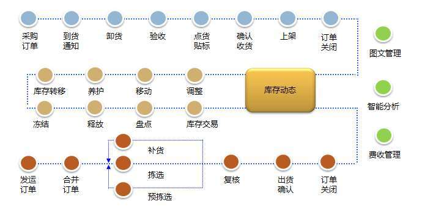

# 2. 仓库、配送中心管理概述

> 来源文件：`富勒WMSV6.2（最全版1119页）.pdf`；原 PDF 第 11-17 页。

> 本文件按原 PDF 正文中的顶层章节拆分；每页保留原 PDF 页码注释，图示按原图注顺序引用。

<!-- 原 PDF 第 11 页 -->

## 2.1. 现代仓储、配送中心管理的目标

缔造面向服务 (Service)、精确 (Accuracy)、透明 (Visibilities)和效率 (Efficiency)的仓库管理的核心竞争能力 SAVE。

传统的以库存管理为导向的仓库管理系统，其核心是对货物本身数量和属性的管理，通过各种单据就可以涵盖仓库内的各项业务。但当面对多货主、多重服务标准、多重计费和高效率的物流运作就会束手无策。

物流的目标是用尽可能低的成本，去实现尽可能高的效益。而现代物流意义下的仓库管理，则更强调的是对服务、精确、透明和效率等核心竞争能力的全面管理和提升。每个货主在物流中心的服务要求是不同的，个性化的目标和模式，大大增强了服务质量一致性上的困难。另一方面，对处理产品的精确管理、各货主间的虚拟隔离和货主内的可视性，又对效率提出了巨大的挑战。

FLUX WMS 正是秉承这样的一个宗旨而设计的。FLUX 认为物流对服务 (Service)、精确(Accuracy)、透明 (Visibilities)和效率 (Efficiency)的要求，天然的形成了对物流中心的核心竞争能力。同时，四个主题的契合又是一个SAVE（英语中的节省）的含义。

FLUX WMS 致力于综合改善客户服务的水平；提高从收货、发货到库存管理等各个环节的准确性；提高从内部管理到外部服务的全过程的透明度；最优化仓库的关键业务流程，使操作效率和仓库利用率得到大幅度的提高。

我们热切地期望 FLUX WMS 能够帮助物流企业实现自我的梦想！

## 2.2. 仓库的类型

一般主要有三种不同类型的仓库，即：公共仓库、自有仓库、合约仓库。

- **公共仓库**

公共仓库通常属于某一法人而不属于产品的所有者。仓位空间和仓储服务是根据货主的需要来销售的。公共仓库可以是干货仓库、冷藏仓库或冷冻仓库，也可是危险品仓库或用于存放一般产品，如计算机、食品、日用品等。公共仓库通过公共运输公司（如中远COSCO、中外运 Sinotrans）、铁路或自有车队来运送产品。

公共仓库通常通过为货主提供产品贮存和附加服务、收取费用而实现盈利。

<!-- 原 PDF 第 12 页 -->

- **自有仓库**

一般情况下，自有仓库的所有者，同时是所存放产品的所有者。

存放在仓库中产品的种类的变化，是随着依据自有设施生产和配送到补充库位的产品种类的改变而改变。有些自有仓库依靠于公共运输公司，但很多也有自己的车队来运输产品。

自有仓库通过成本核算来获利。存放产品的公司通常也是仓库的所有者，因此产品存放和理货的费用也需计入所出售产品的成本。

- **合约仓库**

合约仓库只用于存储那些定有出租空间和服务合约的产品。这类仓库通常需要与客户建立长期的合约关系。

存放产品的种类可变换，寄仓的客户根据与仓库的合约在一个特定的时期内存储某种产品。

合约仓库有自己的货车队来运输产品，或依靠于大众运输公司。有些时候，货主依靠自己的货车队，将产品从仓库运送到目的地。

## 2.3. 仓储、配送中心的运作流程概述

- **采购订单 Purchasing Order，PO**

采购订单是货物的买卖双方之间的协议记录。

如果买方想要在仓库中储存货物，他们更倾向于做货主。货主能通过传真、电话等设施发送一

<!-- 原 PDF 第 13 页 -->

个货物的采购订单复本，或通过下载信息到 FLUX WMS。跟踪采购订单上的信息能加速实际收货流程。

- **预期收货通知 Advanced Shipping Notice（ASN）**

预期收货通知能使仓库为将要到达的货物做好准备。预期收货通知(简称 ASN)是由产品所有人（或者供应商/承运人）发出，在运输之前送至仓库的、此次拟送达货物的详细信息。在货物实际到达前输入待收货信息，能够提高仓库操作的效率和准确性。预期的收货信息通常通过下载或手工输入到系统。

ASN 通常包含以下要素：供应商和买方（即货主）的名称，与该次送货相对应的采购单号码、发货地点、产品信息、描述、数量、包装，以及送货日期等。

预期收货通知也被用于仓库中的实际收货，能减少数据输入时间和简化收货流程。在一些仓库中，更倾向于使用预期收货通知作为收据。当输入预期收货通知时，有两个选项：

- 在没有采购订单的情况下建立预期收货通知；

- 通过使用已存在的采购订单或订单行来增加预期收货通知

- **对预期数量进行码盘 Palletize**

大批量到货情况下，在收货到仓库之前，一般需要对预期收货数量进行码盘(如果预期数量等于或超过一个托盘上的数量)。

码盘，将根据包装设置的托盘数量而把预期数量分成更多明细行。

对于入库货物，系统将自动生成 MUID（Movable Unit ID，即多个跟踪号的集合）或“ 跟踪号 ”。这些号码将作为标签被打印贴在托盘上或写在托盘上，方便仓库使用统一标准的托盘作为作业单元进行后续的操作，可以提升仓库作业的效率和准确性。

- **收货 Receiving**

正如前面所提到的，收货流程是继输入预期收货通知后非常重要的步骤。诸如数量、包装等收货信息都将在货物到达时输入系统。收货操作可以在电脑终端上，或通过实时的RF 设备或其他仓库自动化作业设备来完成。

收货时相关的信息，通常有：收货日期、承运人、货主、供应商、产品、单位、数量、库位。其他特定信息如批次属性、跟踪号则根据货主的要求列出。

批次属性包括：生产日期、失效日期、批号、颜色、尺寸或任何在将来的发运流程中会有指定出库要求的其他属性，都可以作为批次属性，在收货环节采集和确认。

<!-- 原 PDF 第 14 页 -->

在产品进入仓库系统库存后，通常会发出一份有效收据。该有效收据由承担产品保管职责的仓库签署，并列明仓库接收产品的清单。仓库收据有时也称为“非可协商”。

- **上架 Putaway**

仓库接收产品后，需要将产品放入库位。其库位可以是为该产品事先安排的库位，也可以是上架当时闲置和可用的任何库位。

FLUX WMS 可以支持多种不同的上架操作方式：

- 上架清单，分发到仓库工作人员手中。他们将会根据单据(或打印的标签)所列要求来完成货物上架，并且记录下作业过程中实际情况与单据要求的差异，然后把更新过的单据送还给办公室。办公室的数据输入人员将更新关于货物库位和数量的异常信息。

- RF ASSISTED－系统辅助，系统给出作业建议，执行的操作人员有权覆盖建议库位。

- RF DIRECTED－系统引导，由系统决定产品存放的位置。操作人员在没有原因代码的情况下不能覆盖系统建议库位。

如果仓库已建立一套成熟的库存管理系统，并采用无线电射频技术(RF)，则可以使用系统引导的仓库作业方式。根据产品信息和拣选库位时使用的特定设备，系统可为新上架的产品选定库位。

- **发运订单 Shipment Order（简称 SO）**

类似于采购订单和 ASN，发运订单单证记录预订货物、数量和目的地。这一信息将通过自动或手工输入传递到系统中。

- **拣货 Picking**

拣货是根据订单选出产品并从相应的存储库位拣取货品以备运输的功能。FLUX WMS 能够对数种拣货类型进行处理：

- 以托盘为拣取单位

- 以箱为拣取单位

- 以件为拣取单位

- 其它方式

当产品拣取数量少于一整箱时，该拣取视为拆零拣取或按件拣取。仓库进行拆零拣取时，所拣取产品从原有包装中取出后必须重新装箱，以便运送到目的地。这一重新包装的过程又称为“拣货/

<!-- 原 PDF 第 15 页 -->

装箱”作业。

拣货清单可打印成不同的格式。拣货清单的内容可以显示为根据产品和库位而合并在一起的波次拣取，也可以为操作者根据托盘、箱和件的不同拣取单元单独拣取而生成。

根据拣货方式的不同，又可以将拣货分成离散订单拣货、区域拣货和批量拣货等。

- **复核 Check**

复核环节，是拣货后、出库前对待发运货物的检查验证环节。确保所出的货物的确是订单要求的产品和数量。同时，复核环节还可以兼任装箱记录、单据打印、称重等附加处理工作。

复核作业方式，可根据现场业务情况，采用单品复核、普通复核、波次播种复核等不同作业方式：

- 单品复核－适用于单品订单的复核操作，即只订购一件产品的订单，或者只有单一SKU但多件数量的订单，也可扩展至具有单一主品，另有附加赠品的订单。

- 普通复核 －适用于大部分业务场景，支持按波次复核、按订单复核、按箱复核操作。

- 波次播种－基于波次合拣，分货同时进行复核的操作模式。

在基本的 3 种复核模式基础上，系统还提供了类似单品复核，但更适合赠品订单操作的“N+X复核”模式，以及类似波次播种的“图形化播种”模式。

- **发货 Shipment**

发货是指核查产品的准确性后，将其装上交通工具并准备运往指定目的地。已拣好的产品被送到待发货区，仓库工人将其与送货单上的品名进行核对，按订单上的数量集货。然后检查产品的准确性，收缩包装到托盘上，最后装到运输工具上。必要的话，对产品进行固定以防移位。

用户实施FLUX WMS系统过程中，发货程序可能随操作流程变化。FLUX WMS为发货的不同操作流程提供多种处理功能，这将在以后的部分进行讨论。

- **补货 Replenishment**

一些仓库业务场景中，存在小件货品拆零出库的场景。由于不是整箱进出，在整托盘存储位进行拣货，势必带来拣取不方便、操作路线长的结，因此通常会将类似的货物集中设立拆零拣货区，以箱库存模式（每个SKU 存放 1箱或几箱），隔板式货架小库位存放管理比较多见。这样拣选操作员可以在小范围内，无需借助叉车、堆高机等设备即可进行拣货，作业效率会比较高。

但由于拆零拣选区每个库位容量较小，当预存的库存消耗掉之后，就需要将批量存储区（或者也称为散货存储区）的产品补充到拣货区，这个操作在仓库内被称为补货做业务。仓库管理过程中，根据拣货区的总容量或根据该拣货区要求的产品数量定期补货，补货的过程可选择性地使用人员或

<!-- 原 PDF 第 16 页 -->

设备进行操作。

在一个成熟的库存管理系统中，补货可实现动态处理。要实现动态补货，需要一些特定的设置。拣货区要有与库位和产品相对应的最大和最小存货量。若一个拣货区的存货水平到达最小值，仓库工人就会接到从存货区向拣货区补货的指示。补货优先性取决于订货数量。那些存货数量不足以满足订单要求的库位将优先于有足够存货的库位被安排补货。

- **盘点 Count**

FLUX WMS支持多种类型的库存盘点：

- 循环盘点 CYCLE COUNT

循环盘点是根据事先订好的规则每次选择部分存货进行盘点，一个周期内盘点全部货物或库位的盘点方式，以保证实际存货与系统存货水平相一致。实施循环盘点时，需要现场核查个别库位。选择该方式时需要对实地盘点与系统盘点的差异进行手工调整。实地盘点与系统盘点的差异会显示在系统中。定期循环盘点有助于：

- 防止拣选出错

- 保持库位/存货清洁和常新

- 防止遗失

- 盘点同时不影响正常进出库操作

可按照货物循环级别等划分盘点级别，理想状况下，每一仓库操作员工负责一部分产品或库位的循环盘点。

- 物理盘点 PHYSICAL COUNT

物理盘点是指对产品进行全面盘点的功能。

由于一些实际盘点需要由不同的盘点小组分别进行盘点、核实，FLUX WMS支持双盘点方式：完成两次盘点的准备，调查和矫正两次盘点结果的差异。经矫正后的盘点结果将用于与系统存货进行比较，出现的差异再次得到调查和矫正。最终矫正的盘点结果被传送至系统，对系统存货进行调整以使系统存货与实际存货相一致。

大多数货主出于安全和会计要求的目的，进行每年一次的实地库存盘点。高值和易被盗产品的货主通常需要在每年进行几次实地盘点。

- 动碰盘点

仅对当天或指定时间段内有过进、出库等操作的库位或货物进行盘点。

<!-- 原 PDF 第 17 页 -->

一般安排在每日仓库作业完成后或开始前，与循环盘点、全面盘点结合使用。有利于减少盘点作业量，提高操作效率。
