# 3. FLUX WMS 概述

> 来源文件：`富勒WMSV6.2（最全版1119页）.pdf`；原 PDF 第 18-67 页。

> 本文件按原 PDF 正文中的顶层章节拆分；每页保留原 PDF 页码注释，图示按原图注顺序引用。

<!-- 原 PDF 第 18 页 -->

## 3.1. 什么是仓库管理系统

- **仓库管理系统**

按著名的咨询公司 Gartner对仓库管理系统的定义：

仓库管理系统是一个实时的计算机软件系统，能够优化业务运作的各种业务规则和运算法则(Algorithms)，对信息、资源、行为、库存和分销运作进行管理，使其最大化满足有效产出和精确性的要求。

- **仓库管理系统的效益**

一个仓库管理系统的实施能够改进运作的效率、降低整体的成本、提高库存的准确度。潜在的节省领域包括：

- 提高库存管理效率

库存准确度从 95%提高到 99.5%

消除冗余，库存降低 10%到 20%

降低同物理盘点相关联的成本 75%

- 人员精简

能够提升20%到 40%的员工作业效率（人员精简或提高每个员工的产出率）

能够提升 15%到 25%的间接员工效率（如：仓库行政人员）

- 提高空间利用率

空间利用率提高 10%到 20%，避免或减少额外储存的费用

当然，实现最佳的效益还取决于流程、组织和技术的改进。

- **概述介绍**

本章对 FLUX WMS的结构、界面元素等信息，进行集中介绍，帮助用户在后续阅读、系统使用过程中，能够更好地了解WMS。

<!-- 原 PDF 第 19 页 -->

## 3.2. FLUX WMS 的系统结构

FLUX WMS V6版本，是前端基于 B/S架构，后端基于云架构的新版 WMS 操作系统。

与之前版本的 FLUX WMS 相比较，新版本在易维护、国际化、高可配置性等方面都有较大提升。

部署环境可以根据用户需要，采用公有云或私有云进行部署。

使用分布式服务框架开发，根据 WMS 的业务特征，部署的服务大致分为如下几类：

- 前端应用服务：

主要用于前端的界面显示和简单的数据读取，前端基于 H5 相关组件进行开发。基于业务和功能维度，进行了微服务化拆分，分为基础管理、入库应用、库存应用、出库应用等。

- 后端应用服务：

主要用于处理 WMS 实际的业务逻辑、数据库的读写操作等，通过 Hessian框架和前端应用服务进行通讯，并提供 restful风格API接口。基于业务和功能维度，进行了微服务化拆分，和前端应用服务对应。

- 运维管理服务：

主要用于系统运维管理的服务。例如，监控报警、系统升级、安全防控、数据分析、定时任务、消息推送等。为系统运维，系统的可用性，高效性，稳定性提供了有力的保障。

- 运维管理服务：消息，缓存服务

通过应用异步消息组件，缓存组件大大提高了系统的高效性，高并发性，稳定性，可用性等。

支持多种数据库：

- MYSQL

- SQLSERVER

- ORACLE

- POSTGRESQL

FLUX WMS能与企业各个层次的系统进行通信，从企业资源计划(ERP)系统到供应链计划、销售预测、存货订购系统以及第三方仓库管理系统中的存货控制跟踪系统。

<!-- 原 PDF 第 20 页 -->

## 3.3. 登录 FLUX WMS

- **登录 FLUX WMS系统**

- 通过浏览器访问服务地址，例如HTTPS://TEST3.WMSDEV.NET:18080/ （具体地址请向系统管理员获取）

- 在登录如下界面，输入相关信息（具体输入内容，请向系统管理员获取）：

组织－登录所属组织。如果是私有云服务器，组织信息默认显示。如果是公有云服务器，有多组织机构，需要输入用户所属组织信息。

用户编号－登录用户名

用户密码－登录密码

验证码－登录动态验证码。验证码也支持如下的加减乘除算式模式，由管理员通过服务器配置设置切换，默认为纯数字模式。

- 点击【进入系统】按钮，系统提示进行仓库选择。

<!-- 原 PDF 第 21 页 -->

由于 FLUX WMS 支持多仓管理，因此登录时可以显示用户具有权限的仓库供选择；当用户只有单一仓库权限或无仓库权限时，登陆时无仓库选择界面，系统允许用户直接登录到主界面。

点开授权信息展示框，可查看当前组织的授权相关信息，包括授权结束时间、授权类型、仓库数量（当前仓库使用数量/仓库设置上限）、客户数量（当前客户使用数量/客户设置上限）、注册用户数量（已注册用户数量/用户注册上限）。

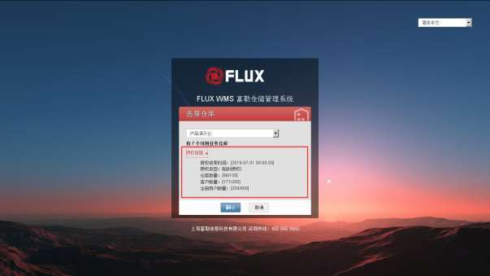

<!-- 原 PDF 第 22 页 -->

- 点击【确认】按钮后，进入 FLUX WMS 系统，显示主界面如下

- 缓存加载完成，鼠标点击界面左上角，“FLUX WMS”LOGO 后的“三道杠”按钮，系统显示功能主菜单：

<!-- 原 PDF 第 23 页 -->

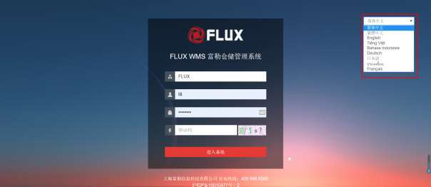

- 点击模块菜单，进一步展开显示模块下属的功能菜单。也可在【功能检索】框输入内容，通过查询方式定位所需功能。

- **多语言选择**

系统支持多种语言，在所配置的默认语言基础上，登录时可以选择其他语种，后续此电脑登录将默认为所选择的语言：

*图 3-3-6（图像未能从 PDF 对象中直接提取）*

目前系统默认支持的语言有：简体中文、繁体中文、英文、印度尼西亚文、越南文、德文。其余语言请联系 FLUX 顾问加载语言包。

界面显示的多语言下拉列表，可以由管理员在配置文件 CONFIGW01.PROPERTIES 中进行配置。

- **登录步骤**

简单的说，登录系统的步骤是：

1. 打开指定网址

2. 确认组织 ID（很多情况下有默认组织 ID显示）。

3. 录入用户 ID、密码。

4. 录入验证码。

5. 确认登录。

<!-- 原 PDF 第 24 页 -->

## 3.4. FLUX WMS 的模块

为了减少功能的复杂性，FLUX WMS 系统被分成若干个较小的子模块，在系统菜单栏可以看到各个子模块。每一个子模块包含与仓库中特定操作相关的功能，在主菜单中点击菜单子模块，可展开显示对应的功能列表。以下是 FLUX WMS 的主要功能子模块。

- **业务系统管理**

系统相关初始化设置。如仓库设置、授权设置等。

- **业务系统配置**

系统相关作业配置，如系统参数、模板文件管理、导出配置等。

- **基础设置**

用于维护 FLUX WMS的业务基本数据，包括客户、产品、批次属性、包装、装箱、系统代码等信息。这些基础设置将在后续操作中使用到。

- **仓库设置**

用于维护仓库物理信息数据，包括库区、库位、播种墙等信息。这些基础设置将在后续操作中使用到。

- **业务规则**

用于维护 FLUX WMS处理业务时遵循的管理要求，如：上架规则、分配规则等，分别在相应业务环节生效。

- **入库操作**

入库操作包括了从收货到上架的整个过程，从业务的形态上来看，支持多种不同的收货形式和上架方式。

- **库存管理**

包括了对于在库产品进行管理的各方面功能：交易情况查询、移动库存、调整库存和库存余额查询等。

- **出库操作**

出库操作包括从订单预分配、分配到拣货、装载、发运的整个过程。支持使用多种的方式对订单进行拣选。

<!-- 原 PDF 第 25 页 -->

- **任务管理**

针对系统内全部作业任务进行管理。

- **增值服务**

管理配送中心中的产品增值服务，如包装、贴标等，或者将零部件组装成为成品或半成品等加工操作。

- **费收**

维护所有的账目、额外的费用和费率管理。

- **预警**

对特定情况提出警示。

- **系统业务日志**

系统操作日志信息，常用与异常检查。

- **二次开发管理**

提供灵活而又强大的个性化处理配置。例如自定义报表配置、自定义功能配置。

- **报表**

管理、运行、查看和打印各种管理所需报表。

- **自定义功能**

已配置的自定义功能操作。

- **自动打印**

自动打印服务管理。

- **看板**

自动刷新、展示的，现场管理所需的特殊报表。

FLUX还包括其他的应用附加模块，如：

- **无线射频 RF 模块**

运行无线射频程序和对无线电频的界面进行修改。

<!-- 原 PDF 第 26 页 -->

- **标签管理**

生成、打印条形码标签以及产生新的标签。

- **交叉转运模块Cross Dock**

其作用在于通过交叉转运中心和提供全方位服务的配送中心最大化存货的周转速度的功能。

- **归档模块 Archive**

用于对仓库中过去的操作记录另行保存，形成一个虚拟仓库，便于用户对过去的数据进行查询和总结。

其他的各个模块，有各自独立的培训教材和课程，请向FLUX联系，以获得最新的资料。

## 3.5. FLUX WMS的用户界面

FLUX WMS界面显示如下：

一部分界面元素，在不同功能中显示不同，例如字段等，但还有一部分元素，基本上每个功能都具有，在此做统一介绍。

<!-- 原 PDF 第 27 页 -->

### 3.5.1. 菜单栏

- **主菜单栏**

登录后，鼠标点击在界面左上角、FLUX WMS Logo后的“三道杠”主菜单按钮，系统显示主菜单栏。

默认显示一级功能模块，点击后展开显示功能菜单，如下图所示。

<!-- 原 PDF 第 28 页 -->

- **功能检索**

如果不能确定所需功能的上级模块，可以通过主菜单的“功能检索”来查询、定位所需功能。

默认点击检索框，未录入信息的情况下，显示按用户使用频次排列的常用功能快捷菜单，如下

<!-- 原 PDF 第 29 页 -->

图所示：

输入查询内容，系统显示相关功能，点击功能名可以直接打开指定功能。

- **菜单锚定**

<!-- 原 PDF 第 30 页 -->

通常情况下，光标移动出主菜单区域后，主菜单会自动隐藏，以便用户进行业务操作。

但有时操作员可能需要频繁打开主菜单进行功能选择，此时可以通过检索框旁边的 “图钉”按钮，将主菜单固定在界面上。如下图所示。再次点击“图钉”可取消菜单锚定。

随着菜单锚定、取消锚定，操作显示区域会随之缩放。

### 3.5.2. 系统信息

- **登录信息**

界面右上角，显示当前登录的仓库（如下图右上角的【上海仓库】），和登录账号名。

<!-- 原 PDF 第 31 页 -->

- **版本信息**

在界面右上角点击 信息图标，系统显示当前生效的界面方案名称（界面方案具体配置，请参考【4.10 界面方案管理】章节的介绍），以及当前版本号信息。

如果当前环境未使用界面个性化配置，则“当前使用方案”显示为“暂无”。即采用的系统初始化默认界面配置。

<!-- 原 PDF 第 32 页 -->

点击【版本更新内容】链接，可查看系统更新日志说明

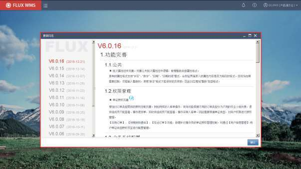

点击【产品手册】链接，则弹窗显示 FLUX WMS 用户手册：

<!-- 原 PDF 第 33 页 -->

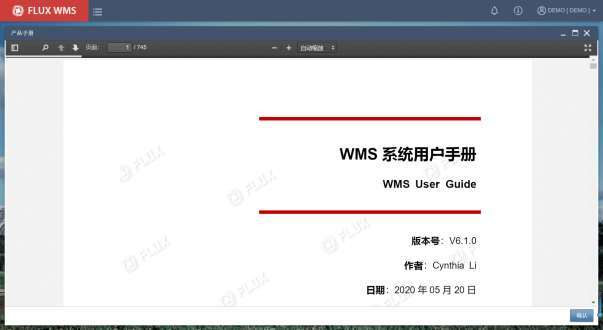

- **系统菜单**

点击“登录/仓库信息”部分，可见系统菜单。

- 重置缓存

<!-- 原 PDF 第 34 页 -->

为提升系统作业速度，部分常用配置信息，如语言配置，声音文件等，会在登录时被缓存到当前界面。但如果此时其他用户对相关配置信息进行修改，有可能无法及时查看、获取。因此系统提供手动刷新缓存信息的功能，无需用户重新登录重新获取缓存信息。需要提醒的是，此功能仅在特殊情况下使用（例如临时添加了某个声音文件，现场客户端需要使用），日常作业无需频繁执行。

点击【重置缓存】后，系统显示如下图的缓存加载对话框，默认全选，全部刷新。确认【重新加载】后，系统刷新缓存。如点击【取消】则返回主界面。

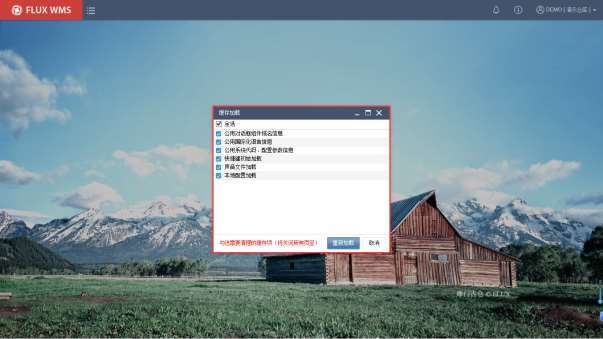

- 本地配置

仓库作业中，有些环节需要每个工作台有不同的设置，例如电脑配置不同的电子秤，需要提示不同的警示音避免混淆等。这类情况需要对不同电脑进行不同的设置，我们称之为“本地配置”。

图 3-5-12的系统菜单中，点击【本地配置】功能，系统会显示本地配置界面：

<!-- 原 PDF 第 35 页 -->

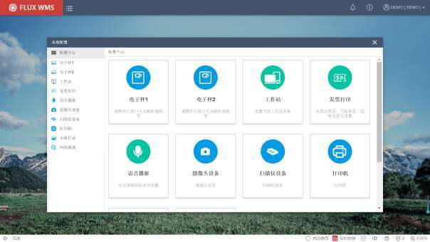

- 插件安装

首次使用会有本地配置客户端插件安装提示，如下图所示，客户端插件主要用于打印、PDF 预览等处理。如果已安装并启动插件，则无提示：

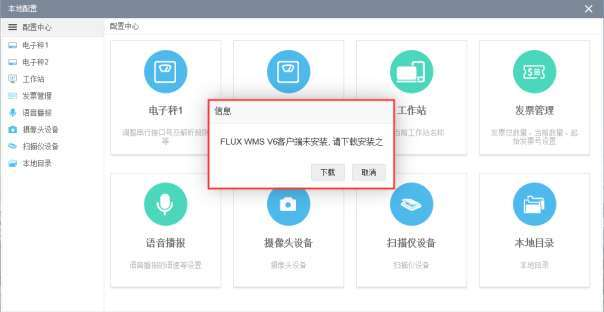

点击【下载】按钮后，在弹出的运行提示中，选择【运行】，根据提示信息下载安装客户端插

<!-- 原 PDF 第 36 页 -->

件，并相应启动插件（安装过程可参考【4.15 插件管理】章节的介绍。）

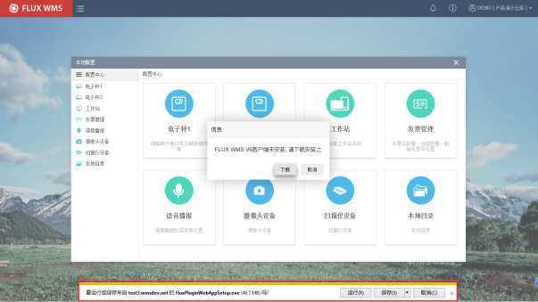

- 电子秤

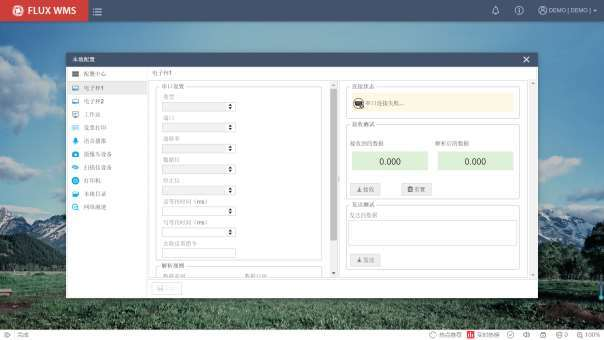

用于配置本机连接的电子秤相关配置信息。

<!-- 原 PDF 第 37 页 -->

所需信息值（如波特率等），与电子秤硬件相关，通常从硬件说明书上可以获取。

去皮指令通常在需要系统自动下达指令给电子秤、自动去皮情况下使用。具体指令内容，需要根据电子秤的要求设置。

由于部分业务场景，需要同一台电脑连接两台电子秤（例如分别用于良品、不良品的称重收货），因此系统提供【电子秤 1】、【电子秤 2】的配置项，支持分别配置。

只需一台电子秤的情况下，仅配置【电子秤 1】即可。

- 工作站

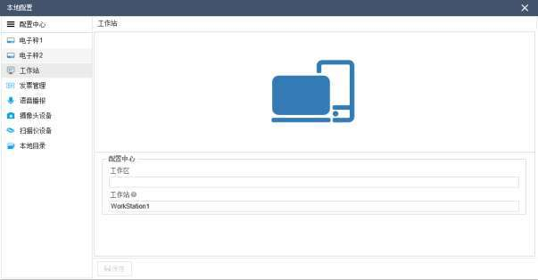

不同作业台，相邻库区不同，或者匹配不同的播种货架进行操作，可以配置为不同的工作站，方便精细化管理应用。工作站信息，在各种作业处理时，会作为参数传入，能够实现不同工作站执行不同的个性化逻辑的效果。

在出库复核、配送单作业等环节，摄像头录像时，也会将工作站信息作为文件名的一部分进行记录（例如货主_订单号/箱号_工作站_流水号_HHMISS）。

- 发票打印

<!-- 原 PDF 第 38 页 -->

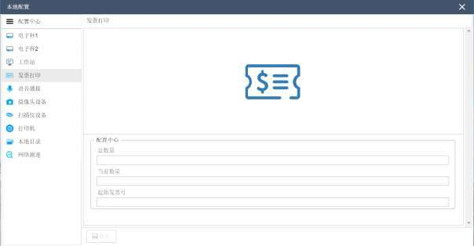

打印发票时，用于配置起始发票号，当前发票打印纸（卷式连续发票）打印张数，以便系统在连续打印时，可以根据起始发票号自动记录后续打印发票号，无需人工逐一录入。

- 语音播报

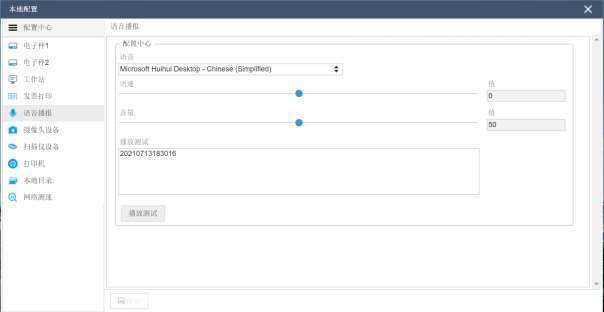

用于配置语音播报语速，方便不用作业习惯的员工使用。

- 摄像头设备

<!-- 原 PDF 第 39 页 -->

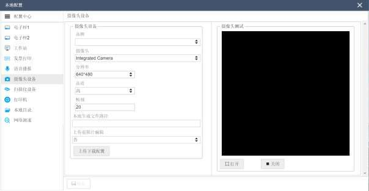

用于对接摄像头时的对接测试，分辨率、保存目录等的配置。

✓ 品牌信息

下拉框获取自系统代码 CAMERA_BRAND 摄像头品牌，相应系统代码的分类可以分为“本地”、“服务端接口”。对于品牌为 HIKVISION 的摄像头，如果对应分类是“服务端接口”，则是通过接口模式，调用海康威视的视频接口。其余“本地”模式的摄像头品牌，则有本地插件直接控制摄像头硬件进行拍摄。

✓ 摄像头

当前工作站的摄像头设备号，与【设备】功能中维护的信息关联，可以获取接口访问相关信息。

✓ 本地生成文件路径

摄像头录像、生成视频文件时，会先保存在“本地生成文件路径”中指定的目录下。系统自动根据功能 ID+功能描述，在指定目录下创建子目录，例如出库复核功能，同时支持录像、拍照，则录像子目录为“A3014_出库复核_VIDEO”，拍照子目录为“A3014_出库复核_PHOTO”；一些功能只有录像，则子目录不做进一步区分为“A3022_配送单作业”。

然后再根据【上传下载配置】，将录像上传到指定的网络目录，例如FTP 目录中。录像视频上传成功，将自动删除本地相应文件，释放磁盘空间。

✓ 上传前图片编辑

<!-- 原 PDF 第 40 页 -->

“上传前图片编辑”默认为否，如果配置为“是”，则在【药品检验报告】、【购进发票】、【随货同行单】功能中，扫描/拍照之后，打开图片预览界面，供用户查看并提供剪裁、拉伸、旋转等图片处理支持。用户可对扫描/拍照的结果进行重新编辑，保存后再上传。

✓ 上传下载配置

点击【上传下载配置】按钮，可以直接跳转到【上传下载配置】功能界面，进一步配置录像上传时的设置，例如 FTP 地址、账号密码等。

- 扫描仪设备

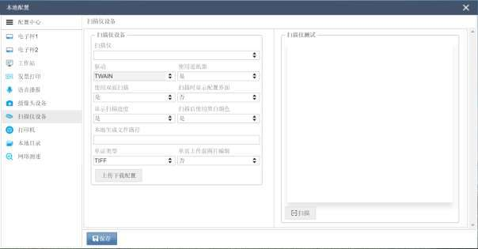

用于对接扫描仪时的相关配置，以及对接测试。

✓ 单证类型

用于配置扫描生成的多张图片，保存为 TIFF的多页单证模式，还是 PDF的单证模式。

✓ 单页上传前图片编辑

“单页上传前图片编辑”默认为否，如果配置为“是”，则在【药品检验报告】、【购进发票】、【随货同行单】功能中，扫描之后会打开图片预览界面，供用户查看并提供剪裁、拉伸、旋转等图片处理支持。用户可对扫描/拍照的结果进行重新编辑，保存后再上传。

- 打印机

用于维护各个打印模板的默认本地打印机。

<!-- 原 PDF 第 41 页 -->

根据功能或者描述，选择本机需要打印的模板文件，在“打印机配置”列，下拉选择本机可访问的打印机。

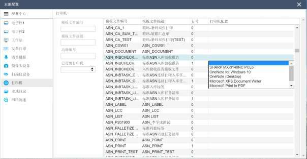

打印时，优先获取本地配置的打印机；如果本地打印机未维护，则获取【模板文件管理】中维护的打印机（用于仓库大多数相同类型的打印机，都使用相同打印机名的场景，减少各个终端维护的工作量）；

如果【模板文件管理】中未维护打印机，则在打印时弹出打印机的选择界面，人工进行选择。同时，如果在选择界勾选“设置为默认打印机”，则在打印的同时将打印机记录到本地配置中。

- 本地目录

<!-- 原 PDF 第 42 页 -->

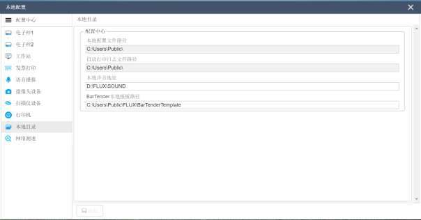

用于本地文档保存目录配置。

- 网络测速

点击按钮可以对网络情况进行测试：

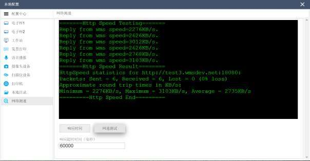

- 切换仓库

<!-- 原 PDF 第 43 页 -->

用户如有多个仓库的权限，已登录情况下，可以通过系统菜单中的【切换仓库】功能，选择其他具有权限的仓库，相应跳转，无需重新登录。

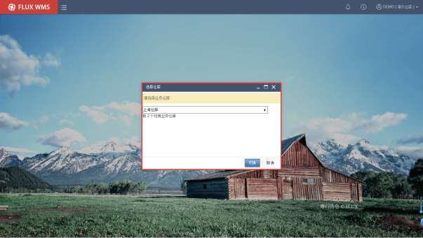

- 修改密码

提供给用户自行修改密码使用：

<!-- 原 PDF 第 44 页 -->

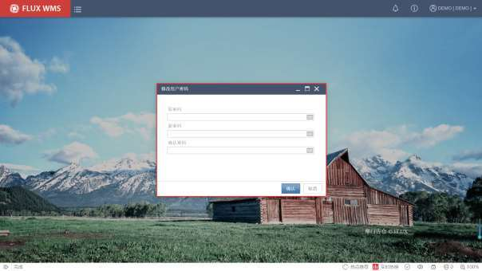

- 修改时区

系统支持多时区管理，由于需要兼容TMS 用户在不同时区作业的需要，时区设置在用户层级。遇到需要修改时区的场景，通过【修改时区】功能，进行时区选择切换。

确认修改，并重新登录后，系统会根据用户对应的时区，对日期时间信息进行转换显示。后台数据库中仍旧存入与服务器时间统一的日期时间信息。

<!-- 原 PDF 第 45 页 -->

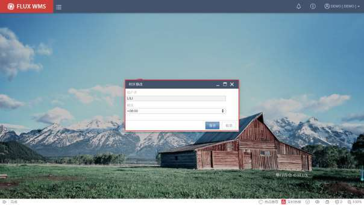

- 快捷登录

用户使用 WMS 时，如果具有其他子系统的操作权限，可以在系统菜单中看到进入其他子系统的快捷登录选项。以RF 为例，点击【RF 终端模拟器】，可以从已登录的 WMS 界面，跳转到浏览器登录 RF 系统模式，由程序自动打开并登录 RF 系统，无需重复登录，方便用户进行操作。

<!-- 原 PDF 第 46 页 -->

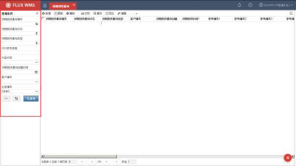

- 进入外部系统

WMS 系统与 ERP等其他系统对接的情况下，为了方便用户切换系统，在界面右上角系统菜单中，增加“进入外部系统”子菜单，点击子菜单中的具体功能项后，能够直接跳转到其他系统的相应功能中（例如跳转到 ERP 系统的“查询工单”功能中）。

用户可跳转的系统、以及对应的具体功能，则在【业务系统管理】模块中的【外部链接设置】功能里配置。

点击功能跳转后，会根据跳转的目标系统的管理要求，录入用户名密码进行登录，或者免登录自动进入功能。

- 退出登录

退出当前WMS 系统，程序会记录用户的操作时间信息。

### 3.5.3. 查询界面

- **查询界面**

不同功能显示的查询条件也有所不同，输入查询条件内容，点击【查询】按钮，系统显示查询结果。

*图 3-5-30（图像未能从 PDF 对象中直接提取）*

<!-- 原 PDF 第 47 页 -->

点击 【重置】按钮，则清空输入的查询条件，重新录入。

点击 【更多】按钮则进一步显示其他隐藏、自定义查询条件字段，如下图所示效果。

通常情况下，单据类的功能，默认为扩展查询界面，如图 3-5-18，而其他查询条件较少的功能则默认如图 3-5-17的查询界面。具体功能默认的大、小查询界面，可以在界面方案中配置选择。

- **查询条件选项**

- 显示关闭 /取消单据

除了不同的查询条件，各个单据查询界面都有“显示关闭/取消 XX”的 checkbox：

未勾选情况下，查询时默认屏蔽已关闭和已取消的单据，只有勾选后才能查询到。默认情况下此字段不勾选，以免导致不必要的大数据查询。

- 显示产品所在订单的其他订单行

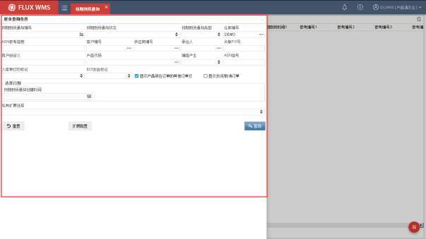

<!-- 原 PDF 第 48 页 -->

输入产品（简称 SKU）查询条件下生效。默认勾选，根据 SKU 查询记录后显示完整订单明细。如取消勾选，则根据产品查询条件，定位显示此产品记录，隐藏其他明细行。

- 模糊查询

查询条件字段，默认为精确查询模式，例如货主条件字段输入“A1”，即精确查询货主ID=A1的记录。

如果需要模糊查询，可以在查询内容前后添加%代替任意字符，即：

- “A1%”会查询出所有A1 开头的货主相关的记录；

- “%A1%”能够查询到代码中包括 A1字符的货主相关记录；

- “%A1”则查询代码结尾是 A1的货主相关记录。

### 3.5.4. 通用功能按钮

- **按钮栏**

*图 3-5-34（图像未能从 PDF 对象中直接提取）*

- 新增－增加新记录

- 复制－已有记录，复制为新记录，仅ID 信息需要人工录入即可保存。

- 删除－记录删除。但如果记录已被其他功能引用（例如新增的包装已经在产品档案中被使用），则无法直接删除。需要先删除其他功能中的记录，才能正常删除此记录。

- 打印－子菜单模式，标准打印项目选择。在“数据导出规则配置”，设置为常用打印的规则，可在导出菜单中显示。

- 操作－子菜单模式，标准操作项目选择。在操作规则中，配置为标准操作的规则，可在导出菜单中显示

- 导出－子菜单模式，标准导出项目选择。在“数据导出规则配置”，设置为常用导出的规则，可在导出菜单中显示。

- 编辑－点击后进入明细编辑界面

- 子菜单选择

<!-- 原 PDF 第 49 页 -->

打印、导出、操作按钮的下拉菜单，显示已配置的操作项，每个项目还具有各自的模式选择子菜单，如下图所示，打印可选择不同的打印模式（可配置默认模式）

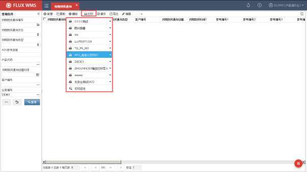

- **扩展功能**

按钮栏的扩展功能，一部分为通用的扩展功能，涉及到进一步选择规则操作。一部分为业务功能项目，不同功能界面显示的项目不同，通常也同时显示在鼠标右键菜单中，方便用户在不支持鼠标的设备上（例如触屏设备）通过扩展按钮进行功能选择操作。

此处主要介绍通用扩展功能，各个业务功能，将在相关业务章节进行介绍：

<!-- 原 PDF 第 50 页 -->

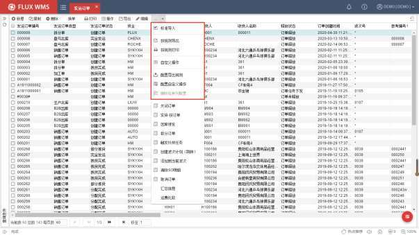

- 标准导入－通过选择文档，批量导入、创建记录。

- 导入操作

选择标准导入功能，系统显示如下导入对话框。

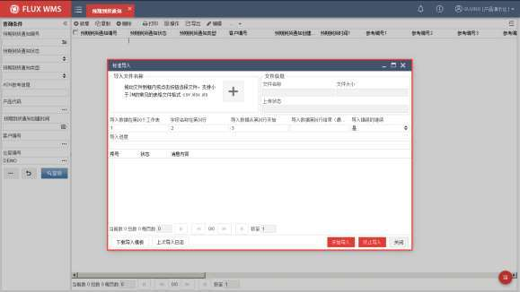

<!-- 原 PDF 第 51 页 -->

通过【下载导入模板】按钮，可以下载获取对应标准导入模板。

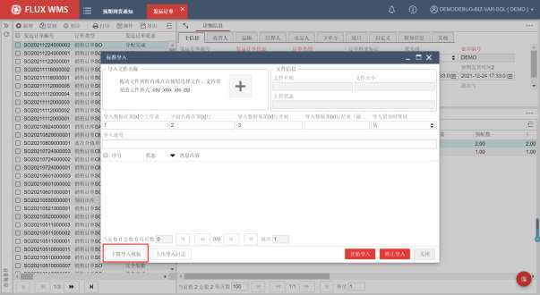

点击后，支持在弹窗中修改下载模板的文件名、保存地址，点击【下载】按钮开始模板下载：

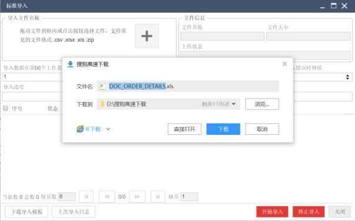

<!-- 原 PDF 第 52 页 -->

在模板中按要求完成数据维护，然后在导入界面点击【+】按钮，选择已维护的导入文件（目前支持 Excel、CSV 文件，以及 ZIP 压缩包上传）。

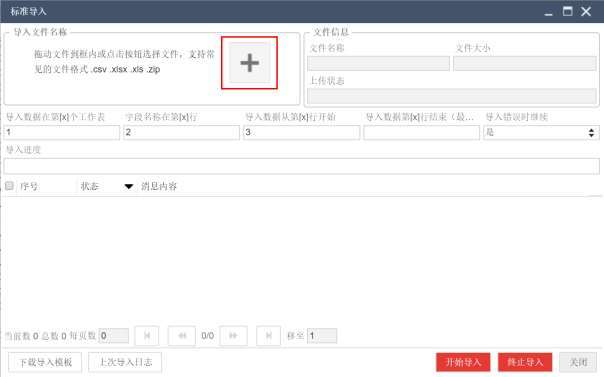

在弹出的文件选择对话框，选择导入文件后，界面会显示文件名称、大小、状态、导入百分比信息，供用户参考。

<!-- 原 PDF 第 53 页 -->

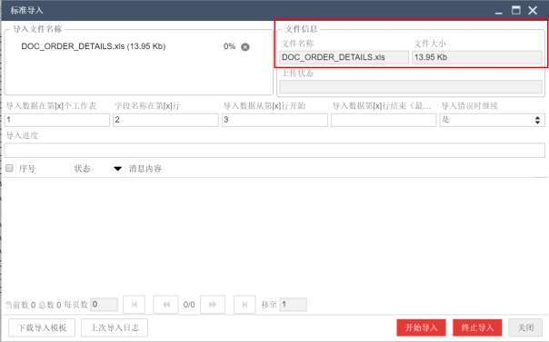

标准导入的文件取值范围已经默认，使用个性化模板，在选择文件确认后，根据文件情况，可以指定导入的页签（即 Sheet，数据表）、名称行，系统导入数据的行范围，标准模板全部记录导入时，可使用界面默认值。

<!-- 原 PDF 第 54 页 -->

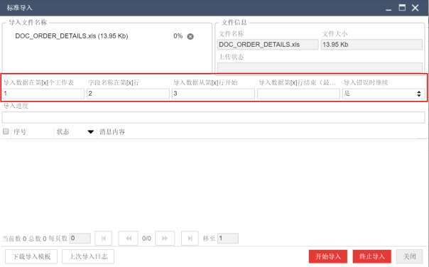

导入数据在第[X]个工作表－导入 Excel文件时的页签指定（即 Sheet，数据表

）。标准模板默认从第一个工作表中取值导入；客户个性化文档可能存在多个工作表，不同页签具有不同内容，仅需要导入指定页签的数据。

字段名称在第[X]行－导入文件中，WMS 表中的字段名所在行。例如下图导入模板，首行是字段说明，第二行才是WMS表字段，因此导入默认字段名称在第2 行。个性化模板中字段行位置不同，需要指定。

导入数据从第[X]行开始－导入文件中，数据所在的起始行。标准导入模板数据从第 3 行开始，但个性化模板，标题行数不同，有些还有额外的表头，需要指定数据所在行。

导入数据从第[X]行结束－导入文件中，数据结束行。有些导入模板，末尾有统计信息，或者类似页脚说明信息、客户文档模板备注等其他信息，无需导入，此时需要指定数据结束行。如果没有此类指定需要，此字段可以为空。

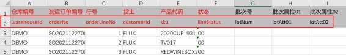

<!-- 原 PDF 第 55 页 -->

导入错误时继续－导入遇到问题或异常（例如导入出库单据明细，但产品档案中无此产品），是否继续导入。配置为是，则跳过问题行，继续导入后续明细行；配置为否，则停止导入，后续行不再处理。

点击【开始导入】按钮，进行数据导入。

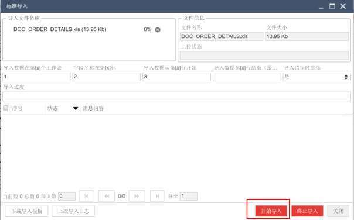

导入完成，界面显示结果记录，包括上传状态，导入进度信息，以及每行明细的导入结果情况：

<!-- 原 PDF 第 56 页 -->

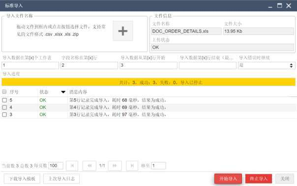

点击【关闭】按钮，可以关闭导入弹窗。

- 日志查看

关闭导入弹窗后，重新打开，可以通过【上次导入日志】按钮，查看导入的明细日志：

<!-- 原 PDF 第 57 页 -->

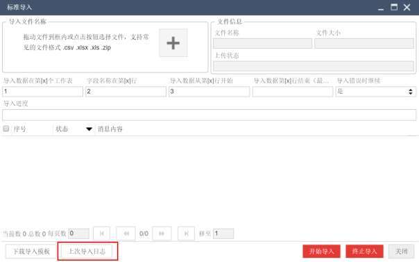

并且支持“状态”内容筛查日志明细：

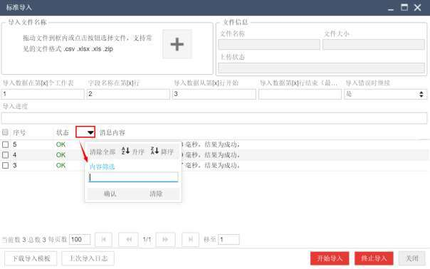

<!-- 原 PDF 第 58 页 -->

- 按规则导出－点击后，二级窗口显示所配置的导出规则。选择规则导出。

- 按规则打印－点击后，二级窗口显示所配置的打印规则。选择规则执行打印。

- 自定义操作－现场自行配置的自定义操作选择。

- 配置导出规则－点击后进入导出规则配置界面。具体配置请参考对应专项说明。

- 配置自定义操作－点击后进入自定义操作配置界面。具体配置请参考对应专项说明。

- 删除私有列配置－调整列表的字段显示次序、列宽等，系统会自动保存并应用。通过此功能项，可以清除个性化设置，恢复到系统默认列表显示。

- **鼠标右键菜单**

在列表页面的窗口部分，点击鼠标右键可见右键菜单。如下为基本每个功能都具有的基础菜单，在不同功能中，还有各自不同的右键功能项，将在对应功能说明中详细介绍。

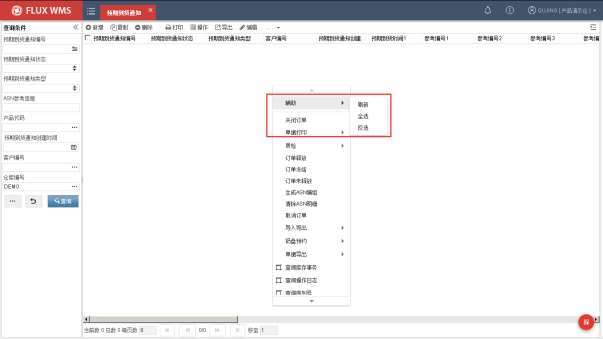

- 辅助子菜单－较为常用的刷新、全选、反选功能，归类为辅助功能项，位于右键菜单顶部，方便用户使用。

- 刷新－按查询条件重新触发查询刷新。

- 全选－界面记录全部选择。

<!-- 原 PDF 第 59 页 -->

- 反选－已选择记录取消选择，未选择记录选中。

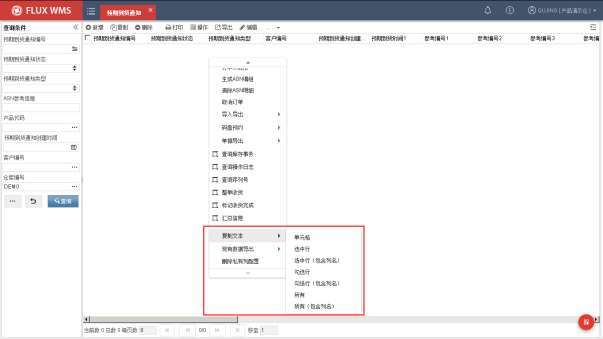

- 复制文本子菜单

作业中有复制记录信息的需要，可以通过复制文本子菜单中的功能项进行信息复制，系统提供不同的复制范围，例如针对某个字段（单元格），或者当前定位的某一行记录（选中行），行前勾选的多行记录（勾选行），或者符合当前查询条件的全部记录。

复制后，需要人工粘贴到其他目的文档中进行显示、保存。

<!-- 原 PDF 第 60 页 -->

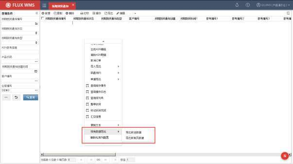

- 现有数据导出

在子菜单中选择导出方式（勾选的某几行记录，或者是符合查询条件的全部记录），点击后系统显示如下二级窗口（不同功能展示的对应导出列字段不同），用户可选择字段导出为文件。

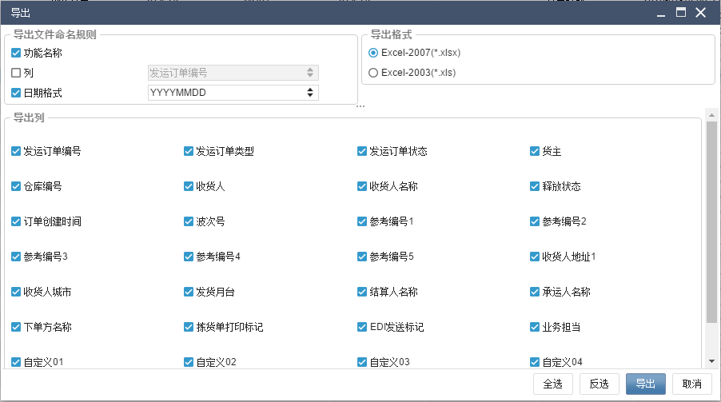

<!-- 原 PDF 第 61 页 -->

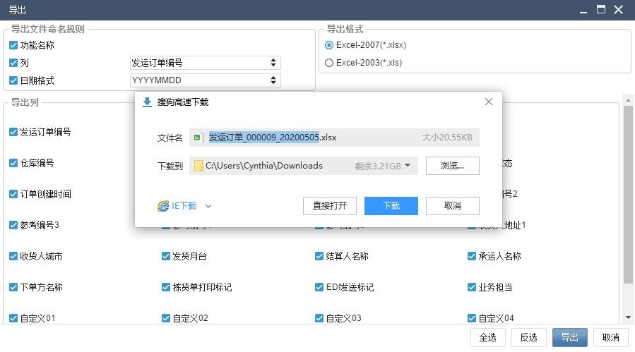

导出文件可以选择为XLSX 格式或者 XLS 格式，默认为 XLSX 格式。但如果记录过多，超过XLSX格式的上限1,048,576行的情况下，会自动转为CSV格式进行导出。

导出文件的文件名，系统提供有限配置，可以选择功能名、日期和当前导出的某列信息的组合。默认为功能名+日期，例如《发运订单_20200505.XLSX》。日期格式可以根据需要选择。

如果限定条件，例如查询某个订单号的信息进行导出，可以在文件命名规则中，勾选“列”并指定具体那列，如下图，选择“发运订单编号”列，显示的文件名中即添加了发运订单编号“000009”，如果查询结果涉及多个发运订单，则取首个订单的订单号作为文件名。

点击【导出】按钮，在弹出窗口中选择具体的保存目录，并确认【下载】（也可以【直接打开】查看文档内容，人工进行保存）：

*图 3-5-52（图像未能从 PDF 对象中直接提取）*

需要说明的是，如果导出数据记录较多时，文件相应较大，网络传输和下载耗时会比较长。系统在配置文件中，设置了自动压缩下载的阈值，如果超过此值，例如 5MB，则自动启用压缩下载，用户下载后解压查看。

具体配置修改，需要由 IT管理人员进行，在服务端《msv5Config.properties》配置文件中，针对 exportZipFileSize阈值进行配置，单位为 MB。

同时在此配置文件中，还有与导出相关的配置项 exportQueryTimeOut，“导出超时设置”，可以针对导出操作，设置单独的超时判断时长，防止异常情况下的数据库连接占用，进而影响其他

<!-- 原 PDF 第 62 页 -->

连接的获取以及程序和数据库性能。

- 删除私有列配置

系统支持用户根据操作习惯，调整列字段排列，并保存设置。如果需要恢复初始字段排列（如应用界面表单方案，则是恢复到方案内容），可以通过右键菜单删除个性化配置，还原显示。

需要注意的是，只有当前存在个性化配置，即私有列情况下，此右键功能才会激活、可用。

- **批量操作标识**

鼠标右键功能中，部分功能支持跨单据的批量操作，部分功能只能针对当前订单操作。为方便区分，系统对支持批量操作的功能，增加了批量操作标识，如下图所示。操作时，可以在订单列表中勾选多个订单，执行右键操作。

子菜单功能的批量操作标识，标记在子菜单中。

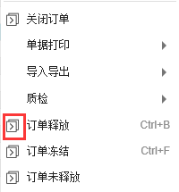

- **更多页签**

在界面右上角，有...模式的更多页签按钮，可以进一步打开其他页签，或者相关明细信息。具体内容在不同功能中显示不同。

<!-- 原 PDF 第 63 页 -->

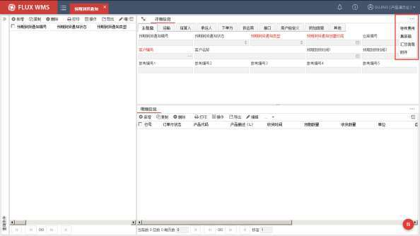

- **隐藏按钮**

查询结果界面，双击记录可以进入到明细显示界面，通过点击导航窗口的箭头按钮，可以隐藏明细界面，即返回到列表显示。

- **通用操作**

通过点击【ESC】键，可以快捷关闭当前功能模块。系统会弹出如下确认对话框，以免误操作关闭界面：

<!-- 原 PDF 第 64 页 -->

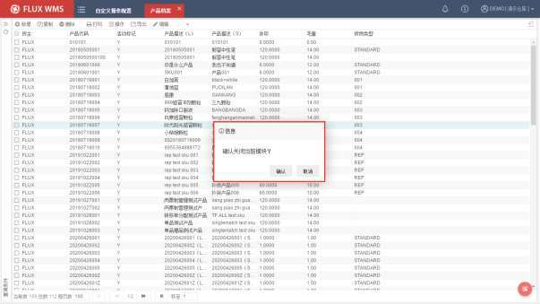

### 3.5.5. 自定义信息

在自定义页签，系统显示用户自定义、备注字段信息。

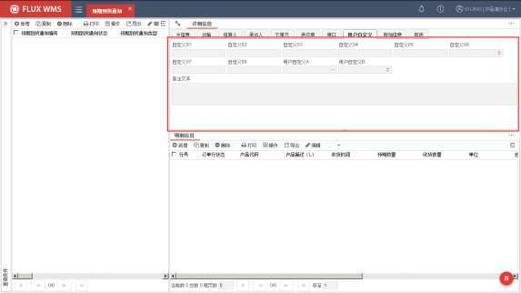

<!-- 原 PDF 第 65 页 -->

### 3.5.6. 版本信息

版本相关信息，是每个功能都具有的、对修改的次数记录，在【其他】页签中显示，每次修改保存后，版本号+1。通常在接口下达时用作更新比较，判断接口记录下达后是否被修改过、与原始接口信息版本是否一致。

此外，在其他页签，还显示记录新增、编辑的人员和时间信息，均为只读显示信息。

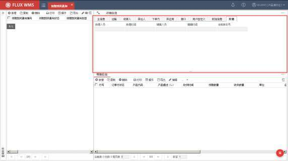

## 3.6. FLUX WMS 初始化配置

对于一个新启用的 WMS 环境，FLUX 顾问会提供管理员账户，需要由管理员进行一系列初始化设置。

设置多级管理员的情况下，可能由总部管理员设置仓库信息，权限设置，后续由仓内管理员设置具体仓内库位、业务规则等进一步信息。

- **用户角色信息**

- STEP1：创建仓库信息

通过【业务系统管理】模块的【仓库信息管理】功能，新建、维护仓库主档信息。具体操作细节可参考《4.6 仓库信息管理》章节介绍。

通常由总部管理员设置，在后续仓库设置、用户权限设置等环节均会使用到。

<!-- 原 PDF 第 66 页 -->

- STEP2：角色设置

通过【业务系统管理】模块的【角色管理】功能，新增角色（即用户组），为角色授权可访问的子系统，例如 WMS 仓储管理系统，或者 DATAHUB 接口平台。

具体操作细节可参考《4.1 角色管理》章节介绍。

- STEP3：角色授权

通过【业务系统管理】模块的【角色授权】功能，为已创建的角色设置具体操作权限。

具体操作细节可参考《4.4 角色授权》章节介绍。

- STEP4：新增用户

通过【业务系统管理】模块的【用户管理】功能，为使用系统的具体操作员创建账户，并设置用户可访问仓库、所属角色。

具体操作细节可参考《4.2 用户管理》章节介绍。

- **仓库信息设置**

多级管理员情况下，通常由仓库管理员根据仓内实际情况进行设置。必备的信息主要有如下 3项，其余工作区、库位组、播种墙等内容，根据业务需要进行设置。

- STEP1：新增区域

通过【仓库设置】模块的【区域】功能，维护仓库下的一级物理划分层次，例如每幢建筑设置为一个区域。

具体操作细节可参考《7.1 区域和库区》章节介绍。

- STEP2：新增库区

通过【仓库设置】模块的【库区】功能，维护仓库下的二级物理划分层次，例如同一建筑内根据用途划分为入库操作区、一楼托盘存储区、二楼隔板货架区。

具体操作细节可参考《7.1 区域和库区》章节介绍。

- STEP3：新增库位

通过【仓库设置】模块的【库位】功能，维护仓库内的库位信息。具体操作细节可参考《7.4库位》章节介绍。

- **业务信息设置**

多级管理员情况下，通常由仓库管理员，根据货主要求、业务管理需要进行维护。通常必备的

<!-- 原 PDF 第 67 页 -->

设置信息有：

- STEP1：包装

通过【基础设置】模块的【包装】功能，维护作业中使用到的包装信息。具体操作细节可参考《6.1库位》章节介绍。

- STEP2：批次属性

通过【基础设置】模块的【批次属性】功能，维护后续产品管理所用的批次属性规则。具体操作细节可参考《6.2 批次属性》章节介绍。

- STEP3：规则

在【业务规则】模块，设置一系列管理所需规则，例如上架规则、库存周转规则等。具体操作细节可参考《8 业务规则》章节介绍。

- STEP4：客户信息

通过【基础设置】模块的【客户档案】功能，维护货主、承运人信息。以及货主默认管理规则、包装、批次属性信息。具体操作细节可参考《6.7 客户档案》章节介绍。

- STEP5：产品

通过【基础设置】模块的【产品档案】功能，维护具体产品信息。包括产品作业所用的管理规则、包装、批次属性等。具体操作细节可参考《6.8 产品档案》章节介绍。

- STEP6：系统代码

通过【业务系统管理】模块的【系统代码】功能，配置进出库单据类型代码等业务所用代码。具体操作细节可参考《4.7 系统代码》章节介绍。

- STEP7：参数开关

通过【业务系统配置】模块的【系统配置参数】功能，根据业务管理要求，配置流程控制开关，例如要求先质检还是先收货，可以具体到每个货主的不同订单类型，在不同仓库内的作业要求设置。具体操作细节可参考《5.1 系统配置参数》章节介绍。

其余功能，根据业务操作需要启用，具体可以参考对应章节的介绍。
