# 4. 业务系统管理

> 来源文件：`富勒WMSV6.2（最全版1119页）.pdf`；原 PDF 第 68-157 页。

> 本文件按原 PDF 正文中的顶层章节拆分；每页保留原 PDF 页码注释，图示按原图注顺序引用。

<!-- 原 PDF 第 68 页 -->

WMS 支持多仓综合管理，因此一些多仓通用的基础设置内容，以及仓库管理相关的内容，集合在【业务系统管理】模块中进行维护。

需要说明的是，由于 FLUX系统，具有 WMS（仓储管理系统）、TMS（运输管理系统）等多个子系统，每个子系统的用户、角色都会在【业务系统管理】功能中进行集中管理配置，因此界面会有部分非 WMS 的信息内容。

仅需要使用 WMS 的环境，可通过界面方案配置，隐藏其余不必要的信息（界面方案配置可参考【4.10界面方案管理】章节的介绍）。

## 4.1. 角色管理

角色可以理解为某一类型的用户，或者理解为用户组，可以用来对不同用户的权限进行分类、分组管理。通过设置不同的用户角色，并给各个角色赋予不同的权限，能够快速的为新增用户配置相应权限，便于管理。

需要提醒的是，具有“用户管理员”身份的操作员，才能新增、编辑角色信息。非用户管理员，仅可进行查看。

- **创建角色**

- 选择主菜单“业务系统管理”下的“角色管理”。

- 在左侧的查询条件栏位，输入查询条件，可查询已有记录。

- 点击【新增】按钮，维护如下角色相关信息：

<!-- 原 PDF 第 69 页 -->

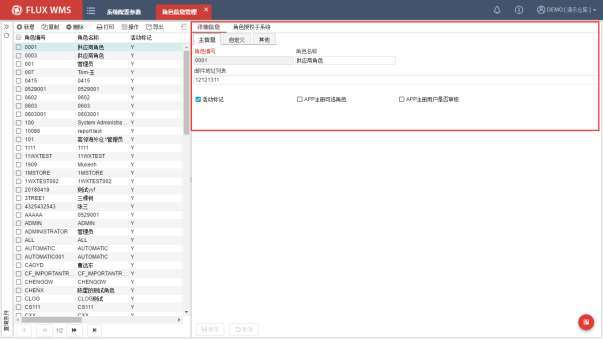

角色编号－角色 ID代码。

角色名称－角色描述。

邮件地址列表－可配置多个邮件地址，通过；进行分隔。

活动标记－是否使用中的有效记录。

APP注册可选角色－TMS 子系统相关配置内容。用户在 TMS的手机 APP上注册账户时，能否选择当前角色。

APP注册用户是否审核－TMS 子系统相关配置内容。用户在 TMS 的手机 APP 上注册的账户，是否需要审核才能生效。

- 点击【保存】按钮，完成角色创建。

- **角色授权子系统**

FLUX 供应链执行软件体系，由多个子系统组成，例如仓储管理系统、运输管理系统等。用户使用环境，根据业务需要，可能独立部署了某一子系统，也可能集成部署了多个子系统。

不同的用户组，可以访问的子系统也有所不同，例如仓库操作员工，只需要访问仓储管理系统；而 IT管理员，需要同时访问系统管理、仓储管理、运输管理、接口平台等多个子系统。

因此在设置角色时，需要对角色可访问的子系统进行授权。在【角色授权子系统】页签，勾选

<!-- 原 PDF 第 70 页 -->

可访问的子系统，保存后，角色下的用户才能登陆相应子系统。

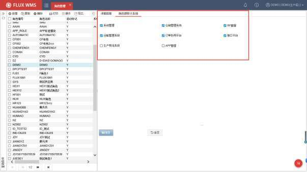

## 4.2. 用户管理

用户，即系统操作员，凡是需要登录系统的员工，均应维护对应用户信息。同一操作账号，不可多人共用、重复登录。

用户管理功能，是提供给系统管理员、用户管理员使用的，用户信息专项管理功能。

### 4.2.1. 用户创建

- **创建用户**

- 选择主菜单“业务系统管理”下的“用户管理”。

- 在左侧的查询条件栏位，输入查询条件，可查询已有记录。

- 点击【新增】按钮，维护如下用户相关信息：

<!-- 原 PDF 第 71 页 -->

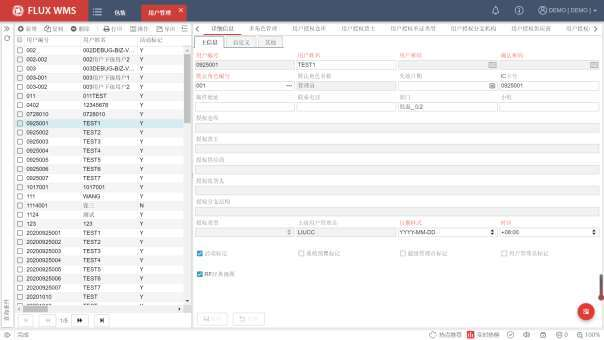

用户编号－操作员 ID。

用户姓名－操作员名称，登陆后前台显示名称信息。

用户密码－该用户的登录密码。保存后不可见，如需重新初始化密码，通过右键菜单 功能修改。

确认密码－用户密码二次确认。

默认角色编号－用户所属角色代码。可点击浏览按钮在二级窗口选择已维护过的角色。

默认角色名称－用户所属角色的描述。根据默认角色编号显示。

失效日期－用户有效截止日期。

IC卡号－用户工卡号码记录。

邮件地址－该用户的 Email地址。

联系电话－该用户的电话号码信息。

部门－该用户的所属部门。

小组－该用户的所属小组。

用户授权信息－用户如有对应的授权仓库、货主等信息，在主信息页签集中展示，方便用户查看。具体设置操作，可参考后续的 4.2.3~4.2.6 章节的对应设置介绍。

<!-- 原 PDF 第 72 页 -->

授权类型－域账号管理模式下，FLUX 系统账号登录验证方式记录。无需界面配置，启用域账号管理，接口从 AD 域、LDAP 服务器同步用户信息到 FLUX系统时，相应写入认证方式，例如“http 协议的 post请求协议”。

上级用户管理员－多层级管理情况下，该用户记录的创建人，也即对该用户具有设置权限的上级用户管理员的账号信息。新增记录时自动记录。

日期样式－用于配置用户所见的日期显示格式。不同国家和地区的国际用户对日期的习惯显示模式不同，例如有些是 yyyy-MM-dd，有些是dd-MM-yyyy。选择所需的显示格式后，界面的日期类型的字段，将按所选格式展示，而后台信息仍旧按统一格式存储不受影响。下拉列表内容在系统代码 GLOBAL_DATE_FORMAT中提供配置。新增记录时显示为对应的默认代码值。

时区－用户所属时区。针对跨时区组织内，可以为不同用户配置不同时区，系统会根据设置自动进行时间显示换算。新增记录时，默认为继承当前创建用户记录的用户管理员所属时区。

活动标记－是否使用中的记录。

系统预置标记－记录是否为系统默认提供的初始化预设记录。初始化记录，不允许通过界面操作删除。

超级管理员标记－仅超级管理员可见此字段，标记此用户记录是否为超级管理员用户。针对超级用户，系统忽略权限设置，全部功能均可见。

用户管理员标记－仅超级管理员可见此字段。此用户记录是否为用户管理员，如是，则此用户可以新增、管理其他用户记录。

RF经典视图－RF 手持终端设备上，登录时菜单界面的默认显示模式。新增用户时，默认为经典视图模式，取消勾选，则显示为九宫格模式的菜单界面。下图左为默认的经典菜单模式，右图则是九宫格菜单模式，所有功能以图标模式展示。

<!-- 原 PDF 第 73 页 -->

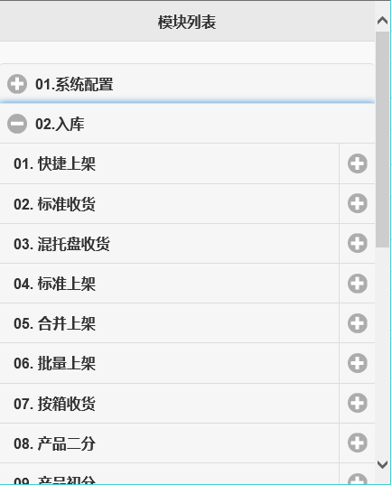

- 点击【保存】按钮，完成用户创建。

### 4.2.2. 多角色维护

部分情况下，有时个别用户会需要具有多个角色的权限。例如现场分为收货组、发货组，分别创建角色，维护用户，具有不同权限。但临时有一个小组，会根据现场工作量，在收货、发货工作间进行支援，需要具有收发2类权限。我们可以单独为这个小组创建一个独立角色，授予更多权限，也可以为这个小组的用户设置多角色，同时具有收货角色、发货角色。

在多角色管理页签，点击新增按钮，新增记录，默认为主信息的用户，在多角色维护页签中，输入用户所属的角色，多个角色各自一行记录。

保存后，用户将具有相应角色的权限。

为方便操作，系统支持在角色选择二级窗口，一次选择多个角色，确认后系统会自动生成多条记录。

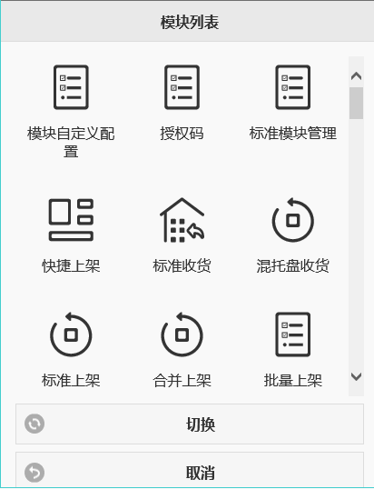

<!-- 原 PDF 第 74 页 -->

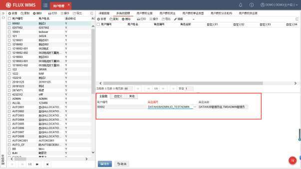

### 4.2.3. 用户授权仓库

不同用户，可以登录作业的仓库设置不同。例如北京仓的员工，只能登录北京仓库，但无权登录上海仓库进行操作。然而库存调拨管理员（非 ERP 管理情况下）则需要查看到北京、上海仓库的库存情况。

通常情况下，跨仓角色，不会负责具体的收发货等实际操作，此类控制会在功能权限环节控制。但对于用户可以访问的仓库，也即可访问的数据权限，需要单独进行授权。由于用户作业的物理地点属于必备信息，因此一般不会存在用户或者角色自动具有全部仓库权限的情况，需要通过授予获得仓库操作权限。

- **用户授权仓库**

- 针对已创建的用户，选择“用户授权仓库”页签。

- 点击页签内的【新增】按钮，为当前用户指定可登录的仓库。

<!-- 原 PDF 第 75 页 -->

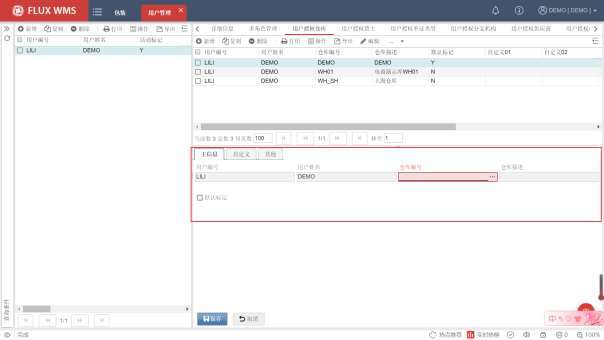

- 通过“仓库编号”字段的浏览按钮，在二级窗口中可以查询、选择可授权的仓库，系统会过滤掉已经被授权的记录，仅显示可以添加授权的仓库记录。支持多选，确认后系统会自动生成多行授权。

- 如果勾选“默认仓库标记”，则此仓库记录作为登录时的默认仓库，用户登录时无需选择仓库。

- 点击【保存】按钮，完成此仓库的授权。

### 4.2.4. 用户授权货主

多货主作业的仓库中，不同操作岗位，根据管理需要，可以操作的货主范围有时会有不同。例如有的作业现场，作业岗位按操作维度划分，如收货岗位，发货岗位，对应操作用户会具有库内全部货主的操作权限。而另一部分作业现场，采用责任制管理，一个小组的多位成员或者一位成员对口负责一位或者多位货主的全程作业，即作业用户只操作自己具有权限的货主。

对于不限制货主操作的用户或角色，无需设置货主授权。即不指定授权，等于对所有货主具有操作权限。当然具体可以进行哪些业务操作，要进一步根据仓库授权、功能授权进行限定。

在需要进行货主授权的作业环境中，用户在已有权限的功能中，可以查看到具有货主权限的货主对应数据记录。

在新增用户时，通常会继承当前用户管理员的数据权限，再在此范围内进行权限删减。例如用

<!-- 原 PDF 第 76 页 -->

户管理员具有 3 个货主的权限，则他所新增的用户，最多也只能具有这 3 个货主的权限，而无法超范围授予第 4个货主权限。

- **用户授权货主**

- 针对已创建的用户，选择“用户授权货主”页签。

- 点击页签内的【新增】按钮，为当前用户指定一个可操作的货主，使得用户对此货主具有操作权限。

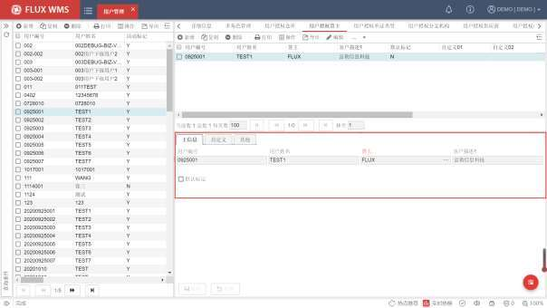

- 如勾选“默认标记”，所选择货主将作为此用户操作时的默认货主。

- 点击【保存】按钮，完成货主授权设置。

### 4.2.5. 用户授权单证类型

有些仓库作业中，操作团队会根据不同的作业流程进行分组，以便更好的提升作业效率。例如一个团队负责正常收货，另一个团队负责退货收货。

此类情况，可以为不同用户配置单证类型授权，用户只能查看、操作具有授权的单证类型。如果不需要限定可作业的订单类型，则无需专门授权，默认为可操作全部单证类型。

具体能够进行何种操作，则根据功能授权细节限定。

- **用户授权单证类型**

<!-- 原 PDF 第 77 页 -->

- 针对已创建的用户，选择“用户授权单证类型”页签。

- 点击页签内的【新增】按钮，为当前用户指定可操作的单证类型。

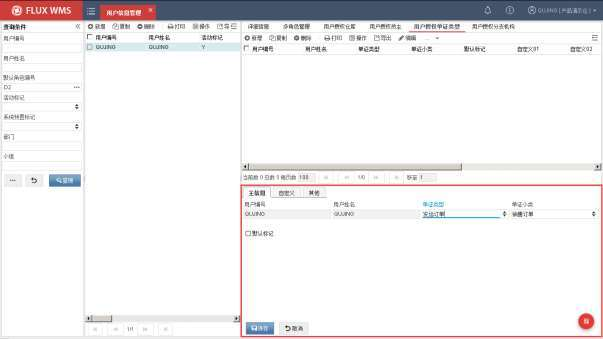

- 如勾选“默认标记”，所选择单证类型将作为用户新增单据时的默认类型。

- 点击【保存】按钮，完成此单证类型的授权操作。

### 4.2.6. 用户授权分支机构

“用户授权分支机构”页签用于配置用户在当前组织的架构中，所属分支机构信息。

在分级授权管理体系中，“是否相同部门”，即通过是否属于同一分支机构进行判断。

- 针对已创建的用户，选择“用户授权分支机构”页签。

- 点击树形架构，为当前用户指定对应的分支机构。

<!-- 原 PDF 第 78 页 -->

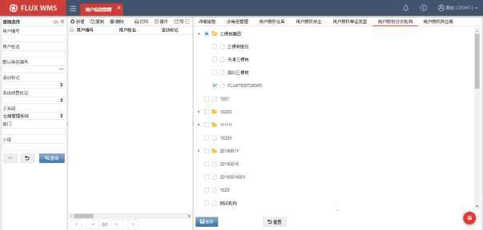

- 点击【保存】按钮，完成用户所属分支机构的设置。

### 4.2.7. 用户授权供应商

运输管理系统中，对用户可操作的供应商也需要加以设置，因此会用到【用户授权供应商】，操作模式同授权货主等，新增后，通过浏览按钮选择已维护的供应商，可多选，确认后系统生成多行授权记录。

对于仓储管理系统用户，用户授权供应商，通常是为了配置供应商用户操作预约的权限，只能看到自己对应采购/入库单据，因此用户授权供应商配置之后，在【预约】模块的【供应商预约-按PO】、【供应商预约-按 ASN】功能中，仅能查询到具有权限的供应商的单据。

### 4.2.8. 用户授权收货人

运输管理系统中，门店用户需要操作收货确认，同时用户存在门店间流动安排的情况，因此需要基于用户进行收货人授权。在“用户授权收货人”页签，对用户可操作的收货人进行选择、确认，生成授权记录。

### 4.2.9. 分级授权管理

多级管理模式下，比较常见的操作模式是集团 IT部门，为各个仓库/分公司的 IT部门或 IT责任人授权，各个仓库的责任人再为本仓库/分公司创建具体操作员工账号并授予权限。但所下发的权限，需要在自己所具有的权限范围内，超过范围的权限不能下发给操作用户。

<!-- 原 PDF 第 79 页 -->

因此系统采用三级管理模式，支持分级授权管理。

- **超级管理员**

可将集团 IT部门成员，设置为超级管理员。超级管理员无角色所属，不需要授权，也无 上级从属关系，自动具有全部功能权限。

超级管理员负责建立各仓库的系统管理员（即用户管理员），并为用户管理员授予系统管理的权限以及仓库、货主等数据权限。

系统初始化时，会设立一个超级管理员账户，并通过此账户，创建其他超级管理员账户。

创建新的用户账户后，通过鼠标右键功能菜单“授予超级管理员”，可将指定用户设置为超级管理员。

相应地，通过鼠标右键功能菜单“取消超级管理员”，可去除指定用户的超级管理员身份权限。

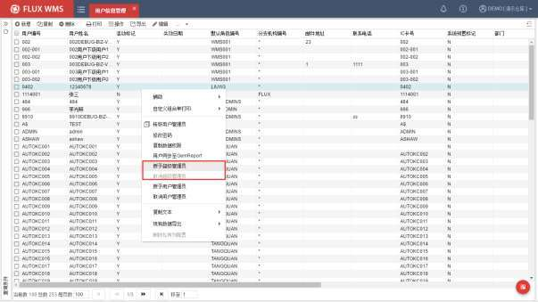

- **用户管理员**

- 权限管理

各地区、各个仓库的系统管理员，由超级管理员，通过鼠标右键功能【授予用户管理员】来设置为用户管理员。也可以同样通过鼠标右键功能【取消用户管理员】来去除设置。

用户管理员账户所属的角色，以及角色具有的权限，由超级管理员设置，一个用户管理员，可

<!-- 原 PDF 第 80 页 -->

以具有多个角色，多个仓库、货主访问权限。

用户管理员负责创建各个具体的用户账户，并为用户授予角色、仓库、货主权限。但所能授予的范围，只能在自己已有权限范围内进行权限下发。例如用户管理员自己 A\B\C这3个角色。那么他为新用户配置角色时，二级窗口只能查询到 A、B、C这 3个角色的记录，并只能从其中进行选择。

为方便操作，新增操作用户记录时，默认继承用户管理员的仓库、货主和单证权限，然后管理员再进一步删除不必要的授权。

- 用户查看

由于用户管理员是各个仓库分别设置，仅管理本仓用户，因此对用户管理员可查看、管理的用户记录加以限制。

新增用户记录时，每个用户记录会有从属的“上级用户管理员”。为方便管理，同一个 IT部门的多个用户管理员，可以相互看到对方创建的用户记录，以便统一管理，避免上级用户管理员不在，即无法对用户记录进行维护的情况。

系统通过“分支机构”来设置所属部门，同一个分支机构内（注意不是同一级，同级可以有多个分支机构，例如多个同级的不同仓库），即为同一部门。

因此用户管理员查询用户记录时，可以查看到“上级用户管理员”是自己的用户记录，也可以查看到“上级用户管理员”是自己部门其他用户管理员（例如同一仓库的多位系统管理员）的用户记录，并对其进行管理维护。

- 用户管理员迁移

由于存在用户管理员变更的情况，例如 A仓的用户管理员调任到 B仓，此时用户管理员不再具有A 仓用户的管理权限，因此要对原本从属于此用户管理员的用户记录，变更所属。

用户管理员迁移，应由超级管理员负责操作。查询到用户管理员记录后，通过鼠标右键功能“转移用户管理员”，在弹出的二级窗口中，选择新的用户管理员，则原所属的用户记录对应的“上级用户管理员”更新为所选的新的用户管理员。例如将小张的用户管理员转移给小李，则原本小张创建的 20个操作用户记录，所属“上级用户管理员”变更为“小 李”。

- **操作用户**

【用户管理】功能，正常情况下，只会授权给用户管理员进行操作。普通操作用户无需授予此功能权限。

<!-- 原 PDF 第 81 页 -->

### 4.2.10. 其他右键功能

- **修改密码**

用户设置后，操作用户可以凭初始密码，自行通过【业务系统管理】模块的【用户密码修改】功能修改登录密码。而在用户管理界面的初始化密码，一旦保存，界面不可见。因此管理员也无法查看到用户所用密码。

但如果用户遗忘密码无法登录、无法自行修改密码的情况下，需要由管理员进行密码修改，此时可以通过鼠标右键菜单功能【修改密码】，在弹出的对话框中录入并确认新密码：

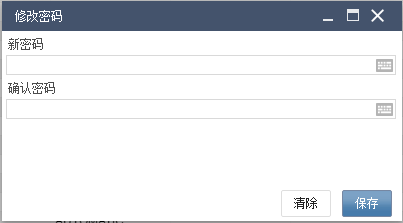

- **复制数据权限**

用户管理中，需要维护一些数据权限内容，例如用户授权仓库、用户授权货主、用户授权单证类型等。如果每个用户需要授权的内容比较多，同时维护的用户记录也很多的情况下，配置操作工作量会比较大。

为了方便管理员配置，系统提供了【复制数据权限】功能。

选择某个已经配置好数据权限的用户，作为样本记录。点击鼠标右键，选择【复制数据权限】功能，系统弹出如下用户选择二级窗口，在对话框中，选择需要更新权限的目标用户记录，可以多选。

<!-- 原 PDF 第 82 页 -->

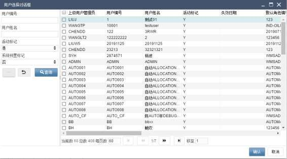

选择后，点击【确认】按钮，系统将样本用户的数据授权内容，以覆盖的模式，复制给所选择的多个用户。目标用户的原有数据授权内容，不再保留。

- **相关参数**

角色管理功能相关的参数有：

参数 ID 参数描述 对应说明

DATA_UPDATE_LOG 系统数据更新日志 开启后，将记录用户管理功能的详细操作日志。

## 4.3. 业务功能

系统的主菜单内容，可以根据业务需要进行调整，甚至新增一些自定义功能。这些设置，可以在【业务功能】中进行配置。

需要注意的是，这种配置是公共配置，而不是表单方案这样的私人配置，所做修改将影响此组织 ID下的全部用户。

- **业务功能**

- 选择主菜单“业务系统管理”下的“业务功能”。

- 在左侧的查询条件栏位，输入查询条件，可查询已有记录。

<!-- 原 PDF 第 83 页 -->

- 在如下界面，左侧的导航窗口部分，点击某一功能，再点击【新增同级】按钮，可以在主信息页签，维护新增功能的相关信息。或者选择已有功能，进行自定义配置：

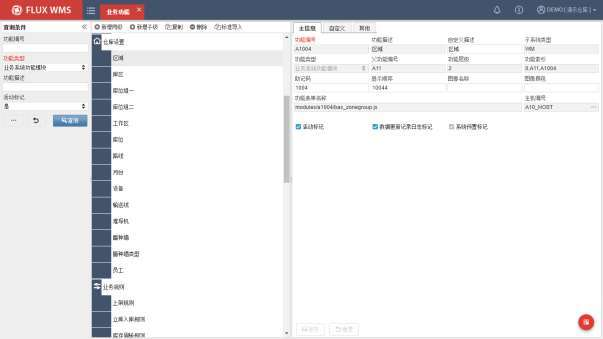

功能编号－功能 ID代码。保存后不可编辑。

功能描述－默认显示的功能名称，不可修改。

自定义描述－如有输入信息，则界面显示自定义描述。

子系统类型－功能类型。默认 WM 即仓储管理系统对应功能。

功能类型－功能所属分类，下拉列表选项提供：系统管理功能模块、业务系统功能模块、系统管理对话框、业务系统对话框、RF 系统功能模块供选择。

父功能编号－所从属的上级功能的功能 ID。内容由系统默认，不可编辑。新增同级情况下，与原记录从属同一个父功能，新增子级情况下，父功能即原记录。例如“区域”功能，位于“仓库设置”模块中，所属父功能编号，即“仓库设置”的功能编号“ A11”。

功能层级－功能所属级别。主菜单项（例如“仓库设置”）为 1级，主菜单功能（例如“区域”功能）为 2级，后续依次类推，由系统根据所属父功能默认生成，不可编辑。

功能索引－索引信息，由系统生成，不可编辑。

助记码－主菜单功能检索时可直接输入助记码进行查询。助记码内容用户可以自行配置。

显示顺序－菜单中功能显示顺序的排序字段。

<!-- 原 PDF 第 84 页 -->

图像名称－可配置功能图标的图片名称。

图像颜色－可配置功能图标的图片显示颜色。

功能表单名称－功能模块对应的程序代码，标准功能对应内容不可编辑。

主机编号－多主机分布式部署情况下，此功能的对应主机信息。通常由安装系统的技术人员根据需要指定。

活动标记－是否使用中的记录。

数据更新记录日志标记－此功能，是否进行数据更新日志记录。如勾选，用户可以在“数据更新日志”功能中，查看到此功能数据变更操作的详细日志信息。例如产品档案，将“产品组 1”字段内容由 A修改为 B的操作日志。但数据更新日志记录信息比较大，对服务器性能、存储空间要求会相对比较高，因此默认不开启，现场根据作业需要再相应开启。参数修改、业务规则等关键信息修改，均支持数据更新日志记录。

系统预置标记－记录是否为系统默认提供的初始化预设记录，此字段界面不可编辑。即标准功能，勾选系统预置标记；个性化功能，则未勾选此字段。

- 点击【保存】按钮，完成业务功能信息维护

- 通过【新增子级】按钮，可以设置下一级功能信息。

- **右键功能**

- 系统操作定义

点击后，显示当前定位功能的相关操作功能点清单，也即功能权限清单。

<!-- 原 PDF 第 85 页 -->

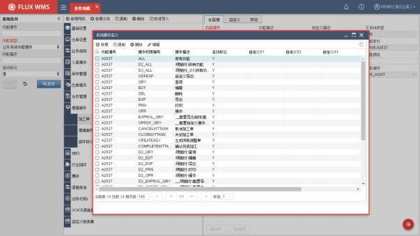

- 菜单迁移

现场如果希望变更系统默认提供的菜单从属结构，例如把“ABC动态分析”功能从主菜单的“库存管理”模块，变更到“增值服务”模块中，可以通过鼠标右键功能“菜单迁移”进行操作。

在点击定位所需变更从属的功能后，点击鼠标右键功能“菜单迁移”，系统显示如下菜单模块选择对话框：

<!-- 原 PDF 第 86 页 -->

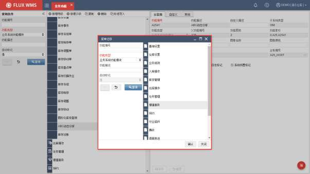

通过查询显示菜单模块后，选择需要加入的模块，并点击【确认】按钮确认，系统即将功能迁移到所选模块中：

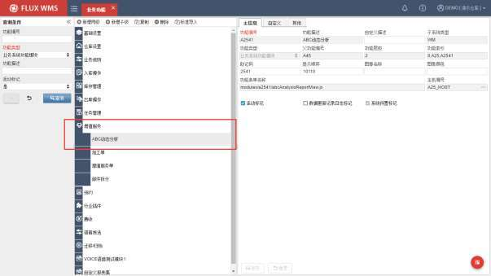

<!-- 原 PDF 第 87 页 -->

## 4.4. 角色授权

系统在角色管理的基础上，能够给不同角色赋予不同的作业权限。需要提醒的是，具有“用户管理员”身份的操作员，才能角色授权相关修改操作。非用户管理员，仅可进行查看。

- **权限授予**

- 选择主菜单“业务系统管理”下的“角色授权”。

- 输入或者二级窗口选择角色，点击【查询】按钮，界面显示如下角色可配置权限项

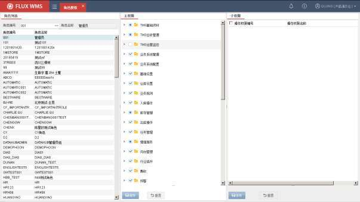

- 在左侧的导航窗口，可以看到与主菜单相同的功能模块内容，角色具有权限的功能，已勾选。

- 点击导航窗口中的任意功能，右侧窗口显示此功能的对应全部功能明细项，即子权限内容，同样以树状结构显示，可以进一步勾选、细化授权。

- 选择完成后点击【保存】按钮，保存授权设置。

- 角色授权配置成功后，用户可在“用户管理”模块中配置角色相关用户，详见【4.2用户管理】章节的介绍。

- **其他功能**

- 复制权限

<!-- 原 PDF 第 88 页 -->

现场为多个角色进行授权时，由于涉及到功能权限项比较多，每个角色逐一配置，工作量较大。因此系统提供了【复制权限】功能，可以给新角色批量授权，然后在复制得到的权限项基础上，人工添加、删改，得到这个新角色的自有权限内容。

操作时，选择某个已经配置好权限的角色，作为样本记录。点击鼠标右键，选择【复制权限】功能，系统弹出如下复制对象选择二级窗口，在对话框中，查询、选择需要更新权限的目标角色记录，可以多选。

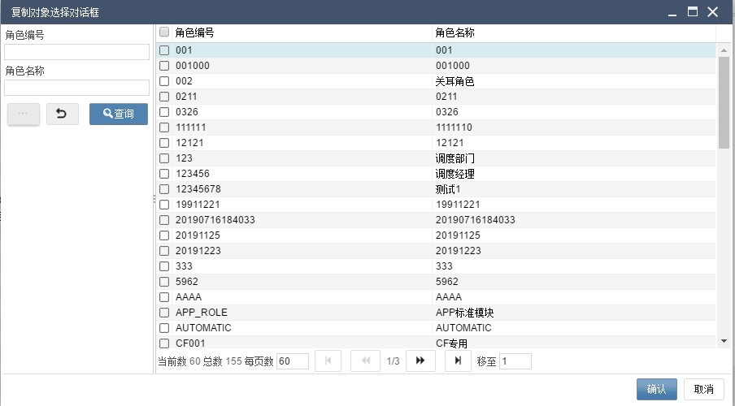

选择后，点击【确认】按钮，系统将样本角色的授权内容，以覆盖的模式，复制给所选择的多个角色。目标角色的原有授权内容，不再保留。

- **相关参数**

相关的参数有：

参数 ID 参数描述 对应说明

DATA_UPDATE_LOG 系统数据更新日志 医药行业参数，开启后，将记录角色授权功能的详细操作日志。

<!-- 原 PDF 第 89 页 -->

## 4.5. 主机信息

主机信息是安装部署环境的相关信息，在多应用服务器部署环境中，不同的模块可以部署在不同的服务器上。具体配置由系统维护专员进行管理。

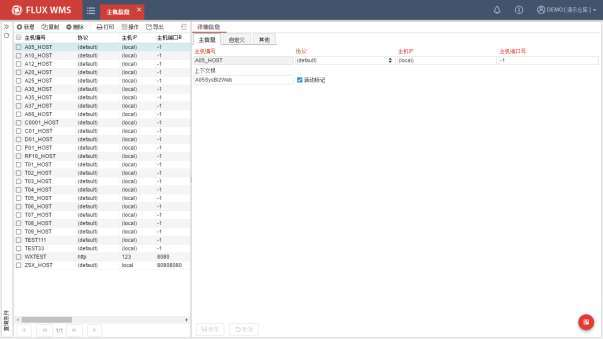

## 4.6. 仓库信息管理

仓库是 WMS 系统管理的关键元素之一，系统需要区分同一组织下的不同仓库，并在每个仓库内分别进行独立管理，可以实现各自不同的库位布局、不同的操作要求以及流程管理。因此仓库信息维护，也是后续其他库位信息、管理要求信息维护的基础。

- **仓库设置**

- 在主菜单“业务系统管理”下选择“仓库信息管理”。

- 点击按钮栏的【新增】按钮，在“主信息”页签依次输入以下信息：

<!-- 原 PDF 第 90 页 -->

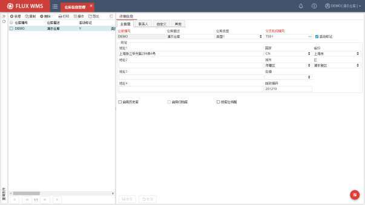

仓库编号－仓库代码。

仓库描述－仓库名称描述。

仓库类型－类型配置。

分支机构编号－仓库所属的、组织层级中对应的分支机构的代码，可通过浏览按钮选择对应分支机构。所选择的分支机构内容，需要提前在【组织结构管理】功能中进行维护。

活动标记－是否使用中有效仓库档案信息。

地址信息－用来维护仓库所属国家、省份、城市、区、街道等详细地址信息。国家、省份、城市、区、街道下拉框字段值联动关系。例如选择国家后，省份下拉框才会初始化所选国家对应省份信息。国家、省份、城市、区、街道信息如需修改、维护信息，请联系 FLUX顾问。

启用历史库－归档时，此仓库数据是否要归档到历史库中。

启用归档库－归档时，此仓库数据是否要从历史库归档到归档库中。只有当“启用历史库”已勾选，才能勾选“启用归档库”。归档处理相关说明，请参考归档相关设置（5.8【迁移归档规则】相关章节）

按库位预配－仓库是否启用“按库位预配”，即分配库存锁定到库位，但不到跟踪号的分配模式。需要在新仓库启用，不能在作业途中切换。适用于 大库位（平仓、多伸位）管理

<!-- 原 PDF 第 91 页 -->

仓库中，只需要系统指派拣货的库位，最终以拣货员实际扫描的托盘跟踪号为准的作业场景。

- 点击【保存】按钮，完成仓库主信息维护。

- 选择“联系人”页签，可以进一步完善仓库相关联系人的信息。

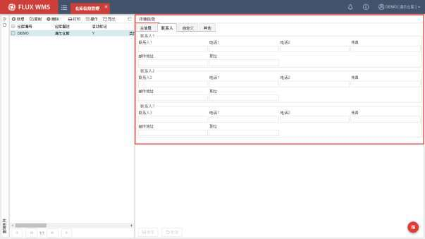

- **Logo 设置**

仓内作业时，经常需要打印各种内部使用，或对外提供的单据。例如内部使用的上架清单、拣货清单，提供给货主的入库报告、出库报告，给货运司机的装车清单等。

单据上可以根据需要加载指定的图片，可以是整个企业的Logo，也可以是代表仓库的印章等。企业级 Logo在【系统界面客户化配置】功能中设置，即整个系统层级的设置；仓库各自不同的Logo，在此功能中，通过鼠标右键【Logo 设置】功能进行配置；每个货主各自不同的打印Logo要求则在【客户档案】功能中设置。

通过点击鼠标右键功能项【Logo 设置】，系统显示如下配置界面：

<!-- 原 PDF 第 92 页 -->

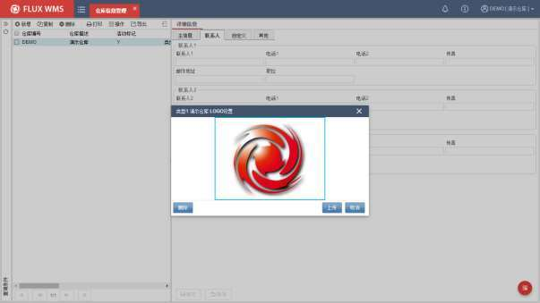

点击【上传】按钮，在弹窗中通过【+】按钮选择文件（支持 JPG 格式图片文件），确认后上传：

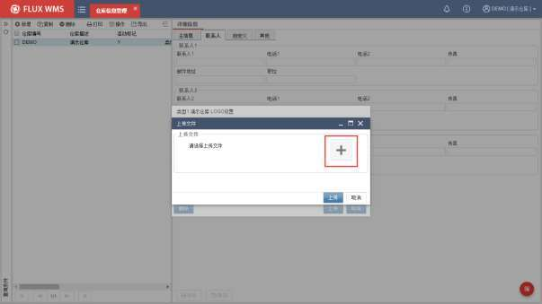

每个仓库只能上传一张图片作为 Logo 使用。后续上传图片将覆盖之前上传的图片。

<!-- 原 PDF 第 93 页 -->

所上传的 Logo，在打印模板配置时，可以作为图片元素，拖拽到打印界面指定位置使用。

## 4.7. 系统代码

系统代码是 FLUX WMS 基本控制要素之一。FLUX WMS 的界面上包含了很多下拉式菜单或默认的数据。在这些下拉式菜单含有的选项来自 FLUX WMS 的系统代码。

有时用户可能需要增加一些在目前的代码列表中没有的代码项目。在这种情况下，需要在增加代码前，先创建一个新的列表。但是在没有 FLUX顾问的帮助下，用户最好不要创建新的列表。

一些下拉式列表的默认值是用户可以选择和定义的，如国家、货币的类型等。但值得注意的是，利用系统代码增加带有相应业务逻辑的下拉式列表选项，并不一定在用户的业务中有效。例如，在下拉式列表中增加的一种上架策略并不能使系统执行对应任务。因此用户如果有这方面的需要，请联系 FLUX顾问。

- **系统代码设置**

- 在主菜单“业务系统管理”下选择“系统代码”。

- 点击按钮栏的【新增】按钮，在“主信息”页签依次输入以下信息：

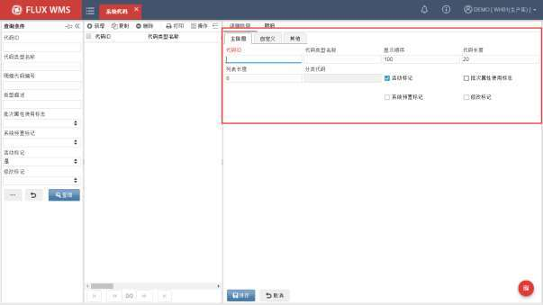

代码 ID－系统代码所属类型 ID。

<!-- 原 PDF 第 94 页 -->

代码类型名称－代码类型描述。

显示顺序－排序用字段。

代码长度－此类型下，新增代码的最大长度限制设置。

列表长度－此类型在相关功能中，下拉列表默认显示的记录数。

分类代码－代码明细根据不同情况分类显示，在此字段指定分类所用的系统代码。

活动标记－此类型代码是否使用。

批次属性使用标记－此类型代码是否作为批次属性值供下拉框选择使用。

系统预置标记－是否系统提供的初始化记录。系统预置标记系统代码不允许删除。

修改标记－此系统代码是否允许用户添加明细代码。

- 点击【保存】按钮，完成代码类型维护。

- 在明细页签，进一步维护此类型下的具体代码。

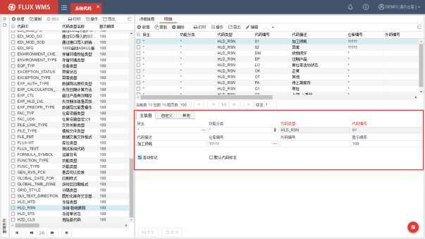

货主－限定货主使用代码，需要配置对应货主代码。例如只有 A 才有“加工损耗”情况，则此记录可以配置为 A货主的限定代码，其他货主的对应下拉列表中不显示“加工损耗”这一项。货主为*则为公共记录，不限定客户。

功能分类－使用此代码的分类信息。下拉列内容，根据表头“分类代码”对应明细显示。

<!-- 原 PDF 第 95 页 -->

例如 RSN_COD 原因代码中，功能分类为 ASN的是收货相关原因，在冻结操作环节的原因下拉列表中就不会显示，仅能查看到功能分类是 HOLD 冻结的对应原因选项。详情可参考后续的“功能分类实例”介绍。

代码类型－代码所属类型。即系统代码 ID。

代码编号－代码值。也即代码明细选项对应 ID。

代码描述－代码描述信息。界面下拉列表中显示的内容。

仓库编号－代码生效的指定仓库，可以用来配置个别仓库的独有代码明细值。为 *则是各个仓库可使用的公共代码。

外码编号－不同货主下拉列表内容不同，但要求使用相同代码 ID进行接口传递情况下，用于接口信息的 ID。

显示顺序－此代码在下拉列表中的排序。

活动标记－记录是否使用。

默认代码标记－此记录是否为此代码的默认代码值。例如发运订单，默认订单类型是“CM”普通订单，即将发运订单的订单类型代码中，CM 代码配置为默认代码，手动新增发运订单时，默认为 CM 订单类型。

- 点击【保存】按钮，完成代码设置。

- **功能分类实例**

- 原因代码

系统提供一些默认的原因代码选择，但在不同的作业环节，所选的原因代码会有所不同。因此系统的原因代码可以根据需要针对不同功能进行配置。

代码 ID为 RSN_COD，在对应的明细部分，通过分类设置，配置代码在哪个功能中生效。设置内容为：

ASN 入库（收货）：功能分类=ASN

ASN 上架：功能分类=PUTAWAY

库存移动：功能分类=MOVE

库存冻结：功能分类=HOLD

库存转移：功能分类=TRANSFER

库存调整：功能分类=ADJUSTMENT

<!-- 原 PDF 第 96 页 -->

拣货确认：功能分类=PICK

公用（全部界面有效）：功能分类=CM

## 4.8. 数据字典

数据字典是系统后台数据表的结构信息，相关 IT管理人员可以参考数据字典信息，自定义配置各种系统查询条件、界面展示、报表、看板、自定义功能等。数据字典也是 FLUX WMS 系统强大的可配置性的基础支持之一。

需要注意的是，目前系统并不支持在数据字典中直接添加表、字段（即从系统界面添加记录，不会自动创建数据库内容）。而是需要在数据库中先行添加表、字段，然后再到数据字典中对所添加的内容进一步配置对应信息。

- **数据字典查看**

- 在主菜单“业务系统管理”下选择“数据字典”功能。

- 查询条件部分，根据需要输入条件，系统显示数据表相 关主要信息：

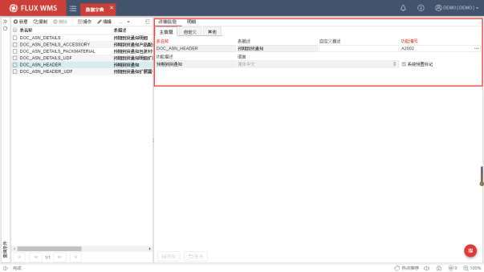

表名称－数据库中的表名。

表描述－系统提供的默认表名描述，会根据当前登录语言对应显示，不可修改。

<!-- 原 PDF 第 97 页 -->

自定义描述－当前登录语言下，显示的表描述。如果未配置则界面显示默认表描述内容。

功能编号－与此表相关的功能代码。

功能描述－与此表相关的功能名称。

语言－当前登录语言信息。只读显示。

系统预置标记－此记录是否系统提供的初始化记录。预置记录不可删除。对于自定义添加的、非预置记录，可以通过【删除】按钮删除。

- 如果修改表名描述，点击【保存】按钮完成设置。

- 在“明细”页签，可以进一步查看表内的具体字段信息：

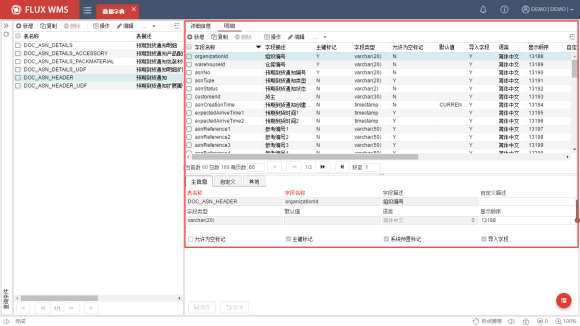

表名称－数据库中的表名。

字段名称－数据库中的字段 ID。

字段描述－系统提供的默认字段描述，会根据当前登录语言对应显示，不可修改。

自定义描述－当前登录语言下，显示的字段描述。如果未配置则显示默认表描述内容。

字段类型－数据库中的字段类型信息。

默认值－数据库中的字段默认值设置内容。

语言－当前登录语言信息。只读显示。

<!-- 原 PDF 第 98 页 -->

显示顺序－字段的显示次序。

允许为空标记－该字段是否允许为空。

主键标记－此字段是否是表主键字段

系统预置标记－此字段是否系统提供的初始化记录。如是预置字段，则不可删除。

导入字段－通过 Excel文档标准导入时是否作为可导入字段。

- 点击【保存】按钮完成自定义设置。

- **其他功能**

- 字段筛选

一个数据表中，会有很多字段，不熟悉的情况下，逐一查看，找到所需的字段效率比较低。系统提供了【字段筛选】功能，可以方便筛选、查找所需的记录。

列表窗口，哪些列可以用来筛选，通过界面方案配置可以自行添加（具体配置操作可参考【4.10界面方案管理】章节的介绍）。系统默认提供“字段名称”列的筛选。

如下图，在列头字段名称后点击 按钮，会弹出内容筛选对话框。输入内容条件后，在当前数据表范围内，查找并显示符合条件的字段明细记录，可以通过【升序】、【降序】按钮，变更筛选出的多行记录的显示顺序。

筛选结束，可以再次点击字段列头的筛选符号，在弹出的对话框中，【清除】筛选条件，如下图所示，然后点击对话框范围之外的任意位置，回到明细页签的初始显示模式。

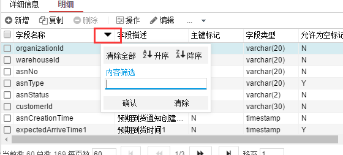

<!-- 原 PDF 第 99 页 -->

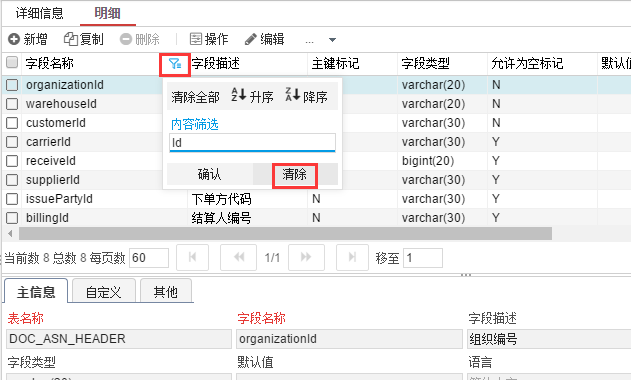

- 字段筛查

明细页签列表字段列名的筛选，针对当前数据表内的字段进行筛选。如果不能确认所需的字段在哪张数据表中存在，可以通过跨表的【字段筛查】功能进行查找。

通过点击鼠标右键菜单功能项【字段筛查】，系统显示如下筛查对话框界面，录入字段名称、字段描述等查询条件，点击【查询】按钮，系统显示所有符合条件的、各个表中的对应字段信息。

<!-- 原 PDF 第 100 页 -->

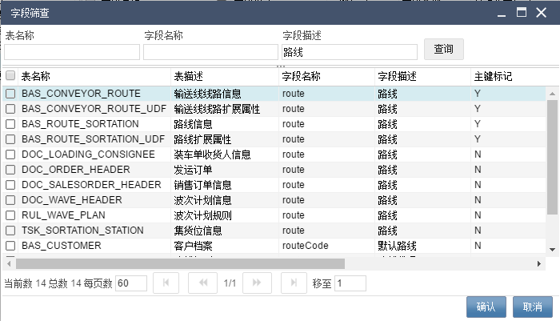

选择某行记录确认后，系统会自动把表名带入到数据字典功能的查询条件中，以便查询显示此数据表的相关全部内容。

需要注意的是，如果此时查询条件界面，原本已有其他查询条件内容，例如“表描述”条件字段中有“预期”，而带入的“表名称”对应表，描述信息中不含有这个字段内容信息，会导致查询不到同时符合这些条件的记录，即查询条件冲突导致查询结果为空。需要操作者自行调整查询条件内容。

- 翻译

通常情况下，登录时选择哪种语言，所做的各类描述配置，将保存为此语言的多语言信息记录。例如登录为英文语言环境，然后在数据字典中，自定义描述字段录入的内容，将作为英文语言环境的多语言信息记录。

初始配置新语言对应描述时，也经常会采用导入语言包的模式在系统部署时导入（具体导入处理请咨询FLUX 顾问）

但日常操作时，管理人员有时需要维护一些内容的多语言信息，内容不多，不需要重新导入语言包，但可能同时涉及多个语言环境都需要修改。此时逐一在不同语言环境下重新登录、维护信息，操作比较麻烦。因此系统提供了跨语言环境的【翻译】功能。

在列表界面，点击右键【翻译】功能后，系统显示如下语言选择弹窗，供用户下拉选择需要维护的对应语言（仅针对已加载语言包的语言提供选择）：

<!-- 原 PDF 第 101 页 -->

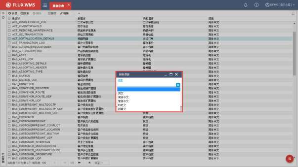

选择后，系统增加一列对应语言的翻译信息列，用户可以直接在列表中维护，回车/光标跳转后自动保存：

数据字段中提供表名维护，其余字段名等内容，可在【多语言文本管理】功能中相应维护。

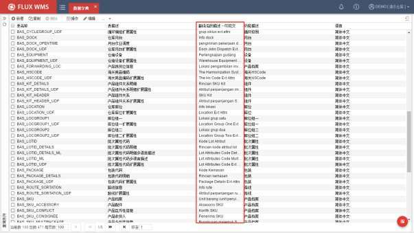

<!-- 原 PDF 第 102 页 -->

## 4.9. 多语言文本管理

FLUX WMS系统，支持不同语言环境下的使用，因此对多语言有全方面的支持。并且同一语言下，不同地区的显示需求也很可能不同（例如 Pallet，一个地区习惯叫托盘，另一个地区习惯叫栈板），因此系统提供的多语言信息，支持用户配置修改，在同一语言下，不同仓库能够分别配置显示信息。

多语言文本信息，是基于数据字典基础上的配置信息，如果未配置，系统将显示此语言的系统默认描述。

用户如需新增语言，请与 FLUX顾问联系，以便获取语言包更新。

- **多语言管理**

- 在主菜单“业务系统管理”下选择“多语言文本管理”功能。

- 根据需要查询所需的多语言记录并完善：

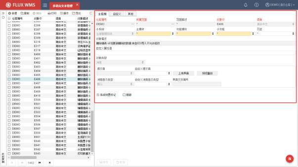

仓库编号－多语言记录所属仓库。系统提供的原始记录，默认为*，即公共记录。现场根据需要复制添加为当前仓库自有记录。界面优先显示仓库自有记录内容，如未配置则显示此语言的公共记录内容。

所属范围－多语言记录对应的功能 ID。

<!-- 原 PDF 第 103 页 -->

范围描述－多语言记录所属范围的描述。

对象 ID－多语言记录 ID。

语言－记录所属语言。

子系统－多语言记录所属子系统，如仓储管理系统，运输管理系统等。

主模块－多语言记录所属主模块信息，如入库操作，出库操作。

功能模块－多语言记录所属功能模块信息，如 ASN，PO。

子功能－多语言记录所属子功能信息，如 ASN功能中的扫描收货，快捷收货。

页签－多语言记录所属页签信息，如主信息，汇总信息。

对象描述－提示信息默认显示内容。

自定义属性值－用户自定义显示信息。未配置情况下显示默认的对象描述信息。

对象类型－记录类型，如消息，按钮，还是标签。只有消息类的记录需要配置后续的提示音等信息。

提示音－消息弹出时的默认提示音。

自定义提示音－可配置的提示音。

上传声音－点击按钮后，可自行上传声音文件，建议上传大小不超过 3MB的 mp3文件作为提示音。所传文件在“自定义提示音”的下拉框内可供选择。需要注意的是，不同语言的提示音需要分别上传。

预览播放－点击按钮后，播放所选提示音。

消息显示类型－系统默认的消息显示类型。如提示框锁定等。不同消息的默认提示模式有所不同。

自定义消息显示类型－可个性化配置消息的显示类型。支持“确认框”、“信息框”、“提示框”、“警告框”、“无提示”、“默认”几种类型。

不同显示类型区别为：

- 默认：使用各个消息代码，系统配置的默认显示类型。

- 提示框：显示提示内容，2 秒后自动消失。常用于显示“请录入库位”等提示信息。

- 警告框：弹出警告信息，光标不定位，无法直接回车关闭警告，需要人工点击按

<!-- 原 PDF 第 104 页 -->

钮关闭警告框。以免连续操作将警告框误关闭。

- 信息框：提示信息，光标定位在左侧首个按钮，通常是确认按钮，即可以直接回车关闭提示信息框。

- 确认框：用于【是/否】确认模式的提示。光标不定位，需要人工点击按钮进行确认。

- 无提示：不进行提示。

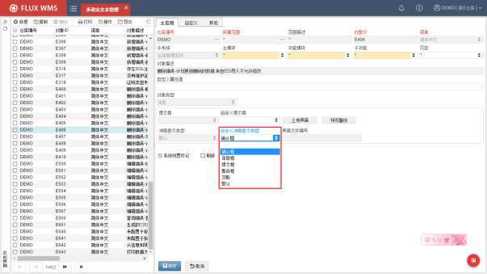

声音文件编号－当前生效的声音文件名。

系统预置标记－此记录是否系统提供的初始化记录。

- 点击【保存】按钮，完成多语言记录配置。

- **个性化消息机制**

除了系统提供的标准消息之外，业务操作时，各种自定义功能，也会有消息提示需要。系统提供两种个性化消息处理机制供用户根据需要配置：

- 多语言消息

在【多语言文本管理】中增加，个性化消息记录，消息代码（即对象 ID）为“CUS_XXX”模式，CUS 开头，下划线连接系统返回的响应代码。

<!-- 原 PDF 第 105 页 -->

系统根据消息代码在多语言文本管理中匹配自定义消息/提示内容。

- 反馈消息

当程序返回的消息代码为“999”时，系统提示”999”分隔符后描述信息。例如“999#不可操作！”。

不考虑多语言支持，直接提示反馈内容。常用在无法提前维护消息代码的业务场景。例如接口直接提示上游系统的反馈消息。

- **右键功能**

- 翻译

同【数据字典】的右键【翻译】功能，方便管理人员在无需重新登录、切换语言环境的情况下，维护字段的多语言信息。

点击【翻译】功能后，系统显示如下语言选择对话框，下拉列表提供的是已加载过语言包的语言选项：

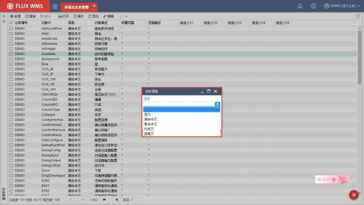

选择后，列表界面增加相应语言列，用户可以直接在列表中编辑内容，回车或者光标跳开即自动保存：

<!-- 原 PDF 第 106 页 -->

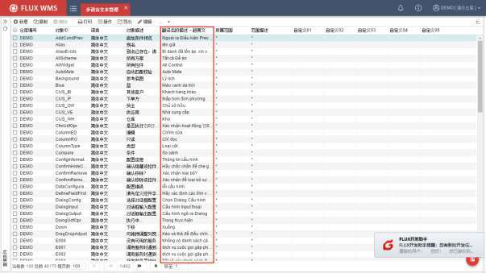

- **相关参数**

多语言文本管理相关参数有：

参数 ID 参数描述 对应说明

TRANSLATE_LANG_FLAG 翻译控制参数 如果参数开启，右键菜单中将显示“翻译”功能项

## 4.10. 界面方案管理

FLUX WMS 提供高度可配置的操作系统，用户可以根据需要，自行定义所用的系统界面、字段显示等。

可配置信息，基础层为数据字典的表、字段名称可配置（具体请参考【4.8 数据字典】章节的功能说明）。

其次是所有界面元素在多语言文本管理中可配置（具体请参考【4.9 多语言文本管理】章节的功能说明）。

第三层，则是配置界面方案，可以根据用户的需要、习惯，配置不同的查询界面、列表、操作界面布局，描述定义，或者是快捷键等，形成自定义的作业界面。通常是基于角色、仓库进行配置。不同语言，需要分别配置方案。

<!-- 原 PDF 第 107 页 -->

第四层，可以在已生效的界面方案基础上，通过拖动列表中的列等，形成用户的私有配置。

未做配置情况下，则显示上一级的配置。如果全部未配置，则显示系统默认布局和信息。

在进行第三层次界面方案配置时，需要先定义此方案的名称和适用范围，然后再到具体功能中逐一进行配置。

### 4.10.1. 界面方案创建

- **界面方案管理**

- 在主菜单“业务系统管理”下选择“界面方案管理”功能。

- 点击【新增】按钮，新增方案记录：

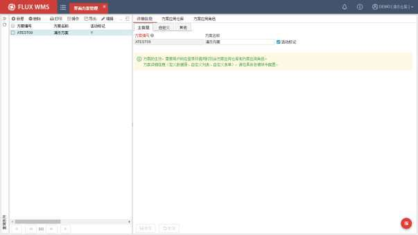

方案编号－方案的代码 ID。保存时系统会自动添加前缀 A，用来区分不同子系统的界面方案。

方案名称－方案的名称描述。

活动标记－是否使用中的方案。

- 点击【保存】按钮完成方案名称设置。

- 在“方案应用仓库”页签，配置使用此方案的仓库。多个仓库可共用一个界面方案。

<!-- 原 PDF 第 108 页 -->

- 在“方案应用角色”页签，配置使用此方案的角色。多个角色可共用一个界面方案。

仓库与角色的选择，共同决定了方案的适用范围。

方案名称配置完成，然后进入到各个具体功能中进行字段、显示的细节配置。可参考后续

4. 10.2~4.10.5章节的相关说明。

用户登录时，系统根据当前登录的仓库、用户所属角色，自动判断哪个界面方案默认生效，并显示在界面右上角的信息部分，“当前使用方案”内容中：

如果相同仓库、角色可以对应到多个方案，则默认选择首个方案生效。

需要提醒的是，由于系统各个功能都支持界面自行配置，因此用户实际使用时，所见的功能界面字段、布局很可能与本文档截图显示有所不同。请根据实际系统应用。

### 4.10.2. 定义数据源

以预期到货通知功能为例，在作业界面，点击右下角的【方案配置】红色按钮（用户需要具有【界面方案管理】的权限）：

<!-- 原 PDF 第 109 页 -->

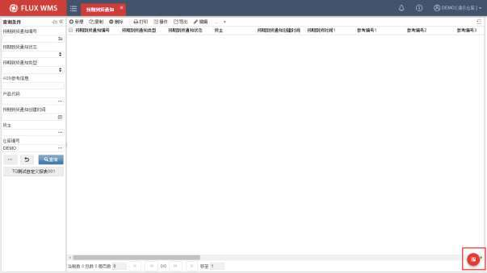

进入如下的界面方案配置界面。

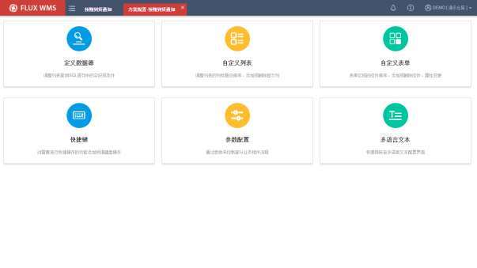

选择功能项进行配置时，系统会提示确认所配置的方案。默认显示当前在用方案：

<!-- 原 PDF 第 110 页 -->

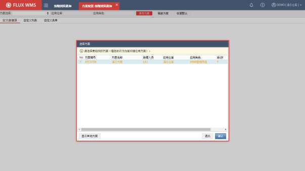

如果需要配置其他方案，需要点击【显示其他方案】按钮，系统才会显示更多方案供选择：

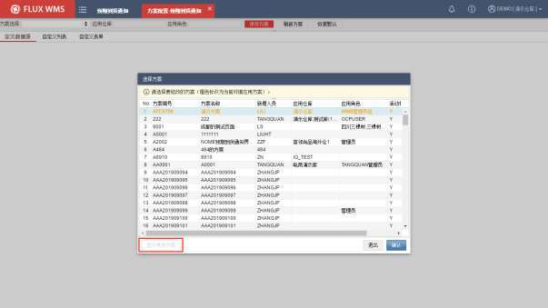

- **定义数据源**

方案配置的第一步，通常是根据需要进行数据源配置。如果无需修改数据源字段，可以跳过此

<!-- 原 PDF 第 111 页 -->

配置步骤进行后续配置（可参考 4.10.3~4.10.5章节的相关说明），使用系统标准数据源。

◼ 在

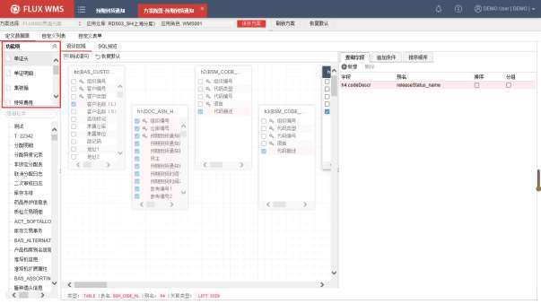

的“方案配置”页签，选择“定义数据源”配置。

*图 4-10-7（图像未能从 PDF 对象中直接提取）*

- 在左上角【功能项】部分，选择功能项目。例如单证头列表，或者具体哪个功能页签。功能具有的相关项目都会在这部分列出。

- 选择项目后，中间的设计区域显示所选项目涉及的表。

- 选择某个表，双击后，设计区域会显示此表的字段情况，对于默认未选择的字段，如勾选，可以在右侧的“查询字段”页签，自动添加此字段，与通过【新增】按钮，添加需要查询输出的表字段效果相同：

<!-- 原 PDF 第 112 页 -->

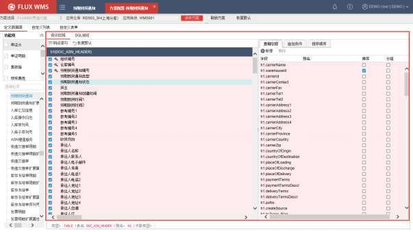

- 或者在“追加条件”页签，添加针对此表的个性化限制条件，如下为主表条件，如果是针对关联表的添加为关联条件：

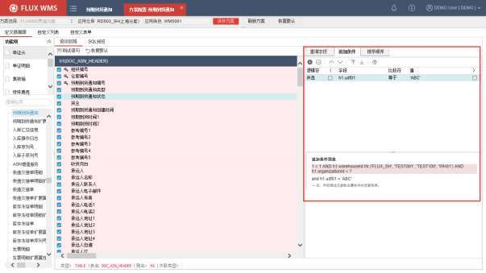

- 在“排序顺序”页签，可以通过上移、下移按钮，调整排序字段的次序：

<!-- 原 PDF 第 113 页 -->

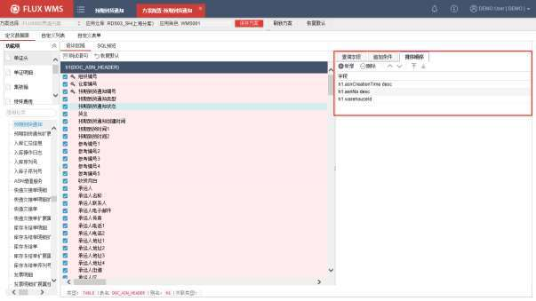

- 添加后，在“SQL 预览”页签，可见完整的查询语句，右侧绿色部分为原始标准语句，左侧红色部分为修改后的拟生效语句，系统会对内容语法进行校验提示：

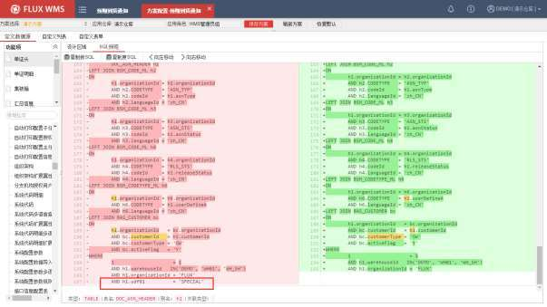

- 如果需要添加关联表，可以从左下角的“数据库表”部分选择并拖曳到设计区域，

<!-- 原 PDF 第 114 页 -->

系统会弹出如下图的对话框，要求添加表关联。

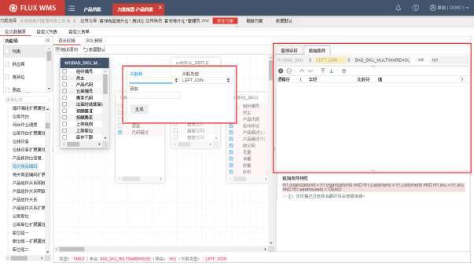

- 确认生成后，在设计区域可见新的相关表。根据需要勾选字段，在右侧“查询字段”部分，可见生效的字段。

- 配置无误，可以对方案进行保存，或者通过【恢复默认】按钮，还原为系统初始设置。

### 4.10.3. 自定义列表

数据源配置完成，可以通过点击“自定义列表”页签，切换到第二步，列表配置，如下图所示。

无需配置数据源的情况下，也可以在

*图 4-10-4（图像未能从 PDF 对象中直接提取）*

的方案配置主界面，直接进入“自定义列表”

配置。

<!-- 原 PDF 第 115 页 -->

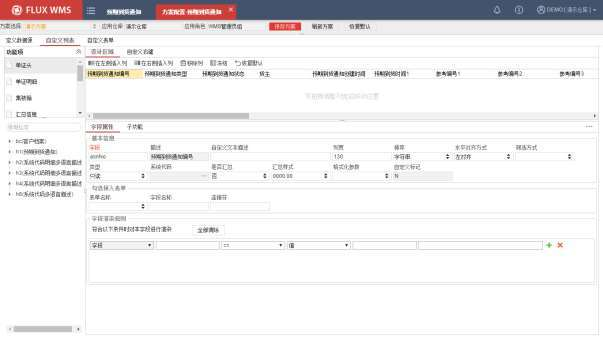

- **自定义列表**

- 在功能的“方案配置”页签，选择“自定义列表”配置，相应确认所配置的方案。

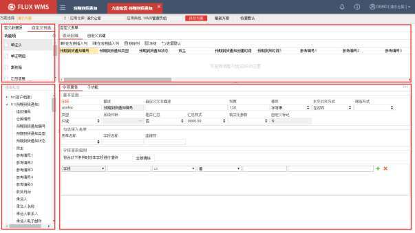

- 界面左上方，显示此功能对应的列表项目。选择所需配置的列表，左下方可选择字

<!-- 原 PDF 第 116 页 -->

段部分，根据已配置的数据源，显示可选字段；界面右上方显示列表预览。

- 如果进入配置界面前，功能界面有查询结果记录，系统将带入首行数据在预览部分显示，方便定义字段宽度。

- 界面右上方的预览部分，可以直接删除不需要显示的字段。需要增加显示的字段可以从左下方的可选字段窗体中拖曳到预览窗格。

- 选定某一列字段，点击【冻结】按钮，所选字段列之前的字段将在列表中冻结显示。

- 在界面右下方的“字段属性”部分，可以维护字段的显示信息：

字段－所选列的数据字段名。

描述－字段默认名称。根据多语言配置显示。如果没有配置多语言，则显示数据字典配置作为默认描述。

自定义文本描述－界面方案中显示的字段描述。未配置则显示默认描述。

列宽－字段的显示列宽。可以修改数值变动列宽，也可以直接在预览窗格中通过拖曳变动列宽。

排序－字段内容的排序模式。系统提供字符串、整型、日期型供选择。

水平对齐方式－字段内容的对齐方式选择，例如左对齐，右对齐。

筛选方式－字段内容的筛选方式。系统提供文本方式、数量方式供选择。如配置，在列表头，鼠标定位到字段，将浮动显示筛选框。

类型－字段显示类型配置，例如只读显示字段，或者下拉框字段等。

系统代码－针对下拉框类型的字段可配置，即此字段对应的系统代码，配置后界面显示此系统代码的下拉列表控件。

是否汇总－当前所选字段，是否需要进行汇总统计。汇总针对符合查询条件的全部结果记录。

汇总样式－如果此字段勾选汇总，可选择汇总信息显示方式。

格式化参数－字段的显示格式，例如同样是数值字段，作为金额使用，还是作为重量使用，需要根据金额小数位参数配置进行控制，还是根据重量小数位参数设置进行控制。

自定义标记－非编辑字段，显示此字段是系统标准字段，还是经过现场配置改动的字段，或者是自行添加的自定义字段。如果自定义标记为 Y，系统升级更新时，不会覆盖。

勾选拼入表单－将勾选的多行记录，在列表中的指定列字段内容，写入当前编辑行的目

<!-- 原 PDF 第 117 页 -->

标表单字段内。通常是为了实现多行记录合并，将多行字段信息拼接写入同一字段，调用【标准业务扩展配置】的个性化前后置校验逻辑时，可以简化入参处理，撰写更加方便（TMS 此类需求较多）。

例如下图配置，针对列表的 asnNo 字段（预期到货通知编号），勾选后可以拼接写入udf01自定义 1 字段中。表单名称为下拉列表，即选择写入字段所在的页签；字段名称则是具体的数据库字段名；连接符为配置情况下默认效果为逗号。

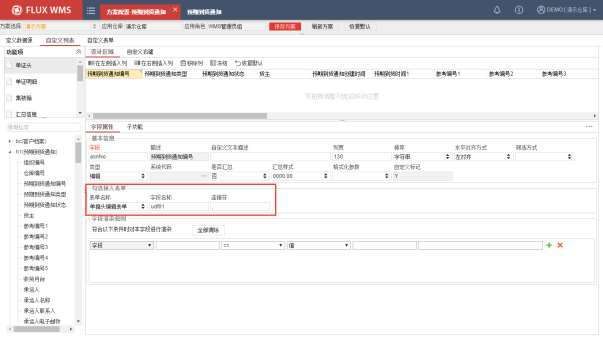

使用时，用户勾选 3行 ASN 记录，预期到货通知编号分别为 ASN002555、ASN002554、ASN002553，系统会自动把预期到货通知编号写入到当前编辑记录的表头、自定义 1字段，通过逗号分隔，效果为“ ASN002555,ASN002554,ASN002553”。后续再做其他操作，扩展逻辑部分系统提取 udf01作为入参，直接传递“ASN002555,ASN002554,ASN002553 ”内容。

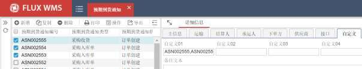

需要提醒的是，信息写入，针对定位当前行之后的勾选动作，定位之前的勾选不会拼入，

<!-- 原 PDF 第 118 页 -->

并且拼入后需要用户点击【保存】按钮进行信息保存。

字段渲染规则－某个字段为特殊值（或者大于、等于、不包含等）情况下，对背景色、字体颜色等做特殊的显示配置。字段点击时，会显示列表字段供快捷选择；通过【+】按钮可以添加多行条件。如下效果为，当记录的来源字段（createSource）值为“YJ”时，此记录的背景色显示为绿色。

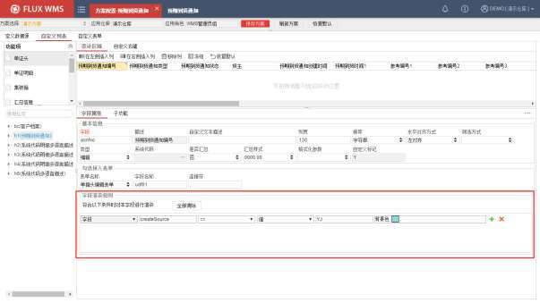

- 点击【保存方案】按钮，保存所做的方案修改。

- 当前应用方案修改保存后，在对应功能页签，刷新即可见修改效果。

- **自定义右键**

不同功能的右键菜单内容不同，有些功能的右键菜单长度会比较长。对于某个岗位的工作人员而言，不同右键功能使用频次差别比较大，可以通过“自定义右键”页签进行配置，将常用功能，加入到右键菜单上部的“常用”子菜单中：

<!-- 原 PDF 第 119 页 -->

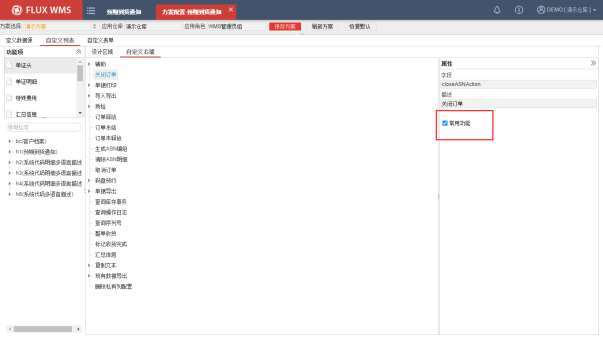

配置后效果如下：

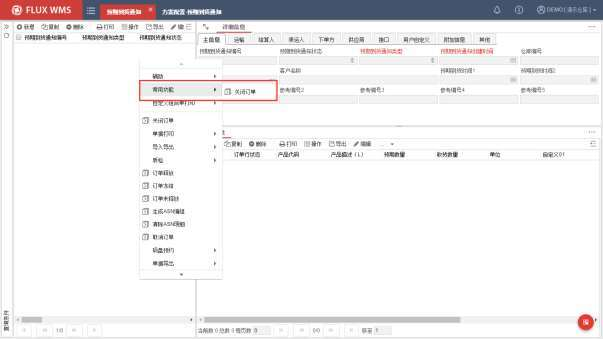

- **相关参数**

自定义列表环节，长宽高重量等规格信息，受到对应规格参数控制。列表字段，根据所配置的

<!-- 原 PDF 第 120 页 -->

“格式化参数”选择，例如数值型，受数量小数位参数控制；金额型受金额小数位参数控制。因此相关参数有：

参数 ID 参数描述 对应说明

CUB_DEC 体积小数位数 格式化参数为“体积型”情况下生效LEN_DEC 长宽高小数位数 格式化参数为“长/宽/高/型”情况下生效PRI_DEC 金额小数位数 格式化参数为“金额”情况下生效QTY_DEC 数量小数位数 格式化参数为“数量型”情况下生效WGT_DEC 重量小数位数 格式化参数为“重量型”情况下生效

### 4.10.4. 自定义表单

除菜单、列表之外的界面配置，归属于表单范围。

- **自定义表单**

◼ 在功能的“方案配置”主页面（如

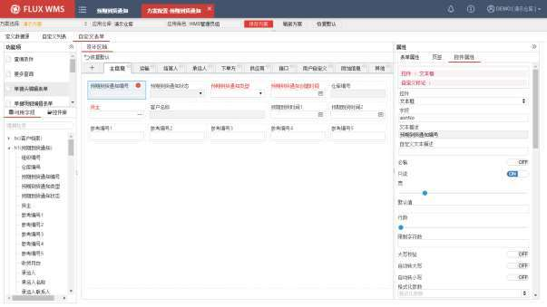

），直接进入“自定义表单”配置。

或者通过配置界面点击“自定义表单”页签，切换到表单配置，如下图所示。

*图 4-10-20（图像未能从 PDF 对象中直接提取）*

- 在配置界面（如下图）左上部分，“功能项”窗格中，选择需要配置的界面，如查询界面，或者单证头主信息页签等。

<!-- 原 PDF 第 121 页 -->

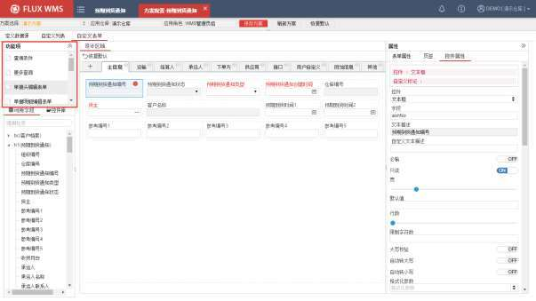

- 中间的设计区域，显示当前配置。可以根据需要添加字段，或删除字段显示，拖曳变动布局。

- 所添加的字段、部件，可以从界面左下方的数据库、部件库中拖曳到设计区域。

- 界面右侧进一步根据需要配置字段属性：

控件－字段的显示控件模式。如文本框，或者单选框，复选框。自定义添加的字段，现场可以根据需要选择不同的控件展示模式。部分系统标准字段也可以通过界面方案配置变更展示模式。例如库存组控件，默认是下拉框展示模式，但现场如果库位组记录很多，下拉列表太长选择不够方便，可以通过界面方案配置，改为二级窗口模式，点击浏览按钮，在弹出窗口中选择记录。（配置细节可参考【4.10.6 界面方案配置实例】中的操作步骤介绍）

字段－数据库字段名。

文本描述－当前语言下，字段对应描述。

自定义文本描述－当前语言下，现场自行配置的界面显示字段名称。如果此字段未配置，则默认显示文本描述内容。

必输－字段是否为必输字段。

只读－字段是否为只读显示字段。

宽度－字段显示宽度调节。

<!-- 原 PDF 第 122 页 -->

默认值－字段默认值。新增记录时自动默认。

行数－字段显示高度调节。

限制字符数－限制录入内容的长度。例如配置为 3，则此字段仅能录入 3个字符，第 4个录入无效。

大写校验－如果开启开关，则光标离开字段后，校验输入值是否为包含小写字母，包含则提示报错“输入值包含小写字母”。

自动转大写－大小写转换开关，如开启，输入内容自动转为大写字母。

自动转小写－大小写转换开关，如开启，输入内容自动转为小写字母。

格式化参数－同自定义列表的格式化参数配置，控制字段的显示格式，例如同样是数值字段，作为金额使用，还是作为重量使用，需要根据金额小数位参数配置进行控制，还是根据重量小数位参数设置进行控制。

Tab键光标跳过－Tab 键移动光标时，不停留此字段。

多条件查询－此字段作为查询条件字段情况下，是否为多条件查询模式字段，是否强制将录入内容转大写。

设置渲染效果－字段的显示效果配置。例如字体大小、加粗、颜色等的配置。

使用日期控件－字段是否显示为日期控件模式。

日期格式－控件格式选择，如日期时间格式，还是仅时间格式。

选择对话框配置－将普通文本框配置为带有浏览按钮效果的编辑字段。通过开关开启，并支持浏览对话框内记录多选，或者录入内容自动匹配效果，也可设置为自动查询模式。点击浏览按钮，弹出的对话框内容，通过下拉列表选择系统内置的、如客户档案、产品档案等控件，也可以通过自定义报表配置，选择为自定义报表查询对应内容。

对话框输入配置－点击浏览按钮弹出的对话框中，查询条件部分的字段，可以配置默认条件值。例如下图所示，将 ASN的用户自定义页签的“自定义 01”字段配置为浏览框，“使用选择对话框”开关开启，并配置系统内置系统代码“ZONE-库区选择对话框”（全部系统代码都支持配置为浏览框选择）。针对对话框的查询条件配置默认输入条件，字段“zoneGroup”（区域字段）默认值为“A01”。

<!-- 原 PDF 第 123 页 -->

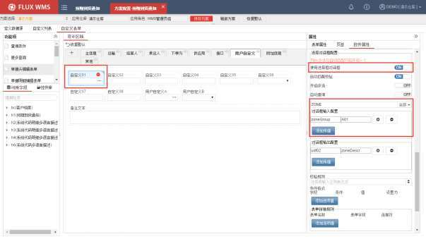

实际效果如下图，点击自定义 01 字段的浏览按钮，显示的库区选择对话框，区域编号字段带有默认条件“A01”，现场可以相应修改查询条件。

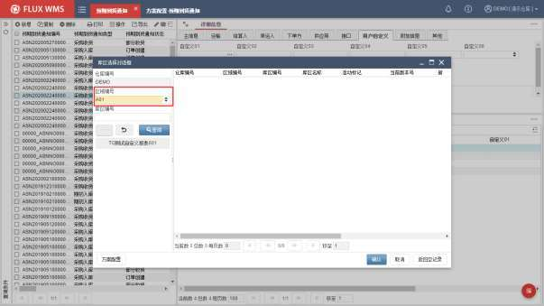

对话框输出配置－在对话框中，选择某个记录，可以把记录的指定字段内容（FM 字段），

<!-- 原 PDF 第 124 页 -->

写入到表单的指定字段（TO 字段），达到一次选择，写入多个不同字段的目的。如下图，针对自定义 01 字段，增加输出配置，将区域编码（zoneGroup）、库区（zoneID）、库区描述（zoneDescr）分别写入到自定义 02、03、04 字段。

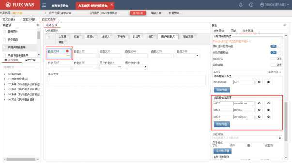

配置后，在界面的实际效果，即对话框中选择一个记录确认后，返回到表单界面，会同时写入4个字段内容，如下图所示：

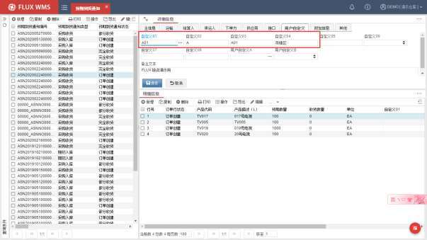

<!-- 原 PDF 第 125 页 -->

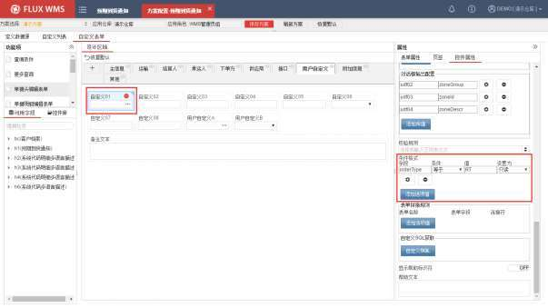

校验规则－对录入内容的校验，例如是否字母和数字，是否整数。校验不符会进行相应提示。

条件格式－符合条件情况下，字段的编辑、必输、只读（文本框非编辑）、禁用（下拉框非编辑）、隐藏等特殊控制。例如下图配置效果为，当订单类型为 RT（退货入库）情况下，自定义 01字段为只读，不可编辑。

*图 4-10-26（图像未能从 PDF 对象中直接提取）*

表单拼接规则－类似 Excel中 CONCATENATE 函数的效果，将不同字段（可多个）拼接后，写入到当前配置的指定字段中。如下配置内容，效果是，将表头自定义页签的 udf02（即自定义 02）、udf03（即自定义 03）字段内容，通过连接符“+”，拼接后写入到当前配置的 udf04（即自定义 04）字段中。

<!-- 原 PDF 第 126 页 -->

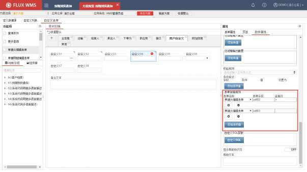

配置后实行效果如下，在自定义 02 字段，输入“A01”，自定义 03 字段输入“B02”，光标离开之后，系统自动填充自定义 04 内容为“A01+B02”。所填充的内容，需要确认保存，同时也支持人工修改内容。

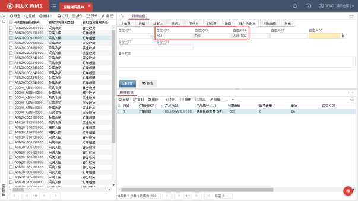

<!-- 原 PDF 第 127 页 -->

自定义 SQL 获取－个性化数据处理的脚本。例如将查询结果的首行记录内容填充到指定字段。实际处理的表、字段可以与当前配置的表、字段无关。点击按钮后，在弹出的配置对话框中设置个性化脚本。如下配置为，取当前记录的自定义 02内容，乘以 10，写入自定义05字段；同时自定义 06 字段固定写入 1000。

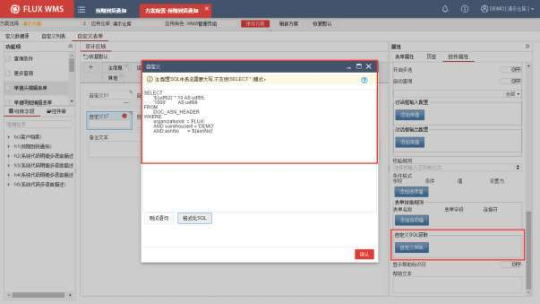

配置后效果如下，在用户自定义页签的“自定义 02”字段，录入“50”，光标移开时，系统即将 50*10 的结果，500 写入“自定义 05”字段，同时向“自定义 06”字段写入 1000。操作与自定义 07 字段无关。写入后的信息，需要确认保存。如果没有在“自定义 02”字段录入内容，则不会触发自定义 05、06 的写入。

<!-- 原 PDF 第 128 页 -->

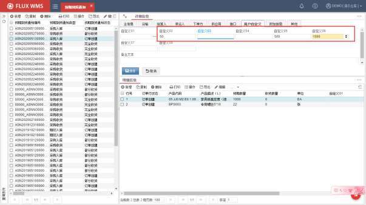

显示帮助表示符－鼠标悬停字段时显示帮助信息。

帮助文本－鼠标悬停时所显示的帮助信息内容。

- 点击【保存方案】按钮，保存所做修改。

- **相关参数**

自定义列表环节，长宽高重量等规格信息，受到对应规格参数控制。列表字段，根据所配置的“格式化参数”选择，例如数值型，受数量小数位参数控制；金额型受金额小数位参数控制。因此相关参数有：

参数 ID 参数描述 对应说明

CUB_DEC 体积小数位数 格式化参数为“体积型”情况下生效LEN_DEC 长宽高小数位数 格式化参数为“长/宽/高/型”情况下生效PRI_DEC 金额小数位数 格式化参数为“金额”情况下生效QTY_DEC 数量小数位数 格式化参数为“数量型”情况下生效WGT_DEC 重量小数位数 格式化参数为“重量型”情况下生效

### 4.10.5. 快捷键配置

系统提供快捷键支持，并且各个功能的对应快捷键可以由现场进行配置。

<!-- 原 PDF 第 129 页 -->

- **快捷键**

◼ 从

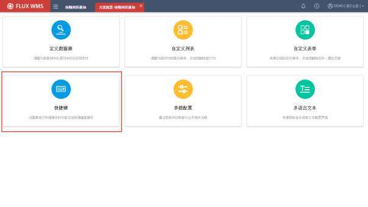

的方案配置界面，选择【快捷键】功能：

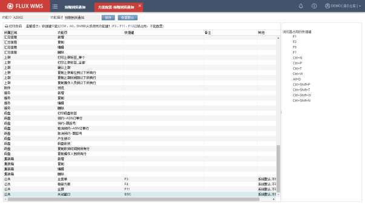

- 进入如下图的配置界面

*图 4-10-31（图像未能从 PDF 对象中直接提取）*

<!-- 原 PDF 第 130 页 -->

系统列出可以进行快捷键配置的项目，并提示哪些快捷已经被使用，不可配置。

在需要配置的功能记录处，点击“快捷键”字段，直接在键盘上按对应快捷键（例如按 F6键，或者直接按 4，系统会记录为 Ctrl+4）

- 点击【保存】按钮，完成快捷键配置

- 如果所配置的快捷键重复，系统会提示报错，如下图所示：

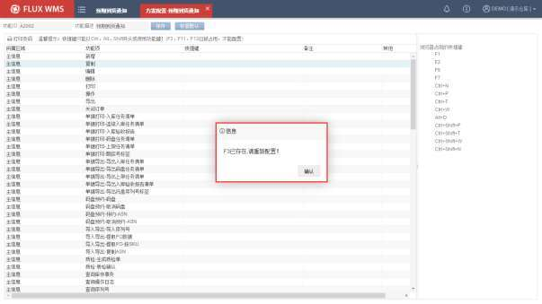

- **快捷键条码**

各个功能中，配置快捷键后，可以点击快捷键执行对应操作。带有扫描处理的功能，例如预期到货通知的扫描收货功能、出库的出库复核等功能，还支持扫描快捷键条码触发对应操作。

根据快捷键配置，预先打印“FNKEY+快捷键”条形码，例如出库复核功能的【装箱确认】按钮对应快捷键为“CTRL9”，则快捷键条码为“FNKEYCTRL9”。用户无需在键盘与扫描设备间切换，只需要在扫描产品条码装箱过程中，扫描 “FNKEYCTRL9 ”条码，系统即执行装箱确认处理。

### 4.10.6. 参数配置

在

*图 4-10-4（图像未能从 PDF 对象中直接提取）*

的界面方案菜单中，如果选择【参数配置】项目，如下图所示，系统会跳转到“系

统配置参数”界面。

<!-- 原 PDF 第 131 页 -->

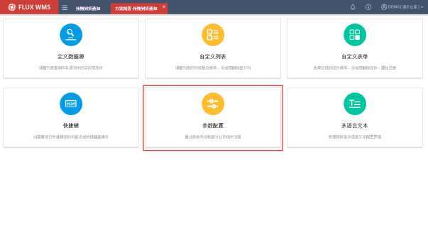

跳转后，自行录入查询条件，进行参数查询。与通过主菜单打开【业务系统配置】模块，再点击打开“系统配置参数”功能效果一致，仅为快捷跳转，方便操作。具体操作细节，可参考【5.1系统配置参数】章节的介绍。

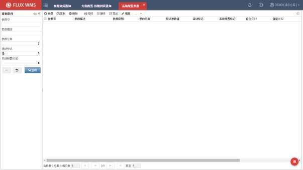

<!-- 原 PDF 第 132 页 -->

### 4.10.7. 多语言文本配置

在

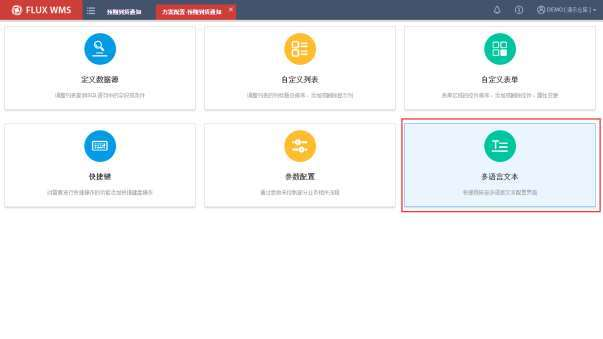

的界面方案菜单中，选择【多语言文本】项目，如下图所示，系统会跳转到“多

语言文本管理”功能中。

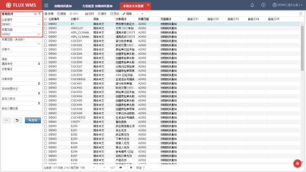

所配置的功能编号，会带入查询条件，直接查询显示功能对应的多语言文本记录：

<!-- 原 PDF 第 133 页 -->

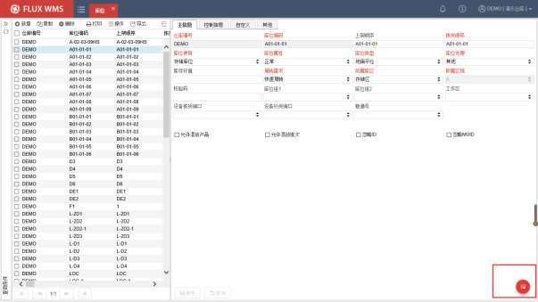

具体配置细节，可参考【4.9 多语言文本管理】章节的介绍。

### 4.10.8. 界面方案配置实例

- **修改库位组控件模式**

修改目标：由于库位组记录过多，默认的下拉框展示模式下，下拉列表太长选择不够方便，需要将【库位】功能中的“库位组一”字段改为二级弹窗浏览选择的显示模式。

具体修改操作为：

- 在主菜单“基础设置”下选择“库位”功能。

- 点击红色圆点进入方案配置界面（需要操作员具有方案配置权限）

*图 4-10-35（图像未能从 PDF 对象中直接提取）*

- 选择“自定义表单”项目：

<!-- 原 PDF 第 134 页 -->

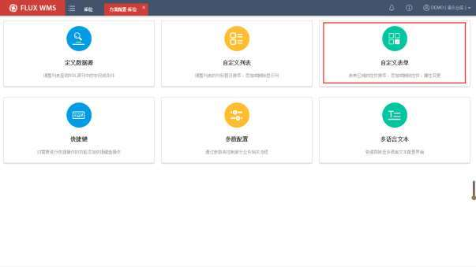

- 在弹出窗口选择所需编辑的方案名称。默认显示当前操作员创建的方案记录，如果需要修改的方案不是当前操作员创建的，点击【显示其他方案】按钮，才会显示。

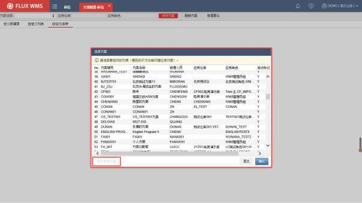

- 点击【确认】按钮，进入对应方案的“自定义表单”编辑界面，如下所示：

<!-- 原 PDF 第 135 页 -->

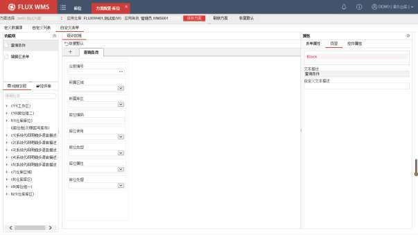

- 在左上方的“功能项”部分，选择“编辑区表单”，然后在设计区域对应显示的“主信息”页签，选择“库位组一”字段，界面右侧显示“库位组一”字段的对应属性。此时显示的是系统标准的下拉框控件模式。

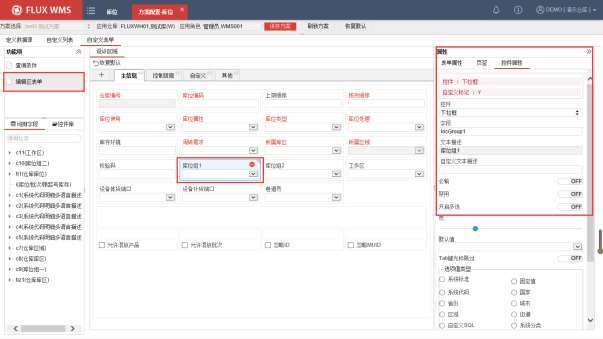

<!-- 原 PDF 第 136 页 -->

- 在“控件属性”部分，修改字段对应控件为“文本框”，此时字段显示模式相应变为文本框字段模式，如下图所示：

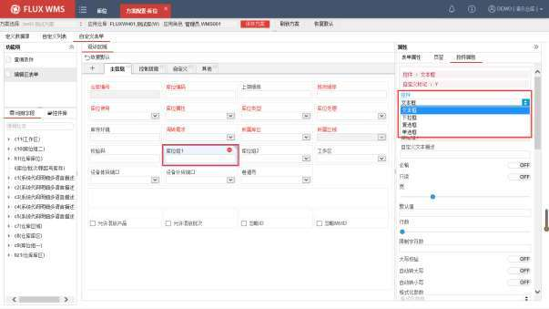

- 将“控件属性”的滚动条下拉，到“选择对话框”配置部分，开启“使用选择框对话框”的开关，此时“库位组一”字段控件显示为带浏览按钮的模式：

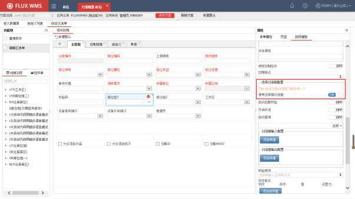

<!-- 原 PDF 第 137 页 -->

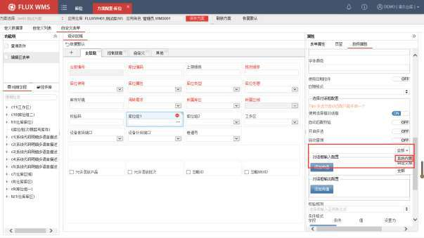

- 在控件选择字段，先选择控件分类，点击“全部”下拉框，选择为“系统内置”：

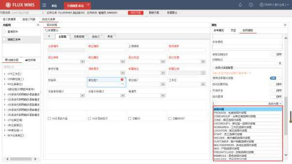

- 在提供的系统内置控件下拉列表中，选择“LOCGROUP1-库位组一选择对话框”控件记录，即将界面的库位组 1 字段浏览按钮，与库位组 1 的选择控件关联。

<!-- 原 PDF 第 138 页 -->

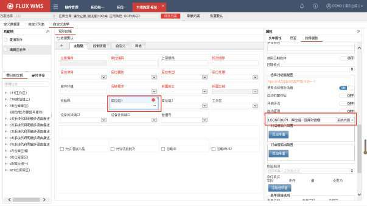

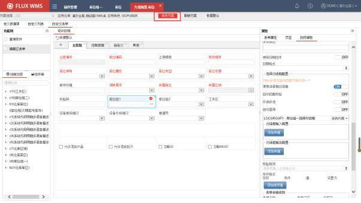

- 点击界面上方，方案信息部分的【保存方案】按钮，完成设置保存。

*图 4-10-45（图像未能从 PDF 对象中直接提取）*

- 方案影响的角色涉及用户，在登录对应的应用仓库时，可见功能字段的新效果。如

<!-- 原 PDF 第 139 页 -->

果已经登录，刷新界面即可看到字段的新效果。

## 4.11. 附件文档管理

系统多个功能都支持附件上传。所有已经上传的附件，可以在“附件文档管理”功能中，统一管理，方便查看、下载。

- **附件文档管理**

- 在主菜单“业务系统管理”下选择“附件文档管理”。

- 查询所需的附件记录：

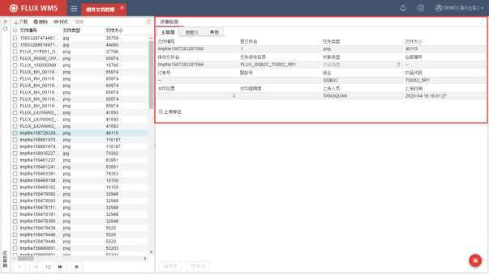

文件编号－文件 ID，由系统自动生成的文件流水号，以便区分文件。

源文件名－原始文件名。

文件类型－附件文件类型。

文件大小－文件大小。

保存文件名－服务器上的文件名。

文件保存目录－文件在服务器上的保存目录。

<!-- 原 PDF 第 140 页 -->

关联类型－附件相关功能。例如从产品档案上传的产品图片，关联类型即“产品档案”。

仓库编号－附件所属仓库信息。

订单号－附件所属订单号信息。

跟踪号－用于记录附件提交交易明细对应跟踪号。字段允许为空。

货主－附件所属货主信息。

产品代码－附件所属产品信息。

水印位置－【客户档案】功能中，可以上传水印图片。所上传的图片会保存在附件文档管理功能中。水印可以配置附加的位置，对应位置信息也相应保存。

水印透明度－水印图片的显示透明度设置信息。具体数值在【客户档案】的【Logo 上传】功能中设置。

上传人员－附件上传人员。

上传时间－附件上传时间。

上传标记－记录附件是否已上传。

- 通过【保存】按钮保存修改。

- 也可以通过【下载】按钮下载文件。

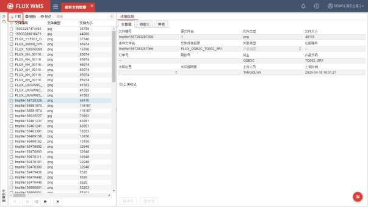

<!-- 原 PDF 第 141 页 -->

- 点击【下载】按钮后，选择保存绝对路径点击【保存】后完成下载操作。

- 或者通过【预览】按钮，或者鼠标右键功能“预览”进行在线查看。

## 4.12. 组织结构管理

现场实际作业中，往往在报表查看或者运输场景下，需要使用到集团的组织架构信息。因此系统提供功能，方便集团用户维护其组织架构信息，便于后续作业中使用。

- **主信息页签**

- 选择主菜单“业务系统管理”下的“组织结构管理”功能。

- 点击【新增子级】按钮，配置组织架构下属信息。

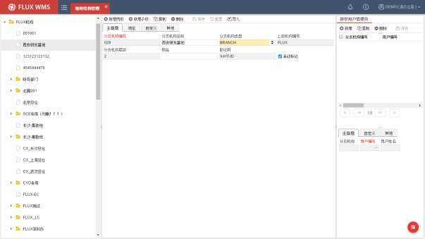

分支机构编号－分支机构编码，支持用户开放式输入。

分支机构名称－分支机构名称，用来定义分支显示名称。

分支机构类型－定义分支结构类型，下拉列表内容。

上级机构编号－根据当前记录的从属关系，默认显示分支上级组织编号。

<!-- 原 PDF 第 142 页 -->

分支机构层级－当前机构所属层级。

别名－用于定义分支别名。

助记码－助记码用来便于系统快速识别，新增时默认根据分支机构名称的拼音首字母显示，支持用户修改。保存后不可修改。

活动标记－是否使用中的记录。

- **地址页签**

- 现场作业中由于部分实体/虚拟分支机构信息，并非都维护在客户档案中，为便于系统获取此部分信息，系统支持在组织架构维度维护分支机构具体地址信息。

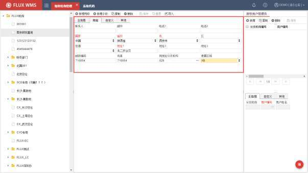

除了常见的联系人信息、地址信息之外，组织机构独有的地址信息有：

同地址分支机构－TMS 运输管理系统

隶属区域－机构所在的、根据集团公司规划的划分区域。例如华南区，华东区，或者大中华区等，不同公司划分方式不同。

- **授权用户管理员**

仅超级管理员可见功能，用于集团管理员，为仓库管理员进行授权使用。只有具有此机构权限的管理员，才能创建此机构的子级，即下级机构。

<!-- 原 PDF 第 143 页 -->

一个管理员只能授予一个机构的权限，但一个机构可以具有多名管理员。

新增管理员时，在界面右侧的“授权用户管理员”部分，点击【新增】按钮，在主信息页签，选择对应管理员，并相应保存记录：

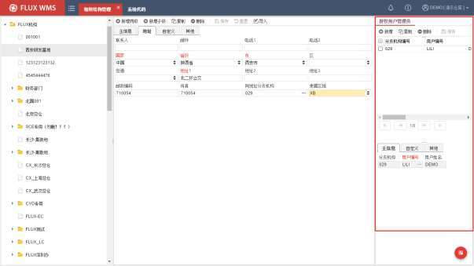

## 4.13. 系统配置数据导入导出

FLUX WMS系统具有众多的可配置项目，例如系统参数、界面配置，打印配置，业务规则等等，这些配置项目结合起来可以定义出多种多样的业务流程，界面显示，操作效果，极大地丰富了系统支持的业务场景需要。

但高可配置，另一方面，也对管理员的配置操作提出了更高要求。实际使用中，通常会在测试环境先期进行配置，测试业务实现情况。测试通过再迁移到正式环境，使之实际生效。但配置项较多，正式环境配置时容易有遗漏，逐一重新配置效率也较低。

因此系统在各个配置功能中，提供了具体配置记录的导出导入功能，例如将某个或多个打印模板从测试环境导出，再导入到正式环境。同时系统还提供【系统配置数据导入导出】功能，可以将全部配置项目导出，再导入到另一个环境，完成全部配置的快捷迁移。

- **系统配置数据导入导出**

<!-- 原 PDF 第 144 页 -->

- 选择主菜单“业务系统管理”下的“系统配置数据导入导出”。系统显示如下可导出配置项目列表：

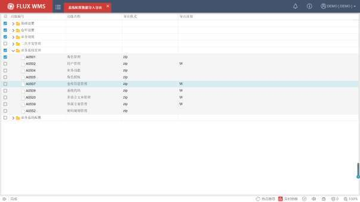

- 根据需要，选择某个配置项目，例如“自定义操作配置”，或者通过列头的勾选框全选所有项目（如下图所示）

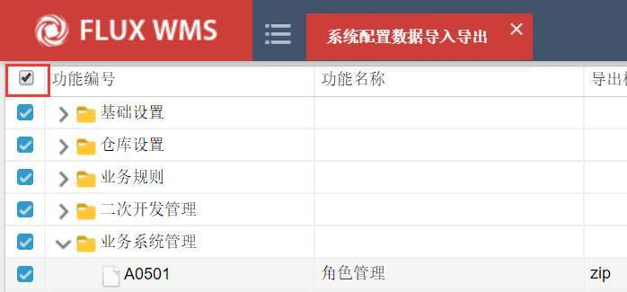

- 通过鼠标右键菜单功能“导出配置”，系统将所选配置项目的全部配置记录导出生成一个配置文件。导出时，浏览器会提示用户确认文件保存目录，不同浏览器提示模式有所不同。

<!-- 原 PDF 第 145 页 -->

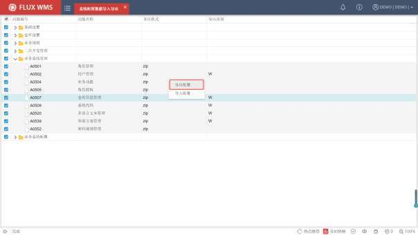

- 后续在另一环境，通过鼠标右键功能“导入配置”，选择之前导出的配置文件，即可加载全部相关配置内容。

- 需要说明的是，定时器添加的记录（编辑人 editWho字段为“UDFTIMER”的参数、系统代码等），及系统默认初始化的记录不会导出。

## 4.14. 插件管理

用户通过浏览器访问FLUX WMS 系统，无需安装客户端。但涉及到打印、PDF预览等处理时，需要加载系统插件以支持相应操作。

通常情况下，使用对应功能时（如【模板文件管理】功能），当前环境未启动插件，系统会自动提示用户下载插件。但有时自动下载异常情况下，可在【插件管理】功能中，手动进行插件下载。同时，插件管理功能，也可检查当前环境，是否已经正常启动客户端插件。

- **插件管理**

- 选择主菜单“业务系统管理”下的“插件管理”。系统显示如下界面：

<!-- 原 PDF 第 146 页 -->

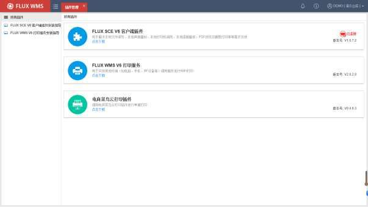

- 根据需要，选择【SCE V6 客户端插件】（WMS 作业插件，如图为未启动状态），或者【FLUX WMS V6 打印服务】（WIFI 打印使用）。电商行业可能会根据需要选择【电商菜鸟云打印插件】（仅在使用菜鸟云打印模式的情况下才需要下载）。

- 选择下载后，浏览器提示确认：

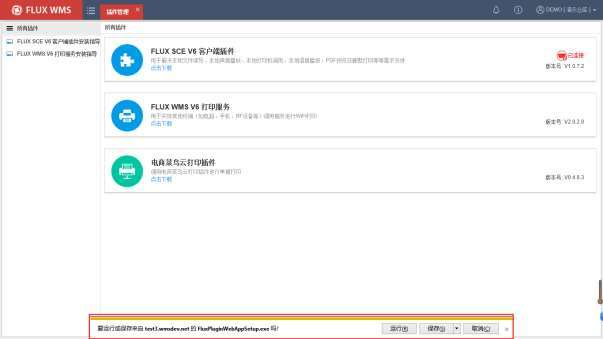

<!-- 原 PDF 第 147 页 -->

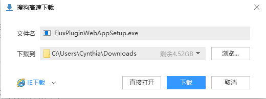

- 或者弹窗模式进行下载提示（不同浏览器提示模式有所不同）：

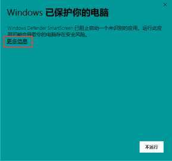

- 确认运行（或者【直接打开】）， 下载完成后，进行客户端插件安装。也可以先下载，再人工点击下载的程序，运行安装。

- 部分情况下，一些版本的操作环境会有保护提示（例如使用IE 浏览器情况下），如下图所示，请选择“更多信息”，然后点击【仍要运行】：

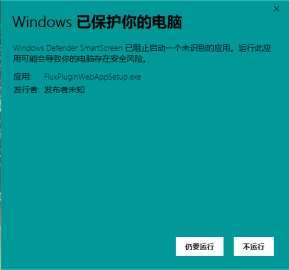

- 运行后，根据安装向导提示，安装客户端插件：

<!-- 原 PDF 第 148 页 -->

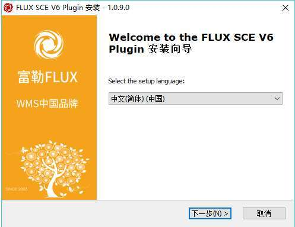

- 如下图，选择安装文件夹时，如果安装电脑有管理员权限控制，默认的 C 盘目录，可能会要求安装后通过管理员权限启动插件。可以选择其他盘（如 D 盘）进行安装。具体可根据现场的 IT管理要求设置：

<!-- 原 PDF 第 149 页 -->

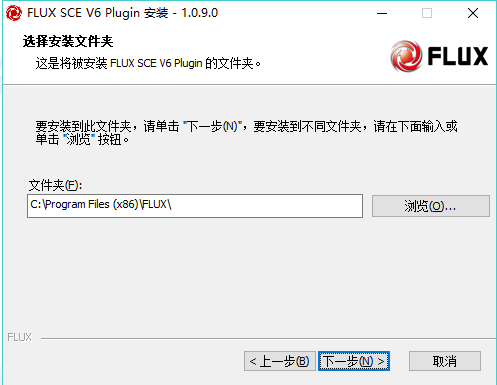

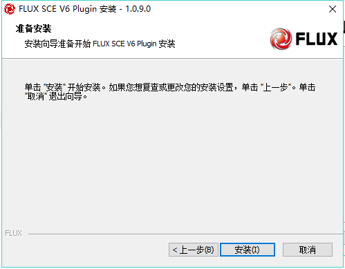

<!-- 原 PDF 第 150 页 -->

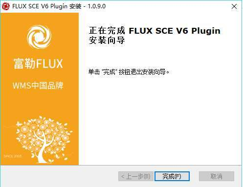

- 安装完成，在桌面状态栏，可见客户端插件标记如下图（也可能折叠隐藏，如图4-14-9）：

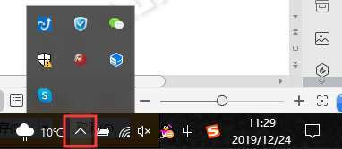

- 如果状态未显示图标，也可以通过桌面快捷键（如下图）点击打开：

<!-- 原 PDF 第 151 页 -->

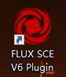

- 通常是由于防火墙拦截需要确认（如下图），【允许访问】后，可在状态栏查看到图标：

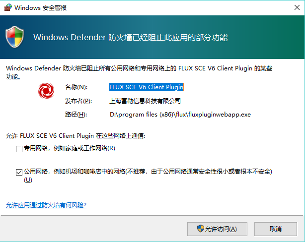

- 点击客户端插件标记显示如下状态界面，可通过按钮启动或停止客户端插件。需要注意的是，插件未启动情况下，系统检测不到，会仍旧提示插件下载。

<!-- 原 PDF 第 152 页 -->

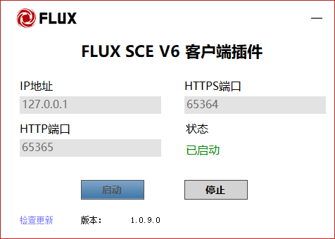

- 注：普通启动如遇状态提示为“XML 文档（181，13）中有错误”，原因是安装在 C 盘目录，但程序无权限启动。需要以管理员权限启动，或者改为安装在其他非程序目录（如 D 盘目录）。

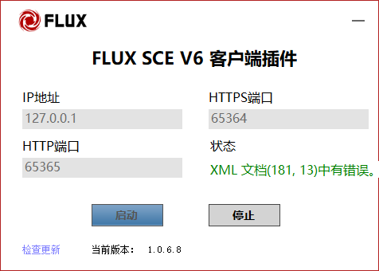

<!-- 原 PDF 第 153 页 -->

- SCE 客户端插件安装、启动成功，可见状态检测提示为绿色的“已连接”。

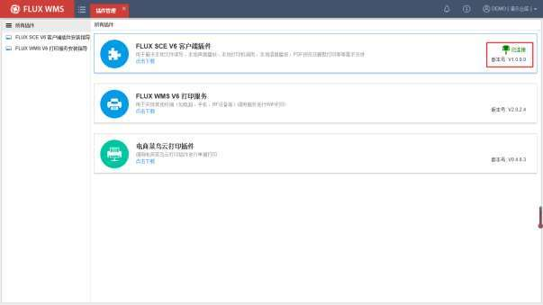

- 另外，电脑重启后，如果插件未能自动启动，也可以通过桌面快捷键打开插件启动界面，手动启动。

- 安装过程中，如有异常，可点击左侧的【FLUX SCE V6 客户端插件安装指导】，获取异常处理说明帮助。

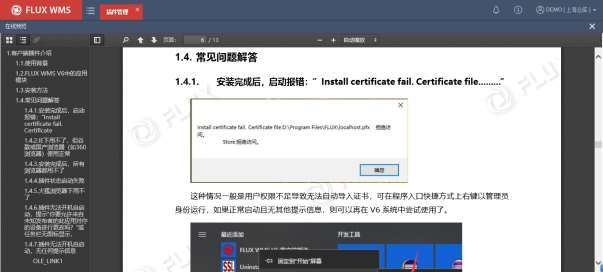

<!-- 原 PDF 第 154 页 -->

## 4.15. 外部链接设置

WMS 系统与 ERP等其他系统对接的情况下，为了方便用户切换系统，减少重复登录，可以通过点击界面右上角系统菜单的“进入外部系统”子菜单中的功能项，进行系统、功能跳转。

子菜单中显示的功能项，以及功能项所对应的具体系统、功能，需要相应进行配置，才能正常使用。

- **外部链接设置**

- 选择主菜单“业务系统管理”下的“外部链接设置”。

- 根据外部系统（例如 ERP 系统）给出的相关信息，维护跳转所需的登录信息：

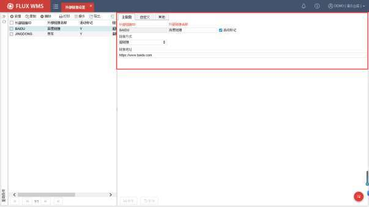

外部链接 ID－记录代码。

外部链接名称－所访问的系统、功能名称。也即子菜单中显示的功能项名称。

活动标记－此记录是否启用。

链接方式－目前主要支持超链接方式。

链接地址－外部系统的具体访问地址。由对应系统方提供信息。

- 点击【保存】按钮，完成外部连接设置。

<!-- 原 PDF 第 155 页 -->

## 4.16. 密码规则管理

系统管理中，基于安全性的需要，经常会对用户自行设置的密码，有一定的规范或者复杂度的要求，例如密码必须 4位以上，或者密码必须既包含字母也含有数字，密码使用一段时间后必须更换等。

这些要求，通常是由 IT部门制定，整个公司，甚至整个集团中统一执行。因此使用 FLUX WMS系统的不同客户，要求的密码管理细节也不尽相同。

系统提供【密码规则管理】功能，用于设置整个系统内的密码规则。

- **密码规则管理**

- 选择主菜单“业务系统管理”下的“密码规则管理”。点击后系统显示如下界面：

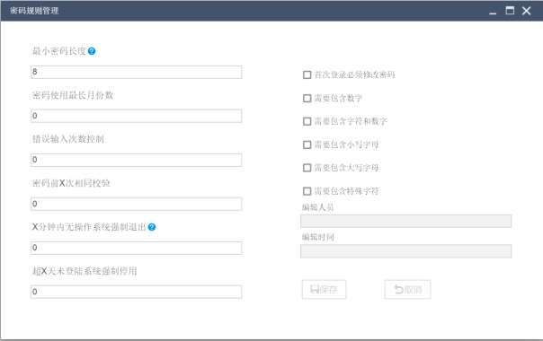

- 根据管理要求，配置规则内容：

最小密码长度－密码长度下限。系统要求密码长度不能低于 3 位，即此处设置值只能是大于等于 3 的整数值。

密码使用最长月份－即每过一段时间会强制用户更换密码。例如每 3个月一换，密码使

<!-- 原 PDF 第 156 页 -->

用最长月份维护为 3。

错误输入次数控制－密码输入错误的可允许尝试次数。超过次数的账户将会被锁定，即活动标记自动变为 N。需要由对应用户管理员来对账户进行活动设置。

密码前 X 次相同校验－用户设置的新密码，不能与之前使用的旧密码相同。避免在密码使用达到最长月份，强制密码变更后，用户仍旧使用旧密码。例如配置为 3，即新密码不能与前 3次的历史密码相同。配置为 0，则不控制。

X分钟内无操作系统强制退出－退出等待时间设置，设定的时间范围内(分钟)，无系统操作，则强制退出系统。设置时间需要是大于等于 10的整数。

超 X天未登陆系统强制停用－数值为 0情况下为未开启控制。针对长期未使用的用户账号，系统通过定时器将用户记录的“活动标记”更新为 N，即账号不可使用，需要由用户管理员重新到【用户管理】功能中激活。

首次登录必须修改密码－用户账号的初始密码由用户管理员设置。如勾选此选项，则用户登录时强制要求修改密码，不能继续使用初始密码。

需要包含数字－如勾选，要求密码中必须包含数字。

需要包含字符和数字－如勾选，要求密码必须由字符和数字混合组成，提升密码的安全性。

需要包含小写字母－如勾选，密码中必须包含有小写字母

需要包含大写字母－如勾选，密码中必须包含有大写字母。

需要包含特殊字符－如勾选，密码中必须包含例如！@#￥的特殊字符。

- 点击【保存】按钮，完成密码规则配置。

## 4.17. 订单信息本地服务配置

跨国业务场景中，集中部署的云服务器能够为全部业务提供支持。但部分国家出于信息安全管理的要求，需要保证公民个人信息存储在国内数据库服务器中，即在操作界面可以跨国查看收货人信息，但收货人信息只能存储在目的地国家的本地数据库服务器上。

作为可选的系统管理模式，需要先通过“订单信息本地服务配置”功能，设置目的地国家的对应本地数据库服务器访问地址，以便后续出库作业、面单打印等环节访问相应服务器获取信息。

- **订单信息本地服务配置**

- 选择主菜单“业务系统管理”下的“订单信息本地服务配置”。

<!-- 原 PDF 第 157 页 -->

- 点击【查询】按钮后系统显示已维护的信息：

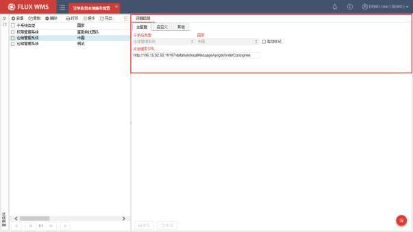

子系统类型－FLUX 供应链管理相关子系统选择，例如仓储管理系统（WMS）、运输管理系统（TMS）等，方便根据不同子系统，分别配置不同的服务器地址，也支持共用相同地址。

国家－所维护的是哪个国家的本地服务器信息。

活动标记－是否使用中的记录。

本地服务 URL－此国家的国内本地服务器地址。

本地服务器通常由维护团队的技术工程师建立，并提供对应的本地服务器 URL 信息。
