# 5. 业务系统配置

> 来源文件：`富勒WMSV6.2（最全版1119页）.pdf`；原 PDF 第 158-259 页。

> 本文件按原 PDF 正文中的顶层章节拆分；每页保留原 PDF 页码注释，图示按原图注顺序引用。

<!-- 原 PDF 第 158 页 -->

## 5.1. 系统配置参数

在 FLUX WMS 中，有许多功能实现、业务流程规划，可以通过不同的参数配置或者组合得到不同的结果，例如入库任务清单上是否显示待收货数量、是否必须执行码盘操作或拣货操作等。

系统配置参数功能位于“业务系统配置”模块下的“系统配置参数”功能中，FLUX 的顾问将协助用户根据流程需要配置相应的系统参数。

用户可通过“参数分类”或“参数 ID”等查询条件查找所需的系统配置参数。

由于多仓多货主作业模式下，同一仓库内的多个货主之间管理要求会不同，同一货主在不同仓库的管理要求也可能有差别，因此系统支持按不同仓库、不同货主、不同订单类型分别配置参数（简称为 WCO 支持，即 Warehouse、Customer、OrderType的缩写）。

- **系统配置参数设置**

对于无需细化区分的情况，即不区分仓库、货主、订单类型情况下，可以在详细信息页签，对参数默认参数值进行配置：

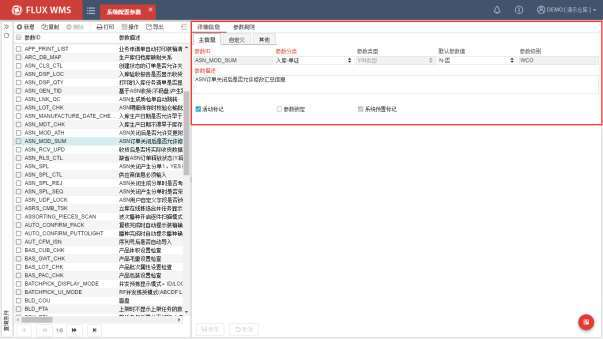

参数 ID－参数代码 ID，也是参数的身份标识。

<!-- 原 PDF 第 159 页 -->

参数分类－参数分类信息，便于参数查询、配置和维护。

参数类型－参数值限定。下拉选项，系统提供 Y/N类型、固定值、自由内容、数值型 4种选择项。

- Y/N类型：参数值为下拉列表，可选项为是、否，用于开关型参数。

- 固定值：参数值为下拉列表模式，不同参数的对应选择项不同。

- 自由内容：参数值由现场自行录入，例如目录地址等。

- 数值型：参数值为数字，限制其他非数值的录入保存。

默认参数值－即不区分仓库、货主、订单类型情况下，默认生效的参数配置。

参数级别－个别参数只能支持到仓库，或者货主级别，无法支持到订单类型层级（例如是否启用第三方费收），因此系统提供参数级别字段，供用户了解参数的生效层级。

参数描述－参数说明信息。

活动标记－控制参数是否启用。

参数锁定－勾选情况下，意味着参数已被锁定，不可修改参数值，也不允许删除参数。适用与仓库现场个别参数不希望用户修改，但另一些参数要开放修改的情况。参数的锁定、解锁，通过鼠标右键功能进行操作。

系统预置标记－此记录是否系统提供的初始化记录。

- **参数规则设置**

如果不同仓库、货主、订单类型下，所需参数配置不同（例如第三方仓库，A 货主要启用序列号管理，B 货主无需序列号管理），此时可以在参数规则页签中，进一步细化配置。

点击“参数规则”页签的【新增】按钮之后，根据所需指定的仓库、货主、订单类型，配置对应的参数值规则。例如仅在一个仓库下指定货主生效的参数，需要配置指定的仓库、货主，而订单类型可以不选择。

多种参数规则情况下，系统依据行号次序匹配规则，新增记录时行号由用户自行指定，但保存后不可修改行号（如下图所示）。未配置规则情况下取参数默认设置生效。

<!-- 原 PDF 第 160 页 -->

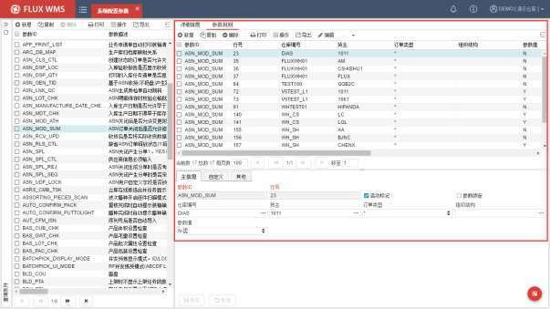

参数 ID－根据主记录显示。

行号－系统执行参数判断时的次序。例如同一个参数下的细分规则，一行规则是指定的仓库 A下，参数值为 N，同时另一行规则下指定货主为 C 时，参数值为 Y。一个订单是 C货主的，在 A仓库中，具体执行哪个参数规则，就根据行号排序，取排序在前的进行匹配、执行。

活动标记－此行规则是否启用。

参数锁定－当前参数是否已被锁定。根据参数主记录显示。

规则条件－符合指定条件的单据、场景执行此规则的参数配置。条件包括仓库编号（W）、货主（C）、订单类型（O），组织机构（TMS 使用，不同组织机构规则配置不同）。

参数值－符合此行规则要求的场景中，执行的参数设置。

- **参数刷新**

用户登录时会获取当前参数配置信息并缓存使用。登录后发生的参数值变更，例如其他用户修改了参数配置，可以通过右上角系统菜单栏的【重置缓存】功能，刷新缓存，参数修改能够立即生效；也可在参数修改2 分钟后，重新打开对应功能页签，按修改后的参数值生效。

当用户修改系统参数并且点击【保存】时，系统自动提示“是否重载”：

- 选择“是”，当前用户环境，系统自动缓存重载，设置生效，从而提升参数修改后的

<!-- 原 PDF 第 161 页 -->

用户体验；

- 点击“否”，暂不重载，通常是后续还要修改其他参数，后续合并重载，或者手动重载缓存。

- **参数锁定**

部分参数由上级管理员配置后，不希望仓库内的管理员再做修改。但同时，另一些参数又希望仓库管理员可以根据业务变动设置。因此系统提供了参数锁定功能，可由上级管理员在参数设定后，进行锁定，不再允许修改删除。如有需要，解锁后可以修改设置。

其余未锁定参数，能够正常配置。

- 参数锁定－右键菜单点击【参数锁定】后，该参数不再允许用户修改和删除。

- 参数解锁－右键菜单点击【参数解锁】后，允许用户修改和删除所选中的参数。

- **特殊参数介绍**

- 系统暂停

配合 ERP系统关账等管理需求，仓库中有时会要求指定时间段不可进行操作，但同时系统依旧运行以支持对账运算等要求。

此时可通过手工修改系统参数（SYS_OPN_CLS，系统开放/暂停状态），或通过定时器定时关闭、开启参数，达到系统暂停操作的控制要求。

具体定时器设置，请参考定时器章节的介绍。

- **WCO相关配置**

由于不同参数生效的业务环节不同，可以选择的单证类型也有所不同。例如ASN_RLS_CTL参数，缺省ASN 订单释放状态，对应订单类型选择，显示的是 ASN 类型，而 PO_RLS_CTL参数，则针对 PO 类型进行选择。

另外有些参数，不同订单类型下的应用没有区别，例如 BAS_GWT_CHK，产品毛重设置检查，就不提供订单类型选择。

系统通过系统代码 DOC_CTL_LST，来配置参数是否支持 WCO 的单证类型选择。并通过代码的【功能分类】维护参数对应的单证大类，如 ASN，SO。经过维护的代码，系统才能提取相应单证类型供下拉框选择。

<!-- 原 PDF 第 162 页 -->

## 5.2. 数据导出规则配置

系统中各个功能的信息，很多都会有数据导出的需求。例如导出当前库存数据发送给货主，导出单证信息用于手工统计，导出库位信息打印条码等等。

系统提供标准的查询结果导出功能（位于各个功能的鼠标右键【现有数据导出】子菜单中），同时也提供了强大的自定义导出处理支持，用户可以根据各自的需要，自行定义所需的导出信息、格式等。

“数据导出规则配置”功能，就是提供给用户进行导出定义的功能，导出为 EXCEL、打印都需要对导出规则进行配置。

两者的区别是，标准导出，针对当前界面记录进行导出，所见即所得。例如在【数据导出规则配置】按查询条件查询到 10 行规则信息，右键【现有数据导出】功能进行标准导出，可以导出这 10条记录，并且是 EXCEL文档。（标准导出处理，具体操作可参考【3.5.4 通用功能按钮】章节，鼠标右键菜单部分的介绍）

而数据导出规则配置的、按规则导出，是根据所配置的查询语句，将对应查询结果按指定的格式要求导出为文件，例如规则1 是导出 CSV格式的、库位对应的周转率统计，与当前功能列表中显示的记录数没有关系。

配置后的导出功能，可在对应功能模块显示。但由于导出的定义，需要对系统功能、数据结构有一定了解，参考数据字典信息，因此导出规则的配置通常由系统管理员或IT 部门进行配置管理。

- **数据导出规则配置**

- 选择主菜单“业务系统配置”下的“数据导出规则配置”。

- 在左侧的查询条件栏位，输入查询条件，可查询已有规则记录。

- 点击【新增】按钮，在如下界面进行相关配置：

<!-- 原 PDF 第 163 页 -->

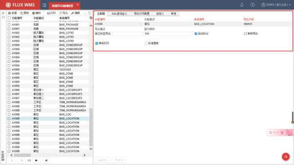

功能编号－功能 ID，系统根据此 ID，获取功能对应导出配置，显示为界面的导出选择项。通过浏览按钮，在二级窗口中选择所需配置的对应功能的功能编号，例如库位功能。

功能描述－功能对应名称描述。

表格编号－后台表名，即导出信息的来源。由于一个功能可能涉及多个后台表，因此具体从哪个对应表中导出，需要人工指定。可以参考【数据字典】功能中的数据库表信息。

导出代码－代码 ID，用于区分不同的导出处理。同一个功能下可以有多种不同导出处理。由用户自行定义，但同一功能、同一数据表对应的导出代码不可重复。

导出描述－对此导出规则的描述，同时也是对应功能界面显示的导出选择项名称。

显示顺序－同一功能的多个不同导出的显示排序。

活动标记－是否使用中的规则。

常用导出－如勾选，则在对应功能的【导出】按钮的下拉菜单中显示，方便快捷操作。未勾选的导出，则在扩展按钮下，“按规则导出”功能中，通过二级窗口选择规则执行对应操作。

常用打印－如勾选，则在对应功能的【打印】按钮的下拉菜单中显示，方便快捷操作。未勾选的导出，则在扩展按钮下，“按规则打印”功能中，通过二级窗口选择执行操作。

标准模板－是否标准打印模板。即系统初始化部署即包含的、标准打印模板。现场不可

<!-- 原 PDF 第 164 页 -->

删除，但可以对标准模板部分内容进行个性化修改，例如修改显示名称、添加字段等。

- 点击【保存】按钮，完成主信息设置。

- 在 SQL 语句定义页签，根据导出需要，维护各级查询语句：

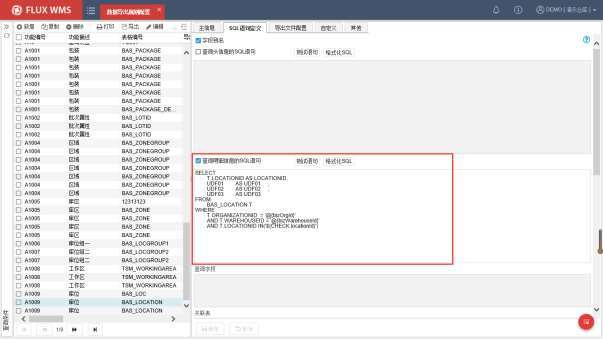

- 可以通过【测试】按钮检测语法问题。

- 点击【格式化】按钮对 sql语句进行格式化整理。

- 在语句执行时系统会自动校验 SQL 是否符合授权限制（即是否有组织、仓库、货主等条件），若无系统会根据业务表和实际用户授权自动增加查询条件。

- 录入“$$”符号后可以实现联想输入，例如输入“@”，则显示此处可用的、系统默认参数如用户（@{useId}）、用户名称（@{userName}）、仓库(@{bizWarehouseID})等。

- 如果从具体功能（例如库位功能）扩展按钮的“配置导出规则”功能项进入到【导出配置】界面，则参数联想可以进一步显示此功能相关的 select（列表选中行相关）、check（列表勾选字段相关）、search（查询区域字段相关）参数字段，如下图所示，选择具体参数，或者点击【ESC】按钮可以返回到编辑界面。

<!-- 原 PDF 第 165 页 -->

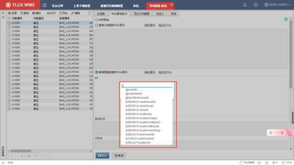

- 在“导出文件配置”页签，维护数据导出的要求：

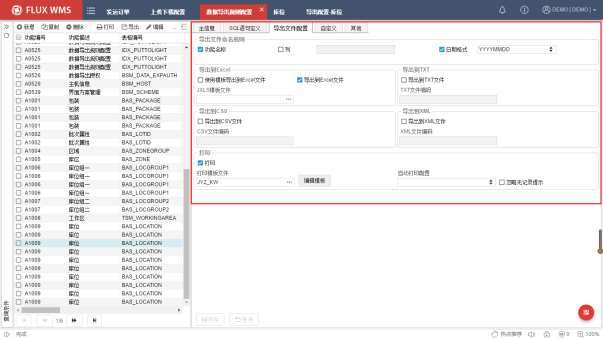

- 导出文件命名规则

系统导出文件时，创建文件名的规则：

<!-- 原 PDF 第 166 页 -->

功能名称－如勾选，导出文件使用功能名作为文件名前缀，例如：库位_XXXX。

列－如勾选，导出文件名使用输入数据列的首行内容作为文件名组成内容，与标准导出的命名规则类似，但自定义配置，具体列需要自行录入指定，而不是系统提供下拉列表选择，输入的列需要是“SQL 语句定义”中维护的查询字段之一，例如库位表取区域 ZOONGROUP列，得到的文件名会使用首行记录的 ZOONGROUP 值，Z01，即《库位_Z01_20200501.xls》。

日期格式－导出文件名是否需要包含日期、时间戳信息。格式可选择。

- 导出到 XXX

导出的文件格式配置。如勾选某种模式，在对应功能的打印/导出子菜单，此项导出会显示模式选择子菜单。不同导出模式，需要配置不同的设置。

如下界面，点击【导出】显示的导出菜单中，一个导出项目配置了多种导出模式，会以子菜单的模式提供给用户选择，具体导出为什么格式的文件。

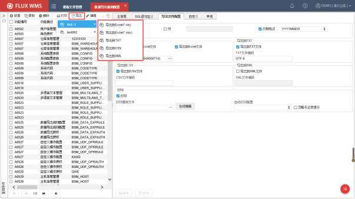

✓ 导出到 Excel

导出到 Excel文件－是否提供 Excel导出。如是，对应项目的导出子菜单中，会同时显示 xls格式与 xlsx格式的 Excel导出功能项，如下图所示。需要提醒的是，如果按 SQL 语句查询所得记录过多，超过 Excel的上限（XLSX 格式的上限 1,048,576行），系统会自动导出为 CSV 文件。

<!-- 原 PDF 第 167 页 -->

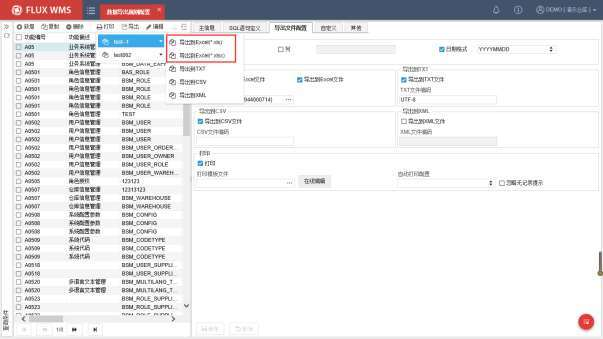

使用模板导出到 Excel 文件－与普通的“导出到 Excel 文件”功能相比，使用模板，可以指定不同的导出内容格式，一般用在生成客户指定格式的反馈报表中，如库存日报、发货报告等，货主通常会要求使用指定格式。如下为模板导出到 Excel的效果样本。

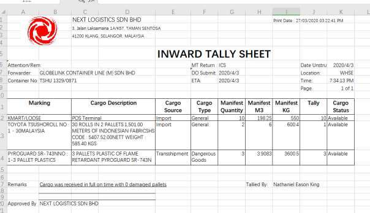

<!-- 原 PDF 第 168 页 -->

勾选此项后，导出按钮的导出项子菜单中，会增加一项“按模板导出到 Excel”的功能项，如下图所示：

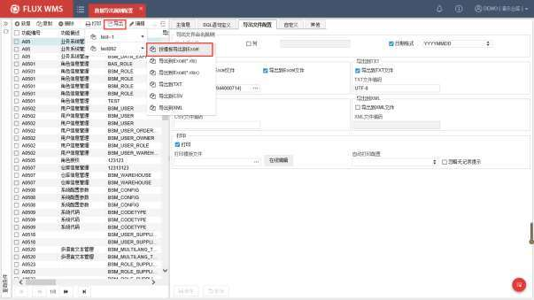

JXLS 模板文件－所指定的 Excel模板格式，需要在【模板文件管理】功能中进行维护，类型为“Excel 模板文件”，然后在“JXLS 模板文件”字段通过浏览按钮选择已维护的模板。

如下图，是一个简单的库位记录导出的 Excel模板内容。

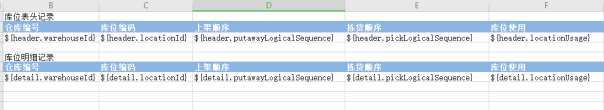

列名部分，根据需要直接维护，模板不提供多语言转换，如果需要不同语言的输出，可以配置多个导出规则，使用不同模板。

字段值参数部分${header.warehouseId}中的“header”、“details”代表此字段值来自于“SQL 语句定义”页签的“查询头信息的 SQL 语句”部分，还是来自于“查询明细信息的 SQL 语句”部分。并不是所有格式都需要头、明细 2 部分，也有很多查询仅需要明细列表即可。

<!-- 原 PDF 第 169 页 -->

“warehouseId”即SQL语句查询字段所 AS 的别名。

✓ 导出到 TXT

导出到 TXT文件－如勾选，规则记录的导出模式子菜单中，显示“导出到 TXT”功能项。可以导出保存为 TXT文本文件。

TXT文件编码－导出时按指定的 TXT 文件编码格式存储文件。如 ANSI、UTF-8、Unicode。

✓ 导出到 CSV

导出到 CSV文件－如勾选，规则记录的导出模式子菜单中，显示“导出到CSV”功能项。可以导出保存为CSV 文件，通常用在导出记录庞大、超过Excel记录上限的情况下，可使用 CSV格式。

CSV文件编码－导出时按指定的编码格式存储文件。如UTF-8、UTF-16、Unicode。

✓ 导出到 XML

导出到 XML文件－如勾选，规则记录的导出模式子菜单中，显示“导出到 XML”功能项。可以导出保存为 XML 文件。经常用在对方需要将接收的文档导入到其他系统使用的场景中。

XML文件编码－导出时按指定的编码格式存储文件。如 UTF-8、GB2312等。

- 打印

打印－如勾选“打印”，并配置打印模板，系统将会把此项导出显示在打印子菜单中。如果未勾选，则仅作为导出项，而不是打印项显示。

打印模板文件－打印调用的模板，可以在【模板文件管理】功能中提前维护，在此处选择已维护的模板；也支持通过【在线编辑】按钮进入模板编辑，直接新增打印模板。系统会提示选择模板类型，是普通的“打印模板文件”，还是“ PDF 模板文件”。编辑新增保存后的模板，同时会在【模板文件管理】功能创建对应记录。

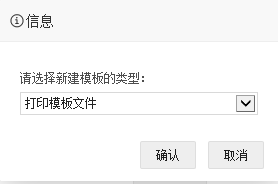

<!-- 原 PDF 第 170 页 -->

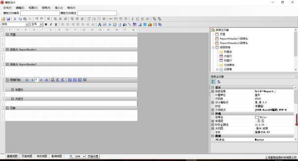

✓ 如果已经选择模板文件，则跳过类型选择，进入到模板编辑界面，如下图所示为普通打印模板编辑界面（具体如何编辑模板，请参考模板编辑专项说明文档，或向 FLUX 顾问咨询）

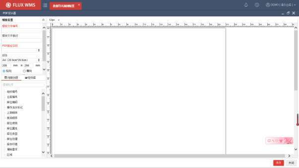

✓ 如果选择“PDF 模板文件”，则进入如下图的 PDF 设计器界面：

<!-- 原 PDF 第 171 页 -->

*图 5-2-12（图像未能从 PDF 对象中直接提取）*

✓ 在左侧模板设置窗口，录入新增模板的名称、描述，并选择存储有 PDF 模板URL信息的字段。PDF 模板打印模式下，对应 URL信息由使用方提供，通常通过接下达，可存放到 WMS 对应功能的任意空闲字段，在“SQL 语句”中查询到此存有 URL信息的字段，然后通过“PDF 路径字段”进行下拉选择。

✓ 从左下方的“可用字段”（功能对应的字段）或者“控件库”（各级打印 Logo）部分拖动元素，到设计窗口的合适位置，可以得到基于给定的 PDF、添加个性化修改内容的打印模板，实现以客户（通常是货主）给定 PDF为底、附加少量修改（例如添加仓库印章图片，或者所需说明字段）的打印效果。

自动打印配置－所配置的打印处理，是否进行自动打印的相关配置。系统提供如下几种处理选项：

✓ 打印标准单据后自动打印自定义单据。同一个操作节点，先打印此节点的标准单据，随后打印此规则配置的自定义单据。例如出库复核装箱确认时，打印标准的装箱标签、装箱清单，随后自动打印添加的个性化外箱易碎品标签。

✓ 人工打印自定义单据。不需要自动打印，通过人工操作进行打印触发。

✓ 忽略标准单据的打印，只自动打印自定义单据。例如同样是出库复核装箱确认节点，不再打印标准的装箱标签、装箱清单，而是仅打印一份包含清单内容信息的个性化标签。

忽略无记录提示－正常情况下，需要打印，但查询不到打印数据，系统会进行提示。但对于一些条件打印情况（例如有的订单需要打印发票，而另一些订单不需要打印发票，在出库复核时，根据对应订单有无发票打印 flag进行打印），查询不到记录是正常情况，无需进行提示，此时可以勾选此选项，系统会忽略查询结果为空的情况，正常进行后续其他处理。

- 点击【保存】按钮，完成数据导出规则设置。

- 需要提醒的是，使用模板编辑功能，需要下载并运行 FLUX的 SCE客户端插件（相关插件安装操作可参考【4.15 插件管理】章节的介绍）。如果直接使用通过网络自行下载的 Grid++编辑器制作模板，系统加载模板时，可能由于版本不匹配而被拒绝加载。

- **鼠标右键菜单功能**

- 导出配置

数据导出规则配置较为复杂，通常会在测试环境中先行配置，并进行测试。测试通过后，如果在正式环境中，重新逐一配置，重复操作，并且容易有遗漏，影响实际业务操作。

<!-- 原 PDF 第 172 页 -->

因此系统提供【导出配置】功能，可以勾选已配置的某一或者多个规则，导出后，在另一环境中导入，方便操作，也能提升配置维护的准确性和安全性。

- 导入配置

与【导出配置】功能配套使用，将其他环境导出的规则，导入到当前环境中。

注：此功能仅导出、导入数据导出规则，对其他功能配置项无影响。

## 5.3. 自定义操作配置

仓库作业过程中，经常会有些个性化的操作需求，希望在系统中实现支持。基于已有功能点的逻辑添加，可以通过标准业务扩展配置添加（具体可参考【5.6 标准业务扩展配置】章节介绍），例如收货添加个性化校验以及提醒。但对于新增一个右键操作功能，通常定义为“自定义操作”，类似导出、打印配置，也需要提前在独立的功能中进行配置。

- **自定义操作配置**

- 选择需要添加自定义操作的标准功能，例如预期到货通知。

- 从预期到货通知功能的按钮栏，扩展功能子菜单中，选择“配置自定义操作”功能：

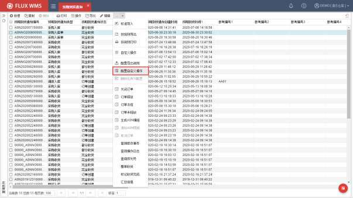

- 系统会跳转到【操作配置-预期到货通知】功能界面，自动将预期到货通知的功能编号、

<!-- 原 PDF 第 173 页 -->

表格编号（即功能对应的后台数据库表名），带入作为查询条件：

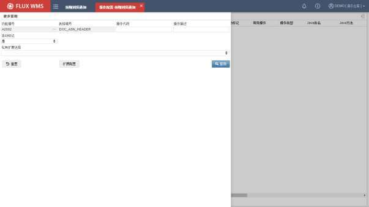

- 查询后可以看到 ASN 当前所配置的全部自定义操作功能：

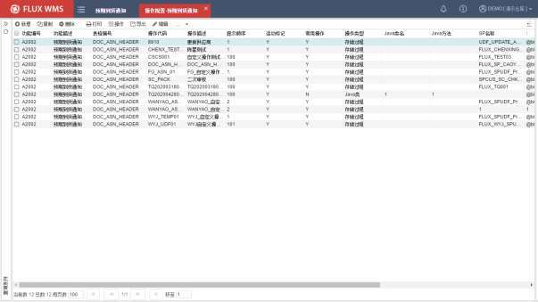

- 此时点击【新增】按钮，系统会直接将 ASN 功能的编号等信息带入，即仅可配置预期

<!-- 原 PDF 第 174 页 -->

到货通知功能对应的自定义操作：

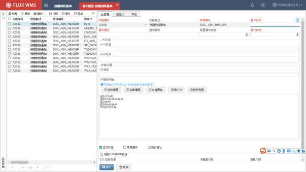

- 也可以从主菜单“业务系统管理”下选择“自定义操作配置”功能进入，此模式不限制配置哪个功能的对应自定义操作，即功能编号需要自行选择。

- 点击【新增】按钮，新增记录，在主信息界面进行相关配置：

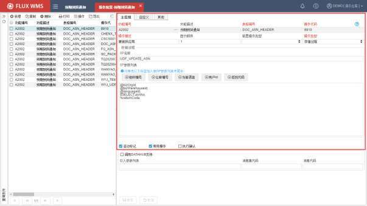

<!-- 原 PDF 第 175 页 -->

*图 5-3-5（图像未能从 PDF 对象中直接提取）*

功能编号－操作对应的功能代码 ID。从其他功能进入时会在自动带入功能编号，从“自定义操作配置”功能进入时，新增配置通过浏览按钮选择操作所属的功能。

功能描述－操作对应的功能的名称。

表格编号－操作对应的后台数据库表名。同一个功能，可能涉及多个数据库表，因此需要相应指定。

操作代码－自定义操作的代码 ID。

操作描述－界面显示的自定义操作名称。

显示顺序－同一功能多个自定义操作的显示排序。

前置操作类型－系统支持询问模式的两段式自定义操作，即先执行前置操作，返回提示后，由用户判断是否继续执行，如果选择是，确认后才会执行后续的主逻辑操作。此模式下，选择前置操作类型，界面会显示类型对应配置。普通模式下，无需选择前置操作类型，界面隐藏后续的前置操作配置相关内容。

操作类型－使用 Java类，还是存储过程模式来执行操作。后续根据所选择的操作类型，显示对应 Java类信息输入，或者存储过程（SP）信息数据字段。

Java类名－Java相关配置。当操作类型配置为“Java 类”时显示。具体内容由 IT部门或者 FLUX 顾问提供。

Java方法－Java相关配置。当操作类型配置为“Java 类”时显示。具体内容由 IT部门或者 FLUX 顾问提供。

SP 名称－存储过程相关配置。当操作类型配置为“存储过程”时显示。具体内容由 IT部门或者 FLUX 顾问提供。

SP 参数列表－存储过程相关配置。当操作类型配置为“存储过程”时显示。具体内容由 IT部门或者 FLUX顾问提供。系统提供常用参数快捷键，点击即可加入。

PS：Java类名、方法，SP 名称、参数字段录入，均忽略大小写。

活动标记－是否使用中的记录。

常用操作－如勾选，则在对应功能的【操作】按钮的下拉菜单中显示，方便快捷操作。未勾选的操作项目，则在扩展按钮下，“自定义操作”功能中，通过二级窗口选择执行操作。

执行确认－如勾选，此自定义操作执行时，先进行提示确认“是否执行 XXX操作？”，用户选择是，执行操作，选择否，则回到主功能，不执行自定义操作。

<!-- 原 PDF 第 176 页 -->

- 点击【保存】按钮，完成自定义操作设置。

- 如果是 SP类型，进入到数据库，创建对应 SP；如果是 Java类型，则由开发人员相应开发 Java类，并部署在服务器上。

- 如果自定义操作，需要衔接接口信息传递，则要进一步配置接口相关处理：

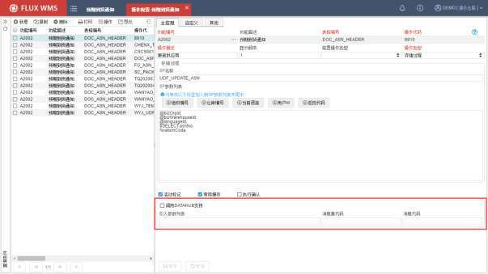

调用 DATAHUB 支持－此自定义操作，是否启用接口调用。

引入参数列表－调用接口时的传参。

消息集代码－所调用的 DATAHUB 接口的消息集代码。由 DATAHUB 接口配置后提供。

消息代码－所调用的 DATAHUB 接口的具体消息代码编号。由 DATAHUB 接口配置后提供。

- 点击【保存】按钮，完成自定义操作接口调用配置。

- **SP 配置约定**

- 符号@，代表系统动态参数。如当前用户、所属组织、当前仓库等。

- 符合$，代表前台入参。如所属模块ID、解析跟踪号、一二维码等。

- 符号%，代表前台出参。

- 前台配置出入参个数必须与后台 SP 一致，当不一致时前台提示报错。

<!-- 原 PDF 第 177 页 -->

## 5.4. 模板文件管理

与“数据导出规则配置”功能配合使用，可以预先定义好所需的模板，然后再指定哪种导出规则使用什么模板。

### 5.4.1. 模板文件配置

- **模板文件记录维护**

- 选择主菜单“业务系统配置”下的“模板文件管理”。

- 在左侧的查询条件栏位，输入查询条件，可查询已有记录。

- 点击【新增】按钮，在“详细信息”的主信息页签进行相关配置：

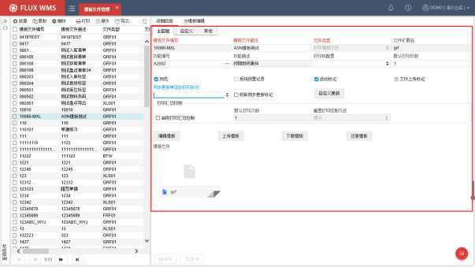

模板文件编号－模板文件的 ID，不可重复。

模板文件描述－模板名称。也即打印时显示的打印项名称。

文件类型－模板类型。系统目前提供打印模板、PDF 模板、Excel、报表模板、BarTender模板文件（用于 RFID 打印的第三方软件 BarTender专用模板）等类型供选择。

文件扩展名－根据所选类型，显示对应的固定文件扩展名。

<!-- 原 PDF 第 178 页 -->

功能编号－应用此模板的功能的对应功能 ID。

功能描述－功能名称。

打印机配置－指定打印到特定打印机。可以实现标签从标签打印机打印，单据从激光打印机打印的效果。所指定的打印机，可以为不同电脑分别配置。在【模板文件管理】功能中配置的打印机，通常是各个电脑相同命名的通用打印机，一次性批量配置指定。如果是每个电脑分别连接名称不同的打印机，通常在【本地配置】的“打印机”设置中为每台电脑单独设置。

默认打印份数－一次打印时的输出份数。默认为 1。

云打印方式－打印是否使用第三方云打印模式，例如通过菜鸟云平台进行打印。系统提供的选项有：

- 云端模板：调用电商云平台进行打印。具体使用哪个平台，在“云打印平台”字段配置

- 本地模板：非云打印，本地普通打印模式。对应的“云打印平台”默认为“本地直连”不可修改。普通打印都是本地模板模式。

- 云端本地合并模板：云打印的情况下，主模板使用云打印模板；模板上的自定义区域内容，采用本地模板。同样需要指定打印模板适用的云打印平台。

云打印平台－电商云打印平台选择。目前提供云打印支持的平台有菜鸟、拼多多、云集、京东无界。

预览－打印时是否需要显示预览界面。如果不预览，同时配置打印机，则可以实现后台打印输出效果。

系统预置记录－是否为系统初始化带有的标准模板记录。如果是系统标准模板，则不允许删除。

活动标记－是否使用中的记录。

文件上传标记－是否已经上传模板，由系统根据上传情况显示。

同步更新单证的打印标记－打印后更新单据对应的打印标记。例如拣货任务清单打印后，可以将发运订单表头的“拣货任务清单打印标记”更新为 Y，方便用户通过查询条件筛选未打印清单的订单记录进行操作。下拉列表显示此功能具有的打印标记字段供选择。

级联同步更新标记－单据组打印时使用的、需要对多个标记同时进行更新的配置。例如从波次计划打印拣货单，除了更新波次计划的拣货单打印标记，可以同步更新发运订单中的拣货单打印标记。

<!-- 原 PDF 第 179 页 -->

自定义更新－单证打印更新打印标记时的自定义限定条件。仅在符合指定条件的情况下才执行标记更新，因此配置时要求“同步更新单证的打印标记”已选择。点击按钮后，会弹出如下图的配置界面，在“更新条件”字段框，相应输入自定义条件，光标离开后，系统会将自定义条件与标准语句拼接后的完整更新语句显示在下方的“预览”部分。此配置建议由IT管理人员进行配置。

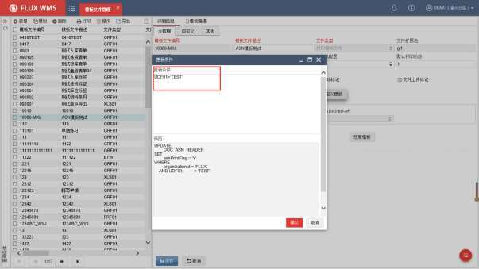

启用打印汇总控制－是否启用打印次数控制。

默认打印次数－启用打印次数控制情况下，允许的打印次数。

重置打印控制方式－超过默认打印次数时，系统处理方式。分为仅提示；人工清除打印标记重新打印；以及通过录入密码再次打印几种控制方式。

- 点击【保存】按钮，完成主信息的设置。

- **打印模板文件**

- 对于文件类型是“打印模板文件”的记录，可以通过点击【编辑模板】按钮，进入如下图的模板编辑界面，新增模板，或者对已维护的模板进行修改编辑（具体如何编辑模板，请参考模板编辑专项说明文档，或向 FLUX 顾问咨询）。新增模板保存成功，系统会更新“文件上传标记”。

<!-- 原 PDF 第 180 页 -->

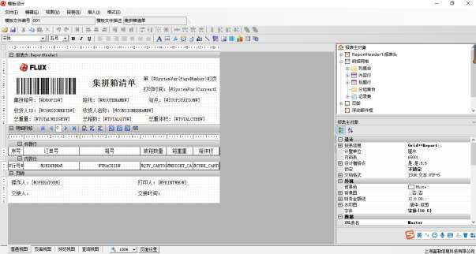

- 需要提醒的是，使用模板编辑功能，需要下载并运行 FLUX 的 SCE 客户端插件（相关操作可参考【4.15 插件管理】章节的介绍）

- 如果需要在不同环境中迁移个别模板的情况，例如从测试环境迁移到正式环境，可以在测试环境中，通过点击【下载模板】按钮，获取模板。再到另一环境（如正式环境）中通过点击【上传模板】按钮，在如下图对话框中，点击【+】按钮，选择模板文件进行上传。

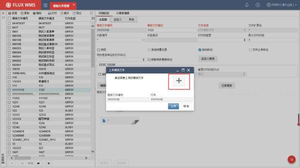

<!-- 原 PDF 第 181 页 -->

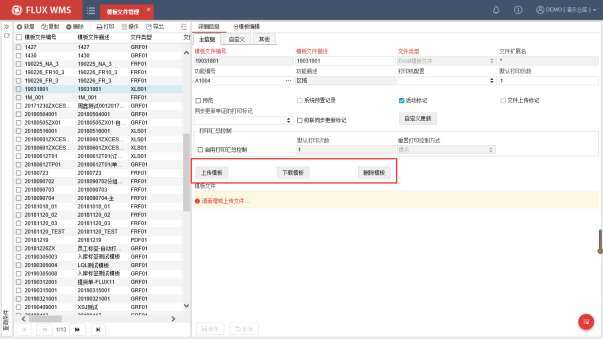

- 如果直接使用通过网络自行下载的 GRID++编辑器制作模板，系统加载模板时，可能由于版本不匹配而拒绝加载。因此模板编辑请通过【编辑模板】功能进行操作。

- 对于标准模板，编辑后会形成个性化模板，点击【还原模板】按钮，则将经过编辑的个性化模板，还原为系统初始化的标准模板，方便误操作情况下的还原。对于现场自行配置的个性化打印模板，点击【还原模板】按钮后，会将现有模板还原为空白模板。

- 注：日常编辑模板后，建议下载模板进行备份。

- **其他模板操作**

对于非打印模板，界面显示的操作按钮会有所不同：

- ExceL模板文件

EXCEL模板文件，用在记录导出时，“按模板导出到EXCEL”模式。具体介绍，以及EXCEL模板制作介绍，请参考【5.2 数据导出规则配置】章节的介绍内容。

文件类型是“Excel 模板文件”情况下，界面仅提供上传、下载、删除按钮。用户自行在Excel中维护好模板内容，通过【上传模板】按钮，进行文件选择、上传。也可以下载已有模板，进行编辑修改后再重新上传。

*图5-4-5（图像未能从 PDF 对象中直接提取）*

<!-- 原 PDF 第 182 页 -->

- 云打印模板文件

使用菜鸟、拼多多、云集云打印模式时，WMS 系统会调用云打印服务，由相应插件进行打印。

云打印所用模板，在云打印程序中提供标准模板，但支持自定义编辑区域有个性化配置。在 WMS 中配置的“打印模板文件”记录，即用于自定义编辑区域的定义，同时也用来配置打印机设置。

- 模板配置

模板记录配置界面如下，与打印模板文件配置界面相同，需要指定云打印方式和平台。需要提醒的是，云打印目前不支持“默认打印份数”设置，即仅能默认打印1 份，原因是云打印插件尚未提供此接口信息，因此WMS中的设置无法传递给打印插件进行控制。

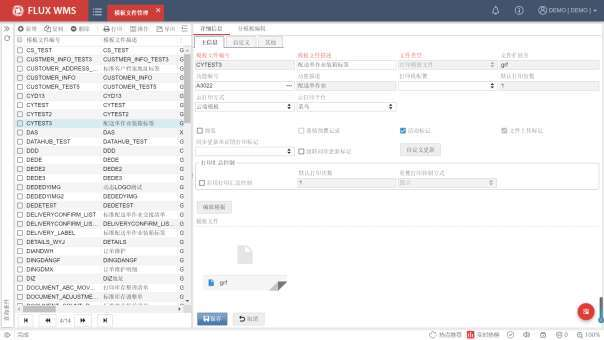

点击【编辑模板】按钮后，会根据所选择的不同云打印平台，跳转到对应的云打印编辑器中。

如下为菜鸟云打印设计器界面。需要有菜鸟相关账户才能登录、编辑，并且仅可编辑自定义区域部分。具体编辑处理，请参考相关云平台提供的编辑操作说明。

<!-- 原 PDF 第 183 页 -->

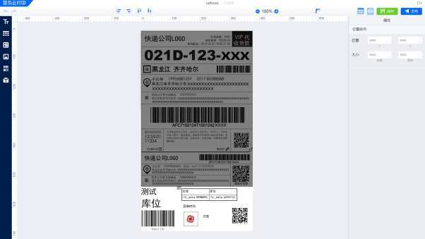

- 相关数据配置

除了模板配置，如果需要使用云打印处理，还需要在【数据导出规则配置】中进行相应配置：

✓ 云打印固定信息

在 SQL 查询语句中，根据云打印平台的要求，需要提供一些固定别名的字段信息，具体可参考各个云打印平台的说明文档。如下以菜鸟云打印平台为例，要求提供 DOCUMENTID、SIGNATURE、TEMPLATEURL、VER、ENCRYPTEDDATA、UDFTEMPLATEURL 这六个固定别名信息：

<!-- 原 PDF 第 184 页 -->

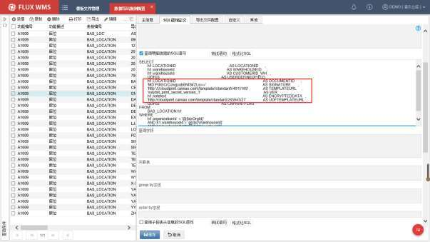

DOCUMENTID－单证号信息，用于区分不同的打印。由于云打印通常用于快递面单打印，因此很多情况下会传递发运订单号作为打印单证号信息。

SIGNATURE－模板与数据的签名。也即菜鸟所提供的云打印账号相关信息。

TEMPLATEURL－标准模板 URL 地址信息。多数情况下是固定的，由菜鸟提供。如果业务场景需要不同订单匹配不同的标准模板（例如根据承运人不同使用不同的菜鸟模板），可以通过固定逻辑（例如承运商是顺丰，使用顺丰菜鸟标准模板，承运商是圆通使用圆通菜鸟标准模板）将模板 URL 写入到订单的自定义字段（例如 UDF06），SQL 语句中查询此字段（UDF06 AS TEMPLATEURL）。也支持通过接口向菜鸟平台临时获取所使用的标准模板URL，写入发运订单自定义字段，供查询使用（此模式 SQL 语句同样是 “UDF06 AS TEMPLATEURL”的方式）。

VER－版本信息。也可以由接口下达到 WMS 指定字段。

ENCRYPTEDDATA －菜鸟云打印的加密数据。通常由接口前期写入 WMS 字段，云打印时相应传递给打印插件即可。

UDFTEMPLATEURL －模板自定义区域 URL信息。在菜鸟云打印设计器中编辑模板后，可以获得固定 URL。也可以通过接口获取动态 URL 信息，写入发运订单自定义字段，查询时别名对应为“UDFTEMPLATEURL”。

✓ 自定义打印信息配置

<!-- 原 PDF 第 185 页 -->

除了云打印平台要求的、固定别名的字段信息，其余需要自定义打印输出的字段信息，也在 SQL查询语句中进行维护（例如 h1.LOCATIONID AS LOCATIONID），字段别名将作为云打印设计器中配置的字段参数信息，通常大小写敏感。

✓ 云打印操作

配置完成后，对应功能的“打印”菜单中，根据【数据导出规则配置】内容，会显示相关的打印项目，可以在打印项目的打印模式子菜单中，选择直接打印，或者预览打印，也可以临时变更指定打印机进行输出：

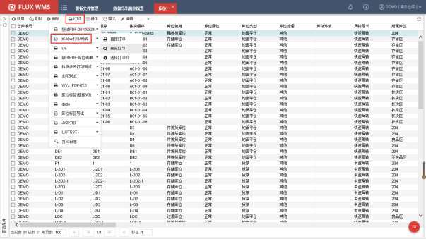

预览效果如下：

<!-- 原 PDF 第 186 页 -->

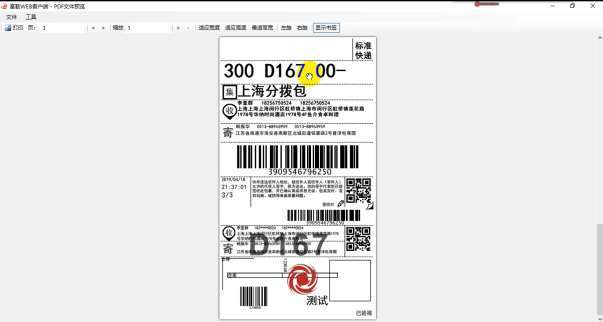

打印任务下达后，可以在菜鸟打印组件中，看到打印任务信息。

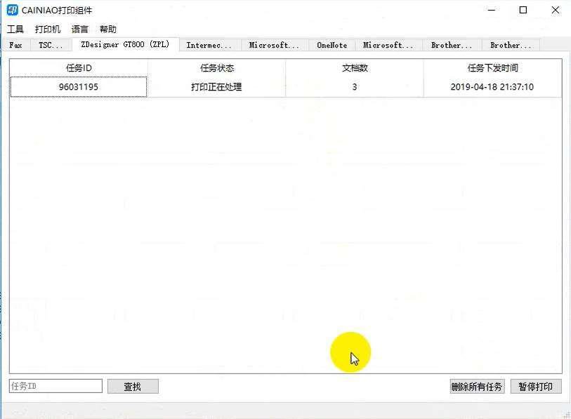

<!-- 原 PDF 第 187 页 -->

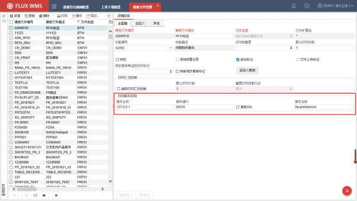

PS：云打印所用打印机的具体配置步骤，请参考云打印平台所提供的对应说明信息。

- BarTender模板文件

BarTender 是一个可以打印 RFID 的第三方打印软件。

选择文件类型为“BarTender 模板文件”之后，主信息界面隐藏模板相关按钮，改为显示BarTender 访问信息，如下图所示，模板文件管理中，实际配置的是 BarTender 访问信息，具体打印模板在 BarTender 程序中配置。

*图 5-4-12（图像未能从 PDF 对象中直接提取）*

服务主机－BarTender 服务器 IP信息。

服务端口－BarTender 服务器访问端口信息。

使用 SSL－BarTender 中所配置的 webservice服务，如果是 https模式，需要相应勾选“使用 SSL”

服务名称－BarTender 中所配置的 webservice 服务名称。

如下为 BarTender 软件中的配置界面样例：

<!-- 原 PDF 第 188 页 -->

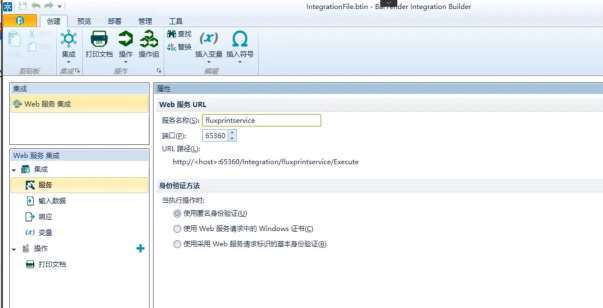

模板配置后，在【数据导出规则配置】功能中，配置打印查询所需的 SQL 语句，并在“导出文件配置”页签，“打印”部分，“打印模板文件”字段，选择当前所配置的 BarTender模板文件。

具体功能打印时，WMS 根据所配置的访问信息，调用 BarTender服务器的 webservice服务，将【数据导出规则配置】中设置的 SQL语句查询到的打印信息传递给 BarTender服务，由其客户端驱动打印。

需要注意的是，BarTender 打印模式，不支持分模板打印。

- **分模板编辑**

有时候，同一个单据，由于内容不同，需要打印不同格式的内容。例如快递面单，需要根据不同承运人，选择不同面单格式进行打印。或者发货报告，需要根据不同收货人要求，配置不同的打印格式。

此类单据，系统采用分模板管理，同一个单据，根据所配置的条件，如货主、承运人不同，选择不同的单据模板、打印机进行输出。使用时，需要先配置主模板信息，再进一步配置分模板信息。

- 在“模板文件管理”中，选择模板主信息对应的“分模板编辑”页签。

- 点击【新增】按钮，添加如下分模板信息：

<!-- 原 PDF 第 189 页 -->

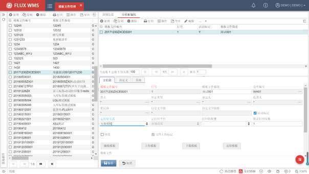

模板文件编号－模板文件 ID。

行号－分模板行号。

模板文件描述－模板文件名称描述。

仓库编号－模板适用仓库。也即分模板仓库条件。*为全部仓库适用。

货主－分模板货主条件。例如此模板适用与货主为 FLUX-EC 的单据打印。其余货主，没有配置独立分模板记录，会使用货主为*的分模板（例如有仓库条件的分模板）；如果也没有，则使用主模板进行打印。

单证类型－分模板单证类型条件。

承运人－分模板承运人条件。

收货人－分模板收货人条件。

供应商－分模板供应商条件。

自定义字段－自定义分模板条件字段。固定为 SQL 语句中别名 USERDEFINEDFIELD的字段。即系统支持任意字段作为分模板条件，只需要在查询 SQL中，将此字段的别名配置为“USERDEFINEDFIELD ”。

自定义字段值－自定义分模板条件的适用值。例如此模板适用于 udf1=XYZ的单据，则在查询 SQL 中，将 udf1字段别名设置为 USERDEFINEDFIELD，而在“自定义字段值”中

<!-- 原 PDF 第 190 页 -->

配置“XYZ”。这样符合条件的单据使用当前分模板，其余单据使用其他分模板，或者主模板进行打印。

活动标记－是否使用中的记录。

云打印方式－打印是否使用第三方云打印模式。

云打印平台－电商云打印平台选择。

打印机配置－指定打印到特定打印机。可以实现标签从标签打印机打印，单据从激光打印机打印的效果。所指定的打印机，可以为不同电脑分别配置。

默认打印份数－一次打印时的输出份数。默认为 1。

预览－打印时是否需要显示预览界面。如果不预览，同时配置打印机，则可以实现后台打印输出效果。

文件上传标记－是否已经加载模板，由系统根据模板新增、上传情况显示。

- 点击【保存】按钮，完成主信息的设置。

- 点击【编辑模板】按钮，可以复制主模板，修改编辑后作为当前分模板记录的模板使用。

- 同样支持当前记录模板的下载、上传迁移处理。

- 分模板界面，点击【还原模板】，则是将模板还原为与主模板相同。

- **鼠标右键菜单功能**

- 导出/导入配置

同【数据导出规则配置】，模板配置，也提供相应的导出、导入功能，用户可以勾选已配置的某一或者多个模板文件记录，导出后，在另一环境中批量导入配置，方便快速、准确的进行配置迁移。

### 5.4.2. 配置实例-打印模板配置

在日常业务中，常用的数据导出主要包括自定义单据打印、数据导出到 Excel表格(标准导出/按模板导出），这两种导出的配置方法类似，都可通过【模板文件管理】、【数据导出规则配置】和【数据导出授权】三个功能共同配置来实现。后文将详细介绍。

- **新增模板文件**

<!-- 原 PDF 第 191 页 -->

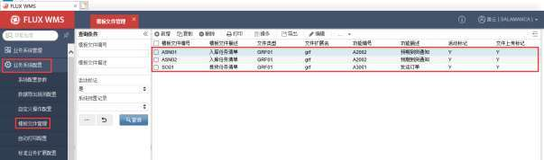

- 选择【业务系统配置】模块的【模板文件管理】功能，在左侧的查询条件栏，输入查询条件，可查询已有记录。在明细页签点击【新增】按钮，新增模板文件。

- 依次填写详细配置信息：

在“详细信息”页签维护必输的模板基础信息；有分模板需求，再进一步配置“分模板编辑”页面内容。

以配置个性化的入库任务清单打印模板为例：

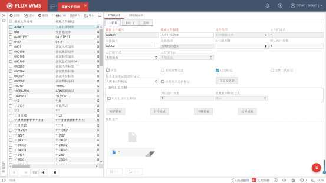

模板文件编号：ASN01。

模板文件描述：入库任务清单。

<!-- 原 PDF 第 192 页 -->

文件类型：选择为“打印模板文件”

功能编号：通过浏览按钮，在二级弹窗中，通过查询选择“预期到货通知”。在弹窗中确认选择后，系统将功能 ID“A2002”带入到功能编号字段。并显示对应的功能描述信息。

活动标记：新增时默认勾选。

云打印方式：选择为“本地模板”。

同步更新单证的打印标记：选择为“入库单打印标记”。

- 点击【保存】按钮，完成主信息的设置。

- **打印模板编辑**

使用标准入库清单模板作为样本，在样本基础上自定义编辑、保存为个性化模板。

- 查询预置的标准模板

- 选择标准 ASN 入库任务清单，并点击【下载模板】按钮，弹窗确认下载：

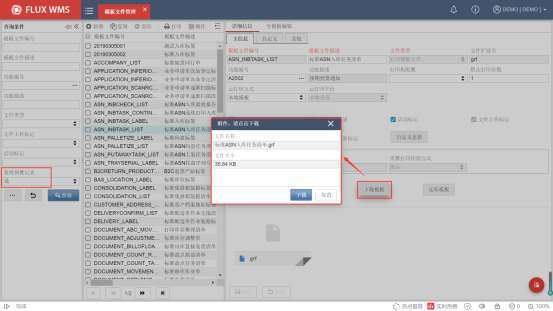

- 回到已创建的 ASN01 个性化模板文件记录，点击【上传模板】按钮，在弹窗中通过【+】按钮，选择已下载的模板文件，并确认上传。

<!-- 原 PDF 第 193 页 -->

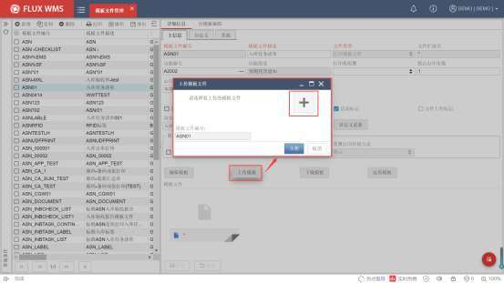

- 上传完成，点击【编辑模板】按钮，打开编辑界面，修改模板内容:

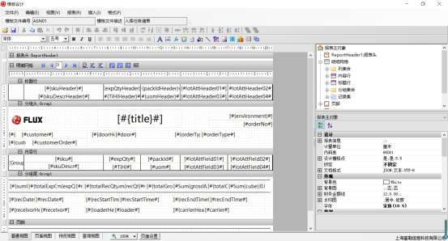

- **Excel 模板编辑**

制作工具：Excel 表格

参考资料：学习文档 https://www.cnblogs.com/klguang/p/6425422.html

<!-- 原 PDF 第 194 页 -->

备注：在 V6 中只有两个对象集：header 和 details。

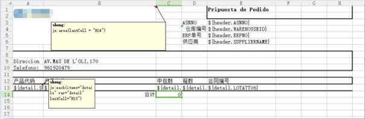

- 在 A1 表格批注中设置模板区域范围，建议比实际范围大一行。例如：jx:area(lastCell= "H14")

- 循环读取明细时，在第一个表格的批注中填写 each 函数，默认向下扩展。例如：jx:each(items="details" var="detail" lastCell="H13")

- 可以使用 SUM 公式汇总，但该字段需提前在 SQL 查询时转换为数字。

- **数据导出规则配置**

位置：【业务系统配置】-【数据导出规则配置】

作用：实际业务中会有很多数据导出的需求，包括单据打印和数据 EXCEL 导出。系统提供了强大的自定义导出处理支持，用户可以根据各自的需要，自行定义所需的导出信息、格式等。

新增数据导出规则操作如下：

- 步骤 1：点击【业务系统配置】模块，选择【数据导出规则配置】功能，在左侧的查询条件栏位，输入查询条件，可查询已有记录。在明细页签点击【新增】按钮，可新增导出规则。

- 步骤 2：主信息配置

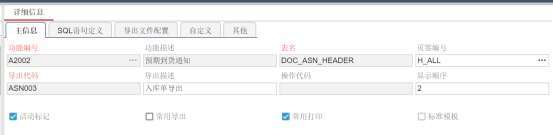

<!-- 原 PDF 第 195 页 -->

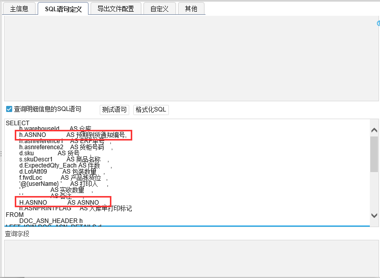

功能编号－通过浏览按钮，在二级弹窗中，通过查询选择“预期到货通知”。在弹窗中确认选择后，系统将功能 ID“A2002”带入到功能编号字段。并显示对应的功能描述信息。

表名－后台表名，即导出信息的来源，DOC_ASN_HEADER。功能对应的信息来源表，字段，可以在【数据字典】功能中查询。

页签编号－点击浏览按钮，根据表名查询选择信息来源页签。

导出代码－配置为 ASN003

导出描述－配置为入库单导出。

显示顺序－2。

活动标记－默认选择。

常用打印－勾选，作为常用打印使用。

- 步骤 3：sql语句定义

根据导出需要，维护各级查询语句，可以通过【测试语句】按钮检测语法问题，【格式化 SQL】按钮对 sql语句进行格式化整理。在语句执行时系统会自动校验 SQL 是否符合授权限制（即是否有组织、仓库、货主等条件），若无系统会根据业务表和实际用户授权自动增加查询条件。

<!-- 原 PDF 第 196 页 -->

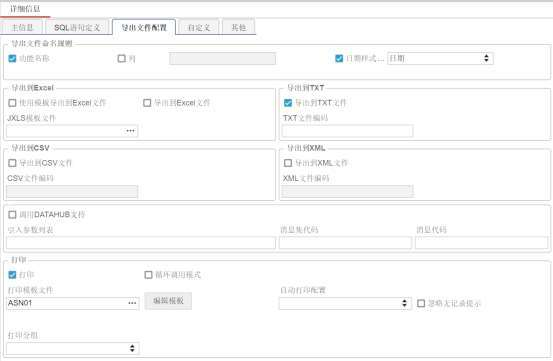

注意事项：

- V6 数据库表结构有很多变化，需花时间熟悉系统数据字典；

- 由于 V6几乎所有的表都增加了 organizationId这个主键，因此表与表的关联字段需增加组织 ID；

- 如果对应打印模板文件设置了更新打印标记，需要在 SQL 语句中定义打印标记字段；

- 单号，如 ASNNO、ORDERNO 等不能 AS 别名。保存语句时会自动将单号 AS成中文名称，解决办法是将单号 AS 成字段本身，可见上图。

- 步骤 4：导出文件配置。

在【导出文件配置】页签维护数据导出的模板文件：

*图 5-4-23（图像未能从 PDF 对象中直接提取）*

导出文件命名规则-选择“功能名称”+“日期样式”模式

导出到 XX－勾选打印，则该导出规则出现在【打印】子菜单中。

<!-- 原 PDF 第 197 页 -->

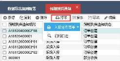

备注：如果选择【按模板导出到 Excel】，则需要维护相应 Excel模板文件；如果选择【打印】，则需维护打印模板文件。相应文件在【模板文件管理】中配置。

打印模板文件-选择已配置的模板“ASN01”

- 步骤 5：保存配置。

- **数据导出授权**

配置完成，需要给操作角色进行授权。

- 步骤 1：点击【业务系统管理】模块，在菜单列表中选择【角色授权】功能，并选择所需配置的角色编号。

- 步骤 2：在相应功能中，选择具体功能项权限，勾选后保存，完成功能授权。

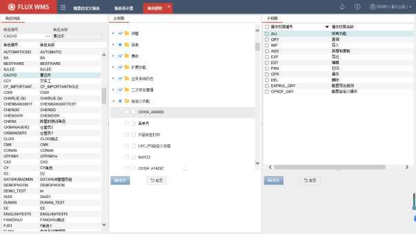

<!-- 原 PDF 第 198 页 -->

- **效果样张**

执行效果如下：

- 自定义单据打印样例

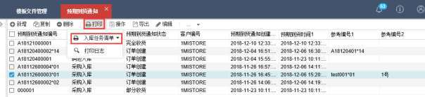

- 导出数据到 EXCEL 样例

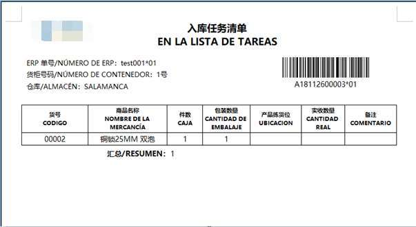

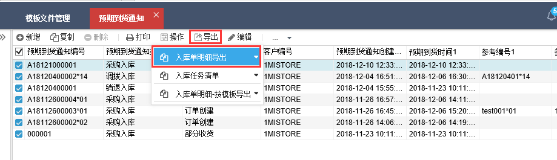

<!-- 原 PDF 第 199 页 -->

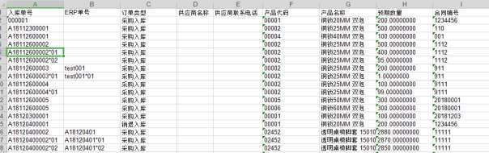

- 按模板导出数据到 EXCEL 样例

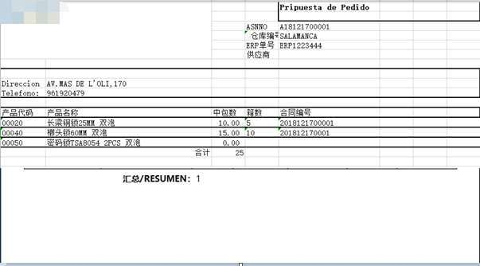

- **报错记录**

作业过程中，比较常见的报错以及原因有：

- 模板文件再次编辑报错

- 描述：打开已经上传的文件再次编辑时报错‘报表数据读取错误’，复制URL 提示网页不存在。

<!-- 原 PDF 第 200 页 -->

- 原因：模板文件描述中包含‘/’符号，导致 URL 地址有误。

- 解决方案：模板文件中文描述，尽量避免使用特殊字符。

## 5.5. 自动打印配置

仓库内的固定作业，可以配置对应的自动打印服务，实现无需人为干预的自动打印输出。

例如订单通过接口下达，由定时器负责按波次规则运算生成波次订单、分配库存，完成分配的订单就可以通过自动打印配置，在指定的打印机输出本区域的拣货任务清单。具体拣货操作员工，根据打印的单据进行拣货操作，无需人工操作打印、通知、单据传递。

<!-- 原 PDF 第 201 页 -->

- **自动打印配置**

- 选择主菜单“业务系统配置”下的“自动打印配置”。

- 点击【新增】按钮，在“详细信息”页签维护主信息：

仓库编号－使用此打印配置的仓库。

主任务编号－打印配置编号，系统自动生成的流水号。新增时也可以人工手动设置编号，保存后不可修改。

主任务描述－打印配置描述。

运行间隔（秒）－多长时间运行一次，即查询待打印任务的时间间隔。如有任务，执行打印；当前没有任务，则等待下一次运行。设置单位为秒，新增记录时默认为 120，只能设置为大于等于 1的整数，否则提示：运行间隔必须是大于等于 1的整数。

任务类型－选择打印配置是标签类一级结构（例如库位标签、任务标签），还是头、明细的二级结构（例如拣货作业清单，查询到需要打印的单据，再根据单据头信息查询此单据的明细信息）。下拉列表内容取自系统代码 APS_TASK_TYPE。一级结构只需要配置“SQL语句定义”中的查询明细的语句内容。二级结构需要同时配置头信息、明细信息查询语句。

工作站－此任务，即此打印处理需要在哪台电脑运行（工作站信息，在界面右上角的系统菜单，【本地配置】-【工作站】中查看，如下所示。相关配置请参考 3.5.2系统信息部分

<!-- 原 PDF 第 202 页 -->

的介绍）。

打印模板文件－二级窗口选择打印所用的模板文件，支持单据、标签等不同打印配置。相应模板在【业务系统配置-模板文件管理】中配置。

复查状态－不可编辑字段，预留给 IT部门/DBA 审核报表查询语句时使用。

分组－作为在使用自动打印界面的分组查询条件，用于数据临时过滤。用户可以根据需要，自行设置此配置记录所属分组。

打印机－打印输出的指定打印机，在未配置分区打印的情况下可配置主打印机（主打印机必输）、备用打印机。

打印机类型－打印机是标签打印机，还是激光打印机。分区情况下必选，下拉框内容取自系统代码 PRI_TYPE。

是否分区－是否进行分区打印。勾选后允许用户设置“打印机类型”。

活动标记－是否启用此打印设置。

- 在“SQL 语句定义”页签，根据业务要求维护查询需要打印的记录的 SQL 语句，以及打印成功后更新打印标记的更新语句：

<!-- 原 PDF 第 203 页 -->

查询头信息的 SQL语句－二级结构下使用，例如查询到未打印拣货清单的发运清单。系统默认只查询首条（TOP 1）数据。打印处理完成后，再循环查询下一条数据。一级结构情况下，此部分无需录入内容。

头信息的查询的字段 AS 别名后，可将别名字段的值作为传参，传入“查询明细信息 ”的 SQL 或“更新用的 SQL 语句”，引用传参时取值方式为'${别名}'。

查询明细信息的 SQL语句－二级结构情况下，用于查询头信息对应的明细信息用于打印。例如头信息查询到发运订单号，明细信息查询此订单号内的拣货任务内容。一级结构则直接查询需要打印的内容，例如未打印的产品标签信息。

更新用的 SQL语句－打印成功后，更新打印标记的语句。一般根据头信息或明细信息传入的别名参数，更新对应记录的打印标记。

下使用，例如查询到未打印拣货清单的发运清单。系统默认只查询首条（TOP 1）数据。打印处理完成后，再循环查询下一条数据。一级结构情况下，此部分无需录入内容。

- 点击【保存】按钮，完成自动打印设置。

- **子任务配置**

由于一个订单作业时可能有多个打印需求（例如发运订单需要同时打印拣货任务清单和出库标签）有可能需要使用到不同的打印机输出，因此系统支持一个方案下多个打印任务。可在“子任务”页签，点击【新增】按钮，维护子任务相关设置：

<!-- 原 PDF 第 204 页 -->

主任务编号信息，自动从详细信息带入；子任务编号则根据打印需要自行录入。打印机、模板文件、SQL 语句等信息，可以直接勾选使用主任务配置，也可以自行录入与主任务内容不同的设置。

但打印标记位的更新仅使用主任务更新语句。

- **分区打印配置**

对于面积较大的仓库，分区打印是一种常见的配置。例如楼层仓库，4 层楼，每层设置一个打印点，此层的拣货任务信息从这个打印机上输出。

进行分区打印配置时，在“详细信息”页签，需要勾选“是否分区”，然后才能选择打印机类型，例如选择为“标签打印机”。此时主打印机不可配置：

<!-- 原 PDF 第 205 页 -->

在对应的 SQL 语句部分，需要指定分区的判断条件字段，并别名 AS 为 workArea，例如：

通过鼠标右键功能“分区打印机配置”，进入详细配置界面。需要注意的是，只有当“FLUX SCE V6 插件”启动时，此右键功能才能点击。插件安装、启动的具体说明，可以参考【业务系统管理-

<!-- 原 PDF 第 206 页 -->

插件管理】章节的介绍。

在弹出的对话框中，对可以访问到的打印机，进行分区设置：

自定义名称－打印机别名、描述信息。

<!-- 原 PDF 第 207 页 -->

打印机类型－打印机所属类型，可以与“主信息”页签的“打印机类型”选择进行匹配，控制从类型一致的打印机进行打印输出。例如同样是分区为一楼打印的单据，可能同时需要从标签打印机输出拣货标签，从激光打印机输出 A4纸的拣货清单。

活动标记－使用中的打印机配置记录。

工作区－打印分区条件内容。例如图示配置，工作区信息为“Area01”的单据，从一楼打印机输出；工作区信息为“Area02”的单据，从二楼打印机输出。即根据 SQL，udf03 字段内容为“Area01”的记录，从一楼打印机打印；udf03 字段内容为“Area02”的记录，从二楼打印机打印。

- **自动打印执行**

自动打印配置完成，可以在系统的“自动打印”模块查看打印执行情况。

进入自动打印界面，通过点击“启动”按钮，启动/停止当前工作站的自动打印任务。

在界面下半部分能够查看到打印任务执行的日志信息。如果 SQL 语句查询不到符合要求的记录，会显示为“不需要打印”。

<!-- 原 PDF 第 208 页 -->

## 5.6. 标准业务扩展配置

标准业务扩展功能，是提供给现场自行添加在标准操作前、后，执行个性化处理的灵活配置。例如有些现场要在扫描 SKU 时，对特殊产品给予特殊检查提示或者特殊操作控制。这些能够通过个性化校验逻辑来支持。

还有一类场景，是需要条码解析的情况。例如产品条码，扫描获取后，第 1~4位是供应商码，第5~20 位才是 SKU 代码。但另一个货主的产品，是第 1~10位产品码，11~18 位是生产日期码。这类条码内容的不同组合，也会需要相应配置解析逻辑，以便让系统正确的获取到对应信息，同时也可以设置个性化的校验、拦截逻辑。条码解析，包括产品条码、单据条码、作业容器条码等各类条码的内容解析。

由于条码解析，往往会跨功能共同使用，例如从条码的第 5~20位提取 SKU 代码，那么所有功能的 SKU 扫描字段，都需要调用这个解析逻辑，因此解析类的配置（例如 SKU解析、单号解析、各类条码解析等），系统会预设提供标准记录，现场根据需要对标准名称调用的具体内容进行个性化配置，即打开功能可以查询到功能编号为*的公共记录，但对应存储过程里的具体解析逻辑内容需要配置。

而其余功能的个性化扩展配置，对名称没有统一要求，不提供初始化记录，由现场根据需要进行新增配置。

与自定义操作的不同是，标准业务扩展配置的处理，是系统标准功能的逻辑延伸，需要基于标准功能的具体操作如按钮、鼠标右键功能等（即系统中的动作代码）进行处理。而自定义操作，可以不依附与系统标准功能的动作代码，独立配置，相当于添加个性化的动作节点，配置后在右键菜单中会添加对应功能项。

### 5.6.1. 标准业务扩展配置

- **新增扩展配置**

基于操作的前后置个性化判断、处理，需要现场新增扩展配置，处理步骤为：

- 选择主菜单“业务系统配置”下的“标准业务扩展配置”。

- 点击【新增】按钮，在“详细信息”页签维护主信息：

<!-- 原 PDF 第 209 页 -->

仓库编号－个性化处理生效的仓库。仓库编号为*，则意味着对所有仓库生效。

功能编号－处理对应的标准功能代码，可以通过浏览按钮选择具体功能，例如产品档案、预期到货通知等。为*则代表是多个功能使用的公共处理，例如 SKU解析处理等多个功能共用的处理。

扩展类型－个性化处理的执行分类。例如标准操作前调用、进行拦截判断的处理，还是操作后执行的额外处理，或者是独立的定时器处理。是否事务内，主要影响到处理失败的回滚操作是否能够一并回滚。例如发运后的个性化更新处理，配置为事务外，发运成功，更新失败，仅更新处理回滚，发运不受影响；但如果配置为事务内，则更新、发运一并回滚，相当于更新不成功的记录也不能被发运。同时，事务外模式，在调用相关服务时，可以先对数据库字段的值进行更新，将更新后的值供后续服务引用。

动作代码－在指定的标准动作基础上，进行前、后扩展操作，或者解析等处理的对应作业节点。同一个功能下，会有多个作业节点可以进行扩展配置，例如收货功能的不同按钮、右键操作。因此需要在功能编号下，通过动作代码对不同的操作进行区分，分别配置。下图为预期到货通知功能，对应的可供配置选择的动作代码：

<!-- 原 PDF 第 210 页 -->

注：动作代码二级窗口中，所提供的、可供选择的动作代码项目，一部分是对应功能编号为*的动作代码，是多个功能中都有涉及的系统标准服务处理，例如收货确认，订单分配。这些标准服务，不适合归类到某个功能中，因此作为*公共功能的动作代码显示。

另一部分，如上图所示显示具体功能编号的动作代码，则是此功能独有的操作元素，例如此功能中的【新增】按钮，鼠标右键菜单功能项等。

二级窗口默认按功能编号查询，显示此功能编号对应动作代码，以及公共动作代码。

部分比较常用的动作代码，例如保存，会分为“新增保存”（ADD）、“编辑保存”（EDT），需要区分进行配置。

操作描述－扩展操作的描述。根据所选动作代码相应显示。

操作 ID－扩展操作的代码，由系统自动生成，以便区分同一个动作代码的多个不同处理。例如收货确认前，执行前置操作，收货确认完成，还需要执行一个后置操作，即同一个动作代码有 2个扩展操作。

执行顺序－同一个标准操作（即动作代码），如果配置有多个扩展操作时，特别是生效节点相同时，例如都是后置操作情况下，多个扩展操作的执行顺序。例如收货确认后，需要先更新订单头自定义字段内容，再到指定的临时表中更新数量，然后生成与收货记录对应的发货单据，多个操作有顺序要求。

<!-- 原 PDF 第 211 页 -->

操作类型－扩展操作的执行类型。例如存储过程，还是 Java类。具体类型说明，以及不同类型所对应参数等进一步配置内容，可参考【5.6.2 配置说明】内容。

活动标记－记录是否生效。

- 点击【保存】按钮，完成新增记录主信息操作。

- 在“限制条件”页签，根据业务需要，输入执行扩展操作的限定条件，例如货主是 FLUX，订单类型是 B2C 的单据，才调用此配置记录的个性化 Datahub接口。多个值配置，可使用英文逗号或者空格分隔。

- 点击【保存】按钮，完成扩展配置设置。

部署后，系统将自动加载扩展配置，间隔时间 1分钟后生效，用户无需重新登录系统。

- **解析配置**

对于解析类的配置，系统已经预设，如果需要使用，可以查询到相应记录，进行启用。也可以通过新增配置，根据业务需要自行配置解析处理：

- 选择主菜单“业务系统配置”下的“标准业务扩展配置”。

- “查询部分”在“功能编号”条件字段录入“*”点击【查询】按钮，查询预设的公共配置记录：

<!-- 原 PDF 第 212 页 -->

- 系统显示如下的公共仓库记录（仓库编号为*的记录）以及当前仓库的记录。如果同一个解析处理，同时存在当前仓库记录，与公共记录，操作时会执行当前仓库记录。

- 系统显示如下的公共仓库记录（仓库编号为*的记录）以及当前仓库的记录。如果同一

<!-- 原 PDF 第 213 页 -->

个解析处理，同时存在当前仓库记录，与公共记录，操作时会执行当前仓库记录。

- 选择所需的公共仓库记录，例如产品解析，点击【复制】按钮，复制生成当前仓库专属的配置记录。

- 在生成的新纪录中，默认使用当前仓库编号，可以根据需要指定使用此配置的功能、动作代码。如果有需要，SP 也可以另行指定，与新增配置没有区别，系统预设只是方便现场使用，减少从 0配置的工作量。

- 【保存】配置记录。

- 到“限制条件”页签，配置解析生效的货主、订单类型、订单状态等条件。

- 如果是多仓共用公共解析，也可以直接在*仓库记录上，勾选“活动标记”（即激活记录），配置“限制条件”。

- 到数据库中，对这个 SP的内容进行编辑，撰写解析处理逻辑。

- **相关配置查看**

进行扩展配置时，由于同一个功能的动作代码，可以配置多个扩展配置，在新增处理时，经常希望查看到同一动作代码下的其他配置内容。如果从导航窗口切换记录，会有保存提示，记录较多的情况下查找不够方便。此时也可以点击“相关配置”页签，查看同一功能、同一动作代码，相同扩展类型、相同语言下的扩展操作记录详细内容：

<!-- 原 PDF 第 214 页 -->

- **右键功能**

- 分仓设置

同一个动作代码，在不同仓库中，作业要求或者适用范围可能有所不同。例如收货后扩展操作更新单头字段内容，A 仓库中针对采购订单类型的ASN，执行字段 A 更新为 Y，但 B 仓库中同样货主下，需要针对集团订单类型的 ASN 来做字段内容更新。

通过鼠标右键功能项“分仓设置”，系统会将当前定位的样本记录，复制成一条新的配置记录，仅仓库字段需要人工录入，其余字段信息全部继承自样本记录。然后用户再根据不同仓库的要求，对配置进行修改，实现快速配置的目的。

### 5.6.2. 配置说明

- **操作类型说明**

系统提供的操作类型下拉选项有：

- 存储过程

调用存储过程（SP）执行个性化处理。选择此类型，界面会相应显示存储过程对应信息配置字段：

<!-- 原 PDF 第 215 页 -->

参数列表－操作类型选择为“存储过程”之后显示此字段。根据所选择的动作代码，显示该动作代码可以支持传递的参数列表，用户可进行多值选择。选择确认之后，所选择的参数自动添加在“存储过程参数列表”中，自动追加于$类型参数最后，方便用户进行配置。少量动作代码，参数为对应列表的主键，没有罗列。

存储过程名称－所调用的 SP 名称。现场可自行定义，与数据库中添加的个性化存储过程一致即可。

存储过程参数列表－调用 SP时，需要系统标准功能（即动作代码相应处理）传递给 SP的参数列表。动作代码本身支持 10个参数，此处可以只使用其中某几个参数。

具体执行时，系统将根据“存储过程参数列表”中的参数配置，调用指定的 SP进行处理。因此使用时，需要 IT管理员在数据库中加载对应的存储过程（SP）。

- 参数说明

@ 符号开头，表示使用当前登录的相关字段信息作为存储过程的入参。

$ 符号开头，表示使用当前操作的业务数据表的相关字段信息作为存储过程的入参。

普通字符串，表示使用一个固定值作为存储过程的入参，直接输入文本，不用单引号。

% 符号开头，表示把存储过程的出参保存到指定的变量名中，然后回写到当前操作的业务数据表供后续使用（只有前置操作类型才支持回写逻辑）。

- 参数配置注意事项

✓ 存储过程的参数个数与标准业务扩展的参数个数要相等；

✓ 存储过程的参数位置与标准业务扩展的参数顺序要对应；

<!-- 原 PDF 第 216 页 -->

✓ 参数名称不区分大小写；

✓ returnCode返回代码必须放在最后一个；

✓ 当出参存在 returnMessage时，SP 中赋值为参数 1%参数 2%参数 3格式：

- JAVA类

操作类型选择为“JAVA 类”之后，维护对应的类名、方法名，系统将在操作时，相应调用个性化 JAVA类。

个性化 JAVA类需要由技术部门进行开发，相关的具体 JAVA 类名、方法名，需要向负责开发的 IT部门，或者 FLUX顾问获取。

只有在相关 Java类已部署的情况下，此配置才能正常调用，进行操作。

- 标准服务

系统支持扩展、嵌套调用 WMS、TMS（FLUX 运输管理系统）、OCP（FLUX 订单协同平台）、OMS（FLUX 订单管理系统）的标准服务。能够同时支持 JAVA 类模式、存储过程模式的标准处理调用。

例如收货确认后，可以直接调用分配处理，对已收货的产品相关订单进行分配，无需等待整单收货完成，或者定时分配作业的时间点。

<!-- 原 PDF 第 217 页 -->

标准服务内容，无需 IT管理人员另行开发、加载，直接配置调用已有服务即可。标准服务清单，可向 FLUX 顾问咨询。

- Datahub 接口调用

在各个功能的操作节点（即动作代码）前后，系统支持配置自定义的实时接口调用处理，通过WMS 的操作，触发操作前或操作后的接口调用。例如订单关闭前，调用接口访问 ERP，校验、确认单据是否允许关闭，如果校验不通过则不能执行关闭处理，因此需要实时处理。

而普通的单据关闭后信息回传，无需实时调用，不必进行标准业务扩展配置，正常在 datahub模块配置接口处理即可。

操作类型选择为“Datahub 接口调用”之后，界面显示 datahub配置相关字段。WMS 在执行动作代码对应操作时，根据此配置，调用对应的 Datahub接口：

消息集代码－同 Datahub子系统中配置的消息集代码，是一套接口项目的编码，用来定义接口归类，例如 A货主的消息集，B 客户的消息集。

消息代码－消息集中具体某个接口的编码，例如 WMS 与 ERP 之间的出库接收接口WE01。

<!-- 原 PDF 第 218 页 -->

如果操作后需要调用个性化处理，例如接口传递后，再将出库订单对应的入库单自定义字段更新为特殊内容，可以再为动作代码配置后置个性化更新处理，形成同一个动作代码前置调用接口、后置调用个性化逻辑的组合效果。

- **返回信息**

现场配置个性化处理过程中，经常需要系统根据情况返回不同的提示。例如 ASN关闭时，校验表头自定义 07 字段是否已经录入信息，如果未录入，不可关闭，希望界面提示“请录入随车单附加号码”。

此类情况，需要对个性化 SP 的返回信息内容加以配置。系统支持多语言模式的个性化代码提示，也支持强制提示模式。

- 多语言代码配置

多语言环境下应用，SP 内仅配置提示代码，根据当前作业语言，显示对应提示信息内容：

- SP内返回错误代码配置

首先，个性化 SP 中，出参 OUT_returnCode中，配置返回信息错误代码，通常为数字，例如OUT_returnCode =’490’。需要注意的是，ID 不建议与系统标准错误代码重复，容易导致误解。

系统标准错误代码及其描述信息，可以在【业务系统管理】-【多语言文本管理】功能中查看到。

- 错误代码对应信息配置

在【业务系统管理】-【多语言文本管理】功能中，添加个性化错误代码以及相关描述信息，需要注意的是，代码要添加前缀“CUS_”，即 SP中，OUT_returnCode =’490’，在多语言文本管理功能中添加的代码 ID是“CUS_490”，以便与标准系统代码区分。

配置信息部分，支持内容拼接模式，与 SP 的 returnMessage的参数输出对应：

SP中配置：

多语言中配置：

<!-- 原 PDF 第 219 页 -->

具体配置操作，请参考【业务系统管理】-【多语言文本管理】章节的介绍。

系统执行处理时，会根据返回的出参代码，自动拼接“CUS_”的前缀，从“多语言文本管理”中提取此语言环境下，代码对应描述，展示在操作界面。效果例如：

- 强制提示

强制提示模式下，提示内容在 SP 中写死，不考虑当前语言环境，不支持多语言转换，直接提示报错，显示固定的提示内容。

配置 SP 时，返回报错信息，代码固定为 999，#后为提示信息内容，例如：

OUT_returnCode =’999#这是报错提示！’

如下为“标准业务扩展配置”中的参数配置示例：

<!-- 原 PDF 第 220 页 -->

在对应 SP 中，出参配置强制返回信息：

界面实际提示效果如下：

### 5.6.3. 标准业务扩展配置实例

- **前置判断校验实例**

目标逻辑：右键确认收货，校验 UDF01 是否为空。如果为空，则报错“UDF01 不能为空”，不能进行收货操作。

<!-- 原 PDF 第 221 页 -->

- 标准业务扩展配置

配置标准业务扩展内容如下：

此时尚未在数据库中加载 SP，如果进行收货，会有提示报错：

<!-- 原 PDF 第 222 页 -->

- SP 配置

在数据库中，配置对应的个性化 SP。如下为 SP 样本内容，具体内容根据现场所用数据库、业务控制逻辑相应调整：

CREATE DEFINER=`demo_devdb`@`%` PROCEDURE `FLUX_SP_ASNRCV_CHECK`(IN IN_bizOrgId VARCHAR(20),IN IN_bizWarehouseId VARCHAR(20),IN IN_asnNo VARCHAR(90),IN IN_asnLineNo VARCHAR(30),IN IN_UDF01 VARCHAR(30),IN IN_language VARCHAR(20),IN IN_userId VARCHAR(40),OUT OUT_returnCode VARCHAR(1000))BEGIN SET OUT_returnCode := '000';SELECT a.UDF01 FROM DOC_ASN_HEADER a where a.organizationId=IN_bizOrgId and a.warehouseId=IN_bizWarehouseId and a.asnNo = IN_asnNo limit 1

<!-- 原 PDF 第 223 页 -->

into IN_UDF01;if ifnull(IN_UDF01,'') = '' THEN SET OUT_returnCode := '001';END IF;END

- 多语言文本配置

在【多语言文本管理】功能中，添加代码定义：

仓库编号－当前仓库 ID。

所属范围－选择为 A2002，预期到货通知。

对象 ID－配置为 CUS_001（新增记录，系统会默认显示 CUS_）.

对象描述－UDF01 不能为空。

- 执行效果

在预期到货通知，进行收货时，如果表头自定义 01 字段为空，则收货确认时，系统弹出提示信息：

<!-- 原 PDF 第 224 页 -->

## 5.7. 日志配置

不同作业场景下，对操作日志记录的详细程度要求不同，因此系统需要设置不同的日志输出级别，以便支持不同的管理精细度要求。

系统的【业务系统配置】模块【日志配置】功能，支持按“全局”、“仓库”、“功能”、“用户”、“定时器”5 个维度分别控制日志的输出级别；

同时对日志内容划分为“调试”、“消息”、“警告”、“错误”4 个类别：

- 调试：跟踪调试模式，会详细输出操作相关的全部 SQL语句日志，以便管理员跟踪检查问题原因。

- 信息：与数据库交互正常的查询类 SQL 语句为信息类别。

- 预警：与数据库交互过程中，正常的新增、更新、删除，导致记录变动的编辑类 SQL语句为警告级别。

- 错误：与数据库交互（例如查询、新增记录、更新记录、删除记录）时的异常报错。即仅在碰到操作错误情况下，才进行日志记录。

日志根据输出的详细程度，分为 4 个层级，最明细的层级，命名为 1级日志，会输出调试、信息、预警、错误 4个类别的全部日志。2 级日志，则不记录调试日志，会输出信息、预警、错误类别的日志。3 级日志则是预警、错误类别的日志；4 级日志是最简单的，仅包含错误类的日志信息。

<!-- 原 PDF 第 225 页 -->

通常由系统管理员，根据现场运营需要调整当前日志级别。

系统初始化默认采用 3级日志，输出预警、错误类别的日志信息。

有些作业现场，新仓库上线时，会设置为 3级日志输出；作业发现异常，可以针对异常功能提升到 2级日志（信息/预警/错误），甚至进行 1级日志的跟踪（调试/信息/预警/错误）；运作平稳后，日志级别降低为 4级，操作正常的作业日志可以不再输出。

- **全局级日志**

全局级别的日志，是默认的，整个环境的日志记录级别设置。如果现场配置了更详细的日志级别设置，例如仓库级，或者功能级，则指定仓库、指定功能执行对应级别的日志记录，其他未设置的仓库、功能，仍旧执行默认的、全局级别的日志设置。

- 选择主菜单“业务系统配置”下的“日志配置”，日志分类选择为“全局”。

- 在全局分类的页签维护对应日志级别信息：

日志级别－用来定义这个组织 ID下，整个系统默认的日志输出级别。全局日志级别设置，仅提供 3 级日志（预警/错误），以及 4级日志（错误）2 个选项，避免误操作导致整个系统大量日志输出，影响系统正常操作。

- 点击【保存】按钮，完成全局级别的日志配置。

- **业务仓库级日志**

<!-- 原 PDF 第 226 页 -->

针对指定业务仓库的日志级别设置。由于同一组织内，不同仓库的管理要求不同，系统使用情况、日志要求也会不同，因此基于仓库级别分别设置日志级别，是比较常见的情况。

如果未设置仓库级别日志设置，或者设置不正确，则系统执行全局日志级别配置。

日志级别－此业务仓库执行的日志输出级别。

执行时间阈值（秒）－当 SQL 语句中 SELECT 查询的耗时超过设定的阈值时，则此查询语句的日志级别变为警告（WARN）级别。便于筛选耗时较长的语句，从而进行针对性优化。仅在日志级别为 2级日志情况下，可设置对应时间阈值。

- **功能和操作级日志**

针对某个功能整体，或者功能下的具体操作按钮、右键进行细化日志的级别设置。

经常用在个别功能跟踪配置检查时，临时更改配置使用。

<!-- 原 PDF 第 227 页 -->

- **用户级日志**

具体某个用户的日志记录级别设置。一般用于个别用户的操作异常跟踪，将记录用户操作涉及的全部功能模块对应日志。因此为用户配置的日志级别，有效期为 3 天，选择日志级别并保存后，

<!-- 原 PDF 第 228 页 -->

系统自动记录“过期时间”，过期自动失效，仍旧执行仓库或者全局级别的日志输出。

如果同时配置用户级别和功能级别的日志输出，则用户级别的日志配置优先于功能级别执行。

- **定时器日志**

定时器由于是定时执行不同的作业，因此系统提供功能，为每一个定时器分别配置日志设置，可以执行不同颗粒度的日志输出，例如分配定时器是消息级别的，但自动发运定时器是警告级别的。以便配合不同业务操作、管理的需要。

定时器日志，类似用户级别日志，有过期时间控制，但默认过期天数为 7 天。如果未配置定时器对应日志级别，或者配置已过期，默认按警告级别输出日志。

## 5.8. 系统界面客户化配置

【系统界面客户化配置】功能模块，支持针对打印 LOGO、WMS/RF 登录界面、WMS 主界面图片，根据需要进行局部配置。

<!-- 原 PDF 第 229 页 -->

### 5.8.1. 打印模板 Logo

打印模板 Logo 设置功能，用于配置个性化打印模板 Logo，是系统层面的设置。例如第三方物流企业的企业 Logo。不同仓库、货主也可以在仓库、客户档案功能中，设置仓库、货主层级各自使用的 Logo。

- **Logo 上传**

用户可通过点击【打印模板Logo】功能下的【打印模板Logo 上传】按钮，系统显示如下图的文件选择对话框，通过点击【+】按钮，选择文件，再点击【上传】按钮，完成打印模板Logo上传操作。

<!-- 原 PDF 第 230 页 -->

同一个环境只能配置一个系统级的打印 Logo，后续上传的图片，会替换之前上传的旧 Logo图片。

上传的 Logo可以打印模板中选用，进行打印输出。

- **删除个性化 Logo**

用户可通过点击【打印模板 Logo】功能下的【打印模板 Logo 删除】按钮，删除已提交的个性化打印模板 Logo。

### 5.8.2. 系统登录界面

系统登录界面中的 Logo，同样支持个性化配置，可以在标准的 FLUX Logo 后，增加客户 Logo显示。

<!-- 原 PDF 第 231 页 -->

用户可通过点击【系统登录界面】功能下的【登录 LOGO 上传】按钮，在文件选择对话框中，通过【+】按钮，选择文件，再点击【上传】按钮，完成登录界面 LOGO 替换操作。

登录窗口底部信息 1/底部信息 2：用于个性化修改登录界面网站备案号信息。下图为修改前后效果对比。

<!-- 原 PDF 第 232 页 -->

### 5.8.3. 系统主界面配置

登录后的系统主界面桌面图片，可以根据用户需要进行替换配置。但桌面中间的 FLUX 信息不可替换，仍旧会浮现在所替换的图片之上。

用户可通过点击【系统主界面】功能下的【界面背景上传】按钮，系统显示如上文件选择对话框，通过【+】按钮，选择文件，再点击【上传】按钮，完成主界面背景替换操作。修改前后效果对比如下：

<!-- 原 PDF 第 233 页 -->

### 5.8.4. RF 登录界面配置

RF 登录后，界面右上角的 Logo 图片可以在【RF 登录界面配置】功能中设置：

用户可通过点击【RF 登录界面】下的【RF 登录 Logo 上传】按钮，在文件选择对话框中，通过【+】按钮，选择文件，再点击【上传】按钮，完成主界面背景替换操作。修改后 RF 界面的显示效果对比如下：

<!-- 原 PDF 第 234 页 -->

## 5.9. 上传下载配置

系统中根据业务需要在多个单据功能中具有附件功能支持，操作功能如扫描收货、出库复核等功能也支持拍照、录像等文件上传处理，但业务中有时会存在不同功能的文件/图片，上传到不同地址、目录的需求。因此系统提供了【上传下载配置】功能，可以根据现场操作需要进行相应的上传下载处理配置。

- **上传下载配置**

- 选择主菜单【业务系统配置】菜单下的【上传下载配置】功能。

- 点击【新增】按钮，在如下配置界面，维护主信息内容：

仓库编号－当前用户登录仓库，只读显示。

功能编号－不同功能可以分别进行上传配置。通过浏览按钮选择当前记录所配置的对应功能，例如出库复核，或者两票制管理功能等。

动作代码－同一个功能中，可能有多个上传处理（例如 ASN 的附件、ASN 的扫描收货拍照等），通过动作代码分别配置，可以支持不同的处理上传（或者下载）到不同地址、目录。如果动作代码为*，则代表此功能下的上传、下载处理，使用同一公共配置。

<!-- 原 PDF 第 235 页 -->

上传模式－上传模式选择，如上传到 FTP或者上传到 SFTP，上传到共享文件夹、Redis存储等，也即上传到不同的目的地。（所显示的下拉列表选项，可以通过系统代码UP_LOD_MODE 对应维护选项描述等内容）。

命名规则－文件上传时的命名方式要求。例如使用原始文件名称，还是使用系统生成的、流水号模式的文件名。下拉列表选择，系统显示系统代码 UP_LOD_NAME 对应值的描述信息。

上传文件大小限制（MB）－上传文件的大小上限，单位为 MB。未维护情况下，默认为上限 3MB，所维护的文件大小数值，不能超过 500，即可配置的文件大小上限为 500MB。上传文件大小超过此设置，会提示报错，要求调整文件。

本地下载路径－下载时的本机默认目录。

存储信息－上传时的目的地地址、目录、账号密码信息。当上传模式为“Redis 存储”时，无需录入目的地信息，存储信息字段隐藏不显示。

- 点击【保存】按钮，完成规则设置。

## 5.10. 单据合并打印设置

部分业务场景，例如电商行业，一个波次有时需要打印快递面单、拣货清单、购物清单等多种不同单据。操作用户需要分别点击面单、拣货单、购物清单打印三个按钮。

为简化多次打印触发操作，系统提供“单据合并打印设置”功能，支持用户创建打印组合，可对每种打印需求指定不同的打印输出模式。在 ASN、SO 等作业单据中，一键触发打印，实现同时从不同打印机，打印出多种单据例如快递面单标签、A4 拣货清单、热敏纸购物清单的业务需求。

- **单据合并打印设置**

- 选择主菜单【业务系统配置】菜单下的【单据合并打印配置】功能。

- 点击【查询】按钮，在“主信息”页签可以查看到如下信息：

<!-- 原 PDF 第 236 页 -->

功能编号－执行合并打印的相应功能，例如预期到货通知，或者发运订单。可以通过浏览按钮进行选择。

页签编号－功能对应数据表选择。一个功能可能有多个页签界面，例如预期到货通知的详细信息页签，汇总信息页签，可以对应各自不同的多个打印，有多个相关数据表。点击浏览按钮，在二级窗口选择对应功能页签并确认后，系统会将功能页签对应的数据表名显示在界面上。

导出代码－功能的多个导出（打印）中，需要配置为合并打印的具体打印输出项。例如发运订单可打印拣货清单、拣货标签、发运清单。此次需要将拣货清单、发运清单合并打印，而无需打印拣货标签。此时就需要选择导出代码拣货清单、发运清单。

单据组编号－合并打印的编组号。一个功能根据不同需要可以分多个不同的合并打印组合，同一组号的单据一起打印输出。一个编组号对应一个右键打印功能项，保存时由系统自动生成。对于已有编组，添加新打印单据时，可以人工指定为相同的编组号。

配置描述－合并打印配置描述。

活动标记－是否使用中的记录。

标准打印标记－配置时，如过所选的导出代码（即打印项目）是系统提供的标准打印项目，保存后，自动勾选此字段，方便用户查询区分配置记录。

- 点击【新增】按钮，在“主信息”页签选择所配置的功能编号；

<!-- 原 PDF 第 237 页 -->

- 在“页签编号”字段，点击浏览按钮，系统显示如下打印项选择对话框：

- 系统将所选择的功能编号带入对话框中，仅查询此功能的对应页签（功能表）。点击【确认】按钮确认选择，系统返回到主信息界面，将所选的表名、带入到“页签编号”字段。

- 点击“导出代码”的浏览按钮，在如下二级窗口中，选择所需的打印项，系统会把主信息界面的功能编号、页签编号带入到二级窗口中作为查询条件：

<!-- 原 PDF 第 238 页 -->

- 选择打印项后，例如多选入库任务清单、自定义产品标签等记录，点击【确认】按钮确认选择。

- 系统返回到主信息界面，将所选的导出代码（即打印项信息），显示在界面。

- 维护配置描述信息后，勾选“激活标记”，点击【保存】按钮，完成相关创建操作，系统会根据所选的多个打印项，自动生成多行记录。

- **单据合并打印**

- 角色授权

配置保存后，到“业务系统管理”模块中“角色授权”功能中，为用户角色进行单据合并打印的授权。在相应单据功能的“单据合并打印”子权限菜单下进行配置。

<!-- 原 PDF 第 239 页 -->

- 用户操作

具有权限的用户，在相应功能的鼠标右键菜单的“自定义组合单打印”子菜单中选择具体打印组合进行打印。如下图，为发运订单中的组合单打印。

<!-- 原 PDF 第 240 页 -->

## 5.11. 数据导入规则配置

系统各个功能，都提供标准 Excel导入，可以下载模板后整理数据，导入为系统单据。但对于一些客户、供应商提供的固定格式单据，每次手动整理为 WMS 标准导入格式，比较耗费时间。因此系统提供功能，支持根据货主或供应商的固定格式，配置对应的导入规则，将客户的非标准格式文档直接导入系统生成对应单证（例如预期到货通知、发运订单、采购订单、销售订单等系统标准功能），省去了用户将“非标准格式文档”整理成“WMS 标准导入格式文档”所使用的时间。

同时此功能也支持配置个性化功能的对应自定义导入处理。通过写入临时表方式，将非标准格式文档导入 WMS，后续根据现场个性化的作业需要，对已导入临时表数据进行处理、转换使用。

### 5.11.1. 数据导入规则配置

- **数据导入规则设置**

- 选择主菜单【业务系统配置】菜单下的【数据导入规则配置】功能，点击【新增】按钮，开始规则维护：

操作代码－新增时系统自动根据标准流水号规则“数据导入配置规则号”（DATAIMPORTID）生成记录流水号。

<!-- 原 PDF 第 241 页 -->

功能编号－当前配置的规则是针对哪个功能生效的个性化导入配置规则。后续系统会根据选择，将所配置的导入功能挂载到对应功能的右键菜单中。只有自定义导入类型的规则，对应操作在【扩展功能】-【数据导入】功能中进行。下拉框取自系统代码“导入功能模块”（DATA_IMPORT_FUNCTIONS）,包括各单证模块，目前支持：

- 采购订单（PO），系统标准功能采购订单功能的导入配置。

- 预期到货通知（ASN），系统标准功能个性化格式导入配置。

- 发运订单（SO），系统标准功能个性化格式导入配置。

- 销售订单（SALESORDER），系统标准功能个性化格式导入配置。

- 库存转移单（TRF），系统标准功能个性化格式导入配置。

- 库存移动单（MOVE），系统标准功能个性化格式导入配置。

- 库存调整单（ADJ），系统标准功能个性化格式导入配置。

- 自定义导入（UDF），即将数据导入到临时表，通过前置后置操作进行个性化处理。

异常处理机制－导入碰到异常情况时，系统处理方式选择。

- 回滚－有异常则停止导入，所有数据回滚。即全部不导入。

- 不回滚－有异常也继续导入，正常的数据写入。即问题记录行不导入，正常记录行导入。

货主－功能编号为“自定义导入”情况下使用。由于不同货主提供的导入格式不同，因此导入规则可以按货主分别配置，例如 FLUX的ASN 导入格式规则，ABC 超市的 ASN 导入格式规则。可通过浏览按钮，在二级窗口中选择货主，则此规则记录仅针对指定货主生效。新增记录时，默认为*，作为公共记录，对全部未单独定义规则的货主生效。即导入时，系统先匹配当前货主的规则，如无则遵循货主为“*”的公共导入规则。

仓库编号－功能编号为“自定义导入”情况下可以配置规则生效仓库。以便支持同一货主，不同仓库导入格式、作业处理要求不同的业务场景。可通过浏览按钮，在二级窗口中选择已维护的仓库，新增时默认为“*”，对全部仓库生效。

操作分类－当导入规则比较多时可以通过操作分类对规则进行分组区分，例如普通货主导入，项目部货主导入。分类本身对于导入操作并无影响，只是更方便查找规则。分类内容，可以直接录入，系统自动记录为下拉列表内容供后续操作选择。

描述－导入规则的描述信息。

<!-- 原 PDF 第 242 页 -->

导入模板类型－导入文件的文件类型选择。目前支持 EXCEL格式，其他格式导入支持，待后续扩展。

页签编号－一个功能经常有多个页签或者列表，对应后台多个不同数据表。例如预期到货通知，有表头、明细表，还有附加信息表等等。基于标准模板的数据导入，只能导入单据的明细记录。而基于数据导入规则的数据导入，可以对应指定导入的目标表，支持头和明细的同步导入。配置时，相关的右键功能项，可以根据导入需要，加载到不同功能页签，例如ASN的汇总信息页签。系统会根据“页签编号“录入内容，判断功能项的加载界面。具体功能相关页签编号（系统的页签编号等同于相应表的表名），可以在【数据字典】功能中查询到。

起始行号－客户固定导入格式，字段经常带有标题信息，数据内容不一定是从第一行或者第二行开始。因此系统提供配置字段，用来定位 EXCEL工作表起始数据行位置（例如第一行是公司抬头，第二行是列名标题行，数据行从第三行开始，则起始行号配置为 3）。

导入模板名称－选择导入格式对应的 Excel文件，点击【导入】按钮，系统会将 EXCEL相关字段自动加载到“明细配置”， 是系统提供的一种规则明细快捷配置方式。该字段仅在选择文件时显示，并不保存模板名称到数据库，即重新查询规则时名称显示为空。

活动标记－规则记录是否启用。

- 点击【保存】按钮，完成规则主信息创建。

规则主信息配置，相当于为规则进行了身份注册。规则内具体执行什么样的导入处理，还需要后续进一步在明细部分进行配置。

- **规则创建处理逻辑**

- 保存校验：

触发保存时，系统自动根据“仓库”+“操作分类”+“语言”+“描述”，校验是否存在相同数据，若存在则提示“当前操作描述已存在，请修改”，确认后光标全选定位“描述”文本框。

- 前后置操作：

创建导入规则，保存后，系统会自动向【标准业务扩展配置】模块写入当前导入规则动作代码，默认为非激活，现场根据业务需要进一步对导入的前后置操作进行配置。

### 5.11.2. 数据导入规则明细配置

完成规则主信息记录创建后，可以继续配置规则明细。也即规则执行的具体导入字段，以及相关处理。

<!-- 原 PDF 第 243 页 -->

- **导入明细设置**

当【功能编号】不是“自定义导入”时，可以通过列表的鼠标右键菜单“导入明细配置”进入规则明细配置界面。

- 左侧数据字典检索区说明

打开“导入明细配置”界面后，系统自动根据表单“功能模块”字段初始化数据字典检索区。

例如功能模块配置为“ASN”时，检索区仅显示与预期到货通知相关表和字段，如下图

*图 5-11-3（图像未能从 PDF 对象中直接提取）*

所示。字段列表显示，可以让用户直接选择需要导入的目标字段，拖曳到映射规则区域，简化配置。

<!-- 原 PDF 第 244 页 -->

数据字典检索区，支持录入表名或字段名，对数据进行过滤和快速定位；对于表内不可少的主

键字段，会用钥匙符号进行区分；但对于类似 ASN 编号、明细的 ASN 行号这样，导入时由系统生成内容的字段，在清单中并不显示，以免用户配置有误影响使用。

- “字段映射规则“区域

“字段映射规则”用于配置 EXCEL 字段与数据字典字段映射关系，以及导入字段类型和默认值信息。即导入 Excel信息，每一列是什么内容、需要写入到系统的哪个字段里，也即字段 mapping关系。

例如 Excel里的第一列是仓库信息，需要对应到 ASN 表头的 warehouseid仓库字段，而货主字段内容在 Excel中没有体现，由于此规则专门配置给 FLUX 货主使用，因此可以配置货主默认值为 FLUX。

<!-- 原 PDF 第 245 页 -->

- 字段说明：

配置时可以直接从左侧数据字典字段部分点击字段拖曳到映射规则部分，系统会自动添加一行字段映射记录，然后再补充来源细节等信息。各字段说明如下：

导入字段－用来配置导入文档中标题列的列名，允许为空。例如 Excel的第一列的列名是“WH”，此处即录入“WH”，截图第一行的配置效果，将 WH 列的信息导入到 ASN表头的 warehouseId仓库字段。当导入字段为空时，用于配置固定字段默认值，导入文件中可以不包括此列信息。例如上图第四行效果，货主固定为 FLUX，导入文件中并没有货主字段列。当单证界面通过【导入】按钮，导入模板时，自动将对应列名载入到配置界面中，允许修改，用户在进一步补充映射到的 WMS 字段。

导入字段类型－导入文件中的内容格式类型，例如数值型内容还是文本内容。下拉框内容取自系统代码“DATA_IMPORT_FIELDTYPE ”，默认为“常规”（General）类型。当通过【导入】按钮导入模板时，自动将起始行（即首行数据。例如起始行号为 3，即标题行为第 2行，首行数据为第 3行）对应单元格类型载入到配置界面中，允许修改。

映射 WMS 字段－默认不可编辑，控件前显示鼠标图标，代表控件赋值需拖拉实现。在左侧数据字典区通过鼠标点击、拖曳具体字段到“映射 WMS 字段”，系统自动进行赋值，显示表名+字段名称信息，并且主从结构表字段右上角显示“ H” or “D” or “S”，用来区分表头和明细、子明细表的对应字段。

系统字段长度、类型、主键标记、允许为空拖曳拽赋值后，自动加载 WMS 字段对应的

<!-- 原 PDF 第 246 页 -->

控制信息，提供给用户参考。

分单关键字段－一个文档导入多个订单情况下，系统需要知道根据哪个字段内容可以将数据分为不同订单。例如根据客户订单号，或者采购订单号+承运人，可以是多个字段。导入时，指定的字段内容不相同，系统会新创建一个单据，即分为不同订单。

转换类型－下拉框类型，对应系统代码“DATA_IMPORT_DATATYPE”，用于配置字段为固定值还是通过 Excel导入获取信息内容，例如货主无需导入、固定为 FLUX，此行即为“默认值”；通过 Excel导入字段列获取，即为“导入值”。下拉框不可为空，新增记录默认为“默认值”（DEFAULT）。

数据值－当“数据值类型”字段值为 DEFAULT 默认时，字段可编辑，录入此列信息在导入时的默认值例如默认的货主 FLUX；当数据类型为导入值时，字段不可编辑，系统自动给变量命名例如@A、@B，无需用户配置。

+、X符号－用来新增或删除当前字段映射行。

- 字段映射规则逻辑：

字段校验：保存时，若对应表的数据库必输字段（Not Null字段，即“允许为空”为 N 的字段）未进行设置（例如导入 ASN时明细未配置 SKU 字段），会弹出提示框进行提醒（如下图所示），但允许保存操作，以便现场分批维护规则信息。

- 数据定位

<!-- 原 PDF 第 247 页 -->

配置多行情况下，点击某行，系统会高亮显示当前选择行，此时拖曳字段，为当前行的修改操作，而不是新增一行记录。

在其他空白处点击鼠标，则取消高亮以及光标定位，此时拖曳字段则是新增规则行的效果。

- 字段转换规则

“字段转换规则”用来依据现有临时变量或者系统变量，通过表达式对导入字段进行赋值的可选操作项，当表达式设置无效时，该条规则会被系统自动忽略。

即在指定的条件下，实现什么样的字段值处理。这部分的转换处理，并不是必须配置的，也可能客户需求为 Excel直接导入即可。

<!-- 原 PDF 第 248 页 -->

例如：仅当导入仓库为“WHO1”时，采购订单批次属性 05 字段自动赋值“Y”。配置后当用户进行自定义导入时，WHO1 仓采购订单批次属性 05 字段自动赋值“Y”，而其他仓库采购订单批次属性 05字段不进行赋值。

从左侧数据字典部分，选择明细表拖曳次属性 5字段，拖拽到字段转换规则部分，系统会自动新增一行记录。

在“IF”后的变量字段双击，系统会显示如下图的变量检索框，点击选择所需的变量。系统变量为此功能固定提供，此处为@bizOrgId，组织代码，以及@bizWarehouseId，仓库代码。临时变量则是“字段映射规则”部分配置的导入字段、系统对应生成的数据值变量，如@A、@B

<!-- 原 PDF 第 249 页 -->

根据客户要求，维护这个变量值条件，例如选择“@bizWarehouseId”变量，“==”等于，默认值“WH01”，即对于仓库为 WH01 的情况下，后续 THEN 部分的转换处理生效

在 THEN 的部分，已有拖曳值，批次属性 05对应字段“DOC_ASN_DETAILS.lotAtt05”，只需要补充等于后的内容“Y”即可。

### 5.11.3. 功能应用

规则配置完成后，需要到【角色授权】中，对应功能下，配置用户角色的对应操作权限。然后在相应功能的鼠标右键【自定义规则导入】子菜单中能够查看到对应导入项目。

- **权限配置：**

到【角色授权】功能中，查询角色编号，然后给角色进行导入规则记录的授权：

<!-- 原 PDF 第 250 页 -->

- **导入操作：**

在 ASN（预期到货通知）功能中，列表右键菜单的【自定义规则导入】子菜单，选择新增的“ASN导入”功能：

<!-- 原 PDF 第 251 页 -->

系统弹出如下文档选择弹窗，供选择导入文件，点击【开始导入】按钮，进行个性化导入操作：

### 5.11.4. 自定义导入配置

- **自定义导入规则配置**

自定义导入，首先同样需要配置导入规则主信息，但“功能编号”配置为“自定义导入”：

<!-- 原 PDF 第 252 页 -->

记录保存成功后，系统会自动向【标准业务扩展配置】中，插入此自定义导入的对应的、非活动状态的前后置调用记录。

- **标准业务扩展配置**

到【业务系统配置】-【标准业务扩展配置】功能中，查询动作代码为【数据导入规则配置】中的操作代码的记录，如下图所示，此处为“0000000314”：

<!-- 原 PDF 第 253 页 -->

在对应记录的主信息页签进一步维护处理调用的操作类型、名称、参数：

自定义导入，系统调用存储过程的参数，固定为：

@bizOrgId, -- 组织 ID

<!-- 原 PDF 第 254 页 -->

@bizWarehouseId, -- 作业仓库

$TABLENAME, -- 导入数据的临时表，也即后置调用 SP 的查询数据源

@userId, -- 用户ID

@language, -- 操作语言

%returnCode -- 出参变量

勾选“活动标记”后保存配置。

- **服务添加**

- 存储过程模式

采用存储过程模式情况下，需要由现场IT 人员，到数据库中，创建对应存储过程（SP）

- 存储过程功效

由 SP负责从 Excel导入的目标临时表中获取导入信息，经过数据转换处理后执行相应写入为单据等操作（例如导入产品别名，根据产品档案中的别名匹配查找到对应 SKU，再创建 ASN 单据）。

- 临时表命名方式

目标临时表在 Excel导入时由系统临时创建，命名方式是“TMP_UDFIMP_hashcode 值”，系统会将导入规则操作代码+操作用户 ID 拼接生成 hashcode作为临时表的表名一部分，例如TMP_UDFIMP_363506562，以便支持多人同时使用同一模板按同一规则导入的情况，避免相互干扰。

- 临时表名传递

系统会将导入的目标临时表的表名，作为$TABLENAME 参数在调用 SP 时进行传递，这样后置逻辑可以从指定表中读取信息；导入的前置调用逻辑，通常用来做限制、校验，例如哪些货主可以操作此项自定义导入。

- Oracle环境 SP注意事项

需要提醒的是，oracle 环境时，新建字段时会自动附加双引号，目的是为了避免特殊字段导致逻辑异常，SP 中需要注意查询字段时也要加上双引号。

- Java类模式

采用 Java类模式，则需要由开发工程师进行 Java类开发，并更新到服务端生效。

本章节不介绍具体 SP、Jave 类内容开发以及数据库、服务端更新操作，具体内容请查看相应

<!-- 原 PDF 第 255 页 -->

说明手册。

- **权限设置**

自定义导入，同样需要到【角色授权】中进行授权后才能使用，只是具体配置项，位于“扩展功能”-“数据导入”-“自定义导入”栏目下，如下图所示：

- **自定义导入操作**

在【扩展功能】-【数据导入】功能中，选择操作分类，指定货主，描述字段下拉框仅显示此分类+货主的自定义导入规则记录，选择所需的导入规则，如下图所示：

<!-- 原 PDF 第 256 页 -->

选择导入文件，点击【开始导入】按钮，系统按导入规则，执行相应导入处理。

### 5.11.5. 配置实例-规则导入

- **创建规则记录**

在主菜单【业务系统配置】菜单下的【数据导入规则配置】功能中，点击【新增】按钮，录入规则相应信息：

- 功能编号：下拉值选择“预期到货通知”；

- 异常处理机制：下拉值选择“回滚”；

- 操作分类：输入 ASN；

- 描述：输入“ASN 导入”；

- 导入模板类型：下拉值选择“EXCEL”;

- 页签编号：输入“DOC_ASN_HEADER”

- 起始行号：输入 2。

- 勾选活动标记

点击下方【保存】按钮。，完成规则创建。

<!-- 原 PDF 第 257 页 -->

- **明细配置**

点击鼠标右键功能“导入明细配置”，进入导入明细配置界面：

- 单证头字段配置：

从左侧“预期到货通知”的树形表下拖曳拽添加字段 warehouseId、asnStatus、customerId、asnType 至“字段映射规则”区。

其中两个字段 customerId、asnType，“导入字段”输入导入文件列表对应的字段名称，如：货主、ASN 类型，“转换类型”选择“导入值”。另外两个字段的转换类型选择“默认值”，并在“数据值”中输入默认值数据。

- 单证明细字段配置：

从左侧“预期到货通知明细”的树形表下，拖曳添加字段 warehouseId、customerId、sku、lineStatus、expectedQty、expectedQty_Each、packUom、totalCubic、totalGrossWeight、

<!-- 原 PDF 第 258 页 -->

totalNetWeight、totalPrice、packId至“字段映射规则”区。

其中六个字段 customerId、sku、expectedQty、expectedQty_Each、packUom、packId，“导入字段”输入导入文件列表对应的字段名称，“转换类型”选择“导入值”。其余字段的转换类型选择“默认值”，并在“数据值”中输入默认值数据。

- 规则配置：

从左侧“预期到货通知”的树形表下，拖曳添加字段 asnType 至“字段转换规则”区。双击IF文本右侧第一个控件，选择临时变量@A，按如下设置转换规则：（实现逻辑：如果“货主”的导入值@A 是 ZHANGZUOFEI，则 ASN 类型为 TY）

点击下方【保存规则】按钮，完成明细配置。

### 5.11.6. 配置实例-自定义导入

- **创建规则记录**

在主菜单【业务系统配置】菜单下的【数据导入规则配置】功能中，点击【新增】按钮，录入规则相应信息：

- 功能编号：下拉值选择“自定义导入”；

- 异常处理机制：下拉值选择“回滚”；

- 客户编号：默认为*；

- 仓库编号：默认为*；

- 操作分类：输入 ASN；

- 描述：输入“ASN 导入”；

- 导入模板类型：下拉值选择“EXCEL”;

- 页签编号：输入“DOC_ASN_HEADER”

- 起始行号：输入 2。

- 勾选活动标记

<!-- 原 PDF 第 259 页 -->

点击下方【保存】按钮。，完成规则创建。

- **标准业务扩展配置**

在【数据导入规则配置】中，复制新配置保存的自定义导入规则的操作代码，再到主菜单【业务系统配置】菜单下的【标准业务扩展配置】功能中，查询条件“动作代码”字段，粘贴刚才复制的操作代码值，进行查询。

选择“后置事务”记录进行配置：

- 操作类型选择为“存储过程”

- 存储过程名称为：CNSC_SPCUS_IMPASN

- 存储过程参数为：

@bizOrgId, -- 组织 ID

@bizWarehouseId, -- 作业仓库

$TABLENAME, -- 导入数据的临时表，也即后置调用 SP的查询数据源

@userId, -- 用户 ID

@language, -- 操作语言

%returnCode -- 出参变量

- 勾选活动标记

点击【保存】，保存设置。

