# 6. 基础设置

> 来源文件：`富勒WMSV6.2（最全版1119页）.pdf`；原 PDF 第 260-328 页。

> 本文件按原 PDF 正文中的顶层章节拆分；每页保留原 PDF 页码注释，图示按原图注顺序引用。

<!-- 原 PDF 第 260 页 -->

基础设置是整个 FLUX WMS的运作基础。基础设置包括了众多客户、产品设置等操作管理相关内容。这些内容是在 FLUX WMS的模块中用来建立客户仓库的管理需求和作业轮廓的。基础设置的部分并不包括对业务规则的定义（请参考【8.业务规则】章节的介绍）。

基础设置是仓库现场业务顺利运作的基础，请记住“垃圾进，垃圾出”的原则。

基础设置是有前后次序的。比如只有设置了系统代码、包装、批次属性等，才能够设定客户、产品等。如果根据业务需要，在产品档案设置中需要维护装箱、循环级别等信息，也最好在货主、产品信息维护前，设置完成。即相关基础设置项目都维护完成后，再设置客户档案、产品档案，如果涉及加工业务，在产品档案维护后再设置组件信息。

这个过程需要预先考虑和计划，而 FLUX WMS界面的功能菜单排序，是考虑到功能应用的频繁程度来安排的，与初始设置的次序并不完全一致。

## 6.1. 包装

包装功能用于维护产品的包装设置，是对产品不同包装层级（如箱、托盘）的对应关系进行维护设置。

每种包装代码内可使用一种或多种度量单位，例如盒、箱、托盘或者桶、套等。一般产品情况和操作要求以及仓库存储管理方式决定了需要使用的度量单位，例如产品管理过程中，货主要求全程不拆箱操作，因此尽管实物具有内包装层级，但作业过程中只需要维护与 ERP统计口径一致的件级别，以及仓库内作业使用的箱级别即可，内包装级别可以忽略。

包装维护中的最小层级被称为主单位，用来计算库存余额的也是主单位，通常情况下选择最小可销售单位作为主单位，例如棉签，不会按根销售，如果是电商仓库允许按盒发运，主单位会选择为盒。但批量管理的仓库，不做零售发运，只进行整箱（一箱若干盒）管理，此时可选择主单位为箱，进出作业都不拆箱。

在建立一个新的包装代码时，用户需要决定合适的包装级别作为主单位，例如件还是盒。其它包装级别基于主单位进行换算后来显示数量。例如同样的货品，批发业务仓库，主单位是盒，那么一箱=10盒，但如果在零售仓库，可能拆零销售，主单位选择为件，一箱=100 件。

仓库中，可以为不同产品分别设置包装，也可以多个产品使用相同包装设置。

- **包装设置**

- 选择主菜单“基础设置”下的“包装”功能。

<!-- 原 PDF 第 261 页 -->

- 在查询条件栏位，输入查询条件，查询已有记录。

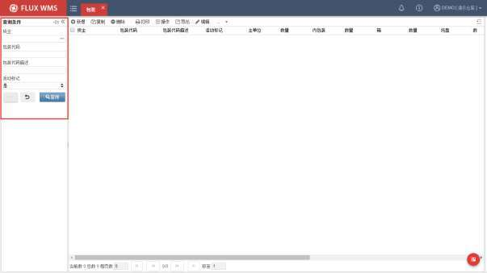

- 或者在界面上方的按钮栏，直接点击【新增】按钮，添加记录。

- 在“主信息”页签，依次输入以下信息：

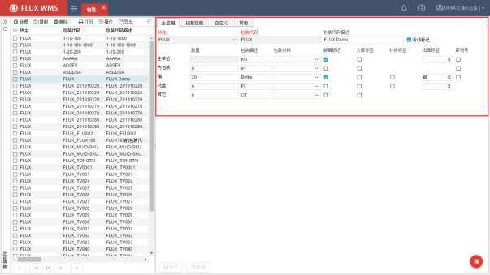

<!-- 原 PDF 第 262 页 -->

货主－使用此包装的货主代码。

包装代码－包装记录的对应代码。

包装代码描述－包装的名称描述。

代码和描述最好能够比较直接的反应包装级别组成（例如 1/10/100），便于后续操作使用，能够比较直观的了解包装层级信息。

活动标记－此包装记录是否使用。

主单位数量－产品包装的最小单位。系统默认设置为‘1’，不可修改。但系统在作业中支持类似 0.5件这样的非整数作业数量，具体显示小数位，根据参数配置确定。

主单位包装描述－针对主单位级别的包装描述。例如：瓶、听、件等。系统提供默认值：EA（Each），客户可根据自身的需求进行更改。

内包装数量－内包装中含有主单位的数量。内包装数量为 6（例如听装可乐，6 瓶一个软塑封装，这一包就是一个内包装），则表明 1个内包装中有 6个主单位。如果数量维护为0，意味着不使用此包装层级，即忽略内包装。

内包装包装描述－内包装级别的包装描述。系统提供默认值：IP（Inner Pack），客户可根据自身的需求进行更改。

箱数量－每箱中包含主单位的数量。例如箱数为 10，代表一箱 10个主单位，如一箱 10件。

箱包装描述－箱单位级别的包装描述。系统提供默认值：CS（Case），客户可根据自身的需求进行更改。

托盘数量－托盘（也被称为栈板）中包含主单位的数量。由于数量都是以主单位为基数维护，如一箱 10件，一托盘 10箱的级别关系，需要维护为 1托盘=100主单位。

托盘包装描述－托盘（栈板）单位的描述。系统提供默认值：PL（Pallet），客户可根据自身的需求进行更改。

其他数量－客户根据需要自行配置的包装层级中包含主单位的数量。

其他包装描述－其他层级的包装描述。系统提供默认值：OT（Other），客户可根据自身的需求进行更改。

包装材料－各级单位包装所使用的包装耗材，例如纸盒、塑料袋等。可选信息内容，通常在耗材管理模式下进行配置，系统在后续作业中，可以统计相应包装材料的使用情况。通过浏览按钮或下拉列表选择预先维护在系统代码或产品组件中的包装耗材记录。（系统参数

<!-- 原 PDF 第 263 页 -->

PAC_MAT_BOM基于 BOM 的包装材料消耗，配置为 Y时界面显示二级框，取组件记录；为 N时界面显示下拉框，显示系统代码 PAC_MAT包装材料的配置项）。

装箱标记－勾选相应的包装级别，表示在该包装单位级别需要进行复核装箱操作。如果不选择，分配时默认此包装级别不需要进行复核装箱，分配明细中的装箱标记默认为“ Y”（复核装箱操作详情请见出库操作的出库复核功能部分）。

入库标签－在相应的包装单位级别中打勾，表示在该包装单位级别打印收货标签。系统的自动码盘也将根据所选择的包装单位级别进行记录拆分。例如在托盘、箱级别勾选，入库2托盘+4 箱，系统码盘得到 6行记录，输出 2个托盘标签、4 个箱标签。如果只勾选托盘标签，系统会认为这是 2个整托盘+1 个不满托的托盘，输出 3 个托盘标签。

补货标签－补货操作中，设置任务的标签打印维度。例如 2箱补货，勾选箱级别，系统会输出 2个任务标签，各对应一箱补货任务，作业时可以每箱上粘贴一张标签；而未勾选箱级别，则输出一个任务标签，要求补货 2箱。由于补货是大包装货物补充到小包装拣货库位，因此仅提供箱、托盘级别的选择项。

出库标签－下拉列表模式，选择此包装级别，分配后的出库标签打印级别，同时拣货任务也将根据出货标签层级的选择来分割或合并分配到的拣货记录。如不选择，即此包装级别，无需打印对应层级的标签；选择为具体包装级别，则意味着按此级别对分配明细行进行拆分，以便打印多张出库标签。

例如箱级别对应下拉列表可选项为空、箱、件，一箱 10件，在未做其他配置情况下，选择为空，分配 2箱，分配明细显示为一行记录 2箱；选择为箱，则分配明细显示为两行记录，每行 1箱，对应可输出 2张各一箱的拣货标签；选择为件，则分配明细显示为 20行记录，每行 1件。具体使用时，可以配合预配、分配规则选择，实现更多配置效果。

序列号－序列号管理模式中，扫描的序列号对应到哪个包装级别，可在此处设置。由于系统会校验序列号数量与货物数量是否相符，需要告知系统采集哪些包装层级对应的序列号，即箱序列号还是单品序列号，以便系统进行数量换算比对。注意并不是 5级包装每级都支持序列号管理。

- 点击页面下方的【保存】按钮，完成记录保存

- 点击控制信息页签，可维护单位对应的长宽高信息：

<!-- 原 PDF 第 264 页 -->

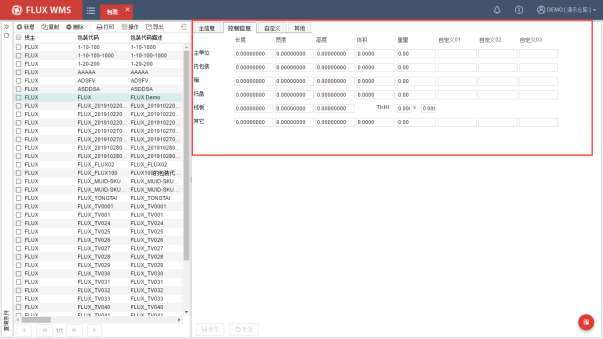

输入各包装的长度、宽度、高度、体积、重量，以及托盘的 TI，HI。

注：托盘中分两行。第一行托盘的长度、宽度、高度、体积是指托盘栈板上的可堆放产品总的长度、宽度、高度、体积。

第二行栈板的长度、宽度、高度、体积指栈板本身（即木制托盘）的长度、宽度、高度。

TI x HI信息，TI指栈板上一层能放几箱，HI 指栈板上能放几层，即托盘上货物箱的堆放方式，用于指导现场进行标准化托盘堆码。

- 点击【保存】按钮，完成新增包装操作。

注：对于液体包装，可通过系统配置（代码 PKG_CVT）的切换，采用非级别递进方式的维护包装信息。例如 1EA=1桶，1CS=75 升，1PL=120 公斤，代表 1桶=75 升，1 桶=120 公斤。

## 6.2. 批次属性

批次属性功能用于定义系统批次属性管理相关配置及其详细资料。

仓库中的产品是和批次属性联系在一起的，批次属性是指能够区分相同商品（即同一 SKU 代码的产品）的不同的属性。例如：一个食品生产商可能根据食品的有效期到期日，或者生产日期进行批次属性区分；一个服装生产商可能根据服装面料的供应商来分批次属性。

<!-- 原 PDF 第 265 页 -->

在批次属性功能中，根据货主的管理要求进行设置，是一个表示不同商品的类似属性的集合，通常是出库时可能用来区分货物的附加信息。如果出库时不需要区分货物，一般不建议增加过多的批次属性跟踪信息，越多的信息会对进出库操作带来更加精细的指令要求。

货主可以用收到货的日期、批号（生产商指定的）、颜色、截止日期、生产日期等等信息来定义批次属性。

而批次号是 FLUX WMS 系统在收到货物时根据不同的批属性而自动产生的流水号。

系统自动生成的批次号＝客户＋产品＋12 个标准批次属性+12 个扩展批次属性。

只要客户、产品和 24个批次属性内容这些信息中有一个与库存已有记录不同，系统就会生成一个新的流水批次号表示这一系列的内容，以便同其他货物加以区分。

由于不同客户甚至不同产品所需记录的批次属性信息各不相同，这些信息还需要记录到库存中，并在出库操作中应用，因此系统采用批次属性代码来规划不同的属性信息记录要求，并提示用户，不再需要人为记忆不同货主的不同要求。

- **批次属性设置**

- 在主菜单“基础设置”下选择“批次属性”。

- 点击按钮栏的【新增】按钮，在“主信息”页签依次输入以下信息：

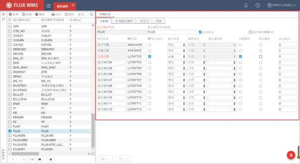

批次属性代码－代表这一条批次属性管理规则的代码。

<!-- 原 PDF 第 266 页 -->

批次属性代码描述－批次属性的名称描述。

活动标记－此属性设置是否生效

批次属性 5/6联动－是否启用批次属性 05、06的联动设置。例如批次属性 05配置为省，选择后，批次属性 06仅可选择指定省内的市。具体设置可参考本章后续的“批次属性联动”相关设置介绍。

批次标签－批次属性在 WMS 界面显示的名称。生产日期、失效日期和入库日期是系统预留的，并且不能更改，只能根据需要选择使用与否。而批次属性 08（lot08）字段可以通过参数配置（LCK_L08），锁定为良品不良品区分字段。锁定字段的目的，是使用不同批次属性的不同产品，可以沿用相同的保质期管理逻辑，避免不同产品将日期或良品属性放在不同字段，难以统一管理。其余属性字段，可以根据管理需要自行录入，例如产地，供应商等等。

RF标签－在 RF终端设备上显示的批次属性名称。可以与 WMS 界面显示不同。主要原因是 RF界面位置有限，经常需要以缩写形式显示。

RF是否显示－有些批次属性信息，在原始单证上已经存在，入库时不需要作业人员现场核对或者录入，只用于区分库存，出库时指定条件出库。可以在 RF界面上隐藏，从而避免错误修改，通过 RF 显示字段控制哪些批次属性 RF上可见。

输入控制－控制相对应的批次属性的输入情况，系统提供禁用、必输、可选、只读几种选择。必输字段，在收货时如果批次属性内容为空，会提示为不可收货。只读主要用在接口传递的信息，现场不允许修改的业务情况。禁用，系统会在操作界面隐藏此属性字段值。

属性格式－相对应的批次属性的格式控制要求，系统提供字符、数字、整数、日期、日期时间几种选择。

批次属性值－相对应的批次属性的可输入值，如启用该字段能够限定输入的内容，以下拉列表的模式提供选择，避免相同信息不同操作员输入内容不同（如红色，输入为红、大红、RED等），导致批次拆分。系统提供良品/非良品、组装状态、库存选择、YesNo 等多种预设选择，并可根据业务需要在系统代码中自行配置（详见后续“批次属性下拉列表设置”相关说明）。

关键属性－针对上架规则中，“不允许混放批次”和“库位内必须有相同批号的库存”等控制项。在判断批次是否混放或者是否相同时，有时仅需要根据批次属性中的某一个或某几个进行判断，而批次号可能不同，例如相同供应商的货物可以放置在同一库位，不需考虑入库日期是否相同。此时可将“供应商”这个批次属性项设置为关键属性，系统在上架规则判断中，根据勾选的批次属性关键项进行混放或相同判断，而不是根据批次号进行判断。

验证属性－某些货物对批次敏感，在出库、移动等作业时需要对货物的批次属性信息进行验证、比对。但通常情况下并不需要比对全部批次属性，仅对关键信息进行比对即可。例

<!-- 原 PDF 第 267 页 -->

如电子元件，出库时需要比对生产批号信息，避免拣错批次，但无需比对入库日期、供应商批次属性内容。这些属性可以标记为验证，作业时会要求录入，由系统比对、校验。

显示顺序－RF 上显示批次属性字段，需要变更属性字段显示的顺序时，可以通过变更显示顺序内容实现。

- 点击“保存”按钮，完成新增批次属性的操作。

- 选择“扩展批次属性”页签，继续维护扩展属性设置。

一般将较少使用的，无需现场修改的信息（例如入库报关单号等可以提前从单据中获取的信息），通常用作扩展批次属性。维护界面与主批次属性相同，如下图所示。

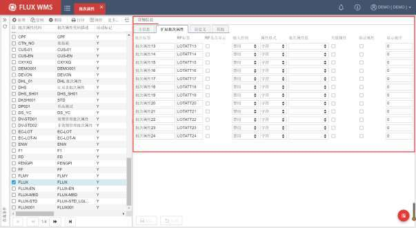

- **批次属性下拉列表设置**

部分情况下，批次属性需要输入的内容有限，例如颜色，为了避免不同操作员输入不同的内容表示相同的信息，如红色、红、正红、RED 等，导致批次琐碎，给后续作业带来不必要的细分工作量，可以通过配置，将批次内容设置为下拉列表选择，限制用户的录入内容，达成统一输入的目的。

首先在【业务系统管理】-【系统代码】功能中，增加代码，例如 LOT_COL（颜色），并勾选“批次属性使用标志”选择框（如下图 6-2-3），系统会把这个代码作为批次属性的可指定属性内容。在批次属性的属性选项中可见配置的颜色代码选项（如下图 6-2-4）。

<!-- 原 PDF 第 268 页 -->

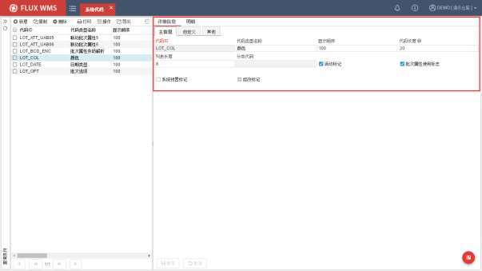

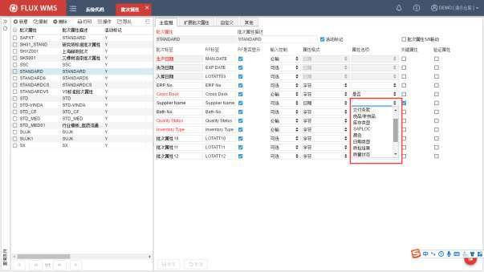

然后，在系统代码功能中，这个“LOT_COL”代码的明细部分，维护各种颜色内容，如红色、黄色、蓝色。这些是 ASN 中可见的下拉列表的显示内容。同样的，勾选“默认代码标志”的代码记录将作为新增 ASN 明细记录时的批次属性默认值。

<!-- 原 PDF 第 269 页 -->

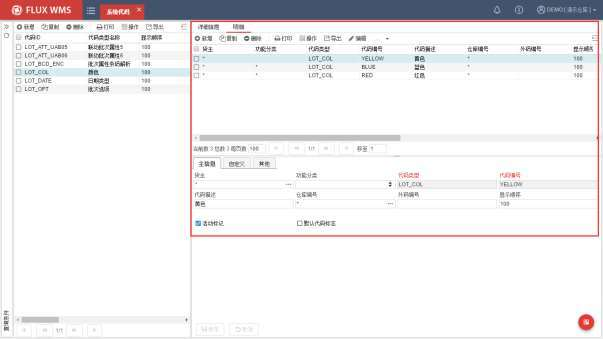

配置完成后，使用这个批次属性的产品，在收货单据中，对应批次属性项只能通过下拉列表选择“LOT_COL”下的具体代码，例如红色、绿色，而不能任意录入内容。

对于下拉列表内容较多的属性，在单证中，也支持输入部分内容快速定位到相关属性，但同样不允许输入列表之外的内容。

- **批次属性联动**

若勾选“批次属性联动”字段，则“批次属性 05”属性下拉框显示系统代码 LOT_ATT_UAB05下的所配置的明细记录；“批次属性 06”属性则显示系统代码 LOT_ATT_UAB06 对应明细，并仅显示“LOT_ATT_UAB05”相同分类(Category)的数据。

配置后可以实现“批次属性 05”选择大类，“批次属性 06”显示此大类下的具体记录的作业模式，类似地址选择时，选择了“省”之后，再选择此省内具体“市”的效果。

<!-- 原 PDF 第 270 页 -->

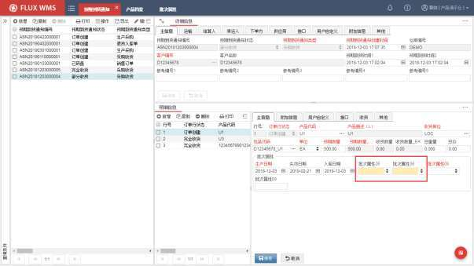

## 6.3. 循环级别

循环级别主要用于巴雷托分析法（ABC 分类法）优化仓库布局，即约 20%的货物，进出量可能占仓库总量的 80%，因此这些货物存放在最方便操作的库位（例如靠近巷道口、输送线投放口，或者拣选货架中部、层高最方便拣选的作业层），能够大幅度提升仓库作业效率。

但不同作业模式下，货物统计、排序方式不同，级别划分也会根据需要波动，并不限定只能是60%、85%的 ABC 等级分隔线（即排位比率前 60%设置为 A，60%~85%设置为 B级，85%~100%设置为 C级的最常见分级标准）。因此需要对每个级别先行定义，可以配置多种不同的级别规则。不同的仓库，甚至不同产品，进行分级时的依据也有可能不同。

- **循环级别设置**

- 在主菜单“基础设置”下选择“循环级别”功能。

- 点击【新增】按钮，在“详细信息” -“主信息”页签，维护循环级别的规则编组ID和名称信息，如下图。一个循环编组号，代表一种ABC 分组模式。

<!-- 原 PDF 第 271 页 -->

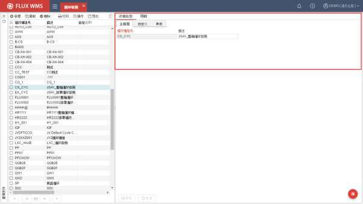

- 保存后，在对应的明细部分，进一步维护分级标准信息，如下图所示：

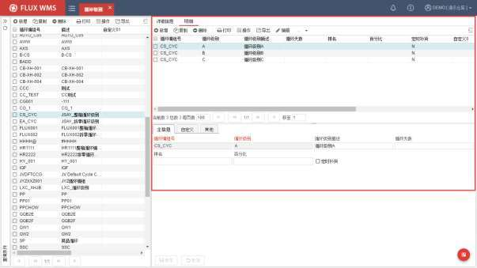

循环编组号－循环级别组代码。

循环级别－循环级别代码。

<!-- 原 PDF 第 272 页 -->

循环级别描述－对该级别的描述。

循环天数－循环级别设定周期天数。

排名－级别排序。例如前 10位是 A 级（排名字段输入 10），10~50是 B级（排名字段输入 50）。后续级别的排名必须大于前一级别。

百分比－该级别货物的周转率在全部货物周转率排序中所在百分位。通常排名与百分比方式二选一，不会同时使用。

定时补货－此类产品是否参与定时补货。通常慢速周转的产品，不参与大批量的定时补货，但执行订单驱动补货。

- 点击【保存】按钮，完成此级别设置操作，所添加的记录在上方列表部分显示。

## 6.4. 货物类型

在管理产品时，有时需要根据货主的要求对产品进行分类管理，如电 器类、食品类或是选装件、唯一件等，不同类的产品管理方式也会有所不同，例如需要冷冻存放的食品，需要整箱拣货的电器元器件等。货物类型就是提供给客户自行定义产品类别以及对应管理要求的功能，简称货类。

货类中所设置的规则、产品有效期信息等内容，在新增产品档案时，如果设置产品属于此货类，则将货类中的相关设置作为产品相关信息的默认值，简化产品新增时的维护工作。

对于未选择所属货类的产品，则仍旧使用货主在客户档案中维护的内容作为默认值。

- **货物类型**

- 在主菜单“基础设置”下选择“货 物类型”功能。

- 点击【新增】按钮，在详细信息部分的“主信息”页签，维护此货类的描述以及默认管理规则等信息，如下图。

<!-- 原 PDF 第 273 页 -->

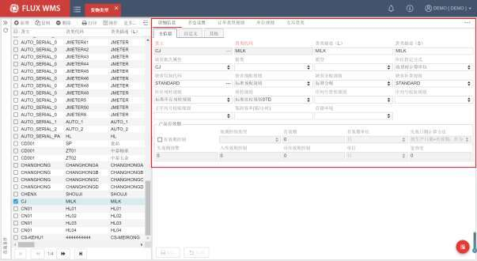

货主－货类所属的货主代码。货类是从属于货主的产品分类方式，不同货主间的货类不会共用，即使货类 ID、名称相同，管理要求也不一定相同。因此维护货类代码信息时，需要指明所属的货主。

货类代码－货类代码 ID。

货类描述－货类代码的描述信息，系统提供母语（L）、外语（S）两个字段。

缺省规则－不同类型产品的管理要求不同，可以在货主默认的管理信息基础上，为不同货类分别维护不同的分配、补货等管理规则、以及默认包装代码、批次属性等内容。

箱类、箱型－此类货品，在拣货操作中所用的周转箱箱类、箱型。也即组箱计算中使用的箱类、箱型。所供选择的下拉列表信息在【基础设置】-【装箱】功能中维护。

序列号管理规则－此类产品，操作时的序列号采集、管理要求。下拉列表内容为在【业务规则】-【序列号管理规则】功能中已经维护过的规则，显示对应描述。

序列号校验规则－1 级序列号管理时，遵循的序列号校验规则。需要先在【业务规则】-【序列号校验规则】功能中配置对应规则内容。

子序列号校验规则－2 级序列号管理时，子序列号遵循的序列号校验规则。需要先在【业务规则】-【序列号校验规则】功能中配置对应内容。

装卸效率（箱/小时）－主要用于月台预约时，根据货量计算所需卸车时间，从而得到月台占用时长管理过程中。不同产品装箱效率不同，可以按照货类进行设置。

<!-- 原 PDF 第 274 页 -->

存储环境－用于记录此类产品的存储环境要求，如冷冻、常温、恒温等。下拉列表内容在系统代码 ENVIRONMENT_TYPE中进行维护。货类的存储环境，将作为此类产品的存储环境默认值。如果作业时开启了库存环境校验（通过系统参数 ENVIRONMENT_CHECK进行设置），则上架、移库、转移等库位变更环节，系统会校验，作业产品要求的存储环境，与操作的目标库位的所属存储环境是否相符，避免将要求冷冻或恒温恒湿的产品，移动到常温存储库位上。

产品有效期－同类货品，有效期要求相同，可以在货类中统一设置，减少每个产品的重复设置。例如是否启用保质期管理，按生产日期控制，还是按到期日期控制，提前预警天数等。新增产品时，如果为产品指定了对应货类，而货类又配置了有效期管理信息，产品将继承货类的这些配置，有需要的话可以单独修改个别产品的配置细节。

有效期控制－是否启用有效期管理，选中表示需要按照产品的库存生命周期管理产品。

效期控制类型－系统计算产品的库存周期的方式类型。如按照入库日期开始计算产品的有效期，还是产品本身有保质期到期日信息（即失效日期）。系统提供生产日期、失效日期、入库日期选项。

有效期－产品通常有效期长度，说明字段，不做强制控制，仅在根据生产日期计算失效日期情况下使用，如果选择的周期类型为“失效日期”，那么系统直接根据批次属性 02的具体失效日期进行管控，此处的有效期字段将被忽略。

有效期单位－为了方便保质期较大的产品的信息维护，系统提供有效期单位选择，下拉列表为年、月、日。预期到货通知收货计算效期时，会根据效期配置“单位”自动换算出所对应日期有效期数值，用于更新批次属性 02的失效日期。例如产品保质期为一年，则输入有效期 365，单位日，系统根据生产日期，加上 365天计算得到失效日期。或者输入有效期1，单位年，系统自动换算为 365日，可以得到相同的失效日期。但遇到闰年，单位“年”的情况下系统可以自动按 366日换算。

失效日期计算方式－根据生产日期+有效期来计算产品的失效日期过程中，不同行业/企业对计算的细节有不同要求。系统提供几种选项：

- 按生产日期+有效期，作为失效日期。常用逻辑。

- 按生产日期+有效期，取前一天作为失效日期，即失效日期当天货物可用。有些企业习惯将失效日期标记为货品可用的最后一天，可采用此模式。

- 按生产日期+有效期，取前一月的月末作为失效日期。这种逻辑在药品管理中比较常见。

失效期预警－冻结控制前，提前多少时间发送预警信息。例如距离失效节点，提前 30天库存冻结，在冻结前提前 10天进行预警。即距离失效日期 40天开始预警。

<!-- 原 PDF 第 275 页 -->

入库效期控制－产品从入库日期开始算起，在仓库中能够安全存放的最长时间。超过限制时间的产品，将不能作为正常品出库。

出库效期控制－产品从出库日到失效日期有效时间。如果产品的有效时间小于设置的出库效期，将不能作为正常品出库，即临近过期的产品，为避免出库时未过期，运输到客户手中已过期，需要提前进行出库管控或处理。

单位－失效期预警、入库效期控制、出库效期控制的时间单位。下拉列表为年、月、日。方便有效期单位，与效期控制单位不同的情况下（例如有效期一年，入库效期控制 9个月），分别设置时间单位。

宽容度－食品行业效期管理，单个库位内可混放的有效期间隔设置。例如设置为 5天，生产日期管理模式下，即意味着库位内货品最小生产日期与最大生产日期间隔不能超过 5天。需要配合 DATE_TOLERANCE_CONTROL参数（产品有效期宽容度设置）生效，参数开启情况下，上架计算时，根据有效期控制类型计算可混放的批次。

- 点击【保存】按钮，完成货类主要管理信息的维护操作。

- 根据需要维护多仓设置

如果同一个货类在不同仓库的管理要求不同，可以在“多仓设置“页签，进行对所选货类代码进行相关维护，如下图：

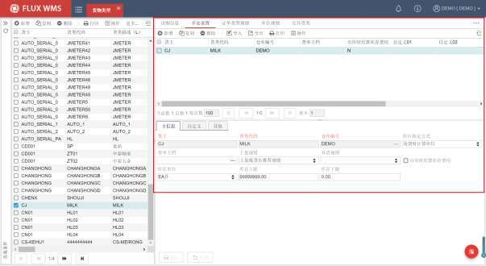

货主、货类代码－系统自动带入主信息内容。

<!-- 原 PDF 第 276 页 -->

仓库编号－当前多仓记录对应的仓库。可以通过二级窗口选择。

库位指定方式－系统计算上架库位的处理节点。

费率主档－此类货品，在指定仓库中的计费时所采用的费率主档代码，即客户主合同 ID。不同仓库由于所处地区人工成本不同，计费费率可能有所有不同。

上架规则、补货规则－此类货品在指定仓库中的默认规则。

出库时计算库存费用－选择后，系统仅在产品发运出库时计算其全部库存费用，在库内的存货不计算库存费用。

库存单位－当前货类产品，在指定仓库中，按何种单位显示库存余量查询数量，以及作为库存标签打印单位。例如配置为 CS箱后，相关库存显示会换算为箱数量，显示为 XX 箱。

库存上限－当前货类产品在指定仓库中的库存上限。若库存数量高于库存上限，系统会通过预警功能提示或自动暂停向供应商订购商品。

库存下限－当前货类产品再指定仓库中产品的库存下限。当库存数量低于库存下限时，系统生成预警提示。

- 订单类型设置

如果不同仓库中，不同订单类型的管理要求有不同，也可在货类中进行相应配置，如下图：

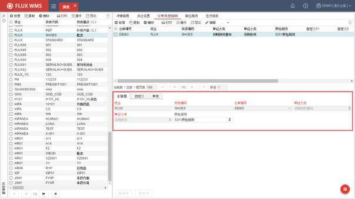

<!-- 原 PDF 第 277 页 -->

可以为不同仓库，不同订单类型分别定义指定的质检规则。

- 库位规则设置

货物上架时，不同类型货物有可能堆叠要求不同，例如有的货物能够承压，可以多个托盘叠放，有的货物不能压，地面平仓只能放一层。导致同样面积的库位，在放不同货物时，能放入的托盘个数不同。

此类情况可以在货类中，设置库位规则，即这类产品，在这个计算上架到指定库位类型时，能够放入的托盘个数限制。仅在上架规则的“空间限制”设置中选择了“托盘数量限定”的情况下生效，优先根据货类的库位规则设置计算能够放入的托盘个数；货类中没有设置库位规则的情况下，再按库位设置的托盘个数计算上架。

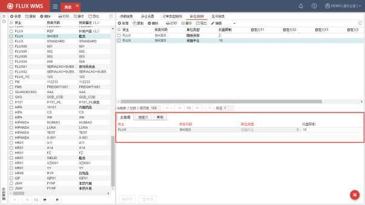

- 互斥货类

仓库管理货物时，经常会有些不同货物，不能混放在一个库位，甚至不能临近存放，出库时不能打包在一个包装箱里的情况，例如食品与洗涤剂。类似情况，系统将这些货物设置为互斥货类，在上架计算、移库、分配装箱时，严格进行限制。

<!-- 原 PDF 第 278 页 -->

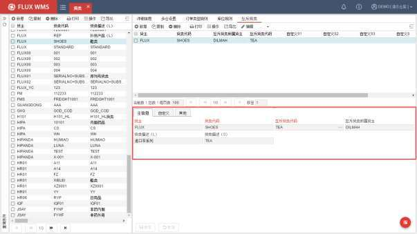

维护信息时，A 货类的互斥货类是 B，保存后，系统会自动给 B货类增加一条互斥货类的是 A的记录，配对出现，同时删除。并且互斥的情况，允许跨货主设置互斥货类。

## 6.5. 装箱

装箱功能，主要用于预先定义操作中所用的周转箱的尺寸等信息，便于系统装箱计算或对体积等信息的统计。

由于仓库中经常不同产品使用的周转箱体积大小不同，甚至不同货类用的周转箱不是同一套系列的情况，因此在系统中可以维护多套装箱体系，并可区分多个仓库共用的公共装箱信息，或者单独某个仓库使用的局部装箱信息，通过“公共”、“局部”页签能够切换查看。

- **装箱设置**

- 在主菜单“基础设置”下选择“装箱”功能。

- 在界面左上角，选择对应维护公共箱型记录还是局部箱型记录。

<!-- 原 PDF 第 279 页 -->

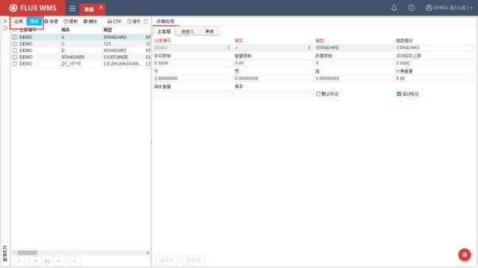

- 点击【新增】按钮，在“主信息”页签，依次输入以下信息：

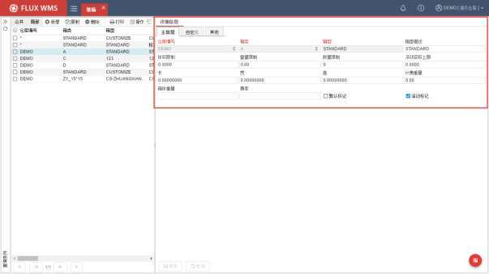

仓库编号－当前仓库代码 ID。公共箱型设置，仓库编号默认为*。

箱类－装箱组合代码或者套系代码。例如 A组合是大箱组合，B 组合是小箱组合。

<!-- 原 PDF 第 280 页 -->

箱型－周转箱类型代码。

箱型描述－周转箱名称描述。

体积限制－周转箱容量上限信息。

重量限制－周转箱容量上限信息。

数量限制－周转箱容量上限信息。

浮动容积上限－如果尾箱容纳的产品体积，在浮动容积上限范围内容，可直接与前一箱并箱，以减少派箱的数量。

长－周转箱尺寸信息。

宽－周转箱尺寸信息。

高－周转箱尺寸信息。

计费重量－理论重量用于费用计算，常用于无实际称重条件的作业模式中。

箱体重量－周转箱自身空箱重量，也常被用于皮重统计。

费率－出库复核环节，使用不同出库箱型，收费的业务模式中，需要在装箱功能中，为每种箱型设置对应的计费费率。

默认标记－此箱型记录，是否作为此装箱组（即箱类）的默认箱型。

活动标记－是否使用此箱型。

- 点击【保存】按钮，完成设置操作。

某个仓库自用的箱型设置，在【局部】中进行配置。配置内容同【公共】箱型，但需要指定具体仓库编号，新增记录时，默认为当前登录仓库。

## 6.6. 海关 HSCode

HS Code是Harmonized System Code的缩写，是国际海关公认的进出口产品分类标准。使用正确的名称和编码是出口营销中的重要方法。

在 FLUX WMS系统中提供【海关 HSCode】功能，根据中国海关相关要求，维护 HSCode信息，供产品档案选择使用。

- **海关 HSCode设置**

<!-- 原 PDF 第 281 页 -->

- 在主菜单“基础设置”下选择“海关 HSCode”功能。

- 点击【新增】按钮，在“主信息”页签依次输入海关编号相关信息：

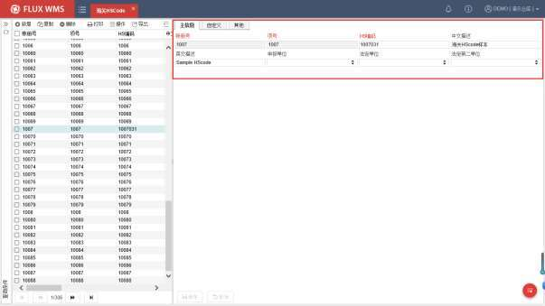

账册号－海关授予企业的电子账册号码。由企业（即货主）向海关申请后获得。

项号－海关编码的项号。类似与账册中的行号，因此同一账册下，项号不会重复。

HS 编码－海关编制的 HS编码，即 HSCode。一个项号对应一个 HS编码。不同项号下可能会有相同 HS 编码。

中文描述－海关编码对应描述。

英文描述－海关编码外文描述。

申报单位－对应单位信息。

法定单位－法定计量单位，根据中华人民共和国海关统计商品目录填写

法定第二单位－法定第二计量单位，根据统计商品目录中的法定第二单位填写。

- 点击【保存】按钮，保存设置。

<!-- 原 PDF 第 282 页 -->

## 6.7. 客户档案

客户档案是用于定义客户、客户类型和客户管理要求的配置功能。

在 FLUX WMS 客户档案中，货主是用于区分产品货权从属的依据，同时，客户档案还用于记录供应商、承运人、结算人等的信息。

客户类型是用于对客户进行分类，每一个客户必须对应一个客户类型。客户类型的定义是系统代码中进行的，用户也可以自行添加其他的客户类型，但新增的类型，系统中不会有相应特殊处理，仅用于区分客户。

系统提供的默认客户类型包括：

- 货主－产品的所有者。通常是仓库进出产品、提供服务的主要对象。

- 收货人－产品交付的客户对象，即发货对象。

- 供应商－产品采购的客户对象、货物来源。

- 承运人－提供产品运输的客户对象。

- 结算人－除货主之外的，支付仓库服务费用的客户对象。例如仓库中有货主 A 公司、B 公司，但 2 家公司的相应费用都由其代理商C 公司支付，而C 公司本身没有货物在仓库中，C 公司就是结算人。

- 下单方－有权代替货主下达进出库订单的代理商或经销商等，但通常不负责相关费用的结算。

- 其他－其他类型的客户。

- **客户档案设置**

- 在主菜单“基础设置”模块下选择“客户档案”功能。

- 点击【新增】按钮，在“详细信息”-“主信息”页签，依次输入以下信息：

<!-- 原 PDF 第 283 页 -->

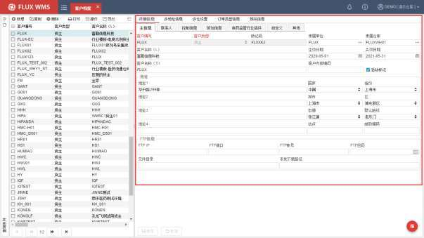

客户编号－客户代码 ID，同一类型下不可重复，但系统允许不同类型下有相同编号的客户记录。例如客户 ID A1本身是货主有货物存放在仓库，但同时它又是另一个货主 B2的收货人，此情况可以分别维护 A1货主记录，与 A1收货人记录，方便分别配置不同的联系信息、管理信息、费收信息等。

客户类型－系统提供货主、供应商、承运人、收货人、结算人、下单方和其他等不同的客户类型，通过下拉列表选择。如需增加更多客户类型，可在系统代码中进行维护（系统代码配置可参考【业务系统管理-系统代码】章节的介绍）。

助记码－用于方便现场快捷查询的简称代码。可以在新增记录时进行维护，保存后不可修改。系统会自动提取中文名称的每个字的首字母作为默认的助记码显示。根据“客户”条件查询记录时，系统会对客户代码、客户名称、助记码字段一起进行查询。

隶属单位－如果多客户之间存在隶属关系，例如多个货主属于同一集团公司，可以通过隶属单位设置从属关系，以便按照集团进行查询、统计等管理；同时如果供应商、承运人等有服务对应限定，例如 A承运人只为 FLUX货主提供服务，其他货主不可选择此承运人，即A承运人隶属于 FLUX货主，也可通过该字段维护隶属关系。隶属单位必须首先作为一个独立的客户代码在客户档案中进行维护。

需要说明的是，操作员如果只具有部分货主权限，即只能看到部分货主（例如仓库内有货主 A、B、C，作业员仅具有 A、B货主权限），而同时货主又配置对应隶属的专有供应商、承运人等，则相应的这个操作员的在查询、选择供应商、承运人记录时，也会被限定，只能

<!-- 原 PDF 第 284 页 -->

查看到具有权限的货主名下的专有供应商、承运人（例如可以查看到 A、B 货主的专有供应商、承运人，但看不到 C货主的专有供应商、承运人），以及没有隶属关系的公共承运人、供应商。即隶属关系的配置，会使得供应商、承运人受到货主权限影响。

隶属仓库－供应商、承运人、收货人类型的客户，从业务归属上往往可能只与某个仓库关联，例如供应商 A 只给上海仓供货，不会给深圳仓和北京仓供货，则在深圳仓或者北京仓的订单中选择供应商时，不应该出现供应商 A。针对此场景，可以为供应商 A 定义隶属仓库为上海仓。不定义隶属仓库的供应商为公共供应商。承运人和收货人同理。

客户名称－客户名称描述。系统提供母语（L）、外语（S）两个描述字段。

生效日期/失效日期－客户许可证、批文等的有效期范围。

活动标记－使用中记录。未激活的货主不可进行收发货等操作。

地址－客户的地址相关信息。如一个客户有多个收货地址，可在“多地址信息”页签继续维护。

默认路线－客户默认所属运输路线。主要对于收货人，在自动分派出库集货位功能中使用；也常用于区分、集合查询同一运输路线上的客户。路线通过下拉列表选择，具体路线内容在“系统代码”中维护。

站点－收货人所属站点信息。常作为集货时的顺序依据，可以根据站点排序安排集货位使用。

邮政编码－客户所在地的邮政编码。

FTP信息－用于配置货主 FTP的相关地址、账号、密码、文件目录信息。

- 在联系人页签，输入主要的联系人信息，包括名称、职务、电话、电子邮件和传真等。

<!-- 原 PDF 第 285 页 -->

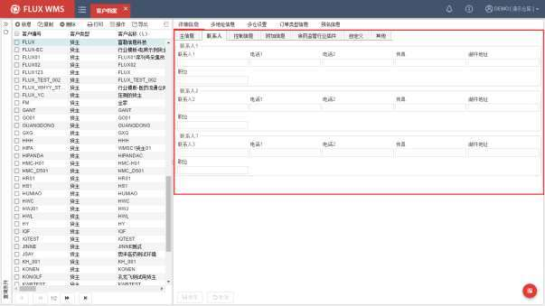

- 客户的管理控制要求，维护在控制信息页签，只针对货主类型客户有效：

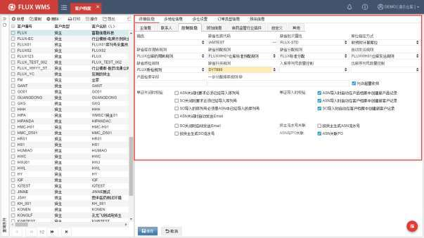

箱类－货主默认的装箱箱类代码。下拉列表中的箱类选择项，在基础设置的“装箱”功能中进行设置。

<!-- 原 PDF 第 286 页 -->

缺省包装代码－该货主产品常用的包装代码，将自动作为此货主名下产品的缺省包装选择。新增客户记录时，默认取此货主名下代码为‘STANDARD’的记录，具体包装代码设置请参考【基础设置-包装】章节的介绍。

缺省批次属性－默认的批次属性，将作为此货主名下产品的缺省默认批次属性。新增记录时，默认取代码为‘STANDARD’的记录。具体批次属性设置可参考【基础设置-批次属性】章节的介绍。

库位指定方式－默认的系统计算上架库位的时间节点。系统提供人工指定库位、收货时计算库位、上架时计算库位 3 个选项。客户档案中的配置作为产品档案新增记录时的默认值使用，具体上架计算时以产品档案中的设置为准。

- 人工指定即不进行系统指导的上架操作。即使收货到过渡库位同样不会触发上架任务；

- 希望系统提供上架指导时，一般要选择收货时计算库位；

- 上架时计算库位，仅应用于 RF操作中，收货时不计算上架，而是上架操作时才计算上架库位。

缺省库存周转规则－默认的库存周转规则，具体参考业务规则设置。将作为产品的缺省库存周转规则。默认取代码为‘STANDARD ’的记录。

缺省预配规则－默认的预分配规则，具体参考业务规则设置。将作为产品的缺省预配规则。默认取代码为‘STANDARD’的记录。

缺省分配规则－默认的分配规则，具体参考业务规则设置。将作为产品的缺省分配规则。

自动发运规则－默认的发运规则，具体参考业务规则设置。

缺省质检规则－默认的质检规则，具体参考业务规则设置。将作为产品的缺省质检规则。

缺省补货规则－补货操作中，如需要系统执行动态补货，自行查找新的拣货库位时系统执行的补货库位计算逻辑规则。

入库序列号数量控制－收货环节的序列号验证方式。系统提供如下几种模式选择：

- 序列号数量与入出库数量必须一致：系统对通过扫描序列号累加获得的数量，与待入库数量进行比对，两者一致才能继续操作。

- 序列号数量覆盖入出库数量：以序列号扫描累加的数量作为收货数量。

- 不验证序列号数量：仅采集序列号，不做数量比对，也不做数量覆盖。

出库序列号验证－发货环节的序列号验证方式。可选模式同入库序列号验证模式。

<!-- 原 PDF 第 287 页 -->

产品检索字段－对产品进行模糊查询匹配时，有的客户输入内容需要与 SKU代码、中文名称、英文名称、别名等多个字段进行比对，而有些客户则只需要比对 SKU代码、别名 1字段即可。通过配置货主对应的 SKU 模糊查询范围，可以减少 SKU 模糊查询时的系统资源消耗，在 SKU 量较大时，提升查询效率。

一步分配排序规则－在不考虑预配，直接执行一步式分配的情况下使用，可设置按库位或其他条件排序进行库存分配。

允许超量收货－收货时，所收货物数量是否允许超过订单数量。

ASN/SO关闭时要求必须已经导入序列号－ASN、SO 关闭时校验订单中是否已经完成序列号导入操作。具体导入步骤参考 ASN 和SO 的操作部分。

SO 中导入的序列号必须是 ASN中已经导入的序列号－对 SO中导入的序列号正确性进行校验，必须是之前收货过程中已经导入到 ASN中的序列号。

ASN/SO关闭时自动发送 Email－在预期到货通知 ASN，或者发运订单 SO 关闭时，是否需要将对应的入库验收报告，或者出库验收报告，通过 Email发送给客户。需要与邮件服务器配合使用生效，在预警模块中相应进行配置（预警配置细节，请参考【16 预警】章节的介绍）。

ASN 导入时自动在产品档案中创建新产品记录－导入 ASN 信息时，对于不存在的产品信息，自动创建新产品档案，字段值取客户档案中的默认值。

ASN/SO导入时自动在客户档案中创建新客户记录－导入 ASN、SO 时，如果收货人或者供应商信息未维护过，自动将不存在的客户信息写入客户档案，字段值取默认值。

按货主生成 ASN/SO流水号－如勾选，将以货主代码作为为系统自动生成的订单号的前缀，每个货主单独生成订单流水号。例如 A 货主的订单号为 A001，A002，A003……；B 货主的订单号则为 B001，B002，B003……。需要提醒的是，系统订单默认排序是按订单号倒序排列。

ASN 是否与 PO 关联－用于通过提取 PO 生成 ASN 的场景，如勾选，ASN 收货后将更新对应 PO 的相关收货数据信息。

- 在附加信息页签，依次输入以下信息：

<!-- 原 PDF 第 288 页 -->

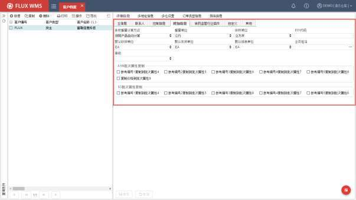

体积重量计算方式－该货主的费率计算时提取计算依据的方法，系统提供录入整票单证总量、按照产品手工录入、按照产品自动计算，3 种计算方式供选择。具体计算方式应用将在【18 费收管理】部分详细介绍。

重量单位－维护该货主使用的重量的计量单位。

体积单位－维护该货主使用的体积的计量单位。

EDI 代码－接口处理时与外部系统对应的客户代码。例如 FLUX WMS 中客户代码是A01，但上游接口中客户代码是 B35的情况，维护接口转换代码，供 Datahub传输接口数据时使用。

默认收货单位－产品收货时常用的包装级别单位。例如按件收货，还是按箱收货。

默认发货单位－产品发货时常用的包装级别单位。

默认报表单位－报表打印的缺省单位以及库存查询默认显示单位。下拉列表内容为包装代码内设置的可用包装层级，选择非 EA包装层级，例如箱，相应库存查询时可以将 XX 件库存根据包装设置转换为 XX箱库存数量进行显示。

业务担当－该货主在仓库内对应的负责人员。可通过浏览按钮，在二级窗口中选择，所选记录则在“仓库员工”功能中维护。

等级－客户在根据月台分配规则，分配月台时的客户等级，例如普通还是 VIP。如果月

<!-- 原 PDF 第 289 页 -->

台规则中设置使用优先级，则会考虑 VIP客户优先安排月台。

ASN 批次属性复制项－选择对应的复制字段后，系统在收货时将把对应的 ASN（预期到货通知）表头部分输入的参考信息内容复制到对应的批次属性位置，能够把单证总体信息批量录入为批次属性，便于库存跟踪。

SO 批次属性复制项－选择对应的复制字段后，系统将把对应的 SO（发货订单）表头部分输入的参考信息内容复制到对应的批次属性位置。能够把单证总体信息批量录入为订单分配条件，便于分配、出库操作。

注：收/发货复制项的选择，要求所选的复制目的批次属性，不能为禁用状态。作业时，如果复制的目标属性字段已经非空，例如收货员已录入属性内容，则不会再被复制。录入值优先于系统复制值。

- 点击【保存】按钮，完成客户主要信息的设置。

- **其他页签设置**

根据客户的管理需要，还可以进一步设置更多的相关信息：

- 多地址信息：

如果客户有多个地址（一般用于一个收货人对应多个收货地址的情况），除了主信息页签的地址，系统支持在多地址页签维护客户的其他地址。在如下图的“多地址信息”页签界面，点击页签的【新增】按钮，逐条添加地址。需要注意的是，所添加的记录从属与当前维护的客户主记录信息。

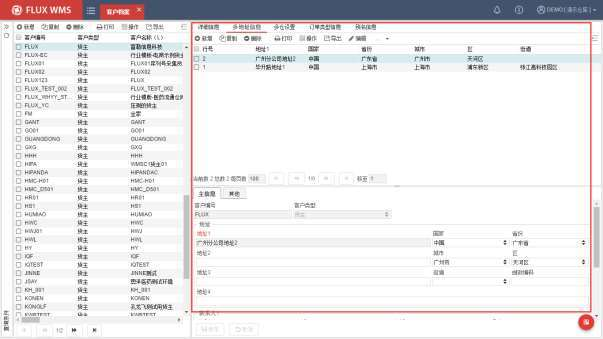

<!-- 原 PDF 第 290 页 -->

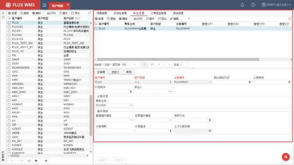

发运订单中根据参数 MLT_ADD（是否维护收货人的多个地址信息）的配置信息，来判断默认提取客户档案主信息地址，还是默认提取多地址页签维护的首个地址。

不论何种模式，可人工在预期到货通知、发运订单中通过浏览按钮选择多地址信息。

- 多仓信息

多仓管理模式下，同一个货主的货物，在不同仓库，管理要求不同，因此系统按照不同仓库设置不同的业务规则的功能。

客户档案的多仓设置内容，将作为客户名下产品的多仓设置记录的默认值，根据仓库编码对应显示。

*图6-7-6（图像未能从 PDF 对象中直接提取）*

客户编号－当前所维护记录的货主代码ID，新增时自动获取，不可编辑修改。

客户类型－当前所维护记录的客户类型，新增时自动获取，不可编辑修改。

仓库编号－指定仓库的 ID信息，保存后不可修改。

库位指定方式－指定仓库中执行的库位指定方式。

上架规则－指定仓库默认上架规则代码，适用于同一货主，多仓管 理，不同仓库上架规则要求不同的业务场景。

<!-- 原 PDF 第 291 页 -->

补货规则－指定仓库默认补货规则代码，适用于同一货主，多仓管理，不同仓库补货规则要求不同的业务情况。

承运人－客户在指定仓库的默认承运人。

费率主档－客户在对应仓库的默认费率主档。同一主档下，可能有多个费率合同，具体费用管理细节可参考【费收管理】章节的介绍。

循环编组－循环级别管理相关配置。循环级别管理，基于 20%的货物进出量可能占仓库总量的 80%，如果能够明确哪些货品是这 20%，并针对性地加以优化管理，例如通过将周转快的产品存放在方便拣取的、周转速度为 A类的货架上，使这些货品拣取更加便利，有利于提高仓库作业效率。

由于不同仓库的货架布局不同，库位本身的 ABC周转速度需要按不同仓库分别设置；同时，同一货主名下的相同产品，在不同地域仓库的周转情况也会有所差异，例如 2月份在黑龙江羽绒服还在销售季节，是快速周转商品，但在广东已经是中速甚至慢速周转货品。因此在产品档案的多仓设置中，可以根据不同仓库，配置不同的循环编组（即不同的循环级别计算、分级规则），具体循环编组内容配置，参见【基础设置-循环级别】。

系统定时器“ABC 盘点”（GEN_ABC）将根据客户档案中的设置，定时计算、更新产品对应的 ABC循环级别，以便仓库及时根据产品级别优化库存分布，从而提升作业效率。（定时器功能，可参考【业务规则-定时器】章节的介绍）。

循环编组相关设置主要有：

- 整箱循环编组－产品 CS 包装级别进行循环级别计算时对应的编组设置。在按包装分区存放的仓库中，整箱货品与拆零货品的周转速度可能不同，也可以按不同的循环编组进行循环级别计算，因此系统支持整箱、拆零分别设置对应循环编组。

- 拆零循环编组－产品 EA包装级别进行循环级别计算时对应的编组设置。参见【基础设置-循环级别】

- 排序方式－循环级别计算，通常是按周转速度进行排序，并设置 A\B\C级的分级。但排序的方式，可以基于货主的仓库层级选择按百分比排序，或者按名次排序。

✓ 百分比方式－该级别货物的拣货周转率在全部货物周转率排序中所在百分位。例如百分位前 60%的货物是 A级，61%~85%的是 B级，86%~100%是 C级。具体分级的数值 60%、85%在【基础设置-循环级别】功能中设置。

✓ 排名－计算循环级别时按拣货周转率进行排序。例如前 10 位是 A级（【基础设置-循环级别】的“排名”字段输入 10），10~50是 B级（排名字段输入 50）。后续级别的排名必须大于前一级别。

<!-- 原 PDF 第 292 页 -->

- 计算周期－循环级别重新计算的工作天数跨度。由于循环级别计算，基于对一段时间内拣货数据的统计、排位，因此需要设置统计时间段长度，即计算周期，单位为天，系统会仅对工作日进行统计。

- 计算基准－循环级别计算模式中，拣货周转率的计算方式。按拣货数量计算，则是累加周期范围内的拣货总数量进行排序比较；按拣货频次，则忽略每次的拣货数量，仅按作业次数进行统计。

- 上次计算日期－上次循环级别计算日期，两个计算周期的分隔时间点，用于周期计算。

- 订单类型信息

多货主管理情况下，不同的货主可能有不同的单据类型。由于单据类型可以在系统代码中根据业务要求自行添加，为了避免人员误操作，可以限定此货主可用的单据类型。

开启系统参数 CUS_ORD_LNK（订单类型是否与货主进行绑定），并在订单类型页签维护对应订单类型。

点击新增按钮，输入相关内容并保存：

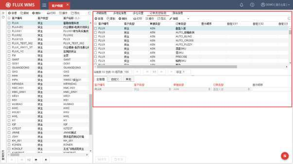

客户编号－当前所维护记录的货主代码 ID，新增时自动获取，不可编辑修改。

客户类型－当前所维护记录的客户类型，新增时自动获取，不可编辑修改。

<!-- 原 PDF 第 293 页 -->

单据类型－选择 ASN 或 SO，对应入库单、出库单。

订单类型－下拉列表，根据单据类型选择，调用对应订单类型显示。例如入库单的采购入库、退货入库订单类型。

显示顺序－多订单类型情况下，排序显示次序。

- 别名信息

同一供应商、承运人或者收货人，在不同货主的自有系统中可能所用代码不同，但在同一个仓库内为方便统一管理，可以维护代码转换关系，便于接口、报表统计或者单据模板调用。

在别名信息页签，依次输入如下信息：

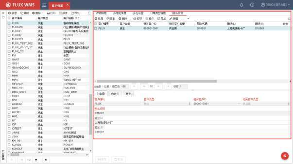

客户编号－当前所维护记录的货主代码ID，新增时自动获取，不可编辑修改。

客户类型－当前所维护记录的客户类型，新增时自动获取，不可编辑修改。

相关客户 ID－需要维护别名的客户 ID。例如供应商的 ID，或者收货人 ID，即需要维护别名的客户 ID，通过点击浏览按钮，选择已经在客户档案中维护过的客户记录。

相关客户类型－所选、需要做代码对应的客户的类型。根据“相关客户 ID”的选择，相应显示。

别名代码－此客户在指定货主名下所用的自有代码。

<!-- 原 PDF 第 294 页 -->

别名描述－客户描述，分为母语（L）、外文（S）描述两个字段。

- **鼠标右键菜单**

在客户档案列表或导航窗口中，点击鼠标右键可见右键菜单。除了标准的刷新、选择、导出功能之外，还有一些每个功能自有的右键菜单项功能：

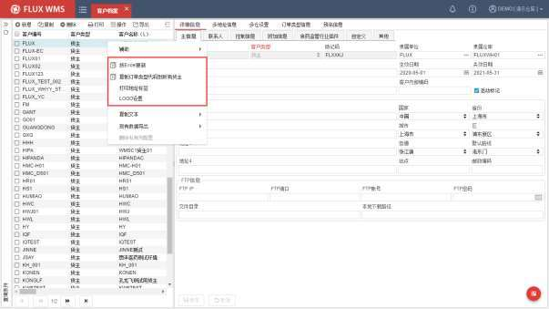

- 复制订单类型代码到所有货主

多个货主需要维护订单类型信息的情况下，可通过查询条件限定范围，选择某货主作为模板，复制信息到其他货主。

- 打印地址标签

基于货主或者收货人、承运人打印统一内容的地址标签，粘贴在发货包装上。常用于正常发货标签丢失后的快捷打印。

- Logo设置

打印 Logo设置，除了系统、仓库层级之外，还支持配置到货主层级，可以为不同货主配置不同的 Logo图片。

通过点击鼠标右键功能项【Logo 设置】，系统显示如下配置界面，在相应页签上传图片，后续可在附件文本管理中查找到上传的图片文件，也可以通过【业务系统配置】-【上传下载配置】将文

<!-- 原 PDF 第 295 页 -->

件上传到指定的 FTP目录（上传下载配置，请参考【业务系统配置】-【上传下载配置】相关章节介绍）。

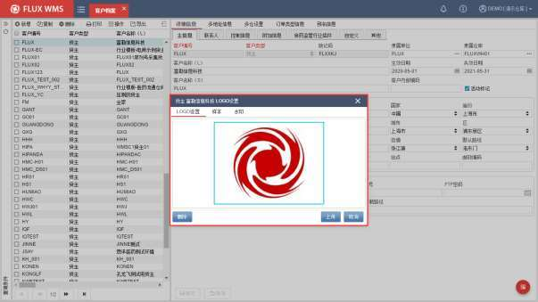

- LOGO 设置

在“Logo 设置”页签，通过点击【上传】按钮，上传 Logo图片。打印模板设计时，可将 Logo作为界面元素进行配置，实现客户 Logo、图章的打印效果。

- 样本

通过点击【上传】按钮，上传样本图片。用于【采购订单】功能中显示供应商文档样本，或者【出库复核】功能中，显示收货人提供标签粘贴样本图片（方便操作员粘贴出库标签到指定位置）。

样本图片可以上传多张，如果勾选“替换”选项，则上传的图片替换前一次上传的样本图片。

- 水印

上传的图片可作为水印效果，加载在【两票制管理】功能中，通过拍照或扫描生成的图片文件上。

水印所在位置，通过下拉列表选择，例如左上角还是右下角。

水印透明度，则录入 1~100的整数值进行调整。

水印图片，每个货主只能上传一张。后续上传图片将覆盖之前上传 的图片。

<!-- 原 PDF 第 296 页 -->

- **相关参数**

客户档案功能相关参数有：

参数 ID 参数描述 对应说明

IND_MED 医药行业插件 医药行业参数，开启后，相应显示【食药监行业插件】页签。DFT_CUS 界面缺省货主代码 如配置，查询条件、新增记录的货主字段将显示所配置的缺省货主。

## 6.8. 产品档案

产品档案是用于定义产品以及产品的各种信息、管理要求的功能模块。

产品是整个仓库管理运作的最重要的对象之一。一个产品的定义是由两个部分构成：客户和产品，缺少任何一个都无法确切定义产品。例如一个第三方仓库，可能有不同货主名下的相同产品在库内进行管理，因此，定义产品必须先确定客户的存在。

### 6.8.1. 详细信息

- **主信息**

- 在主菜单“基础设置”下选择“产品档案”功能。

- 点击【新增】按钮，在详细信息部分的“主信息”页签，输入如下信息：

<!-- 原 PDF 第 297 页 -->

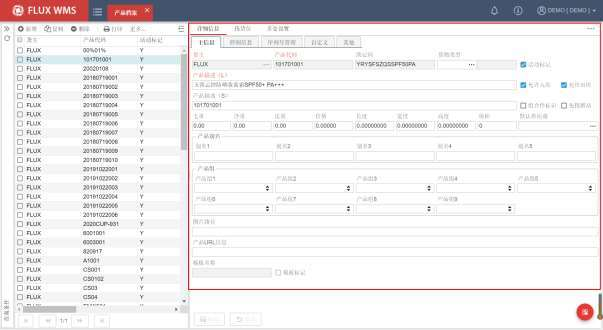

货主－即具有产品所有权的客户相应代码。可以通过浏览按钮选择。

产品代码－产品代码 ID，同一货主下不可重复，建议使用数字和字母。客户编号+产品，唯一定位一个货品。即同一仓库内，可以管理不同货主名下相同产品代码的货品，例如华联的可乐与沃尔玛的可乐都在一个仓库存放，货品、条码相同，但货权所属货主不同。

助记码－系统自动提取中文名称的每个字的首字母，组合成助记码，方便用户查询录入。

货物类型－产品所属货类。如果所选的货物类型有配置货类默认规则等管理信息，将自动获取，作为产品档案的相应默认设置，用户可以根据实际需要再进行修改。货类设置可参考【基础设置】-【货物类型】的相应介绍。

活动标记－是否启用中的记录。勾选，则表示控制产品继续存在；否则将无法对产品继续进行收货、发货等业务操作

产品描述－产品品名描述。系统提供双字段，L 为母语，S 为外文描述。

允许入库－此产品在收货流程中可以使用。默认可用，通常在拒绝产品入库情况下取消勾选。

允许出库－此产品在发货流程中可以使用。默认可用，通常在不允许产品发运情况下取消勾选。

组合件标识－产品是否为组合产品，即组件维护中的、组装后的父件产品。只有组合件标识已勾选的产品，才能在【组件】功能中，维护为父件产品。

<!-- 原 PDF 第 298 页 -->

免拣赠品－一些业务场景，会在复核台预存放一些赠品，复核打包时由操作员加入出库箱，系统无需做拣货管理。此类货物，需要与正常拣货的货品区分开，系统在下达播种任务等环节可以跳过。

毛重－产品主单位的标准毛重。

净重－产品主单位的标准净重。

皮重－产品主单位的标准皮重。

价格－产品的参考价格。可通过权限控制价格信息用户是否可见。

长－单位产品的标准长度。

宽－单位产品的标准宽度。

高－单位产品的标准高度。

体积－产品主单位的标准体积，可根据长宽高数据自动计算。

默认供应商－该产品默认采购来源供应商。

产品别名－用于记录产品对应的其他名称代码，主要用来做产品的快捷定位。例如产品的商品条码，就经常作为别名记录。

产品组－用于记录产品的分组信息。产品组字段名称可根据用户需要自行定义、配置。

图片路径－产品图片相关路径信息。系统支持显示网络图片（FTP 或者 HTTP 路径），或者通过右键【上传图片】功能上传到服务端的产品图片（路径显示为#tmpfileXXXXX.jpg）。但不支持客户端本地磁盘存储的图片显示（例如 D：指定目录图片）。同一产品，支持配置多张图片进行显示。

产品 URL信息－部分特殊产品，收货时需要核对的信息很多，并且变动较快，不希望在WMS 中维护（如果在 WMS 中维护，可以通过相应质检项信息进行管理），因此系统提供产品 URL信息字段，记录产品对应核对信息的原始链接（例如供应商的对应产品参 数网页），混 ASN 收货时，可以通过方案配置显示产品 URL信息，系统通过默认浏览器打开外部链接进行内容显示。

模板名称－使用鼠标右键菜单功能“产品模板”批量生成 SKU记录时，当前 SKU所依据的产品模板名称。具体操作可以参考《6.8.4 鼠标右键菜单》章节的操作介绍。

模板标记－使用鼠标右键菜单功能“产品模板”批量生成 SKU记录时，如果当前产品记录设置为模板，则模板标记会被勾选。

- **控制信息**

<!-- 原 PDF 第 299 页 -->

控制信息页签，主要用于维护产品相关管理信息。初始默认值同客户档案中的设置，如果有配置货类，则默认使用货物类型中的相关规则设置。用户可根据产品实际情况另行配置符合此产品管理要求的设置，达到同一货主、相同货类下，不同产品使用不同规则进行管理的效果。

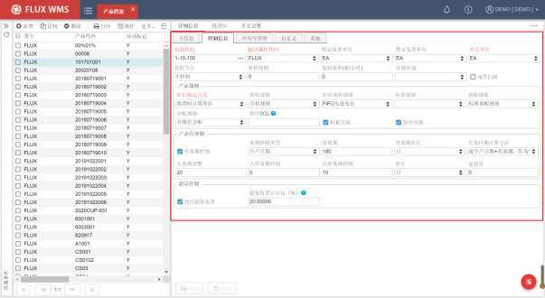

包装代码－产品使用的包装。

批次属性－产品的批次属性。

默认收货单位－在收货订单中，系统默认使用的包装级别单位。

默认发货单位－在出货订单中，系统默认使用的包装级别单位。

库存单位－按何种单位显示库存余量查询数量，以及作为库存标签打印单位。默认为 EA，配置为其他单位例如 CS 后，相关库存显示会换算为箱数量，显示为 XX 箱。

质检节点－系统参数 QC_FRM_TRN（按照收货交易产生质检单）设置为“ SKU-依据产品设置”后，系统会根据产品档案的“质检节点”配置，校验产品是否已经进行过质检操作。适用于同一订单内，不同产品入库质检流程要求不同的业务场景。可以基于产品，设置为收货前质检、收货后质检，或者不强制质检。

质检周期－主要用于食品行业，在库质检冻结控制。不同产品在库质检时间要求不同，产品收货上架后，库存自动冻结，质检时间过后，自动释放（通过定时器“ RLS_QC”，“释放质检冻结产品”对冻结记录进行自动释放）。

装卸效率（箱/小时）－月台管理中使用，产品的每小时装卸量，用于根据订单量，估算

<!-- 原 PDF 第 300 页 -->

月台操作预计占用时间长短的参数。

存储环境－用于记录此产品的存储环境要求，如冷冻、常温等。下拉列表内容在系统代码 ENVIRONMENT_TYPE中进行维护。如果作业时开启了库存环境校验（通过系统参数ENVIRONMENT_CHECK进行设置），则上架、移库等库位变更环节，系统会校验，产品要求的存储环境，与操作的目标库位的所属存储环境是否相符，避免将要求冷冻或恒温恒湿的产品，移动到常温存储库位上。

逐件扫描－入库扫描收货，以及出库复核环节，是否启用强制逐件扫描。如勾选，作业时扫描到当前 SKU，强制进入逐件扫描模式。

- 产品规则部分：

规则部分的选项均默认为同货主（或者货类）中的设置，用户可根据需要自行调整，为每个产品设置各自所需的规则属性。

库位指定方式－系统计算上架库位的处理节点。提供人工指定库位、收货时计算库位和上架时计算库位 3 种选择。如果在“多仓设置”页签有配置指定仓库的管理模式，则多仓设置中的配置优先执行。

质检规则－产品生成质检单时，遵循的质检数量提取规则。

库存周转规则－产品出库时的库存周转规则，具体参考业务规则设置。

补货规则－动态补货模式中，系统会先补货到产品已占用的拣货位中。当拣货位没有此产品库存，或者启用多个动态拣货位、需要寻找新库位时，遵循补货规则进行拣货位查找。

预配规则－产品出库时的预分配规则，具体参考业务规则设置。

分配规则－产品出库时的分配规则，具体参考业务规则设置。

排序 SQL－启用一步分配情况下可编辑。由于一步分配跳过了预配环节，可以另行指定分配时的排序字段。如不维护，默认按库位逻辑顺序拣货。

拆箱/内包装－默认勾选，分配时是否允许拆分包装分配。常用于不允许拆箱、拆内包装出库的业务形态，实现整包装分配。

- 产品有效期

用于对产品进行有效期（或称为保质期）管理的相关信息配置：

<!-- 原 PDF 第 301 页 -->

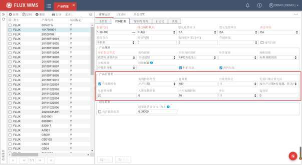

有效期控制－是否启用有效期管理，选中表示需要按照产品的库存生命周期管理产品。

效期控制类型－系统计算产品的库存周期的方式类型。如按照入库日期开始计算产品的有效期，还是产品本身有保质期到期日信息（即失效日期）。系统提供生产日期、失效日期、入库日期选项。

有效期－产品通常有效期长度，说明字段，不做强制控制，仅在根据生产日期计算失效日期情况下使用，如果选择的周期类型为“失效日期”，那么系统直接根据批次属性 02 的具体失效日期进行管控，此处的有效期字段将被忽略。

有效期单位－为了方便保质期较大的产品的信息维护，系统提供有效期单位选择，下拉列表为年、月、日。预期到货通知收货计算效期时，会根据效期配置“单位”自动换算出所对应日期有效期数值，用于更新批次属性 02 的失效日期。例如产品保质期为一年，则输入有效期 365，单位日，系统根据生产日期，加上 365天计算得到失效日期。或者输入有效期1，单位年，系统自动换算为 365日，可以得到相同的失效日期。但遇到闰年，单位“年”的情况下系统可以自动按 366日换算。

失效日期计算方式－根据生产日期+有效期来计算产品的失效日期过程中，不同行业/企业对计算的细节有不同要求。系统提供几种选项：

- 按生产日期+有效期，作为失效日期。常用逻辑。

- 按生产日期+有效期，取前一天作为失效日期，即失效日期当天货物可用。有些企业习惯将失效日期标记为货品可用的最后一天，可采用此模式。

<!-- 原 PDF 第 302 页 -->

- 按生产日期+有效期，取前一月的月末作为失效日期。这种逻辑在药品管理中比较常见。

失效期预警－冻结控制前，提前多少时间发送预警信息。例如距离失效节点，提前 30天库存冻结，在冻结前提前 10天进行预警。即距离失效日期 40天开始预警。

入库效期控制－产品从入库日期开始算起，在仓库中能够安全存放的最长时间。超过限制时间的产品，将不能作为正常品出库。

出库效期控制－产品从出库日到失效日期有效时间。如果产品的有效时间小于设置的出库效期，将不能作为正常品出库，即临近过期的产品，为避免出库时未过期，运输到客户手中已过期，需要提前进行出库管控或处理。

单位－失效期预警、入库效期控制、出库效期控制的时间单位。下拉列表为年、月、日。方便有效期单位，与效期控制单位不同的情况下（例如有效期一年，入库效期控制 9 个月），分别设置时间单位。

宽容度－食品行业效期管理，单个库位内可混放的有效期间隔设置。例如设置为 5 天，生产日期管理模式下，即意味着库位内货品最小生产日期与最大生产日期间隔不能超过 5天。需要配合 DATE_TOLERANCE_CONTROL参数（产品有效期宽容度设置）生效，参数开启情况下，上架计算时，根据有效期控制类型计算可混放的批次。通常在产品保质期时间较长，批次管理不需要非常严格，同时库位紧张的情况下启用。

- 超量控制

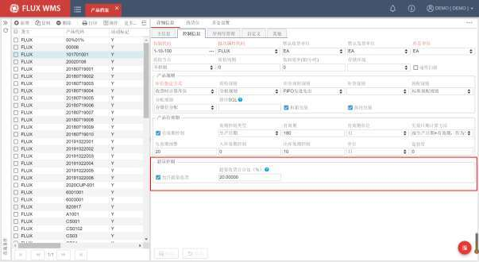

<!-- 原 PDF 第 303 页 -->

允许超量收货－收货时，所收货物数量是否允许超过订单数量。

超额收货百分比－部分情况下，货物可超额收取的量需要控制，录入数值 10代表可超额收货 10%，也即可收货上限是订货数量的 110%。“允许超量收货”选择项勾选，“超量收货百分比”设置为 99999999即为不限量超额收货。使用百分比控制超额模式，货主应设置为允许超量收货。超额收货控制的相关介绍，可参考《9.4.7 收货控制项》章节的介绍。

- 序列号管理

需要进行序列号采集的业务场景，除了要【系统配置参数】功能中开启序列号管理开关（SERIALNO_CATCH）以及设置相关序列号参数，维护【序列号管理规则】、【序列号校验规则】之外，还需要在“序列号管理”页签，维护当前产品的序列号管理要求。

部分情况下存在一个订单里，某几个 SKU需要采集序列号，另外一些 SKU无需采集序列号的情况，例如手提电脑需要进行序列号采集，但同订单内的鼠标、电脑包没有序列号。此时就会基于产品进行区分管理。

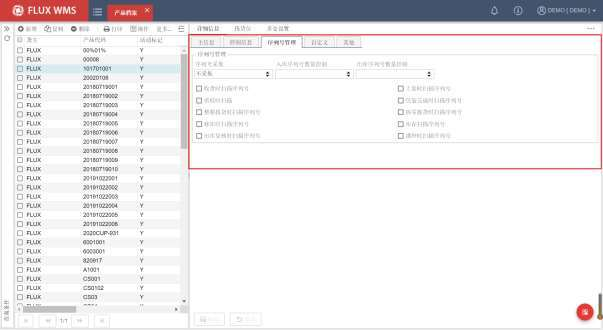

序列号采集－产品是否启用序列号管理。

入/出库序列号数量控制－序列号管理模式中，扫描后是否需要统计序列号扫描个数，并与作业数量比对。系统提供“序列号数量与入出库数量必须一致”，“序列号数量覆盖入库出库数量”，“不验证序列号”几个选择项。

XX 时扫描序列号－进行相关操作时是否自动进入扫描界面。即指定序列号扫描作业的

<!-- 原 PDF 第 304 页 -->

节点。使用序列号扫描，需要开启序列号采集参数（SERIALNO_CATCH），并且产品、订单指定为采集序列号。

### 6.8.2. 扩展页签

除了详细信息页签的下的内容，在不同操作流程中，还会用到一些其他管理配置信息，可以通

过右上角的 按钮，选择对应的扩展页签，进一步维护对应信息。

- **拣货位**

拣货位信息，在使用独立拣货区作业情况下使用，一般与出库时从拣货区分配拆零库存，以及补货操作配合应用。

- 在拣货位页签，点击【新增】按钮，依次输入如下信息：

货主、产品代码、包装代码－系统自动显示产品对应信息。

仓库编号－默认为当前登录仓库。同一货主、同一产品在不同仓库内的拣货区规划不同，因此需要分别设置。

库位使用类型－指定的拣货库位使用类型。系统提供箱拣货库位、件拣货库位、箱/件拣货库位、补充拣货位，4 种库位使用类型。库位使用类型的选择，将限制拣货位的选择。

区域－拣货位所属区域。

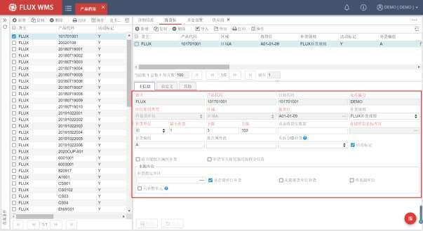

<!-- 原 PDF 第 305 页 -->

拣货位－该产品指定的拣货位。如果采用动态补货方式，则选择 DYNAMIC类型的对应库位，如 DYNAMIC_EA的件拣货库位。部分仓库会有多个拣货区，分别用于不同业务的拣货操作，需要配合区域、补货规则分别设置。此场景下，动态拣货位可以维护如DYNAMIC_EA1、DYNAMIC_EA2，分别属于不同区域，使用不同的补货规则，作业时根据限定条件分流到不同拣货区域。

补货规则－分区管理的情况下，可以在拣货位页签维护多行记录，分别使用不同的补货规则。补货时，优先使用拣货位配置的补货规则，如果没有设置，则使用产品档案“多仓设置”页签的“补货规则”。

补货单位－产品的补货单位。如设置为箱，系统将按箱计算补货数量，除非存储位库存不足 1箱，否则生成的补货任务都是箱的倍数。

最小补货－对该产品进行补货时的最低补货数量。

下限－产品的补货数量下限。当库存低于该数量，系统将允许补货操作。

上限－产品的补货数量上限。如果库存高于该数量，系统将暂停补货操作。（注：该上限不得超过所选择的指定补货目标库位的最大容量。）

动态拣货位数量－采用动态拣货位管理时，一个产品可以拥有的拣货位个数。一般进出量比较大的产品会指定多个库位。而固定拣货位模式，配置多行记录即可，无需配置此数量。

存储库位目标库区－补货目标库位是存储位的中转补货模式特殊场景下使用（即拣货位是 DYNAMIC_RS）。由于中转模式，从一个存储区，补货到另一个存储区，因此检查库存上下限、是否需要补货时，仅针对目标库区的存储库位进行检查，忽略来源存储区，需要指定待检查的目标库区。非中转补货模式下，此字段不可编辑。

补货编组－产品补货时的编组方式。如设定补货编组，系统将把同一编组的拣货位视为一个组合，当组合中的总数量低于库存下限时，才触发补货任务。例如 2个拣货位作为一个编组，当 2 个拣货位中的库存之和低于最小补货数量时才触发补货，并且 2 个库位一起补满。新增记录时，如果补货编组未设置，则使用区域 ID作为默认补货编组。也即仓库内有多个拣货区，分别用于不同业务的拣货操作的场景中，不同区域的拣货位，单独进行补货编组。

批次属性值－按不同批次属性，分别设置固定拣货位的业务模式中，用于指定 Lot04批次属性值内容。例如 lot04用于记录产地，产地为 A 的库存，补货到拣货位 01库位，产品为B的库存，补货到拣货位 02库位。

不拆分 ID补货－非标准码盘情况下的补货场景使用，由于每个托盘上的库存数量不一致，为提高作业效率，避免拆托，补货操作时，整个跟踪号进行补货，不生成部分数量的补货任务。此模式下，允许超过补货上限

<!-- 原 PDF 第 306 页 -->

活动标记－使用中的记录。

按关键批次属性补货－特殊产品，对于敏感批次属性不能混放，例如药品不同批次要存放不同库位，但不同入库日期的同批次货物可混放。补货时，关键属性不同的批次，也需要找寻不同的拣货。

补货零头按包装层级拆分任务－存储区用于补货的库存不满整包装的情况下，是否需要显示为次级的包装。例如 1托盘满托 100件，此时有半托盘 88件的，生成补货任务时，是否需要换算为 8箱+8件进行显示，方便操作人员清点。

- 来源库位部分，是补货货物来源相关限定条件。

补货指定库区－指定哪个库区作为补货来源使用。

从存储库位补货－选中则限定补货来源库位必需是存储库位。

从箱拣货库位补货－选中则限定补货来源库位必需是箱拣货库位。

单来源库位－一次只从一个原始库位补货。

只补整单元－存储区有零包装库存情况下，是否要跳过零数，只生成整托盘或者整箱的补货任务。仅在补货单位非 EA的情况下才可选择。

- 点击【保存】按钮完成拣货位设置。

- **多仓设置：**

同一产品在不同仓库内，由于各地人工不同，有可能仓储计费也不同，可以分仓库进行设置，不同仓库选用不同的计费费率，同时规则、循环级别等的设置可能也会每仓不同。可以在多仓设置页签中，分别配置，如下图所示。

<!-- 原 PDF 第 307 页 -->

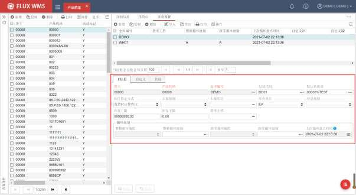

货主、产品代码－对应主信息内容。点击新增按钮时自动获取，不可修改。

仓库编号－指定仓库代码。

包装代码－产品在指定仓库内的常用包装。

默认供应商－对应仓库此产品的默认供应商，适用于分地域多个默认供应商的情况。

库位指定方式－系统计算上架库位的处理节点。提供人工指定库位、收货时计算库位和上架时计算库位 3种选择。如果多仓页签未配置，则默认取产品档案中的指定方式。

上架规则－产品在指定仓库中执行的上架规则。

上架库位－产品入库时的指定上架库位，根据上架规则的设置生效。通过快速浏览按钮可选择已在库位档案中设置的库位，可为每个产品分别指定固定的存储位置。设置上架库位后，如果需要清除设置、不再指定，通过点击库位选择二级窗口中的【返回空记录】按钮清空设置。

库存单位－库存相关界面显示时的数量单位。适用与不同仓库作业、存储模式不同情况。例如 A仓为大批量存储，整进整出，库存单位为托盘。B 仓为电商仓库，拆零发货，库存单位是件。系统会优先根据多仓设置中的库存单位，换算、显示库存数量，例如 100托盘，还是 57件。未维护多仓库存单位，则根据产品档案标准库存单位配置进行换算显示。

补货规则－产品在指定仓库中执行的补货规则

<!-- 原 PDF 第 308 页 -->

库存上限－指定仓库中产品的库存上限。若库存数量高于库存上限，系统会通过预警功能提示或自动暂停向供应商订购商品。

库存下限－指定仓库中产品的库存下限。当库存数量低于库存下限时，系统生成预警提示。

费率主档－显示当前仓库计费使用的费率主档。具体费率设置，可参考费收模块的具体介绍。

整箱循环编组－产品 CS 包装级别进行循环级别计算时对应的编组设置。新增记录时，默认取货主在【客户档案】功能“多仓设置”页签维护的“整箱循环编组”内容。

整箱循环级别－产品箱级别所用的循环级别计算方式。下拉列表内容在 【循环级别】功能中定义，显示所指定的整箱循环编组下的具体循环级别供选择。

拆零循环编组－产品 EA 包装级别进行循环级别计算时对应的编组设置。新增记录时，默认取货主在【客户档案】功能“多仓设置”页签维护的“拆零循环编组”内容。

拆零循环级别－产品 EA级别所用的循环级别计算方式。

上次循环盘点时间－系统自动记录的、产品上次循环盘点日期时间。

- **别名：**

产品入库时，同一种产品，不同供应商提供的文件上可能使用其各自的产品代码，不同收货人的出库指令或出库标签上也可能要求使用各自的代码，WMS通过别名管理功能，将不同供应商、收货人使用的产品代码（别名）与主档产品代码相关联，并可根据不同的收货人/供应商进行转换或打印不同格式的标签。

需要注意的是，别名管理中的相关客户，指的是入库操作中的供应商，出库操作中的收货人。即在当前订单中，对应这个收货人，SO 中的产品对应的别名是什么。可以达成同一产品不同收货人使用不同别名的效果。而产品档案主信息页签的别名，是通用的、用来标识产品的其他名称，不会随供应商/收货人不同而变动。

收货人别名的启用，需要通过参数 ALT_SKU开启别名管理。

<!-- 原 PDF 第 309 页 -->

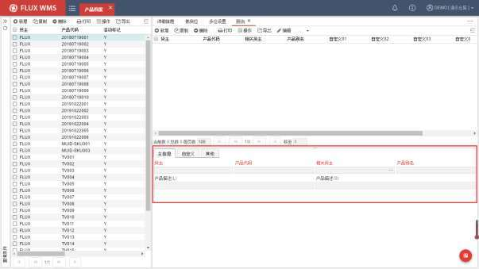

- **供应商：**

部分产品只能由指定供应商提供，因此需要建立供应商与产品的对应关系。

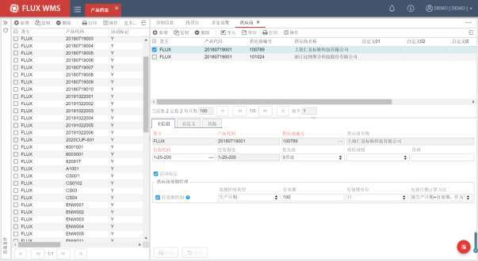

通过在产品档案的供应商页签，选择并设置对应供应商ID，在 ASN 中系统会进行校验，该产

<!-- 原 PDF 第 310 页 -->

品只能由指定的供应商提供。同时可指定此供应商的该产品所用包装、优先级设置，所执行的质检规则要求，供应价格，便于供应商管理。

一个产品可配置多个指定供应商。

需要进行效期管理的产品中，特殊情况下，存在不同供应商供货的相同产品（同 SKU），保质期长短不同的情况。此场景中，可以考虑启用产品的供应商效期管理，根据库存批次所属供应商，分别进行产品保质期判断、管理。需要启用 LOT_#05_SUPPLIER参数，收货时将供应商记录到批次属性 05，从而区分库存批次的来源供应商，再根据“供应商效期管理”维护的效期控制类型、方法等，分别进行保质期计算。

- **收货人管理：**

不同收货人对订单、产品有效期要求可能会有不同，例如食品送超市，A 超市要求保质期剩余 6个月，B 超市要求保质期剩余 1年；或者发货给其他收货人要先进先出，但发货给 A 超市的食品要后进先出。这些不同管理要求，可在“收货人页签”进行维护，发送给指定收货人的订单，会采用

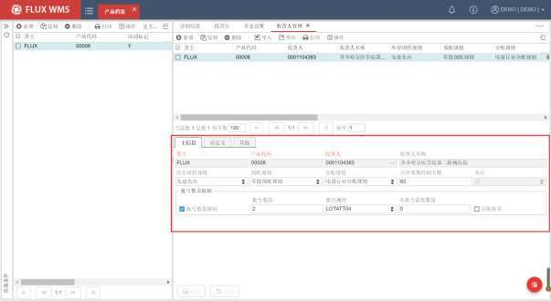

批号数量限制，在收货人不希望收到批次过于琐碎的情况下启用。例如批次属性 4是产地，收货人要求一次收到的货品，产地不超过 2 个。那么勾选“批号数量限制”后，将所限制的“批号数量”设置为 2，“批次属性”字段下拉选择批次属性 04。

分配时，如果按先进先出，分配到的产地 1+产地 2 的库存，不足订单数量，未启用批号数量限制时会继续分配产地 3 的库存；但启用了批号数量限制情况下，会跳过首个批次，产地 1的库存，

<!-- 原 PDF 第 311 页 -->

考虑后续批次，产地 2+产地 3 的库存是否满足订单要求。也即批次数量限制开启，可能会影响到库存周转规则的按批次清空的效果。

如果设置了“单批号最低数量”则能够避免库存数量过少的批号加入订单。数量为 0 时意味着不做限制。

勾选“仅限拆零”则仅对零散数量的多批号进行限制，整箱、整托盘无需限制。

- **多包装：**

部分产品有固定的几种常用包装规格，可在产品档案进行设置，限定单据中的包装选择范围。

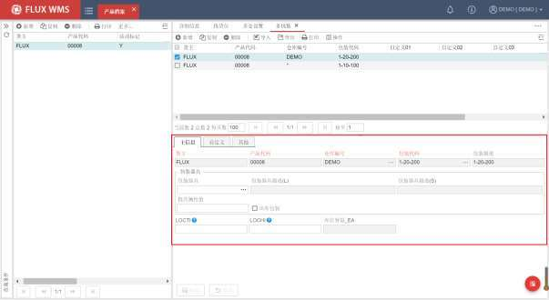

包装器具，主要用于有更换包装出库要求的场景，入库供应商提供的包装模式，在出库前需要按收货人的指定装箱量，重新装在指定的容器内。在生产制造行业比较常见，需要翻包装到生产线指定的容器中。并且由于指定容器的特殊性，需要对容器进行库存管理，因此通常会将容器也维护为SKU。

在包装器具部分，维护产品对应的包装容器 SKU（也即包装器具）、是否出库时使用的包装（“出库包装”勾选项）。如果勾选出库包装，则在出库时，系统会自动按整包装数量换算所需容器数量，并按包装器具 SKU、指定批次属性值，扣减相应数量器具 SKU的库存。

LOCTI、LOCHI用于地面平仓存储情况下，库位内每层可堆放托盘的数量，以及托盘可叠放的层数。由于不同产品质地不同，有的托盘能堆叠，有的不可以叠放、承压，不同包装的限制也不一

<!-- 原 PDF 第 312 页 -->

样，因此在产品多包装中进行维护。需要提醒的是，此模式适用于目标库区的库位大小一致的情况。

库位容量_EA 则是系统根据 LOCTI、LOCHI以及此包装的 PL层级数量，换算得到的库位内可存放的主单位层级数量上限。

- **订单类型规则：**

同一产品在不同作业流程内，可能作业要求不同。例如正常出库，要求先进先出；退货出库，则是先到保质期先出库；批量销售单，有时会采用后进先出的逻辑。

根据需要，在“订单类型规则”页签，可以根据不同订单类型，维护对应的周转、分配等规则，实现相应业务管理的要求。

创建订单时，系统读取产品对应的订单类型规则，如果有匹配的仓库、单证类型、订单类型，或者指定批次属性，则根据规则明细配置的库存、预配、分配规则，更新订单明细行的默认规则信息。

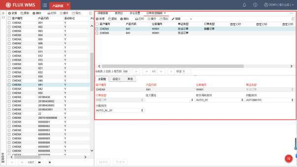

- **产品配件管理：**

部分产品，实物可以拆分为多个部分，但每个部分都不是独立产品（SKU）。例如咖啡杯，由杯托、杯子、调羹组成，入库时包装在一个包装盒内，通常无需拆封检查。但产品退货入库时，经常需要检查这几个组成部分是否被一起退回。因此系统提供配件管理功能，记录非 BOM 组合的多部件产品的情况，以便作业人员根据信息核对产品情况。

<!-- 原 PDF 第 313 页 -->

配件信息，首先需要在产品档案中进行维护，如下图，配件页签内容。

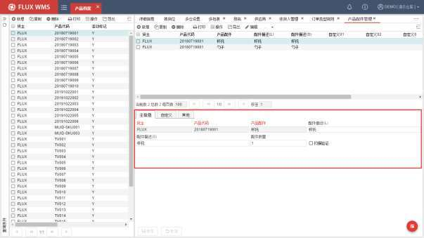

可维护配件名称、说明，数量等信息。由于配件本身不是独立 SKU，因此“产品配件”开放录入，不要求是 SKU 代码。

如果勾选了“扫描验证”，并开启 SKU_ACC_SCN 参数（作业过程中需要对产品配件进行扫描验证），收货时，可以执行配件扫描，由系统校验配件是否齐全。

维护后的配件内容，在入库单中可查看，具体可参考【入库操作】-【预期到货通知】的相关介绍。

- **产品多库区管理：**

多仓管理情况下，同一产品在不同仓库对应的上架区不同，可通过多库区页签，每个仓库分别设置。

<!-- 原 PDF 第 314 页 -->

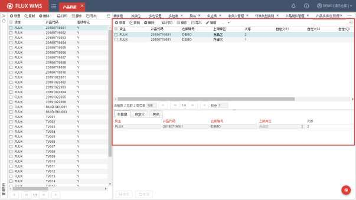

同时，产品在一个仓库内，需要指定多个库区的情况，可通过序号字段，设置对应库区的排序。

- **替代品管理：**

同类的不同产品，SKU 代码不同，但产品类似，有些业务场景下可以相互替换。此时可以在系统中维护替代关系，当系统参数 SST_SKU（启用替代品管理功能）开启时，产品 1 库存不足时，系统可分配产品 2，再不足提取产品 3，按替代次序依次找寻替代品。

如果没有配置替代品，产品 1 库存不足时，分配即停止。

<!-- 原 PDF 第 315 页 -->

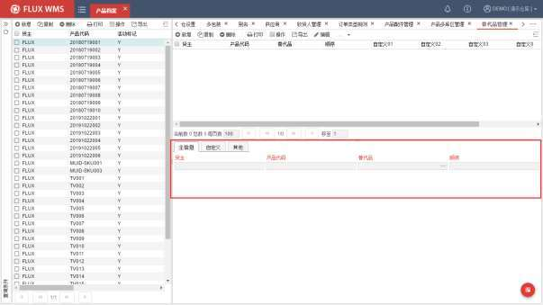

### 6.8.3. 行业信息

不同行业所需的特殊字段记录在各自的行业页签中，只有在对应行业的系统配置参数打开的情况下才可见行业页签。例如参数 IND_MED=Y 的情况下，在产品档案中才能够看到医药行业的页签。

- **食药监管行业插件：**

参数 IND_MED（医药行业插件）开启情况下，显示此页签：

<!-- 原 PDF 第 316 页 -->

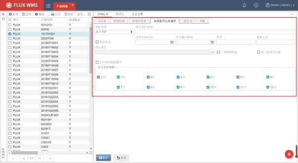

养护类型－产品所属的、医药行业养护管理的养护分级类型。不养护，即无需进行养护管理；一般养护，为普通养护等级，默认 90天养护一次；重点养护，即规定的储存条件下仍易变质的产品，需要加强养护频次，重点监控。

重点养护原因－产品需要重点养护的原因备注，例如冷藏，器械等。在生成养护任务时，会相应带入到养护任务的重点养护原因字段中，以便现场针对性进行检查。

首营状态－当前产品是否为首营产品，即与本企业首次发生供需关系的货品，需要维护首营状态。首营产品会生成重点养护任务，并且重点养护原因自动备注为首营重点养护。

首营时间范围－产品的首营时间范围，在此范围内的养护周期为每 30 天一次。即入库30天或上次养护后 30天产生重点养护任务。

剂型－产品首营剂型。

批准文号－药品批准文号。根据国家药监规定，批准文号为中文+数字+字母组合，同时兼容此规定颁布前、尚未过期的带有括号的批准文号。因此限定仅可录入中文、数字、字母、中英文括号字符。

储运条件 －产品储运条件记录。下拉列表内容在【系统代码】MED_STORAGECONDITIONS（储运条件）中维护。

二类精神药品－GMP规定，二类精神药品需要双人复核。此字段标记的SKU，入库、质检、复核等作业时，会弹出双人操作界面，要求第二复核人确认。

<!-- 原 PDF 第 317 页 -->

第二序列号扫描－标记后支持输入产品第二序列号。

打印药品检验报告－此产品是否需要打印药品检验报告。

重点养护周期－当养护类型选择为“重点养护”情况下，显示此部分内容，以月为单位选择重点养护时间段，适用与季节性重点养护的产品。例如部分药品虽然常温存放但不耐高温，夏季 6~9月需要重点养护，其余月份为一般养护，则勾选重点养护周期为 6、7、8、9月份。选择为“每月”则是全年重点养护产品。重点养护周期范围内的产品，入库 30天或上次养护后 30天产生“重点养护”类型的养护任务；重点养护周期范围之外的产品，入库90天或上次养护后 90天产生“一般养护”类型的养护任务。

后续系统标准定时器 PHARM_MAINTENANCE（医药行业养护任务）根据产品档案中的设置，定时生成养护任务。定时器设置可参考【业务规则】-【定时器】章节的介绍。

养护任务的执行、确认，则在【行业插件】-【药品养护】功能中进行操作。

- GMP 证书页签：

需要从扩展页签列表中点击打开显示，用于维护药品GMP 证书信息：

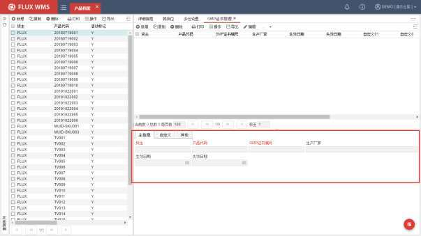

- 批准文号页签：

同样需要从扩展页签列表中点击打开显示，用于维护药品批准文号信息：

<!-- 原 PDF 第 318 页 -->

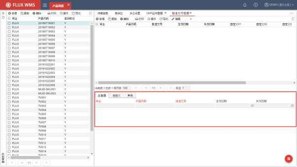

### 6.8.4. 鼠标右键菜单

在明细页面的导航窗口部分，点击鼠标右键可见右键菜单。

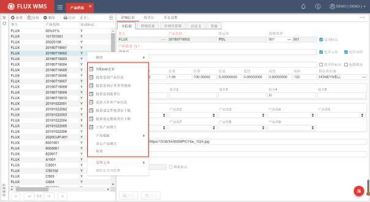

- **按 Excel 更新**

<!-- 原 PDF 第 319 页 -->

系统提供的公共标准导入功能，仅支持新增记录导入。但产品档案资料会有批量更新的需要。因此在鼠标右键功能菜单中，提供独立的导入更新功能，点击后操作同标准导入，支持下载导入模板。选择已整理好的导入文档，系统根据 Excel内的字段内容，更新已有记录的信息，例如产品价格等信息。

- **批量复制产品信息**

用于批量修改产品档案的字段内容。

按一定查询条件查询记录（其中客户代码条件必输，无任何查询条件情况下，系统会提示需要先输入查询条件再进行复制），选择某一记录作为样本记录，修改所需内容并保存（样本记录即复制来源信息）。然后点击鼠标右键选择“批量复制产品信息”功能，系统显示如下复制字段选择二级窗口。勾选需要复制的字段，点击【确认】按钮后，系统将复制字段内容到符合当前查询条件的全部产品记录的对应字段中。可通过全选、反选来快捷选择字段。

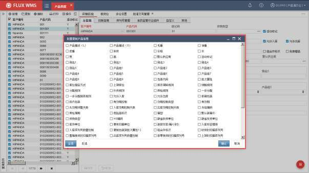

- **批量复制订单类型规则**

用于批量设置产品订单类型规则。点击右键功能项后，将当前记录的订单类型规则设置，复制到符合查询条件的全部产品记录中。

- **批量复制拣货位**

用于批量设置或修改产品拣货位设置。

<!-- 原 PDF 第 320 页 -->

输入查询条件，查询记录后，选择当前记录，执行右键功能项“批量复制拣货位”可以将当前产品记录的拣货位信息，复制给根据查询条件查询到的其他全部产品。通常用于动态拣货位信息的批量维护。

- **更新入库单产品信息**

入库用的单据，例如采购订单（PO）、预期到货通知（ASN），新增明细行、 输入产品时会提取产品的对应信息如包装等。如果单据创建后，再修改产品档案内容，可以通过“更新入库单产品信息”功能，将修改的内容同步到 PO、ASN 订单中（仅更新创建状态，未收货的单据），避免逐单手工修改。

- **批量设定件拣货位下限**

用于批量设定当前列表产品记录的拣货位下限。仅针对拣货位是件拣货类型的记录生效。

查询产品记录后，选择此项功能，系统显示如下二级窗口，可选择相应选项，确认后系统更新复核查询条件的产品的拣货位信息。

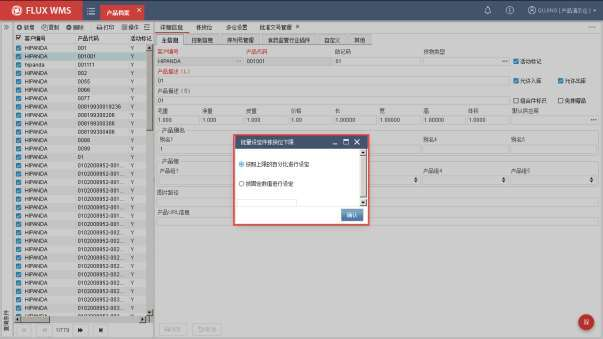

按照上限的百分比进行设定－选择此项后，在下方的数字框中输入百分比数字，系统自动将产品拣货位的下限数量，更新为上限数量乘以百分比的结果。

按固定数值进行设定－选择此项后，在下方的数字框中输入数值，系统自动将产品拣货位的下限数量，更新所录入的结果。

<!-- 原 PDF 第 321 页 -->

- **批量设定箱拣货位下限**

用于批量设定当前列表产品记录的拣货位下限。类似“批量设定件拣货位下限”功能，但仅针对拣货位是箱拣货类型的记录生效。

- **上传产品图片**

用于逐个/批量上传所选 SKU 对应图片，并且图片会以附件形式上传服务器，也可以通过【业务系统配置】-【上传下载配置】将文件上传到指定的 FTP 目录（上传下载配置，请参考【业务系统配置】-【上传下载配置】相关章节介绍）。

产品图片在入库扫描、库存余量查看、出库复核等作业环节展示，用户可在【附件文件管理】模块中对上传的图片文件进行管理。

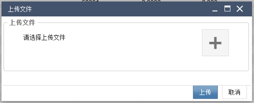

- **产品模板**

- 设置为模板

选择某个产品记录，选择鼠标右键“产品模板”子菜单中的“设置为模板”功能，弹出模板选择窗口：

<!-- 原 PDF 第 322 页 -->

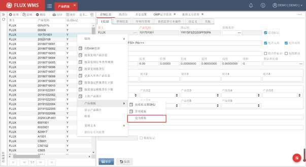

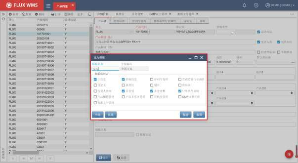

在二级窗口中，勾选未来新增 SKU 时，需要从此模板中复制的数据信息，按页签进行勾选。选择后点击【保存】按钮，系统会将选择信息记录为模板，并将样本 SKU 的“模板标记”勾选。

- 按模板设置 SKU

在产品导航列表窗口，勾选需要被更新的 SKU 记录，支持多选、全选，然后通过鼠标右键“产

<!-- 原 PDF 第 323 页 -->

品模板”子菜单中的“按模板设置 SKU”功能，在弹出窗口中选择已设置的模板。

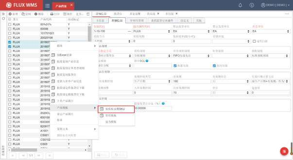

选择模板，也即信息来源后，点击【按模板设置 SKU】按钮，确认提示信息，系统进行产品档案记录更新。

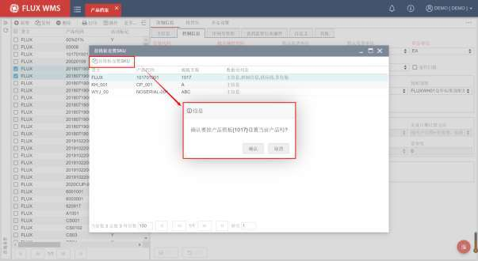

- 管理模板

<!-- 原 PDF 第 324 页 -->

通过鼠标右键“产品模板”子菜单的“管理模板”功能，能够查看到现有模板，并支持删除不再使用的模板：

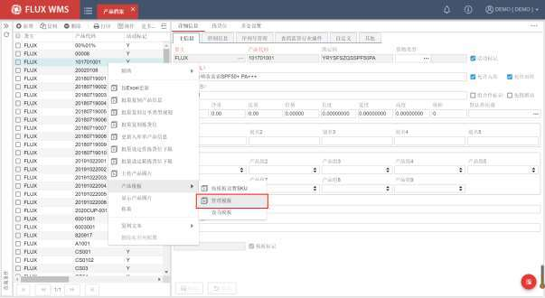

在二级窗口中选择需要删除的模板记录，点击【删除】按钮，系统会提示确认删除。如果有产品使用待删除的模板，还会再次提示确认：

<!-- 原 PDF 第 325 页 -->

删除模板时，会将模板 SKU 的“模板标记”去除。

但如果先删除模板 SKU，则会提示产品被设置为模板，需要先删除模板，才能删除 SKU。

- **显示产品图片**

配置图片后，可以通过此功能查看产品图片显示（具体配置请参考产品档案详细信息设置部分的介绍），多张图片情况下，可通过【上一张】、【下一张】按钮切换查看。

- **称重**

一些货物的长宽高重量信息，需要仓库现场在货物第一次抵达时，实际称量记录。因此系统在产品档案，提供了独立的重量快速记录功能，支持人工录入，或者通过电子秤对接获取。

点击右键功能项后，显示如下对话框，扫描/录入产品条码（无需当前产品，方便多个产品连续操作录入），人工录入重量信息，或者通过电子秤对接获取称重的重量信息（需要启动客户端本地插件）。如果勾选了“测量”选项，也可以同时录入长宽高体积信息：

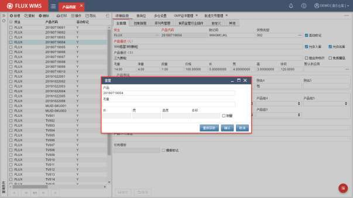

点击【确认】按钮，系统将获取的重量、体积相关信息，更新到产品档案中。

特殊情况，电子秤数值读取有误（例如货物没有摆放好），可以通过【重新获取】按钮，刷新、重读重量信息。

<!-- 原 PDF 第 326 页 -->

### 6.8.5. 其他

- **相关参数**

产品档案相关参数有：

参数 ID 参数描述 对应说明

DATE_TOLERANCE_产品有效期宽容度 保质期管理相关CONTROL LOT_#05_SUPPLIER 批次属性LOTATT05是否作为供 参数设置为 Y，库存区分供应商来源应商IND_MED 医药行业插件 医药行业使用

## 6.9. 组件

在仓库中的某些产品可能是由几个部分组成，并且必须一起发货的。例如客户可能要发计算机，而计算机是由笔记本电脑、外置光盘驱动器、鼠标、说明书、电脑包等组成，每个部分还作为独立SKU可以单独出库。FLUX WMS 支持将多个产品，组合在一起一同操作处理。

如果在仓库和配送中心进行大量的装配、拆卸等工作，并且需要管理每个加工中心的活动时，产品组合的方式是不能够完全满足的。这时可以采用 WMS 的增值服务模块。

- **组件**

在产品档案中先设置一个产品作为组装后的成品（也即“父件”），并且在基础信息中，此产品必须选中【组合件标识】，然后再到【组件】功能中，设置该产品的组件形式（BOM）。

产品组合中，用来加工、组合的“零件”或作为原材料的产品，被称为子件，例如电脑包、说明书，或者XX 洋酒、杯具组，组合后的产品被称为父件，例如计算机套装，或者洋酒礼盒。

- 在主菜单“基础设置”下选择“组件”功能。

- 点击【新增】按钮，在“详细信息”的“主信息”页签，依次输入以下信息：

<!-- 原 PDF 第 327 页 -->

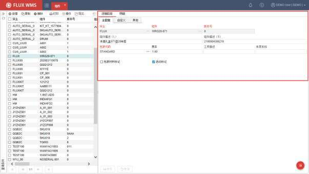

货主－拥有组件产品所有权的货主代码，必需是已经在客户档案中维护过的货主。

组件－组装后成品的产品代码。同样需要是在产品档案中维护过，并且产品档案“组合件标识”已勾选。

版本号－通常一个组件代码应表示唯一一套组合标准。但有些 ERP管理要求，组件代码不变，内涵的子件组合有变动。通过版本号来区分相同组件 ID（父件 SKU），不同的实际子件组合，例如同一款洋酒礼盒，夏天的礼盒中的赠品是折扇，冬天赠品是毛巾，但礼盒的 SKU代码不变。版本号启用，需要配置参数 KIT_VER，参数开启情况下，会记录版本号信息到对应父件库存的批次属性 11字段作为区分。版本信息只能通过接口获得，客户端不提供编辑修改。

组件描述－父件的产品名称。系统提供母语（L）、外文（S）两个描述字段。

包装代码－父件产品此加工组合后使用的包装模式。

费率－完成一个加工工作应收的费用。

工序描述－对该加工工序的简单说明。

来源系统－通过接口下拉组件信息时的上游系统。

包装材料标志－标识该组合为耗材包装组合，组件作为包装使用。

活动标记－选中，则表示该组合方式继续存在、可以使用；否则，将无法对产品继续按

<!-- 原 PDF 第 328 页 -->

照组合方式进行收货、发货等业务操作。

- 点击【保存】按钮，完成头信息新增操作。

- 点击“明细”页面的【新增】按钮，选择子件产品，系统显示对应描述；录入次序、数量，表示在组合中所用该产品零件的个数和顺序。其中在次序中输入数字，1 为最小：

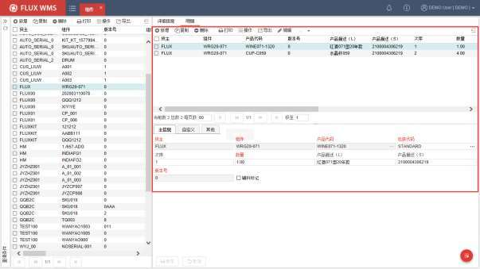

辅料标记在生鲜加工管理中使用，非严格比例组合的情况，例如一条鱼可以根据重量拆分成几份鱼肉产品，但鱼头鱼尾只有一份，不是根据原料重量按比例获得的。

- 点击【保存】按钮，完成组件信息维护操作。

- **相关参数**

此功能相关参数有：

参数 ID 参数描述 对应说明

KIT_VER 启用组件版本号管理 与版本号管理相关
