# 7. 仓库设置

> 来源文件：`富勒WMSV6.2（最全版1119页）.pdf`；原 PDF 第 329-362 页。

> 本文件按原 PDF 正文中的顶层章节拆分；每页保留原 PDF 页码注释，图示按原图注顺序引用。

<!-- 原 PDF 第 329 页 -->

仓库设置，是用来定义仓库相关情况的功能模块，包括库位、库位组、库区等等与物理设施情况相关的信息，以便在操作、管理过程中，针对仓库情况进行对应的优化管理。

比较常见的设置次序是，系统管理员在【仓库信息管理】中创建仓库记录，并授权给仓库内的管理员，由库内管理员维护此仓库内的【区域】-【库区】信息，有需要可以选择性维护【库位组】、【工作区】，再维护具体【库位】信息。

【路线】、【月台】、【设备】等，则根据业务需要，有相关使用则维护对应信息记录。

## 7.1. 区域和库区

区域和库区是用于定义仓库内区域、库区和库区中设备的功能。通过区域、库区的设置能够便于仓库分区管理、更方便的查找库位。

区域是库区的集合，它是仓库内物理位置、等级的划分，也是仓库下的一级物理划分层次，便于RF 无线设备的现场管理。

库区则是多个地点或库位的集合，是区域下的仓库二级物理划分层次，每个库位只在一个库区中。当现场定义一个库区时，通常是按照仓库中实际业务使用情况进行划分、定义的，例如：理货区、拣选区、存储区等。

区域和库区是系统中必须维护的内容，如果实际仓库没有划分多个区域、库区分别管理，也可以设置默认区域、库区记录。

- **区域设置**

- 在主菜单“仓库设置”下选择“区域”。

- 点击【新增】按钮，在“主信息”页签依次输入以下信息：

<!-- 原 PDF 第 330 页 -->

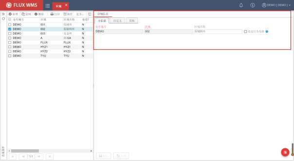

仓库编号－区域所属仓库，新增记录时默认为当前登录的作业仓库，用户不可修改。即用户只能编辑本仓区域信息。

区域编号－区域代码。

区域名称－区域的显示名称。

巷道任务均衡－立库管理常用管理模式。如勾选，分配时系统在此区域内执行巷道均衡分配方式。在根据库存周转规则分配的前提下，优先按各巷道总任务数均衡排序库存。但如果时段内局部不均衡，不同巷道未完成任务数差异过大超过限定（例如 5托盘），则优先根据未完成托盘任务数进行均衡计算。

- 点击【保存】按钮，完成仓库区域创建操作。

- **库区设置**

- 在主菜单“仓库设置”下选择“库区”功能

- 在主信息页签，点击【新增】按钮，依次输入以下信息：

<!-- 原 PDF 第 331 页 -->

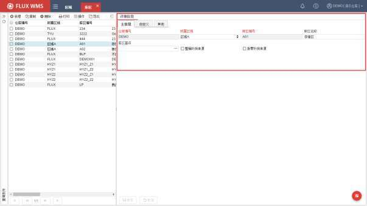

仓库编号－库区所属仓库，新增记录时默认为当前登录的作业仓库，用户不可修改。即用户只能编辑本仓库区信息。

所属区域－该库区所在的区域，通过下拉菜单选择已设置好的区域，从而建立库区和区域的从属关系。

库区编号－库区代码。

库区名称－库区的显示名称。

库区基点－特殊库位计算逻辑（例如就近库位）使用，通常情况下可跳过，不设置。如需配置，要在库位功能内，设置完成此库区下的库位信息，然后才能在这个字段的二级窗口中选择某个已存在的库位作为基点。

整箱/拆零补货来源－主要用于非拣货库区，设置此库区的货物能否补货到拣货库区。例如同样是批量存储区，A 区是正常入库货物，可以被用来补货，但 B区是退货入库货物，不能被用来补货到拣货区。同时，如果仓库内作业区细分，可以分别配置此库区货物，是否能够被用于整箱补货，是否能够被用于拆零补货。以便支持箱、件拣货位分别设置的不同业务需求。

- 点击【保存】按钮，完成库区创建操作。

- **其他**

<!-- 原 PDF 第 332 页 -->

- 就近库位逻辑：

上架过程中，常有希望同类货物能够就近存放的要求（不是合并在同一个库位），但由于仓库库位是分布在立体空间的，特别是立库、多层托盘、隔板货架等仓库，哪些库位是“近”的，哪些是“远”的，需要对空间距离进行设置与计算。

一方面，每个库位的 XYZ坐标都需要进行设置；

另一方面，在库区中需要指定一个库位作为基点（库区基点字段所设置的库位），以此库位作为三维坐标的零点，根据其他库位到此库位的空间距离，自动更新库位上架顺序。

即根据到基点的空间距离远近，更新库位的上架排序，用以支持就近计算上架的业务逻辑。

空间距离的计算，以每个库位的 XYZ坐标，到基点库位的 XYZ 坐标的距离分别进行计算。

## 7.2. 库位组

库位组是库位的组合或分类方式，与库区相比，库位组更加灵活，库区信息经常会被用来制作现场指示牌或者包含在库位号中，库位与库区的从属关系不会经常变动；而库位组更常用在会经常变动组合的场景中，通常用于任务获取，或者查询、报表使用。例如可以将巷道设置为库位组，可以配置每个库位属于哪一个巷道；或者同属一个传输线弹出口的多个巷道库位编入同一个库位组；一个独立活动货架设置为一个库位组等。现场可以根据业务情况需要定义不同的库位组划分逻辑，并且变动库位-库位组从属关系。

系统提供库位组 1，库位组 2两个分组设置功能。在“库位组”功能中，可以定义库位组的名称，但具体如何应用这些库位组，则取决于后续的操作功能设置（例如报表配置），详见各功能说明。

- **库位组**

- 在主菜单“仓库设置”下选择“库位组一”。

- 点击【新增】按钮，在主信息页签依次输入以下信息：

<!-- 原 PDF 第 333 页 -->

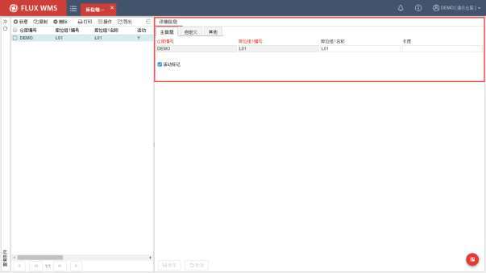

仓库编号－库位组所属仓库，新增记录时默认为当前登录的作业仓库，用户不可修改。即用户只能编辑本仓范围内的信息。

库位组 1编号－库位组 1 的代码。

库位组 1名称－库位组 1 的名称描述。

长度－用于挂装活动库位的上架计算过程中的长度信息维护，以库位组作为固定长度，组内的每个库位的容量是活动的。

活动标记－是否使用中的库位组。

- 点击【保存】按钮，完成记录新增操作。

- 库位组二设置同库位组一，只是无长度维护。

## 7.3. 工作区

为了方便任务分派，有些业务情况中会使用工作区划分来定义作业人员的分管片区。在库位设置中，可以设置库位从属的工作区。工作区与区域库区可以有交叉重叠，通常根据巷道划分、流水线弹出端口等进行定义。

与库位组功能相比，工作区域更侧重于人员工作管理。

<!-- 原 PDF 第 334 页 -->

- **工作区**

- 在主菜单“仓库设置”下选择“工作区”。

- 点击【新增】按钮，在“主信息”页签依次输入信息：

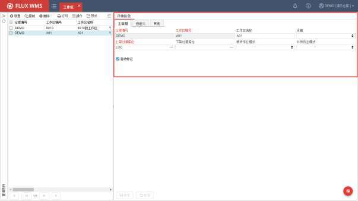

仓库编号－所属仓库代码。新增时默认取当前仓库。

工作区编号－工作区代码。

工作区名称－工作区描述。

设施－工作区所属设施，通常与仓库建筑、楼层对应设置。具体设施设置，可参考【仓库设置】-【设施】功能的介绍。

上架过渡库位/下架过渡库位－上架、拣货过程中的中转库位。

拣货作业模式－此工作区内适用的拣货操作模式。使用 RF 拣货导航功能时，根据任务的工作区，可以跳转到与拣货模式对应的拣货功能界面。系统提供订单拣货，波次合并拣货、电子标签拣货、电子标签播种、标签拣货、边拣边分等不同作业选项。

补货作业模式－此工作区内适用的补货操作模式。系统提供一步补货、补货下架供选择。

活动标记－是否使用中的工作区记录。

- 点击【保存】按钮，完成工作区创建操作。

<!-- 原 PDF 第 335 页 -->

## 7.4. 库位

在收到货物，确认货物情况、数量（即收货确认）后，货物就被储存在仓库的某个库位，直到货主下达出库指令。

库位是仓库最小存储对象单位。每个库位在物理上都应该有唯一的标识号，但系统设置的库位空间大小可以是弹性的，可根据使用情况修改设置。仓库中的库位设置还应按照仓库人员的实际操作而进行配置。

### 7.4.1. 库位设置

- 在主菜单“仓库设置”下选择“库位”。

- 点击【新增】按钮，在“主信息”页签依次输入信息：

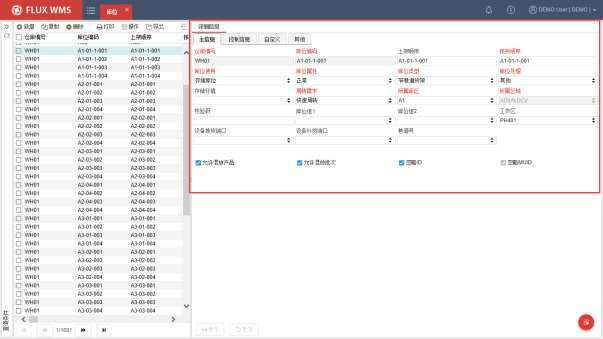

仓库编号－所属仓库代码。新增时默认取当前仓库。

库位编码－库位的代码 ID。在同一仓库中不可重复，一般由字母或数字组成。通常建议库位编码组合中可以体现库位所属区域、库区信息，例如“区域 -库区-巷道-列-位置-层”，连续数字或字母间通过连接符分隔便于人工辨识，例如“Z1A01-001A1”，整体 ID不宜过长，超过 20 位情况下不利于人工辨识，条码过长也容易导致扫描读取困难。

<!-- 原 PDF 第 336 页 -->

上架顺序－上架操作中，系统遵循的库位逻辑排序。在此字段中输入库位的排序等级或用于排序的内容，缺省值同库位 ID。在许多情况下，不是按照库位 ID字段来依次上架到库位，而采用独立的排序进行作业排序，这样有利于仓库内，在已有库存的情况下，对库内作业动线布局等进行调整，同时又无需变更实际物流位置的编号 ID，无需进行库存移动。

拣货顺序－出库操作中，系统遵循的库位逻辑顺序，在此字段中输入库位的排序等级或用于排序的内容，缺省值同库位 ID。为了支持入库、出库操作，作业动线不同的业务场景（例如上架起点的收货过渡区，与拣货起点距离较远，方向不同导致作业动线区别较大的场景），系统提供上架顺序、拣货顺序 2个字段分别配置排序。如果没有特殊作业需求，可使用相同的字段内容统一排序。

库位使用－库位的使用方式，系统提供多种库位使用方式供用户选择，例如箱拣货库位、件拣货库位、箱/件拣货库位、存储库位、过渡库位、理货站、组装工作区等。不同的使用方式对应不同的作业处理情况（具体可参考本章后续，【7.4.2 控制说明】部分的库位使用说明）。

库位属性－分别为正常、封存、管控和禁入，根据库位属性，系统进行相关控制（具体控制详见本章后续【7.4.2 控制说明】部分的库位属性介绍）。

库位类型－描述物理库位类型。如分为地面平仓、重力式货架、货架和窄巷道货架等。客户可以根据自身的情况在系统代码中添加所需要的库位类型。

库位处理－识别在库位中将存放的产品包装的类型。系统提供以下 3种类型：仅限于箱、仅限于托盘和其他。

存储环境－用于记录库位所属的环境类型分类，如冷冻、常温等。下拉列表内容在系统代码 ENVIRONMENT_TYPE中进行维护。如果作业时开启了库存环境校验（通过系统参数ENVIRONMENT_CHECK进行设置），则上架、移库等库位变更环节，系统会校验，产品档案中要求的存储环境，与操作的目标库位的所属存储环境是否相符，避免将要求冷冻或恒温恒湿的产品，移动到常温存储库位上。

周转需求－库位的周转类型，如快速周转、中速周转和慢速周转。通常与产品 ABC 分级配合使用，快速周转的货品放在最方便拣取的快速周转库位。

所属库区－库位所属库区。

所属区域－库位所属区域。非编辑字段，根据库位所属库区，相应显示。仓库基础资料配置时，通常是先配置区域、库区，再配置库位信息。

校验码－操作库位确认时，可通过扫描校验码确认库位（或者语音拣货时口述确认），而不是仅仅根据库位 ID进行库位确认，避免人工输入库位 ID而与实际操作库位不一致。

库位组（1、2）－下拉列表选择库位所属的库位组名称。

<!-- 原 PDF 第 337 页 -->

工作区－库位所属工作区，任务调度时使用，可将仓库划分为多个工作区，分块指派任务，使用不同的操作功能。

设备拣货/补货端口－库位对应的输送线端口，方便规划哪些库位的任务箱，从某个端口弹出。由于拣货操作与补货操作动线不同，同一个库位在不同业务流中对应的端口号不同，因此系统提供 2个端口号字段，以便分别应用于拣货作业流程、补货作业流程。下拉列表内容，相应显示【输送线】功能中维护的拣货类型端口(PK)与补货类型端口(RP)内容。

巷道号－库位所属巷道，通常用于 ASRS自动化仓库巷道任务平衡计算，即库位所属的堆垛机巷道号信息。下拉列表内容，相应显示【堆垛机】功能中维护的堆垛机信息。

允许混放产品－是否允许同一库位混合放置多个产品。

允许混放批次－是否允许同一库位混合放置同一产品的不同批次。

忽略 ID－当选中时，从被移进库位的所有货物信息中除去跟踪号信息，可以实现合并相同产品库存记录的目的。通常用在入库需要精确的跟踪号任务管理，上架确认后，存储库位忽略 ID，出库流程拣货无需指定跟踪号操作的业务场景。忽略 ID合并相同产品库存记录，可以降低拣货出库操作的复杂程度，提升效率。即同一库位中的相同库存，任意一个跟踪号都可以拣选使用。

忽略 MUID－MUID 即 Movable Unit ID，为TREACEID跟踪号的上一级物流容器级别。多级跟踪管理模式下，会同时记录 TREACEID与 MUID。为方便作业，同样提供了忽略的选项，实现同一个库位中，合并相同产品库存记录的效果。

- 注：

跟踪号是可移动的单件/托盘的标识，一般为托盘号、箱号或产品序列号等。一个跟踪号需要在收货、分拣和发货的过程中应用。它提供了整个设施中产品运作的参考数目，同时也简化了查找和其它 RF（无线电射频）的处理。

但有些操作情况中，入库时需要根据跟踪号进行操作，而出库时不要求按跟踪号出库，此时可以启用忽略 ID，能够简化出库操作，不需要拣取指定跟踪号货物。

- 在“控制信息”页签，根据管理需要，依次输入信息：

<!-- 原 PDF 第 338 页 -->

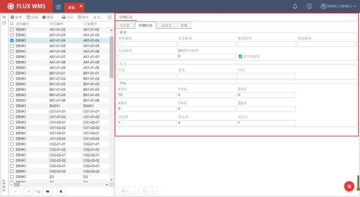

- 限制部分：

库位的总体积限制、总重量限制、可存储箱数、数量限制、托盘数量和 SKU 种类限制。输入对应的限制数值，系统在根据上架规则计算、查找合适的上架库位时，会根据限制数值判断货物是否能够存放入该库位，从而指导仓库上架操作。

但在实物操作时，系统不会根据这些限制数量、不允许作业人员进行上架确认。

宽容度限制，也即 DATE_TOLERANCE_CONTROL 参数开启，产品有效期进行宽容度管理时，此库位是否考虑有效期宽容库。默认开启，执行宽容度管理。但对于一些需要多批次混放的过渡库位、中转库位，问题品存放库位等，会取消勾选，不执行产品宽容度管理，实现多产品、多批次混放。

- 尺寸部分：

库位的长、宽、高尺寸，同样可作为上架计算时的判断依据，常用于超长、超高特殊货物的上架计算场景。

- 坐标部分：

库位的 X、Y、Z 坐标和层数，空间定位信息，多用于自动化仓库，在库位就近逻辑计算中也有使用。

在图形化配置时，通过 XYZ坐标影响到色块所在的界面显示位置。

<!-- 原 PDF 第 339 页 -->

2D图形化模式下，Z 坐标对应图形化界面、单列侧视图的高度显示，同一列会按 Z坐标比例显示高度。如果未设置 Z 坐标，则均分高度显示。

X、Y 像素，图形化界面配置使用，控制代表库位的色块长、宽。

3D图形化模式下，XYZ 坐标是库位位置信息，XYZ 像素是单个库位的长宽高信息，单位为公分。

货架排、列、层，通常在自动化仓库等设备应用场景中起到重要作用，作为库位物理分组的判断的依据。在 3D 图形化模式下，根据货架列号，为每列货架独立建模，即一个列号为一个货架物理设备单元，其中的库位规格统一。

- 点击【保存】按钮，完成新增记录操作。

### 7.4.2. 控制说明

- **库位使用说明：**

存储库位：批量存储库位，或普通存储位。通常不做分区拣货管理时，可直接用于拣货。具体取决于预配、分配规则设置。

件拣货库位：只允许用来对产品以件为单位直接拣货的库位。即分配订单时，可以做到整箱从箱拣货库位拣取，不满箱的单件从件拣货库位拣取的分区拣货操作。

箱拣货库位：只允许用来分拣整箱货品的库位。即分配订单时，可以做到整箱从箱拣货库位拣取，不满箱的单件从件拣货库位拣取的分区拣货操作。

箱/件合并拣货库位：即可以做箱拣货位，也可以做件拣货位。

过渡库位：收货操作过程中临时使用的库位。收货到过渡库位才会产生上架任务。

理货站：出库流程中，用来分流订单或者集合订单货物的发货准备库位。

组装工作区：用于加工操作指定库位，通常不参与订单分配。

快拣补货位：用于基于订单产生的、后续会被整箱分配的补货任务，补货计算到快拣补货位，后续出库操作时，优先从快拣补货位整箱分配，提高作业效率。

补充拣货位：拣货位管理情况下，大批量货物出库时由于拣货位容量有限，有可能一次补货不能满足订单需求。此时可另设补充拣货位。补货时按订单需求，进位取整箱补货（多订单合计需求

2. 5箱，则补货 3箱），优先将标准拣货位补满，剩余货物计算补货到补充拣货位。订单分配时则优先使用补充拣货位库存，全部分配后才会继续分配标准拣货位的库存。

- **快拣补货位与补充拣货位的异同：**

<!-- 原 PDF 第 340 页 -->

- 区别

快拣补货位是以提高拣货效率为目标，订单需求的满整箱数量优先补货到快拣补货位。

补充拣货位是以临时扩展拣货位为目标，补货优先补货到标准拣货位，订单需求仍然不能满足时才临时征用补充拣货位。

- 共同点

库存优先分配，库位要达到波次拣货完毕后清空的效果。

都是订单驱动时才可能补货，定时补货模式下不会考虑。

- **库位属性说明：**

正常：正常库位，可被用于入库、出库、补货等各种操作。

封存：不可使用库位，不参与移动、上架、补货等操作。常用于库位临时损坏时进行屏蔽。

管控：部分权限库位。可用于入库、上架计算、移动，但不能正常分配其中的库存。如果订单明细指定从此类库位分配，仍旧允许分配。

禁入：不可将库存加入，如收货、移库入、补货入等。但可以从此库位提取库存，如分配出库、补货出、移库出等。

### 7.4.3. 鼠标右键菜单

在导航列表窗口部分，点击鼠标右键可见右键菜单。

- **批量删除**

系统提供的标准【删除】按钮功能，仅能对当前定位记录进行删除，不支持批量删除。

但仓库内，库位布局变动，经常是影响到多个库位，例如拆掉一排货架。此时可以查询、全选/多选库位记录，通过鼠标右键的“批量删除”功能进行多库位删除。

需要注意的是，所删除的库位，不能是当前有库存记录存在的库位。

- **按 Excel更新**

系统提供的公共标准导入功能，仅支持新增记录导入。但仓库内库位调整，会有更新的需要。因此在鼠标右键功能菜单中，提供独立的导入更新功能，点击后操作同标准导入，支持下载导入模板。选择已整理好的导入文档，系统根据Excel 内的字段内容，更新已有记录的信息，例如库位号所属区域、长宽高坐标等信息。

- **批量复制信息**

<!-- 原 PDF 第 341 页 -->

用于批量更新已有库位的设置信息内容。按一定查询条件查询记录，选择一行记录作为样本记录，修改所需字段内容并保存后，点击鼠标右键选择“批量复制信息”功能，系统显示如下复制字段选择二级窗口。勾选需要批量复制信息的字段，确认，系统把对应字段内容复制到当前查询到的全部库位记录。

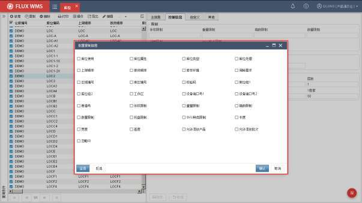

- **库位标签打印**

当前库位记录的库位标签打印。通常用在个别库位补打印标签的情况，点击后显示库位标签打印预览界面。多选情况下打印输出多个库位标签。

- **库位生成器**

很多情况下，仓库内的库位号是根据库区、巷道、流水号，以一定规律组合编制的，例如根据“区域-库区-巷道-列-位置-层”原则生成如 A01-307-1A3的库位号。

在维护新库位时，可以在 Excel表格中维护好信息，批量导入生成库位，也可以通过鼠标右键的“库位生成器”功能，生成规律的批量库位。

- 选择样本记录

选择一个已经维护好的库位，作为样本记录，后续新增库位的库区、区域相关从属关系，库位尺寸、限制信息等，会从样本记录获取信息作为默认值。

在样本记录行，点击鼠标右键，菜单中选择“库位生成器”功能，弹出如下二级窗口：

<!-- 原 PDF 第 342 页 -->

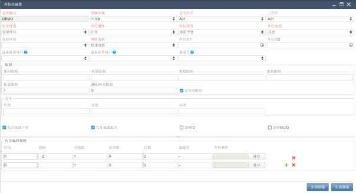

- 根据需要修改信息

根据样本信息，获取到除了库位 ID之外的信息默认值，在此基础上，根据需要修改相关信息，作为后续批量生成的库位的基本信息。

- 维护库位编码规则

在“库位编码规则”部分，根据库位 ID的组合要求，维护编码规则：

结构－下拉列表选择，标识此行信息的含义。系统提供“库、区、排、列、位、层”供用户选择。例如仓库的库位 ID组合模式是“库区”+“排号”+“列号”，那么第一行就选择为“区”，表示此行配置的含义是库区信息。

前缀－库位 ID中，此组信息的组合前缀设置。例如首行规则针对库区号信息，统一设置前缀为 Z，则生成例如 Z01-XXXX，Z02-XXXX的库位号。

开始/结束值－此组信息的流水号部分的起止值。一些仓库中流水号不是全覆盖，例如生成的库位只需要 Z01库区、Z02 库区的，那么起止值就是 1、2。如果设置为 1、9，则意味着 Z01~Z09的 9个库区的库位。

位数－此组信息的流水号位数。例如位数为 2，生成的库位 ID是 Z01-XXXX，但位数是3，则生成类似 Z001-XXXX的库位 ID。位数设置通常与此行规则对应维度的个数有关，例如库区有一共 7 个，位数设置为 1 也可以；但一个库区里有 20排货架，针对排号信息，位数至少要设置为 2才够用。

<!-- 原 PDF 第 343 页 -->

连接符－库位 ID 中，两组信息间是否要加连接符区隔，方便用户查看。例如“库区 -排号位置号”，或者“库区排号*列号-位置号”

排序－点击排序按钮，系统根据此行规则设置，显示此组信息的预览，支持用户进一步选择排序，或者只勾选这些记录中的一部分用于后续生成库位。勾选列头选择框，可以全选记录，点击【确认】按钮后，所选择记录会显示在“库位顺序”只读字段中。需要提醒的是，不做任何勾选，直接【确认】，系统默认取首个记录。

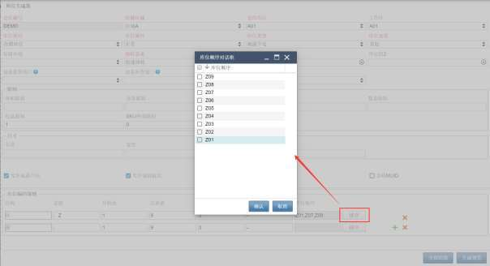

逐行维护规则信息，点击绿色的 增添新规则行。

例如库区信息后是 3 位的货架排信息，然后是 2 位的列号信息，每列 5层，1 位的层数信息，再每层 4个位置。

- 生成预览

点击【生成预览】按钮，弹窗显示根据规则设置生成的库位ID 信息：

<!-- 原 PDF 第 344 页 -->

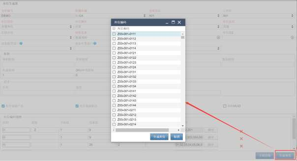

- 生成库位

在弹窗中，全选或者选择一部分库位ID，点击【生成库位】按钮，系统会使用所选库位 ID，按照二级窗口上半部分的库位相关信息，批量生成新的库位记录。

- **生成校验码**

库位校验码，一些仓库中会要求定期变更，人工修改处理有难度，因此系统提供生成校验码功能，由系统根据设置，随机生成库位校验码。

点击鼠标右键功能项后，弹出如下二级窗口：

<!-- 原 PDF 第 345 页 -->

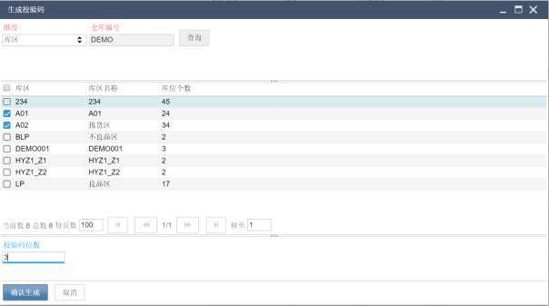

- 选择维度

系统提供的查询维度有区域、库区、工作区、库位组、巷道号，下拉选择其中一种，点击【查询】按钮进行查询，系统会按所选的维度，统计每个库区/区域等的库位个数。

- 选择范围

在查询结果部分，勾选需要生成校验码的记录范围。范围内的库位，全部会生成校验码。

- 设置校验码位数

根据需要生成校验码的库位总个数，设置校验码位数。例如有500 个库位需要生成校验码，那么位数可以配置为 3，系统会在 000~999的范围内生成校验码。但如果校验码设置为 2位，则只能在 00~99的范围内生成校验码，无法满足 500个库位，系统会提示校验码位数不足。

- 确认生成校验码

- **点击【确认生成】按钮，系统对与所选范围内的库位，根据校验码位数，随机生成校验码。**

建模相关功能

系统的【图形化库存 3D】功能，需要基于库位信息进行 3D模型生成，因此在库位功能中，鼠标右键具有 2个与建模相关的功能项

- 3D 建模

<!-- 原 PDF 第 346 页 -->

【库存管理】-【图形化库存查询 3D】配套功能，点击后会将仓库库位信息全部上传到 3D建模服务，重新建立仓库内的库位布局模型，后续图形化库存查询 3功能中，能够在此模型基础上进行库存展示。点击触发后，建模信息提交成功会返回成功提示。

通常有新增库位的情况进行操作，刷新建模即可。

- 建模结果查询

由于提交建模信息后，建模需要时间执行，用户可通过【建模结果查询】功能，了解建模进展情况：

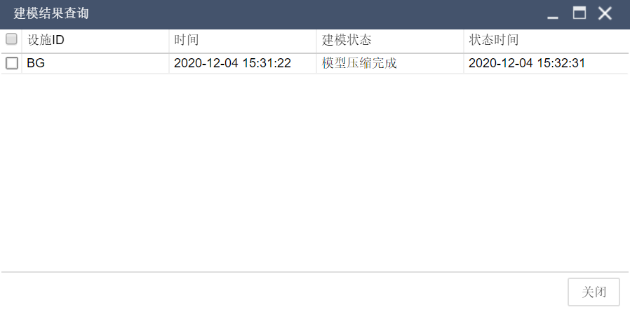

## 7.5. 路线

路线本意是指从一地到另一地所经过的道路。但在物流行业中，常常将多个目的地规划为不同运输路线，以便同一运输车辆可以一次经过多点，达到效益最大化的目的。合理的运输路线规划需要考虑到路程、车辆、成本、装卸等众多因素，也往往是运输服务的核心考量之一。

仓储服务中，经常需要配合运输路线，规划货物的装载，例如不同路线地点的货物不能装载到同一辆车上；在车辆最后抵达的终点站卸车的货物，在仓库发货装载时应最先装车。因此仓库在拣货过程中，也常将同一线路的订单、货物集货在一起，以便安排装车发运。

在按路线集货的作业模式中，有些仓库规模较大，常有多路线、多集货区/集货库位的情况。有

<!-- 原 PDF 第 347 页 -->

些路线货物量波动较大，旺季、淡季所需集货区面积差别较大，此时最好集货区可以灵活调配给不同的路线。也有的仓库，为多路线服务，按时段分批操作不同路线的发货。因此系统需要支持到路线、集货区的多对多匹配。

维护后的路线、集货区对应，将在分配环节，计算对应集货位时使用，以便为订单货物找到合适的集货位，与其运输路线要求相匹配。

- **路线设置**

- 在主菜单“仓库设置”下选择“路线”。

- 点击【新增】按钮，下拉选择已维护的路线代码，并选择对应的集货区。

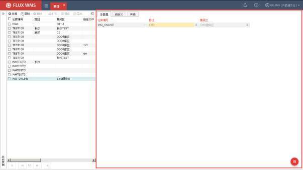

- 所供选择的路线，需要提前在系统代码-路线代码（ROU_COD）中维护；集货区，则取自库位使用是“理货站”类型的库位所属的库区。

## 7.6. 月台

月台，即装卸货所用的操作平台，由于不同月台对应的仓库门不同，货物的搬运路线也会有所不同。因此在系统中进行装卸车管理时，需要对月台或者说仓库门进行规划，以便在提高月台利用率的同时，减少仓库内交叉搬运的工作量。

<!-- 原 PDF 第 348 页 -->

在基础设置中，需要预先定义仓库内月台的相关信息，以便月台调度使用。

- **月台设置**

- 在主菜单“仓库设置”下选择“月台”。

- 点击【新增】按钮，在“主信息”页签依次输入信息：

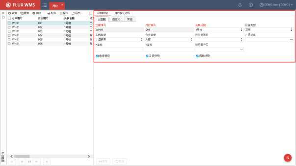

仓库编号－月台所属仓库。默认为当前登录仓库。

月台编号－月台代码。

关联设施－月台所在的建筑设施（下拉列表内容通过【仓库设置】-【设施】功能进行维护）。

设备类型－月台对应设备类型，例如有的月台是对接输送线的特殊作业月台，适用场景与普通月台不同，可以从设备维度进行区分。设备类型下拉列表内容，在系统代码DCK_EQP_TYP 中维护。

车辆类型－月台对应可支持装卸作业的车辆类型，不同车型方便操作的月台高度会有所区别，设置后方便根据车辆类型匹配合适的月台。车辆类型下拉列表内容，在系统代码VEH_TYP 中维护。

作业类型－有不同操作类型，使用不同月台的业务场景，需要设置月台对应作业类型，例如 1号月台用于整托盘批量收货，2 号月台用于拆零收货。配置后，方便后续作业匹配到

<!-- 原 PDF 第 349 页 -->

指定的月台进行操作。下拉列表内容，由现场根据实际业务分类，在系统代码 DCK_OPR_TYP中维护。

供应商等级－适用于对供应商分级管理、导向不同月台进行操作的业务场景。例如 VIP供应商在 1号月台装卸，普通供应商在 2~4 号月台装卸。下拉列表内容，在系统代码CUSTOMER_CLASS中维护。

产品货类－适用与具有多个月台，并且按产品货类分流到不同月台进行装卸的业务场景。例如冰冻海鲜，指定到冷库门口的3 号月台收货，而电器指定到5 号月台收货。

X/Y坐标－月台的坐标信息，用于特殊上架或理货操作中，寻找与此月台距离最近的上架库区、理货区的场景，需要明确月台的坐标信息，再与库位坐标信息关联计算距离。

收货暂存位－收货月台对应的收货过渡库位，适用于多个月台分布比较分散的仓库，不同月台收货到不同的过渡库位，后续上架计算时，可以根据不同收货过渡库位，进行分流上架或者就近查找上架库区等。

收/发货标记－月台是否仅用于收货或发货作业，还是收、发货都支持。对于具有多个月台的大型仓库，有时会规划为靠近收货暂存区一侧的月台仅用于卸货，另一侧临近理货区的月台仅用于发货装车。设置后，预约月台时，能够根据入库、出库单据，预约不同的月台。

活动标记－月台是否可使用。

- 点击【保存】按钮，完成设置操作。

## 7.7. 设备

设备指的是仓库内部操作用的机械设施，例如叉车、堆高机等，以及摄像头、温度计等监控设备。FLUX WMS提供的设备功能，主要用于记录仓库内设备信息，同时可对设备管理、作业管理进行支持。

- **设备设置**

- 在主菜单“仓库设置”下选择“设备”。

- 点击【新增】按钮，在“主信息”页签依次输入信息：

<!-- 原 PDF 第 350 页 -->

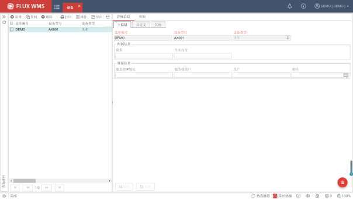

仓库编号－设备所属仓库。默认为当前登录仓库。

设备型号－设备型号信息。同型号的设备可能有多台。

设备类型－设备类型信息，例如叉车、摄像头等。下拉框内容根据系统代码 EQP_TYP中的配置进行显示。

附属信息－不同设备对应的独有信息。例如周转箱、托盘有载重限制信息，但叉车才有作业高度限制。

链接信息－服务器地址、账户信息。接口访问模式的摄像头，用于维护对应接口访问信息。

- 点击【保存】按钮，完成主信息设置操作。

- 在“明细”页签，维护具体设备信息：

<!-- 原 PDF 第 351 页 -->

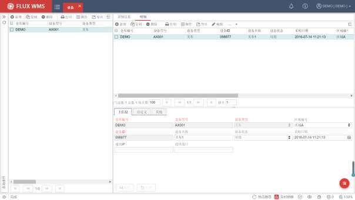

仓库编号、设备型号、设备类型－根据主信息带入，只读显示。

区域编号－如果某个设备仅在某个区域使用，可以相应指定对应区域信息。例如高位叉车，仅在高货架区域使用。

设备 ID－设备的具体代码。用于区分同类的不同设备。

设备名称－设备名称描述。

设备状态－设备当前运行状态，例如可用，或者报修。

采购日期－设备采购时间信息。

通讯 IP－设备接口的对应接口通讯 IP。

通讯端口－设备接口的对应通讯端口。

- 点击【保存】按钮，完成设置操作。

## 7.8. 输送线

现代仓库中，输送线是常见的自动化设备之一，但不同的业务场景，使用输送线的情况也有所不同。比较常见的情况，输送线用于拣货操作，部分仓库会在上架、补货、拣货流程中都使用输送线进行货物搬运。

<!-- 原 PDF 第 352 页 -->

输送设备推送货物的弹出口/投放口，根据业务流程不同，也会有不同的需求，例如输送线端口可能与路线绑定，也可能根据作业量情况调整路线设置；上架流程的弹出口，与拣货流程的投放口尽管都是输送线端口，但覆盖的库位范围不同，等等。因此系统提供独立功能进行配置，以便支持仓库内的不同业务流程管理需求。

- **输送线设置**

- 在主菜单“仓库设置”下选择“输送线”。

- 点击【新增】按钮，在“详细信息”页签依次输入信息：

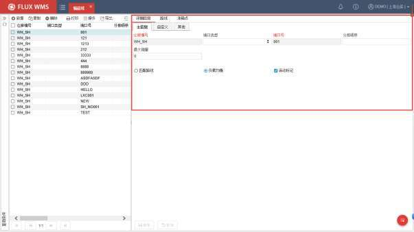

仓库编号－分拣口所属仓库。默认为当前登录仓库。

端口类型－端口使用分类，例如拣货端口还是补货端口。

端口号－输送线的周转箱弹出端口（也即货物投放端口）的端口号。

分拣顺序－默认同端口号，当输送线需要调整端口工作分派次序时，通过更改“分拣顺序”内容可以调整排序，而无需变更端口号（输送线端口号变更容易使操作人员混淆。）

最大箱量－当端口待执行弹出箱量已达到此上限值情况下，该端口的订单/箱允许分配到其他端口，以免个别端口作业量过多导致拥堵。

匹配路线－作业模式二选一选择项。输送线端口与路线绑定，对应路线的货物 /包裹从此端口弹出。

<!-- 原 PDF 第 353 页 -->

负载均衡－作业模式二选一选择项。根据传输量，多个端口平均作业量，执行负载均衡计算。

活动标记－此端口是否启用。

- 点击【保存】按钮，完成详细信息新增操作。

- **路线配置**

- 选择“路线”页签，系统显示如下，为当前端口指定对应的路线配置：

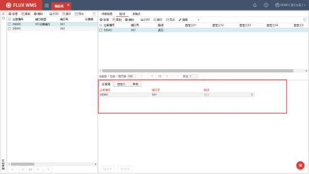

- 点击【新增】按钮，系统在主信息页签显示仓库编号、端口编号，根据需要选择线路，然后点击【保存】按钮，记录保存成功，显示到上方列表窗口

注：一个端口，可对应多条路线，通常是这些路线货物可以一同运输，或者后续作业有按路线进一步分拣等操作。

- **派箱点**

当输送线用于派箱投放时，一个投放口，可以视作一个工位，后续有跟踪管理的需要，因此系统会需要对派箱工位，进行基础信息设置，以便后续跟踪时能够区分。

仅当主信息页签，输送线的端口类型字段配置为“RG-派箱点”情况下，对应的“派箱点”页签内容才能添加记录，否则【新增】按钮无法点击。

<!-- 原 PDF 第 354 页 -->

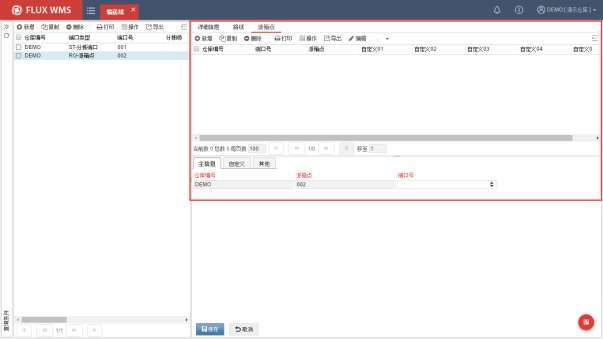

由于派箱是针对拣货流程的操作，因此派箱点对应的端口，仅可下拉选择之前已经在【输送线】功能中维护的、端口类型是“PK-拣货端口”的输送线端口记录。

## 7.9. 堆垛机

自动化仓库中，堆垛机是关键设备之一，通常由自有 WCS 进行管控，WMS 通过接口与 WCS进行交互、下达任务，从而驱动堆垛机进行作业。但在日常作业过程中，有时由于堆垛机设备原因，某个巷道的任务暂时无法执行，例如设备检修养护等。此时需要通过设置告知系统，任务下达时避让此巷道，因此在 WMS 中也具有堆垛机设置功能。

- **堆垛机设置**

- 在主菜单“仓库设置”下选择“堆垛机”功能。

- 点击【新增】按钮，在详细信息部分的“主信息”页签，可以人工维护或者通过接口获取每个堆垛机的当前作业状态，并保存。

<!-- 原 PDF 第 355 页 -->

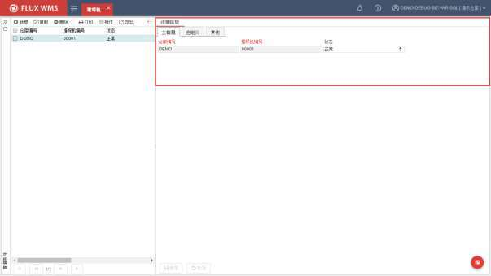

- 系统提供正常、禁入、禁出、堆垛机故障等几种种状态情况供选择。

## 7.10. 播种墙

日常使用的电子标签播种，波次复核播种，入库播种，动态播种等各种播种作业操作，所使用的播种墙，需要先在仓库设置部分，对播种墙、播种库位相关信息、布局情况进行维护，这样系统才能对播种库位的分布，上下左右相对位置进行展示和管理。

多数仓库，在一个作业节点使用播种功能，多个作业台所用的播种墙布局相同，例如都是 6层，每层 8个播种位。

但也有些现场，可能在多个作业节点使用播种功能，所用的播种墙布局不同。例如同时使用出库波次播种与退货入库播种，出库播种的播种墙是 6 层，每层 8个播种位；但退货入库由于退货量较大，需要的播种位货格也较大，因此播种货架是 3 层，每层 6个播种位。

这种情况下，就需要维护 2种不同的布局的播种墙情况，并告知系统，在什么作业环节使用哪一类播种墙，以便系统生成波次、订单组时，按播种库位的个数进行相关计算，避免生成的波次中包含的订单数量超过播种位数量，导致有订单无法播种。

因此系统的播种墙相关设置，分为“播种类型”，“播种墙”两个功能，分别设置。

<!-- 原 PDF 第 356 页 -->

### 7.10.1. 播种墙类型

一些仓库现场，不同作业区可能会使用不同布局模式的播种墙（例如退货入库使用 4x8 的 32格播种墙，但出库播种使用多组 5x4的 20格播种墙）。因此系统中需要相应维护不同类型的播种墙信息，以便在生成波次计划等环节，指定所使用的播种墙类型。系统可以根据播种墙类型对应的播种位个数，限定波次中订单的个数。

- **播种墙类型设置**

- 在主菜单“仓库设置”下选择“播种墙类型”功能。

- 点击【新增】按钮，在“主信息”页签，维护这一类布局的播种墙的相关信息：。

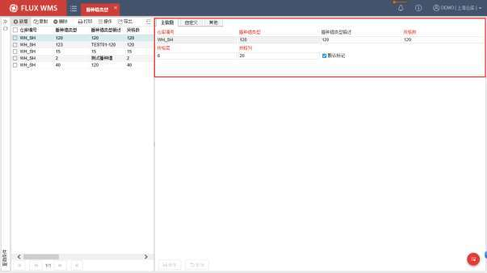

仓库编号－播种墙所属仓库。默认为当前登录仓库。

播种墙类型－类型代码。同一种布局模式的播种墙，只需维护一种类型。

播种墙类型描述－类型说明，也是在波次计划规则等功能中，选择播种类型时，下拉列表显示的内容。

货格数－这一类型的播种墙中，具有的播种库位个数上限。也是对应波次计划规则，生成波次时的订单个数上限，以免波次中订单过多，播种任务所需播种位超过实际播种位个数，导致现场无法操作。

<!-- 原 PDF 第 357 页 -->

货格层－这一类型的播种墙的层数。

货格列－这一类型的播种墙的列数。正常情况下，层数*列数，即为货格数。

默认标记－是否是这个仓库的默认播种墙类型。波次计划规则中如未指定所用播种墙类型，但又启用了播种任务生成，将使用默认播种墙类型进行计算。

- 点击【保存】按钮，完成播种墙类型设置。

### 7.10.2. 播种墙

实际作业场景中，特别是在出库作业环节，同一类型下，有时会有多组播种墙货架。

固定货架模式，一般是一组货架对应一个工作台，货架号可代替工作台号，作为工位号用于管理。

流动货架模式，或者叫动态货架模式，货架可移动，一组货架播种完成，会被移走，到后续作业工位进行复核或者打包，播种工位使用新的一组空货架进行播种操作，这种情况货架号会用于持续跟踪，作业时会采集货架号与工位号匹配记录。

每一组播种墙货架信息，以及货架上的播种库位信息，在“播种墙”功能中进行维护。除了播种库位 ID等日常信息，还需要对播种位的 X/Y坐标、显示顺序等信息进行维护，以便图形化显示使用。

- **播种墙设置**

- 在主菜单“仓库设置”下选择“播种墙”功能。

- 点击【新增】按钮，在详细信息部分的“主信息”页签，维护播种墙货架相关信息，如代码、名称、层数、列数，新增信息默认非激活。

<!-- 原 PDF 第 358 页 -->

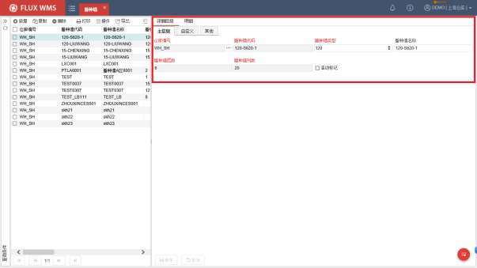

仓库编号－播种墙所属仓库。默认为当前登录仓库。

播种墙代码－播种墙 ID。即每组播种货架的货架号。同一类型（即相同布局）下，用于区分不同的货架/工作台。

播种墙类型－下拉列表选择已配置的播种墙类型，后续所配置的播种墙明细播种库位个数，应与类型对应的货格数匹配。PS：如果播种墙类型，是当前新增的，可能需要重置缓存后，才可见此选择项。

播种墙名称－名称描述信息。

播种墙层数－播种墙层数信息，根据所选的播种墙类型相应带出显示。

播种墙列数－播种墙列数信息，根据所选的播种墙类型相应带出显示。

活动标记－是否使用中的记录。新增保存时，默认不勾选。完成明细播种位配置后，再勾选为活动状态。系统同时校验明细播种位个数是否超过播种墙类型的播种位个数上限。

- 主信息保存后，在“明细”页签，进一步维护如下播种库位的相关信息：

<!-- 原 PDF 第 359 页 -->

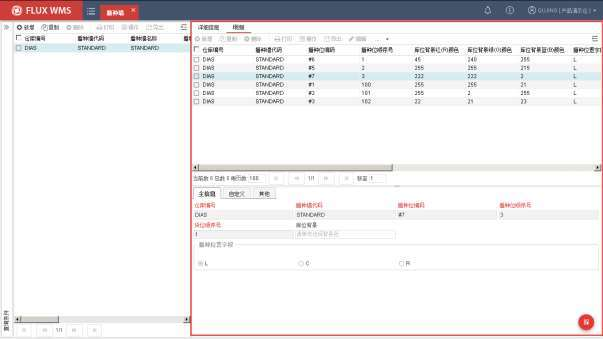

仓库编号－默认当前仓库编号代码。不可修改。

播种墙代码－播种库位所属的播种墙 ID，不可修改。

播种位编码－播种位代码 ID，即播种库位的货格代码。

播种位顺序号－播种位绑定次序。例如订单优先绑定播种墙中部、最方便作业的播种位，后续订单再绑定上层、下层播种位，最后绑定四角距离较远的播种位。绑定顺序，可以与纵向、横向的位置显示顺序不同，这样在订单量少于货格数量时，会优先使用方便作业的播种位，提高播种效率。

货位顺序号－播种位在图形化界面的显示顺序配置。

库位背景－点击后显示颜色控件，可以选择播种位背景色。

播种位置字段－播种库位所属左、中、右片区选择，播种时界面会显示相应的方向指示箭头，方便 L型或者 U 货架布局情况下方向识别。

- 点击【保存】按钮，完成播种墙的对应播种位信息维护。

## 7.11. 员工

登录系统的操作用户，需要在权限管理模块中维护。但另一部分，不直接操作系统的员工，而

<!-- 原 PDF 第 360 页 -->

与业务相关的，可以在员工功能中进行维护。例如货主对应的业务担当，入库单、出库单对应的业务担当，可以在员工中进行维护，方便仓库作业人员在需要的时间能够找到对应的内部业务联系人。

- **员工设置**

- 在主菜单“仓库设置”下选择“仓库员工”。

- 点击【新增】按钮，在如下图的“主信息”页签依次输入工号、名称、电话等信息。

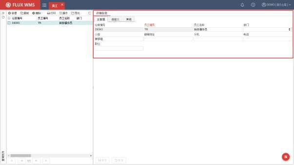

- 点击【保存】按钮，完成仓库员工记录新增。

- **鼠标右键功能菜单**

- 员工标签打印

用于打印所选员工记录的对应标签，常用来制作员工进出证件、临时工卡打印。

## 7.12. 设施

部分比较大型的仓库，会分为几幢实体建筑，或者是多层楼房结构，会有分区管理的要求。有时不同的建筑、楼层，可以通过区域进行划分，但仓库内如果原本就有多区域管理的要求，再通过区域、库区划分，识别程度不高，对物理结构，与进货区域、发货区域的管理分区容易混淆。

<!-- 原 PDF 第 361 页 -->

因此系统提供了独立的“设施”功能，用来对仓库内容的物理结构进行定义，后续与工作区配合进行设置，在图形化库存查询等环节，可以按设施进行查看。

- **设施设置**

- 在主菜单“仓库设置”下选择“设施”。

- 点击【新增】按钮，在如下图的“主信息”页签依次输入所属仓库、设施编号、描述等信息。

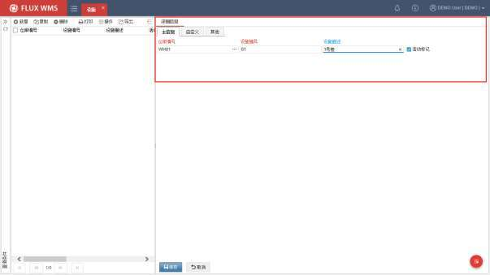

- 勾选“活动标记”字段，设置为激活状态，并保存新增记录。

## 7.13. 图形化库存文字设置

配合【库存管理】-【图形化库存查询 3D】功能使用，对 3D 仓库模型中的地面、墙面文字显示进行配置：

- **图形化库存文字设置**

- 在主菜单“仓库设置”下选择“图形化库存文字设置”。

- 点击【查询】按钮，查询已有记录，或者通过【新增】按钮，新增记录，相应输入如下信息：

<!-- 原 PDF 第 362 页 -->

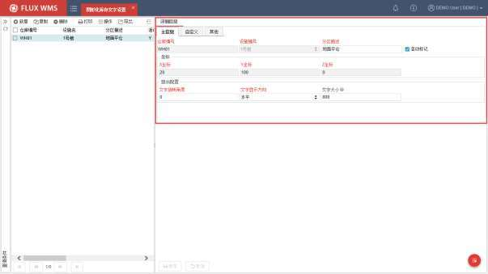

仓库编号－默认当前仓库编号代码。不可修改。

设施编号－系统支持一个仓库内按物理建筑配置多个设施，每个设施分别显示仓库模型、库存情况。因此需要指定所配置的文字内容，是在哪个设施范围内显示。

分区描述－即仓库模型中显示的文字内容。

活动标记－此记录是否使用中。

坐标－文字显示的位置。坐标单位为公分，高度 Z坐标为 0即文字显示在地面上。深度Y作为为 0，则文字显示在墙上或者 3D 元素的正面。

文字旋转角度－默认为 0，即文字无旋转，正常显示，例如“ ”。可配置为 90 度

旋转，效果如“ ”

文字显示方向－文字水平排列，还是纵向排列。例如“ ”，还是“ ”

文字大小－字体大小配置，有效值 800~2400(间隔200)，例如 1000,1200,2400

- 点击【保存】按钮，保存设置或修改。

后续通过【仓库设置】-【库位】的“3D 建模”功能，将库位信息、文字设置上传创建仓库模型，用于后续的【库存管理】-【图形化库存 3D】查询显示。

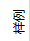

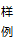
