# 8. 业务规则

> 来源文件：`富勒WMSV6.2（最全版1119页）.pdf`；原 PDF 第 363-489 页。

> 本文件按原 PDF 正文中的顶层章节拆分；每页保留原 PDF 页码注释，图示按原图注顺序引用。

<!-- 原 PDF 第 363 页 -->

业务规则是 FLUX WMS 中非常复杂和优异的部分，是系统在处理仓库业务时所遵循的、关于商品或管理要求的运算规律，也是系统后台逻辑最为复杂的部分。在我们理解和运用系统前，必须了解业务规则如何引导整个仓库管理系统的运作。

通常情况下，库存周转规则、预配、分配规则是必不可少的，可能根据业务复杂程度，配置订单分配规则。其余规则根据业务需要进行配置，例如希望系统推荐库位，则需要配置上架规则；有补货、质检作业要求要配置补货规则、质检规则。

业务规则主要有：

- 上架规则

用户能够通过设置不同的上架规则，使系统为不同产品推荐所需要的存储库位。

- 库存周转规则

负责控制库存周转的计算规则。

- 预分配规则

负责库存预留的规则。

- 分配规则

负责库存拣选的规则。

- 波次计划规则

系统定时生成波次计划所遵循的规则。

- 补货规则

动态补货情况下系统进行拣货库位选择的规则。

- 质检规则

根据入库单证生成质检单据时，产品应检数量计算规则。

- 流水号规则

系统内部各种订单号、序列号等的生成规则。

- 定时任务规则

<!-- 原 PDF 第 364 页 -->

系统定时执行处理的控制规则

- 自动发运规则

订单自动发运规则配置

- 路线规则

不同路线，承运、业务量分配规则

- 配送规则

不同承运人的配送单运单号计算规则

- 单证控制规则

不同类型单证的操作管理规则。

- 任务派发规则

工作任务下达指派和控制的规则。

- 序列号规则

序列号校验逻辑规则

业务规则是实现仓库个性化服务和工作自动化的基础。业务规则管理不同的工作流，保证任务的及时指派和作业优化。

业务规则是客户、产品和订单层次的，其优先级也逐步上升，也就是说订单层次指派的规则优先于产品层次指派的规则，而产品层次指派的业务规则优先于客户层次指派的规则。

FLUX WMS充分考虑客户的各种需求，制定的业务规则的层次，最大程度保证了业务系统的灵活性。

## 8.1. 上架规则

在已经定义了仓库中必需的基础信息之后(例如区域，库位空间信息、产品信息等)，仓库能够根据客户产品管理需要或者现场管理要求，创建一个决定产品在仓库中如何摆放的业务管理规则，称之为上架规则。每一个客户或细化到每一种产品都可以分别定义对应的上架规则。

由于同一产品在不同仓库内的存储布局要求有可能不同（例如产品要求存放在恒温库，北京仓

<!-- 原 PDF 第 365 页 -->

的恒温库是在底楼的 A区域库位，而上海仓库的恒温库是 3楼的 H区域），因此在进行产品上架规则配置时，可以在多仓页签，为每个仓库分别配置上架规则。配置时所选择的上架规则，需要在【业务规则】模块中预先维护好规则的具体要求内容。

遵循上架规则执行上架计算，执行的前提是产品档案的“库位指定方式”配置为系统计算库位（例如收货时计算库位或者上架是计算库位。即不能是人工指定库位），并且收货库位是过渡库位。否则系统视为人工收货到存放库位，无需系统进行上架计算、推荐库位，不会生成上架任务。

### 8.1.1. 上架规则设置

在上架规则中有两个基本部分：

- **详细信息**

规则主信息内容如下：

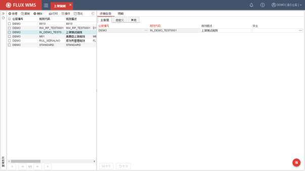

上架规则除了代码、描述之外，还需要指定此规则适用的仓库。新增时，系统自动默认当前登录仓库。

客户代码字段内容仅用于备注，如果规则适用于多个货主，客户代码字段可以不指定。

- **明细**

明细页签部分，指定了FLUX WMS系统评估这一产品和一系列用来挑选合适的库位时的约束

<!-- 原 PDF 第 366 页 -->

条件。系统按一定的步骤来评估每一产品。

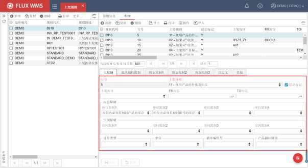

FLUX WMS在评估和执行上架规则时，考虑的先后次序是：

- 按行号的次序依次选择（新增记录时，行号可编辑，方便用户调整次序）生效的（即活动标记勾选的）规则明细行。

- 根据订单类型、包装级别、产品循环级别、批次属性等条件，决定是否遵循此行规则。如果条件不符，则跳过此行，查看下一行规则明细。例如此行规则明细指定的订单类型 是“采购收货”，而当前订单是“调拨入库”类型，则当前订单跳过、不执行此行规则，向后匹配下一行规则明细。直到匹配到一行条件均符合的规则明细行。

- 根据规则代码，来决定如何获得候选库位的清单。例如从指定库区中找合适的库位，还是使用产品指定的固定库位。具体规则代码内容介绍，请参考本章【8.1.2规则元素说明】部分的介绍。

- 为候选名单中的每个库位检查限制条件（包括库位限制、空间限制等条件），即根据限制条件确认货物能否放入这个候选库位。库位合适，执行后续的分派库位；库位不适合，则找下一个候选库位进行匹配。

- 分派库位。如果某一个库位通过了以上所有的限制条件，就完成了库位的选择。

- 如果找不到一个合适的库位，选择下一行规则明细行，并且重复以上步骤。

<!-- 原 PDF 第 367 页 -->

- 如果全部规则运算后，没有找到合适的库位，系统返回空值。通常情况下，仓库为了避免返回空值，使得操作人员无法作业，多数会将最末一条规则明细行配置为无限定条件、上架到某个用于异常处理的临时库位。

FLUX WMS 让使用者能定义出一种自定义的上架规则，从而能在不修改代码的情况下修改这种业务规则。

### 8.1.2. 规则元素说明

- **上架规则代码**

各行规则代码，如果同时指定了“原始库位”，则只有收货到指定的“原始库位”的情况才按此行上架规则明细要求进行上架计算。

- 代码 01-如果从“收货库位”收货，则上架到“目标库位”

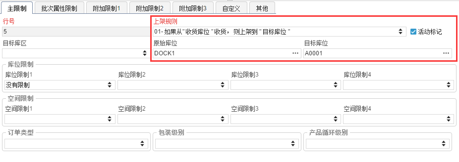

如果产品的收货库位，是规则中维护的、“原始库位”字段指定的库位（如上图的“DOCK1”），则符合此项规则，强制上架到“目标库位”字段维护的库位中（如上图的“A0001”库位）。此规则下，目标库区字段维护的内容将被系统忽略。

原始库位设置内容，是收货过渡库位，通常与不同的收货门、月台对应。此规则能够实现不同过渡库位收货的货物，分流到不同存储库位存放的目的。例如1 号月台操作收货，会收到1 号月台对应的过渡库位 DOCK1中，这些货物全部上架到A0001库位；而 2号月台，收货到B 过渡库位的货物，则全部上架到 A0002库位。此时可以配置 2行上架规则明细，规则代码都是 01，但原始库位一条为 DOCK1，一条为 DOCK2，进行分流。

但此规则明细如果有设置限制条件（如库位限制、体积限制等），而指定的目标库位，又与待上架货品的情况不匹配（例如货品体积超过库位体积），则不符合此行规则明细的条件，会跳转到

<!-- 原 PDF 第 368 页 -->

下一行规则明细行进行库位计算。

- 代码 02-如果从“收货库位”收货，则在指定的库区中查找合适的库位

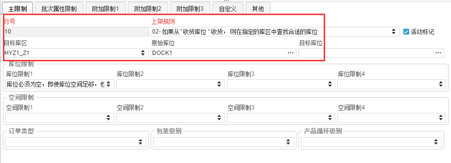

与规则代码 01逻辑类似，但目标不是具体某个库位，而是一个库区的多个库位。即如果产品的收货过渡库位，是规则中维护的“原始库位”字段指定的库位（如上图的 DOCK1），则在“目标库区”字段指定的库区中寻找合适的库位（如上图的 Z1）。此库区中，具体哪个库位合适，将根据后续限制条件（库位限制、体积限制等）进行判断。此规则下，目标库位字段维护的内容将被系统忽略。

此规则能够实现不同过渡库位收货的货物，分流到不同库区的目的。例如收货到 DOCK1 库位的货物，在就近的、北部 Z1 区寻找合适的存储位，而收货到 DOCK2 库位的货物，到南部的 S2 区寻找合适的存储位。

- 代码 03-在指定库区中寻找合适的库位

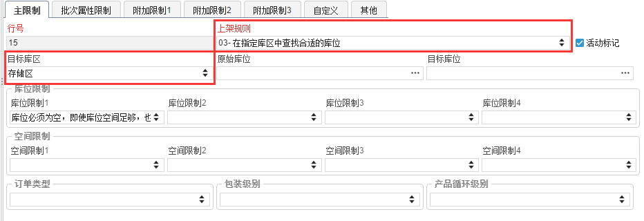

最为常用的规则之一，不考虑产品的具体收货库位（产品只有收货到过渡类型的库位才会进行

<!-- 原 PDF 第 369 页 -->

上架库位计算），而是直接在“目标库区”字段指定的库区中寻找合适的库位。

此库区范围内，具体哪个库位合适，进一步根据库位限制、空间限制条件进行查找。

- 代码 04-上架到“目标库位”

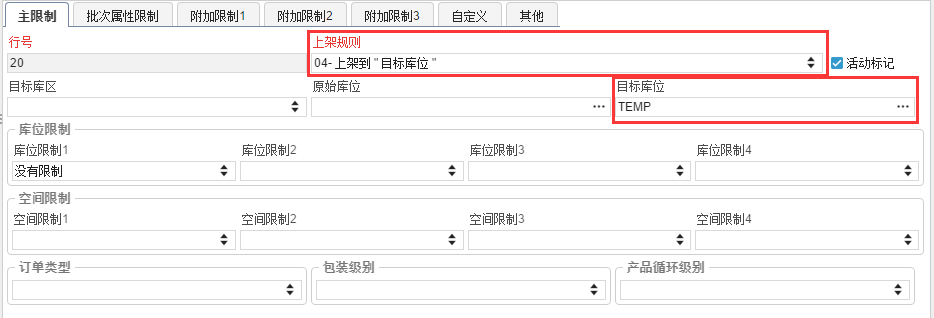

使用此规则的产品都指定上架到唯一的库位，库位号维护在“目标库位”字段中。

常用做其他规则找不到合适库位情况下的强制指定。例如所有系统计算不到合适库位的货物，都指定到 TEMP 库位，再由人工进行问题检查、库位安排。

- 代码 06-在 SKU所指定的库区列表查找合适的库位

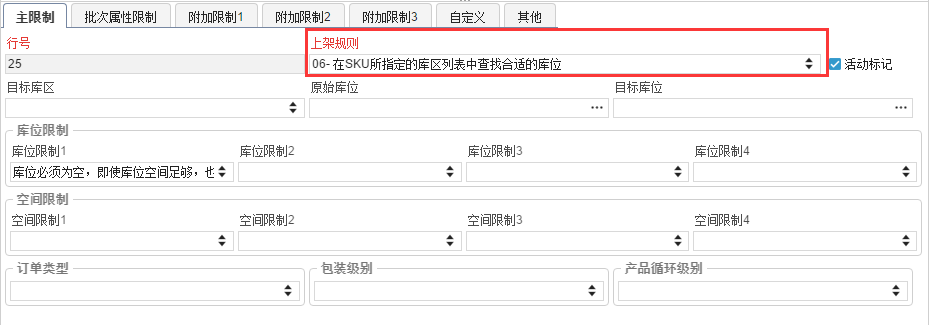

有些仓库库区划分较为细致，不同产品上架到不同库区。如果只在上架规则中设置，规则太多，不利于维护。因此规则指定到产品档案中维护的库区找合适库位，可以在产品档案中逐一维护，并且支持设置多库区管理清单，按配置的次序在各个库区依次寻找可存放库位（具体配置介绍，可以参考【基础设置-产品档案】章节的“产品多库区管理”页签部分的介绍）。

<!-- 原 PDF 第 370 页 -->

例如同一个产品 A，在广州仓，依次到 G1、G2、G3 库区查找合适的库位。在北京仓，则是BZF、BZH、BZA 的次序。结合产品档案设置与上架规则设置共同生效。

- 代码 07-上架到产品所指定的上架库位

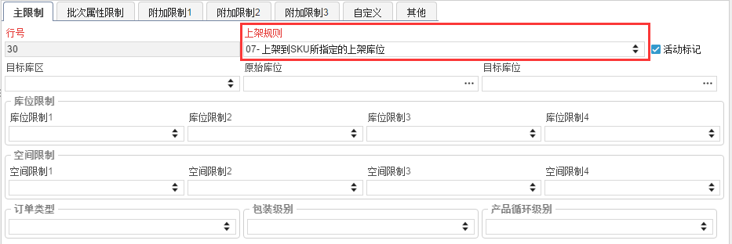

在产品档案的“多仓设置”页签中，每个产品可以维护各自在不同仓库的固定上架库位。采用此规则，将产品计算上架到产品档案已维护的、指定仓库上架库位中，以便实现每个产品上架到指定的固定库位的要求。

与 06规则类似，也是结合产品档案设置与上架规则设置共同生效。

- 代码 11-使用产品的件拣货库位

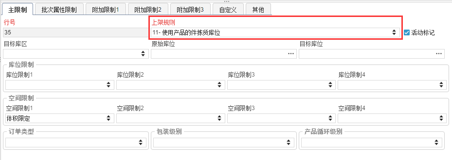

指定上架到产品档案功能维护的件拣货库位中。通常应用于拣货位管理模式下，并且不关注先进先出批次管理的场景（直接上架会打乱批次顺序），为了减少上架后再补货的2 次操作工作量，在入库时直接上架到产品拣货位。

实际应用中，也有很多仓库会采用零散件上架到拣货位，整箱货物上架到存储位，后续再补货

<!-- 原 PDF 第 371 页 -->

的包装分级操作模式。需要结合【产品档案】的拣货位设置才能生效。

使用此规则时，如果“目标库区”有指定具体库区，则仅在指定库区找产品的件拣货库位。适用与有多个拣货区，分别用于不同业务拣货操作的仓库，也即产品拣货位维护了多条拣货位记录，但分数不同库区的情况。例如采购收货入库的零散数量上架到拣货区 1，而电商订单入库的零散数量上架到拣货区 2，就需要分别配置 2行指向不同库区的拣货位上架规则明细。未指定“目标库区”，则无需区分管理，产品的全部拣货位都可以作为后选库位。

同时，如果【产品档案】的拣货位中，有指定“批次属性值”，则只有批次属性 04内容与拣货位要求的“批次属性值”内容相符，才能上架到这个拣货位中。经常用在分流场景中， 例如 lot04用于记录产地，产地为 A 的库存，上架到拣货位 01库位，产品为 B的库存，上架到拣货位 02库位。

- 代码 12-使用产品的箱拣货库位

指定上架到产品档案功能维护的箱拣货库位中。与代码11 逻辑类似，适用与设置箱拣货位的仓库，如果“目标库区”有指定具体库区，则仅在指定库区找产品的箱拣货库位。

- 代码 13-使用产品的箱/件拣货库位

指定上架到产品档案功能维护的箱/件拣货库位中。与代码11 逻辑类似，适用与设置箱 /件合并拣货位的仓库。

- 代码 21-如果批次属性为指定批次属性，则在指定库区中查找合适的库位。

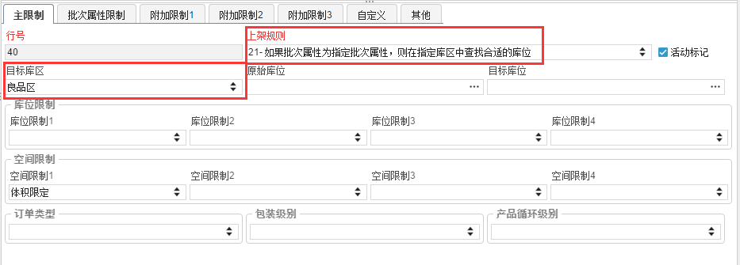

使用此规则代码，除了在“主限制”页签配置规则代码、对应目标库区之外，还需要在“批次属性限制”页签，配置对应限制值，如下图，批次属性 08为是否不良品，指定条件为 N：

<!-- 原 PDF 第 372 页 -->

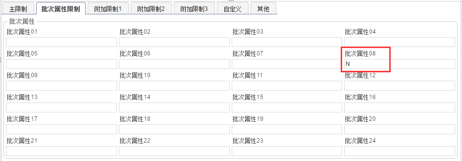

执行上架计算时，系统会先判断记录是否符合上架规则指定的批次属性条件，如果符合，在“目标库区”维护的库区中查找合适的库位。

记录如果不符合指定的批次属性条件，则跳过此行上架规则明细，与下一规则记录进行匹配。

例如符合条件的良品（批次属性 08=N的库存记录）到良品区寻找合适的库位；而不良品则跳过此行规则，执行后续其他规则行的逻辑，到不良品区寻找合适的库位。

- 代码 22-如果批次属性为指定批次属性，则上架到目标库位。

与规则 21类似，执行上架计算时，先判断记录是否符合上架规则指定的批次属性条件，如果符合，上架到“目标库位”字段指定的库位中。

- 代码 30-查找同类产品相邻的库位。

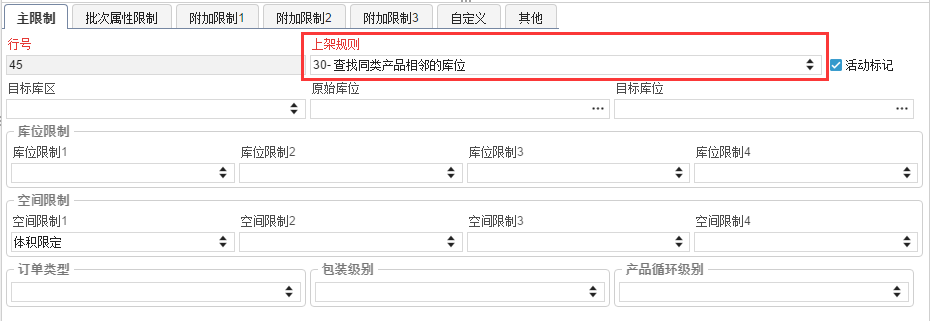

计算上架库位时，根据产品档案的产品组信息，优先寻找同组产品所在库位附近的库位上架。适用与同类产品（相同产品组的产品）希望就近存放，但又不设置拣货位，也不分区管理的仓库场

<!-- 原 PDF 第 373 页 -->

景，只需要同类产品集中即可。

- 代码 31-查找拣货位最近的存储位。

部分仓库的操作场景是货物入库时，先入拣货位，拣货位放不下再找拣货位附近的存储库位，这样可以减少补货工作量，缩短补货时的搬运路线长度。此时可以用到规则 31，在产品档案所配置的拣货位附近，选择距离拣货位最近的、合适的存储位。

库位就近的判断，系统会根据库位 X、Y、Z 坐标信息，计算存储位、拣货位到库区基点库位的距离，更新库位的“上架逻辑顺序”内容（具体介绍可参考【仓库设置-区域和库位】的“就近库位”逻辑介绍）上架计算时可以直接使用“上架逻辑顺序”信息。

- 代码 34-相同来源跟踪号合并上架

适用于混托计算上架场景，同一托盘的待上架库存，推荐到同一个上架目标库位，避免上架计算时混托盘占用多个目标库位。尽管普通模式下多个上架任务、实际上架时可以整托盘合并确认，释放多余目标库位，但作业过程中多占用目标库位，有可能影响到其他上架任务的目标库位计算，因此对于明确合并上架的场景，可以采用此规则作业模式。

- 代码 35-相同 MUID来源合并上架

适用于多级跟踪号管理的混托计算上架场景。MUID 是跟踪号的集合，一个MUID 中可以包含多个跟踪号。此规则逻辑与34-相同来源跟踪号合并上架类似，只是基于更上一级的 MUID 层级进行计算，同一 MUID的待上架库存，推荐到同一个上架目标库位，避免上架计算时混托盘占用多个目标库位。

- **库位限制**

说明每个候选库位类型必须满足的限制条件。如果一个库位不能满足所有的限制条件，它就不能被用于候选存储，包括是否能够混放批次、产品，是否根据产品组信息判断等。即主要用来校验候选库位能不能用。

在判断“相同批号”时，根据批次属性中的“关键批次”进行判断，能够实现部分批次属性相同即认为批号相同的需求。

在指定的候选库位范围内（例如指定的目标库区内），系统根据上架逻辑顺序，依次检查库位是否满足限制条件。

库位限制的内容主要有：

- 没有限制

即在库位使用方面不做限制。上架计算时，可能依据其他条件进行候选库位是否合适的判断。

<!-- 原 PDF 第 374 页 -->

- 库位必须为空，即使库位空间足够，也必须查找空的库位

只查找产品在放入之前没有库存的空库位。即使库存中有相同产品或者已占用的库位有足够的空间，也必须查找新的空库位。

- 不允许混放产品，即使库位属性为允许

同【库位】功能中“允许混放产品”选项未勾选情况下的控制效果一致，库位不能混放产品，但是它能用于所有的候选库位，而忽略库位中的混放标识设置。即不论目标库位在库位档案中如何设置，上架时都不能把不同产品放置到同一库位中。

- 不允许混放批次，即使库位属性为允许

根据批次属性的关键属性来判断批次是否一致。不一致的情况下，即使【库位】功能中设置可以混放批次，在上架计算时仍不允许关键属性不同的产品进行混放。

- 库位内必须有相同产品的库存

同样的产品合并库位存放，可以提高仓库内的库位利用率，但仅适用与批次不敏感的产品，会造成批次混放。

- 库位内必须有相同批号的产品

同样批号（相同关键批次属性）的相同产品合并库位。关键属性设置，可以参考【基础设置-批次属性】章节的介绍。

- 库位内必须有相同产品组 X 的库存

只有产品档案的产品组对应字段相同的产品才能混放。例如库位内必须有相同产品组 1 的库存，即按库位组1 合并库位存放。多数情况下，库位组字段维护的是产品的类别信息，例如服装SKU 的库位组 1常常用来维护款号信息，为了提高库位利用率，对于过季的服装，经常会按款号混放，此时可以用到“库位内必须有相同产品组1 的库存”的限制条件。

- 多伸位-生产日期排序原则

多伸位的仓库中，有些双向可操作的货架，库位一个方向入库，从另一个方向出库。为了遵循严格的先进先出管理要求，货物入库时批号（主要是生产日期）必须有序的进行安排。此时增加限制条件，计算上架的货物的生产日期必须大于或者等于该库位库存最大的生产日期，否则此库位即不符合条件。

即保证同一个多伸位库位中，上架的次序，根据生产日期的次序进行，以便系统方便执行先进先出管理。

<!-- 原 PDF 第 375 页 -->

- 库位内不能包含相同产品组X 的库存

用于混 SKU存储的库位，上架时排除类似产品，从而保证库位内混放的产品差异较大，拣货时能够快速区分。

- **空间限制**

为每一个候选库位限定空间尺寸要求，如体积、重量等，筛选可用的库位。即主要考虑库位能否放得下的问题。空间限制的主要条件有：

- 没有限制

即在库位空间使用方面不做限制。上架计算时，可能依据其他条件，例如根据库位限制进行候选库位是否合适的判断。

- 体积限定

不适用于评估箱或件拣货库位，因为这些库位已经预先设定能存放的固定数量。

产品体积的计算逻辑是，用这个库位的体积（即库位容积），减去已有库存的体积后得到的剩余库位容量，与产品的标准体积乘上待上架数量的积（即待入库体积）进行比较，判断待上架产品能否放入库位进行存储。

因此当产品入库量较大时，通常会做托盘堆码（系统按包装设置计算码盘），拆分为一个托盘的单元，计算到多个目标库位中。否则不做拆分情况下，一批入库货品，要上架到同一个目标库位，往往会找不到足够大的库位。

对于服装类，挂装存放，没有固定包装的业务情况，可以按照库位容量，进行拆分上架计算。

- 重量限定

不适用于评估箱或件拣货库位，因为这些库位已经预先规定出能存放的固定数量。

产品的重量计算逻辑是，用库位的重量限定值，减去已存放产品的重量得到的剩余重量容积，与产品的标准重量乘以待上架数量得到的乘积（即待上架重量）进行对比，判断库位能够容纳这些重量的库存。

在重货存放过程中比较常见，通常地面平仓或者货架的底层库位承重比较大，通过重量限定，在不需要细分库区的情况下，可以使得比较重的货物跳过承重不高的货架上层库位，而在承重比较高的库位中进行匹配。

- 数量限定

用产品的主单位数量与候选库位的限定数量相比较。

<!-- 原 PDF 第 376 页 -->

- 托盘数量限定

不能用于评估箱拣货库位或件拣货库位。

按托盘数量限定的计算逻辑，用产品的托盘个数同库位的托盘数量限制数相比较，适用于整托盘上架、不考虑合并托盘的业务场景，通常库存也会保留跟踪号。

存在一种特殊情况，对于地面平仓，有些货物可以多个托盘堆叠，一个库位能够放入 20托、30托货物，但另一些怕压的货物不能堆叠，只能放一层 10托盘货物。因此可以在【货类】功能的“库位规则”页签，维护此类货物，在某类库位中的托盘数量限制。

系统在进行上架计算时，如果上架规则配置“托盘数量限定”，会优先按货类中设置的限制数量计算上架，如果货类中没有进行设置，则按库位的托盘数量限制进行上架计算。

- 高度限定

产品（或者相应的包装，例如按箱计算目标库位时的箱包装高度、按托盘计算目标库位时的托盘整体高度，多包装的场景中，根据批次属性 12记录的包装进行高度信息获取）的高度必须小于库位的高，常用于特殊产品，例如超高货物的限定。

不适用于评估箱或件拣货库位，因为这些库位已经预先规定出能存放的固定数目。FLUX WMS假定每个库位都是一个托盘库位，但是托盘能叠堆。

- 箱数限定

根据箱包装级别的数量来判断库位是否符合条件。适用于按箱包装级别进行上架计算的场景。

- 服装行业挂装规则

适用与挂装存储，一根挂杆上通过可移动的挡板分隔库位的场景。由于挡板可移动，库位容量是动态的。通常将一根挂杆设置为一个库位组，并在【库位组一】功能中维护挂杆的长度。计算目标库位时，根据库位所属的库位组的长度信息、挂装衣物的厚度，计算一个库位组内，多个动态长度库位可容纳的服装总量。

在计算上架时，按件为单位，根据一个库位组的容量逐件计算后，拆分收货记录为多个上架任务。例如收货 100件，第一个库位上架 19件，第二个库位上架 81件。

即使用挂装计算上架模式，除了需要设置上架规则，产品多仓中选用此上架规则，还需要配置相关功能点有：

- 库位所属库位组；

- 库位组的长度；

<!-- 原 PDF 第 377 页 -->

- 产品宽度；

- 产品所用包装，对应 EA级别的“入库标签”需要勾选。

- 相关参数 RCV_BRK_TSK（收货时根据一次收货的数量自动按包装拆分）需要开启；

- 件/箱拣货位数量限制

用于上架到拣货位的场景，根据拣货位的上限数量判断是否能够容纳待上架产品。

- MUID 数量限定

使用 MUID多级跟踪号管理模式中，希望根据 MUID的数量进行库位容量计算，也即上架计算时，系统检查候选库位内已有的 MUID个数，加上准备上架的 MUID，是否超过库位维护的“托盘限制”数量。

- 按照产品 LOCTI*LOCHI数量限定数量限定

地面平仓，按产品一层可以放几托盘（LOCTI），能够堆叠几个托盘（LOCHI）来计算库位内可容纳托盘个数。适用与库位大小一致的情况。

- 按照产品 LOCTI（动态计算）*LOCHI 数量限定数量限定

地面平仓，库位大小不同，需要对可放置托盘数量进行动态计算。根据库位面积，除以产品托盘面积（根据包装或多包装信息取托盘的长、宽计算底面积），动态计算得到库位内一层可容纳托盘数；同样根据库位高度、包装或多包装维护的托盘高度，换算托盘叠放层数，计算得到库位内的托盘个数上限。

由于存在产品混放，托盘体积不同，因此计算上架时，需要根据每种产品已有库存拖盘数，与此产品的库位内的托盘个数上限计算得到此产品的库容占比；再将库位内不同产品库容占比合计，得到剩余可用的库容空间占比，与待上架托盘的库容占比进行比较，确定是否能够容纳。

- **订单类型**

限定可以执行此上架规则明细行的订单类型，可以实现不同类型订单分流处理的效果。例如正常订单上架到存储库区，退货订单上架到QC 库区等。

- **单位**

限定可以执行此上架规则明细行的待上架产品包装级别。能够实现不同包装级别的产品，分流上架的效果。例如零散产品上架到拣货位，整托盘上架到存储区。

- **循环编组号**

<!-- 原 PDF 第 378 页 -->

限定根据此行上架规则明细进行上架计算的产品所属的循环编组。由于产品循环级别，需要根据循环编组+循环级别确定，因此分为 2 个字段进行循环编组号、对应循环级别的选择。下拉列表内容在【基础设置】模块【循环级别】功能中维护。

- **产品循环级别**

限定根据此行上架规则明细，进行上架计算的产品所属的循环级别，需要在已指定的循环编组范围内选择，便于仓库根据产品周转情况安排存储及规划合理的操作路线。例如快速周转的产品，到快速周转库位区找目标库位；慢速周转的产品，到滞销存货区找目标库位。

- **批次属性**

只有具有指定批次属性值的待上架产品，才能执行此上架规则明细行的库位计算逻辑。与规则代码 21、22配合使用。

- **其他扩展约束条件**

附加限制页签还有一些进一步限制的字段内容，可以根据管理需要进行填写：

- 库位使用

指定库位使用类型，即仅在所指定的库位使用类型中选出候选库位。选项包括箱拣货库位、件拣货库位等。

- 库位类型

约束候选库位的类型，如只能是货架库位，或者是VNA类型的库位等。

- 库位属性

约束候选库位的属性，如正常、损坏等。

- 库位处理

约束候选库位的处理方式，如箱拣货、件拣货等。

- 库位周转

约束候选库位的周转要求。

- 库位组

约束候选库位所属的库位组。

- 最大允许混产品

约束候选库位可混放产品项个数的最大值。例如库位中可以混放两种SKU，但不能再上架第三

<!-- 原 PDF 第 379 页 -->

种SKU。

- 最大允许混批号

约束候选库位可混放批次个数的最大值。例如最多可以放入 5个批次的库存。

- 成功_下一步骤

跳步骤分流时使用。本行上架规则执行成功后，跳转到指定的上架规则行。例如先判断拣货位是否有库存，如有，则跳转到下一步骤，到A 区查找合适的库位；如没有，即失败，则跳转步骤3，到B 区查找合适的库位规则行。

- 失败_下一步骤

跳步骤分流时使用。本行上架规则执行失败后，跳转到指定的上架规则行。通常与“成功_下一步骤”结合使用。

- 指定库区产品库位个数限制

产品优先存放到方便拣选的存储区（非拣货位），但由于产品到货量较大，为了避免整个存储区都被某几种产品占用，进而使得其他产品只能存在到拣选不够方便的其他存储区、影响拣货效率的情况，可以规定该区内，执行此行规则的产品只能占用多少个库位。再多，就会跳出此行规则，执行下一行上架规则的逻辑。可实现快速周转区放一部分货，更多的货物上架到中速周转库区的业务管理要求。

- 订单行类型

特殊情况下，一个订单可能不同行对应到不同的类型（常见于接口下达单据），可根据订单行类型执行对应的上架规则。

## 8.2. 库存周转规则

库存周转规则是出货时所考虑的产品周转排序。通常来讲，仓库在出库时货主经常会有指定的出库要求，例如某个产品要求发指定的生产批号，或者发指定供应商的货物。但符合要求的货物很可能不止一个批次；或者货主没有指定具体的要求，此时就需要利用库存周转规则，对符合要求的货物进行排序，然后按一定顺序进行出库操作。

通常所说的产品先进先出（FIFO），就是一种常见的库存周转规则。

库存周转规则用于库存分配环节，在产品出库操作中，每一次分配都会使用到库存周转规则中的设置。

<!-- 原 PDF 第 380 页 -->

由于不同客户用来排序的信息内容不同，而这些内容必须跟踪到库存才能在出库时用来排序，因此这些信息项必须在批次属性中维护，而库存周转规则设置时只需指定对应的批次属性以及相应排序要求即可。

在库存周转规则中有两个基本的部分：

- **详细信息**

包括库存周转规则和描述说明。见下图：

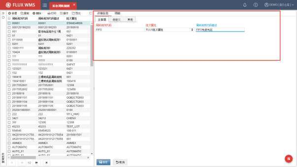

周转规则代码－规则代码 ID。

批次属性－选择预先设置的批次属性。系统进行后续库存属性信息排序时，根据所选择的批次属性内容提供批次属性信息下拉框供选择。

周转规则代码描述－周转规则描述。

- **明细**

在明细页签，配置规则的具体内容细节：

<!-- 原 PDF 第 381 页 -->

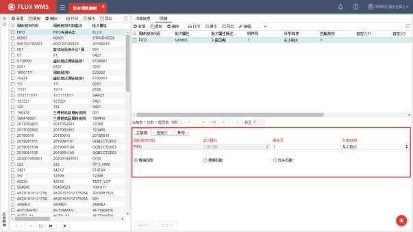

周转规则代码－明细所属的库存周转规则代码，从详细信息页签带入。

批次属性－用来排序的批次属性项。下拉列表显示规则详细信息中所选的批次属性对应的全部批次属性项，保存后不可修改。

顺序号－执行排序的优先次序。

升序/降序－排序方式选择，下拉列表提供从小到大、从大到小的选择项。

精确匹配－是否批次属性项精确匹配。

是否精确匹配，意味着当订单中指定的批次属性对应库存不足时，是否可以分配到后续类似的库存。例如指定分配入库日期为 2017-01-01的库存，如果该日期库存不足，精确匹配情况下，只能有多少库存分配多少，订单部分分配；非精确匹配情况下（例如模糊匹配），可以分配入库日期为 2017-01-02的库存。具体匹配日期视库存情况和升降序选择配置而执行。

模糊匹配－对于指定的批次属性内容，只能选择在其排序之后的库存批次。例如发运订单中指定发运批次属性 3 入库日期为 2017-01-01的货物，但库存不足；同时库存周转规则设置为模糊匹配，从小到大排序。此时系统可选择大于此日期的库存，如 2017-01-02、2017-01-03……入库的批次库存，但不能选择小于指定值的批次，如 2016-12-31入库的库存。如果是从大到小匹配则可以选择 2016-12-31的库存。

优先匹配－优先按指定批次属性值匹配库存，如不足则按库存周转规则排序查找库存。

<!-- 原 PDF 第 382 页 -->

例如发运订单中指定发运批次属性 3入库日期为 2017-01-01的库存，有库存但不足订单数量，同时库存周转规则设置为优先匹配。系统将分配入库日期为 2017-01-01的库存，剩余缺额，按库存周转规则，入库日期由小到大，分配当前在库的入库日期为 2016-02-11的库存。

在指定批次库存足够的情况下， 3种匹配模式都会足额分配指定批次库存。

- **库存周转规则执行**

每一种产品设置一个对应的库存周转规则，系统按一定的步骤来评估每一产品。

发运订单中会根据产品设置的规则，或者产品设置的订单类型规则获取默认的库存周转规则，但允许人工在发运订单中修改。

FLUX WMS 在依据库存周转规则评估候选库存时，考虑的先后次序是：

- 按顺序号的次序依次选择。

- 批次属性的次序和排序方式。

- 为候选名单中的每个产品检查限制条件。

- 分配产品。如果某一个产品通过了以上所有的限制条件，就完成了产品的选择。

- 如果找不到一个合适的产品，选择下一行，并且重复以上步骤。

- 如果全部规则运算后，没有找到合适的产品，系统将按照批号的先后次序进行。批号的先后次序请参考库存管理。

## 8.3. 预配规则

- **预配规则说明**

发运订单创建后，仓库就得为订单寻找到合适的产品。找到时，这些产品就预留给对应订单，这个过程就叫配货。配货包括两个组成部分，配货准备（预分配）和配货（分配）。

配货准备，主要目的是检查库存中是否有符合订单要求的货品，如有，则为订单保留产品，避免被其他订单占用。在比较货品的过程中，需要基于计量单位进行库存检查，例如客户要求的是整托货品，还是散箱拼托也可以用于发货。有时客户未明确要求，仓库也可能根据存货情况、设备情况，出于作业效率角度考虑进行匹配。

但配货准备匹配到库存后，可能不会马上进行出库操作，为了避免影响其 他订单的拣货操作，配货准备时不会锁定具体库位上的库存（避免锁定了外侧库位的库存又没有拣货而影响了内侧库位库存的拣取），而是根据批次信息对产品进行“保留”。如果一个订单只完成配货准备，仓库仍然

<!-- 原 PDF 第 383 页 -->

能移动已配货准备好的产品。

而配货，则为订单锁定具体某个（或者某几个）库位上的库存。被锁定的库存不被允许通过库存移动变更库位，以免影响到拣货作业。

FLUX WMS 可以一次对一个订单进行配货，也可以合并多个订单进行配货。

配货准备和配货可以根据一定的业务规则来一起产生候选产品和保留产品，配货准备规则我们称之为预分配规则，需要在系统的业务规则中进行设置。

- **预配规则配置**

- 详细信息

包括预分配规则和描述说明。见下图：

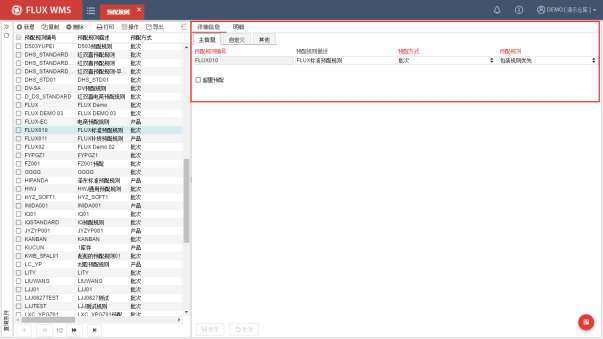

其中预配方式的可选项有“批次”和“产品”。如果选择“批次”则预配时，系统是按照批次号保留商品，即系统保证在某个符合要求的批号下有足够指定订单使用的商品。如果选择的是“产品”，系统是按照产品总数保留商品，即系统保证该产品的库存总量能够满足某一指定订单的出库要求，该选项适用于出库周期很长而产品保质期较短的商品，例如提前一个月下达出库指令、但保质期只有 7天的冷藏巴士杀菌鲜牛奶，如果提前按批次锁定库存，一个月后此批牛奶已过期不可用。

预配规则的选项有“库存周转规则优先”和“包装规则优先”。选择“库存周转规则优先”时，意味着系统会严格按照设定的库存周转规则进行配货，如先进先出。选择“包装规则优先”则意味

<!-- 原 PDF 第 384 页 -->

着系统在考虑库存周转规则的同时还会考虑不同包装在出库操作时的便利性问题。例如库存有批次早的零散库存与批次晚的整托库存，“库存周转规则优先”情况下，订单一整托，系统会将批次早的零散库存用光后，再分配批次晚的整托库存，严格执行先进先出，但会有拆整包装、拣货次数多的情况发生。适用于有严格批次管理要求的场景，如药品、食品等。而同样库存情况下，“包装规则优先”，订单一整托则会到整托盘库存中找批次最早的库存，作业更加便捷，但会跳过批次早的零散库存。因此不同规则的使用，具有一定适用性，现场通常根据产品作业要求进行选择。

超量预配选项，适用于整包装出库情况。如果操作要求箱、托盘等不拆包装出库，而订单数量不是包装的整数倍情况下，不勾选“超量预配”，系统将预配/分配低于订货数量的整包装数量产品，现场作业会需要拆包装拣货；如果勾选“超量预配”，系统将按整包装超额配货，保证订单出库数量。

例如订货铜带 100米，库存有 2卷分别为 55米、60 米。选择超量预配，系统会配货 55+60=115米，而不超量预配，只能配到 55米或 60米，不允许超过 100米。

- 明细

预配规则明细部分，设置了系统预配库存时参照的产品包装级别。

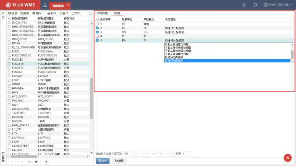

勾选预配时需要考虑的包装级别（例如考虑整托盘、整箱，但忽略内包装级别）。

在“类型描述”字段列，可以通过下拉列表，进一步指定所要配货的范围。例如在启用“包装规则优先”的情况下，可以指定件包装级别的货物，只从拣货位预配；箱包装级别的货物只从存储

<!-- 原 PDF 第 385 页 -->

位预配，达到分区拣选的目的。

预配规则，说明了 FLUX WMS系统如何评估这一产品和一系列用来挑选合适的产品时的约束条件。系统按一定的步骤来评估每一产品。

- **预配规则效果**

FLUX WMS 在依据预配规则评估候选库存时，考虑的先后次序是：

- 按订单指定条件限定限定候选产品范围（例如指定发不良品库存）。

- 按库存周转规则对候选产品库存批次进行排序。

- 根据单位的次序和对应规则限制，为候选名单中的每个产品检查限制条件。

- 预分配产品。如果某一个产品通过了以上所有的限制条件，就完成了产品的选择。

- 如果找不到一个合适的产品，选择下一行，并且重复以上步骤。

- 如果全部规则运算后，没有找到合适的产品，系统保留未完成预分配的产品清单。

注意：有可能出现库存中有产品，但预分配没有找到，其中的原因可能是多方面的，如订单指定的批次属性条件库存数量不足，库存被冻结、预分配规则设置不合理等。

此外，由于开启一步分配模式下，将跳过预配规则，因此在一步分配 ONE_STP_ALC参数为 Y的情况下，预配规则界面的上面的预配方式、预配规则、超量预配字段从列表和表单中隐藏，以免用户误解配置未生效。

## 8.4. 分配规则

产品被预分配时，按订单拣选要求来锁定候选产品的库存批次，然后再按库位、批次和跟踪号来锁定具体库存。在这个过程中同样有着不同的业务规则，我们称之为分配规则。

已分配库存，即已被订单锁定的库存，不能再被移动。

- **分配规则**

分配规则设置见下图：

<!-- 原 PDF 第 386 页 -->

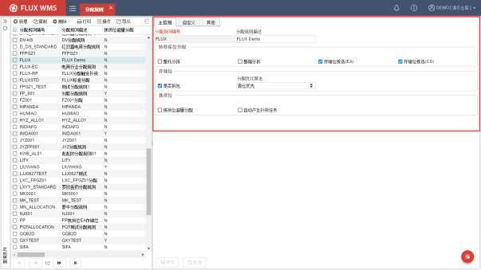

- 分配规则编号、描述

规则的命名信息。

每一种产品可以配置对应的分配规则，也可以多个产品共用同一个分配规则。它说明了 FLUX WMS 系统如何评估这一产品和一系列用来挑选合适的产品、库位时的约束条件。

- 转移库位分配选项：

用于配置库存分配时，是否可以灵活变通分配的管理要求。

一般情况下，预配规则中可以指定托盘、箱、件不同的包装级别的库存找寻对象，例如托盘库存从存储库位分配，箱库存从箱拣货位分配。但仓库中业务情况复杂，又会以满足订单出库要求优先，因此存在一些包装级别变更，库存使用变更的灵活变通的管理要求，需要对应进行配置。

- 整托分拆/整箱分拆

用于按不同包装（如箱、托盘，需要与预配规则配合使用）分配的情况，当指定的包装级别库存不足时，例如按箱分配但箱拣货位库存不足，是否能够使用其它级别如托盘、件包装级别的库存。是否可以把上一级包装按比例拆分为下级包装使用，如把整托库存系统中分拆为多箱库存，用于箱级别数量的分配；或者整箱库存，分拆用于件级别的分配。

不同业务场景要求不同，有的可以分拆，用于小包装级别的分配；有的不允许分拆，指定级别库存不足即停止分配；有的场景整托可以分拆，但整箱不允许分拆。因此系统提供 2个字段支持分

<!-- 原 PDF 第 387 页 -->

别配置。

- 存储位拣选（CS）/存储位拣选（EA）

通常产品配置拣货位后，箱、件层级的拣货，会根据产品拣货位配置，从对应拣货位分配。如果拣货位库存不足，相应启动补货，将库存从存储位补货到拣货位，再从拣货位拣货。

然而对于部分仓库的作业场景中，时效要求很高，一旦拣货位库存不足，无法等待补货完成再进行拣货，而是要求直接从存储位分配零散库存。后续再做库存整理。

因此系统提供了“存储位拣选”的选择项，针对箱、件拣货，对应拣货位库存不足的情况，能否从存储位分配库存。

- 存储位选项：

存储位选项部分，用于从存储库位分配库存的情况下，相关控制逻辑的配置。

- 是否拆包

针对非整包装、不可拆分的货物，例如铜带（卷）、线缆等货物，无法设置件/箱/托盘的标准包装换算等级，但实物是个整体，一托盘货物出库时不能剪切、分隔的情况。如选择不可拆包（不勾选），系统将把一个跟踪号（即一个托盘号）下的货物视为整体分配，根据预分配规则中是否超量预配的选择确定超额分配还是低于订单数量分配。

- 分配优化算法

分配时，不同的管理目标或者不同的管理优先级，可能会有不同的分配细节要求。例如同等条件下，提高拣货效率优先，会考虑尽量减少拣货次数，减少拣货路径长度，最好能从与订单数量一致的库位中，一次拣货完毕；但如果提高仓库空间利用率优先，拣货时最好把库存量少的几个半满库位都拣光，即释放了库位空间供后续使用，同时也减少库存整理的工作量。

针对不同的管理重点或者说管理的优先级排序，系统提供了不同的分配优化处理供现场根据需要选择。现场可以在系统代码“分配优化算法”（allcation_optimization_algorithm）中配置下拉列表显示的可选项个数和顺序，未勾选“激活标记”的选择项将隐藏不显示：

✓ 清仓优先

预配后，所定位的库存批次，尽可能从库存最少的库位拣货出库，以达到清仓优先，提高仓库利用率的目的。但相应地，拣货时的工作量/操作路线就有可能加长。

需要注意的是，清仓优先，是在同一库存批次内选择库存少的库位。多个批次仍旧根据库存周转规则、预配规则匹配定位，而不是选择整个仓库内、跨批次比较库存最少的库位进行拣选。

✓ 拣货效率优先

<!-- 原 PDF 第 388 页 -->

优先考虑拣货效率，同一批次的库存，根据与订单数量的匹配情况排序，优先从数量最接近订单要求（正负接近按绝对值比较）的库位进行拣取。如果差异量相同（差异绝对值相同），则取库存数量大的库位进行拣取。即尽量优先从一个库位拣取，不能一个库位拣取的情况下，也尽量减少拣货库位的个数，从而减少拣取次数，提高拣货效率。

✓ 整箱拣选最优解

一步分配情况下，通常用于存储位拣货的优化计算，针对箱级别分配需求，同一批次可拣选库位不多的情况下，系统会选择数量最匹配的库位，或者拣取次数最少的库位组合进行最优拣货。

如果候选库位过多，为提高计算效率，则采用背包算法，寻找能够满足订单要求的、相对最少个数的拣货库位，从而获得拣货效率与清仓效果的平衡，得到相对最优拣货结果。

拣货效率优先模式，追求最少的拣货次数，可能会从大库存库位拣取一部分库存，导致库存拆散，例如从库存为 42箱的库位，拣取 30箱；而最优解模式，是追求最少个数的库位组合，同样拣取30箱货物，比较 12+18 的组合方式，与 5+7+8+10的组合方式。优化的考量角度不同，现场通常根据业务需要选择不同的优化模式。

✓ 拆零拣选最优解

针对一步分配时，存储库位拆零拣货（不满整托盘、整箱的件拣货情况），进行最优解计算，选择最少拣货次数的拣货库位或者最合适的库位组合，来满足订单需要。

✓ 整箱/拆零拣选最优解

一步分配时，整箱拣货，拆零拣货，同时进行拣货最优解计算，选择最匹配、最少拣货次数的拣货库位或库位组合，来满足订单需要。

✓ 不做优化

无需特殊的分配优化处理，同一库存批次，按库位的拣货逻辑顺序依次选择库存记录。

- 拣货位配置：

- 拣货位超量分配

用于拣货位库存不足，但已经生成该拣货位对应的补货任务情况下，是否可以分配待补货上架库存。如果可以超量分配，拣货位中可以用来分配的库存上限为库存总数-冻结数量+待补货上架库存。全部分配后，可用库存余量会是负数，补货确认后正常。

- 自动产生补货任务

即分配时拣货位库存不足，是否根据订单信息，生成订单触发的补货任务。

<!-- 原 PDF 第 389 页 -->

注意：有可能出现库存查询能查到此产品库存，但分配没有找到匹配的库存，其中的原因可能是多方面的，如订单指定批次，库存被锁定、分配规则设置不合理等。有时预分配顺利完成，但分配没有找到，除了分配规则设置的原因外，主要是由于该批货物处于非可拣货库位（如过渡库位或已被冻结的库位）。

## 8.5. 波次计划规则

系统定时自动生成波次计划时，将遵循波次计划规则，按要求筛选合适的订单来组合为波次。

由于系统支持多仓、多客户管理，不同仓库、不同客户的拣货归集要求不同，运输安排不同，可针对仓库、客户分别设置波次计划生成规则。

- **波次计划规则**

波次计划规则配置，分为几部分内容：

- 主信息

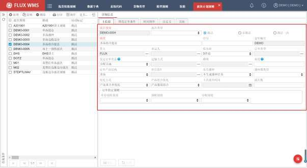

波次规则－规则代码 ID。

波次类型－波次分类信息。根据当前波次计划规则生成波次时，将维护的“波次类型”信息写入到波次计划表头的“波次类型”字段，作为后续波次分配环节，组箱计算时的筛选

<!-- 原 PDF 第 390 页 -->

条件使用。

激活/非激活/激活一次－单选，代表此波次计划规则是否生效。如果只需要特定时间执行一次，则选择“激活一次”，执行后系统会将此规则更新为“非激活”。

描述－规则描述信息。

序号－多个波次计划，相同时间启动时的排序字段。

仓库编号－此波次规则针对生效的仓库 ID。如果仓库为*，则针对全部仓库生效。仓库信息不可为空，新增波次计划时，默认为当前登录仓库。

货主－此波次规则针对的货主 ID。如果值为*，意味着对全部货主生效。新增波次计划时，如果未指定货主 ID，则系统默认为*。

承运人－订单指定的承运人 ID，无需承运人条件则配置为*。可通过浏览按钮，在二级窗口选择承运人。一次可选择多个承运人记录，并根据生成【独立波次】，还是【合并波次】的按钮，返回不同的分隔符。系统生成波次时，根据对应配置，将按承运人条件，拆分不同波次，或者多个指定承运人合并在一个波次中。

优先级－订单优先级条件，常用于筛选优先订单，生成优先作业波次的业务场景。

订单类型－指定类型的发运订单才参与波次组合。浏览按钮二级窗口支持类似承运人的多条件选择。

发运订单状态－指定状态的发运订单才参与波次组合。下拉列表可选择“创建订单”、“预配完成”、“分配完成”状态。其中“分配完成”，包括订货数量全部分配的“40 分配完成”状态订单，还包括通过 SO/WAVE鼠标右键菜单功能“终止分配”操作后，视同分配完成的订单。仍旧在分配作业中的订单，通常不会生成波次。

运输方式－发运订单运输方式。同样支持浏览按钮二级窗口多条件选择。

路线－根据订单路线创建波次计划。同样支持浏览按钮二级窗口多条件选择。

渠道－用于筛选不同来源平台的订单进行波次组合。

订单产品结构－系统提供单品、多品、N+X 组合单品的选项，方便按订单的产品组合情况，筛选单品订单、多品订单，分别组合不同的波次，以便对应单品复核、出库复核等不同的操作流程。N+X 组合单品，指的是特殊订单组合，主品 N为具有高重合度的库存产品，副品 X是少量无重合度的产品。

库位组 1－针对已分配的订单，符合指定库位组条件的订单，筛选出来生成波次。支持多库位组条件配置，并且支持合并波次、独立波次配置。

<!-- 原 PDF 第 391 页 -->

是否播种－波次生成时，播种任务的处理模式。系统提供 3 种选择项，产生波次时生成播种任务，不生成播种任务，或者波次拣货确认时按箱生成播种任务（先合拣再播种分货的作业模式）。

播种墙类型－使用播种操作模式情况下，波次对应的播种墙类型选择。下拉列表内容在【仓库设置】-【播种墙类型】功能中维护。如果“是否播种”或者“是否开启分拣任务”开关开启，则必须维护播种墙类型。

优化方法－系统支持区域优化、SKU 重合率优化、产品供应商优化，也可选择不优化。

产品组合优化－根据产品组合（多见与非单品订单，赠品组合，将完全相同商品的订单按照 sku拼接排序）、产品数量组合（同一个 SKU，相同件数的订单）进行波次计算。同样提供不组合的选项。

上次波次时间－系统自动记录的、上一次执行波次计划的时间。

波次数－执行此波次规则，一次最多生成多少个波次。避免一次生成波次过多，影响现场作业。过多的波次超过现场实际拣货能力，无法及时操作完成；同时提前生成、等待太久的波次，从作业优化角度，没有更多候选订单的计算优化效果好。

订单指定规则－针对该波次下的订单，生成波次后，更新订单的库存周转规则、预配规则、分配规则为指定的规则。例如接口下达订单时，默认先进先出的周转规则。但根据波次规则，筛选到指定收货人的高优先级订单后，这个波次中订单规则自动更新为后进先出，快速拣选出库。或者单个订单采用整箱从存储位拣选、散件从拣货位拣选的普通分配规则，但通过波次规则将散件单整合为整箱数量的波次后，自动更新为凑整从存储位拣选，后续再衔接分货操作。

- 筛选订单条件

<!-- 原 PDF 第 392 页 -->

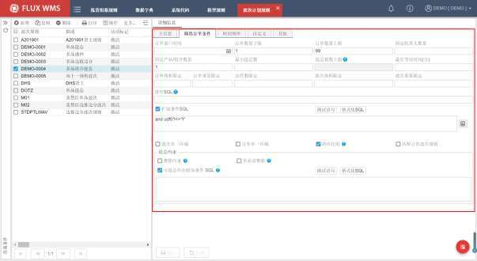

订单窗口时间－订单时间的限制，即波次挑选的订单池的范围，订单的波次截止时间。比如设置 03：00，那么订单的考虑范围就是在当天 3点以前的订单。

订单数量下限/上限－波次中包含的 SO个数上下限。高于上限数量的符合条件订单，作为下一个波次的组合元素，可以一次性创建多个波次。不到下限数量的订单，等待下一个波次创建时间再判断是否可以组建波次。

固定收货人数量－波次中包含的收货人个数。常用在电子标签分货模式中，一个收货人对应一个电子标签位，因此波次中设置收货人个数。

固定产品/组合数量－波次中包含的产品或者产品组合的个数。常用在周转箱拣货模式中，一个产品对应一个周转箱。

最小提总数－为避免获取到订单数量中某 SKU数量过少，使得作业细碎效率不高，在按SKU 重合度优化时，单个 SKU（或者组合 SKU)的需求总数必须大于等于最小提总数。

提总箱数上限－勾选“整箱约束”情况下可编辑，按提总箱数限制波次大小，避免波次过大、所需操作箱数超过设备处理能力的情况。

最长等待时间（分）－单位为分钟。订单设置上下限时，如果数量超过上限，但不满足下限，多余数量的订单会等待到下一波次生成时点，与其他订单组合波次。例如每小时计算一次波次，下限 10，上限 50，当前符合条件的订单有 107张，会生成 2 个波次，多余的 7张订单会到下一个时点，与后续下达的新订单一起组合波次。但如果到下一时点，没有符合条件的新订单下达，原有订单会再次等待。等待时间过长将影响出库效率。因此系统设置最

<!-- 原 PDF 第 393 页 -->

长等待时间，超过此时间的订单，不再等待，即使不符合上下限要求，也组合到波次中。

订单体积限定－候选订单的体积上限。

订单重量限定－候选订单的重量上限。

总件数限定－波次中包含的产品件数上限，避免波次过大，作业设备无法承载（例如产品量超过拣货小车装载量）。设置后，系统先按其他字段条件生成波次，然后统计总件数做比较，如果件数超标，则按照数量从小到大的方式删除订单，直到不超标。

波次体积限定－对波次中产品总体积进行限定。避免加入波次的产品总体积过大，操作不方便。

波次重量限定－对波次中产品总重量进行限定。避免加入波次的产品总重量过大，超过操作设备的可承受程度。例如使用小车边拣边分操作时，如果波次总重量过大，拣货小车容易推不动。

排序 SQL－自定义订单排序要求维护字段。内容为 Order By a,b,c。

扩展条件 SQL－支持自定义的扩展波次组合条件。

波次单一区域－即不跨区域组合波次，仅将同区域内完全分配的订单组合在一个波次内。但同区域内的多个库区可以跨库区组合。常用于楼层仓库，避免波次跨楼层操作。

订单单一区域－候选订单本身，不能涉及多个区域拣货。由于要判断订单的拣货区域，通常是先分配，再对完全分配的订单进行波次组合。

跨库位组－是否允许创建跨库位组拣货的波次。

匹配订单波次规则－如勾选，只有指定使用此波次规则的发运订单，才会遵循此规则组合波次。通常是接口下达发运指令时即已指定对应的波次规则。

- 提总约束

进行波次生成计算时，有时为了拣货方便，会希望将零散拣货的订单汇总拼成正好整箱的数量，这样拣货时可以进行整箱拣货，后续再操作波次分货。因此波次规则中，提供了拼合为整箱数量的提总操作相关配置（为了业务操作方便，通常不考虑拼合为多个整箱的情况）：

整箱约束－针对单品订单波次，只归集整箱倍数的数量，方便批量整箱拣货操作。

单品凑箱－为提高拣货效率，勾选此选项后，针对已生成的、创建状态的波次，获取 SKU的非整箱数量（波次内每个 SKU的数量减去整箱数量得到的不满整箱的零散数量），然后查找此 SKU的单品订单，凑足整箱数量加入到波次内，使得波次拣货都能够满足整箱拣货。最后再对合成波次进行分配，得到整箱拣货任务。

<!-- 原 PDF 第 394 页 -->

可提总库存校验附加条件 SQL－筛选合适的订单生成用于提总拣货的波次时，有的现场会希望尽量满足订单，如果存储位没有整箱库存，拣货位有库存，从拣货位拣选也可以接受；但有的现场订单很多，期望波次内效率优先，拣货位拣选拼箱，会降低操作效率（拣货效率不如整箱，拣货位拣空又导致后续需要补货），希望只从存储位拣选整箱。此时可以通过启用“可提总库存校验”，组合波次时，系统会比对存储区库存是否满足订单合计的拣货数量需要，如果存储位库存不满足，则不再生成波次。支持个性化添加的、提总库存校验条件。例如希望仅从 A 区提总，则可启用附加条件SQL，并录入语句内容（例如“AND BAS_SKU.skugroup1=’ABC’”），系统会与标准语句拼接生效。

- 时间频率

由于不同波次规则进行订单筛选、创建订单的时间要求不同，例如上午 9 点创建 EMS 承运的波次，以便12 点钟进行运输交接。而圆通的订单下午 4点才交接，因此波次在下午 1点创建。

系统支持为每个波次规则，单独指定运行时间，频率均为每天模式：

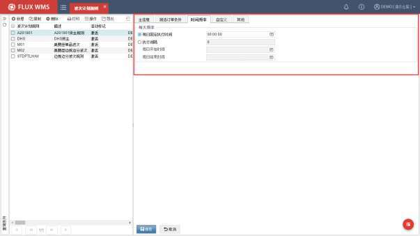

- **鼠标右键功能**

除通用右键功能之外，波次计划规则功能，所具有的右键菜单功能为：

<!-- 原 PDF 第 395 页 -->

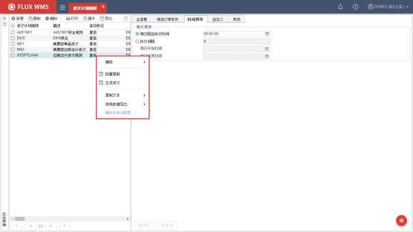

- 批量复制：

选择样本记录后，通过“批量复制”功能，系统显示如下字段选择框，勾选字段，确认后，系统将样本记录中的对应字段内容，复制到符合当前查询条件的全部记录中。

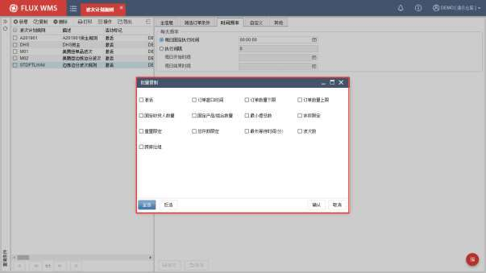

<!-- 原 PDF 第 396 页 -->

- 生成波次：

选择规则后，通过“生成波次”功能，立即根据波次规则要求筛选订单、创建符合规则的波次计划，无需等待定时驱动执行。方便规则调试以及人工临时创建波次。

执行成功，系统将提示本次创建的波次个数。

## 8.6. 质检规则

质检指的是货物入库前或者在仓库中，按照货主要求、对货物进行质量检验的操作。FLUX WMS提供的质检功能，可以用来对质检操作进行管理和记录。

系统根据质检操作的要求，依据入库单据生成质检单据，即根据预期到货的产品数量，计算应质检的数量。

由于不同产品检验要求不同，有的是全检，有的是抽检，不同类型的产品，抽检比率或数量也不同，因此 FLUX WMS系统提供质检规则功能，用来维护不同产品的检验数量比率要求。

产品档案中，根据产品情况，选择对应的质检规则，在生成质检单时将根据质检规则计算应质检数量（质检操作请参考入库操作的《9.6 质量检验》章节的介绍）。

- **质检规则**

- 详细信息

质检规则，详细信息部分的“主信息”页签，包含了规则代码和描述信息，显示如下图：

<!-- 原 PDF 第 397 页 -->

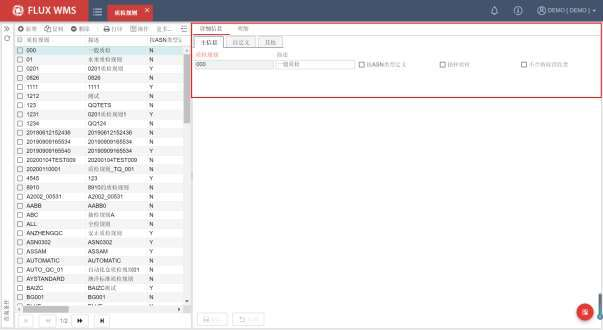

按 ASN 类型定义，如果勾选，明细部分会显示订单类型选择，可以对不同订单类型设置不同的检验比例，例如同一产品，采购收货入库按 10%抽检，但退货入库需要 100%全检。

抽样检验，用于区分全检规则和抽检规则，会影响到收货数量上限控制：

- 未勾选为全检模式，【质量检验】功能中选择的“质检结果”所属分类是“ CONTROL管控收货”下，收货数量不能大于合格数量。

- 勾选为抽检模式，收货时不限制收货数量。

不合格取消收货，在 QC_FRM_TRN 参数开启情况下可见。即按照收货交易产生质检单参数值选择为“MANU-人工通过选择 ASN 生成”或者“AUTO-每次收货确认后自动产生”情况下，如果勾选此选项，【质量检验】功能中进行质检确认时，系统根据不合格数量，自动拆分收货交易、上架任务，然后将不合格数量自动取消收货。

- 明细

质检规则明细部分，用于设置期望数区段与应检数量的对应逻辑：

<!-- 原 PDF 第 398 页 -->

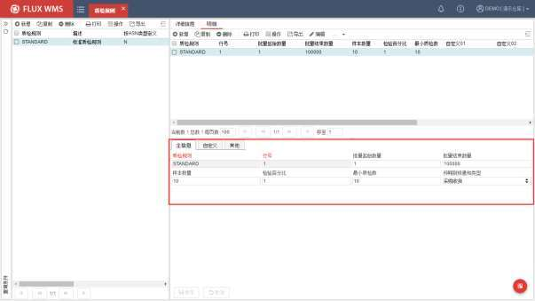

质检规则－质检规则代码，根据主信息自动获取。

行号－质检规则明细行号，也是规则生效的次序。人工录入，保存后不可修改。

批量起始数量、批量结束数量－如果 ASN中产品的期望数量在此区间内，将执行此行规则明细，否则按下一行的数量要求进行检查。

抽样数－阶梯化固定样本数量情况下使用。例如期望数 0-99，固定抽检 10件；期望数100-999，固定抽检 20件。每个数据段抽检数量不同，相互没有比例关系。当“ 抽样数”与“抽样百分比”同时配置时，优先取抽样数配置值。

抽样百分比－按比例抽检（仅在未配置抽样数情况下生效）。例如期望数 0-100，按数量的 5%抽检；期望数 101-1000，按数量的 3%抽检。不同数量区间，抽检比例不同。当主信息页签未勾选“抽样质检”情况下，也即全检时，此字段默认为 1，不可编辑；勾选“抽样质检”情况下，无默认值，人工录入“抽样百分比”。

最小质检数－按百分比检验的情况下，为防止期望数少导致的百分比计算所得的抽检数量过少（例如到货 10件，抽检 1%），设置最低检验数量，如 5，则计算所得的检验数量不足 5则默认为 5件。当然，如果订单数量不足最小检验数，以订单数量为准，例如最小检验数量为 5，但订单数量只有 3，则生成的质检数量只能是 3。

ASN 类型－主信息勾选“按 ASN 类型定义”情况下生效，指定质检规则行适用的 ASN类型。

<!-- 原 PDF 第 399 页 -->

## 8.7. 补货规则

部分情况下，由于产品的季节性较强等原因，在仓库中的拣货作业并不是持续的（例如夏季服装），并且此类产品的种类大于拣货位的设置个数。此时，不需要为每个产品固定拣货位，而是采用动态补货方式，当产品进入操作周期时，为其寻找一个库位作为拣货位，而当产品操作周期结束，此拣货位将让给其他当季产品使用。

在拣货位有库存的情况下，再次入库或补货相同产品，系统会自动寻找产品当前使用的拣货库位。但在拣货区没有库存的情况下，系统要为产品寻找到一个新的动态拣货位时，就需要遵循补货规则。因此，补货规则也只针对找新的空拣货位的情况，相当于特殊场景下的上架规则。

- **补货规则**

补货规则设置见下图：

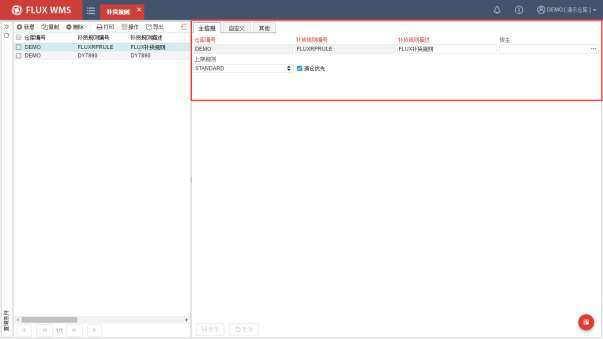

动态补货规则的实际计算逻辑同上架规则，因此设置时需要先设置上架规则，然后在补货规则中选用。

补货用的上架规则，通常是在指定库区寻找一个空库位用来做产品的拣货位。

补货计算时的候选库存批次，通常按照库存周转规则的设置来选择用于补货的库存批次。同一

<!-- 原 PDF 第 400 页 -->

批次情况下，不同存储库位库存不等的情况下，可以通过配置“清仓优先”选项，让系统优先选择库存最低的存储库位的库存用于补货，从而达到补货同时优化库存布局的目的。如果不选择“清仓优先”，补货时，同一批次下，系统会按存储库位的对应库位拣货顺序字段内容进行排序并选择库存用于补货。

## 8.8. 自动发运规则

同一货主，在不同仓库中均有存货，由于各地快递公司管理要求不同，可能导致作业流程有所不同，发运节点、方式有差异，例如有的仓库称重后进行发运确认，有的仓库要求出库复核后进行发运确认。同时，有些订单操作流程可能会要求需要完成多项作业节点的订单才能发运，例如拣货、装箱完成后的订单才能发运。

系统通过自动发运规则，维护完成哪些出库节点后，订单可以被自动发运。系统通过定时任务，对订单进行检查，符合条件的订单，将更新自动发运标记，等待自动发运定时任务执行发运。

即使用此管理模式，会配置 2个定时器，一个基于自动发运规则，检查订单是否具备自动发运的资格；一个用于将资格符合的订单执行发运。

对于手动执行订单发运的情况，系统也会根据自动发运规则进行检查，订单必须操作的环节，是否都已经操作完成，以便统一进行控制管理。

- **自动发运规则设置**

- 自动发运规则，规则信息设置见下图：

<!-- 原 PDF 第 401 页 -->

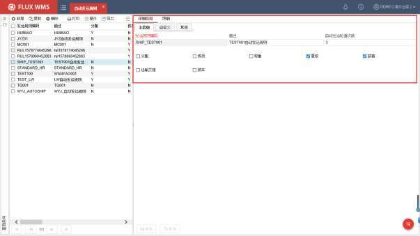

发运规则编码－规则 ID。

描述－规则说明。

自动发运轮循次数－自动发运循环执行次数。如果订单异常、发运失败，系统自动发运后会将异常订单标记，超过尝试次数后，将跳过异常单据执行其他订单的发运（异常单据另行人工处理），以免异常订单反复执行发运，耗费系统资源。

分配/拣货/称重/复核/装箱/运输交接/装车－自动发运节点选择。所勾选的节点操作全部完成，订单具有发运资格，可通过定时器自动发运。

- 点击【保存】按钮，完成规则主信息设置。

- 明细页签部分，用于不同仓库、客户、承运人的私有规则配置：

<!-- 原 PDF 第 402 页 -->

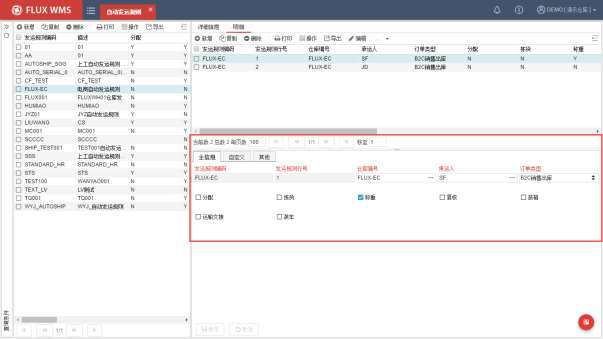

发运规则编码－根据所属的“主信息”记录继承，不可修改。

发运规则行号－规则明细的行号。可以根据需要维护，用作匹配时的排序。

仓库编号－规则生效的仓库。

承运人－规则对应承运人。

订单类型－规则对应订单类型。下拉框选择系统代码中维护发运订单类型。

分配/拣货/称重/复核/装箱/运输交接/装车－自动发运节点选择。所勾选的节点操作全部完成，订单具有发运资格，可通过定时器自动发运。

- 点击【保存】按钮，完成规则明细设置。

作业时系统读取订单所属货主，在客户档案中配置的自动发运规则代码。优先根据仓库、承运人、订单类型匹配对应明细规则。如果匹配到私有明细规则，系统执行明细规则的设置；如果匹配不到私有明细规则，则执行主信息的公共规则设置。

## 8.9. 定时器

定时器功能主要用于为系统配置定时自动执行的任务，如定时生成补货任务，定时生成波次计划等。

<!-- 原 PDF 第 403 页 -->

系统提供标准定时器，用户根据作业需要，开启对应定时器，并配置定时器执行频率即可使用。

同时，为了支持个性化的定时作业需求，系统也支持个性化定时器配置。

### 8.9.1. 标准定时器配置

- **定时器配置**

- 选择主菜单“业务规则”下的“定时器”功能。

- 输入查询条件，查询设置的标准定时器记录。

- “详细信息”页签，可以见如下信息：

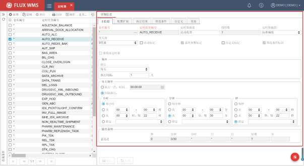

仓库编号－定时器生效的仓库。如果仓库为*，代表多仓公共定时器。如果仓库没有设置对应的专用定时器，则执行仓库为*的公共定时器。

例如补货定时器，配置了 2条记录，定时器 ID相同，一条仓库为*，一条仓库为“北京仓”。那么北京仓执行其专用补货定时器设置频率、时间。而其他仓库全部按仓库为*的记录执行补货计算。

定时任务编号－定时器代码。系统提供了预设的多个标准定时器。

定时器描述－定时器名称、说明。

线程数－应用于特殊场景的多线程定时器运行场景，例如发运定时器的多线程发运。通

<!-- 原 PDF 第 404 页 -->

常情况下，线程数默认为 1，特殊场景中由系统管理员或者 FLUX 顾问，根据业务场景、服务器情况综合考量后优化设置。

定时器编组－多个定时器需要运行的情况下，通过“定时器编组”来对定时器作业分组，系统分别使用不同的调度队列来处理，可以避免某个定时器执行时间过长，影响到其他定时器的执行。下拉列表内容在【系统代码】功能，timerGroup 定时器编组中配置，标准定时器默认为“标准编组”，通常由系统管理员或者 FLUX顾问根据现场执行要求配置更多编组。

优先级－同一个定时器编组中，如果 2个定时器设置为同一时间运行（例如间隔时间不同但同时点需要运行），则根据优先级排序依次调用。新增定时器默认优先级为 3普通。

活动标记－是否运行中的定时器记录。

系统预置标记－是否系统初始化的标准定时器记录。通常系统部署时，会预设仓库为 *的公共、标准定时器记录，标记字段勾选。对于预置记录，可以不使用，但不允许删除。复制为分仓专用定时器的标准定时器记录，非预置，可以根据需要删除。

自定义标记－自定义定时器标记。当记录为自定义定时器情况下，能够在“配置扩展”页签进行相应自定义调用配置。

筛选条件标识－部分定时器支持另外指定筛选条件，对于此类定时器，标识为 Y（勾选），相应显示“筛选条件”页签。而对于不支持指定筛选的定时器，则隐藏“筛选条件”页签。

系统级定时器－部分定时器逻辑不按仓库循环执行，触发后只执行一次，不支持分仓设置，例如 Redis定时备份定时器。此类定时器即为系统级定时器，不支持分仓库设置。也即当“系统级定时器”勾选时，鼠标右键“分仓设置”功能不可用。

- 定时器执行频率

<!-- 原 PDF 第 405 页 -->

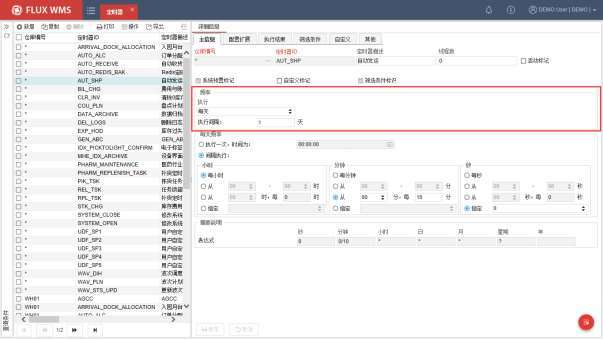

频率，即定时器执行的时间安排。配置时，先在如上

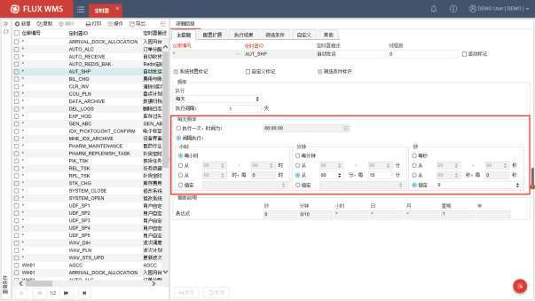

界面，选择定时器的执行频率，

如每天、每周、还是每月、每季度等。随着执行频率选择不同，界面显示的对应配置也有所不同。

- 每天执行

*图 8-9-3（图像未能从 PDF 对象中直接提取）*

<!-- 原 PDF 第 406 页 -->

【每天】执行模式下，可以选择执行间隔，例如每隔 2天执行一次。默认为 1 天，即每日执行。

【每天频率】，即执行日的定时器运行设置。可以配置为一次执行模式，指定执行时间；或者是间隔执行模式，间隔一定时间循环执行。

间隔时间配置，可以指定循环执行的起止时间，以及间隔时间。

例如下图配置，意味着，从早上 8点到下午 5 点，每 30 分钟执行一次。

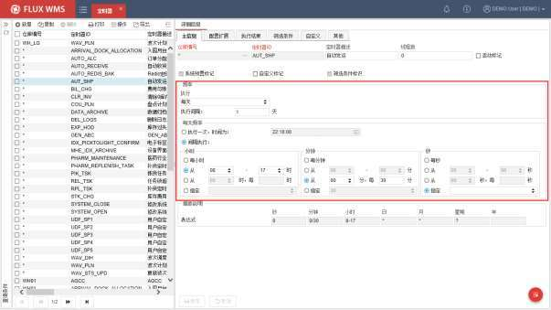

如果小时、分钟同时指定具体值，实际效果就是执行一次、指定时间的效果。

- 每周执行

每周执行模式下，需要选择执行日，默认为全周，根据业务需求具体选择执行时间。如下图配置，意味着每周的周一、周三的 8:30执行定时器运行。

<!-- 原 PDF 第 407 页 -->

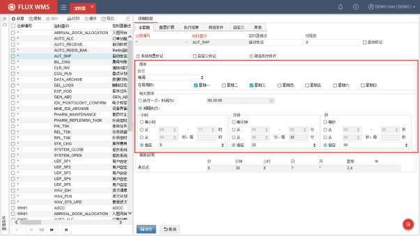

- 每月执行

每月执行模式下，执行日的选择，可以是每个月的第几天（或者每 X 个月的第 Y 天），或者每个月第几周的某一天。

在指定的执行日，根据每天频率部分的设置启动执行。

例如下图意味着每个月的 1 号，8:10 执行定时处理。

<!-- 原 PDF 第 408 页 -->

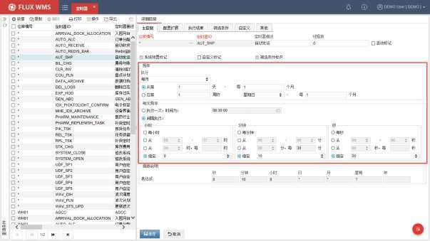

- 每季度执行

每季度执行，即每 3 个月执行一次，执行日、时间选择，与每月执行配置类似。

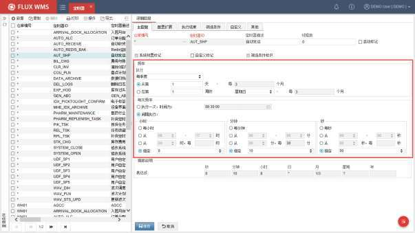

- 高级配置

<!-- 原 PDF 第 409 页 -->

如果是规律的每日、周、月、季度模式不足以支持的、较为复杂的执行要求，可以通过高级配置实现。

如下图所示，高级配置情况下，年、月、日、星期等均可进行范围（从、到）、起始、间隔（每X年/月/日）、指定时点等配置。

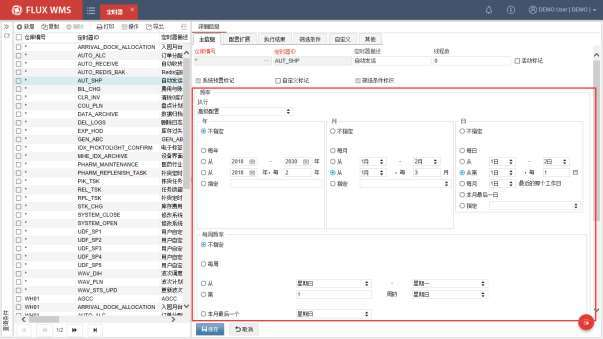

- 摘要说明

执行频率维护后，系统会根据维护内容，自动生成摘要表达式显示在界面下方，如下图所示：

<!-- 原 PDF 第 410 页 -->

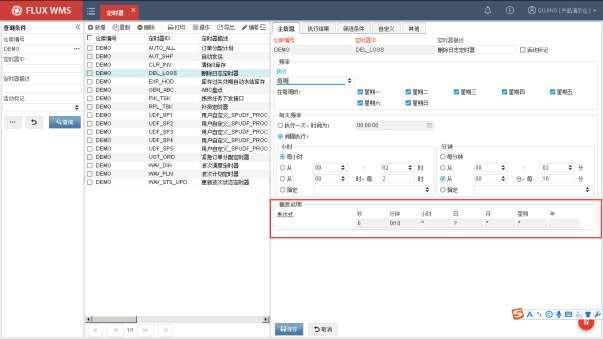

- **执行结果查看**

定时器的执行情况可以在“执行结果”页签中查看到此定时器的最后一次执行情况。

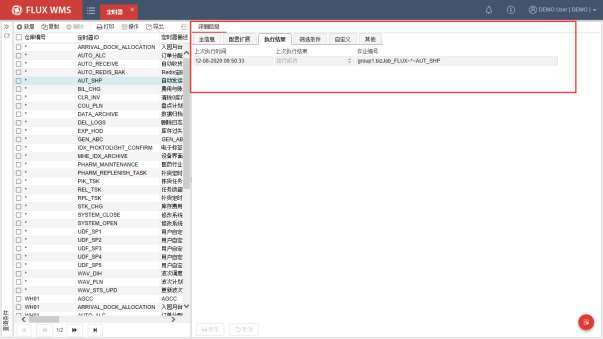

更多执行细节，可以在“业务系统日志”的“定时任务运行日志”功能中查看。

<!-- 原 PDF 第 411 页 -->

- **筛选条件**

不同业务场景，在执行定时器时，会有不同的条件要求，例如只有A 货主的订单才能自动发运。因此系统提供定时器筛选条件配置，符合指定条件的记录，才执行当前定时器处理。

并非全部定时器都支持指定筛选条件，在定时器“主信息”页签，“筛选条件标识”勾选的定时器记录，才能配置对应筛选条件。

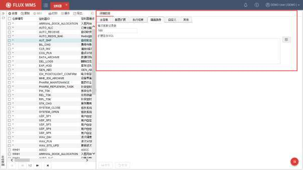

每次抓取记录数－为了避免定时器计算时，一次获取太多数据，导致计算等待时间过长，可以单独为不同定时器配置一次抓取的记录数上限。例如组合波次时，分多次，一次抓取 5000个订单，在这个范围内进行波次计算；订单发运时一次抓取 200张订单发运后再继续抓取下一批订单。未维护情况下，系统默认抓取 5000行记录。

扩展条件 SQL－筛选语句，由现场根据业务需要配置。

在实际配置过程中，为方便条件录入，可通过点击 按钮打开配置界面，选择常用筛选条件。通过点击左下角的【添加】或者【替代】按钮，系统将所选条件，转换为 SQL 语句。

<!-- 原 PDF 第 412 页 -->

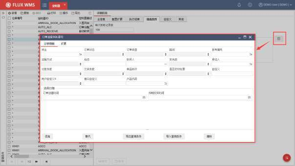

- **配置扩展**

“配置扩展”页签，主要提供给个性化定时器配置使用，当“主信息页签”的“自定义标记”勾选后，能够对“配置扩展”页签内容进行配置。具体说明请参考8.9.3 个性化定时器部分的介绍。

- **列表右键**

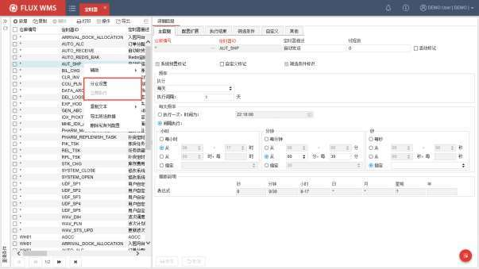

<!-- 原 PDF 第 413 页 -->

*图8-9-13（图像未能从 PDF 对象中直接提取）*

定时器功能的鼠标右键功能主要有：

- 分仓设置－复制当前所选定时器，以便生成新仓库的专用定时器记录。

- 立即执行－立即执行所选定时器处理，无需等待时间到达定时器配置的时间。仅对“活动标记”勾选的有效定时器记录可以执行。

### 8.9.2. 标准定时器介绍

- **标准定时器**

系统初始化部署时提供的标准定时器有：

- 巷道任务均衡数据重置（AISLETASK_BALANCE）

启用立库巷道任务分配作业模式下（通过【区域】功能的“巷道任务均衡”控制开启作业模式），通过定时器刷新 ACT_AISLETASK_BALANCE表中的巷道任务执行统计信息，以便分配时能够根据统计信息快速进行分配计算。

- 入园月台分配（ARRIVAL_DOCK_ALLOCATION）

根据月台分配规则设置，给入园单分配月台，并更新到入园单单头。

- 订单分配计划 （AUTO_ALC）

读取订单分配规则，根据规则对订单自动进行分配。

- 自动收货（AUTO_RECEIVE）

通常用于虚拟单确认操作。定时器要求配置筛选条件，无条件的定时器不会执行。

执行时，对于符合条件的预期到货通知单，自动进行整单收货确认。

- REDIS定时备份（AUTO_REDIS_BAK）

系统级定时器，定期对 Redis缓存进行备份，不支持分仓库分别设置，通常由系统管理员进行维护。

- 自动发运（AUT_SHP）

系统在装箱、配送单作业等操作环节，根据自动发运规则配置，对符合规则要求、可以发运的订单，会更新订单的“允许发运”标记。

自动发运定时器执行时，查询到允许发运，但尚未发运的订单，会将订单逐一进行发运操作。

<!-- 原 PDF 第 414 页 -->

- 行政区域 （BAS_AREA）

系统级定时器，不支持分仓库分别设置，系统安装部署后，初始化数据时用来获取行政区域信息。

- 费用与账单计算定时器（BIL_CHG）。

根据费率设置，对日库存费进行计算。并且针对到达计费周期的货主，进行费用账单计算。

- 关闭长时间未登录用户定时器（CLOSE_OVERLOGIN）

配合密码规则（在【业务系统管理】模块的【密码规则管理】功能中设置）中的“超 X天未登陆系统强制停用”规则使用。

由定时器定期查询超期未登录用户，并将用户的活动标记更新为非活动，不可使用状态。

- 清除 0库存（CLR_INV）

日常作业过程中，可能会存在库存数量为0 的库存记录行。例如收货计算上架的待上架库位会有库存数量为0 但有待上架数量的记录。或者待补货上架的库位对应记录、发运后库存为0的记录。

为了提高大批量数据操作速度，系统不会在取消补货、发运成功等环节，检查库存记录是否已为 0 并删除，而是通过“清除0 库存”定时器，定时作业，将冗余的库存记录清除。

未清除 0 库存记录，对日常作业没有影响，但在补货环节，0 库存记录存在，会使得系统认为此库位仍旧是此产品的拣货位，补货计算默认优先补到对应库位，而不会根据补货规则计算新的拣货位。因此日常作业中，仍旧建议开启“清除0 库存”定时器。

- 盘点计划定时器（COU_PLN）

定时检查【业务规则】-【盘点计划规则】明细行部分，是否有到达预设时间要求的规则明细行需要执行。例如明细行1 需要早上 7点执行，明细3 需要下午6 点执行。

相应触发需要执行的规则明细对应盘点计划规则执行。

具体盘点计划规则内容，可参考【业务规则】-【盘点计划规则】章节的介绍。

- 数据归档定时器（DATA_ARCHIVE）

根据【迁移&归档】-【迁移&归档规则】中的配置要求，执行将已关闭订单从生产库，迁移到历史库，或者归档到归档库的定时作业处理。主要通过存储过程 SP执行归档处理。

- 数据归档（服务类） （DATA_TRANS）

同样根据【迁移&归档】-【迁移&归档规则】中的配置要求，执行将已关闭订单从生产库，迁移

<!-- 原 PDF 第 415 页 -->

到历史库，或者归档到归档库的定时作业处理。与 DATA_ARCHIVE不同的是，调用 JAVA服务类进行归档处理。

- 删除日志定时器（DEL_LOGS）

系统进行每一步操作，会根据【日志配置】中设置的日志详细级别，进行对应的各类日志记录，并且会写入接口监控等监控日志。但随着时间推移，日志量一定会不断增加。

为了给操作系统瘦身，超过一定时间的历史日志，可以通过“删除日志定时器”进行删除。

日志的保留天数，通过系统参数“LOG_RETENTION_DAYS”（系统日志保留天数）进行设置。

- 库存过失效期自动冻结库存定时器（EXP_HOD）

定时器执行时，根据产品档案中有效期管理的相关设置，以及当前库存的生产日期（批次属性 01，LOTATT01）、失效日期（批次属性 02，LOTATT02）、入库日期（批次属性 03，LOTATT03），检查库存批次是否已经过保质期，或者已经到冻结期（例如出库效期控制阶段）。

对于过期、临期的产品，系统自动进行冻结。后续可以在【库存管理】-【库存冻结】功能中查看到冻结记录，或者进行解冻。

已被冻结的库存，不可用于补货、分配等操作。但允许进行移库、转移操作。需要提醒的是，转移变更批次属性信息，会导致批号变更，可能会造成库存解冻。但如果新批次的批次属性信息仍旧是过期、临期情况，到下一次定时器执行时还会被自动冻结。

- ABC盘点（GEN_ABC）

根据产品循环级别设置，定时生成盘点单以及循环盘点任务。

- 电子标签定时器（IDX_PICKTOLIGHT_CONFIRM）

电子标签操作后，会反馈作业成功、失败信息（例如缺货），更新到电子标签接口表中（IDX_PICKTOLIGHT）。然后再通过电子标签定时器读取表中拣货完成、缺货信息，更新对应订单拣货任务执行情况。

- 全量库存镜像定时器（INV_FULL_IMAGE）

在指定的时间点，将库存信息（按批次、库位、跟踪号查询维度）全部复制到库存镜像表（INV_IMAGE）。主要用于支持接口推送库存信息的场景。在全量库存推送的情况下，库存记录较多时，接口通常需要分批传递数据，所需时间也会比较长。此时库存发送变动的情况比较常见，容易影响数据准确性。因此通过定时器将指定时间的库存备份后，接口再从库存镜像表读取信息，分批发送，处理效率、准确性都会比较高。

<!-- 原 PDF 第 416 页 -->

- 设备接口数据归档（MHE_IDX_ARCHIVE）

电子标签播种操作配套定时器，用于清理已完成或已过期的播种任务。定时将播种作业表（IDX_PUTTOLIGHT）中已完成、并且日期是之前一天的任务数据，移动到同一个数据库的归档表中（IDX_PUTTOLIGHT_ARCHIVE），后续有需要再通过归档定时器移动到归档库中。

对于虽然未完成，但任务日期已经超期一周，或者任务对应 ASN、SO 已经取消或关闭，也会将遗漏任务移动到归档表中。

- 异步发运扣减库存（NON_REALTIME_SHIPMENT）

异步发运作业模式下（需要开启参数 NON_REALTIME_SHIPMENT，适用于明细非常多、经常近万行的场景），通过定时器在指定的时间将已经标记发运的订单进行库存扣减。

- 拣货任务下发接口（PIK_TSK）

通过定时器下发摘果任务到 IDX_PICKTOLIGHT任务表中。

- 任务锁超时释放（REL_TSK）

系统作业时，为了避免多个操作员获取到同一个任务导致重复操作，会对已被获取的任务加锁。例如 RF按订单拣货，作业员获取到订单任务后，整个订单锁定，其他人无法再获取。或者 RF 按 ID拣货，则按目标箱号锁定任务。

但如果操作员获取到任务后，因故一直没有进行操作，通过“任务锁超时释放定时器”，可以将任务锁定取消，其他操作员能够继续获得任务进行操作。

现场不同作业模式，对任务锁定的时间要求会有所不同。具体锁定时间长短，通过系统参数“TSK_HLD_TIM”（任务锁定时间(分钟)）进行配置。定时器执行时，对于超过参数设置时间（例如已锁定 10分钟）的任务锁进行释放。

- 补货定时器（RPL_TSK）

全仓补货计算，会对符合条件的、已配置拣货位的产品进行检查，库存低于下限的记录触发补货计算。

由于是全面检查，计算量较大，通常建议定时器执行时间设置在早上或者晚上的非作业高峰时段。

- 库存费用计算定时器（STK_CHG）

进出库操作时，关闭 ASN 或者 SO同时，系统会对进出库相关的费用进行计算。而已经在库内的库存所产生的库存费用，则通过“库存费用计算定时器”根据费率设置进行计算，生成库存费用明细记录，可以在【费收】-【费用清单】功能中查看到。

<!-- 原 PDF 第 417 页 -->

- 系统开放/暂停控制（SYSTEM_OPEN/SYSTEM_CLOSE）

系统参数 SYSTEM_OPEN_CLOSE 配置为“CLOSE”情况下，暂停整个系统应用，非超级用户只允许进行查询和打印操作。通常在需要暂停作业、与上游系统（例如 ERP）进行对账的情况下启用。

对于定期对账的作业场景，例如每天晚上 0点~2 点对账的场景，可以通过“ SYSTEM_CLOSE”定时器，定时将 SYSTEM_OPEN_CLOSE 参数值更新为“CLOSE”，即暂停系统作业；再通过“SYSTEM_OPEN”定时器，将 SYSTEM_OPEN_CLOSE 参数值更新为“OPEN”，开放系统作业。从而达到自动控制系统暂停的管理目标。

- 波次计划定时器（WAV_PLN）

检查【波次计划规则】中配置的规则记录，如果有需要执行的规则，则依据规则执行波次计划生成处理。

- 波次调度定时器（WAV_DIH）

执行【波次调度规则】检查，并按规则设置生成波次计划。

波次调度是基于波次计划规则基础上，进一步配置不同的筛选、控制要求，执行不同的波次计划规则，实现更为复杂的管理效果。具体功能细节可参考【业务规则】 -【波次调度规则】章节的介绍。

- 更新波次状态定时器（WAV_STS_UPD）

波次计划的状态，由于涉及订单较多，每次操作都判断并更新状态，时效较差。因此系统通过定时器，定时对波次计划的状态进行判断、更新。

- **医药行业标准定时器**

医药行业相关标准定时器有：

- 入库药品监管码 XML 文件导出（DRUGSVC_XML_INBOUND）

医药行业对于采集的序列号（药品电子监管码，Drug electronic supervision code，以下简称 Drug SVC），需要按照特定的格式导出为 XML文件，国家药监局为了监管药品的流向，企业需要将监管码导入到平台中。

定时器根据【药品监管码导出规则】中设置的入库药监码规则，查询对应 ASN 数据，生成符合药监局要求的 XML 文件，存储在【上传下载配置】功能中指定的目录下。

- 出库药品监管码 XML 文件导出（DRUGSVC_XML_INBOUND）

定时器根据【药品监管码导出规则】中设置的出库药监码规则，查询对应发运订单数据，生成

<!-- 原 PDF 第 418 页 -->

符合药监局要求的 XML文件，存储在【上传下载配置】功能中指定的目录下。

- 医药行业养护任务（PHARM_MAINTENANCE）

根据库存中记录的上次养护日期（未经过养护的库存，根据入库日期判断），到当前日期的间隔天数，与产品档案中的养护设置比对，判断是否需要生成库存记录的养护任务。

首营与重点养护的产品，超过 30天未养护的，需要生成养护任务；

一般养护则取超过 90天的库存记录产生养护任务。

当库存近效期后（根据产品档案的失效期预警天数和失效期单位判断，例如距离过期还有 30天。未设置情况下默认为产品有效期剩余不足 1/3），会相应生成养护原因为近效期养护的重点养护任务。

- 医药行业补货定时器（PHARM_REPLENISH_TASK）

医药行业专用补货定时器，根据所有订单需求汇总后进行补货计算，并且通常不受拣货位个数限制，需要根据批号补货到不同的拣货位中。

### 8.9.3. 个性化定时器配置

配置个性化定时器，由于其执行的系统处理各不相同，因此需要先在【业务系统配置】-【标准业务扩展配置】功能中，配置好具体的逻辑处理，然后再到【业务规则】-【定时器】功能中，配置个性化的定时器，调用指定处理逻辑。

- **逻辑配置**

- 选择主菜单“业务系统配置”下的“ 标准业务扩展配置”功能。

- 点击【新增】按钮，新增记录时，跳过“功能编号”字段，选择“扩展类型”为“定时器”，系统自动指定“功能编号”为“*”

<!-- 原 PDF 第 419 页 -->

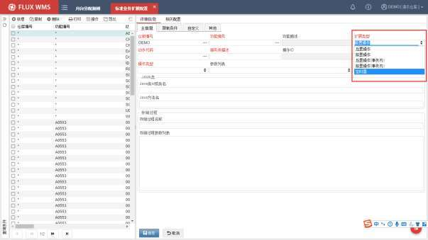

- “动作代码”、“操作描述”根据现场的个性化操作需求，自行命名。后续配置时会需要选择此命名的记录。

- 指定对应的 JAVA类信息，或者存储过程信息。具体执行逻辑，个性化撰写在 JAVA类中，或者存储过程 SP 中，通常由 IT部门撰写，或者请与FLUX 顾问联系。

- 标准业务扩展配置具体功能说明，可参考【5.6 标准业务扩展配置】章节的介绍。

- **定时器配置**

- 选择主菜单“业务规则”下的“定时器”功能。

- 点击【新增】按钮，在“详细信息”页签，根据个性化需要，输入定时器ID、描述，并配置执行频率、时间信息。需要注意的是，系统要求，自定义定时器的ID，必须是“UDF_”开头的。并且勾选了“自定义标识”，才能进行后续个性化配置。

<!-- 原 PDF 第 420 页 -->

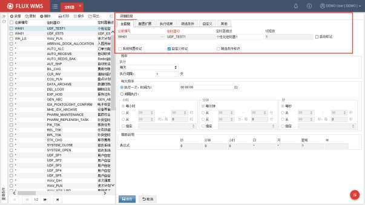

- 点击【保存】按钮，保存详细信息配置。然后切换到“配置扩展”页签。

- 点击“动作代码”字段的浏览按钮，在如下二级窗口，可以查询到之前在“标准业务扩展配置”功能中，配置的个性化定时器逻辑的动作代码。

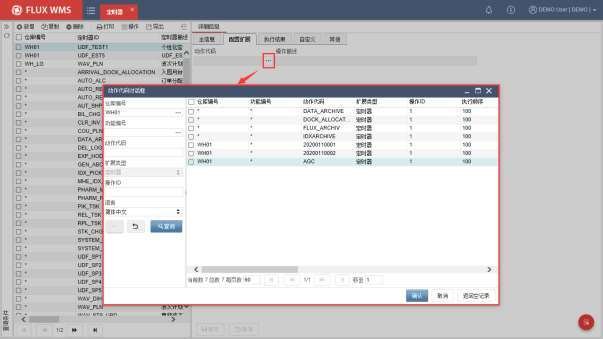

<!-- 原 PDF 第 421 页 -->

- 选择动作代码并确认、保存，完成个性化定时器配置。

## 8.10. 立库入库规则

ASRS 自动化立体仓库（常被简称为“立库”），通过堆垛机等设备进行进出货物搬运。由于一个巷道内堆垛机数量有限，通常是一个或多个巷道使用一台堆垛机，为了最大化的利用堆垛机、提升作业效率，减少部分堆垛机任务集中，而另一部分堆垛机空置情况，操作时与普通仓库不同，会有任务均衡的要求。因此系统提供了对应的立库规则配置功能，进行均衡规则的配置、管控。

立库入库时，是 WCS 设备（如输送线、立库投放口、堆垛机设备）与 WMS 系统，扫描采集托盘/产品信息后，通过接口传递给 WMS 系统，然后 WMS 根据立库入库规则匹配，计算合适的上级库位，再下达上架任务给 WCS 设备。因此无需到产品档案、货主档案中配置不同的立库规则。

- **立库入库规则设置**

- 选择主菜单“业务规则”下的“立库入库规则”。

- 点击【新增】按钮，维护规则详细信息：

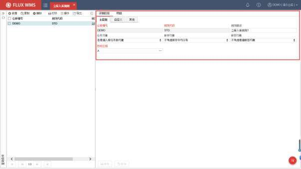

仓库编号－规则生效的仓库代码。新增时默认为当前登录仓库 ID。

规则代码－立库入库规则的规则代码。

<!-- 原 PDF 第 422 页 -->

规则描述－规则名称、描述信息。

任务均衡－根据派给堆垛机的任务个数，各个堆垛机之间的任务均衡分配模式。下拉列表选项，详见后续章节介绍。

库存均衡－根据产品存储情况，考虑产品在各个巷道中的均衡分布模式，以便使得上架、拣货任务也相应分布在多个巷道，从而分派给多个不同堆垛机。

库容均衡－根据各个巷道的库位利用率情况（即库容），考虑货品的均衡存放。

目标区域－规则对应的立库区域。不同区域可以配置不同的规则细节。

- 点击【保存】按钮，完成规则详细信息维护。

- 在“明细”页签，进一步维护规则的明细行信息，类似上架规则，系统将逐行匹配，按匹配到的明细行执行规则计算：

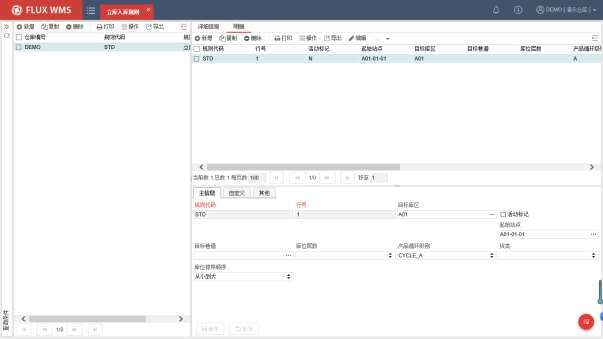

规则代码－立库入库规则的规则代码，根据详细信息继承得到。

行号－规则明细行的行号，由系统自动生成。

目标库区－规则生效的库区。

活动标记－明细行记录是否生效。

目标巷道－规则明细针对的具体巷道。即在此巷道内寻找合适的库位。

<!-- 原 PDF 第 423 页 -->

库位层数－规则指定的对应层数，可多选，如配置，系统只寻找指定层数的库位。

产品循环级别－符合指定循环级别的产品，才执行此行规则明细。例如指定为循环级别A，那么循环级别为 B 的产品将跳过此行明细。

货类－指定货类的产品才执行此行规则明细。主要用于不同货类分库区或巷道存放的业务场景。

起始站点－对于多个入库站点（输送线与立库衔接的投放口）的立库，可以配置不同站点对应不同巷道，分别计算上架，因此可以配置适用此规则明细的对应起始站点。

库位排序顺序－在指定库区寻找合适库位时的库位上架顺序排序，正序还是倒序选择。即从小到大，还是从大到小。

- 点击【保存】按钮，完成规则明细的维护。

- **均衡模式说明**

- 任务均衡

基于入库上架任务，或者出库拣货任务进行工作量均衡计算的模式，系统提供的选择项有：

- 各巷道入库任务数均衡

在指定区域计算上架任务时，按巷道平均分派任务，使得每个堆垛机获取到的上架任务个数相当。例如第一个上架任务，计算到1 号巷道，第二个上架任务就到2 号巷道寻找空库位（立库操作多数是整托盘上架的情况）。每个巷道都有任务时，下个任务又分派到1 号巷道。

此模式也适用于将任务分派给完成操作速度较快的巷道。有时某个巷道的空库位集中在投放口附近，作业速度会比其他巷道略快，系统可以根据任务队列分派合适的上架库位，提升堆垛机利用率。

- 各巷道入库出库任务数均衡

同样按巷道平均分派任务，但不仅考虑入库上架任务，同时考虑出库的拣货任务，比对各个巷道的总任务队列，上架到任务最少的巷道中，达到堆垛机利用率最大化的目的。

- 不考虑任务数均衡

虽然按任务均衡，可以在上架环节提升堆垛机利用率，但在小批量入库、大批量出库的情况下，有可能存在相同产品集中在一个巷道内，出库时只能等待堆垛机依次拣取的情况，出库时的效率可能不高。因此在优先保障出库的业务场景中，可以不考虑任务均衡，而采用库存均衡或者库容均衡的优化模式。

<!-- 原 PDF 第 424 页 -->

- 库存均衡

库存均衡，即通过上架库位计算，使得同样产品尽量在各个巷道都有库存，从而在出库拣取时，可以多巷道并行操作，适用于同品出库量较大的业务场景。

- 不考虑库存平均分布

即不采用库存均衡优化逻辑，可配置任务均衡或者库容均衡

- 按产品平均分布库存

同一产品，比对各个巷道的库存数量，到此产品库存最少的巷道查找合适的库位，以便达到各个巷道都有此产品平均分布的情况。出库时可以多个巷道并行拣取，提高出库操作的效率。

- 巷道平均分布库存

比对各个巷道的总库存，到库存总量最少的巷道查找合适的库位。

- 库容均衡

按库位利用情况进行上架任务计算，从而使得各个巷道的库容情况相对均衡。适用于出库品项、数量差别不大，比较平均的业务场景，可以使得各个巷道的出库任务尽量均衡。

- 不考虑巷道库容均衡

即不启用库容均衡逻辑计算，而采用其他优化计算模式。例如配置任务均衡或者库存均衡。

- 巷道库容均衡

启用库容均衡逻辑，在空库位最多的巷道查找合适的库位进行上架，从而使得各个巷道的库位利用率（库容）趋近。出库时各个巷道的拣取任务也能相对均衡。

## 8.11. 路线规则

特殊业务情况下，发货订单并不指定承运人，而是需要FLUX WMS系统根据订单情况自行指定承运人。

这些指定承运人的逻辑，可配置为路线规则。

- **路线规则设置**

- 选择主菜单“业务规则”下的“路线规则”功能。

- 点击【新增】按钮，设置订单重量、体积范围，在某个路线下，指定的承运人：

<!-- 原 PDF 第 425 页 -->

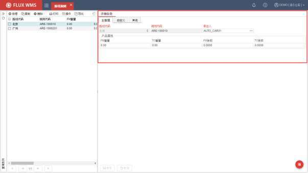

- 点击【保存】按钮，完成路线规则设置。

即当发运订单指定为“路线代码”中设置的路线时（路线代码内容在系统代码中维护），根据订单总重量、总体积，匹配到这个区段范围内可以进行承运的承运人，作为此订单的指定承运人使用。

通常在上游订单下达、需要 WMS 指定承运人时，由接口平台调用路线规则，计算、匹配承运人并更新到发运订单表头中。

## 8.12. 配送规则

用户的面单号码（运单号），由 FLUX WMS 系统生成的情况下，常常不同承运人的运单号码规则不同，或者需要通过不同的接口平台进行面单号获取，可通过配送规则进行要求维护。

- **配送规则设置**

- 选择主菜单“业务规则”下的“配送规 则”功能。

- 点击【新增】按钮，添加新的规则记录：

<!-- 原 PDF 第 426 页 -->

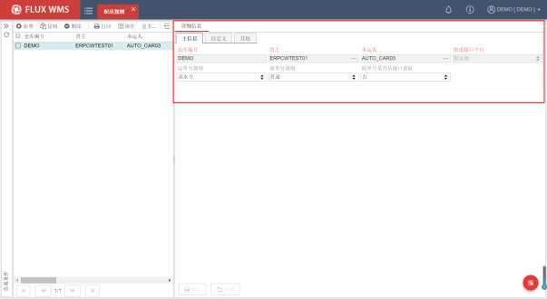

- 设置规则应用的对应业务仓库、货主、承运人信息。

- 通过接口获取面单号的模式中，需要配置“快递接口平台”，即此规则适用的场景条件。同一个承运人，由于订单下达渠道不同，快递接口平台不同，会有不同的接口对接方向，需要有明确区分。例如承运人同样是顺丰，但京东下达的订单，需要通过京东平台的快递接口获取面单；而淘宝订单，需要通过菜鸟平台的快递接口获取面单。相同承运人，可以根据快递接口平台不同，配置多个配送规则。不通过快递接口平台的情况下，例如调用顺丰自有接口，则此字段默认“默认值”即可。获取接口时，根据发运订单的仓库，货主，承运商、快递接口平台信息来匹配配送规则。

- 选择运单号规则。目前系统提供“流水号”、“分区分包装号段”、“整单取号段”3 种预设规则，系统生成运单号时，可根据仓库、货主、承运人条件，执行对应配送规则，生成不同逻辑的运单号码。

- 流水号，根据分配数量，每箱对应一个运单号码。一个订单有多个系统生成的目标跟踪号，即获取多少运单号。流水号的组成，根据流水号规则 DELIVERYNO（面单号）配置内容进行生成。

- 分区分包装号段，从号码池提取预设号码作为运单号，而不根据流水号规则生成号码。号码池内容，可以是通过承运人接口批量获取的面单号，或者Excel提前导入大量预设面单号。

<!-- 原 PDF 第 427 页 -->

- 整单取号段，整个订单，不论多少分配明细，从哪些区域、库位拣货，每单只分配 1个运单号码。号码的来源同样来自号码池。

- 面单号规则，主要用于与京东、宅急送的特殊多箱单号规则配置：

- 选择值为普通（COMMON），即通用逻辑，循环调用获取多个面单号的逻辑。

- 选择值为京东（JD），执行京东面单号逻辑。一个订单只调用一次，在返回面单号以后按照总箱数，客户端分解为"面单号-第几箱-总箱数-"多个面单号。

- 选择值为宅急送（ZJS），则是宅急送面单号逻辑。同样一个订单只调用一次，在返回面单号以后按照总箱数，客户端分解为 "面单号-总箱数-第几箱"多个面单号。

- 面单号是否从接口获取，选择“是”，则在出库复核时，通过接口从上游系统获取新的面单号。通常用在第一箱的面单接口已下达，现场根据实物需要增加第二箱的情况下，由 WMS 系统主动向上游系统请求新增面单号。

- 点击【保存】按钮，保存规则设置。

- **鼠标右键功能**

鼠标右键功能菜单中的“显示运单号”功能，针对从号码池提取预设号码的场景，用来查看预先导入（或者通过接口批量获取）的面单号。

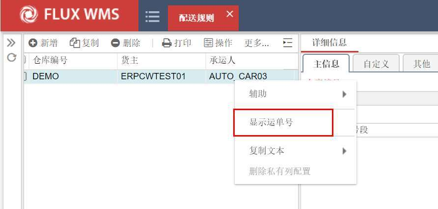

点击后，系统会弹出二级窗口，显示目前号码池（SYS_Delivery_No表）中预设、但尚未使用的面单号信息：

<!-- 原 PDF 第 428 页 -->

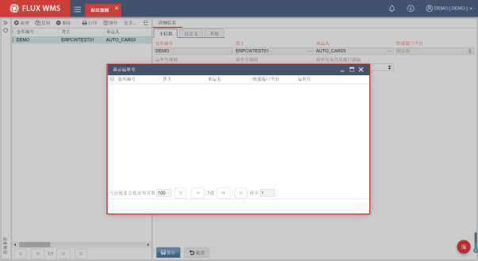

## 8.13. 流水号规则

流水号规则主要用来定义系统中各种单证号、ID 号的生成方式。

- **流水号规则**

流水号规则设置见下图：

<!-- 原 PDF 第 429 页 -->

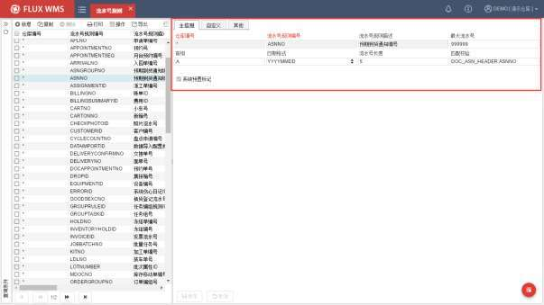

仓库编号－执行此规则的对应业务仓库 ID。如为*，则说明是公共规则。

流水号规则编号－规则代码 ID。

流水号规则描述－规则代码说明。

最大流水号－流水号上限值。通常到达上限后，会更换流水号前缀。

前缀－单据号码的固定开头内容，根据需要设置。例如可以配置预期到货通知编号的前缀是 ASN，发运订单的前缀是 SO，系统会生成类似“SO0000001”，或者“SO202009210001”的单证号码。

日期格式－如希望流水号与日期或年月相关可设置日期标识。例如到日的级别，第二天流水号会从 1开始重新累计。由于不同国家对日期格式的习惯用法不同，因此系统提供多个级别（如年、月、日），每个级别种格式的选择项（如 YYYYMMDD、MMDDYY 等）。

流水号长度－流水号位数设置。如设置为 5位，流水号从 00001开始累计。

匹配校验－使用此流水号的功能对应表字段。系统在保存流水号配置时，会与匹配校验字段对应检查，以免修改流水号设置时，配置的流水号总位数（前缀+日期+流水号长度），超过对应功能允许的位数长度，从而导致功能执行时报错流水号超长。不同功能对应的流水号长度不同。

系统预置标记－此流水号规则，是否为系统初始化即存在的系统预设记录。预置标记勾

<!-- 原 PDF 第 430 页 -->

选的记录，不可删除。

每个规则可分别定义 ID的长度、前缀等。

例如，希望单证号码显示为前缀+日期+流水号样式，可将前缀设置为“LN”日期格式通过下拉列表配置为“ YYYYMMDD”或“ YYMMDD”等，长度为5。系统显示单证号形式为“LN2020110200001”。

注意：长度指得是前缀、日期之后的流水号位数。订单号码总位数（前缀+日期+流水号）不得超过 20位长度。如果对应单号需要生成分单，还需要考虑到分单的 3 位长度，否则会导致分单号码超长，无法正常生成分单。

另外，仓库为*的默认规则逻辑，作为系统预置记录，不可删除，但允许修改配置内容。这是为了避免公共规则逻辑删除导致流水号无法生成。

## 8.14. 序列号校验规则

在序列号采集过程中，为了保证序列号的合法性，扫描过程中往往会对序列号的长度、前缀等进行校验。但不同客户、不同产品的序列号组合要求，通常各不相同。

系统通过【序列号校验规则】功能对序列号的合法性规则进行约定，以支持不同业务的需要。维护后的序列号规则，在产品档案中选择从而与产品相关联、生效。

- **序列号校验规则**

点击新增按钮，维护序列号校验规则相关信息：

<!-- 原 PDF 第 431 页 -->

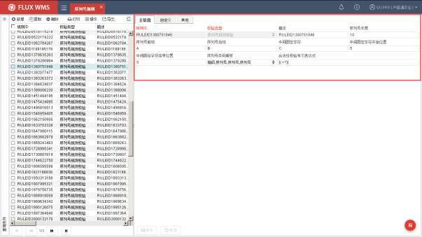

规则 ID－规则代码。

校验类型－即此规则是序列号校验（对 1级序列号生效），还是子序列号校验（针对 2级子序列号）。

描述－规则名称描述。

序列号长度－序列号长度限制。

序列号前缀－序列号前缀限制。例如序列号必须是 A 开头的。

序列号后缀－序列号后缀限制。

中间固定字符－序列号中，必须包含什么字符。结合开始位置 /结束位置生效。例如序列号的第 3位到第 5位必须是 ABC。

中间固定字符开始位置－指定字符的开始位置。

中间固定字符结束位置－指定字符的结束位置。

序列号条码解析－适用于自定义扩展规则。下拉框内容在系统代码 SN#_ENC_RUL 中定义，并在 JS 代码中编辑个性化的解析逻辑。

合法性校验布尔表达式－用于校验的布尔表达式。例如 isnumeric(@SerialNo)，表示输入的序列号必须是全数字的。实际执行时，系统自动用实际扫描的序列号替换布尔表达式中的@SerialNo进行校验。

<!-- 原 PDF 第 432 页 -->

## 8.15. 序列号管理规则

随着现代化仓库的业务复杂度提升，需要进行序列号管理的业务场景，也会有许多不同的需求细节区分，例如整订单采集序列号，订单中部分产品需要采集序列号等。这些需求可以通过在产品档案中配置序列号采集节点等进行管理。

但有时碰到进一步分化的不同管理需求，例如同一个产品，合格品正常采集序列号，不合格品后续要退货出库，因此收货时无需采集序列号。这类细分管理要求，无法通过产品层面的配置进行管理设定。因此系统提供独立的【序列号管理规则】功能，在订单、产品层级的配置基础上，进一步定义序列号采集管理时的“例外情况”，即符合指定条件的情况，即使产品档案中配置为“需要采集序列号”，现场也无需采集。因此对于任何情况下都不必采集序列号的场景，关闭参数，或者在产品档案配置为“不采集序列号”即可，无需配置“不采集”的序列号管理规则。

- **序列号管理规则**

- 主信息部分

点击【新增】按钮后，维护规则相关规则主信息：

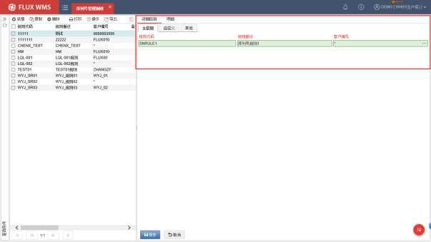

规则代码－规则代码 ID。

<!-- 原 PDF 第 433 页 -->

规则描述－规则描述信息。

客户编号－规则适用的指定货主代码。如未指定，则适用于全部货主，即作为公用规则。

维护后，点击【保存】按钮保存记录。

- 明细部分

点【新增】按钮后，维护“无需采集序列号”的条件：

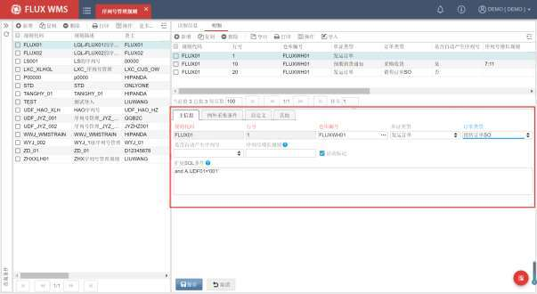

规则代码－规则ID，从详细信息记录继承。

行号－规则明细行号。

仓库编号－规则生效的对应仓库。新增记录时，默认为当前登录仓库。

单证类型－单证所属功能类型。如预期到货通知，还是发运订单。

订单类型－与单证类型对应的，具体单证内的订单类型，如预期通货通知对应的采购入库、退货入库单；发运订单对应的销售订单、样品订单等等。

活动标记－规则是否生效。

是否自动产生序列号－如配置为“是”，则系统根据序列号区间自动产生序列号列表。

序列号增长规则－自动产生序列号情况下，序列号增长的逻辑。输入内容要求结构为X:Y，代表序列号的第 X 位到第 Y位为自然增长的整数序列。

<!-- 原 PDF 第 434 页 -->

扩展 SQL 条件－自定义配置条件内容，用于配置类似“XX 字段为 A 的订单无需采集序列号”的个性化条件。

在“例外采集条件”页签维护批次属性例外条件，符合指定属性条件的记录，无需采集序列号：

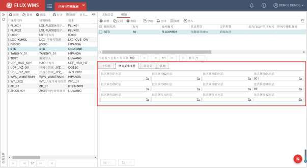

维护后，点击【保存】按钮保存设置。

- **规则应用**

后续到【基础设置】-【货物类型】功能中，为货类配置对应生效的序列号采集除外规则，即序列号管理规则，如下图所示。未配置此规则情况下，仍旧是产品档案中的序列号相关配置生效。

<!-- 原 PDF 第 435 页 -->

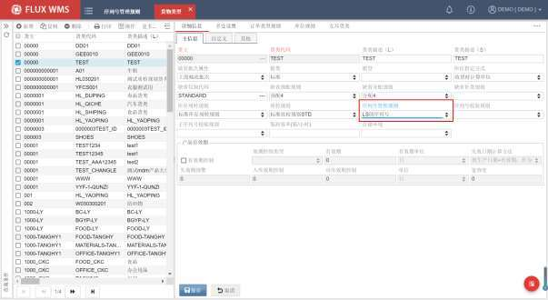

## 8.16. 波次调度规则

波次调度规则，主要用来对波次计划规则的运行时间进行调度和排程。同时将原本波次计划规则的一部分条件前置到调度规则环节配置生效。可以实现相同条件（如仓库、路线、承运人等）但不同时段的订单，执行不同的波次计划规则，支持更加复杂的波次管理需求。

- **波次调度规则设置**

- 详细信息部分

用于维护波次调度规则的执行条件，如订单筛选要求、执行时间等配置。

<!-- 原 PDF 第 436 页 -->

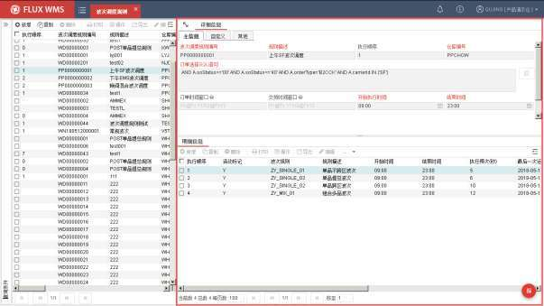

波次调度规则编号－规则 ID，由系统生成。生成波次后，将此编号记录在波次表头。

规则描述－规则名称描述。

执行顺序－多规则情况下，规则执行时的排序字段。现场可以根据业务需要调整执行顺序。

仓库编号－规则生效仓库。新增时，默认为当前仓库。

订单选择 SQL 语句－规则执行时筛选订单的条件。无需录入，点击浏览按钮，在如下“订单选择 SQL 语句”二级窗口，选择条件后点击【替代】按钮，系统自动生成对应 SQL 语句。

<!-- 原 PDF 第 437 页 -->

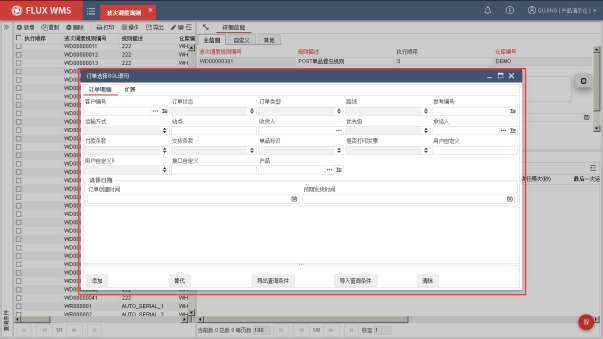

订单时间窗口－订单时间范围，即范围内的订单会用于波次组合。@T-DD 表示日期信息，@T0 为当天，@T-1 为前一天，@T+1 为明天。输入后系统会进行有效性校验

交货时间窗口－交货时间范围条件。

开始执行时间－规则执行的时间范围起点。

结束时间－规则执行的时间范围终点。

活动标记－规则是否启用。

- 明细部分

用于配置符合表头条件的记录，所执行的波次规则。

<!-- 原 PDF 第 438 页 -->

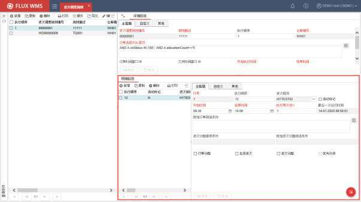

行号－明细记录行号。

执行顺序－此行明细记录的执行次序，可以根据需要调整。

波次规则－已配置的波次计划规则，可通过浏览按钮二级窗口选择。

活动标记－是否启用的此行规则明细记录。

开始时间－规则执行的时间范围开始。

结束时间－规则执行的时间范围结束。

执行频次（秒）－规则运行时间间隔，单位为秒，整数值录入。

最后一次运行时间－上次执行此规则的时间信息。

附加订单筛选条件－附加的筛选条件内容，以便不同业务需要，相应配置不同的订单筛选条件。

订单分配－勾选后，定时器执行时候，自动对所筛选的符合条件的订单，批量进行分配。通常用在先分配订单、再生成波次的业务场景中。已经在波次中的订单，即使未分配，也不受此配置影响、不会分配到波次中的订单。

生成波次－勾选后，定时器执行时候，自动根据指定的波次计划规则，产生波次计划。

波次分配－勾选后，定时器执行时，自动对按此波次规则 ID生成的、未完全分配的波次，

<!-- 原 PDF 第 439 页 -->

相应执行分配。即适用于先生成波次，再对波次进行分配的业务场景。

常见作业场景是，先对单独订单进行分配，然后筛选已分配订单根据波次规则创建波次；或者是筛选创建订单，根据波次规则生成波次，然后再对波次进行分配。因此【订单分配】与【波次分配】，不能同时勾选。

优先补货－对于存在拣货位管理的仓库，波次作业时，经常会希望先生成补货任务，再进行分配。这样分配的结果不会受到拣货位缺货的影响，会更加优化。因此在勾选“生成波次”的情况下，系统提供“优先补货”配置。启用后，对当前生成的波次，执行“订单驱动补货”的相应处理，为波次内的订单进行缺货补货计算、生成补货任务。如果此规则明细，同时还勾选了“波次分配”，则相应对波次进行分配，形成波次生成、补货计算、波次分配的连续自动操作。

- **鼠标右键菜单**

- 表头部分

复制－复制记录。常用于将其他仓库规则复制到当前作业仓库。

- 明细部分

生成波次－根据明细行对应的波次计划规则，不考虑执行时间的设置，立刻执行检查处理，生成波次。

## 8.17. 订单变更规则

通过接口创建订单之后，上游系统（例如ERP、淘宝京东平台等）有时会有订单取消、修改的需要，会通过接口下达订单变更指令。

但在 WMS 中，并不是所有订单都可以自动修改、自动取消，例如订单已经发运，就无法根据接口指令自动取消。不同业务流程中，对于操作到什么步骤的订单可以修改、取消，要求也不一样，对原始订单的处理各不相同，例如进行波次提总、散件拼整箱拣货作业模式中，已经下达拣货任务的订单，即使接收到取消指令，为了避免影响其他订单的操作效率，会依旧拣取整箱，在后续分货环节进行拦截；但对订单拣货的作业模式，收到取消指令，未操作的拣货任务也会相应取消。

由于不同业务操作模式下，订单变更的前提、处理各不相同，因此系统在“订单变更规则”功能中，对相关环节进行设置，收到变更指令时，可以依据不同规则，相应判断是否可变更、应如何处理变更信息以及原有的单证、任务。

- **订单变更规则设置**

<!-- 原 PDF 第 440 页 -->

- 选择主菜单“业务规则”下的“订单变更规则”功能。

- 点击【新增】按钮，在“详细信息”页签依次输入信息：

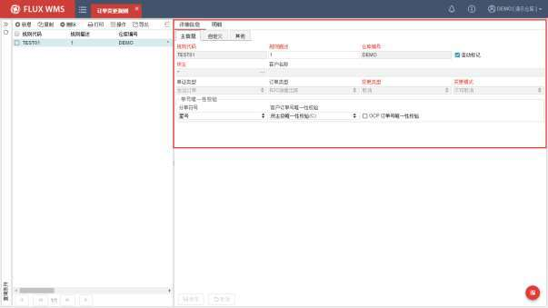

规则代码－规则 ID。

规则描述－规则说明。

仓库编号－规则生效仓库。新增时，默认为当前仓库。

活动标记－规则是否生效。

货主－执行此规则的货主，可通过浏览按钮选择，为*则对所有货主生效。

客户名称－货主名称描述。根据所选的客户 ID相应显示。

单证类型－此规则对应生效的单据。例如是入库单对应的变更管理规则，还是出库单的变更规则。不同单据，使用场景不同，对应作业节点不同，变更控制条件也不一样，例如只有创建状态的入库单可以取消，但只要没有发货确认的出库单都可以取消。所以系统支持根据不同的订单类型，分别配置规则。

订单类型－具体单证类型。例如订单类型为“预期到货通知”情况下，订单类型选择就是“采购入库单”、“退货入库单”等 ASN 对应的订单类型选择项。可以为不同业务类型的单据配置不同的订单变更规则。有些作业现场，采购入库单仅在创建状态下可修改，但退货入库单只要没有关闭，都可以修改。

<!-- 原 PDF 第 441 页 -->

变更类型－针对订单取消的处理规则，还是针对订单修改的处理规则。订单取消与订单修改，经常处理逻辑不同，因此可以分别配置规则。

变更模式－订单取消、修改的处理模式。例如订单是否可以取消，或者修改时是在原单变更，还是原单取消创建完整新单进行操作。

单号唯一性校验－接口订单下达时，是否要开启唯一性校验的相关设置，以免异常情况下接口信息重复获得，导致单证重复。

分单符号－系统创建分单时，针对分单，会采用“原单号”+“分单符号”+“分单号”的模式生成单号，例如 ABC001生成分单 ABC001*01，继续分单生成 ABC001*02。系统默认分单符号为*，但有些上游系统下达的单号中，原本就带有*，容易导致误解，因此可以选择下划线、横线、百分号等不同符号，作为分单符号。

客户订单号唯一性校验－上游系统（例如 ERP系统）的单证号，接口下达时的唯一性验证方式。可以选择不做唯一性验证；开启验证情况下，系统支持系统级或者货主级唯一性验证。货主级验证常用于第三方仓库，对接多个上游系统，各自使用不同的货主进行管理。不同上游系统之间，无法保证客户订单号完全唯一，因此仅在货主范围内进行唯一性验证。

OCP 订单号唯一性校验－与 FLUX OCP系统（Order Collaboration Platform，订单协同平台）对接时，获取订单是否要对 OCP的单号进行唯一性校验。

- 点击【保存】按钮，系统校验，不应有仓库 +客户编号+单证类型+订单类型+变更模式相同的规则记录，否则报错“存在重复的仓库、客户、订单类型和变更类型的规则记录”。

- 针对发运订单的规则记录，还可以进一步配置订单作业到不同环节，是否可以取消、修改。在“明细”页签，点击【新增】按钮，维护发运订单节点信息：

<!-- 原 PDF 第 442 页 -->

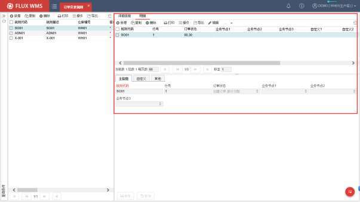

规则代码－规则 ID。根据详细信息记录相应显示。

行号－明细行号，由系统自动生成。

订单状态－发运订单状态，下拉框可多选。例如创建状态、部分分配状态订单可以取消，则头信息的“变更模式”配置为“可以取消”，明细的“订单状态”选择“创建订单、部分分配”。

业务节点 1~3－同样状态下，不同的业务节点，对订单修改的要求可能会不同。例如订单已完全分配，尚未下发任务给输送线设备，即未开始拣货情况下，可以对订单进行修改；但如果已经开始拣货作业，则不允许修改订单添加行记录（上游系统需要另行下达新单），此时可以针对“完全分配”订单状态，进一步配置业务节点为“任务已下发”。但对于创建状态的订单，无需判断任务是否下发，可以另外配置一行明细。

- 点击【保存】按钮，完成订单变更规则设置。

- **规则判断**

Datahub接口平台获取到上游系统下达的，订单取消、修改指令后，在【订单变更规则】中，根据仓库、货主、单证类型、订单类型、变更类型，匹配到对应的规则记录。订单取消，与订单修改，需要配置为 2行规则，分别匹配。

- 非发运订单取消

<!-- 原 PDF 第 443 页 -->

对于发运订单之外的其他单据，在创建状态可以取消，开始操作后都不允许取消，例如入库库开始收货后，就不会取消订单。因此无需进一步配置规则明细，仅在规则的“变更模式”字段配置此类单据是否允许通过接口取消即可。

对于可以取消的单据，系统将单据取消；创建状态也不可取消（“变更模式”配置为“不可取消”）的情况，或者订单已经开始操作，不能取消的情况，Datahub 接口平台会反馈给上游系统，此单据不可取消。

- 发运订单取消

由于不同业务场景，对于发运订单是否可以取消、可取消的作业节点安排各不相同，因此发运订单的处理较为复杂。

接口平台获取到取消指令后，不仅需要匹配到规则详细信息记录，还需要进一步根据订单当前状态、业务节点情况匹配规则明细记录。例如当前订单是分配状态，可以取消，但如果是已经复核装箱并且已经称重（也即意味着打包完成，快递订单已打印、粘贴）则不可取消。

对于不能取消的订单，接口平台返回上游系统单据不可取消的信息；

对于可以取消的订单，系统根据订单操作进度分别处理：

- 创建状态订单直接取消。

- 预配、部分预配订单，取消预配后取消订单。

- 分配、部分分配的订单，如果没有加入波次，并且没有打印面单，则取消分配后取消订单。

- 如果订单进行到后续作业环节，或者状态还是分配但已经加入波次，已经打印面单，为了不干扰拣货作业，订单标记为上游取消，但状态不变，待后续复核、打包、装车等环节拦截、反拣处理。

- 订单修改

订单修改情况下，根据变更模式选择，有3 种不同的处理方式：

- 整单处理

接口将原订单取消，根据修改后的订单指令，创建完整内容的新单据。

- 原单行修改

根据修改指令信息，在原订单记录中变更明细行信息。对应明细行如果是创建状态，直接更新；如果是非创建状态，则取消原订单行明细，根据修改后的信息创建新的明细行。原始订单的状态根

<!-- 原 PDF 第 444 页 -->

据修改情况相应刷新。

- 分单行修改

根据修改指令信息，将原订单记录中的对应明细行记录取消，根据修改信息，创建新的订单，仅记录修改后的明细行信息。

例如一个入库单，原有 3行明细信息，现在接口下达修改指令，第 3行明细数量由 3改为 5，并增加第 4行明细。则分单行修改模式下，系统会取消原单的第 3 行，保留 1、2行明细记录不变，同时创建新的、具有相同上游单号的入库单，明细信息为数量为 5 的行 3记录以及新增的行 4 记录，不会包含行 1、行号信息。

现场具体使用哪种变更模式，根据业务流程规划与上游系统情况进行选择。例如有些 ERP系统，要求入库单收货反馈，只能反馈一次，那么就不适用“分单行修改”模式，因为分单后，信息可能会分 2次返回给 ERP。

## 8.18. 快递接口平台规则

由于同一个货主，可能由于销售渠道不同，尽管采用相同承运人，所使用的快递接口平台也可能会不同。

例如电商订单，有时不同订单有不同的运输指定要求，作业中需要调用不同的快递接口。甚至相同承运人，不同订单来源，所需要调 用的快递接口也不同。承运人是圆通，但通过京东快递平台，还是淘宝菜鸟快递平台进行快递接口信息传递，需要选择判断。

快递发运订单表头增加了“接口平台”字段，指定接口平台后，由 datahub根据仓库+货主+承运人+接口平台信息，判断具体调用哪个快递接口（例如顺丰接口，还是圆通接口，或者京东接口）。

- **快递接口平台设置**

- 选择主菜单“业务规则”下的“快递接口平台规则”功能。

<!-- 原 PDF 第 445 页 -->

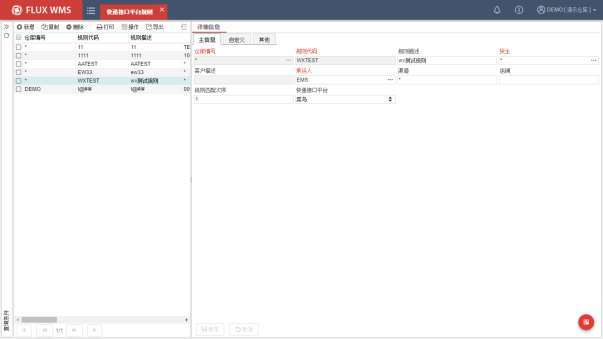

- 点击【新增】按钮，在“详细信息”页签依次输入信息：

仓库编号－规则生效仓库。新增时，默认为当前仓库。

规则代码－规则 ID。

规则描述－规则说明。

货主－执行此规则的货主，可通过浏览按钮选择，为*则对所有货主生效。

客户描述－货主名称描述。

承运人－适用此规则的承运人。为*即不限制承运人。

渠道－订单来源渠道。新增时默认为*。

店铺－订单所属销售店铺。有时同一电商平台，同一货主，会有多家不同店铺的情况，例如货主在淘宝、天猫开了多家店铺，承运人均为 EMS，但 EMS 本身有 2套接口平台，不同店铺所用的平台不同。

规则匹配次序－多个规则情况下的匹配排序字段。

快递接口平台－符合此规则时，订单应对应的快递接口平台。

- 点击【保存】按钮，系统校验，不能存在仓库 +货主+承运人+渠道+店铺全部一样的记录。

<!-- 原 PDF 第 446 页 -->

## 8.19. 拣货规则

现场根据系统下达的拣货任务进行实物拣取时，如果碰到货物短缺、残损，无法正常拣货，通常会进行拣货异常处理。但不同场景下，由于业务管理要求不同，具体的异常处理也会不同，例如退货出库，残损货品退给供应商，如有少货，时间要求不紧张的情况下，有的仓库会先核实情况，然后实际有多少货品就实发多少；但销售出库，通常有作业时间要求，仓库一般会跳过异常库存，重新分配其他库位库存，优先满足订单出库要求。

在 FLUX WMS 系统中，可以通过【拣货规则】功能，对不同仓库、货主的不同类型订单的处理要求分别进行设置。拣货时，系统根据当前作业仓库、订单所属货主，匹配到对应的拣货规则，并根据订单类型与异常类型，匹配到具体的规则明细行，根据处理要求，对拣货任务、库位库存进行不同的异常处理。

如果未配置拣货规则，则根据拣货确认时的原因代码选择，执行标准的缺货处理（对为拣货确认的数量取消分配，库位可用余量移动到 LOST库位）或者残损处理（对为拣货确认的数量取消分配，更新库位属性为管控，生成残损的库存事务）。

- **拣货规则设置**

- 选择主菜单“业务规则”下的“拣货规则”功能。

- 点击【新增】按钮，在“详细信息”页签依次输入信息：

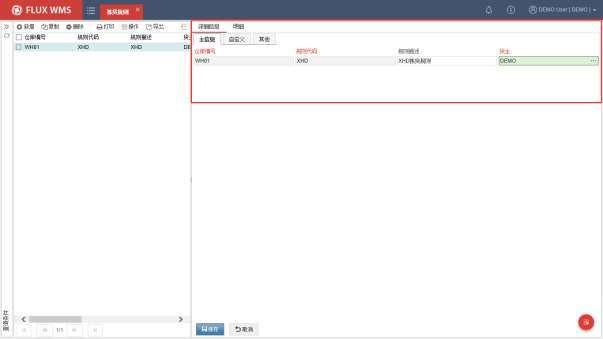

<!-- 原 PDF 第 447 页 -->

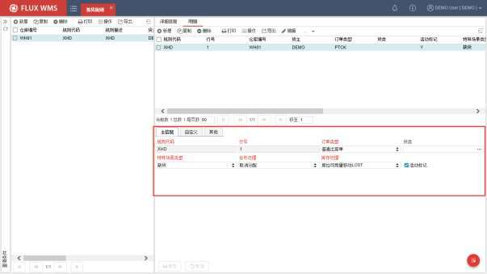

仓库编号－规则生效仓库。新增时，默认为当前仓库。

规则代码－规则 ID。

规则描述－规则名称、描述信息。

客户编号－规则生效的货主代码。

- 点击【保存】按钮，保存规则主信息。然后在“明细”页签，进一步维护规则内容。

- 点击“明细”页签的【新增】按钮，依次输入如下信息：

*图8-19-2（图像未能从 PDF 对象中直接提取）*

规则代码－规则 ID，根据规则详细信息带入显示。

行号－规则明细行号，由系统生成。

订单类型－规则明细对应生效的发运订单类型，例如销售订单，退货订单。不同订单类型，缺货时的处理可以不同。支持多选，即几种订单类型，异常处理逻辑相同。

货类－不同产品货物类型，可以配置不同的处理要求。如果未指定，则针对全部产品生效。

特殊场景类型－拣货时的异常情况，不同情况，处理不同。系统提供缺货、破损、多货、超量拣货几种选择，拣货时相应选择对应的异常类型（原因代码），系统将根据仓库、货主、

<!-- 原 PDF 第 448 页 -->

订单类型、异常类型匹配到具体明细行，然后执行相应的任务处理、库存处理。需要说明的是，针对超量拣货，主要配置为是否允许超量拣货，因此当场景类型为超量拣货情况下，后续任务处理仅能选择“拣货确认”，即此类型下允许超量拣货。未配置则默认不允许超量拣货。

任务处理－对拣货任务的处理方式选择。具体处理详见“规则选项说明”中的介绍。

库存处理－对拣货对象库位库存的处理方式选择。具体处理详见“规则选项说明”中的介绍。

活动标记－规则明细是否生效。

- 点击【保存】按钮，完成规则内容维护。

- **规则选项说明**

- 任务处理

碰到异常情况时，当前拣货任务的处理方式。系统提供的选择项有：

- 取消分配

当前拣货任务，取消分配，并且不再重新分配。即未能全部拣货成功的任务，放弃，库存释放，以便根据“库存处理”中的设置，对库存进行处理。

- 拣货确认

当前拣货任务，根据操作员确认的数量进行拣货确认。常用于部分缺货情况，相当于能够拣取到多少，就确认多少。

剩余未能拣货的分配明细仍旧保留，以便后续复核环节，统一处理订单差异。

分配明细不做取消的原因是，希望差异部分统一在复核台进行处理，为了让复核员看到订单差异，原分配明细不能取消分配

- 取消分配&重新分配

常用于销售订单等需要最大化满足订单的业务场景。当前任务取消分配，问题库存按“库存处理”指定的方式处理，当前订单重新分配新的可用库存，以便按新的拣货任务，进行拣货。即优先满足订单处理，异常库存另行处理。

- 任务降级

对于无法执行拣货的任务，先按“取消分配&重新分配”的处理，重新分配，如果可以满足订单需求，则继续操作，按重新分配的结果进行拣货。

<!-- 原 PDF 第 449 页 -->

但如果重新分配，无法分配到合适的库存满足订单需求，则回退到原有的、拣货不足的分配情况，将拣货任务的优先级调低，先行操作其他正常的拣货任务。由异常处理人员另行检查库存，进行异常处理。

实际作业效果举例：拣货员发现当前库位缺货，让系统判断其他库位是否有可拣选库存，如果有则分配其他库位的库存。如果没有，则将拣货任务优先级降至最低，等待异常处理员处理完库存差异后，再回来拣选。

- 库存处理

针对发生异常情况的拣货库位库存的处理方式。系统提供的选择项有：

- 库位管控

通常用于实物残损情况的处理。将当前拣货任务对应的拣货库位的库位属性，变更为“管控”。在【仓库设置】-【库位】功能中，可以查看到变更后的库位属性情况。同时，在库存事务中，写入一条残损库存事务记录。

管控库位，属于部分权限库位。可用于入库、上架计算、移动，但不能正常分配其中的库存。如果订单明细指定从此类库位分配，仍旧允许分配。

库位管控后，可以避免后续订单再度分配到此问题库位的库存。由负责库存异常处理的仓库管理员对库存确认、修正或属性变更后，人工在【仓库设置】-【库位】功能中将此库位的属性改回正常。

- 库位可用量移动LOST

LOST 是仓库内设置的虚拟库位，每个仓库都可以配置自己的LOST 库位，即库位代码为“LOST_仓库 ID”，通常设置为库位冻结状态（库位属性设置为管控或者封存）。缺货情况下，问题库位的剩余可用库存数量自动移动到 LOST库位，以免后续订单再度分配到此库位仍旧无法拣货。

LOST 库位中的库存，一般由负责库存异常处理的仓库管理员检查确认后，找到实物则根据实物情况移库到对应库位；实物丢失进行库存调减处理。

- 当前拣货量移动 LOST

仅对当前拣货任务对应的库存数量移动到 LOST库位等待处理。通常会配合拣货任务取消分配，然后再移动到 LOST库位。

- 不处理

库位库存不做异常处理。通常为生成拣货异常记录后，人工检查再决定库存处理方式，无需系

<!-- 原 PDF 第 450 页 -->

统自动处理。

- **鼠标右键功能**

- 复制规则

方便现场快速设置类似规则。

根据当前选择的样本规则，复制生成新的规则。新规则的规则代码、对应客户编码需要重新指定，其余信息根据样本规则获得。保存新规则详细信息时，系统自动根据新规则的代码，相应写入规则明细信息。

## 8.20. 二次审核规则

在业务操作过程中，对于一些特定类型的操作，为了规避风险，需要对本次操作进行二次确认，或者需要更高权限的人员审批后才可以执行后续操作。类似医药行业的双人复核、电子签名都属于二次审核的范畴。

但不同行业或者仓库对二次确认的管理要求并不一定相同，因此系统通过【二次审核规则】功能，来配置具体哪个功能（例如ASN，还是出库复核功能）的哪个操作节点（例如出库复核的订单扫描节点，还是装箱确认节点，或者是操作异常提交的节点）需要进行二次确认。

并且可以进一步配置二次确认的具体操作细节，例如“是/否”的提示模式，还是需要录入用户名密码进行确认的作业模式，能否由发起操作的操作员本人进行二次确认等等。

规则配置后，各个功能节点，操作时会根据规则内容控制是否进行二次审核，以及如何进行二次审核确认。

- **二次审核规则**

- 选择主菜单“业务规则”下的“二次审核规则”功能。

- 查询选择系统预设规则，直接配置为公共规则，或者根据需要通过鼠标右键菜单的“复制二次审核规则”功能复制为当前仓库使用的新规则：

<!-- 原 PDF 第 451 页 -->

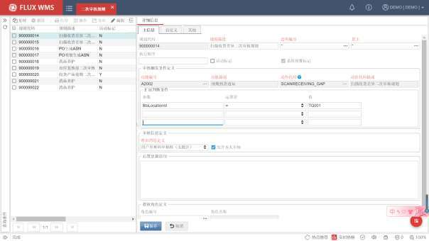

规则代码－规则 ID，复制规则时由系统自动生成。

规则描述－规则使用描述。

仓库编号－规则生效仓库。为*代表公共规则记录。

货主－规则生效货主。如果未指定，则对所有货主生效。

序号－同一个功能节点，配置多个规则的场景中，当前规则的执行顺序。

活动标记－规则是否生效。

系统预置标记－初始化既存在的原始规则带有预置标记，记录不可删除。后续复制生成的规则记录，不带有预置标记，可以删除。

- “审核触发条件定义”部分，用来配置规则针对具体哪个功能、操作环节生效：

功能编号－此规则生效的对应功能。例如预期到货通知，还是出库复核，或者是库存冻结单的功能 ID。如果功能编号为*，则是针对多个功能生效的“公共引用功能”，例如收货环节产品过保质期的审核，是各个收货功能都需要的执行的，即可作为公共功能规则。也可以将公共规则复制为某个功能的特殊审核规则。执行时，系统优先获取当前功能对应的审核规则记录，如无则获取公共功能的审核规则记录。

功能描述－功能编号对应的功能名称，例如预期到货通知。

动作代码－功能中的具体操作节点，例如在保存环节增加二次审核，还是在删除环节进

<!-- 原 PDF 第 452 页 -->

行二次审核。

动作代码描述－动作代码对应描述。

如

*图 8-20-1（图像未能从 PDF 对象中直接提取）*

配置效果为，在【预期到货通知】功能中，进行【扫描收货】操作时，如果 数量

有差异，需要进行二次审核确认。

- 对于同一功能中，碰特殊情况需要进行二次审核，其余普通情况无需二次审核场景，通过配置“ 扩展判断条件”，来设置需要进行二次审核的特殊条件：

参数－进行判断的条件参数，每个功能的可用参数不同，可以通过录入 $$，系统弹出可用参数选择，根据需要进行选择。例如针对@language 语言入参进行选择，或者根据

运算符－=、<>、like 等条件运算符。

值－参数字段指定内容的对应值。

例如

*图 8-20-1（图像未能从 PDF 对象中直接提取）*

配置参数为“$toLocationId”（目标库位），运算符为“=”，值为“TQ001”，

即效果为符合“ $toLocationId=TQ001”情况下需要二次审核确认，也就是说，扫描收货的目标库位是“ TQ001”的时候，需要二次确认， 但收货到其他库位，就不会触发二次确认。

如果 配置参数为@userId（操作员），运算符为“like”，值为“TMP%”，即效果为符合“@userID like‘TMP%’ ”条件下，启用二次审核确认。也即业务场景是，针对用户 ID 以“TMP”开头的临时操作员，做扫描收货时，需要二次确认；而其他用户 ID 中不带有“TMP”的正式操作员，进行作业时，无需二次确认。

- 通过“审核信息定义”部分，进行二次审核的模式配置：

弹出消息定义－二次审核时的模式选择。系统提供如下几种选择项：

- 用户名密码审核框（有批注）－二次审核的弹窗界面，要求审核人录入用户名、密码，并且输入审核的批注信息，如下图所示：

<!-- 原 PDF 第 453 页 -->

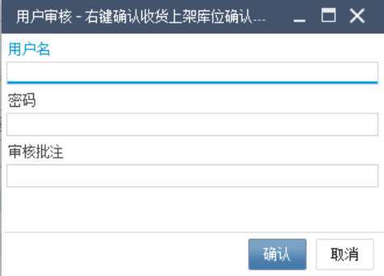

- 用户名密码审核框（无批注）－二次审核的弹窗界面，要求审核人录入用户名、密码进行确认，但无需录入审核批注。

- 是/否选择框－作业时，弹出确认框，要求作业人员再次确认是、否执行此操作。例如订单取消或者发运时的二次确认，起到提醒、避免误操作的效果。

<!-- 原 PDF 第 454 页 -->

- 免审拒绝－信息提示模式。符合判断条件的情况，弹窗提示，视同审核不通过，不执行后续操作。

- 免审通过－信息提示模式。符合判断条件的情况，弹窗提示，视同审核通过，继续执行后续操作处理。

允许本人审核－二次审核内容，是否允许首次操作的操作员本人进行。在“是/否”确认模式的二次审核场景中，比较多的情况允许本人审核；而需要录入用户名密码的严格审核情况下，很多时候不允许本人审核。

- 在“后置更新语句”部分，配置二次审核通过后所需进行的个性化更新处理。例如有的场景二次审核后，需要将订单头自定义字段值改为 Y以便区分已审核订单、未审核订单；有的场景需要将二次审核操作人记录到单独数据表里，进行报表统计。

- 在“角色授权定义”部分，选择可以进行二次审核操作的角色。例如收货员收货，需要仓库主管进行二次审核。

- 点击【保存】按钮，完成二次审核规则的配置。

- **审核窗口信息配置**

功能中，二次审核的弹出窗口，如果希望显示更多信息供审核人员核对，例如收货特殊药品双人校验，希望弹窗显示药品、批次属性信息，可以针对审核弹窗进行显示信息配置。

点击所需配置的审核规则，点击鼠标右键功能“审核信息配置”：

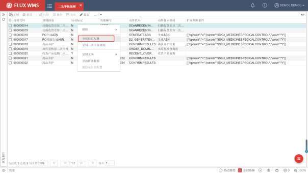

<!-- 原 PDF 第 455 页 -->

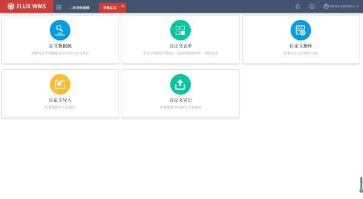

系统显示如下的审核信息窗口专用界面方案配置内容，具体配置操作与【4.10 界面方案管理】配置相同。

*图 8-20-6（图像未能从 PDF 对象中直接提取）*

- **复制二次审核规则**

鼠标右键功能【复制二次审核规则】，可以将已配置好的规则，例如仓库为*的公共规则，复制后创建新记录，用于配置指定仓库规则，多用在仓库有判断条件或特殊处理的场景中。

与按钮栏的【复制】功能不同的是，通过鼠标右键功能复制，可以将所配置的审核界面信息等全部继承到新规则中：

<!-- 原 PDF 第 456 页 -->

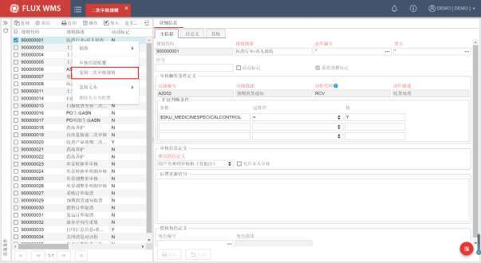

- **跨系统用户验证**

LDAP 域用户密码验证等账号集中管理的模式中，二次审核过程中，录入用户名密码环节，支持访问客户 LDAP 服务器，校验账号密码有效性。

## 8.21. 盘点计划规则

循环盘点是常用库存盘点方式之一，但不同的业务场景对循环盘点有不同要求，例如希望按库位维度计算需要盘点的比例，或者要求按产品维度生成循环盘点任务。

为方便不同业务场景执行盘点的需要，可以通过系统的“盘点计划规则”功能，配置盘点具体要求。定时器在预设的时间，根据规则检查符合条件的库存，并相应生成盘点任务。

- **盘点计划规则**

- 选择主菜单“业务规则”模块下的“盘点计划规则”功能。

- 通过点击“查询条件”页签的【查询】按钮，可以查询已维护的规则内容，或者通过【新增】按钮维护新的规则记录：

<!-- 原 PDF 第 457 页 -->

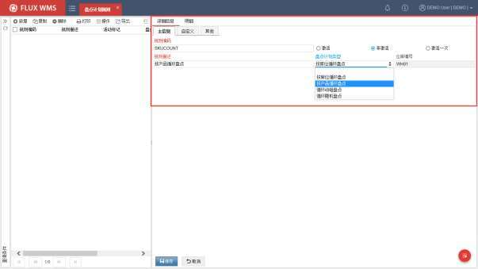

规则编码－规则 ID，用户自行录入，不可重复，否则会提示报错记录已经存在。

激活/非激活/激活一次－单选项，此规则是否生效控制。如果只需要特定时间执行一次，则选择“激活一次”，定时器执行成功后系统会将此规则更新为“非激活”。

规则描述－规则名称、说明信息。

盘点计划类型－循环盘点执行的模式，例如每次循环盘点 10%的量，是取产品的 10%，还是取 10%的库位生成盘点任务。下拉列表内容，取值自系统代码 CYCLE_COUNT_TYPE（盘点计划类型）。不同的盘点计划类型，后续在明细页签部分，可供配置的筛选条件字段会有所不同，例如按库位循环盘点，筛选条件是针对库位的库区、区域等字段；而按产品循环盘点，则筛选条件是针对产品的货物类型、产品组等字段。具体可参考后续明细页签部分的介绍。

仓库编号－规则生效仓库。新增时，默认为当前仓库。

- 点击【保存】按钮，保存规则主信息维护内容。

- 切换到“明细”页签，点击【新增】按钮，在界面下半部分的“主信息”子页签进一步维护规则下的控制要求细节：

<!-- 原 PDF 第 458 页 -->

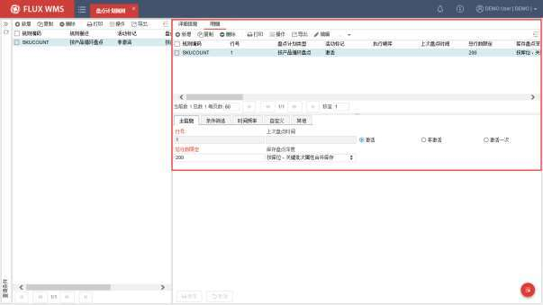

行号－规则明细行的行号，人工录入，系统根据行号排序逐一按规则设置要求对库存进行检查筛选。

上次盘点时间－系统根据此行明细执行盘点任务生成的时间。

激活/非激活/激活一次－单选项，此规则明细行是否生效，或者执行一次后即失效。

库存盘点深度－生成盘点任务时，库存盘点的深度要求，即合并同类记录的维度。例如按库位合并，则忽略产品区别，仅核对库位内的总数量，生成的盘点任务仅显示库位、每个库位内的总数量；而按关键批次属性合并，则忽略非关键批次属性信息。规则中的盘点深度选择，与库存盘点单的盘点深度选择逻辑一致。

- 在“条件筛选”子页签，维护此行规则明细生成盘点任务时的库存筛选条件。具体条件字段内容，根据规则“详细信息”中维护的“盘点计划类型”选择不同，显示也有所不同：

- 按库位循环盘点

<!-- 原 PDF 第 459 页 -->

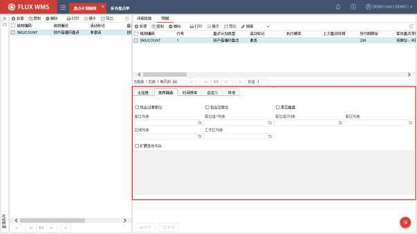

包含过渡库位－过渡库位中的库存，是否需要进行盘点。部分业务场景中，过渡库位中的已收货、待上架库存，不参与循环盘点，因此系统提供配置选项。

包含空库位－没有库存记录的空库位，是否也生成盘点任务，在盘点时要求作业人员确认的确是空库位。

是否盲盘－是按盲盘要求，生成盘点任务。盲盘情况下，盘点任务中默认不显示系统库存数量，而需要人工录入、确认实际库存数量。

库位列表/库位组 1列表/库位组 2列表/库区列表/区域列表/工作区列表－与库位相关的条件字段。点击多条件按钮后，会弹出如下对话框，可以直接复制粘贴多个条件内容（例如多个不同的库位），或者通过 Excel导入多个不同条件。支持精确查询模式，和模糊查询模式，确认后，系统会把条件内容，带入到对应字段中。

<!-- 原 PDF 第 460 页 -->

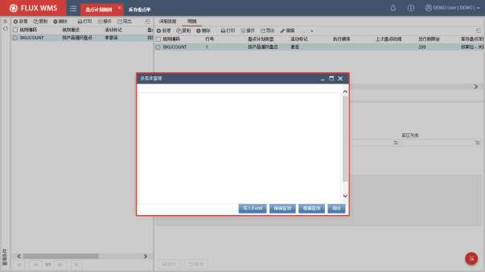

扩展条件 SQL－勾选后，支持在下方字段框中，直接录入 SQL 语句作为盘点任务生成的库存筛选条件。

- 按产品循环盘点

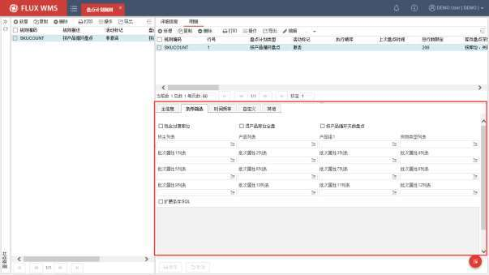

<!-- 原 PDF 第 461 页 -->

包含过渡库位－过渡库位中的库存，是否需要进行盘点。部分业务场景中，过渡库位中的已收货、待上架库存，不参与循环盘点，因此系统提供配置选项。

混产品库位全盘－对于产品混放的库位，有可能计算生成循环盘点时，只有部分库存被纳入盘点任务范围。例如一个库位混放 4种 SKU，其中 1个 SKU被随机到需要进行盘点。如果仅盘点这一种产品，寻找区分具体是哪个 SKU 的工作量并不小，并且容易存在误差，因此系统提供配置，可以考虑库位中只要有一种 SKU 被纳入盘点范围，则自动将此库位内全部库存纳入盘点范围，整个库位盘点，有利于提高盘点准确度，并且工作量的增加并不很多。

按产品循环天数盘点－如勾选，系统将根据产品的上次盘点日期、所属循环盘点等级、盘点周期天数，计算应盘产品，即标准循环盘点逻辑，（上次盘点日期+盘点周期天数<=当前日期）的产品，根据相应产品生成盘点任务。

货主列表－可选择多个不同货主，在指定的货主范围内生成盘点任务。未选择则是不限制货主。

产品列表、库位组 1、货物类型列表、批次属性列表－盘点库存筛选条件，均支持多选，类似货主列表，点击按钮在二级窗口中进行记录选择。

扩展条件 SQL－勾选后，支持在下方字段框中，直接录入 SQL 语句作为盘点任务生成的库存筛选条件。

- 循环动碰盘点

动碰盘点即对指定时间段内有过操作的库存记录进行盘点；但针对那些操作盘点，可以根据需要进行配置。例如只盘点有过进出库操作的库存，忽略移库操作。

盘点计划规则的动碰盘点时间段，默认为是上次盘点计划执行的时间到本次执行时间之间；动碰盘点类型，可配置的筛选添加字段主要有事务类型选择、库位相关条件，如下图所示：

<!-- 原 PDF 第 462 页 -->

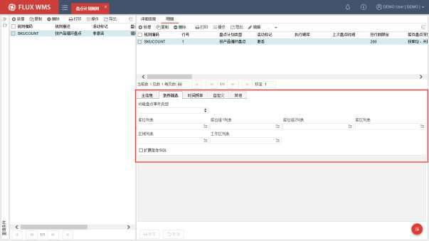

- 循环随机盘点

随机盘点，可以限定任务数量，在符合条件的库位范围内容随机抽取记录生成盘点任务。

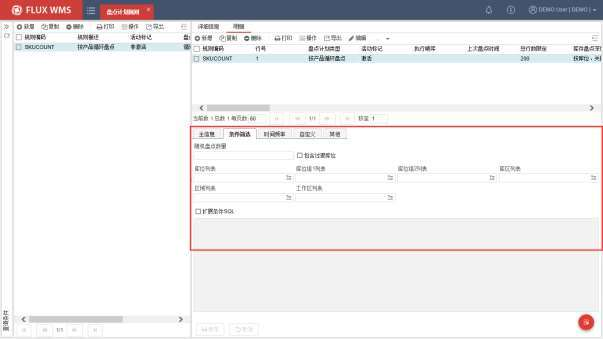

- 在“时间频率”子页签，维护此行规则明细执行库存筛选、生成盘点任务的定时器

<!-- 原 PDF 第 463 页 -->

执行频率要求：

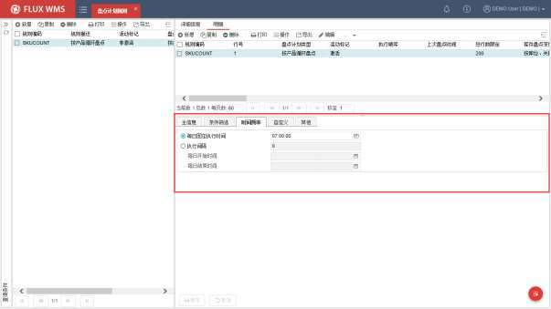

每日固定执行时间－每天在指定的相同时间执行。如图配置为每天早上 7点运行处理。

执行间隔－在所配置的起止时间范围内，按一定的时间间隔规律执行。例如从早上 7点到晚上 7 点，每 4小时（配置为 240分钟）执行一次。

- **计划执行**

在【业务规则】-【定时器】中，启用盘点计划定时器（COU_PLN），定时检查盘点计划规则明细，根据时间频率设置，按明细行要求进行盘点任务生成。例如盘点计划定时器配置为每小时执行一次，检查当前时点，达到时间要求、需要执行的盘点计划规则明细行有哪些，逐一调用执行处理。

具体处理内容为：

- 自动创建库存盘点单，并将对应规则明细行中的设置、条件筛选内容（例如盘点深度、货物类型限定范围等）带入到盘点单对应字段，作为限定条件。

- 根据盘点计划规则生成的库存盘点单，默认跳过预检（即 PRECHECK默认为 Y）。

- 系统自动根据库存盘点单，生成盘点任务。

后续盘点操作执行，同标准盘点单操作，可以选择纸面盘点、 RF 盘点等不同操作模式。具体盘点单功能介绍，可参考【库存管理】-【库存盘点单】章节的介绍。

- **鼠标右键功能**

<!-- 原 PDF 第 464 页 -->

明细页签，鼠标右键菜单功能为：

- 批量复制

点击后，弹出对话框，选择字段，点击【确认】按钮后，可以将当前定位的明细行对应字段内容，复制给此规则下的其他明细行对应字段。支持多选、全选字段。

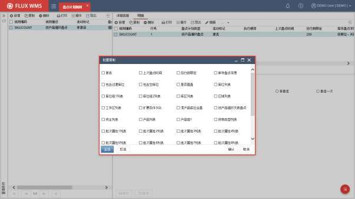

- 生成盘点任务

未到时间频率设定的定时器执行时间点情况下，可以通过鼠标右键的“生成盘点任务”功能，人工触发当前规则明细行，执行盘点任务生成处理。

处理步骤与定时器执行相同，系统根据规则内容，生成库存盘点单，再根据库存盘点单自动生成盘点任务。

## 8.22. 自动预约规则

月台预约时，不同供应商有时会有不同需求。例如某供应商惯例每周一上午送货，期望能够优先为其预留月台卸货。或者有些供应商由于单次送货量大，希望能够在较早的时段卸货，以免临近下班时来不及完成操作。还有的供应商由于货物保质期较短，或者配合仓库内的送货策略要求，一定要在早上完成收货。这些各自不同的需求，通过自动预约规则功能进行设置，在月台预约计算时进行考量。

<!-- 原 PDF 第 465 页 -->

- **自动预约规则**

- 选择主菜单“业务规则”下的“自动预约规则”功能。

- 通过【查询】按钮，可以查询已维护的规则内容，或者通过【新增】按钮维护新的规则记录：

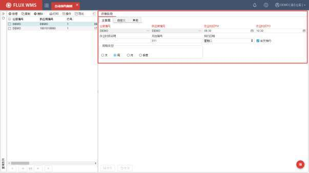

仓库编号－当前仓库代码。

供应商编号－此规则适用的供应商对应代码，可通过浏览按钮在对话框中查询已维护的供应商。

作业时段 FM/TO－对于仅能在指定时间内进行操作的供应商，需要维护可作业时间段的开始、结束时间。为配置规则的供应商则不限制可以操作时间。同一供应商的多条规则时段不能重叠，例如 6点~7 点、7 点~8 点两条规则可以，但 6点~7 点，7 点半~8 点半两条规则系统会提示时段重叠。同时作业时段长度，需要是月台作业最小时间段（参数 DCK_MIN_TIM中设置）的整数倍。

作业时段说明－规则说明信息。

月台编号－周期操作模式下，指定的预留月台号码。例如某供应商固定每周一上午送货，其对应自动预约规则中设置的预留月台，其他供应商进行月台预约时，不参与计算。

预约日期－仅当周期类型为“周”时显示此字段，每周的具体星期几需要给指定供应商

<!-- 原 PDF 第 466 页 -->

预留月台。

当天预约－是否允许此供应商在送货当天进行预约。

周期类型－

- 点击【保存】按钮，完成规则维护。

后续【预约】功能模块中，进行供应商送货预约时，会根据供应商对应的自动预约规则设置，进行月台预约计算。未设置规则的供应商，即无特殊限制，根据月台占用情况进行计算即可。

## 8.23. 月台分配规则

在预约管理流程中，车辆抵达、入园登记完成后，需要系统临时计算、分配货物装卸所用的月台。计算时所遵循的、不同入园单类型、车辆类型、供应商、承运人、货类、月台类型情况下，对应匹配月台要求，则通过“月台分配规则”功能来设置。

按规则分配到的月台，记录到入园单中（可参考【预约】-【入园登记】章节的介绍）。

- **月台分配规则**

- 选择主菜单“业务规则”下的“月台分配规则”功能。

- 通过【查询】按钮，可以查询已维护的规则内容，或者通过【新增】按钮维护新的规则记录：

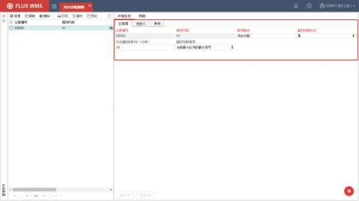

<!-- 原 PDF 第 467 页 -->

*图8-23-1（图像未能从 PDF 对象中直接提取）*

仓库编号－当前仓库代码。

规则代码－人工维护的规则 ID。

规则描述－规则名称、说明信息。

超时控制标记－车辆抵达时，是否需要进行超时控制。例如入园单中预约的时间为上午8 点~10点，如果车辆 11点抵达，是否要进行超时控制管理，重新分派月台，或者重新排队，还是仍旧允许在原定月台进行装卸操作。

允许超时的时长（分）－预约时段的宽限时间，例如预约时段为 8~10点，10:15车辆抵达允许操作，但 12 点才到就需要重新排队。录入内容为分钟数值，仅可录入整数。

超时控制规则－即超时重新排队的规则选择。下拉列表内容在系统代码DOCK_TIMEOUT_RULE 中进行配置。目前提供的选择项有：

✓ 当前队列最大序号：入园单的排队队列不变，但序号降为当前队列的最大序号，排到现有其他入园单之后。即队列内正常抵达的车辆操作完成，再操作迟到的车辆。

✓ 当前最大队列的最大序号：入园单的排队队列改为最大队列，序号改为最大队列的最大序号。即多个月台，全部正常抵达的车辆操作完成，再操作迟到的车辆。最后安排的月台可能与原本预约到的月台不同。

- 点击【保存】按钮，完成主信息的维护。

- 在“明细”页签，点击【新增】按钮，维护规则明细：

<!-- 原 PDF 第 468 页 -->

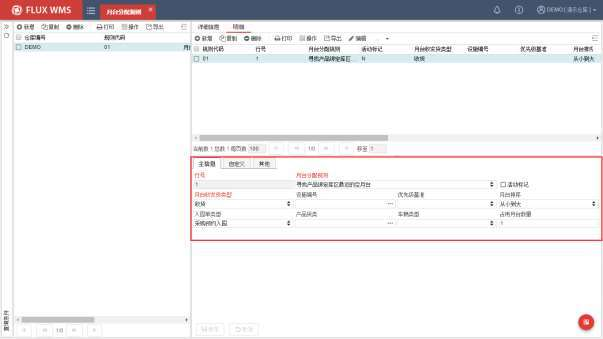

行号－规则明细行号。

月台分配规则－月台分配执行的原则逻辑。下拉列表内容取值自系统代码DOCK_ALLOCATION_RULE，提供的可选逻辑有：

✓ 寻找空月台：只要是空闲月台，均可用。通常用在月台分布比较集中的仓库中。

✓ 寻找产品绑定库区最近的空月台：适用与分区存储产品的仓库，或则有多栋建筑分别存放不同产品的仓库，需要在距离产品存储库区比较近的月台进行装卸。例如仓库分常温仓库楼、低温仓库楼、冷冻仓库楼，每幢楼下有多个月台的场景，到产品存储的这幢楼下的就近月台进行装卸操作。

✓ 离集货区最近的空月台：基于集货区管理的原则，就近找月台。

活动标记－是否使用中的规则记录。

月台收发货类型－需要限定在收货月台操作，还是发货月台操作，或者不做限制。下拉列表内容在系统代码 DOCK_OPERATION_TYPE 中进行维护。收发货类型与“月台分配规则”有联动关系，只有选择了“月台分配规则”之后，才能选择收发货类型。例如“离集货区最近的空月台”只能对应发货类别的操作才能生效。

设施编号－月台对应设施限定。对于多个设施的大型物流中心场景，在月台功能中会维护不同设施对应的不同月台，此次配置此规则明细行适用与哪个设施的对应月台。

<!-- 原 PDF 第 469 页 -->

优先级基准－客户档案中，会设置普通、VIP 等级，优先安排 VIP客户。但一个订单，按承运人的等级考虑是否优先，还是按供应商安排优先，需要进行基准的指定。下拉列表内容在系统代码 CUS_TYP中进行维护。

月台排序－按月台号正序排序还是倒序排序选择。

入园单类型－适用与此规则明细行的入园单类型。可以实现不同类型入园单，按不同基准排序的管理要求。例如采购入库按供应商排优先级，退货入库按承运人安排优先次序。

产品货类－货物类型选择，可以指定某些特殊货类（支持多选）的产品可以在特殊月台操作。例如冷冻类产品，需要在冷库楼下的月台进行装卸，按产品货类、设施进行指定。

车辆类型－车辆类型选择。不同类型的车辆，对月台的高度有不同的适配范围要求，可以进行指定配置。

占用月台数量－大批量货物、多辆车运载的订单情况，可能一次需要多个月台同时进行操作。但如果全部月台提供给一个订单作业，对其他订单操作影响太大。因此通常会限制单个超大订单，一次性占用月台个数的上限。例如一次可以分配 3 个月台，第 4辆车需要排队等前面车辆装卸完成再做操作。

- 点击【保存】按钮，完成规则明细的维护。

- **月台分配**

WMS 系统提供通过定时器定时计算、分配月台，以及临时计算 2种月台分配模式。

入园单中，“拜访”类型的入园单不参与月台分配。

- 定时器

通过配置【业务规则】- 【定时器】中预设的标准定时器，“入园月台分配”（ARRIVAL_DOCK_ALLOCATION），由定时器在指定时间，调用月台分配规则，根据设置给入园单分配月台，并更新到入园单单头。

- 按单执行

按对应入园单获取相关信息（例如车辆类型、供应商/承运人/货主等级、数量最大的产品货类等），与规则明细行进行匹配，按行号顺序寻找满足规则限制条件的空月台。

找到合适的月台，则将月台号更新到入园单单头的“月台”字段中。如果多个月台，按规则的“月台排序”顺序，逗号隔开组合后写入。并更新入园单单头的“原因”字段内容为“分配成功”。

- **右键功能**

- 复制（连同明细）。

<!-- 原 PDF 第 470 页 -->

系统标准【复制】按钮，复制记录仅涉及当前记录，不包含记录对应明细。

但多数情况下，进行规则配置时，经常存在“类似”规则的配置要求，希望复制生成新规则时，带入明细记录，这样简单修改条件，即可使用。因此系统提供了独立的右键功能，连同明细一起复制规则记录。

点击功能项后，系统显示如下对话框：

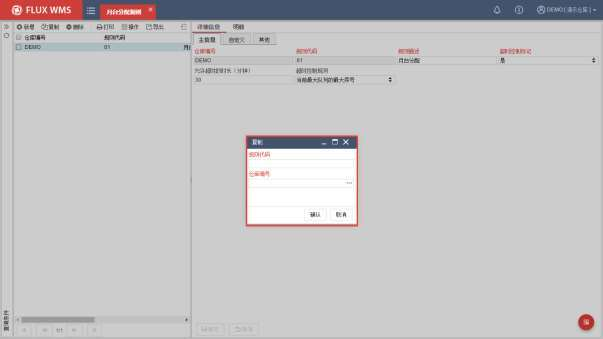

输入新规则代码、生效的仓库编号，确认后，系统根据所选样本记录，复制生成带有全部明细规则的新规则记录。

## 8.24. 订单分配规则

无论是预配+分配的分配规则 1.0还是一步分配的分配规则 2.0，规则都是定义到 SKU 一级，一个SKU 定义一个分配规则。即使在订单明细里指定不同的规则也很难灵活地指定库区（或者区域、工作区、库位组等）分配，例如先从 A库区分配，然后再从 B 库区分配，因此要采用一个新的类似上架规则的分步骤寻找库存的规则。

FLUX WMS系统通过“订单分配规则 3.0”功能，能够根据事先定义的分配时间计划，根据不同的订单类型、订单明细行、包装单位等订单和产品的信息匹配不同的分配规则，在不同的库区（区域、工作区、库位组等）以递进式的方式分配库存

<!-- 原 PDF 第 471 页 -->

分配规则 3.0并不会完全替代 1.0，对于需要先锁定批次再分配库存的业务场景，仍然需要使用

1. 0的预配功能。

与分配规则 3.0相关的功能包括：

- 订单分配规则

- 订单分配选择器

- 订单分配计划

配置 3.0版本的“订单分配规则”后，通过“订单分配选择器”，选择合适的订单，并将订单行的分配规则，更新为指定的规则；通过“订单分配计划”，按照指定的条件筛选订单，并对订单进行分配。

- **订单分配规则**

- 选择主菜单“业务规则”下的“订单分配规则”功能。

- 通过点击【查询】按钮查询已有规则记录，或者点击【新增】按钮创建新规则：

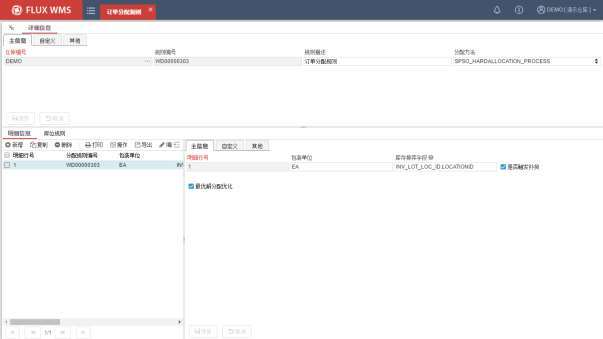

仓库编号－规则生效的仓库代码。

规则编号－规则代码，由系统根据流水号规则生成。

规则描述－规则描述信息。

<!-- 原 PDF 第 472 页 -->

分配方法－系统提供的分配处理选择。下拉列表内容在系统代码 ALC_TYP（分配方法类型）中配置。

- 点击【保存】按钮，保存规则主信息。

- 在明细信息部分，点击【新增】按钮，维护规则明细：

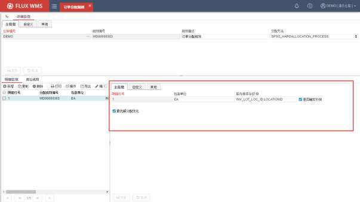

明细行号－规则明细行号，系统在分配时根据行号次序依次进行匹配分配，即先按行号1 的要求对订单明细行进行检查匹配，相符，根据规则要求进行分配；不相符，或者没能完全分配，再按行号 2的要求对订单明细行进行匹配检查、分配，逐行进行。

包装单位－执行此行的规则分配时的分配单位，例如按整托、整箱分配，还是按 EA拆零分配。类似预配规则中的包装等级选择效果。

库存排序字段－符合条件的库存的排序条件字段。撰写格式为“表名 .字段名”，具体字段名可在【数据字典】功能中查询。

是否触发补货－分配同时，是否进行补货计算。

最优解分配优化－是否按照最优解逻辑进行分配优化。最优解即选择最匹配、最少拣货次数的拣货库位或库位组合，来满足订单需要，但分配计算量大，会比较耗时。

- 如果有库位限定要求，在“库位规则”页签，进一步添加对候选库位的要 求条件。一行规则明细，可对应多行库位规则明细，系统按“子明细行号”逐行匹配分配。

<!-- 原 PDF 第 473 页 -->

例如先按第一行，在地面平仓库位分配，未能完全分配，再按第二行，到隔板货架分配。未维护库位规则，意味着整个仓库内的库存都在可选范围内，不受库位条件约束：

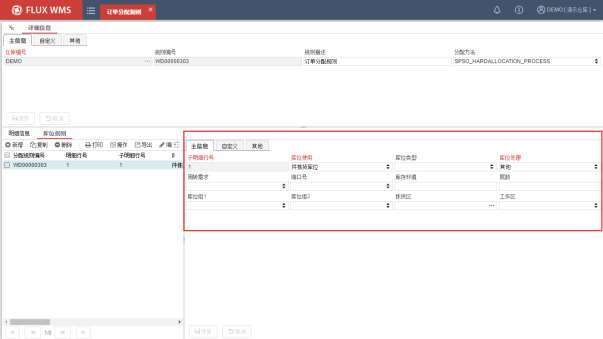

- 点击【保存】按钮，完成规则设置。

## 8.25. 越库规则

越库，也即 Cross docking，指得是货物入库时，就根据已有的出库指令要求，直接流向出库分拣处理，如打包装车出库，减少了正常流程中的上架、拣货操作，降低工作量，提升作业效率，同时减少所占用的仓库存储空间，对作业成本也有很大幅度的降低。

实际应用场景中，先有出库订单，再根据发货要求进行入库采购，或者送货安排的情况也很常见。

相应的，越库操作需要有较高的物流供应链协同管理支持，例如入库时，需要对应出库指令已下达才能按出库要求直接分拣，否则指令衔接不畅，就只能进行正常的入库上架操作。

越库过程中，通常上游系统会指定可以进行越库操作的入库、出库单据，接口下达时，单据中即带有越库标记。也有些场景是由 WMS 判断可越库订单，然后更新越库标记，即具体判断逻辑根据现场管理需要维护在接口条件中，或者 WMS 自定义处理逻辑中。

<!-- 原 PDF 第 474 页 -->

越库操作过程中，入库时根据匹配的出库单据，进行分货是作业的重要环节。

系统通过越库规则功能，配置入库订单匹配出库单时的排序、范围等条件，收货或者上架后，根据越库规则的要求，查询合适的订单，并按排序要求依次分配，后续按托盘为单位生成播种任务。

- **越库规则**

- 选择主菜单“业务规则”下的“越库规则”功能。

- 通过点击【查询】按钮查询已有规则记录，或者点击【新增】按钮创建新规则：

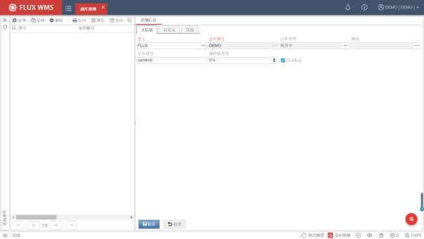

货主－规则生效的货主代码。

仓库编号－规则生效的仓库代码。

订单类型－规则生效的发运订单类型条件。

路线－规则生效的发运订单所属路线条件。

订单排序－入库订单，匹配对应越库发运订单时，用来对订单进行排序的字段配置。也即 SO排序字段。

播种墙类型－生成分货播种任务时，从指定的播种墙类型中，分派播种库位。

活动标记－规则是否生效。

<!-- 原 PDF 第 475 页 -->

- 点击【保存】按钮，保存规则设置。

- **越库处理**

对于接口下达时，带有“越库标记”的订单，入库单 ASN 会指定收货到“CROSSDOCK”库位中；发运订单 SO，会默认增加从“CROSSDOCK”拣货区指定分配的条件。

入库单收货到“CROSSDOCK”库位，或者有上架任务的情况下，上架完成后，系统进行越库分配计算，根据对应仓库、货主的越库规则中指定的订单类型、路线条件，筛选合适的带有“越库标记”的发运订单，按“订单排序”条件进行排序后的订单顺序，依次执行分配，并根据指定的播种墙类型，计算生成播种任务。

此类越库操作，通常大批量到货，使用托盘管理。对于托盘上的库存，相应以托盘为单位生成播种任务，进行播种分货。

## 8.26. 箱型规则

箱型规则，主要用于维护订单计算箱类、箱型、箱类过程中，不同单证类型的箱类、箱型匹配要求。

- **箱型规则**

- 选择主菜单“业务规则”下的“箱型规则”功能。

- 通过点击【查询】按钮查询已有规则记录，或者点击【新增】按钮创建新规则：

<!-- 原 PDF 第 476 页 -->

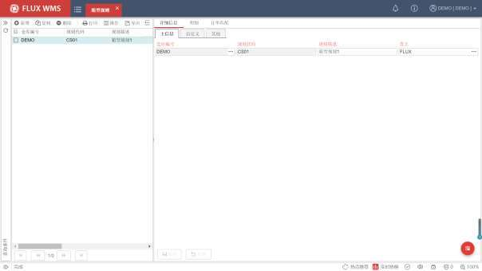

仓库编号－规则生效的仓库代码。

规则代码－规则 ID。

规则描述－规则名称描述。

货主－规则生效的货主代码。

- 点击【保存】按钮，保存规则主信息。需要注意的是，同一仓库、同一货主，只能保存一条主规则记录。具体不同的管理设置，在“明细”页签进行配置。

- 在明细信息部分，点击【新增】按钮，维护规则明细，配置不同订单类型下的管理模式：

<!-- 原 PDF 第 477 页 -->

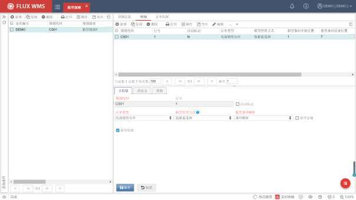

规则代码－规则 ID，根据规则头信息默认显示。

行号－由系统自动生成的规则明细行行号。

活动标记－规则是否生效。

订单类型－此行规则明细匹配何种发运订单类型生效。支持多选。保存时系统会校验是否已存在相同订单类型规则明细。

箱型管理方式－箱型选择的操作节点，或者计算方式的选择。不同的管理方式，匹配需要录入的内容也各不相同。具体下拉选择项内容可参考后续介绍。

箱型条码解析－扫描采集箱型的场景中，对箱型条码的解析处理模式。具体下拉选择项内容可参考后续介绍。

箱型必输－箱型管理方式指定的作业环节中，箱型信息是否必须计算获取到，或者人工录入得到。

箱型校验－作业中是否需要在计算得到箱型的基础上，扫描实际装箱的箱型条码进行校验。需要校验的情况下，即使计算获取到箱型，光标也会定位在箱型字段或者弹出箱型对话框，等待扫描校验。此项配置，针对【出库复核】、【单品复核】、【N+X 订单复核】功能生效。

- 点击【保存】按钮，保存规则明细。

<!-- 原 PDF 第 478 页 -->

- 在“订单匹配”页签，进一步设置不同场景条件下所使用的箱类、箱型。计算箱型时，符合条件的订单，使用所维护的指定箱类、箱型：

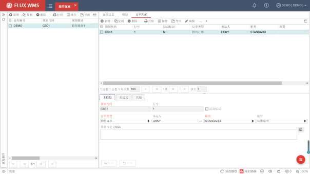

规则代码－规则 ID，根据规则头信息默认显示。

行号－匹配规则的行号，由系统生成。

活动标记－规则是否生效。

订单类型－匹配规则的订单类型条件。

承运人－为承运人指定某箱类、箱型情况下需要维护的承运人条件。

箱类－箱型的大类。

箱型－符合条件的订单中，所使用的具体箱型。箱类必须维护，但箱型可以现场选择，或者根据体积等条件计算得到。

规则自定义 SQL－自定义的订单匹配规则条件。可以通过快捷按钮进行选择：

<!-- 原 PDF 第 479 页 -->

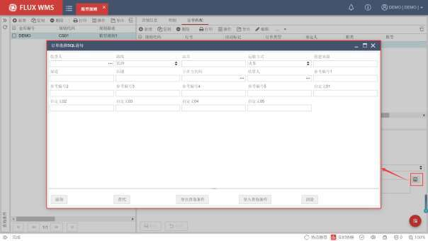

指定条件确认后，由系统生成相应 SQL 语句。使用【添加】按钮确认，在原有 SQL 语句后补充；使用【替代】按钮，则覆盖原有 SQL 语句：

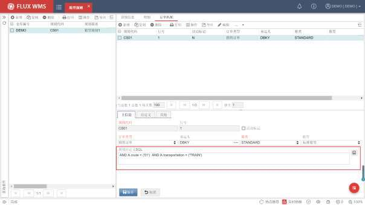

<!-- 原 PDF 第 480 页 -->

- 点击【保存】按钮，完成规则维护。

- **配置项说明**

- 箱型管理方式

系统需要进行箱型获取的处理方式配置，并对复核环节的光标跳转次序有影响：

- 装箱前选择

先选择箱型，再开始具体复核操作。

复核时，扫描单号（或者波次号、箱号）查询记录之后，光标即定位在箱型字段，通过录入或下拉框选择箱型后，光标再跳转到 SKU字段，进行复核扫描操作。

- 装箱后选择

出库复核界面扫描波次号/箱号/订单号之后，光标跳转至 SKU，复核完毕后，触发弹出“箱型”扫描框。用户扫描“箱型”后（输入/选择具体箱型并回车后），自动关闭该弹出框，并记录箱型。

- 自动计算

由系统计算推荐箱类箱型。计算成功情况下，光标无需定位到“箱型”字段。

自动计算方式下，系统会显示“箱型计算算法”供进一步配置选择：

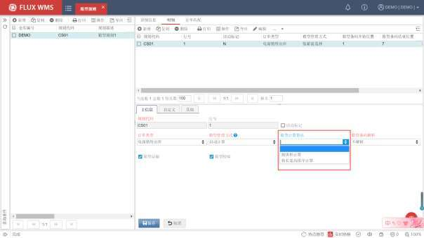

<!-- 原 PDF 第 481 页 -->

✓ 按体积计算

根据待复核记录的总体积进行箱型计算。待复核记录根据按箱复核、按订单复核、按波次复核，获取范围不同。计算箱型时，取指定箱类下，体积最接近且大于待复核体积的箱型；

如果待复核体积大于此箱类下最大的箱型的体积，则提示“体积超过最大的箱型，请分多箱处理”，同时推荐体积最大箱型。

✓ 将长宽高排序计算

根据产品的尺寸进行箱型计算。通常用在单品复核场景，产品体积近似，但长宽高差别较大的情况。

取获取订单需求 SKU 的尺寸信息，将长宽高按大中小排序；

分别比较箱型和产品的大中小尺寸，需保证纸箱的大中小尺寸都比商品尺寸大，找出符合尺寸的纸箱集合；

将符合的箱型，分别计算箱体积与商品体积的差值；差值最小的纸箱，即是推荐的纸箱。

若产品的大中小尺寸大于此箱类下最大的箱型的长宽高大中小尺寸，则提示“产品超过最大的箱型，请分多箱处理”，推荐体积最大（按长宽高大中小排序后的）箱型。

- 忽略

此模式下，忽略箱型采集。获得新箱号后，光标定位于 SKU 扫描录入框，直接进行产品扫描。需要提醒的是，配置为“忽略”方式，会一并忽略“箱型校验”的选择。

- 箱型条码解析

用于配置扫描采集箱型的场景中，对箱型条码的解析处理模式。系统提供的选择项有：

- 不解析

不启用解析，扫描到什么条码即使用什么条码内容。

- 条码解析

使用 SP 解析模式，对采集到的条码信息进行个性化解析处理，解析得到的箱型，输出显示在界面上。

使用此模式，需要在【标准业务扩展配置】中，启用共用的动作代码 SCANTRACEID（扫描跟踪号条码），由 IT部门在对应的 SP（例如 SPBCD_TraceId，可在【标准业务扩展配置】中配置指定）中增加对于“箱型”进行解析输出的处理逻辑。相应 $operation参数的传参内容为CHK_CARTONID。

<!-- 原 PDF 第 482 页 -->

- 箱条码包含箱型

是一种仅截取条码固定位数的简单解析模式。

选择此模式，规则界面会显示对应的“箱型条码开始位置”、“箱型条码结束位置”字段，用于配置箱型信息在箱条码中的起止位置。

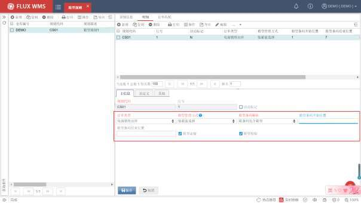

作业时，在出库复核的新箱号字段，扫描或者输入新箱号后，系统根据规则截取箱号作为箱型代码写入“箱型”字段中。

- 继承拣货箱型

出库复核功能中，从分配明细获取箱型信息的作业模式。执行的前提条件是：所匹配的规则明细，“箱型管理方式”配置为“装箱前选择”并且“箱条码解析”配置为“继承拣货箱型”。

此场景中，不会进行箱型计算，而是直接读取分配明细的箱型（CartonID）使用。

✓ 如果分配明细箱型不为空，带入出库复核界面，无需校验的情况下，光标不用在此字段停留。

✓ 如果分配明细箱型为空，光标处理同“装箱前选择”，光标先定位在箱型字段选择后再跳转到产品字段进行复核。

- **箱型获取逻辑**

<!-- 原 PDF 第 483 页 -->

获取箱型信息时，如果配置了“继承拣货箱型”，则优先取分配明细中指定的箱型。

未指定“继承拣货箱型”情况下，会按步骤进行箱类、箱型计算：

- STEP1，优先从订单头，获取订单指定的箱类、箱型。

- 系统会对订单指定箱类、箱型进行有效性校验。需要是在【基础设置】-【箱型】功能中维护过的箱类、箱型，才能正常使用。

- 如果订单中指定了箱类，但没有指定箱型，则根据指定箱类，进入后续的箱型计算处理。

- STEP2，按订单类型、承运人条件，以及扩展 SQL中指定的条件与【箱型规则】功能“订单匹配”中配置的规则明细做匹配检查，获取规则指定的箱类、箱型。

- 如果规则明细中，只指定了箱类，没有指定箱型，使用指定箱类进入后续的箱型计算环节。此处指定的箱类，优先于订单头指定的箱类。

- 匹配不到箱类，或者指定的箱类无效，则报错提示：无效的箱型设置，请检查基础设置-装箱的设置。同时默认使用’STANDARD’的箱类。

- STEP3，根据订单类型匹配规则明细行，确认箱型管理方式、解析模式。

- 非自动计算模式下，在复核功能界面，显示指定箱类下的箱型信息，人工选择。或者扫描箱型条码进行获取。

- 根据箱条码简单解析情况下，则在扫描新箱号时解析获得箱型 ID。

- 自动计算模式下，进入箱型计算步骤。

- STEP4，箱型计算：

- 使用前序步骤确定的箱类，在指定箱类范围内，计算匹配箱型。

- 根据“箱型计算算法“，按体积，或者按尺寸进行箱型计算，并将结果显示在复核操作界面。

## 8.27. 拣货组箱规则

输送线或其他使用标准周转箱进行拣货操作的场景，通常会提前根据拣货任务计算所需周转箱个数、每箱关联哪些拣货任务，后续按箱进行拣货操作。整箱、整托盘货品可以直接关联周转箱，或者生成流水号作为“拣货箱号”，但对于零散货物，例如 EA级别散件、IP 内包装级别的小包装货品，会需要多个任务使用一个周转箱拣货、容纳，称为组箱。

<!-- 原 PDF 第 484 页 -->

由于不同客户、不同仓库在不同的业务场景中，货物合适的周转箱的计算要求不同，因此，通过【拣货组箱规则】功能，维护不同场景下，组箱计算的节点、方式，周转箱选择要求等相关要求，由系统结合周转箱的大小，对分配任务记录进行计算，分为若干任务段，派箱时将周转箱绑定任务段进行拣货。

- **拣货组箱规则**

- 选择主菜单“业务规则”下的“ 拣货组箱规则”功能。

- 通过点击【查询】按钮查询已有规则记录，或者点击【新增】按钮创建新规则，首先在“详细信息”部分的“主信息”页签，维护执行此规则的匹配条件信息：

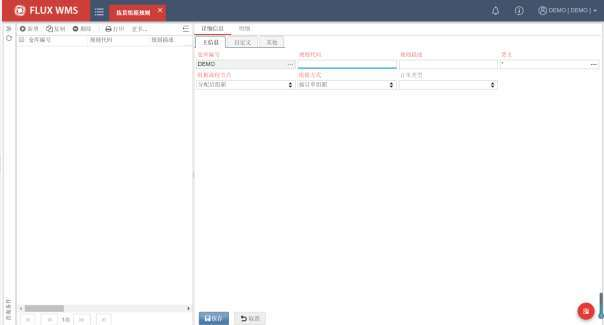

仓库编号－规则生效的仓库代码。默认为当前仓库 ID。

规则代码－规则 ID。

规则描述－规则名称描述。

货主－规则生效的货主代码。默认为*，代表对所有货主生效的公共记录。

组箱流程节点－进行组箱计算的作业节点要求，也即订单/波次的操作进度条件。系统提供的选项有：

✓ 分配后组箱－对波次或者订单已经分配（即状态非创建的），并且没有进行过组箱的单据（组箱标记为 N），进行组箱计算。

<!-- 原 PDF 第 485 页 -->

✓ 订单完全分配后组箱－对完全分配（订单状态为“完全分配”并且终止分配标记为“F-分配完成”的订单）或者视同完全分配的订单（订单状态不是“完全分配”，但终止分配标记为“T-终止分配”），进行组箱计算。

✓ 波次完全分配后组箱－对于波次中所有订单都完全分配（订单终止分配标记为“F-分配完成”，也即全部订单数量已分配）或者视同完全分配（有未分配明细行，但终止分配标记为“T-终止分配”）情况下的波次，进行组箱计算。

组箱方式－计算组箱时，根据订单进行单独计算，还是根据波次内的拣货任务整体排序、分组进行组箱计算。按波次组箱，适合播种（二次分拣）或者以波次合并出库的作业流程。

波次类型－当“组箱方式”选择为“按波次组箱”时，界面显示“波次类型”字段，可选择执行当前组箱规则的波次类型，下拉列表支持多选、模糊查询，显示的选项是【系统代码】功能中维护的类型值。

订单类型－当“组箱方式”选择为“按订单组箱”时，界面显示“订单类型”字段，可选择执行当前组箱规则的订单类型，支持多选、模糊查询。

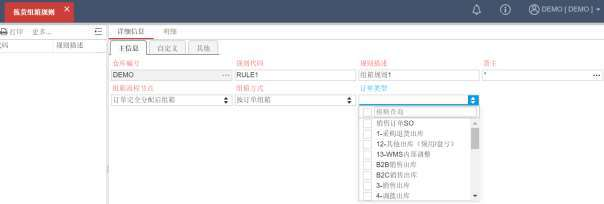

- 点击【保存】按钮，保存规则主信息。

- 在明细信息部分，点击【新增】按钮，维护规则明细，配置组箱计算时的具体要求：

<!-- 原 PDF 第 486 页 -->

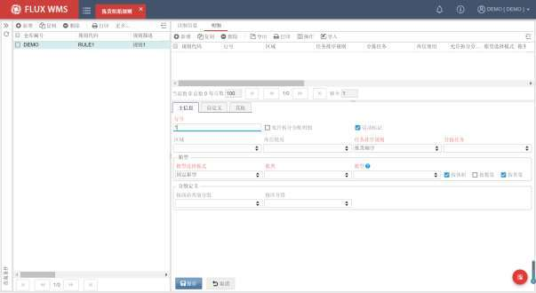

行号－规则明细行号。

按订单单元装箱－仅在规则的“组箱方式”为“按波次组箱”情况下显示。波次组箱过程中，会先按订单进行排序，同一订单的拣货任务集中组箱，即一个订单的多行分配明细不能拆分到多个箱子，但一个箱子可以混多个订单。启用此模式，后续“箱型选择模式”会默认为“固定箱型”模式，并且“分组定义”字段全部隐藏，也即按订单进行分组。

允许拆分分配明细－计算时，一行分配明细数量是否整体计算到一个周转箱内。

✓ 如果单行分配明细，已经超过周转箱整体容积，会强制拆分计算到多箱；小于周转箱整体容积的情况下，根据勾选情况判断，周转箱内剩余空间不足时是否需要另找一个新的周转箱。

✓ 允许拆分，则按箱内剩余容量，将分配明细拆分为 2行，此箱装满，剩余数量计算到新箱；

✓ 如果不允许拆分，则整行分配明细计算到一个新箱。

活动标记－此行规则明细是否生效。

区域－此行规则明细，针对生效的仓库区域，也即系统支持不同区域执行不同的组箱计算要求，仅指定区域内的拣货任务按当前规则明细进行组箱计算。下拉列表支持多选、全选、模糊查询。不选择意味着全部区域的拣货任务，都按当前规则明细的要求进行组箱计算。

库位使用－执行此行规则的库位生效条件，例如仅对拣货位的拣货任务进行组箱计算。

<!-- 原 PDF 第 487 页 -->

同样支持多选、全选、模糊查询。不选择意味着不对拣货任务的库位使用进行限制。

任务排序规则－组箱计算时，对任务进行排序的依据。默认为按拣货任务的拣货顺序，还提供按产品组排序模式，可以实现同类产品相对集中在周转箱内的效果，例如同款不同颜色、尺码的服装集中打包，方便门店清点整理。但按产品组模式，在存储分散的情况下可能导致拣货动线加长，因此通常配合仓内货物存放布局管理使用。

分拣任务 －组箱计算后，是否需要按箱生成并发预检操作任务，并下发到任务表里（IDX_PickToLight）。系统提供的选项有：

✓ 不自动产生分拣任务－无需生成分拣任务。通常后续衔接RF 操作，因此无需自动生成分拣任务。或者由其他操作下发分拣任务，无需在组箱计算后下发。

✓ 波次产生时，产生分拣任务－组箱成功后，需要生成拣货任务。任务写入到IDX_PickToLight表时，默认状态值TaskProcess=01，无需绑定周转箱，可以直接开始拣货。通常是采用打印拣货标签的形式进行操作。

✓ 需绑定周转箱的分拣任务－组箱成功后，需要生成拣货任务。但任务写入到IDX_PickToLight表时，默认状态值 TaskProcess=02，需要先进行绑定周转箱的派箱操作，然后再开始拣货。通常是采用扫描周转箱号货物拣货任务的模式进行操作。

箱型选择模式－计算组箱时所使用的箱型选择模式，系统提供“固定箱型”、“使用货类箱型”两种模式选择。

✓ 固定箱型，即整个波次或订单，使用指定的统一型号周转箱进行拣货操作。后续要求指定“箱类”、“箱型”。计算时根据指定箱型的容量信息，进行任务的分箱计算。启用“按订单装箱”的场景中，箱型选择模式默认为“固定箱型”。

✓ 使用货类箱型，也即不同分类产品的产品使用不同的周转箱，具体箱类、箱型在【基础设置】模块的【货物类型】功能中维护。当前组箱规则明细部分，界面隐藏“箱类”、“箱型”字段。此场景中，拣货任务的排序应该优先按照货类箱型进行排序分组。

箱类、箱型－“箱型选择模式”为“固定箱型”情况下，需要选择计算所用的箱类、箱型。所指定的箱类、箱型，会优先匹配【装箱】功能中维护的本仓库箱类、箱型，如果没有再匹配仓库为*的公共箱型。

按体积、按数量、按重量－周转箱容量匹配时的满箱限制计算维度，支持多选，但不能都不勾选，匹配的【装箱】功能中维护的箱型体积限制、数量限制、重量限制。对于按体积

<!-- 原 PDF 第 488 页 -->

计算的场景，会考虑浮动容积上限，如果每个箱子在浮动容积上限范围内多装一些货，能够减少一个尾箱，那么就按浮动容积计算组箱；不能减少尾箱，就按标准容积计算组箱。

分组定义－分组条件设置字段，能够实现不同分类的任务不能组在一箱的效果。启用分组时，拣货任务应该优先按照分组条件排序。分组条件有：

✓ 按商品类别分组－根据维护的产品类别进行分组，不同类别的任务不允许组在一箱内。支持产品档案的货物类型、产品组 1~产品组 9。（任务排序规则按产品组 1并不会强制分组、拆分到不同周转箱）

✓ 按区分组－以仓库作业区域的维度，对拣货任务进行分组，不同作业区的任务不允许组在一箱内。支持按照区域、库区、库位组 1、库位组 2、工作区、设备拣货端口来进行分组。

✓ 按订单属性分组－波次组箱时生效，针对同一个波次的拣货任务，按照订单属性的维度进行分组。支持按照订单号、收货人、收货人&地址、承运人、路线进行分组。

- 点击【保存】按钮，保存规则明细。

- **组箱计算**

- 组箱计算

分配时（包括订单分配、波次分配，或者波次调度规则执行分配），如果采用标签拣货模式（参数LBL_PCK=Y），系统会在分配成功后对 EA\IP层级的分配明细执行组箱计算。通过【波次计划规则】生成波次，如果筛选的是分配后订单，那么波次生成后，同样会进行组箱计算。

组箱计算时，系统先根据当前所分配的订单或波次的仓库、货主、节点、类型信息，匹配对应的拣货组箱规则，再根据规则明细中设置的计算要求，对分配明细进行任务分段计算，得到与周转箱匹配的任务段，更新分配明细的目标箱号为虚拟箱号，也即分段号。

除了拣货组箱规则要求，后台进行组箱计算的过程中，同时还会考虑货类互斥的配置要求，互斥产品不会计算到同一周转箱中。

每计算完成一箱，更新目标箱号的同时，将计算所用的组箱规则 ID、行号记录到分配明细中，并更新分配明细的组箱标记为 Y组箱完成。

- 无规则匹配

如果订单匹配不到拣货组箱规则，则意味着此单无需进行组箱计算。

波次分配时如果匹配不到波次对应的拣货组箱规则，会再次跟据订单匹配检查，匹配到规则后按订单计算组箱。但如果根据订单也匹配不到规则，则会提示报错。

<!-- 原 PDF 第 489 页 -->

- 标记更新

组箱计算完成，订单的全部分配明细的组箱标记都是 Y，组箱完成，则相应更新订单头的“组箱标记”字段为“Y 组箱完成”；波次组箱情况下，如果波次内全部分配明细都组箱完成，相应更新波次表头的“组箱标记”字段为“Y 组箱完成”。

- 后续操作

后续在拣货作业环节，打印拣货标签进行拣货；或者在“绑定周转箱”环节，扫描实际周转箱号替换系统生成的虚拟目标箱号，再根据周转箱号进行拣货。通常配合RF 拣货，或者立库、输送线自动化设备使用。

特殊情况下，组箱计算需要重新调整，在【波次计划】功能，通过鼠标右键功能【重置组箱】可以将分配明细、订单、波次计划表头的组箱标记都重置为 N，重新进行组箱计算。取消分配操作也会重置订单或波次计划表头的组箱标记，重新分配时重新进行组箱计算。
