# 10. 库存管理

> 来源文件：`富勒WMSV6.2（最全版1119页）.pdf`；原 PDF 第 603-673 页。

> 本文件按原 PDF 正文中的顶层章节拆分；每页保留原 PDF 页码注释，图示按原图注顺序引用。

<!-- 原 PDF 第 603 页 -->

库存管理是仓库日常操作的一个重要组成部分。只有高效、准确的库存管理才能保证货物及时、准确的出库，并同客户保持良好的信息沟通。

库存管理的内容主要包括：

- 库存余量查询

- 库存事务查询

- 库存冻结 /释放操作

- 库存调整操作

- 库存移动操作

- 库存转移操作

- 库存盘点操作

## 10.1. 库存余量

库存管理中经常会出于各种目的需要了解货物在仓库中的储存情况，包括货主、品名、数量、库位、属性、分配情况等信息，这就可以根据不同的要求使用“库存余量”功能来查询。同时，库存余量可以通过不同角度的查看方式，满足不同管理角色的用户对库存信息的了解要求。

准确的库存信息，是出库及时、准确的前提保障。

- **库存余量查询**

- 选择“库存管理”下的“库存余量”。

- 如下图，在查询页面中输入以下查询条件：

<!-- 原 PDF 第 604 页 -->

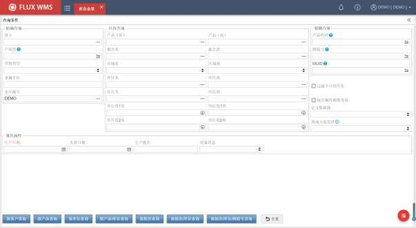

- 精确查询：

查询结果与查询条件精确匹配，具体字段说明如下：

货主－所要查询的货主代码。

产品组－仅查询指定产品组对应产品的库存情况。例如服务行业，产品档案的产品组 1字段经常会放款号，那么此条件字段录入款号，就可以查询此款内多个 SKU 的具体库存情况。由于具有多个产品组字段，因此系统支持“产品组号_查询内容 1，查询内容 2”的批量检索模式。例如“1_A，B”，意味着查询产品组 1字段内容是 A，以及是 B的记录。

货物类型－产品所属货物类型。

隶属单位－所要查询的客户所属隶属单位代码。

仓库－所要查询的库存存储仓库。

- 区段查询：

查询条件分为从……到两部分，可以针对信息区间进行查询。具体字段说明如下：

产品－所要查询的产品代码。

批次－所要查询的库存批次号码。

区域－所要查询的区域。

<!-- 原 PDF 第 605 页 -->

库区－所要查询的库存所属库区。

库位－所要查询的库位。

库位组 1－所要查询的库存所属库位组 1。

库位组 2－所要查询的库存所属库位组 2。

- 模糊查询：

可以按照产品，或者跟踪号、MUID 号进行模糊查询，查询包含输入条件的全部库存。例如输入产品 MO 模糊查询条件，能够查询到产品 MOUSE 和 MODEL 以及 AL234MO2 等全部包含 MO 的库存记录。

注：MUID 号码，是二级跟踪号管理模式中的托盘号层级跟踪号码，是跟踪号的上一级物流容器级别。也即多个跟踪号的集合。

- 过滤不可用库存：

如勾选，查询结果隐藏可用库存为 0的记录。例如，一行记录的库存全部被冻结后，实际可用库存数会被更新为 0。勾选该选项后，系统会自动隐藏对应库存记录。

- 批次属性：

批次属性查询部分，动态显示与货主条件对应的，货主所用批次属性内容。可以通过勾选【批次属性模糊查询】选项，控制是否对批次属性内容进行模糊查询。

未录入货主条件情况下，默认显示“STANDARD”批次属性对应的批次属性字段内容。

- 根据需要点击按钮选择不同的查询方式：

- 按客户查询

根据客户 ID进行查询，显示货主级的汇总库存信息。

- 按产品查询

根据产品进行查询，展示产品库存情况，但忽略存储位信息。相关数量信息为：

库存数量－该产品的总数量。

其他/整托/整箱/内包装/零件－按产品包装设置换算的对应包装数量。

<!-- 原 PDF 第 606 页 -->

分配数量－该产品已经被订单分配锁定的总数量。

冻结数量－该产品已被冻结的、不可操作库存数量。

可用数量－该产品库存中除去被冻结和被（预）分配、待补出/入、待移入/移出数量之外，可以用于新发运订单的库存数量。入库具有上架任务，但尚未上架确认的库存，同样不可用。

- 按库位查询

查询库位存储情况。忽略产品相关信息，仅显示库位中的数量、体积等信息。

- 按产品/库位查询

查询产品在不同库位的存储情况。

待上架数量－上架任务待操作数量。

补货待上架数量－补货任务待操作数量。

补货待下架数量－补货任务待操作数量。同一补货任务，对于来源库位锁定为补货待下架数量；对于补货目标库位，锁定为补货待上架数量。

待移出数量－移库任务待操作数量。

待移入数量－移库任务待操作数量。同一移库任务，对于来源库位锁定为待移出数量；对于目标库位，锁定为待移入数量。

- 按批次查询

查询产品的库存批次相关信息内容。

批次－库存的批次号（可参考基础设置批次属性部分）。

订货数－默认为空，用于根据库存生成单证。

批次属性内容－该批次产品具体的批次属性内容。根据产品对应的批次属性显示。

通过鼠标右键菜单的“查询预配数”功能，可显示批次库存预分配情况。

- 按批次/库位查询

查询每个库位上的具体批次库存情况，但不显示跟踪号明细。

通过鼠标右键菜单的“查询预配数”功能，可显示批次库存预分配情况。

- 按批次/库位/跟踪号查询

查询最明细的库存信息

<!-- 原 PDF 第 607 页 -->

跟踪号－库存的跟踪号。

MUID－二级跟踪号管理模式中的托盘级跟踪号。

订货数－默认为空，用于根据库存生成单证。

补货待下/上架数量－补货任务待操作数量。同一补货任务，对于来源库位锁定为补货待下架数量；对于补货目标库位，锁定为补货待上架数量。

待上架数量－上架任务待操作数量

待移出/入数量－移库任务待操作数量。同一移库任务，对于来源库位锁定为待移出数量；对于目标库位，锁定为待移入数量。

待调整数量－调整单待执行数量。

- **鼠标右键菜单**

鼠标右键功能，在不同查询方式的页签中内容有所不同，功能项目最多的是按批次/库位/跟踪号查询模式：

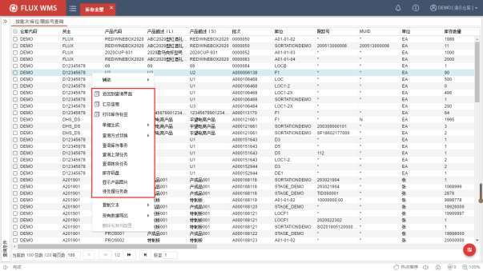

- 单据生成：

- 生成发运订单/移库单/转移单/调整单/冻结单/拆箱单/增值服务单/质检单

根据所选记录生成对应单据。数量为订货数字段输入的数量，如果订货数字段为空，则默

<!-- 原 PDF 第 608 页 -->

认为记录的可用余量。

生成单据时，对应的订单类型优先取单据类型系统代码中配置的默认类型，如果未配置默认类型，则取首行单据类型记录。例如“生成发运订单”，对应订单类型系统代码为 SO_TYP；库存移动单，对应单据类型系统代码为 MOV_TYP。

- 添加到当前发运订单/移库单/转移单/调整单/冻结单/

选中的记录，添加到操作员所创建的、当前仍旧是创建状态的首个订单中。 如果没有相应订单，由系统自动创建。

- 生成冻结记录

将所选库存记录冻结。系统自动在冻结功能中添加相应冻结记录。

- 查询方式切换

快捷操作，从当前查询结果界面（例如按批次 /库位/跟踪号查询），直接切换到其他查询方式结果界面（例如按批次查询）。

查询条件内容不变，但不再需要回到查询条件界面、点击不同的查询方式按钮。

- 查询库存事务

针对所选记录，跳转到库存事务查询界面，将客户、产品等作为默认查询条件，可查询相应库存事务记录。

- 查询上架任务

针对所选记录，跳转到任务管理的上架任务功能，根据货主、产品代码查询库存记录对应的上架任务。上架任务功能，可参考任务管理部分的介绍。

- 查询拣货任务

针对所选记录，跳转到任务管理的拣货任务功能，根据货主、产品代码查询库存记录对应的拣货任务。拣货任务功能，可参考任务管理部分的介绍。

- 打印库存标签

针对查询所得的库存，打印库存标签。

- 库存码盘

对已在库的大批量库存进行托盘化整理，生成不同的标签。

- 显示产品图片

<!-- 原 PDF 第 609 页 -->

对于有维护过产品图片的库存记录，可通过此功能，在库存余量界面选择记录，显示产品图片，方便用户比对。

- 待处理任务数

库存记录相关的任务，可能是待上架任务、待补货任务等各种类型，默认隐藏，点击此右键功能后，进行显示。

## 10.2. 库存事务

库存事务功能用于记录产品在系统中的所有操作活动，用户可查看、追溯系统历史操作记录。同时，由于库存事务中详细记录了每个操作的人员、始末时间、交易数量和交易单号，因而也常用于辅助仓库统计员工的绩效考核相关信息。

- **库存事务查询**

- 选择“库存管理”下的“库存事务”。

- 根据需要输入查询条件，发起查询，系统查找对应的记录并显示：

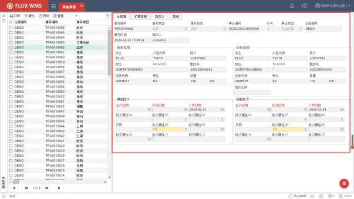

事务编号－系统自动生成的事务流水号。

事务类型－操作事务分类，如上架、发货等。

<!-- 原 PDF 第 610 页 -->

事务状态－操作情况，如完成、取消。

单证编号－操作记录对应的单证号。

行号－操作对应的单证行号。

单证类型－操作对应的单证类型，如 ASN（预期到货通知单）、SO（发运单）等。

仓库编号－操作记录发生的仓库代码。

事务时间－操作发生的时间。

操作人－记录的操作人员执行人员。如上架人、拣货人等。通常使用 RF进行操作时，操作人员即是系统人员。但使用打印单据操作，执行实际操作，与最终在 WMS 系统中确认操作完成的，有可能是不同的作业员（例如收货员收货，单证员在系统中确认收货完成）。此时执行系统确认时，可以录入操作人员信息。

原始信息－操作进行前的库存信息情况。例如调整前库存数量与调整后数量不同。

目标信息－操作进行后的库存信息情况。例如转移前的 SKU代码有可能与转移后不同。

货主－操作前后客户代码（例如转移操作可以修改客户代码）

产品代码－操作前后产品 ID（转移操作可以修改产品代码）

批次－操作前后产品所具有的批次号。

库位－操作前后产品所在库位。

MUID－操作前后产品的 MUID跟踪号。即 2级跟踪号管理体系中的托盘号。

跟踪号－操作前后产品的跟踪号。

包装代码－操作前后产品所用包装。

单位－操作前后所用的数量单位。

数量－操作前后的产品数量，以所选单位值为数量单位。后一字段为对应的主单位数量。

取消数量－部分取消收货情况下的取消数量。因此只在操作后的部分显示。

目的仓库－跨仓移库情况下，记录的目的仓库信息。

批次属性－涉及的产品记录操作前后的批次属性值内容。

- 扩展信息页签，显示其他附加信息：

模块编码－执行操作的功能模块 ID。

<!-- 原 PDF 第 611 页 -->

工作站－执行操作的工作台 ID。

原因代码－操作时所选原因代码及描述。如调整原因。

上架任务编号－任务号。

上架顺序－任务拆分时的顺序号。

QC 任务编号－质检任务号。

QC 顺序－质检任务拆分时的顺序号。

毛重－事务记录对应重量信息。

体积－事务记录对应体积信息。

接口发送时间－接口发送时间。

接口发送标记－接口发送成功标记。

来源－部分取消收货情况下，存在库存事务拆分为多行的情况，对于拆分出的库存事务记录，会在来源字段记录相关原始库存事务 ID。

## 10.3. 库存冻结单

在某些情况下，会出于各种原因，不允许仓库中的部分产品出库发运，例如某批次产品过保质期，或者需要等待检验批文才能出库，海关要求暂时封存，甚至货主通知某些产品暂时不能出库等等。

FLUX WMS 在提供自动冻结过期库存（启用保质期管理的情况下）功能之外，还提供了库存冻结功能，能够根据不同情况将库存冻结、锁定，帮助用户对产品的操作进行控制，不再需要人工记忆不同客户、不同原因的封货指令。

库存批量冻结处理，或者需要分步审核的业务情况，可以通过库存冻结单来实现冻结操作，以单据形式管理库存冻结。对库存的影响则是冻结后不可进行出库操作，即冻结库存不参与分配。

- **库存冻结单**

- 选择“库存管理”中的“库存冻结单”。

- 点击【新增】按钮，在表头的主信息页签，输入客户编号并保存。

<!-- 原 PDF 第 612 页 -->

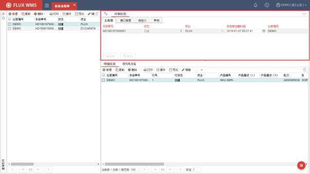

- 明细信息部分，点击【新增】按钮后，通过SKU浏览按钮，在二级窗口中选择库存记录（系统会过滤0 库存记录信息）并确认，返回主信息界面，维护冻结原因、描述，保存记录。

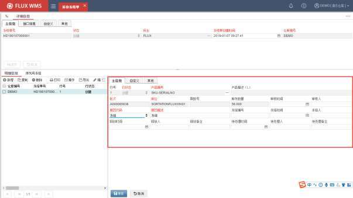

<!-- 原 PDF 第 613 页 -->

- 选择明细行记录，通过鼠标右键菜单功能，对待冻结记录进行审核。

- 已审核记录，可通过鼠标右键功能执行冻结。

- **鼠标右键功能项**

- 表头右键菜单：

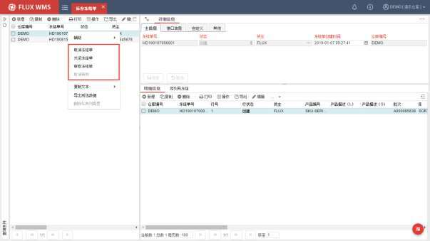

- 取消冻结单

单据取消，已操作单据不可取消。

- 关闭冻结单

关闭单据，结束作业。

- 审核冻结单

对冻结单进行审核。已审核单据才能执行冻结。

- 取消审核

已审核单据，还原到创建状态以便进行修改。

- 明细右键菜单：

<!-- 原 PDF 第 614 页 -->

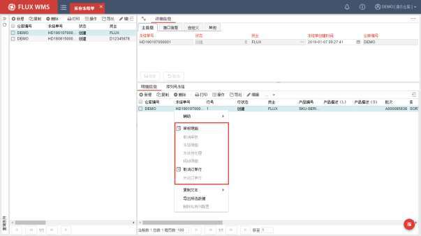

- 审核明细

对所选明细行记录进行审核确认。

- 取消审核

对所选明细行记录进行取消审核，以便修改信息。

- 冻结明细

对所选明细行记录进行库存冻结。

- 冻结待处理

将明细行状态更新为“冻结待处理”，等待用户检查确认后做相关处理。常用于需要等待 ERP确认的业务场景。

- 释放明细

已冻结记录解除冻结，释放库存。

- 取消订单行

创建状态行，取消，不再进行操作。

- 关闭订单行

<!-- 原 PDF 第 615 页 -->

操作完成的订单行关闭，不允许再做操作。

- **其他操作**

- 序列号冻结

全流程序列号管理作业模式下，系统会记录每件货物的序列号、存放位置，能够支持指定序列号货品出库。

但在这种作业模式下，也会存在货主指定部分序列号产品，要求进行冻结、不可出库的情况。因此系统中需要将这类序列号以及序列号对应的库存进行冻结管理。

进行序列号冻结操作时，首先需要开启 SERIALNO_HOLD参数（是否启用序列号冻结），并指定为一级序列号冻结模式，还是二级序列号冻结模式。

在后续操作时，系统会根据参数指定的级别，进行序列号记录的匹配检查。

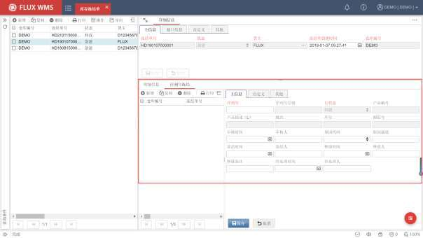

在“库存冻结单”明细部分，“序列号冻结”页签，点击【新增】按钮后，录入（或者批量导入）指定序列号之后，系统根据序列号信息，查询到对应库存信息（如批次、库位等信息）并显示在明细部分的主信息页签中。

操作审核以及冻结后，系统会对序列号库存进行冻结操作，不能再被用于分配。

库存余量的冻结数量中，也会包含序列号冻结的数量。并且在拣货、复核和发货等环节，

<!-- 原 PDF 第 616 页 -->

扫描序列号时如果扫描到已被冻结的序列号，则不可进一步操作，会提示序列号已被冻结。

## 10.4. 库存转移单

有很多情况下，仓库需要对库存产品的信息进行修改。例如根据货主通知，原本 A 产品要全部更名为 A1 产品；或者产品拆小包装后发现实物上的批次属性值（如生产批号）与入库时客户提供的单证上的记录不一致，批次属性内容需要修改。

也有些情况下，库内两个不同货主间进行货物交易，可以直接进行货权变更，实物无需拣货、出库再入库、上架。

FLUX WMS 的提供库存转移单功能，可以批量改变产品的相关信息，包括货主、品名等等。但库存总量保持不变。

- **库存转移单操作**

- 选择“库存管理”下的“库存转移单”。

- 点击【新增】按钮，在表头主信息页签依次输入：

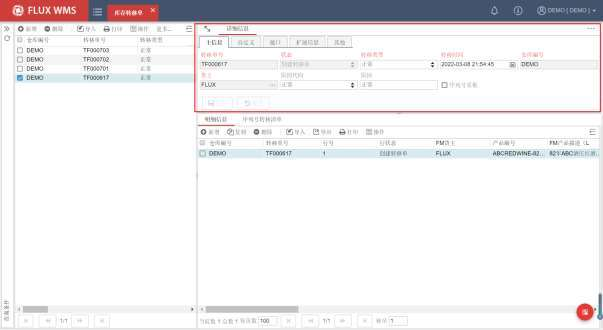

转移单号－系统自动生成的单证号。

转移单状态－单证状态，默认为创建状态。

<!-- 原 PDF 第 617 页 -->

转移类型－单证类型，用于区分不同的库存转移单。

转移时间－转移操作执行时间，默认为订单创建时间。

仓库编号－单据所属作业仓库。

客户编号－输入或选择待转移操作的货物所属的货主代码。

原因代码－转移原因代码。

转移原因－转移原因说明，默认为同原因代码。

序列号采集－当前转移单，是否需要进行序列号采集。

- 点击【保存】按钮，保存转移单头信息。

- 在“附加信息”页签，可见转移单的来源单号、行号。如果是从 SO 创建的转移单，会记录对应信息。

- 在转移单明细部分，点击【新增】按钮，通过点击产品浏览按钮，系统显示库存选择二级窗口。输入所需的产品代码并查询，选择需要修改信息的库存记录，双击选择。

- 系统返回转移单页面，并显示所选库存记录的相关内容。用户在“转移信息”部分，输入此次转移操作影响到的库存数量，并根据实际需要修改目标批次等信息内容。

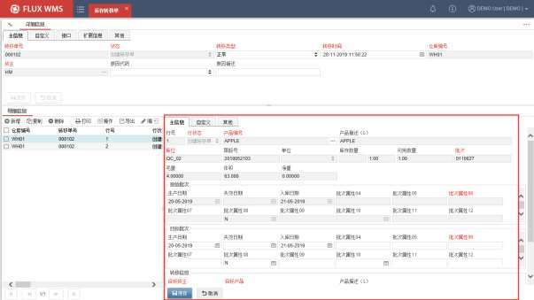

<!-- 原 PDF 第 618 页 -->

- 修改完成后，保存明细。如果目标批次属性部分，必输属性没有录入，保存时系统会进行提示。

- 库存转移单创建完毕，由相应人员进行审核，可打印转移申请单据。审核后，通过表头鼠标右键菜单确认审核。

- 已审核单据，选择需要执行信息变更、转移的记录，或通过右键菜单全选。

- 明细部分，鼠标右键菜单选择功能【执行转移】，系统执行库存转移。

注：转移单也可以通过库存余量生成。在库存余量按批次/库位/跟踪号查询方式界面，选择记录、修改订货数，通过鼠标右键菜单功能项“生成库存转移单”可生成指定产品的库存转移单，后续操作相同。

- 附件信息管理

附件页签，常用来记录收货时的随附单据、现场照片等文件。根据需要上传文档，或下载已有文档查看。

在附件页签，点击【上传】按钮，系统显示如下文件选择对话框，通过【+】按钮，选择文件，再点击【上传】按钮，完成附件上传。

如果需要上传到货主指定的FTP 上，完成FTP相关配置后，用户可通过【库存转移单】-【附件】页签上传附件，实现将不同货主附件，自动上传到不同的FTP路径下的效果。

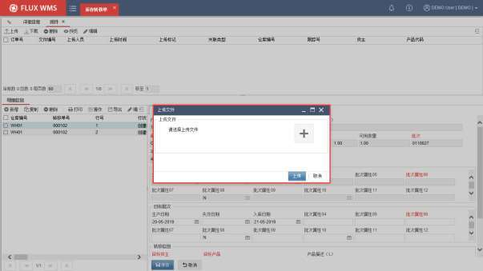

<!-- 原 PDF 第 619 页 -->

上传成功，系统自动添加附件信息记录：

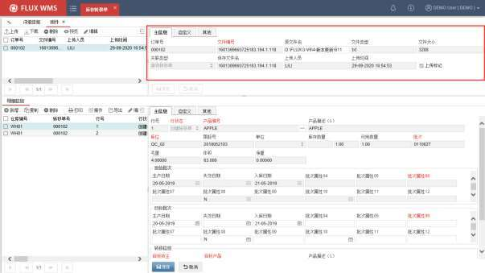

对于已有附件，可以通过【下载】按钮下载查看。

- **鼠标右键菜单**

- 表头右键菜单：

在转移单表头部分的导航窗口中，点击鼠标右键，系统显示相应右键菜单如下

<!-- 原 PDF 第 620 页 -->

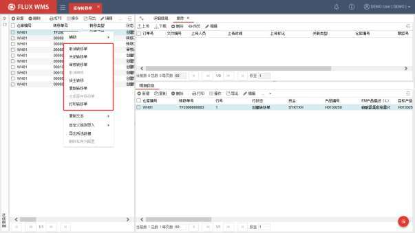

- 取消转移单

转移单取消，不再操作，也不可修改。

- 关闭转移单

已执行转移单关闭，不可再修改。

对于部分执行转移的单据，关闭时需要先将已执行审核，但未执行转移的明细行，通过鼠标右键执行【取消审核】，明细行还原到创建状态，然后再进行关闭。

关闭后，未执行转移的明细行，行状态将变更为“取消”，以便与执行过转移的明细行进行区分。

- 审核转移单

确认转移单通过审核，能够执行后续转移操作。

- 取消审核

仅对通过审核的单据有效。将单据恢复到未审核状态。

- 货主转移

在转移单中，需要批量修改货主时使用。选择后，系统显示货主选择二级窗口，并将所选择的货主代码更新到全部明细的转移客户字段中。不再需要人工逐一修改。

<!-- 原 PDF 第 621 页 -->

- 复制转移单

已有单据，复制生成新单据。新转移单为创建状态，单号根据流水号规则生成，其余内容与原样本单据一致。

- 打印转移单

打印纸面单证，用于指导仓库内实物操作。

- 生成库存转移单

部分业务场景，需要分步操作库存转移、库存移动。点击"生成库存移动单"后，系统会基于已完成转移操作的库存转移单（状态为“转移完成”和“关闭”的单证）自动生成对应库存的库存移动单。

- 明细右键菜单：

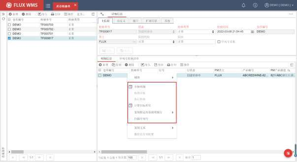

- 审核明细

所选明细行审核确认。

- 取消审核

所选明细行取消审核。

- 执行转移

<!-- 原 PDF 第 622 页 -->

所选明细行记录，确认执行转移操作。

- 计算目标库位

根据上架规则，为产品计算上架库位，作为转移后的目标库位。

- 复制指定内容到明细行

将当前明细记录作为模版，把所选记录的货主，跟踪号，或者库位，批次属性内容批量更新到其他行的对应信息字段。

批次属性部分，支持多选，可以勾选数个属性字段，一次性进行批量复制：

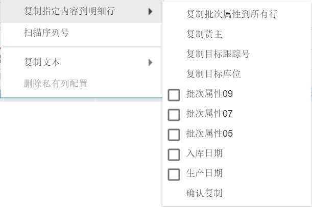

- 扫描序列号

部分产品在进行库存转移时，也需要采集序列号，明确哪一件产品进行了转移。例如医疗器械，经常需要进行严格的序列号跟踪管理。

在明细部分，通过鼠标右键功能【扫描序列号】显示如下序列号采集二级窗口，扫描序列号显示在右侧序列号采集列表中：

<!-- 原 PDF 第 623 页 -->

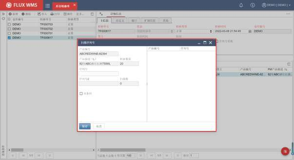

对于扫描条码需要解析的情况，在【标准业务扩展】功能中进行解析逻辑配置；二级序列号

## 10.5. 库存调整单

在仓库操作和管理中，难免会发生一些不可避免的人为错误或库存异常，例如收货数量输入错误或者盘点时发现某库存产品短少。为了尽可能地达成系统数据准确，进而保障系统操作的正确性，需要及时将系统数量与实际库存调整一致。此时，可以通过 FLUX WMS 的库存调整单功能来实现库存的准确性维护。

- **库存调整单操作**

- 选择“库存管理”下的“库存调整单”。

- 点击【新增】按钮，在表头的主信息页签，依次输入：

<!-- 原 PDF 第 624 页 -->

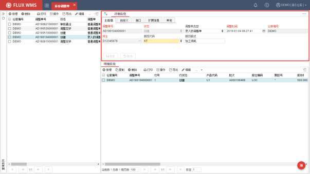

调整单号－系统自动生成的单证号。

状态－单证状态，默认为创建状态。

调整单类型－单证类型，用于区分不同的库存调整单。

调整时间－调整作执行时间，默认为订单创建时间。

仓库编号－单据所属作业仓库

货主－输入或选择待调整操作的货物所属的货主代码。

原因代码－调整原因代码。

原因描述－调整原因说明，支持用户自行录入，默认为同原因代码。

- 点击【保存】按钮，完成调整单头信息维护。

- 在“扩展信息”页签可见盘点单号信息。从盘点单生成调整单时，系统会记录对应盘点单号（盘点单生成调整单的具体操作请参考库存盘点部分）

- 调整单明细部分，点击【新增】按钮，在主信息页面，通过点击产品浏览按钮，系统显示库存选择二级窗口。输入所需的产品代码并查询，双击选择需要调整的库存记录。

<!-- 原 PDF 第 625 页 -->

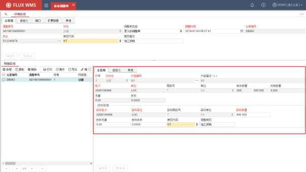

- 系统返回调整单页面，并显示所选库存记录的相关内容。

- 用户在根据实际需要，输入调整的目标数量、目标毛重、体积等信息，并保存。

- 库存调整单创建完毕，由相应人员进行审核，可打印调整单据。审核后，通过表头鼠标右键菜单确认审核。

- 在明细列表部分，选择需要执行调整的记录，或通过右键菜单全选。

- 鼠标右键菜单选择功能“执行调整”，系统针对所选的明细行执行库存调整。

- 附件信息管理

附件页签，常用来记录收货时的随附单据、现场照片等文件。根据需要上传文档，或下载已有文档查看。

在附件页签，点击【上传】按钮，系统显示如下文件选择对话框，通过【+】按钮，选择文件，再点击【上传】按钮，完成附件上传。

完成 FTP相关配置后，用户可通过【库存调整单】-【附件】页签上传附件，实现将不同货主附件，自动上传到不同的 FTP路径下的效果。

<!-- 原 PDF 第 626 页 -->

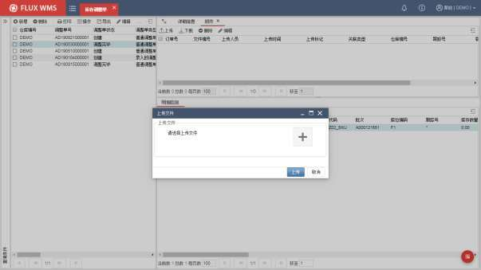

上传成功，系统自动添加附件信息记录：

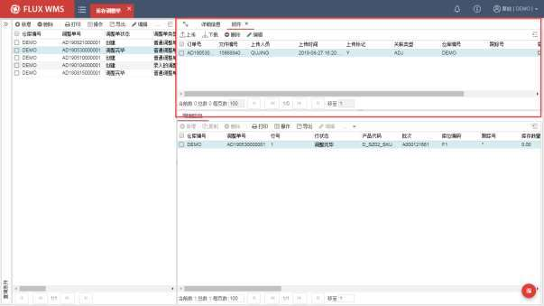

- 对于已有附件，可以通过【下载】按钮下载查看。

- **鼠标右键菜单**

<!-- 原 PDF 第 627 页 -->

- 表头右键菜单：

在调整单表头部分的导航窗口中，点击鼠标右键，系统显示相应右键菜单如下：

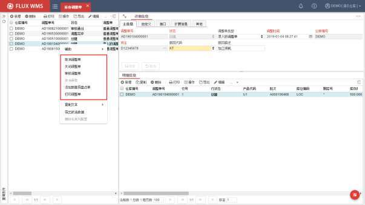

- 取消调整单

调整单取消，不再操作，也不可修改。

- 关闭调整单

已执行调整单关闭，不可再修改。

- 审核调整单

确认调整单通过审核，能够执行后续调整操作。

- 取消审核

仅对通过审核的单据有效。将调整单恢复到未审核状态。

- 添加到差异盘点单

0 库存增加的调整记录，可加入到差异盘点单中进行复盘。

- 打印调整单

打印纸面单证，用于调整审批或存档。

<!-- 原 PDF 第 628 页 -->

- 明细右键菜单：

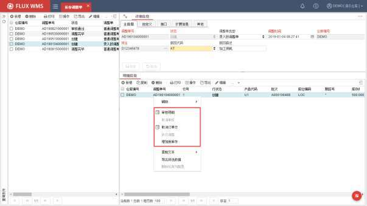

- 审核明细

基于明细行进行审核确认。支持多行选择批量审核。

- 取消审核

明细行审核取消。

- 取消订单行

所选明细行取消。支持多行选择批量操作。

- 执行调整

所选明细行记录，确认执行调整操作。

- 增加新库存

正常的调整操作，需要在已有库存的记录上进行。但如果由于误操作，已经将库存调整为 0，再需要将库存由 0调整回来，由于没有库存记录可以选择，无法操作。因此 FLUX WMS 系统提供了“增加新库存”功能，可以从 0库存开始调整增加。

选择“增加新库存”功能后，系统显示如下新增库存二级窗口，依次录入产品、库位、数量、批次属性等信息。保存后系统生成对应的 0 库存调整增加的明细记录。

<!-- 原 PDF 第 629 页 -->

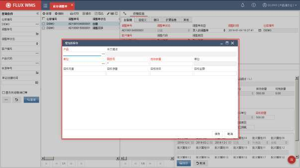

## 10.6. 库存移动单

在仓库中，常常会由于种种原因而需要移动产品、改变货物的存储位置，例如，在仓库操作过程中，发现有产品破损，通常需要将其由原来存放的库位移至另设的产品破损库位存放，防止破损货物被当作正常品发货给收货客户；或者定期整理库存，将周转比较慢的货物移动到慢速周转库区。库存移动单功能可以帮助仓库对货物存储位置做批量变更，甚至重新规划仓库内货物的存放。

- **库存移动单**

- 选择“库存管理”下的“库存移动单”。

- 点击【新增】按钮，在表头的主信息页签，依次输入：

<!-- 原 PDF 第 630 页 -->

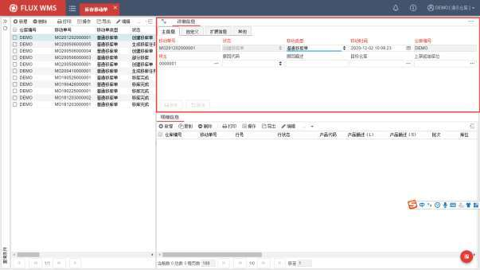

移动单号－系统自动生成的单证号。

状态－单证状态，默认为创建状态，由系统根据移库单执行情况更新状态。

移库类型－单证类型，用于区分不同的库存移动单。

移动时间－执行库存移动的时间，默认为订单创建时间。

仓库编号－移库单所属作业仓库。

货主－输入或选择待移库操作货物所属的货主代码。

原因代码－选择产品移动的理由。所选下拉列表内容在系统代码中维护。

原因描述－对移动原因进一步说明。

目标仓库－允许跨仓移库时显示，移库的目的仓库。MOV_BTW_WH(是否允许在不同仓库之间进行移库操作)参数为 N时，此字段隐藏。

上架起始库位－移库单中可以根据上架规则重新计算推荐目标库位，以便仓库整理。如果需要执行“收货到 XX 库位，就上架到 XXX库位/库区”的逻辑，就可以通过“上架起始库位”字段代替收货库位进行逻辑计算。

- 点击【保存】按钮，保存表头信息。

- 在“扩展信息”页签可见来源单号、行号信息。如果是从 SO 创建的移动单，会记录

<!-- 原 PDF 第 631 页 -->

对应信息。

- 在明细部分，点击【新增】按钮，主信息页面通过点击产品字段的快速检索按钮，在库存选择二级窗口，选择需要执行移动的库存信息记录。

- 双击记录确认，返回移库单界面。依次输入移动的目标库位和移动数量，并保存。系统默认库位上的全部库存一次移动。同样可以点击按钮通过二级窗口查看批次所具有的扩展批次属性。

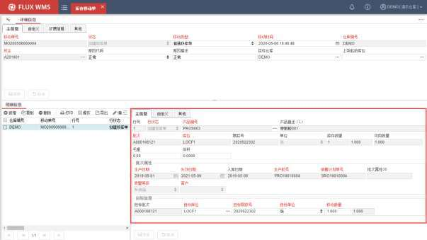

- 在明细部分，选择需要执行移动的记录（或通过鼠标右键菜单全选），选择鼠标右键菜单中的“执行移库”功能，系统执行移库操作。

注：移库单也可以通过库存余量生成。在库存余量按批次/库位/跟踪号查询方式界面，选择记录、修改订货数，通过鼠标右键菜单功能项“生成库存移动单”可生成指定产品的库存转移单，后续操作相同。

- **鼠标右键菜单**

- 表头右键菜单：

在移库单表头部分的导航窗口中，点击鼠标右键，系统显示相应右键菜单如下

<!-- 原 PDF 第 632 页 -->

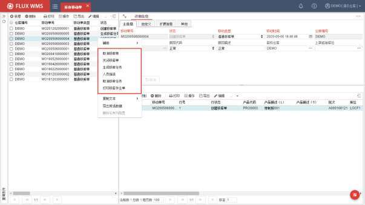

- 取消移库单

移库单取消，不可操作、修改。仅针对创建状态移库单

- 关闭移库单

移库单执行后，关闭订单。不可再修改。

- 生成移库任务

根据移库单明细，生成移库任务，供 RF 移库使用。移库任务会将待移动库存锁定，执行移动后释放。

- 人员指派

用户可以基于库存移动单进行任务人员指派。

- 取消移库任务

已生成的移库任务取消。

- 打印移库单

打印纸面单据，用于指导仓库内库存移动。

- 明细右键菜单：

<!-- 原 PDF 第 633 页 -->

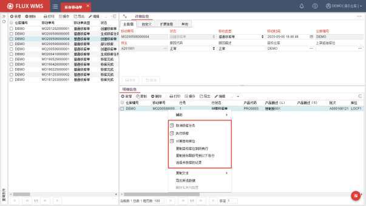

- 取消移库任务

针对所选移库单明细行，对已生成的移库任务取消。

- 执行移库

移库确认。可按所选明细行执行。

- 计算目标库位

根据产品的上架规则，计算出上架库位作为移动的目标库位。计算所得目标库位可以再次通过手工进行修改。

- 复制目标库位到所有行

适用于移库单中全部目标库位相同的情况。手工修改一行明细的目标库位并保存，通过鼠标右键“复制目标库位到所有行”功能，更新整个移库单中全部明细的目标库位为所选明细记录的目标库位。

- 复制目标跟踪号到以下各行

可通过该功能项，批量更新多个明细行记录的目标跟踪号。

- 选择未移库的记录

批量勾选所有未移库完成的记录，以便后续针对未移库记录执行移库。

<!-- 原 PDF 第 634 页 -->

- **跨仓移库操作**

通常情况下，2 个不同仓库间的货物移动，会通过一个仓库发货，另一个仓库收货来进行交接，过程中涉及到责任转移，实物交接等。

但也有些仓库，物理位置在一处或相邻，例如一个物流园区中的 2栋楼，出于管理需要，维护为2个不同仓库。这些仓库间的库存移动，部分情况下也会通过移库单操作。

跨仓操作，需要开启参数 MOV_BTW_WH（是否允许在不同仓库之间进行跨仓移库操作），此时移库单头，会显示目标仓库字段供选择。

添加明细行记录时，系统会校验目标库位是否属于目标仓库；已有明细情况下修改目标仓库，系统会清空明细行的目标库位，等待重新录入并校验。

如果移库单已经下达移库任务，目标仓库不可修改。

## 10.7. 库存盘点单

- **库存盘点**

库存盘点是仓库日常业务操作的一个组成部分，也是保证库存正确的重要方式之一。

盘点可分为标准盘点、循环盘点和动碰盘点等多种不同的盘点模式：

- 标准盘点即盘点指定范围内的全部库存。

- 循环盘点是根据循环盘点规则中设置的盘点数量等限定条件，由系统在库存中随机选择部分库存进行盘点，在一定周期内完成对所有产品的盘点工作的盘点操作方式。

- 动碰盘点则是对有过操作的产品进行盘点的一种部分盘点方式，由系统进行记录筛选。

- 随机盘点是由系统根据制定的盘点范围，随机抽取库存记录生成盘点任务用于抽查库存情况的盘点方式。

盘点执行，可分为有任务模式，与无任务模式。

有任务模式需要系统先根据要求生成盘点任务，后续通过纸单或RF 执行操作操作。本章节主要介绍基于库存盘点单生成盘点任务的操作模式。

无任务模式主要通过 RF进行操作，指定范围内全部库存信息扫描采集后，再与系统库存进行

<!-- 原 PDF 第 635 页 -->

比对。RF 盘点执行的相关细节，请参考 RF操作手册。

### 10.7.1. 盘点任务生成

- **申请盘点**

在进行盘点之前，需要先对盘点的对象、时间、范围进行设定，便于系统自动生成符合要求的盘点清单，也即盘点任务。此时应用到了申请盘点的功能，如果是非任务盘点模式，可以不进行盘点申请。

- 选择“库存管理”下的“库存盘点单”。

- 点击【新增】后，在表头部分的主信息页签，依次输入如下信息：

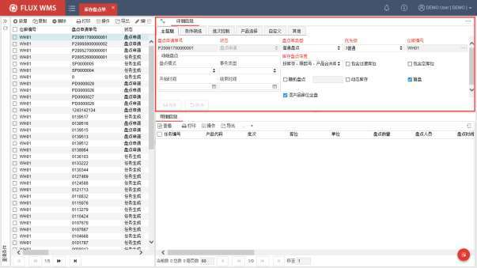

盘点申请单号－系统自动生成的盘点单号。

状态－盘点单当前操作状态情况，由系统自动更新。

盘点单类型－盘点单操作类型。例如普通盘点，差异盘点等。

优先级－盘点优先级。主要针对 RF 盘点任务生效。

仓库编号－当前作业仓库。

动碰盘点－动碰盘点相关条件字段。

<!-- 原 PDF 第 636 页 -->

盘点模式－动碰盘点的盘点模式选择。动碰库存，意味着对指定时间段内有过操作的库存记录进行盘点；呆滞库存，则相反，对指定时间段内没有操作的库存记录进行盘点。

事务类型－动碰盘点的“操作”判断的具体操作事务类型范围选择。例如仅对进出库（收货、发货）操作进行判断，其余移库、转移等操作忽略，不视为动碰过的库存。

开始/结束时间－动碰盘点的“是否有操作”的时间段条件范围。例如仅对 1~3号有发货操作的库存进行盘点，1~3 号就是时间段条件。

盘点库存深度－盘点时的库存细化程度。根据参数 COU_SKU_LOC（生成盘点任务的库存深度）显示默认值。操作用户可手动切换为其他盘点深度。系统提供的选择项有：

✓ NO-不合并库存。即根据“批次/库位/跟踪号”查询模式获取到库存明细信息记录，不做记录合并，按最明细的层级进行盘点。

✓ LOC*TID*KEYLOT-按库位、产品、关键批次属性、跟踪号合并库存。在“批次/库位/跟踪号”模式查询到的库存明细信息的基础上，忽略非关键批次属性，对关键批次属性相同的库存记录进行合并。例如入库日期是关键属性，产地是非关键属性，则同一库位内、相同跟踪号下，产地不同但入库日期相同的同一产品库存记录合并为一行盘点任务。

✓ LOC*TID*SKU-按库位、跟踪号、产品合并库存。忽略产品批次属性的差异，将同一库位、同一跟踪号上，相同产品库存记录合并进行盘点。

✓ LOC*KEYLOT-按库位、关键批次属性合并库存。忽略跟踪号，同一库位内的相同产品，按关键批次属性合并记录后进行盘点。

✓ LOC*SKU-按库位、产品合并库存。忽略跟踪号、批次属性信息，仅根据库位、产品合并库存记录进行盘点，是确认速度较快的一种盘点模式。

包含过渡库位－过渡库位是否纳入盘点任务生成范围。

包含空库位－生成的盘点任务包含空库位记录，即用户需要确认这些库位的确是空的。默认不勾选。

随机盘点－在指定的范围内，随机抽取记录生成盘点任务，根据录入的随机盘点数量（盘点的库位个数），随机选择生成相应的盘点任务。由于一个库位内可能有多个产品，或者一个产品多个批次的情况，因此实际生成的盘点任务数量，可能会大于录入的随机盘点数量。

动态库存－实时盘点操作，盘点单中不锁定库存，可以一边进出操作，一边进行盘点。通过 RF 盘点获取任务时才获取当时的实时动态库存。默认不勾选，纸单盘点模式不建议使用动态库存盘点。

<!-- 原 PDF 第 637 页 -->

盲盘－盘点任务是否隐藏数量信息。按参数 BLD_COU（是否盲盘）设置作为默认选项，现场根据需要可切换模式。

混产品库位按产品盘点 －针对混放产品的库位，未勾选情况下，系统仅对指定的产品进行盘点，其余未涉及产品不生成盘点任务，库位内局部盘点；勾选情况下，只要有涉及此库位，则库位内的全部产品库存都纳入到盘点范围。

- 在“条件筛选”页签，可以维护范围条件：

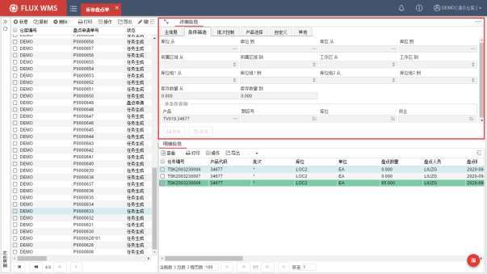

- 从~到的区段查询条件

库位－需要进行盘点的库位范围。

库区－需要进行盘点的库存所属库区。

所属区域－需要进行盘点的区域范围。

工作区－需要进行盘点的库存所属工作区。

库位组－需要进行盘点的库存所属库位组。

库存数量－指定库存数量范围，例如只盘点库存数量小于 10 的库位。

- 多条件查询

有时根据管理需要，会指定某几个条件，例如几个非连续的库位，进行盘点，此时“从/

<!-- 原 PDF 第 638 页 -->

到”的条件模式无法满足，可以在多条件查询部分，针对产品、跟踪号、库位、货主字段，录入多个查询条件内容，通过逗号分隔，例如“SKU1，SKU7，SKU9“。

也可以通过字段后的浏览按钮，在如下的“多条件查询”二级窗口，录入所需条件，并选择精确查询模式，还是模糊查询模式，系统将录入的条件内容，带入到查询条件界面。

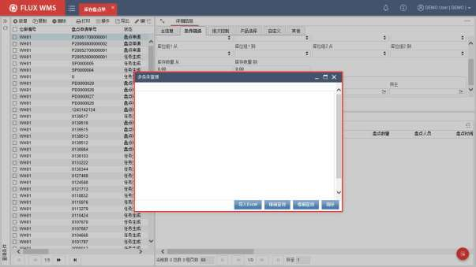

- 系统还支持在“批次控制”页签，指定属性值筛选记录进行盘点。例如只盘点海关单号是 ABC0001的一批库存。

- 如果产品筛选条件比较复杂，“条件筛选”页签的“产品”条件字段不足以支持的情况下，可以在“产品选择”页签，进一步配置更复杂的产品盘点条件。例如服装企业指定某一款货品进行盘点，款号为产品组信息，一个款号下包含若干SKU。

- 在“产品选择”页签，支持直接录入更复杂的限定语句（即SQL 查询语句），但对于多数操作员而言，通过下图的SQL 辅助窗口来指定条件，会更加便捷：

<!-- 原 PDF 第 639 页 -->

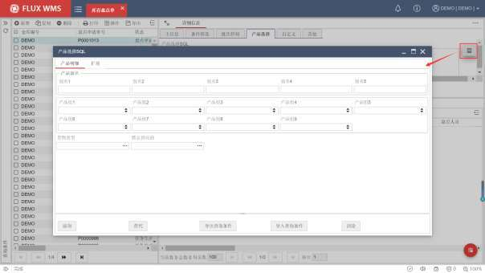

- 点击界面右侧按钮，系统弹出 SQL 辅助窗口，根据盘点需要，录入范围限定条件，例如对所有别名 1 为“ABC ”、并且产品组 1内容为“ KANBAN ”的产品库存进行盘点。

- 点击【添加】按钮，系统将界面录入的条件，转化为 SQL查询语句，拼接在已有的查询语句后面。每次点击按钮出的 SQL 辅助窗口都是默认清空的，每次的条件都支持拼接在一组查询语句中。

- 如果点击【替换】按钮，则清除现有的 SQL 内容，仅使用辅助窗口录入的条件内容，生成对应的 SQL 语句。

- 如下为系统转换生成的 SQL 语句样例：

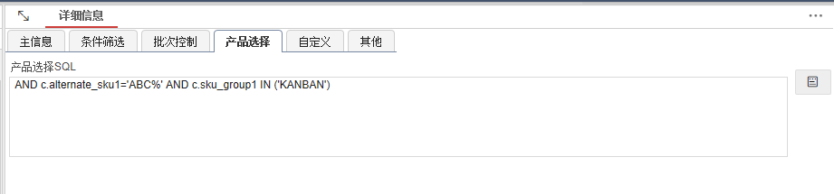

- 如果默认提供的产品别名、产品组、货物类型、默认供应商字段不够用，例如希

<!-- 原 PDF 第 640 页 -->

望对自定义 5内容为“夏装”的全部产品进行盘点，可以在 SQL 辅助窗口的“扩展页签”进一步配置：

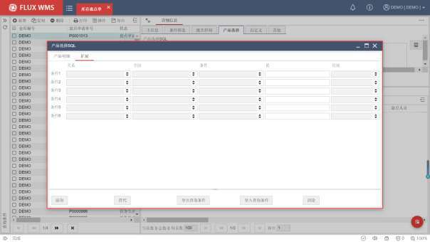

- “关系”下拉框提供的选择项为 AND、OR 等多个条件的和、或选择，方便多个条件拼接使用。

- “字段”下拉框的选择项内容，需要在系统代码 SKU_FIELD（产品选择扩展条件）中进行配置，选择产品档案表（BAS_SKU）具有的、需要作为产品限制条件使用的字段，这样不会导致下拉列表过长，难以找到所需字段。例如需要配置自定义字段条件，则在系统代码 SKU_FIELD 中，配置代码编号是“UDF05”的记录（具体字段可参考【数据字典】功能中的字段信息）

<!-- 原 PDF 第 641 页 -->

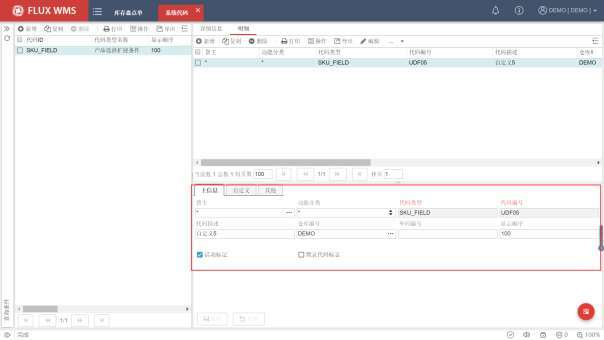

- “条件”下拉框提供的选择项为>、=等条件选择项，与“值”字段的录入内容共同拼接成例如 UDF05=’夏装’ 的条件信息。

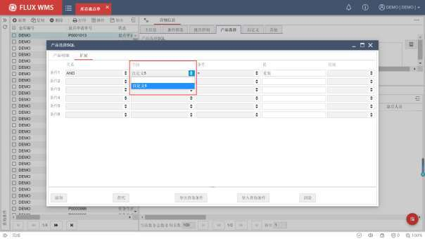

- 点击【添加】按钮后，会拼接到“产品选择 SQL”字段框中，作为后续盘点任务

<!-- 原 PDF 第 642 页 -->

生成时，库存筛选的条件来使用。

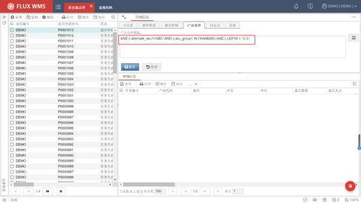

- 点击【保存】按钮，系统创建盘点单据。

- **盘点预检**

在表头右键菜单中，选择【盘点预检】功能，系统检查盘点范围内未操作完成的任务情况，并提示用户。以免作业中任务较多，又采用的非动态盘点模式，导致盘点结果偏差较大。但盘点预检信息，并不会限制盘点进行。

<!-- 原 PDF 第 643 页 -->

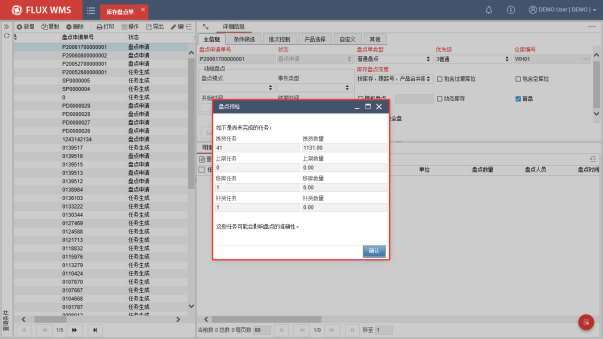

- **生成盘点任务**

鼠标右键菜单中，选择“生成盘点任务“（其余功能，在盘点任务生成后才能使用），系统根据表头部分的盘点范围条件，在库存中查找符合要求的库存记录，生成盘点任务，显示在盘点单明细部分。如果盘点任务对应的库存记录，有未完成任务（如有待上架库存，已分配库存），此任务记录将显示为红色，提醒用户注意，可能会由于其他任务操作，导致盘点库存差异。

### 10.7.2. 盘点操作

- **库存盘点**

- 盘点任务生成后，可以通过右键菜单，打印盘点任务清单用于仓库盘点。如果盘点单头勾选了“盲盘”选项，打印出的盘点单据中不显示库存数量。

- 盘点后，根据实际盘点结果，在盘点单中记录盘点数量，系统自动计算损益数量。在系统参数中，可以设置默认盘点数量（COU_DFT），默认为库存数量，用户只需输入有差异的记录。也可以默认盘点数量为 -1，用户需要录入全部盘点数量，常用于盲盘操作模式，方便区分未盘点/未录入记录（库存-1）与盘点为空（库存0）的情况。

- **盘点处理**

盘点后发现的库存差异，可以进行复盘、库存调整。

<!-- 原 PDF 第 644 页 -->

- 鼠标右键选择“生成差异盘点任务”，系统针对当前盘点单中，有损益数量的产品，再次生成新的盘点单及盘点任务，方便用户对差异数量进行复盘。

- 差异数量确认无误后，可点击鼠标右键菜单功能“生成调整单”，系统根据盘点差异记录，创建对应库存调整单，目标数量为实盘数量。

- 盘点完成，选择鼠标右键菜单功能“关闭盘点”，关闭盘点单，不允许对盘点单再做修改。

- 盘点结束，具体库存数量修改，由用户另行在对应调整单中处理。

- 注：为了避免盘点过程中生成差异单，导致后续盘点结果差异单中未包含，盘点单中有尚未完成的盘点任务时，不允许生成差异单。

### 10.7.3. 多种盘点说明

- **数量单位换算显示**

如果产品档案的库位单位，选择的是“箱”（CS）、“托盘”（PL）等非主单位（EA）的等级，后续生成的盘点任务会根据包装、库存单位进行数量换算，按指定的库存单位进行数量显示，例如 10件显示为 1箱。

但如果无法换算为整包装，例如 12件，系统不会显示为 1.2箱，而是仍旧按主单位，显示为12件。

当产品有多包装的情况下，不合并批次时，可以根据不同包装分别进行换算显示。但“按库位合并盘点”、“产品*库位”或“产品*库位*跟踪号”合并盘点模式下，由于多个批次合并，无法进行包装换算，同样根据主单位进行数量显示。

- **动碰盘点**

动碰盘点一种模式是对指定时间段内，有过操作产品进行盘点，没有操作过的库存不用盘点。

另一种模式则是相反，对指定时间段内，没有操作的库存进行盘点，即呆滞库存盘点。

动碰盘点操作步骤与标准盘点类似，但需要输入动碰盘点的开始时间、结束时间。系统寻找在这个时间段内有过操作，并且符合其他盘点范围条件的产品，生成对应盘点任务。后续操作相同。

默认情况下，动碰盘点查找时间段内全部库存事务，但用户可通过【事务类型】字段的下拉列表，选择动碰盘点的对应事务类型。未勾选的项目，将被忽略。

<!-- 原 PDF 第 645 页 -->

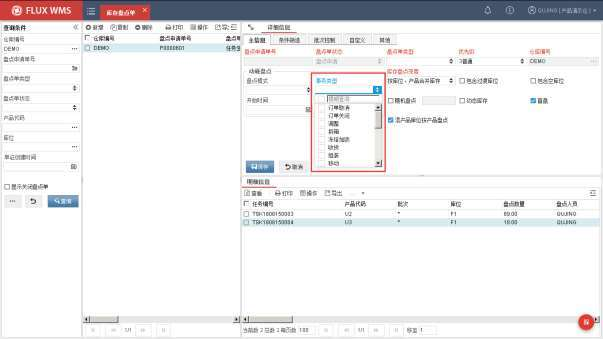

- **随机盘点**

随机盘点主要用于对产品库存进行抽查，通常与动碰盘点、普通盘点结合使用。

在库存盘点单中，除了普通盘点的范围条件之外，还需要勾选“随机盘点”选项，并输入随机盘点任务数量条件（如下图），系统在生成盘点任务时，随机抽取符合盘点范围条件的库存记录作为盘点任务。

<!-- 原 PDF 第 646 页 -->

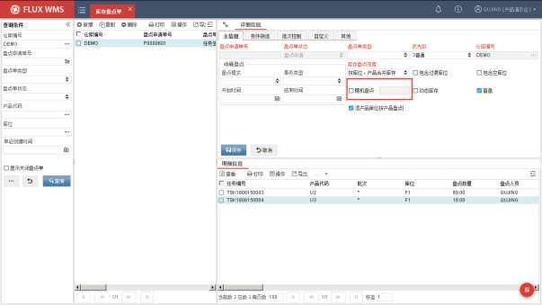

盘点任务生成后，后续操作同普通盘点。

### 10.7.4. 鼠标右键功能

- **表头鼠标右键功能项**

表头右键菜单：

<!-- 原 PDF 第 647 页 -->

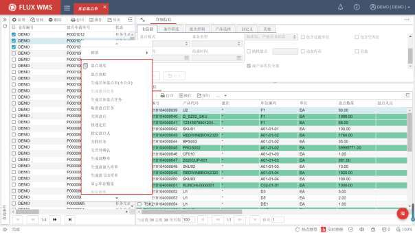

- 盘点进度

盘点单中任务较多的情况下，为了方便用户了解盘点执行的进展情况，系统提供了盘点进度查询功能。

支持勾选多个库存盘点单，系统按单对盘点总任务数量、RF 已获取但尚未盘点确认的任务数量、已盘点确认的数量、盘点完成百分比（即完成率）进行统计，通过弹窗模式展示给用户查看。

<!-- 原 PDF 第 648 页 -->

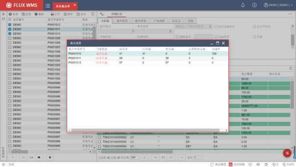

- 盘点预检

统计查询当前仓库未完成任务，由用户自行决定是否继续进行盘点。

- 生成差异盘点单（不合并）

合并盘点情况下（库存盘点深度选择某个维度的合并模式），如果发现有差异，系统无法精确定位具体有差异的批次或者跟踪号库存。对于批次等不敏感的货物，可以直接生成合并的复盘任务，即差异盘点单，进行复盘。但对于需要明确区分哪个批次、哪个跟踪号库存有差异的场景，复盘时，就需要按明细信息，不再合并的进行盘点，此时利用鼠标右键功能项“生成差异盘点单（不合并）”，系统会生成盘点深度为“不合并库存”的复盘盘点单。

后续在复盘单中，生成盘点任务进行差异盘点。

需要提醒的是，此功能仅对于合并模式的盘点单生效，如果盘点单的盘点深度原本就是“不合并库存”，可以直接使用“生成盘点差异任务”功能。

- 生成盘点任务

根据盘点范围条件计算生成盘点任务。

- 生成差异盘点任务

盘点结果与任务信息不符的产品记录，生成差异盘点单，以便进行复盘。

- 取消盘点任务

<!-- 原 PDF 第 649 页 -->

已生成的盘点任务撤销，盘点单回到创建状态，以便修改盘点范围条件。

- 关闭盘点

盘点单关闭，不再允许修改。

- 快速定位

点击后，在如下图的对话框中输入盘点任务号，或者库位、产品代码条件，系统快速定位到对应任务，以便进行后续操作处理。支持模糊查询。

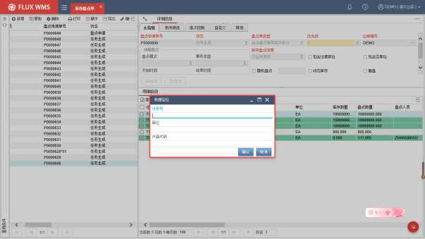

- 指定盘点人

适用于 RF 盘点，分派盘点任务给指定操作人员。点击后，弹出二级窗口，录入指定的盘点人ID，更新盘点单下所有任务的"盘点人"为指定的用户 ID。

- 关联任务

已生成盘点任务的盘点单，通过二级窗口显示盘点任务相关的其他作业任务信息。所显示的关联任务，支持配置数据导出规则进行导出。

<!-- 原 PDF 第 650 页 -->

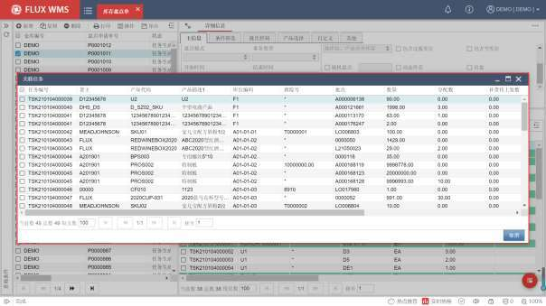

关联任务的获取，与库存盘点单表头的“库存盘点深度”选择有关，不同的盘点深度选择，所关联的任务范围也有所不同：

✓ NO-不合并库存。根据盘点任务的货主、库位、产品、跟踪号、批次号信息，查询任务表中未执行完成的任务，作为关联任务显示。

✓ LOC*TID*KEYLOT-按库位、产品、关键批次属性、跟踪号合并库存。由于批次属性合并，不提供关联任务查询，右键功能项“关联任务”不可用。

✓ LOC*TID*SKU-按库位、跟踪号、产品合并库存。根据盘点任务的货主、库位、产品、跟踪号信息，查询任务表中未执行完成的任务，作为关联任务显示。

✓ LOC*KEYLOT-按库位、关键批次属性合并库存。由于批次属性合并，不提供关联任务查询，右键功能项“关联任务”不可用。

✓ LOC*SKU-按库位、产品合并库存。根据盘点任务的货主、库位、产品信息查询关联任务。

- 无差异确认

针对未确认的盘点任务，批量确认盘点执行，数量等同任务数量。

- 生成调整单

<!-- 原 PDF 第 651 页 -->

盘点结果输入后，根据损益情况创建调整单。需要注意的是，合并库位、跟踪号盘点模式，由于盘点结果为合并后的库存记录，不能直接创建调整单。

- 生成盘盈入库单

由于合并盘点模式不适合直接生成调整单，也有些作业情况由于 ERP流程要求不能直接通过调整修正库存，因此系统提供根据出、入库单据修正库存的功能。根据盘盈结果，创建入库单据，收货后增加库存。

- 生成盘亏出库单

根据盘亏结果，创建出库单，并分配库存。单据发货后库存相应减少。通常与“生成盘盈入库单”功能配套使用。

- 显示库存数量

盘点任务部分，库存数量默认隐藏，可通过此功能显示库存数量列。

- 库位清单

客户出于审计要求，有时会指定多个库位进行盘点。通过库位清单功能，可导入指定的库位列表，并以此为条件生成盘点任务。

- 打印盘点 任务清单

打印纸面单证，用于仓库内盘点操作。

- 打印盘点损益单

打印盘点结果单据，仅列出有库存差异的记录。

- **明细右键菜单**

明细部分，盘点任务鼠标右键菜单功能有：

<!-- 原 PDF 第 652 页 -->

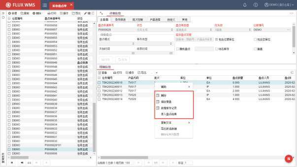

- 删除

所选的指定盘点任务删除。

- 指定复盘

所选的盘点任务强制生成复盘任务。

- 新增库存记录

盘点过程中，发现的没有相关任务的盘盈情况（例如空库位不盘点时，原跳过的空库位上发现有库存，需要添加盘盈记录），此时录入盘点结果没有可依据的任务行，就可以通过此功能，添加一个行任务数量是0 的盘盈任务记录。

点击功能后，在如下对话框中录入盘盈库存信息，批次属性字段根据所选产品动态显示：

<!-- 原 PDF 第 653 页 -->

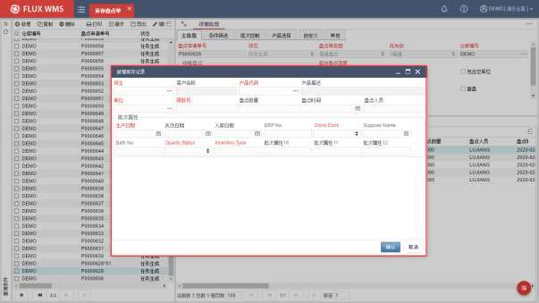

- 录入盘点结果

盘点任务默认处于只读状态，只有执行右键“录入盘点结果”功能，才切换到现在的可编辑的状态。

## 10.8. 库存冻结

库存冻结功能类似库存冻结单，可以对指定库存进行冻结处理，但库存冻结是实时操作、生效；而库存冻结单，则可以分步进行登记、审核、执行等操作。

- **库存冻结操作**

- 选择“库存管理”下的“库存冻结”功能。

- 新增冻结记录时，选择“主信息”页面，点击【新增】按钮，依次输入以下信息：

<!-- 原 PDF 第 654 页 -->

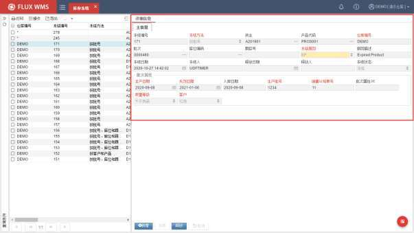

冻结编号－点击【新增】按钮后由系统生成的冻结记录流水编号。

冻结方法－对产品进行冻结的方式，系统提供按批号、按库位、按追踪编号、按批号库位和跟踪号、按客户、按客户和产品等多种方式供选择。冻结方法的多样性，能够灵活的满足客户进行产品冻结的不同层次需求。

不同的冻结方法，对应不同的冻结条件。选择冻结方法后，后续客户、产品等条件字段，仅有与冻结方法相应的字段可录入，无关的条件字段不可录入。例如选择客户冻结方法，产品、库位等条件字段不可录入。

货主－按客户或者涉及到产品的冻结方式时，所要冻结库存所属货主的客户代码。

产品代码－所要冻结的产品的代码。

仓库编号－指定冻结的库存所属仓库。跨仓冻结模式下，仓库无需指定。

批次－所要冻结的库存的系统批次号。

库位编码－所要冻结的库位。

跟踪号－所要冻结的产品跟踪号。

冻结原因－选择进行冻结的原因代码。可在系统代码中维护各种不同的冻结原因。

原因描述－开放字段，用于对冻结原因进一步具体描述。

<!-- 原 PDF 第 655 页 -->

冻结日期－确认冻结的时间，由系统自动记录。

冻结人－操作冻结的具体操作员信息。

释放日期－解冻确认时间。

释放人－解冻库存的操作员。

冻结状态－记录处于冻结状态，还是已经解冻，由系统更新。

- 点击【冻结】按钮，系统将相应库存冻结，会自动记录并显示冻结时间、操作人员等信息。

- 库存冻结后，在库存余量中可查看到库存冻结数量。已冻结数量，不属于可用余量范围。

注：系统支持跨仓冻结。非跨仓模式，仅冻结用户当前登陆的作业仓库内的库存。

- **库存释放**

库存冻结后，当冻结原因解决，或者冻结产品有了处理意见后（例如退货出库、销毁、维修等），需要将已冻结的库存释放，使之再度参与到操作环节中。

库存释放操作步骤如下：

- 选择“库存管理”下的“库存冻结”。

- 在查询页面输入条件，查询已有冻结记录。

- 选择所需冻结记录，在明细页面中点击“释放”按钮（或者鼠标右键功能释放），释放库存。

注：已释放的记录，选择后再次冻结，系统会复制此信息，生成一行新的冻结记录。原有的已释放记录不会被覆盖。

## 10.9. 库存转移

除了使用库存转移单进行转移操作，FLUX WMS还提供库存转移功能，进行快捷的转移执行。但相应地，库存转移功能，无法进行单据信息存储，审核，而是直接查询到库存记录，对相应信息进行变更。

- **库存转移操作**

库存转移的步骤如下：

<!-- 原 PDF 第 656 页 -->

- 选择“库存管理”下的“库存转移”功能。

- 在查询页签输入客户、产品、库位、跟踪号、批次号、批次属性等查询条件，进行对应库存查询。

- 在查询结果列表中，选择所要转移的库存记录行，双击跳转到主信息页面。

- 在转移信息部分，默认为库存原始信息，根据修改的需要依次输入变更后的目标信息：

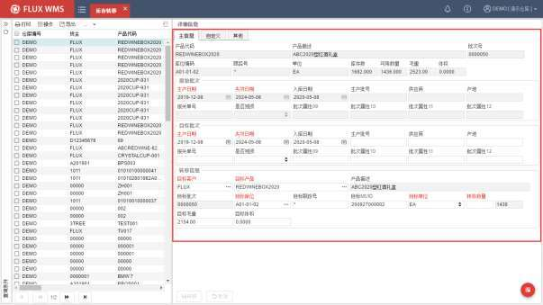

目标客户－转移后，库存所属货主的客户代码。

目标产品－转移后，所要变更为的产品代码。如果是转移同时改变所属客户，转移后的产品代码必须在目标客户下已经存在。即已经在产品档案中维护。

目标库位－所要变更的目的库位，默认为原始库位。即转移同时，可以同步达到移库的效果。

目标跟踪号－所要变更的目的跟踪号。系统给出的默认值为库存的原始跟踪号。

目标单位－所要转移的产品的数量单位。系统给出的默认值为该产品在产品档案中所选择的包装代码的主单位。客户也可根据情况自行修改。

转移数量－前一字段为所选择的单位为数量单位的移动数量，例如 1箱。后一字段为主单位数量。如果一条记录库存数量为 100，而转移数量为 20，则意味着仅针对 100个库存中

<!-- 原 PDF 第 657 页 -->

的 20个，修改信息。其余 80 个库存信息不变。

目标毛重－转移后的库存毛重。系统会根据产品档案中的标准毛重和转移数量计算目标毛重，用户可根据实际情形修改。

目标体积－转移后的库存体积。

目标批次属性－转移后的批次属性内容。

- 点击【转移】按钮，执行库存转移操作。

## 10.10. 库存调整

除了批量执行库存调整的库存调整单功能，系统还提供独立的库存调整功能，直接查询库存记录，进行调整的快捷操作。如果需要审核，或者记录更多附加信息，还请使用库存调整单功能。

- **库存调整**

- 选择“库存管理”下的“库存调整”功能。

- 在查询页签，输入客户、产品、库位、跟踪号、批次号、批次属性等查询条件信息，点击【查询】按钮，查询库存。

- 在查询结果列表中，选择所要调整的库存记录行，点击明细页签。系统显示库存相应信息。

- 在调整部分，输入变更内容：

<!-- 原 PDF 第 658 页 -->

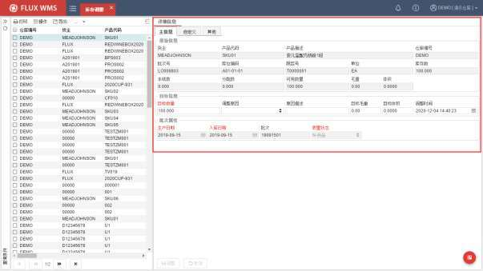

目标数量－调整后的数量，以主单位做为数量单位。

原因代码－进行库存调整的原因代码。

原因描述－对调整原因进行描述。

目标毛重－调整后的库存毛重。系统会根据产品档案中的标准毛重和调整目标数量计算目标毛重，用户可根据实际情形修改。

目标体积－调整后的库存体积。

调整时间－调整操作的时间。

- 点击【调整】按钮，完成库存调整操作。

## 10.11. 库存移动

库存移动，是仓库内进行库存整理的快捷功能，与库存移动单相比，无法进行库位规划建议，需要人工指定移动的目标库位。

- **库存移动**

- 选择“库存管理”下的“库存移动”。

<!-- 原 PDF 第 659 页 -->

- 在查询页面的查询条件字段中，根据需要，输入客户、产品、库位、跟踪号、批次号等查询条件，可以是“从……到……”的范围条件。也可以使用批次属性内容作为查询条件。点击【查询】按钮，查询对应库存。

- 在查询结果列表中，选择所要移动的记录行。

- 双击记录，切换到主信息页签，在“目标信息”部分，依次输入以下库存移动信息：

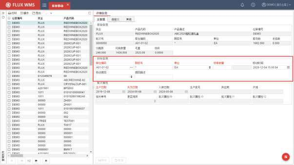

库位编码－库存移动的目的库位。默认为当前存放库位。

跟踪号－移动后的跟踪号。通常可以使用此功能修改产品库存跟踪号，默认同当前库存跟踪号。

单位－移动库存的数量单位。

移库数量－产品移动的数量。前一个开放字段以所选单位为数量单位，例如可以是 1托盘、5 箱等，后一个只读字段为主单位数量，便于用户在多包装级别情况下使用。数量默认为当前可移动数量（库存-分配数量-冻结数量-其他任务数量）。

移库时间－该产品执行移动操作的时间。

移动原因－选择产品移动的理由。所选下拉列表内容在系统代码中维护。

原因描述－对移动原因进一步说明。

- 点击【移动】按钮，系统执行库存移动操作。

<!-- 原 PDF 第 660 页 -->

## 10.12. 库存扫描作业

服装等行业需要通过扫描进行操作的产品，诸如入库、出库有相关功能进行扫描操作。但有时存在先收货，然后集中整理的业务需求。库存扫描作业功能，用于对已经在库的库存，进行扫描计数、整理到箱，并创建相关移库、转移单据，可对库存进行移库，或者良品不良品转换等属性变更操作。

- **库存扫描作业**

库存扫描作业的步骤如下：

- 选择“库存管理”下的“库存扫描作业”。

- 在如图界面，输入当前扫描库存的库位、跟踪号、货主代码作为范围限定条件：

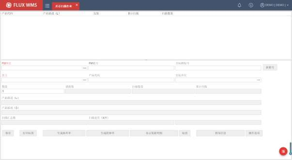

- 整理成新箱的情况下，可以指的新的“目标跟踪号”，或者点击【新箱号】按钮，由系统根据流水号规则生成新的目标跟踪号。

- 扫描产品条码，系统显示产品描述等信息，并对扫描记录进行累加

- 如果“操作选项”中勾选了“满箱提示”，当所扫描产品累计数量满足包装设置中的箱数量时，系统提示满箱，用户可进行封箱、打标签、换箱等操作。

<!-- 原 PDF 第 661 页 -->

- 扫描结果可保存。扫描全部完成后，通过按钮【生成移库单】或者【生成转移单】，创建相关作业执行单据。

- 已扫描内容，可通过【显示装箱明细】按钮，在弹出框中查看相关信息。

- 如果扫描整理过程中需要更换箱号 /跟踪号，可扫描“目标跟踪号”勾选保留跟踪号 CHECKBOX 系统保留扫描值，减少重复扫描。也可通过【新箱号】按钮，由系统生成流水箱号。

- 通过“逐件扫描”勾选，可切换为逐件模式，扫描即数量加一，无需另行确认数量。

- **操作选项**

点击界面的【操作选项】按钮，系统提供的配置项有：

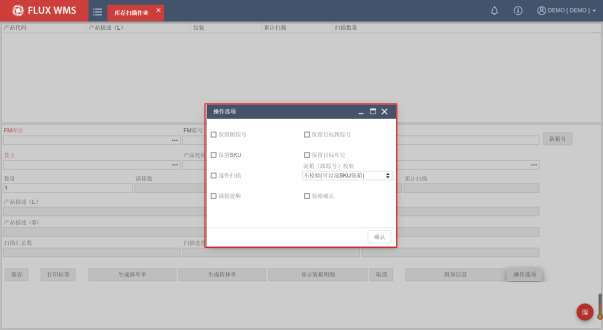

- 保留跟踪号

操作时，界面录入的原始跟踪号保留不清空。通常用在大批量操作情况下，例如一个托盘上的货物整理为多箱，会多次保存、刷新界面，但保留跟踪号，原始托盘号无需重新录入，方便操作人员连续作业。

- 保留目标跟踪号

操作时，界面录入的目标跟踪号保留不清空。通常用在大批量操作情况下，例如暂存库位的货物整理到目标托盘上，多次保存、刷新界面，下一 操作仍旧到同一目标跟踪号，此时保留

<!-- 原 PDF 第 662 页 -->

目标跟踪号，无需重复录入信息。

- 保留 SKU

扫描产品条码后，条码信息仍旧保留在录入框，只是全选中，方便用户连续扫描下一不同产品，或者直接回车，确认相同产品。

- 保留目标库位

保留录入的目标库位，直到人工修改目标库位内容。通常用在大批量操作情况下，整理后的库存需要指定移动到几个目标库位的场景中使用。

- 逐件扫描

逐件扫描模式下，每扫描一次产品条码，数量自动加1。

【产品档案】功能中，开启逐件扫描模式的情况下，不论【库存扫描作业】中是否勾选“逐件扫描”，都会自动切换为逐件扫描模式。

- 混箱（跟踪号）校验

整理到的目标箱号中，是否希望为单一产品箱。大批量退货整理场景中，希望将混杂的货物，整理为单一产品再上架销售的情况，开启此控制，扫描产品时，同一目标跟踪号下，如果扫描到不同产品，系统会提示报错。

系统根据参数RECEIVE_MIX_TRACEID（收货和库存扫描作业时，混箱（跟踪号）校验）配置获取默认值，现场有不同管理要求再切换选项：

- 选择“不校验”，可任意更换SKU 扫描，允许混箱。

- 选择“不允许混SKU装箱”，当界面上的目标跟踪号不是‘*’，则每次扫描产品时，判断是否有混产品的情况(界面上多于一种SKU)，有则报错“不允许混产品装箱”。即不同的SKU 不允许放入同一个ID 上。

- 选择“不允许混产品组 1装箱”，只有产品组 1 字段内容相同的 SKU可以混跟踪号（traceId）存放。通常服装行业中，产品组 1 字段存储款号信息，过季产品合并存储时，同款不同色或不同尺码的产品可以混放，但不同款产品不能混放。

- 满箱提醒

控制扫描产品到目标箱后，如果到达产品包装的箱层级数量设置，即满足一标准箱时，是否需要进行弹窗提示。通常在整理零散库位为整箱库存的情况下会开启。

- 装箱确认

一般在服装换季整理业务中比较常用。换季货品，从拣货区下架集中到整理区，然后扫描加入

<!-- 原 PDF 第 663 页 -->

到标准箱中，形成每箱统一数量的单一 SKU库存箱，方便后续批量管理。

此时，如果勾选“装箱确认”扫描产品，提示满箱后，系统即自动执行将满箱库存移库到目标库位的移库操作，相当于单箱快捷移库。此模式下，【生成转移单】、【生成移库单】按钮不可用。

如果【目标库位】字段未录入，提示报错，录入库位后，点击【保存】按钮触发单箱移库。

实际移库过程中，作业人员根据箱标签进行搬运，或者全部到统一的过季存储库位中无需细分库位。

- **其他**

- 附加信息

点击后，在弹出窗口中可以录入箱相关信息，例如长宽高、重量等。

- 序列号扫描校验

序列号管理场景中（SERIALNO_CATCH参数配置为2 级序列号管理），如果产品需要进行序列号采集（【产品档案】功能中，“序列号采集”配置为“强制采集”），扫描SKU 条码时，通过解析返回对应序列号，系统会校验此序列号是否在库，即是否在入库子序列号表中存在，并且在库标记仍旧是Y。

## 10.13. ABC动态分析

ABC 分析法(Activity Based Classification)，全称应为ABC分类库存控制法。又称帕累托分析法或巴雷托分析法。该分析方法的核心思想是在决定一个事物的众多因素中分清主次，识别出少数的、但对事物起决定作用的关键因素和多数的但对事物影响较少的次要因素，是帕累托 80/20法则的衍生。

应用于库存管理方面，通常来讲，可以理解为少量产品的进出作业量/价值金额，占比却比较大，因此应该作为管理的重点，一方面加强监管，提高盘点频次；另一方面可以将这些作业量最多的产品，布局摆放到最方便作业的库位，例如靠近进出口、巷道、集货区以减少搬运路径，或者拣货架排面中作业员最方便拣取的第 3~5层从而减少拣货时的下蹲、摸高等其他动作。

一般根据管理所需，按照一定的因素进行统计，发生累计频率排序前 0~80%的为 A 类，80%~90%为B 类，90%~100%的是 C。在库存管理中，常按拣货频次从高到低进行排序，排序百分比在 80%之前的，即拣货频率最高的这部分货物，为 A类货物；80%~90%的，偶尔拣货的货物，为B 类货物；最末的 90%~100%，很少拣货的，为 C类货物。

FLUX WMS 提供的 ABC 动态分析，就是根据一段时间内的作业情况，分析哪些货物的应属于

<!-- 原 PDF 第 664 页 -->

A类货物；哪些货物原本属于 A类货物，但由于换季等原因，拣货频次下降，应降级为 B类或者 C类货物。同时，又有哪些货物需要对应的从 A 类货架移动到到 B、C 类货架存放，以便让出方便拣取的 A类货架给其他 A类货品。

- **ABC 动态分析**

使用 ABC 动态分析，需要先在基础设置的【循环级别】功能中，配置 ABC 等级的对应占比。虽然按标准帕累托分析法，占比应为 80%、90%、100%，但 WMS 系统允许根据实际情况进行配置。并且除了排名百分比，也可采用排名的方式。具体设置，请参考基础设置章节的介绍。

使用 ABC 动态分析时：

- 点击“库存管理”下的“ABC 动态分析”。

- 在查询条件中，输入客户、时间段条件，选择按百分比或者排序。默认情况下过滤已经库存是 0 的产品，如果需要同样进行整理，可在查询条件中勾选“显示 0 库存整理”。

- 点击查找按钮，系统根据 ABC 循环等级条件，查询不符合条件、需要降等的产品记录，并给予级别建议。

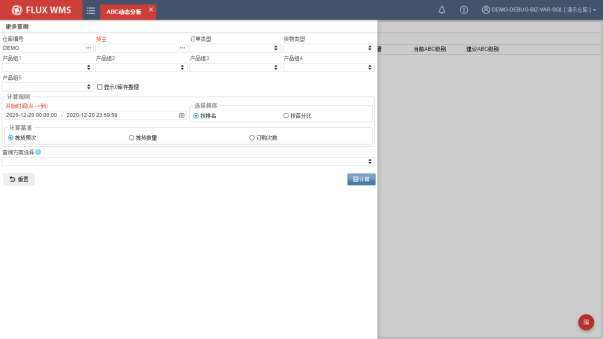

- 用户可勾选确认等级更新的记录，或者全选，通过鼠标右键菜单功能“执行 ABC调整”，由系统更新产品档案中的循环级别。

<!-- 原 PDF 第 665 页 -->

- 选择产品，通过鼠标右键菜单功能“生成库存整理清单”，即产品所在库位的等级与产品循环等级不符的记录，需要移动库存。

- ABC 分析法本身并不更新库存对应库位，需要实际执行库存移动变更库位。

- **鼠标右键功能**

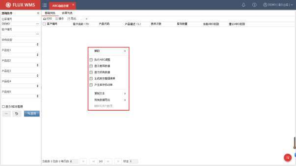

- 显示差异数据

ABC分析时，只显示等级需要调整的产品记录。

- 显示所有数据

ABC 分析时，显示全部符合查询条件的产品记录。有时产品的 ABC 等级不需要更新，但产品所存放的库位与等级不符，需要进行库存整理，因此系统支持显示全部产品数据。

## 10.14. 库存对账

WMS 系统与 ERP 对接的业务场景中，通常 WMS 通过接口从 ERP（或者其他上游系统）获取单据指令，操作完成后反馈操作结果给 ERP。WMS 与 ERP各自在系统中进行库存加减变动。

但接口传递，以及各自系统单据处理过程中，可能会碰到异常情况，例如连接中断接口传递失败，或者调整、发运确认等单据处理不成功。虽然接口、系统处理有各种重传、预警、异常处理机

<!-- 原 PDF 第 666 页 -->

制，为了最大限度的保障跨系统数据一致性，FLUX WMS 提供了库存对账功能，通过 DATAHUB接口，将 WMS 库存与 ERP库存进行核对，以便尽早发现库存数据不匹配的情况。

当然，两系统数据不匹配，不一定全部是库存异常，例如 WMS 发货后信息回传给 ERP，ERP尚未执行完发货处理时，进行库存比对，会得到两系统库存不一致的结果。因此库存比对，会选择作业结束后的时点进行。

使用库存对账功能时，需要先按业务需要，配置对账规则，然后查询对账结果。具体差异数据的检查、处理，还需要双方管理员相应处理。

### 10.14.1. 对账规则配置

由于现场业务情况不同，对账的维度也会不一样。例如按库存的生产日期汇总进行比对，或者按库存的生产日期+质量状态汇总进行比对。

使用时，可以在库存对账功能中，设置对账规则，即与 ERP（或其他上游系统）对账时的维度。由于类似生产日期，质量状态等信息，会维护在批次属性中进行管理，对账规则也主要是配置库存汇总时的属性维度，例如仅按批次属性 03（生产日期）进行汇总，还是需要需要按批次属性 03（生产日期）+批次属性 08（质量状态）进行汇总。

- **对账规则配置**

- 选择“库存管理”中的“库存对账”功能。

- 在如下界面，查询条件部分，“客户编号”条件字段输入所需配置的货主 ID，然后列表空白处点击鼠标右键，选择右键菜单的【库存对账规则】功能：

<!-- 原 PDF 第 667 页 -->

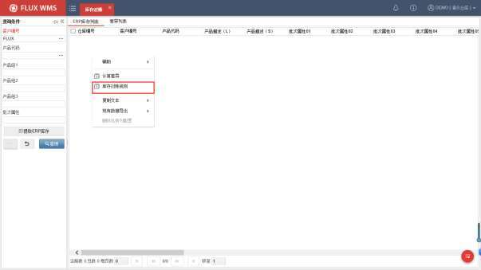

- 系统显示货主对应批次属性配置的属性字段：

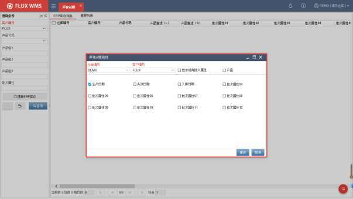

- 根据 ERP业务要求，选择汇总所需的批次属性维度。例如按生产日期汇总。

- 点击【保存】按钮，完成此货主的规则维护。

<!-- 原 PDF 第 668 页 -->

- 对于混货主的情况，可以勾选“显示所有批次属性”CHECKBOX，界面显示 24个批次属性，方便现场扩展配置。

- 对于需要按产品层面进行比对的情况，可勾选“产品”CHECKBOX。

- 如果未勾选产品，也未勾选批次属性，则根据仓库总库存进行比对。

### 10.14.2. 库存对账

日常操作时，系统会根据所配置的规则，进行库存合并、比对：

- **库存对账**

- 选择“库存管理”中的“库存对账”功能。

- 根据需要，输入查询条件，点击【提取ERP库存】按钮，通过DATAHUB接口，获取符合查询条件的ERP 库存信息。DATAHUB接口相关配置，请参考DATAHUB文档，或者咨询FLUX顾问。

- 根据 ERP反馈的库存信息，显示在“ERP库存列表”页签中。不同ERP反馈的库存信息内容字段可能有所不同，例如有的按产品分行显示，有的同一行产品再按库存状态，良品不良品分列显示。

- 鼠标右键菜单，选择“计算差异”，系统根据对应的对账规则，将WMS库存信息汇总后，与ERP库存信息比对，将有差异的记录显示在“差异列表”页签。

## 10.15. 图形化库存 2D

在库存余量功能中可以查看到实时库存情况。但对于仓库整体利用情况显示不够直观。因此系统提供图形化库存查询功能。

由于仓库实际为 3维空间，有众多库位，而系统为 2 维平面界面，即使采用立体图模式，也会有库位被遮挡，影响“直观展示库存”的目的实现，所以在 2D 模式的图形化库存查询功能中，采用多级展示的模式显示库存情况。

第一级，仓库俯视图。从上向下（XY 轴）展示仓库整体库位占用情况。对于多层货架的库位整体展示。

第二级，在第一级的俯视图基础上，点击某一排货架，显示此排货架的库存情况正视图（由于货架走向可能是横向或者纵向，因此正视图可能是 XZ 轴，或者 YZ轴方向）

<!-- 原 PDF 第 669 页 -->

第三级，点击具体库位，显示此库位的库存详情信息。

- **作业准备**

使用【图形化库存2D】功能，需要先对设施、工作区，以及库位的坐标、像素信息进行设置，以便系统显示库位图形时调用。

需要说明是，2D 模式的图形化库存，使用的是相对长度模式，系统按比例显示图形。即并不需要按实际库位大小设置像素等信息，而是根据多个库位间数值比较进行显示，例如 X像素是 10的库位，显示的横轴大小是 X像素是 5的库位的 2倍。

- 在【仓库设置】 -【设施】功能中，维护仓库内的设施信息，即仓库建筑或楼层信息。后续图形化库存查询时，根据设施分别显示。例如4 幢楼，配置为4 个设施，每次可以选择其中一幢楼查看。

- 在【仓库设置】-【工作区】功能中，维护工作区与设施的对应关系。

- 在【仓库设置】-【库位】功能中，维护库位空间信息：

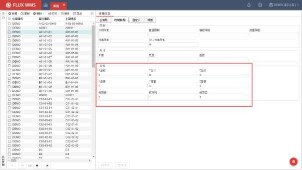

- X、Y坐标－图形化界面上，代表库位的格子的坐标点。以界面左上角为原点（0,0）。

- Z坐标－为第二级货架正视图的货格高度定位信息，以便不同层货架高度不同的情况进行对应显示。

- 层数－库位层。第二级界面显示货架正视图情况下使用。

<!-- 原 PDF 第 670 页 -->

- 货架排－区分库位排组使用，同一排组内的库位，在第二级货架正视图中一并显示。由于库位排，与库位组经常交叉（一组多排），因此新增字段使用。多个库位可属于同一排，因此不进行唯一性校验。

- 货架列－区分同一排的多列库位位置使用。

- X、Y 像素－代表库位的格子的长、宽。针对第一级俯视图情况下使用。

- **库存查询**

- 选择“库存管理”下的“图形化库存2D”功能，默认显示首个设置的仓库平面图，即俯视图，可以通过左上角的“设施清单”下拉列表切换设施：

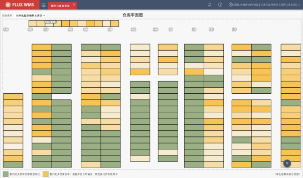

- 点击图中的某个格子（即某列货架），系统会从俯视图，切换到这列货架的正视图，并显示库位内首个货品的简要信息：

<!-- 原 PDF 第 671 页 -->

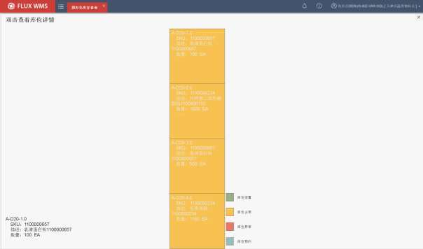

- 进一步点击代表具体库位的格子，可以显示此库位内的库存详细情况。

## 10.16. 图形化库存 3D

为方便用户对仓库库存情况有更加直观的感受，系统提供“图形化库存 3D”功能，将仓库的布局和库存以 3D图形的方式进行显示。

- **作业准备**

由于要以 3D 图形模式进行仓库展示，在进行图形化库存查询之前，需要先对仓库内的库位布局情况进行详细设置，以便可以根据库位信息进行布局建模。需要提醒的是，3D 模式需要按实际货架物理位置信息进行配置，包括货架中的库位坐标、库位长宽高，设置数据的单位是公分（厘米/CM）。同一库位，不支持同时使用 2D 模式和 3D 模式的图形化库存查询：

- 在【仓库设置】 -【设施】功能中，维护仓库内的设施信息，即仓库建筑或楼层信息。后续图形化库存查询时，根据设施分别建模显示。例如4 幢楼，配置为4 个设施，每次可以选择其中一幢楼查看。

- 在【仓库设置】-【工作区】功能中，维护工作区与设施的对应关系。

- 在【仓库设置】-【库位】功能中，维护建模所需信息：

<!-- 原 PDF 第 672 页 -->

- 维护库位所属的工作区，从而使得库位与设施关联，可以根据设施切换显示范围；

- 配置每个库位所属货架列信息。列号即一组货架的组号，建模时对应一个独立模型元素。地面平仓一个库位一个独立组号。

- 配置库位的 X\Y\Z坐标信息（单位公分）。一组货架的原点库位（即左下角库位）的坐标位置决定了货架的显示位置，其余库位的坐标信息用于库位排列比较，比如是横向的第3 个库位还是第5 个库位。

- 配置库位的 X\Y\Z像素信息，即库位长宽高信息。为简化配置，减少配置信息不一致导致建模失败，系统将原点库位的长宽高，乘以XYZ 方向的库位个数，换算为货架组的长宽高使用。

- 在【仓库设置】-【图形化库存文字设置】功能中，配置希望显示的文字说明信息。例如通道信息，分区信息等。

- 通过【仓库设置】 -【库位】功能的鼠标右键功能“3D 建模”，进行建模信息上传。通常由管理员进行操作，库位信息没有变动情况下，无需重复建模。

- 对于仓库规模较大，库位众多的场景，通常建议建模触发15~20分钟后，再进行图形化库存查询。

- **图形化库位查询**

- 选择“库存管理”下的“图形化库存3D”功能。

- 系统默认显示首个设施的库存情况，首次显示由于需要下载模型数据包，等待时间较长，后续再次使用会从本地打开模型，显示速度比较快

<!-- 原 PDF 第 673 页 -->

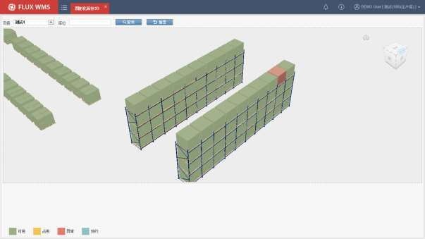

- 通过鼠标滚轮可以放大、缩小显示；鼠标左键点击拖曳可以变换角度显示；鼠标中键拖曳则界面移动（例如将界面边缘库位拖曳到界面中心展示）

- 双击库位，弹窗显示库位内首个库存记录情况。

- 通过左上角“设施”下拉列表，可以切换设施显示。

- 输入库位条件（支持多个库位，逗号分隔）进行查询，则高亮定位显示对应库位。
