# 11. 出库操作

> 来源文件：`富勒WMSV6.2（最全版1119页）.pdf`；原 PDF 第 674-867 页。

> 本文件按原 PDF 正文中的顶层章节拆分；每页保留原 PDF 页码注释，图示按原图注顺序引用。

<!-- 原 PDF 第 674 页 -->

出库流程是仓储管理的一个重要环节，现代物流对出库作业的时效性、准确性都有较高要求。在出库流程中，对仓库货品的发货要求被记录下来作为订单，仓库按要求拣选出货品并进行发运。出库流程的目标是最优化的履行订单并且增强存货控制。

出库流程的常见操作步骤为：

- 发运订单创建（/合并订单）

- 订单（预）分配

- 订单拣货

- 确认发货

在多产品、小批量出库情况下，为了对仓库出库货物加强管理，提高出库准确性，还可以根据操作需要选择出库附加操作，例如：

- 销售订单

- 出库复核

- 配送单作业

- 集拼箱

- 装车

- 出库放行

- ……

## 11.1. 发运订单（SO）

发运订单是货主对仓库里存储的货品，所下达的出货要求指令。它记录所要求出库发运的每种商品的数量和每次送货的目的地，以及其他附加出库要求。

发运订单是出库流程中必不可少的操作依据，但可以通过不同方式来创建。系统支持通过人工录入创建、文档导入创建，通过库存余量功能生成发运订单，以及通过接口传递订单信息创建订单等不同操作模式。

<!-- 原 PDF 第 675 页 -->

### 11.1.1. 单证创建

- **发运订单表头创建**

发运订单有多种创建方式，在没有其他系统对接的情况下，常见的创建方式之一是人工录入创建订单。具体操作步骤如下：

- 选择“出库操作”下的“发运订单”。

- 点击【新增】按钮，在表头的主信息页签中，输入如下信息：

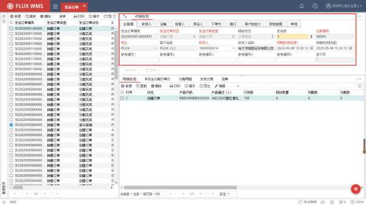

发运订单编号－订单号码，也是发运订单的唯一标识。当新增一个发运订单时，系统根据流水号规则，自动给出该编号。如果在【客户档案】功能的“控制信息”页签中配置了“按货主生成流水号”，在发运订单保存时，系统会把当前所选货主的 ID作为订单号前缀，生成例如“FLUX20200603001”的流水号。

发运订单状态－该订单的状态。系统提供创建、部分预分配、预分配完成、部分分配、分配完成、部分拣货、拣货完成、部分发运、完全发运、取消、完成等多种状态值。当新建一个发运订单时，系统自动给出默认状态为“创建订单”。

发运订单类型－发运订单的类型，例如正常销售订单，还是退货出库订单。通常根据货主的业务分类要求，或者仓库的不同作业模式进行类型定义，在【系统代码】功能中进行配置。用户可根据其业务模式，在 FLUX顾问的指导下设置多种订单类型。后续订单查询、波

<!-- 原 PDF 第 676 页 -->

次组合、任务筛选等作业环节，都可以根据订单类型来配置不同的作业处理，进行分流操作。

释放状态－订单是否已通过审核，可以进行发运操作。未经过审核的、未释放状态的订单可以进行库内拣货等操作，但不能确认发运出库。如业务流程不需要不使用审核、释放功能，可将系统参数 RLS_CTL（缺省 SO订单释放状态）设置为 Y，新增订单时即默认为“订单释放”。

优先级－订单作业的优先顺序。通常在 RF 或自动化设备操作过程中，对作业任务进行排序时使用。

仓库编号－发运单所属作业仓库。手动新增发运订单时，系统自动获取当前用户登录仓库信息并且不可修改。

货主－指定发运的货物所属货主的代码，后续客户名称为对应货主的名称描述。

收货人－产品要交付的目标方客户代码、名称。

预期发货时间 1/2－预期发运该订单的时间段。系统自动给出当前时间为预期发货时间。客户可根据情况进行修改。

参考编号（1-5）－客户需要的，或订单的其他相关信息，例如 ERP 单号等，可在界面方案中配置所需的字段名称（具体配置细节，请参考【4.10 界面方案管理】章节的介绍）。

波次号－订单所属波次的号码。如果订单未加入波次，则显示为“*”。

- 在收货人页签，默认显示收货人基础档案维护的信息，可以根据需要修改为此单的收货地址信息：

<!-- 原 PDF 第 677 页 -->

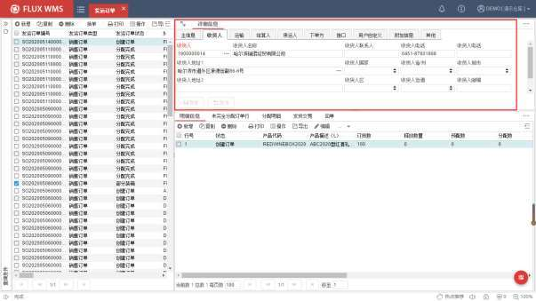

收货人－产品要运给的目的方客户代码。系统自动显示主信息页面中输入的收货人代码。

收货人名称、地址、城市、省/州、国家、邮编、联系人信息－该收货人的信息。系统自动给出该收货人在客户档案中所输入的信息，用户可手工修改。

如果收货人在客户档案中维护过多地址信息，在多地址模式下，可通过地址栏位的快速检索按钮，查看其它多地址信息，并选择其他地址作为此订单的收货地址。

- 点击运输页签，在界面中，根据需要输入相应运输信息：

<!-- 原 PDF 第 678 页 -->

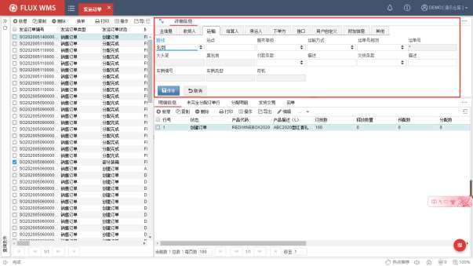

路线－订单运输路线。默认为收货人在客户档案中设置的默认路线，下拉列表内容在系统代码的路线代码中维护。路线在仓库内，常与集货位计算相关，将相同路线、站点的订单集货在一处，方便运输装载。具体集货位逻辑，可参考集货位部分的介绍。

站点－订单运输的卸货站点。同一路线运输时，可能会经过多个装卸站点，例如北京到上海长途运输时，沿途的济南、无锡各有一个卸货站点；市内配送的路线可能每个区安排一个卸货点作为站点。集货位管理时也常根据站点安排集货，同一站点的小件货物也可以打包在一个大物流容器中，比如托盘、笼车上，或者根据站点安排装车、卸车顺序，方便装、卸货操作。

服务等级－不同订单的运输要求不同，例如普通，加急等，可划分为不同的服务等级。通常使用在订单筛选、运输系统派车计算等环节。

运输方式－系统支持如海运、空运等不同运输方式选择。下拉列表中的运输方式选项可在系统代码中维护。不同运输方式的订单，有时会有不同的时效或者打包要求，通常会分开组合波次，分别拣货。

运单号规则－通过系统计算生成运单号（快递面单号）时的计算方式。例如流水号模式，每单唯一运单号模式，分区运单模式等。

运单号－计算所得的运单号，或者接口获取到的承运商运单号。

大头笔－快递目的地分拣信息，通常由承运商通过接口提供信息，系统相应打印在快递

<!-- 原 PDF 第 679 页 -->

面单上，方便快递配送人员查看。

集包地－快递分拣集包信息，通常由承运商通过接口提供信息，用于快递面单打印。

付款条款－付款方式的选择。用户可在系统代码中配置所需付款条件。

描述－对付款条件进行描述。

交货条款－交货方式的选择。如理货站-理货站、场站-场站、门到门交付等交付方式。后续可以按不同交付方式，对订单进行分组、采用不同作业方式，或者运输车辆计算等。

描述－对交付方式进行描述。

车辆编号－记录运输系统派车号码。

车辆类型－记录运输系统派车车辆类型。

司机－记录运输系统派车司机信息。

- 结算人、承运人、下单方信息：

信息内容与收货人基本相同，点击浏览按钮可选择对应类型的客户档案信息。

结算人－通常情况下，一个发运订单的出库相关费用，是由货主支付的。但特殊情况下，有可能付费方与货主并不相同，例如出库费用由集团或收货方支付，此时就需要指定此订单的结算方，以便进行费用结算。

承运人－订单的运输方，操作过程中打印面单等作业单据，可根据不同承运人（或者货主、收货人）由系统自动调用不同的打印模板。

下单方－多数用在有客户代理，由代理方下达订单指令的业务情况，因此需要分别记录货主、结算方、下单方。

- 点击【保存】按钮，完成订单头信息创建。

- 在接口页签，可以查看到接口相关信息。

<!-- 原 PDF 第 680 页 -->

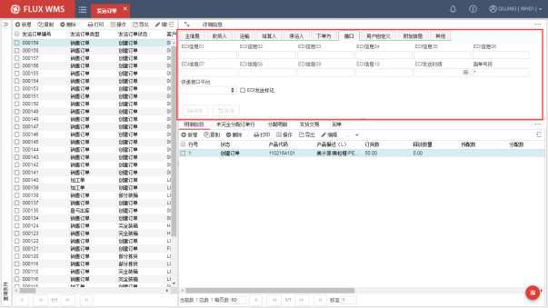

H_EDI_01~10－接口传递字段，字段名可根据现场需要自定义。

EDI发送时间－接口发送的时间信息。

渠道－订单来源渠道。例如电商订单经常需要区分来自天猫的订单，来自京东的订单。渠道信息为接口下达时写入。

快递接口平台－同一个承运人承运的订单，存在快递接口路径不同的情况，例如同样是圆通承运的订单，有的需要调用圆通自己的快递信息接口，有的订单则是需要调用综合性的菜鸟快递接口，所用的快递接口平台不同，通常根据货主与承运商的约定确认。系统按照订单中的仓库、货主、承运人信息，与预先在根据【业务规则】的【快递接口平台规则】中配置的平台选择要求，匹配到对应的快递接口平台。调用快递接口时，datahub 可以根据这些信息判断需要调用哪种快递接口。

EDI发送标记－订单是否已经成功发生接口信息的标记。

分单标记－订单多次发运情况下，系统提供分单功能。对于原始订单，自动更新订单的“分单标记”，以便接口根据上游系统要求，对部分发运的情况，区分订单操作结束（无分单），和多次发运（有分单）的不同场景，进行不同的接口回传处理。

- 在附加信息页签，维护信息：

<!-- 原 PDF 第 681 页 -->

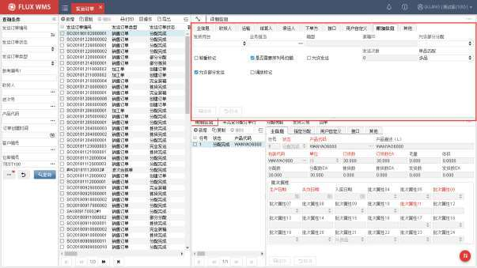

发货月台－出库装车月台。

业务担当－订单相关业务人员。

箱类－订单指定装箱大类，通常由 ERP 指定，通过接口写入。

箱型－订单指定装箱箱型，接口写入。通常用在有多种箱型的作业现场，上游 ERP 系统指定出库所用的装箱箱型。

允许部分分配－该订单是否允许部分分配。通常情况下，仓库内根据客户、订单类型区分设置是否允许部分分配。但特殊情况下，某单与其他订单设置要求不同，此时可通过接口获取对应指令标记。例如正常出库单不可部分分配，但某单应收货方要求，加急出库，允许部分有库存货物先发货，即标记为允许部分分配。

称重标记－订单是否已经称重。

是否需要序列号扫描－此订单是否执行序列号管理相关扫描。

允许发运－订单是否可发运。通常由发运规则控制，指定作业全部完成，系统为订单标记“允许发运”，则允许定时器将此订单自动发运。

发运次数－通过定时器对订单进行发运时，特殊情况下，会有订单发运不成功的情况，需要人工检查干预。为避免人工尚未检查处理时，订单反复发运，耗费系统资源，因此系统设定订单自动发运尝试次数，超过一定次数的订单，不执行自动发运。此字段用于记录当前

<!-- 原 PDF 第 682 页 -->

订单已经执行过的自动发运次数。

单品匹配－订单是否单品订单，以便系统自动筛选后作为单品复核订单进行操作。

允许部分发运－订单是否允许部分发运。

调拨标记－用于标记此订单是不同仓库间的库存调拨订单。

- 特殊费用页签：

特殊费用，用于订单相关的费用、成本记录，通常是临时性的不固定费用。例如订单的滞纳金、集装箱清洁费等不是每单都会必然产生的费用，需要人工进行维护。

特殊费用页签，默认隐藏在界面右侧的“更多页签按钮”中，点击后才会显示。

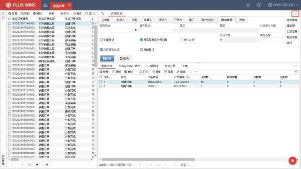

依次输入收费日期、收费类型、描述、金额等信息。可连续新增，输入多行费用信息。

<!-- 原 PDF 第 683 页 -->

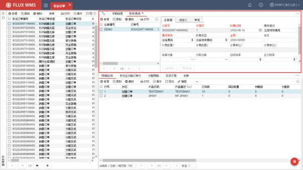

订单号－系统自动显示。

行编号－特殊费用行的行号，系统自动生成，用于区分同一订单下的多笔特殊费用记录。

收费日期－费用项发生的对应日期。

费用描述－费用项说明信息。

费用种类－特殊费用对应种类，相当于大类。系统按种类统计费用合计时的归类信息。

收费类型－根据费用种类所选内容，显示对应代码内容，相当于某大类下的具体小类。

金额－非计算模式，录入的此订单相关特殊费用金额。

成本－支付金额。有成本支出的情况下记录。

计费数量－费用计算数量依据。基于费率计算情况下，计费数量取【计费数量 1*计费数量 2】，按照级差进行计算。

计费单位－数量单位。

结算对象－付款人、结算人。仓库收取操作、仓储费用的目标对象。

付款对象－仓库支付劳动力费用、租借费用等成本类支出的收款人。

应收/应付税率－计税情况下的税率依据。

<!-- 原 PDF 第 684 页 -->

是否基于费率计算－如不勾选，只将特殊费用页签信息记入到费用清单；如勾选，需要根据特殊费用页签记录的费用种类、类型匹配费率中的设置，进行费用计算。

- 集装箱页签：

依次输入集装箱箱号、类型、尺寸、铅封号、重量、备注等信息。

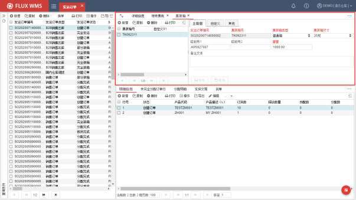

可连续新增，输入多个集装箱信息。

- 汇总信息页签：

用于记录出库汇总信息。依次输入总数、总毛重、净重等信息。

<!-- 原 PDF 第 685 页 -->

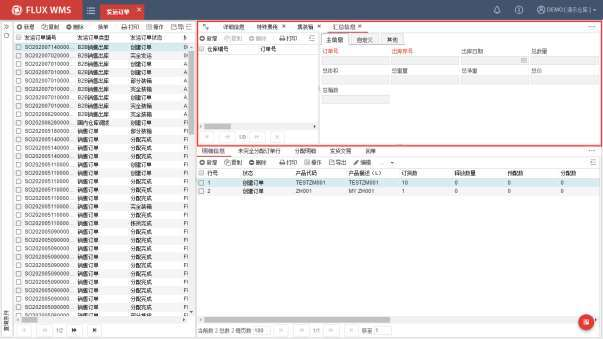

当订单状态更新为“订单完成”时，系统自动对已复核装箱包裹总重量和总体积、总箱数等信息进行计算，写入汇总数据。方便后续其他作业环节使用，提高处理效率。

- 附件页签

订单如有照片、 EXCEL 等文档，可通过附件页签进行管理。 点击【上传】按钮，系统显示如下的文件选择对话框。

<!-- 原 PDF 第 686 页 -->

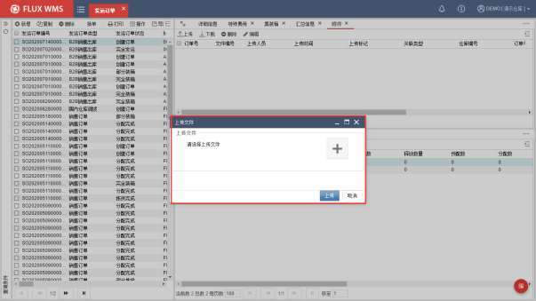

选择文件并确认上传后，系统显示如下的附件信息。

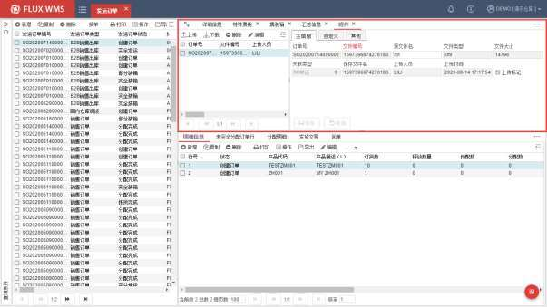

对于已有附件，可以通过【下载】按钮下载查看。

- **明细创建**

<!-- 原 PDF 第 687 页 -->

- 选择订单行部分，点击【新增】按钮，在明细信息的主信息界面中，输入信息：

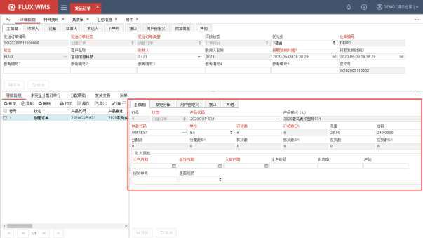

行号－发运订单行号，系统自动给出。

状态－该订单行的状态。新建时，系统自动默认为创建订单状态。

产品代码－所要发运的产品代码。可以通过浏览按钮选择产品。

产品描述－该产品的描述。当输入产品后，系统自动给出该产品在产品档案中维护的产品描述。

包装代码－该产品对应的包装代码。系统自动给出该产品在产品档案中维护的包装代码，用户也可根据情况选择其他的包装代码。

单位－发运时的数量单位。系统自动给出该产品在产品档案中所选择的缺省出货单位，用户也可根据情况选择其他的出货单位。

订货数－要求出库的产品数量。在订货数部分有 2个字段，前一个字段是可输入的，以所选择的单位为数量单位，例如单位为箱，录入 1即代表 1箱；后一个字段是以所选择包装代码的主单位为数量单位，并且是系统自动换算给出，例如根据 1 箱换算为 10 件，即显示10。

毛重－待出库货物的重量。订单明细的体积重量数据，会根据产品档案的单位毛重和订单数量自动计算，并支持修改，主要用于费用计算。发货库存扣减的体积重量则是根据数量

<!-- 原 PDF 第 688 页 -->

比例进行折算。

体积－待出库货物的体积。

分配数－系统分配数量。同样有 2个字段，前一个以所选择的单位为数量单位；后一个字段以主单位为数量单位。

拣货数－系统已拣货数量。

发货数－系统已发货数量。

批次属性－指定出库的批次属性内容，例如指定发产地为北京的货物，系统将按输入的批次属性出货。如果没有特殊出库要求（例如不限定产地），批次属性部分可为空，系统将根据库存周转规则的定义分配货物。此处的红色字体仅提示此内容在入库时为必输批次属性，出库时可根据需要指定。

- 指定分配页签，用于维护订单出库的指定条件信息：

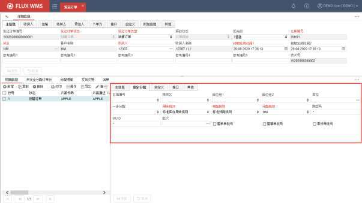

区域－指定拣货的区域。

拣货区－指定拣货的库区。如果同时指定了区域条件，拣货区只能显示此区域下的库区供选择。未指定区域，则可以选择当前仓库的库区。字段条件联动，可以避免指定条件相互矛盾导致分配失败。

库位组 1/2－指定出货库位的所属库位组。

<!-- 原 PDF 第 689 页 -->

库位－指定拣货库位。如果同时指定了区域、拣货区条件，只能选择指定范围内的库位。

一步分配－一步分配规则选择。

周转规则－该产品的库存周转。系统自动给出该产品在产品档案中所选择的库存周转规则，用户也可根据情况选择其他的库存周转规则名称。

预配规则－该产品的预分配规则。系统自动给出该产品在产品档案中所选择的预配规则，用户也可根据情况选择其他的预配规则。

分配规则－该产品的分配规则。系统自动给出该产品在产品档案中所选择的分配规则，用户也可根据情况选择其他的分配规则。

跟踪号－按输入的跟踪号出货。若输入了跟踪号，则不考虑预分配规则、分配规则和库存周转规则。

MUID－MUID 是多级跟踪号管理作业模式中，跟踪号 TraceID的集合组号。常见的作业模式是使用跟踪号 TraceID记录箱号，使用 MUID记录托盘号。此字段可以指定 MUID进行分配，不指定情况下默认为“*”。

批次－指定出库的库存批次号，此批号为收货时 WMS 生成的批次号。

整单单批号－医药行业常用，出库时一个订单行记录，是否只分配同一个生产批号的库存。

整箱单批号－医药行业常用，是否只分配同一个生产批号的整箱库存。

零货单批号－医药行业常用，是否只分配同一个生产批号的拆零库存。

- 自定义页签，主要信息有：

<!-- 原 PDF 第 690 页 -->

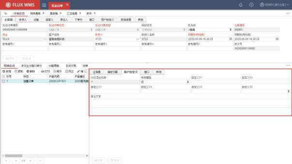

允许混合包装－即订单行是否单品记录，或单包装记录。

免拣赠品－此订单行是否无需拣货的复核台赠品。

- 点击【保存】按钮，保存新增明细信息。

- **相关参数**

参数 ID 参数描述 对应说明

ONE_STP_ALC 启用一步分配方法(系统不经过预配直接分配的 参数为 Y，新增明细时方法) oneStepAllocation字段默认为 Y，采用一步分配模式进行分配

### 11.1.2. 表头右键功能

- **订单取消、关闭**

- 订单取消

订单创建后，在没有进行操作的情况下不再使用该订单，可以使用表头的删除按钮直接删除订单，或者使用鼠标右键菜单中的订单取消功能，取消订单。

<!-- 原 PDF 第 691 页 -->

订单取消后，将不能针对订单进行任何操作，但仍然可以查询到该订单（查询条件需要选择“显示关闭/取消 SO”），有利于用户对订单进行统计、查询。

取消环节，支持根据【二次审核规则】所配置的要求，进行弹窗确认或双人确认。

- 订单关闭

订单关闭，同样结束订单操作，不能再对订单进行任何修改，与取消不同的是，关闭针对使用中的订单，并不限定只能是创建状态订单。

需要注意的是，操作进行中的订单不能被取消或关闭。例如订单已经分配，但未发运。不论是否部分分配，都要将已分配记录取消，订单恢复到创建状态，或者将已分配记录确认发货后，才能对订单关闭，仅创建状态的订单可以取消。

同时，订单关闭，会触发对应的出库作业费用计算；订单取消则可以生成相应的特殊费用、增值服务费用。

对于部分发运的订单，剩余数量如果仍旧需要操作，可以选择关闭订单时生成分单，系统会复制当前关闭的订单，将未发运数量拆分到新订单中进行操作。关闭时，是否生成分单，可以通过参数ORD_SPL（SO 关闭产生分单）进行控制。系统提供的参数值选择有：

- YES 强制产生分单：关闭时，未发运数量，自动拆分到新单中。

- OPTIONAL 弹出窗口由用户决定是否产生分单

- NO 不产生分单：直接关闭订单，不提示分单。

生成的分单号，默认为“原单号*流水号”模式，例如原单号“A04210029”，生成的分单号即“A04210029*001”，支持多次分单，对“ A04210029*001”订单关闭时再次分单，生成的分单号是“A04210029*002 ”。

分单号中的连接符“ *”，可以在【订单变更规则】中，“分单符号”字段修改。

- **发货相关操作**

按订单进行预配、分配、拣货、发货等操作。具体细节参考【11.3发货操作】部分的详细介绍。

- **拆分订单**

订单下单后，由于各方面原因，需要分批出库，此时可以根据需要将订单拆分。拆分订单仅限于创建状态订单才能操作，在明细列表中可以录入释放数量，然后选择鼠标右键功能项“拆分订单”，系统复制生成新订单，并将订单的订货数量，按照录入的释放数量，拆分为2 个 SO。原始 SO 中的数量，更新为释放数量。

<!-- 原 PDF 第 692 页 -->

- **冻结释放**

- 订单释放

对订单进行审核确认，使订单处于释放状态，可以进行发货操作。

- 订单冻结

对订单进行冻结操作，冻结订单不能进行拣货、复核等操作。

- 订单未释放

对订单进行审核确认时，由于各种原因，将订单置于未释放状态，不能进行发货操作。需要等待后续的释放操作

- 订单任务下发

更新订单释放状态为“任务下发”，常用于拣货任务下发给相关设备，如电子标签等。

- **单据打印**

系统提供的标准作业单据打印。

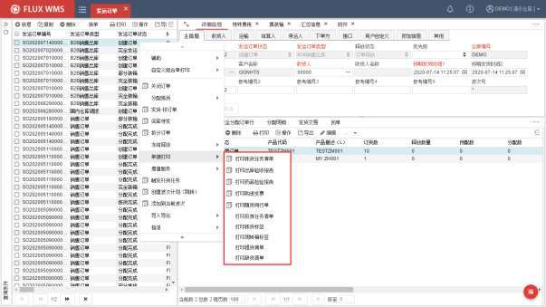

- **增值服务**

系统将增值服务相关的功能集合到“增值服务”子菜单中。

<!-- 原 PDF 第 693 页 -->

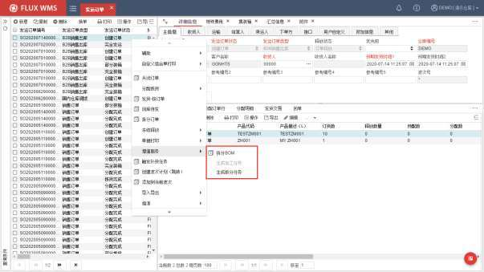

- 拆分 BOM

系统将订单明细中的组合件，按组件BOM 结构和数量设置(参见【基础设置】-【组件】)，拆分为多个零件产品的明细订单记录。通常使用在加工操作流程中，用于执行加工所需的零件的拣货操作。

拆分 BOM功能，也可单独使用，适用于按照BOM发子件产品，但不需要仓库中进行组装加工的情况，例如超市促销组合2 大瓶洗发水赠送1 小瓶正品沐浴露，无需仓库加工，只需要按BOM比例，由超市促销员现场组合发放。此场景如果不使用仓库组件管理，而是由上游 ERP系统直接按比例下达出库指令，等同于拆分BOM后的明细信息，实际作业效果相同。

在明细部分输入父件产品并保存后，选择表头鼠标右键菜单的“拆分BOM”功能，系统自动将明细行中的父件记录，按组件结构拆分为多条子件明细行，数量根据组件设置进行换算。

明细行部分的鼠标右键菜单中，也有“拆分BOM”功能，不同的是仅针对单个明细行拆分。

拆分 BOM 时，零件或者原材料的提取量，根据组件设置计算的数量可能存在小数，会根据作业情况考虑如何取整处理，通过参数KIT_BOM_RND进行配置。可以选择如下几种不同的取整方式：

- ORIGINAL保持计算出来的原值

- CEILING向上取整（多拣货）

- FLOOR向下取整（少拣货）

<!-- 原 PDF 第 694 页 -->

- ROUND X舍 X 入

- 生成加工任务

如果需要在仓库中进行简单加工、组装，可以使用加工单对加工操作进行管理。

发运订单拆分 BOM 后，分配子件库存，并确认拣货，即拣取加工用的零件或者原料。订单状态变更为“拣货完成”之后，通过点击表头右键菜单的“生成加工任务”功能，系统会根据子件分配明细记录，生成对应加工单，指导加工操作。

后续加工操作，请参看【13.增值服务】章节的详细介绍。

发运订单（SO）生成加工任务的操作，可以指定只能由加工类型的 SO 生成加工任务，也可以不做限制。通过系统参数 VAS_BOM_CTL（是否只有加工单类型的 SO 才允许拆分 BOM）的设置进行控制。

- **触发补货任务**

大量订单作业时，完全按拣货位上下限进行库存计算，有可能所补的货物不够订单需求数量，需要多次补货。因此可根据订单，提前补货，利用补充拣货位、快拣位，备足订单所需库存。

操作时，人工选择订单（可一次选择多个订单）或波次，右键菜单【触发补货任务】，系统将选中的所有订单的需求量汇总，进行补货计算。

- **创建波次计划（跳转）**

表头右键菜单选项，选择多条 SO 记录后，生成波次计划，并跳转到波次计划界面。具体波次计划的后续操作可参考【11.2 波次计划（WAVE）】章节的介绍。

- **添加到当前波次**

为已存在的波此计划（WAVE）添加 SO，须要先在波次计划中，点击明细部分的鼠标右键功能“增加”，再跳转到 SO，进行订单选择。然后点击“添加到当前波次”功能，将所选 SO，加入到指定波次中。可参考【11.3 波次计划（WAVE）】章节的介绍。

- **重新计算费用**

订单关闭时会根据费率设置计算生成此发运订单相关的费用明细，但如果遇到费率修改、或者体积重量等计费基准修改的情况下，可以在订单关闭之后，通过鼠标右键功能项触发重新计算费用，依据当前修改后的费率要求、体积重量信息等，重新生成费用明细。

- **导入导出**

- 导出药品监管码XML 文件

<!-- 原 PDF 第 695 页 -->

- 导出药品检验报告/购进发票/随货通行单

配合无纸化作业场景，将医药行业需要随货提供的药品检验报告、购进发票、随货通行单生成为 PDF文件压缩包。

文件命名规则为“订单号_收货人 ID”，如果收货人 ID包含符号，则去除所有符号，以免生成文件失败。

- 复制 SO

根据当前发运订单，复制生成新的、创建状态发运订单，仅订单号码、创建时间不同。

- **指派**

订单下达时，有些信息货主未指定，而是由仓库进行安排。或者是对已有信息进行变更，可以通过指派子菜单进行指定，例如原定承运人无法承运此发运订单，需要变更订单的承运人。

指派子菜单，也可批量更新订单的运输方式、路线、服务等级、运单号规则等字段内容。

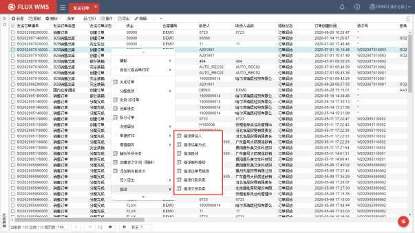

点击功能后，会弹出对应的承运人选择对话框，或者运输方式选择对话框等弹窗，确认信息后，会批量更新到所勾选的全部订单。

- **清除 SO 明细**

此功能仅在订单创建状态下有效，可删除全部订单明细。常用于导入订单明细后发现错误时的

<!-- 原 PDF 第 696 页 -->

反向操作，能够方便快捷的清空明细行信息，后续可以重新导入订单明细信息。

- **相关查询**

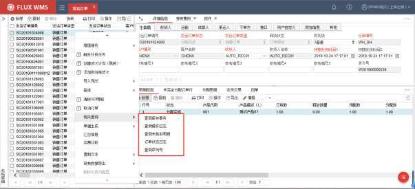

基于订单进行信息查询：

- 查询库存事务

跳转到库存事务查询界面，并将订单号带入查询条件，方便用户查询订单对应信息。

- 查询操作日志

部分操作，如打印单据等，没有库存变动，系统不作为历史事务进行记录，仅在后台 log中记录。如果个别作业对流程影响较大，可通过个性化配置为操作日志进行记录，并通过右键的“查询操作日志”功能，弹出窗口列表显示。

- 查询未装车明细

弹出窗显示订单中尚未装车确认的记录。

- 订单状态日志

为方便订单状态变动信息通过接口传递给前后端系统（如 ERP），开启个性化配置后，系统在操作过程中记录订单状态变化情况，选择此功能后，通过弹出窗口列表显示订单状态变动历史记录。

- 查询序列号

点击后，跳转到“出库序列号查询”功能，并根据订单号查询对应出库序列号。

<!-- 原 PDF 第 697 页 -->

- **单据生成**

单据生成子菜单中的功能，主要是根据SO 分配明细信息创建其他单据。

日常作业中，有时会根据货主所给的产品清单指令进行一些库存整理工作，或者批量修改库存信息，例如要求产品代码更新，代码由 SKUA 改成 SKUA1，需要重新粘贴产品标签条码。但货主所提供的指令，通常只下达产品名称、数量及需要修改的信息，很少会指明库位、跟踪号、批次等库存详细信息，难以直接用来导入生成移库单、转移单等作业单据。

为了便于操作，FLUX WMS 提供了根据 SO生成其他作业单的功能。在 SO中输入产品、数量及条件，通过系统进行分配，寻找合适的库存，再通过鼠标右键菜单功能，根据已分配的库存记录，创建对应库存作业单据，原 SO 自动取消分配，取消订单。

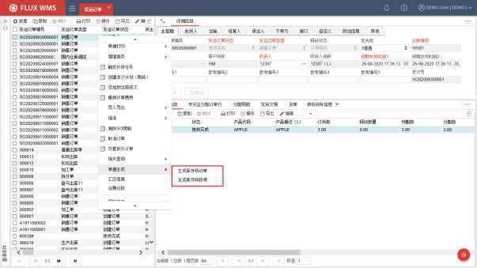

- 生成库存移动单

根据 SO 分配信息，创建库存移动单据，用于指导仓库内的库存布局优化。移库单的目标库位，可以根据上架规则由系统计算、生成建议。具体移库操作可以参考【库存管理-库存移动单】章节的介绍。

- 生成库存转移单

根据 SO 分配信息，创建库存转移单据，通常用于库存的批次属性变更，或者产品代码变更情况，也支持同时变更存储库位。具体转移操作可以参考【库存管理-库存转移单】章节的介绍。

<!-- 原 PDF 第 698 页 -->

转移单指令，也可以由接口通过上游系统下达，对接到库存转移类型的发运订单，分配库存后，生成库存转移单。此类操作，上游系统可能通过接口同时下达转移后的信息，例如 SKUA，变更为SKUB。此类目标信息，可以在发运订单明细部分的“转移目标信息”页签（位于扩展页签部分）中查看到，生成库存转移单时，会相应带入到转移单的目标信息部分。

- **汇总信息**

显示当前订单汇总信息，包括产品汇总的数量信息，订单数量及体积重量等信息，如下图所示：

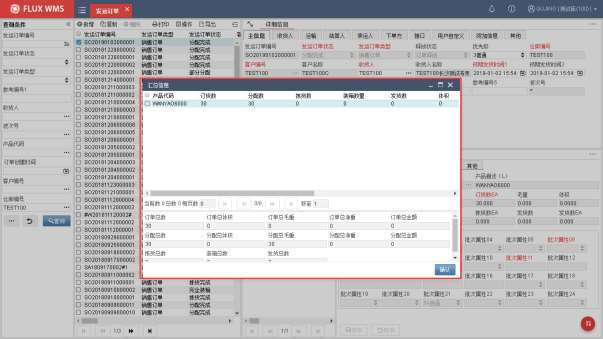

### 11.1.3. 明细右键功能

明细部分右键功能主要有：

- **拆分 BOM**

加工操作相关功能。明细行为父件SKU，通过“拆分BOM”操作，根据 BOM组件维护信息，按数量要求替换为对应的多行子件SKU信息。

具体加工操作步骤，可参考【13.增值服务】章节的介绍。

也有些业务情况，无需仓库加工，但需要根据客户指定的父件要求，拆分BOM 后，对相应的子件拣货、发运出库。

- **人工筛选库存**

<!-- 原 PDF 第 699 页 -->

库存分配时，可以指定批次属性，或者拣货区、库位、批次等条件，进一步限定分配的范围。但如果货主的条件比较细化，又不是通过接口下达具体条件（接口下达具体条件，可以直接按条件分配），有时人工挑选库存会更加方便。

例如跟踪入库日期的情况下，订单指令为一行未指定日期的出库 100件，货主另行邮件通知希望出 3/1、3/10、3/29入库的库存。此时可以修改订单明细，拆分为 3行，分别指定 3个日期的批次属性条件，但操作员并不清楚每个日期的库存有多少数量，查询库存再修改订单指令、分配，操作步骤比较多，不够便捷。这种场景可以通过“人工筛选库存”功能进行操作。

点击右键功能项，根据当前订单明细行的产品信息，系统弹出如下二级窗口，显示产品的对应的库存信息列表：

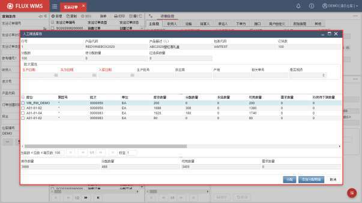

通过拖动滚动条，能够查看到库存记录的批次属性信息。勾选所需的 3个日期的记录，点击【分配】按钮，系统会在所选批次范围内，按分配规则、库存周转规则，依次进行分配。用户无需考虑每个批次具体数量情况，仅需要给出可分配的范围。

如果用户指令进一步明确，例如 3/1、3/10、3/29入库的库存，各要 15件。此时每个批次库存都大于 15 件，直接点击【分配】，有可能会出现 3/1入库库存分配 25件，3/10入库库存分配 20件的情况。因此，系统还提供了【添加分配明细】按钮，在列表部分的“需求数量”字段录入指定的数量，点击【添加分配明细】按钮后，系统根据每个批次的需求数量，分别生成分配明细，实现不同批次指定不同数量的分配要求，相当于查询库存、修改订单明细要求、分配 3个步骤整合在一

<!-- 原 PDF 第 700 页 -->

个界面进行操作。

- **指定产品供应商**

订单明细行部分，鼠标右键子菜单功能项。需要与产品档案中的供应商设置结合使用，能够限定产品所属的供应商。操作时，需要开启系统参数 SKU_SUP_LNK（产品与供应商绑定），设置为Y。

选择此功能，系统将产品档案中指定的供应商 ID写入到订单明细的批次属性 05，仅分配来源是这个供应商的库存，可以达到指定供应商出库的目的。如果一个产品有多个对应供应商，系统显示供应商二级窗口供用户选择。

- **包装材料**

二级窗口显示产品对应维护的包材信息。

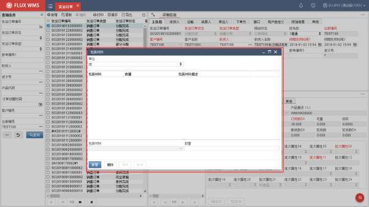

通过点击【新增】按钮，选择已经在组件功能中维护过的包装材料组合，并记录所用数量。

此环节记录的信息，可以用于报表统计，也可以用于管理包装材料库存情况下，对相应包材数量的自动扣减处理（自动扣减通常通过发运订单关闭时的扩展处理执行）。

- **复制批次属性到所有行**

订单明细的批次属性内容为出库指定条件，人工修改时，可选择一行作为样本，复制到其他各明细行，方便批量更新操作。

<!-- 原 PDF 第 701 页 -->

- **复制拣货区/库位到所有行**

订单明细的“指定分配”页签内容同样是出库指定条件，能够通过此复制功能，将信息复制到其他各明细行。

- **查询库存余量**

根据订单明细，跳转到库存余量界面，并以仓库、货主、产品作为条件查询库存。

### 11.1.4. 仓间调拨操作

两个仓库之间的库存调拨、转运工作，是一类比较特殊的出库、入库联动操作，即从一个仓库通过发运订单进行发货，所发的货物运到另一个仓库，通过预期到货通知进行收货操作。

调拨指令通常由上游ERP下达，因此不同的ERP 管理、接口模式，也带来了不同的仓库作业要求。

一类 ERP在通过接口下达调拨单时，出库指令与入库指令同时下达，或者是下达一个调拨指令，同时生成出库单、入库单。这种业务场景，发货、接收仓库可以各自操作，互不影响。

另一类场景，ERP仅下达一个调拨指令，需要先生成出库单，实际发货后，根据发货详情信息（不一定与发货指令完全一致），再生成另一个仓库的入库单。

因此系统通过参数WAREHOUSE_TRANSFER控制调拨入库单的不同创建模式：

- **接口写入调拨入库单**

参数配置为 N 情况下，由接口负责，根据调拨指令同时生成调拨出库单和调拨入库单，WMS不做特殊处理。

在此模式下，调拨出库单和调拨入库单可以使用不同订单类型、不同货主（不同子公司之间调拨，可能货主不同），具体细节可以根据业务需求进行接口处理配置。

但通常入库目标仓的调拨入库单的ASN 参考编号 1（asnreference1）与调拨出库单的 SO 参考编号 1（soreference1）相同，用于记录 ERP的调拨单号。

- **WMS 生成调拨入库单**

参数配置为 Y，即调拨入库单由 WMS 负责生成。

当调拨出库单（即调拨标记为 Y的发运订单）关闭时，WMS 系统自动根据调拨出库单货主、参考编号、表头/明细用户自定义、表头/明细接口字段等信息，以及实际发货的货品数量、批次情况，生成对应的目标仓库的调拨入库单。并且系统自动将调拨出库单序列号、子序列号相关信息，写入

<!-- 原 PDF 第 702 页 -->

调拨入库单的序列号相关信息表中。

这个模式要求调拨出库仓库、调拨入库仓库都在同一个 WMS 系统管理范围内，即调拨出库单的收货人是同一组织架构内的、已维护过的相关设置的另一个仓库。系统生成的调拨入库单据，与调拨出库单的货主相同，订单类型也使用相同类型代码（例如类型代码都是 TT，但入库单、出库单的类型描述可能不同）。

- 仓间调拨模式选择

WMS 创建调拨入库单的作业场景中，根据调拨出库单，所生成的目标仓库收货用的调拨入库单，有不同的维度需求，即希望生成的入库单的信息详细程度不同，系统根据参数WAREHOUSE_TRANSFER_TYPE（仓间调拨模式）的配置进行控制：

参数值选择为“LOT-按批次调拨”时，系统根据出库单所发运的产品批次属性，合并生成“入库调拨单”，因而可能存在调拨出库单只有一行订单明细，但分配了3个批次的库存，对应的调拨入库单就有3个订单明细行，分别对应不同批次库存的情况；

当参数值选择为“CARTON-按箱调拨”时，系统根据跟踪号+批次属性合并生成“入库调拨单”，这样调拨出库单只有一行订单明细，分配了2个批次库存，但装了3个出库箱的场景中，对应的调拨入库单就会是一个箱号一行，如果箱内混放不同批次也会分行显示。此类单据，能够支持根据箱号进行“按箱收货”操作的作业模式，无需开箱逐一清点。

## 11.2. 波次计划（Wave）

波次计划即订单合并操作，将多个SO 合并为一个订单组（波次计划/WAVE），进行统一的作业管理。订单合并后，相应操作也可以合并处理，在操作量上形成业务波动，例如 5 个订单中都需要拣取 A产品 10个，订单合并后，可以一次拣取 50个 A产品，减少拣货操作次数、往返路程。

波次计划能够支持用户将多种不同订单，依据某种共性合并在一个波次当中，整合为一个拣货作业，能够按照商品的库存周转规则和最有效的移动单元进行拣选。系统将这些拣货需求，匹配到最佳的拣货区域进行操作，例如直接采用整栈板拣货，而避免去补货的动作。

波次计划的执行可以减少操作人员对单证分别操作的重复工作量，提高操作效率和准确度。

执行波次计划时，并不是所有订单都适合加入波次，选择具有相同或类似订单明细的单证更能提高波次操作的效率。例如不同订单中，所需的产品完全不同，发货人也没有相关性，拣货路径没有可重叠、优化部分，此类订单即使合并，也不能有效减少操作的工作量。

<!-- 原 PDF 第 703 页 -->

### 11.2.1. 单证创建

要将多个订单合并处理，首先要筛选合适的订单用来组合波次计划。

系统创建波次计划，可通过设置波次规则、定时器，由系统后台定时筛选订单、创建波次计划（相关设置请参考【8.业务规则】-【8.5 波次计划规则】部分的介绍），也可以手动创建波次计划。本章节主要介绍手动创建模式。

- **创建波次计划**

手动创建波次操作步骤为：

- 选择“出库操作”中的“发运订单”

- 在查询页面根据需要输入查询条件：

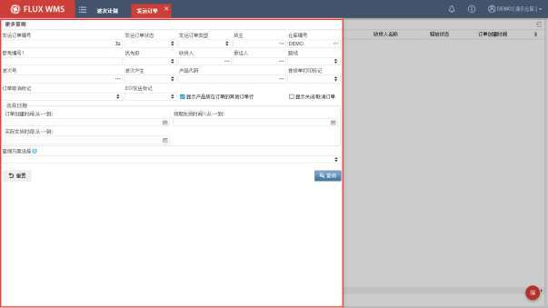

发运订单编号－SO 单号。

发运订单状态－订单目前所处操作状态，如创建、完全分配等。可查询状态区段，例如部分分配到完全分配的订单。

发运订单类型－SO 类型。根据需要筛选指定类型的订单。

货主－指定的货主代码。

仓库编号－默认为当前登陆仓库。

<!-- 原 PDF 第 704 页 -->

参考编号 1－发运订单参考编号 1。

优先级－发运订单的优先级。

收货人－发运订单的指定收货人。

承运人－发运订单的指定承运人。

路线－发运订单所属运输路线。

波次号－发运订单所属波次号。

波次产生－订单是否已包含在波次中（不限具体波次号）。

产品代码－订单中包括的产品代码。

拣货单打印标记－订单是否已经打印拣货单。

订单取消标记－筛选已被 ERP取消的订单（ERP 取消订单，仓库内可能还在作业途中，尚未完成全部作业撤销，库内发运订单状态有可能还不是取消订单）。

EDI发送标记－用于筛选已发送接口信息的订单记录。

显示产品所在订单的其他订单行－按产品查询时，是否显示结果订单中的其他产品行。默认选择此项，如果不选择，则只显示产品查询条件中录入的产品对应的明细行。

显示关闭/取消订单－查询范围是否包括已经关闭或取消的订单。

选择日期条件：

订单创建时间－发运订单创建时间范围。

预期发货时间－订单预计发货时间范围。

实际发货时间－订单发货时间范围。

- 如有需要，进一步录入扩展查询条件。

- 点击【查询】按钮，系统根椐输入的查询条件检索符合要求的订单。

- 在表头列表部分，勾选订单记录，或者通过鼠标右键“全选”功能选择全部查询到的订单。

- 点击鼠标右键，选择右键菜单中的“创建波次计划（跳转）”（如下图），系统将把当前选择的多个发运订单创建为一个波次计划，并切换到波次计划界面。

<!-- 原 PDF 第 705 页 -->

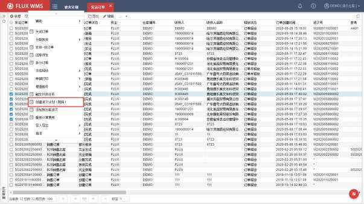

- 如果使用“添加到当前波次”功能，则是先创建波次后，再选择订单补充到同一波次中。通常是筛选条件不同，难以一次性准确查询，因此分多次查询订单，加入波次。

- **波次信息**

- 在“出库操作”的“波次计划”功能中，根据需要查询待操作的波次。

- 在查询结果显示的列表中，选择所需波次计划，系统显示波次主信息页面：

<!-- 原 PDF 第 706 页 -->

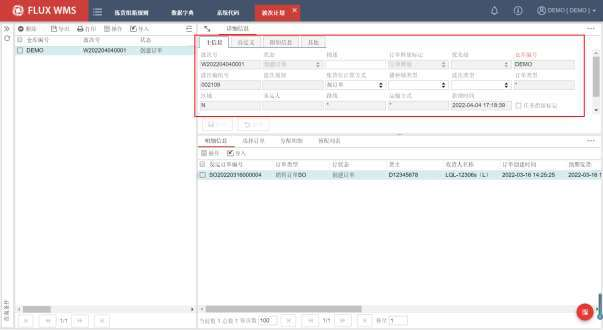

波次号－波次计划的单证号，系统自动生成。

状态－整个波次计划的状态，系统自动根据作业情况刷新。

描述－用户自行输入的、关于波次计划的描述信息。

订单释放标记－波次计划订单是否被审核释放。已释放波次才能进行发货操作。

优先级－波次计划规则根据订单优先级条件筛选订单生成波次时，记录指定的优先级。

仓库编号－波次所属作业仓库。

波次编组号－多个波次可作为一个打印编组，系统会相应生成波次编组号。

波次规则－记录波次计划根据哪个波次计划规则生成。通常在通过波次调度创建波次时写入（具体请参考【8.16 波次调度规则】章节的介绍），人工创建的波次此字段为空。

集货位计算方式－波次的集货位可以按不同方式进行计算，如按承运人计算集货位，或者按订单计算集货位。系统计算时，优先根据波次中此字段的配置计算，如果未配置，则根据参数 SRT_TYP（集货区分配方法）配置进行集货位计算。

播种墙类型－波次播种、图形化播种作业中所用的播种墙类型，根据基础设置播种墙类型下拉显示。

波次类型－波次分类信息，根据波次计划规则生成波次时，将【波次计划规则】中维护的“波次类型”信息带入到波次计划表头的“波次类型”字段。作为后续波次分配环节，组

<!-- 原 PDF 第 707 页 -->

箱计算时的筛选条件使用。

订单类型－根据指定订单类型条件的波次规则生成的波次，则在波次计划中记录对应的发运订单类型。即此波次下，都是这一相同类型的 SO。

区域－是否区域操作波次。

承运人－波次计划对应承运人。通常在根据承运人创建波次时使用。人工创建时如果整个波次计划中的订单是相同承运人的，系统会自动添加。

路线－在波次计划规则中，可以根据路线条件，筛选相同路线的订单生成波次，相应将路线信息写入波次头的路线字段。如果不是按路线条件生成的波次，则路线字段为*。

运输方式－按运输方式条件生成的波次，则记录对应运输方式。

新增时间－波次计划创建时间。

任务指派标记－通过波次计划规则生成波次计划时，同时自动将拣货任务下发，对应波次则勾选“任务下发标记”，表示此波次已有对应拣货任务下发，可以操作并发预拣、电子标签拣货分货等操作。

组箱标记－组箱计算完成标记。波次分配时，如果采用标签拣货模式（参数 LBL_PCK=Y）并且有配置对应的拣货组箱规则（具体配置请参考《8.27 拣货组箱规则》章节的说明），会根据分配明细进行组箱计算，计算完成后会更新波次的“组箱标记”。

拆零提总－可选的分配优化模式。如果勾选，分配时系统会先将波次下各行明细的拆零数量（即 EA数量）汇总后进行分配。这样多行相同产品需求，可以汇总生成较为集中的拣货任务，例如多行零散拣货需求从同一个库存箱中拣取，甚至可以合并拼成整箱拣货量。避免多行逐一分配导致的拣货任务分散在不同库位或箱中。

整箱提总－可选的分配优化模式。如果勾选，分配时系统会先将波次下各行明细的箱级别（CS 数量）需求汇总后进行分配，箱数足够多的情况下，可以得到整托盘拣货任务，提升拣货效率。

整单元分配－为了达到减少货物拣取操作次数的目的，如果勾选此选择项，分配时，系统不区分包装级别，优先以存储库位上的整单元（traceId）库存与待分配数量进行匹配，实现尽量整包装（例如整托盘）拣货、减少拆零拣货的目的。

优先补货－是否执行优先补货。正常逻辑是先分配，拣货位上如果库存不足则驱动补货计算。但如果勾选此标记，系统会先按波次中的订单进行订单驱动补货计算，然后再进行分配。这样可以提高拣货位缺货产品的分配成功率，避免分配-补货计算-再分配的两次分配操作。如果订单仍未完全分配，则不再重复调用补货。

<!-- 原 PDF 第 708 页 -->

- 根据需要修改信息后，点击【保存】按钮确认记录修改。

- **明细信息**

在波次计划明细行部分，可见如下信息：

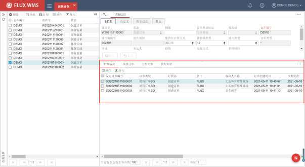

- 明细信息

波次下每个发运订单的信息。包括订单号、行状态（也即单个发运订单的状态）、货主、收货人、订单时间、预期发货时间、要求交货时间、毛重、体积等。

- 选择订单

在明细信息列表中，点击某一行订单记录，再切换到“选择订单”页签，可以查看到指定订单的具体订货明细信息，如行号、状态、产品、订货数、分配数、发货数、单位等信息。

- 分配明细

显示整个波次中，已分配订单行的分配记录。内容包括分配ID、行号、状态、产品、数量等，与订单列表所显示信息内容相同。

<!-- 原 PDF 第 709 页 -->

### 11.2.2. 表头右键功能

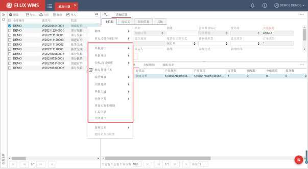

- **单据打印子菜单**

系统标准单据打印。包括拣货任务清单、医药行业药品检验报告等。由于波次操作的特殊性，除了打印与 SO 相同的拣货任务清单，还可以打印几种不同的拣货清单：

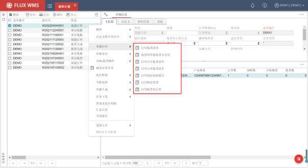

<!-- 原 PDF 第 710 页 -->

*图11-2-6（图像未能从 PDF 对象中直接提取）*

打印拣货清单－分订单打印拣货任务清单。类似 SO中批量打印拣货清单的结果。

拣货清单按收货人分页－按收货人，分页打印拣货任务清单。与“打印拣货清单”功能不同的是，同一收货人、不同订单的记录也会打印在同一页清单上。

打印合并拣货清单－多订单汇总后的合并拣货任务清单。

打印分货拣货清单－汇总拣取后按订单分货的拣货任务清单。例如合并拣货拣取一箱 50件，再按分货清单，分别投放到 10个订单的出库包装箱中，每个订单所需数量不等。

打印药品检验报告/购进发票/随货同行单－医药行业物流环节所需随货单据。

- **单据导出子菜单**

- 导出药品检验报告/购进发票/随货通行单

配合无纸化作业场景，将医药行业需要随货提供的药品检验报告、购进发票、随货通行单生成为 PDF文件压缩包。

文件命名规则为“订单号_收货人 ID”，如果收货人 ID包含符号，则去除所有符号，以免生成文件失败。

- 打印导出

打印单据导出为指定格式的Excel文件。

- **分配-拣货操作子菜单**

分配、拣货相关功能，具体操作请参考【11.3发货操作】章节的介绍。

<!-- 原 PDF 第 711 页 -->

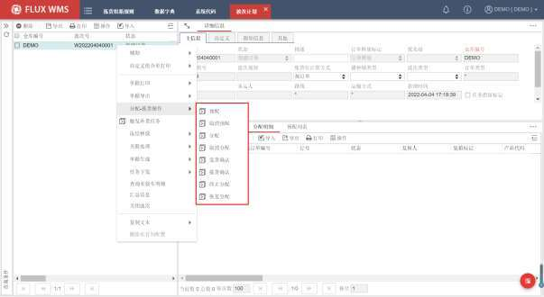

- **触发补货任务**

系统将选中的波次对应订单的需求量汇总，进行补货计算。

- **冻结释放子菜单**

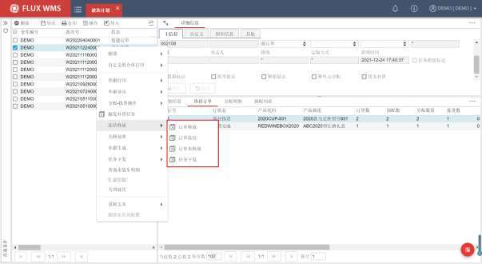

<!-- 原 PDF 第 712 页 -->

- 订单释放

对波次进行审核确认，使波次处于释放状态，可以进行发货操作。

- 订单冻结

对波次进行冻结操作，冻结波次不能进行拣货、复核等操作。

- 订单未释放

对波次订单进行审核确认时，由于各种原因，将波次置于未释放状态，不能进行发货操作。需要等待后续的释放操作

- 订单任务下发

更新波次释放状态为“任务下发”，常用于拣货任务下发给相关设备，如电子标签等。

- **关联处理子菜单**

- 关联发票号

按波次提前打印发票时，由于发票号是预先印制的，并且没有条码可以扫描，需要通过此功能手动将发票号与订单批量关联。点击右键功能后显示如下弹窗：

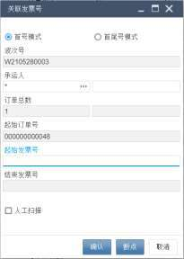

- 首号模式－适用于全部连续的发票号，输入起始发票号，系统根据波次内的订单数量，逐一匹配订单，每单的发票号自动+1。

- 首尾号模式－适用于发票号有断号的情况，输入连续号段的起止发票号码，系统

<!-- 原 PDF 第 713 页 -->

逐一匹配订单，直到结束号码。后续订单，再输入新的发票号进行匹配。

- 人工扫描－勾选后，波次号为可编辑字段，用户可以扫描切换其他波次号发票打印连续操作。

- 断点－如果出现卡纸或者换纸，操作人员首先确认断点的订单号，点击“断点”按钮后，清空起始订单号字段，用户输入断点后开始的订单号，扫描新的起始发票号，然后重新开始计算。

- 确认－点击确认按钮后，系统更新对应发票号信息。

- **单据生成子菜单**

- 生成装车单

根据波次计划生成装车单。

- 生成波次合拣单

根据波次生成合拣虚拟单，以便将订单数量合并，达到从整存区域分配整箱/整托盘库存的目的。

- **任务下发子菜单**

波次分配记录，可以通过鼠标右键的“任务下发”子菜单功能，下发为摘果、播种任务。也可将已操作任务重置，重新摘果或者播种，如下图。已下达相关任务的波次，不能删除。

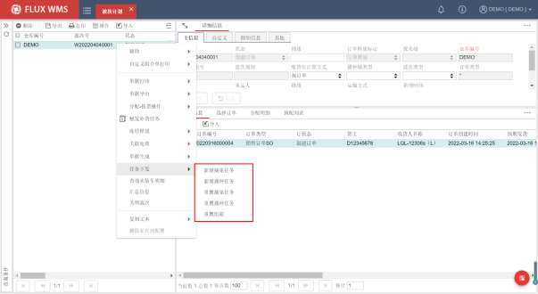

<!-- 原 PDF 第 714 页 -->

对于已经组箱计算完成的波次，可以通过【重置组箱】功能，将波次下“完全分配”状态的分配明细，也即尚未开始进行拣货操作的分配明细，组箱标记更新为 N未组箱。当前数据为按波次组箱的数据，则将对应波次表头的组箱标记更新为 N；如当前波次实际按订单组箱计算，则将波次下的订单表头的组箱标记更新为 N 未组箱。

- **查询未装车明细**

查询波次计划中没有装车的分配明细。

- **汇总信息**

显示波次汇总信息，如订单总数、分配数量等。

- **关闭波次**

波次计划关闭，不可再添加SO 或做其他操作。如果波次中有订单未发运，则不允许关闭。

### 11.2.3. 扩展页签

- **表头扩展页签**

- 波次编组

作业时，相同操作流程的多个波次需要打印的作业单据基本相同，例如都需要打印合并拣货任务清单、发货清单、快递面单。逐一波次选择、进行打印，操作比较繁琐，此时可以使用“波次编组”功能，将多个波次给与同一个打印编组号，打印时集中进行触发。

通过定时器或者手工波次模板生成波次计划时，由系统自动生成波次编组号。每个波次规则每运行一次（定时器一次），为生成的对应波次分配一个共同的组号。手工波次模板手动选择订单生成一个波次时，一个波次也分配一个波次组号。

表头部分，通过 页签折叠按钮，点击选择【波次编组】，可以打开波次编组页签进行查看，后续通过自定义打印配置进行具体打印操作：

<!-- 原 PDF 第 715 页 -->

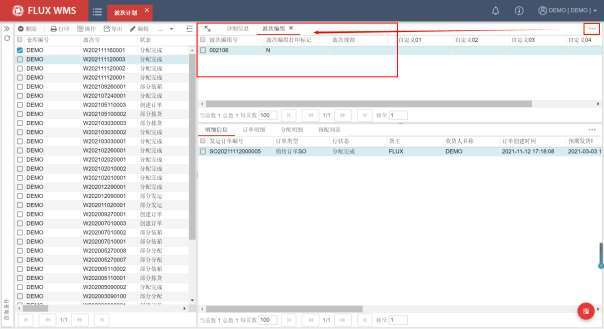

- 预约信息

使用“预约”相关功能，为出库波次进行月台预约后，可以在扩展按钮中的“预约信息”页签，查看到此波次的月台预约情况。

具体预约操作，请参考【预约】章节的介绍：

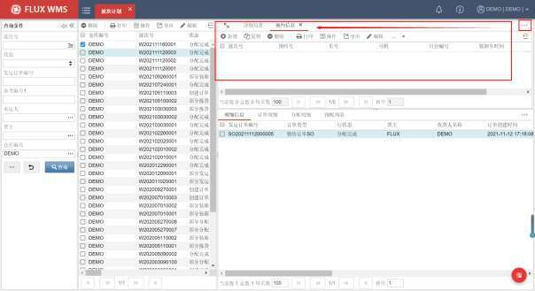

<!-- 原 PDF 第 716 页 -->

通过点击【新增】按钮，为波次计划添加提货车辆的月台预约，预计装车时长等信息。

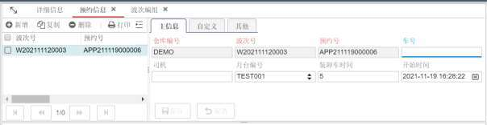

- **明细扩展页签**

- 未完全分配明细

明细行部分，通过 页签折叠按钮，点击选择【未完全分配明细】，可以打开“未完全分配明细”页签，显示分配数<订货数的订单明细行：

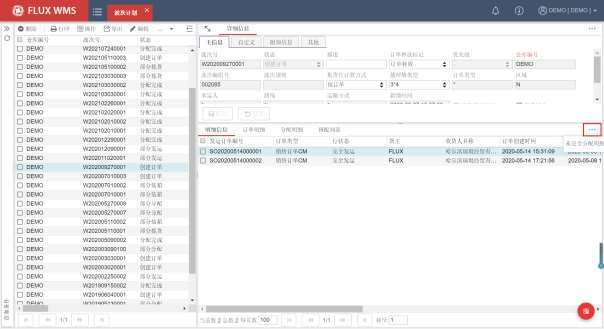

<!-- 原 PDF 第 717 页 -->

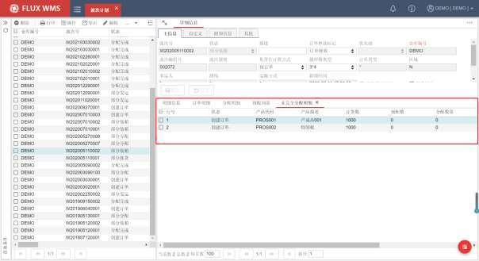

### 11.2.4. 明细右键功能

明细行鼠标右键菜单主要功能有：

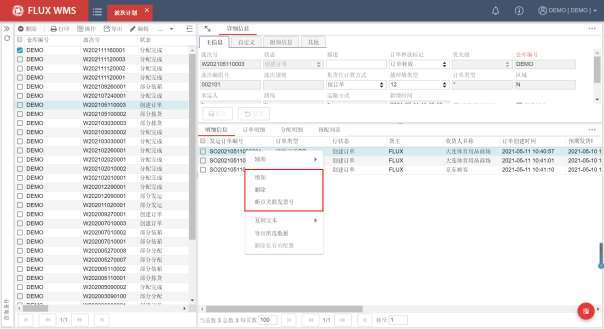

- **增加**

<!-- 原 PDF 第 718 页 -->

为已有波次添加新订单。点击“增加”，系统跳转到 SO 界面，根据需要输入查询条件，查询订单。人工选择订单记录，可多条，再选择鼠标右键菜单“添加到当前波次”，系统将所选 SO 加入到指定的波次中。

- **删除**

如有记录不需要在波次中一同操作，可通过“删除”功能，删除波次中的订单，即从此组订单集合中去除指定订单。但订单本身不受影响，同样不影响该订单在发运订单功能中的操作。

删除时会校验是否波次已经开始播种或摘果作业，如有则提示不可删除。

- **断点关联发票号**

打印中断、重新打印等情况下使用，选择某一明细记录，点击右键断点关联发票号，显示发票号界面同表头的关联发票号功能，但默认将所选的订单记录作为首号进行后续操作。

### 11.2.5. 分配明细右键功能

明细行部分，分配明细页签，鼠标右键菜单主要功能有：

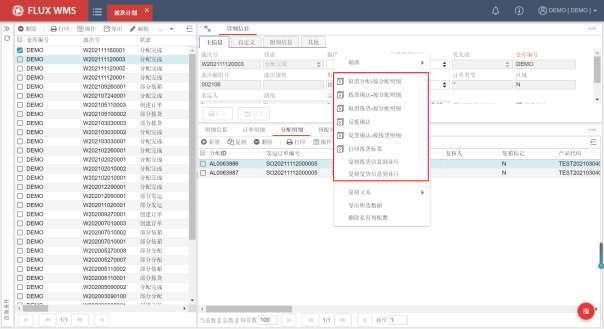

- **取消分配 -按分配明细**

勾选分配明细行之后，按所选行取消分配。

- **拣货确认 -按分配明细**

<!-- 原 PDF 第 719 页 -->

按照所勾选的分配明细行进行拣货。

- **发货确认 -按拣货明细**

按照所勾选的分配明细行进行发货。

- **反拣确认**

按明细行进行反拣。

- **打印拣货标签**

点击后触发分配明细行对应拣货标签打印：

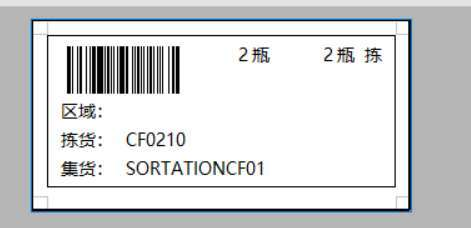

- **复制拣货信息到各行**

通常用在纸面单证操作场景，需要记录拣货相关信息的情况下，在人工录入拣货信息的环节使用，减少重复录入的工作量。

选择某行分配明细作为样本，维护拣货信息并保存后，点击鼠标右键，选择右键菜单里的“复制拣货信息到以下各行”功能，可将当前分配明细中的目标库位、目标跟踪号、拣货时间、拣货人员等拣货相关信息复制到后续分配明细中。而此样本行之前的其他分配明细行，不受影响，如果有多行不同内容，例如连续记录，拣货到 3 个不同的目标跟踪号（拣货周转箱）中，就可以分三次更新，向下复制。

- **复制发货信息到各行**

纸单操作场景中，录入发货时间等信息的快捷操作。选择某行分配明细作为样本，维护发货信息后，通过此功能，将发货信息复制到后续其他分配明细行。

<!-- 原 PDF 第 720 页 -->

## 11.3. 发货操作

FLUX WMS的发货操作，常见步骤主要有：分配订单、拣货确认、发货确认。其中发货确认是必不可少的操作步骤，其余环节可以根据业务情况采用不同的操作模式，或者跳过这些环节。

例如出库流程中，实物的拣取是必需的操作，但是否需要在系统中执行拣货确认操作，可以根据业务需求进行安排。

此外还有部分可选功能，例如复核、播种等，将在后续章节介绍。

### 11.3.1. 预配

预配，或者也称为预分配，是在分配之前，系统按照要求来查找是否有符合订单需求的产品。预配仅查找到符合要求的产品的批次和数量，而不涉及库位；能够合理的保留客户所需要的产品，却不会因产品保留而造成拣货不便。

对于订单周期较长（例如，从订单下达到实际发货时间跨度多于 2天）的订货要求，可以先通过预配为订单保留/锁定足够的货物，在实际出库前再执行分配操作，这样不会由于锁定了优先拣货的库位，影响到后续订单的拣货。

而对于周期较短的订单（例如订单下达当天就要出库的情况），可以直接分配订单、进行出库操作。多数情况下可以直接进行分配操作，后台会将预配、分配 2步一同进行，只有在预留货物的场景中才需要单独进行预配。日常作业中，分配不成功，也可以通过单独预配检查是否库存不足。

需要进行预配的产品，必须已配置对应预配规则，并且订单不采用一步分配操作模式。

- **预配操作**

- 点击“出库操作”下的“发运订单”。

- 在查询页面输入查询条件，点击“查询”按钮，查找订单。

- 在查找到的订单列表中，选择所要操作的发运订单。

- 在表头部分的列表或表头明细页面的列表窗口，点击鼠标右键，选择右键菜单中的“预配”。

- 系统执行订单预配，可在明细部分的“预配列表”页签（默认隐藏，需要通过右上角的折叠按钮部分点击显示页签）中查看预配结果，或者“未完全预配订单行”页面查看未能完全预配的订单行记录。

- 也可以在订单明细行部分，点击鼠标右键，选择订单行预配。

<!-- 原 PDF 第 721 页 -->

- 系统会根据表头“允许部分分配”的设置，控制订单是否可以部分预配。

- **取消预配**

- 在表头部分的列表或表头明细页面的列表窗口，点击鼠标右键，选择右键菜单中的“取消预配”，可取消整个订单预配。

- 也可以在订单明细行部分，点击鼠标右键，选择“取消预配——按订单行”，取消单行的预配。

### 11.3.2. 分配

系统按照订单要求来查找符合需求的产品，并按库位、批次和跟踪号等要求来保留产品的处理，这个过程被称为分配。分配后，确定的产品被锁定给指定订单，即已被分配的产品将不能再次分配或变更库位。

- **分配操作**

- 选择“出库操作”下的“发运订单”功能。

- 在查询页面输入查询条件，点击“查询”按钮，查找订单。

- 在查找到的订单列表中，选择所要操作的发运订单。

- 在表头部分的鼠标右键菜单中，选择的“分配-按订单”功能。

- 系统执行订单分配，可在明细部分的“分配明细”页签中查看分配结果，或者“未完全分配订单行”页面查看未能完全预配的订单行记录。

- 也可以在订单明细行部分，点击鼠标右键，选择订单行分配。或者通过批量操作，批量分配订单。

- **分配结果**

在明细部分的“分配明细”页签，可以查看到分配情况，具体分配库位、批次信息，目标跟踪号、集货位信息等。

<!-- 原 PDF 第 722 页 -->

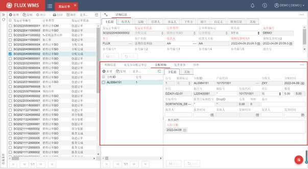

分配明细中显示的体积重量信息，是根据库存体积重量，按分配数量比例折算得到。发运时扣减库存，库存的体积重量也相应据此扣减。

分配体积重量，可以与计费用的订单明细体积重量不同。主要是计费时会更多从操作、运输角度考虑到包装的体积重量，会比库存体积重量大。

- **取消分配**

有些情况下，分配所锁定的库存，不是所需库存，现场可能会需要重新完善订单限定条件，重新进行分配。此时需要取消分配，订单回到创建状态，再修改条件、重新分配。有时已分配订单，货主取消出库指令，或者延后发货，也会需要取消分配，释放库存。

- 在列表窗口，点击鼠标右键，选择表头右键菜单中的“取消分配”，可取消整个订单分配。

- 也可以在订单明细行部分，点击鼠标右键，选择“取消分配 -按订单行”，取消指定的单行订单明细的分配。

- 在分配明细页签，选择记录，右键“取消分配 -按分配明细”，或者直接点击某行的删除按钮，也能够达到基于分配明细，取消分配的目的。这3 种操作对象范围不同。

- **拣货任务清单打印**

- 纸面操作情况下，订单分配后，可点击表头鼠标右键的“打印拣货任务清单”，打

<!-- 原 PDF 第 723 页 -->

印拣货单据，用于纸单作业模式下，指导现场拣货。

- **人工修改分配记录**

部分情况下，仓库无法按照系统自动分配指定的库位拣取货物，而需要人工另外拣取库存；或者存在只能通过人工指定分配的情况。此时，需要人工修改系统分配记录，或直接人工指定分配。

- 在出库操作-发运订单中，查找到所要操作的订单记录。

- 在明细部分的明细列表中，选择所要操作的订单行。

- 点击分配明细页签，系统显示所选订单行对应的分配明细记录。

- 选择所要修改的分配明细，点击删除按钮，并确认删除该分配明细记录。

- 点击新增按钮，系统自动按照对应订单明细行的内容显示产品代码。

- 点击产品代码旁的快速检索按钮，系统显示可选库存的二级窗口。

- 在二级库存窗口，选择库存记录，双击确认。

- 在分配明细页面，系统显示所选库存的库位、批次等信息，由操作人员输入分配数量，并保存，完成人工分配操作。

注：通常情况下，订单行分配总数量不可超过明细中的产品订货数量。

- **人工筛选库存**

对于分配明细行数较少的情况，通过人工修改分配记录的操作模式，可以添加分配明细，达到人工指定分配的目的。

但如果订单需求较大，涉及库位较多情况，逐行添加分配明细，工作量较大，效率也不高。因此系统提供了适用于较大批量库存情况的人工筛选库存功能，方便用户快速指定库存，生成分配明细记录。

- 在出库操作-发运订单中，查找到所要操作的订单记录。

- 在明细部分的明细列表中，选择所要操作的订单行。

- 通过明细部分的鼠标右键菜单，选择“人工筛选库存”功能，系统显示如下库存筛选界面：

<!-- 原 PDF 第 724 页 -->

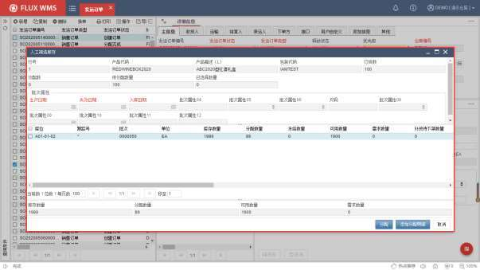

- 界面显示订单指定条件，以及符合条件的库存信息。根据参数 INV_UOM_QTY（按包装等级分列显示库存数量）控制是否显示不同包装级别的折算数量。

- 批次属性列，支持进一步根据需要进行筛选。主要针对订单没有指定信息的情况，人工进行筛选。例如订单要求分配良品（批次属性08=良品），人工筛选时再筛选产地为背景（批次属性04=北京）的库存记录。

- 针 对 合 适 的 库 存 记 录， 勾 选 库 存 记 录， 系 统 根 据 参 数MANUAL_ALLOCATE_DEFAULTQTY（人工筛选库存需求数量是否默认为可用库存数）对应配置，控制所选库存记录的需求数量，直接默认为可用数量，还是默认为 0，由用户按需要修改“需求数量”调整每行库存记录的占用数量。

- 当已选择记录的需求数量之和，大于订单待分配数量时，且是当前勾选记录之和第一次超量时，系统弹出选择框：“已选择数量（勾选的需求数量总和）大于待分配数量，是否继续？”允许用户选择是否超量指定范围。

- 勾选多条库存记录后，点击【分配】按钮，根据指定的库存记录范围，按订单行进行分配。即使范围数量超过订单数量，仍旧根据预配规则是否允许超量分配进行数量控制。如果允许超量预配，则根据所选的、超额数量生成分配明细；如果不允许超量预配，则根据预配、分配、库存周转规则等逻辑在指定范围内，分配订单数量的记录（例如勾选范围1000件，订单分配其中的800 件）。

- 特殊情况下，人工筛选库存时，可能存在跨多个批次，但每个批次只选择一部分库

<!-- 原 PDF 第 725 页 -->

存的情况，例如生产日期为 1/1、2/10的库存各 100箱，客户要求 1/1的库存要10箱，2/10 的库存要 30箱。此时按选定范围分配，在不超量预配的前提下，根据先进先出等逻辑，会集中出到某个批次，与客户要求不符。需要人工修改各个批次的需求数量，再进行分配。但仍旧存在修改的需求数量之和超过订单数量时，自动按订单数量分配。因此系统提供了【添加分配明细】按钮，同逐行添加分配明细的效果，不允许超量预配时，如果所选记录的需求数量之和超过订单数量，无法成功增加分配明细。

- **一步分配处理**

标准分配模式，鼠标右键操作触发分配后，后台会执行预配、分配两步操作。但一些作业场景中，不需要通过预配进行库存预留，而是分配后直接进行拣货。此时可以使用一步分配操作模式，跳过预配处理，直接进行分配，提升作业效率。因此一步分配，有时也被称为“分配规则 2.0模式”。

使用一步分配操作模式，配置和处理步骤为：

- 开启参数 ONE_STP_ALC（启用一步分配方法(系统不经过预配直接分配的方法)）。

- 新增订单时，系统自动根据 WCO 匹配获取到 ONE_STP_ALC参数值，作为订单明细行的“分配模式”字段值，也即一步分配开关。

- 订单分配时（包括按订单明细分配、波次分配等），如果订单行的“分配模式”为N，即预配+分配的“分配规则 1.0”模式；如果为 Y，即一步分配的“分配规则

2. 0”模式。

- 一步分配模式下，跳过预配，根据库存周转规则、分配规则要求进行库存匹配、锁定。由于一步分配跳过了预配环节，可以在【产品档案】中另行指定分配时的排序字段。如不指定，默认按库位逻辑顺序拣货。

- **终止/恢复分配**

- 终止分配标记

部分场景中，订单虽然不能完全分配，但也希望加入波次进行作业；或者大订单分批操作，可能一部分已经装车发运，另一部分还在等待补货后分配。这些场景，很难通过订单/波次状态进行订单筛选，区分是否可以进入下一环节的操作。

因此在订单状态之外，系统通过“终止分配标记”，来区订单状态与操作进度不完全一致的订单。

当订单或波次的“终止分配标记”为 N（允许分配）的情况下，不论订单状态是什么，都会调用分配处理，继续分配。例如大订单分批操作景，一个托盘已经出库发运，订单状态更新为“部分发运”，但由于“终止分配标记”为 N，自动分配处理（通过定时器进行分配或者通过订单分配计

<!-- 原 PDF 第 726 页 -->

划进行自动分配）仍旧会对此订单进行分配。

分配完毕，订单状态更新为“完全分配”，订单中所有明细行的分配数>=订单数时，系统会自动更新“终止分配标记”为 F（分配完成）。自动分配处理，将跳过此类订单。

同时，对于一些状态不是“完全分配”，订单数量没有全部被分配的单据，却需要视同“完全分配”，一起加入波次开始操作的情况，可以将“终止分配标记”更新为 T（终止分配），系统将这些订单视同完全分配，不再需要进行自动分配处理，可以进入后续的波次生成等操作。

- 终止分配

在波次计划或者发运订单功能中，通过表头右键菜单的“分配拣货”子菜单中的“终止分配”功能，可以将所选波次/订单的“终止分配标记”更新为T（终止分配）。

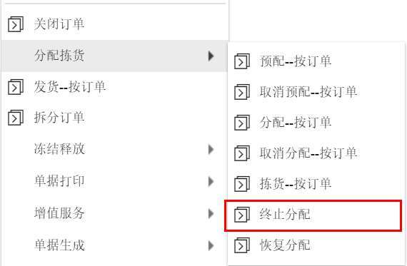

此类订单将不再参与自动分配，并且允许进行后续的组箱计算等处理。

但“终止分配”不能对完全发运，或者已经取消、关闭的订单进行操作。同时，如果订单已经是“完全分配”，“终止分配标记”为 F（分配完成），也无需操作“终止分配”。

- 恢复分配

针对已被“终止分配”，也即“终止分配标记”为 T（终止分配）的订单或波次，通过鼠标右键“分配拣货”子菜单中的“恢复分配”功能，可以将“终止分配标记”更新为N（允许分配），重新加入待分配的订单池中。

- **组箱计算**

输送线或其他使用标准周转箱进行拣货操作的场景，通常会提前根据分配所得的拣货任务，计算所需周转箱个数、每箱关联哪些拣货任务，后续按箱进行拣货操作。或者提前根据作业要求，结

<!-- 原 PDF 第 727 页 -->

合周转箱的大小，分为若干任务段，派箱时绑定任务段进行拣货。

因此分配后，如果采用标签拣货模式（参数 LBL_PCK=Y），系统会在后台执行组箱计算。根据当前所分配的订单或波次的仓库、货主、节点、类型信息，匹配对应的拣货组箱规则（在【业务规则】模块【拣货组箱规则】功能中进行设置，具体可参考《8.27 拣货组箱规则》章节的说明），再根据规则明细中设置的计算要求，对分配明细进行任务分段计算，得到与周转箱匹配的任务段，将对应分配明细的目标箱号更新为虚拟箱号，同时将计算所用的组箱规则 ID、行号记录到分配明细中，并将分配明细的“组箱标记”更新为 Y。

后续拣货作业环节，打印拣货标签进行拣货；或者在“绑定周转箱”环节，扫描实际周转箱号替换系统生成的虚拟目标箱号，再根据周转箱号进行拣货。通常配合 RF拣货，或者立库、输送线自动化设备使用。

- **巷道均衡分配**

自动化立体库，采用堆高机进行货物拣取搬运，一个巷道内的作业效率有上限。为了避免任务过于集中，导致部分巷道来不及操作，同时另一些巷道的设备闲置，在类似场景中，可以启用巷道均衡分配作业模式。

配置开关在【仓库设置】模块的【区域】功能中，如果勾选“巷道均衡分配”，分配到此区域库存时，针对有配置所属巷道的库位，会根据巷道均衡分配原则进行库存分配：

在根据库存周转规则分配的前提下，优先按各巷道总任务数均衡排序库存。

但如果时段内局部不均衡，不同巷道未完成任务数差异过大超过限定（例如 5 托盘），则优先根据未完成托盘任务数进行均衡计算。

通过定时器 AISLETASK_BALANCE来刷新巷道任务数据。

### 11.3.3. 拣货

拣货是按照发运订单要求，进行的库存货品收集活动。实物拣取后，在系统中进行拣货确认操作，并不是系统必须的步骤操作，但拣货确认可以把待出库的货品集中到特定库位，空出原有存储库位供后续其他操作使用，能够提高库位利用率。如果不做拣货确认，系统中的库存记录将仍旧保留在原存储库位直到发运时扣减库存。因此仓库通常会根据业务需要，定义拣货确认是否流程中的必备操作节点。

拣货确认，也可以通过 RF 设备，或者语音设备等方式执行，具体请参考对应说明文档。此章节仅介绍 WMS界面执行的拣货确认操作。

- **拣货操作**

<!-- 原 PDF 第 728 页 -->

- 选择“出库操作”下的“发运订单”。

- 在查询页面输入查询条件，点击“查询”按钮，查找订单。

- 在查找到的订单列表中，选择所要操作的发运订单。

- 在订单明细部分的分配明细页面（如下图），输入拣货时间、拣货人，目标库位、跟踪号信息：

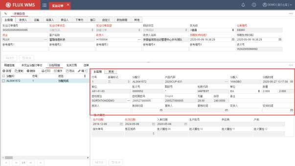

行号－分配明细对应的订单行行号。

装箱标记－是否已执行装箱确认的标记信息。装箱确认操作，在【11.6出库复核】章节中介绍。

分配 ID－系统自动生成的分配明细流水号。

产品代码－分配的产品代码。

分配人－执行分配操作的作业人员。

分配时间－明细分配操作的时间，不可修改。

库位－分配到的库存所在待拣货库位。

批次号－分配的产品库存批次号。

跟踪号－库存对应的跟踪号。

<!-- 原 PDF 第 729 页 -->

包装代码－库存分配的包装代码。

单位－库存分配明细的数量单位。

数量－分配到的库存数量，以所选单位为数量级别单位。后一字段则是主单位级别的分配数量。

目标库位－拣货移动到的目标库位，默认为同库存库位。启用集货位管理的情况下，由系统计算集货位。

目标跟踪号－拣货后新的跟踪号。可由用户输入，默认为同原跟踪号（注：同一跟踪号不能出现在不同库位）。

DropID－多级出库跟踪管理模式下，跟踪号的上级信息，一般用作箱号、托盘号跟踪情况下的托盘号记录。

毛重、体积－分配到的产品的重量、体积。

备注－备注信息。

拣货人－执行拣货确认的作业人员。

拣货时间－执行拣货操作的时间。如未输入，拣货确认时，系统自动记录为拣货确认的当前时间。

复核人－执行复核确认的作业人员。

复核时间－执行复核确认的时间。同样由系统生成，不可修改。

发货人、时间－执行发货操作的时间、发货人员。如未输入，系统自动记录为发货确认的当前时间。

批次属性－分配到的产品所具有的批次属性内容。

- 点击【保存】按钮，保存信息。

- 在分配明细部分，行列表窗口，点击鼠标右键，选择右键菜单里的“复制拣货信息到以下各行”功能，可将当前分配明细中的目标库位、目标跟踪号、拣货时间、拣货人员等拣货相关信息复制到后续分配明细中。

- 在分配明细部分，行列表窗口，点击选择需要确认的分配明细行，或者使用鼠标右键菜单“全选”功能选择全部待拣货确认的分配明细。

- 选择鼠标右键菜单的“拣货--按分配明细”功能，确认已选记录拣货完成。

- 系统将货物确认拣货到目标库位，并更新订单状态等信息。

<!-- 原 PDF 第 730 页 -->

- 如果无需记录与系统操作员不同的拣货人员，并且没有拣货信息需要修改，也可以直接从表头右键菜单确认整个订单拣货完成。

- **其他右键功能**

- 取消分配－按所选分配明细，取消分配，库存解除锁定。

- 取消拣货－系统将取消拣货确认，订单回复到分配状态。

- 反拣－根据已确认的拣货记录，生成反向的反拣任务。用于修正错误的拣货操作。

- 发货－确认货物发运。

- 复制发货信息到以下各行－根据当前分配明细，将发货信息复制到其他分配明细行。

- 打印拣货标签－如使用RF 操作等，可通过该功能打印操作中所用的拣货标签。

### 11.3.4. 发货

在系统中确认货物已经发运出库，系统将扣减库存、更新单据信息。执行发货，有多种触发方式，可以从 FLUX WMS系统界面人工操作发货确认，也支持通过 RF扫描发货（相关功能请参考RF操作手册），还可以通过定时器后台将符合条件的订单自动发运。

FLUX WMS界面发货操作，可以通过发运订单进行发货确认，同时也支持装车单确认发货、波次发货等操作（请参考相关功能说明）。

- **发货操作**

- 选择“出库操作”下的“发运订单”。

- 输入查询条件，点击查找按钮，选择所需操作的订单。

- 对于可以整单发运的订单，可在订单列表窗口，选择对应订单，点击鼠标右键菜单中的“发货--按订单”功能。

- 确认后，系统将整个订单中，可发运（已被分配 /拣货的记录）的库存全部发运。订单状态更新。

- 系统同样支持逐条发运。在明细行部分的分配明细页面，输入 /修改发货时间和发货人员，保存后，通过明细部分的鼠标右键菜单选择“复制发货信息到以下各行”。再选择拟发运的记录，右键“按拣货明细发运”。

- **发货控制**

<!-- 原 PDF 第 731 页 -->

系统出库操作流程中，订单、分配、发货是必须的作业步骤。如果需要将其他环节作为必须操作，可通过系统参数进行配置，例如未拣货记录不能发货，未复核记录不能发货，或者未装车记录不能发货。

如果作业过程中，接口下达取消指令，但由于作业流程关系未自动取消作业、取消订单，仅作标记。发运时会进行校验订单是否已被标记取消，如有，则不可发货。但如果已有明细行完成取消处理，剩余明细行可正常发货。

- **特殊发货模式**

- 配送单作业发货

部分仓库，粘贴面单并采集面单号之后，与快递的交接不再需要仓库参与。采集到面单号，即视同货物出库。此时可采用配送单作业自动发货模式。具体操作请参考配送单作业环节。

- 装车发货

货主装车后，整车确认发货。具体操作请参考装车单操作介绍。

- 异步发货

订单明细行非常多，平均近万行的场景，在装车时进行发货，或者整个订单发货、整波次发货情况下，由于记录行过多，发运等待时间也会相应延长，不适应快速操作的要求。

在这种情况下，可以启用“异步发货”作业模式，有时例如双11 等作业高峰也可以临时启用异步发货模式。

开启参数 NON_REALTIME_SHIPMENT（是否开启异步发运模式） 情况下，进行发运时系统只是先对订单进行标记（分配明细 ACT_ALLOCATION_DETAILS，inventoryDeductFlag更新为Y），并不实际扣减库存。

后续通过“ 异步发运扣减库存 ”定时器 （NON_REALTIME_SHIPMENT）在指定的时间对 已经标记发运的分配明细进行实际库存扣减，错峰异步进行发运。发运成功后分配明细的标记会被更新为 S。

在使用异步发运模式的场景中，已标记但未实际扣减库存订单，不能操作取消发运，也不能对库存进行移动。

## 11.4. 取消发货

如果发现发运错误，可是使用取消发货的功能修改，执行后， SO状态还原到发运之前。即分配

<!-- 原 PDF 第 732 页 -->

后发货的订单，订单状态返回到完全分配（或部分分配）；拣货确认后发货的，订单状态返回到完全拣货（或部分拣货）。

有些流程中，订单发货后，会将订单关闭。并且部分业务场景，由于订单关闭后，发货信息已通过接口回传，业务上就不在允许操作取消发货。

已关闭订单是否允许取消发货，可以通过参数开关（SHP_CCL_CHK，关闭 SO 后是否允许取消发运）进行设置。如果允许，已关闭订单取消发货后，订单状态会回到分配或者拣货状态。

- **取消发货操作**

- 选择“出库操作”菜单下的“取消发货”功能。

- 输入查询条件，查找需要操作的发运订单记录

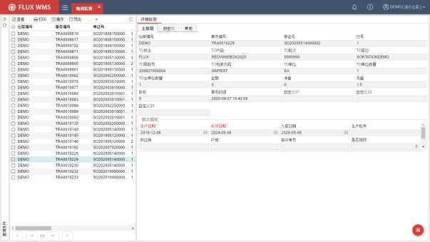

- 选择所要取消的发货记录，也可通过右键菜单全选。

- 鼠标右键菜单选择“取消发货”，系统将显示取消发货确认对话框，用户确认后，系统执行发货取消。原订单信息将会更新。

## 11.5. 手工波次模板

通过波次计划规则，系统可以自动创建波次。但有时现场操作时，会希望根据信息条件人为进

<!-- 原 PDF 第 733 页 -->

行干预。例如临近下班时段，当天需要发运的货物均已作业完成，希望剩余时间选择部分第二天需要作业的订单，提前开始出库准备。但采用自动模式生成的波次，很可能订单量较大，无法在剩余工作时间内完成。期望按产品的订单重复率，查询、排序，人工选择作业量合适的产品，生成波次，进行操作。

FLUX WMS提供手工波次模板功能，在自动波次无法满足灵活的筛选需求的情况下，供用户手动筛选订单生成波次，但与发运订单人工生成波次相比，又可以根据不同的组合条件，获知订单池目前的订单情况，能够组成什么样的波次，辅助用户进行订单筛选，能方便用户提前安排生产资源。

- **手工波次模板**

- 选择“出库操作”下的“手工波次模板”。系统显示如下查询界面：

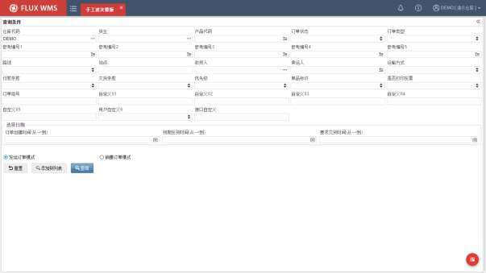

- 模式选择：

此功能同时支持根据发运订单创建波次，以及根据销售订单创建销售订单组。通过查询界面的模式选择进行切换。

- 查询符合条件的记录

查询结果仅显示符合条件、并且没有在其他波次/销售订单编组中存在的订单。可以根据需要进一步添加扩展查询条件：

<!-- 原 PDF 第 734 页 -->

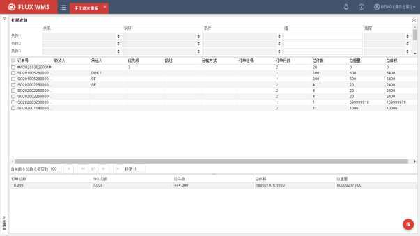

- 生成波次

查询结果列表中，选择记录，通过右键菜单功能，生成波次计划或者销售订单编组。

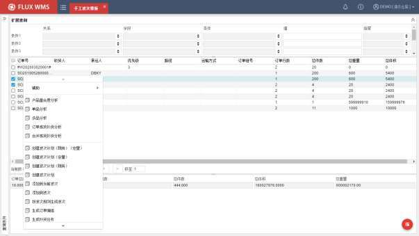

跳转模式－创建成功后切换到波次计划界面并显示相应波次计划。

<!-- 原 PDF 第 735 页 -->

定量模式－弹出框输入订单数量限制，系统按限制数量创建波次计划。

- **订单分析**

手工波次模板在右键菜单中，提供一些预设的订单分析工具，可以对查询所得或者所选订单进一步分析、筛选，辅助用户进行订单筛选：

- 产品重合度分析

根据所选条件维度，对订单进行重合度分析。通常在使用播种操作的业务场景中比较常见，订单重合度越高，即同一个产品（或同一类产品）在多个订单中重复出现的次数/数量越多，播种能够带来的效率提升就越大。

勾选订单，点击鼠标右键后系统显示如下二级窗口，供用户选择分析维度：

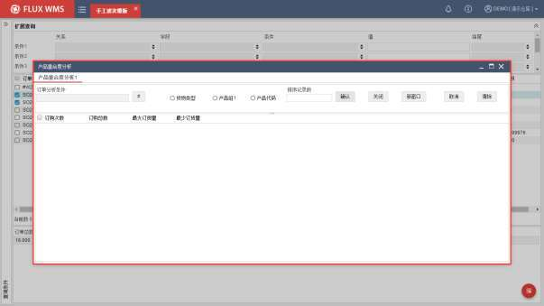

点击“订单分析条件”的多条件按钮，在如下弹框中，选择分析条件，也即订单分组条件，支持多选，例如按“承运人”+“城市”进行分组，系统会按条件分组，分行进行统计。所显示的选项，在系统代码“MNU_WAV_ANA”（手工波次模板分析条件）中进行维护。

<!-- 原 PDF 第 736 页 -->

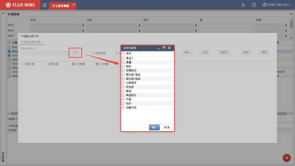

勾选后，列表部分，会在“订购次数”列之前，增加所选条件列显示，例如：

货物类型、产品组 1、产品代码 3选 1，则是针对订单明细行的产品分组条件。根据货类分组，汇总程度会比按产品代码分组高。产品组 1在服装行业中，通常用来记录款号。列表部分将根据所选的维度，进行数据列的显示：

排序记录数字段，则限制显示的记录行数，即取查询结果的前 XX 行记录。默认不限制。

点击【确认】按钮，系统会根据所选的分析条件、维度，对筛选到的订单进行汇总查询，并按订单次数倒排序显示：

<!-- 原 PDF 第 737 页 -->

点击【新窗口】按钮，可以在保留原有分析情况下，显示新的分析页签，进行不同维度的分析，以便进行比较。

通过【关闭】按钮，能够关闭页签，回到前一分析页签中。

点击【取消】按钮，则关闭分析窗口，回到手工波次模板的订单查询结果列表界面。

点击【清除】按钮，清空分析窗口的界面条件，重新选择条件、维度进行分析。

- 右键功能

分析后，人工勾选记录，通过分析列表部分的鼠标右键功能，进行后续操作触发：

✓ 筛选订单

仅在订单分析条件有勾选字段时才能点击。选中记录后点击，系统根据勾选的订单分析条件，结合选中记录的这些字段的值，将符合条件的订单返回手工波次模板列表界面。

✓ 生成 SKU组合波次

仅在产品分析条件勾选“产品代码”时才能点击。选中记录后点击，弹出提示“该 SKU组合共

<!-- 原 PDF 第 738 页 -->

有 X个订单，是否确认生成波次？”

点击【取消】返回；点击【确定】，将勾选的 SKU，对在这些 SKU 组合范围内的订单，直接产生一个新的波次。

✓ 过滤筛选

选中记录后点击，弹出过滤筛选二级窗口，自动加载鼠标右键时的字段名称及所有记录的该字段值，确认后返回列表，只显示与筛选的字段值相等的记录。例如选择 4、5，则只保留订购次数为4或者 5 的高频订单记录。后续返回到手工波次模板，再在选定范围内，选择单据生成波次或者生成销售订单编组。

- 单品分析

针对单品订单（表头“附加信息”页签的“单品匹配”字段内容为“单品”的发运订单）进行

<!-- 原 PDF 第 739 页 -->

数据汇总分析。

与“产品重合度分析 ”类似，通过鼠标右键功能点击后，在弹窗选择分析条件，同样是取系统代码“MNU_WAV_ANA”（手工波次模板分析条件）中的明细内容：

单品分析的查询统计结果与产品重合度分析有所不同：

<!-- 原 PDF 第 740 页 -->

提总满箱数－订购该 SKU的单品订单汇总的订单数量（QtyOrdered_Each）÷产品的整箱 CS 的包装数量，向下取整。如果产品包装未设置箱层级，即整箱 CS 的包装数量为 0，则提总满箱数显示为 0。由于是汇总数据，存在多个订单的零散数量拼成整箱的情况。

标准装箱数－按产品标准包装设置箱层级数量的整箱的包装数量。

尾数－不能凑成整箱的剩余数量。即汇总的订单数量 -（提总箱数×标准的每箱装箱数量）。

尾数满箱率－不能凑整的数量，占整箱数量的百分比。尾数÷标准装箱数/100，以百分比形式显示。如果标准装箱数未设置（包装中箱层级数量为0），则尾数满箱率显示为0。

尾箱等待时间－单品分析时，按照订单时间（OrderTime）查询最早的订单时间距离当前时间的时长，取值单位为分钟，用来显示订单已下达时长。尾箱等待时间是动态变化的，每次查询都可能发生变化。

- 右键功能

*图11-5-14（图像未能从 PDF 对象中直接提取）*

✓ 按波次规则生成波次

选中记录后点击，弹出波次选择二级窗口，默认查询“订单产品结构”字段设置为“单品”的波次计划规则。确认选择后，根据单品分析窗口选中的 SKU、分析条件，加上手工波次模板的查询条件，查出符合条件的订单，后续按规则生成新的波次计划。

<!-- 原 PDF 第 741 页 -->

✓ 过滤筛选

选中记录后点击，弹出过滤筛选二级窗口，自动加载鼠标右键时的字段名称及所有记录的该字段值，确认后返回列表，只显示与筛选的字段值相等的记录。

- 多品分析

针对多品订单（表头“附加信息”页签的“单品匹配”字段内容非“单品”的发运订单，即包括多品订单与N+X 组合订单）进行数据汇总分析。

<!-- 原 PDF 第 742 页 -->

- 右键功能

与单品订单分析类似，支持按波次规则生成波次，以及过滤筛选。只是波次规则对应显示多品订单的波次规则。

- 订单拣货补货分析

很多仓库的拣货作业，需要补货操作进行配合，因而所创建波次的补货量势必会影响生成波次的执行率，如果补货量太大，有可能导致有限时间内补货完成不了而波次无法执行，例如下班前只有 2个小时，想要筛选一些原定明天操作的波次提前进行拣货操作。但如果补货 1.5小时，拣货 1.5小时，合计 3小时的工作量，会导致超过原定预计时间。

因此系统提供补货+拣货分析模式，方便现场综合考量。点击右键功能后，系统将每个订单分别折算整包装、零件数量，分别与存储位、拣货位的可用库存比较，计算可能需要补货的量，再按SKU汇总显示：

<!-- 原 PDF 第 743 页 -->

- 合并拣货补货分析

与订单拣货补货分析类似，但先将所选订单订货量，按 sku汇总后，再折算整包装、零件数量（多个订单可能拼出更多整箱），分别与存储位、拣货位的可用库存比较，计算可能需要补货的量，再按 SKU 显示，因此提总的整箱会比按订单分析模式多。

## 11.6. 出库复核

出库复核功能，主要用于货物实际拣取后（系统拣货确认步骤不是必需的）、出库发运前，在仓库内对准备出库的产品进行复查，检验所拣取的待出库货物与订单分配明细是否相符。

在复核同时还可以执行装箱操作，记录产品分箱封装的明细情况。方便后续根据箱号追踪货物出库详情。

出库复核并非出库流程的必需环节，用户可根据流程管理需要选择使用。复核操作也分为多种不同操作模式，例如装箱操作，会变更库存所在的箱号；而仅复核的作业模式，则对库存信息没有影响。

### 11.6.1. 复核操作

- **复核装箱操作**

<!-- 原 PDF 第 744 页 -->

- 选择“出库操作”菜单中的“出库复核”，系统显示如下明细复核界面：

- 作业模式选择：

出库复核时，通常在工作台指定复核范围，然后扫描产品，由系统判断产品、累加数量是否在复核范围内容。

但同时，还存在订单较大，需要多人共同操作，或者无纸作业，无法指定精确复核范围的情况。因此系统提供了不同的作业模式供选择。

- 标准作业模式

也即常见的单一工作台操作，指定复核范围（例如一个订单，或者拣货的一个周转箱），然后扫描产品系统校验的操作模式，作为默认作业模式显示。

- 产品匹配订单

有些作业场景下，无纸化操作，没有具体订单号可以供复核员工扫描，以便定位复核范围。但需要按订单范围复核，而不能按波次复核或者拣货周转箱进行复核。此时可以考虑通过扫描产品来定位订单。

进入复核界面，选择“按产品匹配订单”作业模式，系统会弹出如下二级窗口，扫描波次号、产品，系统据此检索波次里的未完成订单，然后按订单总数由小到大进行排序，定位到首个订单并自动将 SKU 带入复核界面，等待用户回车确认。后续就在此订单范围内，进行复核校验。如果扫描

<!-- 原 PDF 第 745 页 -->

到同波次、其他订单中的产品则会提示报错、进行拦截。

如果扫描产品时，通过条码的个性化解析可以匹配到指定的订单号，则直接定位到此订单号进行后续的复核操作（解析相关配置请参考【业务系统配置】 -【标准业务扩展配置】章节的介绍）。未指定订单号，仍旧按首个订单定位、并进行后续复核操作。

- 多人复核模式

正常情况下一个作业单元（订单/拣货箱/波次）由一位（或者一组）操作人员在一个工作台进行复核。但如果订单内货物数量较大，为了提高效率需要多人进行复核，校验产品、数量时需要考虑到其他作业台的当前操作情况，以免同时操作同一产品，导致数量校验超量。

选择“订单多人复核”模式，系统将把多作业台的同单操作共同比对。但多作业台共同对比，势必对系统性能有所影响，因此非多人共同操作同一作业单元情况下，不建议开启。

- 订单信息获取：

出库复核，根据拣货作业模式不同，系统提供按订单复核、按拣货容器（周转箱号）复核、按波次混合复核几种不同的复核操作模式。

如果前一环节拣货时，采用周转箱配合 RF操作模式，即拣货时记录货物拣取到哪个周转箱中的作业模式，在复核时就可以根据周转箱号提取箱内产品信息，按箱复核。此时需要在复核页面的箱号字段输入周转箱号，系统显示箱内货物对应的分配明细信息。

<!-- 原 PDF 第 746 页 -->

如果前一环节没有按箱拣货确认，复核时采用按订单复核操作模式，则只需输入订单号，系统显示对应分配明细信息。

波次复核，常见于同一波次内货品可以混订单装箱出库的业务场景。

不同复核操作模式，可以在系统参数 CHK_TYP（复核类型）中进行设置，也可以通过出库复核界面右下方的【操作选项】按钮，临时切换复核类型方式。

此外，系统还支持复核解析，扫描单证号，通过解析获取到指定的复核类型。当参数 CHK_TYP配置为 BCD 条码解析的情况下，界面显示同 ORDER 订单复核，在订单号字段扫描条码，系统调用【标准业务扩展配置】功能，动作代码为 CHECKTYPE所配置的解析逻辑，进行解析处理，根据解析返回的复核类型出参（%CHK_TYP）决定后续的复核查询模式。

界面根据配置相应显示为订单号/箱号/波次号输入框，通过人工输入信息或扫描号码条码息，回车触发信息获取（扫描枪通常配置为自带回车效果，人工键盘录入情况下需要人工点击回车键），系统根据复核类型，以及输入的号码，获取订单收货人信息，以及对应分配明细记录，显示在复核界面的左半部分上方。

所扫描的单证号，支持单证号解析。当参数 CHK_BCD_ALZ开启时，调用【标准业务扩展配置】功能中动作代码“SCANDOCNO”的对应配置执行解析处理，解析返回的单证号用于复核查询。

如果同时开启复核类型解析、单证解析，则扫描订单号后，先执行复核类型解析，然后使用复核类型解析输出的单证号，进行单证号解析。

单证号解析开启情况下，还支持个性化的二次审核。如果订单的二次审核标记为 Y，同时订单符合【二次审核规则】功能中所配置的“出库复核前二次审核”的规则要求，会弹出二次审核弹窗，要求操作员确认。通过审核的单据才会进行后续查询处理。

- 订单校验：

查询到对应记录后，系统还会进行相关校验提示：

- 订单取消。如果查询到的订单已取消，同样会进行提示。

- 是否已拣货。根据 CHK_ORD_PCK参数（复核装箱拣货状态控制）设置，对相关记录进行校验，通过的订单才能进行复核装箱，校验未通过会提示“没有拣货完成不能进行复核”：

✓ ORDER：只有订单拣货完成才能复核装箱。根据订单状态判断。

✓ ALLTASKS：只有订单的全部分配明细拣货完成。订单已分配的明细必须全部拣货完成。但订单本身可能有部分明细行没有分配成功，订单状态不是拣货

<!-- 原 PDF 第 747 页 -->

完成，而是部分拣货。

✓ TASK：只有当前分配明细拣货完成。通常用在按箱复核模式中，边拣货边复核，只要扫描到的箱号对应任务已经确认拣货完成，即可进行复核装箱操作。

✓ NO：不进行校验。

- 信息提示：

读取订单/波次/箱信息后，订单如果有对应备注信息或者订单操作要求信息，系统会进行弹窗提示：

- 作业时若尚存已扫描，但未完成装箱的箱号，系统会提示是否继续装箱，选择是则带出未装箱数据；选择否，则清除未完成装箱数据，重新开始扫描。

- 当前存在对应反拣任务，对操作人员进行提醒。

- 如果发运订单的“备注”（notesText），或者“订单操作要求”（orderHandleInstruction）字段有值，系统会相应提示字段内容。

- 新箱号获取：

复核装箱后所用的出库包装箱的箱号，被称为“新箱号”，以便与拣货时的周转箱箱号区别。

复核操作模式中（系统参数 CHK_AND_PCK 复核的同时执行装箱操作配置为 N 情况下），新

<!-- 原 PDF 第 748 页 -->

箱号则可以置空，因为复核操作仅做检查，不对库存信息进行更新，也即没有箱号变化。

在装箱操作模式中（系统参数 CHK_AND_PCK复核的同时执行装箱操作配置为 Y情况下），新箱号是必备信息，但如何获取可以有多种模式：

- 扫描获取

在使用出库容器的场景中，出库所用的包装箱通常带有箱号，现场随机获取出库箱使用，一般会配合采用人工扫描采集出库箱号的操作模式。

此场景中相关参数 CHK_AND_PCK=Y（复核的同时执行装箱操作），并且不启用自动生成箱号，参数 CHK_GEN_TID=N(复核装箱时是否自动产生新箱号)。

由于通过人工操作获取，为了避免误扫描到其他条码，现场可在系统中配置自定义的校验逻辑，对新箱号进行检验（通过【标准业务扩展配置】针对箱号解析环节配置个性化校验逻辑，对应动作代码 SCANTRACEID）。例如新箱号不能等同于 SKU，不能等同订单号等，防止误操作。

同时，为了避免误操作导致箱号重复采集，可以开启 PKG_REU_TID参数（装箱完成后的箱号是否允许重复使用），参数值有：

✓ Y-允许箱号重复，即不做限制。

✓ N-不允许箱号重复，箱号不可重复使用。

✓ C-不允许未发运箱号重复，通常在循环使用出库容器的场景中，当前未发运的箱号不允许重复，但发货后包装箱流转回仓库，可以再次使用。

- 继承原始箱号

常见业务场景是，出库所用的箱就是拣货周转箱，此时可以直接扫描周转箱号作为“新箱号”在按箱复核模式下，还可以直接继承、继续使用原始箱号，减少一步扫描采集新箱号的动作。

需要开启参数 CHK_GEN_TID（复核装箱时是否自动产生新箱号），将参数值配置为“CARTON-继承原始箱号”。

如果 CHK_GEN_TID参数配置为“N-人工输入新箱号”，但输入的箱号对应分配明细已经全部装箱，系统也会将输入的原始箱号复制到新箱号字段，一般用于已装箱确认后，补打印的业务场景。

使用原箱作业模式下（不换箱），无需进行箱型扫描校验。

- 使用订单对应运单号

在部分打印快递面单的作业情景中，也经常将快递面单号（也即运单号）直接用作新箱号（具体新箱号应用，一般根据业务流程要求定义）。面单号的获取方式常见的有预存号段，或者接口调

<!-- 原 PDF 第 749 页 -->

用获取。

预存号段，由承运商（通常是快递公司），提前给予仓库一批面单号，连续、非连续号段都有可能。仓库自行对号段进行存储、管理，需要时提取，打印快递面单/标签。也常称为面单号池方式。提前给予号段的方式，有些也是通过接口批量下达，有些快递公司还提供 Excel方式，导入到 WMS系统的面单号池中。

接口调用获取，则是快递公司提供标准接口，仓库需要时按订单或者按箱调用接口，临时获得一个对应的面单号信息。

如果订单层级已经预先获取过对应面单号（不论是订单下载时接口获取面单，还是根据参数DEL_DOC_SN#标签号获取方式、用预存号段模式获取，发运订单已获取的面单号可在订单头的“运输”页签查看到，一单一号），出库复核环节，系统可以直接使用订单已获取的面单号，作为新箱号使用。

注：订单运单号模式优先于系统生成箱号。只有当订单无对应运单号，同时参数 DEL_DOC_SN#不为 B、C，或者参数为 C情况下运单号规则指定为流水号情况下，才会执行系统生成箱号模式。

DEL_DOC_SN#标签号（如快递面单）获取方式参数，控制作业时在哪个功能环节触发从 WMS号码池获取预存的号码，并不仅仅针对出库复核功能：

✓ A：分配时自动从 SYS_Delivery_No表中获取标签号。订单分配环节使用，从订单号池中获取预存的面单号。

✓ B：整箱分配时&拆零复核时。根据数量单位不同，箱级别分配时从号码池获取面单号，而件级别拆零记录则在复核时从号码池获取面单号。

✓ C：复核时自动从 SYS_Delivery_No表中获取标签号。

✓ D：配送单作业时自动从 SYS_Delivery_No表中获取标签号。

✓ N：无预分配的标签号。通常与其他参数配合实现不同的箱号获取模式。

- 接口获取

出库复核环节，临时获取面单号，还可以通过调用承运人提供的接口，临时获取。需要由 datahub接口处理平台进行快递接口对接。

启用接口获取模式，需要满足如下前提条件：

✓ DEL_DOC_SN#参数配置为“C-复核时自动从 SYS_Delivery_No表中获取标签号”。

✓ SO表头的“运单号规则”字段设置为“Y-分区分包装号段”。

<!-- 原 PDF 第 750 页 -->

✓ 在【配送规则】功能中有对应规则记录，并且“面单号是否从接口获取”配置为“Y-是”。Datahub 会根据订单表头的仓库，货主，承运商、快递平台来匹配配送规则，判断是否调用接口。

- 系统生成箱号

如果出库用的包装箱使用系统生成的箱号，则点击【换箱】按钮，系统分配装箱箱号。

也可将操作参数 CHK_GEN_TID（复核装箱时是否自动产生新箱号）设置为 Y，系统将自动带出新箱号，光标定位到 SKU 字段，可直接扫描，不再需要人工点击【换箱】按钮。

所生成的新箱号的组成方式，在系统参数 OB_CTN_RUL（目标箱号产生流水号的方式）中进行配置（此时 DEL_DOC_SN#参数应不为 B或 C）：

✓ Y-按照 SO编号产生流水号

即根据发运订单号，生成“单号#流水号”格式的号码作为新箱号，例如“SO20201011701#001”。波次复核模式下则是“波次号 #流水号”的箱号格式。

生成箱号后，如果后续操作过重置装箱，此箱号会被废弃，即使重新装箱也会生成新的流水号，因此最终的订单下的箱号可能是并不连续的。

生成的新箱号中的分隔符（例如 #）可以在 CHECK_CARTON_SPLTSIYMBOL 参数（出库复核装箱时，新箱号分箱符号）中进行设置，默认为 #。

✓ N-不按照 SO编号产生流水号

生成类似跟踪号的不重复箱号，箱号格式遵循流水号规则 CARTONNO 的配置要求。

✓ C-按照 SO 编号产生连续流水号

同样是按照“单号#流水号”或者“波次号#流水号”格式生成新箱号。但生成新箱号时，系统会检查是否存在重置装箱等原因导致的无效流水号，并优先使用此类流水号，保证最终箱号尽量连续。

在系统生成箱号的情况下，如果人工录入了箱号，系统会进行校验，如果录入的新箱号为已装箱、未发运的现有箱，则可继续操作，进行补打印或者补装箱等作业；如果是系统内不存在的箱号，则提示报错。系统生成箱号模式下不允许录入使用非系统箱号。

新箱号获取方式以及对应配置总结为：

箱号获取方式 对应配置

继承原始箱号 CHK_GEN_TID=CARTON

<!-- 原 PDF 第 751 页 -->

人工输入箱号 CHK_AND_PCK=Y CHK_GEN_TID=N

CHK_AND_PCK=Y从订单头获取面单号 CHK_GEN_TID=Y SO表头 DeliveryNo有值

号码池获取面单号 DEL_DOC_SN#=C SO运单号规则不为 N

DEL_DOC_SN#=C接口获取 SO运单号规则=Y面单号是否从接口获取=Y

流水箱号-traceid模式 DEL_DOC_SN#=N or A or D OB_CTN_RUL=N

流水箱号-订单号#001 模式 DEL_DOC_SN#=N or A or D OB_CTN_RUL=Y or C

- 箱型选择

复核时经常会根据所需出库的产品品种、数量情况，选择合适大小的包装箱。即支持提前指定复核所用的箱型（例如大箱、小箱），也支持人工根据装箱量选择出库箱，扫描/选择记录箱型。

通常不同大小的出库箱，所需的运输费用也有所差别，复核时记录所用箱型，有助于仓库进行运费计算跟踪。但箱型选择这一操作本身，并不是必须的复核步骤。

- 箱型获取

新箱号生成后，系统根据【业务规则】-【箱型规则】中的配置，控制是否需要进行箱型获取。

<!-- 原 PDF 第 752 页 -->

- 光标定位

系统根据仓库以及订单情况，匹配【业务规则】-【箱型规则】中设置的规则明细，取“箱型管理方式”配置，控制光标跳转、定位次序：

✓ “箱型管理方式”指定为“装箱前选择”，生成新箱号后，光标定位于箱型字段，可扫描录入箱型，也可通过下拉列表选择已经在【基础设置】-【装箱】功能中维护过的箱型选项；扫描箱型 ID条码时，系统播放对应的声音提示，如果扫描的装箱 ID不存在会提示报错。

✓ 如果配置为“忽略”，并且箱型非必输，则无需采集箱型信息。获得新箱号后，光标定位于 SKU 扫描录入框，直接进行产品扫描。

✓ 如果配置为“装箱后选择”，界面扫描波次号/箱号/订单号之后，光标跳转至 SKU，复核完毕后，触发弹出“箱型”扫描框。该扫描框为强制扫描框，不允许客户取消。扫描“箱型”后（输入/选择具体箱型并回车后），自动关闭该弹出框，并将箱型记录。

✓ 如果配置为“自动计算”则由系统计算推荐，计算成功情况下，光标无需定位到“箱型”字段。但如果开启了“箱型校验”则仍旧要求扫描箱型条码与计算结果进行校验检查。

- 箱型推荐

<!-- 原 PDF 第 753 页 -->

有时箱型是提前根据订单情况、产品体积计算、指定的。由于计算逻辑复杂，通常是提前计算得出，写入到发运订单头（可在发运订单的“附加信息”页签查看到箱类、箱型信息），现场提示使用。

目前支持一单一箱的情况，由于产品装箱次序不同，如果是一单多箱，则通常人工选择箱型。

在录入订单号、查询获取订单信息的环节，系统会一并读取订单指定的箱类、箱型信息（具体配置说明可参考【业务规则】-【装箱规则】）：

✓ 如果对应规则指定为从分配明细获取箱型，即“箱型管理方式”配置为“装箱前选择”并且“箱条码解析”配置为“继承拣货箱型”，不进行箱型计算，而是直接读取分配明细的箱型（CartonID）使用。

✓ 如果订单有指定装箱类型信息，且在【装箱】功能中有对应箱类、箱型记录，则优先使用订单指定的箱型信息显示在界面。

✓ 如果订单有指定箱类，但没有指定箱型，或者箱型在【装箱】功能中不存在，报错“无效的箱型设置，请检查基础设置“，显示箱类对应的箱型信息列表供用户选择。

✓ 如果订单头箱类为空，或者箱类无效（【装箱】功能中无此箱类），同时箱型为空，按照仓库，货主，承运人读取【箱型规则】信息，根据规则匹配获取指定的箱类、箱型。

✓ 如果【箱型规则】没有指定到具体箱型，或者未配置为计算模式，而是仅指定了箱类，则查询所指定的箱类，显示该箱类下对应的箱型供现场选择。

✓ 订单未指定，也没有对应箱型规则的情况下，显示'STANDARD'标准箱类下的所有箱型供用户选择。

✓ 箱型下拉框默认为带有默认标记的记录，如无，则默认下拉列表的第一个值。

✓ 配置为系统自动计算的情况下，按计算方式，取指定箱类下，体积最接近且大于待复核体积的箱型，或者尺寸最接近且大于产品尺寸的箱型。

- 锁定箱型

箱型选择后，如果勾选“锁定箱型”，界面会保留上次选择的箱型用于后续操作，适用与连续多个相同箱型操作的场景，减少选择的工作量。直到取消“锁定箱型”勾选后，才恢复箱型的选择录入。

- 特殊箱型

如果碰到特殊箱型，或者称为“异形箱”的情况，可以在箱型字段，选择“CUSTOMIZE”的

<!-- 原 PDF 第 754 页 -->

特殊箱型代码，在装箱后，点击【装箱完成】按钮后，系统会自动弹出附加信息窗口，由用户自己录入特殊定制箱的长宽高规格信息。

需要提醒的是，由于用户所用箱类可以自行添加，因此所用箱类下的、特殊箱型代码“CUSTOMIZE”的记录，需要现场手动在【仓库设置】-【装箱】功能中进行添加。

- 解析获取箱型

还有一种特殊场景，现场扫描的新箱号条码中包含有箱型信息，可以在扫描新箱号同时获取到箱型内容。常见的解析模式有两种，在【业务规则】-【箱型规则】中指定解析模式：

✓ 全自定义的复杂解析

也即“条码解析”模式。使用此模式，箱型规则的“箱型条码解析”，配置为“条码解析”；，并且在【标准业务扩展配置】中，启用共用的动作代码 SCANTRACEID（扫描跟踪号条码），由 IT部门在对应的 SP（例如 SPBCD_TraceId，可在【标准业务扩展配置】中配置指定）中增加对于“箱型”进行解析输出的处理逻辑。相应$operation 参数的传参内容为 CHK_CARTONID。

操作时，扫描新箱号，后台逻辑进行解析，并输出箱型代码。

✓ 仅截取条码固定位数的简单解析

【箱型规则】明细，“箱型条码解析”配置为“箱条码包含箱型”，并指定箱型信息在箱条码中的起止位置。

在出库复核的新箱号字段，扫描或者输入新箱号后，系统根据规则截取箱号中的一部分作为箱型代码写入“箱型”字段中。

- 语音提示

光标焦点进入到“箱型”字段，如果字段非空，系统可以通过语音模式提示对应箱型信息，方便使用无线扫描枪的业务场景中，操作人员通过声音获取指令信息。

音频文件命名规则是箱类 +下划线 +箱型，支持mp3格式，例如“cartonGroup_cartonId.mp3”，在【业务系统管理】-【多语言文本管理】功能中进行配置，不同语言环境可以配置不同的音频文件。

- 装箱同时集拼：

复核同时扫描确认集拼箱信息，方便用户在一个工作岗位，一次性完成复核装箱确认、箱与笼车/托盘集拼关联的2步操作，效果与出库复核后，在【集拼箱】功能中进行集拼作业相同。

复核时录入集拼箱号，通常是集拼用的笼车号，或者托盘号。执行【装箱完成】时，相应将复核箱号与集拼箱号（DropId）关联。

<!-- 原 PDF 第 755 页 -->

如果勾选“锁定集拼箱号”，将会在界面保留录入的集拼箱号，方便连续作业。

- 装箱扫描：

在产品代码字段，扫描或者录入产品 ID，系统校验 SKU 是否是分配明细中包括的、应该出库的产品。

<!-- 原 PDF 第 756 页 -->

*图11-6-6（图像未能从 PDF 对象中直接提取）*

- 产品匹配

产品扫描同样支持条码解析，会将当前所用的数量扫描模式作为参数传入，方便不同的扫描进行对应的个性化校验处理。相关解析处理在【标准业务扩展配置】中设置。

出库复核环节，根据 SKU_BCD_ENC 产品条码解析模式参数的设置，进行匹配控制：

✓ 参数值为 SP时，系统会调用 SP执行解析处理

需要在【标准业务扩展配置】中启用动作代码 SCANSKU，并由 IT 部门在对应存储过程FLUX_SPBCD_SKU中配置解析处理逻辑。SP 相关参数为：

@Operation=CHK

@Para1=订单号

@Para2=箱号

@Barcode=扫描的产品条码

返回值为系统 SKU 代码，以进行有效性判断

同时，此解析还支持返回数量、批次属性信息。如解析同时返回数量，则带入到此次复核数量信息（非逐件扫描模式下），批次属性返回值则用于定位到对应的分配明细行。

逐件扫描模式下，返回的解析数量直接覆盖逐件扫描默认的数量 1

✓ 参数值为 PRECISE时，精确匹配 SKU

✓ 参数值为 CROSS时，精确匹配 SKU，如无对应 SKU，则精确匹配产品中英描述、别名 1-5

✓ 参数值为 FUZZY时，模糊匹配 SKU、中英描述、别名 1-5

✓ 匹配到唯一 SKU 则刷新界面，匹配到多条记录，则弹出窗口人工选择

如果扫描产品条码后。匹配到的订单行明细，已经取消，系统会按行进行提醒。

- 产品联想模式

通过快捷键 ALT+3，可以开启 SKU 联想输入模式，例如输入 ABC，自动带出 ABC001，通常用在产品没有条码可供扫描，但又必须进行复核的业务场景，例如部分医疗器械等，简化录入过程。

但如果系统中同时存在 ABC001、ABC002，录入 ABC 仍旧无法直接联想到唯一 SKU，需要人工选择。

<!-- 原 PDF 第 757 页 -->

- 记录匹配

扫描确认的信息会与分配明细记录相匹配、定位。相同产品多行记录情况下，优先匹配已拣货状态的分配明细行。避免边拣货边复核，由于对应到分配状态的明细行，导致拣货时无法确认。

SKU 采用模糊查询模式（SKU_BCD_ENC=FUZZY）情况下，如输入的内容可查询到多个 SKU、批次，需要在产品输入框下方的批次下拉选项中显示选中的产品的批次属性项，进一步定位记录。

- 扫描数量处理

根据 CHECK_PIECES_SCAN参数（出库复核逐件/批量扫描模式切换）配置，系统默认采用不同的扫描模式，支持在【操作选项】中人工修改扫描模式，为了方便操作过程中了解当前扫描模式，界面右下角显示当前扫描模式。

根据所指定的扫描模式，系统在扫描后，对数量的处理有所不同：

✓ 逐件扫描模式下，可连续扫描产品条形码，每次扫描数量累加 1；

✓ 批量扫描模式，则在扫描产品条形码后，还需要确认此产品的数量。

✓ 逐箱扫描模式，根据产品对应包装的箱层级数量，扫描一次，增加整箱数量，界面数量字段不可录入。

✓ 逐 ID扫描模式，则根据产品对应包装的内包装层级数量进行累计增加。

✓ 如果扫描的产品条码中包含有数量信息，则优先使用条码解析返回的数量信息。并根据根据 CHECK_DEFAULT_QTY参数设置内容，控制解析未返回数量的情况下，默认数量显示。

✓ sku需要采集序列号情况下，默认逐件，即数量是 1。系统会忽略“批量扫描”的模式选择。

有些业务场景，数量差异比较大，需要在批量复核与逐件复核模式之间来回切换。可以从操作选项中人工选择，但次数多时作业不便。CHECK_PIECES_SCAN 参数如果配置为 CX，系统会根据限定的 X 数量，自动在 2种作业模式之间切换。

- 数量校验

在缓存中，根据扫描到的 SKU、数量，累加到已扫描数量上，再与分配明细数量对比，如超出，提示数量超额错误。

同 SKU 有多行分配明细情况下，如果输入的数量超过首行分配明细的数量，系统会自动拆分，对应到多行分配明细中。

- 混订单装箱校验

<!-- 原 PDF 第 758 页 -->

按波次复核，或者出库箱补放产品的情况下，扫描装箱时，系统会根据 CHK_MIX_ORD 参数（混订单装箱校验），对目标箱，也即出库箱的箱内记录情况进行校验：

✓ NO：不校验

✓ ORDER：不同订单号的不允许装在一起。新箱号对应的分配明细中，订单号不同，报错，停止装箱。实现效果类似按订单装箱。

✓ SOREFERENCE01：不同订单参考信息 1号码的记录的不允许装在一起。有时上游系统订单下达存在拆分的情况，相同参考信息 1号码，有多个发运订单。此类单据可以混放在一个出库箱内。

✓ CONSIGNEE：不同收货人的不允许装在一起。统计新箱号对应的分配明细相关收货人，如收货人超过 1个，报错，停止装箱

- 信息刷新

复核扫描，产品、数量确认后，界面信息会根据确认的数据进行更新：

- 分配明细信息更新

界面左上部分的订单（或者波次/拣货周转箱）分配明细列表部分，扫描对应的分配明细记录，会相应更新“未复核数”、“复核数”信息。

如果 CHK_CLR 参数（复核通过的分配明细是否从界面上隐藏）配置为 Y，某一行分配明细数

<!-- 原 PDF 第 759 页 -->

量全部扫描、“未复核数”为 0，此行记录将会自动隐藏不显示，仅保留未复核完成的记录。

需要提醒的是，如果订单/波次分配明细较多（例如 5000行），扫描产品时，更新复核列表，响应速度会比较慢，影响现场快速操作。因此当明细行少于等于 1000 行时，会正常显示分配明细列表，扫描后刷新数据；当明细行超过 1000行时，复核列表部分不再显示，改为显示提示信息“订单行超过 1000行，列表不显示，请直接扫描产品开始复核”。其余操作、显示不受影响。

- 装箱进度信息更新

出库复核界面，通过不同色块，显示订单的装箱进度信息：

黄色－订单（或者波次/拣货周转箱）内的总数量。

蓝色－已经装箱的数量之和。

红色－尚未装箱确认总数量。

绿色－当前箱的实时装箱量，扫描时自动累加。在执行【装箱完成】后自动清 0。

- 已扫描、待装箱记录列表

界面右侧，进度信息下方，显示已扫描，但尚未提交装箱确认的记录信息列表。每次 SKU、数量确认，相应进行更新。

- 装箱确认：

货物扫描完毕，或者出库箱已满箱，点击【装箱完成】按钮，系统执行装箱操作，在 SO分配明细中能够查看到装箱标记和箱号。

如果是满箱，尚有剩余货物，可以更换新箱，继续扫描装箱。

多数作业情况是一箱装满再装下一箱，通常选择一步装箱模式（参数 CHK_CFM_PCK控制），满箱时只需点击【装箱完成】按钮， 确认此箱封箱、更换新箱。

但个别业务情况，常有作业中来回切换箱号的情况。例如有些货物不能混装箱，拣货却是混合拣货送至复核台，业务人员操作时会发生货物装 A箱操作到一半，下一货物需要分箱装 B 箱，后续货物又要装入 A箱。此时可以点击【装箱缓存】，相当于保存此箱信息，但尚不确认完成装箱。当A、B箱装箱结束，再点击【装箱完成】按钮，提交装箱信息。

<!-- 原 PDF 第 760 页 -->

【装箱缓存】按钮，位于“新箱号”字段后，按钮折叠菜单中：

订单中一行分配明细数量分装到多个出库箱情况下，一箱装箱确认后，会把分配明细拆分为 2行，一行对应此箱装箱，装箱标记为 Y，更新箱号信息；另一行对应尚未装箱数量，用于后续复核操作。

分配明细中的产品全部扫描后，系统根据参数 AUT_CFM_PKG（复核完成时自动提示装箱确认）配置，控制提示信息显示。可提示用户应扫描作业完成，确认装箱，或者直接自动确认装箱。

- 单据打印：

用户可根据需要，点击打印按钮打印装箱单或装箱标签。也可通过参数配置，在装箱后自动打印相应记录。系统参数为：

- CHK_PRT_LBL，装箱完成后自动打印装箱标签

- CHK_PRT_LST，装箱完成后自动打印装箱清单

- **尾箱提示**

有些业务场景，一单多箱，每箱打印装箱标签、装箱清单，但到最末一箱，希望打印整个订单的发货报告等文档，放在箱内随货出库。

或者人工随机装箱模式，装箱未结束，无法预测可以装几箱的情况下，又希望装箱标签上可以打印“共X 箱”信息，经常会在最末一箱操作完成后再批量打印箱标签。

这些情况下，就有必要区分这一订单/波次的最末一箱，即尾箱。

启用尾箱提示，需要如下参数组合生效：

- 节点判断配置：LST_CAS_TIM参数，尾箱判断的时间点。

✓ 参数值为1、在扫描箱号时判断是否尾箱，这种情况通常是分配预计算装箱，会提前标记尾箱。按订单、波次、箱复核模式均支持。

✓ 参数值为 2、装箱完成时判断。通常用在按订单、波次复核模式下，指定范

<!-- 原 PDF 第 761 页 -->

围内没有尚未装箱的分配明细记录，此箱即为尾箱。

- 提示方式参数配置：LST_CAS_TIM=1（扫描箱号）时，根据参数 CHK_LST_CAS（复核尾数箱提示）判断，复核、装箱模式下均支持，“完成”标志是指做完装箱操作后，分配明细内没有需要再复核或者装箱的明细。

✓ 参数值 0-不提示、即不执行尾箱提示。

✓ 参数 1，按复核标记：判断该箱号是否是该订单(收货人、波次)最后一个完成复核(根据分配明细是否有复核人信息区分)的箱子，如果是则提示“该箱号是订单 XXXXX的尾箱”或者“该箱号是收货人 XXXXX的尾箱”或者“该箱号是波次 XXXXX的尾箱”。

✓ 参数 2，按装箱标志：判断该箱号是否是该订单(收货人、波次)最后一个完成装箱(根据分配明细的装箱标记 PackFlag是否为 Y判断)的箱子，如果是则提示“该箱号是订单 XXXXX的尾箱”或者“该箱号是收货人 XXXXX的尾箱”或者“该箱号是波次 XXXXX的尾箱”。

✓ 参数 3，附加装箱标志：判断该箱号是否是该订单(收货人、波次)最后一个完成装箱(根据装箱记录表 DOC_Packing_Summary的记录时间信息排序)的箱子，如果是则提示“该箱号是订单 XXXXX的尾箱”或者“该箱号是收货人 XXXXX的尾箱”或者“该箱号是波次 XXXXX的尾箱”。

- 范围判断：LST_CAS_TIM=2（装箱完成）时，同时 SHW_PKG_MSG（是否显示装箱成功的消息）参数为Y，根据 CHK_TYP参数（复核类型参数，CARTON按箱复核/ORDER 按订单复核/WAVE 按波次复核）。在执行装箱完成动作时进行如下校验判断：

✓ CHK_TYP如果是 ORDE 按订单，则判断的范围是该订单。

✓ 如果参数值是 2收货人，则判断范围是该收货人对应的所有状态在‘30 到’60’之间的订单，即“部分分配”、“完全分配”、“部分拣货”、“完全拣货”状态的订单。

✓ 如果是 WAVE按波次，则判断范围是该订单所在的波次的、状态在“部分分配”、到“完全拣货”之间所有已释放订单

- **仅复核操作模式**

除了装箱，还可以进行仅复核模式的操作（CHK_AND_PCK=N），系统会校验产品、数量，但确认时不修改分配明细的装箱标记，也不更新目标箱号。

- **订单排序复核模式**

<!-- 原 PDF 第 762 页 -->

普通复核为扫描产品条形码，系统根据 SKU匹配、定位到订单对应的分配明细。如 SKU不具有条形码可供扫描，但又希望进行复核检查，可以考虑采用订单排序复核的操作模式，以订单为基准，人工找到对应货物进行复核确认。

相关控制参数为 CHK_SEQ_ORD,如果参数为 Y，则：

- 扫描箱号或者订单号后，自动将第一行明细的 SKU带入复核界面，定位到数量字段。

- 当第一行复核完成并从界面上消失后，自动将下一行明细的 SKU 带入复核界面。

- **包裹转运模式**

包裹转运作业模式下，入库包裹作为产品，用包裹条码作为产品。

参数 PCL_XDK（包裹转运业务）开启情况下，出库复核时扫描包裹条码，自动弹出窗口，显示接口获取的包裹内产品信息，人工核对是否与包裹标签信息相符。勾选相符记录，并确认保存。

包裹转运模式下，忽略序列号相关配置，不启动序列号采集处理。

- **图片复核**

系统支持在扫描SKU 时显示产品对应图片，以便辅助用户进行复核确认，进一步避免条码与实物不符的情况。

通过参数开关 CHK_SHW_PIC控制是否启用图片复核。根据不用参数值选择，可以实现不同的操作支持：

- 显示产品图片

参数 CHK_SHW_PIC（通过图片辅助复核）配置为”Y-显示产品图片”情况下，系统在出库复核界面显示产品对应图片。

扫描 SKU时，系统根据产品档案中“图片路径”记录的图片文件信息，将对应图片显示在出库复核界面左侧，以便操作人员快速核对操作产品是否正确。支持多张图片显示。

- 显示收货人样本

参数 CHK_SHW_PIC=”C-显示收货人样本”情况下，系统在出库复核界面显示由收货人提供的，箱标签粘贴样本图片。

部分收货人，对外箱多张不同标签的粘贴位置有特殊要求，例如 SKU 标签需要粘贴在左上角，运单粘贴在右上角，易碎品标签、方向标签粘贴在中部等。收货人会提供粘贴效果照片，作为操作样本显示在出库复核界面。

<!-- 原 PDF 第 763 页 -->

样本图片上传，在【客户档案】的【Logo 设置】功能中进行操作，可参考对应章节的介绍。

现场扫描波次号、订单号，或者箱号（按箱复核情况）后，根据收货人信息，获取到对应样本图片进行展示。

- 显示收货人样本和图片

参数 CHK_SHW_PIC=”X-显示收货人样本和产品图片”情况下，同时显示收货人样本和产品图片。

扫描订单（或者箱号、波次号）后，根据收货人，显示对应样本图片；开始扫描 SKU 之后，相应显示 SKU 对应图片。

- **拍照录像**

现场入库扫描、出库复核等作业环节经常需要对操作台进行录像。进出库作业时也需要对问题货品拍照上传，系统支持作业同时进行拍照或录像。通过参数CHK_GET_PHO进行开关控制，可选择拍照模式、录像模式，或者不开启图像采集。

使用图像采集情况下，作业时系统将会自动生成照片/录像，并上传FTP服务器。

录像模式中，还可以根据参数CHK_VDO_MOD进一步配置录像模式，按目标箱生成多个独立视频，还是按订单生成一个大视频。

- 箱视频模式

扫描订单号(箱号/波次号)且订单号校验通过后，开始录制视频。

点击【装箱完成】按钮后，根据操作选项中配置的“结束录像等待时间”，延后相应时间结束录像。以便将单据打印、放置、封箱、面单粘贴等操作录制到视频中。

但如果等待时间还没到，用户开启新箱号，则结束前一箱的录制，开启后一箱的录制。

录像名称为：货主_装箱箱号_YYMMDD_HHMMSSS

- 订单视频模式

扫描箱号或者订单号校验通过时开始录像，点击【复核完成】按钮后，延后等待时间，再自动结束录像。

录像名称为：货主_订单号_YYMMDD_HHMMSSS

- 结束录像

结束录像是，可以是系统自动结束，也可以在勾选【操作选项】中的“人工结束录像”情况下，

<!-- 原 PDF 第 764 页 -->

通过快捷键“保存录像”来手动结束录制。

如果 VIDEO_RECORDING_TIMEOUT 参数开启（系统无操作最长等待时间（分钟），超过设定时间则自动结束录像），电脑超过设置时间无任何操作，包括鼠标移动、键盘输入的情况下，系统也会自动结束录像。

### 11.6.2. 相关操作

装箱复核过程中，还有许多管理细节，可以根据业务需要启用：

- **容积提醒**

系统支持装箱容积提醒功能（通过参数PKG_CUB_HNT开启），当装箱产品累计标准体积（按照产品档案中的产品标准体积与已扫描数量计算累计体积）超过箱容积（在【装箱】功能中维护的箱型对应体积限制信息）时，弹出窗口提示“装箱产品累计体积超过容量上限，是否继续？”

- 如果选择是，则继续正常装箱，本箱后续不再提示。

- 如果选择否，则对刚刚扫描的产品不做装箱确认。

- **附加信息**

在操作中可以根据需要，记录出库箱的体积重量等信息。在出库复核界面右下方的按钮折叠菜单中，选择【附加信息】按钮，如下所示：

系统显示如下二级窗口，用户可录入当前操作箱的对应信息并保存：

<!-- 原 PDF 第 765 页 -->

如果参数 PKG_SUM_POP 开启，系统在装箱确认时会自动弹出“附加信息”二级窗口，以便用户输入内容进行维护。

同时，如果参数 PKG_CUB_CHK（包装箱必须维护附加信息-体积）、PKG_WGT_CHK（包装箱必须维护附加信息-重量）开启，打印标签或装箱清单时，系统会校验附加信息是否输入体积或重量。

- **消息锁定**

复核扫描异常时，系统提示报错。在强效现场管理的情况下，要求高级用户/主管才有权确认报错，普通用户无权确认，需要等待主管检查。

通过系统参数CHK_ERR_LCK，是否启用高级用户解锁，进行管控。如参数开启，复核界面弹出错误提示（正确提示不锁定），同时弹出另外一个窗口，要求用户输入用户名和密码。界面上的确定按钮可以通过授权控制，即只有指定的人在输入用户和密码后系统验证他对此按钮是否有权限。

不开启此项控制，作业人员有权确认错误提示，并可继续操作。

- **操作选项**

除了通过参数进行作业细节控制，作业界面也可以进行部分控制选项的设置，主要集中在【操作选项】按钮的二级窗口中：

<!-- 原 PDF 第 766 页 -->

- 扫描模式 选择：

扫描 SKU时，对应数量可以由人工输入（批量扫描模式），也可以默认为 1，逐一扫描 SKU累加数量（逐件扫描模式），还可以根据产品对应包装的数量，每扫描一次增加整包装数量（逐箱扫描模式、逐 IP扫描模式）。整包装扫描模式下，数量字段固定为系统包装中维护的对应数量，不可修改。

支持通过配置的快捷键，快速切换扫描方式。

需要注意的是，如果序列号管理开启，出库复核需要采集序列号的情况下，系统强制逐件扫描，选择批量扫描模式将被忽视。

- 复核类型

默认为参数CHK_TYP配置内容，允许作业用户在操作选项中临时修改，方便业务切换（复核人员通常没有参数修改权限）。并且此处的修改只影响作业客户端，对其他客户端无影响。

- 新箱号

默认为参数CHK_GEN_TID（复核装箱时是否自动产生新箱号）效果，可允许作业用户在操作选项中临时修改。

- 满箱数量提醒

<!-- 原 PDF 第 767 页 -->

类似入库扫描收货时的满箱提醒，到达一定数量时系统进行提醒。但由于出库复核箱是混 SKU装箱，无法根据产品的箱包装层级标准数量进行提示，因此满箱提醒数量需要统一设定。默认为 999。

- 结束录像等待时间

视频录像相关配置，点击【装箱完成】按钮后，根据所配置的“结束录像等待时间”，延后相应时间结束录像，以便将后续的单据打印、放置、封箱、面单粘贴等操作录制到视频中。

- 数量播报

一些作业场所，使用无线扫描枪，操作人员距离电脑较远，此时可以开启系统语音数量播报，提示用户目前逐件扫描的累计数量，在批量扫描模式下，此功能禁用。

可供选择播报的模式有：

- 全部数量：完整的扫描累计数量语音播报。

- 个位数：仅播报累计数量的个位，例如28，语音播报 8，时间上比较节约。

- 不播报：即不启用语音数量播报，默认设置

- 复核称重

出库时，支持同步对接电子秤，通过设备接口读取称重数据信息。根据参数IDX_CHK_WGT（复核调用称重界面）配置显示默认选项，操作人员根据需要可以切换成其他管理模式。提供的下拉列表选项有：

- 无称重接口：即不启用称重，无需调用本地配置的电子秤对接接口。

- 复核时同步称重：复核确认时，调用电子秤接口获取重量信息。

- 自动计算重量：根据箱内产品信息，获取产品档案维护的重量以及箱型的重量计算得到这一箱的理论重量。

- 装箱缓存模式

通过参数 PACK_CACHE_MODE进行模式切换，分为普通模式、合并装箱模式、交叉装箱模式。

- 普通模式：默认为此模式。点击【装箱缓存】按钮后，将作业单证内已扫描未装箱数据写入，待下次扫描该单证号时自动带出装箱信息。

- 合并装箱：装箱缓存的箱号和数据始终保留在界面上，执行【装箱缓存】时，若单证内数据已经全部复核完成，则清除目标单证信息，等待输入新的单证号；否则只执行缓存数据的逻辑。

<!-- 原 PDF 第 768 页 -->

- 交叉装箱：多箱交叉作业时，选择“交叉装箱”则系统执行“装箱确认”后，自动执行“换箱”逻辑，清除界面信息（正常模式下装箱完成才清空，装箱确认仅临时保存），然后根据新箱号参数生成新箱号或清空新箱号字段人工输入。同时，交叉装箱的情况下，复核时不再弹出称重和附加信息框。

- 打印产品标签：

复核同时，输出产品对应标签。

- 暂停多人复核计数

多人复核过程中，发生异常需要重新扫描货物时，开启此选择，以免重复计数。扫描完成，去除勾选，继续正常操作。

- 人工结束录像

如果勾选此选项，则复核完成后不自动关闭录像，而是需要用户按快捷键手工关闭录像，具体采用哪些快捷键，可以在方案中针对“保存录像”进行配置。

- 异常记录箱号

如勾选，在进行后续的异常处理时，系统会要求扫描/录入拣货箱号，即异常库存的来源箱号，方便后续追溯处理。

- BOM 扫描

组件复核模式，分配明细是子件信息，复核时扫描父件SKU，按 BOM 比例确认对应子件复核装箱。

- 双条码扫描

双条码复核模式支持，常用于医疗器械作业场景。勾选后，界面除了扫描产品条码，还显示批次条码扫描框。复核时扫描产品条码、批次条码，获取对应批次信息，例如生产批号等，批次扫描支持属性内容的个性化解析处理。

系统根据扫描或者解析获取到的产品+批次信息，进行单据匹配、复核确认。

<!-- 原 PDF 第 769 页 -->

- 整箱自动装箱

对于一些经常大数量、整包装出库，但又需要进行扫描复核的场景，例如图书的批量出库，货品单一又比较重，不需要拆箱清点，也不希望逐箱扫描，但需要复核、生成多个出库箱号。

此时勾选“整箱自动装箱”的选项，在批量扫描模式（或者逐箱、批量连续扫描模式）下，用户录入批量数量（需要是整箱包装数量的倍数），系统根据产品每箱标准箱入数，拆分为多个整箱，自动按逐箱确认复核，生成多个出库箱号，并批量打印相关标签、单据。

- 不合格品出库登记

医药行业，根据 GSP 的规范要求，仓库在进行不合格产品退厂或者销毁处理，在复核操作时，需要记录产品不合格品的原因。通过鼠标右键可以进行不合格品登记触发，但如果整单都是不合格品，逐一进行鼠标右键操作，会比较繁琐。

通过勾选此选项，在出库复核时，扫描 SKU 定位到分配明细行，且数量字段有值情况下，界面弹出“不合格品出库记录”界面，进行原因记录：

<!-- 原 PDF 第 770 页 -->

- 本地配置

多数情况下，操作选项中的设置，根据系统参数配置获取默认设置，用户有需要临时修改配置。例如“复核类型”默认根据参数CHK_TYP的配置，获取按订单号复核，还是按波次复核的配置。通常会把常用模式，作为参数配置值。

但一些现场分区管理，不同工作台对应不同作业模式，例如底楼工作台负责大批量货物的按订单复核；3 楼工作台则主要操作按箱拣货的对应复核，主要使用按箱复核模式。

这种情况，可以勾选“本地配置”，用户在【操作选项】中选择相应配置并确认后，系统会将配置信息保存在本地配置文件中，后续打开出库复核界面，优先读取本地配置中的设置内容作为操作选项的默认配置，减少现场的配置修改工作量。

- 混箱码扫描

对于序列号管理场景中，有时存在整个箱码（一级序列号）出库的情况，此时不希望再逐一扫描箱内的产品、重新采集二级序列号，可以采用混箱码扫描作业模式。

在序列号管理参数（SERIALNO_CATCH）配置为二级序列号管理的前提下，勾选“混箱码扫描”，扫描箱条码（一级序列号），系统根据箱码到入库序列号表中，获取此箱码对应的全部在库产品以及二级序列号信息，并带入到已扫描信息列表中。即通过扫描箱码获取内部明细信息，代替开箱逐一扫描。

<!-- 原 PDF 第 771 页 -->

如果所扫描的不是箱码，则按 SKU扫描正常操作。

- 只允许同 UOM 装箱

装箱时，不同分配明细，如果包装单位不同（例如有的是CS 箱层级 1 整箱，有的是 EA 件层级3 件）是否允许混放到同一个出库复核箱中。

通常用在箱型管理有严格要求，整箱、散件不混放的场景中。

- **异常处理**

针对出库复核操作过程中，实物多货或者少货的情况，进行异常记录，方便进行集中的异常管理。出库复核时的异常，很多都是由于拣货错误，或者拣取的货物放错周转箱导致的。通过异常处理可以提示不同复核台的异常，方便找货，也减少重新拣货的需要。

异常处理是可选的操作功能：

- 分配明细部分，鼠标右键菜单功能项，选择问题库存记录，点击 “异常处理”，系统显示如下二级窗口界面

- 分配 ID、产品、库位信息，为所选分配明细的对应信息。人工选择异常类型、数量，进行保存。如果是多货，则输入问题货品的暂存库位，以便后续处理。

- 在异常处理界面下方的列表部分，显示当前处理的产品所有未关闭的复核异常记录供查看，方便不同复核台间的货品调剂。

<!-- 原 PDF 第 772 页 -->

- 列表部分右键功能项“关闭异常”，可关闭当前用户登记的异常记录。

- 异常窗口点击按钮“我的异常”，则显示当前用户登记的异常记录。

- “孤儿”处理：针对订单中不存在的 SKU 进行异常登记。由于多出来的 SKU 经常是其他复核台缺少的货物，通过记录可帮助匹配，减少重新拣货、还架的重复作业。点击“孤儿”按钮，用户输入 SKU、暂存位置、数量等信息，便于其他复核台匹配缺货。

- 进入异常处理二级窗口时，如果用户没有选择记录，则自动进入孤儿模式。

- 扫描到的产品订单中不存在，或者数量超额，提示报错时，弹窗也带有【异常记录】按钮，如果点击，则会把相应信息记录下来，可以在【出库异常处理】功能中查看到。

- 如果操作选项中勾选“异常记录箱号”、启用异常记录箱号功能。当用户扫描SKU报错点击【异常记录】按钮后，自动弹出异常箱号采集窗口，用来记录问题货品的临时存放箱号。

- **发票管理：**

部分业务场景，有打印发票的需求。用户可以根据作业需要，在复核后操作发票打印以及发票号录入。通过订单头的发票管理字段（后台字段，通常接口传入信息），控制是否打印发票，是否需要录入发票号。可分为按打印发票并关联发票号，仅打印无需关联，按箱打印关联发票，不打印发票几种模式。

需要打印、关联的情况下，根据IVC_PRT_TIM参数（关联发票号前/后打印发票）配置，控制打印、关联的先后次序以适应不同的业务场景。

如果参数 CHK_IVC_CAL（打印发票时自动计算发票号）开启，系统根据配置文件中呢内容，自动计算发票号，无需绑定。一卷发票用尽后，在弹出的重新绑定窗口，扫描获取新发票的起始号码。

- **包材管理：**

如果复核过程中需要记录所用的包装材料，可以通过点击【包装材料】按钮（位于界面右下方的按钮折叠菜单中，【附加信息】按钮前），系统弹出如下包装材料二级窗口，用户扫描包材条码，点击【确认】按钮，确认此箱所用包装材料，完成包材记录操作。

包材条码每扫描一次，数量累加 1，如果扫描次数与包材默认数量（可配置）相符时，系统自动确认、关闭包材窗口。

<!-- 原 PDF 第 773 页 -->

- **统计信息**

点击【统计信息】按钮后，显示订单对应的整箱、零箱相关统计信息。

- **取消订单提示**

如果订单已被取消，复核时可以拦截提示，避免已取消订单被发运出库。

<!-- 原 PDF 第 774 页 -->

但对于所拣取的货物，实物需要反架，只是根据仓库管理不同，有些是集中后定期专人处理反架，有些是及时拦截，及时反架。操作可通过原有拣货清单查看信息进行，或者生成反拣任务，通过任务指导进行。

当参数 GEN_RVS_PCK（订单取消时进行反拣操作）开启时，如果扫描到已取消的订单，系统除了拦截，提示取消之外，还会要求扫描存放反拣商品的周转箱号，并生成对应的反拣任务。同时为保证库存准确性，系统对已产生反拣任务的库存进行管控，不允许其转移、调整、冻结、移动。

如果有订单部分装箱后发现被取消，则提示要求重置装箱，然后进行反拣操作。

- **反拣提示**

当参数 CHK_RPK_CTL（提醒复核人员哪些货物需要进行反拣操作）开启时，若出库复核作业下，部分订单任务处于反拣状态，系统将会提醒复核人员哪些产品需要进行反拣回库。

### 11.6.3. 鼠标右键功能

- **分配明细鼠标右键功能项**

分配明细部分，鼠标右键菜单内容有：

- 一键复核

将窗口的所有分配明细全部一次性确认到装箱明细列表，之后人工进行正常的装箱完成等后续

<!-- 原 PDF 第 775 页 -->

操作。省略了一个一个产品进行扫描确认的过程。

序列号作业模式下，为了避免漏扫描序列号，一键复核功能不可使用。

- 取消拣货

针对所勾选的分配明细记录，取消拣货，并重新刷新界面显示。

- 取消分配

针对所选的分配明细记录，取消分配，并重新刷新界面显示。

- 确认产品

可选择产品记录，加入到复核部分，效果类似扫描/输入产品代码。通常用于货物上没有代码可扫描的情况下，人工选择产品。

异步序列号采集模式下（即SKU、序列号分别扫描采集），确认产品功能禁用，以免漏扫描序列号。

- 取消上次扫描

在重复扫描的情况下，选择产品，点击此功能项，能够在现有复核数基础上，扣减 1 个扫描数量。

- 异常处理

点击后进入异常处理界面。具体内容请参考“相关操作”章节的异常处理介绍。

- 不合格品出库记录

医药行业，根据GSP 的规范要求，仓库在进行不合格产品退厂或者销毁处理，在复核操作时，需要记录产品不合格品的原因。通过鼠标右键可以进行不合格品登记触发，点击后进入不合格品出库登记界面。

- 按波次顺序复核

操作选项中已勾选“按波次顺序复核”情况下，选择此功能后，显示波次号、次序录入二级窗口，通过扫描并发预拣的小车号，根据分拣位顺序定位到订单。

- 缺货挂起

当复核遇到缺货异常时，使用“缺货挂起”功能，在弹出的对话框中记录缺货原因并确认后，如果配置有拣货规则，按规则中的缺货场景要求进行处理，例如将未复核部分（缺货）取消拣货取消分配，并将库存转移至特殊库位（LOST_仓库号），以免对后续作业造成其他影响。

<!-- 原 PDF 第 776 页 -->

如果没有对应拣货规则，则默认取消拣货取消分配，重新进行分配，同时将库存转移至特殊库位（LOST_仓库号）。

此外，系统还会自动将缺货信息登记在出库异常处理表中。

- 货物暂存

复核过程中如果出现缺货，会有一段等待时间，此时操作员会把箱子暂存到一个位置，等补拣的货物抵达后，扫描周转箱后提醒需要合并复核的箱子所在的位置。

<!-- 原 PDF 第 777 页 -->

- 记录过滤

弹出二级窗口等待用户扫描工作区或拣货人，确认后系统自动根据输入值过滤分配明细列表记录。方便在大批量、多人共同拣货操作的订单中，拣货人员查找自己负责的拣货记录，并进行后续的复核装箱操作。

<!-- 原 PDF 第 778 页 -->

- 退换货卡号

为方便售后维护，如果参数 REG_SVC_CRD（出库复核/单品复核登记退换货卡号）开启，当前订单(参数 Y)/当前箱(参数 C)最后一件商品复核完成，在系统自动弹出窗口确认装箱完成前，弹出窗口扫描并记录“退换货卡号”。

- 打印发货清单

出库复核装箱完成，如果参数 CHK_ORD_LST（订单复核完成后自动打印发货清单）开启，会自动打印发货清单。如果自动打印异常，例如卡纸，需要换墨盒等，可以通过右键功能手动触发重新打印发货清单。

- 波次首单复核

对于通过波次规则筛选出的产品、数量相同的批量订单组合成的优化操作的波次，拣货时可以进行提总集中拣货，复核时也可以进行快捷复核操作。

勾选此选项，按订单复核模式下，对于波次内的订单，并且只装入一个出库箱的情况下，可以触发快捷复核操作。一个波次内，只需要复核确认一个订单，后续订单无需逐一扫描，可以批量确认，即开启波次仅复核第一个订单的快捷操作模式。

符合条件的订单复核装箱确认后，系统会弹出提示“是否对该波次的其它订单进行批量复核？”，如果选择是，则进一步弹出窗口，列表列出该订单对应的波次下的所有订单：

<!-- 原 PDF 第 779 页 -->

二级窗口中的波次号、箱型和重量信息，取之前装箱完成的订单的对应信息；列表部分，仅显示尚未装箱的订单，点击【包装材料】按钮，显示的内容也是已装箱完成的首个订单的包材信息。

如果波次中的其他订单全部类同，可以点击【装箱完成】按钮，系统对波次内尚未装箱的订单依次执行一键复核确认的处理，即自动完成订单的装箱操作，如果有打印设置，则同时触发相应单据打印。

每完成一单的装箱，则刷新一次界面，可以看到装箱完成的订单从界面上消失，直到全部装箱完成。

如果点击二级窗口的“已取消订单”页签，则显示对应波次中，已被上游系统下达取消指令、需要拦截的订单。由于实物已经拣货，后续需要进行反拣上架，可以扫描临时存放的箱号，并通过【确认反拣】按钮，执行反拣确认操作。

反拣处理，针对 ERP 取消的订单，会将相关库存取消分配，移动到指定的箱号和指定的虚拟库位上（REVERSEPICK_仓库代码)，后续重新移动上架，同时将订单状态更新为取消。

*图 11-6-23（图像未能从 PDF 对象中直接提取）*

- 波次订单列表

库内操作时，为了提高拣货效率，会采用多种不同的波次逻辑，筛选类似订单组成波次进行批量拣货操作。对于这类订单结构相同的波次（例如聚划算促销订单，产品、数量都相同的订单），在复核时，也提供快捷操作，只需要对第一个订单正常复核确认，后续订单可以批量

<!-- 原 PDF 第 780 页 -->

执行一键确认效果。

在【操作选项】中，通过启用“波次首单复核”模式，在第一个订单复核装箱后，可以自动弹出“波次首单复核”对话框进行操作。

但如果操作过程中有异常停止批量执行，需要手动重新进入操作界面；或者操作时希望查看波次内订单装箱进度情况，可以通过鼠标右键功能项“波次订单列表”，打开“波次首单复核”的二级窗口：

- 耗材补充：

对于包装耗材也需要进行库存管理的业务场景，当复核台附近预留的包装耗材不够的情况下，由出库复核的操作人员发起，点击后跳转到【行业插件】-【耗材拉动】功能界面，生成相应的耗材补充任务，并要求补充到指定的出库复核工作台。

- **扫描信息鼠标右键功能：**

<!-- 原 PDF 第 781 页 -->

- 清空装箱明细

在扫描产品后，确认装箱完成之前使用，能够清空当前箱号下扫描到的内容，重新开始扫描装箱。

- 删除装箱明细：

在装箱明细部分，选择记录，再选择此右键功能，系统将从装箱明细中删除此记录。

与其他操作相比较，“取消上次扫描”是只为所选产品的复核装箱数量减少 1；“重置装箱标志”则针对已经确认装箱完成的信息，并可以同时还原多个产品的装箱操作，但不能只还原一条记录中的一部分数量。

“删除装箱明细”则在确认装箱完成前使用，删除所选择的、已扫描未装箱确认记录，其余记录保持不变。常常用于误操作修正，删除某个 SKU扫描记录，重新扫描。

- 显示未完成装箱明细

在非一步装箱情况下，需要先点击“装箱缓存”按钮，再点击“装箱完成”。此时如果用户仅操作了第一步确认装箱而没有操作第二步装箱完成，例如缓存记录离开操作台，回来的时候却开始了其他箱的操作，未再处理缓存记录，此时会在系统中遗留未完全操作记录。

显示未完成装箱明细功能，点击后系统会查询当前用户的未完成操作记录，并在二级窗口中显示。

<!-- 原 PDF 第 782 页 -->

- 显示已完成装箱明细

装箱明细部分，鼠标右键菜单项。选择后，系统显示如下二级窗口，输入订单号或箱号查询条件后，可用来查询相应已装箱完成的记录明细。订单号、箱号支持个性化解析处理。

同时，对于已装箱记录，可以在选择记录后点击【重置装箱标志】按钮，将对应记录还原到未装箱状态重新进行操作。只是由于装箱时可能会拆分分配明细为多行，重置之后仍旧会保持多行分配明细不变，仅装箱标记进行变更。

- 扫描撤销装箱

装箱现场，人工随机拿起货物扫描放入出库箱，存在一定可能性，目测可放入但实际封箱时发现装的太多，影响运输安全性。此时通常从箱内取出部分货物，剩余货品正常封箱打包。此类情况在服装行业等货物可以挤压的场景中比较常见。

但对于取出的货物，人为在装箱明细的清单列表中寻找，再勾选删除，效率会比较低，同一SKU 也不一定全部数量都取出。因此针对这种场景，系统提供了扫描撤销装箱的功能，点击后，显示如下二级窗口，扫描从出库箱内取出的货品条码，系统执行与复核扫描时相同的产品条码解析、数量处理（如逐件、逐箱、批量扫描等），确认后相应记录从已扫描待装箱记录中扣除，撤销对应装箱操作：

<!-- 原 PDF 第 783 页 -->

扫描完成，点击【确认】按钮后，系统会提示出库箱内、撤销后剩余的总件数，供用户核对确认。二次确认后，系统才会真正执行撤销处理：

- 我的历史箱号

<!-- 原 PDF 第 784 页 -->

当前作业人员已确认装箱记录列表。关闭出库复核界面后清空。

- 显示已扫描序列号

通过二级窗口显示已经扫描序列号信息，可在此界面删除所选记录。

- 重新关联发票

发票管理作业模式中，已经打印、关联过发票号的情况下，有时发票会由于各种原因被作废，需要重新打印。

发票作废在【出库操作】-【发票管理】中进行，也可以重新打印发票，但新发票需要与出库箱重新关联。

通常已装箱确认的箱号，扫描箱号后记录加载，可以使用此右键功能，在如下弹窗中，扫描新的发票号进行关联确认。

- 打印上一箱装箱标签/清单

开启自动打印情况下，装箱后会输出此箱的标签、单据。手动打印时，点击相关打印按钮也可以触发打印输出。

但如果界面箱号已经刷新，想要打印之前的已装箱确认箱号对应标签、清单，通常需要重新扫描箱号获取信息再做打印，会影响当前的连续复核装箱操作，而此类作业需求又比较常见，因此系统提供独立右键功能，对前一箱已装箱确认的箱号（界面已刷新掉的箱号）进行打印输

<!-- 原 PDF 第 785 页 -->

出。

- 按规则导出

配置【数据导出规则】之后，选择具体规则，根据规则设置，将信息导出。常用于导出为特定格式的EXCEL表格发送给客户。

- 按规则打印

配置【数据导出规则】之后，选择具体规则，根据规则设置，进行打印输出。即个性化打印输出选择。

### 11.6.4. 行业复核要求

不同行业操作复核时，由于行业特点，经常会有不同的作业细节要求。

- **服装行业复核要求**

- 同款装箱

服装行业使用功能。同款不同色、码的产品，是不同SKU，装箱时要求一个箱内只能装同款的不同 SKU。

通过参数 CHK_SKU_GRP 进行控制，复核时是否只能装同款产品。

服装的款号信息一般维护在产品档案的产品组字段 1。参数 CHK_SKU_GRP如果开启，则对分配明细按款(产品组 1 字段)排序，当扫描到的 SKU 和前一次扫描的 SKU不属于同款，并且之前一款的 SKU 尚未全部复核完成时，则弹出窗口提示 “之前复核的产品组尚未全部复核完成，是否继续？”

之所以采取提示的方法而不是强制控制的方法是因为可能存在缺货的情况，系统仅提示，人为进行控制。每次装箱完成后，则重新开始判断。

- **医药行业复核要求**

- 双人复核：

一些特殊药品，如麻醉、精神药品，复核时需要进行双人复核。

启用医药行业插件（IND_MED=Y）情况下，产品档案的医药行业页签，勾选“二类精神药品”选项，如下图：

<!-- 原 PDF 第 786 页 -->

出库复核界面，扫描 SKU 时，如系统检测到此产品为二类精神药品，则弹出如下的双人校验窗口，第二复核人需要输入用户名、密码以确认二次复核通过。

系统将第二复核人记录到分配明细的“双人复核操作员”（DoubleCheckWho）后台字段。

<!-- 原 PDF 第 787 页 -->

- 序列号扫描：

产品设置中，如果是监管药品，或者选择第二序列号扫描情况下，出库复核扫描产品时，显示序列号/监管码、第二序列号录入窗口，将扫描的序列号记入到发运订单的序列号信息表中，以便跟踪。

对于序列号可选采集的产品，在序列号扫描弹窗可以通过点击【放弃】按钮，或者扫描对应快捷条码，关闭采集弹窗，放弃序列号采集。

异步扫描采集序列号模式下（即 SKU、序列号分开扫描获取），第一、第二序列号均支持解析配置。

如果产品档案的出库序列号数量验证设置为“序列号数量与出入库数量必须一致”（MATCH），系统根据待复核数量，以及产品包装（如果批次属性 12 有包装信息，以批次中的包装数量优先）计算最小序列号扫描个数（例如 1 箱至少要扫描 1次监管码，而 4 件，至少需要扫描 4 次）。

第二序列号内容，不受“序列号校验规则”控制，由现场根据需要配置个性化解析校验逻辑。同时现场支持特殊的第二序列号放弃扫描快捷操作，即在第二序列号字段，扫描放弃码“NOTAVAILABLE”，系统放弃此第二序列号的采集。

### 11.6.5. 相关参数

- **相关参数**

参数 ID 参数描述 对应说明

CHK_MLT_PSN 是否需要支持订单多人复核模式 初始化查询CHK_TYP 复核类型(CARTON 按箱复核/ORDER 按订单复核/WAVE 按波次复核/BCD 条形码解析)CHK_BCD_ALZ 是否调用条码解析功能（Y/N）GEN_RVS_PCK 订单取消时进行反拣操作CHK_ORD_PCK 复核装箱拣货状态控制ORDER: 只有订单全部拣货完成ALLTASK：分配明细需要全部拣货完成，但订单可以有未分配的订单行。TASK：仅匹配拣货完成的分配明细NO:不进行校验CHK_SHW_MEM 弹出窗口显示订单备注信息（N/A/B/C）CHK_CAS_PAS 整箱货物和整托盘货物不需要复核操作CHECK_PIECES_SCA出库复核逐件/批量扫描模式切换N

<!-- 原 PDF 第 788 页 -->

CHK_RPK_CTL 出库复核时进行反拣任务的判断，提醒复核人员哪些货物需要进行反拣操作（Y/N）CHK_AND_PCK 复核的同时执行装箱操作（Y/N） 新箱号获取CHK_GEN_TID 复核装箱时是否自动产生新箱号(Y-自动生成新箱号/N-人工输入新箱号/CARTON-继承原始箱号)TID_SCN_SEQ 出库复核箱号扫描顺序 BEFORE 装箱前 AFTER装箱后DEL_DOC_SN# 从数据缓冲池中取配送公司装箱标签号（A：分配时自动从 SYS_Delivery_No表中获取标签号C：复核时自动从 SYS_Delivery_No表中获取标签号N：无预分配的标签号）OB_CTN_RUL 目标箱号产生流水号的方式（Y-按照 SO 编号产生流水号 N-不按照 SO 编号产生流水号 C-按照 SO 编号产生连续流水号）CHECK_CARTON_SP 出库复核装箱时，新箱号分箱符号LITSYMBOL PKG_REU_TID 装箱完成后的箱号是否允许重复使用LST_CAS_TIM 尾箱判断的时间点

1. 扫描箱号时

2. 装箱完成时CHK_LST_CAS 复核尾数箱提示0-不提示1-按复核标志2-按装箱标志3-按附加装箱标志SHW_PKG_MSG 是否显示装箱成功的消息SKU_BCD_ENC SKU 条码解析模式 产品扫描CHECK_PIECES_SCA 出库复核逐件/批量扫描模式切换N CHECK_DEFAULT_Q 出库复核批量扫描数量处理方式TY CHK_MIX_ORD 混订单装箱校验NO:不校验ORDER：不同订单号的不允许装在一起SOREFERENCE01：不同订单参考号的不允许装在一起CONSIGNEE：不同收货人的不允许装在一起CHK_SHW_PIC 通过图片辅助复核（Y-显示产品图片 N-不进行 图片复核

<!-- 原 PDF 第 789 页 -->

图片复核 C-显示收货人样本 X-显示收货人样本和产品图片）CHK_PIC_DIR 出库复核图片存放目录CHK_CLR 复核通过的分配明细是否从界面上隐藏 信息刷新PKG_CUB_HNT 装箱容积提醒 装箱确认CHK_CFM_PCK 一步装箱确认AUTO_CONFIRM_PA 复核完成时自动提示装箱确认CK IDX_CHK_WGT 启用出库复核称重设备接口 装箱确认/称重作业0：无称重接口1：复核时同步称重2：配送单作业-打印并称重3：配送单作业-只称重IDX_CHK_WGT 启用出库复核称重设备接口0：无称重接口1：复核时同步称重2：配送单作业-打印并称重3：配送单作业-只称重CHK_POP_WGT 出库复核弹出窗口进行重量确认PKG_SUM_POP 自动弹出装箱附加信息WGT_CHK 称重后启用重量校验WEIGHT_CHECK_DE 称重环节重量校验偏差百分比VIATION PKG_REU_TID 装箱完成后的箱号是否允许继续使用 装箱确认/装箱服务PKG_CFM_PCK 如果订单是分配状态,装箱的同时执行拣货确认SRT_LOC 集货位管理模式SERIALNO_CATCH 序列号管理模式CHK_ORD_PCK 复核装箱拣货状态控制ORDER: 只有订单全部拣货完成ALLTASK：分配明细需要全部拣货完成，但订单可以有未分配的订单行。TASK：仅匹配拣货完成的分配明细NO:不进行校验CHK_MIX_ORD 混订单装箱校验NO:不校验ORDER：不同订单号的不允许装在一起SOREFERENCE01：不同订单参考号的不允许装在一起CONSIGNEE：不同收货人的不允许装在一起CHK_BUF_ORD 复核完成后界面缓存当前的箱号或者订单号， 装箱后处理用于打印用户自定义的单据

<!-- 原 PDF 第 790 页 -->

CHK_RFR_SCR 装箱完成后自动刷新数据CHK_CLR 复核通过的分配明细是否从界面上隐藏SHW_PKG_MSG 是否显示装箱成功的消息CHK_LNK_DEL 出库复核完成时界面自动跳转到配送单界面DEL_OPR_TYP 配送单作业类型(CARTON 按箱/ORDER 按订单)CHK_UPD_LDL 复核释放时更新对应装车单CHK_PRT_LBL 装箱完成后自动打印装箱标签 装箱后处理/打印处理CHK_SGL_LBL 打印单张装箱标签PKG_WGT_CHK 包装箱必须维护附加信息-重量PKG_CUB_CHK 包装箱必须维护附加信息-体积CHK_PRT_LST 装箱完成后自动打印装箱清单CHK_ORD_LST 订单复核完成后自动打印发货清单CHK_SN#_SYN 出库复核是否采用 SKU 扫描和序列号扫描同步 序列号采集复核模式SERIALNO_CATCH 序列号管理模式SN#_SHP_UNQ 出库序列号唯一性校验SN#_SHP_STK 出库序列号在库校验CHK_GET_PHO 开启出库复核拍照功能。1-拍照；2 为有声视 拍照录像频，3 为无声视频，0-禁用图像功能CHK_VDO_MOD 出库复核录像模式PAK_VDO 按装箱操作每箱生成单独的视频VDO_TYP 视频录像格式设置VIDEO_RECORDING 系统无操作最长等待时间_TIMEOUT CHK_IVC_CAL 打印发票时自动计算发票号 发票管理IVC_PRT_TIM 关联发票号前/后打印发票REG_SVC_CRD 出库复核/单品复核登记退换货卡号 N 不登记 相关操作C按箱登记 Y按订单登记CHK_ERR_LCK 出现复核错误时是否锁定窗口CHK_AND_PCK 复核的同时执行装箱操作（Y/N）CHK_SEQ_ORD 按照分配明细顺序进行复核CHK_LOT_CFM 出库复核时对批次属性进行复核LOT_BCD_ENC 批次属性条码解析,参数定义方式 04/05/08 CHK_MLT_PSN 是否需要支持订单多人复核模式PCL_XDK 包裹转运业务CHK_SKU_GRP 相同产品组的产品必须顺序复核装箱IND_MED 启用医药行业插件PKG_SUM_POP 自动弹出装箱附加信息 按钮&右键功能PKG_WGT_CHK 包装箱必须维护附加信息-重量

<!-- 原 PDF 第 791 页 -->

PKG_CUB_CHK 包装箱必须维护附加信息-体积CHK_ERR_LCK 出现复核错误时是否锁定窗口CHK_TYP 复核类型(CARTON 按箱复核/ORDER 按订单复核/WAVE 按波次复核/BCD 条形码解析)CHK_GEN_TID 复核装箱时是否自动产生新箱号IDX_CHK_WGT 复核调用称重界面CHK_GAP_HDL 复核完成时的缺货处理机制CHK_LST_CAS 复核尾数箱提示

## 11.7. 单品复核

单品复核是在出库复核基础上扩展出来的一个快捷复核功能，针对于单品订单（即一个订单中只订购 1件产品，或者只订购一种 SKU、多个数量的单行明细订单）。

由于都是单品订单，只要是正确的 SKU，给任何一个订购此产品的订单均可，因此单品订单不是传统的根据订单采集产品的单配货模式，而是货配单模式，操作效率有较大提升。但使用此功能的前提是需要先筛选出合适的单品订单（通常通过波次规则筛选单品订单创建波次），拣货操作时单品、多品需要分开拣货。

### 11.7.1. 复核操作

- **单品复核订单筛选条件**

- 单品订单

订单是否为单品订单，根据不同业务场景，判断规则可以维护在DATAHUB接口平台的订单下载逻辑中，例如订单明细仅一行SKU 并且 1个数量的才是单品订单，还是一行 SKU 明细但数量大于 1也可以作为单品订单进行操作。

在【发运订单】表头的“附加信息”页签，可以查看到“单品匹配”字段内容，区分订单是否单品订单。

<!-- 原 PDF 第 792 页 -->

通过 Excel导入或者界面手工创建的订单，如果需要进行单品操作，也需要指定订单的单品匹配情况。

- 不允许混合包装

单品复核操作，意味着每种产品独立打包出库，因此筛选合适的订单时，仅筛选不允许混包装的订单明细记录。

可以在【发运订单】明细行的“自定义”页签，查看到订单明细是否允许混包装出库。此信息大部分情况下由上游系统指定，或者根据业务逻辑指定（例如订单类型 A，允许混包装出库默认为 N，订单类型B 则默认为 Y）通常将逻辑配置在DATAHUB接口平台的下载逻辑中。

<!-- 原 PDF 第 793 页 -->

- 订单释放状态

单品复核，仅支持非冻结的订单进行操作，即订单的释放状态，不能是“冻结”，其他状态的订单可以进行复核。即使订单未释放，不能出库，但可以先做拣货、复核等出库准备工作。

- 订单明细作业情况

单品复核，仅查询未装箱的（分配明细的装箱标记字段为 N）、未发运的分配明细记录（分配明细状态不能是“完全发运”、订单明细状态不能是“完全发运”或者“订单取消”、“订单完成”等状态）。

- **单品复核操作**

- 选择“出库操作”菜单下的“单品复核”功能，显示界面如下图：

<!-- 原 PDF 第 794 页 -->

- 根据需要 输入货主代码、波次号条件，限定订单匹配的范围。

- 如果波次包含多货主订单，勾选“多货主”选项，系统根据扫描的SKU 确认货主。如遇到不同货主具有同一SKU，则弹出框人工确认。

- 类似出库复核，如果需要则确认装箱ID。如果箱型规则中，配置为“箱型必输”，则先扫描 SKU，再跳转到装箱ID 强制录入。

- 若勾选“锁定箱型”，则保留装箱ID 选择，直到取消“锁定箱型”勾选。

- 扫描/输入产品代码，系统在波次/货主范围内查找对应订单。

- 根据是否系统生成单号的参数设置，由系统自动生成新箱号，或者人工扫描 /录入箱号。

- 系统显示匹配到的订单号信息、执行装箱确认，并根据是否自动打印的参数设置，驱动对应装箱标签、装箱清单打印。

- 单品复核后可根据作业需要（SGL_LNK_DEL参数控制），跳转到配送单作业功能，以便连续操作。

### 11.7.2. 功能按钮

- **浏览**

<!-- 原 PDF 第 795 页 -->

产品扫描框带有【浏览】按钮，点击后可以在二级窗口中，选择此波次下的产品。适用于不同产品的单品订单组成的混产品波次中，产品条码无法扫描时、人工选择产品的记录的场景：

- **换箱**

点击箱号字段后的【换箱】按钮，系统重置本次扫描数量，并且光标定位在拣货箱号，可输入新的箱号。如果是系统自动生成箱号，则显示新箱号：

<!-- 原 PDF 第 796 页 -->

- **重置装箱**

与出库复核重置装箱效果相同，点击【重置装箱】按钮后，显示二级窗口，通过订单号或者箱号查询到已装箱记录，重置为未装箱，重新进行复核装箱操作。

<!-- 原 PDF 第 797 页 -->

- **异常处理**

类似出库复核异常处理功能，登记异常信息：

- 点击【异常处理】按钮，系统显示异常处理登记界面：

- 输入产品代码、暂存库位等信息，并点击保存按钮，保存信息。

- 在异常处理界面下方的列表部分，显示当前处理的产品所有未关闭的复核异常记录，可供查看。

- 列表部分右键功能项“关闭异常”，可关闭当前用户登记的异常记录。

- 异常窗口点击按钮“我的异常”，则显示当前用户登记的异常记录。

- “孤儿”处理：针对订单中不存在的SKU 进行异常登记。由于多出来的SKU 经常是其他复核台缺少的货物，通过记录可帮助匹配，减少重新拣货、还架的重复作业。点击“孤儿”按钮，用户输入SKU、暂存位置、数量等信息，便于其他复核台匹配缺货。

- **清除**

清空界面内容，重新开始操作。

- **隐藏按钮**

<!-- 原 PDF 第 798 页 -->

由于界面空间有限，部分非常用按钮被折叠隐藏起来，需要点击“折叠”按钮才可见：

- 装箱清单 /装箱标签

单品复核，大部分场景，都是复核后自动打印装箱清单，或者装箱标签。通过参数SGL_CHK_LST（单品复核自动打印装箱清单）、SGL_CHK_LBL（单品复核自动打印装箱标签）进行控制。

特殊情况下，例如自动打印纸张异常，如果需要手动触发打印，可以通过按钮进行打印触发。

- 锁定订单释放

单品复核进行时，为了避免多人重复操作，有工作台开始单品复核后，会对相应订单记录进行锁定。

但如果出现异常情况，例如有工作台开始操作后，就暂停，人员离开。此时其他工作台的员工，可以通过此功能，将订单/波次锁定进行释放，重新开始操作。

- 缺货挂起

当用户复核时发现有拣取货物缺货的情况，已拣货产品复核后，可通过折叠按钮，在隐藏按钮中点击【缺货挂起】按钮，如下图所示，进行波次缺货确认：

<!-- 原 PDF 第 799 页 -->

点击后，将弹出如下图对话框，确认波次缺货挂起，并选择原因代码。系统会根据【拣货规则】中配置的缺货处理要求，将波次内的剩余未复核部分（缺货）进行取消拣货、取消分配等处理，并可将库存转移至特殊库位（LOST_仓库号），以免对后续作业造成其他影响，同时自动将缺货信息登记在出库异常处理表中。并且在执行完缺货挂起操作后，系统会自动打印对应的“缺货标签”，以方便后续现场作业。

<!-- 原 PDF 第 800 页 -->

- 操作选项

点击【操作选项】按钮，弹窗显示操作选项配置界面。

单品复核功能的操作选项，与出库复核相比，内容比较少，主要是录像相关配置。

- 人工结束录像：开启录像的情况下，如勾选，无需系统自动结束录像，而是人工点击“保存录像”功能的快捷键手动结束录像。

- 结束录像等待时间：默认情况下，扫描波次号开启录像，波次作业结束自动结束录像。但有时为了完整摄制最后一个订单的面单打印后粘贴等非系统操作动作，希望能够多录制 5~10秒不等。可以通过此字段维护延后自动结束的时间。如果扫描了新波次号，则直接结束上一波次录制，开启新波次的录像。

*图11-7-11（图像未能从 PDF 对象中直接提取）*

- 波次复核状态查询

点击后，弹窗显示当前波次的复核情况。分为 3 个页签展示，分别为：

- 波次已复核明细：当前波次中已经复核确认的订单明细信息。

- 波次未复核明细：当前波次中尚未复核确认的订单明细信息。

- 波次订单取消明细：波次中，已被上游系统下达取消指令的订单明细信息。也即

<!-- 原 PDF 第 801 页 -->

复核环节需要拦截，或者复核后剩余货品信息。

### 11.7.3. 其他

- **复核进度**

<!-- 原 PDF 第 802 页 -->

*图 11-7-13（图像未能从 PDF 对象中直接提取）*

复核作业进度用三色色块显示。

- 黄色：当前波次中的产品总件数

- 蓝色：波次中已复核数量合计

- 红色：波次中已未复核数量

其余统计信息为：

- 已取消订单数：波次中带有 ERP取消标记的订单总数。

- 波次 SKU总数：当前扫描到的 SKU 对应总数量，扫描 SKU后显示。

- 累计扫描数：扫描数量累计。

- 本次扫描：扫描数量默认为 1。

扫描 SKU，匹配、装箱成功，进度统计信息会相应刷新。

整个波次作业完成，未复核数量为 0 情况下，系统自动刷新复核进度，以免波次中订单有重置装箱，尚未重新装箱确认导致遗漏。

- **重量获取**

复核装箱作业过程中，可以通过电子秤获取实际重量信息，也可以不称重，根据产品档案标准重量计算理论重量值。或者忽略重量信息，不做记录。通过IDX_SGL_WGT参数可以切换不同的重量获取模式。

同时，需要通过电子秤读取重量的情况下，还可以根据 SGL_POP_WGT（单品复核弹出窗口进行重量确认）参数设置，系统是否弹出重量窗口。如弹出，显示电子秤获取到的重量信息，用户可手动修改确认。如果不弹出则直接使用电子秤获取的重量信息。

- **赠品管理**

在电商行业，经常会随包裹附赠些小礼品，同一段时间发货的包裹附赠礼品相同。此类情况，为提高作业效率，经常在复核台边提前备货，包裹封箱时加入赠品即可。

系统同样提供相应的赠品管理功能。扫描主品产品条码后，系统判断订单中是否有对应的赠品信息（订单明细行的“免拣赠品”字段为Y），如有，则弹出窗口显示赠品列表。

扫描赠品与列表信息匹配后，自动确认，完成装箱。

- **序列号**

<!-- 原 PDF 第 803 页 -->

单品复核支持序列号采集，由于复核数量为 1，序列号采集后自动导入、退出序列号采集界面。

- **退换货卡维护**

为方便售后维护，如果参数 REG_SVC_CRD（出库复核/单品复核登记退换货卡号）开启，扫描产品后，弹出窗口扫描并记录“退换货卡号”。

- **特殊订单提示**

如果接口下达订单时，标记为特殊订单（例如高值品订单，保价运输订单），系统匹配到对应订单后，可提示相关消息内容。

- **反拣提示**

单品复核功能中同样支持反拣任务生成。如果正常单据已完成装箱，剩余取消单据，弹出窗口进行提示，扫描存放反拣商品的周转箱号，并生成对应的反拣任务。

带有赠品标记的赠品记录，无需生成反拣任务。

- **录像**

CHK_GET_PHO参数（出库复核拍照管理）开启录像配置情况下（参数配置为2），扫描波次通过校验后，系统自动开启摄像头，开始拍摄操作监控视频。

波次作业结束，根据【操作选项】中设置的“结束录像等待时间”，延后自动结束录像，按照“波次号_工作站_流水号_HHMISS”格式生成录像文件名。

如果【操作选项】中勾选了“人工结束录像”，则不再自动结束，而是人工点击“保存录像”快捷键（具体快捷键在界面方案中配置）触发录像结束。

此外，如果VIDEO_RECORDING_TIMEOUT参数开启（系统无操作最长等待时间（分钟），超过设定时间则自动结束录像），电脑超过设置时间无任何操作，包括鼠标移动、键盘输入的情况下，系统也会自动结束录像。

## 11.8. N+X复核

N+X 复核是在多品复核基础上扩展出来的另一个快捷复核功能，针对于多品SKU 重合率较高订单。例如一个订单中明细只有2 个 SKU，并且数量各自都是1，其中一种 SKU是多个订单有都出库要求的，即有重合率的SKU，用 N来代表；另一个 SKU是其他订单中没有的，即没有订单无重合率的，用 X来代表。N+X 意味着产品组合订单。

<!-- 原 PDF 第 804 页 -->

处理逻辑类似单品订单，作业时只要正确扫描无重合率的 SKU，检索匹配订单成功后自动复核一个重合率高的 SKU，实现一步操作复核 2行订单明细效果，从而大大提高多品订单的操作效率。

### 11.8.1. N+X 复核操作

- **订单要求**

通常情况下，作业时会通过波次规则，筛选合适的订单，组成适合N+X复核操作的波次。

对于所筛选的订单，要求需要是“N+X组合单品”订单。可以在【发运订单】的“附加信息”页签查看到。

通常是由上游接口下达订单时，通过接口规则进行标定，也支持Excel或者人工界面新增单据、修改单品匹配字段内容信息。

同时，对于订单明细，需要区分明细行记录为有重合率的 SKU，还是无重合率的 SKU，可以在【发运订单】功能，明细行部分的“自定义”页签查看到，“允许混合包装”字段为 N是多订单重合的 SKU，为 X 则是订单间无重合率的 SKU：

<!-- 原 PDF 第 805 页 -->

- **复核操作**

操作同单品复核作业流程。作业时扫描波次号后，通过扫描重合率低的SKU（即 X 的产品），实现自动生成箱号（面单号）、自动匹配对应重合率高的 SKU 和订单号效果。即一张订单复核动作仅需一次扫描，从而大大提供现场的作业效率和节省复核成本。

特殊场景下 N+X 复核也支持扫描、记录货主和装箱 ID 信息。

- 双击“出库操作”下的“N+X 复核”功能，显示界面如下图：

<!-- 原 PDF 第 806 页 -->

- 依次输入货主、波次号，限定订单匹配的范围。

- 系统根据扫描的 SKU确认货主。

- 类似出库复核，如果需要则确认装箱 ID。如果装箱规则中，配置为“箱型必输”，则先扫描 SKU，再跳转到装箱 ID 强制录入。

- 若勾选“锁定箱型”，则保留装箱 ID选择，直到取消“锁定箱型”勾选。

- 扫描/输入产品代码，系统在波次/货主范围内查找对应订单。

- 根据是否系统生成单号的参数设置，由系统自动生成新箱号，或者人工扫描 /录入箱号。

- 系统显示匹配到的订单号信息、执行装箱确认，并根据是否自动打印的参数设置，驱动对应装箱标签、装箱清单打印。

- 需要称重的情况下，则弹出重量获取窗口供确认。

- **换箱**

点击【换箱】按钮，系统重置本次扫描数量，并且光标定位在拣货箱号，可输入新的箱号。

- **重置装箱**

与出库复核重置装箱效果相同，点击【重置装箱】按钮后，显示二级窗口，通过订单号或者箱号查询到已装箱记录，重置为未装箱，重新进行复核装箱操作。

<!-- 原 PDF 第 807 页 -->

- **重量获取**

复核装箱作业过程中，可以通过电子秤获取实际重量信息，也可以不称重，根据产品档案标准重量计算理论重量值。或者忽略重量信息，不做记录。通过IDX_SGL_WGT参数可以切换不同的重量获取模式。

同时，需要通过电子秤读取重量的情况下，还可以根据 SGL_POP_WGT（单品复核弹出窗口进行重量确认）参数设置，系统是否弹出重量窗口。如弹出，显示电子秤获取到的重量信息，用户可手动修改确认。如果不弹出则直接使用电子秤获取的重量信息。

- **异常处理**

类似出库复核异常处理功能，登记异常信息：

- 点击折叠按钮部分的【异常处理】按钮，系统显示异常处理登记界面：

- 输入产品代码、暂存库位等信息，并点击保存按钮，保存信息。

- 在异常处理界面下方的列表部分，显示当前处理的产品所有未关闭的复核异常记录，可供查看。

- 列表部分右键功能项“关闭异常”，可关闭当前用户登记的异常记录。

- 异常窗口点击按钮“我的异常”，则显示当前用户登记的异常记录。

<!-- 原 PDF 第 808 页 -->

- “孤儿”处理：针对订单中不存在的 SKU 进行异常登记。由于多出来的 sku 经常是其他复核台缺少的货物，通过记录可帮助匹配，减少重新拣货、还架的重复作业。点击“孤儿”按钮，用户输入 SKU、暂存位置、数量等信息，便于其他复核台匹配缺货。

### 11.8.2. 其他

- **复核进度**

复核作业进度用三色色块显示。

- 黄色：波次内总数量

- 蓝色：波次内已复核产品总数量

- 红色：波次内未复核的产品总数

整个波次作业完成，未复核数量为 0情况下，系统自动刷新复核进度，以免波次中订单有重置装箱，尚未重新装箱确认导致遗漏。

- **退换货卡维护**

为方便售后维护，如果参数 REG_SVC_CRD 开启，扫描产品后，弹出窗口扫描并记录“退换货卡号”。

- **特殊订单提示**

<!-- 原 PDF 第 809 页 -->

如果接口下达订单时，标记为特殊订单（例如高值品订单，保价运输订单），系统匹配到对应订单后，可提示相关消息内容。

- **反拣提示**

N+X复核功能中同样支持反拣任务生成。如果正常单据已完成装箱，剩余取消单据，弹出窗口进行提示，扫描存放反拣商品的周转箱号，并生成对应的反拣任务。

- **缺货挂起**

当用户复核时发现缺货情况，可通过右键点击【缺货挂起】按钮，将任务反拣或直接取消，同时向“异常复核信息表”中写入相关的缺货挂起记录。并且在执行完缺货挂起操作后，系统会自动打印对应的“缺货标签”，以方便后续现场作业。

## 11.9. 波次播种

合并拣货后再分货的拣货模式中，通常按波次进行合并拣货，分货的模式可以有多种选择，例如通过纸单指导分货，通过 RF 分货，通过电子标签分货等。

电子标签分货效率最高，但往往受制于设备，投资较大，业务量激增时，很难快速增加电子标签位。因此系统提供了波次播种功能，可代替电子标签使用，或者作为电子标签不足时的补充措施。

<!-- 原 PDF 第 810 页 -->

同时，入库分货整理时，也可以创建 ASN编组，然后使用波次播种进行分货操作，同步确认收货。

使用波次播种功能，需要由 WMS 根据波次结构、分货要求，提前将对应信息传递到波次播种后台任务表中（IDX_PutToLight）才能正常使用该功能。类似将播种任务传递给电子标签的过程。

任务下达过程，可以是后台执行（定时器等），也可以在波次计划功能中通过鼠标右键菜单功能项进行任务下发。此处主要介绍已生成播种任务，实物完成集中拣货下架后的具体播种分货操作。

- **波次播种操作**

- 选择“出库操作”下的“波次播种”功能，显示界面如下图：

- 扫描/录入波次号，播种货架号，系统显示波次对应明细信息。以及每个播种位对应订单、播种进度信息。由于波次播种工作，能够支持多个作业台各自对应不同波次同时操作，也支持固定工作台+移动货架的动态播种墙模式，因此动态播种墙模式下，作业开始时，扫描播种货架号进行记录。

- 如果作业客户端尚未配置工作站信息，系统会提醒需要进行工作站配置，如下图。可以从界面右上角的系统菜单，进入【本地配置】功能进行配置。具体配置说明，可参考【3.5.2系统信息】章节的介绍。

<!-- 原 PDF 第 811 页 -->

- 扫描产品条码，系统提示此产品应投放的播种位，并累加数量。

- 如产品异常（条码不符或数量超出）系统提示报错。

- 当系统判断波次内所有的任务都已经播种完成，则弹提示，确认播种完成。

- **播种进度**

播种界面右方，通过色块显示波次播种进度：

- 黄色：波次总品项数量，即 SKU 的种类个数。

- 蓝色：波次总件数，整个波次的产品数量之和。

- 红色：波次已扫描数，整个波次的已扫描确认的数量之和。

<!-- 原 PDF 第 812 页 -->

- 绿色：订单已扫描总数，即单个订单已扫描的总数量。

- **动态播种 模式**

普通模式，系统提前为任务分派好播种位，作业时操作人员扫描产品后，需要寻找系统提示的库位，而且产品随机扫描情况下，走动路径可能较长。因此系统还提供动态播种作业模式，任务下达时不绑定具体播种位，而是扫描到一个新订单的产品时临时按次序绑定一个空播种位提示用户操作，可以减少人员走动距离。通常对于播种货架动线距离较长的现场，比较适合用动态播种模式。

动态播种模式，需要开启PTL_SEQ_LOC参数（波次播种采用动态播种位分配方法），后台处理不同，但用户具体作业步骤同固定播种位操作模式。

当某个播种位的任务数量全部播种完成时，自动消息提示“货格 XXX 播种完成”，方便释放播种位，滚动操作。

- **操作选项**

波次播种支持不同的作业细节控制，现场可以根据需要选择配置。点击【操作选项】按钮，系统显示如下操作选项配置弹窗：

- 扫描模式

根据货物情况，选择对应的数量扫描模式：

- 逐件扫描

<!-- 原 PDF 第 813 页 -->

扫描 SKU时，默认数量为 1且不可修改，每次扫描数量自动+1。

- 逐 IP扫描

扫描 SKU 时，默认数量为产品对应包装的内包装层级数量（IP 数量），即每扫描一次，代表确认一整个内包装的货品。

- 逐箱扫描

根据产品对应包装的箱包装层级数量（箱数量）进行确认，即每扫描一次，代表确认一整箱货品。

- 批量扫描

扫描产品后，数量由人工清点后输入系统并确认。

- 按箱播种

每箱具有箱号信息的、按箱合并拣货作业模式，通常也相应的按箱进行播种，勾选“按箱播种”选项，界面显示箱号录入字段，扫描箱号获取对应信息。

- 动态播种墙

通常情况下，播种作业的播种墙，与工作台匹配，因此获取工作台信息，系统即可了解用户操作的是哪一组播种墙。

但一些作业场景中，播种货架是移动式的，每个工作台对应操作的播种墙，需要扫描播种货架号进行记录，播种结束后，货架整组移走进行后续的复核或者打包。下一波次，会使用新的播种货架进行播种操作。这种作业模式，被称为“动态播种墙”模式。

用户在“操作选项”中勾选了“动态播种墙”后，界面将显示播种墙货架号扫描录入字段，用于记录播种货架组号。

- 满箱提示

扫描货物到达满箱数量时，是否需要系统进行提示。主要用于入库播种的作业 模式，混 SKU 订单，通过播种整理 SKU投放到播种箱内，任意单一 SKU箱内的数量到达产品包装箱级别数量（即整理好一箱满箱的产品），系统可以弹出提示，并根据 PTL_LNK_CNO 参数（波次播种时绑定装箱箱号）设置相应绑定周转箱号：

- PTL_LNK_CNO 参数配置为 Y

当扫描产品达到产品包装标准时弹出绑定周转箱界面，要求绑定箱号。

- PTL_LNK_CNO 参数配置为 N

<!-- 原 PDF 第 814 页 -->

仅提示“产品达到满箱装箱量”，不要求绑定箱号。

- 扫描库位确认

部分业务场景，播种后不再进行复核检查，因此希望播种环节提高操作正确率，降低误投放的影响。

此时可以开启“扫描库位确认”选项，播种界面会显示库位确认字段，在扫描 SKU，系统提示播种目的库位后，要求用户扫描库位条码，确认播种到正确库位中。

- 残损和缺货明细提示

播种完成时，是否需要弹框提示残损与缺货记录进行确认。

如勾选，点击【播种完成】按钮后，会弹框提示残损与缺货记录；

如果未勾选，点击【播种完成】按钮后，不进行弹框操作，默认处理残损与缺货的记录，等同于弹框后点击【确定】按钮的操作。

- 打印产品标签

如果勾选，在扫描产品、确认数量后，系统会打印输出对应的产品标签。

- 提示新 SKU

入库播种场景下使用。扫描到订单中不存在的 SKU，是否可以自动加入成为新的 ASN 明细行，通过系统参数进行控制。是否提示用户有新增 SKU，通过此处的操作选项控制。

- 人工结束录像

开启录像的情况下，如勾选，无需系统自动结束录像，而是人工点击“保存录像”功能的快捷键手动结束录像。

- 结束录像等待时间

默认情况下，扫描波次号开启录像，波次作业结束自动结束录像。但有时为了完整摄制最后一个订单的面单打印后粘贴等非系统操作动作，希望能够多录制 5~10 秒不等。可以通过此字段维护延后自动结束的时间。如果扫描了新波次号，则直接结束上一波次录制，开启新波次的录像。

- **按钮/右键功能**

- 播种完成

播种作业结束。

如果有任务未被执行，根据“操作选项”中的“残损和缺货明细提示”选择，弹出提示，进行

<!-- 原 PDF 第 815 页 -->

缺货确认，或者无提示自动进行缺货确认。

- 满箱

WAV_SOW_RTM为 Y时（实时更新模式），此按钮可用。点击【满箱】按钮，弹出窗口要求扫描箱号，扫描箱号后定位于【确定】按钮，人工点击【确定】进行播种后的目标箱号确认。

扫描新箱号时，系统会检查新箱号是否在此波次中已经被使用，如果是重复箱号会提示报错。

- 装箱标签

手动触发装箱标签打印。通常用于非自动打印，或者补打印的场景中。

- 装箱清单

手动触发装箱清单打印。隐藏在折叠按钮部分，通常用于非自动打印，或者补打印的场景。

- 重置任务

折叠按钮隐藏功能，点击后弹出窗口提示“该波次的所有播种任务将被重新生成，请确认”，如确认，则对应全部任务被置于未操作状态。

- 残损登记

播种作业中，遇到缺货或者货物残损的异常情况，现场通常会记录异常信息，以便后续对异常进行针对性地处理。

折叠按钮隐藏功能，点击【残损登记】按钮，弹出残损登记窗口，如下图所示，根据实物情况，登记对应信息：

<!-- 原 PDF 第 816 页 -->

产品代码－残损 SKU 的代码。

数量－输入残损数量。

目标箱号－用于记录残损货物暂时存放的周转箱号。在一个波次的播种过程中，目标箱号输入后一直保留，用户可以手动修改。

记录列表－每确认一个残损记录则写入窗口列表，支持连续登记 SKU。也可以在列表中删除某条记录。

确认－点击【确认】将列表中的信息写入异常记录表。

取消－点击【取消】放弃本次操作。

- 缺货标签

播种完成后，针对缺货记录，可以打相应的缺货标签，以便操作人员根据缺货信息，进行库存检查，或者补拣货等异常处理工作。

- 确认

分配明细列表部分，鼠标右键功能。在产品无条码可以扫描，或者条码破损无法扫描等情况下，可以人工选择对应记录行，通过鼠标右键的“确认”功能，进行产品确认，与扫描产品条码效果相同。

<!-- 原 PDF 第 817 页 -->

- 取消上次扫描：

分配明细列表部分，鼠标右键功能。在重复扫描的情况下，选择产品记录，右键点击此功能项，能够在现有复核数基础上，扣减 1个扫描数量。

- **其他**

- 尾箱作业

播种完成时，如果参数PTL_LNK_CNO（尾箱需要绑定箱号，PTL_LNK_CNO用于出库播种，PTL_LNK_CNI用于入库播种）开启，二级窗口显示所有未满箱确认的任务，依次要求用户扫描播种位与目标箱号，进行关联。

- 录像

CHK_GET_PHO参数（出库复核拍照管理）开启录像配置情况下（参数配置为2），扫描波次号通过校验后，系统自动开启摄像头，开始拍摄操作监控视频。

播种作业结束（播种完成，开启自动打印情况下最后一单单据标签打印完毕后），根据【操作选项】中设置的“结束录像等待时间”，延后自动结束录像，按照“波次号_工作站_流水号_HHMISS”格式生成录像文件名。如果是按箱播种模式，则是“波次号_工作站_箱号_流水号_HHMISS”命名格式。

如果【操作选项】中勾选了“人工结束录像”，则不再自动结束，而是人工点击“保存录像”快捷键（具体快捷键在界面方案中配置）触发录像结束。

此外，如果 VIDEO_RECORDING_TIMEOUT参数开启（系统无操作最长等待时间（分钟），超过设定时间则自动结束录像），电脑超过设置时间无任何操作，包括鼠标移动、键盘输入的情况下，系统也会自动结束录像。

- 收货上限控制

入库播种操作场景中，系统会根据超量收货相关配置进行入库超量收货管控，一旦扫描数量超过限额即提示超额收货。

系统的超额收货控制，分为多个层级配置功能生效：

- 参数设置：参数 RECEIVE_OVERQTY（是否允许超量收货），支持 WCO 分级配置，参数值配置为 Y 才能超额收货，系统对扫描数量不做校验拦截。配置为 N 则不允许超额收货。

- 货主设置：【控制信息】页签[允许超量收货]选择项勾选，才能超额收货。

- 产品档案：【控制信息】页签[允许超量收货]选择项勾选，[超量收货百分比]默认

<!-- 原 PDF 第 818 页 -->

为 0为不限量超额收货，如果有百分比数值，例如 10%，意味着只能在期望值110%的范围内收货。期望值的取值根据参数 OVR_RCV_BY（超量收货校验基准）配置，可以是根据 ASN的预期数量进行计算，也可以是根据 PO 的订单数量进行计算。或者同时根据两者进行校验，任意一个超量就提示。

- 订单明细：在 ASN明细部分的【附加信息】页签，[超量收货百分比]字段，控制此行 ASN明细的受限超额收货的量。默认情况下订单明细的[超量收货百分比]来源于产品档案的[超量收货百分比]，但可以在订单明细中修改，即不同订单可超额的百分比不同。多数场景是上游系统，如 ERP，接口下达入库单时指定具体每个订单行的可超量收货的百分比。

即，实现效果为：

- 不可超额。参数(RECEIVE_OVERQTY)， 或者货主档案设置，或者产品档案的允许超额配置，有一个设置为 N，即不允许超额。

- 百分比超额。系统参数(RECEIVE_OVERQTY)、货主的客户档案记录、产品档案都设置为允许超额。同时 SKU设置超额百分比，或者单证行设置超额百分比(优先订单行的百分比)，在比率范围内可超额，但不能超过比率范围。

- 无限制可超额收货。系统参数(RECEIVE_OVERQTY)、货主客户档案、SKU 都设置为可超额；SKU 超额百分比为 0，单证行超额百分比为空。此时允许无限制超额。

## 11.10. 图形化波次播种

图形化播种功能是在波次播种基础上扩展出来的播种操作功能。除了继承波次播种功能处理之外，播种格采用图形化展现方式，配合图片和音频的互动，可以让操作人更直观地了解到目前播种情况和进度。

### 11.10.1. 相关设置

- **工作站配置：**

图形化播种模块使用前，需要完成本地工作站配置。若未维护工作站相关信息，进入功能界面时，系统将提示“本地尚未配置工作站编号，请配置后进行播种作业。”

非动态播种操作模式，系统要求工作站 ID与播种货架的“播种墙代码”一致，即操作工位与固定播种墙一一对应。

<!-- 原 PDF 第 819 页 -->

详细工作站配置流程，请参阅【3.5.2 本地配置】章节的相关说明。

- **播种墙配置：**

下发播种任务前，需要先在【仓库设置】-【播种墙】功能中，完成播种墙相关设置。在【播种墙】功能中，可对播种顺序、播种位显示名称、颜色、图标等信息进行设置，详细播种墙配置流程，请参阅【7.10 播种墙】相关说明。

- **波次计划规则配置：**

在波次计划规则中，配置【是否播种】（AddToSow）为“产生波次时生成播种任务”。配置后自动生成波次任务会自动写入播种库位信息，详细信息参阅【8.5 波次计划规则】章节的介绍。

### 11.10.2. 播种操作

图形化波次播种分为两种模式：普通界面模式、简单界面模式，以应对不同复核方式的客户对界面的要求。

- **图形化波次播种**

- 选择“出库操作”下的“图形化波次播种”功能，显示界面如下图：

- 扫描/录入波次号，系统显示波次对应明细信息。以及每个播种位对应订单、播种进度信息。对于固定播种货架作业模式，播种墙货架号即工作站号（请参阅【3.5.2 本地

<!-- 原 PDF 第 820 页 -->

配置】章节的相关说明），扫描波次号后，系统会显示对应播种货架号（也即工作站ID），无需人工录入

- 扫描产品条码，系统提示此产品应投放的播种位，当前为逐件播种模式，扫描一次产品条码代表数量加 1，系统会累加数量。高亮部分显示播种位对应的“顺序号”字段内容（相关设置可参考【7.10 播种墙】章节的介绍）。界面左侧播种位矩阵部分则显示库位号信息。

- 如产品异常（条码不符或数量超出）系统提示报错。

- 一个播种位任务播完，将显示为绿色的底色，如下图所示：

- 当系统判断波次内所有的任务都已经播种完成，则弹提示，确认播种完成。

### 11.10.3. 其他

- **动态播种模式**

普通操作模式，系统提前为任务分派好播种位，作业时操作人员扫描产品后，需要寻找系统提示的库位。但在产品随机扫描情况下，走动路径可能较长，因此系统还提供动态播种作业模式，任务下达时不绑定具体播种位，而是扫描到一个新的产品时，由系统临时按次序绑定一个空播种位并提示用户操作。此模式可以减少人员走动距离。

动态播种模式，需要开启 PTL_SEQ_LOC参数，后台处理不同，但用户具体作业步骤同固定播

<!-- 原 PDF 第 821 页 -->

种位操作模式。

当某个播种位的任务数量全部播种完成时，自动消息提示“货格 XXX播种完成”，方便释放播种位，滚动操作。

- **产品批次播种模式**

部分仓库所管理的货品，对批次属性区分要求很高，例如药品，作业时会要求批次匹配或者检查。此类货物进行出库复核检查的情况居多，但大订单量场景中，出于提高效率的考虑，也存在播种作业的需求，此时可以采用产品批次播种的作业模式，即按关键批次属性进行播种，系统会忽略其他属性，仅对关键批次属性内容进行区分、校验（关键批次属性请参考【基础设置】-【批次属性】章节的介绍）。

- 相关设置

启用产品批次播种模式，需要先开启系统参数PTL_BYLOT（按产品批次播种）。

此时，从波次计划下发播种任务时（通过波次计划表头右键菜单功能【新增播种任务】或【重置播种任务】进行任务下发），系统会校验波次是否为完全分配状态（或者已经人为释放）。由于按产品批次播种模式会涉及到分配批次的合并处理，因此只有完全分配的波次，或者已经人工确认过无需重新分配的波次，才能下发播种任务。

需要提醒的是，波次状态更新是通过定时器WAV_STS_UPD（更新波次状态定时器）进行状态刷新的，特殊情况下（如定时器未开启等）可能会影响到波次状态的刷新，需要相应检查。

下发播种任务时，系统会根据参数PTL_BYLOT 进行判断，如果参数开启，则获取订单分配到的库存批次的关键批次号等信息，写入到播种任务表中（关键属性在【基础设置】-【批次属性】中配置，收货时会根据关键批次属性设置，生成关键批次号）。

- 播种操作

产品批次播种模式的操作，与普通播种操作类似，同样通过扫描/录入波次号，查询显示波次对应的播种信息：

<!-- 原 PDF 第 822 页 -->

在“产品代码”字段扫描产品条码后，如果通过条码扫描可以获取到批次属性内容（产品条码包含属性信息，通过【标准业务扩展】功能中配置产品条码解析处理，返回 SKU、属性值信息），或者产品当前只有一个关键属性批号，系统会直接匹配到对应产品批次记录，作业同普通的图形化波次播种模式。

但如果产品分配到多个关键属性批号，扫描产品时又没有属性信息反馈以便辅助定位，那么系统就会弹出如下图的“关键批次选择框”，仅显示此产品当前的播种涉及的关键批次号，以及关键批次属性项内容信息，供用户核对并选择确认与实物对应的关键批次：

<!-- 原 PDF 第 823 页 -->

确认后，系统才会提示这个关键批次的产品，需要播种投放到哪个播种位中：

后续播种确认、满箱确认等操作，与普通图形化播种作业相同。

- **录像**

<!-- 原 PDF 第 824 页 -->

CHK_GET_PHO参数（出库复核拍照管理）开启录像配置情况下（参数配置为 2），扫描波次号通过校验后，系统自动开启摄像头，开始拍摄操作监控视频。

播种作业结束（播种完成，开启自动打印情况下最后一单单据标签打印完毕后），根据【操作选项】中设置的“结束录像等待时间”，延后自动结束录像，按照“波次号_工作站_流水号_HHMISS”格式生成录像文件名。如果是按箱播种模式，则是“波次号_工作站_箱号_流水号_HHMISS”命名格式。

如果【操作选项】中勾选了“人工结束录像”，则不再自动结束，而是人工点击“保存录像”快捷键（具体快捷键在界面方案中配置）触发录像结束。

此外，如果 VIDEO_RECORDING_TIMEOUT参数开启（系统无操作最长等待时间（分钟），超过设定时间则自动结束录像），电脑超过设置时间无任何操作，包括鼠标移动、键盘输入的情况下，系统也会自动结束录像。

- **操作选项**

图形化波次播种的不同的作业细节控制，也在“操作选项”中进行配置。点击【操作选项】按钮，系统显示如下操作选项配置弹窗：

- 扫描模式

为满足不同业务场景的需要，系统提供人工确认数量的“批量播种”模式，与扫描一次数量加1的“逐件播种”等多种不同的操作模式，供现场选择：

<!-- 原 PDF 第 825 页 -->

- 批量播种

界面显示如下图，播种时，一次扫描产品条码，系统会显示此产品剩余的、需要播种的总数（界面右侧的大字体“26”），并将每个需要播种的货格点亮（界面左侧的黄底白字信息），并显示这

个货格的所需数量与货格号，1 即数量，1-01 为播种货格号。

用户操作时，扫描 SKU 后，核对货品总数量是否与待播种总数相符，然后采用第一个格子播 2件，第四个格子播 5 件的操作方式进行播种。全部完成后，点击【确认】按钮，确认这个产品播种完成。然后再扫描下一 SKU 进行播种。

此模式，通常用在产品提总拣货的业务场景，待播货物整箱拣取，播种时一箱同一 SKU 播完才会换其他产品继续播种。

- 逐库位播种确认

图形化波次播种情况下，如果订单重合度高，扫描产品后提示库位一次性全部亮起，操作人员容易误投放数量，导致操作误差。系统提供了“逐库位播种确认”模式，扫描产品后，一次只提示一个播种库位（此模式下显示的播种库位号），用户根据提示投放对应数量的产品后（数量确认同批量播种模式），再点亮下一库位进行提示，协助现场提升作业准确性。

如下图所示，黄色高亮部分，提示当前库位号、所需投放的数量。

<!-- 原 PDF 第 826 页 -->

而界面左侧的库位阵列部分，会用灰色数字显示库位待播种的数量。

- 逐件播种

界面显示如下图，播种时扫描一个 SKU 代码，默认数量为 1，界面右侧通过箭头图标指示播种位在播种墙布局中的左中右位置（相关配置方法详见【7.10 播种墙】章节的配置说明，适用于 U型、L 型的播种墙布局），以及播种位的顺序号信息（高亮显示的 1是货格顺序号）。

系统在界面左侧库位格部分，点亮当前需要投放的货格。

作业时需要扫描 SKU，投入点亮的货格位，形成扫描-投放-扫描-投放的循环操作模式。

<!-- 原 PDF 第 827 页 -->

此模式，通常用在单品量不大的波次混拣业务场景，拣货所用的周转箱中混放多个 SKU，扫描时可以混 SKU 扫描播种。

- 简易模式

逐件播种，还支持简易界面显示模式。勾选“简易模式”选项后，系统显示如下简化界面，隐藏播种位阵列，仅显示当前播种库位（同样是显示播种位的顺序号信息），以及方向箭头，界面更加直观，方便操作员在距离电脑稍远的地方进行操作。

每次扫描，同样代表数量加 1：

<!-- 原 PDF 第 828 页 -->

- 按箱播种

如果是按箱合并拣货作业模式，通常在播种时也采用扫描箱号播种的操作模式。在【操作选项】中，勾选“按箱播种”选项，界面隐藏波次号，改为显示箱号录入字段，扫描箱号获取对应播种信息，与出库复核按箱复核模式类似。

- 动态播种墙

适用于移动式播种货架的作业场景。工作台对应的播种货架，在一个波次播种结束后，货架会被整组移走进行后续的复核或者打包。下一波次，会使用新的播种货架进行播种操作。

用户在“操作选项”中勾选了“动态播种墙”后，界面将显示播种墙货架号扫描录入字段，用于记录实际使用的播种货架组号。

- 订单取消反拣提示

当参数 CHK_RPK_CTL（提醒复核人员哪些货物需要进行反拣操作）开启时，如果波次中有订单已被上游取消，在正常单据已播种后，对剩余的取消单据，系统弹出窗口进行提示，扫描存放反拣商品的周转箱号，并生成对应的反拣任务。

- 残损和缺货明细提示

播种完成时，是否需要弹框提示残损与缺货记录进行确认。

<!-- 原 PDF 第 829 页 -->

如勾选，点击【播种完成】按钮后，会弹框提示残损与缺货记录；

如果未勾选，点击【播种完成】按钮后，不进行弹框操作，默认处理残损与缺货的记录，等同于弹框后点击【确定】按钮的操作。

- 打印产品标签

部分业务场景，需要在出库流程中，为产品打印并粘贴标签。使用图形化波次播种功能进行操作的情况下，可以勾选“打印产品标签”选择项，在播种时，扫描 SKU、确认数量后，系统会根据播种任务信息，相应输出 产品标签。对应的“数据导出规则配置”功能中的导出代码为“GUILABEL_PRODUCT”。

- 人工结束录像

开启录像的情况下，如勾选，无需系统自动结束录像，而是人工点击“保存录像”功能的快捷键手动结束录像。

- 结束录像等待时间

默认情况下，扫描波次号开启录像，波次作业结束自动结束录像。但有时为了完整摄制最后一个订单的面单打印后粘贴等非系统操作动作，希望能够多录制 5~10秒不等。可以通过此字段维护延后自动结束的时间。如果扫描了新波次号，则直接结束上一波次录制，开启新波次的录像。

- **按钮/右键功能**

- 满箱

如果 WAV_SOW_RTM（实时更新模式）开启，实物满箱后，人工点击【满箱】按钮，系统将弹出窗口要求扫描箱号。箱号采集后，光标定位于【确定】按钮，人工点击【确定】进行播种后的目标箱号确认。

扫描新箱号时，系统会检查新箱号是否在此波次中已经被使用，如果是重复箱号会提示报错。

- 装箱标签

满箱或播种完成后，点击该按钮后打印装箱标签。

- 播种完成

播种作业结束，如果有任务未被执行，弹出提示。仍旧确认的情况下，视作缺货确认。

播种完成时，如果参数PTL_LNK_CNO（尾箱需要绑定箱号）开启，则弹出二级窗口显示所有未进行满箱确认的任务，并依次要求用户扫描播种位与目标箱号，进行关联。

- 装箱清单

<!-- 原 PDF 第 830 页 -->

满箱或播种完成后，点击该按钮后打印装箱清单。

- 重置任务

异常情况下，可能会需要重新进行播种。此时可以通过点击【重置任务】按钮，进行操作重置。系统会弹出窗口提示“该波次的所有播种任务将被重新生成，请确认”，如确认，则波次对应的全部任务被置于未操作状态。

- 残损登记

在图形化播种作业中，对于缺货或者货物残损的异常情况，通常需要作为异常记录，以便后续进行对应的处理。

点击【残损登记】按钮，弹出残损登记窗口，如下图所示：

产品代码－残损 SKU的代码。

数量－输入残损数量。

目标箱号－用于记录残损货物暂时存放的周转箱号。在一个波次的播种过程中，目标箱号输入后一直保留，用户可以手动修改。

记录列表－每确认一个残损记录则写入窗口的列表中，支持连续登记 SKU。也可以在列表中删除某条记录。

<!-- 原 PDF 第 831 页 -->

确认－点击【确认】将列表中的信息写入异常记录表。

取消－点击【取消】放弃本次操作。

- 箱号绑定

部分作业场景中，会需要将箱号与库位绑定。有些是作业尾箱，有些是使用单据号代替箱号使用的情况。

- 尾箱作业

播种完成时，如果尾箱需要绑定箱号的参数开启（PTL_LNK_CNO 用于出库播种，PTL_LNK_CNI用于入库播种），系统会弹出二级窗口显示所有未满箱确认的任务库位，依次要求用户扫描播种位与目标箱号，进行关联。

- 提前绑箱

提前打印单据的情况下，有些会使用单号代替箱号，需要在播种作业开始前进行绑定。此时可以点击折叠按钮部分的【箱号绑定】按钮，在弹窗中扫描播种库位、箱号（单据号）进行绑定确认：

- 缺货标签

播种完成后，针对缺货记录，可以打相应的缺货标签，以便操作人员根据缺货信息，进行

<!-- 原 PDF 第 832 页 -->

库存检查，或者补拣货等异常处理工作。

- 订单取消

出库操作过程中，如果上游通过接口取消了订单，由于前期是多个订单的合拣，在播种作业环节，虽然会拦截订单，但仍旧需要将订单播种完成，将对应货物区分出来，后续再进行反拣上架。

因此播种操作时，会优先匹配正常订单。对于取消订单播种完成后，系统会提示扫描箱号进行反拣。点击【订单取消】按钮，同样会弹出反拣扫描对话框，扫描箱号后，由系统相应执行货物反拣、订单取消的一系列处理。

- 扫描明细

系统支持针对序列号作业的采集录入，相关配置详见【6.8 产品档案】章节，序列号管理相关介绍。

当序列号参数 SERIALNO_CATCH 值为 1或者 2时，点击【扫描明细】按钮后弹出框显示当前缓存中的所有序列号信息，方便用户查看。

## 11.11. 订单分配计划

分配规则 1.0（预配+分配模式）、2.0（一步分配模式），是定义到 SKU 级别的分配逻辑，

<!-- 原 PDF 第 833 页 -->

但在实际作业中，有时会碰到相同 SKU 的不同订单需要有不同的分配规则的作业要求，例如某服装SKU，如果是普通的电商订单，则需要从拆零拣货区进行拣货；如果是唯品会的批量订单，则需要从存储区进行拣货，尽管它不是整箱。

此类需求，在分配规则 1.0、2.0中，只能在订单明细行中人工指定特殊的规则进行分配。

另外，分配规则 1.0、2.0（不管是一步分配还是两步分配）也不支持指定多个库区的分配方式，例如业务上可能要求首先在 A库区分配，如果 A库区不满足则在 B库区分配。

为了让分配更灵活方式实现，系统提供了更复杂的、通过订单分配计划功能配置规则的分配规则3.0方案。

具体分配计划配置为：

- **头信息**

- 选择“出库操作”下的“订单分配计划”功能。

- 点击【新增】按钮，在表头的主信息页签中，输入订单分配计划描述、执行顺序字段如下图所示：

仓库编号－系统自动给出当前仓库编号。

订单分配计划编号－由系统根据流水号规则自动生成。

<!-- 原 PDF 第 834 页 -->

订单分配计划描述－分配计划对应名称，由用户根据需要录入。

分配模式－此计划为订单分配计划，还是波次分配计划，支持为不同分配模式，配置不同的明细规则。

执行顺序－定时器执行订单分配计划时的执行顺序。

定时器任务编号－系统自动生成、分配计划所调用的定时器代码。

- 输入完毕后，点击【保存】，完成头信息创建。

- **明细信息**

- 在明细信息部分，点击【新增】按钮，依次录入相应信息：

订单分配计划编号－继承表头的计划编号。

行描述－此行分配计划处理描述。

分配排序字段－获取订单池订单时的订单排序字段。

执行顺序－分配规则执行的顺序，方便已有行记录调整执行顺序。

上次分配时间－记录上次定时器执行此行规则的时间。

分配批量数－波次计算时，获取订单量上限。

<!-- 原 PDF 第 835 页 -->

执行周期－定时器执行周期。支持单次执行或时间段内迭代执行。

开始时间/结束时间－规则计划的生效时间段。

订单选择 SQL－候选订单过滤条件。

活动标记－此行规则明细是否生效。新增时默认激活。

- 根据需要，配置订单选择 SQL：

订单选择 SQL 用于按照指定的条件筛选合适的、可执行当前分配规则的订单，当标准筛选条件无法满足需求时，还可以通过扩展页签通过个性化方式进行扩展延伸，最大限度地满足现场各种需求：

- 点击明细订单选择 SQL 二级框按钮，自动弹出如下界面，显示订单筛选的常用条件（如果分配模式为“按波次分配”，则弹窗显示波次计划相关字段）：

- 配置筛选条件后，点击【添加】按钮，系统根据所配置的条件字段，生成筛选 SQL语句，并追加到原 SQL 条件中。

- 如果配置筛选条件后，点击【替代】，将以覆盖更新原 SQL。

- 也可通过【导出查询条件】按钮，将所配置的筛选条件导出，以便在新规则中通过【导入查询条件】快捷配置。

<!-- 原 PDF 第 836 页 -->

- 扩展信息选择，扩展页签主要用户实现现场个性化数据筛选要求，在

- 标准页签无法满足的个性化筛选需求，可以通过“扩展”页签，配置扩展条件丰富筛选逻辑。

后续自动分配定时器（AUTO_ALC）将根据计划配置，相应获取符合条件的订单/波次，自动进行分配。

## 11.12. 配送单作业

电商客户，装箱后经常需要打印快递要求的固定格式面单，并对包裹进行称重记录方便核算运费。这些工作可以在出库复核环节进行，但为了细化岗位操作，提升作业效率，部分作业现场将称重打印与复核装箱拆分为 2 个工位分别进行操作，由于作业速度不同，岗位配置也有所不同，例如2个复核装箱工位可合并流转到 1个配送单作业工位进行操作。

因此 WMS 也提供了对应的单独作业界面，方便根据实际流程、管理需要进行操作岗位设置。

配送单作业操作的前提是，产品有对应箱号。可以是复核装箱的新箱号或者拣货的目标箱 号（无复核模式下，直接按拣货箱打印标签出库）。

- **配送单作业**

<!-- 原 PDF 第 837 页 -->

- 选择“出库操作”下的“配送单作业”功能，显示界面如下图：

- 系统支持限定承运人，仅操作单一承运人的出库箱，这样方便使用单一格式的面单；同时也支持不录入指定承运人，混承运人操作，根据承运人各自的面单 /快递标签模板，在不同打印机上打印输出。

- 扫描箱号，系统显示对应订单号、收货人等信息。

- 如有推荐箱型，系统显示所推荐的箱型，也可扫描实际使用的包装箱箱型进行记录。

- 如系统已经与电子秤对接，并且参数DEL_OPR_MOD（称重打印模式）配置为称重，系统弹出二级窗口显示获取到的重量信息。

- 确认后，打印装箱标签（通常为快递面单，可通过DEL_PRT_LBL参数配置为自动打印装箱标签）。

- 如作业需要记录配送标签，扫描并记录配送标签号（面单预印刷的面单号）。

- 如有需要可以打印装箱清单（可通过DEL_PRT_LST参数配置为自动打印装箱清单），或者进一步维护箱附加信息。

- 系统根据 SHP_WTH_DEL（配送单作业完成后同步确认发货）参数设置，判断是否需要自动发运已完成配送单操作的订单或箱。

- **操作选项**

<!-- 原 PDF 第 838 页 -->

点击【操作选项】按钮，在弹出窗口显示操作配置项：

- 复核校验

为了避免 2个工位操作时，前一工位尚未复核的货物，后一工位称重出库，系统提供了复核后才能进行配送单作业、进行称重的可选控制。

如勾选“复核校验”，系统会拦截未装箱的箱号。

- 包装材料扫描

用于配送单作业环节才封箱的业务情况。

勾选“包装材料扫描”情况下，扫描箱号后，系统弹出包装材料二级窗口，用户扫描包材条码，点击【确认】按钮（或者通过快捷键确认），完成包材记录。

- 自动打印装箱标签

默认设置根据 DEL_PRT_LBL参数（配送单是否自动打印装箱标签）显示，用户可以修改设置，从而变更装箱标签的自动打印设置。

- 自动打印装箱标签

默认设置根据 DEL_PRT_LST参数（配送单是否自动打印装箱清单）显示，用户可以修改设置，从而变更装箱清单的自动打印设置。

<!-- 原 PDF 第 839 页 -->

- 承运人校验

如勾选，界面需要录入当前操作的承运人，如果所扫描的箱号/订单对应的承运人，与当前操作的承运人不同，会提示报错进行拦截。

- 重量播报

如勾选，通过电子秤接口获取重量后，系统语音读取重量并进行播报，方便操作人员作业，无需面对电脑屏幕操作。

- 自动打印交接清单

配送单操作同时创建交接清单的操作模式下，默认根据DEL_PRT_LST参数（配送单是否自动打印装箱清单）的设置显示，用户可以修改设置，从而变更装箱清单的自动打印设置。

- 结束录像等待时间

视频录像相关配置，扫描箱号后，根据所配置的“结束录像等待时间”，延后相应时间结束录像，以便将后续的单据打印、放置、封箱、面单粘贴等操作录制到视频中。

- **按钮**

- 装箱清单

非自动打印模式下，手动触发打印装箱清单，或者用于补打印的情况。

- 装箱标签

非自动打印模式下，手动触发打印装箱标签，或者用于补打印的情况

- 附加信息

如果需要记录出库箱的体积重量等信息，可以通过点击【附加信息】按钮，在二级窗口中相应录入

<!-- 原 PDF 第 840 页 -->

- 清除

点击后清除界面信息，重新开始操作。

- **其他**

- 作业模式

根据参数DEL_OPR_TYP （配送单作业类型）判断按箱号操作，还是按订单号作业。

- 称重打印模式

根据参数 DEL_OPR_MOD（称重打印模式）配置称重、打印及标签扫描作业模式。可得到称重无弹出窗口、仅称重打印、不扫描输入等不同组合效果。

- 重量保持

相同货物批量称重时，可通过重量保持功能，一次录入重量。

参数 DEL_OPR_MOD为 W 时，重量录入框旁显示“保持”勾选框，系统会将此时录入的重量替代电子秤输入重量，作为每箱的重量，直到人工修改重量或者去除勾选。

- 自动发运

如果参数开启（SHP_WTH_DEL），配送单标签扫描成功后系统自动发运对应记录。

<!-- 原 PDF 第 841 页 -->

- 拍照/录像

在配送信息采集时，系统支持扫描箱号或订单号后同时进行拍照/录像作业，并可将生成的照片/视频上传至服务端，以便于后期针对作业问题进行排查。

结束录像通常通过配置的快捷键进行结束操作。

- 配送作业同时生成交接单

部分业务场景，希望在称重、打印面单同时，生成快递交接单，减少单独的扫描作业，提高效率。

此时可以开启参数DEL_AND_CFM（配送扫描同时生成交接单），作业界面会显示“交接单号”字段。通过点击新增按钮，可以创建新的出库交接单（根据流水号规则DELIVERYCONFIRMNO 生成单号），或者扫描已有交接单号，继续添加出库箱。

扫描箱号获取重量的同时，系统也会在交接单明细中增加对应箱号记录。

相关操作按钮，隐藏在折叠按钮部分，主要有：

<!-- 原 PDF 第 842 页 -->

- 已扫描

配送作业同时生成交接单的操作模式中（具体操作细节见“其他”部分的对应介绍），点击此按钮，可以查看当前交接单的已扫描明细列表，不必跳转到交接单中进行查询。

- 交接完成

操作完成后，点击按钮，相应关闭对应交接单。

- 交接清单

用于交接单打印。

- 配送作业同时完成集拼

进行称重、贴面单操作的同时，还可以把完成的出库箱，放入到运输容器（例如运输托盘、笼车，或者大的运输箱等）中，建立箱号与运输容器号的关联，同步完成集拼操作。

在开启参数 DEL_AND_CFM（配送扫描同时生成交接单）的情况下，作业界面显示“容器号”字段，扫描运输容器号之后（可以勾选“保存”选项，界面保留容器号，无需重复扫描），后续再操作出库箱扫描等，系统会同步完成集拼工作，记录箱号与容器号的对应关系，同时容器号信息也会更新到对应交接单的容器号字段中：

<!-- 原 PDF 第 843 页 -->

## 11.13. 集拼箱

复核后或者配送单作业完成后的待出库货物，对于体积较大的包装情况，一般可以直接发运。但如果是体积较小包装，例如电商快递小包裹，为了方便装卸、运输，提高安全性和作业效率，经常将多个小包裹组合为较大的物流运输单位，例如小包裹/箱放入大运输包/大周转箱/笼车等容器中，或者组合为运输托盘裹膜后整托交运。

这种多个小的物流容器组合为大物流容器的过程，通常称为集拼箱。

多点运输的情况下，也常将具有一定共同点的出库单组合在一起，例如同一卸车地点，或者同一转运地点的包裹组合为运输托盘。

系统提供集拼箱功能，对集拼过程进行跟踪管理，方便得知小包裹对应的大物流容器，以便逐级跟踪。也能对集拼过程进行管理。

集拼箱操作，通常使用 RF扫描执行（具体可参考 RF用户手册），FLUX WMS 中也提供相应操作功能。

- **集拼箱操作**

- 选择“出库操作”下的“集拼箱”，系统显示如下集拼箱界面：

<!-- 原 PDF 第 844 页 -->

- 查询条件部分的 DROPID 字段，即大物流容器的跟踪号。可以通过扫描/输入容器条码人工录入，也支持点击【DROPID】按钮由系统计算生成。

- 默认为当前登录仓库，可以根据需要输入路线、站点条件。如输入，则限制此容器只能装入 指定路线/站点的订单出库包装；未输入则不进行限制。

- 点击【确定】按钮，进入集拼箱扫描界面：

<!-- 原 PDF 第 845 页 -->

- 连续扫描待出库箱号 /配送标签号，界面显示已扫描记录对应信息。

- 扫描过程中系统根据参数 CONSOLIDATION_CHECK_MODE （集拼箱合并校验模式）配置，校验连续 2个扫描的箱号 /配送标签号，是否相同维度。与查询条件限制不同的是，查询条件中录入路线、站点、箱型，会要求扫描到的箱号符合此路线（或者站点、箱型）要求。但连续扫描校验，主要校验是否“相同”，即对大容器（DRO PID）中放入的首个小包裹对应信息不做限制，但后续扫描到的包裹对应信息必须与前一包裹一致：

- 按承运人校验，则连续扫描的箱号 /配送标签号所属订单，指派的承运人应该相同。同一个DROPID内不允许承运人混放。

- 参数配置默认为路线，即在查询条件不指定路线情况下，可以扫描任意路线货物；但扫描加入同一个物流容器（DROPID）中的小包装货物（箱号 /配送标签号）应该属于同一个路线，不应出现跨路线集拼。不同DROPID内可以有不同路线。

- 按收货人校验，即对大容器（DROPID）中放入的首个小包裹的收货人不做限制，但后续再放入的小包裹应保持相同收货人。此逻辑可以保证一个大容器对应同一个收货人，运输到目的地可以整个容器卸车交付，方便管理，提高作业效率。但收货人较多情况下，所需运输容器也较多，运输时满载率会下降。通常在门店配送模式中比较常用。

<!-- 原 PDF 第 846 页 -->

- 按装车单校验，使用在预先根据发运订单规划、生成装车单的规划装车业务场景。进行集拼时，已有装车单，会校验当前扫描到的箱号，是否都是同一个装车单的箱号。通过校验避免将不同装车单的货物装入同一个容器，从而减少装车时还要重新拆分容器的异常情况。

- 扫描完成，确认【提交集拼箱数据】，系统将扫描到的出库包裹与集拼箱号码关联，并更新分配明细中的 DROPID信息，完成集拼处理。

- **承运人变更**

操作集拼箱的时候，可以根据实际需要，变更出库包装箱的箱型。

但特殊场景中，存在箱型变更后，承运人也需要变更的情况。例如承运人只负责小件快递包裹，更换为大包裹，或者集拼为笼车后，需要改由陆运大件承运人承运。

此时可以通过点击【变更承运人】按钮，在弹出的对话框中，选择新的承运人。

- **分拆箱号**

特殊情况下，一个出库包裹放入集拼箱时有可能会出现包裹过大无法装入的情况，通常将此包裹加入下一个新的集拼箱。但有时为了提高空间利用率，也会采用拆分出库包裹，分别加入2 个不同的集拼箱的情况。此时会用到拆分箱号的功能。

- 扫描箱号后，已扫描列表窗口中，选择对应箱号， 鼠标右键选择【分拆箱号】。

- 界面右下角的分拆箱号列表部分显示箱内明细信息。

- 根据实际拆分情况，选择产品，确认拆分数量。

- 点击【分拆箱号】按钮，系统完成出库箱拆分。

## 11.14. 集货位

在大型仓库中，不同产品可能分区存放，但一个订单有可能需要多个不同库区的产品。此时，可以分区拣货，再将不同库区拣区的货物运至系统指定的出库集货位，一同打包出库。也有的仓库具有多个出库操作月台，需要根据收货人所属路线分派集货位，在订单拣货后将相同收货人在同一路线上的订单的货物移动到一个出库门附近的集货位，便于后续的出库装载。

FLUX WMS 提供了出库集货位的管理功能，可以根据出库管理的需要选择使用。

- **集货位相关配置**

启用集货位功能，需要做如下相关设置：

<!-- 原 PDF 第 847 页 -->

- 设置系统参数 SRT_LOC（开启自动分派集货库位功能），参数字符值设置为 Y开启。

- 设置系统参数SRT_TYP（集货区分配方法参数）,可配置为按订单集货（ORD）、按收货人集货（CON）、按路线集货（ROU）、按站点集货（STP）、按承运人集货（CAR）。

- 系统中【仓库设置】 -【库位】功能里，设置集货用的库位，并且“库位使用”设置为“理货站”。理货站即集货位。

- 在【仓库设置】 -【路线】功能里，为每个路线配置对应的集货区。一个路线可以关联多个不同的集货区。集货区下拉列表显示的候选项即集货位所属的库区。

- 发运订单头信息部分的“运输信息”页签中有路线字段，如指定，则分配时在路线对应的集货区中查找合适的集货位。集货位分派根据参数SRT_TYP（集货区分配方法参数）进行，例如按订单，则每个订单对应一个集货位；按承运人，则相同承运人的多张订单混放同一集货位。

- 体积超限情况下，系统会寻找下一集货位。

- 设置完整是系统计算集货位的前提。系统计算集货位后，显示在分配明细的目标库位字段。可以通过出库操作中的“集货位”功能，查看集货位占用情况。

- **集货位查看**

- 选择“出库操作”下的“集货位”功能。

- 在查询界面，输入库位或库区查询条件。

- 点击查询按钮，系统显示集货位使用情况。

- 集货位被占用后，可以选择记录，通过鼠标右键菜单功能“清空集货位”，释放被占用的集货位。

- 如果货物不清楚放置的集货位，可以通过鼠标右键菜单功能“按箱查询集货位”，在二级窗口扫描箱号，系统快速查询对应集货位。

## 11.15. 装车单

货物确认出库前，装载到承运车辆上的时候，可以通过FLUX WMS 的装车单功能进一步跟踪每辆车装载的产品细节，加强出库监管。但装车单功能本身，并不是出库流程中不可缺少的环节，仓库可以根据实际管理流程需要，选择使用。

<!-- 原 PDF 第 848 页 -->

装车单通常一辆车一单，可根据分配明细或箱号甚至集拼箱容器号确认装车。装车扫描功能，同样支持 RF 作业与 WMS 界面作业两类操作方式。本文仅介绍 WMS 界面操作，RF 作业请参考RF操作手册的相应说明。

在 WMS 界面进行装车单创建操作，可以通过界面查询选择记录，也可以通过扫描枪，扫描箱号获取装车单明细。

- **装车单头创建**

- 选择“出库操作”下的“装车单”功能。

- 在表头部 分，点击【新增】按钮，在“主信息”页签输入车号、司机等信息，点击【保存】按钮后，系统会自动生成装车单号，如下图所示。

- 在“承运人”页签，选择承运人 ID，系统显示客户档案中维护的承运人相应信息，用户可进一步修改。也可根据需要在“用户自定义”页签录入其他附加信息。

- 点击【保存】按钮，保存装车单表头信息。

- **查询创建装车单明细**

- 在界面下半部分的“拣货明细”页签，选择鼠标右键菜单的“查询”功能，系统显示如下图的查询二级窗口：

<!-- 原 PDF 第 849 页 -->

- 输入查询条件后，点击查询按钮，在装车单明 细部分的拣货明细页签显示查询到的订单分配明细信息。

- 关闭查询二级窗口，在拣货明细页签勾选本次装载的记录，也可通过鼠标右键菜单的“全选” /“反选”功能选择记录。

- 选择鼠标右键的“装载确认”，可将已选择的分配 /拣货明细确认装载到装车单中，能够在“装车明细 -按产品”页签查看相应明细信息。

<!-- 原 PDF 第 850 页 -->

- **批量扫描创建装车单明细**

在连接扫描枪的情况下，可以通过扫描出库箱/集拼箱号码进行装车，达到类似 RF 扫描装车的作业效果。

◼ 在

*图 11-15-2（图像未能从 PDF 对象中直接提取）*

的查询二级窗口中，点击【批量扫描】按钮，二级窗口右半部分显

示扫描录入界面。

<!-- 原 PDF 第 851 页 -->

- 逐一扫描箱号，系统显示已扫描箱号列表。已发货的箱号 /托盘号/DROPID 可以重复使用，但已装车未发货的相关跟踪号码，不可重复使用。

- 点击【确认装载】按钮，已扫描记录加入装车单。

- **站点修改**

运输管理模式下，发运订单中，通常会指定此订单的卸车站点，创建装车单时可以获取到站点信息，辅助司机、现场装卸人员安排装车次序。

但特殊情况下，存在装车时调整卸车站点的情况，因此系统允许订单装车模式下，在装车单明细列表中，修改站点信息。

- **鼠标右键菜单**

表头部分的鼠标右键菜单

<!-- 原 PDF 第 852 页 -->

- 装车完成

实物装车、扫描完成，装车单中不可在增、减明细。但允许编辑表头内容。

- 确认发货

按装车单做发货确认。

- 关闭装车单

操作完毕后，关闭单证，不能再做其他修改。

- 重置状态

已完成或者已发运的装车单，如果货品问题需要卸车处理，可以通过重置状态功能，将装车单恢复到创建状态，删减明细。

- 修改电子封箱号

根据需要，在弹出框中，录入用于封车的电子铅封的号码。

<!-- 原 PDF 第 853 页 -->

- 汇总信息

显示装车单汇总信息。

- 单据打印子菜单

打印装车清单（产品）－用于打印按产品合并显示的装车清单。

打印装车清单（箱号）－用于打印按箱号显示的装车清单，并且不再显示产品明细。

打印装车标签－用于打印装车标签。

打印药品检验报告－支持多个装车单批量打印，医药行业功能，用于打印药品检验报告。

打印购进发票－支持多个装车单批量打印，医药行业功能，用于打印【两票制管理】功能中已上传的采购发票，方便随货提供给收货方。

打印随货同行单－支持多个装车单批量打印，医药行业功能，用于打印【两票制管理】中已上传的、供应商提供的随货同行单，方便随货提供给收货方。

- **明细鼠标右键菜单**

装车明细页签，鼠标右键菜单如下：

<!-- 原 PDF 第 854 页 -->

- 删除

删除已加入到装车单中的明细行记录，通常用在记录修正的情况。

- 汇总信息

汇总显示已装车记录的总数据信息，方便操作人员核对，或对超限部分进行整顿。

<!-- 原 PDF 第 855 页 -->

*图11-15-8（图像未能从 PDF 对象中直接提取）*

- 查看订单信息

方便查看装车记录对应订单信息。根据当前装车明细行，跳转到发运订单界面，带入订单号信息进行查询。

- 拆分数量

已加入装车单的记录，有时需要进行拆分，例如原本一个托盘要装车，由于各种原因从托盘上拆分下 2 箱货物，剩余货物装车。此时可以扫描托盘号装车，再拆分出不装车的2 箱货物。

选择装车明细行记录，通过“拆分数量”功能，在二级窗口中，输入需要拆分的数量，确认后从装车单中移除，原本一行分配明细，相应拆分为2 行信息。

## 11.16. 出库异常处理

在出库作业中经常碰到货物分配、拣货、复核、发货等环节，出现缺货、损坏等无法正常操作的情况，系统支持将异常情况记录下来，现场操作用户可以跳过此异常，进行后续操作，避免影响正常作业。由专职人员另行集中处理异常，以便提高作业效率。

系统提供的“出库异常处理”功能，能够集中展示各个环节的异常记录信息，方便库存管理员集中处理异常。

- **出库异常处理**

- 在出库操作菜单下，选择“出库异常处理”功能。

- 通过波次号、订单编号、参考编号1、货主、产品代码、功能分类、异常类型等条件查询异常记录。

<!-- 原 PDF 第 856 页 -->

- 选择记录，鼠标右键确认处理。

- **鼠标右键 菜单功能**

鼠标右键菜单功能有：

<!-- 原 PDF 第 857 页 -->

审核－输入处理意见。

重新下发拣货任务－针对缺货，补发拣货任务，重新拣取缺少的产品。

取消分配－针对缺货异常记录，对异常订单行进行取消分配操作。

取消拣货任务－对于已有拣货任务，但未拣取确认的记录，取消任务，释放库存。

生成反拣任务－针对部分拣货/完全拣货状态任务，创建反拣任务。

按产品库位生成盘点任务－对异常记录对应库位的指定产品进行库存盘点。

按产品生成盘点任务－对异常记录的产品全部库存进行盘点。

关闭异常－处理结束，关闭异常。

## 11.17. 销售订单

仓库运作中，为了提高作业效率，有时会将订单拆分成播种部分和摘果部分，然后按不同作业模式分别组成波次进行操作。也有一些情况，会把同一个代理人的多个订单指令，或者同一运单的多个订单合并后进行作业。

为方便处理，原始订单指令作为销售订单，拆分或者合并后的出库指令作为系统的发运订单。

销售订单，通常多用于原始指令内容查询，或者根据销售订单查询、创建发运单波次。系统并不直接根据销售订单执行拣货、发货等作业。

销售订单内容、界面基本同发运订单，支持右键菜单导入功能，但无集装箱、费用等页签信息。明细部分也没有分配明细、发货交易、回单等页签。

<!-- 原 PDF 第 858 页 -->

在“自定义”页签会显示当前销售订单关联发运订单的情况，同时如 果销售订单已经关联 SO，对应单证状态也会变更为“关联 SO”：

销售订单表头鼠标右键功能的关闭、取消，订单释放，效果同发运订单，对单据进行相应的关闭、取消，或者释放操作。

<!-- 原 PDF 第 859 页 -->

取消环节同样支持在【二次审核规则】功能中配置弹窗确认或双人审核。

- **人工生成发运订单**

从销售订单生成发运订单，大部分业务场景中会通过定时器、接口自动进行，但对于无法根据明确规则自动拆分、合并的情况，系统提供人工生成发运订单的功能支持。

订单释放的销售订单，通过鼠标右键的“生成 SO”功能，系统显示如下记录选择二级窗口：

<!-- 原 PDF 第 860 页 -->

*图11-17-4（图像未能从 PDF 对象中直接提取）*

用户查询、选择明细行后，修改“本次释放数量”后，点击【确认】按钮后，根据所选信息生成发运订单。在发运订单中会记录来源的销售订单号、行号。

如果选择了多个销售的明细行，系统会校验收货人是否一致。校验通过，依据其中一个销售订单的表头信息来生成发运订单。

## 11.18. 销售订单编组

为方便提高作业效率，可以将客户指令作为销售订单，多销售订单合并为销售订单编组，然后根据产品重合率拆分作业单为多个发运订单，分别进行播种、摘果拣货。所拆分出的具体发运订单可以跨销售订单，与销售订单编组相对应。

编组的创建，在【手工波次模板】功能中，基于“销售订单”模式，查询、筛选合适的销售订单后，通过鼠标右键功能“创建销售订单编组”来生成，可以直接跳转到【销售订单编组】功能。

但在【销售订单编组】功能中，主要用于查询，或者删除已加入的销售订单记录。

- **销售订单编组**

- 选择“出库操作”下的“销售订单编组”功能，系统 显示查询界面。

- 输入查询条件，可查询到已创建的销售订单编组。表头信息为组号、仓库、释放状态等（如下图）。明细部分为组号、行号、单号。

<!-- 原 PDF 第 861 页 -->

- 明细部分的鼠标右键菜单，主要是删除功能，可从销售订单编组中删除指定的销售订单。

## 11.19. 回单管理

订单发运后，可以在 SO 明细部分的回单页签（订单未关闭不显示）维护货物送到时，收货人的签收情况。如果有拒收，可对拒收数量、原因进行记录。但拒收数据，不影响 FLUX WMS 中的库存，只有货物退货回到仓库，进行退货收货确认后，才会有库存变动。

大量回单操作情况下，在 SO 明细逐单维护回单结果，切换动作比较多，效率不够高。因此系统提供独立的“回单管理”功能，方便快速批量操作。

启用回单功能，需要开启参数 SO_CLS_POD，订单关闭时是否创建回单信息，这样系统关闭SO时，才会生成相应回单信息，供填写确认。

- **回单管理操作**

- 在出库操作下，选择“回单管理”功能。

- 扫描/输入订单号进行查询。

<!-- 原 PDF 第 862 页 -->

- 如全部正常，可通过鼠标右键功能“整单签收”进行确认，回单状态变更为“完好签收”。

- 如果有拒收，选择记录，维护拒收数量、实收数量、拒收原因等信息，保存回单信息。

## 11.20. 发票管理

电商、电视购物行业的仓库，发货时，经常需要为收货人提供对应发票。为了方便管理发票的打印、维护、取消、替换等操作，系统提供发票管理功能。

正常操作时，发票通常是在波次计划中批量打印，系统将关联的发票信息记录在发票管理功能中，以供后续管理使用。

波次计划发票关联的具体操作，请参考【11.2波次计划】功能的相应介绍。

- **发票管理**

- 选择“出库操作”下的“发票管理”。

- 输入查询条件，查询发票记录：

<!-- 原 PDF 第 863 页 -->

- 一张发票关联多个订单明细，可在明细行部分查看相应信息；

- 也可在明细页签，点击新增按钮，人工录入发票信息。金额可录入负数、小数信息。

- **鼠标右键功能**

<!-- 原 PDF 第 864 页 -->

- 作废发票

已关联发票，需要重新打印、使用新的发票号。原有发票记录需要作废处理。

查询到对应发票记录后，通过鼠标右键功能“作废发票”，系统会提示是否需要复制新发票记录，以便进行发票关联。

点击【作废】执行后，原发票记录会被置为“作废”状态。

如果选择【重开】，则生成一条发票号为空的记录，其余信息同原记录。方便用户输入新发票号。原发票记录变更为“作废重开”。

【红冲】同样生成一条发票号为空的复制记录，只是原发票记录状态变更为“红冲”。

- 取消发票

已关联发票号，但实际未打印，此发票号码仍可使用，可通过鼠标右键功能“取消发票”，将原记录状态变更为“取消”。

- 复制发票

根据所选记录，生成一条发票号为空的新记录，其余信息同原记录。

<!-- 原 PDF 第 865 页 -->

## 11.21. 包裹管理

有些仓库与多个承运商有业务往来，根据重量选择不同的承运商。因此包装复核称重完成以后，才会选择承运商，然后分别打印快递面单的需求。对于此类特殊业务模式，系统通过包裹管理功能，支持相应作业操作。

包裹管理功能，需要配合集拼箱功能使用。集拼箱确认时，将对应集拼箱号、重量等信息传递给包裹管理模块。

- **包裹管理**

- 选择“出库操作”下的“包裹管理”。

- 在查询界面，输入查询条件。

- 查询到符合条件的集拼箱记录，选择记录，点击鼠标右键“指派承运人”功能，显示弹出窗口，输入或选择对应承运人，并确定。

- 通过鼠标右键功能，打印相应快递单据。

- 打印成功，选择右键功能，关联面单号。

- **鼠标右键功能**

- 指派承运人

<!-- 原 PDF 第 866 页 -->

为所选记录指定对应承运人。

- 指派装车日期

预计装车日期设置，后续装车时，可以根据预设的日期筛选记录，安排装车。

- 关联面单号

指定承运人之后，才能根据不同承运人，打印不同格式的面单、快递标签。

如果是使用的预印面单，打印后需要扫描采集面单号，与集拼包裹进行关联。

- 修改承运人

已指派的承运人，可以根据需要重新修改。

## 11.22. 快递交接单

为支持电商行业在出库发运环节，与快递承运人进行快递包裹交接操作，系统通过独立的【快递交接单】功能，提供查询检索。交接完成后，可以打印“快递交接清单”，供快递公司签字确认。

交接扫描过程，主要通过 RF功能进行操作，可参考 RF 用户手册对应章节介绍。

在 WMS 中，【出库操作】模块的【快递交接单】功能，主要提供查询、查看以及单据打印支持：

<!-- 原 PDF 第 867 页 -->

## 11.23. 出库序列号查询

用于集中查看出货操作中采集的序列号信息。

- **出库序列号查询**

- 选择“出库操作”下的“出库序列号查询”功能。

- 输入查询条件，点击查询按钮获取详细信息。

- 如果是一级序列号，只在表头部分显示；如果具有二级序列号，则在明细部分对应显示。

*图 11-23-1（图像未能从 PDF 对象中直接提取）*

- **鼠标右键功能**

- 修改序列号

问题序列号修正。选择需要修改的记录，点击右键功能项后，在弹出框中录入正确的序列号。
