# 12. 任务管理

> 来源文件：`富勒WMSV6.2（最全版1119页）.pdf`；原 PDF 第 868-894 页。

> 本文件按原 PDF 正文中的顶层章节拆分；每页保留原 PDF 页码注释，图示按原图注顺序引用。

<!-- 原 PDF 第 868 页 -->

仓库作业过程中，很多操作，会以任务的模式下达给操作员工，例如（待）上架任务，（待）补货任务，（待）拣货任务等。这些任务在对应功能、单据中可以查看，如在 ASN中可以查看尚未执行上架的上架任务。但有时仓库中会采用按工作岗位分派任务，或者任务衔接的作业模式，会有集中查看、管理任务的需要。

系统在“任务管理”模块提供了针对各种任务的查询、管理功能。

## 12.1. 任务管理

任务管理功能是记录产品在系统中的所有任务的功能。可以查询到已经完成的任务情况和尚未执行的操作任务，包括上架任务、补货任务、拣货任务等不同类型的任务。

- **任务管理**

- 选择“任务管理”下的“任务管理”功能，系统显示查询页面。

- 输入查询条件，查询所需任务

- 可通过明细页签查看具体细节。

- **鼠标右键 功能**

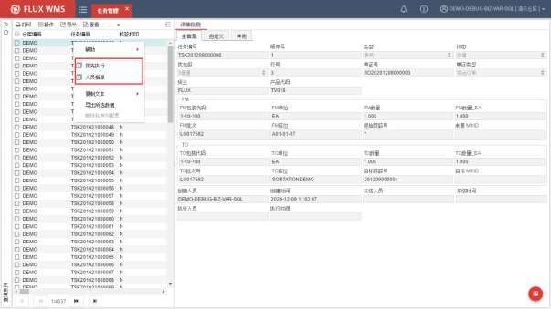

<!-- 原 PDF 第 869 页 -->

- 优先执行

将所选任务的优先级提至最高，使之在任务队列中排序在前，在按队列获取任务的作业功能中，能够优先被获取到。

- 人员指派

二级窗口显示当前工作区中的员工信息，可选择人员，将任务指派给此作业员。也可以选择多人，平均分配任务。

如果查询条件中未选择“工作区”，则显示此仓库全部工作区对应的人员信息。

## 12.2. 上架任务管理

上架任务专项管理功能。针对上架类型的任务进行查询、处理。

- **上架任务操作**

- 选择“任务管理”下的“上架任务管理”。

- 输入查询条件查找相应任务。

- 根据作业需要，对创建状态的上架任务，打印标签，或确认任务完成。

- **右键菜单功能**

针对查询到的上架任务，可通过鼠标右键菜单功能项进行相关操作。

<!-- 原 PDF 第 870 页 -->

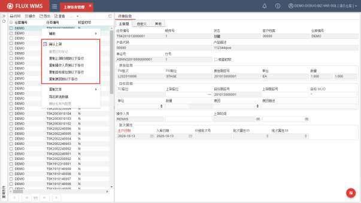

- 确认上架

确认上架任务执行，操作完成。可以单行确认，也可以选择多行记录，进行批量上架确认。

- 重置打印标志

已打印记录，将打印标记改为未打印，方便补打印使用。

- 复制信息

选择任务作为样本，维护上架时间、操作人员，或者修改目标库位、选择修改原因等，并保存后，通过鼠标右键功能，将信息复制到当前任务列表的以下各行，方便上架确认使用。

## 12.3. 拣货任务管理

拣货任务专项管理功能。类似任务管理，但只针对拣货类型的任务，并且可以直接对拣货任务进行确认。

- **拣货任务操作**

- 选择“任务管理”下的“拣货任务管理”功能。

- 输入查询条件查找相应任务。

<!-- 原 PDF 第 871 页 -->

- 根据作业需要，对创建状态的拣货任务，打印标签，或确认任务完成。

- **右键菜单功能**

针对查询到的上架任务，可以通过鼠标右键菜单功能项执行相关操作。

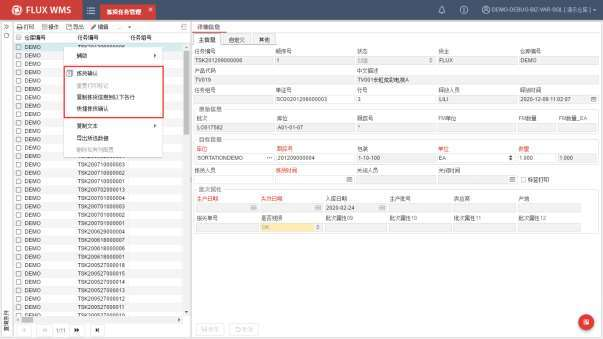

- 拣货确认

确认所选任务记录，拣货执行成功。

- 重置打印标志

拣货任务相关状态标记，更新为“未打印”，方便进行补打印。

- 复制信息

选择任务作为样本，维护拣货时间、操作人员，或者修改目标库位等信息并保存后，通过鼠标右键功能，将信息复制到当前任务列表的以下各行，方便拣货确认使用。

- 快捷拣货确认

二级窗口显示订单号或者任务号输入界面，符合条件的拣货任务批量确认执行成功。确认同时，可以修改拣货人员信息，无需在任务清单中另行修改、复制。

<!-- 原 PDF 第 872 页 -->

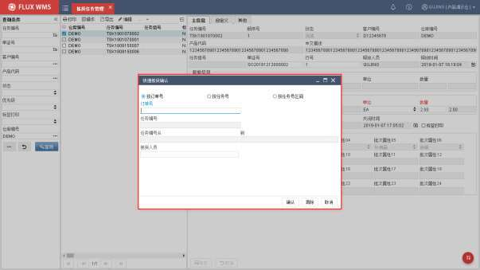

## 12.4. 补货任务管理

补货任务功能，是用来生成、查询、确认产品补货任务操作所使用的。

要顺利使用系统补货功能，需要对产品拣货位、库位、补货规则等相关设置信息进行设置。

### 12.4.1. 补货设置

使用补货功能，需维护的相关基础设置为：

- **产品档案拣货位设置**

需要针对产品设置拣货位，具体可参考【6.8 产品档案】章节的拣货位页签设置说明。

<!-- 原 PDF 第 873 页 -->

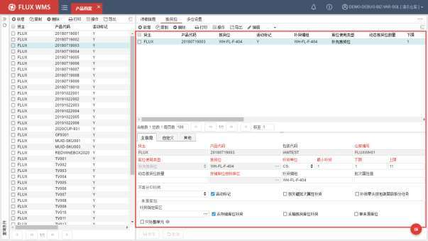

产品拣货位设置，可分为固定拣货位和动态拣货位。固定拣货位即为产品指定拣货位 A或 B，操作时系统只使用设置的 A、B 库位作为拣货位。

而动态拣货位则通过 DYNAMIC库位设置对应的使用类型库位，由系统在该类库位中查找当时可用的库位。如拣货位设置为 DYNAMIC_EA库位，库位使用类型为件拣货库位，则在件拣货库位中找可用库位，作为拣货位。如果当前件拣货位有该产品库存，则合并库位；如果没有库存，则根据补货规则查找新库位。因此使用动态拣货位，每个产品所用的拣货位并不是始终不变的。

需要注意的是，如果拣货位类型设置与当前仓库中的库位类型不符（例如设置为箱拣货位，但当前仓库没有箱拣货类型的库位），或者补货下限设置为 0都将导致无法生成补货任务。

- **库位设置**

产品拣货位中设置的拣货位使用类型，在库位信息中，目标库位的库位使用类型需要与之相符。例如，产品档案中选择了件拣货库位，而在库位设置中，全部库位都是存储库位，会导致无法生成补货任务。

- **库区设置**

库区中，可以同时有多个存储库区，系统支持配置指定的存储区的库存是否能够用于补货（是否补货来源）。例如存放未质检的不良品（尚未执行转移变更批次属性）的库区，一般不会用于补货来源。

<!-- 原 PDF 第 874 页 -->

同时，由于补货可以细分为整箱补货、拆零补货操作模式，在库区功能中，可以分别进行设置，此库区内的库存只用来支持某一种补货模式，还是 2种模式都支持：

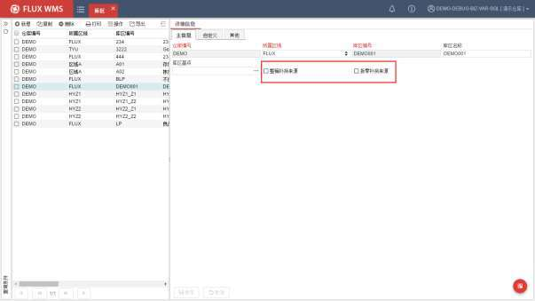

- **补货规则**

产品所用的补货规则，需要选择对应的上架规则。可参考上架规则设置。如果补货规则、上架规则设置有误，或者产品档案中没有选择正确的规则，会影响到动态补货情况下的新库位查找。

拣货位尚有库存存在时，系统计算补货任务直接指向现有拣货位，无需考虑补货规则。

- **参数设置**

参数 RPL_QTY_ALC，控制补货任务计算时，是否考虑分配数量。

如参数设置为 N，则根据拣货位库存是否低于补货下限来判断是否需要生成补货任务，以及计算待补货数量。

如参数设置为 Y，则根据拣货位分配后的可用库存余量是否低于补货下限来判断是否需要生成补货任务，以及计算待补货数量。

因此参数设置不正确，会使得部分产品没有根据预想生成补货任务。例如某产品拣货位库存100，分配 95后剩余 5EA，补货下限为 20，当参数为 N 时，系统判断 100>20，不需要生成补货任务；而当参数为 Y时，系统判断 5<20，需要生成补货任务。

<!-- 原 PDF 第 875 页 -->

是否根据分配数量计算补货，主要与仓库操作情况相关，例如拣货位可存放产品数量、库存周转率及分配到实际拣货的时间长度、拣货到发货确认的时间长度相关。

否则根据分配数量计算的补货库存可能没有空间容纳。

### 12.4.2. 补货操作

补货作业可以根据现场需要，使用不同的模式执行操作。比较常见的主要有库存检查模式和订单驱动模式，经常会配合使用。

- **库存检查补货**

通常在作业空闲时段进行，触发后系统检查库存，针对拣货位库存低于下限的、需要补货的产品，批量生成补货任务。

这种补货任务的生成，可以通过定时器在设定的时间，由系统通过定时器驱动生成，也可以在“补货任务管理”功能中，人工触发计算。人工触发场景中，支持根据自选条件范围，对局部库存进行检查补货，避免全面检查耗时过长，适于有针对性的进行库存检查、补货。

人工操作步骤为：

- 选择“任务管理”下的“补货任务管理”功能。

- 点击右键菜单，选择功能“产生任务”，系统检查当前库存和产品等设置，批量生成补货任务。

- 任务生成后，能够在“库存余量”功能的“按批次/库位/跟踪号查询”界面中查看补货待下架/上架数量。待补货库存被锁定。

- 在生成的任务列表中，勾选所需补货任务（或通过全选 /反选选择记录），选择右键功能菜单项，打印补货清单，使用清单指导仓库实际补货作业（也可打印补货标签，用于 RF补货操作，具体操作细节可参考 RF操作手册）。

- 实物补货完毕，在补货任务中，选择对应记录，点击右键菜单功能项“确认补货”，系统执行补货确认，将存储库位的对应库存补货到拣货库位。补货操作完成。

- 所生成的补货任务，同时也支持通过 RF操作补货，可以在 RF上修改补货上架的目标库位。但在拣货位超量分配情况下，不允许修改补货目标库位、上架到其他库位中，避免对后续拣货操作造成影响。

- 如果补货任务生成后，实际不再需要补货（例如已经执行了库存移动）可通过右键功能项“取消任务”来释放待补货库存。

<!-- 原 PDF 第 876 页 -->

- **订单驱动补货**

补货任务中的生成补货功能，用于日常操作开始前或者结束后批量生成补货任务。但有时即使拣货位的库存补充到上限，日常操作分配时遇到出库量大的情况也会将拣货位库存用光，需要临时进行补货。此时可通过订单驱动补货，仅补充订单中需要而拣货位库存不足的产品。

订单驱动补货，除了产品档案中的拣货位等信息设置之外，还需要在分配规则中进行设置，允许系统自动产生补货任务。

订单驱动生成的补货任务同样显示在补货任务列表中，后续补货操作与批量生成补货的操作相同。

- **鼠标右键 功能**

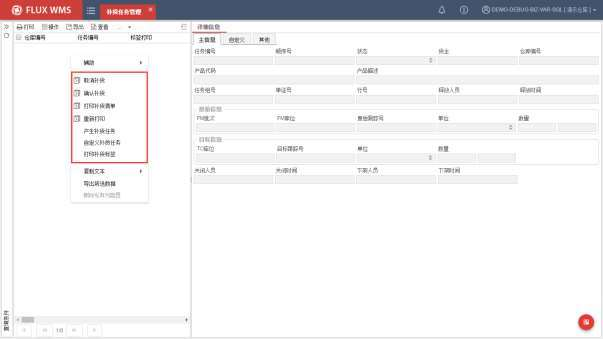

- 取消补货

已生成任务，如无需进行补货操作，可以取消任务。

- 确认补货

确认所选任务记录，补货执行成功。

- 打印补货任务清单

按所选任务记录，打印输出补货清点使用的单据。

<!-- 原 PDF 第 877 页 -->

- 重新打印

已打印，并有打印标记的任务记录，重新进行打印。

- 自定义产生补货任务

根据需要的范围条件，生成指定的补货任务，方便有针对性的快速补货操作。

在如下的二级窗口中，指定补货任务范围条件，包括货物库位条件，产品、货类、产品组等条件。系统在指定的条件范围内，计算生成补货任务。

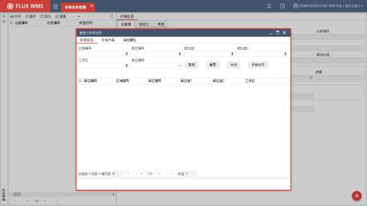

- 打印补货标签

标签形式输出任务作业依据，通常与 RF 补货操作配合使用。

## 12.5. 输送线任务管理

有输送线设备辅助操作的仓库中，通常会将操作任务，按周转箱容量提前计算为任务包（包含一个或多个操作任务），再将任务包与具体周转箱关联，这样设备读取周转箱号，即获取对应的任务包。这个过程称为派箱。

常见的派箱模式有两类。一类仓库中，使用的周转箱只有一种型号，派箱时将任务与任意空周转箱关联即可，通常是人工或者设备自动扫描空箱条码，进行关联。

<!-- 原 PDF 第 878 页 -->

但另一类仓库中，所使用的周转箱有不同大小规格，不同的任务需要关联到不同箱型的周转箱，例如服装仓库，鞋子用大号周转箱，服装用中号周转箱拣取。这种情况下，进行派箱时，操作人员需要了解当前需要哪种周转箱，或者每种周转箱各需要多少数量。

系统提供“输送线任务管理”功能，支持复杂派箱模式下的任务查询，以便用户可以投放合适的周转箱。

- **输送线任务管理**

- 选择“任务管理”下的“输送线任务管理”。

- 输入端口号或派箱点等查询条件，查询指定范围内的输送线任务情况。

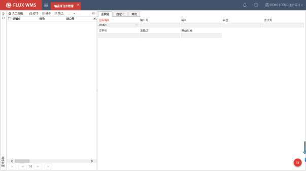

- 如果需要人工干预，可以点击左上角的【人工派箱】按钮，弹出如下操作界面：

<!-- 原 PDF 第 879 页 -->

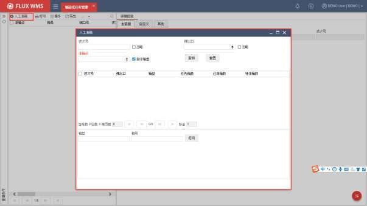

未勾选“指派箱型”情况下，列表下方的“箱型”字段不可编辑。

扫描箱号，系统自动与任务列表进行匹配，绑定任务。

## 12.6. 任务派发

员工所需执行操作的任务，不经过人工提前安排，而是通过扫描员工 ID，领取任务，由系统根据预设逻辑分发任务，称之为“任务派发”。同时，此功能可以相应输出任务标签，以便后续操作使用。

- **任务派发**

- 选择“任务管理”下的“任务派发”。

- 作业模式一：

设置任务派发范围条件，如工作区、库位组等，扫描员工ID，由系统根据范围内的任务量，下发任务给此员工。

<!-- 原 PDF 第 880 页 -->

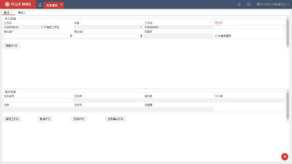

工作区－客户端对应工作区。在【本地配置】功能中配置工作站对应工作区，作为任务领取的工作区范围限定。界面可勾选“不指定工作区”，但不可修改默认工作区。

设备－根据员工默认设备进行显示（在“员工设备设置”功能中维护）。

工作站－显示客户端文件中的工作站配置信息，。

员工 ID－扫描的员工条码或者员工卡号条码

库位组 1－任务派发限定范围要求

库位组 2－任务派发限定范围要求

关联容器号－勾选后，可扫描容器号与任务关联。例如拣货到同一个目标容器中。

- 系统获取当前工作站信息，以及对应的工作区信息，显示在界面。扫描员工 ID后，进行任务派发计算。

- 根据用户授权的任务类型、工作区范围（如果界面指定工作区则在当前工作区内），根据库位组条件筛选合适的任务，并将任务按库位排序，根据派发规则，分派给指定员工。

- 任务派发成功，系统生成任务组号，显示在界面上。同时显示任务数等统计信息。

- 支持人工录入任务组号，用于补打印等。也可点击【获取】按钮，根据指定范围，获取待作业的任务组号，显示在界面上。

<!-- 原 PDF 第 881 页 -->

- 模式二：

扫描员工卡号、ID，系统查找并分派任务，在界面显示任务组号。

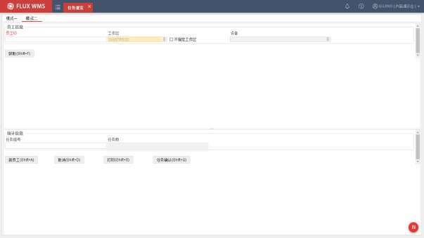

- **功能按钮**

- 新员工

扫描员工 ID 后，系统会进行任务派发计算。为了避免同一员工反复多次扫描，一次扫描成功后，“员工 ID”字段会被锁定，变为只读状态。

只有点击【新员工】按钮后，才会解锁，可以录入新的员工ID。

- 打印

点击【打印】按钮后，系统调用打印机，打印当前任务组号对应标签。

- 任务确认

纸单作业模式中，员工执行完任务操作后，回到派发功能界面，点击【任务确认】按钮，系统会弹出对话框，扫描员工ID 和任务组号信息并确认执行后，系统根据任务组号，以及派发的员工，将相关任务逐一确认执行完成。

<!-- 原 PDF 第 882 页 -->

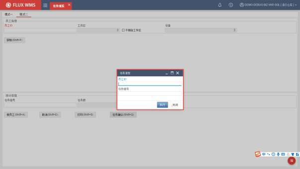

- **其他**

- 关联容器号

勾选界面的“关联容器号”选项后，“容器号”字段相应开放录入。用户可以扫描录入容器号（跟踪号），作为限定条件之一，获取到与此跟踪号相关的作业任务，例如同一个笼车或者同一个目标跟踪号的拣货任务，并打印相应的任务标签

## 12.7. 任务派发规则

库内作业时，需要控制员工一次获取任务的数量、重量、体积或者订单数，以免下发的任务量过于集中，影响任务执行效率。通过【任务派发规则】功能可以实现根据仓库+用户维度，配置用户的默认工作区、默认设备ID、最大任务数、最大价格、最大重量、最大体积、最大订单等任务派发相关的限制信息。

- **任务派发规则**

- 选择“任务管理”下的“任务派发规则”功能。

<!-- 原 PDF 第 883 页 -->

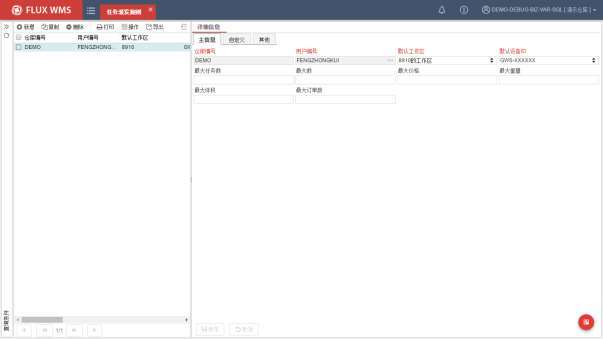

- 根据需要，查询已有任务派发规则，或者点击【新增】按钮，在“主信息”页签依次输入相应的任务派发限制内容。

- 点击【保存】按钮完成规则设置。

## 12.8. 任务类型设置

使用任务调度管理模式情况下，针对不同的任务类型，会有不同的作业管理。除了系统产生的任务，一些场景还存在接口下发任务，或者设备反馈的任务信息，为了方便管理，先需要根据管理要求，定义任务类型。所配置的任务类型，将在后续人员工作限制等环节应用到。

- **任务类型设置**

- 选择“任务管理”下的“任务类型设置”功能。

<!-- 原 PDF 第 884 页 -->

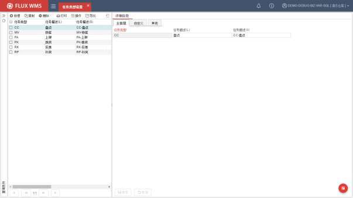

- 点击【新增】按钮，输入任务类型、任务描述信息

- 点击【保存】按钮，完成任务类型设置。

## 12.9. 员工任务类型设置

为配合任务调度管理，不同的员工可以操作的任务类型，需要在操作前进行设置，并且同一员工可操作多种类型的任务时，需要指定不同任务类型的优先次序安排，例如应优先完成补货类任务，再执行拣货类的任务。以便系统在进行任务调度时，相应安排。

- **员工任务类型设置**

- 选择“任务管理”下的“员工任务类型设置”功能。

<!-- 原 PDF 第 885 页 -->

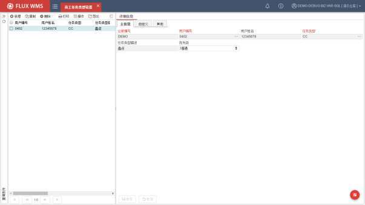

- 点击【新增】按钮，在“主信息”页签依次选择用户，以及此员工可操作的任务类型。

- 通过浏览按钮，可以选择对当前仓库具有操作权限的用户（在【用户管理】功能中，由用户管理进行设置）。

- 任务类型可选择内容，为【任务类型设置】功能中配置的类型。

- 一个员工可操作多个任务类型时，需要设置多个任务的优先级排序。

- 点击【保存】按钮完成设置。

## 12.10. 员工工作区设置

任务调度管理，需要配置作业员工可以操作的工作区。

设置前，需要先在【业务系统管理】-【用户管理】功能中创建员工账号，并在【仓库设置】-【工作区】功能中维护工作区档案。

- **员工工作区设置**

- 选择“任务管理”下的“员工工作区设置”功能。

<!-- 原 PDF 第 886 页 -->

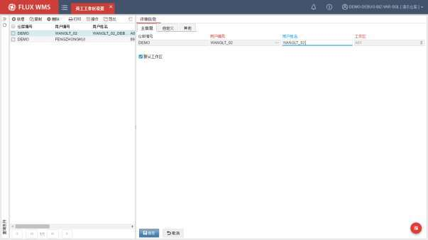

- 点击【新增】按钮，输入，或通过浏览按钮选择用户编号（即操作员工 ID，需要预先在【用户管理】功能中设置）。

- 下拉选择此员工的指定工作区。如果为主作业区，可设置为默认工作区。

- 保存记录，建立员工-工作区对应关系。

- 同一员工可设置多个工作区。

## 12.11. 员工设备设置

库内作业时，如果有员工指定设备管理需求，可以通过【员工设备设置】功能，将员工与外部设备（例如叉车）建立对应关系，以便进行后续的任务分派管理。

对应关系可以是一对一、一对多，或者多对多的各种情况。

- **员工设备设置**

- 选择“任务管理”下的“员工设备设置”功能。

<!-- 原 PDF 第 887 页 -->

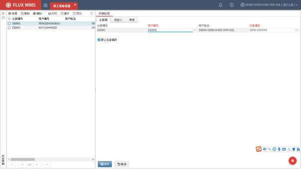

- 点击【新增】按钮，输入，或通过浏览按钮选择用户编号（操作员工 ID）。

- 在“设备编码”字段，选择此员工的指定设备。点击浏览按钮，在二级窗口可以查看到【仓库设置】-【设备】功能中维护的设备记录。

- 保存记录，建立员工-设备对应关系。

- 如果为此员工的主要操作设备，可设置为默认设备。

## 12.12. 设备工作区设置

现场任务派发时，需对作业设备与仓库、工作区进行关联，以方便作业任务和工作区内任务量的负载均衡计算。系统通过“设备工作区设置”功能，实现仓库、工作区、设备三者之间对应关系设置。

- **设备工作区设置**

- 选择“任务管理”下的“设备工作区设置”功能。

<!-- 原 PDF 第 888 页 -->

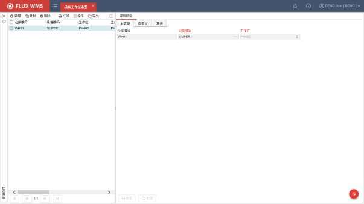

- 根据需要，查询已有任务派发规则，或者点击【新增】按钮，在“主信息”页签依次输入设备和设备对应的工作区。

- 点击【保存】按钮完成设置。

## 12.13. 电子标签任务管理

在使用电子标签进行操作的场景中，为了方便用户从 WMS 系统进行电子标签任务查看、异常处理，不必登录到电子标签设备管理系统进行相关操作，FLUX WMS 提供了独立的“电子标签任务管理”功能。

- **电子标签任务管理**

- 选择“任务管理”下的“电子标签任务管理”。

- 输入波次号或库位号等查询条件，查询指定范围内的电子标签任务情况。

<!-- 原 PDF 第 889 页 -->

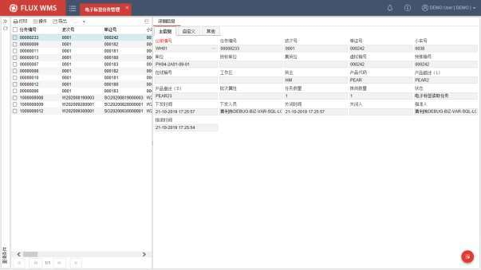

- 对于查询到的记录，可以通过鼠标右键功能进行不同的操作处理。

- **右键功能**

- 删除

删除电子标签接口任务，不在下发给电子标签进行操作。通常在任务进行接口传递之前操作。

- 任务指派

任务调度方式之一，人工指派任务给指定的用户进行操作。点击后，系统弹出如下任务指派界面，显示当前工作区（如果查询条件没有指定工作区，则报错“请在查询条件中指定工作区”）的人员作业动态信息：

<!-- 原 PDF 第 890 页 -->

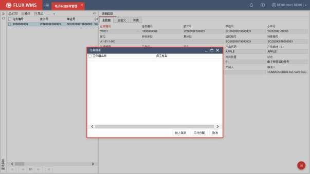

可以选择具体用户（即操作员工），点击【按人指派】按钮后，系统将之前选择的多个任务与用户关联锁定，效果同用户获取任务队列中的任务并绑定。

后续用户登录对应操作功能，可以查看到自己名下的任务。

如果选择多个用户，点击【平均分配】按钮，系统则将选中的任务，按任务排序要求，根据选择的用户人数，进行平均分配。例如一共 30条任务，指定 3个人，则第一个人 10条，第二个人10条，第三个人 10条。

- 拣货确认

针对创建状态的任务记录，确认后系统会更新所选任务状态为“已拣货”，与电子标签拣货确认返回效果相同，后续由WMS系统根据已拣货的任务记录，执行相关的拣货确认处理。

- 缺货确认

更新所选任务状态为“缺货”，与电子标签缺货确认返回效果相同，后续由WMS 系统根据任务记录信息，以及拣货规则中配置的、缺货场景下系统处理的要求，执行异常确认处理，例如取消分配、库存自动移动到“LOST”库位等。

## 12.14. 立库在线拣选

自动化立体仓库，上架、拣货任务，通常是由系统将任务通过接口发送给自动化设备的控制系

<!-- 原 PDF 第 891 页 -->

统（WCS 系统），由控制系统负责托盘/箱的上下搬运。

然而立体仓库中，虽然大部分是整单元操作（整托盘或者整箱出库），但有时也会有拆分拣货的需求，例如一个托盘 10箱，需要出库 4箱，剩余 6箱再返回立库存储。这种作业情况，有些仓库会中安排专门的集中拆分区域，操作后剩余托盘再逐一上架；也有些仓库是下架后，在出库口进行在线拆分、拣选，剩余托盘由设备直接转运再上架。

对于在设备出库口在线拣选的场景，可以通过系统的【立库在线拣选】功能，进行作业管理。

并且，由于立库中拣选模式经常有些差异，系统也提供了 2种常见操作模式选择：

- 模式 1，基于任务，逐个任务确认操作。

- 模式 2，批量获取任务，打印标签进行操作。

- **模式 1**

- 选择“任务管理”下的“立库在线拣选”。

- 根据作业模式，选择页签：

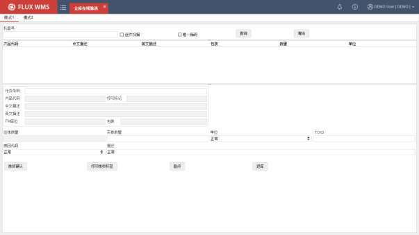

- 扫描，或者录入托盘号码，系统在列表部分显示此托盘上的货品的未操作任务记录。如果参数 ASRS_CMB_TSK（立库在线拣选合并任务显示）启用，则按产品合并任务信息显示合计任务数量。

- 任务标签作业模式下，扫描任务条码，界面相应显示任务信息，提示应拣取数量。

<!-- 原 PDF 第 892 页 -->

- 非任务标签模式下，可以双击列表部分的记录，定位具体任务。但ASRS_CMB_TSK参数开启情况下，不支持双击定位任务。

- 操作员根据任务信息拣取货物，如果有异常情况，可以修改实拣数量（只能改小不能改大），但需要选择原因代码。

- 有目标跟踪号记录要求的业务流程中，在“TOID”字段，扫描录入目标跟踪号。

- 点击【拣货确认】按钮，确认拣货执行。

- 整个托盘拣货完成，点击【返库】按钮，下达托盘回库指令给WCS 立库控制系统。

- 作业时，点击【打印拣货标签】按钮，可以输出任务对应标签。即使任务已确认，也支持扫描任务号，进行标签补打印。

- 其他操作

- 逐件扫描

勾选此选项后，扫描条码，无需进行数量确认,而是直接执行“拣货确认”的逻辑，从而实现扫描一箱（件）即确认执行一件的效果。

- 唯一箱码

勾选此选项后，在扫描任务条码时，系统自动复制条码到 TOID字段，即使用任务号作为拣货后的目标跟踪号。

实际操作时，也会将唯一码与任务关联，通过扫描唯一码，定位任务，TOID即唯一码。

- 盘点

拣货操作过程中，如果发现有异常，可以通过点击【盘点】按钮，按照任务对应的货主、产品、批次、库位、跟踪号生成盘点单并自动生成产生盘点任务。盘点单类型“拣货异常盘点”。

然后自动弹出窗口，显示任务的原始数量，要求用户输入目标数量，更新盘点任务数据，实现同步盘点确认的目的。

- **模式 2**

在“模式2”页签，系统会将【本地配置】中设置“工作站”信息，显示为“拣选台编号”。

扫描托盘号，根据托盘对应任务的任务组号，查询显示相关任务，自动执行相关任务的拣货确认，并批量打印多张任务标签，操作任务可以逐一粘贴标签并拣取货物：

<!-- 原 PDF 第 893 页 -->

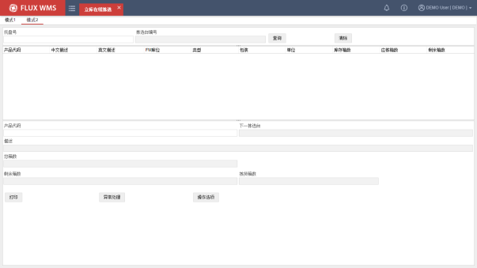

对于混放多个产品的托盘，需要扫描产品条码，相应匹配任务再触发打印。

有多个拣选台的业务场景，托盘通常会依次经过拣选台，因此打印时只打印当前操作台相关任务。并且界面会提示“下一拣选台”

系统打印完成，用户可以扫描下一托盘号，继续操作。

- 操作选项

针对混托盘，多个产品需要拣选的情况，在【操作选项】中，如果勾选了“隐藏已确认完成的产品记录”，则扫描一个产品，操作后，系统自动刷新界面信息，列表部分隐藏已操作的产品任务信息。

- 异常处理

拣货时如果碰到任务无法正常执行（拣货异常），或者任务不影响但托盘上库存不对（库存异常）的情况，可以点击【异常处理】按钮，在弹出的对话框中，选择异常模式，并记录异常情况信息：

<!-- 原 PDF 第 894 页 -->

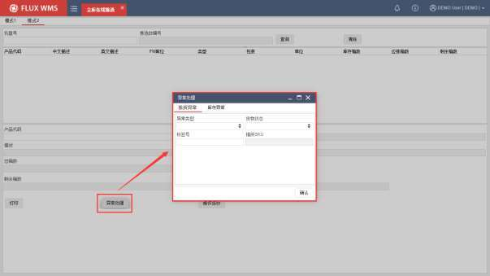
