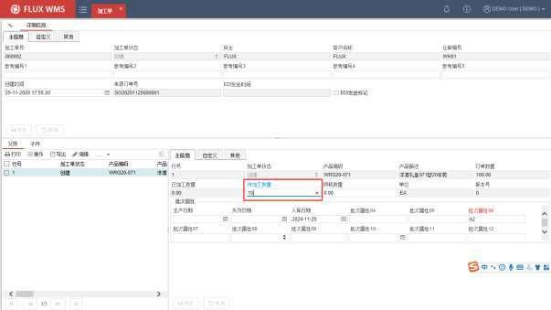
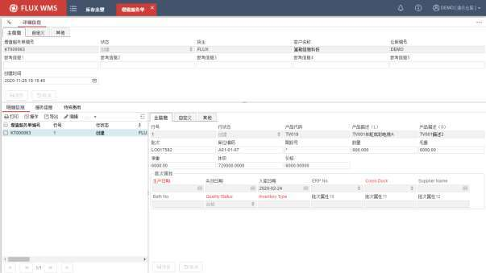
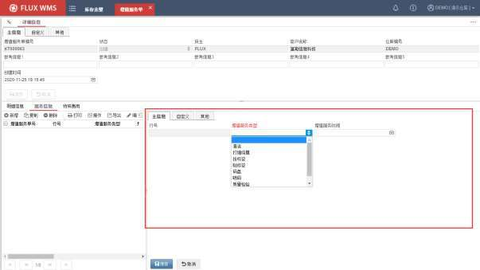
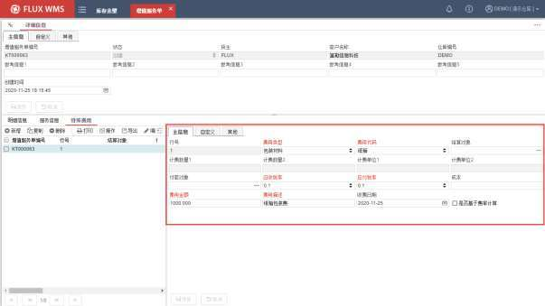
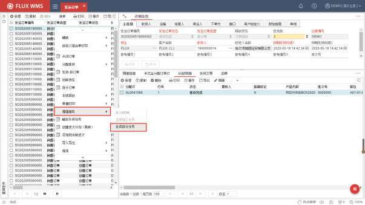
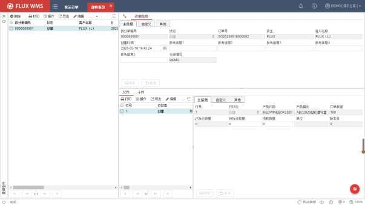
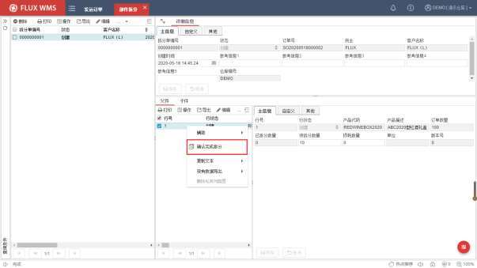
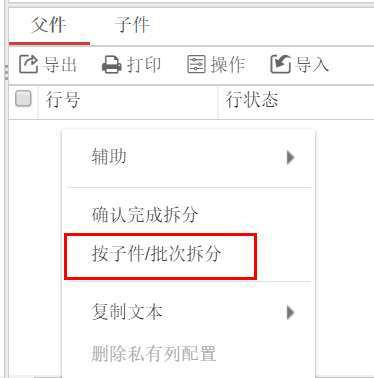

# 13. 增值服务

> 来源文件：`富勒WMSV6.2（最全版1119页）.pdf`；原 PDF 第 895-904 页。

> 本文件按原 PDF 正文中的顶层章节拆分；每页保留原 PDF 页码注释，图示按原图注顺序引用。

<!-- 原 PDF 第 895 页 -->

随着物流在企业管理中的作用日渐加强，越来越多的仓库不仅提供常见的进出存及简单的附加服务，还能提供简单加工等增值服务。

为了对这些能够带来更多价值的服务操作进行管理，系统提供了增值服务模块。根据不同的加工管理需求，增值服务分为加工单、拆分单和增值服务单。

从仓库操作管理角度，可分为几类加工方式：一类是在原产品基础上进行加工，产品总数量不变，例如产品换包装、贴标签、覆膜、塑封等；另一类是组合加工或者拆分加工，不仅产品会变化，产品数量也随之变化。组合加工多数是将几个子件加工组合成一个父件，例如将分别入库的洋酒产品和杯具产品组合成洋酒礼盒。拆分加工则是相反，一个父件，拆分为几个子件，例如一条鱼分割为鱼头、鱼尾、鱼块分别包装，作为独立 SKU，以不同单价分别称重销售。

注：子件指用来加工组合的零件产品或者原材料，父件指的是加工组合所得的产品或产品套装。

对于第一种，原产品基础上的加工，库存数量不变，管理重点是记录加工件数，以便统计工作量、成本，同时在库存中区分已加工、未加工的产品，以免误出库。此类作业，如果产品代码不变，仅记录工作量，可以使用 ASN、SO 的服务记录功能，或使用增值服务单；如果加工后产品代码改变，可使用转移单，或设置一对一的 BOM，通过加工单进行管理。

对于第二种组合加工或者拆分加工，由于产品、数量均有变化，需要对加工全程操作进行管理。此类比较复杂的组合加工需要通过加工单、拆分单功能进行管理。

## 13.1. 加工单

加工作业，是最常见的增值服务之一，执行将多个独立 SKU子件，组合为新的父件 SKU 的操作，A+B=C。

- **相关设置**

使用加工单功能，需要先将相关基础设置维护完善，主要涉及设置有：

- 产品档案

产品档案中，需要维护父件SKU 和子件 SKU的基础信息，并且父件产品需要设置“组合件标识”，具体可参考【基础设置】-【产品档案】部分的介绍。

- 组件

<!-- 原 PDF 第 896 页 -->

需要在【基础设置】-【组件】功能中，设置子件、父件的关联，类似 BOM 清单。具体设置参考6.9章节的介绍。

- 库位

系统中需要对“组装加工区 “的专用库位进行定义。库位 ID限定为 WB_RM_仓库 ID(待加工库存库位)和 WB_FG_仓库 ID（已加工库存库位）。

- **加工单操作**

- 创建加工用的 SO

创建加工用的发运订单（SO），目的是通过 SO分配子件库存，便于操作人员从库存中拣取加工所需的货物，对拣货作业过程以及任务进行管理。同样，也可以接收 ERP 接口下达的加工指令，作为加工 SO。

因此对于 SO，可输入加工所需的父件数量，通过 SO 右键功能“拆分 BOM”，将记录拆分为子件记录，订单分配子件库存。

拆分 BOM 的作业，并不限制 SO的订单类型。也即全部 SO 都可以根据 BOM 把父件明细拆分为子件明细。有时仓库不做实际加工，仅按照 BOM 比例出库对应子件产品，会使用到单纯的“拆分BOM”功能，仓库不进行组装加工。系统通过参数 VAS_BOM_CTL控制非加工类型的 SO 能否使用“拆分 BOM”功能。

普通 SO拆分 BOM，最常见的就是赠品的发货，订单指令中下达出库 A 产品 100件，根据 BOM中的设置，SO 拆分为 A 产品 100件+赠品 B产品 100件，分别拣货后发货。由超市销售人员将 A、B产品捆扎在一起销售。

但只有加工类型的 SO，系统在拆分的同时，会创建对应的加工单，可以进行后续加工操作。

- 生成加工任务

SO 分配并确认拣货后，通过鼠标右键，生成加工任务，系统找到前一步骤“拆分 BOM”时已经创建的、对应加工单（仅有单头信息），相应创建加工任务，即子件加工信息。

创建 SO、拆分 BOM 和生成加工任务等操作，可参考【11.1 发运订单】章节的介绍。

- 加工确认

在【增值服务】的【加工单】功能中，查询所需的加工单。

在明细的父件页签，选择执行加工的父件产品，在待加工数量字段，输入此次加工的数量，并保存。

<!-- 原 PDF 第 897 页 -->

同时可根据需要，输入父件产品的批次属性信息。系统支持一个加工单分批多次加工操作。

实物加工完毕，选择父件记录，通过鼠标右键菜单功能“确认完成加工”，由系统执行加工确认，根据组件设置的子件比例关系扣减子件产品库存数量，增加父件产品库存数量。

如果整个加工单一次性加工完成，可以通过表头的鼠标右键功能“确认完成加工”，批量确认整单加工作业完成。

- 加工操作全部完成，可关闭加工单。

- 如果有设置加工费率，加工单关闭时系统将计算对应加工费用。

- **损耗管理**

加工过程中，有时会有库存损耗（例如蔬菜、肉类等生鲜产品），导致无法按数量完成加工。此时需要扣减掉损耗的子件库存，但又希望在加工单中加以记录。因此系统提供损耗管理，主要是加工单中，记录子件损耗数量，然后通过表头鼠标右键功能“生成损耗调整单”，通过调整单扣减子件损耗库存。

## 13.2. 增值服务单

除了加工作业，其他不改变产品性状的增值服务，例如重包装、贴标签等，也是仓库常见的附

<!-- 原 PDF 第 898 页 -->

加作业。

在入库或出库时进行的附加操作，可以通过 ASN或 SO 的“服务”页签进行记录和管理。而对于库存中进行的、不涉及到进出操作的附加增值操作，可以通过增值服务单进行管理，计算增值服务的相关费用。

- **增值服务登记**

增值服务单的操作步骤是：

- 在“库存余量”功能中，查询并选择需要进行增值加工的库存记录。

- 点击鼠标右键功能“生成增值服务单”。

- 在“增值服务”模块，选择“增值服务单”功能，查询已创建的单证。

- 仅对部分库存进行操作的情况下，例如仅对外包装破损的货物更换包装，可以修改增值服务单明细部分的“数量 ”信息。

- 如果采用基准费率计算增值服务费用，则在增值服务单明细部分的“服务信息”页签中，点击【新增】按钮，添加服务相关信息，例如服务类型（贴标签、换包装，具体下拉框内容可在系统代码中维护）、服务时间等。系统根据库存信息页签的数量、重量等信息计算增值服务费用。一行库存记录，支持添加多种不同的服务信息，系统会分别进行计费。

<!-- 原 PDF 第 899 页 -->

- 如果不采用基准费率，则在“特殊费用”页签，录入费用种类、日期、金额等服务相关费用信息，或者选择基于费率计算，根据特殊费率计算增值服务类型。

- 单行记录操作完成，可以通过明细行部分的鼠标右键功能“确认完成”，系统更新

<!-- 原 PDF 第 900 页 -->

执行状态为“完全加工”。

- 服务完成，关闭增值服务单，系统计算相应费用，添加到费用清单中。

- **补充费用**

增值服务单关闭后，允许修改“特殊费用”页签内容，然后通过表头鼠标右键菜单功能项“重新计算费用”，更新费用记录。

## 13.3. 部件拆分

正常加工作业后，有些仓库还需要进行反向的拆分加工操作。例如原本将 A 产品洋酒与 B 产品水晶杯包装为 C产品洋酒礼盒，但由于春节期间未能全部销售，剩余礼盒返回仓库，需要拆分为产品A 洋酒，与产品 B 水晶杯，分别进行销售。此时可以使用到系统的“部件拆分”功能，对父件产品根据【组件】功能中所维护的 BOM 关系、拆分为子件产品的相关过程进行管理。

- **相关设置**

- 产品档案

产品档案中，需要维护父件和子件的基础信息，并且父件产品（例如C 产品洋酒礼盒）需要设置“组合件标识”，具体可参考【6.8产品档案】章节的介绍。

- BOM维护

需要拆分的产品，同样需要在【基础设置】-【组件】功能中，维护BOM 组合信息。具体配置内容可以参考【6.9组件】章节的介绍。

待拆分的产品，即父件SKU，例如洋酒礼盒C 产品；而拆分后的洋酒产品A、杯子产品B 则是作为子件维护在“明细”页签中。

- 库位

系统中需要有库位使用是“组装加工区“的加工专用库位。库位ID 限定为 WB_RM_仓库 ID、WB_FG_仓库 ID，作为待加工库位，与已加工暂存库位。

<!-- 原 PDF 第 901 页 -->

如果仓库中同时会进行组装加工，产品档案、组件信息、加工库位的资料维护，与组装加工的所需信息维护操作是相同的。

- **拆分操作**

- 创建加工用的SO

创建发运订单，单证类型为“拆分单”，主要用于提取拆分作业所需的组件（即待拆分的父件）库存，指导用户拣货。

例如 SO明细为组件产品：C 产品洋酒礼盒 100件。

分配后，生成拣货任务，到指定库位拣取组件库存，搬运到对应的组装加工区库位（WB_RM_仓库 ID的待加工库位）。

- 生成拆分任务

拣货完成后，通过鼠标右键菜单中的“生成拆分任务”功能，创建拆分单。拣货用的发运订单，将被自动关闭。

- 拆分确认

在“增值服务”模块，选择“部件拆分”功能，查询已创建的拆分单记录：

<!-- 原 PDF 第 902 页 -->

完成实物拆分，在部件拆分单中，明细行部分，输入实际拆分父件数量，即【父件】页签的“待拆分数量”。通过鼠标右键菜单的【确认完成拆分】功能，执行拆分确认：

系统将扣减父件数量，相应增加子件库存数量。

<!-- 原 PDF 第 903 页 -->

子件库存位于“WB_FG_仓库 ID”的库位中，后续通过库存移动操作上架，可作为正常货品分配、出库。

- 拆分操作全部完成，可关闭拆分单。

- 如果有设置加工费率，关闭时系统将计算对应费用。

- **其他操作**

- 按子件批次拆分

针对拆分过程中，子件需要另外记录与父件不同的批次属性的情况，例如生产日期不同等，可以通过明细部分“父件”页签的鼠标右键功能【按子件/批次拆分】，在弹出窗口中记录子件的具体批次属性信息。

- 分单处理

部件拆分，涉及到父件、子件库存量变动，在有ERP系统对接情况下，很多场景会要求将加工相关库存变动也通过接口回传到ERP 系统，多数情况下会在操作结束后（即拆分单关闭后）一次性回传。但有时操作时间较长，会希望部分完成情况下即反馈库存变动信息。

此时可以采用类似ASN、SO 的分单处理，将参数 PAR_SPL（关闭拆分单后自动根据数量差异产生新的订单）配置为 Y，关闭拆分，当前已完成部分，通过接口反馈；剩余未完成部分，系统自动创建分单，用于支持后续继续操作。

- 多 BOM 拆分处理

一些业务场景中，同一个父件，可以有多种不同的子件拆分方案，也即多个不同版本的 BOM信息，在拆分作业时，根据货主要求，选择不同的 BOM 组合，拆分得到不同的子件。

<!-- 原 PDF 第 904 页 -->

此场景中，参数 KIT_VER（启用组件版本号管理）设置为“C-启用组件版本管理，但不对库存进行版本管理”。

在【组件】功能中维护 BOM 组合时，一个父件，可以配置多个不同的 BOM 组合，通过不同的版本号进行区分。

在“拆分单”类型的发运订单中，通过鼠标右键功能进行“拆分订单”时，如果有父件具有多BOM 组合，不允许使用表头右键菜单的“拆分订单”功能，只能使 用明细行部分，鼠标右键菜单的“拆分 BOM”功能，并且在二级弹窗中，人工选择所需操作的 BOM 版本。

- **相关参数**

此功能相关参数有：

参数 ID 参数描述 对应说明

KIT_VER 启用组件版本号管理 启用情况下，版本号记录到批次属性 11 PAR_SPL 关闭拆分单后自动根据数量差异产生新 同 ASN、SO 的订单关闭、生成分单的处理的订单
