# 14. 行业插件

> 来源文件：`富勒WMSV6.2（最全版1119页）.pdf`；原 PDF 第 905-952 页。

> 本文件按原 PDF 正文中的顶层章节拆分；每页保留原 PDF 页码注释，图示按原图注顺序引用。

<!-- 原 PDF 第 905 页 -->

不同行业的仓库，在作业中会有一些具有行业特性的特殊功能，例如医药行业有很多GSP（Good Supply Practice即《药品经营质量管理规范》）要求的必备作业步骤，药品养护、两票制管理等，这些功能，集中在【行业插件】模块，供现场根据需要选用。

## 14.1. 药品检验报告

药品检验报告，是医药行业的管理功能。

药品检验报告书是对药品质量作出技术鉴定后出具的具有法律效力的技术文件，一般需要按批号提供。但一个出库订单涉及的多个产品，可能来自多个不同的入库单据，人工找寻对应文件，效率比较低，因此会通过系统进行管理。

对于需要进行检验报告管理的产品（在【产品档案】功能的“食药监管行业插件”页签，勾选“打印药品检验报告”），可以在入库时扫描供应商提供的药品检验报告，与库存批号关联记录。然后出库时根据发运订单分配到的出库库存批号，相应打印，随货提供给收货人。

部分供应商，可以提供电子版的药品检验报告，仓库需要将电子版报告，与库存关联，用于后续出库打印。

行业插件模块的【药品检验报告】功能，就是用来对入库检验报告进行匹配上传的管理功能。同时也可以用来查找、打印。

正常出库时，批量打印货物配套的药品检验报告，通常在【发运订单】或者【波次计划】功能中进行操作。

- **药品检验报告**

使用药品检验报告功能，需要先配置 MED_QC_DIR参数（药品检验报告扫描存档路径），维护药品检验报告上传后的保存路径，也即电子版药品检验报告保存目录。

- 选择“行业插件”下的“药品检验报告”功能。

- 对于新入库的批次，查询时勾选“未关联文件”，系统查询尚无检验报告记录的库存。

<!-- 原 PDF 第 906 页 -->

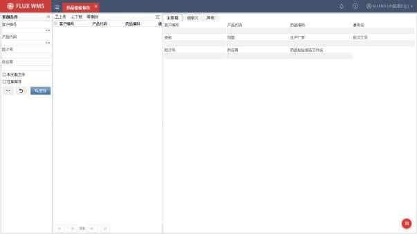

- 选择记录，鼠标右键“定位药品检验报告”，系统定位到参数所指定的路径，选择检验报告扫描文件，确认后将文件名记录批次信息中（后台字段）。

- 或者通过点击【上传】按钮，上传本机文件。

- 需要输出药品检验报告时，同样通过查询定位，此时无需勾选“未关联文件”条件，系统只查询具有检验报告的批次库存。

- 选择记录，通过鼠标右键功能“打印药品检验报告”，或者打印标签。

- **其他右键功能**

<!-- 原 PDF 第 907 页 -->

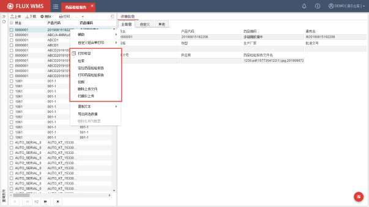

- 检索

点击后，系统显示产品代码、批次号录入弹窗，根据录入条件，在查询结果列表中进一步查询、定位记录。

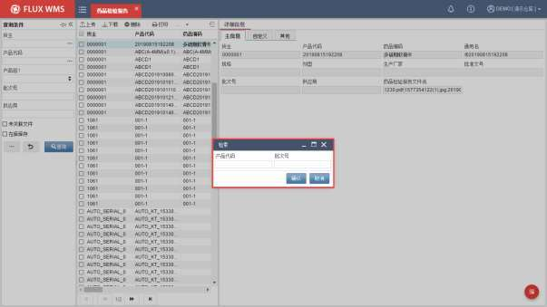

<!-- 原 PDF 第 908 页 -->

- 拍照

通过摄像头、高拍仪等拍照设备，保存药品检验报告照片。点击右键功能后，系统会打开摄像头，或者调用高拍仪接口，获取照片。所得的图片文件，保存在 MED_QC_DIR 参数（药品检验报告扫描存档路径）维护的指定目录中，支持保存多张照片，在“药品检验报告文件名”字段能够查看到通过；分隔的多个文件名。

- 扫描仪上传

通过与扫描仪的接口，获取扫描生成的药品检验报告图片文件。同样保存在 MED_QC_DIR 参数（药品检验报告扫描存档路径）维护的指定目录中。

- 删除上传文件

一个药品批号，可能会有多个相关报告图片文件。有时存在文件删除重传的情况，例如扫描文件打印后发现不清晰。此时可以通过“删除上传文件”功能，系统弹窗显示当前产品批次，已上传的报告文件，用户选择记录后确认删除，支持多选删除，系统会提示“请确认是否删除 X个文件？”进行二次确认，以减少误操作的可能。

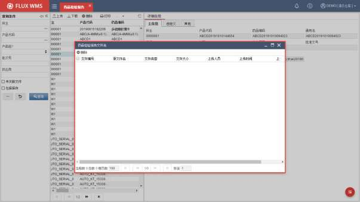

<!-- 原 PDF 第 909 页 -->

## 14.2. 药品养护

药品养护是医药行业的管理要求，根据药品的储存特性要求，采取科学、合理、经济的手段和方法，通过控制调节药品的储存条件，对药品储存质量进行定期检查，达到有效防止药品质量变质、确保储存药品质量的目的。

FLUX WMS系统中的药品养护功能，用来对需要养护的产品进行查询、养护安排、记录，对养护过程进行管理。

用于不同药品的养护要求不同，使用前需要先在【产品档案】功能的“食药监管行业插件”页签中，对养护类型进行设置，例如是一般养护，还是重点养护等。

- **药品养护**

进行养护前，需要先产生养护任务。系统支持定时器后台生成养护任务，同时也支持手动生成养护任务。此处介绍手动作业模式。

- 选择“行业插件”下的“药品养护”功能。

- 在“列表”页签，选择鼠标右键功能“养护计划”，系统显示如下二级窗口

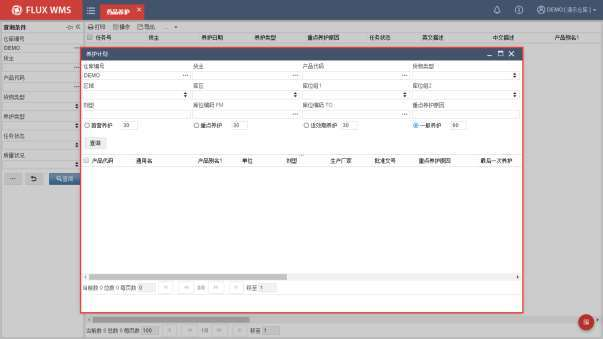

重点养护原因－根据 GSP 管理要求，药企可自行定义重点养护原因范围。系统提供重点养护原因内容维护（【产品档案】中设置），查询时也可基于此内容筛选记录。

<!-- 原 PDF 第 910 页 -->

养护周期－不同药品要求的养护周期不同，系统提供首营、重点、近效期的不同默认周期供配置使用，勾选后，将筛选上次养护迄今超过指定天数的待养护产品记录。三个都不选，默认为一般养护。

- 输入查询条件，查询符合条件的产品记录。

- 在查询结果部分，选择记录，鼠标右键功能“生成养护任务”，系统针对所选产品的库存记录，生成养护任务，可在“药品养护”功能中查询到。

- 已生成的养护任务，可以通过 RF 的养护功能执行养护（具体介绍请参考 RF操作手册）。如在WMS中确认养护，同样选择记录后，通过鼠标右键功能“确认养护结果”，系统显示二级窗口：

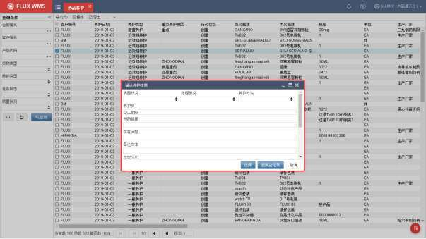

- 用户输入养护情况细节后确认养护结果。

- **养护后续处理**

根据 GSP 管理要求，在药品养护的业务中，质管员需要对养护异常的药品进行冻结，禁止销售出库。此时可以将问题记录，通过鼠标右键菜单“生成冻结单”功能，将异常库存冻结，不参与出库作业。

<!-- 原 PDF 第 911 页 -->

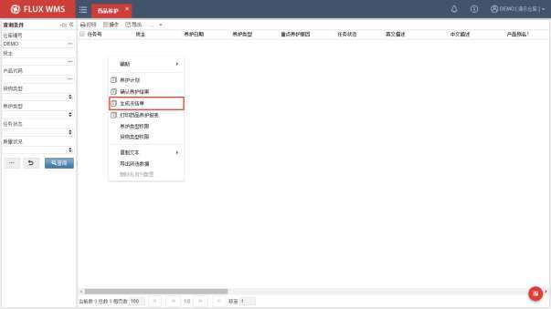

- **权限设置**

根据 GSP的管理要求，不同货类及养护类型的养护任务需要有具有相关资质的用户进行对应养护确认操作。因此用户可以操作的养护类型，以及货类，也有相应限制，需要进行权限设置。

不过由于此类权限，作为特殊护具权限，仅涉及养护使用，因此通过鼠标右键功能，由具有设置功能权限的管理员进行对应设置：

- 养护类型权限

养护类型分为“不养护”、“一般养护”、“重点养护”，养护过程中，具有对应类型权限的用户，才能查询到此类养护产品记录、养护任务，并进行养护确认等操作。

点击右键鼠标功能，系统显示如下二级窗口，可以通过【养护类型权限查询】按钮，查询不同养护类型下，具有权限的用户，并加以编辑，例如去除授权；也可以通过用户查询，为用户增加养护类型授权：

<!-- 原 PDF 第 912 页 -->

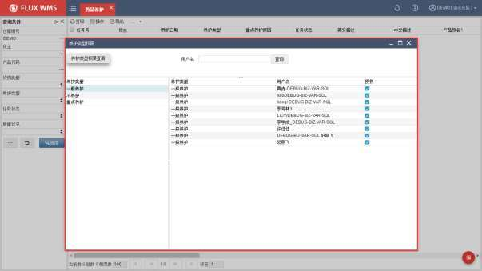

- 货物类型权限

用来配置用户可以操作哪些货物类型的养护工作。例如有些用户有权限操作麻醉类药品，有些用户专门负责操作中药材的养护。

操作与养护类型授权类似，在二级窗口，可以基于货类授权，也可以查询用户进行授权：

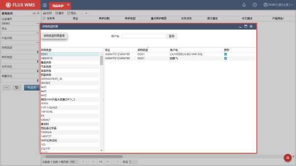

<!-- 原 PDF 第 913 页 -->

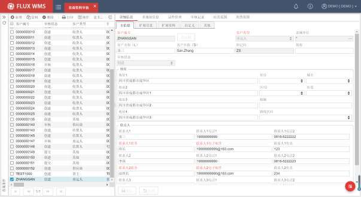

## 14.3. 客商资料审核

GSP 管理需求功能，通过接口、导入或者人工创建客商相应资料，经过审核后，才能成为客户档案记录。

- **客商资料审核**

- 选择“行业插件”下的“客商资料审核”功能。

- 通过查询条件，查看已获取到的客商资料 （例如接口下达的客商资料信息），或点击新增按钮，在如下界面录入新客商信息：

*图 14-3-1（图像未能从 PDF 对象中直接提取）*

- 根据需要维护扩展信息、证件信息。

- 如果有多地址信息，可以在“多地址信息”页签进行维护。

- 在“证件管理”页签，进一步维护证件、执照信息，并可上传证照的图片，预览、下载图片。

<!-- 原 PDF 第 914 页 -->

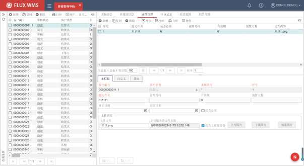

- “经营范围 ”页签，用于维护客户的药品经营范围，点击【新增】按钮， 新增经营范围信息。通过点击浏览按钮，系统在二级窗口中显示已在系统代码维护的经营范围供选择。

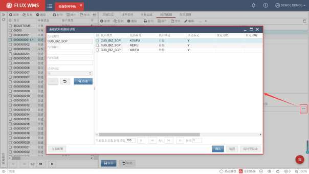

<!-- 原 PDF 第 915 页 -->

- “剂型范围”页签，用于维护客户经营的药品剂型信息。

- 记录维护完成，点击【保存】按钮保存修改。如果开启了数据更新日志（【业务功能】中勾选“启用数据更新日志”），则在【数据更新日志】功能中可以查询到保存前后的数据变更信息。

- **审核操作**

- 信息维护完成后，通过鼠标右键功能“提交审核”，已提交记录不可修改，仅允许审核人员 进行审核处理：

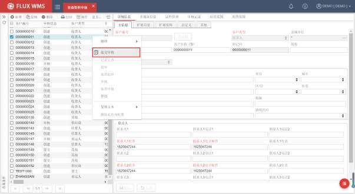

- 已经提交审核的记录，如果发现有修改的必要，可以通过鼠标右键功能“记录完善”，撤销审核申请，重新进行编辑。

- 审核人员，通过鼠标右键的“初审”、“审核”功能，进行记录的二次审核，并在弹窗中录入审核结果和意见：

<!-- 原 PDF 第 916 页 -->

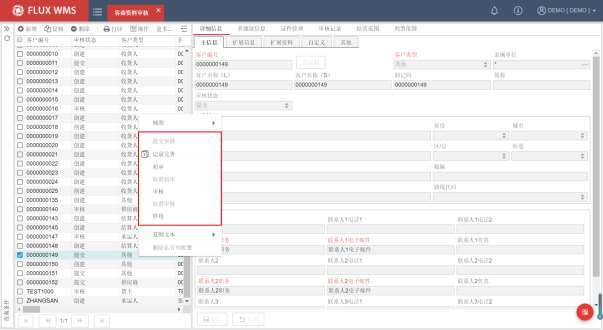

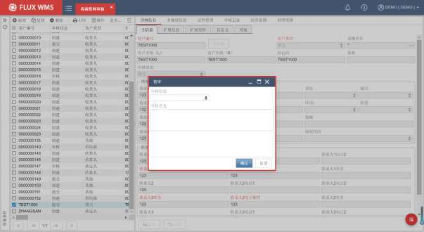

- 在“审核记录”页签，可以查看到审核日志信息。

<!-- 原 PDF 第 917 页 -->

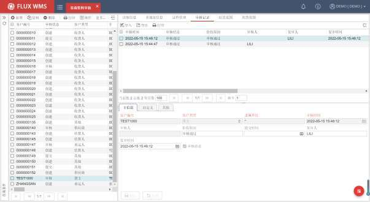

- 对于已审核的记录，支持通过鼠标右键的“取消初审”、“取消审核”，回到提交审核状态，再通过“记录完善”进行内容修改。

- **停用**

客商不再使用，支持通过鼠标右键菜单中的“停用”功能，更新记录审核状态为“停用”，并且更新【客户档案】中的对应记录活动标记为“ N”。在“审核记录”页签能够查看到“停用”的操作日志。

已停用记录，不再允许进行审核，但支持通过“记录完善”，进行信息维护。

## 14.4. 药品资料审核

GSP管理需求功能，通过接口、导入或者人工创建药品相应资料，经过审核后，才能成为产品档案记录。因此医药仓库中，通过接口下载的药品基础信息，通常会先接入到【药品资料审核】功能中，通过审核后再成为正式的产品档案记录。

- **药品资料审核**

- 选择“行业插件”下的“药品资料审核”功能。

- 通过查询条件，查看已获取到的药品资料，或点击【新增】按钮，在如下界面录入并保存新药品信息：

<!-- 原 PDF 第 918 页 -->

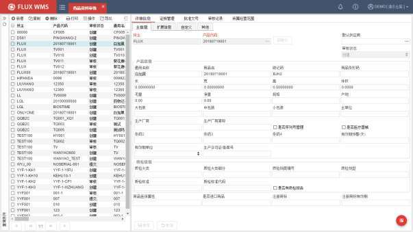

- 根据需要维护扩展信息，证照信息、药品批准文号、药品所属经营范围等信息。同样支持上传证照的图片，以及预览、下载图片。

- 记录维护完成，点击【保存】按钮保存修改。如果开启了数据更新日志（【业务功能】中勾选“启用数据更新日志”），则在【数据更新日志】功能中可以查询到保存前后的数据变更信息。

- **审核操作**

- 用户维护好资料信息后，通过鼠标右键功能项“提交审核”，资料的“审核状态”信息会变更为“提交”，等待审核人员进行审核。已提交的记录，不允许再进行修改。

<!-- 原 PDF 第 919 页 -->

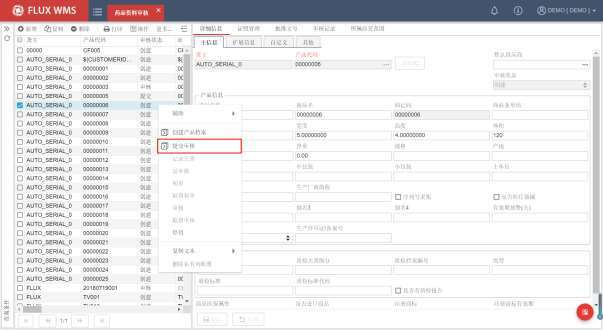

- 已提交审核，但尚未审核的情况下，可以通过鼠标右键功能“记录完善”，将审核提交撤回，重新修改完善，后续再重新提交审核。

- 审核人员，通过鼠标右键的“初审”、“审核”功能，进行记录审核，并在弹窗中录入审核结果和意见：

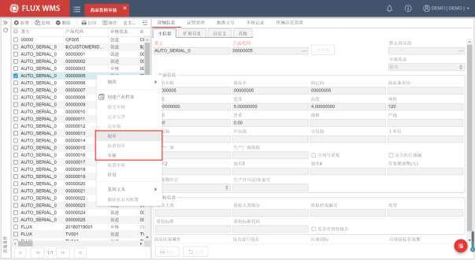

<!-- 原 PDF 第 920 页 -->

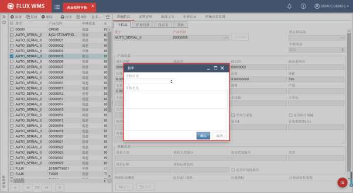

- 审核后，在“审核记录”页签，可以查看到审核日志信息。

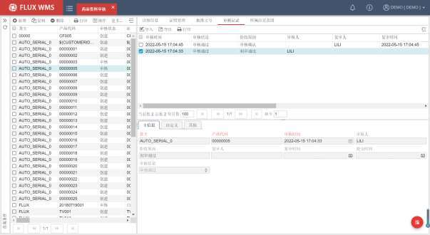

- 对于已审核的记录，支持通过鼠标右键的“取消初审”、“取消审核”，回到提交审核状态，再通过“记录完善”进行内容修改。

- **其他**

<!-- 原 PDF 第 921 页 -->

- 获取 ID

部分仓库，产品 ID 为流水码模式，此信息供应商无法提供，而是在新建产品资料时由系统按流水号规则生成。因此药品资料审核功能，在“产品代码”字段后，提供【获取 ID】按钮，仅在新增记录时可用，点击后系统根据产品代码流水号规则，生成 SKU代码。

对于有具体 SKU代码，接口、导入信息中能够提供的业务场景，就无需通过获取模式取得 SKU代码。

- 创建产品档案

审核通过的记录，勾选记录后，点击鼠标右键功能“创建产品档案”，系统将药品记录添加为新的 SKU产品档案。

- 停用

不再使用的产品记录，支持通过鼠标右键菜单中的“停用”功能，更新记录审核状态为“停用”，并且更新【产品档案】中对应SKU 记录活动标记为“N”。在“审核记录”页签能够查看到“停用”的操作日志。

已停用记录，不再允许进行审核，但支持通过“记录完善”，进行信息维护

## 14.5. 两票制管理

医药行业，根据GSP的管理要求，针对医院客户，药品出库时需要随货提供纸单模式的、来自上游供应商的对应购进发票和随货同行单，并将电子档信息上传到指定的医院管理平台。

系统在【行业插件】模块下，提供【两票制管理】功能，针对药品的购进发票，随货同行单，进行供应商单据上传、出库打印管理。

- **两票制管理**

使用两票制管理功能，需要先在【上传下载配置】功能中，对两票制管理中的单据上传目的地、文件存储目录、文件命名规则进行配置（具体配置内容，可参考【业务系统配置】-【上传下载配置】章节的介绍）。

医药行业参数（IND_MED）开启情况下，收货时具有随货同行单号（固定为批次属性 10，即Lotatt10字段）的库存记录，需要操作两票制相关单据管理。

- 选择“行业插件”下的“两票制管理”功能。

- 对于新入库的批次，查询时勾选“未关联购进发票文件”，或者“未关联随货同行

<!-- 原 PDF 第 922 页 -->

单文件”，系统查询尚无对应文件的库存记录。

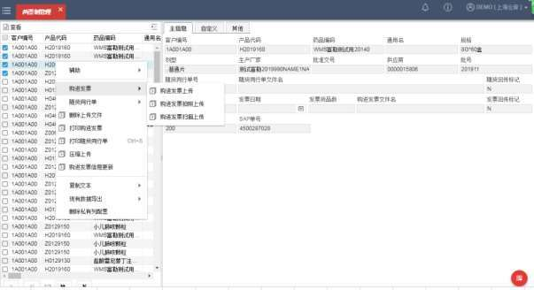

- 选择库存记录，通过鼠标右键，上传购进发票或者随货同行单。

注：由于同一“随货同行单”、“购进发票”存在一票对应多产品的情况，即一个随货同行单/购进发票会对应两票制管理功能中的多条记录，因此系统支持同时勾选多条库存记录，选择进行对应单据上传。

- **功能按钮**

- 下载

已上传的随货同行单、购进发票，可以通过下载按钮，将所选记录批量下载，以便根据客户要求，上传到指定的其他外部系统：

<!-- 原 PDF 第 923 页 -->

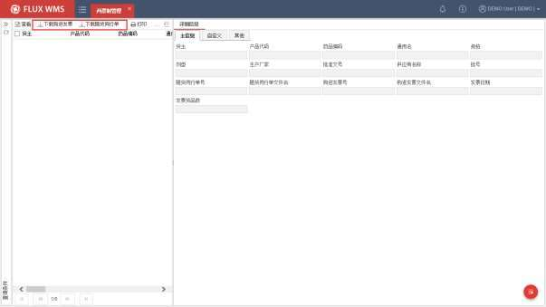

- **右键功能**

- 购进发票上传

可通过选择图片上传、多张图片压缩上传、高拍仪拍照自动上传、扫描仪扫描上传等不同操作方式，将购进发票的图片文件上传到系统中。

图片上传时支持预览，以便根据需要调整图片方向，确认效果。

- 随货同行单上传

可通过选择图片上传、高拍仪拍照自动上传、扫描仪扫描上传等不同操作方式，将供应商提供的随货同行单的图片文件上传到系统中。

- 删除上传文件

购进发票、随货同行单上传如果有误，可以通过鼠标右键菜单的【删除上传文件】功能，选择已上传记录，删除后重新操作文档上传。

- 打印购进发票

在出库操作相关功能中，打印购进发票后，有时会有补打印的需求。可在查询、选择对应库存记录后，通过鼠标右键功能，打印记录对应的购进发票。

- 打印随货同行单

<!-- 原 PDF 第 924 页 -->

同【打印购进发票】功能，主要用于随货同行单的补打印。

- 压缩上传

部分医药平台，要求将多张购进发票图片打包、压缩上传，因此系统提供【压缩上传】功能，点击后，根据系统提示，选择多张图片，确认上传。系统将自动将所选图片打包后生成文件名为货主代码_产品代码_供应商_日期流水号的压缩文件，上传到服务器。

- 购进发票信息更新

根据 GSP要求，除了购进发票图片之外，还需要录入发票相关信息并上传医药管理平台。通过点击鼠标右键【购进发票信息更新】功能，可显示二级窗口，根据需要相应录入购进发票号、发票日期、发票货品数信息。

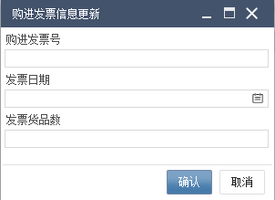

## 14.6. 业务申请单

由于退货管理的特殊性，部分单据（例如门店退货、经销商退货、采购退货）需要在仓库进行补单或发起业务申请，因此通过独立的“业务申请单”功能。记录发起部门、目标部门、单据类型、填写备注，并在单据保存后进行单据审核。

审核后可以通过接口自动将数据回传给上游 ERP系统。后续通过 ERP确认，再生成 WMS 系统的具体操作单据。

- **业务申请单**

- 选择“行业插件”下的“业务申请单”功能。

- 通过查询条件，查看已有申请单信息，或点击【新增】按钮，在如下界面录入并保存申请信息：

<!-- 原 PDF 第 925 页 -->

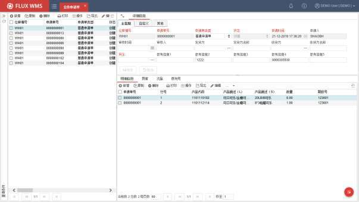

- 根据到货情况分别录入明细信息、异常、次品信息数据。

- 点击【保存】按钮提交新增数据。

- **鼠标右键功能**

- 表头右键功能

业务申请单表头部分，鼠标右键菜单功能项主要有：

<!-- 原 PDF 第 926 页 -->

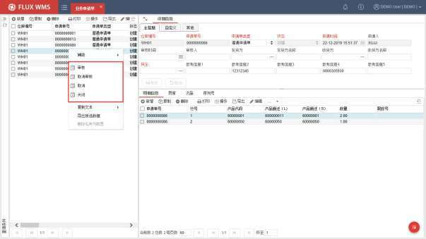

- 审核

业务申请单审核。审核后的单据不可修改。

- 取消审核

取消审核后，单证状态恢复到创建状态，可以进行修复维护。

- 取消

业务申请单取消，单据状态相应变更为“取消”。

- 关闭

业务申请单关闭，单据状态相应变更为“关闭”。

- 明细右键菜单

单据明细行部分，右键菜单功能项主要有：

<!-- 原 PDF 第 927 页 -->

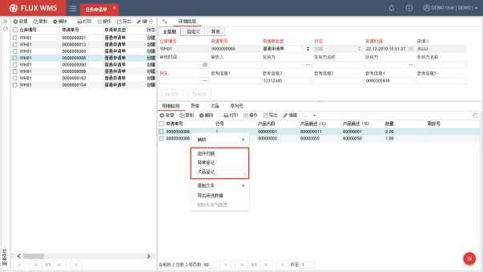

- 逐件扫描

通过逐件扫描，添加明细行记录：

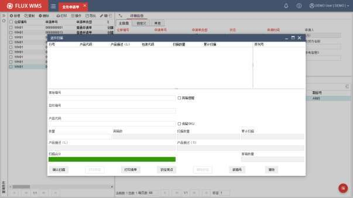

如果单据需要采集序列号（表头采集序列号 SERIALNOCATCH 字段值为 Y。业务申请单不受

<!-- 原 PDF 第 928 页 -->

参数 SERIALNO_CATCH控制），并且产品档案中配置产品需要采集序列号（SERIALNOCATCH为 Y），则扫描产品序列号，并解析为产品代码。系统会对序列号进行重复扫描校验。点击【确认扫描】按钮，在添加明细行信息同时，相应序列号信息也会存储并显示在明细部分的“序列号”页签中。

- 异常登记

通常用于有预记录信息情况下，或者已操作逐件扫描创建明细记录的后，进一步确认退货件的异常情况。例如根据退货单生成的业务申请单，进行退货产品异常情况确认时使用；或者双工位配置，前端接受人员进行逐件扫描登记，后端质检人员检查货物后进行异常登记。

在明细信息页签，有明细记录行的情况下，点击鼠标右键功能项后，系统显示如下弹窗：

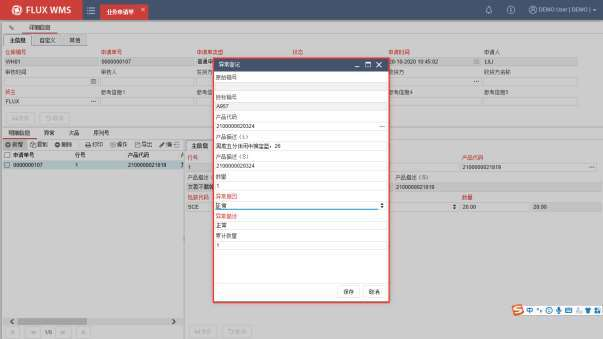

如果业务申请单有关联退货单（参考编号 1字段录入对应退货单号），系统能够关联显示相应原始箱号；目标箱号则取明细行部分的“跟踪号”字段内容。

扫描或着选择产品代码，根据货物情况选择异常原因、描述，并记录异常数量。点击【保存】按钮，相关异常信息会被保存，并显示在“异常”页签中。

所录入的产品，可以是明细行部分未涉及的其他产品，例如根据退货单预期有 2个 SKU，但实物包裹中清点到 3种 SKU。

- 次品登记

<!-- 原 PDF 第 929 页 -->

登记次品信息，支持同时打印标签、清单。所录入的次品记录，可以在“次品”页签查看到：

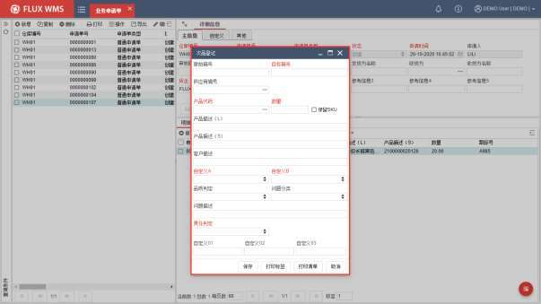

## 14.7. 序列号盘点差异

针对采用箱码管理，或者序列号管理的行业，例如服装行业，系统提供基于序列号的 RF 盘点功能。

无需提前创建盘点单、生成盘点任务，而是采用 RF 扫描库位号、扫描箱码/序列号，采集全部库存记录后，再由系统对库存进行差异比对的操作模式。具体 RF功能说明，可参考 RF用户手册中的对应说明。

RF扫描采集完成，可以在 WMS 中查看盘点差异，并对差异进行处理。

- **序列号盘点差异**

- 选择“行业插件”下的“序列号盘点差异”功能。系统显示当前序列号盘点后，与库存不一致的记录，如下图所示：

<!-- 原 PDF 第 930 页 -->

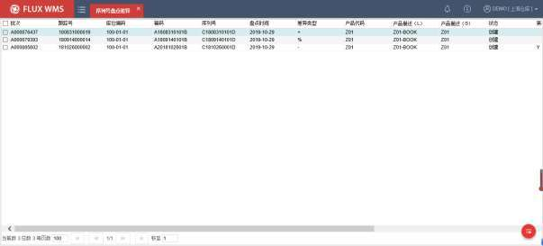

- 由于可以进行多次盘点/复盘，因此差异记录会标明是第几轮盘点的差异。

- 对于复盘后，确认无差异的记录，可以通过鼠标右键功能【删除】，删除差异记录。

- 对于确认存在的差异记录，勾选后，可通过鼠标右键功能【执行库存调整】进行对应差异处理：

- 如果差异类型是-，即盘亏，则根据差异情况，更新序列号表中的信息，并相应调整库存数量。

- 如果差异类型是+，即盘盈，由于需要补充 SKU、批号等信息，系统不对库存做任何处理，人工下架后重新扫描收货。

- 如果差异类型是%，即序列号错位，则根据实际盘点情况，执行序列号移动处理，更新库存记录的序列号位置信息。

- 处理后的差异记录相应更新状态为关闭。

## 14.8. B2C 退货

【B2C 退货】功能，是基于电商行业退货订单“数量庞大”、“分散”、“异常情况多”等特点，用于针对 B2C 订单进行退货入库操作，并且支持对包裹进行异常登记和拍照上传处理。

- **B2C 退货操作**

- 选择“行业插件”下的“B2C 退货”功能，系统显示如下操作界面：

<!-- 原 PDF 第 931 页 -->

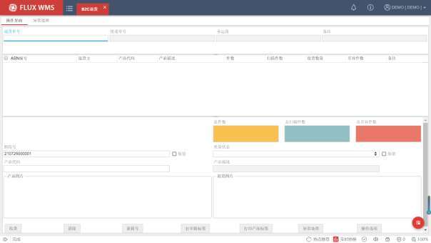

- 随货如有单据信息，在“退货单号”字段进行扫描，系统相应读取单据信息并展示。由于存在一个包裹退回多件货品的情况，一个退货单可能相应对应到多个退货入库ASN，系统会在界面显示多个 ASN信息，方便操作员跨订单收货。扫描退货单号可以限定退货作业范围，但不是必须的。

- 没有随货单据的情况下，可以扫描退货面单号，通过解析获取到对应单据信息。此场景中，通常退货单下达时，会带有对应面单号信息或者其他信息用于解析对应，获取退货单详情信息。如果不需要通过面单号解析定位单据，系统会对扫描的面单号进行记录。

- 在“跟踪号”字段，扫描收货后、货物准备放入的周转箱箱号（支持跟踪号解析处理）；或者通过点击【新箱号】按钮，由系统自动生成新箱号（此模式常用于收货打印标签的场景，在打印的标签上可显示新箱号）。对于不使用周转箱或跟踪号进行跟踪的业务模式中，可跳过此字段的录入。

- 对于多件货品放入同一个周转箱的场景，可勾选“保留”选项，下一包裹的收货，默认仍旧使用此跟踪号，直到人工录入新的跟踪号，或者重新点击【新箱号】按钮生成号码。

- 扫描产品条码，系统校验并显示产品对应信息。如果扫描错误，可以通过鼠标右键功能项“取消上次扫描”进行回退。

- 如果【操作选项】中勾选了“显示产品图片”，则在界面展示产品档案中维护的产

<!-- 原 PDF 第 932 页 -->

品标准图片，供收货人员参考核对：

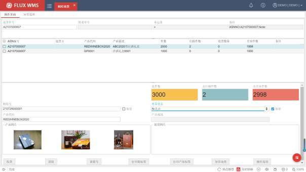

- 操作人员确认退货产品的质量状态，并在系统中进行确认。

- 部分业务场景，收货与质检分为两个环节进行，入库全部记录为“待质检” 状态，此时可以在选择质量状态后，勾选“保留”选项，持续按此状态操作，可以减少反复选择。

- 扫描产品条形码，系统对产品进行分别累加。

- 系统支持扫描时自动确认收货，或者扫描完成，点击【收货】按钮，系统执行收货确认处理。

- 界面记录的快递单号，在提交收货确认时，会记录到对应退货ASN 的“运单号”字段。

- **操作选项**

- **点击【操作选项】按钮，在弹出窗口中进行操作相关配置：**

<!-- 原 PDF 第 933 页 -->

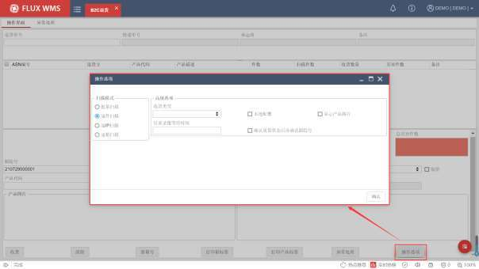

- 扫描模式

扫描产品后，数量确认模式选择，系统提供批量、逐件、逐箱、逐IP 扫描，4 选 1。

批量模式，扫描产品定位后，允许人工输入数量；

逐件模式下，默认数量为 1，每次扫描，数量自动加 1；

逐箱扫描，数量不可修改，按包装对应每箱的主单位数量，自动增加；

逐 IP模式则按包装对应的每个内包装的主单位数量，自动增加。

- 收货类型

作业时的收货触发模式选择。系统提供两种不同的收货确认模式：

- 扫描后自动收货

默认模式，扫描一件产品，即自动确认收货。

- 人工提交收货

类似扫描收货，将所扫描到的信息缓存，点击【收货】按钮时再批量进行收货确认。

- 本地配置

<!-- 原 PDF 第 934 页 -->

多数情况下，操作选项中的设置，根据系统参数配置获取默认设置，用户有需要临时修改配置。

但一些现场分区管理，不同工作台对应不同作业操作，例如收货类型不同。这种情况，可以勾选“本地配置”，用户在【操作选项】中选择相应配置并确认后，系统会将配置信息保存在本地配置文件中，后续打开 B2C退货操作界面，优先读取本地配置中的设置内容作为操作选项的默认配置，减少现场的配置修改工作量。

- 显示产品图片

如勾选，则在界面展示产品档案中维护的产品标准图片，供收货人员参考核对。

- 结束录像等待时间

视频录像相关配置，确认收货后，根据所配置的“结束录像等待时间”，延后相应时间结束录像，以便将后续的单据打印、放置、封箱、标签粘贴等操作录制到视频中。

- 确认质量状态后再确认跟踪号

用来控制质量状态与跟踪号扫描的先后次序。

默认不勾选，先扫描跟踪号，光标再跳转到产品扫描、质量状态确认

如勾选，则先扫描产品，确认质量状态后，光标跳转到跟踪号。即界面打开，光标在退货单号栏，扫描退货单号、SKU，且用户选择质量状态后回车，光标定位到跟踪号栏。扫描跟踪号后，光标再次定位到退货单号。

- **附加操作**

B2C退货时，根据作业需要，可以进一步选择其他附加操作：

- 打印箱标签

收货后，打印收货箱标签。

- 打印产品标签

部分退货入库货品，产品标签残损，需要在入库时打印粘贴，以便后续库存管理、出库拣货使用。此时可通过点击【打印产品标签】按钮，默认为当前产品，操作员可更改为所需产品记录，进行标签打印。

- 图片展示

系统支持显示产品标准图片，供操作员比对。同时由于退货品存在错发、货品损坏等各种异常情况，客服登记退货入库单时，可以附上退货客户提交的货品、包裹图片。

<!-- 原 PDF 第 935 页 -->

B2C退货功能界面，在获取 ASN 信息时，如果 ASN有附件图片，则相应展示在“退货图片”栏位中，供收货核对使用。

- 异常处理

退货包裹清点时，经常会发现实物与单据不符等各种异常情况。系统提供“异常处理”功能，针对多货等各种异常情况进行记录。

点击【异常处理】按钮后，相应跳转到“异常处理”页签。根据实物情况，记录异常货品信息。异常货品，可以不在退货ASN 记录中。

如果没有关联单据，也可以进入【B2C 退货】功能后，直接点击“异常处理”页签，进行信息登记。

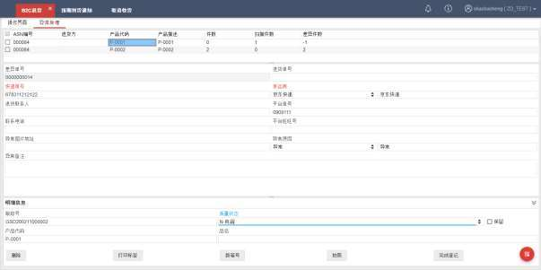

异常处理页签，同样支持鼠标右键功能项“取消上次扫描”。

信息登记后，点击【完成登记】按钮。系统对不在 ASN 中的产品记录进行收货，并生成“业务申请单”，以便把多货信息推送给 ERP，进行退货单据处理。作业工作站也会记录在“业务申请单”中，以备查找。

- 视频录像

- 录像开启

录像相关参数 B2C_RETURN_GET_PHOTO（B2C 退货功能拍照视频）开启录像配置情况下（参数配置为 2-有声视频），扫描退货单号，或者“异常处理”界面扫描快递单号之后，系统自动

<!-- 原 PDF 第 936 页 -->

开始录像。

- 录像结束

操作界面点击【收货】按钮进行收货，或者自动收货、快捷键收货后，并且对应 ASN 收货完成，根据【操作选项】中配置的延后结束时间设置，自动结束录像。对于部分收货的单据，则在开启下一单扫描时结束录制。

“异常处理”界面的操作，则以点击【完成登记】作为操作结束，完成录制，产生视频文件。

同时也支持通过“保存录像”的快捷键配置手动触发录像结束。

此外，如果 VIDEO_RECORDING_TIMEOUT参数开启（系统无操作最长等待时间（分钟），超过设定时间则自动结束录像），电脑超过设置时间无任何操作，包括鼠标移动、键盘输入的情况下，系统也会自动结束录像。

- 录像文件

结束录像后，系统按照“货主_单号_工作站（如果工作站非空）_流水号_HHMMSS”格式生成录像文件名。

单号，取自操作界面的 ASNNO，“异常登记”模式下则取“差异单号”。

读取【本地配置】中“摄像头设置”配置的“本地生成文件目录”，在指定目录中，自动创建对应子目录存储录像文件。录像子目录为 A2038_B2C退货_VIDEO，拍照子目录为 A2038_B2C退货_PHOTO

同时，录像支持将时间（YYYY-MM-DD 24HH:MI:SS）、 ASN 单号、 OMS 单号(asnReference1)、快递单号（DeliveryNo）、扫描的SKU信息作为视频水印。

当【上传下载配置】设置了【B2C退货】的上传下载信息时，系统将对应视频自动上传到对应地址，并删除本地存储的录像文件。

- **收货控制**

- 增加产品控制

退货时，经常会遇到退货包裹中的产品，没有在退货单据中进行登记。是否允许添加单据中不存在的 SKU，根据 RCV_ADD_SKU参数（如果扫描的SKU 在 ASN 明细中不存在，则自动在明细行中产生一个预期数量是0 的记录）配置进行控制。

- 超额收货控制

B2C退货功能，同样遵循超额收货控制逻辑。

<!-- 原 PDF 第 937 页 -->

根据参数 RECEIVE_OVERQTY（是否允许超量收货）、货主是否允许超额收货（“允许超量收货”字段是否勾选）、产品档案是否允许超额收货（“允许超量收货”字段是否勾选、是否维护“超量收货百分比”数值），以及订单明细的“超量收货百分比”设置，并根据 OVR_RCV_BY参数（超量收货校验基准）指定的计算依据，进行超量计算。

具体生效细节，可以参考《9.4.7 收货控制项》章节的介绍。

- 缺货控制

针对扫描数量少于退货件数的情况，通过参数B2C_RECEIVING_GAP_CHECK（B2C退货有差异件数的不允许收货）来控制有数量差异的情况下是否允许收货。

- **相关参数**

参数 ID 参数描述 对应说明

RCV_ADD_SKU 如果扫描的 SKU在 ASN明细中不存在，则自 收货控制动在明细行中产生一个预期数量是 0的记录RECEIVE_OVERQTY 是否允许超量收货OVR_RCV_BY 超量收货校验基准B2C_RECEIVING_GAB2C退货有差异件数的不允许收货P_CHECK

## 14.9. 产品组维护

服装行业，同款不同色、尺码的货物需要维护到 SKU 层级，分别管理库存。但此类产品的其他信息，例如管理要求，长宽高包装等，通常全部一样，逐一按 SKU 维护信息，重复工作较多。

为了提高现场维护产品基础数据时的工作效率，通过【产品组维护】功能。能够实现按款（即产品组层级）进行基础资料的维护，产品图片上传等操作，减少重复工作量。

- **产品组维护**

- 选择“行业插件”下的“产品组维护”功能，系统显示查询页面。

<!-- 原 PDF 第 938 页 -->

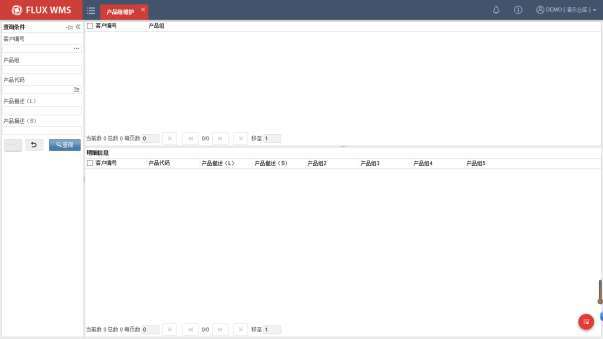

- 输入查询条件，查询产品组信息。系统显示货主、产品组，并在明细部分显示此产品组内的产品档案信息。

- 在表头部分，双击所需维护的产品组记录，系统跳转到【产品档案】功能，并显示为产品组维护模式，同时将产品组信息带入，查询显示此产品组内首个产品信息。此模式下，禁止修改查询条件，即无法选择其他产品档案记录。

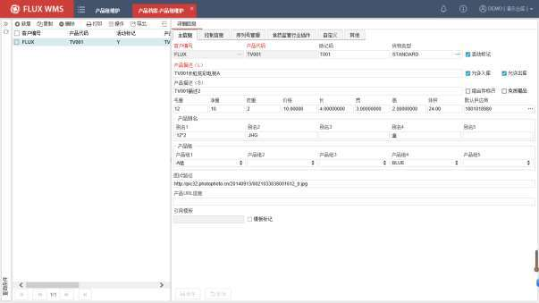

<!-- 原 PDF 第 939 页 -->

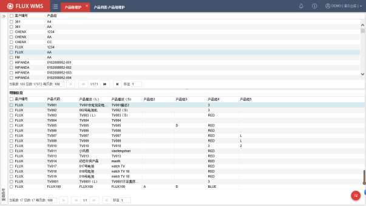

- 修改产品字段内后，点击【保存】按钮，系统将同一产品组内其他产品档案的对应字段，也相应批量更新。未改动的字段不受影响。

- 通过右键功能上传图片时，更新到此产品组的全部产品档案中，即为产品组批量上传图片。

- 完成批量维护，通过鼠标右键功能“返回产品组维护”，跳转回【行业插件】-【产品组维护】功能，可对下一产品组进行维护（如下图所示）。

*图14-9-3（图像未能从 PDF 对象中直接提取）*

- 明细部分，双击某一产品档案记录，也可进入【产品档案】界面进行维护，但仅针对此产品变更，而不是批量维护模式。

## 14.10. 称重

有些业务场景中，除了标准自带称重的复核、配送单作业、产品档案等操作环节，还有其他需要对箱重进行称重校验的情况，例如：

- 供应商送货，仓库收货前，仓库按箱称重记录，作为证据，未来和供应商核查用；。

- 出库前，仓库抽查箱重，跟理论重量进行比较，进行快速抽查校验。

<!-- 原 PDF 第 940 页 -->

因此系统在行业插件模块中，提供了独立的称重功能（复核、配送单环节均有嵌入的、标准称重功能），以便现场有个性化称重需要时，可以方便的进行使用。

在使用此功能前，需要在【本地配置】-【电子秤配置】中，配置连接的电子秤信息，以便获取称重数据。

称重采集到的重量信息，后续所执行的处理（例如收货确认），由现场根据作业需要，进行自定义配置实现。

- **称重**

- 选择“行业插件”下的“称重”功能，系统显示如下界面：

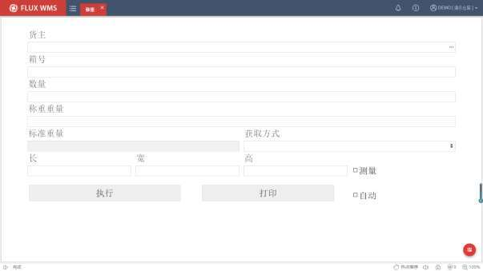

- 扫描录入货主、箱号、数量等信息，系统将触发电子秤的重量获取，将相应重量信息显示在“称重重量”字段。

- 支持根据 DFT_CUS参数获取默认货主

- 箱号支持解析调用，可在【标准业务扩展配置】中进行设置，动作代码SCANTRACEID，对应 SPBCD_TRACEID。

- 数量字段通常人工录入箱号对应的数量，如果通过箱号解析能够获取到数量信息，此字段可以通过界面方案配置隐藏。

- 重量数据位数通过参数WGT_DEC进行配置。

<!-- 原 PDF 第 941 页 -->

- 根据所选择的“获取方式”，系统从指定来源获取单位标准重量，再与待收货数量进行计算得到“标准重量”显示在界面：

- 获取方式为“产品”时，系统从产品档案获取单件产品标准重量，再乘以数量信息（界面数量为空则默认为1），得到此产品的理论重量。

- 获取方式为“库存”时，根据箱号在库存中，查询出重量，显示在“标准重量”字段。

- 获取方式为“箱码表”时，则根据箱号在一级序列号表中，查询出重量。

- 勾选“测量”选项，则意味着需要记录长宽高，光标会依次定位，方便测量后连续录入。如果无需此信息，可以通过界面方案配置隐藏字段。

- 重量获取后（或者录入长宽高之后），系统将实际称量重量与标准重量进行比对校验（动作代码“WEIGHTCHECK”所对应的 SPCOM_WEIGHTCHECK）。

- 校验通过，点击【执行】按钮，调用动作代码UDFOPERATE 对应的存储过程SPUDF_OPERATION_PROCESS，执行所配置的个性化处理（例如收货确认）。此节点也支持配置接口调用，进行个性化的校验拦截，例如根据ERP 验证返回信息进行拦截报错。

- 需要进行打印的情况下（例如打印收货箱标签），可以在【数据导出规则配置】中对应的配置信息，按解析后的箱号查询数据，进行打印。如果勾选了“自动打印”，则在 SP执行成功后，自动调用打印处理。

- **相关参数**

此功能相关参数有：

参数 ID 参数描述 对应说明

DFT_CUS 界面缺省货主代码 点击打开界面时读取参数配置

## 14.11. 订单快递转投

由于已经准备发运的订单包裹，可能会碰到承运人无法投递此地址，或者由于其它原因而需要更换快递承运商转投的情况，系统提供“订单快递转投”功能，对订单承运人更换、重新获取面单号、重新打印面单、单据匹配等一系列操作进行管理和支持。

确认需要转投的订单，可能处在不同的作业节点，例如有的还没开始操作，有的已经全部作业完；有些情况还没打印面单，有些情况下是面单打印后再确认转投，因此所需的操作可能并不完全

<!-- 原 PDF 第 942 页 -->

相同。

- **自动替换模式**

- 选择“行业插件”下的“订单快递转投”功能，系统显示如下操作界面：

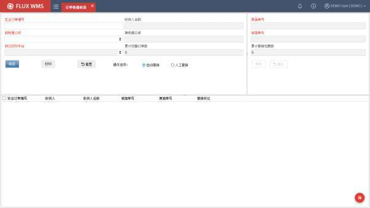

- 光标定位在“发运订单编号”字段，扫描订单号条码，或者扫描已打印、粘贴的旧面单条码或其他操作条码，由系统通过条码解析，定位相应订单号，并显示将对应收货人等信息显示在界面。

- 根据订单情况，选择转投的新承运人。如果所选承运人与订单原承运人一致，系统会提示报错。

- 如果需要通过菜鸟云打印，或者拼多多等云打印平台进行面单打印，则相应选择对应平台（同一承运人，存在多个云打印平台都支持的情况。但同一货主 /店铺的发运订单通常会对应到一个云打印平台）。无需云打印的情况下，则使用“本地直连”即通过本地打印机打印面单。

- 点击【转投】按钮进行确认，系统根据承运人、云打印平台，以及【快递接口平台规则】中配置的快递公司接口匹配要求（同一个承运人可能有多个接口对应），相应调用对应的面单接口，获取新的面单信息。

- 如果界面选择“自动替换”，则接口返回的新面单号信息，直接后台替换旧承运人相应面单信息，打印输出新面单。

<!-- 原 PDF 第 943 页 -->

- **人工替换模式**

如果界面选择“人工替换”模式，则调用接口获取新面单信息后，系统不执行自动替换，而是光标跳转到界面右上部分的“原面单号”，要求扫描录入原始面单号（适用于包裹已打印粘贴面单的场景），如果录入的原面单号与当前定位订单不匹配，系统会提示报错面单号无效。

粘贴新的面单，并扫描新面单号，点击【替换】按钮，系统使用新面单号信息覆盖原始面单号信息。

## 14.12. 耗材拉动

对于包装耗材也需要进行库存管理的业务场景，当复核台附近预留的包装耗材不够的情况下，由出库复核的操作人员发起，生成相应的耗材补充任务，并要求补充到指定的出库复核工作台。

- **耗材拉动**

- 在“出库操作”模块“出库复核”功能的分配明细行部分，通过点击鼠标右键功能项“耗材拉动”进行操作界面。

- 或者选择“行业插件”下的“订单快递转投”功能，点击【新增】按钮，录入任务信息：

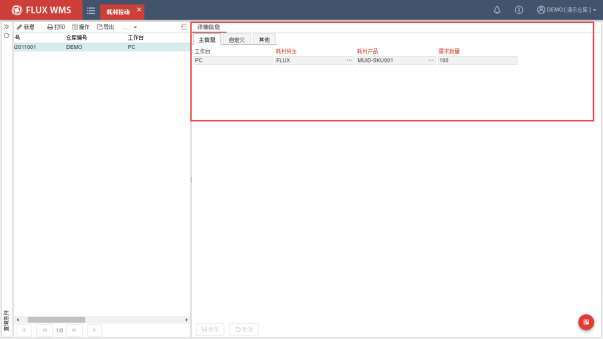

<!-- 原 PDF 第 944 页 -->

工作台－需要耗材的复核工作台信息。本机工作台信息可在主界面右上角菜单的【本地配置】-【工作站】中进行设置。

耗材货主－耗材所属货主代码。多数场景中，会设置一个公用的货主，专门用来管理耗材库存。

耗材产品－耗材 SKU 代码。

需求数量－所需耗材数量。通常根据工作台可存放数量、剩余耗材数量，人工估算。

- 点击【保存】按钮，发布耗材任务。

- **处理确认**

耗材需求通常通过看板发布（看板配置可参考【二次开发管理】介绍），无需完整的拣货、补货任务管理过程。

耗材补充完成后，通过鼠标右键功能“处理完成”进行确认：

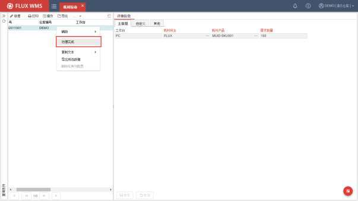

确认后，列表界面可见处理状态刷新显示：

<!-- 原 PDF 第 945 页 -->

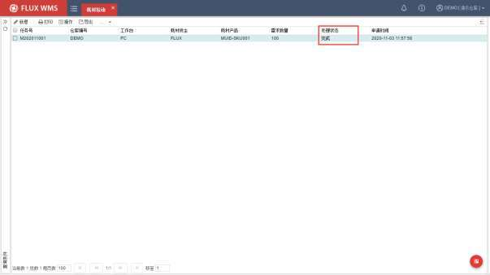

## 14.13. 称重收货

仓库现场，对于一些小件、零碎，数量又大，清点不方便的货物，如果具有一定重量，并且单件标准化，可以采用称重收货的方式，进行入库验收。例如螺丝螺母等货物。

为了方便实物良品、不良品在入库时进行区分、记录，避免操作员反复切换、修改对应批次属性信息，系统能够支持双秤作业模式。PC 机同时连接两台电子秤，对接在不同的 COM 口，两台秤分别进行良品、不良品的称重，系统通过区分重量信息传递的 COM 口，进而区分是良品重量，还是不良品重量，对应进行收货操作。

- **作业准备**

- 约定：

COM1：对接良品电子秤

COM2：对接不良品电子秤

现场自行对电子秤进行标贴区分。

良品、不良品批次属性使用lotatt08字段。

- 电子秤配置：

<!-- 原 PDF 第 946 页 -->

使用【称重收货】功能前，需要在【本地配置】-【电子秤】功能中，对相关电子秤、端口进行配置。根据现场使用单秤还是双秤模式，对电子秤进行配置。

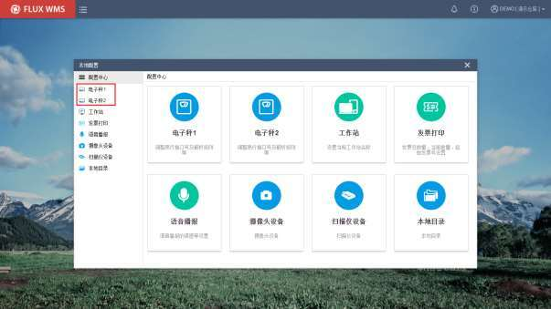

- **称重收货**

- 选择“行业插件”下的“称重收货”功能，系统显示作业界面。

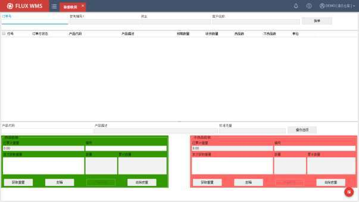

<!-- 原 PDF 第 947 页 -->

*图 14-13-2（图像未能从 PDF 对象中直接提取）*

- 在“订单号”字段，扫描/录入 ASN 条码，相应查询对应预期到货通知，在界面显示单证信息以及待收货产品明细列表。

- 需要进行箱号管理情况下，扫描收货箱号信息。

- 在界面下半部分的“产品代码”字段，扫描产品条形码，系统会将产品与ASN 明细的待收货记录进行匹配定位。

- 操作人员判断货物的良品、不良品情况，对应投放到COM1 或者 COM2口对应的箱内，可持续投放，过程中，系统不对变动的重量进行获取。直到点击COM 口对应（良品为绿色区域，不良品为红色区域）的【获取重量】按钮，系统读取对应的电子秤信息，显示在界面，光标定位、全选，允许人工修改。

- 根据不同电子秤获取到的重量，由系统换算为产品数量。即根据当前获取到的重量（W1，即当前秤得重量数据），减去称重前的重量（W0，一箱首次确认重量，默认前次重量为 0），再与 SKU在基础档案中维护的标准单位重量（WS）进行比对，换算到当前SKU的数量。SKU QTY =（W1-W0）/WS，四舍五入取整。将换算的数量，对应只读显示在与电子秤对应的“数量”字段。

- 如有异常，可以重新点击【获取重量】按钮，重新确认重量。

- 相同 SKU 支持继续投放，点击【获取重量】按钮，将覆盖对应COM 口原本缓存的重量信息。即每一次SKU 扫描，每个COM 口只保留一个重量信息。

- 更换 SKU，意味着前一SKU 的重量（2 个 COM口的）已获确认，系统会前一SKU的数量信息（良品非良品分别记录）、当前重量（作为下一SKU 的 W0）相应缓存，数量显示在上方的列表部分。

- 某一箱满箱，点击对应的【封箱】按钮，执行当前SKU 的称重、数量确认、缓存。然后根据缓存信息逐行执行收货确认，并刷新对应的“未收货数量”缓存信息。例如 COM1良品箱封箱确认，则良品数量清空，已收货数量增加。但尚未收货的不良品信息保持不变。

- **其他按钮右键功能**

- 操作选项

点击【操作选项】按钮，可以进行扫描方式、保留箱号配置：

<!-- 原 PDF 第 948 页 -->

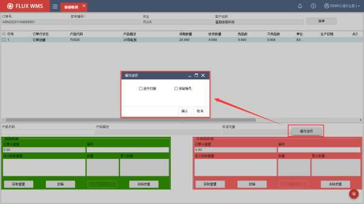

- 逐件扫描

勾选【操作选项】中的“逐件扫描”，可以开启逐件扫描操作模式。此模式下，禁用【获取重量】按钮。

扫描 SKU 后，实物投放到良品，或者不良品箱内，电子秤获取到稳定重量，即自动触发【获取重量】逻辑。即每扫描一次产品，有重量变更及刷新数据。直到满箱后，点击【封箱】，或者【换单】按钮，进行收货确认。

逐件扫描时，点击良品，或者不良品部分的【产品标签】按钮，系统调用对应的产品标签模板，打印输出标签。良品、不良品标签可以分别对应不同的模板，在【模板文件管理】功能中编辑配置。

- 保留箱号

勾选“保留箱号”之后，封箱或者换单后，前一箱号仍旧保留在界面，直到人工重新扫描 /录入新的箱号。

- 换单

一单操作完成（不考虑订单是否完全收货，实物操作完毕），需要变更操作操作的订单时，可以通过点击【换单】按钮进行切换。

点击后，当前订单下，如果缓存数据均已收货确认，则清空界面信息，光标定位在“订单号”字段，等待下一单扫描。

<!-- 原 PDF 第 949 页 -->

如果当前有缓存数据，尚未收货确认，则弹出提示：已投放货品是否确认封箱？是/否。选择是，则良品、非良品执行【封箱确认】按钮对应逻辑；选择否，放弃缓存数据，重新操作。

- 去除皮重

大部分电子秤，自带去皮重功能，可以直接称量空周转箱、包装箱，进行去皮处理。

但部分电子秤，不带有“去皮”操作按键，需要串口传递去皮指令；或者现场不希望操作人员通过电子秤按钮进行操作，此类情况下，可以使用界面的【去除皮重】按钮功能。

使用【去除皮重】功能，由于不同电子秤的去皮指令不同，因此需要在【本地配置】-【电子秤】功能中相应进行配置。

## 14.14. 注册证审核

医疗行业功能，主要用于医疗器械的注册证信息登记、审核、证件上传、审计追踪等操作的管理。注册证信息的审核、改动，支持记录“数据更新日志”进行修改历史检查。

- **注册证审核**

- 选择“行业插件”下的“注册证审核”功能。

- 通过查询条件，查看已有注册证信息，或点击【新增】按钮，在如下界面录入新注册证的详细信息：

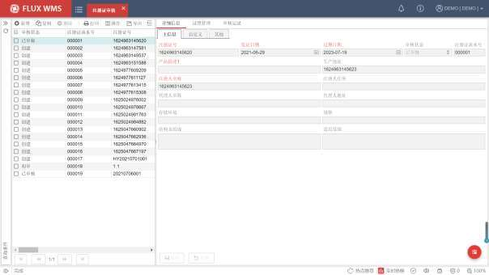

<!-- 原 PDF 第 950 页 -->

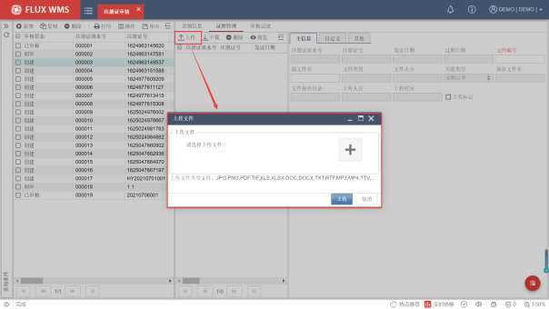

- 在“证照管理”页签，通过点击【上传】按钮，在弹出的文件选择框中，选择文件进行上传，通常是注册证相关图片信息。

*图 14-14-2（图像未能从 PDF 对象中直接提取）*

- **审核操作**

- 记录维护完成，通过鼠标右键功能“提交审核”，提交后记录不可修改也无法再上传新的证照附件，仅允许审核人员录入审核信息。如果有必要重新补充信息，则需要“撤销提交”之后才能进行修改编辑。两个右键功能都支持在【标准业务扩展】中，配置个性化扩展逻辑。

<!-- 原 PDF 第 951 页 -->

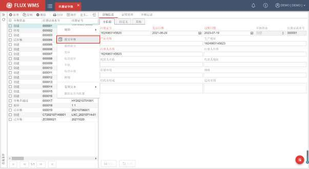

- 已提交审核，但尚未审核的情况下，可以通过鼠标右键功能“撤销提交”，将审核提交撤回，重新修改完善，后续再重新提交审核。

- 审核人员，通过鼠标右键的“初审”、“审核”功能，进行记录审核，并在弹窗中录入审核结果和意见：

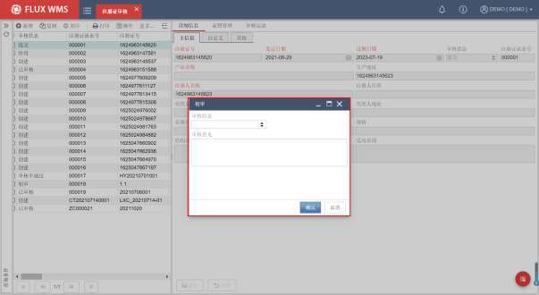

<!-- 原 PDF 第 952 页 -->

- 审核后，在“审核记录”页签，可以查看到审核日志信息。

- 对于已审核的记录，支持通过鼠标右键的“取消初审”、“取消审核”，回到提交审核状态，再通过“记录完善”进行内容修改。

- **其他**

- 停用

不再使用的注册证记录，支持通过鼠标右键菜单中的“停用”功能，更新记录审核状态为“停用”，在“审核记录”页签能够查看到“停用”的操作日志。

已停用记录，不再允许进行审核，但支持通过“记录完善”，进行信息维护。
