# 15. 预约

> 来源文件：`富勒WMSV6.2（最全版1119页）.pdf`；原 PDF 第 953-968 页。

> 本文件按原 PDF 正文中的顶层章节拆分；每页保留原 PDF 页码注释，图示按原图注顺序引用。

<!-- 原 PDF 第 953 页 -->

大型仓库中，经常会有多栋仓库建筑，同时有多个操作月台，不能直观查看到每个月台的操作情况，人工管理并不方便。

为了提高月台装卸货的效率，避免集中时段作业等待，系统提供了预约管理功能，供应商可以提前进行送货预约，对送货/提货车辆进行入园管理（进出物流园区的管理），协助现场进一步提升作业管理的精度和效率。

## 15.1. 供应商预约

供应商接收到货主的采购订单，会按照生产计划和采购要求，送货到仓库。

送货前，部分场景下，需要由供应商向物流中心进行送货预约，以便仓库更好的安排卸货月台，进行人员调配，准备作业场地、存储空间等处理。

送货预约，可以通过线下模式，采用电话、邮件等方式进行沟通。系统也提供【供应商预约】功能，对于常用供应商，可以登录 WMS 系统后，自行进行在线预约登记。

需要注意的是，操作预约的用户，需要在【用户管理】中配置“用户授权供应商”，并且在预约操作中，只能查询到具有授权的供应商的对应到货单据。

### 15.1.1. 供应商预约-按 PO

基于采购订单（PO）进行供应商预约。

- **供应商预约-按 PO**

- 选择“预约”模块的“供应商预约-按 PO”功能。

- 查询已有 PO 记录：

<!-- 原 PDF 第 954 页 -->

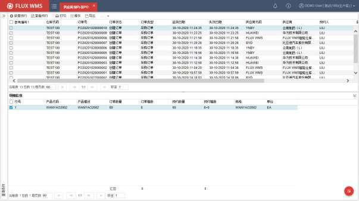

- 选择一条或多条未预约的 PO 记录（系统支持多单共同送货），点击【新增预约】按钮，或者通过右键功能【新增预约】，开始预约送货。

- 根据所选 PO，系统弹出订单信息提示二级窗口（如下图）

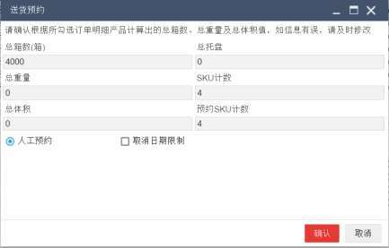

- 确认订单的总体积、总重量后，可以选择人工预约模式，或者系统自动预约月台的操作模式。

<!-- 原 PDF 第 955 页 -->

- 默认为人工预约模式，根据预约日期（多单预期日期相同，默认为此预期日期。如果PO未指定预期日期，则默认值为当前日期的第二天），系统以图形化的模式显示月台的当前预约占用情况：

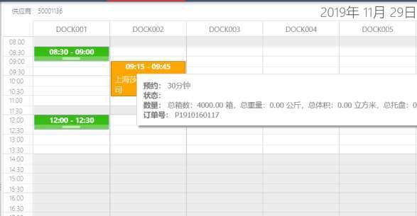

- 列表示为仓库月台，月台信息与每个月台不同的工作时间段，在【仓库设置】-【月台】功能中维护（可参考 7.6【月台】章节的介绍）。

- 行为作业时间段。时间刻度的跨度，通过参数 DCK_MIN_TIM 进行维护。

- 色块代表单据占用情况，某个单据占用了某个月台的具体操作时间段。非当前供应商的预约信息颜色显示为绿色，当前供应商的预约信息颜色显示为黄色。

- 占用时长，根据订单待操作量（总箱数）除以每小时的卸货效率，计数所得的预估时长，按半小时进位，并且系统控制最短时间为半小时，最长时间为 4小时。

- 不同产品可以按货类设置卸货效率，单位为箱/小时。如果货类中未配置，则取参数 CAS_ULD_PHR设置的仓库卸货效率值。如果 CAS_ULD_PHR参数也未设置，则默认作业时长为最小时间刻度。

- 计算所得的占用时长，以浮动色块的模式显示，用户可以临时调整浮动色块的长度，即作业需要占用月台的时间长度。并拖动色块到不同的月台，从而人工调整订单预约情况。

- 系统根据预设的预约规则，对供应商可预约的时段、月台进行限定。例如某个供应商只能选择月台 1~3，但不能选择月台 4、5。

<!-- 原 PDF 第 956 页 -->

- 点击【保存】按钮，确认预约选择。系统根据预约情况，生成对应预约单（后续作业中，可根据作业需要，依据预约单生成 ASN）。

- **其他预约处理**

- 提前预约天数控制

供应商在送货到仓库之前进行预约。但仓库通常不会开放很长的提前周期让供应商随意预约，例如一般会限制可以预约 1周内的送货，或者 3天内的送货。

通过参数 APP_ADV_DAY 可以维护预约提前天数，即从作业次日开始计算，可以预约几天内的月台。例如只能选择次日开始 3 天内的可作业月台、时段。

供应商所选订单的预期送货日期，如果超过预约提前天数，例如只能预约 3 天内的月台，但所选PO 的预期到货时间是 2周后，将无法对 PO 进行月台预约。

- 添加到现有预约

供应商已预约成功情况下，有其他新增订单（或遗漏预约的订单）需要在同天一起送货的情况，可以通过鼠标右键功能“添加到现有预约”，补充订单加入预约。

点击右键功能后，根据所选订单预计到货日期（勾选多单仍旧需要同供应商、同日判断），显示对话框，内容为此供应商这天已预约成功的记录（如下图所示）。用户选择某预约记录确认，则将所选订单加入到已有预约。

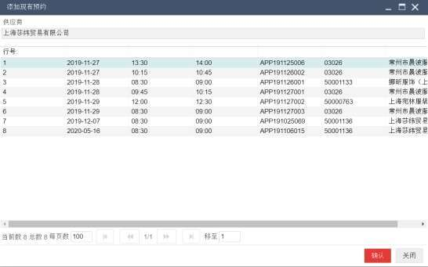

<!-- 原 PDF 第 957 页 -->

- 周期预约

某些供应商，每周固定时间送货。例如每周 2、4 上午 9点~12 点送货。需要为这些供应商空出对应时段的固定月台。

进行人工预约或者自动预约时，系统根据预设的预约规则，将自动生成周期预约供应商的预约单记录，以便进行月台预留。

### 15.1.2. 供应商预约-按 ASN

除了按 PO(采购订单)进行送货预约，按 ASN（预期到货通知）预约也是比较常见的供应商预约模式。适用于货主下达 ASN 给仓库的业务场景。

- **供应商预约-按 ASN**

- 选择“预约”模块的“供应商预约-按 ASN”功能。

- 查询已有 ASN记录，选择记录，通过【新增预约】，或者【添加到现有预约】，执行预约处理，操作同按 PO 预约。

- **其他预约模式**

按ASN 预约功能中，同样支持自动预约、添加到现有预约，此外，还支持导入 ASN 预约模式。

- 导入预约

供应商基于采购订单进行生产，一张采购订单可能会根据生产进度安排多次送货，一次送货也可能将多张采购订单的货物共同送达仓库。

有些业务场景，拟送达的详细信息，可以由货主规划、指定，从 ERP或其他上游业务系统，通过接口提前下达给仓库，形成 ASN。但也有些业务场景，拟送达的货物情况，需要由供应商提供。因此在【供应商预约-按 ASN】功能中，系统提供 Excel导入送货信息，系统相应创建 ASN。

通过【标准导入】，选择已维护对应 PO 号码的 Excel表格（导入模板可在标准导入界面下载获得），系统根据明细信息生成对应 ASN，并与 PO关联。

如果导入有误，可以通过鼠标右键功能【取消 ASN】，取消已导入生成的单据，重新修改 Excel表格内容，再次导入。

## 15.2. 预约单

供应商预约成功后，系统相应生成预约单。预约单，也是后续入园登记（进入物流园区）进行

<!-- 原 PDF 第 958 页 -->

管理的依据。

系统提供预约单功能，主要用来对预约结果进行查看、调整，并支持根据预约单，生成对应 ASN（预期到货通知）。

- **预约单**

- 选择“预约”下的“预约单”功能，查询可见如下预约单信息：

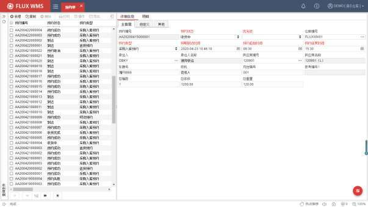

- 在明细页签，能够查看到这个预约单对应的明细单据记录，根据预约方式不同，相应显示采购订单，或者预期到货通知记录：

<!-- 原 PDF 第 959 页 -->

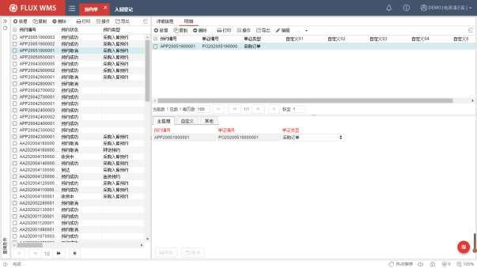

- **鼠标右键菜单**

- 调整优先级

对于已生成的预约单，可以通过“调整优先级”功能，将单据优先级更新为 1，最高。

- 关闭预约单

已生成的预约单，不再使用，但又不希望取消的情况下，可以通过此功能，将预约单更新为关闭状态。

- 取消预约单

已预约成功的单据取消，不再送货，或者需要重新进行预约。

- 入园登记

点击后，跳转到【入园登记】功能界面，并将预约单号带入为查询条件，方便连续操作。

- 生成 ASN

对于按 PO 预约的情况，可以基于预约单，生成预期到货通知单（ASN），用于后续的收货确认。因此，只有基于 PO预约生成的预约单，并且尚未生成 ASN 的记录，才能使用此功能。

点击鼠标右键功能【生成 ASN】后，显示如下生成 ASN 界面，可以在当前 PO范围内，选择其中的部分记录、数量，确认生成 ASN。即一个 PO，可以根据需要生成多个 ASN，多次收货确认。

<!-- 原 PDF 第 960 页 -->

系统根据参数 RECEIVE_OVERQTY（是否允许超量收货）控制是否允许超量生成 ASN。

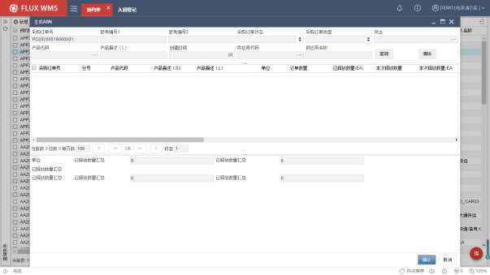

- 重置 ASN

仅对应已生成 ASN 的预约单记录生效，点击后，对应 ASN 如果尚未收货，则相应删除 ASN，以便重新生成。但如果对应 ASN 已经开始收货（例如部分收货状态），则不可重置。

- **相关参数**

此功能相关参数有：

参数 ID 参数描述 对应说明

RECEIVE_OVERQTY 是否允许超量收货 右键生成 ASN环节生效

## 15.3. 入园登记

对于大型物流中心，园区大门通常与单证室、接待处距离较远，为了更好的对入园的车辆进行管理，可以考虑在园区入口的门卫岗进行入园登记管理。

该功能使用的前提是已操作供应商预约，相应创建预约单。车辆到达仓库后，完成入园登记，等待月台分配后，对车辆入园和出园时，进行的管理记录。

<!-- 原 PDF 第 961 页 -->

预约、收货的作业流程为：

- PO->供应商预约->生成 ASN->入园登记->园区管理->收货

- ASN->供应商预约->入园登记->园区管理->收货

除了基于送货预约的入园登记，也可以手动添加非关联的入园登记，主要用在提货入园、访客入园等情况。

- **入园登记**

- 选择“预约”模块的“入园登记”功能。

- 通过【查询】，可以查看到目前已有的登记记录。点击【新增】按钮，开始非预约单的入园登记，依次输入拜访事由、车辆信息等内容：

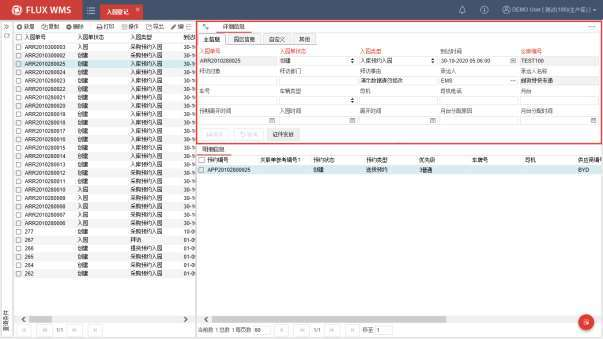

- 对于预约入园的情况，通过鼠标右键功能【提取预约入园】，在弹出的二级窗口中查询已有预约单：

<!-- 原 PDF 第 962 页 -->

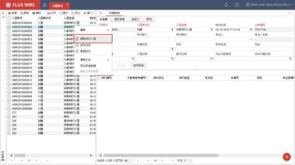

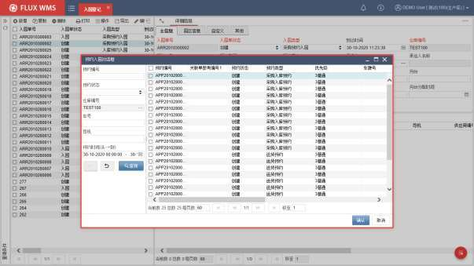

- 选择记录、确认后，系统会将预约单信息，带入生成入园单。同时可以根据预约单的月台预约信息，车辆抵达时间，计算生成入园队列排序，显示在“园区信息”页签的“队列”（预约时间队列）、“队列序号”（车辆抵达时间队列排序）字段。排序逻辑支持个性化配置调整（在【标准业务规则扩展】中，针对动作代码 UDFOPERATE

<!-- 原 PDF 第 963 页 -->

进行配置）。

- 入园登记明细部分，可见对应预约单信息：

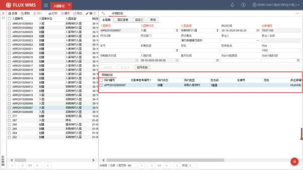

- 在入园登记环节，可以对入园单的对应作业月台，重新进行指派。

- **通行卡管理**

- 对于需要领取临时门禁卡、访客证、通行卡才能入园的情况，点击【证件发放】按钮，系统弹出如下对话框，扫描/录入门禁卡、访客证、通行卡或者其他凭证的卡号信息：

<!-- 原 PDF 第 964 页 -->

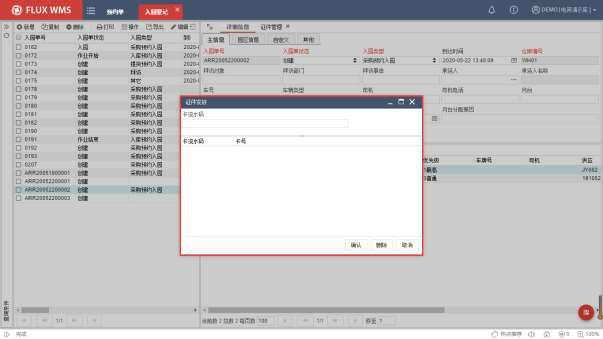

- 已发放的证件，在“证件管理”页签，可以查看到详情信息：

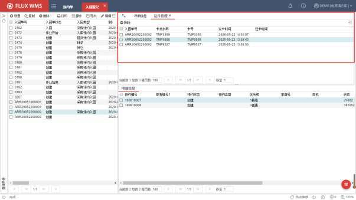

- 后续访客、司机使用通行卡通过园区门禁时，通过设备刷卡读取，或者【园区管理】功能扫卡确认，系统会记录入园详细信息。具体操作详见【15.4 园区管理】章节的介

<!-- 原 PDF 第 965 页 -->

绍。

- 对于无需另行通过门禁的情况，可以不启用【园区管理】。入园登记确认，即视同已入园（通过【标准业务扩展配置】实现）。

- 访客/司机离开园区，需要归还临时通行卡。在不使用【园区管理】功能进行出园扫描情况下，可以通过鼠标右键功能【证件归还】，在如下二级窗口扫描/录入临时证件号，系统会匹配到对应的入园单，并显示相关信息，以及提醒离园检查事项内容：

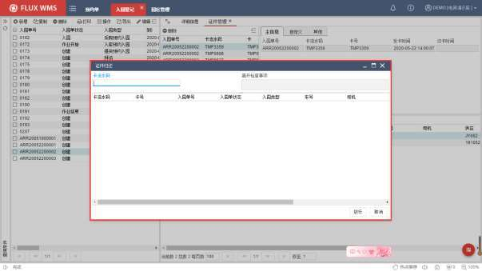

- 离开检查事项，由仓库操作员在进行 RF 的 checkout操作时记录，可在入园登记的“详细信息”页签“园区信息”子页签的“离开检查事项”字段中查看到。非必备信息，通常用来记录是否有自带货物，有没有托盘或者其他的情况，以便出园时检查确认。

- 系统支持连续扫描/读取卡号信息，匹配成功，系统记录卡归还时间。对于卡片丢失等异常情况，可以记录原因信息。

- 点击【放行】按钮，系统会校验入园单所发放的证件是否都已归还（或者已有特殊原因说明），均已归还说明入园人员均已离园，系统将对应入园单关闭，结束作业。

- 卡号扫描校验，支持调用个性化扩展校验处理（在【标准业务规则扩展】中进行配置，对应动作代码 UDFOPERATE）。

<!-- 原 PDF 第 966 页 -->

## 15.4. 园区管理

用于大型物流中心在车辆入园、月台调度、车辆出园的管理。在完成预约、入园登记后，根据入园登记信息，对车辆入园、出园进行管理。

- **园区管理**

- 选择“预约”模块的“园区管理”功能。

- 在“可入园”页签，显示预约成功、已具有对应月台分派的入园单信息。

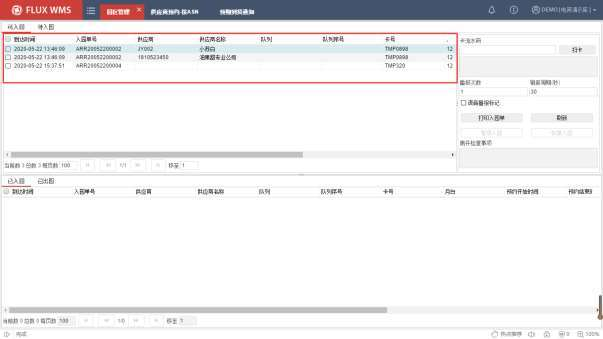

- 根据右侧配置的“刷新周期”信息，系统定时自动查询、显示入园登记。

- 查询到可入园信息，根据设置的“播报次数”，进行语音播报：“卡号 XXX 请进入月台 YYY”。多次播报情况下，两次播报之间，间隔 3秒。播报完成，对应入园单的“语音播报标记”更新为 Y，后续不再重复播报。

- **刷卡入园**

- 在“卡流水码”字段，扫描录入【入园登记】时领取的临时卡证号码（点击【扫卡】按钮，光标会定位在“卡流水码”字段，方便录入）

- 系统根据录入的卡号，匹配对应入园单。匹配成功，记录入园时间，语音提示“入园成功”。同时更新入园单状态为“入园”。

<!-- 原 PDF 第 967 页 -->

- 相应入园单，显示在界面下方的“已入园”部分。

- 入园扫卡，支持个性化扩展配置校验逻辑，可在【标准业务规则扩展】中，针对动作代码 UDFOPERATE 进行个性化逻辑配置。

- **车辆排队**

- 在“待入园”页签，显示尚无具体月台预约的入园单，即已抵达，但没有预约成功月台的车辆，通常是月台已满的情况下的排队车辆。

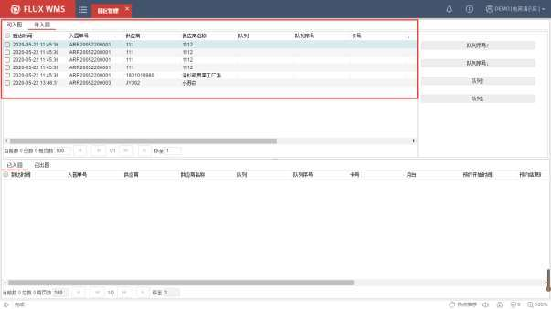

- “队列序号”信息，即根据车辆抵达园区时间（即进行入园登记的时间）排序的等待队列。可以通过右侧的【队列序号↑】、【队列序号↓】按钮，手动调整入园单在队列中的位置。

- “队列”信息，即根据供应商预约的送货时间排序的队列。可以通过右侧的【队列 ↑】、【队列 ↓】按钮，手动调整入园单在队列中的位置。

- 当有月台空出时，分派逻辑参考入园单的队列排序情况，进行月台指派，得到月台分派的记录能够显示在“可入园”页签，等待语音播报。

- **出园确认**

- 完成相关作业，离开园区时，同样进行扫卡确认。界面弹出通行卡归还对话框（同入园登记的证件归还。即操作了【园区管理】的出园证件归还，无需再操作【入园登记】

<!-- 原 PDF 第 968 页 -->

的证件归还）。

- 在证件归还对话框中，显示当前扫描卡号对应的入园单，已匹配卡记录显示为绿色，可连续扫描此单的其他卡号进行归还（一车多人的情况），系统记录归还时间。

- 如有证件遗失等异常情况，相应记录原因说明。

- 点击【放行】按钮，系统校验此入园单对应的通行卡是否已经全部归还（或记录异常原因说明）。校验通过，更新入园单状态为“离园”。
