# 16. 预警

> 来源文件：`富勒WMSV6.2（最全版1119页）.pdf`；原 PDF 第 969-986 页。

> 本文件按原 PDF 正文中的顶层章节拆分；每页保留原 PDF 页码注释，图示按原图注顺序引用。

<!-- 原 PDF 第 969 页 -->

仓库日常操作中，有许多情况需要特殊关注，例如库存低于安全线，保质期临近等。尽管系统对此有详细的记录，但通过库存余量或单据进行查看，对于特定情况不够直观；同时也可能需要仓库主动将信息通知货主或者相关人员处理，但在不同业务情况下，需要通知的内容各不相同。因此WMS 提供了自定义预警的功能，支持现场根据管理需要定义预警的条件、预警内容、模式。

常见的预警模式主要有人工主动进行的查询模式，以及由系统自动发送的邮件预警、短信预警模式，也有现场会将预警信息结合看板使用，在现场投屏显示。预警查询模式，配置生效后可直接使用；邮件、短信模式的预警，需要配合定时器、邮件服务器、短信服务器使用。

## 16.1. 预警参数配置

### 16.1.1. 预警参数配置

由于不同预警方式，可能有不同的要求，因此通过预警参数的设置来控制不同的预警方式。

同时，相同预警需求，但在多仓环境下有可能信息发送对象、执行时间要求不同，因此预警参数可配置为多仓共用的公共参数以及只针对某个仓库生效的专属参数。

通过“仓库”查询条件，可查询到对此仓库有效的公共参数与针对查询条件仓库的对应专属参数。

- **预警参数配置**

新增预警参数可通过如下步骤进行：

- 选择“预警”模块下的“预警参数配置”。

- 点击【新增】按钮，依次输入如下信息。

<!-- 原 PDF 第 970 页 -->

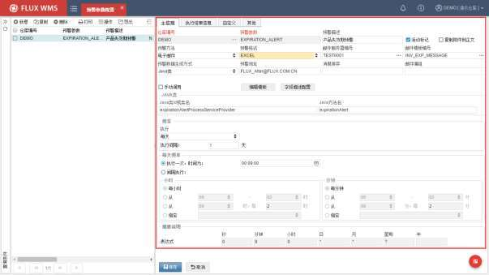

仓库编号－预警对应仓库。为*则是多仓共用的公共记录，没有对应仓库独立配置的仓库均执行公共记录配置。

预警参数－系统不同预警方式的代码。

预警描述－预警对应描述信息。

活动标记－是否启用该预警。

预警方法－系统支持“电子邮件”、“系统消息”两种预警方式。

- 电子邮件－通过自动发送邮件的方式进行预警。

- 系统消息－在系统主界面的“通知中心“显示预警的消息。

复制附件到正文－当【预警方法】为“电子邮件”时，显示此字段。其余预警方法时字段隐藏。勾选后系统自动将附件内容，显示在邮件正文中。

预警格式－当【预警方法】为“电子邮件”时，显示此字段，预警信息生成的邮件附件格式配置。可选择 PDF 文件或者 Excel文件。

邮件服务器编号－配置邮件服务器相关信息。当【预警方法】为“电子邮件”时，显示此字段。需要先在【预警】-【邮件服务器配置】功能中设置邮件服务器，然后才能在此字段选择已设置的邮件服务器。

邮件模板编号－当【预警方法】为“电子邮件”时，显示此字段，用于选择邮件显示的

<!-- 原 PDF 第 971 页 -->

样式模板。具体模板设置，请参考【15.3 邮件模板配置】章节的说明。

预警地址－用于设置预警邮件的指定收件人信息。当用户创建的预警消息未指定邮件收件人地址时，系统自动根据邮件模板中的“固定收件人” 和“固定抄送人”地址发送预警邮件。

消息排序－当【预警方法】为“电子邮件”时，显示此字段。多个预警同时执行时的次序。

邮件编组－同时启用预警较多的情况下，同一收件人，可能会收到不同预警参数配置的对应多个预警邮件，邮件较多用户查看不便。此时可通过邮件编组，将多个预警参数，配置为一个邮件编组，系统将会把不同预警的附件，集中在一封邮件中发送。

手动调用－部分特殊预警，不需要定时器自动发送，可配置为手动调用模式，此预警参数配置后，在其他功能中进行调用。

编辑模板－仅供“电子邮件”预警方法使用。点击后，系统会弹窗显示“邮件模板编号”所配置的邮件模板的内容，方便用户快捷编辑，而无需到“邮件模板配置”功能中，查找此模板再进行编辑。

字段描述配置－仅供“电子邮件”预警方法使用。对于预警消息中的每一个字段列（字段 01~字段25）可以分别指定列名，例如“产地”，或者“有效期”。以便生成 Excel附件时，显示对应列名。不同预警的列名配置可以不同。

预警数据生成方式－系统支持 JAVA类、存储过程两种生成方式。

JAVA类/存储过程－根据“预警数据生成方式”选择，系统对应显示 JAVA类的类名、方法名配置。或者是显示存储进程模式对应的存储进程名、参数列表。系统根据此配置，相应调用指定 JAVA类或存储进程（SP）。

频率－信息推送频率。可选择年、季度、月、天，选择天的情况下，需要配置每天执行频率，固定时间执行，还是间隔时间轮循执行。也即定时器执行预警的时间设置。

每天频率－预警定时器每日执行情况下，具体的定时器执行时间配置。

- 点击【保存】按钮，完成预警参数配置。

### 16.1.2. 标准预警介绍

- **预置预警 -公共消息广播（COMMON_BROADCAST）**

生成广播信息写入到预警信息表中，后续以系统信息方式进行消息推送。

例如库存对账后，计算差异，并通知用户对账差异已生成。

<!-- 原 PDF 第 972 页 -->

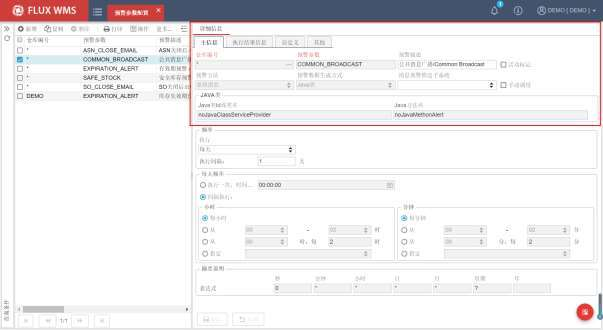

- **预置预警 -失效期预警（EXPIRATION_ALERT）**

医药、食品行业中，库存在库期间需要进行严格的效期管理，并要求库存在失效期前进行出库。若产品已失效，则需要进行冻结人工做报废处理。

为满足上述需求，系统支持在库存到达失效警戒点时，向高层发送预警邮件信息。例如距离失效节点，提前30 天库存冻结，再提前 10 天预警。即距离失效日期 40 天开始预警。

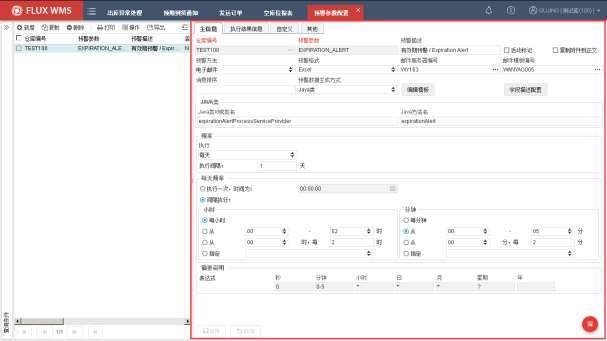

<!-- 原 PDF 第 973 页 -->

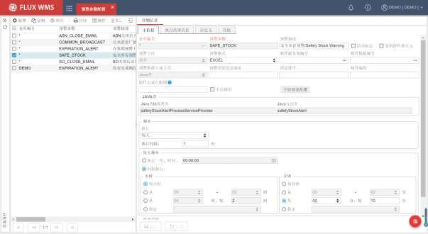

- **预置预警 -安全库存预警（SAFE_STOCK）**

根据产品档案，“多仓设置”页签设置的库存下限进行安全库存预警。检查低于库存下限的产品库存记录，并进行预警，不同仓库的预警下限可以不同。

如果“库存下限”未设置（为0 或为空）则无需预警。

*图 16-1-4（图像未能从 PDF 对象中直接提取）*

- **预置预警 -发送入/出库验收报告（ASN_CLOSE_EMAIL/SO_CLOSE_EMAIL）**

ASN\SO 作业结束、关闭订单后，通过预警，以邮件的模式，发送单据对应的入库验收报告、出库验收报告。

<!-- 原 PDF 第 974 页 -->

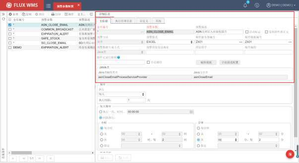

## 16.2. 邮件服务器配置

当预警方式选择“邮件预警”时，所调用的邮件服务器，需要预先在“邮件服务器配置”功能中进行定义。

- **邮件服务器配置**

- 选择“预警”模块中的“邮件服务器设置”。

- 点击【新增】按钮，依次输入如下信息：

<!-- 原 PDF 第 975 页 -->

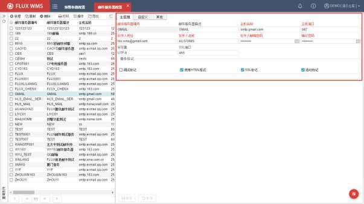

邮件服务器编号－邮件服务器记录代码。

邮件服务器描述－邮件服务器对应描述。

主机名称－邮箱服务器地址信息。

主机端口－录入邮箱服务器端口信息。

发件人地址－发送人地址信息。

发件人名称－发送人名称信息。也即预警邮件的发件人信息显示内容。

发件人邮箱密码－邮箱密码。

确认密码－邮箱密码二次确认。

字符集－处于兼容性考虑，默认编码 UTF-8。

SSL 端口－启用 SSL加密时，录入 SSL端口号。

操作标记－邮件控制标记。分别控制是否启用调试模式、是否启用 HTML 格式发送邮件、是否启用 SSL 加密、是否启用当前设置。

- 点击【保存】按钮，完成邮件服务器配置。所配置的邮件服务器记录，在“预警参数配置”功能中供选择。

<!-- 原 PDF 第 976 页 -->

## 16.3. 邮件模板配置

当预警方式选择“邮件预警”时，需要对预警消息调用的邮件模板进行配置。在【邮件模板配置】功能中，系统支持针对邮件的收件人、抄送人、题等信息进行配置：

- 选择“预警”模块下的“邮件模板配置”功能。

- 点击【新增】按钮，在“主信息”页签，依次输入如下信息：

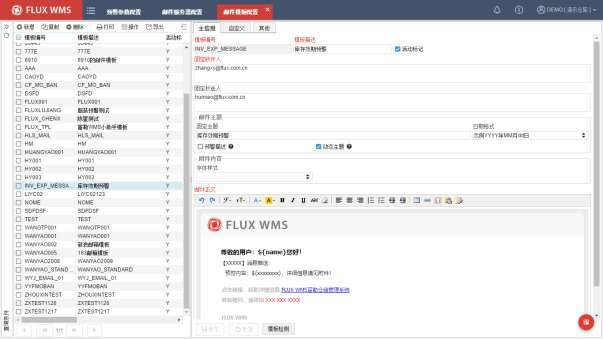

模板编号－邮件模板代码。

模板描述－邮件模板名称、说明。

活动标记－此模板是否启用。

固定收件人－采用此邮件模板的预警发送的邮件收件人。多个收件人，通过分号分隔。

固定抄送人－采用此邮件模板的预警发送的邮件抄送人。

邮件主题－默认根据所配置的固定主题显示。如果勾选“预警描述”，则使用预警参数的描述作为邮件主题；若勾选动态值，则获取预警记录表里写入的主题字段内容（Subject列，默认取首行记录的信息）作为邮件主题。如果固定主题、动态主题均有配置，使用下划线连接（例如：固定主题_日期格式_动态主题）。

<!-- 原 PDF 第 977 页 -->

附件内容－针对插入邮件正文部分的附件内容进行配置。例如显示附件首 2 行信息时的字体大小。

邮件正文－邮件正文内容，新增时提供默认内容供用户参考，如下图所示，修改内容后，可以通过【模板检测】按钮进行测试：

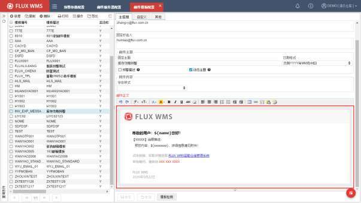

- 点击【保存】按钮，完成邮件模板设置。所配置的模板，在“预警参数配置”功能中供选择。

## 16.4. 预警消息

根据预警参数生成预警消息后，系统支持通过【预警消息】功能，查阅历史预警信息和预警重新推送。

- 选“预警”模块下的“预警消息”功能。

- 输入查询条件，系统显示对应预警消息的主信息部分，如下图所示：

<!-- 原 PDF 第 978 页 -->

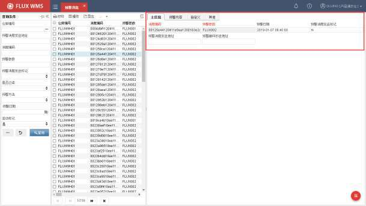

消息编码－系统生成的消息流水号。

预警参数－根据哪个预警参数生成的预警信息。

预警日期－预警信息产生时间。

预警消息发送标记－预警消息是否已发送。

预警消息发送地址－预警消息/邮件发送地址。

预警邮件抄送地址－预警邮件抄送人地址。

- 预警消息内容，则在“预警内容”页签显示：

<!-- 原 PDF 第 979 页 -->

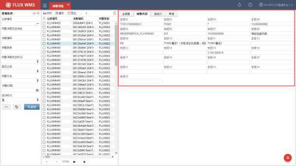

## 16.5. 自定义预警配置实例

### 16.5.1. 库存效期预警

- **目标**

配置库存有效期预警，通过邮件发送预警信息。

- **邮件服务器配置**

先行配置邮件服务器，以便后续配置中使用：

- 选择主菜单“预警”模块下的“邮件服务器配置”。

- 点击【新增】按钮，在“主信息”页签维护相关信息。

<!-- 原 PDF 第 980 页 -->

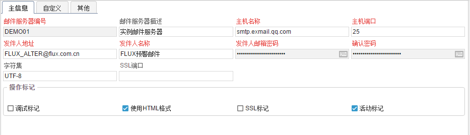

- 邮件服务器编号－记录 ID，用于区分不同的邮件服务器。录入为“DEMO01”。

- 邮件服务器描述－邮件服务器对应的中文描述。后续选择过程中，即根据描述进行选择。

- 主机名称－所用邮件服务器对应信息，邮件服务提供方会有对应说明提供。例如通过 QQ 邮件服务器发送预警邮件， QQ 邮件的对应信息即“smtp.exmail.qq.com”

- 主机端口－邮件服务器端口，邮件服务提供方会有对应说明提供，如“25”

- 发件人地址－电子邮件发送所用的邮箱。

- 发件人名称－客户收到预警时，显示的发件人名称信息。

- 发件人邮箱密码－发件所用的邮箱对应登录密码。系统会通过账号、密码信息登录邮件服务器，进行邮件发送。

- 确认密码－二次录入密码，以便确认。

- 字符集－默认 UTF-8。

- 操作标记，选择“使用 HTML格式”，并勾选“活动标记”。

- 点击【保存】按钮，完成新增记录主信息操作。

- **邮件模板配置**

配置邮件模板，以便后续配置中使用：

- 选择主菜单“预警”模块下的“邮件模板配置”。

- 点击【新增】按钮，在“主信息”页签维护模板信息：

<!-- 原 PDF 第 981 页 -->

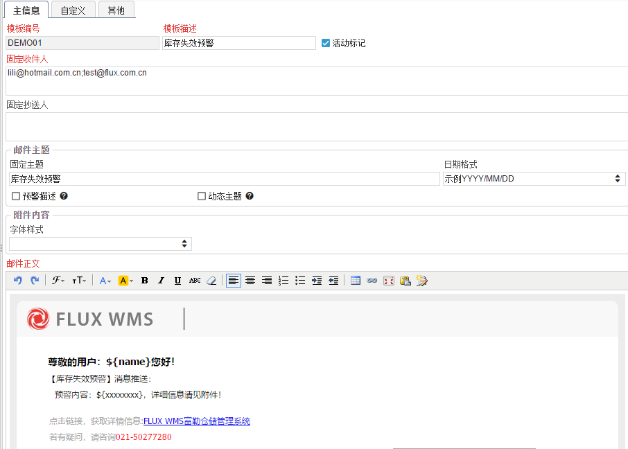

- 模板编号－自定义编号，录入为“DEMO01”。

- 模板描述－邮件模板的对应中文描述，维护为“库存失效预警”。

- 活动标记－勾选配置，激活记录。

- 固定收件人－配置固定收件人地址，多个地址通过分号分隔。

- 邮件主题－邮件名称，配置为固定的“库存失效预警”+发送当天的年月日格式。

- 邮件正文－使用默认模板内容，修改消息推送名称和咨询电话信息。

- 点击【保存】按钮，完成模板配置操作。

- **预警参数配置**

- 选择主菜单“预警”模块下的“预警参数配置”。

- 查询显示系统预置的标准预警记录。

- 选择仓库为*的、公共的 EXPIRATION_ALERT 有效期预警记录。

<!-- 原 PDF 第 982 页 -->

- 点击【复制】按钮，以当前定位的公共记录，复制生成新预警记录。

- 在样本记录基础上进行修改：

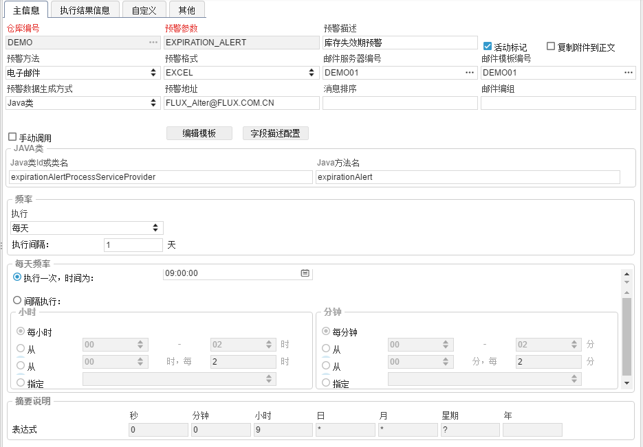

- 仓库编号－改为当前仓库，“DEMO”。

- 预警描述－改为“库存失效期预警”。

- 邮件服务器编号－点击浏览按钮，选择之前创建的邮件服务器记录“DEMO01”。

- 邮件模板编号－点击浏览按钮，选择之前创建的邮件模板记录“ DEMO01 ”。

- 执行频率－选择为“每天”。

- 每天频率－配置为 9 点执行一次。

- 点击【保存】按钮，保存配置。

### 16.5.2. 执行效果及日志查询

- **消息预警执行效果**

<!-- 原 PDF 第 983 页 -->

- 已推送消息

当预警消息推送时，用户可在 WMS 前台右上角 处，查询系统推送的所有预警消息信息。点击 图标，自动打开下列界面：

当在界面右上角标记已读后，将更新 SYS_ALERT_LOG 表 READFLAG 字段为 Y（默认为 N），前台预警信息将不再显示该条预警消息。

- 未推送消息

未读取的推送消息可以通过主界面“预警”模块下的“预警消息”模块查询。

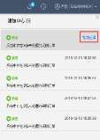

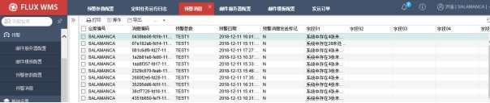

<!-- 原 PDF 第 984 页 -->

### 16.5.3. 邮件预警执行效果

WMS 系统已发送/未发送邮件预警信息，可通过主界面“预警”模块下的“预警消息”模块进行查询。

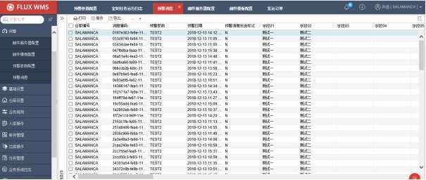

- **预警邮寄样张**

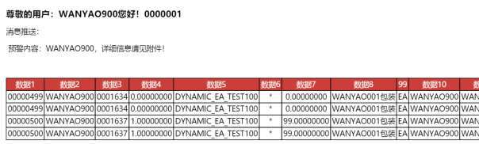

### 16.5.4. 执行日志查询

通过主界面【系统业务日志】-【定时运行任务日志】，用户查询预警消息是否推送成功，见“运行结果”字段。

<!-- 原 PDF 第 985 页 -->

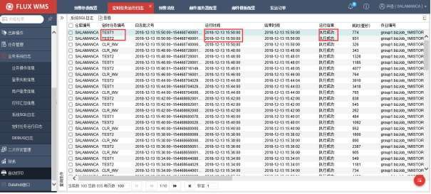

- 步骤 1：根据“定时任务编号”和“运行时间”查看具体定时器日志。

- 步骤 2：双击点开某一行可以查询“详细消息”日志。

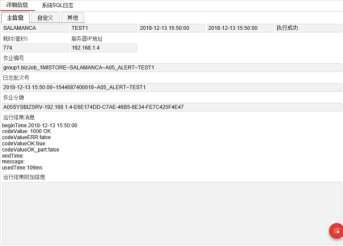

- 步骤 3：双击“系统 SQL 日志”页签，可进一步查看定时器执行详细 SQL 信息。

<!-- 原 PDF 第 986 页 -->

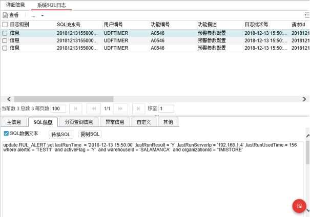
