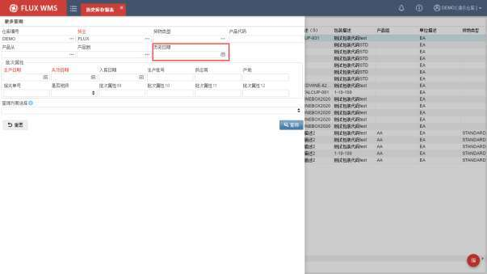
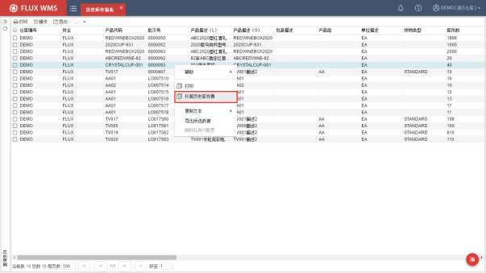
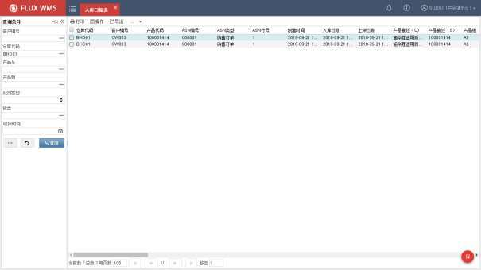
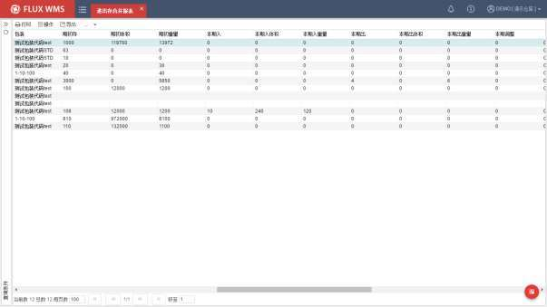
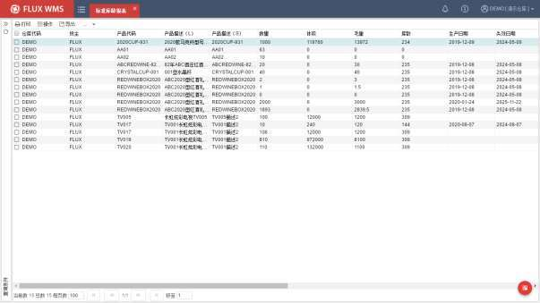
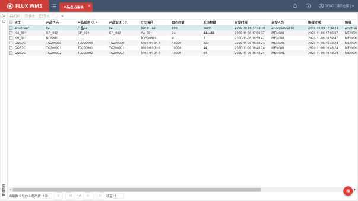
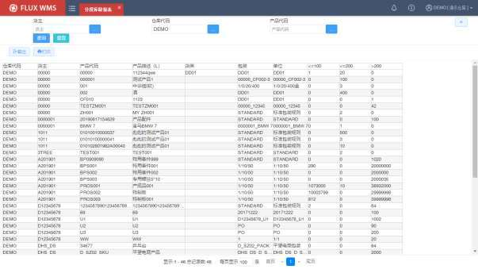
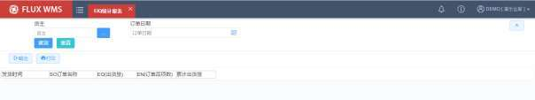

# 17. 报表

> 来源文件：`富勒WMSV6.2（最全版1119页）.pdf`；原 PDF 第 987-993 页。

> 本文件按原 PDF 正文中的顶层章节拆分；每页保留原 PDF 页码注释，图示按原图注顺序引用。

<!-- 原 PDF 第 987 页 -->

报表功能可以用来查询产品在系统中所做操作的所有活动，或者通过表单的形式打印出来供客户查询、审查等。

FLUX WMS 系统，提供部分常用报表，作为标准报表，供用户直接使用。同时，为了支持各种操作、管理需要，系统也提供了个性化报表功能，方便根据需要进行报表制作。

## 17.1. 标准报表

系统默认提供的报表，在【标准报表】模块中展示。

### 17.1.1. 历史库存报表

系统中，通过【库存余量】功能，可以查看当前实时库存情况，也可以通过库存报表查询、生成报告发送给客户，同样是当前库存信息。

如果需要查询过去日期的库存情况，例如查询上个月初的库存，可以在【报表】模块的【历史库存报表】功能中，通过指定历史日期条件，查询过去某一天的库存情况：

通过右键功能，可以补算对应的历史库存费用。

<!-- 原 PDF 第 988 页 -->

### 17.1.2. 入库日报表

该报表是对系统里某个客户所有产品或某个客户单个产品，每日或某一时间段的入库情况查询。

- 点击“报表”下的“标准报表” -“入库日报表”。

- 在查询页签中，输入客户、仓库、产品、 ASN 类型、货类、收货时间、批次属性等查询条件。

- 点击查询按钮，显示查询结果。

<!-- 原 PDF 第 989 页 -->

- 点击“清空”将清空所有查询条件。

- 查询结果列表页面，可通过鼠标右键功能导出 EXCEL 或者直接打印入库日报表。

### 17.1.3. 出库日报表

该报表与入库日报表类似，是对系统里某个客户所有产品或某个客户，单个产品每日或某一时间段的出库情况查询。

### 17.1.4. 进出存合并报表

一段时间内，产品的期初、期末库存情况，以及时间段内的进出汇总情况，可以通过进出存合并报表进行查询，类似早期仓库台账内容：

<!-- 原 PDF 第 990 页 -->

### 17.1.5. 标准库龄报表

该报表是对系统里产品在库具体天数的查询。根据入库日期，对库龄进行计算、显示：

<!-- 原 PDF 第 991 页 -->

### 17.1.6. 空库位表报表

用于查询仓库内未被占用的空库位。

### 17.1.7. 产品盘点报表

系统常用盘点功能，是基于盘点单，生成盘点任务，然后根据任务进行盘点。可以采用多种不同盘点执行方式。具体可参考【10.7 库存盘点单】章节的介绍，以及 RF操作手册中，相关盘点功能的介绍。

除此之外，还有一种全库扫描的操作模式，也在日常操作中会被使用到， RF的产品盘点模式。

按产品盘点是仓库全盘过程中，不预先生成盘点任务、忽略批次信息，仅核对产品、库位、数量信息的盘点方式。使用 RF，按货主，逐个库位扫描获取库存信息，比对时未扫描到的库存全部作为缺货记录。

具体 RF 操作细节，可参考 RF操作手册。在 WMS 中，则可通过报表功能中的【产品盘点报表】，查询到 RF产品盘点的结果。

### 17.1.8. 分段库龄报表

该报表是对系统里产品在库天数比重的查询。需要先在系统参数 STK_AGE（库存库龄报表周

<!-- 原 PDF 第 992 页 -->

期）中设置库龄分段，然后才能使用。

- 在查询条件中，输入仓库、货主、产品、库龄等查询条件，点击查找按钮，显示查询结果，例如按照库龄小于 100 天、库龄在 100~200 天、库龄大于 200 天，分别统计库存数量：

### 17.1.9. EIQ 统计报表

EIQ 分析，是从客户订单的订货次数（Entry）、品项（Item），数量（Quantity），等方面出发，进行配送特性和出货特性的分析。

其中：

EQ 订单量，是当前订单所有 SKU 订货数量合计。

EN 订单品项数，是对当前订单订购品项的计数合计。

<!-- 原 PDF 第 993 页 -->

累计出货量，则是从第一个订单到当前订单的合计出货量。

### 17.1.10. GSP 报表

医药行业报表子模块，只有当医药行业插件（IND_MED）开启时才显示。

## 17.2. 个性化报表

系统支持个性化配置自定义报表，通过【二次开发管理】模块的【配置自定义报表】、【报表设计器】功能进行个性化报表配置。具体配置操作可参考【19.二次开发管理】章节的详细介绍。

所配置的自定义报表，默认在【个性化报表】模块中显示，以便与标准报表区分。
