# 18. 费收

> 来源文件：`富勒WMSV6.2（最全版1119页）.pdf`；原 PDF 第 994-1016 页。

> 本文件按原 PDF 正文中的顶层章节拆分；每页保留原 PDF 页码注释，图示按原图注顺序引用。

<!-- 原 PDF 第 994 页 -->

费收是系统用来对客户费用情况进行管理的功能模块，涉及到费率维护、费用账单管理等环节。FLUX WMS能够支持多种费收结算方式，并且可以为不同产品分别设置不同的费率收费。

使用 FLUX WMS 的费收功能，需要在“费收”模块的“仓储费率设置”功能中，对合同基本计费规则进行设置（可参考后文介绍），然后在“产品档案”中选择相应的费率进行使用。

对于单证相关费用，系统通常在订单关闭时进行计算；库存费用，则多数由定时器负责计算生成。根据需要，可以采用手工模式录入，或者计算生成各种特殊费用。系统提供费用明细信息，也支持生成月度计费单，供用户使用。

## 18.1. 费率主档

仓储费率设置，是根据客户计费合同内容进行对应设置的，对于年度合同管理模式，系统支持维护主合同、子合同模式。例如总合同为同货主 A的合同，子合同即 2019年度合同，2020 年度合同等。同一集团下按事业部、地区设置多个货主分别管理的情况下，也可能存在几个货主共用同一份合同。

系统提供了费率主档设置，对应总合同信息。具体执行的子合同，则作为详细费率在“仓储费率设置”功能中进行维护。

- **费率主档设置**

- 选择“费收”模块下的“费率主档”功能。

- 点击【新增】按钮，在“主信息”页签维护费率主档的 ID、描述信息。如果对应货主设置 为*，则为多货主共用的公共费率主档。

<!-- 原 PDF 第 995 页 -->

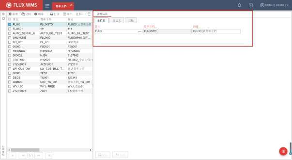

- 点击【保存】按钮，保存信息。

维护后的信息，可在后续“仓储费率设置”功能中，设置主档下的具体费收要求详情。

## 18.2. 仓储费率设置

仓储费率设置，是根据客户计费合同内容进行对应设置的，对于年度合同管理模式，系统支持维护主合同、子合同模式。例如总合同为同货主 A的合同，在【费率主档】中维护，子合同即 2019年度合同，2020 年度合同等，在【仓储费率设置】功能中维护具体费率要求。

- **主信息设置**

- 选择“费收”模块下的“仓储费率设置”功能。

- 点击【新增】按钮，在“主信息”页签，相应维护合同主要信息：

<!-- 原 PDF 第 996 页 -->

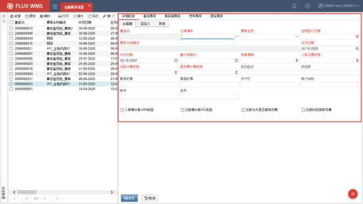

费率 ID－该费率代码，由系统自动生成流水号。年度合同模式下，与当年子合同相对应。

仓库编号－由于各地仓库人工、用地、运营成本不同，仓库设备条件也差别很大，所以同一个货主，在不同仓库的操作费用也可能不同。例如同样卸一车货，上海仓库的卸车费可能会比宁波仓库的费率高。因此系统支持不同仓库分别设置费率。

费率主档－即客户总合同编号，通常根据实际客户合同号码录入维护。多个不同的费率ID，可以从属与同一个费率主档。

合同签订日期－用于记录合同签署日期，通常是子合同的签署日期。如无子合同模式，则记录主合同日期，辅助进行合同管理。

费率主档描述－该费率的名称说明。

生效日期－此费率开始使用的日期。

失效日期－此费率不再使用的日期。超过失效期，不再依据此费率进行计算。需要注意的是，同一个主合同编号下的多个子合同对应生效日期和失效日期不允许有交叉，否则同一时点存在 2份生效的子合同，系统无法确认费用计算执行依据。因此保存时系统会进行校验提示。

首次结算日－按此费率合同，首次开始费用账单结算的日期。所维护日期，应不早于当前日期，并且系统会校验首次结算日是否在费率有效期范围内。

<!-- 原 PDF 第 997 页 -->

结算周期－账单周期选择，按月生成月账单，或者按季度生成账单，也支持每周生成账单。

入/出库计费级别－进出库费用结算时计费的等级选择，系统提供按交易、按订单行、按订单、按天、按结算周期等几种选择，主要区别是计费级别以及最低、最高费用的计算方式不同。例如按单计费，最低费用 5元。当每单都不满 5元情况下，一天有 3单，每单分别计算最低费用，计费为 5*3=15元；而按天计费，合计低于 5 元，只生成一个最低费用 5元。入库环节与出库环节的计费级别要求可以不同。

库存计费级别－库存计费的级别选择，可按客户、产品或批次级别计算。

折扣起点－给与折扣的基准线。即应付账单总金额超过此值，可给予折扣。

折扣率－折扣百分比。字段的小数位控制，通过金额小数位（PRI_DEC）参数控制。

最低收费－一个费用周期内，账单的最低收费。例如按月生成账单，最低收费 2万元，则各类费用合计不足 2万元的情况下，按 2万元收费。

最高收费－一个费用周期内，账单的费用上限。计费超过最高收费，则按最高收费生成结算账单。

开户行－客户银行信息。

账户名称－客户银行账号信息。

账号－客户银行账号。

税号－客户的发票税号。

入库费关联 ASN类型/出库费关联 SO类型－如果客户不同类型的作业单据费率不同（例如退货入库与正常入库费率不同），需要勾选对应项，这样才能在后续的【基准费率】页签中针对不同单据类型分别设置费率。

出库当天是否算库存费－如未勾选，则免除货品发货当天的库存费用。

出库时结算库存费－特殊库存计费模式。货品在存储过程中，不生成库存费用，仅在产品发运时计算其全部历史库存费用。

- 点击【保存】按钮，完成合同主信息记录。

- **基准费率设置**

- 在“基准费率”页签，点击【新增】按钮，依次输入如下信息：

<!-- 原 PDF 第 998 页 -->

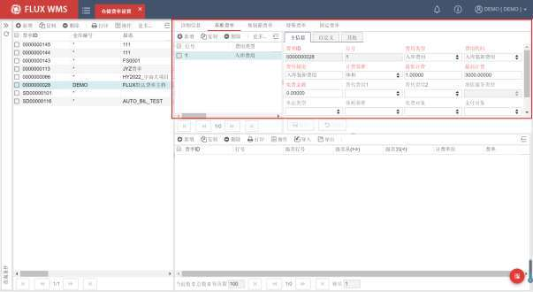

费率 ID－该费收项所属费率代码。由系统根据主信息费率 ID自动获取。

行号－费项行号。保存时由系统生成。

费用类型－费用的一级分类，系统提供入库费用、库存费用、出库费用、增值服务费用、特殊费用等不同种类供选择，并据此确定何时计算该费用。例如入库费用，将在 ASN 关闭时计算生成。

费用代码－费用的二级分类，是一级分类下的细化分类。例如入库费用下还可以细分为入库费用、入库集装箱费用、入库特殊费用、入库附加费等。选定一级的“费用类型”后，“费用代码”下拉列表可显示对应的二级分类信息。

费用描述－对该费用项的描述，同时也是费用的三级分类，可由现场根据需要开放录入。

计费基准－计费的依据，例如体积、重量、计费吨、数量、托盘等。目前计费基准支持“折算箱数”、“集装箱”、“体积”、“固定计费”、“库位数”、“订单行”、“折算托盘数”、“折算件数”、“计费吨”、“整箱数”、“整托盘数”、“单件数”、“重量”、“净重”等。

最低计费－该费用项计算所得费用的最小值。如实际计算所得低于此值，则使用此字段的设置。例如设置为 5，则计算到入库卸车费用为 3元，生成的费用明细为 5元。

最高计费－该费用项最高限制费用额。计算所得费用超过此上限，自动取上限值。

免费金额－该费用项，可减免金额。例如免费金额 10，按此行费率计费结果 27，实际

<!-- 原 PDF 第 999 页 -->

账单明细中此行费率得到的金额是 27-10=17。

替代费用 1/2－不可同时产生的费用。例如有些客户的合同要求，收取了集装箱费用，就不再收取入库费用。此时集装箱费用就是入库费用的替代费用。而另一些客户，这 2项费用同时收取，那么就不是替代费用。

增值服务类型－针对“费用类型”为“增值服务费用”的记录生效，可选择对于订单的服务中，何种服务需要计费。下拉列表供选择的服务内容，可在系统代码中维护。

单证类型－应用于不同单证类型所用费率不同的情况。例如正常入库与退货入库的费率不同，此时需要设置费率的单证类型。在主信息界面，勾选“入 库费关联 ASN类型”或者“出库费关联 SO 类型”情况下生效。

体积基准－整单位体积计费需求。例如出库数量为半箱，但需要根据整箱的体积计费，此时体积基准设置为箱，系统提取包装代码中箱级别维护的整箱体积进行费用计算。

收费对象－计算所得的应收费用的对象。可指定为订单的货主，或者供应商/收货人等，系统获取订单对应信息作为费收项的收取对象。也可以可维护为客户档案信息进行选择。

支付对象－计算所得的成本费用的付给对象。

收入税率－结算时使用的计费税率，以便计算含税、不含税费用。税率选项在系统代码中进行维护。

支付税率－计算成本支出时使用的税率。部分业务场景，在收入、支出时需要按不同税率结算，因此系统支持分别配置不同的税率。

计费库存事务分类－一些客户合同，对不同库存性状（例如良品、不良品）货物的操作精度、检查项要求差别比较大，劳动量不同，会有不同的操作费率要求（例如良品装卸费 100元 /吨，不良品装卸费 50 元 /吨）。 此 时 可 以 通 过 系 统 代 码BILLING_TRANSACTION_CATEGORY维护计费库存分类内容，在基础费率中分别进行费率配置。收货、发货、库存作业时，根据现场要求，通过自定义处理，为作业生成的库存事务更新所属的计费库存分类，计费环节相应按对应分类的费率进行费用计算。此模式仅支持用于费用类型为入库费用、出库费用或库存事务费用这三类与库存事务相关的费用计算中。

区间计费－是否启用区间计费模式。此模式下，数量分为不同区间分别计算，再加总得到总费用。例如入库装卸费，数量在 1~10件区间，为 2元/件，11~20件区间，为 3元/每件。到货 19件，区间计费方式为，19=10+9 件，2 个区间，费用为 10*2+9*3=47元。如果不采用区间计费，仅仅为级差计费模式，计算过程为 19在11~20的第二级差，19*3=57 元。

- 在明细的费用级差部分，点击【新增】按钮，输入如下信息：

<!-- 原 PDF 第 1000 页 -->

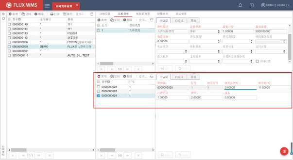

费率 ID－该费收项所属费率代码。由系统自动根据主信息费率 ID获取。

行号－级差对应的基准费率费用行的行号。从头信息获取对应行号信息。

级差行号－多级级差设置时，对应的明细行号。一个费用行，可配置多级级差，对应多行级差行号。费用级差，是有些客户实行阶段计费，例如 10KG 以下，固定收费 100元，10~100KG，每 KG 收费 5元，100KG 以上，每 KG 收费 3元，这种收费方式就是级差计费，需要设置多级费率。如果没有多级差的收费要求，只需设置一个级差以及费率。

级差从，级差到－费用计费基准的级差范围。根据待收费的计费基准量，判断应遵循哪个级差的费率。例如按重量收费，0~10 公斤，每公斤 1 元装卸费，10~100 公斤，每公斤 1.1元装卸费。当前订单总重量 12公斤，在 10~100公斤的级差范围内，则按每公斤 1.1元装卸费的费率进行费用计算。

计费单位－级差计算时，计费数量单位跨度，即最小计费单位，默认为 1。可以通过计费单位的修改，实现类似进位计费的需求，例如 11~19立方米都按 20 立方米计费，此时计费单位应设置为 10，只按 10的倍数计费，不满整十的数量都进位补满。

费率－费用项在级差范围内使用的费率。

成本－需要计算操作成本时使用，计算逻辑同应收费用。

- 点击【保存】按钮，完成基本费用费率设置。

- **集装箱费率设置**

<!-- 原 PDF 第 1001 页 -->

部分仓库，到货如果是集装箱，则需要收取集装箱费用，一般根据箱型和集装箱个数计算费率，因此需要设置集装箱专用费率，再根据进出库单据中记录的各个箱型的集装箱数量信息，进行对应费用计算。部分情况下，收取集装箱时，对应入库、出库装卸费会被免除。

- 在“集装箱费率”页签，设置如下信息：

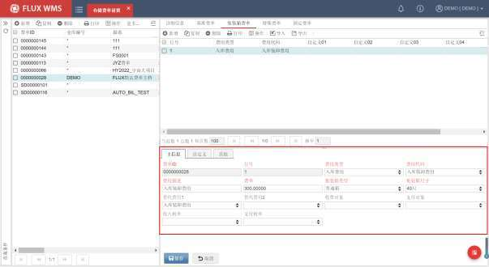

费率 ID－集装箱费用所属的费率代码，新增时根据主信息的费率代码带入。

行号－集装箱费用的行号。

费用类型－集装箱费用所属一级费用分类，如入库费用、出库费用。

费用代码－集装箱费用所属二级费用分类。

费用描述－对该费用项的描述。

费率－集装箱费率。

集装箱类型－集装箱箱型选择，例如普通箱，冷箱，高箱等。

箱尺寸－集装箱尺寸，例如 20 尺，40 尺集装箱。同一费率 ID中，箱型和尺寸将作为选择集装箱费率的依据。下拉列表中的箱型、尺寸内容，可在系统代码中维护。

替代费用－不可同时收取、相互替代的费用。例如有集装箱用，就不收取入库卸车费。

收费对象－应收费用的付款对象。

<!-- 原 PDF 第 1002 页 -->

支付对象－成本费用的付给对象。

收入税率、支付税率－集装箱费用计算相关税率。

- 集装箱费用无级差设置，点击【保存】按钮完成集装箱费率设置。

- **特殊费率设置**

与操作相关的装卸加班费、单证滞纳金等费用，大部分情况下无法按普通的进出数量、重量等作业信息进行费用计算，而是需要人工录入收货依据，形成基于单证的特殊费用。

少部分情况下，这些特殊费用可以设置为费率，人工在进出库单证的特殊费用页签输入计费的工作量相关信息，再根据特殊费率计算费用。例如进出库操作费用按件数计算，同时又按照托盘数量收取设备使用费。

- 在“特殊费率”页签设置如下信息：

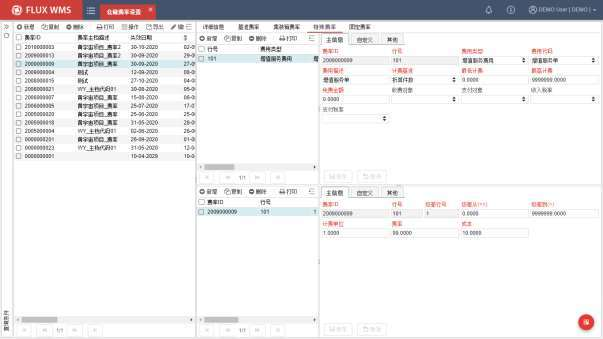

费率 ID－特殊费用所属的费率代码，新增时根据主信息费率 ID带入。

行号－费用项行号，与基础费率区分，从 101开始生成。

费用类型－费用一级分类。

费用代码－费用二级分类，根据费用类型相应显示。

费用描述－费用说明信息。

<!-- 原 PDF 第 1003 页 -->

计费基准－计费的依据，例如体积、重量、计费吨、数量、托盘等。

最低计费－该费用项，最低收费。

最高计费－该费用项最高限制费用额。

免费金额－该费用项，可减免金额。

收费对象－计算所得的应收费用的对象。

支付对象－计算所得的成本费用的付给对象。

收入税率/支付税率－税率维护，用于以便计算含税、不含税费用。

区间计费－是否启用区间计费模式。特殊费用同样支持区间计费。

- 特殊费用的级差费率设置同基准费用级差费率设置。

- **固定费率**

固定费率，主要用于配置包仓费用等固定收费：

- 在“固定费率”页签，点击【新增】按钮，输入如下内容：

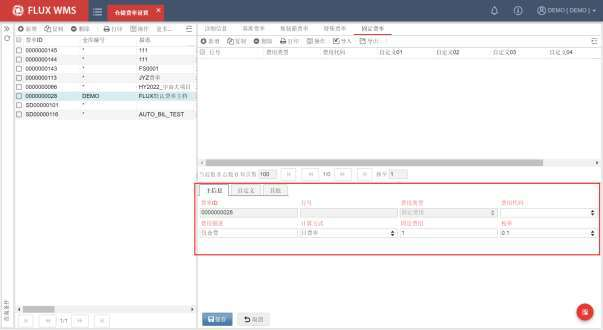

费率 ID－固定费用所属的费率代码，新增时根据主信息费率 ID带入。

行号－费用项行号。

<!-- 原 PDF 第 1004 页 -->

费用类型－显示为“固定费用”，不可修改。

费用代码－固定费用代码，用户可以根据需要在系统代码中配置，例如包仓费用，场地租赁费用等。

费用描述－费用说明。

计算方式－系统提供日费率，月度费率 2个选择。如果计算方式是日费率，系统将每日生成一笔固定费用，月费率则每月生成一笔固定费用。

固定费用－计费的金额。

税率－由于固定费用是应收费用，因此仅提供一个税率选择字段。

- 点击【保存】按钮完成固定费率设置。

- **鼠标右键功能**

- 审核/取消审核

费率设置后，为了避免其他用户误操作修改，可以通过鼠标右键的“审核”功能，对费率进行确认。审核后的费率，不可修改编辑。

需要修改的情况下，通过“反审核”功能，开放费率修改处理。

- 复制费率

以当前所选费率为样本，复制生成新费率，费率ID、日期等信息需要重新录入，但基准费率等费率详细信息都会在保存时根据样本记录生成。

通过按钮栏的【复制】按钮，则只能继承当前页签信息，基准费率等费率详细信息不会根据样本一同复制得到。

- **费率应用**

已设置的费率需要在客户和产品中选择应用。客户档案的费率，是新增产品时的默认使用费率。真正生效的，是产品档案中选择使用的费率。

进、出库时，完成收、发操作后，关闭订单时，系统会把订单相关的费用计算完成，并记录到费用结算清单中。包括进、出操作事务产生的费用，单据表头特殊费用页面手工添加的费用，和根据单据集装箱页面记录计算的集装箱费用。

多数情况下，订单取消，不需要计算进出库费用，但有的订单是仓库作业完成之后才被取消，也需要产生相应的费用。因此订单取消时也会进行费用计算，可以生成对应的特殊费用、增值服务费用。

<!-- 原 PDF 第 1005 页 -->

库存费用由系统通过定时器（费用与账单计算定时器 BIL_CHG）每日定时计算生成。同时【报表】-【标准报表】-【历史库存报表】中提供补算历史库存费用的功能。

- **其他**

- 出库箱型计费

部分现场，会根据复核装箱的打包工作量进行计费，同样在订单关闭时，根据出库复核装箱所用的不同包装箱箱型、个数，进行出库费用计算。

需要在【仓储费率设置】功能中，配置“出库包装箱费用”，计费基准选择为“包装箱数”；同时【基础设置】-【装箱】功能中，维护不同箱型的费率，用于费用计算。

## 18.3. 费用清单

系统在操作中根据费率设置计算客户的应收/应付费用，计算结果可在费用清单界面查看。费用清单是系统用于记录、修改、确认费用明细的功能界面，并支持维护客户到款信息。也可以在费用清单界面根据实际情况手工添加费用记录。

- **费用清单**

- 选择“费收”模块下的“费用清单”功能。

- 输入查询条件，能够查找到指定客户的指定费用。

- 支持手工添加费用记录，在明细页面，点击【新增】按钮，添加费用记录。主信息页签依次输入如下信息。

<!-- 原 PDF 第 1006 页 -->

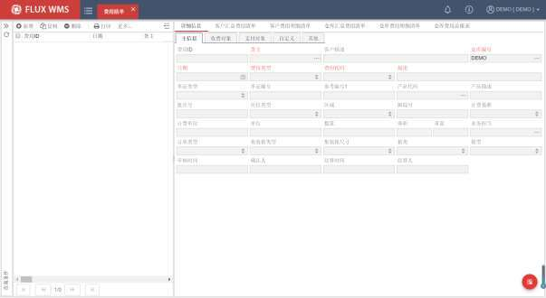

费用 ID－费用记录在系统中的流水序号，由系统自动产生。

货主－费用记录所属的货主代码。

客户描述－费用记录所属的客户对应名称。

仓库编号－费用记录产生的仓库。

日期－费用记录生成日期。

费用类型－费用记录所属类型，一级分类信息。

费用代码－费用记录所属二级分类信息。

描述－费用项目详细描述信息。

单证大类－费用记录依据的单证分类。如预期到货通知单、发运订单。

订单编号－费用记录依据的订单号码。

参考编号 1－订单对应的参考编号 1信息。通常用来记录上游系统单号。

产品代码－费用记录对应的产品代码。非必输。如果不是根据产品生成的费用，可跳过此字段。

产品描述－产品描述信息。

批次属性－按事务生成的费用记录，对应的批次属性信息。如果是非事务计费，此类信

<!-- 原 PDF 第 1007 页 -->

息为空。

库位类型－费用记录相关库位类型信息。

跟踪号－费用记录对应的产品跟踪号。

计费基准－费用记录的计费依据。如体积、重量等。

计费单位－费用记录的计费单位。

单位－产品数量的单位。

数量－费用记录对应的产品数量。

体积－费用记录对应的产品总体积。

重量－费用记录对应的产品总重量。

业务担当－客户/项目对应负责的业务员。

订单类型－依据不同订单类型，按不同费率计费的情况下生成的费用明细，会写入对应订单类型，以便检查确认。

集装箱类型－集装箱费用计费依据信息。

集装箱尺寸－集装箱费用计费依据信息。

箱类、箱型－出库所用箱类、箱型信息。

审核时间、确认人－对在后续结算功能中，对费用进行审核的操作时间、操作人信息。

结算时间、结算人－对在后续结算功能中，对费用进行结算的操作时间、操作人信息。

- “收费对象”页签，输入仓储计费的应收费用相关信息：

<!-- 原 PDF 第 1008 页 -->

结算对象－应收费用的付款方客户代码。

结算名称－应收费用的付款方客户名称描述。

应收费率－计费所依据的费率信息。

应收金额－系统计算的应收费用金额。人工录入时，支持输入负数，以便处理折扣等金额。

应收税率－计费依据的税率信息。

应收税额－根据税率计算得到的税额。

应收不含税金额－扣除税额后的不含税金额。

- 在“支付对象”页签，输入仓库操作的成本支出相关信息：

<!-- 原 PDF 第 1009 页 -->

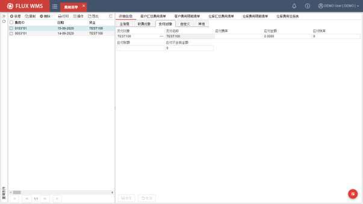

支付对象－应付费用的收款方客户代码。

支付名称－应付费用的收款方客户名称描述。

应付费率－计费所依据的成本费率信息。

应付金额－系统计算的应付费用金额。

应付税率－计费依据的成本税率信息。

应付税额－根据税率计算得到的税额。

应付不含税金额－扣除税额后的不含税金额。

- 点击【保存】按钮，保存费用记录。

- **右键菜单功能**

- 生成汇总账单

支持将货主上一次结算后到今天（包含今天的费用明细记录）的费用生成汇总账单，并跳转到收支结算部分，查看生成的汇总账单信息对应单据。

- 重算上一账单

用于定时器计算生成月度账单后，未能正常生成账单，或者需要修改费率重算费用、重新生成账单的场景。

<!-- 原 PDF 第 1010 页 -->

点击后，弹出如下对话框，仓库默认为当前仓库，选择需要重算的货主后，系统根据仓库、货主，对应显示费率中设置的结算日期、周期、账单时间范围信息。

点击【生成账单】按钮，系统基于已经生成的费用清单明细记录，重新汇总生成月度、或者每周、每季度账单。

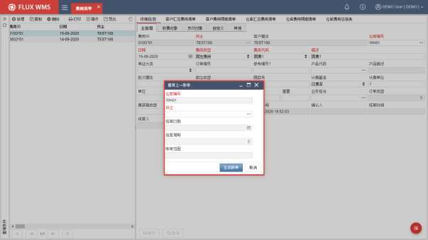

进行账单重算时，如果当前系统中已经有生成同时间范围的账单，创建状态情况下，系统会提示确认账单重新生成；如果账单已经审核，则不允许重算上一账单。

- 费用重算

大部分操作费用，在订单关闭时会根据费率计算生成。但对于新旧费用合同交替，或者合同变更等特殊情况，一个账期可能会依据不同的合同费率进行计费，需要对已经生成的费用记录，依据所选择的合同重新计算每一笔费用明细。

在ASN、SO 右键菜单功能项中，可以对指定单据批量重新计算费用，但其他费用如加工费用、特殊费用等都有重新计算的需要，因此系统提供了“费用重算”功能，重新计算生成费用清单明细记录。

而“重算上一账单”功能，则是在已经生成的费用清单明细记录基础上，重新生成汇总账单，两个功能应用场景不同。

点击右键功能项“费用重算”后，系统显示如下弹窗：

<!-- 原 PDF 第 1011 页 -->

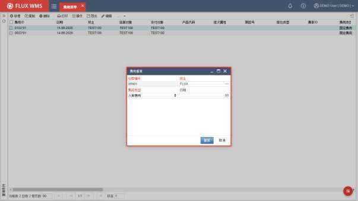

选择需要重算的货主，以及费用类型。

如果费用类型是入库费用、出库费用，则重算上一结费周期的费用明细；如果费用类型是库存费用、增值服务费用等非入、出库费用，则需要指定具体日期，按天重算，以免一次性计算量过大。

点击【重算】按钮，系统会校验指定时间段的费用清单明细，是有已经生成账单。对于已经生成账单、进入结算流程的费用清单，不能重算。通过校验后，系统会重新计算生成费用清单明细。

## 18.4. 收入/支出结算

为了方便用户收入、支出分别管理，系统提供收入结算、支出结算功能。

通过费用结算定时器（费用与账单计算定时器 BIL_CHG），在货主的结算日，根据费用清单记录，将应收费用和应付费用按货主、结算对象（结算对象为空即视同货主）、费用代码 (即费用二级分类)，汇总后生成相应的收入结算单、支出结算单。并根据折扣起点、折扣率，计算得到折后费用。

用户可以通过“收入结算”、“支出结算”功能，对已生成的账单进行查看，并支持简单的结算管理。

- **收入结算**

- 选择“费收”下的“收入结算”功能。

<!-- 原 PDF 第 1012 页 -->

- 输入查询条件，查找到对应的、系统已生成的收入结算单：

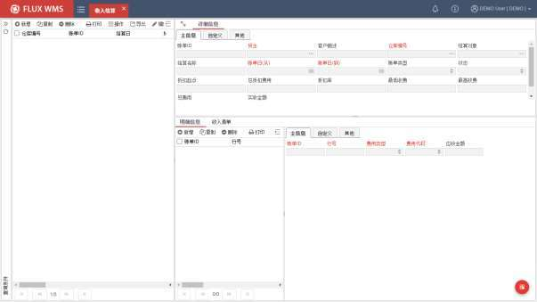

- 根据需要可以在表头部分，补充自定义或备注信息。

- 如果检查发现生成的结算单需要修改，可以在“费用清单”中修改费用明细，再通过结算单鼠标右键功能“账单刷新”，删除原有结算单明细，重新生成结算单明细。

- 在“收入清单”页签，鼠标右键功能“新增明细”可以跳转到“费用清单”中添加记录，并在记录保存时，相应更新结算单信息。

- 结算单无误，通过鼠标右键功能“审核”，确认结算单审核通过，可向客户提供费用结算单。

- 在结算单表头，录入实收费用后，通过鼠标右键功能“结算”，确认结算单操作完成。

- **鼠标右键功能**

- 审核

确认账单审核完成。

- 结算

实收金额录入后，确认结算单作业全部完成。

<!-- 原 PDF 第 1013 页 -->

- 账单刷新

删除结算单明细，重新汇总生成此结算对象、货主的汇总账单明细信息。

- 重新计算费用

重新根据结算单头的货主，将对应单据重新计算生成费用清单明细，并刷新结算单相应的汇总信息。通常在修改费率设置后，会需要重新计算费用，但对手工添加的费用没有影响。

- 取消审核

将已审核账单，退回到未审核的创建状态，以便进行修改。

- **支出结算**

对仓库应付的成本费用进行汇总生成支出结算单。同样支持审核、结算确认，但不单独提供“重新计算费用”功能，在“收入结算”功能中进行重新计算，会同时将成本费用也同步计算。

## 18.5. 运输费率设置

不做详细运输跟踪管理的情况下，可以通过WMS 系统，对快递相关费用进行简单的运费记录，以便支持费用结算。

- **费率设置**

- 点击“费收”下的“运输费率设置”。

- 点击【新增】按钮，在“主信息”页签，依次输入如下信息：

<!-- 原 PDF 第 1014 页 -->

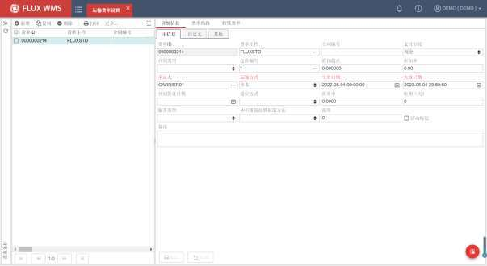

费率 ID－该费收方式的代码，由系统自动生成流水号。

费率主档－即客户总合同编号，在【费率主档】功能中维护。多个不同的费率 ID，可以从属与同一个费率主档。

合同编号－当前运输合同编号。

支付方式－费用支付方式。下拉列表内容在系统代码 PMT_TRM（支付条款）中维护。

合同类型 －例如年度合同，框架合同等类型区分。下拉列表内容在系统代码CONTRACT_TYPE（合同类型）中维护。

仓库编号－费用生效仓库，为*则是针对所有仓库生效的公共费率。计算费用时，优先使用当前仓库的对应费率进行计算，如无则使用*仓库的公共费率。

折扣起点－计算到的费用达到折扣起点，按折扣率进行打折。例如月度运输费用满 10000元，可以打 97折。

折扣率－费用折扣率。例如打 97折，输入 0.97。

承运人－快递运费对应的快递承运人，可通过查询按钮查询已在客户档案维护的承运人。

运输方式－下拉列表内容在系统代码 TRN_VEH（运输工具）中维护。

生效日期－费率合同生效日期，也即开始使用此费率进行费用计算的日期。

失效日期－费率不再使用的日期。即超过失效期，不再依据此费率进行计算。

<!-- 原 PDF 第 1015 页 -->

合同签订日期－合同签约日期。

进位方式 －数值进位方式，例如四舍五入等。下拉列表内容在系统代码DECIMAL_MODE（进位方式）中维护。

折重率－抛货折重比率。抛货即体积大、重量小的货物，将体积乘以折重率，计算为计费重量，用于费用计算。

账期（天）－运输费用账单周期，例如30 天。

服务类型－运输服务分类信息。对应系统代码 TRN_SVC_LVL（运输服务等级）

体积重量结算取值方法－结算结算时的体积重量取值策略，例如取两者中数值大的一个，或者取小，或者人工选择。对应系统代码 CUBIC_WEIGHT（体积重量结算取值方法）。

税率－运费税率。

活动标记－是否使用中的费率记录。

- 点击【保存】按钮。

- 在“费率线路”页签，可以通过将费率与线路绑定，实现对区域线路的计费，例如上海-北京的运输线路费用。支持通过折叠按钮，展开费率线路查询条件进一步查询：

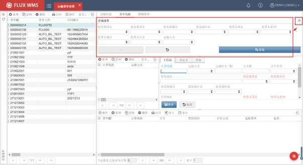

- 也可以点击【新增】按钮，添加新的线路费率。但只能在费率未审核情况下，添加费率线路信息。维护级差费率时，系统会校验级差是否连续、完整。

<!-- 原 PDF 第 1016 页 -->

- 在“特殊费率”页签维护特殊情况的额外收费。

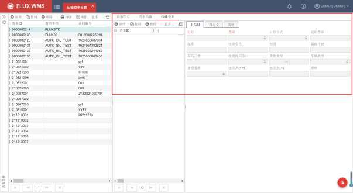

- 点击【保存】按钮，完成快递费率设置。

设置完成后，发运订单关闭、计算费用时，根据承运人、运输方式，匹配相应快递费用，生成费用明细记录。
