# 19. 业务系统日志

> 来源文件：`富勒WMSV6.2（最全版1119页）.pdf`；原 PDF 第 1017-1037 页。

> 本文件按原 PDF 正文中的顶层章节拆分；每页保留原 PDF 页码注释，图示按原图注顺序引用。

<!-- 原 PDF 第 1017 页 -->

业务系统日志模块中，集合了系统操作各个方面的各类日志信息，以便系统管理员或运维人员，在有需要的情况下，进行查看，从而了解系统的运行情况、异常问题，进而追溯问题原因。

使用系统前，需要在【业务系统配置】-【日志配置】功能中，对系统日志输出进行设置，详情可参考【5.7 日志配置】章节的介绍。

需要说明的是，日志功能，仅供查询日志，因此不提供界面方案配置支持。

## 19.1. 业务操作信息

业务操作信息，即操作日志详细信息。系统用户通过系统界面手工进行的每一笔业务操作（例如新增产品数据、删除一行包装记录数据、执行一次订单分配操作等）、后台定时任务执行的业务操作、使用各种第三方工具或关联系统调用 WMS 系统的服务接口执行的业务操作，系统都会记录对应的业务操作信息，详细记录操作来源的相关数据、输入的业务数据、执行的结果等。

在“业务操作信息”功能中可以查看到每个作业细节的详情日志信息，作为系统异常检查、健康检查、审计、性能优化时的参考。

- **主信息**

- 选择主菜单“业务系统日志”下的“业务操作信息”。

- 在左侧的查询条件栏位，输入查询条件，进行查询。

- 在“主信息”页签，系统显示如下日志信息：

<!-- 原 PDF 第 1018 页 -->

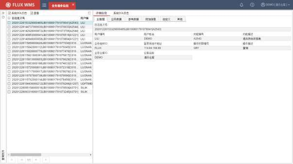

- 在“主信息”页签，可以查看到此操作的用户、对应功能、仓库等信息，以便通过相应的查询条件对日志进行过滤查询。各字段说明如下：

日志批次号－日志生成时系统自动产生的流水号，这个流水号可能涉及一个或者多个日志。如需查询详细 SQL 语句，可在系统 SQL 日志功能模块中，通过“日志批次号”字段条件进行检索，筛选出所有相关 SQL语句。

用户编号－操作员 ID。

用户姓名－用户名称。

功能编号－日志记录来源功能 ID。

功能描述－功能名称。

业务组织 ID－作业环境所属组织架构的上级组织 ID，也即登录界面的组织 ID。

登录系统 IP地址－IP 地址信息。

操作权限编号－生成日志的具体操作环节的代码，也即动作代码。

操作描述－操作节点名称。

业务仓库 ID－作业的仓库代码。

仓库名称－作业仓库名称。

<!-- 原 PDF 第 1019 页 -->

- “业务数据”页签的执行结果信息，主要为执行成功与否，时间信息与日志批号信息（日志流水号）。

- 点击展开“业务传参信息”，可显示作业时的参数传递情况，以便辅助管理判断是否参数内容有误。

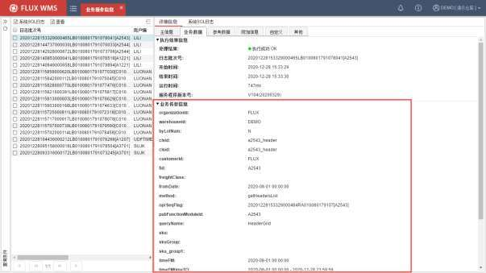

- 在“系统 SQL日志”页签，可以查看到此操作对应的后台SQL 语句详细信息：

<!-- 原 PDF 第 1020 页 -->

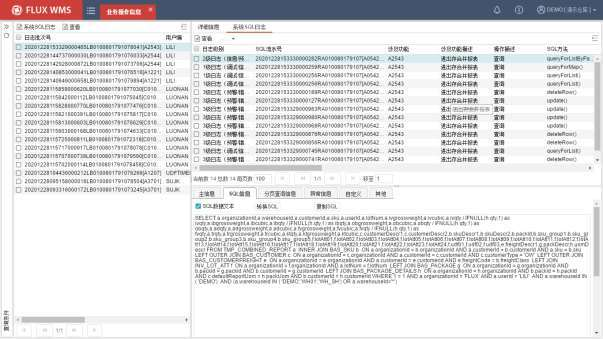

- 在“参考数据”页签，能够查看执行时间、提示信息等内容：

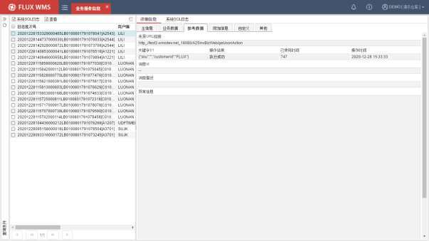

来源 URL 链接－生成日志的功能 URL 链接地址。以便了解作业时的访问情况。

关键字 01－执行作业的关键参数信息，例如单证号，操作员等。不同操作信息的关键字

<!-- 原 PDF 第 1021 页 -->

记录内容不完全相同。

操作结果－操作执行成功还是失败。

已使用时间－记录执行的 SQL 总耗时，单位为毫秒。

操作时间－操作作业执行的时间

消息 Id－执行有报错时的提示消息对应代码。

消息描述－报错信息提示消息内容。

- 如果有需要，可以通过点击鼠标右键“原始数据”功能，查看操作对应的 JSON 原始数据，如登录 JSON 数据文本、业务 JSON 数据文本、处理结果 JSON 数据文本：

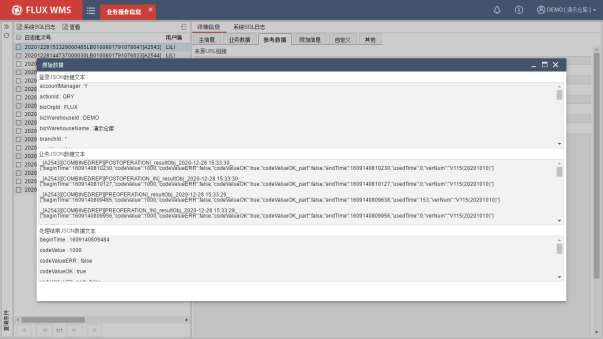

- 在”系统 SQL 日志”页签，可以查看选中的日志批次号下的 SQL 日志。也可点击左上角的“系统 SQL 日志”，跳转到【系统SQL 日志】模块查看 SQL 日志。

<!-- 原 PDF 第 1022 页 -->

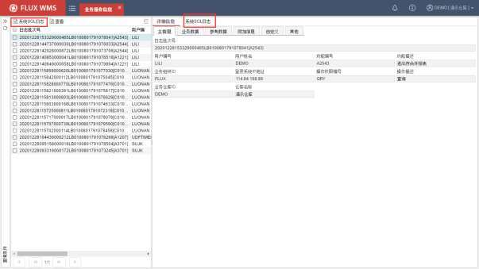

## 19.2. 系统 SQL 日志

系统 SQL日志模块，主要用于查询服务端与数据库所有交互所产生的 SQL 语句以及执行结果，包含正确结果和返回异常信息。每个与服务器交互的步骤都会将相关 SQL 日志信息写入数据库，在此功能中可以查看到作业细节的详情日志信息，作为检查故障、性能优化时的参考。

管理员可根据“日志批次号”，在“业务操作信息”功能中查询到对应的详细 JSON 请求内容。

系统日志分为如下几个级别：

- 信息：与数据库交互正常的查询类 SQL语句为信息级别。

- 警告：与数据库交互正常的 INSERT、UPDATE、DELETE 编辑类 SQL 语句为警告级别。

- 错误：与数据库交互存在异常的 SELECT、INSERT、UPDATE、DELETE 的 SQL 语句都为错误级别。

- **主信息**

- 选择主菜单“业务系统日志”下的“系统SQL日志”功能。

- 在查询条件界面，输入查询条件，查询对应SQL 日志。需要提醒的是，由于日志

<!-- 原 PDF 第 1023 页 -->

量巨大，为了避免无条件查询导致查询结果过多，“日志分类”查询条件是必输的。默认显示的“默认”分类，仅包含部分登录、报表查询日志，需要查询进出操作日志，需要选择对应的分类。查询 RF 日志时，同时要注意“子系统”条件需要改为“RF V6操作系统”。

- 在“主信息”页签，系统显示如下日志信息：

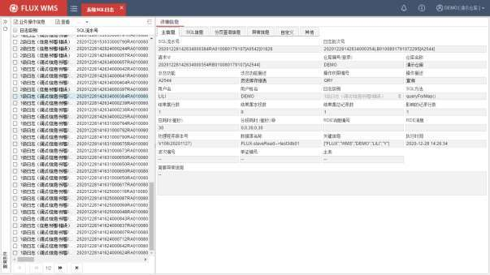

SQL流水号－SQL 语句写入数据库时，自动生成的流水号。

日志批次号－日志生成时系统自动产生的流水号，这个流水号可能涉及一个或者多个日志。如需查询详细 SQL 语句，可在系统 SQL 日志功能模块中，通过“日志批次号”字段条件进行检索，筛选出所有相关 SQL 语句。

请求 ID－浏览器向服务器发送请求时生成的 ID信息。查询方式同日志批次号。

仓库编号－作业仓库编号。

仓库名称－仓库对应名称。

涉及功能－执行此操作的功能代码。

涉及功能描述－对应功能名称。

操作权限编号－生成日志记录的、功能中的具体动作代码。

操作描述－具体操作动作描述。

<!-- 原 PDF 第 1024 页 -->

用户编号－操作人 ID。

用户姓名－操作人姓名。

日志级别－此日志记录所属的系统日志分级。例如警告级别，信息级别。

SQL方法－调用应用服务方法名称。

结果集行数－记录主 SQL 语句获取到数据行数。例如查询到 3 行记录。

结果集字段数－SQL 返回字段数。例如查询语句查询 8个字段，结果集字段数就显示为8。

结果集总记录数－记录主、分页 SQL 语句获取到数据行数。

影响的记录数－记录 SQL 影响数据总行数。例如更新语句，更新 3行数据影像记录数即显示为 3。

总耗时（毫秒）－SQL 语句总耗时，单位为毫秒。

分段耗时（毫秒）－记录分页 SQL语句总耗时，单位为毫秒。

关键信息－执行的关键信息，例如单证号，操作员等。不同操作信息的关键信息内容不完全相同。

执行时间－执行操作的时间。

简要异常信息－当 SQL语句与数据库交互存在异常时显示，方便快捷查看问题。

- 在“SQL 信息”页签，系统显示如下日志信息可查看具体执行的SQL 语句文本和登录 JSON数据文本内容：

<!-- 原 PDF 第 1025 页 -->

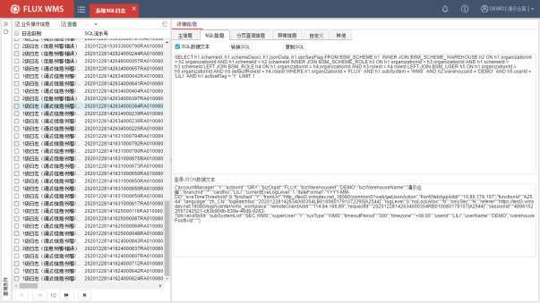

SQL 数据文本－用来控制 SQL 语句文本框是否可编辑。

转换 SQL－切换 SQL 语句的格式。SQL 语句转换前显示原始信息，与日志文件中的一样。默认显示转换成基本可读的 SQL，点击按钮后显示原始的。

复制 SQL－可将此条 SQL 语句复制，以便到数据库连接工具上执行语句。

登录 JSON 数据文本－记录本次请求指令信息中，登录 JSON 数据信息。

- 各个的列表查询处理中，通过查询主 SQL 执行后，还会执行分页统计SQL。在“分页查询信息”页签，可查看统计 SQL、分页 SQL、分页查询条件的 SQL 执行信息：

<!-- 原 PDF 第 1026 页 -->

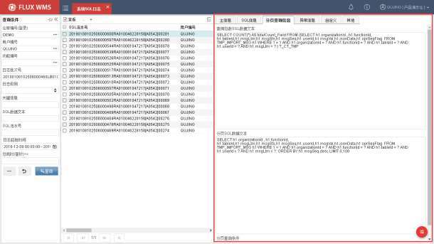

查询总数 SQL 数据文本－统计 SQL 获取总行数，用于列表显示。

分页 SQL 数据文本－用于获取单页数据集。即用于获取每页显示数据信息内容。

- 在“异常信息”页签，可查看错误级别 SQL 日志的详细异常信息，供系统管理员或开发人员分析问题：

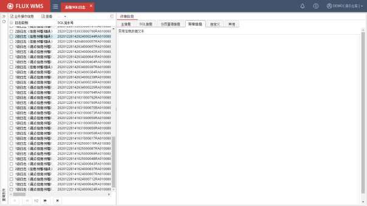

<!-- 原 PDF 第 1027 页 -->

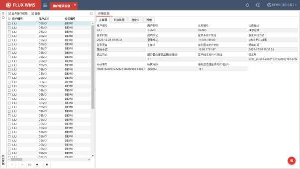

## 19.3. 用户登录信息

“用户登录信息”模块主要用于提供用户登录系统的日志记录查询，包括用户信息、登录/退出时间、访问 IP等。用户登录信息仅记录登录成功信息。

- **用户登录信息**

- 选择主菜单“业务系统日志”下的“用户登录信息”。

- 输入查询条件，在“主信息”页签，系统显示如下日志信息：

*图 19-3-1（图像未能从 PDF 对象中直接提取）*

用户编号－登录系统的用户 ID信息。

用户名称－用户编号对应的用户名称。

仓库编号－登录仓库编号。

仓库描述－登录仓库名称。

登录时间－用户登录系统的时间点。

成功标记－是否成功登录，或者是用户重复登录情况。

<!-- 原 PDF 第 1028 页 -->

登录系统 IP地址－用户登录时，客户端电脑的 IP地址记录。

登录系统方式－登录方式信息，例如通过 PC 端，浏览器登录的 WMS，显示为WMS-PC-WEB。WMS 系统的登录方式主要有 WMS 和 RF端登录。

登录语言－用户登录时选择的语言信息。

工作站－用户登录的电脑或 RF设备所配置的本地工作站信息。

服务器本地 IP地址－显示服务器本地 IP地址。

退出时间－用户退出系统的时间点。当强制关闭 IE时，此项不会录入值。

退出方式－用户退出系统的操作方式。当强制关闭 IE时，此项不会录入值。

服务器退出耗时－显示服务器处理退出操作总耗时。

客户端本地 MAC 地址－用户登录的电脑客户端本地 MAC 地址。

流水号－系统生成的登录流水号信息。

会话编号－登录时发送会话请求编号信息。

所属月份－登录时间点所属月份信息。方便按月份进行查询。

服务器处理登录耗时－登录服务器服务端总耗时。方便管理员筛选耗时较长的异常记录，进一步排查原因。

## 19.4. 登录失败信息

用户登录系统，不论成功、失败，系统都会记录对应日志。当需要查看某用户登录失败原因时，可以到“登录失败信息”功能中，查看具体登录失败原因。

- **登录失败信息**

- 选择主菜单“业务系统日志”下的“登录失败信息”。

- 输入查询条件，进行查询。在“主信息”页签，系统显示如下日志信息：

<!-- 原 PDF 第 1029 页 -->

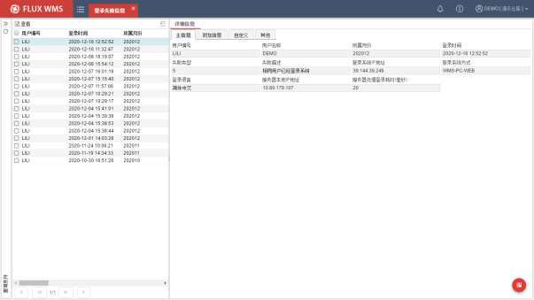

用户编号－登录系统的用户 ID信息。

用户名称－用户编号对应的用户名称。

所属月份－登录时间点所属月份信息。方便按月份进行查询。

登录时间－用户登录系统的时间点。

失败类型－失败原因分类。

失败描述－失败原因描述。

登录系统 IP地址－用户登录时，客户端电脑的 IP地址记录。

登录系统方式－登录方式信息，例如通过 PC 端，浏览器登录的 WMS，显示为WMS-PC-WEB。WMS 系统的登录方式主要有 WMS 和 RF 端登录。

登录语言－用户登录时选择的语言信息。

服务器本地 IP地址－显示服务器本地 IP地址。

服务器处理登录耗时－登录服务器服务端总耗时。方便管理员筛选耗时较长的异常记录，进一步排查原因。

服务器退出耗时－显示服务器处理退出操作总耗时。

<!-- 原 PDF 第 1030 页 -->

## 19.5. 打印汇总信息

“业务系统日志”下的“打印汇总信息”功能，主要供用户查看各作业单据的打印情况。用户可通过此日志查看单据的上一次打印时间、打印份数打印耗时、打印工作站信息以及历史打印记录信息。现场作业遇到多打、漏打等情况时，可通过“打印汇总信息”日志信息排查问题原因和定位相关责任人。

用户可根据单证编号或者单据名称等维度，来查询单据打印情况。详细单据打印配置查询打印相关模块。

- **打印汇总信息**

- 选择主菜单“业务系统日志”下的“打印汇总信息”。

- 输入查询条件，进行查询。在“详细信息”页签，系统显示如下日志信息：

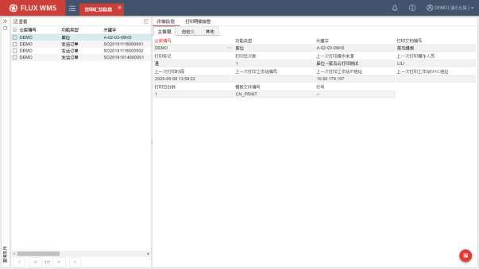

仓库编号－作业仓库编号

功能类型－打印输出的对应功能。例如库位功能。

关键字－打印输出内容的关键信息。例如库位功能的库位号，ASN 单据的 ASN 号码等。不同功能打印的关键输出信息各有不同。

打印文档编号－一个功能往往具有多种不同的打印操作，记录打印的具体功能点。

<!-- 原 PDF 第 1031 页 -->

打印标记－是否已经打印。

打印总次数－该记录总共打印次数汇总。

上一次打印操作来源－触发此打印的功能、操作节点。例如此记录是库位功能的库位标签打印触发的打印操作。

上一次打印操作人员－打印的具体操作人。

上一次打印时间－打印时间信息。

上一次打印工作站编号－打印工作站编号。如果触发打印的电脑未配置本地工作站信息，则显示为空。

上一次打印工作站 IP地址－触发打印的电脑/设备对应 IP地址信息。

上一次打印工作站 Mac 地址－触发打印的电脑/设备 Macs地址信息。

打印总份数－记录当前打印累计打印总份数。

模板文件编号－打印调用的打印模板文件。

行号－通过分模板打印情况下，分模板的行号。

- 多次打印的情况下，“详细信息”页签显示最后一次打印的相应信息。而历次打印的信息，可以在“打印明细信息”页签进行查看：

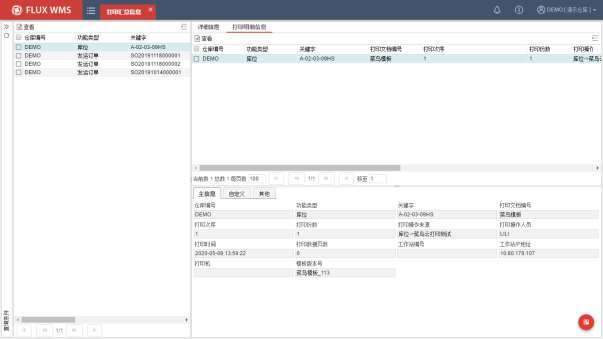

<!-- 原 PDF 第 1032 页 -->

## 19.6. 定时任务运行日志

定时器的所有定时任务，执行时会生成对应日志，系统通过“定时任务运行日志”功能，提供相关日志的查询检索。

- **定时任务运行日志**

- 选择主菜单“业务系统日志”下的“定时任务运行日志”。

- 输入查询条件，进行查询。在“详细信息”页签，系统显示如下运行时间、运行结果等日志信息：

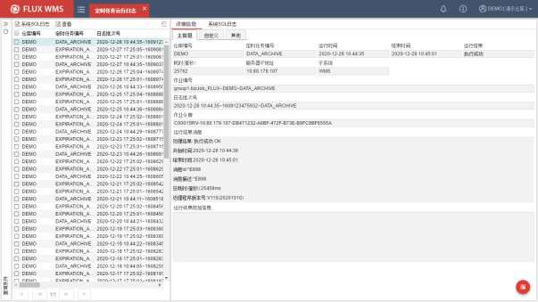

- 在“系统 SQL日志”页签，可以进一步查看定时任务运行相关的SQL 日志信息。

## 19.7. DEBUG日志

特殊情况下，一些复杂问题，仅仅通过日常的“业务操作信息”、“系统SQL日志”等日志信息，难以确认问题原因，因此系统为管理员提供了更为复杂的调试模式，可以得到更加详尽的DEBUG调试日志。

<!-- 原 PDF 第 1033 页 -->

需要注意的是，调试模式由于需要输出详尽日志，对系统性能会造成一定影响，根据需要，谨慎开启，及时退出调试模式。

调试模式开启后，系统仅保留 10分钟的调试操作记录，因此需要及时查看调试日志。

- **调试模式开启**

为了避免开启调试模式后遗忘，目前采用的模式是，进入【用户管理】功能，在用户姓名后面加上文本 DEBUG-BIZ-VAR-SQL，此用户再次登录系统后即为开启了调试模式。

删除用户姓名的 DEBUG-BIZ-VAR-SQL，重新登录即关闭调试模式。

- **调试日志查询**

- 选择主菜单“业务系统日志”下的“ DEBUG 日志”。

- 输入用户名，选择操作类型，然后点击【查询】按钮，系统输出详细调试日志：

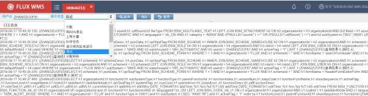

- 对于查询到的日志信息，可以通过【复制】按钮，复制后粘贴到其他文档或者在数据库工具中，以便进一步分析检查。

## 19.8. 数据更新日志

医疗相关行业（例如药品、医疗器械），对于操作全程信息跟踪，有更高的管理要求，GSP（《药品经营质量管理规范》）对关键信息的修改也有明确的跟踪管理要求，系统提供了详细的跟踪日志功能，能够查询修改操作的前后内容。但相应的日志保存会需要更多的存储空间，由现场根据管理需要决定是否开启。

- **相关配置**

- 参数开启

如需启用数据更新日志，需要先在【业务系统配置】-【系统配置参数】功能中，查询到

<!-- 原 PDF 第 1034 页 -->

DATA_UPDATE_LOG 参数（系统数据更新日志），并将参数值配置为 Y（是）。

其他用户所做的参数修改，当前用户在重新登录，或者重置缓存，或者等待 2分钟后重新打开功能界面情况下可以获取生效；如果是当前用户修改参数，保存时系统会提示参数刷新。

- 日志配置

系统在多个功能中都提供更新日志记录，但现场不一定全部需要进行跟踪管理。可以在【业务系统管理】-【业务功能】中，通过勾选“数据更新记录日志标记”选项，来配置哪些功能需要进行更新日志跟踪：

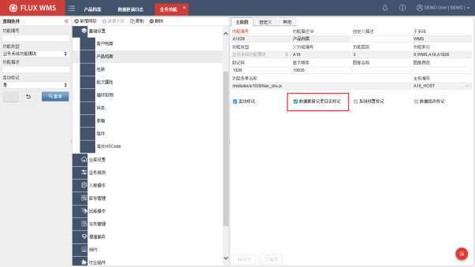

- **日志查询**

- 选择主菜单“业务系统日志”下的“数据更新日志”功能。

- 录入查询条件，查询显示，谁在什么时间，做了哪个功能、什么数据的内容修改：

<!-- 原 PDF 第 1035 页 -->

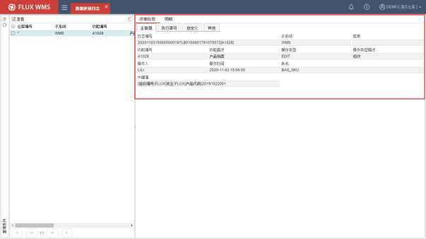

- “执行语句”页签，显示对应的数据库更新语句，以便进一步确认修改细节：

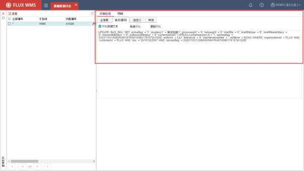

<!-- 原 PDF 第 1036 页 -->

## 19.9. 用户权限变更

与【数据更新日志】功能类似，都是基于 GSP 管理要求的详细作业跟踪日志，用于记录用户授权信息的变化情况。

使用前，同样需要开启 DATA_UPDATE_LOG 参数。即在【业务系统配置】-【系统配置参数】功能中，将 DATA_UPDATE_LOG 参数（系统数据更新日志）对应参数值配置为 Y（是）。

- **日志查询**

- 选择主菜单“业务系统日志”下的“用户权限变更”。

- 录入查询条件，查询显示，谁在什么时间，为哪个用户，做了哪个功能的权限变更，增加权限还是减少权限：

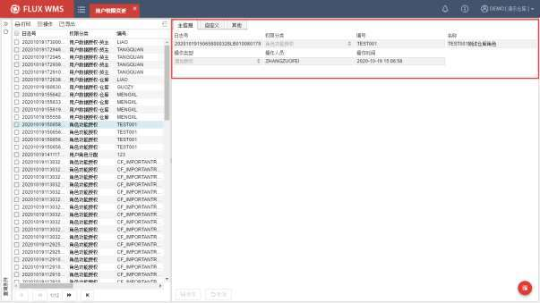

## 19.10. 二次审核日志

部分业务场景，对于一些特定类型的操作，为了规避风险，需要本次对操作进行二次确认，或者需要更高权限的人员审批后才可以执行后续操作。医药行业的双人复核、电子签名都属于此类二次审核。

根据医药管理的要求，二次审核操作的过程信息需要能够进行单独查看。因此系统提供了独立

<!-- 原 PDF 第 1037 页 -->

的二次审核日志查询功能。

- **日志查询**

- 选择主菜单“业务系统日志”下的“二次审核日志”。

- 录入查询条件，查询显示，谁在什么时间，做了哪个操作的二次审核：

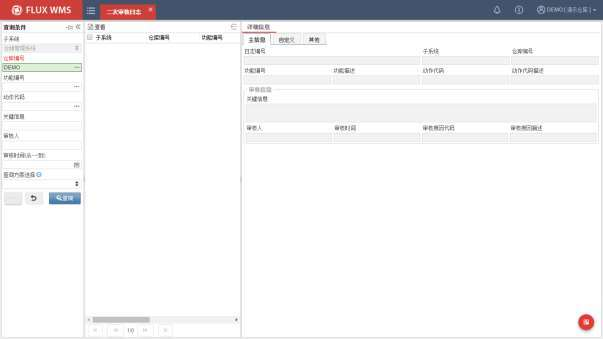
