# 20. 二次开发管理

> 来源文件：`富勒WMSV6.2（最全版1119页）.pdf`；原 PDF 第 1038-1108 页。

> 本文件按原 PDF 正文中的顶层章节拆分；每页保留原 PDF 页码注释，图示按原图注顺序引用。

<!-- 原 PDF 第 1038 页 -->

仓库现场操作过程中，除了会根据需要配置流程管控、界面字段显示等控制，也会配置作业所需的单据、报表，或者进一步配置独立的个性化功能。

这些配置内容，集中在“二次开发管理”模块，供现场进行配置使用。

## 20.1. 配置自定义报表

报表是仓库管理过程中，不可缺少的功能。系统提供一些标准报表供仓库使用，更多的报表需求，可以通过自定义报表配置实现。

看板作为一种特殊展示模式的报表，也同样可以通过配置实现。

报表、看板配置时，需要先在【二次开发管理】模块中的【配置自定义报表】功能里进行注册，生成记录。然后对报表样式、内容进行配置，再经过功能授权，用户可以在【报表】模块，【个性化报表】菜单中看到具有权限的个性化报表。

所配置的看板则是在【看板】模块的【个性化看板】菜单中展示。

系统提供的报表显示内容配置，即可以做简单的列表模式查询结果显示，也可以配置成各类饼图、折线图，或者组合展示模式等复杂样式，通过【报表设计器】可以对各种复杂的报表、看板样式进行快捷的配置。

### 20.1.1. 自定义报表创建

- **主信息创建**

- 选择主菜单“二次开发管理”下的“配置自定义报表”。

- 在“主信息”页签，系统显示如下信息：

<!-- 原 PDF 第 1039 页 -->

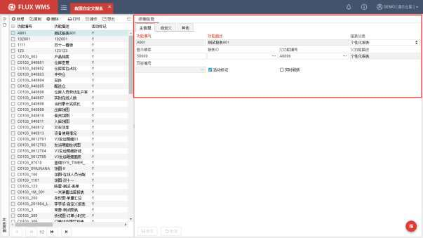

功能编号－报表的 ID，由用户根据需要指定，不可重复。

功能描述－报表的名称描述。

报表分类－所配置的报表记录，用户触发操作的位置配置。例如将作为报表使用，还是作为看板使用。并可以选择加载在标准子菜单中，还是个性化子菜单中。还可以选择加载在功能的右键菜单中，或者查询页签上。

显示顺序－在子菜单（例如“个性化报表”子菜单）中的显示顺序设置。

报表 ID－用于选择报表样式，也即报表所用的、通过【报表设计器】编辑的报表样式模板名称。选择不同的模板，即决定了报表的样式。点击浏览按钮，可以显示已维护的报表样式 ID。

父功能编号－报表挂载的对应功能 ID。新增报表，默认作为个性化报表，挂载在【报表】模块【个性化报表】子菜单中。如果“报表分类”是“右键加载”或者“查询页签加载”就需要指定报表加载在哪个功能基础上作为自定义报表使用。

父功能描述－父功能的名称描述。

页签编号－当“报表分类”选择为“右键加载”情况下，由于功能通常有多个页签，不同页签右键菜单显示项目不同，因此需要选择具体加载在功能的哪个页签中。点击浏览按钮，系统会根据“父功能”显示功能所具有的页签供选择。

<!-- 原 PDF 第 1040 页 -->

活动标记－是否启用此报表。

实时刷新－通常用于看板展示情况下，通过报表服务器触发看板展示数据的定时刷新，或者通过接口写入数据同时调用看板显示刷新。在报表服务器上还可以进一步配置指定工作台的看板刷新。

- **导入创建**

其他环境中，已配置的报表，可以通过右键导出配置、导入配置，迁移到当前环境，添加为新的自定义报表：

- 在其他环境，查询已配置的自定义报表记录，选择鼠标右键功能“导出配置”：

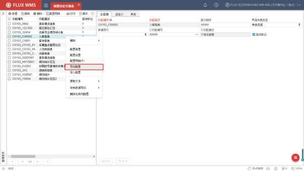

- 根据所在浏览器环境不同，系统显示不同的文件保存对话框，下载保存导出文件：

<!-- 原 PDF 第 1041 页 -->

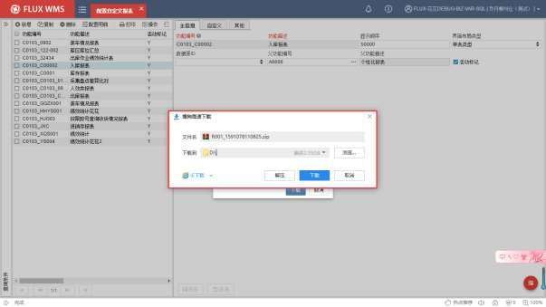

- 回到目标环境，选择右键功能【导入配置】：

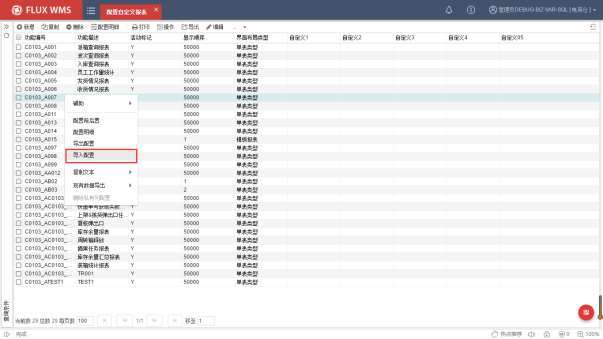

- 在弹出的导入对话框中，选择从其他环境导出得到的压缩包文件，并指定新增报表的功能编号、名称：

<!-- 原 PDF 第 1042 页 -->

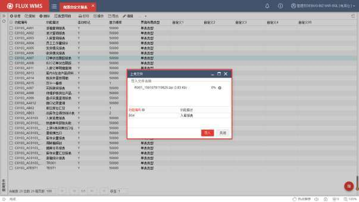

- 如果不需要调整脚本语句，后续为用户授权即可使用。授权操作请参考【20.1.3】章节的介绍

- **功能报表**

如果将模板的父功能编号改为具体操作功能，则意味着将个性化报表挂载到具体功能的查询界面：

- 在“配置自定义报表”功能中，添加记录时，报表记录所属的“父功能编号”，通过浏览按钮，选择为具体功能，例如“库位”：

<!-- 原 PDF 第 1043 页 -->

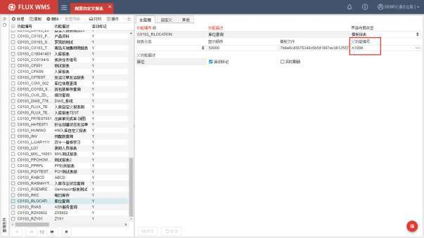

- 在对应功能的查询界面，可见独立的报表查询按钮，如下图所示：

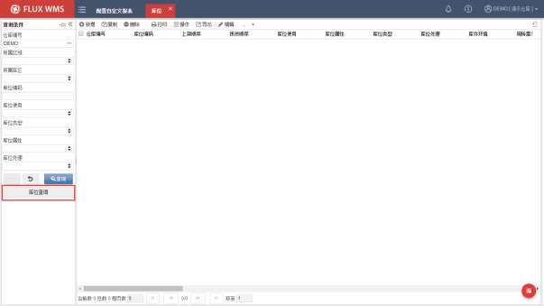

<!-- 原 PDF 第 1044 页 -->

### 20.1.2. 报表模板配置

报表模板的配置，需要应用到【报表设计器】，进行内容、样式配置。

- **数据源配置**

配置新环境的报表，需要先配置所访问的数据源。对于已有数据源配置的环境，新报表可跳过此步骤。

- 选择主菜单“二次开发管理”下的“报表设计器”。

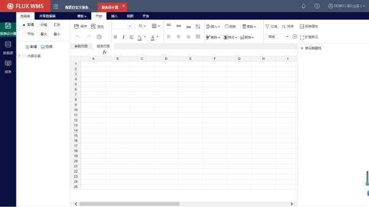

- 选择左侧菜单的“数据源”，能够查看到已配置的数据源信息。

<!-- 原 PDF 第 1045 页 -->

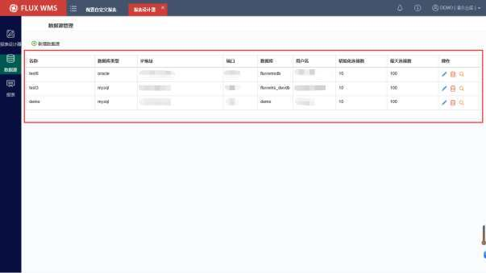

- 如果需要添加报表的环境，之前没有配置过报表数据源，则点击【新增数据源】，系统显示如下配置界面：

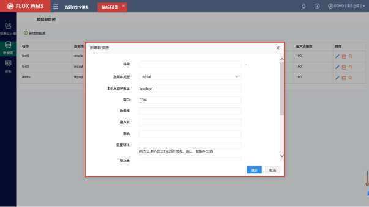

- 输入数据库访问信息（具体信息请数据库管理员提供），点击【确定】按钮，添加

<!-- 原 PDF 第 1046 页 -->

数据源。

- **数据集配置**

报表数据集，即报表数据的查询语句配置。

- 在“报表设计器”界面，“数据集”页签，点击【新增】按钮，开始新报表模板的配置：

- 在如下弹出界面，选择数据集模式，报表常用为“SQL 查询”：

<!-- 原 PDF 第 1047 页 -->

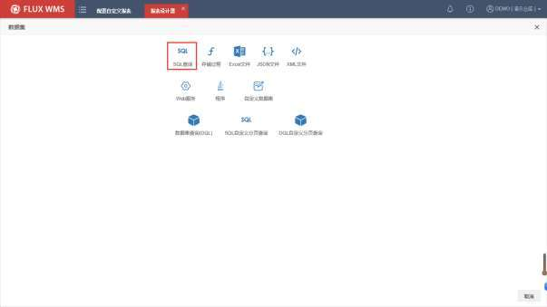

- 点击后，在如下界面配置报表查询语句：

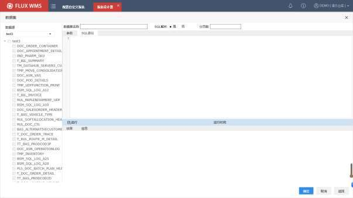

- 数据源

通过界面左部的“数据源”下拉列表，选择报表访问的数据库，即信息源。

<!-- 原 PDF 第 1048 页 -->

下拉列表内容为“数据源”页签中配置过的可访问数据源。

点击相应下拉列表，可显示此数据库中的表名，点击表名能够快捷显示 SQL 语句。

- 数据集名称

数据集名称，即报表的模板名称。

- SQL 解析

SQL 解析，可以简化带参数的 sql 语句，如 select * from rpt_value where name=':arg', arg为参数名称与参数页面的组件名称相对应，当参数页面不输入 arg值即arg为空，sql 解析会智能生成可执行的 sql语句如：select * from rpt_value where 1=1。

智能解析 SQL 语句并不能保证解析 sql正确性，如果保存 sql出现错误，建议 SQL 解析选择否。

- 分页数

分页数为 0时表示不使用分页查询，当分页数大于 0时，SQL 语句在查询时会自动增加 SQL 分页片段，不需要在 SQL 检索中写分页查询 SQL，当填写分页数如 2，程序会智能依据不同数据库添加 sql分页片段，如 mysql：select * from rpt_value limit 0, 2

- SQL 语句

在“SQL 语句”部分，输入报表查询语句。

点击【运行】按钮，可以查看语句查询结果情况。

<!-- 原 PDF 第 1049 页 -->

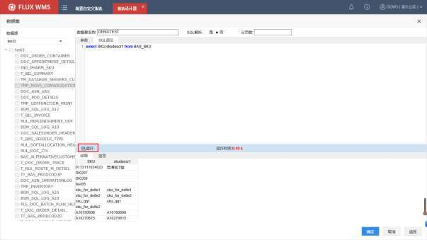

点击【确定】按钮，完成数据集配置。

- **查询界面配置**

数据集配置后，返回到报表页面配置（如下图），界面左侧会显示数据集中查询的字段。

在“参数页面”字段部分可以输入查询字段名，并拖曳编辑框、查询按钮等控件到界面区域。

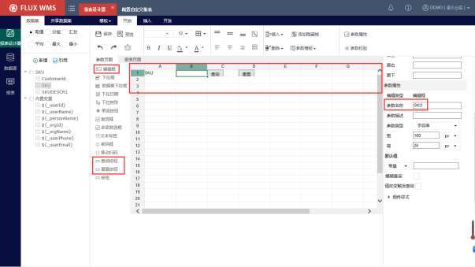

<!-- 原 PDF 第 1050 页 -->

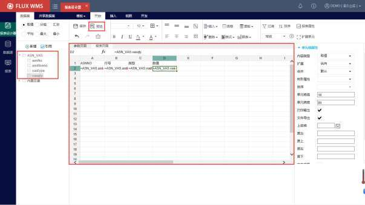

针对查询字段，编辑框的单元格属性中，进行参数名称的维护。

并且在查询语句中，Where 条件部分增加固定表达： <if test='参数名称!= null'> and 表名.字段名=':参数名称'</if>。

此模式下不能使用 SQL 解析。

- **报表页面配置**

在“报表页面”部分，首行字段双击后，输入报表中希望显示的列名称；然后从左侧拖曳对应查询字段，到第二行，系统会自动进行填充：

*图 20-1-16（图像未能从 PDF 对象中直接提取）*

可以直接拖动调整列宽等，类似 Excel报表调整，可以通过右侧“单元格属性”部分进行调整。针对报表属性、字段属性等，可以根据需要进一步配置。例如报表横向纵向，字段显示位数等。

配置后点击【预览】按钮，能够查看报表效果：

<!-- 原 PDF 第 1051 页 -->

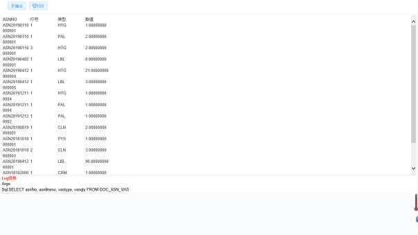

点击【保存】按钮，输入报表名称，并选择保存目录。

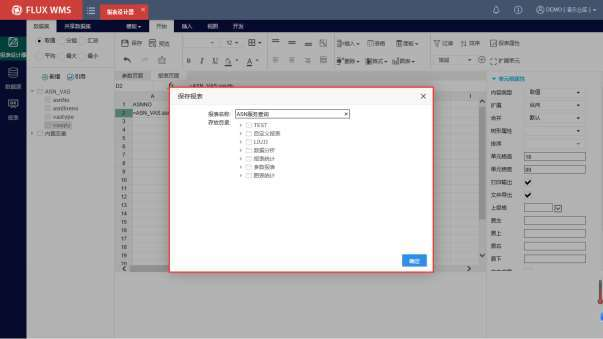

如上为报表模板的简单介绍，可以进一步插入图表、应用背景图片等，如需了解报表设计器功能的更多细节，请向 FLUX 顾问获取专项说明文档。

<!-- 原 PDF 第 1052 页 -->

- **已配置模板修改**

对于已经配置、保存的模板数据集，需要修改时，可以通过“模板”菜单的“引用模板”功能项，在弹出窗口中，选择已保存的报表模板：

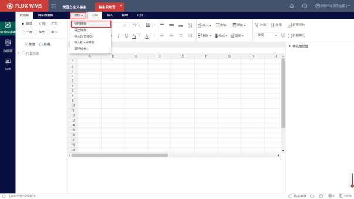

<!-- 原 PDF 第 1053 页 -->

所选模板数据集加载到界面后，可以通过名称后的笔形编辑按钮，进入到数据集编辑界面：

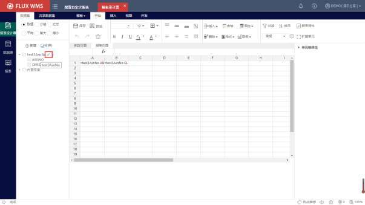

<!-- 原 PDF 第 1054 页 -->

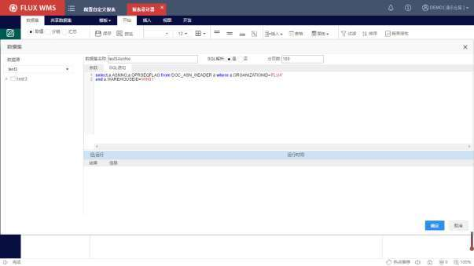

- **已配置模板导出**

已配置的报表模板，如果希望导出到其他环境使用，也可以单独导出模板文件。

先通过“模板”菜单的“引用模板”功能项，选择已维护的报表模板：

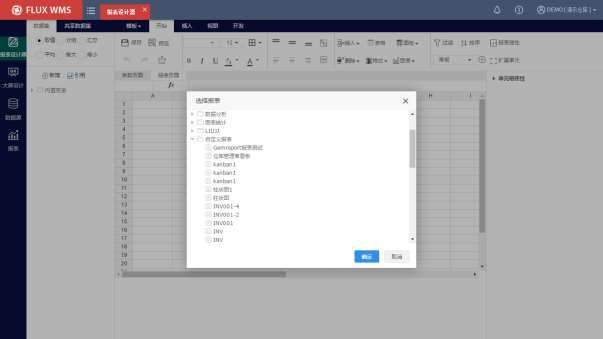

<!-- 原 PDF 第 1055 页 -->

模板加载成功后，通过报表设计器的“模板”下拉菜单中，选择“导出模板”功能：

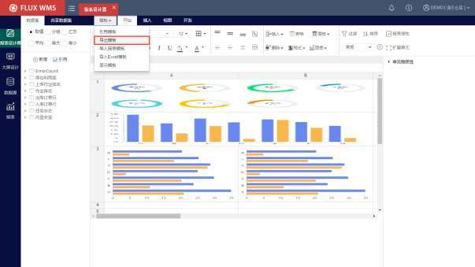

系统相应显示保存对话框（对话框样式，与所用浏览器有关，可能会与截图不同），确认后生成模板导出文件：

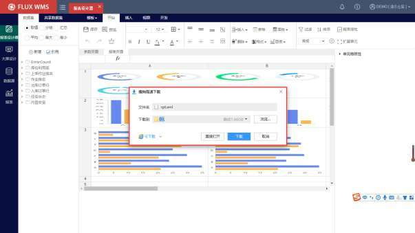

<!-- 原 PDF 第 1056 页 -->

在新环境中，通过“模板”下拉菜单的“导入报表模板”功能，选择文件，可以加载相应报表模板。

### 20.1.3. 报表模板应用

报表模板配置后，需要到【配置自定义报表】功能中关联此模板。

- **模板关联**

在【二次开发管理】模块的【配置自定义报表】功能中，选择已添加的报表记录，在“报表 ID”字段，点击浏览按钮，选择所设计的报表模板，【确认】后，保存设置。

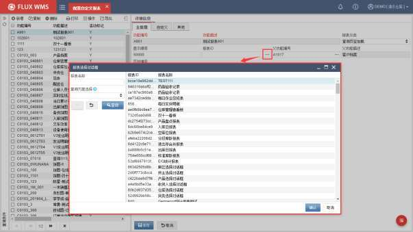

- **登录访问**

在“报表”界面，如果勾选“登录访问”，则此报表只能在登录 FLUX 系统（包括 WMS、TMS、OCP等）后才能访问。

但如果未勾选，则支持外部网页访问，可作为访客可见报表，提供链接给其他的上级领导、外部供应商、货主等查看。

- **报表授权**

- 对于系统内的报表，后续到【业务系统管理】 -【角色授权】功能中，为需要使用此报表的角色进行功能授权。

<!-- 原 PDF 第 1057 页 -->

### 20.1.4. 自定义报表授权

自定义报表配置完成后，需要针对角色配置相应的功能权限才能使用该表报，具体操作流程如下：

- 选择主菜单“业务系统管理”下的“角色授权”。

- 当前角色下在”报表”下，配置自定义报表权限。详见角色授权章节内容。

- 配置成功后，需要重新登录操作系统。

- 在主菜单“报表”下，即可查看和使用新增自定义报表。

### 20.1.5. 自定义报表配置实例

- **新增功能记录**

- 选择主菜单“二次开发管理”下的“配置自定义报表”。

- 点击【新增】按钮，添加如下信息：

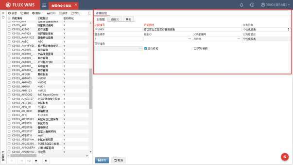

功能编号－INV095。

功能描述－库区库位汇总库存查询报表。

报表分类－个性化报表。

<!-- 原 PDF 第 1058 页 -->

显示顺序－1。

报表 ID－尚未配置，跳过。

父功能编号－根据“报表分类”，默认为 A6606，个性化报表。

父功能描述－个性化报表。

活动标记－默认激活。

实时刷新－默认不选择。

- 点击【保存】按钮，保存记录。

- **配置模板**

- 选择主菜单“二次开发管理”下的“报表设计器”。

- 为报表模板配置可访问的数据源。点击左侧菜单的“数据源”项目，通过“新增数据源”添加数据库访问信息（如果已配置，可以跳过此步骤.具体数据库连接信息，如 IP等，请向 IT管理员获取）

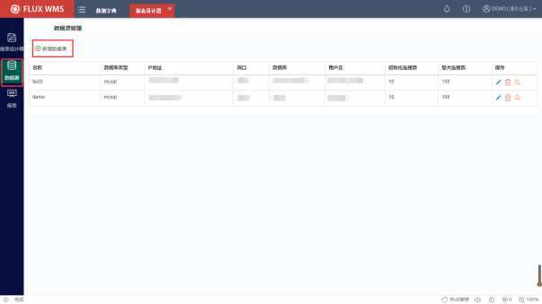

- 通过左侧菜单，切换到“报表设计器”的设计界面，点击【新增】按钮，新建模板：

<!-- 原 PDF 第 1059 页 -->

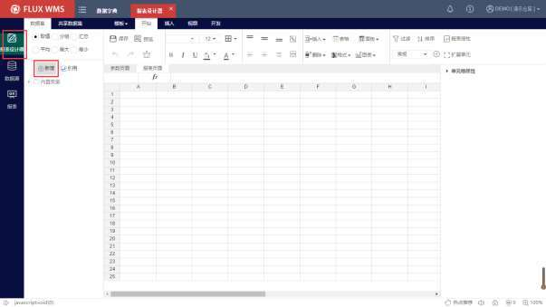

- 系统弹出如下数据集模式选择界面，报表通常数据集为 SQL 查询模式：

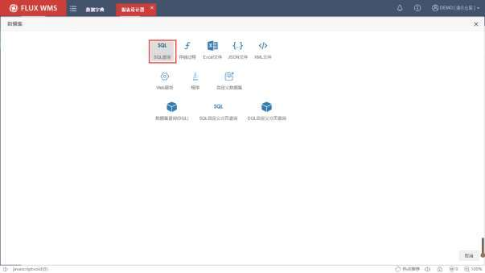

- 在数据集的“数据源”字段，下拉可见之前配置的数据源信息，选择需要访问的数据源：

<!-- 原 PDF 第 1060 页 -->

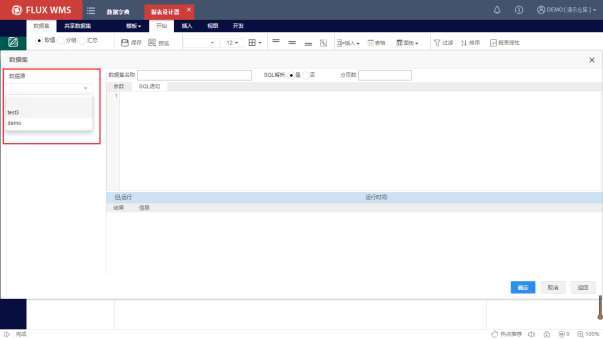

- 在“数据集名称”字段为查询进行命名；在“SQL 语句”部分，录入查询语句；点击【运行】按钮能够查看到查询结果，以便验证 SQL 语句的正确性：

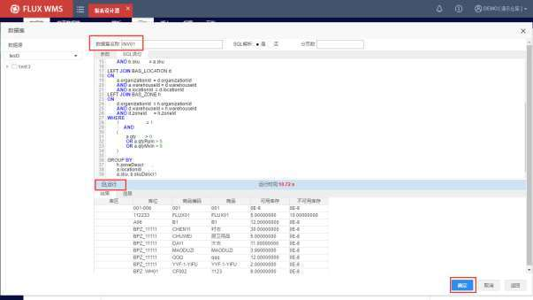

- 点击【确定】按钮后，回到报表设计器界面，进行字段维护：

<!-- 原 PDF 第 1061 页 -->

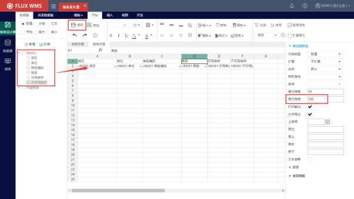

- 在“报表页面”首行，双击录入列头字段名信息，再从左侧可选字段，即查询语句中查询到的字段，通过拖曳到“报表页面”所需位置进行布局调整。每列的列宽在右侧的“单元格属性”部分进行设置。可通过预览按钮，查看效果。

- 设置完成，点击【保存】按钮，系统显示如下界面：

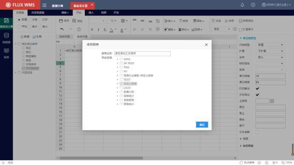

<!-- 原 PDF 第 1062 页 -->

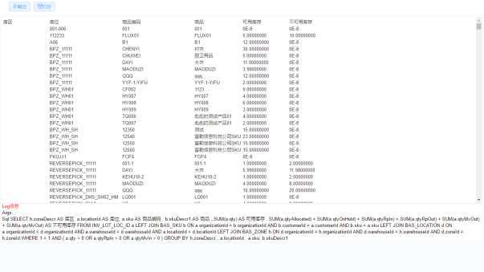

- 根据需要，选择存放的目录，以及报表名称，点击【确定】按钮执行保存。

- 点击【预览】按钮，可以预览查看报表效果：

*图 20-1-36（图像未能从 PDF 对象中直接提取）*

- **查询条件设置**

- 返回“报表设计器”界面，从数据集名称右侧的编辑按钮，重新进入 SQL 语句编辑界面：

<!-- 原 PDF 第 1063 页 -->

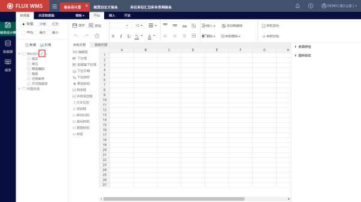

- 将“SQL 解析”改为“否”，分页数配置为“100”；WHERE 条件部分，添加条件语句： <if test='zoneDescr!= null'> and h.zoneDescr=':zoneDescr'</if>

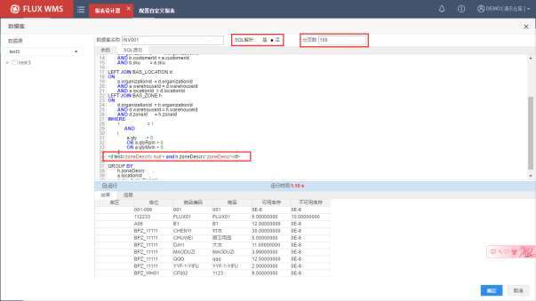

- 【确定】后，返回到报表设计界面。选择“参数页面”。在首字段，录入字段名称，

<!-- 原 PDF 第 1064 页 -->

然后拖曳一个编辑框，为其配置参数名称“zoneDescr”。拖曳【查询】按钮、【重置】按钮到界面

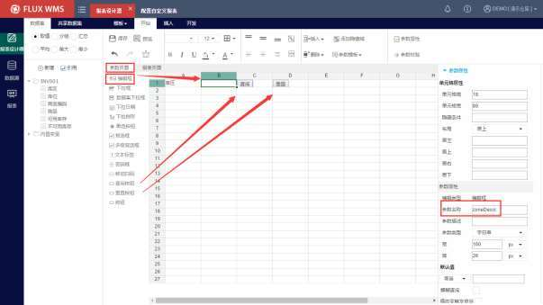

- **模板关联**

- 返回到“配置自定义报表”功能，查询对应报表记录INV095，点击“报表ID”字段的浏览按钮，在二级窗口中，选择已编辑的报表模板，并确认、保存。

<!-- 原 PDF 第 1065 页 -->

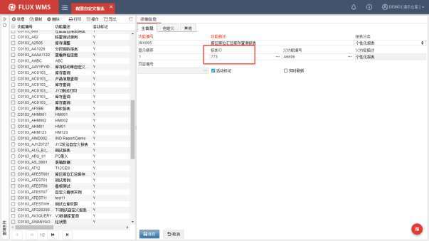

- **报表授权**

- 到“角色授权”中，为需要操作的角色，勾选个性化报表下的“库区库位汇总库存查询报表”功能，并保存。

- **报表查询**

- 到“报表”-“个性化报表”菜单下，选择“库区库位汇总库存查询报表”，可见查询结果。

<!-- 原 PDF 第 1066 页 -->

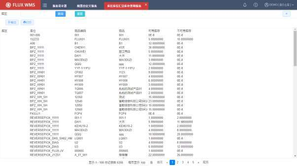

- 输入查询条件，则仅显示对应记录：

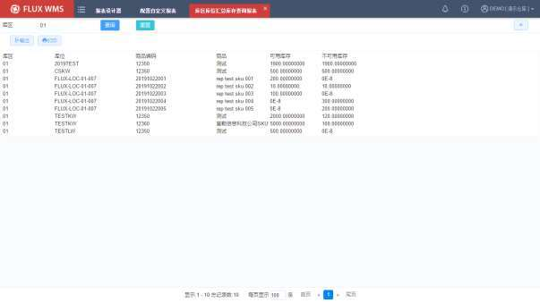

<!-- 原 PDF 第 1067 页 -->

### 20.1.6. 自定义看板配置实例

- **新增功能记录**

- 选择主菜单“二次开发管理”下的“配置自定义报表”。

- 点击【新增】按钮，添加如下信息：

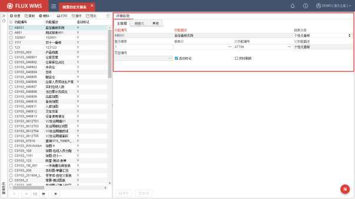

功能编号－KB031。

功能描述－自定义看板实例。

报表分类－个性化看板。

显示顺序－1。

模板文件－尚未配置，跳过。

父功能编号－根据“报表分类”，默认为 A7706，个性化看板。

父功能描述－个性化看板。

活动标记－默认激活。

实时刷新－默认不选择。

- 点击【保存】按钮，保存记录。

<!-- 原 PDF 第 1068 页 -->

- **配置模板**

- 选择主菜单“二次开发管理”下的“报表设计器”。

- 为报表模板配置可访问的数据源（已配置可跳过，具体可参考【20.1.5自定义报表配置实例】中的数据源配置）。

- 在“报表设计器”中，点击【新增】按钮，新建模板，选择“SQL 查询”模式的数据集，维护查询语句，如下图所示：

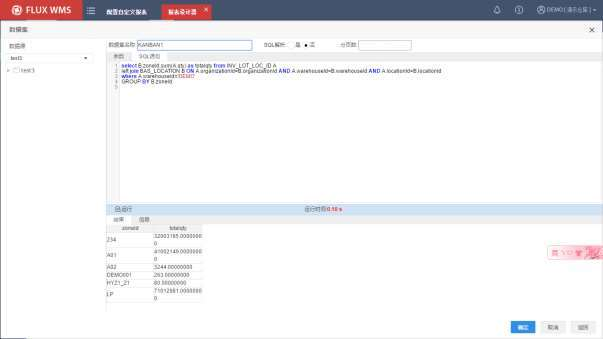

- 在报表页面，选择合适位置的单元格，合并单元格，规划看板区域：

<!-- 原 PDF 第 1069 页 -->

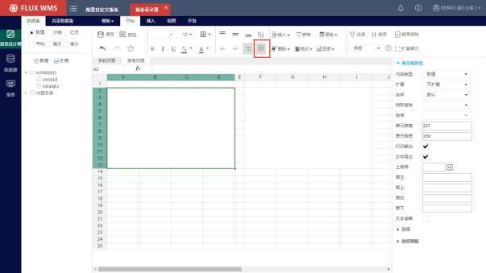

- 光标定位在第一个合并的单元格，点击表格按钮，弹出“表格”页签，在页签中配置表格元素，输入列名，拖曳查询字段，并配置单元格框线：

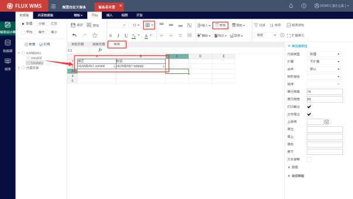

- 预览效果如下：

<!-- 原 PDF 第 1070 页 -->

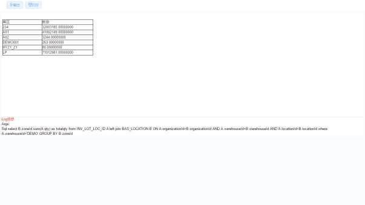

- 在“报表页面”，光标定位在第二个合并单元格，点击图表按钮：

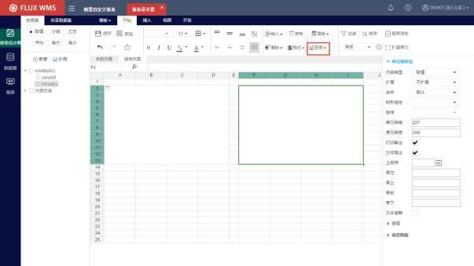

- 在弹出窗口，选择图表模式，并点击【确定】按钮：

<!-- 原 PDF 第 1071 页 -->

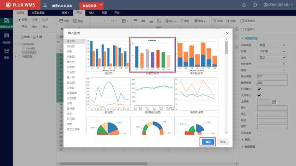

- 报表页签，显示如下表格、图表模式，双击图表，进一步配置图表显示：

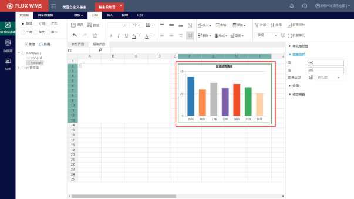

- 在弹出的“图表设置”对话框，点击数据源图标，选择图表坐标轴的数据列，并点击【+】按钮，添加系列名、系列数据值信息：

<!-- 原 PDF 第 1072 页 -->

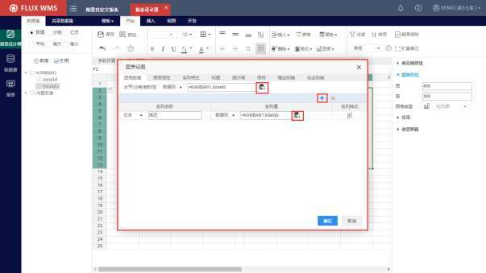

- 配置后预览效果如下：

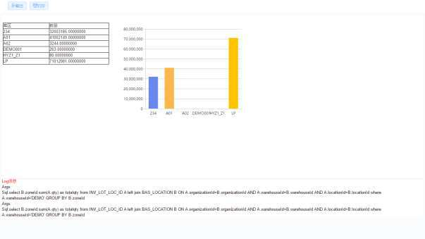

- 回到报表设计器界面，选择“插入”页签，点击选择“背景图”的“报表背景图”选择项：

<!-- 原 PDF 第 1073 页 -->

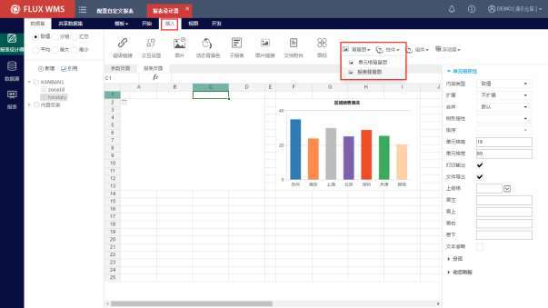

- 在弹出的背景图选择对话框中，选择已准备的背景图片，并配置为“拉伸”模式：

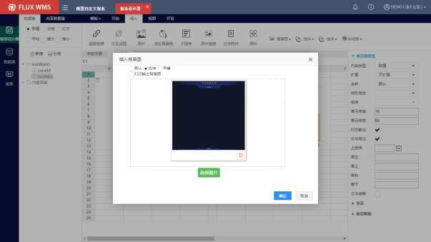

- 回到“报表页面”可见背景图加载效果。由于背景图是深色，需要将字体、框线等改为浅色。点击表格部分，通过显示的“编辑表格”选项，进入表格页面：

<!-- 原 PDF 第 1074 页 -->

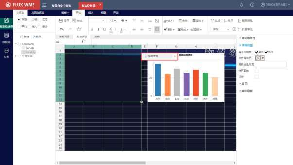

- 拖动单元格宽度到合适位置，修改字体大小、居中效果、字体颜色。单元格框线配置粗细、颜色效果：

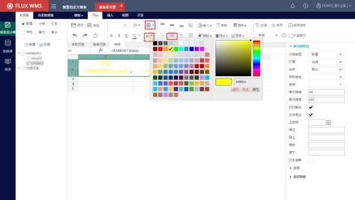

- 针对图表，双击后在“图表设置”对话框的“纵坐标轴”、“横坐标轴”页签，修

<!-- 原 PDF 第 1075 页 -->

改颜色、样式：

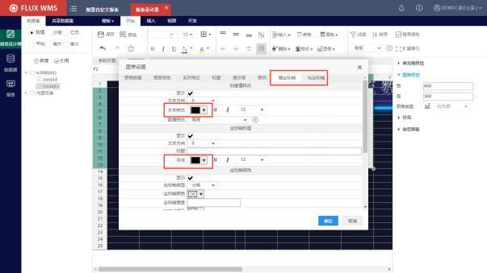

- 颜色修改后效果预览如下：

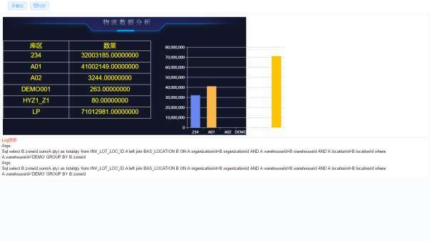

- 回到报表页面，点击【报表属性】按钮，在对话框中，去除工具栏勾选，可以隐藏

<!-- 原 PDF 第 1076 页 -->

打印输出按钮；勾选横向、纵向的等比例缩放选项，以便背景图片相应缩放：

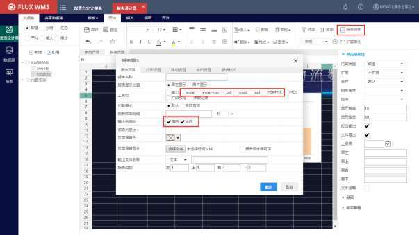

- 预览如下：

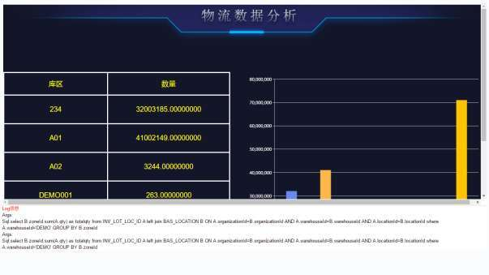

- 保存报表。

<!-- 原 PDF 第 1077 页 -->

- **关联报表**

- 到“配置自定义报表”功能中，在“报表ID”字段，通过浏览按钮，选择已保存的模板 ID，并确认保存。

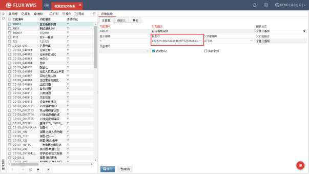

- **看板授权**

- 到“角色授权”功能中，为使用此功能的角色添加这个看板的对应功能项：

<!-- 原 PDF 第 1078 页 -->

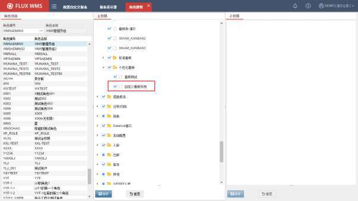

- **看板查看**

- 到“看板”模块，“个性化看板”子菜单，点击打开“自定义看板实例”功能，显示界面如下：

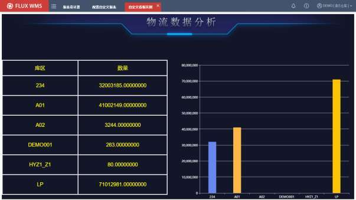

<!-- 原 PDF 第 1079 页 -->

## 20.2. 配置自定义功能

“二次开发管理”下的“配置自定义功能”功能，主要向客户提供个性化功能配置支持，可以根据现场管理需要，配置得到与系统标准功能展示模式类似的、独立表单界面的个性化操作功能，而不仅仅是基于标准功能的扩展操作、自定义操作。

配置一个独立功能时，需要先对自定义功能进行注册、配置界面元素等，然后再配置功能具体执行的逻辑。

为方便比较简单的业务模式中，可以快速配置个性化功能，对于执行逻辑配置，系统提供了标准配置模式，和简化配置模式两种不同配置模式。

配置后得到的自定义功能，同标准功能一样，通过【角色授权】功能，进行功能权限管理。

此功能无标准参数关联。

### 20.2.1. 自定义功能创建

配置自定义功能，首先需要创建自定义功能记录，即功能注册。

- **记录创建**

- 选择主菜单“二次开发管理”下的“配置自定义功能”。

- 在左侧的查询条件栏位，输入查询条件，可以查询到已有的自定义功能记录，进行对应的配置修改。也可以通过点击【新增】按钮，添加一个新的自定义功能。

- 在“主信息”页签，系统显示如下信息：

<!-- 原 PDF 第 1080 页 -->

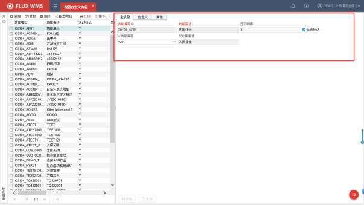

功能编号－个性化功能的代码，可由用户进行设置，长度不超过 13 位。保存时系统会自动添加自定义功能前缀 C0104_A（根据用户登录的子系统不同，默认前缀会有所不同，例如 WMS 是 C0104_A，而 TMS系统中默认前缀是 C0104_T）。后续配置执行逻辑时，在其他配置界面选择的功能编号，即此字段配置的内容。

功能描述－个性化功能对应名称描述。功能发布后，在系统界面功能名称将显示为此字段配置的内容。

需要说明的是，配置得到的自定义功能，不支持多语言自动切换，描述信息仅显示当前语言下维护内容，切换为其他语言后，仍旧显示为原本维护的描述信息。例如描述维护的中文“测试功能”，切换为英文版本登录后，仍旧显示为中文的功能名称“测试功能”。如果有多语言用户，建议配置为不同的功能编号，分别维护不同语言的功能描述。后台调用逻辑可以相同（例如调用相同 SP）。

显示顺序－个性化功能在菜单中的显示顺序。将自定义功能加入到标准功能菜单，系统会比较标准功能的显示顺序与自定义功能显示顺序进行排序显示，而标准功能的默认显示顺序，并不是 0,1,2,3，而是“10034”这样的。可以在【业务系统管理】-【业务功能】中查看到具体显示顺序信息，相应进行配置。多个功能显示顺序相同的情况下，按功能 ID顺序显示。

活动标记－是否启用此功能。

父功能编号－该自定义功能，会加载在哪个主菜单模块中。例如入库操作，还是出库操作模块。如果新增记录时，未做指定，则系统默认为加载到【自定义功能】模块中进行显示。

<!-- 原 PDF 第 1081 页 -->

父功能描述－主菜单模块对应显示名称。

### 20.2.2. 标准配置模式

对于自定义功能的具体执行处理，系统提供标准配置模式，和简化配置模式，通过鼠标右键菜单，可以进入到配置界面。但同一个自定功能，不能同时进行两种模式的配置。选择某一模式进行配置后，此自定义功能记录的右键菜单中，另一个配置模式的选择项将变灰，不可选择。

仅对于尚未开始做配置的记录，2 个右键功能同时可操作。

标准配置，用来配置普通表单界面，可以支持到一层结构、二层结构、单证结构的表单，通常从零开始逐一进行配置。

- **标准配置**

在自定义功能中，针对待配置的记录，通过工具栏点击【配置明细】或者如下图，在鼠标右键菜单选择“配置明细”选项，可配置自定义功能后台逻辑、筛选逻辑、数据展示等效果。

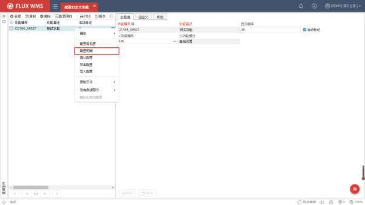

选择“标准配置”后，系统显示如下操作界面：

<!-- 原 PDF 第 1082 页 -->

- 结构选择

不同管理目标，所需要的功能界面展示模式不同，后续配置也会相应有所不同。因此配置的第一步，是选择功能结构模式。

- 一层结构

功能为查询界面、记录列表、详细信息（可以是多个页签）的展示模式。例如标准功能，库位（位于“仓库设置”模块中）就是一层结构的展示模式。

- 二层结构

功能为查询界面、记录列表、详细信息、明细的展示模式。例如标准功能，上架规则（位 于“业务规则”模块中）就是两层结构的展示模式。

- 单证结构

功能为查询界面、记录列表、头信息、明细信息的展示模式。例如标准功能，发运订单（位于“出库操作”模块中）的展示模式。

- 数据源配置

选择某一结构，点击后，会进入“定义数据源”界面，对功能所需的后台交互 SQL 语句进行配置，其中 SQL 支持函数、排序、分组、多表关联、WITH、子查询等语法，能满足绝大多数现场个性化功能需要。

<!-- 原 PDF 第 1083 页 -->

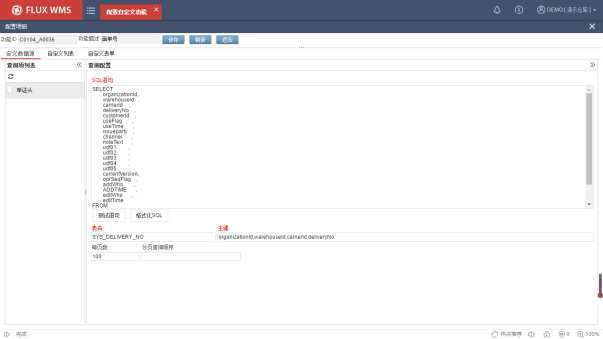

- SQL 语句部分用于维护功能与数据库交互 SELECT 语句。需要注意的是：

✓ 语句不要使用 SELECT * 模式，而要写具体字段名；

✓ 表名要大写，建议加上表别名；

✓ Oracle 中转换格式为：TO_CHAR(a.addTime,'yyyy-MM-dd hh24:MI:ss')AS addTime；

✓ SQL Server 中转换格式为：CONVERT(varchar(50),a.addTime,120) AS addTime。

✓ WHERE 条件处理：组织机构字段可默认配置为 表别名.organizationId ='FLUX' 或者 表别名.organizationId = '@{bizOrgId}'；

✓ 可使用系统默认参数： @{languageId}， @{bizOrgId}， @{userId}，@{bizWarehouseId}；

✓ 针对表单区域自定义的字段需要做 WHERE 条件处理的可追加 ${WHERE}，例如：表别名.udf01 ='${udf01}'，大括号{}中的 udf01 为表单配置中查询区域某文本框的字段配置值。

- SQL 语句输入完成，可以点击【测试语句】进行检查；

- 点击【格式化 SQL】按钮，可对 SQL 语句展示格式进行优化；

<!-- 原 PDF 第 1084 页 -->

- 在“表名”字段，指定功能对应的后台数据库主表，要求大写，无空格；

- “主键”字段，录入表名对应的主键（可不包含 organizationId字段）。保存时，会校验配置的表名、主键在数据库中是否存在，所以要求配置的表名和主键与数据库保持一致；

- 每页数，系统默认执行分页查询，所依据的每页的显示行数，默认 100，配置值不超过 1000。

- 分页查询顺序，则指定了查询结果的显示排序字段，例如输入 a.asnStatus，则实现效果类似于 ORDER BY a.asnStatus。

多级结构中，需要为每个层级配置对应的 SQL语句。

- 自定义列表

自定义列表页签主要是针对列表布局进行配置的操作界面，根据现场需要，基于已定义的数据源字段，通过插入列添加列表显示字段，并可调整字段名称、位置以及列属性，配置汇总、字段渲染处理等。配置处理基本同界面方案配置，但自定义功能中不支持拖曳添加字段。

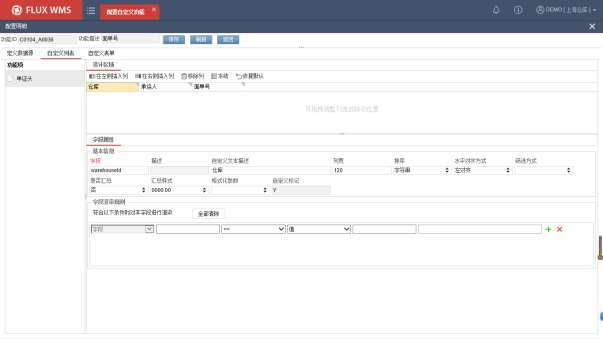

- 字段为数据源中配置的查询字段，例如：asnNo。如果数据源中使用了字段别名，此处需要填写对应的别名，才能数据绑定显示。配置时不要添加特殊符号，空格等内容需要与数据源保持一致。

<!-- 原 PDF 第 1085 页 -->

- 自定义文本描述即列表显示的字段描述。

- 其他字段属性和渲染规则，可参考界面方案配置。

- 自定义表单

自定义表单页签主要是针对表单布局（例如查询界面、详细信息各个页签界面）进行配置的操作界面，根据现场需要，基于已定义的数据源字段，通过拖曳左侧的控件添加界面显示字段，调整表单布局大小、字段名称、控件坐标位置以及控件属性等信息，主要用于查询区域和编辑页签表单的配置。

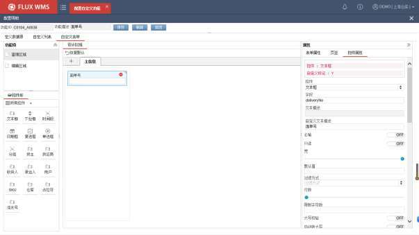

- 从左侧的控件库拖曳所需控件到“设计区域”，然后在右侧控件属性中的“字段”输入框，填写“定义数据源”时 Select语句部分已配置的、实际表中存在的字段，不能使用别名。

- 字段控件属性中，可为字段配置默认值，系统支持使用默认参数：@{languageId}（当前登录语言），@{bizOrgId}（当前组织代码），@{userId}（当前用户代码），@{bizWarehouseId} （当前登录仓库）。

- 针对查询区域的控件字段，如果定义数据源时使用了 ${WHERE}的方式，即Select语句部分，有加“Where 1=1 ${WHERE}”，则字段的控件属性部分，可以配置对应查询过滤方式，例如模糊查询，精确查询。

- 如果没有配置${WHERE}方式，则“过滤方式”配置不生效，希望查询界面的字

<!-- 原 PDF 第 1086 页 -->

段在查询时生效，要在“定义数据源”页签的“Select 语句”中添加对应的条件，例如：Where XXXXXXXX（其他 where条件） AND a.asnno ='${asnno}'，这样查询页签 ASNNO 字段输入值才会用于查询记录。

- 对于需要系统生成流水号的情况，在编辑表单配置时，拖曳左侧的流水号控件，在右侧控件属性配置流水号规则编号，则可增加流水号的自动生成，调用系统流水号规则模块进行生成。

- 二层结构、单证结构的单证明细配置，与单证头配置类似，主要区别有：

✓ 单证明细与单证头的表名和主键不同。例如单证头对应 DOC_ASN_HEADER表，而单证明细对应 的是 DOC_ASN_DETAILS表；单证头主键是warehouseID,asnNo，而单证明细的主键是warehouseID、asnNo,asnLineNo。

✓ WHERE查询条件不同。单证明细的定义数据源配置时，可不用配置WHERE查询条件，直接使用WHERE 1=1，系统会默认追加组织机构(organizationId)、单证头对应的主键值进行筛选。如果查询数据源存在仓库(warehouseId)和货主(customerId)字段，系统会默认追加授权的仓库和授权的货主进行查询处理。

✓ 表单配置不同。明细配置表单时，可手动设置明细表对应主表的字段为不可编辑。例如：

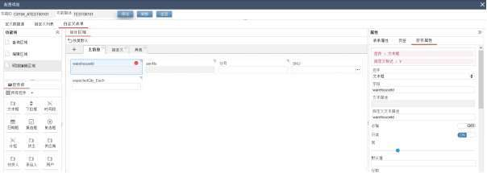

完成数据源、列表、表单配置后，一个初步功能即已具备，可以实现基于数据源配置的记录查询，界面展示，编辑保存处理。

如果需要执行更复杂的作业处理，需要进一步配置扩展操作、自定义操作。

- **前后置操作配置**

<!-- 原 PDF 第 1087 页 -->

自定义功能，同标准功能一样，可以支持在“标准业务扩展配置”功能中，进行前、后置操作的配置。

标准配置模式下，配置明细保存时，系统会自动为这个自定义功能，生成对应的权限明细项（即子权限），如下图所示。

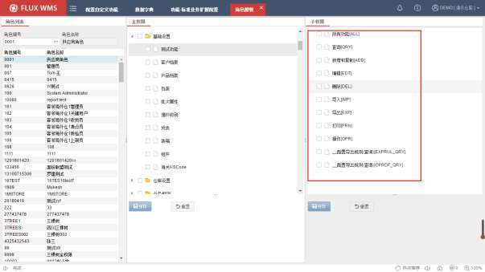

不同结构的自定义对应，对应子权限会有所区别，例如单证明细会有对应明细的增删改权限项，但如果是一层结构的功能，就不会有 D2_XXX 的明细子权限。

这些子权限，可以作为“标准业务扩展配置”的“动作代码”使用，配置对应的前后置操作，例如保存时增加前置校验，后置再调用个性化执行逻辑。

除了系统配置实现的标准按钮，自定义功能不支持个性化添加按钮。

配置查询功能的前后置扩展操作时，可以通过鼠标右键【配置前后置】功能，直接跳转到【业务系统配置】下的【标准业务扩展配置】功能中，系统自动添加对应功能的QRY查询动作代码记录，方便用户配置。

<!-- 原 PDF 第 1088 页 -->

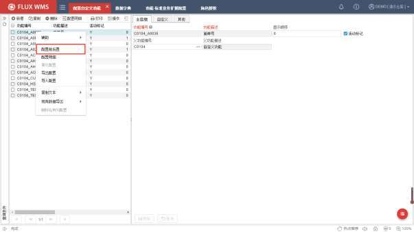

由于是从配置自定义功能跳转，因此页签名称显示为【功能-标准业务扩展配置】，并且仅显示此功能的对应扩展配置：

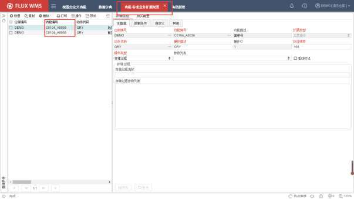

查询功能的前后置配置最为常见，其余增删改操作的前后置，需要自行到【标准业务扩展配

<!-- 原 PDF 第 1089 页 -->

置】功能中，添加记录，动作代码即对应功能的子权限 ID。

以【保存】按钮为例，前后置操作配置的步骤是：

- 选择主菜单“业务系统配置”下的“标准业务扩展配置”。

- 点击【新增】按钮，手动添加功能编号（即自定义功能的功能编号），动作代码（即对应权限 ID，如 D2_EDT），并配置对应的扩展类型、操作类型（具体标准业务扩展配置功能操作细节说明，可参考【5.6 标准业务扩展配置】章节的介绍）

- 根据操作类型选择后对应显示的SP 或者 JAVA类相关配置字段，指定业务调用的SP名称、参数或者 JAVA类信息。具体 SP、JAVA 类内执行的处理，由 IT部门（或请联系FLUX顾问提供支持）根据业务需要，撰写对应逻辑。

配置后，点击按钮时，系统将执行对应前置、后置处理。

除查询、新增、删除、保存之外，其余子权限不支持扩展配置。

- **自定义操作配置**

除了基于权限项的前后置操作，个性化功能，同标准功能一样，支持右键自定义操作配置。

点击进入到所配置的自定义功能中（配置人员需要已具有此功能的授权，可参考【20.3.4自定义功能授权】章节的介绍），通过如下界面，扩展菜单的“配置自定义操作”功能项，进入到自定义操作配置界面。

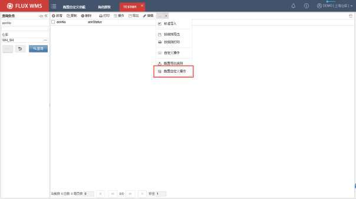

<!-- 原 PDF 第 1090 页 -->

自定义操作配置，可参考【5.3 自定义操作配置】章节的介绍，与标准功能的自定义操作配置操作相同，对应功能编号，为自定义功能的功能编号，如下图所示：

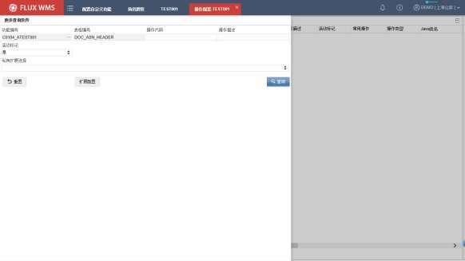

- **打印相关配置**

自定义功能同样支持导出规则配置，可实现 Excel导出、单据打印等操作。

同样从所配置的自定义功能中扩展菜单进入，选择“配置导出规则”功能项，具体配置可参考【5.2 数据导出规则配置】章节的相关介绍。

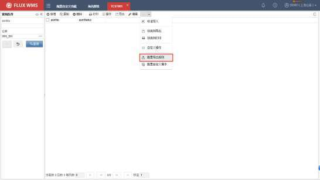

<!-- 原 PDF 第 1091 页 -->

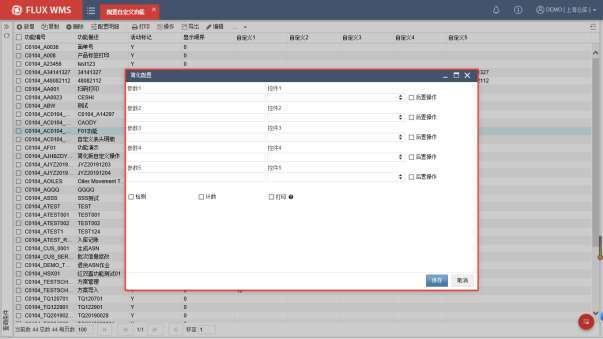

### 20.2.3. 简化配置模式

对于一些简单操作需求，如果按标准配置处理，所需配置的内容较多，对管理人员而言，也形成了一定的负担，因此系统还提供了一种简化配置模式，针对只需要简单录入信息，执行处理的操作模式使用，不涉及复杂的界面录入、记录编辑等功能处理。

配置后，系统会按预设的界面进行功能展示、执行支持。即界面相对固定，调用固定 SP，执行逻辑在 SP 内相应个性化配置实现。

- **简化配置**

在创建自定义功能记录后，通过鼠标右键功能菜单的“简化配置”（记录未进行标准配置才可进入简化配置）功能项，点击显示如下自定义功能的简化配置界面：

*图20-2-14（图像未能从 PDF 对象中直接提取）*

- 根据作业需要，在参数 1~5字段，输入前台希望显示的字段名称。有配置的字段将作为后续执行的入参信息， 未配置的参数 在操作界面 将隐藏 不显示。需要注意的是，此功能不支持多语言，如有不同语言的显示要求，需要分别配置成不同语言的对应功能。

- 所配置的参数字段，默认为普通编辑框，如有需要，可以为入参字段配置所用控件，在对应的“控件”1~5字段，进行指定。例如字段输入内容为SKU，则可将控件设置为“产品选择对话框”，操作时可通过产品二级窗口选择SKU。选择时，点击字段会

<!-- 原 PDF 第 1092 页 -->

以下拉列表模式显示常用的主要控件，点击浏览按钮则会以对话框模式显示全部控件。

- 一些业务场景需要对录入参数信息进行检测，然后再执行处理。此时可以勾选“检测”选项，系统会对界面录入的全部参数，先进行个性化检测，例如校验参数 1 的ASNNO是否创建状态，参数 2的 SKU是否属于指定货类等。

- 具体的处理逻辑，在【业务系统配置】 -【标准业务扩展】中通过SP(FLUX_SPUDF_OPERATION_PROCESS)实现，使用参数operationType区分不同处理：

- 功能界面【查询】按钮逻辑，参数为QUERY_功能编号，即执行@operationType=’QUERY_C0104_AXXX’的这一段处理逻辑（XXX是具体的功能编号信息）。

- 功能界面【帮助】按钮逻辑，参数为 HELP_功能编号。即执行@operationType=’HELP_C0104_AXXX’的这一段处理逻辑。

- 检 测 逻 辑， 参 数 为CHECK_功 能 编 号。 即 执 行@operationType=’CHECK_C0104_AXXX’的这一段处理逻辑。

- 【执行】逻辑，参数为功能编号，例如“C0104_A008”即执行@operationType=’C0104_AXXX’的这一段处理逻辑。

- 由于简化自定义功能，通常是扫描操作，因此系统提供可选择的计数处理，如勾选此配置，扫描同时，系统执行计数累加。

- 点击【保存】将相关配置记录写入系统（后台表DEV_UDFFUNCFG_OPR）。

- **参数后置操作**

- 根据“后置操作”选项，系统判断是否需要另外调用个性化的后置操作处理。多数情况下，界面参数全部录入后，再执行处理。但系统也支持多个参数分别配置不同的处理调用，例如对参数值进行校验，扫描即提示。

- 勾选“后置操作”情况下，保存设置时，系统会自动根据自定义功能编号、参数号，在【业务系统配置】-【标准业务扩展】中生成参数后置操作对应动作代码记录，功能编号即自定义功能的编号，动作代码为“功能编号ID+UDF+OPRX（X为参数项）”的配置记录。例如动作代码为C0104_A008_UDFOPR1。

- 简化配置设置完成，切换到【业务系统配置】-【标准业务扩展】功能中，查询到自定义功能对应的业务扩展记录，配置对应处理逻辑。具体后置操作配置，可参考【5.6标准业务扩展配置】章节的说明。

<!-- 原 PDF 第 1093 页 -->

- **打印支持**

尽管简化模式自定义功能，界面、操作都比较简单，但也支持打印处理，在操作界面中，最后一个参数录入后，回车执行成功，或者点击【打印】按钮可触发自定义打印执行。

◼ 简化模式配置时，在

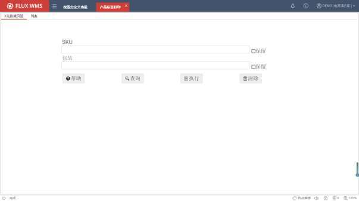

界面，如果勾选“打印”项，保存配置时，系统会

自动向【数据导出规则配置】中，写入此自定义功能对应的数据导出规则记录，用于自定义打印配置。

- 简化配置完成后，切换到【业务系统配置】-【数据导出规则配置】功能中，进行打印相关配置，具体配置说明可参考【5.2 数据导出规则配置】章节的说明。

- 在自定义操作的【执行】逻辑，或者参数的后置操作（操作类型应该是“后置操作”而不是“后置操作（事务内）”）逻辑中，添加向打印临时表（TMP_UDFFUNCTION_PRINT）写入打印数据的处理。

- 实际功能执行逻辑后，根据导出规则提取数据，按所配置的模板进行打印，并更新对应打印标记。

- **自定义功能操作**

对于已配置，并且用户已获取授权的简化自定义操作功能，操作步骤主要是：

- 在对应模块，选择此自定义功能。例如在“自定义功能”模块，点击“产品标签打印”。系统显示功能操作界面，默认展示“X元素数据页签”，X元素即所配置的参数，此功能仅配置两个入参，因此界面仅展示两个字段：

<!-- 原 PDF 第 1094 页 -->

*图 20-2-15（图像未能从 PDF 对象中直接提取）*

- 按照功能要求的录入信息，扫描产品条码或手工录入产品 ID。

- 扫描枪自带回车，或者人工录入回车，光标跳转到第二个字段，继续扫描或者手工录入包装代码。

- 回车，或者点击【执行】按钮，系统执行处理逻辑。

- 如果某个字段勾选了“保留”选项，例如 SKU 勾选保留，执行成功后，系统清空界面信息时，会保留 SKU 信息，光标定位到“包装”字段，录入不同的包装即可。无需重复录入 SKU 信息。

### 20.2.4. 自定义功能授权

自定义功能配置完成后，需要针对角色配置相应的功能权限才能使用此模块。

所配置的自定义功能，活动标记为 Y 的情况下保存，系统会自动在所指定的模块中创建此功能的权限记录，未指定所属“父功能”的情况下，系统默认父功能为“自定义功能”，因此授权时，同系统标准功能，到【角色授权】中，为角色授予自定义功能权限（可参考【4.4 角色授权】章节的介绍）。

操作步骤是：

- 选择主菜单“业务系统管理”下的“角色授权”。

- 当前角色下，在”自定义功能”模块（或者所配置的父功能模块）下，勾选相应功能，并保存。

- 授权配置成功后，相应用户在浏览器中刷新后即可见新增的自定义功能。

### 20.2.5. 自定义功能配置实例

- **标准配置实例**

- 选择主菜单“二次开发管理”下的“配置自定义功能”。

- 点击【新增】按钮，依次录入：

功能编号－TEST004

功能描述－ASN 单据

- 点击【保存】按钮保存记录。系统自动为功能编号添加默认前缀，显示为“C0104_ATEST004”。父功能默认为“自定义功能”。

<!-- 原 PDF 第 1095 页 -->

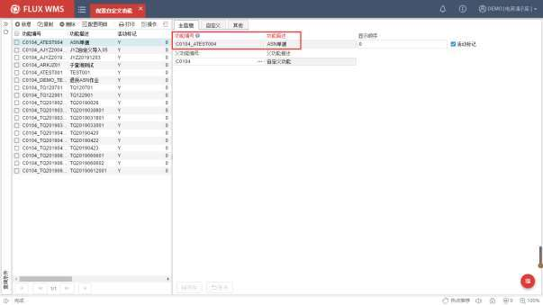

- 鼠标右键菜单，选择“配置明细”功能。

- 在“配置明细”的结构选择页签，选择“单证结构”

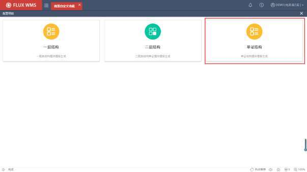

- 进入到“配置明细”的“定义数据源”页签，先配置“订单头”的查询语句，所查

<!-- 原 PDF 第 1096 页 -->

询的字段是后续的列表、表单显示依据；时间信息需要转格式；WHERE 条件部分是默认的组织 ID（'@{BIZORGID}'）、仓库 ID（'@{BIZWAREHOUSEID}'），以及 ASN 单号查询条件（'${ASNNO}'）

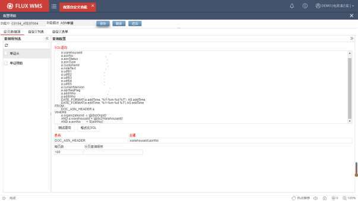

- 配置对应表名、主键、分页查询每页数量信息。

- 切换到“单证明细”部分，相应配置明细行部分的查询语句，以及表名、主键、分页信息。同样需要 WHERE 条件与表头匹配（组织 ID'@{BIZORGID}'、仓库ID'@{BIZWAREHOUSEID}'，ASN 单号'${ASNNO}'）：

<!-- 原 PDF 第 1097 页 -->

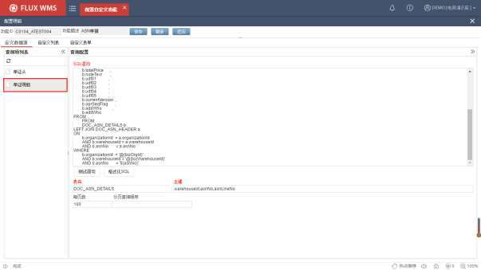

- 切换到“自定义列表”页签，先配置单证头的列表显示字段：

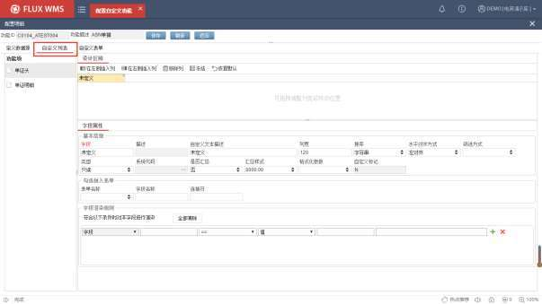

- 设计区域，默认显示一列“未定义”字段列。

- 在下方的“字段属性”部分，输入“单证号”字段相关内容：

<!-- 原 PDF 第 1098 页 -->

字段－asnNo

自定义文本描述－订单号

其余信息可使用默认值，根据实际需要修改。列表字段默认只读。

- 点击【在右侧插入列】（也可以根据需要选择【在左侧插入列】），新增一列“未定义”字段列。

- 在下方的“字段属性”部分，输入“订单状态”字段相关内容：

字段－asnStatus

自定义文本描述－订单状态

字段渲染规则－asnStatus=99 的记录，背景色为绿色（如下图）

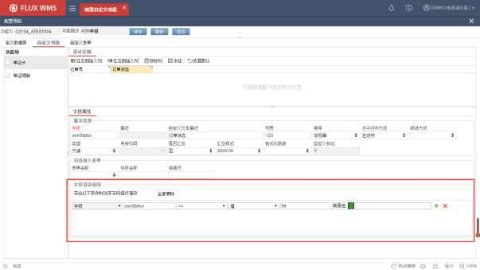

- 点击界面上方的【保存】按钮，保存配置。

- 切换到“单证明细”部分，维护明细列表信息，字段为 asnNo（订单号）、asnLineNo（订单行号）、sku（SKU 代码）、expectedQty_Each（数量），无特殊渲染要求。

<!-- 原 PDF 第 1099 页 -->

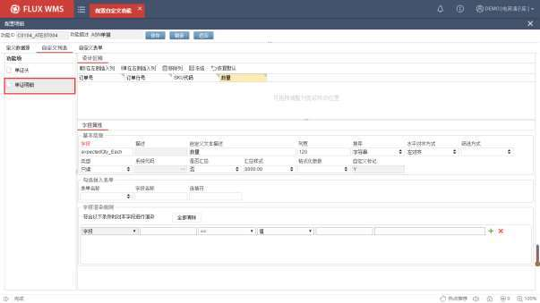

- 保存配置后，切换到“自定义表单”页签，按默认显示，先配置查询区域部分：

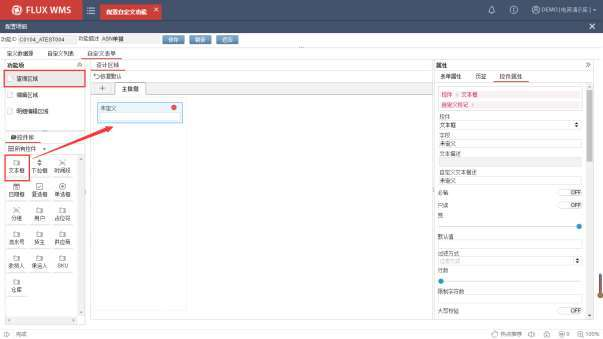

- 从左侧的控件库，拖动所需的控件到设计区域。希望配置订单号录入字段，因此拖动了一个“文本框”控件，得到一个“未定义”字段。

<!-- 原 PDF 第 1100 页 -->

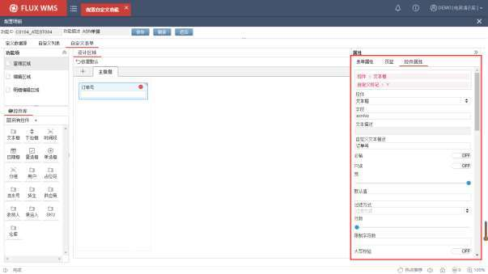

- 在界面右侧的字段“控件属性”部分进行数据配置：

字段－asnNo

自定义文本描述－订单号

- 对于常用的货主、仓库、收货人等字段，系统提供默认控件，可以直接拖曳。如下图，拖曳仓库控件到设计区域，自动带入字段、描述。添加默认值@{bizWarehouseId}，这样打开界面，查询条件即默认为当前登录仓库。

<!-- 原 PDF 第 1101 页 -->

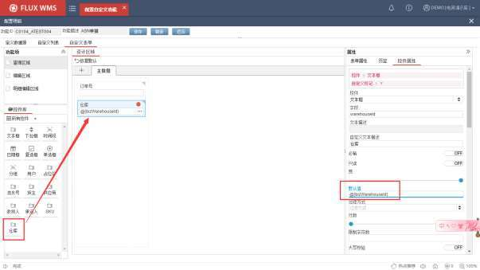

- 保存查询区域配置。

- 切换到“编辑区域”配置页签，对单证头的详细信息页签进行配置：

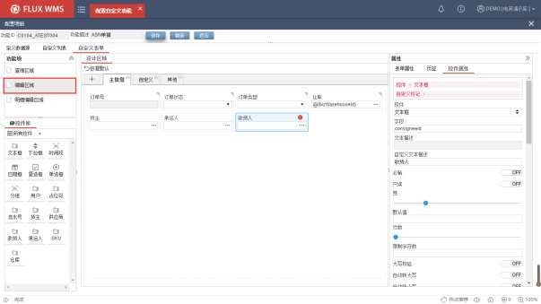

- 添加订单号（asnNo）字段，控件为“流水号”，对应流水号规则编号为“ASNNO|

<!-- 原 PDF 第 1102 页 -->

预期到货通知流水号”。

- 添加订单状态（asnStatus）字段，下拉框。默认值 00，选项值类型配置为“系统代码”，对应系统代码 ID，维护为“ASN_STS”。可以得到一个下拉显示 ASN状态的字段。单据新增时，状态默认为 00，即创建状态。

- 添加订单类型（asnType）字段，下拉框。默认值 CM，选项值类型配置为“系统代码”，对应系统代码 ID，维护为“ASN_TYP”。条件格式为：asnStatus大于 00，设置为只读。可以得到一个下拉显示 ASN类型的字段。单据新增时，默认为 CM，即普通采购（名称在系统代码中可维护）。但单据操作后，状态不是创建之后，此字段不可编辑，只能只读查看。

- 添加仓库（warehouseId）字段，拖动添加仓库组件。默认值@{bizWarehouseId}。

- 添加货主（customerId）字段，拖动添加货主控件。默认为“FLUX”。新增单据时，默认显示FLUX。

- 添加承运人（carrierId）字段，拖动添加承运人控件。可以得到一个带浏览按钮的承运人字段，点击浏览按钮，在弹出的客户档案选择对话框中，默认为查询承运人。

- 添加收货人（consigneeId）字段，拖动添加收货人控件。

- 保存配置。

- 切换到“明细编辑区域”配置页签，对单证明细的信息页签进行配置：

<!-- 原 PDF 第 1103 页 -->

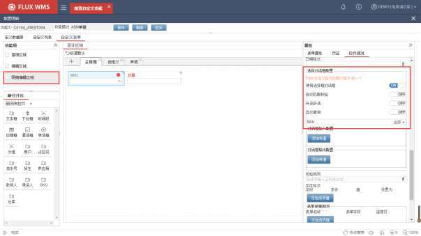

- 添加 SKU（sku）字段，文本框，“使用选择框对话框”－选择对话框配置部分，开关开启（配置为 ON），单纯录入的文本框变为带有浏览按钮的、可选择记录的对话模式文本框。在“全部”下拉列表中，选择“系统内置”，然后在系统内置控件的下拉列表中选择“SKU-产品档案选择对话框”。这样浏览按钮点击后，弹出的对话框就是产品选择的对话框。

- 添加数量（expectedQty_Each）字段，文本框。开启“必输”开关。

- 保存配置。

- 选择主菜单“业务系统管理”下的“角色授权”，进行权限添加：

- 选择准备授权的角色。

- 在“主权限”部分，找到“自定义功能”下的“ASN 单据”功能，勾选，并保存。

- 回到主菜单，选择“自定义功能”下的“ ASN 单据”功能，显示如下，查询界面、单证头列表界面：

<!-- 原 PDF 第 1104 页 -->

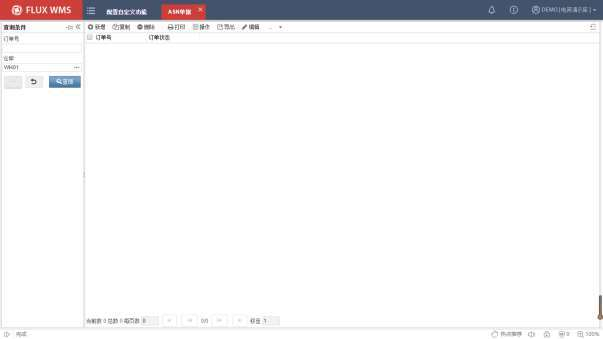

- 点击【查询】按钮，选择任意记录，详细信息界面显示如下：

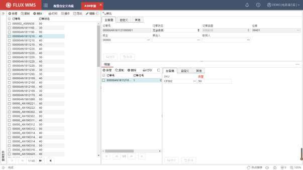

- **简化配置实例**

- 选择主菜单“二次开发管理”下的“配置自定义功能”。

<!-- 原 PDF 第 1105 页 -->

- 点击【新增】按钮，依次录入：

功能编号－TEST005

功能描述－产品标签

- 点击【保存】按钮保存记录。系统自动为功能编号添加默认前缀，显示为“C0104_ATEST005”。父功能默认为“自定义功能”。

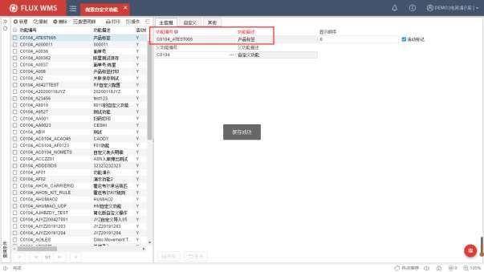

- 鼠标右键菜单，选择“简化配置”功能。

- 在弹出的简化配置弹窗，进行如下配置：

<!-- 原 PDF 第 1106 页 -->

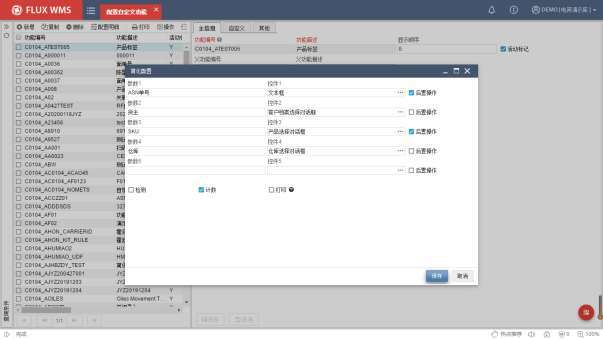

参数 1－ASN 单号

控件 1－下拉列表选择“文本框”，并勾选“后置操作”。

参数 2－货主

控件 2－下拉列表选择“客户档案选择对话框”。

参数 3－SKU

控件 3－下拉列表选择“产品选择对话框”，并勾选“后置操作”。

参数 4－仓库

控件 4－下拉列表选择“仓库选择对话框”。

勾选“计数”。

- 保存配置。

- 选择主菜单“业务系统管理”下的“角色授权”，进行权限添加：

- 选择准备授权的角色。

- 在“主权限”部分，找到“自定义功能”下的“产品标签”功能，勾选，并保存。

- 用户刷新界面，可见对应功能操作界面（尚未配置处理逻辑）

<!-- 原 PDF 第 1107 页 -->

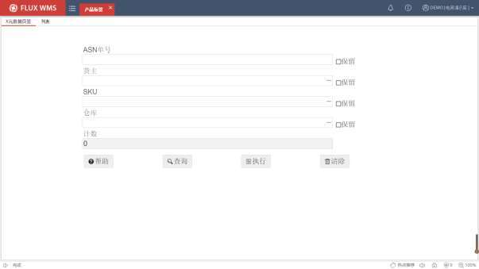

- 进入“业务系统配置”下的“标准业务扩展配置”功能，进一步配置个性化后置逻辑，用于针对录入值的及时处理、校验：

- 查询条件为“C0104_ATEST005”（之前新增的自定义功能编号），可以查询到系统自动创建的，与勾选了“后置操作”选项的参数 1、参数 3 对应的动作代码。

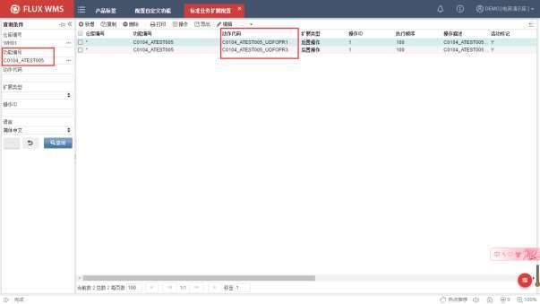

<!-- 原 PDF 第 1108 页 -->

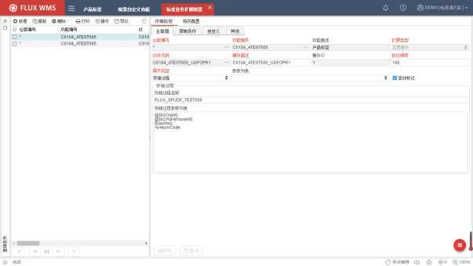

- 相应为参数字段配置个性化校验逻辑处理。

*图 20-2-33（图像未能从 PDF 对象中直接提取）*

- 在数据库中添加对应 SP：FLUX_SPUDF_TEST005。

- 在数据库中配置 SP：FLUX_SPUDF_OPERATION_PROCESS，定义帮助、查询、执行按钮和检测功能的逻辑。
