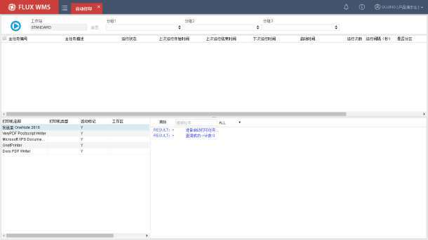
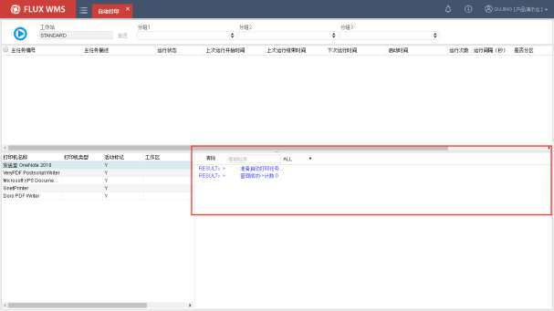
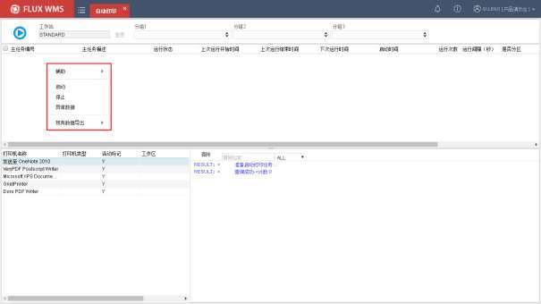

# 21. 自动打印

> 来源文件：`富勒WMSV6.2（最全版1119页）.pdf`；原 PDF 第 1109-1111 页。

> 本文件按原 PDF 正文中的顶层章节拆分；每页保留原 PDF 页码注释，图示按原图注顺序引用。

<!-- 原 PDF 第 1109 页 -->

仓库内的固定作业，可以配置对应的自动打印服务，实现无需人为干预的自动打印输出。

例如订单通过接口下达，由定时器负责按波次规则运算生成波次订单、分配库存，完成分配的订单就可以通过自动打印配置，在指定的打印机输出拣货任务清单。具体拣货操作员工，根据打印的单据进行拣货操作，无需人工操作打印、通知、单据传递。

启动自动打印服务后，用户可通过交互界面实施查看打印作业执行情况，目前系统支持：打印指令执行情况跟踪；操作界面支持实施打印结果查看；打印历史结果进行查看。

## 21.1. 启用自动打印

- **自动打印**

- 在主菜单“业务系统配置”下的“自动打印配置”中，对自动打印进行配置。具体内容可参考【5.5自动打印配置】的对应说明。

- 选择主菜单“自动打印”，系统显示自动打印服务操作界面：

开始/暂停按钮－用于启动/暂停当前工作站配置的所有打印服务，当服务启动后，程序会实施刷新和输出打印服务状态、日志等信息。

<!-- 原 PDF 第 1110 页 -->

工作站－即打印的当前客户端电脑的工作站信息，由系统自动带出显示。在界面右上角系统菜单的【本地配置】-【工作站】中设置，或者点击【重置】按钮进入“本地配置”界面。

分组 1~3－分组信息在启用打印服务后生效，下拉框自动加载各项打印服务对应的分组1~3信息，用以打印作业中的数据过滤筛选操作。

列表展示区－启动打印服务后，展示该工作站下所有启用、未启用的打印服务信息。

打印机信息展示区－打印机信息展示区主要用于显示当前电脑所有打印机终端访问信息。

日志输出区－日志输出区用于启动打印服务后，实施查看打印日志输出使用。打印区日志查看支持通过下拉框选择 全部（ALL）、错误（ERROR）、结果（RESULT）、指令（COMMAND）条件，对日志数据进行过滤。当点击【清除】按钮时，区域内日志信息自动清除。

## 21.2. 暂停自动打印

当现场需要手动结束自动打印服务时，可通过点击 停止自动打印，系统收到停止打印服务后，日志输出区会自动打印出停止打印任务指令信息。

<!-- 原 PDF 第 1111 页 -->

## 21.3. 单项打印服务启用/停止

系统支持对单项启用、未启用状态或执行时间段外打印项进行启动/停止打印操作。当用户多选或者单选打印服务项右键时，系统会展示“启用”、“停止”两个选择项，点击后系统会对选择项进行相应的启用/停止动作，列表区的“运行状态”以及输出打印日志区也会同步进行数据刷新和打印日志输出。

