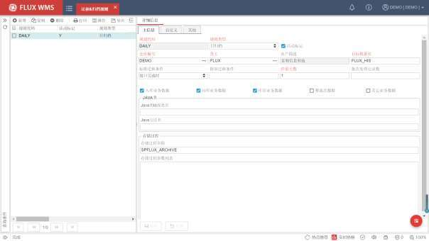
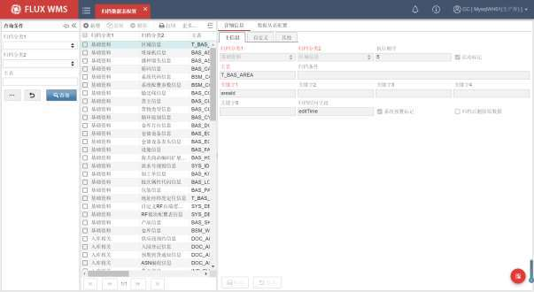
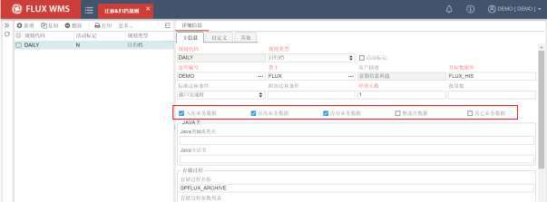
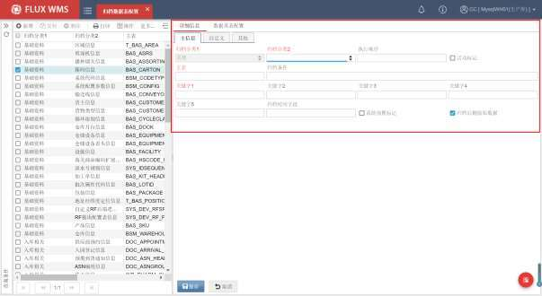
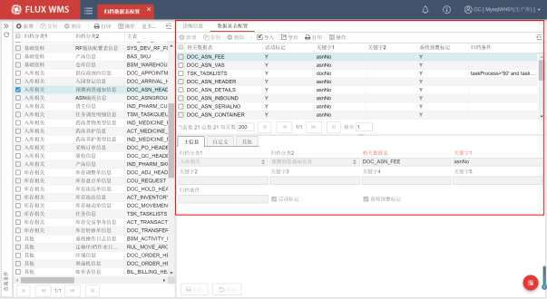
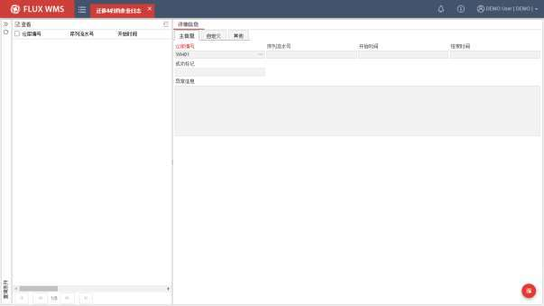
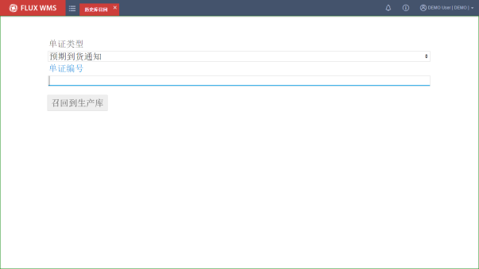

# 22. 迁移&归档

> 来源文件：`富勒WMSV6.2（最全版1119页）.pdf`；原 PDF 第 1112-1119 页。

> 本文件按原 PDF 正文中的顶层章节拆分；每页保留原 PDF 页码注释，图示按原图注顺序引用。

<!-- 原 PDF 第 1112 页 -->

为了让 WMS 系统保持高效运行、降低数据备份工作的影响，FLUX WMS 系统通过迁移&归档模块，把一些已经处理完成的业务数据从生产数据库迁移到历史数据库用于只读查询，或者归档到归档数据库。

系统采用三级存储（生产库、历史库、归档库）机制，周期性的将生产库已完结的作业单据数据（即已关闭或已回传接口信息的订单），写入历史库，用于相关查询；并通过设置归档周期，将历史库数据库写入归档库，以便根据管理要求长期保存。

通过迁移归档，使生产库保持瘦身状态，避免大数据量查询影响正常的业务操作。

历史库、归档库，即可以部署在多服务器上，也可以部署在同一服务器上。

## 22.1. 迁移&归档规则

进行迁移或者归档之前，需要先设置对应的管理规则，即相关操作条件设置。

- **迁移归档规则配置**

- 选择主菜单“迁移&归档”下的“迁移&归档规则”。

- 点击【新增】按钮，维护主信息内容：

<!-- 原 PDF 第 1113 页 -->

规则代码－支持人工指定规则 ID。

规则类型－归档的处理周期分类。支持“日归档”（每日归档）、“定期归档”（按指定的间隔时间归档）两种方式。

活动标记－控制当前归档计划是否被启用。

仓库编号－此规则生效的业务仓库。不同的业务仓库，可能业务量差别比较大，一个需要每日归档，另一个只需要每月归档即可，因此会要求配置不同的规则。设置为星号（*）表示多仓共用的规则，执行处理时，系统优先使用本仓对应规则，如无单独配置的规则，则使用*仓库的公共规则。

货主－需要执行数据迁移或归档的货主代码，可以为不同货主设置不同的归档周期。设置为星号（*）表示不限制货主。

客户描述－货主的名称描述信息。

目标数据库－迁移、归档的目标历史库或归档库的数据库名称或 ID。

标准迁移条件－何种订单可以被归档。例如通常情况下，订单关闭后会触发接口信息回传。对于有接口传递要求的业务环境，选择为“接口完成时”，即已完成回传信息的订单，可以被归档。但没有接口配置的业务环境，通常会选择“订单完成时”，已关闭订单即可归档。

附件迁移条件－补充的个性化条件信息。

停留天数－执行数据迁移时，会把“业务完成的”（已经关闭、接口已经回传）并且已经超过停留天数的数据迁移到历史库中。设置这个停留天数的时候，要考虑从上游接口获取业务单证时是否存在单证号唯一性校验的业务场景，如果不存在这个场景，则设置为 0 即可。执行数据归档时，会把超过一定天数的（比如 3个月之前的）数据归档到归档库中，这时，相当于“归档周期”的概念。

批次处理记录数－执行一次迁移或归档作业时，每批次处理的单证数量、或波次数量、或记录行数。避免一次处理数据量过大，时间太长，影响现场作业。

数据类型－需要迁移或归档的数据类型，包括：入库业务数据、出库业务数据、库存业务数据、其它业务数据、波次数据，可以选择一个或多个。每类数据，具体涉及到哪些业务信息进行归档，可以在【归档数据表配置】配置功能中进行查看。

Java类/存储过程－个性化归档处理逻辑。例如对于个性化功能对应数据的归档处理。

- 点击【保存】按钮，完成迁移/归档规则设置。

- **迁移归档执行**

<!-- 原 PDF 第 1114 页 -->

规则配置完成后，通过【业务规则】-【定时器】中的 DATA_ARCHIVE数据归档定时器，配置具体执行的检查的时间。

定时器执行时，根据迁移归档规则，以及需要进行归档的数据表配置，检查是否有符合条件的记录，并将相应记录迁移或归档到所配置的目标数据库中。标准规则处理完成后，再根据规则中配置的个性化执行逻辑，进行个性化处理。

- **已归档日志信息管理**

WMS 相关日志使用MongoDB 数据库进行存储，支持启用分片归档管理逻辑，划分为主库分片、归档库分片。

系统根据参数LOG_RETENTION_DAYS（系统日志保留天数）判断，查询条件指定的日志日期内容需要从主库分片查询日志，还是从归档库分片查询日志。

对于已经记录在归档库分片的系统日志，则通过LOG_ARCHIVE_RETENTION_DAYS参数控制保留天数，超过天数的已归档日志将会被删除日志定时器（DEL_LOGS）删除。

## 22.2. 归档数据表配置

系统标准归档处理，可以对系统表数据进行归档。但基于 FLUX WMS 的高可配置性，现场经常会添加个性化表使用。此类非标准数据库，同样能够通过配置实现归档处理，与标准表数据一同通过归档定时器进行数据归档。对于现场个性化添加的数据表，还可以设置归档条件等相应处理。

- **归档数据表 配置**

- 选择主菜单“迁移&归档”下的“归档数据表配置”功能。

- 通过查询条件，可以查看当前已有数据表信息。系统预置记录，也即初始化提供的系统标准表。

<!-- 原 PDF 第 1115 页 -->

- 查询条件字段有：

归档分类 1－数据表所属业务分类信息，与【迁移&归档规则】中的业务数据勾选匹配（如下图）。例如按“归档分类 1”为“入库相关”，查询到的数据表即入库业务数据归档过程中会进行数据库归档的表。

归档分类 2－数据表信息使用分类。一个功能经常会涉及到多张数据表。

主表－功能相关数据归档时的主表名称。

- 配置个性化表归档设置时，通过点击【新增】按钮，在“详细信息”部分的“主信息”

<!-- 原 PDF 第 1116 页 -->

页签中，增加记录，用于归档数据筛选、判断：

归档分类 1－个性化表，默认为“其他”分类。【迁移&归档规则】中勾选“其他业务数据”的情况下，会将对“其他”分类的数据表执行归档。

归档分类 2－数据表信息使用分类。

执行顺序－归档执行顺序。

活动标记－当前记录设置是否启用。

主表－功能相关数据归档时的主表名称。一个功能相关的数据表会有多张，分为主表、从表。例如发运订单数据，单头信息（DOC_ORDER_HEADER）为主表，其余明细行、分配明细等均为从表数据。系统根据主表数据的信息、时间来判断是否可以归档。

归档条件－记录可以归档的筛选条件。标准表记录有默认条件，例如关闭或取消的订单可以归档（soStatus >= '90'）。但个性化功能相关表，需要在新增记录时自行设置归档条件。

关键字 1~5－主表与从表间的关联字段。

归档时间字段－主表中用来与归档规则设置的天数要求进行比对、判断是否需要对数据进行归档的条件字段。例如按订单创建时间归档，还是按订单关闭时间归档。

系统预置标记－系统标准表，默认预置标记为 Y，记录不可修改。现场新增的个性化记录，预置标记均为 N，可进行编辑修改。

<!-- 原 PDF 第 1117 页 -->

归档后删除原数据－归档后，运行库内的已归档数据是否需要删除。

- 点击【保存】按钮，完成归档主表相关设置。

- 在“数据从表配置”页签，点击【新增】按钮，添加需要归档的数据表信息：

归档分类 1－数据表所属业务分类信息。例如入库相关、出库相关

归档分类 2－数据表信息使用分类。例如立库操作相关，输送线操作相关。

相关数据表－从表表名。

关键字 1~5－主表与从表间的关联字段。

归档条件－从表数据的归档筛选条件。

活动标记－当前记录设置是否启用。

系统预置标记－系统标准表，默认预置标记为 Y，记录不可修改。现场新增的个性化记录，预置标记均为 N，可进行编辑修改。

- 点击【保存】按钮，完成从表配置

- **归档执行**

数据归档定时器（DATA_ARCHIVE）执行时，会根据【归档规则】中设置的需要归档的业务数据分类（也即归档分类 1），查询对应分类的数据表配置内容，并主表的条件、时间字段，查询

<!-- 原 PDF 第 1118 页 -->

是否有需要归档的主表数据。

如果主表中有需要归档的数据，则进一步根据主表数据，查询对应从表数据，并根据从表配置要求进行记录过滤，然后对从表中符合要求的记录进行归档处理。

从表与主表通过当前组织 ID，仓库 ID、关键字 1和关键字 2关联匹配。

## 22.3. 迁移&归档作业日志

数据归档定时器（DATA_ARCHIVE）执行后，可以在主菜单“迁移&归档”下的“迁移&归档作业日志”功能中，查看到归档执行的作业日志、异常反馈。

## 22.4. 历史库召回

单据信息迁移到历史库，供只读查询之后，特殊情况下，可能遇到需要进行操作修正的情况。例如每日迁移，发现有订单需要取消收货，或者取消发货（通常在无接口传递的情况下），回退操作，或者取消后重新操作。有些需要对订单产品的体积重量进行修正，重新计算费用。

此时可以通过“历史库召回”功能，将已经迁移到历史库的单据，再移动回生产库，进行相应

<!-- 原 PDF 第 1119 页 -->

操作。

作业后的单据，在下一次归档定时器执行时，会被再次迁移到历史库。

- **历史库召回操作**

- 选择主菜单“迁移&归档”下的“历史库召回”。

- 通过下拉列表，选择需要召回的单据类型，例如预期到货通知，还是发运订单。

- 录入单证编号，点击【召回到生产库】按钮：

- 系统将对应单据，从历史库，移动到生产库中。
