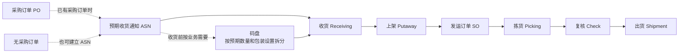

# 2. 仓库、配送中心管理概述

> 本章定位：呈现仓储、配送中心的粗略作业主链，不展开后续章节中的具体单据和任务处理。
>
> 来源：`01-按章节拆分的md文件/02-仓库、配送中心管理概述.md`；原 PDF 第 9—14 页。

## 2.1. 仓储、配送中心的粗略运作流程

### 用途

这张图用于先建立入库和出库的主链路认知。码盘在原文中被描述为收货前按预期数量和包装设置进行的准备动作，因此用虚线表示其条件性，不把它硬编码为所有收货必经步骤。

### 原文依据

- 2.3 仓储、配送中心的运作流程概述，原 PDF 第 10—14 页。
- 原文依次介绍 PO、ASN、码盘、收货、上架、SO、拣货、复核和出货。
- 原文说明码盘一般在预期数量等于或超过一个托盘数量时进行。

### 关键说明

1. PO 和 ASN 是入库前的单据信息；原文同时说明 ASN 可以在没有 PO 的情况下建立，也可以通过已有 PO 或订单行增加。
2. 收货确认数量、包装、产品、库位等信息；产品进入仓库系统库存后，通常会发出仓库收据。
3. 上架发生在收货之后，目的是把产品放入库位。
4. SO 记录预定货物的数量和目的地；拣货、复核和出货构成出库侧主链。
5. 原文还分别介绍了补货和盘点，但没有在这段概述中明确它们插入主链的固定位置，因此本图不额外添加连接关系。

### 事实边界

本图是章节概述层级的主链，不代表所有仓库都采用完全相同的操作顺序，也不展开上架方式、拣货类型、复核方式及盘点类型。仓库类型属于分类内容，不在本图中画成流程。
