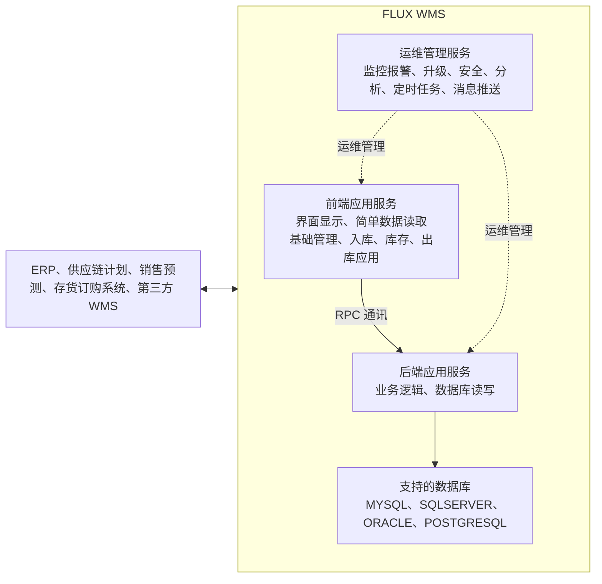
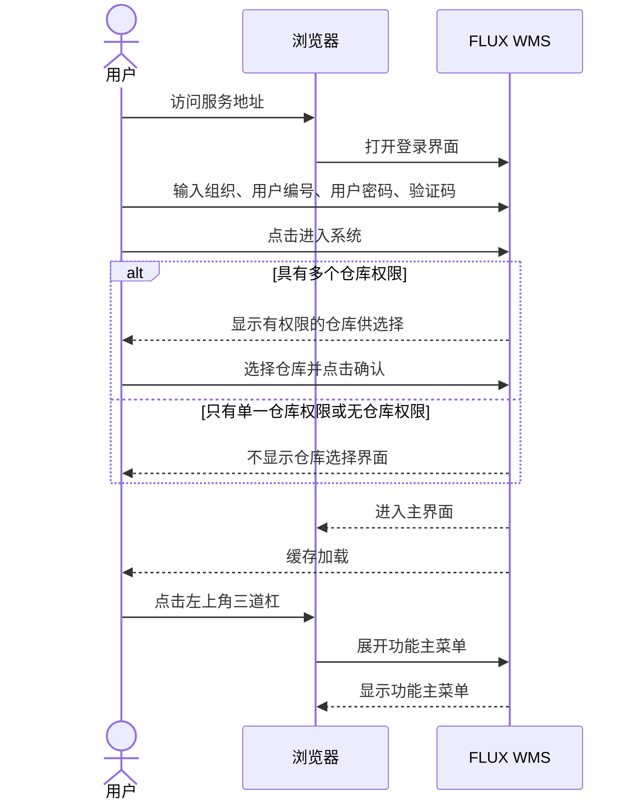
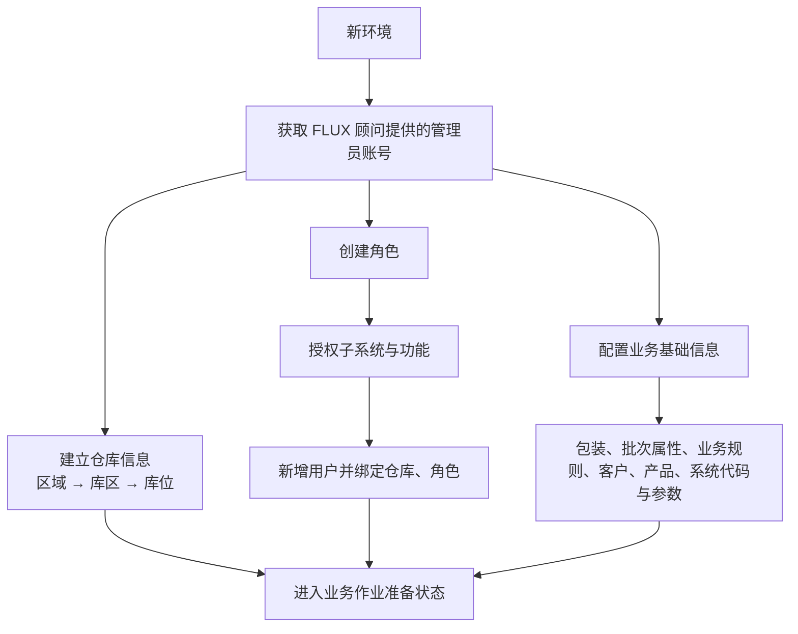

# 3. FLUX WMS 概述

> 本章定位：呈现 FLUX WMS 的服务结构和登录交互，不复刻菜单和界面按钮说明。
>
> 来源：`../01-按章节拆分的md文件（1119页版本）/03-FLUX-WMS-概述.md`；原 PDF 第 18—67 页。

## 3.2. FLUX WMS 系统结构

### 用途

这张图用于区分前端应用服务、后端应用服务和运维管理服务，并标出数据库支持及与企业其他系统的通信关系。

### 原文依据

- 3.2 FLUX WMS 的系统结构，原 PDF 第 19 页。
- 原文说明 V6 前端为 B/S 架构，后端为基于云架构的新版 WMS 操作系统，并按业务特征部署三类服务。
- 原文列出数据库支持：MYSQL、SQLSERVER、ORACLE、POSTGRESQL；并说明可与 ERP、供应链计划、销售预测、存货订购系统及第三方 WMS 通信。

### 关键说明

1. 前端应用服务负责界面显示和简单数据读取；后端应用服务负责实际业务逻辑和数据库读写。
2. 原文明确提到前后端通过 RPC 框架通信。
3. 运维管理服务承担监控报警、系统升级、安全防控、数据分析、定时任务和消息推送等运维工作。
4. 图中的外部系统只表示原文所说的通信对象，没有推导具体接口方向、报文或调用时点。

### 事实边界

原文没有给出三类服务之间完整的部署拓扑、故障转移方式或外部系统的具体对接边界。图中仅保留原文明确的结构关系。

## 3.3. 登录与仓库选择时序

### 用途

这张图用于呈现用户从访问服务地址到进入主界面的登录交互，以及多仓权限下的分支。

### 原文依据

- 3.3 登录 FLUX WMS，原 PDF 第 20—23 页。
- 原文说明登录输入组织、用户编号、用户密码和验证码；点击进入系统后，根据仓库权限决定是否显示仓库选择界面。

### 关键说明

1. 组织信息、公有云多组织场景下的组织输入，以及登录凭证的具体内容，原文要求向系统管理员获取。
2. 多仓权限用户登录时会选择仓库；单一仓库权限或无仓库权限时，原文说明不显示仓库选择界面并直接进入主界面。
3. 原文还说明登录后会加载缓存，用户点击左上角三道杠后显示功能主菜单。

### 事实边界

原文没有说明验证码校验失败、密码错误、仓库选择取消等异常分支，也没有提供登录接口或会话细节。本图不补充这些行为。

## 3.6. 系统初始化与基础信息准备

> 用途：补齐新版手册 3.6 节的初始化路径，说明管理员账号、仓库层级、角色用户和业务基础信息之间的准备关系。
>
> 原文依据：`../01-按章节拆分的md文件（1119页版本）/03-FLUX-WMS-概述.md`；原 PDF 第 65—67 页。

### 关键说明

1. 新环境初始化由管理员账号开始；仓库信息按区域、库区、库位逐层建立。
2. 角色授权完成后，用户还需要绑定可访问的仓库和角色；业务基础信息是另一条并行准备路径。

### 事实边界

原文没有说明初始化是否必须严格按图中所有节点完成，也没有说明账号创建、权限校验和基础信息配置的自动接口。本图只表达手册列出的准备关系。
