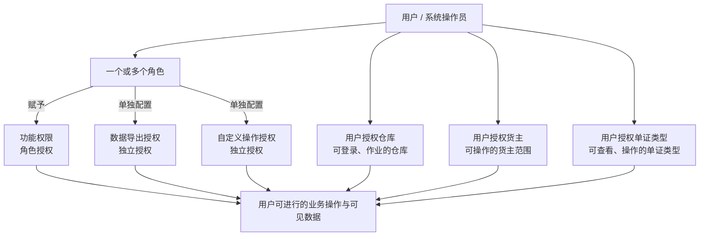
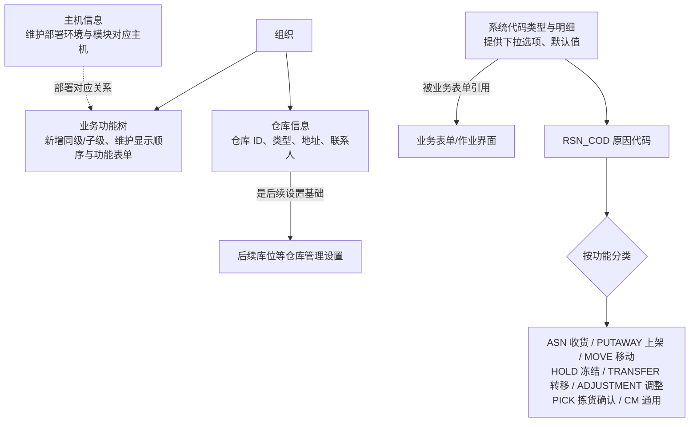

# 4. 业务系统管理

> 本章定位：呈现用户、角色和多类授权之间的关系；不展开每个管理页面的字段。
>
> 来源：`01-按章节拆分的md文件/04-业务系统管理.md`；原 PDF 第 41—52 页。

## 4.1. 用户、角色与授权范围

### 用途

这张图用于区分角色带来的功能权限，以及直接配置在用户侧的仓库、货主和单证类型授权。

### 原文依据

- 4.2 角色信息管理、4.3 用户管理，原 PDF 第 41—47 页：用户可以配置一个或多个角色，并分别维护仓库、货主、单证类型授权。
- 4.5 角色授权，原 PDF 第 49—50 页：角色授权用于配置功能及功能明细权限。
- 4.6 数据导出授权、4.7 自定义操作授权，原 PDF 第 50—52 页：两类授权与功能授权不同，分别进行控制。

### 关键说明

1. 同一用户可以维护多个角色；不同角色可以分别代表收货、发货等权限组合。
2. 角色授权决定功能和功能明细权限；数据导出授权、自定义操作授权与功能授权分开配置。
3. 用户授权仓库控制可以登录、作业的物理仓库；用户授权货主和单证类型进一步限定可查看和操作的数据范围。
4. 原文说明：不限制货主时无需设置货主授权，未指定授权等于对所有货主具有操作权限；不限制单证类型时无需专门授权，默认为可操作全部单证类型。但具体操作仍受仓库授权和功能授权限制。

### 事实边界

手册没有给出多个角色之间的权限冲突、覆盖或回收规则，也没有明确功能权限、数据权限和自定义授权的技术判定顺序。图中将它们并列呈现，不推导额外优先级。

## 4.4. 业务功能、仓库与系统代码

### 用途

补充业务系统管理中“公共菜单怎么维护”“仓库为什么是后续设置基础”“下拉值和原因代码从哪里来”这三层关系。

### 原文依据

- 4.4 业务功能、4.8 主机信息管理、4.9 仓库信息管理，原 PDF 第 47—55 页。
- 4.10 系统代码，原 PDF 第 55—58 页：系统代码提供下拉列表和默认数据；`RSN_COD` 按功能分类提供原因代码。

### 关键说明

1. 业务功能是组织范围的公共配置，修改会影响该组织下的全部用户；功能层级、显示顺序、图标和功能表单都在此维护。
2. 仓库信息维护不是孤立的基础资料，原文明确说明后续库位等信息需要以仓库为基础分别管理。
3. 系统代码新增一个下拉选项，不等于系统已经实现对应业务逻辑；原文特别提醒，上架策略等代码选项是否真正生效要结合系统功能。
4. `RSN_COD` 的代码明细通过功能分类区分收货、上架、移动、冻结、转移、调整、拣货确认和通用场景。

### 事实边界

主机信息由系统维护专员管理；图中只表达部署配置与功能的对应关系，不推导主机切换、容灾或接口运行规则。

## 4.11. 数据字典、多语言与界面方案

### 用途

把手册中容易混淆的四层配置拆开：数据库先有结构，数据字典负责呈现，语言配置负责文案，界面方案和用户配置负责显示与操作布局。

### 原文依据

- 4.11 数据字典、4.12 多语言、4.13 界面方案，原 PDF 第 58—65 页。
- 原文明确：数据字典不能直接创建数据库表、字段；界面方案按“数据字典→多语言→角色/仓库方案→用户私人配置”逐层生效。

### 关键说明

1. 数据字典是后台表结构的呈现配置，不负责自动创建数据库内容；数据库表、字段需要先行建立。
2. 多语言可以按语言和仓库维护显示名称、消息、按钮和声音等内容；未配置时使用默认信息。
3. 界面方案的适用对象是角色和仓库，支持查询、列表、表单和快捷键配置；应用方案后需要重新登录才能生效。
4. 用户私人配置位于公共界面方案之上，原文描述了没有上层配置时向上回退到系统默认的关系。

### 事实边界

图中“逐层生效”用于呈现配置层级，不代表每个字段都必须经过四层配置，也不表示用户私人配置能够修改数据库结构。

## 4.14—4.16. 附件、密码与组织结构

这三节属于支撑管理，不与角色授权和业务作业链混成一张图：

| 小节 | 手册明确的操作范围 |
| --- | --- |
| 4.14 附件文件管理 | 上传、下载附件；当前版本说明 MP3 文件小于 100KB。 |
| 4.15 修改密码 | 输入旧密码、新密码和确认密码后保存。 |
| 4.16 组织结构 | 维护组织分支的代码、名称、类型、父级、层级、别名、助记码、地址及预留扩展字段。 |

它们是系统管理入口，不是 WMS 收发存业务的必经节点；原文没有说明附件、密码或组织结构会自动改变业务单据流程。
