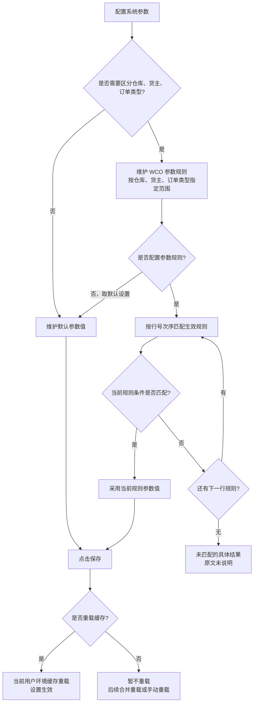
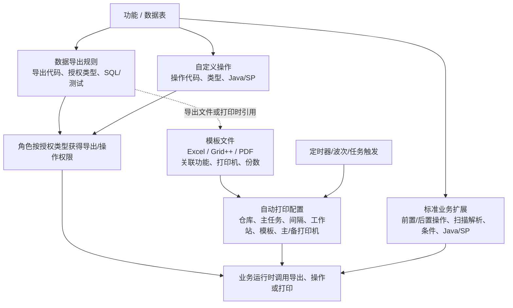
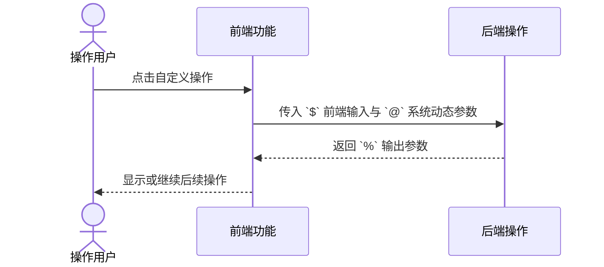
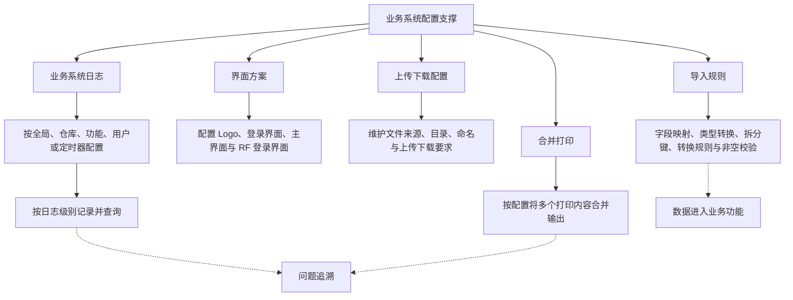

# 5. 业务系统配置

> 本章定位：呈现系统配置参数的作用范围、规则匹配、缓存生效，以及导出、模板、自动打印和业务扩展的关键配置关系；不复刻全部配置字段。
>
> 来源：`../01-按章节拆分的md文件（1119页版本）/05-业务系统配置.md`；原 PDF 第 158—259 页。

## 5.1. 系统参数配置与生效

### 用途

这张图把默认参数、WCO 参数规则、按行号匹配和保存后的缓存重载放在同一张中等粒度图中。

### 原文依据

- 5.1 系统配置参数，原 PDF 第 158—161 页。
- 原文说明系统支持按仓库、货主、订单类型分别配置参数，简称 WCO 支持。
- 原文说明多条参数规则依据行号次序匹配；未配置规则时取默认设置。
- 原文说明修改参数保存时，系统会提示是否重载缓存。

### 关键说明

1. 不需要按仓库、货主、订单类型细分时，使用默认参数值；需要细分时，在参数规则页签维护对应范围。
2. 多条参数规则按行号次序匹配；原文没有说明同一条件下除行号以外的额外优先级。
3. 未配置参数规则时，系统取默认设置生效。对于已经配置规则但所有规则均未匹配时的具体结果，原文没有说明，因此图中单独标注为“原文未说明”。
4. 修改参数并保存后，选择“是”会重载当前用户环境缓存；选择“否”则暂不重载。

### 事实边界

不同参数支持的生效层级可能不同，部分参数不支持到订单类型；系统代码 `DOC_CTL_LST` 还会影响 WCO 单证类型选择。具体参数的可配置层级以原文和系统配置为准，本图不把所有参数都视为支持完整 WCO 层级。

## 5.2—5.6. 导出、操作、模板、自动打印与业务扩展

### 用途

补齐本章除系统参数外的配置对象，并区分“定义按钮/文件”和“运行时调用”两个层次。

### 原文依据

- 5.2 数据导出规则配置、5.3 自定义操作配置、5.4 模板文件管理，原 PDF 第 162—199 页。
- 5.5 自动打印配置、5.6 标准业务扩展配置，原 PDF 第 200—223 页。
- 规则均围绕功能/表配置；导出和自定义操作还要按授权类型由角色授权，详见 4.6、4.7。

### 关键说明

1. 数据导出规则先定义功能、表、导出代码、授权类型和查询 SQL；文件输出可选择 Excel、模板 Excel 或打印/PDF 等原文提供的方式。
2. 自定义操作需要定义操作类型和后端 Java/SP；前端参数、后端参数数量必须匹配，否则会报错。
3. 自定义操作参数符号的含义按原文保留：`@` 表示系统动态参数，`$` 表示前端输入，`%` 表示输出参数。
4. 模板文件可以关联功能、打印机、份数和打印方式；自动打印任务再配置工作站、重检、分组及主/备用打印机等运行条件。
5. 标准业务扩展可以放在业务操作前后，也可以用于扫描内容解析；具体执行条件和 Java/SP 由配置定义。

### 事实边界（导出、操作、模板、自动打印与业务扩展）

- 本图明确表达：导出规则、自定义操作、模板、授权、自动打印和标准业务扩展之间的配置引用关系。
- 原文未说明：不同业务功能的实际触发顺序、SQL 执行权限、打印失败重试和扩展执行失败后的回滚。
- 不应据此推导：配置对象之间存在一条所有业务都必须经过的运行时主链。

### 自定义操作参数传递

### 原文依据（自定义操作参数传递）

- 对应手册小节：5.3 自定义操作配置。
- 原 PDF 页码：172—176 页。
- 原文明确内容：自定义操作可以配置前端参数、后端参数和输出参数，参数符号分别承载前端输入、系统动态值和输出结果。

### 事实边界（自定义操作参数传递）

本图只表达参数从页面到后端再返回页面的方向。原文未说明具体自定义操作的参数校验、异常回滚和权限组合，不据此推导统一接口契约。

## 5.7—5.11. 配置、日志与输出支撑链

> 用途：补齐新版手册中业务系统日志、界面方案、上传下载、合并打印和导入规则的配置关系；这些能力是支撑项，不是业务单据主链。
>
> 原文依据：`../01-按章节拆分的md文件（1119页版本）/05-业务系统配置.md`；原 PDF 第 224—259 页。

### 关键说明

1. 日志配置按范围和级别控制记录粒度；用户级日志配置的有效期，原文说明为 3 天。
2. 导入规则不是单一文件上传动作，而是把字段映射、类型、拆分和校验配置组合起来，供具体导入功能使用。
3. 合并打印、界面方案和上传下载配置分别影响输出、页面呈现和文件流转，原文没有把它们规定为一条必经顺序。

### 事实边界

原文没有说明不同配置项之间的覆盖优先级、导入失败后的回滚策略或合并打印的具体模板算法；图中只保留配置用途和可追溯关系。
