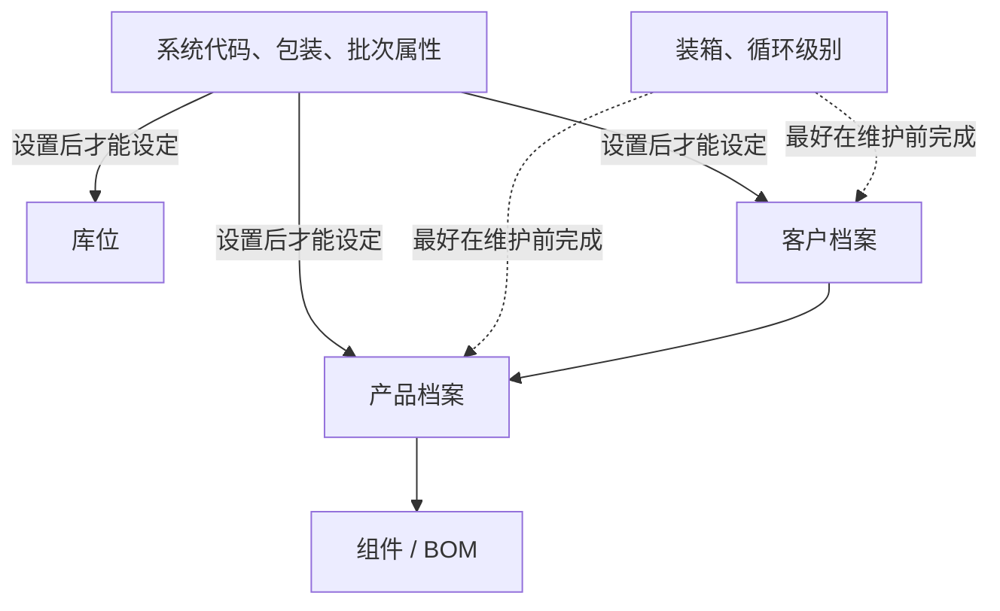
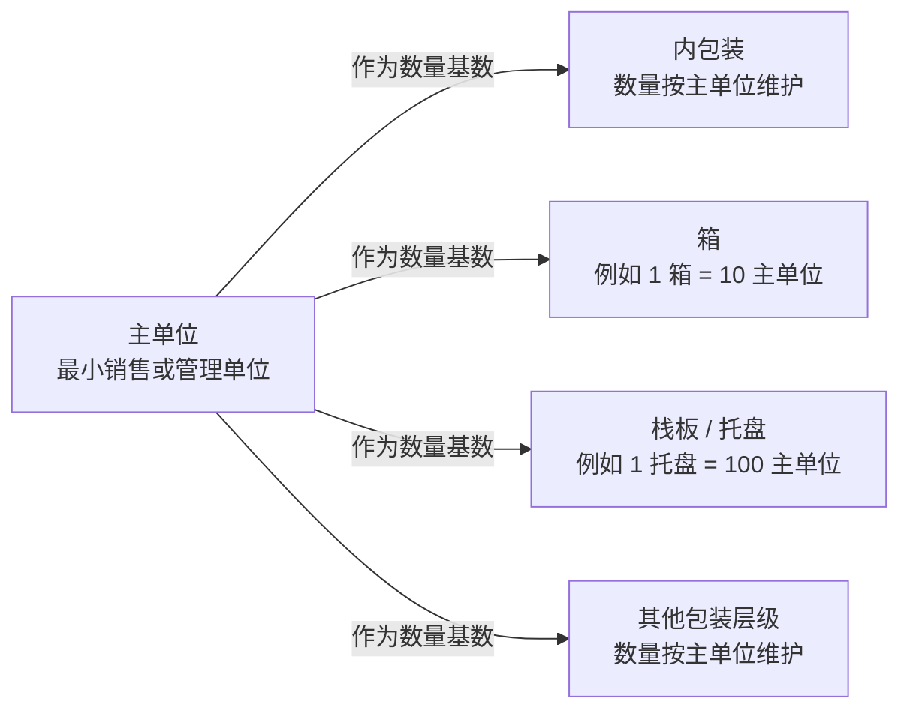
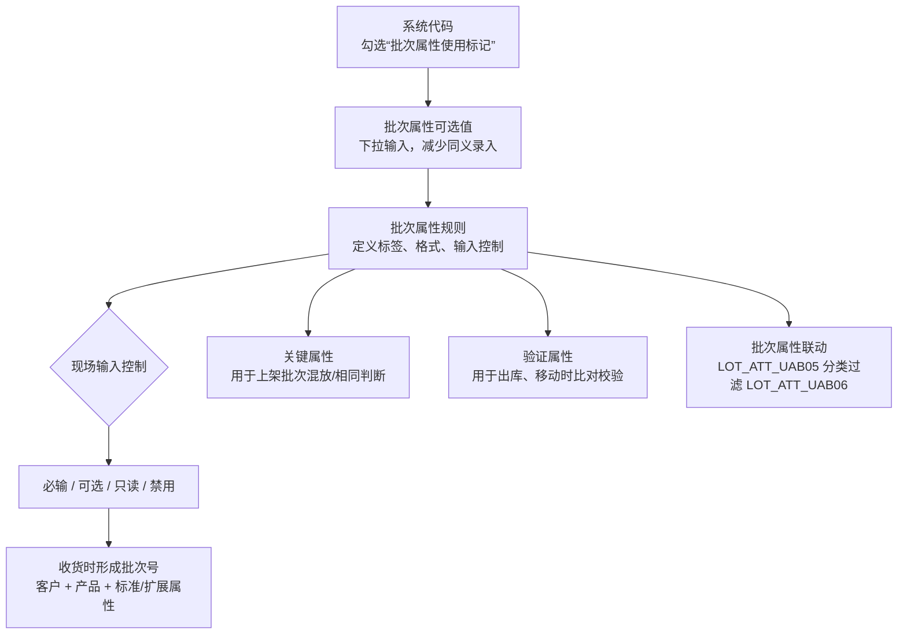
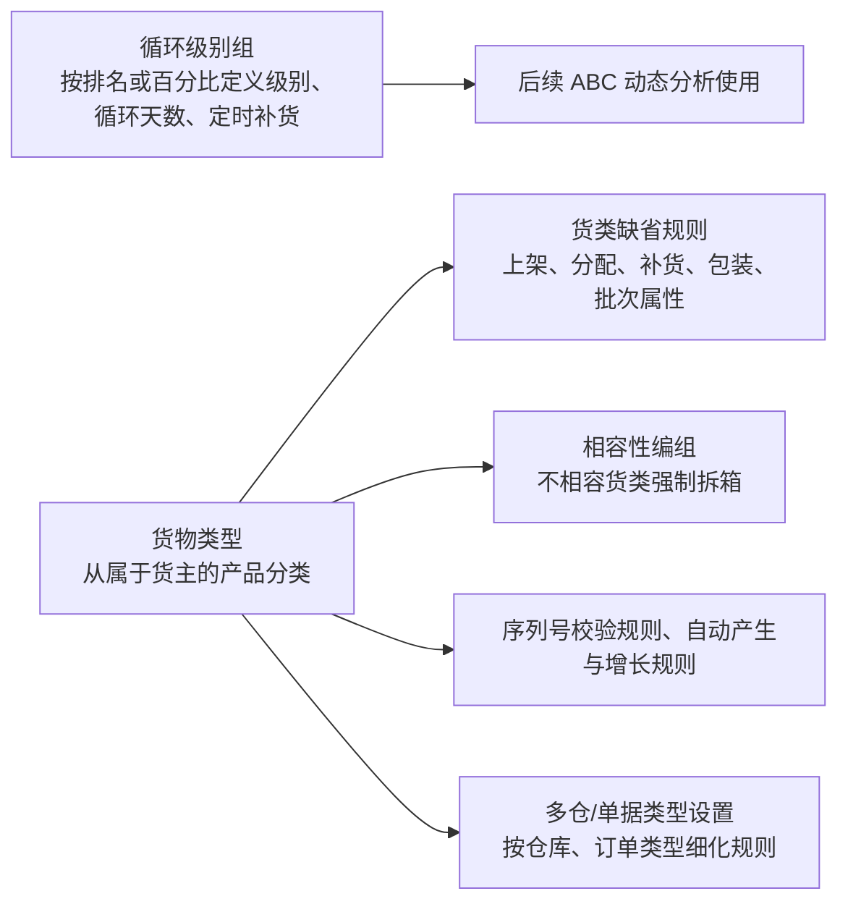
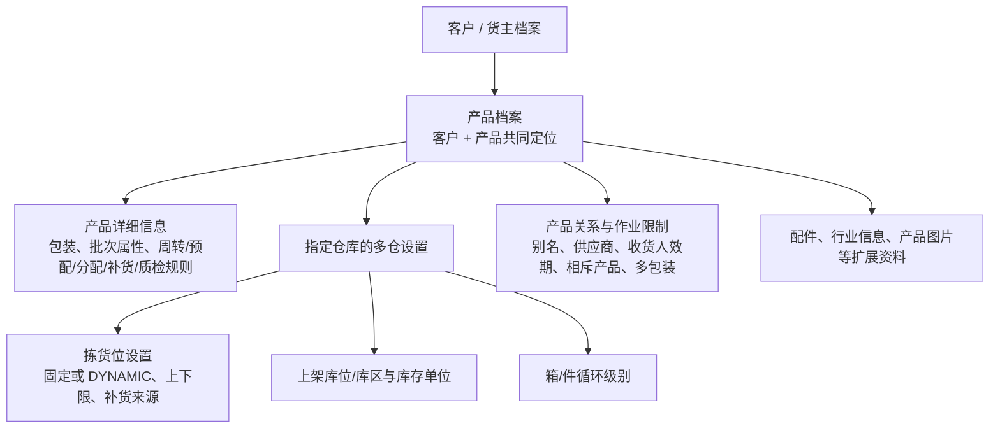
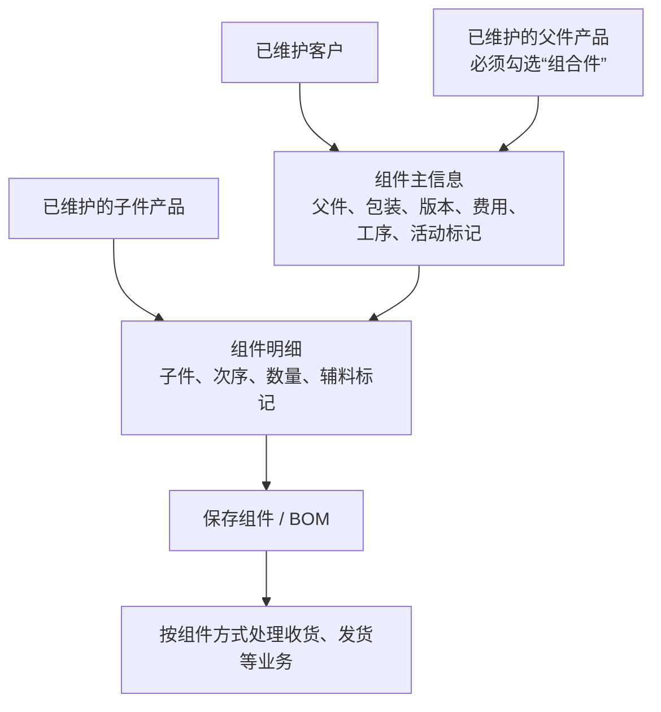

# 6. 基础设置

> 本章定位：呈现基础资料依赖、包装/批次/货类规则、客户与产品档案，以及组件 BOM 的关键关系；不复刻全部档案字段。
>
> 来源：`../01-按章节拆分的md文件（1119页版本）/06-基础设置.md`；原 PDF 第 260—328 页。

## 6.1. 基础设置依赖关系

### 用途

这张图只呈现手册明确提到的初始设置先后关系，不展开每个档案的字段配置。

### 原文依据

- 第 6 章开篇说明，原 PDF 第 260 页：系统代码、包装、批次属性等设置后，才能设定库位、客户、产品；装箱、循环级别最好在货主、产品维护前完成。
- 6.8 产品档案，原 PDF 第 296—325 页：产品由客户和产品共同定义，必须先确定客户存在。
- 6.9 组件，原 PDF 第 326—328 页：组件中的父件、子件需要先在产品档案中维护，父件还必须是组合件。

### 关键说明

1. 手册明确强调基础设置存在前后次序，界面菜单的排列顺序不等于初始实施顺序。
2. 图中的箭头表示“原文明确提到的前置关系”，不表示系统一定只有这一种配置顺序。
3. 产品的唯一定位需要结合客户和产品；因此图中把客户档案放在产品档案之前。
4. 组件只保留到“依赖产品档案”的层级。父件必须是组合件、子件数量和次序等细节，留在原章节文字中，不在此图展开。

### 事实边界

手册没有给出一份覆盖所有基础设置对象的完整依赖矩阵，也没有明确每个对象的系统校验时点。图中未将这些内容推导为确定流程。

## 6.2. 包装层级与主单位换算

### 用途

这张图用于理解包装代码中的主单位和其他包装层级之间的数量关系。

### 原文依据

- 6.1 包装，原 PDF 第 260—263 页：主单位用于计算库存余额，其他包装层级基于主单位换算。
- 原文示例：批发业务中可设置 1 箱 = 10 盒；托盘数量按主单位维护，例如 1 箱 = 10 件、1 托盘 = 100 主单位。

### 关键说明

1. 主单位不是固定只能选择“件”；手册说明应根据销售方式、批量管理方式和仓库存储管理方式选择。
2. 库存余额以主单位计算，箱、托盘及其他层级的数量以主单位为基础进行换算。
3. 同一产品在不同业务场景下可以选择不同的主单位，例如零售场景可能按件管理，批量仓库可能按箱管理。

### 事实边界

图中只表达“基于主单位换算”的关系，没有把包装材料、标签、装箱、序列号等控制字段画成流程节点；这些字段的具体作用以原文配置说明为准。

## 6.3. 批次属性规则与作业校验

### 用途

补充批次属性不只是“给批次起名字”：它决定现场能否录入、如何生成批次、上架时怎样判断混放，以及出库/移动时核对哪些信息。

### 原文依据

- 6.2 批次属性，原 PDF 第 264—269 页。
- 原文明确：批次号由客户、产品和 12 个标准批次属性、12 个扩展批次属性共同区分；系统代码可以作为批次属性下拉选项来源。

### 关键说明

1. 批次属性越多，进出库作业要求越细；原文不建议在不需要区分货物时增加过多跟踪属性。
2. `关键属性`服务于上架时的混放/相同判断，`验证属性`服务于出库、移动时的录入与比对，两者用途不同。
3. 批次属性下拉值需要先在系统代码中维护并勾选批次属性使用标记；属性联动时，`LOT_ATT_UAB06` 只显示与 `LOT_ATT_UAB05` 相同分类的数据。
4. 必输属性为空时，原文明确会在收货时提示并不可收货；只读属性适用于接口传入、现场不允许修改的内容。

### 事实边界

图中没有把 24 个属性逐项列出，也没有把批次号生成实现细节扩展为数据库规则；只保留原文明确的组成和使用关系。

## 6.3—6.4. 循环级别、货物类型与默认规则

### 原文依据

- 对应手册小节：6.3 循环级别、6.4 货物类型。
- 原 PDF 页码：270—277。
- 原文明确内容：循环级别用于 ABC 分类；货物类型从属于客户/货主，并可关联上架、分配、补货、包装、批次属性、多仓和单据类型等设置。

循环级别是用于 ABC 分类和仓库布局优化的分级资料；货物类型则从属于货主，可以为不同货类维护默认业务规则，也可以在多仓和单据类型层面继续细化。图中不把循环级别误画成货类的下一级，因为原文没有这种从属关系。

### 事实边界

- 本图明确表达：循环级别与 ABC 的用途、货物类型与默认规则的关联，以及多仓/单据类型的细化入口。
- 原文未说明：多个默认规则同时命中时的全局优先级、规则冲突处理和生效快照。
- 不应据此推导：循环级别一定参与具体库位算法，或货物类型一定覆盖 SKU、货主的全部配置。

## 6.7—6.8. 客户、产品与多仓作业设置

### 用途

说明产品档案为什么不是只有 SKU 名称，而是把客户关系、包装/批次/规则、多仓库位和作业限制集中到产品—仓库维度。

### 原文依据

- 6.7 客户档案、6.8 产品档案，原 PDF 第 282—325 页。
- 原文明确：产品由客户和产品共同定义；产品多仓设置可分别维护包装、上架/补货规则、库位、库存单位、循环级别等。

### 关键说明

1. 产品档案中的规则和多仓设置会影响后续收货、上架、分配、补货、复核等作业；图中只表达“档案被业务引用”，不推导每个字段的执行顺序。
2. 固定拣货位和动态拣货位是产品拣货位设置中的两种维护方式；拣货位还可以维护上下限、补货单位、来源库位等内容。
3. 别名对应供应商或收货人的产品代码，供应商关系可以用于收货校验，收货人效期用于不同收货人的有效期要求；这些都不是新的主 SKU。
4. 产品相斥关系既可能影响相邻存储，也可能影响出库装箱；原文明确说相斥产品需要在产品档案中已有记录。

### 事实边界

客户、产品和仓库之间的具体数据权限、接口同步和规则冲突，原文没有给出统一处理逻辑；图中不补充默认优先级。

## 6.9. 组件 / BOM 的父件与子件

### 原文依据

- 对应手册小节：6.9 组件。
- 原 PDF 页码：326—328 页。
- 原文明确内容：父件和子件需要先存在于产品档案，父件需勾选组合件；组件主信息和明细共同保存组件关系，版本号由接口获得。

组件配置前，父件和子件都必须已经存在于产品档案，且父件必须是组合件；版本号由接口获得，客户端不提供编辑。组件明细只记录子件的次序、数量及原文提到的辅料标记，不把组件误写成增值服务加工流程。

### 事实边界

- 本图明确表达：父件/子件的资料前置、组合件标记、组件表头/明细和接口版本号之间的关系。
- 原文未说明：BOM 版本生效、库存扣减、拆分/组装事务和组件变更对历史单据的影响。
- 不应据此推导：保存组件就会立即产生库存转化，或所有收货/发货都必须按 BOM 展开。
