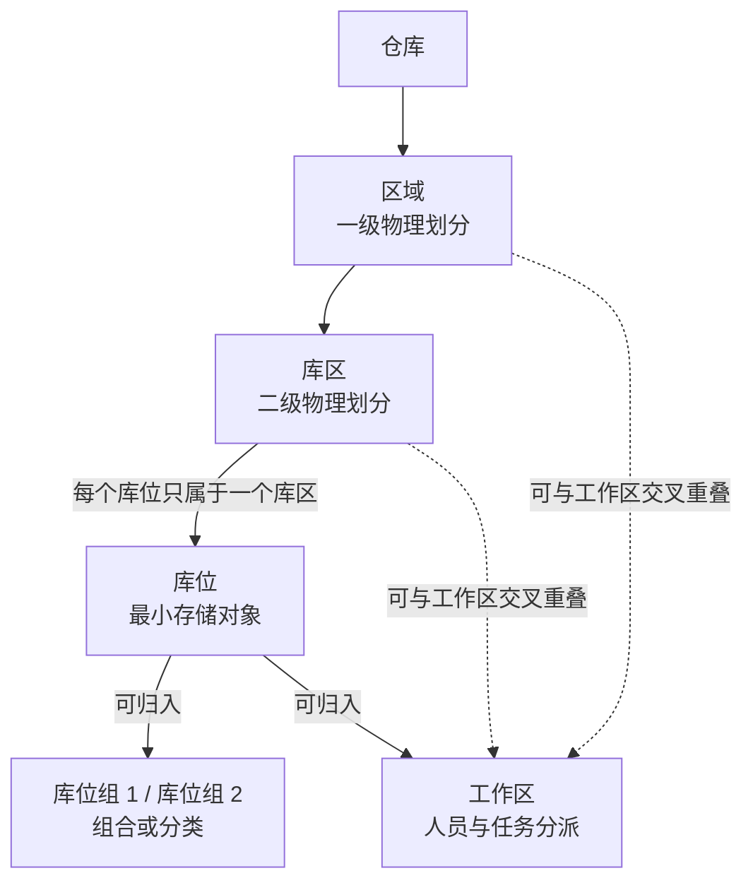
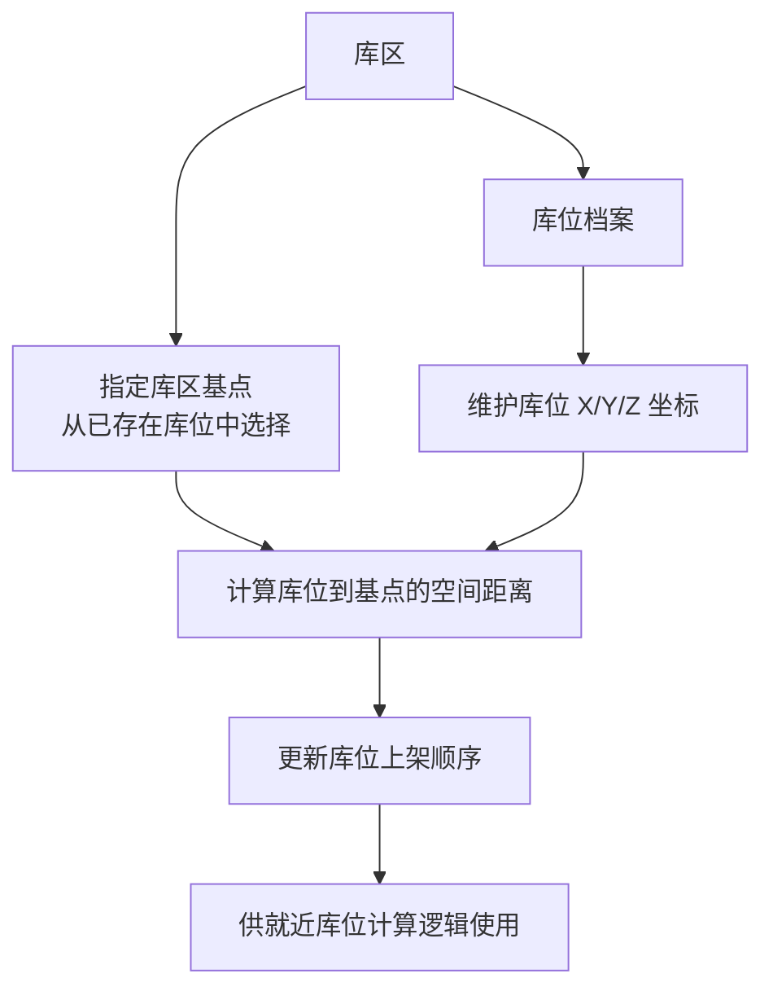
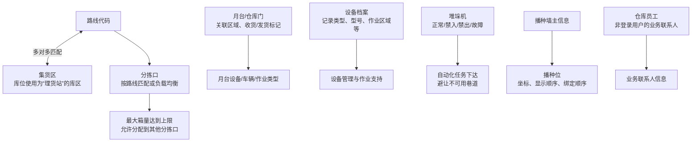
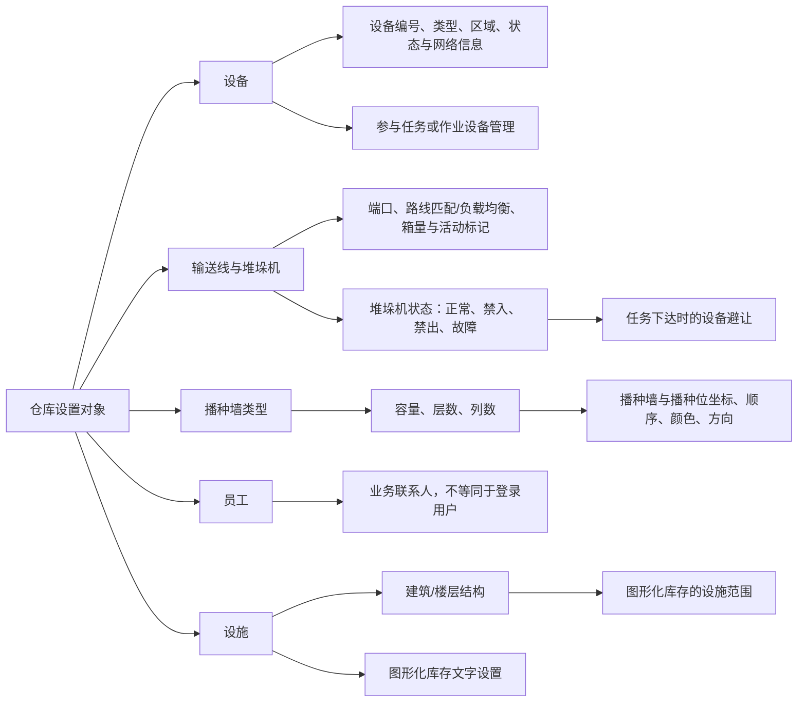

# 7. 仓库设置

> 本章定位：呈现仓库物理层级、就近库位计算，以及路线、月台、设备、分拣和播种配置的关键关系；不复刻全部字段。
>
> 来源：`../01-按章节拆分的md文件（1119页版本）/07-仓库设置.md`；原 PDF 第 329—362 页。

## 7.1. 仓库物理层级与附加分组

### 用途

这张图用于区分仓库的物理层级和面向任务、查询、人员管理的附加分组。

### 原文依据

- 7.1 区域和库区，原 PDF 第 329—331 页：区域是仓库下的一级物理划分，库区是区域下的二级物理划分，每个库位只在一个库区中。
- 7.2 库位组，原 PDF 第 332 页：库位组是库位的组合或分类方式，通常用于任务获取、查询和报表。
- 7.3 工作区，原 PDF 第 333—334 页：工作区用于定义作业人员的分管片区，工作区与区域、库区可以交叉重叠。
- 7.4 库位，原 PDF 第 335—345 页：库位是仓库最小存储对象，并维护所属库区、区域、库位组和工作区等信息。

### 关键说明

1. 区域和库区描述仓库的物理划分；库位是实际存储对象的最小单位。
2. 库位组是灵活的组合或分类方式，手册举例用于巷道、输送线弹出口等组织场景。
3. 工作区更侧重人员工作管理和任务分派；库位需要维护所属工作区，任务调度时使用。
4. 工作区可以与区域、库区交叉重叠，因此没有把工作区画成物理层级中的下一级。

### 事实边界

手册没有规定所有仓库都必须配置库位组或工作区，也没有给出库位同时属于多个工作区时的处理规则。图中只表达文档明确的归属和交叉关系。

## 7.1、7.4. 库区基点、XYZ 坐标与就近上架

### 用途

补充库位档案里容易被忽略的计算信息：库位的物理坐标和库区基点可以参与系统的就近库位计算。

### 原文依据

- 7.1 区域和库区、7.4 库位，原 PDF 第 329—345 页。
- 原文明确：库位维护 XYZ 坐标，库区指定一个已有库位作为基点；系统按其他库位与基点的空间距离更新上架顺序。

### 关键说明

1. 库区基点不是普通的层级节点，而是特殊库位计算逻辑使用的参考点；不需要就近计算时原文说明可以跳过。
2. 只有先维护库位，才能在库区基点字段中选择已存在的库位。
3. 坐标影响距离计算和上架排序；图中不把 XYZ 当成库位编码或物理层级。

### 事实边界

原文只说明按空间距离更新上架顺序，没有给出距离公式、并列距离处理或与其他上架规则的优先级。

## 7.5—7.11. 路线、月台、设备、输送线、堆垛机、播种墙与员工

### 用途

把仓库设置中面向运输、自动化设备和播种作业的配置对象串起来，保留它们各自的边界。

### 原文依据

- 7.5 路线、7.6 月台、7.7 设备、7.8 输送线、7.9 堆垛机、7.10 播种墙、7.11 员工，原 PDF 第 346—359 页。
- 原文明确：路线与集货区支持多对多；分拣口可按路线匹配或负载均衡；堆垛机状态用于任务下达时避让；播种墙配置包含播种位顺序和图形化显示信息。

### 关键说明

1. 路线—集货区关系在分配时用于计算匹配路线的集货位；一个路线可以关联多个集货区，原文要求支持多路线、多集货区的多对多匹配。
2. 分拣口可以选择“匹配路线”或“负载均衡”模式，一个分拣口可配置多条路线；最大箱量用于超限时切换分拣口。
3. 月台维护区域、设备/车辆/作业类型以及收货、发货标记；设备档案本身是设备信息，堆垛机状态才直接用于任务下达时的设备避让。
4. 播种墙需要先维护主信息，再维护播种位的坐标、显示名称、颜色、图标和绑定顺序；播种位数量不能超过播种墙类型的格数上限。
5. 仓库员工用于业务联系人等场景，不等同于业务系统管理中的登录用户。

### 事实边界

原文没有把路线、月台、分拣口、堆垛机和播种墙规定为一条所有仓库都必须执行的共同作业链。图中用配置引用关系表达用途，不推导设备接口和运输调度算法。

## 7.7—7.13. 设备、播种与图形化基础

> 用途：补齐设备、输送线、堆垛机、播种墙、员工、设施和图形化库存文字设置之间的对象关系。
>
> 原文依据：`../01-按章节拆分的md文件（1119页版本）/07-仓库设置.md`；原 PDF 第 349—362 页。

### 关键说明

1. 设备档案描述设备本身；堆垛机状态会影响任务下达时的设备避让。
2. 设施是图形化库存的空间基础，图形化库存文字设置用于配置希望显示的通道、分区等说明信息。
3. 播种墙需要先有播种墙类型，再维护具体播种墙和播种位；原文没有把播种墙配置直接等同于播种任务已生成。

### 事实边界

原文没有说明设备与 WCS 的完整接口协议、输送线的具体路由算法或图形化文字的最终渲染规则；图中不补充这些内容。
