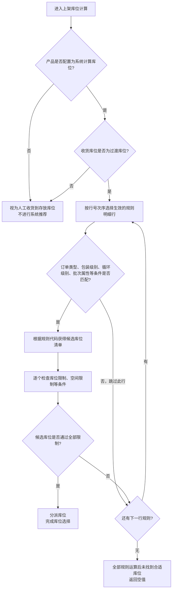
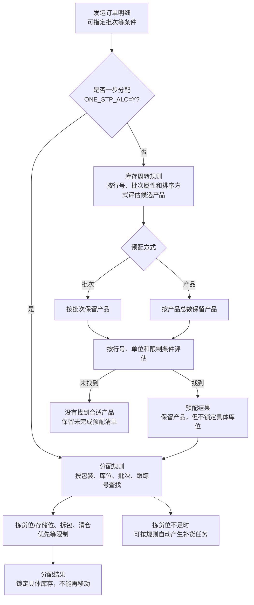

# 8. 业务规则

> 本章定位：呈现业务规则层次、上架计算，以及库存周转、预配、分配和其他规则的使用落点；不推导未说明的统一执行顺序。
>
> 来源：`01-按章节拆分的md文件/08-业务规则.md`；原 PDF 第 175—184 页。

## 8.1. 业务规则层次与优先关系

### 用途

这张图只呈现规则作用层次和原文明确的优先关系，不把 15 类业务规则全部展开成流程节点。

### 原文依据

- 8.1 业务规则概述，原 PDF 第 175—176 页。
- 原文列出上架、库存周转、预分配、分配、补货、质检、流水号、定时任务、波次计划、自动发运、路线、配送、单证控制、任务派发和序列号等规则。
- 原文明确说明业务规则的优先级：订单层次优先于产品层次，产品层次优先于客户层次。

### 关键说明

1. 业务规则可以配置在客户、产品和订单层次。
2. 本章原文明确的优先关系是：订单 > 产品 > 客户。
3. 这张图表达的是优先级层次，不代表所有业务规则都一定同时在三个层次配置。
4. 业务规则类型较多，本轮只在文字中保留类别范围，具体规则分别在后续小节说明。

### 事实边界

原文没有说明不同规则类型之间的统一执行顺序，也没有说明同一层次多条规则发生冲突时的处理方式。本图不补充这些规则。

## 8.2. 上架规则计算流程

### 用途

这张图展开本章最重要的细粒度逻辑：什么时候执行系统上架计算、如何按规则明细逐行匹配，以及没有找到库位时如何结束。

### 原文依据

- 8.2 上架规则，原 PDF 第 176—178 页。
- 原文说明执行上架计算的前提：产品配置为系统计算库位，且收货库位为过渡库位。
- 原文说明评估顺序：按行号选择生效明细行，检查条件，获取候选库位，检查库位和空间限制，分派库位；找不到合适库位则继续下一行，全部失败返回空值。

### 关键说明

1. 产品若不是系统计算库位，或收货库位不是过渡库位，原文将其视为人工收货到存放库位，不需要系统进行上架计算和推荐。
2. 规则明细按行号顺序处理；条件不符时跳过当前行，继续查看下一行。
3. 规则代码先决定候选库位清单，之后再逐个检查库位限制、空间限制等条件。
4. 候选库位通过全部限制后即完成库位选择；当前行找不到合适库位时，继续下一行规则。
5. 所有规则运算后仍没有找到合适库位，系统返回空值。

### 事实边界

原文没有说明候选清单为空时是否有单独提示，也没有说明异常处理、人工介入和后续任务状态。本图只呈现文档明确的计算和结束结果。

## 8.1—8.15. 业务规则类型与使用环节

### 用途

补齐本章规则目录的全貌，但不把原文没有规定统一先后顺序的规则硬拼成一条状态机。

### 原文依据

- 8.1—8.15，原 PDF 第 175—218 页。
- 原文列出上架、库存周转、预配、分配、补货、质检、流水号、定时器、波次计划、自动发运、路线、配送、单证控制、任务派发、序列号和波次调度等规则。

```mermaid
flowchart TD
    RULES[业务规则配置]
    INBOUND[入库/库存处理]
    OUTBOUND[出库分配]
    SCHEDULE[自动调度]
    SHIP[发运与单据]
    TASK[现场任务]
    PUT[上架规则]
    TURN[库存周转规则]
    PRE[预配规则]
    ALC[分配规则]
    RPL[补货规则]
    QC[质检规则]
    SERIAL_ID[流水号规则]
    DOC_ID[单证/ID 生成]
    TIMER[定时器]
    WAVE[波次计划规则]
    AUTO[自动发运规则]
    ROUTE[路线规则]
    DELIVERY[配送规则]
    DOC[单证控制规则]
    DISPATCH[任务派发规则]
    SN[序列号规则]
    WAVE_TIME[波次调度规则]

    RULES --> PUT
    RULES --> TURN
    RULES --> PRE
    RULES --> ALC
    RULES --> RPL
    RULES --> QC
    RULES --> SERIAL_ID
    RULES --> TIMER
    RULES --> WAVE
    RULES --> AUTO
    RULES --> ROUTE
    RULES --> DELIVERY
    RULES --> DOC
    RULES --> DISPATCH
    RULES --> SN
    RULES --> WAVE_TIME
    PUT --> INBOUND
    QC --> INBOUND
    TURN --> OUTBOUND
    PRE --> OUTBOUND
    ALC --> OUTBOUND
    RPL --> TASK
    SERIAL_ID --> DOC_ID
    TIMER --> SCHEDULE
    WAVE --> SCHEDULE
    WAVE_TIME --> SCHEDULE
    AUTO --> SHIP
    ROUTE --> SHIP
    DELIVERY --> SHIP
    DOC --> SHIP
    DISPATCH --> TASK
    SN --> INBOUND
    SN --> SHIP
```

### 关键说明

1. 其中最紧密的出库规则链是“库存周转→预配→分配”：库存周转负责候选库存排序，预配按批次或产品保留库存，分配再按库位、批次和跟踪号锁定具体库存。
2. 上架、质检、补货、流水号、定时器、波次、自动发运、路线、配送、单证、任务派发和序列号分别服务于各自业务环节，不应因为都叫“规则”就假设它们有一套统一优先级。
3. 波次计划规则负责订单组合和波次生成；波次调度规则负责波次计划规则的运行时间与前置筛选条件，二者职责不同。

### 事实边界

图中的“使用环节”是按原文功能描述做的归类，不表示规则配置后一定自动运行，也不表示各类规则之间存在图中未说明的执行顺序。

## 8.3—8.5. 库存周转、预配与分配的出库关系

### 用途

把本章对出库影响最大的三类规则放在同一张图里，突出“预配保留产品但不锁定库位”和“分配才锁定具体库存”的差别。

### 原文依据

- 8.3 库存周转规则、8.4 预配规则、8.5 分配规则，原 PDF 第 184—193 页。
- 原文明确：一步分配 `ONE_STP_ALC=Y` 时跳过预配；预配可按批次或产品保留，分配按库位、批次和跟踪号锁定，已分配库存不能移动。

### 关键说明

1. 库存周转规则可以使用产品默认规则，也可以在发运订单中人工修改；批次属性在订单明细中指定时，系统只分配被请求的属性。
2. 预配的“包装规则优先”可以按包装级别指定拣货区或存储区；“超量预配”用于整包装不能拆分且订单数量不是包装整数倍的场景。
3. 分配规则决定整托/整箱拆分、存储位拣选、清仓优先、最优解、拣货位超量分配、自动补货和动态拣货位等选项是否参与分配。
4. 预配成功不代表已经拿到确定库位；只有分配完成后，库存才按库位、批次和跟踪号被订单锁定。

### 事实边界

原文没有给出每个分配选项在冲突时的统一优先级，图中只画它们作为分配规则的限制项，不推导算法细节。

## 8.6—8.15. 其他规则的关键落点

| 规则 | 原文明确的关键落点 |
| --- | --- |
| 补货规则 | 动态拣货位没有库存、需要寻找新的空拣货位时，引用上架规则进行计算。 |
| 质检规则 | 根据期望数量区间计算应检数量；样本数量与检验百分比同时设置时，检验百分比优先生效。 |
| 流水号规则 | 通过仓库、前缀、日期格式和流水长度定义单证号/ID 生成方式；总长度有上限要求。 |
| 定时器 | 配置按天、周、月等频率，执行补货、波次等系统任务；执行结果可查询。 |
| 波次计划规则 | 按仓库、货主、承运人、订单类型、路线、产品组合、件数等条件组合订单，并可控制是否产生播种/分拣任务和自动下发。 |
| 自动发运规则 | 选择拣货、称重、复核、装箱、运输交接等完成节点，满足所选节点后取得自动发运资格。 |
| 路线规则 | 按订单重量、体积等范围，在路线下指定承运人。 |
| 配送规则 | 按仓库、货主、承运人等条件选择运单号生成规则和箱型。 |
| 单证控制、任务派发、序列号与波次调度 | 分别用于单证控制、任务执行、序列号合法性校验，以及波次规则的运行时间和前置筛选。 |

表格只补齐各节的业务落点，不把手册没有说明的字段组合、定时器优先级或规则冲突处理写成结论。
