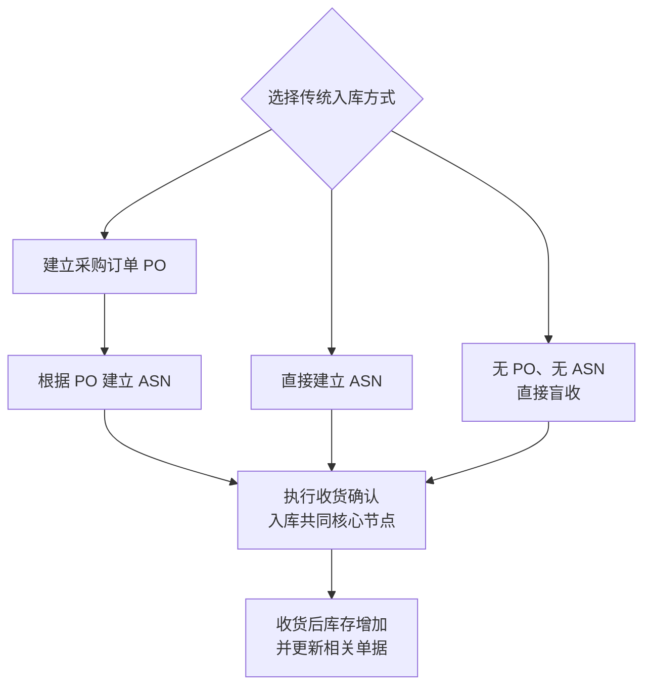
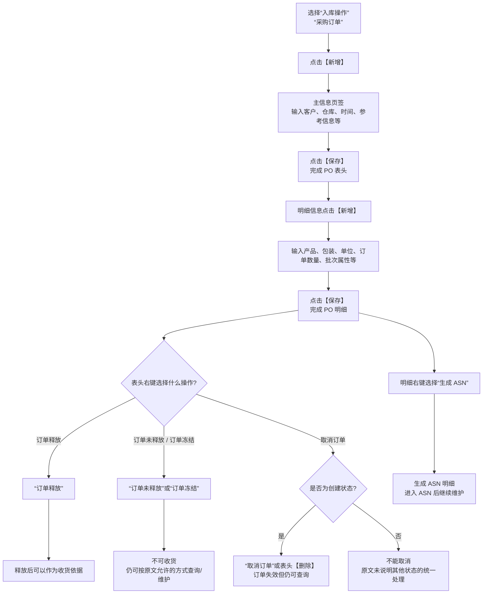
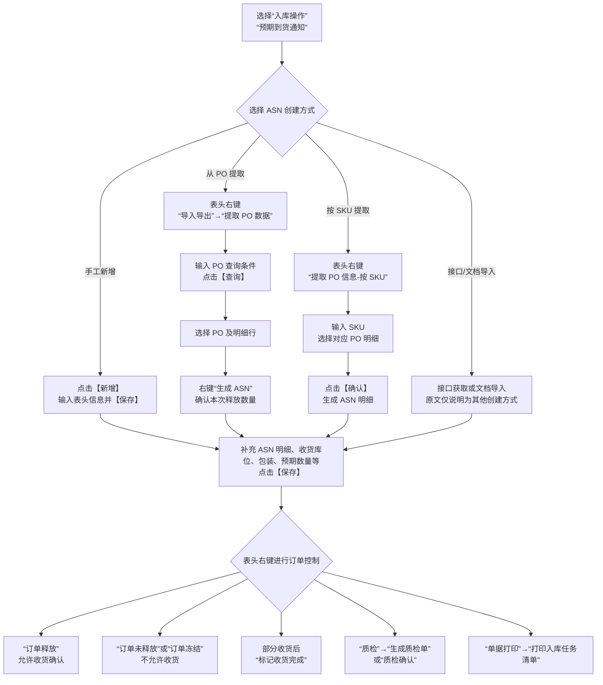
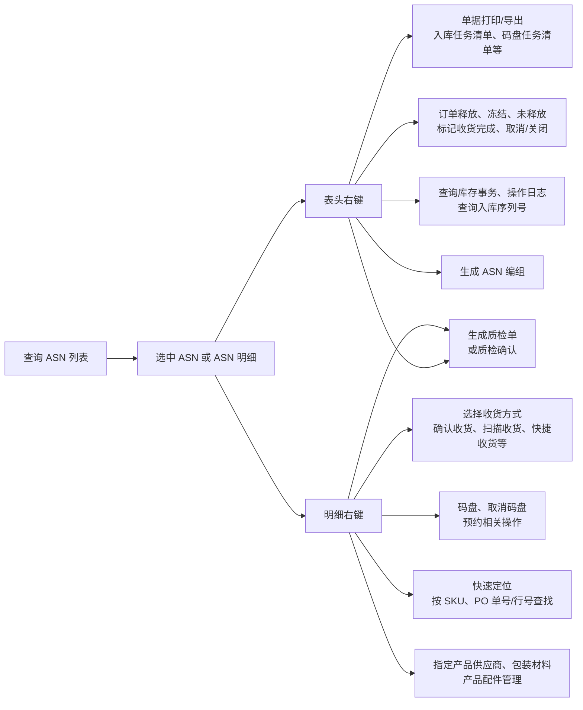
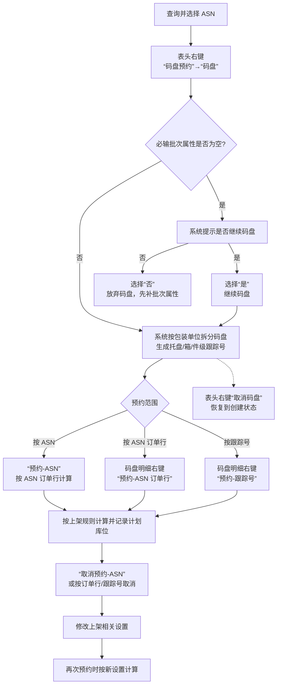
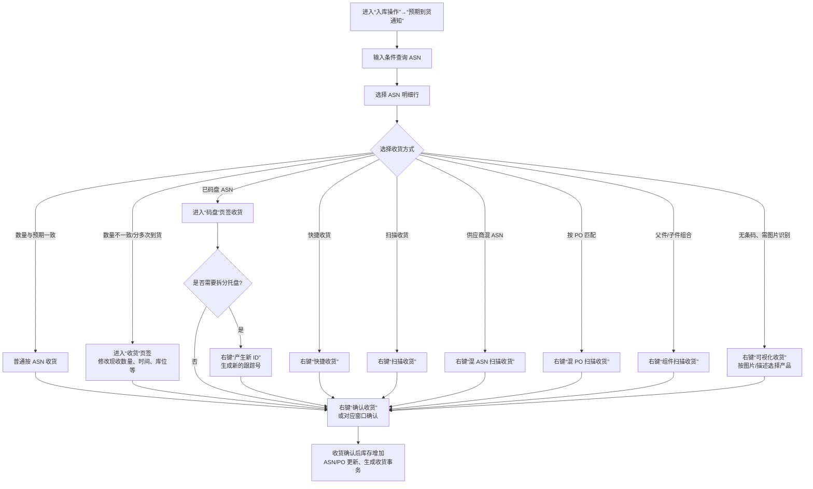
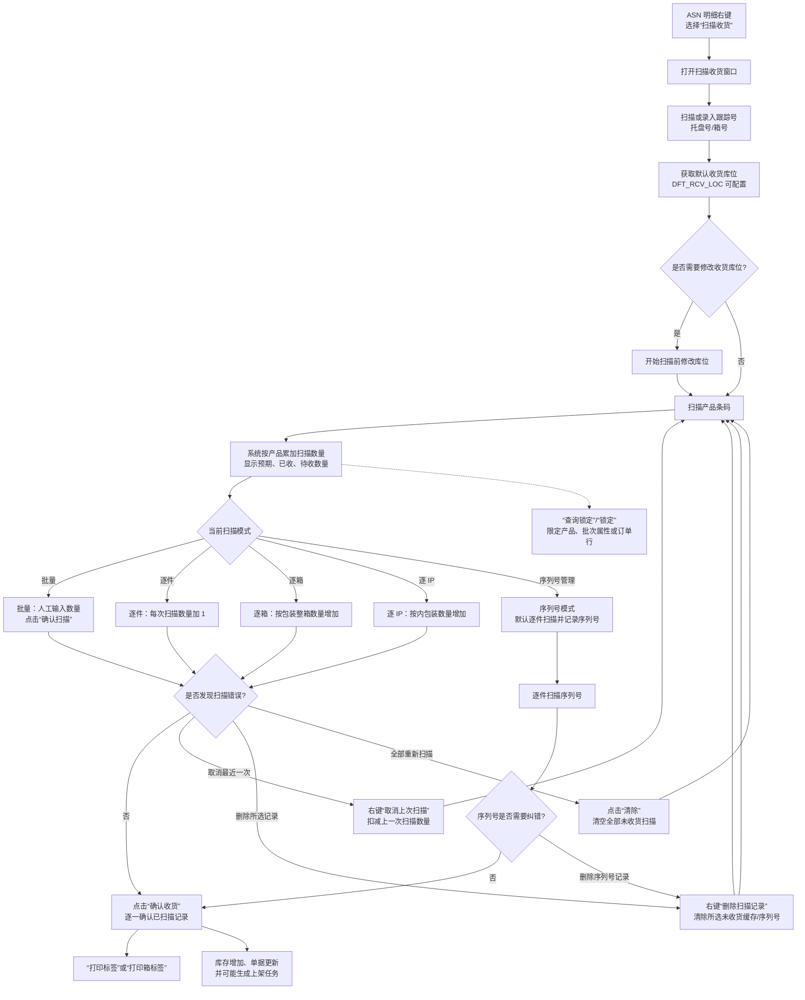
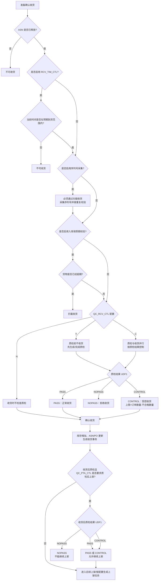
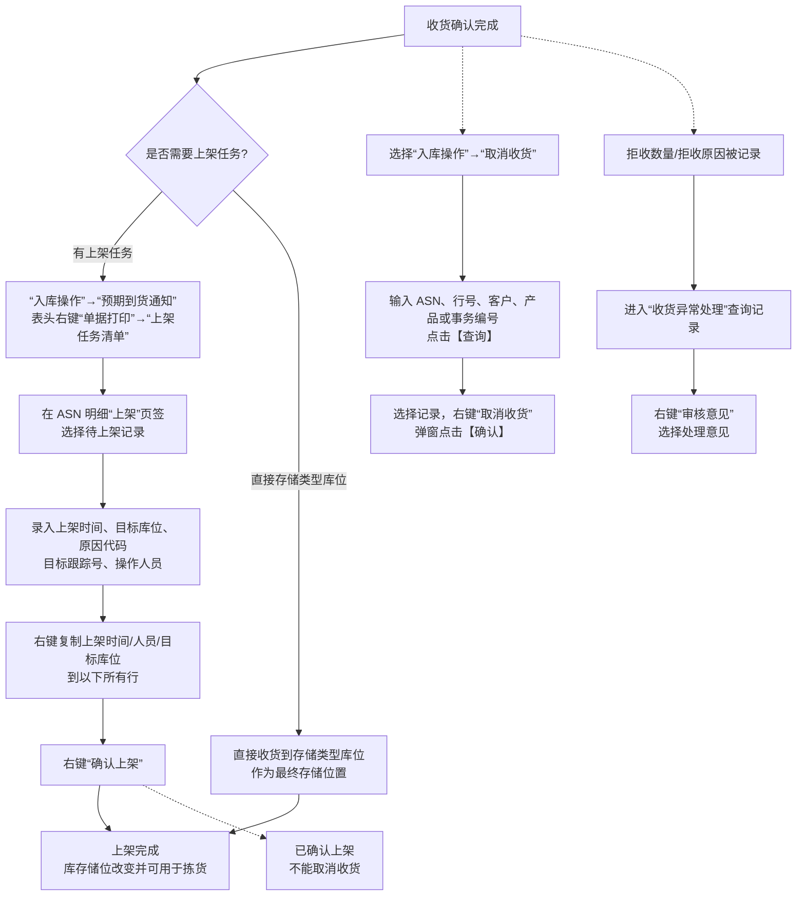
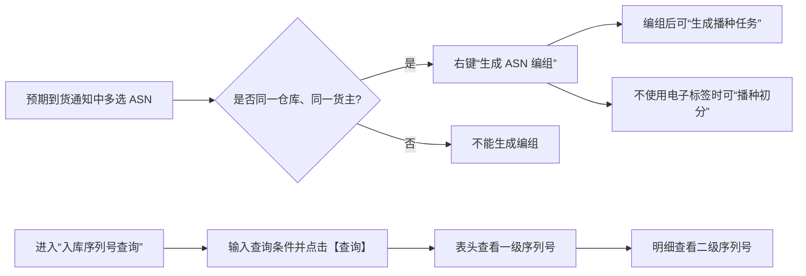

# 9. 入库操作

> 本章定位：把入库从“收货后形成库存”的业务概念，拆成可执行的单证操作、右键菜单、收货方式、质检控制、上架确认和反向处理。
>
> 来源：`01-按章节拆分的md文件/09-入库操作.md`；原 PDF 第 219—288 页。

## 9.1. 学习重点

1. 入库的共同核心是收货；PO、ASN、码盘、预约、质检、上架是否使用，要看具体业务和参数。
2. PO 不是仓库直接收货的必需单据；ASN 可以从 PO 生成，也可以直接新增，甚至可以在没有 PO、ASN 的情况下盲收。
3. 收货确认会增加库存、更新 ASN/PO 并生成收货事务；上架只改变储位，但未上架库存通常不能参与出库。
4. 收货现场最重要的分支是：完整收货还是部分收货、普通收货还是扫描收货、是否码盘、是否需要序列号、是否受时间/保质期/质检控制。

## 9.2. 入库入口与共同主链

### 用途

先看入库的三种入口和共同的收货节点。后面的操作图会把 PO、ASN、码盘、质检和上架分别展开。

### 原文依据

- 9.1 入库流程概述，原 PDF 第 219—220 页。
- 原文列出：PO → ASN → 收货；直接 ASN → 收货；无 PO、无 ASN 的盲收。
- 原文明确：收货是必须节点，其他节点按业务流程选择使用。

### 关键说明

1. PO 不是入库必需步骤；仓库可以直接新增 ASN，也可以无单盲收。
2. ASN 是收货文档，也是现场核对货物的依据。
3. 本章只展开传统配送入库；原文将 Cross Dock 留给其他培训材料。

### 事实边界

图中没有把码盘、预约、质检、上架画成共同必经节点，因为原文明确说明这些操作按业务流程选择使用。

## 9.3. PO 的创建、释放与生成 ASN

### 用途

把“新增 PO”以及表头、明细右键菜单中的关键动作画出来。产品经理需要特别记住：释放状态直接影响能否收货，PO 明细可以作为 ASN 的来源。

### 原文依据

- 9.2 采购订单，原 PDF 第 220—227 页。
- 操作入口：“入库操作”→“采购订单”→【新增】；表头和明细分别通过【保存】完成维护。
- 表头右键包括“订单释放”“订单未释放”“订单冻结”“取消订单”；明细右键包括“生成 ASN”“取消订单行”“关闭订单行”。

### 操作步骤

1. 进入“入库操作”→“采购订单”，点击【新增】。
2. 在“主信息”页签输入客户、仓库、预期到货时间、参考信息等，点击【保存】。
3. 在明细信息部分点击【新增】，录入产品代码、包装代码、单位、订单数量和批次属性，点击【保存】。
4. 需要审核通过后收货时，在表头右键选择“订单释放”；暂不允许收货时选择“订单未释放”或“订单冻结”。
5. 需要从 PO 创建 ASN 时，在明细右键选择“生成 ASN”。

### 关键说明

1. PO 的“订单未释放”和“订单冻结”都会阻止收货；原文将“未释放”更多用于尚未审核，将“冻结”用于审核有问题的订单。
2. 只有创建状态 PO 可以取消；取消后仍可查询，但不能继续按该订单操作。
3. PO 的收货数量不是在 PO 中人工确认，而是在 ASN 关联 PO 后由 ASN 收货更新。

### 事实边界

原文没有给出 PO 全部状态的完整状态机，也没有说明每一种状态下所有菜单项的可用性。图中只画原文明确的释放、冻结、未释放、取消和生成 ASN 关系。

## 9.4. ASN 的创建路径与表头控制

### 用途

这一图解决两个常见问题：ASN 到底怎样创建，以及创建完成后如何通过右键菜单控制是否允许收货。

### 原文依据

- 9.3.1 单证创建，原 PDF 第 227—242 页。
- 手工创建：进入“入库操作”→“预期到货通知”→【新增】，维护表头和明细后【保存】。
- PO 导入：ASN 表头右键“导入导出”→“提取 PO 数据”，查询 PO、选择明细、选择“生成 ASN”、确认。
- 按 SKU 导入：表头右键“提取 PO 信息-按 SKU”，输入 SKU，选择 PO 明细并【确认】。
- 表头右键还包括订单释放、订单冻结、订单未释放、标记收货完成、生成质检单、打印入库任务清单等。

### 操作步骤

1. 手工方式：在“预期到货通知”中点击【新增】，维护 ASN 表头，点击【保存】；在明细部分点击【新增】，维护产品和预期数量，再点击【保存】。
2. PO 提取方式：先保存一个 ASN 表头，再在表头右键选择“导入导出”→“提取 PO 数据”；查询并选择 PO、PO 明细，右键选择“生成 ASN”，确认本次释放数量。
3. 按 SKU 提取方式：表头右键选择“提取 PO 信息-按 SKU”，输入 SKU，选择 PO 明细，点击【确认】。
4. 如果只是上游接口或文档导入，原文说明系统可以获取或导入已创建的 ASN，但没有在本章展开接口配置步骤。

### 关键说明

1. 新增 ASN 的默认释放状态由 `ASN_RLS_CTL` 获取；未释放 ASN 仍可查看、编辑、打印，但不具有收货资格。
2. 一个 ASN 可以从多个 PO 提取信息，一个 PO 也可以关联多个 ASN。
3. 部分收货的 ASN 不一定会自动关闭；需要使用“标记收货完成”告诉系统该单不再继续收货。
4. “生成质检单”和“质检确认”不是同一操作：前者创建质检单据，后者只标记已做质检且不记录详细质检作业。

### 事实边界

原文列出的接口和文档导入只说明入口，不提供本手册范围内的配置细节。因此图中没有补充接口格式、字段映射或导入校验结果。

## 9.5. ASN 表头与明细右键：从单据到作业

### 用途

这张图专门呈现“选中 ASN 后到底在哪里点击什么”。它不是状态图，而是操作入口图，用来避免把表头菜单和明细菜单混用。

### 原文依据

- 9.3.2—9.3.4 表头右键、明细右键和单据输出，原 PDF 第 242—251 页。
- 表头菜单：取消/关闭、复制、订单控制、质检、查询事务/日志/序列号、标记收货完成、生成 ASN 编组、清除 ASN 明细、打印/导出。
- 明细菜单：取消订单行、收货方式选择、码盘相关、快速定位、指定产品供应商、生成质检单、包装材料、产品配件管理。

### 关键说明

1. 同一个“收货方式”入口在 ASN 明细右键；“订单释放/冻结/未释放”在表头右键。
2. 码盘后的 ASN 需要在码盘页签操作收货，普通 ASN 明细收货菜单可能不再可用。
3. “选择未收货记录”可以避开已经完全收货的行，减少批量全选时被已收货行干扰。
4. “复制收货时间/库位/操作人员/批次属性/服务信息/跟踪号到以下各行”属于批量录入辅助，不改变其作为收货确认入口的事实。

### 事实边界

不同页签和不同单据状态会显示不同右键菜单。图中只按原文归纳菜单的业务用途，没有把所有按钮都画成可在任何状态下使用。

## 9.6. 码盘、预约与取消重做

### 用途

把码盘和库位预约的先后关系、菜单路径以及异常重做路径画清楚。

### 原文依据

- 9.4 码盘预约，原 PDF 第 251—254 页。
- 码盘：表头右键“码盘预约”→“码盘”；也可以在 ASN 明细行右键码盘。
- 预约：必须在码盘后进行；表头右键“预约-ASN”，或码盘明细页签右键按 ASN 订单行/按跟踪号预约。
- 取消码盘、取消预约后可以重新操作；码盘时遇到必输批次属性为空，会出现继续/放弃提示。

### 操作步骤

1. 选中 ASN，在表头右键选择“码盘预约”→“码盘”。
2. 码盘完成后进入码盘明细页签；按整体、ASN 订单行或跟踪号选择预约范围。
3. 需要整体预约时选择“预约-ASN”；需要局部预约时选择“预约-ASN 订单行”或“预约-跟踪号”。
4. 码盘或预约设置错误时，先选择对应的取消功能；取消预约后修改上架设置，再重新预约。

### 关键说明

1. 码盘是可选环节，但启用 `PLT_RCV` 时对应类型单据必须码盘收货。
2. 预约必须在码盘后执行，因为系统要按托盘分别计算库位。
3. 一旦完成预约，上架时系统直接提取计划库位，不再重新计算，但现场仍可修改目标库位。
4. 码盘后的托盘、箱或件级跟踪号会成为后续收货、上架和跟踪的作业对象。

### 事实边界

原文没有把所有上架规则计算条件在本章重述。图中只呈现“码盘后预约、按规则计算并记录计划库位”的明确关系。

## 9.7. 收货方式选择与普通/部分收货

### 用途

把普通收货、部分收货、码盘收货和其他收货方式的入口分开，重点说明“实际数量在哪里改、最后通过哪个右键动作确认”。

### 原文依据

- 9.5.1—9.5.3、9.5.5—9.5.6，原 PDF 第 255—269 页。
- 普通收货：ASN 明细选择行，右键确认收货。
- 部分收货：在收货页签修改现收数量、收货库位、收货时间、跟踪号、批次属性等，再右键确认收货。
- 码盘收货：在码盘页签操作；可以使用“产生新 ID”拆分托盘。
- 其他入口：快捷收货、混 ASN 扫描收货、混 PO 扫描收货、组件扫描收货、可视化收货。

### 操作步骤

1. 进入“入库操作”→“预期到货通知”，查询并选中 ASN 明细。
2. 数量与预期一致时，明细右键选择“确认收货”。
3. 数量不足、分多车到货或需要补录历史收货时，在“收货”页签修改“现收数量”和“收货时间”等信息，再右键确认收货。
4. 已码盘 ASN 在码盘页签收货；如果一个托盘需要拆出不同产品或不同状态，先右键“产生新 ID”，再分别确认。
5. 无条码或需要混单匹配时，选择对应的快捷收货、混 ASN、混 PO、组件或可视化收货入口。

### 关键说明

1. 部分收货允许同一明细多次确认；现收数量以本次实际到货为准。
2. 收货库位可以从默认过渡库位改为最终存储库位；直接收货到存储类型库位时，原文说明不再生成上架任务。
3. 码盘收货时，已码盘 ASN 的普通明细收货入口可能不可用，必须在码盘页签操作。
4. 组件扫描收货需要子件数量满足 BOM 组合；子件数量超过 BOM 数量时系统报错。

### 事实边界

原文对快捷收货和 RF 收货的界面细节没有完全展开。图中只标出入口和共同结果，不把不同设备的扫描动作混画成同一个页面。

## 9.8. 扫描收货：扫描队列、按钮与纠错分支

### 用途

这是入库现场最需要操作细节的一张图：扫描什么、何时确认、如何清除错误、何时锁定收货范围，以及哪些设置会改变扫描行为。

### 原文依据

- 9.5.4 扫描收货，原 PDF 第 259—267 页。
- 入口：ASN 明细右键“扫描收货”。
- 主要按钮：确认扫描、确认收货、打印标签、清除、锁定/解除焦点、新箱号、允许/禁止混箱。
- 右键：取消上次扫描、删除扫描记录、确认产品、查询锁定、锁定、解除当前锁定、解除全部锁定。

### 操作步骤

1. 在 ASN 明细右键选择“扫描收货”，打开扫描收货窗口。
2. 扫描跟踪号；根据现场需要在开始扫描前修改收货库位。开始扫描后，本批次收货库位不可修改，确认后下一批可以重新设置。
3. 扫描产品条码，系统累加数量。批量模式需要点击“确认扫描”；逐件、逐箱、逐 IP 模式按操作选项累加。
4. 扫描完成后点击“确认收货”；收货前可以点击“打印标签”或“打印箱标签”。
5. 扫描错误时，使用“取消上次扫描”“删除扫描记录”或“清除”；产品有多行记录时，可以使用“查询锁定”或“锁定”限定收货对象。

### 关键说明

1. `DFT_RCV_LOC` 决定默认收货库位，但现场可以在开始扫描前修改。
2. 序列号模式下系统按逐件扫描；当前扫描队列内的序列号不能重复。序列号模式下，原文说明不提供普通“取消上次扫描”，需要到序列号信息列表取消序列号扫描。
3. 操作选项还控制“提示新增 SKU、保留跟踪号、保留库位/属性、满箱提醒、自动确认收货”等行为；这些是作业配置，不是所有场景都必然开启。
4. “允许/禁止混箱”通常由 `RCV_MIX_SKU` 控制，也可以在现场临时切换。

### 事实边界

原文没有把“扫描到订单外 SKU”在所有参数组合下的结果统一写成同一个分支，只说明可通过参数控制是否新增 ASN 明细。因此图中不把新增 SKU 画成必然结果。

## 9.9. 收货校验、质检与系统结果

### 用途

把收货前后真正会阻断作业的控制集中在一张图里：释放状态、预期时间、序列号、保质期和质检结果。

### 原文依据

- 9.3.1、9.5.7、9.7，原 PDF 第 227—231、269—280 页。
- `RCV_TIM_CTL` 控制预期到货时间窗口。
- `SN#_CTL`、`SN#_RCV_VAL` 控制序列号采集和重复校验范围。
- 入库保质期校验会拦截已经超期的货物。
- `QC_RCV_CTL` 的 Y/C/N 控制收货前质检关系；质检结果代码的 `UDF1` 可为 PASS、NOPASS、CONTROL。

### 操作步骤

1. 需要正式质检时，在 ASN 表头右键选择“质检”→“生成质检单”；也可以在明细右键只为选中的行生成质检单。
2. 进入质检单明细，选择产品记录，在操作明细页签点击【新增】，录入实检数量、合格数量、不合格数量、检验结果、检验人等，保存。
3. 不需要记录详细质检过程时，可以使用 ASN 表头右键“质检确认”，但原文明确该动作不生成质检单、不记录详细质检信息。
4. 收货时系统按 `QC_RCV_CTL` 和质检结果校验；收货后质检还可能由 `QC_PTA_CTL` 控制是否必须质检后才能上架。

### 关键说明

1. 质检前收货：系统还没有这批库存，质检结果通常决定能否收货。
2. 收货后质检：库存已经存在，通常在上架前控制，未质检或不合格库存不能按原文要求继续上架/出库。
3. `UDF1=PASS` 正常收货，`NOPASS` 拒绝收货，`CONTROL` 受控收货；这里的结果依赖系统代码配置，不应自行扩展成其他状态。
4. 收货确认后，库存增加、ASN/关联 PO 更新、收货事务生成；如果配置收货时计算上架，系统生成上架任务。

### 事实边界

原文说明了参数和 `UDF1` 的控制关系，但没有给出所有参数组合的完整状态机。图中只呈现明确的阻断与放行关系，不推导其他质检结果。

## 9.10. 上架确认、取消收货与收货异常

### 用途

把收货完成后的上架操作、收货反向操作和拒收异常处理放到同一张“后处理”图中，明确哪些动作可以回退，哪些动作在上架后不能回退。

### 原文依据

- 9.6 上架，原 PDF 第 272—274 页：打印上架任务清单、输入上架信息、右键确认上架。
- 9.8 取消收货，原 PDF 第 281 页：查询取消收货记录，右键取消并确认；上架确认后不能取消收货。
- 9.10 收货异常处理，原 PDF 第 287 页：拒收数量/原因进入收货异常处理，右键维护审核意见。

### 操作步骤

1. 需要纸面指导时，在 ASN 表头右键选择“单据打印”→“上架任务清单”。
2. 上架完成后，在 ASN 明细“上架”页签选择待上架记录，录入上架时间、目标库位、原因代码、目标跟踪号和操作人员。
3. 信息相同的多行可以使用右键复制功能，最后在明细右键选择“确认上架”。
4. 需要取消收货时，进入“入库操作”→“取消收货”，输入条件点击【查询】，选择记录后右键“取消收货”，在确认提示中点击【确认】。
5. 收货存在拒收数量和原因时，进入“收货异常处理”，查询记录后右键选择“审核意见”。

### 关键说明

1. 上架不改变库存数量，只改变库存储位；在未启用 CrossDock 的情况下，未上架库存不能出库。
2. 目标库位可以使用系统计算结果，也可以人工修改；人工修改时可以录入原因代码。
3. 取消收货只能把流程退回收货前；一旦上架确认，原文明确不能再取消收货。
4. 收货异常的审核意见由采购/订单管理部门等后续人员处理；原文没有规定每种意见对应的统一系统动作。

### 事实边界

“直接收货到存储类型库位”与“收货后生成上架任务”是两种不同路径。原文对未启用系统指导上架等其他参数组合没有给出统一说明，图中不继续推导。

## 9.11. ASN 编组与其他入口（文字补充）

- 退货入库时，可以在“预期到货通知”中多选 ASN，右键“生成 ASN 编组”；所选订单需要同一仓库、同一货主。
- ASN 编组可以继续“生成播种任务”，也可以在不使用电子标签时使用“播种初分”；这部分与第 11 章的波次播种有相似作业思想，但原文没有把两者合并成同一状态机。
- 入库序列号查询的操作入口是“入库操作”→“入库序列号查询”→输入条件→【查询】；一级序列号显示在表头，二级序列号显示在明细。

### 原文依据（ASN 编组与序列号查询）

- 对应手册小节：9.11 ASN 编组、入库序列号查询。
- 原 PDF 页码：282—287 页。
- 原文明确内容：可多选同一仓库、同一货主的 ASN 生成 ASN 编组；编组可继续生成播种任务；入库序列号查询按条件检索并区分表头、明细序列号。

这两类入口分别服务于入库分组作业和序列号追溯；原文没有把 ASN 编组与第 11 章波次播种合并成同一状态机。

### 事实边界（ASN 编组与序列号查询）

图中只表达原文明确的编组条件、播种任务入口和序列号查询层级。原文未说明 ASN 编组与库存、收货状态的完整回写关系，也不应据此推导其与出库波次使用同一张业务单据。
