# 10. 库存管理

> 本章定位：把库存查询、库存可用性、库存事务、冻结/转移/调整/移动、盘点、快捷操作和 ABC 动态分析拆成可执行的页面动作与结果。
>
> 来源：`../01-按章节拆分的md文件（1119页版本）/10-库存管理.md`；原 PDF 第 603—673 页。

## 10.1. 学习重点

1. 库存查询不能只看库存数量，还要同时看冻结、（预）分配、待上架和其他任务占用。
2. 冻结、转移、调整和移动的业务含义不同：冻结改变可用性，转移改变库存信息，调整改变数量，移动改变储位。
3. 单据类操作通常可以登记、审核、执行、关闭；快捷操作直接查询库存并执行，原文明确不提供同等的单据审核和附加信息记录。
4. 盘点的核心不是“录数量”本身，而是范围设定、任务生成、预检、结果录入、复盘和差异处理。

## 10.1. 库存余量查询与可用数量

### 用途

把库存查询页面的操作入口、查询维度和结果字段画出来，先建立“库存数量”和“可操作数量”不是一回事的认识。

### 原文依据

- 10.1 库存余量，原 PDF 第 603—608 页。
- 可按客户、产品、库位、区域、库位组、批次、跟踪号等条件查询。
- 查询结果包括库存数量、冻结数量、分配数量、可用数量，以及待上架、待移入、待移出、补货待下架、补货待上架等任务相关数量。

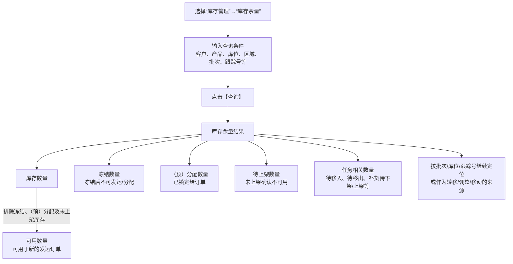

### 操作步骤

1. 进入“库存管理”→“库存余量”。
2. 输入客户、产品、库位、区域、库位组、批次、跟踪号等查询条件，点击【查询】。
3. 按需要切换或使用按批次、按库位、按跟踪号等查询维度，查看库存数量及任务相关数量。
4. 在查询结果中选择库存记录时，可以继续生成库存转移单、库存移动单等后续单据；具体入口在对应图中展开。

### 关键说明

1. 已冻结库存不参与分配；已分配库存不能再次分配或变更库位。
2. 有上架任务但未确认上架的库存，原文明确说明不可用。
3. 任务相关数量用于反映库存正在等待或被某类任务占用，不能在没有查询口径的情况下自行套用统一公式。

### 事实边界

原文没有给出所有任务数量在所有查询视图中的统一汇总公式。本图只呈现原文明确的可用性限制。

## 10.2. 库存事务查询与追溯

### 用途

说明库存发生变化后，产品经理应在哪里查询“谁、何时、因为什么单据、从什么状态变成什么状态”。

### 原文依据

- 10.2 库存事务，原 PDF 第 609—610 页。
- 库存事务记录产品在系统中的所有活动。
- 原文列出事务时间、数量、单证/单证行、事务类型、事务状态、原始信息、目标信息、操作人员、系统用户、原因、任务号和接口标记等内容。

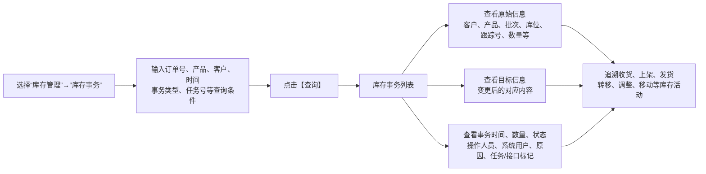

### 操作步骤

1. 进入“库存管理”→“库存事务”。
2. 输入查询条件并点击【查询】。
3. 查看事务的原始信息、目标信息、数量、时间、单证号和操作人员；需要时继续按任务号或接口标记定位。

### 关键说明

1. 纸面作业时，实际操作人员可能与在系统中确认的系统用户不同；两者可以分别记录。
2. 收货取消等反向操作也会形成可查询的库存活动记录。
3. 库存事务可以辅助作业追溯和员工绩效统计，但原文没有在本章规定统一的绩效计算公式。

### 事实边界

不同库存操作产生的字段不一定完全相同。图中“等”表示原文列举范围，不表示每笔事务都必填全部字段。

## 10.3. 库存冻结单：登记、审核、执行与释放

### 用途

呈现冻结单与快捷冻结的区别，并把“已审核才能执行冻结、冻结后不能分配、释放后恢复可用”的动作链画清楚。

### 原文依据

- 10.3 库存冻结单，原 PDF 第 611—615 页。
- 进入“库存管理”→“库存冻结单”→【新增】；表头和明细分别保存。
- 明细可通过 SKU 浏览按钮选择库存记录；表头/明细右键分别提供审核、取消审核、冻结、释放等操作。

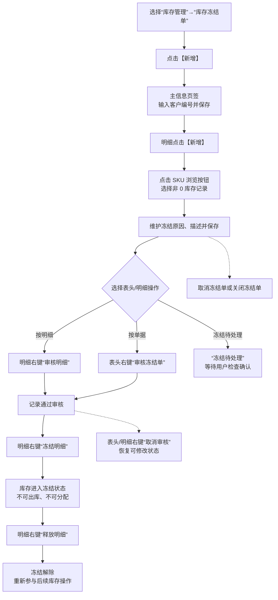

### 操作步骤

1. 进入“库存管理”→“库存冻结单”，点击【新增】，在表头输入客户编号并保存。
2. 在明细点击【新增】，通过 SKU 浏览按钮选择库存记录，维护冻结原因和描述，保存。
3. 选择明细右键“审核明细”，或在表头右键“审核冻结单”。
4. 对已审核记录在明细右键选择“冻结明细”。
5. 原因解决后，在冻结明细右键选择“释放明细”。

### 关键说明

1. 冻结单可以把冻结操作分成登记、审核和执行三个阶段，适合需要分步审核的业务。
2. “取消审核”用于恢复修改；“取消冻结单”不能用于已经操作完成的单据；“关闭冻结单”用于结束单据作业。
3. 冻结后的库存不参与分配，释放后才重新进入可操作范围。

### 事实边界

原文没有给出冻结单各状态的完整状态机。图中只画菜单动作及其明确结果，不推导审核人与执行人的权限关系。

## 10.4. 库存转移单：修改库存信息但不改变总量

### 用途

把库存转移单与库存移动单区分开：转移单主要修改货主、产品、批次等库存信息，库存总量保持不变。

### 原文依据

- 10.4 库存转移单，原 PDF 第 616—622 页。
- 表头【新增】、【保存】；明细通过产品浏览选择库存、输入转移数量和目标信息。
- 表头右键“审核转移单”“取消审核”“执行转移”等，明细右键“执行转移”“计算目标库位”“复制指定内容到明细行”。

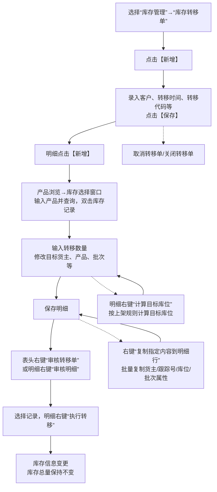

### 操作步骤

1. 进入“库存管理”→“库存转移单”，点击【新增】并保存表头。
2. 明细点击【新增】，在库存选择窗口输入产品并查询，双击选择库存记录。
3. 在转移信息中输入影响数量，维护目标货主、产品、批次等信息，保存明细。
4. 审核单据后，选择明细并右键“执行转移”。
5. 目标库位需要按规则计算时，使用明细右键“计算目标库位”；多行相同内容可以使用复制功能。

### 关键说明

1. 转移可以只影响一条库存记录的一部分数量，其余库存信息保持不变。
2. 系统也支持从库存余量查询结果右键“生成库存转移单”，生成后仍按上述流程处理。
3. 业务如果还要改变实际储位，应使用库存移动单或库存移动功能，不要把“转移信息”和“储位移动”混为一谈。

### 事实边界

原文将转移单的目标信息范围列为货主、产品、批次等字段，但没有规定每种转移类型必须修改哪些字段。图中不补充强制字段组合。

## 10.5. 库存调整单：修改数量与增加新库存

### 用途

说明调整单适合需要登记、审核的库存数量修正，并保留“已有库存调整”和“从 0 库存增加”两个分支。

### 原文依据

- 10.5 库存调整单，原 PDF 第 623—628 页。
- 表头/明细均通过【新增】、【保存】维护；审核后明细右键“执行调整”。
- 明细右键“增加新库存”用于原库存已经调整为 0、无法再选择库存记录的情况。

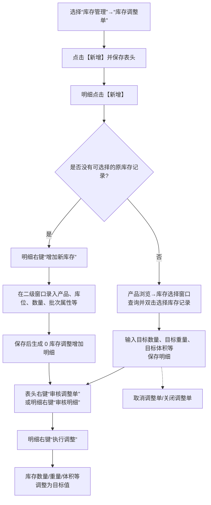

### 操作步骤

1. 进入“库存管理”→“库存调整单”，点击【新增】，录入表头并保存。
2. 明细点击【新增】，通过产品浏览按钮查询并双击选择库存记录。
3. 输入目标数量、目标毛重、目标净重、目标体积等信息，保存。
4. 通过表头右键“审核调整单”或明细右键“审核明细”，再在明细右键“执行调整”。
5. 如果原库存已经是 0，使用明细右键“增加新库存”，在二级窗口录入产品、库位、数量和批次属性，保存后再处理。

### 关键说明

1. 调整单的数量修改在“目标数量”中体现；盘点差异生成调整单时，目标数量为实盘数量。
2. “增加新库存”不是普通调整的另一种快捷按钮，而是针对没有原库存记录可选的特殊入口。
3. 调整单可以打印用于审批或存档；原文没有规定所有仓库必须打印。

### 事实边界

原文没有给出调整单执行后各订单状态的完整更新规则。图中只呈现库存目标值变化，不补充未说明的单据状态。

## 10.6. 库存移动单：目标库位、任务锁定与跨仓

### 用途

把库存移动单的两种执行方式画清楚：直接执行移库，或先生成移库任务交给 RF/作业人员；同时展示跨仓配置限制。

### 原文依据

- 10.6 库存移动单，原 PDF 第 629—633 页。
- 明细通过产品快速检索选择库存，输入目标库位和移动数量。
- 明细右键“执行移库”“计算目标库位”；表头右键“生成移库任务”“取消移库任务”“人员指派”。
- 跨仓移库需要开启 `MOV_BTW_WH`，目标库位必须属于目标仓库；已下达移库任务后不能修改目标仓库。

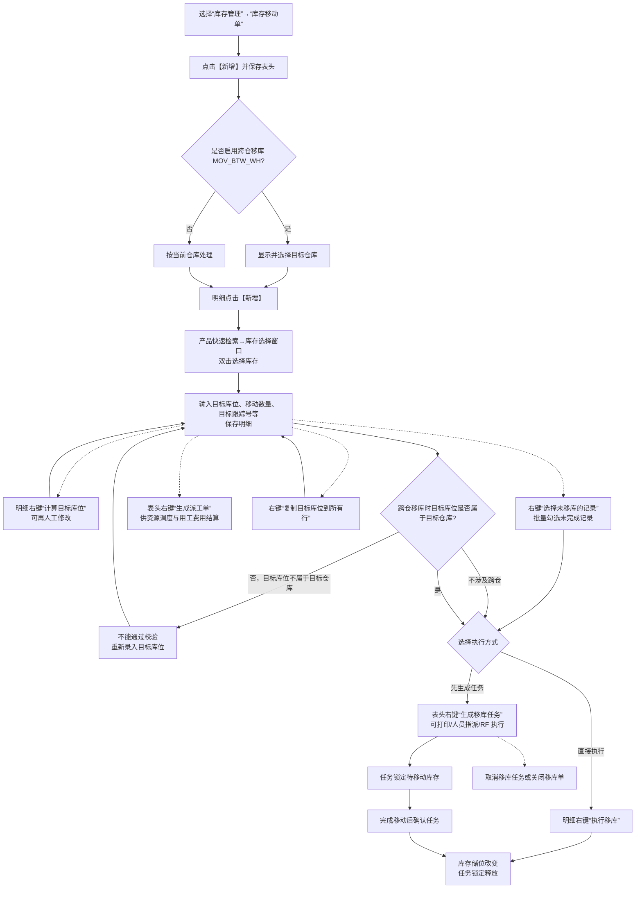

### 事实边界（库存移动单）

- 本图明确表达：库存移动单的目标库位输入、目标库位计算、直接移库或生成任务、跨仓校验和任务锁定入口。
- 原文未说明：部分移动失败、任务确认与事务写入的精确时点，以及取消后库存和任务状态的完整回退组合。
- 不应据此推导：所有移动都必须先生成任务，或库位计算结果不可被人工修改。

## 10.7. 库存盘点：范围、任务、结果和差异

### 用途

把盘点单从创建到关闭的页面操作完整展开，同时保留标准、循环、动态、随机盘点以及有任务/无任务模式的分支。

### 原文依据

- 10.7 库存盘点单，原 PDF 第 634—652 页。
- 进入“库存管理”→“库存盘点单”→【新增】，维护表头和“盘点条件”页签后保存。
- 表头右键包括“盘点预检”“生成盘点任务”“取消盘点任务”“关闭盘点”“指定盘点人”“无差异确认”“生成调整单”“生成盘盈入库单”“生成盘亏出库单”等。
- 明细右键包括“指定复盘”“录入盘点结果”。

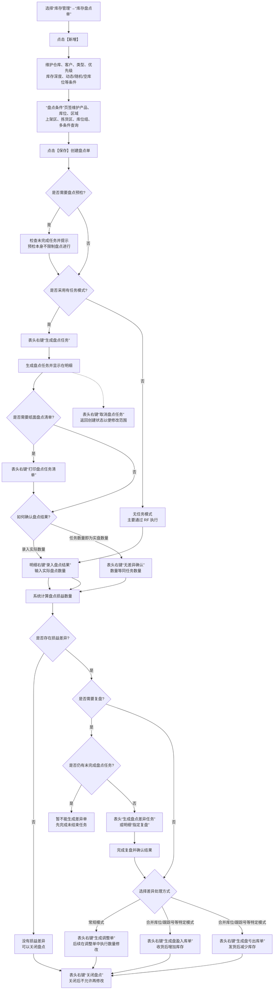

### 操作步骤

1. 进入“库存管理”→“库存盘点单”，点击【新增】，维护盘点类型、优先级、客户、库存深度、动态/随机盘点等条件。
2. 在“盘点条件”页签维护产品、库位、区域、上架区、拣货区、库位组，必要时在多条件查询中输入多个产品、跟踪号或库位。
3. 点击【保存】创建盘点单；表头右键“盘点预检”检查仓库未完成任务，但预检不会阻止盘点。
4. 有任务模式选择“生成盘点任务”，需要纸面操作时再选择“打印盘点任务清单”；无任务模式主要通过 RF 执行。
5. 盘点后在明细右键“录入盘点结果”，输入实际数量，系统计算损益。
6. 有差异时，可以用“生成盘点差异任务”或明细“指定复盘”；确认后根据模式选择“生成调整单”“生成盘盈入库单”或“生成盘亏出库单”。
7. 处理完成后选择“关闭盘点”；如果任务生成后需要修改范围，可先选择“取消盘点任务”。

### 关键说明

1. `BLD_COU=Y` 时打印的盘点单不显示库存数量；`COU_DFT` 可以控制默认盘点数量，盲盘通常需要录入全部数量。
2. 动态盘点按指定时间段内发生过操作的库存生成任务；随机盘点从范围内随机抽取记录。后续结果处理仍沿用盘点骨架。
3. 有未完成盘点任务时，不允许生成差异单；这是为了避免后续结果没有纳入差异处理。
4. 合并库位、跟踪号等盘点模式不能直接生成调整单，原文提供盘盈入库和盘亏出库作为替代方式。

### 事实边界

原文没有规定所有盘点类型都必须复盘，也没有给出盘点单的完整状态迁移表。图中把复盘作为可选分支，把差异处理方式按原文菜单能力列出。

## 10.8—10.11. 快捷库存操作：实时执行与单据操作的边界

### 用途

集中对比“库存冻结/转移/调整/移动”快捷入口与单据入口，帮助学习者理解为什么有时要走单据，有时可以直接点击动作按钮。

### 原文依据

- 10.8—10.11，原 PDF 第 653—659 页。
- 快捷冻结：查询库存后点击【冻结】；释放时查询冻结记录后点击【释放】。
- 快捷转移：查询库存、选择记录、维护转移信息后点击【转移】。
- 快捷调整：查询库存、维护目标数量等后点击【调整】。
- 快捷移动：查询库存、人工指定目标库位后点击【移动】；可移动数量默认为库存减去分配、冻结和其他任务数量。

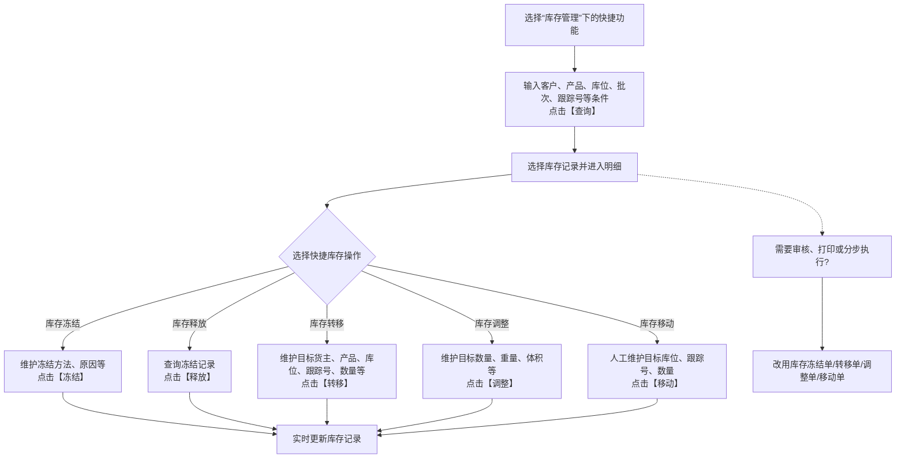

### 操作步骤

1. 在“库存冻结”“库存转移”“库存调整”或“库存移动”功能中输入查询条件，点击【查询】。
2. 选择库存记录，进入对应明细页面。
3. 录入冻结、转移、调整或移动信息，分别点击【冻结】、【释放】、【转移】、【调整】或【移动】。
4. 如果需要审核、打印、人员指派或分步执行，改用对应的冻结单、转移单、调整单或移动单。

### 关键说明

1. 快捷功能是实时操作，不提供单据流程中的完整登记、审核和关闭链路。
2. 快捷库存移动不能进行库位规划建议，目标库位需要人工指定；可移动数量默认扣除库存中的分配、冻结和其他任务数量。
3. 快捷库存转移可以同时变更货主、产品、库位、跟踪号和数量，并可记录损益数量；这些字段是否使用取决于现场操作。

### 事实边界

原文只说明快捷操作与单据操作的功能差异，没有规定所有现场都必须使用某一种方式。图中将“需要审核等”标为选择，不作为强制业务规则。

## 10.13. ABC 动态分析：等级调整与库存整理

### 用途

补齐本章最后一节，区分“更新产品的循环级别”和“实际移动库存到匹配库位”这两个不同动作。

### 原文依据

- 10.13 ABC 动态分析，原 PDF 第 663—664 页。
- 原文明确：使用前先在“循环级别”中配置按排名或百分比的等级；ABC 分析本身不更新库存对应库位。

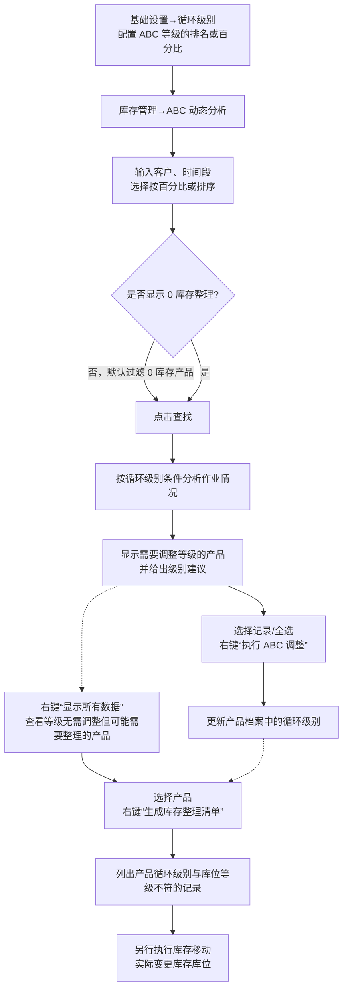

### 关键说明

1. 分析条件包括客户、时间段以及按百分比或排序的方式；默认过滤库存为 0 的产品，可勾选“显示 0 库存整理”。
2. “执行 ABC 调整”更新的是产品档案循环级别；“生成库存整理清单”查找的是产品等级与库位等级不符的库存记录。
3. ABC 分析不会直接移动库存，库位变更还要另行执行库存移动。
4. “显示差异数据”只显示需要调整等级的记录；“显示所有数据”用于同时查看等级无需更新但可能需要整理的产品。

### 事实边界

原文以一段时间内的作业情况为分析基础，但没有在本节规定统一统计字段、移动任务的生成方式或整理完成后的自动复算逻辑；图中不补充这些内容。

## 10.12. 库存扫描作业

> 用途：补齐在库库存扫描、整理装箱、生成移库/转移单和序列号在库校验的操作关系。
>
> 原文依据：`../01-按章节拆分的md文件（1119页版本）/10-库存管理.md`；原 PDF 第 660—663 页。

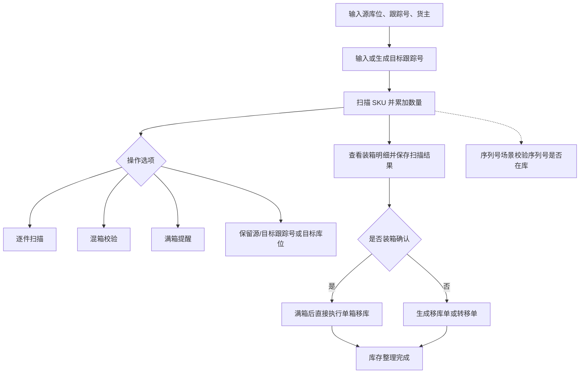

### 关键说明

1. 库存扫描作业面向已经在库的库存；扫描完成后可以形成新的箱/跟踪号并生成移库单或转移单。
2. 勾选“装箱确认”时，满箱后直接执行单箱移库，原文说明此模式下“生成转移单”“生成移库单”按钮不可用。
3. 混箱校验可以不校验、不允许混 SKU，或按产品组 1 控制混箱；这是作业选项，不是所有仓库的默认限制。

### 事实边界

原文没有说明扫描保存失败、移库单后续审核以及装箱标签打印的统一状态流转；图中不补充这些步骤。

## 10.14—10.16. 库存对账与图形化库存

> 用途：把跨系统库存对账、2D 多级查看和 3D 建模查询放在同一张支撑关系图中，突出它们对库存数据的不同消费方式。
>
> 原文依据：`../01-按章节拆分的md文件（1119页版本）/10-库存管理.md`；原 PDF 第 666—673 页。

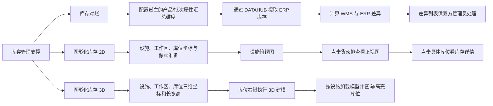

### 关键说明

1. 库存对账在作业结束后的时点提取 ERP 库存，再按规则汇总 WMS 库存并计算差异；两系统暂时处理不同步也可能造成差异。
2. 2D 使用设施、工作区及相对坐标展示“俯视图→货架正视图→库位详情”三级视图。
3. 3D 需要按实际物理位置配置坐标和尺寸，并先建模；原文说明同一库位不支持同时使用 2D 和 3D 模式。

### 事实边界

原文没有说明 DATAHUB 的接口字段、差异自动修复机制或 2D/3D 查询的统一性能策略；图中不把差异计算画成自动调整库存。
